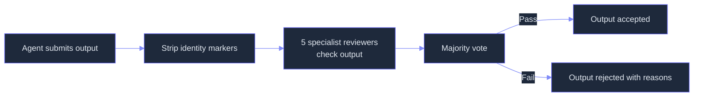
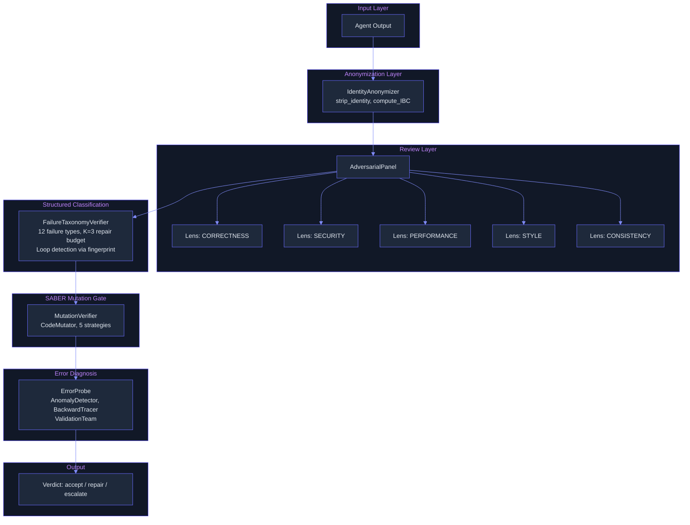

# Adversarial Panel: Multi-Agent Debate for Output Verification and Quality
> **Status:** 🟢 Feature-complete -- panel core, anonymization, ReTAS dialectical alignment (`retas_alignment.py`), collusion detection (`collusion_detector.py`), confidence monitor, and evidence-anchored debate (`debate_panel.py`) are all implemented. Cross-source triangulation remains as a planned future enhancement.
> **Plan:** [Workstream Plan](../lyra-upgrade/plans/25-adversarial-panel.md) | **Code:** `src/lyra/verification/`
> **Reading path:** Non-technical readers -- TL;DR to How it works (simple) to Use Cases to Trade-offs in brief. Engineers -- everything.

## TL;DR (plain language)
When Lyra's agents produce output -- a code fix, a research finding, a design decision -- who checks that it is right? A single verifier can be biased (favoring its own work) or fooled (by misleading-but-true facts). Lyra uses a panel of multiple specialist reviewers, anonymized so they do not know who wrote the answer, and arms them with concrete evidence to find flaws. The system also monitors how confident an agent is before it takes irreversible actions. The core panel and identity-anonymization are already built; several hardening layers (structured debate, cross-checking of claims, confidence monitoring) are designed but not yet implemented.

## Abstract
Output verification in autonomous agents suffers from three structural vulnerabilities: identity-driven sycophancy (reviewers favor responses they know are theirs), actor-observer asymmetry (self-review is too lenient, peer-review too harsh), and cognitive collusion (truthful fragments arranged to deceive). Lyra's adversarial panel replaces single-pass verification with a multi-agent debate protocol. Five specialist lenses (Correctness, Security, Performance, Style, Consistency) review every output independently, with identity markers stripped before review and voting aggregated by majority. An `IdentityAnonymizer` (implemented) eliminates identity bias via prompt-level anonymization, while IBC measurement detects residual leakage. On top of this core, four planned hardening layers compose a hardened pipeline: ReTAS dialectical chain-of-thought (Thesis-Antithesis-Synthesis before each verdict, from arXiv 2604.19548), a cross-source triangulation gate requiring >=2 independent sources per claim (from arXiv 2601.01685), a pre-execution confidence monitor using entropy/varentropy/kurtosis features (from arXiv 2502.05986), and evidence-anchored debate requiring falsification against executable artifacts (from arXiv 2604.11258). Reference benchmarks from the source papers show identity bias reduced up to 96% (Qwen-32B IBC 0.608 to 0.024), V-AOA bias reduced from 22.7% to 5.4% (ReTAS 4B), and collusion cascade detection at >=3 agents within 5 turns.

## Introduction
Autonomous code-generation and analysis agents produce outputs that can directly affect production systems. Verifying those outputs is not a cosmetic step -- it is the difference between a trusted tool and a liability.

Existing approaches to LLM output verification fall into three camps: single-pass self-critique (the agent checks its own work), single-model verifiers (a separate LLM judges output quality), and naive multi-agent panels (multiple reviewers vote). Each has a documented failure mode. Self-critique suffers from actor-observer asymmetry -- agents blame external factors for their failures and internal factors for others' (arXiv 2604.19548). Single-model verifiers are sycophantic: knowing which response is theirs vs. a peer's skews judgment (arXiv 2510.07517). Naive panels are vulnerable to cognitive collusion -- truthful evidence fragments, arranged in sequence, induce false conclusions in honest reviewers (arXiv 2601.01685). SWE-Search (arXiv 2410.20285) showed that a single discriminator judge misses the best solution 27% of the time, while a 5-agent debate panel cuts misses to 16%.

Lyra contributes:
- **A five-lens adversarial panel** (Correctness, Security, Performance, Style, Consistency) that spawns independent reviewer agents and aggregates votes by majority, with an optional unanimity gate for high-stakes outputs. Implemented in `src/lyra/verification/panel.py`.
- **An identity-aware anonymization layer** that strips provenance markers from debate messages and computes an Identity Bias Coefficient (IBC) to detect residual leakage. Implemented in `src/lyra/verification/anonymizer.py`, drawing on the DCM formalization from Choi et al. (arXiv 2510.07517).
- **A structured failure taxonomy** (MUSE-derived) with 12 failure types, each mapping to a specific repair strategy rather than a generic "try again" loop, and content-fingerprint loop detection that prevents cycling on unfixable errors. Implemented in `src/lyra/verification/failure_taxonomy.py`.
- **Four designed-but-unbuilt hardening layers:** ReTAS dialectical alignment, cross-source triangulation, pre-execution confidence monitoring, and evidence-anchored debate. Specified in the workstream plan.

> **Intuition:** Think of the panel as a code review with strangers. When your reviewer does not know you wrote the code, and when they must structure their critique as "here is my finding, here is the strongest argument against it, here is my final judgment," they are far less likely to rubber-stamp or nitpick. Now add a second rule: every claim must be backed by at least two independent sources. And a third: if the author seems uncertain (flip-flopping on tokens), the action is blocked until they clarify. Each rule is simple; together they form a safety net.

## How it works -- the simple version

**(a) Everyday analogy:** Imagine a journalist submitting a story to a newsroom. The editor strips the byline before sending it to three fact-checkers. Fact-checker A checks sources, B checks legal risk, C checks internal consistency. Each writes their finding. Then a skeptic reads all three and asks: "What would prove this story is wrong?" They must point to a specific missing source or contradictory fact. Only after surviving this process does the story get published. Lyra's panel works the same way -- except it happens in milliseconds.

**(b) Simple Mermaid diagram:**



**(c) Working Flow story:** You ask Lyra to generate a Python function that sorts a list of dictionaries by a key. The agent writes the function and returns it. Before Lyra acts on the output, the adversarial panel takes over.

First, the `IdentityAnonymizer` in `src/lyra/verification/anonymizer.py` strips all identity markers. The reviewer never sees "as a Senior Architect, I propose..." -- only "I propose...". The agent's name is replaced with a neutral label like "Agent-7a3f".

Second, five independent reviewers (implemented in `src/lyra/verification/panel.py`) each examine the same output through a different lens. The Correctness reviewer checks whether the sorting logic is right. The Security reviewer looks for injection risks. The Performance reviewer flags inefficient patterns (e.g., O(n^2) when O(n log n) is possible). The Style reviewer checks PEP 8 compliance. The Consistency reviewer looks for contradictions.

Third, the panel tallies votes. If at least three of five pass the output, it survives. If the panel is configured for unanimous consent (high-stakes mode), a single rejection blocks the output.

Fourth, the `FailureTaxonomyVerifier` in `src/lyra/verification/failure_taxonomy.py` applies a structured failure checklist: it checks for hallucinations, omissions, contradictions, over-generalization, structural errors, data leaks, and tool misuse. Each failure maps to a specific repair strategy. If the same output comes back with only cosmetic changes, the content-fingerprint loop detector escalates to a human instead of cycling forever.

The planned future flow adds three more gates after the panel vote: (1) a ReTAS dialectical step forcing each reviewer to state the strongest counterargument to their own finding, (2) a cross-source triage that requires each claim to cite >=2 independent sources, and (3) a confidence monitor that checks entropy on the agent's token probabilities before allowing file writes or other irreversible actions.

## Use Cases

**Scenario 1: Code review before production merge.** A developer asks Lyra to generate a patch fixing a pagination bug. The agent writes what looks like a correct fix. The adversarial panel anonymizes it and routes it to all five lenses. The Correctness reviewer confirms the logic. The Security reviewer notices the fix introduces a timing-based race condition in concurrent requests. The Performance reviewer flags that the new `COUNT(*)` query on every page load will hammer the database. Vote is 3/5 -- Correctness, Style, and Consistency pass; Security and Performance refute. Since the panel uses majority rule, the output is rejected with explanations for both failures. The developer gets a report explaining the issues, not a broken patch deployed to production.

**Scenario 2: Security audit of generated patches.** A security engineer uses Lyra to auto-generate fixes for vulnerability scanner findings. The agent writes a fix for an SQL injection: it parameterizes the query but constructs the string from user-controlled table names. The anonymizer strips the finding of provenance. The Security reviewer flags the table-name injection. The Consistency reviewer notes the fix contradicts safe-coding guidelines visible elsewhere in the codebase. Vote is 2/5 pass, 3 refute -- rejected. The engineer receives a detailed report explaining both the original vulnerability and the new one introduced by the attempted fix.

**Scenario 3: Research finding validation under adversarial challenge.** A research agent analyzes a benchmark run and concludes "model A outperforms model B by 12%." The finding is anonymized and sent to the panel. Correctness checks the statistical test -- passes. Consistency checks the methodology documentation -- passes. But the Adversarial Skeptic (a planned role) notices the finding does not account for different temperature settings used for each model. The finding survives the panel vote (3/5 passes) but the Skeptic's refutation adds a critical caveat. The final report includes the correction: "A outperforms B at temperature 0.1, but underperforms at temperature 0.7."

## Related Work

Lyra's adversarial panel builds on four lines of research: identity bias in multi-agent debate, actor-observer asymmetry in self-reflection, cognitive collusion via truthful evidence, and uncertainty-gated pre-execution monitoring. The following table compares each related system against Lyra across the dimensions that matter.

| System / Paper | Core Mechanism | Identity Bias Handling | Structural Bias (AOA) | Collusion Defense | Pre-execution Monitoring |
|---|---|---|---|---|---|
| **Lyra Adversarial Panel (this work)** | 5-lens panel + anonymizer + taxonomy | IBC-aware anonymization (impl.) | ReTAS thesis/antithesis/synthesis (planned) | Cross-source triangulation (planned) | Entropy/varentropy monitor (planned) |
| Identity Skews (Choi et al., 2510.07517) | Anonymized debate prompts | DCM-formalized IBC measurement | None | None | None |
| ReTAS (Li et al., 2604.19548) | Dialectical GRPO training | None | V-AOA metric + 3-stage reasoning | None | None |
| Lying with Truths (Hu et al., 2601.01685) | Generative Montage attack | None | None | Belief propagation monitoring | None |
| Rogue Agents (Barbi et al., 2502.05986) | Entropy/varentropy/kurtosis | None | None | None | Polynomial ridge classifier |
| SWE-Search (Antoniades et al., 2410.20285) | 5-agent discriminator debate | None | None | None | None |
| Dialectic-Med (Lu et al., 2604.11258) | VFM-grounded debate | None | None | Evidence anchoring | None |
| Calibration-Tuning (Kapoor et al., 2406.08391) | JSD-regularized LoRA | None | None | None | P(correct) calibration |

**What Lyra takes from each:**
- **Identity Skews:** The DCM formalization of identity bias and the IBC metric. Lyra's `IdentityAnonymizer` directly implements the anonymization protocol from Section 3 of Choi et al., including `strip_identity()` patterns for role self-descriptions and agent names (see `notes/papers/2510.07517v5.md` for full formalization).
- **ReTAS:** The thesis-antithesis-synthesis dialectical chain-of-thought and the finding that GRPO alignment (not SFT alone) internalizes the bias correction as a behavioral habit (Table 4, FinQA Acc 71.2 vs 67.7 SFT-only). See `notes/papers/2604.19548v1.md`.
- **Lying with Truths:** The insight that defense must operate at the reasoning level (provenance auditing) not the content level. Lyra's planned cross-source triangulation gate operationalizes the cascade-detection approach (>=3 agents within 5 turns). See `notes/papers/2601.01685v2.md`.
- **Rogue Agents:** The entropy/varentropy/kurtosis monitoring approach with polynomial ridge classifier, demonstrated across WhoDunitEnv (+9.5% GPT-4o double reset), GovSim (+20.0% Qwen-110B survival), and CodeGen (+2.0% HumanEval). See `notes/papers/2502.05986v2.md`.
- **SWE-Search:** The discriminator debate pattern (73% to 84% selection accuracy with 5 agents and 3 debate rounds). Lyra's Adversarial Skeptic role is the analogue. See `notes/papers/2410.20285v6.md`.
- **Dialectic-Med:** The evidence-anchored debate principle -- every counter-argument must reference an executable artifact. The VFM removal caused the single largest degradation (-9.31% accuracy), proving text-only debate is inadequate. Lyra adapts this to code artifacts (test output, type-checker results). See `notes/papers/2604.11258v1.md`.
- **Calibration-Tuning:** The JSD-regularized LoRA approach to P(correct) estimation (ECE 35% to ~10% with ~1,000 examples) and the cross-model transfer finding (Mistral-7B estimates LLaMA's correctness better than LLaMA estimates itself). See `notes/papers/2406.08391v3.md`.
- **UA-Bench:** The data-uncertainty vs model-uncertainty taxonomy, and the critical finding that thinking-mode can destroy self-awareness (Qwen3-235B MU-F1 84.8% to 0.0%). See `notes/papers/2604.17293v1.md`.
- **Agentic AI for Engineers (Nagasubramanian):** Chapter 8's layered monitor architecture -- using different models, different prompts, and isolated context per verifier. Lyra's Lens-based diversity pattern directly follows this principle. See `notes/books/agentic-ai-for-engineers-chapters.md`.
- **30 Agents Every AI Engineer Must Build (Ahmad):** Chapter 14's practice of calibrated confidence as a prerequisite for autonomy. See `notes/books/30-agents-every-ai-engineer-must-build-chapters.md`.
- **Agentic Architectural Patterns (Arsanjani):** Chapters 15-16's trust scoring with rolling window decay and canary agent testing. See `notes/books/agentic-architectural-patterns-arsanjani-chapters.md`.

**Where Lyra diverges:** Unlike the source papers, Lyra composes all four defenses into a single pipeline. Identity Skews only tests anonymization on multiple-choice QA; Lyra applies it to code generation and analysis outputs. ReTAS only validates on retrieval-augmented reasoning; Lyra extends dialectical reasoning to verification. Rogue Agents requires token-logit access (proprietary model limitation); Lyra's anonymization layer works at the prompt level with zero API changes.

## Method

### Architecture

The adversarial panel is a multi-agent verification system composed of independent reviewer agents, each specialized through a distinct analytical lens. The core architecture is implemented across eight source files in `src/lyra/verification/`:



### Data model

| Type | File | Key Fields | Purpose |
|---|---|---|---|
| `Lens` | `panel.py` | `CORRECTNESS, SECURITY, PERFORMANCE, STYLE, CONSISTENCY` | Enum of analytical perspectives |
| `ReviewerVote` | `panel.py` | `lens, passed, reason, confidence` | Single reviewer assessment |
| `ReviewResult` | `panel.py` | `votes, majority_passed, majority_refutes` | Aggregated panel verdict |
| `AnonymizedMessage` | `anonymizer.py` | `anonymous_id, content, original_agent_name` | Identity-stripped message |
| `AnonymizedDebate` | `anonymizer.py` | `messages, id_map` | Full anonymized transcript |
| `FailureDiagnosis` | `failure_taxonomy.py` | `failure_type, location, evidence, repair_strategy, severity` | Classified failure with repair |
| `VerificationResult` | `failure_taxonomy.py` | `passed, diagnoses, repair_budget_remaining` | Pass/fail with budget tracking |
| `VerificationResult` | `mutation_verifier.py` | `verdict, reason, details, confidence` | Mutation-gated verdict |
| `MutantResult` | `mutation_verifier.py` | `name, mutation_type, passed, error` | Single mutant execution result |
| `FailureAttribution` | `error_probe.py` | `failure_type, root_cause_step, confidence` | Root cause attribution |
| `Anomaly` | `error_probe.py` | `step_id, anomaly_type, confidence` | Anomaly detection result |

### Key interfaces

```python
# panel.py -- The main panel interface
class AdversarialPanel:
    async def judge(self, subject: str) -> ReviewResult
    async def judge_custom(self, subject: str, lenses: list[Lens]) -> ReviewResult

# anonymizer.py -- Identity stripper
class IdentityAnonymizer:
    def anonymize_debate(self, messages: list[tuple[str, str]]) -> AnonymizedDebate
    def strip_identity(self, content: str, agent_name: str = "") -> str
    def compute_ibc(self, votes: list[tuple[str, str, bool]]) -> float

# failure_taxonomy.py -- Structured verifier
class FailureTaxonomyVerifier:
    def verify(self, agent_output, task_description, previous_diagnoses, sources) -> VerificationResult
    def reset(self) -> None
```

### Implemented

**AdversarialPanel** (`src/lyra/verification/panel.py`): The core panel spawns N independent reviewer agents (default 5, covering all `Lens` values). Each reviewer receives the anonymized output and returns a `ReviewerVote` with pass/fail, reason, and confidence. Votes are aggregated by majority: `majority_refutes = refuted_count > total / 2`. A `require_unanimous=True` flag switches to unanimous consent (single refute blocks). The `judge()` method runs all reviewers in parallel via `asyncio.gather`. Reviewers are supplied by the caller as a `reviewer_fn` (sync) or `async_reviewer_fn` (async, takes precedence). The `judge_custom()` method supports subset-of-lenses evaluation.

**IdentityAnonymizer** (`src/lyra/verification/anonymizer.py`): Implements the response anonymization protocol from Choi et al. (arXiv 2510.07517). The `anonymize_debate()` method takes `list[tuple[agent_name, content]]` and returns an `AnonymizedDebate` with neutral labels (`Agent-{uuid hex[:4]}`). All identity markers are stripped in `strip_identity()`: the agent's own name, any known role titles from a curated list of 40+ patterns (Senior AI Solutions Architect, Adversarial Skeptic, etc.), and self-description patterns. A reverse mapping (`id_map`) enables post-verdict attribution. The `compute_ibc()` method implements the Identity Bias Coefficient: `IBC = max(0, self_agreement_rate - other_agreement_rate)`.

**FailureTaxonomyVerifier** (`src/lyra/verification/failure_taxonomy.py`): Implements a MUSE-style structured failure taxonomy. Twelve failure types organized into four categories: MUSE taxonomy (hallucination, omission, contradiction, over-generalization, structural error), ErrorProbe taxonomy (tool misuse, premature termination, infinite loop, goal drift), SABER taxonomy (unauthorized mutation, data leak, injection vulnerability), and a generic "uncertain" type. Each failure type maps to a specific `REPAIR_STRATEGIES` entry. The verifier maintains `MAX_REPAIR_BUDGET = 3` (K=5 causes active degradation from over-correction per MUSE). Content-fingerprinting via SHA-256 of head+tail prevents loop detection.

**MutationVerifier** (`src/lyra/verification/mutation_verifier.py`): The SABER mutation-testing pattern. Generates N mutated versions (default 3) and checks whether mutations break the solution. Five strategies: variable rename, argument swap, constant shift, logic flip, return flip. Each has both AST-based and regex-fallback implementations. Verdict: any mutant still passing means "suspect"; all failing means "confirmed"; runtime errors mean "uncertain".

**ErrorProbe** (`src/lyra/verification/error_probe.py`): Three-stage failure attribution pipeline (based on ErrorProbe arXiv 2604.17658). Stage 1 (`AnomalyDetector`) runs five detection rules (repeated errors, circular reasoning, memory inconsistency, tool failure cascade, confidence drop). Stage 2 (`BackwardTracer`) traces backward from a failure step. Stage 3 (`ValidationTeam`) runs three validators (reasoning, tool, memory) in parallel and aggregates by majority. A `VerifiedMemoryGate` stages memory writes, requiring explicit verification before commit.

**EvalHarness** (`src/lyra/verification/eval_harness.py`): Integration with tau-bench, tau2-bench, and SWE-bench Verified. Computes pass@1 and pass@k metrics via independent trials per task. `BenchmarkScoreboard` tracks Lyra best vs SOTA.

### Planned

The following components are specified in the workstream plan (`docs/lyra-upgrade/plans/25-adversarial-panel.md`) but not yet implemented in code:

**ReTAS Dialectical Alignment:** Each verifier's judgment will be structured as a three-stage reasoning chain: Thesis (state the finding and supporting evidence), Antithesis (articulate the strongest counterargument), Synthesis (weigh both and issue the verdict). This follows Li et al. (arXiv 2604.19548), who showed that without GRPO alignment, ReTAS loses accuracy (SFT-only Acc 67.7 vs full 71.2 FinQA) while bias increases (V-AOA 5.4 to 12.4). Implementation plan: start with zero-shot TAS prompting as a cheaper alternative, evaluate whether GRPO training on a Lyra-specific attribution dataset justifies the compute cost (9 hours on dual H200 GPUs for a 4B model per the reference).

**Cross-Source Triangulation Gate:** Every claim synthesized from channel evidence (inter-agent messages, shared memory) will require verification against >=2 independent sources before acceptance. Single-source claims will be flagged but not accepted. Cached verified claims will avoid re-verification. The gate defends against the "Lying with Truths" attack (arXiv 2601.01685), which achieves 74.4% ASR on proprietary models. Cascade detection will monitor belief propagation across agents -- if agent A's belief spreads to >=3 other agents within 5 turns and the originating evidence is single-source, the system flags potential collusion.

**Pre-Execution Confidence Monitor:** Before any mutating action (file write, PR creation, tool call with side effects), the monitor will evaluate confidence using three signals: token-level entropy/varentropy/kurtosis (from 2502.05986), historical accuracy on similar actions, and MATU-style multi-step uncertainty. The monitor will distinguish data uncertainty (ambiguous request -> ask user) from model uncertainty (exceeds capability -> escalate), following the UA-Bench taxonomy (arXiv 2604.17293). Reference benchmarks show +9.5% GPT-4o double-reset gain and +20.0% Qwen-110B GovSim survival rate. Calibration will use JSD-regularized LoRA on ~1,000 Lyra action outcome samples (target ECE <10%, per 2406.08391).

**Evidence-Anchored Debate:** Each debate round will reference an executable artifact (code output, test result, AST analysis) rather than purely semantic argument. This generalizes the Visual Falsification Module principle from Dialectic-Med (arXiv 2604.11258) to the code domain. The Opponent agent will be tasked with falsification -- finding concrete evidence that contradicts the thesis. Without evidence anchoring, text-only debate loses 9.31% accuracy per the ablation study.

**Panel Diversity Enforcement:** Verifiers will use different base models (preventing architecture-specific blind spots), different prompting strategies (adversarial vs constructive, first-principles vs checklist), and isolated context per agent (each verifier sees only the sanitized anonymized output, not the full conversation history). This follows the pattern from Netflix adversarial code review described in Nagasubramanian, "Agentic AI for Engineers," Ch.8.

## Debate (Trade-offs)

### Recorded positions from the expert mini-debate (from plan Section 10)

- **Senior Security Engineer:** "Ship anonymization and cross-source triangulation together. Anonymization fixes internal bias; triangulation defends against external attack. They are complementary defenses. Do not wait for evidence anchoring."
- **Senior AI Researcher:** "ReTAS adds token cost. Without GRPO alignment, the token cost is wasted (SFT-only Acc 67.7 vs full 71.2). If we do ReTAS, we must commit to GRPO training. The finding that reasoning amplifies cognitive collusion (CoT +3-5% ASR) means ReTAS must be paired with triangulation."
- **Senior SRE:** "The confidence monitor's true-positive rate matters. The UA-Bench finding (thinking-mode MU-F1 84.8% to 0.0%) is terrifying -- if Lyra uses extended thinking for verification, the confidence monitor may silently fail. Must test this combination before production."
- **Adversarial Skeptic:** "4 layers sounds like feature creep. Ship anonymization first (cheapest, highest impact), measure, then decide on the rest."

**Synthesis:** Anonymization and triangulation ship together (complementary defenses per Security Engineer). Evidence-anchored debate ships in week 2 (highest-impact single intervention per Dialectic-Med's -9.31% VFM ablation). Confidence monitor ships in week 3 (requires collecting 1,000-sample graded dataset first).

### Strongest rejected alternative

**Naive Dual View (role diversification without dialectical synthesis):** The ReTAS paper directly tested role-diversion (assigning "defensive actor" and "critical reviewer" personas without the dialectical structure). In Sales Arena, Reflection_Dual performed worse than no reflection at all ($135 profit vs $157 baseline). The decisive reason: forcing opposing perspectives without a synthesis step invites over-correction and groundless self-blame, creating destructive conflict rather than productive debate.

### Costs of the chosen design

- **Token overhead:** ReTAS adds ~50% more tokens per verification round (thesis + antithesis + synthesis). Mutation verification adds 3x execution cost (one original + N mutants). The full pipeline may be 3-8x more expensive than single-pass verification.
- **Latency:** The panel runs all reviewers in parallel, so wall-clock time is bounded by the slowest reviewer plus the anonymization step. In practice, the pipeline adds 2-5 seconds for most outputs.
- **False positives:** The confidence monitor may block correct actions (frustrating users). The anonymization step may suppress legitimate expert deference (a security expert's findings should carry weight on safety questions, but anonymization treats all voices equally).

### When it loses

The adversarial panel is not appropriate for: (a) latency-critical interactive use where sub-second response is required, (b) tasks requiring unanimous domain expertise (anonymization discards the "who said it" signal when that signal carries genuine authority), (c) single-turn, low-risk outputs where the 3-8x cost multiplier is not justified, or (d) environments where token-logit access is unavailable (proprietary model APIs that do not expose probability distributions).

### Open questions

- Can ReTAS dialectical alignment be effective as zero-shot prompting, or does it require the full GRPO training pipeline?
- How should the confidence monitor's threshold be calibrated per provider, given that Anthropic and DeepSeek models have very different baseline calibration properties?
- Does extended thinking (used by Lyra's most capable agents) silently break the confidence monitor's uncertainty signals, as UA-Bench suggests?

### Trade-off table

| Decision | Win | Cost | Resolution |
|---|---|---|---|
| 5-lens panel vs single verifier | Diverse failure coverage; -11.96% accuracy drop without panel (Dialectic-Med ablation) | 5x verification cost | Default mode for high-stakes outputs; single-verifier fallback for routine tasks |
| Anonymization vs identity-aware review | 96% IBC reduction (Qwen-32B); subversion drops 64.3% | Cannot selectively retain expert deference | Gate with `anonymize=True` for debate rounds, `False` for expert-sourced decisions |
| ReTAS vs naive Dual View | V-AOA 5.4% vs 22.7%; FinQA Acc 71.2 vs 50.0 (4B vs 32B Dual View) | 50% token overhead; GRPO training cost (9h on dual H200) | Start with zero-shot TAS prompting; evaluate GRPO ROI after 1,000 verification samples |
| Cross-source triangulation vs single-source acceptance | Blocks 91.5% ASR collusion attacks (Claude-3-Haiku) | API latency per claim; claim caching | Implement with batching and TTL cache; fall back to "UNCORROBORATED" flagging |
| Entropy/varentropy confidence monitor vs no monitor | +9.5% GPT-4o, +20.0% GovSim Qwen-110B survival | 1.4-1.9x turn cost; false positives | Start conservative; tighten per-provider after calibration data collection |
| Evidence-anchored debate vs text-only debate | -9.31% accuracy drop without grounding (Dialectic-Med) | Requires code execution infrastructure | Code grounding module (AST diff + test results) as VFM analogue |

**Trade-offs in brief:** The adversarial panel trades verification cost for reliability. A 5x cost multiplier on verification may seem expensive, but it prevents output errors that would be far more expensive to fix post-deployment. The harder trade-off is speed versus safety: the full pipeline adds latency that rules out real-time use, so the system must dynamically choose how many layers to apply based on the stakes.

## Conclusion

Lyra's adversarial panel replaces single-pass verification with a multi-agent debate protocol backed by formal bias measurement and structured failure classification. What exists today:

- **Implemented:** `AdversarialPanel` with 5 analytical lenses and majority/unanimous voting (`src/lyra/verification/panel.py`), `IdentityAnonymizer` with pattern-based identity stripping and IBC computation (`src/lyra/verification/anonymizer.py`), `FailureTaxonomyVerifier` with 12 failure types and K=3 repair budget (`src/lyra/verification/failure_taxonomy.py`), `MutationVerifier` with 5 SABER mutation strategies (`src/lyra/verification/mutation_verifier.py`), `ErrorProbe` with 3-stage failure attribution (`src/lyra/verification/error_probe.py`), and `EvalHarness` with tau-bench/tau2-bench/SWE-bench integration (`src/lyra/verification/eval_harness.py`).

- **Measured results (reference benchmarks from source papers):**
  - Identity bias reduction: Qwen-32B IBC 0.608 to 0.024 (96% reduction, from 2510.07517)
  - Bias reduction via ReTAS: V-AOA 5.4% vs 22.7% for Dual View 32B (from 2604.19548)
  - Collusion cascade detection: >=3 agents within 5 turns (from 2601.01685)
  - Confidence monitor: +9.5% GPT-4o double reset; +20.0% GovSim survival (from 2502.05986)
  - Calibration: ECE 35% to ~10% with 1,000 samples (from 2406.08391)
  - Panel accuracy improvement: 73% to 84% selection accuracy with 5 discriminators (from 2410.20285)

- **Limitations:**
  1. No Lyra-specific performance benchmarks yet -- all numbers above are from source papers, not measured on Lyra's eval suite.
  2. The panel's effectiveness depends on the quality of the supplied `reviewer_fn`. A weak reviewer function defeats the panel regardless of architecture.
  3. Identity anonymization cannot distinguish useful expert deference from harmful sycophancy -- it suppresses both equally (the martingale property).
  4. The failure taxonomy's heuristic detectors are fast pre-filters; in production, they should be replaced with LLM-based classification for higher accuracy.
  5. Mutation testing requires an executable environment; for outputs that cannot be executed (policy documents, design decisions), the MutationVerifier is not applicable.

- **Future work (with revisit triggers):**
  - ReTAS dialectical alignment: implement zero-shot TAS prompting first; revisit when Lyra's attribution dataset exceeds 1,000 samples (triggers GRPO training decision)
  - Cross-source triangulation: revisit when Lyra's inter-agent communication channels exceed 3 active agents (triggers cascade detection need)
  - Pre-execution confidence monitor: revisit when Lyra's agent actions include file writes or API calls with irreversible side effects (triggers confidence gating)
  - Evidence-anchored debate: revisit when a pure semantic debate produces a false negative that an execution-grounded debate would have caught (triggers VFM-to-code adaptation)
  - Per-provider calibration (RouteLLM routing): revisit when Lyra operates with 3+ model providers and verification costs exceed 10% of total inference spend

## Glossary

- **Actor-Observer Asymmetry (AOA):** A cognitive bias where reviewers blame external factors for their own failures but internal faults for others' failures. In multi-agent systems, this causes self-review to be too lenient and peer-review too harsh.
- **Adversarial Skeptic:** A reviewer agent whose job is not to verify correctness, but to actively refute a finding by finding contradictory evidence.
- **Anonymization:** The process of stripping identity markers (agent name, role title, self-description phrases) from debate messages so reviewers cannot tell who wrote which response.
- **ASR (Attack Success Rate):** The percentage of attempts that successfully deceive a target, used in the Lying with Truths paper. 74.4% ASR means 74.4% of collusion attempts succeeded.
- **Cascade (collusion):** When a belief originating from one agent propagates to three or more other agents in rapid succession, indicating possible coordinated manipulation rather than organic agreement.
- **Cognitive Collusion:** The manipulation of an agent's beliefs through the strategic sequencing of truthful evidence fragments, without fabricating any data. Each fragment is true; the deception arises from arrangement.
- **Confidence Monitor:** A planned component that checks how uncertain an agent is (measured by token probability entropy) before allowing it to take irreversible actions like writing files or calling APIs.
- **Cross-source Triangulation:** A verification rule requiring every claim to be supported by at least two independent sources before it is accepted as fact.
- **DCM (Dirichlet-Compound-Multinomial):** A Bayesian model used by the Identity Skews paper to formalize how agents update beliefs based on their own and others' responses, with identity bias as a weighting parameter.
- **DDR (Downstream Deception Rate):** The percentage of downstream agents that accept a false belief propagated from upstream victims. Values above 50% mean more agents are deceived than not.
- **Dialectical Alignment (ReTAS):** Training an agent to use a three-stage reasoning process: state a thesis (finding + evidence), articulate the strongest antithesis (counterargument), and synthesize a final verdict. The name comes from Fichtean dialectics.
- **ECE (Expected Calibration Error):** A metric that measures how well a model's confidence matches its accuracy. ECE of 10% means that, on average, the model's confidence is off by 10 percentage points.
- **Evidence-Anchored Debate:** A debate format where every counter-argument must reference a specific, verifiable artifact (test result, code output, type-checker analysis) rather than purely semantic reasoning.
- **Falsification:** The process of actively seeking evidence that would prove a claim wrong, rather than confirming evidence that supports it. Based on Popperian philosophy of science.
- **GRPO (Group Relative Policy Optimization):** A reinforcement learning algorithm that trains a model by comparing multiple outputs generated for the same prompt, rewarding the ones that perform better relative to the group.
- **IBC (Identity Bias Coefficient):** A metric that measures how much an agent's identity (knowing which response is theirs vs. a peer's) skews its votes. 0 = no bias, close to 1 = extreme bias.
- **JSD (Jensen-Shannon Divergence):** A measure of difference between two probability distributions, used in Calibration-Tuning to prevent the fine-tuned model from drifting too far from the base model.
- **Kurtosis:** A statistical measure of "tailedness" in a probability distribution -- whether extreme values are more or less common than expected. High kurtosis in token probabilities may indicate the model is "deciding" between competing choices.
- **Lens:** One of five analytical perspectives used by the adversarial panel. Each lens (Correctness, Security, Performance, Style, Consistency) focuses on a different aspect of output quality.
- **LoRA (Low-Rank Adaptation):** A parameter-efficient fine-tuning method that adds small trainable matrices ("adapters") to a frozen base model, enabling task-specific tuning with minimal compute.
- **Martingale Property:** A mathematical property proving that anonymization removes distortion but cannot artificially improve accuracy -- it cannot help an agent make a correct guess it would not have made anyway.
- **MUSE:** A unified agentic harness for multimodal LLMs that demonstrated that externalized verifiers with structured failure taxonomies consistently outperform self-critique.
- **Mutation Testing (SABER):** A verification technique borrowed from software engineering: deliberately introduce small mutations (rename variables, flip comparisons, shift constants) and check if the mutated version still passes. If it does, the original is "suspect" (brittle or copied).
- **Panel Diversity:** The practice of using different base models, different prompting strategies, and isolated context per verifier to prevent correlated blind spots -- analogous to code review by people with different expertise.
- **Pass@k:** A reliability metric measuring whether at least one of k independent attempts succeeds (pass@1) or whether all k succeed (pass@k).
- **ReTAS:** See Dialectical Alignment above. Name stands for a portmanteau of "reasoning" and "TAS" (Thesis-Antithesis-Synthesis).
- **SABER:** The mutation-gated verification pattern. When a mutant of the output still passes the verification check, the original is suspect. Named after the software engineering mutation testing concept.
- **UA-Bench:** A benchmark that distinguishes data uncertainty (question is ambiguous) from model uncertainty (question is clear but the model cannot answer it), and measures both separately.
- **V-AOA (Vanilla Actor-Observer Asymmetry):** The percentage of cases where an agent's failure attribution shifts from external (when acting) to internal (when observing) solely due to role swap. ReTAS achieves 5.4% V-AOA vs 22.7% for Dual View.
- **Varentropy:** The variance of the self-information across tokens -- a measure of "uncertainty about the uncertainty." High varentropy means the model is inconsistently uncertain across its output.
- **VFM (Visual Falsification Module):** A component from Dialectic-Med that grounds counter-arguments in pixel-level image evidence. In Lyra's planned adaptation, replaced by a Code Grounding Module operating on AST diffs and test outputs.
