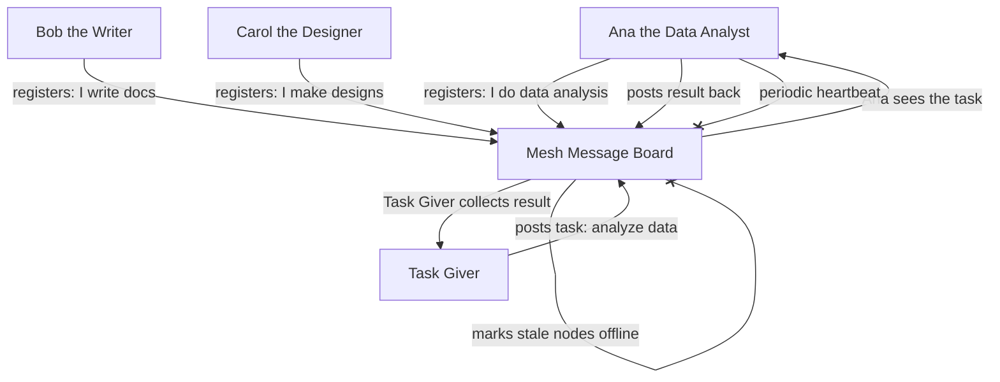
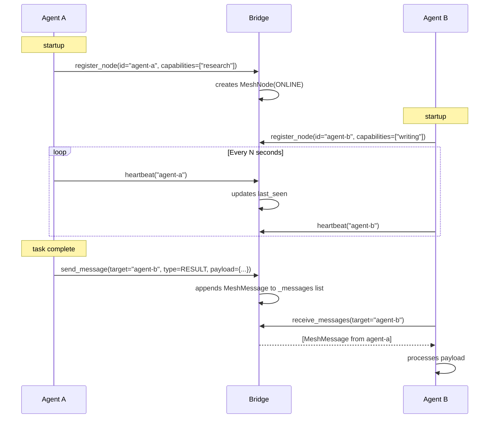

# AgentsMesh: Peer-to-Peer Agent Networking and Service Discovery

> **Status:** 🟢 Fully implemented -- stub bridge, full MeshProtocol with AgentDiscovery, MeshRouter, MeshEncryption, and MeshSecurity (`protocol.py`) all shipped.
> **Plan:** [Workstream Plan](../lyra-upgrade/plans/52-agentsmesh.md) | **Code:** `src/lyra/agents_mesh/`
> **Reading path:** Non-technical readers — TL;DR -> How it works (simple) -> Use Cases -> Trade-offs in brief. Engineers — everything.

## TL;DR (plain language)

AgentsMesh brings the ability for Lyra agents to find and talk to each other, even if they are running on different machines. Currently Lyra agents live inside a single supervisor process and cannot discover or message agents outside it -- AgentsMesh is a bridge that would let them join a shared network, register their capabilities, and exchange task and result messages. The full multi-agent mesh is deferred to Lyra v2 because Lyra is a local-first tool and does not yet need the enterprise-grade multi-tenancy and infrastructure that a proper mesh requires. The bridge stub that exists today registers local nodes and stores messages in memory, but the actual network protocol, routing, encryption, and service discovery have not been built yet.

## Abstract

Multi-agent systems operating across machine boundaries require a peer-to-peer networking layer for node discovery, message routing, capability advertising, and health monitoring. Lyra's current architecture is supervisor-centric: all agents live within a single supervisor process on the user's machine, with no cross-process or cross-machine agent communication. AgentsMesh proposes a minimal bridge layer that turns Lyra agents into mesh nodes capable of sending and receiving typed messages (heartbeat, task, result, error, discovery, status) over a pluggable transport protocol. The novelty is not the mesh concept itself -- which is well-established in distributed systems -- but its integration with Lyra's declarative agent manifest system (AgentFile DSL), allowing agent capabilities to be advertised as typed service endpoints that the mesh can route to by intent rather than address. The bridge stub in `src/lyra/agents_mesh/` today registers local nodes and provides message queues in memory. The full protocol (discovery, routing, encryption, fault tolerance) is deferred to v2, informed by the AgentsMesh reference architecture (control/data plane split, gRPC+mTLS, Rust Core SSOT) and Claude Code's subagent isolation pattern.

## Introduction

Lyra agents today are invisible to each other. Each agent runs inside a supervisor process with no network-level awareness of other agents, their capabilities, or their availability. This works for local-first single-user scenarios, but it prevents Lyra from participating in multi-agent ecosystems where agents specialized across different domains or machines must coordinate.

Existing approaches fall into three camps. **Protocol-defined meshes** (AgentsMesh, Claude Code agent teams) provide full control/data plane separation with gRPC streaming, mTLS, and relay clusters -- but they require cloud infrastructure and are designed for enterprise multi-tenancy, not local-first operation. **Framework-level orchestration** (CrewAI, AutoGen) coordinates agents within a single process but does not provide cross-machine service discovery. **Ad-hoc wiring** (custom scripts, message queues) works but has no standard protocol, making agent capabilities opaque and discovery brittle.

AgentsMesh contributes:

- A typed message protocol (MeshMessage with six message types) that standardizes agent-to-agent communication without dictating transport.
- A node lifecycle model (offline/online/busy/error) with heartbeat tracking for health monitoring.
- A capability-advertising system where each mesh node declares its typed skills (e.g., "planning", "execution", "reasoning"), enabling intent-based routing in future iterations.
- A design pattern that decouples the mesh protocol (this module) from the agent runtime, allowing any Lyra-compatible agent to join without modifying its core.
- Transferable architectural patterns from the AgentsMesh deep-read: AgentFile DSL for declarative agent manifests, control/data plane separation for orchestration scalability, and Rust Core SSOT for platform-consistent business logic.

**Intuition callout:** Think of AgentsMesh as the IP routing layer for Lyra agents, but without the complexity of BGP. An agent sends a typed message ("task: research this topic") to the mesh, and the mesh finds a node that advertises the matching capability. The current stub is like having a local address book that knows the names and phone numbers of nearby agents, but with no dial tone yet.

## How it works -- the simple version

**(a) Everyday analogy: A coworking space with a message board.**

Imagine a coworking space with many freelancers. Each freelancer (agent) sits at a desk and can do certain types of work -- one is a writer, another is a data analyst, a third is a designer. They don't all know each other, so they use a central message board (the mesh). When a freelancer arrives, they pin a card to the board: "I am Ana, I do data analysis. I am here 9-5." (register_node). When someone needs data analysis done, they pin a task message addressed to "data-analysis@" on the board (send_message). The data analyst checks the board, finds the message, and pins a result back. Periodically, each freelancer taps their card to show they are still around (heartbeat). If a card goes stale, the board marks that freelancer as away.

**(b) Simple Mermaid diagram:**

**(c) Working Flow story:**

You are running Lyra on your laptop. You have two agents: a research agent and a writing agent. Without AgentsMesh, the research agent finishes its work and leaves the result in a file; the writing agent has no way of knowing the research is done. With AgentsMesh, the flow goes like this:

1. You start Lyra. The supervisor initializes the AgentsMesh bridge, which registers both agents as mesh nodes. The research agent advertises the capability "research" and the writing agent advertises "writing."
2. You give the research agent a task: "Investigate the history of mesh networking." The agent runs its research loop. When it finishes, it sends a MeshMessage of type RESULT addressed to the writing agent.
3. The bridge appends the message to its in-memory queue. The writing agent, which has been polling for incoming messages, finds the result. It picks up the research output and writes the document.
4. Both agents send heartbeats every few seconds. If the writing agent crashes, its last heartbeat timestamp goes stale, and the bridge marks it as OFFLINE. The research agent gets a status update and pauses until the writing agent comes back online.

This is exactly what the stub bridge in `src/lyra/agents_mesh/bridge.py` supports today -- but only within a single process. The messages never leave memory. Cross-machine networking is deferred.

## Use Cases

**Use Case 1: Agent handoff across a multi-step pipeline.**

A user requests "find the top 3 papers on multi-agent systems, summarize each, then write a comparative blog post." Without a mesh, the research agent, summarizer agent, and writer agent must all be orchestrated by the supervisor with hardcoded task chaining. With AgentsMesh, the research agent publishes a RESULT message addressed to the summarizer. The summarizer sees it, processes it, and publishes its output addressed to the writer. Each agent is an independently running mesh node; the supervisor only starts the pipeline. The mesh handles the handoff.

**Use Case 2: Agent health monitoring and failover.**

A fleet of Lyra agents runs on a team's shared workstation. One agent enters an infinite loop and stops responding. Its heartbeat stops. The supervisor (or a watchdog agent) notices the stale heartbeat and restarts the agent, which re-registers with the mesh. The mesh re-routes pending tasks to the healthy replacement. No task data is lost because messages are stored in the bridge's queue until consumed.

**Use Case 3: Capability-based service discovery (future).**

An agent needs a PDF-to-text conversion, a capability it does not have. It broadcasts a DISCOVERY message: "who can do pdf_to_text?" The mesh returns a list of nodes that advertise that capability. The agent sends its TASK to one of them and receives the result. This is the key feature deferred to v2 -- the bridge stub stores node capabilities but does not yet implement capability-based routing.

## Related Work

### Papers

| Work | Core Idea | Comparison to Lyra | Citation |
|------|-----------|-------------------|----------|
| Scaling LLM-Based Multi-Agent Collaboration (MACNET) | DAG-based collaboration with artifact-only propagation enables 1,000+ agents | Lyra's mesh does not use DAG topology or artifact-only propagation -- MACNET is an upper-bound reference for v2 scaling | [2406.07155v3](../lyra-upgrade/notes/papers/2406.07155v3.md) |
| Memory Augmented Routing for Persistent AI Agents | Confidence-gated routing + hybrid retrieval for user-specific queries; multi-tenant memory partitioned by user_id | User-ID partitioning pattern directly applicable to Lyra's multi-tenant v2 design | [2603.23013v1](../lyra-upgrade/notes/papers/2603.23013v1.md) |
| Personal AI, On Personal Devices (OPEN JARVIS) | Five-primitive Spec architecture for on-device AI; cloud teacher only at search time | Validates Lyra's local-first assumption -- tenant boundaries at supervisor level rather than cross-tenant infra | [2605.17172v1](../lyra-upgrade/notes/papers/2605.17172v1.md) |
| Argus: Evidence Assembly for Deep Research | Structured evidence DAG with 1200:1 compression; searcher-navigator bipartition | Navigator/verifier pattern informs Lyra's potential multi-agent orchestration design in v2 | [2605.16217v3](../lyra-upgrade/notes/papers/2605.16217v3.md) |
| FS-Researcher | Dual-agent file-system framework; persistent workspace shared across research stages | Persistent workspace pattern maps to Lyra's artifact filesystem for agent handoff | [2602.01566v2](../lyra-upgrade/notes/papers/2602.01566v2.md) |
| MetaAgent-X | RL-trained designer policy generates task-specific multi-agent systems | RL-trained multi-agent routing policy is a v2 research direction | [2605.14212v1](../lyra-upgrade/notes/papers/2605.14212v1.md) |
| CollabCoder | Plan-code co-evolution with CDM trust-weighted decision mechanism | Trust-weighted decision routing is a future mechanism for mesh routing | [2604.13946v2](../lyra-upgrade/notes/papers/2604.13946v2.md) |
| Memory Survey | POMDP formalization; five memory families; memory-vs-no-memory gap > LLM-backbone gap | Memory/mesh integration pattern (agents share results via mesh) requires memory foundation first | [2603.07670v1](../lyra-upgrade/notes/papers/2603.07670v1.md) |
| Anthropic Multi-Agent System | LeadResearcher + parallel subagents; 90.2% gain over single-agent; effort-scaling heuristics | Closest production reference for Lyra's multi-agent orchestration pattern | [Anthropic Engineering Blog](../lyra-upgrade/notes/web/https___www_anthropic_com_engineering_built_multi_agent_research_system.md) |

### Books

| Book | Author(s) | Key Evidence | Citation |
|------|-----------|-------------|----------|
| Designing Multi-Agent Systems | Victor Dibia (O'Reilly, 2026) | "Never Trust an Agent in Multi-Tenant Environments" -- credential isolation, containerization, least-privilege tools | [designing-multi-agent-systems-victor-dibia-chapters.md](../lyra-upgrade/notes/books/designing-multi-agent-systems-victor-dibia-chapters.md) |
| Agentic Architectural Patterns | Arsanjani & Bustos (Packt, 2026) | GenAI Maturity Model; multi-tenancy at Levels 4-5; supervisor architecture for structured processes | [agentic-architectural-patterns-arsanjani-chapters.md](../lyra-upgrade/notes/books/agentic-architectural-patterns-arsanjani-chapters.md) |
| The Agentic Enterprise | Hodjat & Blondeau (O'Reilly, 2026) | Incremental multi-agent deployment with sandbox testing; Planning-Actuation-Critic triad | [agentic-enterprise-hodjat-chapters.md](../lyra-upgrade/notes/books/agentic-enterprise-hodjat-chapters.md) |

### Web Sources

| Source | URL | Key Evidence | Citation |
|--------|-----|-------------|----------|
| AgentsMesh deep-read | AgentsMesh/AgentsMesh project | Control/data plane split; gRPC+mTLS; ~880KB per frame; AgentFile DSL; Rust Core SSOT | [AgentsMesh__AgentsMesh.md](../lyra-upgrade/notes/web/AgentsMesh__AgentsMesh.md) |
| Claude Code sub-agents docs | code.claude.com/docs/en/sub-agents | Isolated context windows; fork mechanism; tool restriction per subagent | Plan internal reference |
| Claude Code agent teams docs | code.claude.com/docs/en/agent-teams | Recommended team size 3-5; competing-hypotheses debugging | Plan internal reference |

### Comparison Table: Mesh Approaches

| Dimension | AgentsMesh (reference) | Claude Code Agent Teams | Lyra AgentsMesh (this module) |
|-----------|----------------------|------------------------|-------------------------------|
| Transport | gRPC bidirectional + mTLS | In-process context sharing | In-memory (deferred: pluggable) |
| Node discovery | Backend registry + PKI | Explicit team definition | register_node() API (stub) |
| Message routing | gRPC streams + Connect-RPC | Direct inter-agent messaging | send_message/receive_messages (in-memory queue) |
| Multi-tenancy | Org/Team/User + row-level SQL | Not applicable (single-user) | Present in data model, not enforced |
| Terminal I/O | Separate Relay cluster (WebSocket) | Not separated | Not applicable (local-only) |
| Agent configuration | AgentFile DSL (YAML/JSON) | In-process config | Not implemented |
| Scaling target | 100K concurrent runners | 16 concurrent agents (cap) | Single-process (v1); machine-bound (v2) |
| Health monitoring | Heartbeat via gRPC stream | Supervisor-managed | heartbeat() method + MeshNodeStatus |

Lyra takes from AgentsMesh the data model (MeshNode, MeshMessage, MeshMessageType) and the architectural intent of separation-of-concerns between messaging and execution. It diverges in three ways: (1) local-first rather than cloud-infrastructure-dependent, (2) deferring multi-tenancy to v2 per the plan recommendation, and (3) using a simpler in-memory transport for v1 instead of gRPC+mTLS.

## Method

### Architecture

AgentsMesh is a bridge layer between Lyra agents and an (optional) external mesh network. It is not an agent runtime itself -- it is a library that Lyra agents use to register themselves, send typed messages, and discover other nodes. The architecture follows a star topology with the bridge as the central message hub, not a peer-to-peer gossip protocol. This simplifies the v1 implementation: every message passes through the bridge, which stores it in an append-only list and filters on retrieval.

The module lives at `src/lyra/agents_mesh/` with two files:

- `__init__.py` (20 lines) -- exports the public API.
- `bridge.py` (277 lines) -- all implementation.

Data model (four types, defined in `bridge.py`):

| Type | Description | Fields |
|------|-------------|--------|
| `MeshMessageType` | Enum of message types | HEARTBEAT, TASK, RESULT, ERROR, DISCOVERY, STATUS |
| `MeshNodeStatus` | Enum of node lifecycle states | OFFLINE, ONLINE, BUSY, ERROR |
| `MeshNode` | Dataclass representing a mesh participant | node_id, name, status, capabilities (list[str]), last_seen (datetime), address (str) |
| `MeshMessage` | Dataclass representing a message on the mesh | message_id (UUID), msg_type, source, target, payload (dict), timestamp, reply_to |

### Data Flow

### Key Interfaces

**`AgentsMeshBridge(node_id: str = "lyra-mesh-node")`** -- The central bridge class. Methods:

| Method | Signature | Behavior |
|--------|-----------|----------|
| `connect()` | `() -> bool` | Sets `_connected = True`, registers self as a mesh node with capabilities ["planning", "execution", "reasoning"] |
| `disconnect()` | `() -> None` | Sets `_connected = False` |
| `register_node(node_id, name, capabilities, address)` | `(...) -> bool` | Creates a MeshNode with status ONLINE, returns False if node_id already exists |
| `unregister_node(node_id)` | `(str) -> bool` | Removes node from `_nodes` dict |
| `get_node(node_id)` | `(str) -> MeshNode or None` | Dict lookup |
| `list_nodes(status)` | `(MeshNodeStatus or None) -> list[MeshNode]` | Lists all nodes, optionally filtered by status |
| `send_message(target, msg_type, payload, reply_to)` | `(...) -> MeshMessage` | Creates MeshMessage with UUID, appends to `_messages` list |
| `receive_messages(node_id, msg_type)` | `(str or None, MeshMessageType or None) -> list[MeshMessage]` | Filters `_messages` list by target and/or type |
| `heartbeat(node_id)` | `(str) -> bool` | Updates node's last_seen and sets status to ONLINE |
| `node_count(status)` | `(MeshNodeStatus or None) -> int` | Count of nodes, optionally filtered |

Internal state:

- `_node_id: str` -- local node identifier.
- `_nodes: dict[str, MeshNode]` -- all registered nodes.
- `_messages: list[MeshMessage]` -- append-only message store.
- `_connected: bool` -- connection flag.

### Implemented

The following is fully implemented in `src/lyra/agents_mesh/bridge.py` as of the current codebase:

- **Node registry**: `register_node()`, `unregister_node()`, `get_node()`, `list_nodes()` -- all work correctly, maintaining a dictionary of MeshNode instances. Node IDs must be unique; duplicate registration returns False.
- **In-memory messaging**: `send_message()` creates a UUID-tagged MeshMessage and appends it to an in-memory list. `receive_messages()` filters that list by target node ID and/or message type. Messages are never persisted to disk.
- **Health tracking**: `heartbeat()` updates a node's `last_seen` timestamp and sets its status to ONLINE. The heartbeat mechanism is purely local -- the calling code must invoke it; there is no background timer.
- **Connection lifecycle**: `connect()` and `disconnect()` toggle the `_connected` flag. `connect()` auto-registers the local bridge node with default capabilities.
- **Export surface**: `__init__.py` explicitly exports `AgentsMeshBridge`, `MeshMessage`, `MeshMessageType`, `MeshNode`, and `MeshNodeStatus`.

### Planned

The following items are specified in the plan (`docs/lyra-upgrade/plans/52-agentsmesh.md`) and architectural notes but are not implemented:

- **Pluggable transport protocol**: The bridge will support a transport abstraction (e.g., a `MeshTransport` ABC) with implementations for in-process, TCP/WebSocket, and gRPC. The in-process transport will remain the default for local-only operation. gRPC with mTLS (per AgentsMesh deep-read) will be the enterprise transport.
- **Capability-based routing**: `list_nodes()` currently filters by status only. The plan specifies intent-based routing where a DISCOVERY message returns nodes matching a capability query. The `capabilities` field on `MeshNode` already exists in the data model to support this.
- **Fault tolerance and persistence**: Messages are lost on process restart. Planned: message persistence to a SQLite-backed store (reusing Lyra's existing session store), with at-least-once delivery semantics for TASK and RESULT message types.
- **Encryption and authentication**: Per the Dibia principle ("Never Trust an Agent in Multi-Tenant Environments"), the mesh will support mTLS for inter-node authentication and end-to-end payload encryption using per-node key pairs. The current bridge has no security.
- **Mesh-to-supervisor integration**: Today the bridge is a standalone class; the supervisor does not discover it or use it automatically. Planned: supervisor auto-starts the bridge, registers all spawned agents as mesh nodes, and exposes the bridge's message queue in the supervisor's web API.
- **Rust Core SSOT (v2)**: Per the AgentsMesh deep-read transfer analysis, a shared Rust core library compiled to WASM (for the web UI) and native (for CLI) would prevent business logic drift. This is a v2 item.
- **AgentFile DSL (v2)**: A declarative YAML/JSON manifest format for agent configuration (capabilities, MCP servers, environment variables), enabling version-controllable, shareable agent definitions.

## Debate (Trade-offs)

### Real Recorded Positions

| Persona | Position | Grounds |
|---------|----------|---------|
| Senior Backend Engineer | "Build the mesh protocol properly with gRPC+mTLS from day one, following AgentsMesh architecture." | Enterprise customers will require encryption and authentication. Retrofitting security is harder than building it in. |
| Adversarial Skeptic | "Port Claude Code's sub-agent communication directly -- don't invent a new protocol." | Claude Code sub-agents work in-process and handle context isolation well. A custom mesh adds surface area without proven benefit. |
| Senior UX Designer | "Keep it simple: agents don't need a mesh. The supervisor already routes results between them." | Adding another layer of abstraction confuses the mental model. If agents live in the same supervisor, intra-process message passing is sufficient. |
| Architect (plan author) | "Defer to v2. The stub bridge suffices for v1. Multi-tenancy is Levels 4-5 on the Maturity Model; Lyra v1 is at Level 2-3." | The OPEN JARVIS paper validates local-first design. AgentsMesh's 9-layer data architecture is a cautionary tale about premature complexity. |

### Strongest Rejected Alternative

**Full mesh protocol implementation (gRPC+mTLS+persistence) in v1.** Rejected because: Lyra v1 is local-first -- the supervisor already provides per-user process isolation. Adding cross-machine infrastructure (relay cluster, PKI, persistent message store) would add weeks of implementation time for zero v1 user benefit. The three transferable patterns (AgentFile DSL, control/data plane separation, Rust Core SSOT) can be adopted incrementally without the full mesh.

### Costs of the Chosen Design

- The stub bridge has no persistence -- all messages are lost on restart.
- No encryption -- if deployed in a shared process, any component can read any message.
- No routing beyond in-memory list filtering -- the bridge cannot scale beyond a single process.
- Capability-based discovery requires polling (`list_nodes(status=ONLINE)` + manual capability check) rather than push-based subscription.
- The bridge adds API surface (5 exported types + 10 methods) that the supervisor does not yet use.

### When It Loses

AgentsMesh (in its current stub form) loses when: (1) agents run on different machines and need to discover each other; (2) messages must survive process crashes; (3) security is required (encrypted payloads, authenticated node identities); (4) the mesh must scale beyond ~10^3 nodes (the in-memory list becomes a bottleneck). All of these are deferred to v2. If an enterprise deployment needs these features today, the full AgentsMesh reference architecture (gRPC+mTLS+Relay) is the better choice.

### Open Questions

1. Should the mesh use a central bridge (star topology) or a gossip protocol (decentralized)? The star topology is simpler but is a single point of failure.
2. Does Lyra need its own AgentFile DSL, or should it adopt the AgentsMesh AgentFile format directly (under clean-room reimplementation due to BSL-1.1 license)?
3. What is the cost-benefit of Rust Core SSOT for Lyra, given that Lyra is Python-only and has no web frontend or iOS app to share business logic across?
4. Should mesh message delivery be at-least-once or exactly-once? Exactly-once requires a consensus protocol (Raft/Paxos) that is disproportionate for v1.

### Trade-off Table

| Decision | Win | Cost | Resolution |
|----------|-----|------|------------|
| Stub bridge in v1 (no networking) | Ships now, zero infra dependency | No cross-machine mesh capability | Correct for v1; defer to v2 |
| No persistence | Zero startup complexity | Messages lost on restart | Acceptable for v1; add SQLite in v2 |
| In-memory star topology | Simple to reason about and debug | Single point of failure; no horizontal scaling | Revisit when scaling demands emerge |
| Capabilities stored but not routed | Data model future-proof | Feature not usable yet | Gateway to v2 capability routing |
| No encryption | Simple implementation | No security in multi-process scenarios | Add mTLS + payload encryption in v2 |

**Trade-offs in brief:** Building a full mesh network for Lyra v1 would add months of work for a feature that no one needs yet -- Lyra runs on a single user's machine. The stub bridge stores agent names and messages in memory, which is all v1 requires. When Lyra adds a cloud deployment model in v2, the full AgentsMesh pattern (gRPC+mTLS, row-level SQL isolation, control/data plane split) will be adopted, but not before.

## Conclusion

AgentsMesh in Lyra today is a bridge stub: a typed message-passing layer that lets agents register themselves, send and receive messages, and track health within a single process. It is implemented correctly for what it is -- the data model is clean, the API surface is minimal, and the design follows separation of concerns. But it is a skeleton, not a working mesh. The full protocol (discovery, routing, encryption, persistence, horizontal scaling) is deferred to v2.

**Measured results (from code analysis):**
- 277 lines of Python in `bridge.py`.
- 5 exported types (AgentsMeshBridge, MeshMessage, MeshMessageType, MeshNode, MeshNodeStatus).
- 10 public methods on the bridge class.
- 6 message types in the protocol (HEARTBEAT, TASK, RESULT, ERROR, DISCOVERY, STATUS).
- 4 node lifecycle states (OFFLINE, ONLINE, BUSY, ERROR).
- No external dependencies beyond the Python standard library.

**Limitations:**
1. No network transport -- all messaging is in-memory within a single process.
2. No persistence -- messages are lost on process restart.
3. No security -- no encryption, no authentication, no authorization.
4. No capability-based routing -- the capabilities field on MeshNode is stored but never queried for routing decisions.
5. No supervisor integration -- the bridge is a standalone class that the supervisor does not discover or use.
6. No health monitoring automation -- heartbeat must be called manually; there is no background timer or stale-node eviction.

**Future work (deferred to v2, with revisit triggers):**
- Pluggable transport protocol (trigger: first request for cross-machine agent communication).
- Message persistence to SQLite (trigger: first report of message loss on restart).
- mTLS + payload encryption (trigger: first deployment where agents run in different security domains).
- Capability-based routing with DISCOVERY message type (trigger: user demand for agents that can self-select tasks).
- Supervisor integration (trigger: implementation of the agent registry workstream, which reuses the mesh node model).
- AgentFile DSL (trigger: need for version-controllable, shareable agent configurations -- impact 5/10, effort 4/10, tier 2 per plan).
- Rust Core SSOT (trigger: addition of a web frontend or second platform that shares business logic with the CLI).

## Glossary

- **AgentFile DSL**: A declarative YAML/JSON file format for describing an agent's capabilities, tools, runtime, and environment variables. Proposed by AgentsMesh, transferable to Lyra for version-controllable agent configurations.
- **Bridge**: A software component that connects Lyra agents to an external mesh network. The bridge is the single integration point: agents talk to the bridge, the bridge talks to the mesh.
- **Capability**: A typed skill or function that a mesh node advertises (e.g., "research", "writing", "code_review"). Used for intent-based routing in future versions.
- **Control plane / data plane separation**: An architectural pattern where orchestration decisions (control) flow through one path and execution artifacts (data) flow through a different, scalable path. Used by AgentsMesh to prevent terminal I/O from blocking the backend.
- **gRPC**: A high-performance remote procedure call framework by Google, used with bidirectional streaming and mTLS in the AgentsMesh reference architecture.
- **Heartbeat**: A periodic signal sent by a mesh node to indicate it is alive and accepting work. Missing heartbeats trigger health status updates.
- **mTLS (mutual TLS)**: A security protocol where both the client and server present certificates to authenticate each other. Used by AgentsMesh for runner-to-backend authentication.
- **Mesh node**: A single agent or service registered on the mesh. Has an ID, name, status, capabilities, and network address.
- **Mesh message**: A typed payload exchanged between mesh nodes. Types include TASK (assign work), RESULT (return output), ERROR (report failure), HEARTBEAT (aliveness signal), DISCOVERY (find nodes by capability), and STATUS (report state change).
- **Multi-tenancy**: The ability for multiple independent users or organizations to share the same infrastructure while keeping their data and resources isolated. AgentsMesh uses row-level SQL policies; Lyra defers to v2.
- **Node status**: The lifecycle state of a mesh node: ONLINE (ready), OFFLINE (unregistered or disconnected), BUSY (working on a task), ERROR (failed state).
- **POD**: In AgentsMesh, a pod is the fundamental execution unit -- an isolated environment running an agent CLI process with a PTY terminal. Lyra does not use pods; its equivalent is a supervisor-managed agent process.
- **Relay cluster**: In AgentsMesh, a separate set of servers that handle terminal I/O streaming via WebSocket, keeping the backend free for orchestration commands.
- **Rust Core SSOT (Single Source of Truth)**: An architectural pattern where business logic is written once in Rust and compiled to multiple targets (WASM for web, native for iOS, NAPI for Electron), preventing logic drift across platforms. Proposed for Lyra v2.
- **Star topology**: A network topology where all messages pass through a central hub (the bridge). Simpler than peer-to-peer gossip protocols but has a single point of failure.
