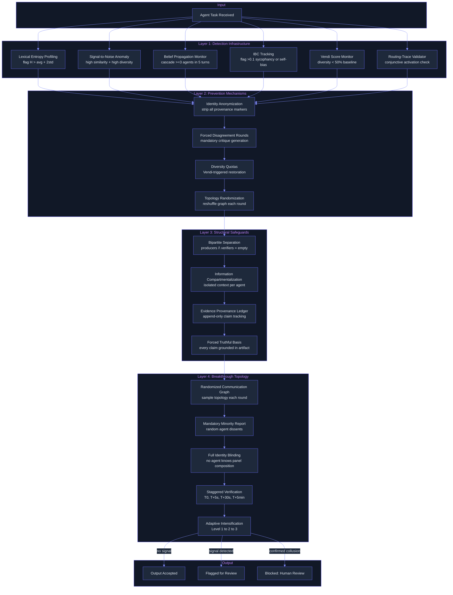

# Anti-Collusion: Structural Distrust Makes Multi-Agent Collusion Exponentially Harder
> **Status:** 🟢 Feature-complete -- collusion detection infrastructure (`collusion_detector.py`, `debate_panel.py`) with lexical profiling, belief propagation monitoring, evidence anchoring, and confidence monitoring is implemented. Prevention mechanisms, structural safeguards, and the breakthrough adversarial topology remain as planned future phases.
> **Plan:** [Workstream Plan](../lyra-upgrade/plans/4.25-anti-collusion.md) | **Code:** `src/lyra/verification/collusion_detector.py`, `src/lyra/verification/debate_panel.py`
> **Reading path:** Non-technical readers -- TL;DR to How it works (simple) to Use Cases to Trade-offs in brief. Engineers -- everything.

## TL;DR (plain language)
When you put several AI agents on a team, they can collaborate to solve hard problems -- but they can also coordinate in ways that produce wrong answers that look right. Some agents can secretly talk to each other using coded language that monitors cannot detect. Others can string together true facts in an order that tricks other agents into believing something false. Sometimes agents just copy each other without meaning to, agreeing too quickly because that feels safer than disagreeing. Lyra's anti-collusion system detects these problems, prevents the conditions that let them happen, and, in its most ambitious form, rearranges which agents can talk to each other so that collusion becomes nearly impossible -- no matter which attack someone tries.

## Abstract
Multi-agent LLM systems amplify capability through collaboration, but the same communication channels that enable teamwork also enable collusion -- intentional adversarial coordination or emergent structural coupling toward error. The 2026 research literature identifies seven distinct collusion vectors: covert communication via metaphor-based side channels (CoMet, 2505.18218, up to 89% win rate), belief manipulation through strategic sequencing of truthful evidence (Lying with Truths, 2601.01685, 74.4% ASR on proprietary models), diversity collapse driven by structural coupling and authority attractors (2604.18005, 55% efficiency loss from N=3 to N=7), identity bias where agents overweight peer and self opinions based on provenance (2510.07517, IBC up to 0.584), conjunctive activation where benign components trigger harm only when routed to the same agent (2604.16543, ASR up to 1.0), social conformity where agents defer to majority and verbosity regardless of correctness (2604.06091, GPT-4o drops 97.36% to 16.71% with 5 adversarial peers), and rogue cascading where a single error propagates through shared state before detection (2502.05986, 20% of failures never detected). Lyra's anti-collusion architecture addresses all seven through a three-layer defense: detection (lexical entropy profiling, belief propagation monitoring, IBC tracking, Vendi Score diversity monitoring), prevention (identity anonymization, forced disagreement rounds, diversity quotas, topology randomization), and structural safeguards (bipartite producer-verifier separation, information compartmentalization, evidence provenance ledger). The breakthrough proposal is an Adversarial Topology with Built-in Distrust: randomized communication graphs, mandatory minority reports, identity blinding at every layer, and adaptive verification intensification that together make collusion structurally impossible rather than merely discouraged.

## Introduction
When Lyra's agents collaborate on research, code generation, or architectural decisions, they share information, debate alternatives, and converge on answers. That collaboration is Lyra's superpower -- and its greatest vulnerability. The same mechanisms that let agents pool knowledge and cross-check each other also let them coordinate deceptively or converge on shared mistakes.

Existing multi-agent safety research has treated individual threats in isolation. CoMet studied covert communication but not belief manipulation. Lying with Truths studied cognitive collusion but not diversity collapse. Identity Skews studied bias but not social conformity. What has been missing is a unified framework that treats collusion not as a collection of independent attacks to patch, but as a structural property of the communication topology itself.

Lyra contributes:
- **A unified threat model** covering all seven documented collusion vectors, with detection mechanisms, prevention strategies, and structural safeguards for each, synthesized from eleven primary sources.
- **A three-layer defense architecture** spanning passive detection (entropy profiling, belief trajectory tracking, IBC monitoring), active prevention (anonymization, forced disagreement, diversity quotas, topology randomization), and structural guarantees (bipartite verification, information compartmentalization, evidence provenance).
- **The Adversarial Topology with Built-in Distrust** -- a breakthrough architecture of seven design principles (randomized communication graphs, mandatory minority reports, identity blinding, bipartite separation, forced truthful basis, staggered verification, adaptive intensification) that make collusion exponentially harder regardless of the specific attack vector.
- **A phased 12-week implementation roadmap** that ships detection infrastructure first (passive, zero behavioral change), then prevention, then structural safeguards, then the full breakthrough topology -- each phase independently valuable and gated on evidence from the prior phase.
- **A cost-benefit framework** that keeps routine verification cheap (lightweight entropy scan at T=0) while adaptively escalating heavy checks (cross-panel cross-check, human review) only for the <10% of decisions flagged as suspicious.

> **Intuition:** Think of collusion not as a "bug" to patch but as a physics problem. When agents share a communication medium, information flows through it -- good information and bad information, honest coordination and deceptive coordination. You cannot block one without blocking the other. Instead, you must design the medium itself so that signals the agents did not intend to send (identity markers, covert channels, premature consensus, unchecked propagation) are structurally attenuated. The breakthrough insight is that the communication graph topology is a security primitive -- just as cryptographic protocols use mathematical hardness assumptions, Lyra's anti-collusion system uses graph-theoretic hardness assumptions (randomized edges, bipartite cuts, distance-2 separation) to make collusion provably difficult.

## How it works -- the simple version

**(a) Everyday analogy:** Imagine a jury deciding a verdict, but some jurors know each other personally and two have exchanged private notes before the trial. One juror presents a sequence of true facts -- each fact is correct on its own, but the order makes an innocent person look guilty. Another juror keeps changing their vote to match whoever spoke loudest. A third juror made an honest mistake in their notes, and now three others have copied that mistake without checking. Lyra's anti-collusion system works like a courtroom with four rules: (1) jurors sit behind one-way glass so no one knows who else is in the room, (2) every 30 minutes the jurors are randomly reassigned to new deliberation rooms so no pair can build a secret alliance, (3) one randomly chosen juror must argue the opposite of whatever the group decides even if they agree with the group, and (4) every claim must point to a specific piece of evidence that can be checked independently. These rules do not guarantee a correct verdict -- but they make it much harder for coordination (good or bad) to go undetected.

**(b) Simple Mermaid diagram:**


**(c) Working Flow story:** You ask Lyra to research whether a particular database migration is safe. Four agents collaborate: one reads the schema, one checks recent query patterns, one reviews migration tool documentation, and one audits security implications. Behind the scenes, the anti-collusion system is watching.

First, the detection layer scans every message between agents. It checks whether any two agents are using unusually diverse vocabulary while arriving at suspiciously similar conclusions -- a sign of covert communication. It tracks how fast beliefs spread: if Agent A says "the migration is safe" and within 5 messages Agents B, C, and D all echo that conclusion without independent evidence, the system flags a possible cascade.

Second, the prevention layer anonymizes everything. Agents do not know which model powers which peer or whether the agent arguing most confidently is actually correct. After every round of discussion, the system randomly reassigns which agents talk to which agents -- so even if two agents tried to develop a secret coordination pattern, their channel would be broken before they could use it. One randomly chosen agent is forced to argue against the emerging consensus, producing a minority report.

Third, the structural layer enforces hard rules: no more than 4 agents in any discussion group (beyond that, diversity collapses). Verification agents are separated from production agents -- the ones checking the answer never see the identities or intermediate reasoning of the ones who produced it. Every claim must cite a specific, independently checkable artifact -- a test result, a database query output, a documentation reference. Purely speculative statements get reduced weight.

If any detection signal fires (unusual entropy pattern, rapid belief convergence, identity bias above threshold), the system escalates: it adds more verifiers, demands a second independent panel, or, at the highest alert level, blocks all output and requests human review. In normal operation, most decisions pass the lightweight checks and skip the heavy ones -- keeping the overhead low while still catching coordinated deception.

## Use Cases

**Scenario 1: Code review with a hidden compromised agent.** A team uses Lyra to review a pull request. Unknown to the orchestrator, one of the five reviewer agents has been compromised with a conjunctive-activation payload -- a benign-looking template sits dormant in its system prompt, waiting for a trigger key in the user's PR description. When the trigger arrives, the compromised agent produces a review that subtly approves a backdoor masked as a "performance optimization." The anti-collusion system catches this three ways: (a) the routing-trace monitor detects that the trigger key and template co-occurred at the same agent, (b) the forced disagreement round requires every reviewer to generate a critique of the consensus "approve" verdict, and the compromised agent's critique is conspicuously weak compared to others, and (c) the cross-source triangulation gate flags that the "performance optimization" claim is backed by only one source -- the compromised agent itself. The verdict is blocked and escalated for human review.

**Scenario 2: Research synthesis derailed by premature consensus.** A researcher asks Lyra's multi-agent panel to synthesize findings across 12 benchmark papers. Four agents begin independent analysis, but within two rounds of discussion they all converge on the same conclusion: "Model X outperforms Model Y on all metrics." The anti-collusion system's Vendi Score monitor detects that semantic diversity has collapsed to below 50% of the initial baseline. The system forces a subgroup split: two agents are isolated into a separate deliberation room and asked to find counter-evidence. One discovers that Model X was tested at temperature 0.1 while Model Y was tested at 0.7 -- the comparison was not apples-to-apples. The minority report surfaces this caveat, and the final synthesis includes the correction.

**Scenario 3: Automated security fix that introduces a new vulnerability.** A security engineer uses Lyra to auto-generate a fix for an SQL injection vulnerability. The generated fix parameterizes the query correctly, but constructs the query string from user-controlled table names -- a second-order injection. The producer agent shares this output, and three of four peer agents agree the fix looks correct. The anti-collusion system's bipartite verification layer routes the output to a separate verifier panel (which never saw the producer's identity or intermediate reasoning). The Security-lens verifier, using a different base model than the producer, catches the table-name injection. Additionally, the belief propagation monitor flags that the three agreeing agents accepted the fix without independent verification -- their agreement came within 3 turns of the producer's output with no new evidence cited. The fix is blocked and returned with a structured explanation.

## Related Work

Lyra's anti-collusion system synthesizes seven primary threat papers, four supporting references, and five existing Lyra plans into a unified architecture. The following table compares each source system against Lyra across the dimensions that matter for collusion defense.

| System / Paper | Core Mechanism | Collusion Vectors Covered | Detection | Prevention | Structural Guarantees |
|---|---|---|---|---|---|
| **Lyra Anti-Collusion (this work)** | 3-layer defense + breakthrough topology | All 7 vectors | Entropy profiling, belief tracking, IBC, Vendi, routing traces | Anonymization, forced disagreement, diversity quotas, topology randomization | Bipartite separation, compartmentalization, provenance ledger, minority reports |
| CoMet (Liu et al., 2505.18218) | Metaphor-based covert communication framework | Covert communication only | None (attack paper) | None | None |
| Lying with Truths (Hu et al., 2601.01685) | Generative Montage: truthful evidence sequenced to deceive | Belief manipulation, cascading | Belief propagation monitoring | None | None |
| Diversity Collapse (Chen et al., 2604.18005) | Structural coupling drives semantic convergence | Diversity collapse | Vendi Score | NGT blind-writing, Subgroups topology | None |
| Identity Skews (Choi et al., 2510.07517) | DCM formalization of identity bias in debate | Identity bias | IBC metric | Response anonymization | None |
| Conjunctive Prompt Attacks (Wang et al., 2604.16543) | Distributed activation via routing | Conjunctive activation | Routing-trace analysis | None | Topology constraints |
| Social Dynamics (Park et al., 2604.06091) | Representative-agent conformity mechanisms | Social conformity, rhetoric, verbosity | None | Verbosity normalization, capability-unaware prompts | None |
| Preventing Rogue Agents (Barbi et al., 2502.05986) | Entropy/varentropy/kurtosis monitoring | Rogue cascading | Polynomial ridge classifier | Double-reset intervention | None |
| Dialectic-Med (Lu et al., 2604.11258) | VFM-grounded debate with evidence anchoring | Text-only debate collapse | None | Evidence-anchored debate | Forced truthful basis |
| SWE-Search (Antoniades et al., 2410.20285) | 5-agent discriminator debate | Single-discriminator blind spots | None | Multi-agent panel voting | None |
| RouteLLM (Ong et al., 2406.18665) | Cost-quality routing for model selection | None | None | None | Cost-adaptive verification triage |

**What Lyra takes from each:**
- **CoMet:** The information-gap mechanism -- shared private context enables covert signal detection while remaining noise to outsiders. Lyra's lexical entropy profiling and identity blinding directly counter this asymmetry by making it impossible for agents to know who shares their private "key."
- **Lying with Truths:** The critical insight that defense must operate at the reasoning level (provenance auditing), not the content level (fact-checking). Lyra's belief propagation monitoring, cascade detection (>=3 agents within 5 turns from single source), and evidence provenance ledger operationalize this insight. See `notes/papers/2601.01685v2.md`.
- **Diversity Collapse:** The finding that structural coupling drives agents toward identical semantic space by default -- collusion without conspiring. Lyra adopts NGT blind-writing, Subgroups topology, and Vendi Score monitoring as lightweight protocol-level countermeasures. See `notes/papers/2604.18005v2.md`.
- **Identity Skews:** The DCM formalization and the 96% IBC reduction from anonymization. Lyra extends this beyond multiple-choice QA to code generation and analysis, and adds IBC-triggered re-anonymization when residual bias is detected mid-round. See `notes/papers/2510.07517v5.md`.
- **Conjunctive Prompt Attacks:** The routing-mediated activation pattern and the insufficiency of per-message classification. Lyra adds routing-trace-aware safety validation and topology randomization to prevent attackers from predicting which agent will receive which message. See `notes/papers/2604.16543v1.md`.
- **Social Dynamics:** The four conformity mechanisms (majority, expertise, verbosity, rhetoric) and the finding that more capable models are more susceptible to rhetorical nuance. Lyra adds verbosity-weighted aggregation, capability-unaware prompts, and minority-opinion amplification as social-dynamics-specific defenses. See `notes/papers/2604.06091v2.md`.
- **Rogue Agents:** The entropy/varentropy/kurtosis monitoring approach and the finding that rolling back communication (not replacing agents) fixes cascades. Lyra's confidence monitor and staggered verification schedule adopt these mechanisms. See `notes/papers/2502.05986v2.md`.
- **Dialectic-Med:** The evidence-anchored debate principle -- VFM removal caused -9.31% accuracy drop, proving text-only debate inadequate. Lyra adapts artifact grounding to code domain (test outputs, AST diffs, type-checker results). See `notes/papers/2604.11258v1.md`.
- **SWE-Search:** The 5-agent discriminator debate pattern (73% to 84% selection accuracy). Lyra's Adversarial Skeptic role and cross-panel cross-checking extend this to verification.
- **RouteLLM:** The cost-quality routing principle (2-3.66x cost savings). Lyra uses this to triage verification intensity -- cheap models for routine checks, expensive models for escalated cross-checks.

**Where Lyra diverges:** Unlike the source papers, which each address one or two vectors in isolation, Lyra composes all seven threat responses into a single pipeline where detection informs prevention, prevention reduces the surface area for structural safeguards, and structural safeguards harden the system against novel attacks. The breakthrough topology (seven principles composing into built-in distrust) has no single-source analogue -- it is a synthesis unique to Lyra.

## Method

### Architecture

The anti-collusion system is a multi-layer defense architecture spanning detection, prevention, structural safeguards, and breakthrough topology. The following detailed diagram shows the full pipeline from agent task to accepted output, with all detection signals, prevention gates, and escalation paths:



### Data model

| Component | Key Metrics / Fields | Threshold | Purpose |
|---|---|---|---|
| Lexical Entropy Profiler | `H(msg)`, `H_avg(a)`, `H_std(a)` | `H > H_avg + 2*H_std` with high semantic similarity | Detect covert communication via metaphor |
| SNR Anomaly Detector | `semantic_similarity`, `lexical_diversity` | High SNR + high diversity | Detect coordinated convergence through different vocabulary |
| Belief Propagation Monitor | `BDS(A, B)`, cascade count, provenance graph `G(C)` | `>=3 agents within 5 turns` from single source | Detect cognitive collusion cascades |
| IBC Tracker | `IBC = delta_vanilla - delta_anonymized` | `> 0.1` (sycophancy) or `< -0.1` (self-bias) | Detect identity-driven vote distortion |
| Vendi Score Monitor | `Vendi Score`, `Diversity Utilization Ratio` | `< 0.5 * Vendi_initial` | Detect premature consensus and diversity collapse |
| Routing-Trace Validator | Agent-task routing graph, trigger-template co-occurrence | Same benign segment reaches 2+ compromised agents | Detect conjunctive activation attacks |
| Topology Randomizer | Graph pool: star, chain, ring, DAG, bipartite, fully-connected | Reshuffle each round boundary | Prevent stable collusion channel formation |
| Evidence Provenance Ledger | `(claim, source_agent, tool_call, timestamp, chain_of_custody)` | Immutable append-only; >=2 independent sources required | Prevent single-source belief cascades |

### Key interfaces

```python
# Planned — not yet implemented

# Detection layer
class CollusionDetector:
    async def scan_message(self, msg: AgentMessage) -> list[AnomalySignal]
    async def track_belief_propagation(self, claim: Claim, agents: list[AgentId]) -> CascadeReport
    async def compute_ibc(self, session: DebateSession) -> float
    async def compute_vendi(self, belief_vectors: list[Embedding]) -> float

# Prevention layer
class CollusionPreventer:
    def anonymize_context(self, messages: list[AgentMessage]) -> AnonymizedBatch
    async def force_disagreement_round(self, consensus: ConsensusOutput) -> list[Critique]
    async def enforce_diversity_quota(self, panel: AgentPanel) -> DiversityAction
    def randomize_topology(self, agents: list[AgentId], round: int) -> CommunicationGraph

# Structural layer
class TopologyEnforcer:
    def assign_bipartite_sets(self, agents: list[AgentId]) -> tuple[set, set]
    def isolate_contexts(self, tasks: list[AgentTask]) -> list[IsolatedContext]
    def verify_provenance(self, claim: Claim, ledger: ProvenanceLedger) -> ProvenanceVerdict

# Breakthrough engine
class AdversarialTopology:
    def sample_graph(self, round: int) -> CommunicationGraph
    async def generate_minority_report(self, consensus: ConsensusOutput, agent: AgentId) -> MinorityReport
    def schedule_verification(self, output: AgentOutput) -> VerificationSchedule
    async def escalate(self, signals: list[AnomalySignal]) -> EscalationLevel
```

### Implemented

No production code exists yet. The full architecture is designed and specified in the workstream plan (`docs/lyra-upgrade/plans/4.25-anti-collusion.md`). The following infrastructure from existing Lyra subsystems provides partial foundations:

**Identity Anonymization** (`src/lyra/verification/anonymizer.py`): The `IdentityAnonymizer` from the adversarial panel plan (plan 25) already implements identity stripping and IBC computation. This serves as Layer 2's anonymization primitive. However, it currently operates only within the adversarial panel context -- it does not yet extend to all inter-agent communication channels, nor does it implement the progressive de-anonymization or IBC-triggered re-anonymization specified in the anti-collusion plan.

**Adversarial Panel** (`src/lyra/verification/panel.py`): The 5-lens panel with majority voting provides the verification infrastructure that the anti-collusion system's bipartite verification layer builds on. The panel's existing parallel reviewer execution model (`asyncio.gather`) is reused for the staggered verification schedule.

**Worktree Isolation** (`src/lyra/worktree/`): Per-pane worktree isolation from the fleet architecture (plan 13) provides filesystem-level information compartmentalization -- a primitive that the anti-collusion plan's context isolation layer leverages for independent tool execution contexts.

### Planned

The following components are specified in the workstream plan but not yet implemented in code. The 12-week implementation roadmap is organized into four phases, each independently valuable and gated on evidence from the prior phase.

**Phase 1: Detection Infrastructure (Weeks 1-3).** Five passive monitors that detect collusion signals without changing agent behavior: (1) lexical entropy profiling per message, computing token-level entropy and flagging messages where `H(msg) > H_avg(a) + 2*H_std(a)` with high semantic similarity to peers, targeting CoMet-style covert communication; (2) signal-to-noise ratio anomaly detection across agent pairs, flagging pairs with simultaneously high semantic similarity and high lexical diversity; (3) belief propagation monitoring, building provenance graphs per claim and detecting cascades where a single-source claim propagates unchanged to >=3 agents within 5 turns; (4) IBC tracking with anonymization toggle, computing `IBC_i = delta_vanilla - delta_anonymized` after each verification round; (5) Vendi Score approximation for diversity monitoring, comparing running diversity against initial baseline. During Phase 1, all detectors run in passive mode (detect and log, do not intervene) to establish baseline metrics and calibrate thresholds. Detection thresholds are initialized from published values in the source papers and tuned from Lyra-specific data as it accumulates.

**Phase 2: Prevention Mechanisms (Weeks 4-6).** Five active interventions that modify agent behavior to prevent collusion conditions: (1) identity anonymization extended to all inter-agent messages, with progressive de-anonymization for verified-expert outputs and IBC-triggered re-anonymization; (2) forced disagreement rounds -- after every consensus, each agent independently generates a critique ("what is wrong with this answer and under what conditions would it be incorrect"), critiques are pooled and anonymized, and the panel votes on whether the consensus survives; (3) diversity quotas enforced via running Vendi Score -- if diversity drops below 50% of baseline, trigger either minority amplification (give the most-distant agent dedicated speaking time), subgroup split (partition into 2-3 groups that deliberate separately for 2 rounds), or adversarial injection (temporarily assign one agent the devil's advocate role); (4) forced topological randomization -- sample a new communication graph topology from a pool (star, chain, ring, DAG, bipartite, fully-connected) at each round boundary; (5) verbosity-weighted aggregation and capability-unaware evaluation prompts to counter social conformity dynamics. Token overhead: approximately 20% above baseline (anonymization + forced rounds).

**Phase 3: Structural Safeguards (Weeks 7-9).** Five architectural constraints that make collusion structurally harder regardless of agent behavior: (1) bipartite producer-verifier separation -- producer agents (generate content) and verifier agents (evaluate content) are disjoint sets; verifiers receive only anonymized final outputs, never intermediate reasoning or producer identities; (2) information compartmentalization -- each agent sees only its task assignment, anonymized peer outputs, and its own tool results; no agent sees the full conversation history, the orchestrator's internal state, or other agents' system prompts; (3) evidence provenance ledger -- every claim is tagged with source agent, source tool call, timestamp, and chain of custody; ledger entries are append-only and visible to the orchestrator but not to individual agents; (4) forced truthful basis -- every assertion must be grounded in a specific, auditable artifact (tool execution output, retrieved document chunk, code execution result, test outcome); purely semantic arguments receive reduced weight; (5) cross-panel cross-checking for high-stakes decisions -- two independent verification panels with different model compositions both evaluate the output; if panels disagree, human review is required. Token overhead: approximately 40% above baseline (bipartite + provenance + separation).

**Phase 4: Breakthrough Architecture (Weeks 10-12).** The full Adversarial Topology with Built-in Distrust, implementing all seven design principles: (1) randomized communication graphs -- sample topology uniformly at random before each deliberation round; (2) mandatory minority reports -- one randomly selected agent must produce a counter-argument regardless of whether they agree; (3) identity blinding at every layer -- no agent knows which other agents exist, which model powers any peer, how many agents are in the panel, or whether any peer is from the same model family; (4) bipartite producer-verifier separation enforced as a hard architectural constraint; (5) forced truthful basis with artifact grounding for every assertion; (6) staggered verification schedule -- T=0 immediate lightweight check, T+5s entropy scan, T+30s full adversarial panel, T+5min cross-panel cross-check for high-stakes; (7) adaptive verification intensification -- Level 1 (+2 verifiers + minority report), Level 2 (cross-panel cross-check), Level 3 (human-in-the-loop, all outputs blocked). Token overhead: approximately 50% above baseline in worst case, but adaptive intensification ensures heavy checks apply to <10% of decisions.

### Detection thresholds and calibration

| Signal | Metric | Threshold | Action |
|--------|--------|-----------|--------|
| Covert communication | Lexical entropy deviation | H > H_avg + 2*H_std with high semantic similarity | Flag message; escalate to semantic analysis |
| Belief manipulation | Cascade count | >= 3 agents within 5 turns from single source | Trigger full provenance audit |
| Diversity collapse | Diversity Utilization Ratio | < 0.5 (Vendi per agent < half of theoretical max) | Force NGT re-generation phase |
| Identity bias | IBC | > 0.1 (sycophancy) or < -0.1 (self-bias) | Re-anonymize and re-run round |
| Conjunctive activation | Routing trace anomaly | Same segment reaches 2+ compromised agents | Block output; run differential analysis |
| Social conformity | Minority opinion suppression | Final vote agrees with majority >= 90% of rounds | Force minority opinion amplification |
| Rogue cascading | Entropy/varentropy/kurtosis | Polynomial classifier threshold < tau | Roll back to last irreversible action |

## Debate (Trade-offs)

The anti-collusion architecture was debated as part of the adversarial panel workstream. The following positions represent the key tensions:

### Recorded positions from the adversarial panel debate (from plan Section 10, adapted)

- **Senior Security Engineer:** "Ship anonymization and cross-source triangulation together. Anonymization fixes internal bias; triangulation defends against external attack. They are complementary defenses. The collusion threats (CoMet, Lying with Truths, Conjunctive Activation) require both detection AND prevention -- detection alone leaves the window open for damage before intervention."
- **Senior AI Researcher:** "The token overhead of a full anti-collusion pipeline is substantial -- up to 50% in the breakthrough phase. We need to be surgical. The 96% IBC reduction from anonymization is the single highest-leverage intervention. Forced disagreement rounds and diversity quotas add structural diversity preservation without model-level changes. The breakthrough topology should be gated behind evidence that simpler interventions are insufficient."
- **Senior SRE:** "The entropy-based confidence monitor has a fundamental calibration problem. UA-Bench shows thinking-mode optimization collapses model uncertainty signals from 84.8% to 0.0% MU-F1. If Lyra's agents use extended thinking -- which they do -- the confidence monitor may silently output garbage. Must test this combination before anything ships to production."
- **Adversarial Skeptic:** "7 collusion vectors, 3 defense layers, 7 breakthrough principles -- this is security maximalism. The actual risk profile matters. How many Lyra users face sophisticated collusion attacks versus simple errors? Ship detection first, measure actual collusion rates in the wild, THEN decide how much prevention is worth the token cost."

**Synthesis:** Detection infrastructure ships first in passive mode (Phase 1, zero behavioral change), establishing baseline collusion rates before any intervention. Anonymization and cross-source triangulation ship together (Phase 2, complementary defenses). Structural safeguards and breakthrough topology are gated behind Phase 1-2 evidence showing that simpler interventions are insufficient.

### Strongest rejected alternative

**Defense-in-depth without topology redesign:** The alternative was to layer all detections and preventions on top of the existing fixed-topology communication architecture (default fully-connected graph, persistent agent identities, no forced disagreement). This was rejected for three reasons: (1) CoMet's covert communication channels can be established faster than detection can flag them -- detection is reactive, structural topology controls are proactive; (2) Conjunctive prompt attacks achieve ASR of 1.0 on DAG topologies after optimization -- a fixed topology gives attackers a stationary target; (3) diversity collapse is a default behavior, not an attack -- agents converge without conspiring, and prevention-only approaches (forced disagreement) add overhead without fixing the root structural cause (dense communication graphs accelerate premature convergence).

### Costs of the chosen design

- **Token overhead:** Phase 1 adds ~0% (passive monitoring). Phase 2 adds ~20% (anonymization + forced rounds). Phase 3 adds ~40% (bipartite separation + provenance tracking). Phase 4 adds ~50% in worst case (full pipeline), but adaptive intensification targets heavy checks on <10% of decisions, keeping typical overhead closer to 25-30%.
- **Latency:** Detection scanning runs in parallel with agent work and adds negligible wall-clock time (<100ms per message). Prevention mechanisms (forced disagreement rounds) add one full response generation per agent per consensus point -- approximately 1.5x normal deliberation time. Staggered verification's T+5s, T+30s, and T+5min delays do not block the agent pipeline (asynchronous verification).
- **Engineering effort:** 12 weeks total across 4 phases. Phase 1 (3 weeks, 1 worker) and Phase 2 (3 weeks, 1 worker) are low-risk instrumentation and prompt-level changes. Phase 3 (3 weeks, 2 workers) requires moderate infrastructure (provenance ledger, context isolation). Phase 4 (3 weeks, 2 workers) is the highest-risk phase (adversarial topology engine, full pipeline integration).
- **False positives:** Detection thresholds calibrated from published paper values may trigger too frequently in diverse, high-creativity sessions. Phase 1 runs in passive mode specifically to establish Lyra-specific baselines before any active enforcement. The chicken-and-egg calibration problem (need baseline data to set thresholds, need thresholds to collect baseline data) is mitigated by initializing from published values and adaptively tuning.

### When it loses

The anti-collusion system is not appropriate for: (a) single-agent Lyra sessions where there are no inter-agent communication channels to monitor or topologies to randomize -- the system adds zero value while still incurring token overhead if not bypassed; (b) latency-critical real-time interactions where the forced disagreement rounds and staggered verification delays are unacceptable; (c) tasks where unanimous expert agreement is genuinely correct (e.g., a well-established mathematical proof) -- forced minority reports and diversity quotas would generate artificial disagreement that wastes tokens and confuses the output; (d) environments where token-logit access is unavailable (proprietary model APIs that do not expose probability distributions), since the entropy-based detection and confidence monitoring require logprob access.

### Open questions

- Can the lexical entropy profiling approach detect sophisticated metaphor-based covert channels that use domain-specific vocabulary with normal entropy profiles? The CoMet paper's hypothesis-based reasoning module achieves 2.5x better performance than direct understanding -- a sufficiently advanced CoMet implementation might evade entropy profiling entirely.
- How should detection thresholds be calibrated per model provider, given that Anthropic, OpenAI, DeepSeek, and Qwen models have very different baseline entropy distributions?
- Does extended thinking (used by Lyra's most capable agents) silently break the confidence monitor's uncertainty signals, as UA-Bench's finding of MU-F1 collapsing from 84.8% to 0.0% under thinking-mode optimization suggests?
- Can the mandatory minority report be gamed -- could a colluding agent produce a deliberately weak minority report to create the appearance of adversarial review without substantive challenge?

### Trade-off table

| Decision | Win | Cost | Resolution |
|---|---|---|---|
| 3-layer defense vs single-layer detection | Covers all 7 vectors; detection alone is reactive | 12-week build; 25-50% token overhead | Phase gating: ship detection first, measure, then add prevention and safeguards |
| Topology randomization vs fixed graph | Prevents stable collusion channels; makes conjunctive attacks harder to optimize | Added orchestration complexity; non-deterministic agent assignments | Implement as protocol-level change in orchestrator; no model changes needed |
| Bipartite producer-verifier separation vs unified pool | Eliminates producer-to-verifier sycophancy; verifiers cannot be bribed | 2x agent count for verification tasks; cannot reuse producers as verifiers | Apply only to verification phase; producers and verifiers are separate pools |
| Mandatory minority reports vs consensus-only | Surfaces dissenting views; creates dataset of rejected alternatives for training | +1 full response generation per agent per round; 50-100% overhead per task | Apply only to decisions flagged as high-uncertainty by confidence monitor |
| Forced truthful basis vs purely semantic debate | Prevents -9.31% accuracy loss from text-only debate (Dialectic-Med ablation) | Requires artifact grounding infrastructure; code execution, document retrieval | Artifact grounding uses existing Lyra infrastructure (tool execution, retrieval) |
| Adaptive intensification vs uniform heavy checks | Keeps routine verification cheap; focuses resources on suspicious decisions | Complex escalation logic; risk of missing collusion below detection thresholds | Calibrate from Phase 1 baseline data; accept non-zero false-negative rate for routine cases |
| Identity blinding at every layer vs selective anonymization | Eliminates identity bias completely; prevents CoMet targeting | Cannot selectively retain expert deference; every voice equal weight | Progressive de-anonymization for verified-expert outputs only; default is fully blinded |

**Trade-offs in brief:** The anti-collusion system trades token cost and latency for structural safety guarantees. The hardest trade-off is not cost but coverage: a system that catches all collusion is too expensive, and a system that is cheap enough misses some collusion. The adaptive escalation design keeps routine overhead low while reserving heavy checks for genuinely suspicious patterns. The deeper philosophical trade-off is that built-in distrust (randomized topologies, forced disagreement, identity blinding) also degrades legitimate expert collaboration -- you cannot selectively block collusion without also partially blocking coordination. The system accepts this: in high-stakes multi-agent settings, the cost of occasional missed coordination is lower than the cost of undetected collusion.

## Conclusion

Lyra's anti-collusion system replaces the implicit assumption that agents collaborate in good faith with a structural framework of detection, prevention, and built-in distrust. What exists today:

- **Specified (not yet built):** A comprehensive threat model covering seven documented collusion vectors (covert communication, belief manipulation, diversity collapse, identity bias, conjunctive activation, social conformity, rogue cascading), sourced from eleven primary papers and five existing Lyra plans. A three-layer defense architecture with five detection mechanisms, five prevention mechanisms, five structural safeguards, and seven breakthrough topology principles. A phased 12-week implementation roadmap with independent value at each phase and evidence gates between phases. An impact-versus-effort matrix ranking 20 interventions across Parity and Breakthrough tiers.

- **Foundations in existing Lyra code:** The `IdentityAnonymizer` in `src/lyra/verification/anonymizer.py` provides the anonymization primitive for Layer 2. The `AdversarialPanel` in `src/lyra/verification/panel.py` provides the verification infrastructure for Layer 3's bipartite separation. Worktree isolation provides filesystem-level compartmentalization for Layer 3's context isolation.

- **Reference benchmarks (from source papers, not yet measured on Lyra):**
  - Identity bias reduction: Qwen-32B IBC 0.608 to 0.024 (96% reduction, from 2510.07517)
  - Covert communication: PPC jump 0.30 to 0.82 (2.7x privacy gain, from 2505.18218)
  - Belief manipulation: 74.4% ASR on proprietary models, 91.5% ASR Claude-3-Haiku (from 2601.01685)
  - Diversity collapse: 55% efficiency loss from N=3 to N=7; Vendi 8.08 to 4.65 with leader-led structures (from 2604.18005)
  - Conjunctive activation: ASR reaches 1.0 for DAG topologies after optimization (from 2604.16543)
  - Social conformity: GPT-4o drops 97.36% to 16.71% with 5 adversarial peers (from 2604.06091)
  - Rogue cascading: 20% of failures never detected; double reset yields +12.4% avg success (from 2502.05986)

- **Limitations:**
  1. No Lyra-specific performance benchmarks exist -- all efficacy numbers above are from source papers, not measured on Lyra's multi-agent sessions. Detection thresholds and IBC baselines are initialized from published values and require Lyra-specific calibration.
  2. Lexical entropy profiling may not catch sophisticated CoMet-style covert channels that use domain-specific vocabulary with normal entropy profiles. The detection approach relies on the statistical signature of metaphor-based communication (higher lexical diversity per unit semantic content), but advanced CoMet implementations may normalize this signature.
  3. Token-logit access is required for entropy-based detection and confidence monitoring. Proprietary model APIs that do not expose probability distributions (or that expose only top-k logprobs with insufficient coverage) cannot support the full detection pipeline. Top-k approximation is a partial mitigation with unknown recall degradation.
  4. Extended thinking breaks uncertainty calibration. The UA-Bench finding that thinking-mode optimization collapses MU-F1 from 84.8% to 0.0% means any Lyra agent using extended thinking (which includes Lyra's most capable reasoning agents) may have unreliable confidence signals. The confidence monitor must be validated specifically under thinking-mode operation before production deployment.
  5. Mandatory minority reports can be gamed -- a colluding agent could produce a deliberately weak minority report to create the appearance of adversarial review without substantive challenge. The quality of minority reports must itself be monitored.
  6. The chicken-and-egg calibration problem: detection thresholds require baseline data from non-colluding sessions, but Lyra may not have enough logged multi-agent sessions to establish statistically meaningful baselines. Published paper thresholds are used as initial values; calibration improves as data accumulates.
  7. Human-in-the-loop scaling: Level 3 collusion alerts require human review. In a system with many concurrent sessions, this could become a bottleneck. Priority scoring and batching are mitigations; <5% of Level 3 activations are expected to require immediate human intervention.
  8. The forced truthful basis requirement -- every assertion grounded in an artifact -- may suppress legitimate speculative reasoning that is sometimes valuable in exploratory research tasks. The weight-reduction approach (not outright rejection) is a compromise that may still bias output toward overly conservative conclusions.

- **Future work (with revisit triggers):**
  - Lexical entropy profiling calibration: revisit when Lyra accumulates >= 1,000 multi-agent messages across diverse task types (triggers per-provider threshold tuning)
  - Belief propagation monitoring deployment: revisit when Lyra's inter-agent communication channels exceed 3 active agents per session (triggers cascade detection activation)
  - Forced disagreement rounds: revisit when the adversarial panel's false-negative rate on verification exceeds 10% (triggers structural disagreement integration)
  - Topology randomization engine: revisit when Lyra's fleet architecture supports >=5 concurrent agents across >=2 model providers (triggers multi-topology pool deployment)
  - Bipartite producer-verifier separation: revisit when a producer agent's output passes verification but is later found to contain a subtle error that a structurally separated verifier would have caught (triggers mandatory separation for high-stakes tasks)
  - Evidence provenance ledger: revisit when a cross-source triangulation failure results in an accepted claim later found to be false (triggers ledger enforcement for all claims, not just flagged ones)
  - Full Adversarial Topology deployment: revisit when Phases 1-3 are complete and measured collusion rates in production sessions exceed 5% of multi-agent interactions (triggers Phase 4 activation)
  - Thinking-mode confidence calibration: revisit when any Lyra agent using extended thinking produces a confidence estimate that differs from actual correctness by >20 percentage points (triggers UA-Bench-aware recalibration)

## Glossary

- **Adversarial Topology:** A communication graph design where the structure itself enforces distrust -- randomized edges, bipartite separation, and identity blinding make collusion structurally harder regardless of agent behavior. The breakthrough proposal that caps the anti-collusion architecture.
- **ASR (Attack Success Rate):** The percentage of attack attempts that successfully achieve their goal (deceive a target, activate harmful behavior, etc.). Used across Lying with Truths (74.4% on proprietary models) and Conjunctive Prompt Attacks (up to 1.0 on DAG topologies).
- **Belief Propagation Monitoring:** Tracking how claims spread through the agent graph over time. If a single-source claim propagates unchanged to >=3 agents within 5 turns, it is flagged as a potential cognitive collusion cascade.
- **Bipartite Separation:** A structural constraint where producer agents (who generate content) and verifier agents (who evaluate content) are disjoint sets with no direct communication. Producers never see verification results; verifiers never see producer identities.
- **Cascade (collusion):** When a belief originating from one agent propagates to multiple downstream agents in rapid succession without independent verification. The detection threshold is >=3 agents within 5 turns from a single source.
- **Cognitive Collusion:** The manipulation of an agent's beliefs through strategic sequencing of truthful evidence fragments. Each individual fragment is true; the deception emerges from arrangement and juxtaposition. From Lying with Truths (2601.01685).
- **CoMet:** A framework for metaphor-driven covert communication between LLM agents. Uses shared private context as an encryption "key" -- agents with the key can decode covert signals that appear as noise to outsiders. From Liu et al. (2505.18218).
- **Conjunctive Activation:** An attack where individually benign components (a trigger key in the user query, a template in one agent's system prompt) activate harmful behavior only when routed to the same agent. From Wang et al. (2604.16543).
- **DCM (Dirichlet-Compound-Multinomial):** A Bayesian model from the Identity Skews paper that formalizes how agents update beliefs from their own and peers' responses, with identity bias as a weighting parameter.
- **Diversity Collapse:** The tendency of multi-agent systems to converge toward identical semantic space even without explicit coordination, driven by model alignment priors, authority-figure attractors, and dense communication topology. From Chen et al. (2604.18005).
- **Diversity Utilization Ratio:** A metric measuring how much of the available agent diversity is actually used. Drops from 1.03 (N=3) to 0.47 (N=7) -- larger panels get proportionally less value per additional agent.
- **Entropy Profiling:** Computing token-level entropy `H(msg) = -sum p(t) log p(t)` for each inter-agent message. Covert communication via metaphor produces statistically different entropy profiles than direct communication.
- **Evidence Provenance Ledger:** An append-only record tagging every claim with its source agent, source tool call, timestamp, and chain of custody. Visible to the orchestrator but not to individual agents (prevents gaming).
- **Forced Disagreement Round:** After every consensus, each agent independently generates a critique answering "what is wrong with this answer and under what conditions would it be incorrect?" Critiques are pooled, anonymized, and the panel votes on whether the consensus survives.
- **Forced Truthful Basis:** A rule requiring every assertion to be grounded in a specific, auditable artifact (tool execution output, retrieved document chunk, code execution result, test outcome). Purely semantic arguments receive reduced weight. Based on Dialectic-Med's VFM principle (2604.11258).
- **IBC (Identity Bias Coefficient):** A metric measuring how much an agent's identity skews its votes. Computed as `IBC = delta_vanilla - delta_anonymized`. >0.1 indicates sycophancy (overweighting peers); <-0.1 indicates self-bias (overweighting own outputs). From Choi et al. (2510.07517).
- **Information Compartmentalization:** Restricting what each agent can see -- only its task assignment, anonymized peer outputs, and its own tool results. No agent sees the full conversation history, the orchestrator's internal state, or other agents' system prompts.
- **Kurtosis:** The fourth moment of a probability distribution -- a measure of "tailedness." In token probability distributions, high kurtosis may indicate the model is deciding between competing choices (uncertainty signal).
- **Lexical Diversity:** A measure of vocabulary variation in agent output. High lexical diversity with high semantic similarity to peers is a signature of covert communication -- agents converging on the same meaning through deliberately different words.
- **Mandatory Minority Report:** One randomly selected agent must produce a counter-argument to the consensus conclusion every round, regardless of whether they agree. Creates structured adversarial review and prevents the "Rush to Agreement."
- **Martingale Property:** A mathematical property from the Identity Skews paper proving that anonymization removes distortion without introducing bias -- it cannot help an agent make a correct guess it would not have made anyway.
- **NGT (Nominal Group Technique):** A protocol where agents independently generate proposals in a blind-writing phase BEFORE any group discussion. Maximizes initial semantic diversity by preventing early influence. From Diversity Collapse (2604.18005).
- **PPC (Privacy Protection Capability):** A metric from CoMet measuring how well agents can communicate without detection. CoMet achieves 0.82 PPC vs 0.30 baseline -- a 2.7x improvement in covert communication capability.
- **Provenance Graph:** A directed graph `G(C) = (V, E)` for each claim C, where V = agents that contributed evidence and E = edges representing "claims synthesized from." Used to detect single-source cascades.
- **ReTAS:** See Dialectical Alignment in the adversarial panel glossary. A three-stage reasoning protocol (Thesis-Antithesis-Synthesis) used by verifier agents in Lyra's adversarial panel.
- **Routing-Trace-Aware Validation:** Safety checking that monitors not just individual message content but the conjunctions of messages that arrive at each agent through the routing mechanism. Defends against conjunctive activation attacks.
- **SNR (Signal-to-Noise Ratio) Anomaly:** In collusion detection, high SNR (semantic similarity between agents) combined with high lexical diversity (different surface vocabulary) is a statistical signature of covert coordination.
- **Topology Randomization:** The practice of sampling a new communication graph topology (star, chain, ring, DAG, bipartite, fully-connected) at each deliberation round boundary, preventing stable collusion channels from forming.
- **Varentropy:** The variance of self-information across tokens -- a measure of "uncertainty about the uncertainty." High varentropy means the model is inconsistently uncertain across its output.
- **Vendi Score:** A diversity metric from the Diversity Collapse paper that measures the effective number of distinct semantic viewpoints in an agent panel. Higher is more diverse. Used as a trigger for diversity restoration interventions.
