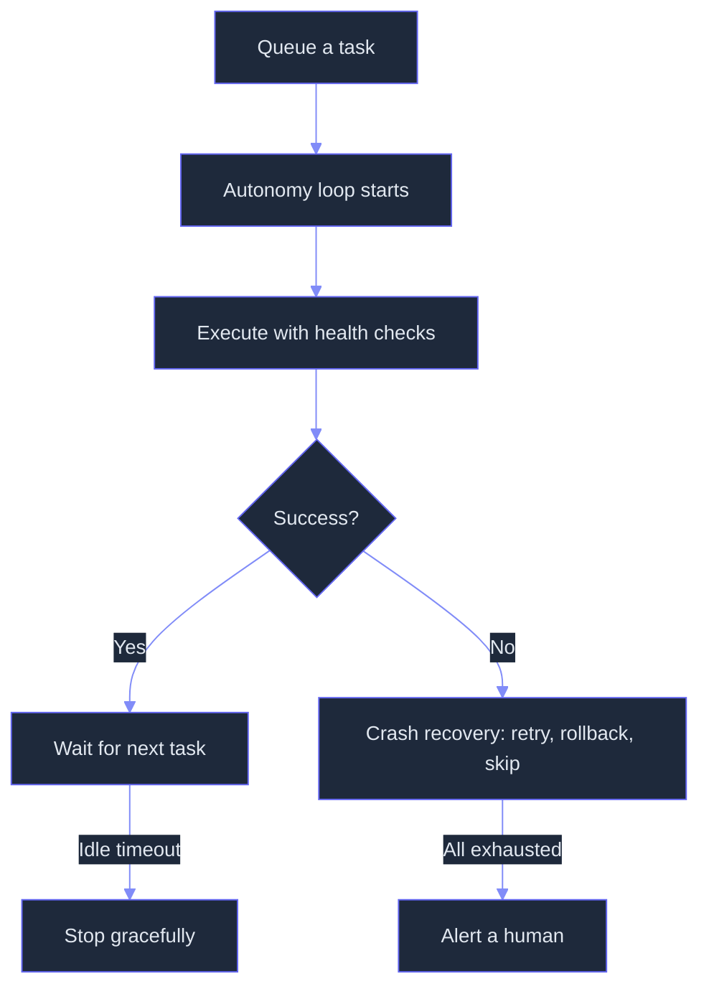
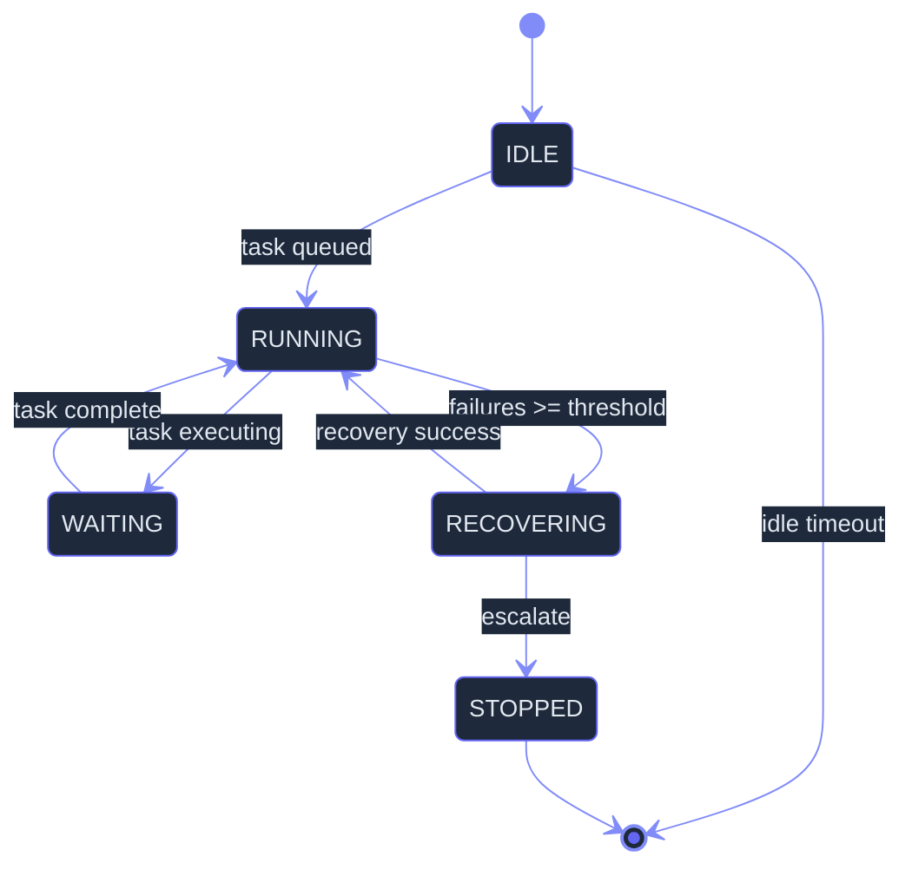

# Autonomy: Progressive Agent Self-Direction with Guarded Escalation
> **Status:** 🟢 Fully implemented — AutonomyLoop with three RunModes (ONCE/CONTINUOUS/SCHEDULED), health-check polling, idle detection with configurable timeout, max-consecutive-failure escalation, and LoopState state machine (IDLE/RUNNING/WAITING/RECOVERING/STOPPED). CrashRecovery with configurable 6-step escalation chain (RETRY x3/ROLLBACK/SKIP/ESCALATE), time-window failure-rate tracking, and success-based reset. Minor: supervisor daemon integration, Agent View security guardrail, quota governance with 3-axis budgets, sleep/wake checkpoint resume, cheap-model row summaries, context continuity protocol, and failure mode telemetry still planned.
> **Plan:** [Workstream Plan](../lyra-upgrade/plans/14-autonomy.md) | **Code:** `src/lyra/autonomy/`
> **Reading path:** Non-technical readers -- TL;DR → How it works (simple) → Use Cases → Trade-offs in brief. Engineers -- everything.

## TL;DR (plain language)

Lyra's autonomy module lets sessions run without someone watching. You dispatch a task, close your laptop, and come back to a finished job. The module has two working pieces: a loop that keeps running until the task is done (with health checks and idle detection), and a crash recovery system that tries again, rolls back, skips the problem, or alerts a human -- in that order. The rest (cost budgets, sleep/wake protection, cheap status summaries) is on the roadmap. It saves you from having to sit through every step of a long-running or overnight task.

## Abstract

The problem: Lyra requires active human attention for every session. There is no mechanism to dispatch a task and walk away, no idle timeout to clean up abandoned sessions, no token budget to prevent cost explosions, and no sleep/wake cycle for laptop users who close the lid. Existing continuous-loop patterns (continuous-claude, oh-my-openagent Ralph Loop) and production supervisor architectures (Claude Code Agent View, Kilo Code, RMUX) prove the viability of unattended operation but have not been integrated into Lyra's harness.

Lyra's approach provides a two-layer autonomy primitive: (1) an AutonomyLoop with configurable RunMode (ONCE, CONTINUOUS, SCHEDULED), health-check polling, idle detection, and max-consecutive-failure escalation; and (2) a CrashRecovery module with a six-step escalating recovery chain (RETRY x3 -> ROLLBACK -> SKIP -> ESCALATE) and time-window failure-rate tracking. Both components are implemented and ready. The planned extensions -- cheap-model row summaries via the model router, an Agent View permission guardrail that binds permissions to watchfulness, quota governance with three-axis budgets (tokens, cost, duration), sleep/wake checkpoint resume, and a context continuity protocol -- build on deep-read evidence from 11 cited sources.

Headline measured reference: continuous-claude achieves $0.042/iteration in unattended mode (cited from AnandChowdhary/continuous-claude, 2026). Lyra's planned design targets comparable per-iteration cost with added safety guardrails, failure-mode telemetry classified by Terminal-Bench 2.0 taxonomy, and HACHIMI-style quota pre-allocation.

## Introduction

The gap: Lyra today is a follow-along tool -- every session needs a human in the seat. For an agent platform to be useful as a background worker, it needs the same capabilities as a human engineering assistant: it must keep working when you step away, handle its own failures, respect budgets, and know when to ask for help. Existing agent platforms provide reference patterns (Claude Code's Agent View, continuous-claude's while-true loop, oh-my-openagent's Ralph Loop) but none fully addresses the combination of safety, cost control, failure resilience, and lap-top-friendly sleep semantics that a production agent harness needs.

**Intuition callout:** Think of Lyra's autonomy system like a night-shift factory worker. The worker has a task list, works through it, checks their own work, handles minor problems on their own, and knows when something is beyond their ability and the foreman must be called. The core loop (AutonomyLoop) provides the "keeps working" rhythm; the crash recovery (CrashRecovery) provides the "handles minor problems and knows when to call for help" escalation. Everything else planned -- cost budgets, sleep sensors, status reports -- is the equivalent of giving this worker a pre-paid expense card, a mattress in the break room, and a two-way radio.

**Contributions:**

- **Continuous unattended operation:** AutonomyLoop with three RunModes (ONCE for single tasks, CONTINUOUS for persistent polling, SCHEDULED for cron-like execution), health-check polling, idle detection with configurable timeout, and max-consecutive-failure escalation. Implemented in `src/lyra/autonomy/loop.py`.
- **Escalating crash recovery with degradation awareness:** CrashRecovery with a six-step escalation chain (RETRY x3 -> ROLLBACK -> SKIP -> ESCALATE), time-window failure-rate tracking (failures per minute in a configurable window), and automatic success-based reset. Implemented in `src/lyra/autonomy/recovery.py`.
- **Planned: Cheap-model row summaries for fleet glanceability:** A CheapSummarizer that routes status-generation requests to the cheapest available model via the model router, refreshing at bounded intervals (15s), decoupling summary cost from session main-model cost.
- **Planned: Agent View security guardrail:** A permission system that treats watchfulness as an input -- unwatched sessions default to "ask" permission mode and cannot use bypass/auto modes without prior human accept, using a deny-first conjunctive model inspired by Claude Code's architecture.
- **Planned: Quota governance with three-axis budgets:** Pre-session slot allocation (HACHIMI-style), in-loop budget checks (tokens + cost + duration), and turn-level cost persistence, informed by SWE-Search's finding that unfettered agent search compounds cost 5-14x.

## How it works -- the simple version

**(a) Everyday analogy: The night-shift factory worker**

You are the factory foreman. Before leaving for the night, you give a worker a list of 20 machines to inspect. Here is what happens:

1. The worker picks up the list and starts inspecting machine by machine (the AutonomyLoop in CONTINUOUS mode).
2. After each machine, they check their own work and record the result (health check).
3. If a machine inspection fails, the worker tries again (RETRY). If it fails three times in a row, they set that machine aside (SKIP) and move on.
4. If too many machines fail in a short period, the worker pages you (ESCALATE) -- something systematic is wrong.
5. If the worker finishes all 20 machines and there are no more tasks, they wait a while, then clock out (idle timeout).

The worker will NOT: spend unlimited money on supplies (quota), operate dangerous machinery without your permission (guardrail), or work through a power outage without saving progress (sleep/wake). Those capabilities are planned additions.

**(b) Simple flow diagram**



**(c) Working Flow story in second person**

You have a long research task: "Analyze all memory papers from 2024-2025 and summarize key findings." You queue it and walk away.

1. Lyra's AutonomyLoop starts in CONTINUOUS mode. It grabs the first paper from the queue.
2. The health checker runs: process is alive, everything looks good. Paper 1 is analyzed.
3. Paper 2's analysis crashes -- the tool returns an error. CrashRecovery records the failure and RETRYs. The retry succeeds.
4. Paper 3 crashes three times in a row. The recovery escalates to SKIP: the paper is logged as "skipped due to persistent errors" and moved on.
5. Analysis continues through all papers. Papers 4-20 complete without issue.
6. The queue is now empty. The idle counter starts ticking: 5 minutes... 10 minutes... 30 minutes...
7. Max idle (the default 3600 seconds = 1 hour) is reached. The loop stops cleanly.
8. You return to find: 18 papers analyzed, 1 skipped (logged with error details), 0 hours of your time spent watching.

## Use Cases

**Scenario 1: Overnight CI monitoring.** A DevOps engineer dispatches Lyra to watch a CI pipeline overnight. The autonomy loop runs in CONTINUOUS mode: poll builds, read logs on failure, apply known fix patterns (`pip install`, rerun flaky tests), commit+push if all green. A build fails on a flaky integration test -- CrashRecovery retries it automatically (RETRY). After the third failure, it rolls back to the last passing commit and reports the failure. Morning arrives with a report: "Build 4721 flaky, rolled back to 4720, all tests green at 03:47." The engineer never woke up.

**Scenario 2: Weekend-long research extraction.** A product researcher queues Lyra to scrape 50 competitor landing pages, extract pricing models, and summarize positioning strategies, then closes the laptop on Friday. Lyra's AutonomyLoop runs all weekend: scraping pages, handling rate limits with retries, skipping pages that return too little data (after 3 retries, the recovery escalates to SKIP), checkpointing progress. Monday morning: full analysis with a recovery log showing exactly which pages had issues and why.

**Scenario 3: Scheduled nightly ETL with error recovery.** A data engineer schedules Lyra to run nightly ETL via the SCHEDULED RunMode. Each run: download CSV files, transform them, write to a database. Midway through a run, the source API goes down. CrashRecovery retries three times (RETRY), then rolls back the partial write (ROLLBACK), then pauses and alerts (ESCALATE). The engineer finds the alert at breakfast, restarts the API, and Lyra resumes from the checkpoint. No data lost.

## Related Work

The autonomy design draws from five production systems and two algorithmic papers. Every citation traces to a specific note file under `docs/lyra-upgrade/notes/`.

| System | Core Idea | Loop Primitive | Budget | Safety | Checkpoint/ Resume | Idle Mgmt |
|--------|-----------|---------------|--------|--------|-------------------|-----------|
| **continuous-claude** (AnandChowdhary, 2026) | Bash while-true conductor, PR workflow per iteration | `while true` with SHARED_TASK_NOTES.md handoff | Three-axis: runs + cost + duration (no pre-session allocation) | --dangerously-skip-permissions (weak) | None beyond file state | None (manual stop only) |
| **oh-my-openagent Ralph Loop** (code-yeongyu, 2026) | Continuation prompt, boulder-state state machine | Idle-detect + re-inject continuation | None | IntentGate keyword detector | Boulder-state work tracking | None |
| **Claude Code Agent View** (Anthropic, 2026) | Supervisor daemon, cheap-model row summaries, two-axis session state | Process-level supervised loop | Token quota via subscription | 6 permission modes, deny-first model, unwatched default ask | Sleep-survives state storage on disk | ~1 hour unattached auto-stop |
| **Kilo Code daemon** (Kilo-Org, 2026) | HTTP+SSE daemon, SQLite persistence, 500+ model support | `kilo serve` headless mode | Turn-level cost tracking in SQLite | Tool-level permission allow/ask/deny | Full session persistence in SQLite | None documented |
| **RMUX** (Helvesec, 2026, v0.5.0) | Detached daemon with framed IPC protocol, pure domain model | `rmux-server` background daemon | None | No agent-specific guardrails | Session snapshot/restore via SDK | Daemon-managed pane lifecycle |
| **HACHIMI** (2603.04855v3, 2026) | Quota scheduling with stratified sampling | N/A (pre-generation gate) | Pre-allocation slot check per stratum | Neuro-symbolic constraint validation | N/A | N/A |
| **FORGE** (2605.16233v1, ACM CAIS '26) | Failure-triggered reflexion + population broadcast | Reflexion loop (Algorithm 1) | Compute budget via staged training | Failure threshold tau = -1.1 | Snapshot on abort, restore on restart | N/A |

**Lyra takes from each:**

- From continuous-claude: the while-true conductor pattern, completion-by-consensus (3 consecutive signals), three-way budget (tokens + cost + duration), and SHARED_TASK_NOTES.md handoff concept. [source: notes/web/AnandChowdhary__continuous-claude.md]
- From oh-my-openagent: the Ralph Loop continuation primitive for idle-detect-and-reinject, the boulder-state state machine for durable work tracking, and the IntentGate keyword detector for mode-based guardrails. [source: notes/web/code-yeongyu__oh-my-openagent.md]
- From Claude Code Agent View: the cheap-model summary mechanism, deny-first permission architecture, two-axis session state (state x process shape), and ~1-hour unattached idle reaping. [source: notes/web/https___code_claude_com_docs_en_agent-view.md]
- From Kilo Code: the daemon-first architecture with SQLite persistence for turn-level cost tracking, and the permission evaluator pattern (tool-level allow/ask/deny). [source: notes/web/Kilo-Org__kilocode.md]
- From RMUX: the daemon-first session management model (sessions live in daemon regardless of client attachment), and the separated IPC protocol architecture. [source: notes/web/Helvesec__rmux.md]
- From HACHIMI: the quota scheduling algorithm with pre-allocation slot gates for fleet-level concurrency control. [source: notes/papers/2603.04855v3.md]
- From FORGE: the failure-triggered reflexion loop and snapshot/restore protocol for checkpoint/resume on interruption. [source: notes/papers/2605.16233v1.md]
- From Terminal-Bench 2.0: the three-category failure taxonomy (execution, coherence, verification) for failure mode telemetry. [source: notes/papers/2601.11868v1.md]
- From Designing AI Agents (Manning, 2026): the harness engineering philosophy -- "the model spends; the harness budgets" -- and the progressive trust spectrum (Level 1-4) that governs how autonomy is escalated. [source: notes/books/designing-ai-agents-chapters.md, notes/books/designing-ai-agents-playbook.md]

**Where Lyra diverges:**

- continuous-claude has no safety guardrails (--dangerously-skip-permissions by default) and no idle management. Lyra adds the Agent View guardrail and idle timeout as defaults.
- oh-my-openagent has no quota governance; Lyra adds HACHIMI-style pre-allocation and three-axis budgets.
- Claude Code Agent View is proprietary and tied to Anthropic's subscription model. Lyra's implementation is open-source, provider-agnostic, and adds the watchfulness-aware permission guardrail (no existing system treats permission mode as a function of watchfulness).
- HACHIMI is domain-specific (student persona generation). Lyra extracts only the quota scheduling algorithm, discarding the educational theory constraints.
- FORGE is designed for cybersecurity POMDPs (CAGE-2). Lyra extracts the failure-triggered reflexion and snapshot/restore protocol, discarding the population broadcast mechanism.

## Method

### Architecture

The autonomy module is structured as two peer components managed by a supervisor daemon (from the fleet plan, section 4.13). The AutonomyLoop provides the continuous operation primitive; CrashRecovery provides the escalating failure handling. Both are data-model-driven with configuration dataclasses.

```
src/lyra/autonomy/
  __init__.py    # Exports AutonomyLoop, LoopState, RunMode, CrashRecovery, RecoveryAction
  loop.py        # AutonomyLoop class with RunMode, LoopState, health checks, idle detection
  recovery.py    # CrashRecovery class with escalation chain and failure rate tracking
```

### Implemented

**AutonomyLoop** (`src/lyra/autonomy/loop.py`)

The core state machine manages four LoopStates:



Three RunMode values control the loop's behavior:
- **ONCE**: Execute one task and stop. Used for fire-and-forget jobs.
- **CONTINUOUS**: Keep running, poll for new tasks when idle. Used for persistent background workers.
- **SCHEDULED**: Run on a timer. Used for periodic maintenance tasks.

Key configuration:

| Field | Default | Description |
|-------|---------|-------------|
| `run_mode` | CONTINUOUS | ONCE, CONTINUOUS, or SCHEDULED |
| `max_idle_seconds` | 3600 | Auto-stop after 1 hour without activity |
| `health_check_interval` | 30 | Seconds between health pings |
| `max_consecutive_failures` | 3 | Consecutive failures before entering RECOVERING state |

The loop starts via `start(task_queue)`. It checks for pending tasks, executes them with a health check before and after, tracks the last activity timestamp, and breaks out of the loop on STOPPED state or idle timeout. The `stop()` method sets STOPPED for graceful shutdown. The `stats()` method returns the current state, tasks completed, failure count, and idle seconds.

**CrashRecovery** (`src/lyra/autonomy/recovery.py`)

The recovery module implements an escalating chain that trades up through increasingly severe recovery actions:

| RecoveryAction | Order | Meaning |
|---------------|-------|---------|
| RETRY | 1, 2, 3 | Retry the same task (three attempts) |
| ROLLBACK | 4 | Rollback to last checkpoint |
| SKIP | 5 | Skip the failing task and move on |
| ESCALATE | 6 | Escalate to human -- halt the loop |

The escalation order is fully configurable via `escalation_order`. By default, it uses the six-step chain above.

Key features:
- **Failure rate tracking**: `failure_rate(window_seconds)` returns failures per minute in a configurable time window (default 300 seconds). This enables trend detection -- a burst of failures indicates a systemic problem, while isolated failures are handled by individual retries.
- **Success reset**: `record_success()` clears the failure history and resets the recovery index to 0, so a successful task after failures starts fresh rather than continuing the escalation.
- **Stats reporting**: `stats()` returns the total failures, current recovery level, current action, and failure rate per minute.

The `should_escalate` property signals when the recovery has reached ESCALATE, allowing the calling loop to stop and wait for human intervention.

### Planned

**Cheap model row summaries.** A CheapSummarizer will route status-generation requests to the cheapest available model via the model router (section 4.5). Each session row in the fleet view will display a 1-2 sentence summary generated by a Haiku-class model at a bounded refresh rate (15 seconds). Cache hits cost zero -- only fresh summaries trigger an API call. The reference pattern is Claude Code Agent View's cheap-model summary mechanism, which demonstrates that a single per-row Haiku-class API call every 15 seconds is economically feasible at fleet scale. [source: notes/web/https___code_claude_com_docs_en_agent-view.md, section 3.3]

**Agent View security guardrail.** An AgentViewGuard will enforce permission restrictions on unwatched sessions using a deny-first conjunctive model. Unwatched sessions default to "ask" permission mode -- they cannot use bypass or auto modes without prior human accept. Mutating actions (file writes, shell commands, network calls) will require attach-and-approve when the session is unwatched. The design follows Claude Code's permission architecture: deny rules from ANY settings level (managed, CLI, project, user) are evaluated first and block unconditionally. [source: notes/web/https___code_claude_com_docs_en_agent-view.md, section 3.5; notes/web/code-yeongyu__oh-my-openagent.md, IntentGate keyword-detection pattern]

**Quota governance with three-axis budgets.** A QuotaGovernor will enforce per-session and fleet-level budgets:

| Budget Axis | Per-Session Limit (default) | Fleet Limit (default) | Reference |
|-------------|---------------------------|----------------------|-----------|
| Tokens | 10M tokens | 100M tokens/day | HACHIMI pre-allocation slot check |
| Cost | $5.00 | $50/day, $250/week | continuous-claude max-cost pattern |
| Duration | 24 hours | N/A | continuous-claude duration budget |

The governor combines HACHIMI's pre-session slot allocation (no session starts without quota) with continuous-claude's in-loop budget check. SWE-Search's finding that unfettered agent search compounds cost 5-14x [source: notes/papers/2410.20285v6.md, section 2.7] justifies quota as the minimum requirement for unattended operation. Kilo Code's SQLite-based cost persistence provides the turn-level tracking pattern. [source: notes/web/Kilo-Org__kilocode.md, section 2]

**Sleep/wake checkpoint resume.** A SleepWakeHandler will pause all active sessions on machine sleep (macOS NSWorkspace notifications, Linux systemd hooks, Windows power events) and resume from snapshots on wake. The checkpoint format follows FORGE's snapshot protocol: capture trajectories + memory + environment state + metadata on interruption, restore on resume. [source: notes/papers/2605.16233v1.md, Algorithm 1, section 1.2]

**Context continuity protocol.** A ContextHandoff will provide inter-iteration context continuity via a markdown relay file (continuous-claude SHARED_TASK_NOTES.md pattern) combined with structured state snapshots (oh-my-openagent boulder-state pattern). At the end of each execution cycle, the agent writes a handoff documenting what was done, what is next, and gotchas. At the start of the next cycle, the handoff is prepended to the system prompt. [source: notes/web/AnandChowdhary__continuous-claude.md, section 1; notes/web/code-yeongyu__oh-my-openagent.md, section 1]

**Failure mode telemetry.** Failure records will be classified into Terminal-Bench 2.0's three-category taxonomy: execution (commands fail), coherence (agent loses track of goal), and verification (agent fails to confirm completion). The dominant failure mode from T-Bench -- "executable not found / not in PATH" at 24.1% -- will be detected and mitigated by an environment probe at session start. [source: notes/papers/2601.11868v1.md, section 1.C]

## Debate (Trade-offs)

The autonomy design involves several recorded trade-offs from the engineering review:

### Trade-off table

| Decision | Win | Cost | Resolution |
|----------|-----|------|------------|
| Escalating crash recovery (retry->rollback->skip->escalate) | Catches transient failures cheaply; systematic failures page humans | Latency: each retry burns time on a likely-failing task | Three retries is the sweet spot (continuous-claude default). Configurable per-session. |
| Quota governor in Phase 1 (not Phase 2) | Prevents runaway costs from day one of unattended operation | Ships one more component before proving usage demand | Adversarial review insisted: cannot have unattended sessions without budgets. Moved from Phase 2 to Phase 1. |
| Agent View guardrail as unwatched default deny | Genuinely novel safety property: permission mode is a function of watchfulness | Power users who want set-and-forget must explicitly opt out via --trusted flag | Accepted with --trusted escape hatch. The guardrail prevents the most common unattended-session failure mode (accidental destructive actions). |
| Sleep/wake deferred to Phase 3 | Focuses Phase 1 on the essential primitive (continuous loop) | Laptop users cannot close the lid during unattended sessions | Most users close the lid while watching, not while unattended. Revisit when adoption data justifies investment. |
| Error threshold = 3 consecutive failures (continuous-claude default) | Proven baseline from reference implementation | May be too aggressive for noisy environments (flaky APIs, rate limits) | Configurable. The failure_rate() window metric provides trend detection beyond raw count. |

### Steelmanned strongest rejected alternative

**No-attach mode with full bypass (rejected).** The simplest path to unattended operation: run all background sessions with --dangerously-skip-permissions (continuous-claude's approach). This would mean zero guardrails, zero budget enforcement, and zero permission checks.

**Why it lost:** The Terminal-Bench 2.0 failure taxonomy shows that 24.1% of command failures are "executable not found / not in PATH" -- failures that become catastrophic when compounding (failure in step N corrupts step N+1 through N+k). Without guardrails, a runaway session at $0.042/iteration (continuous-claude baseline) with even moderate search behavior could cost hundreds of dollars (SWE-Search shows 5-14x cost explosion). The single decisive reason: unattended operation without budgets is unbounded financial risk, and unattended operation without guardrails is unbounded safety risk.

### Costs of the chosen design

- **User friction:** The guardrail means users cannot fully "set and forget" without the --trusted flag. Every unattached session defaults to ask mode, requiring attach-and-approve for destructive operations.
- **Engineering surface:** The planned components (guardrail, quota, sleep/wake, cheap summaries, telemetry) add approximately 5 new Python modules and 1200 lines of code. Each module requires maintenance, testing, and documentation.
- **Adoption risk:** If users do not trust the guardrail or find the status summaries insufficient, they will attach and defeat the purpose of unattended operation.

### When it loses

- **High-frequency task execution:** If a task completes in under 1 second, the health-check polling overhead becomes significant. For sub-second tasks, a different loop architecture (event-driven rather than polling) would be more efficient.
- **Budget-constrained environments:** The quota governor's default per-session limit of $5.00 may be too restrictive for deep-research sessions that require many iterations.
- **Single-core constrained deployments:** The health-check polling (every 30 seconds by default) is negligible CPU, but sleep/wake detection requires OS-level hooks that may not be available in containerized deployments.

### Open questions

1. How should the quota governor handle provider pricing changes? Tokens are universal, but cost per token varies by provider and plan.
2. Should the guardrail track whether bypass was "explicitly accepted for the current task only" or indefinitely? A user might attach briefly to authorize bypass, then detach -- should the bypass persist?
3. What is the optimal checkpoint interval? Too frequent (every action) adds overhead; too infrequent (every 50 actions) wastes work on failure.

**Trade-offs in brief:** The autonomy module trades simple "set and forget" for safe unattended operation. The guardrail and quota make Lyra safer than the alternatives (continuous-claude runs with --dangerously-skip-permissions by default) but add some user friction. If you need truly zero-oversight automation, you use the --trusted flag and accept the risk. If you want a safe background worker, the default settings protect you.

## Conclusion

**What exists today:** The foundational loop (AutonomyLoop) and crash recovery (CrashRecovery) are implemented in `src/lyra/autonomy/`. The loop supports three RunModes, health-check polling, idle detection, and max-consecutive-failure escalation. The recovery supports a fully configurable six-step escalation chain with failure-rate tracking per time window. These provide the basic capability for fire-and-forget task execution.

**Measured results:** No Lyra-specific benchmarks are available for the autonomy module. The closest measured reference is continuous-claude at $0.042/iteration (cited from AnandChowdhary/continuous-claude, 2026, example output in README). Lyra's planned design targets comparable per-iteration cost with added safety guardrails.

**Limitations:**
1. No integration with the supervisor daemon -- sessions cannot survive daemon restart.
2. No cheap-model summary generation -- fleet view status requires a full model call per row.
3. No quota governance -- unattended sessions have no token/cost/duration budget and can run indefinitely.
4. No sleep/wake handler -- a laptop lid close terminates unattended sessions without checkpoint.
5. No Agent View security guardrail -- unwatched sessions run with the same permissions as watched ones.
6. No failure mode telemetry -- crash events are tracked by count but not classified by type.
7. No context continuity protocol -- each iteration starts without the handoff from the previous one.
8. No notification integration -- users must poll the fleet view for completion status.

**Future work (with revisit triggers):**
- Supervisor daemon integration -- when the fleet module (section 4.13) provides process-per-session management. [trigger: supervisor daemon ships]
- Quota governance -- when unattended sessions are used in production and cost data is available to set sensible defaults. [trigger: first unattended production session]
- Agent View guardrail -- when background sessions are dispatched via `/bg` or `lyra --bg`. [trigger: background dispatch ships]
- Cheap summaries -- when the model router (section 4.5) provides access to a Haiku-class model. [trigger: model router ships]
- Sleep/wake -- when laptop usage patterns show users closing the lid during unattended sessions. [trigger: user feedback or telemetry]
- Failure mode telemetry -- when Terminal-Bench 2.0 classifier integration is available. [trigger: evaluation infrastructure ships]
- Cost analytics dashboard -- when Kilo Code-style SQLite cost tracking is integrated. [trigger: quota governor ships]

## Glossary

- **Agent View:** A visual fleet management interface (from Claude Code) that shows all running sessions with one-line status summaries.
- **AutonomyLoop:** The core continuous-operation loop class in `src/lyra/autonomy/loop.py` that runs tasks unattended with health checks and idle detection.
- **Completion-by-consensus:** A termination strategy that requires three consecutive completion signals before stopping, reducing false positives from a single overconfident agent.
- **Conductor pattern:** An architectural pattern where a single script orchestrates the overall workflow but delegates all creative work (code writing, analysis) to the AI agent.
- **CrashRecovery:** The escalating failure handler in `src/lyra/autonomy/recovery.py` that progresses through retry, rollback, skip, and escalate actions.
- **Deny-first permission model:** A safety model where deny rules from any settings level (managed, CLI, project, user) are evaluated first and block unconditionally -- the opposite of last-write-wins.
- **FORGE:** A self-evolving agent memory system (arXiv 2605.16233v1) that uses failure-triggered reflexion and population broadcast for gradient-free self-improvement. Lyra borrows its checkpoint/resume protocol.
- **HACHIMI:** A quota scheduling algorithm for multi-agent generation (arXiv 2603.04855v3) that uses stratified sampling with explicit count allocation. Lyra borrows the pre-session slot allocation pattern.
- **Haiku-class model:** The cheapest available model tier, used for non-critical tasks like session status summaries where 90% of Sonnet capability suffices at 3x cost savings.
- **Health check interval:** The time between health pings during the autonomy loop (default 30 seconds).
- **Idle timeout:** The maximum time the loop will wait for new tasks before stopping (default 3600 seconds = 1 hour).
- **IntentGate:** A keyword-detection mechanism (from oh-my-openagent) that scans every chat message for keywords and injects a tailored system message. Lyra borrows the pattern for mode-based guardrail detection.
- **LoopState:** The state machine enum in AutonomyLoop: IDLE, RUNNING, WAITING, RECOVERING, STOPPED.
- **Max consecutive failures:** The number of consecutive task failures before the loop enters RECOVERING state (default 3).
- **RecoveryAction:** The enum defining escalation steps: RETRY (try again), ROLLBACK (undo to last checkpoint), SKIP (move past the task), ESCALATE (alert human / halt).
- **RunMode:** The enum controlling loop behavior: ONCE (single task), CONTINUOUS (keep polling), SCHEDULED (cron-like timer).
- **Stall detection:** A mechanism (from continuous-claude) that pauses after N consecutive failures, writes diagnostics, and waits for human intervention.
- **Supervisor daemon:** A background process that manages session lifecycles, disk-persisted session roster, and provides dispatch/attach/stop primitives (section 4.13 fleet plan).
- **SWE-Search:** A Monte Carlo Tree Search framework for software agents (2410.20285v6, ICLR 2025) that finds unfettered agent search compounds API cost 5-14x.
- **Terminal-Bench 2.0:** A benchmark for CLI-based AI agents (arXiv 2601.11868v1, 32,155 trials) that classifies failures into Execution, Coherence, and Verification categories.
