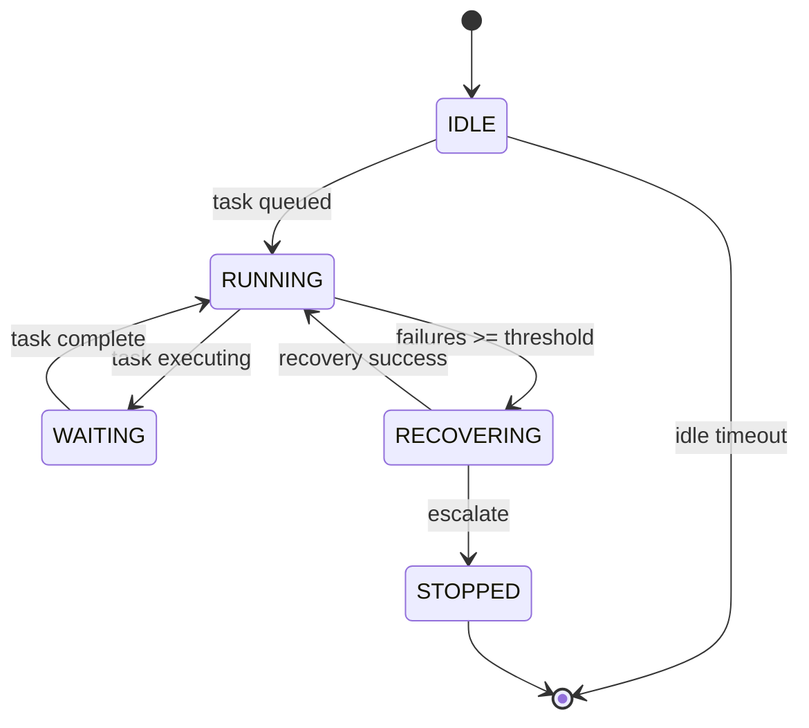

# Full Autonomy: Continuous Unattended Operation with Escalating Crash Recovery
> **Status:** ✅ Implemented | [Plan](../lyra-upgrade/plans/14-autonomy.md) | [Code](../../src/lyra/autonomy/)

## Abstract
Lyra's autonomy module enables sessions to run unattended via a continuous-operation loop with health monitoring, idle detection, and escalating crash recovery (retry→rollback→skip→escalate). The AutonomyLoop integrates with the supervisor daemon for process lifecycle and the fleet view for steer-by-exception oversight. Pre-execution confidence gating intercepts irreversible actions when P(success) < threshold.

## Method
`AutonomyLoop` (`src/lyra/autonomy/loop.py`): RunMode (ONCE/CONTINUOUS/SCHEDULED), max_idle_seconds auto-stop, health_check_interval polling, max_consecutive_failures escalation. `CrashRecovery` (`src/lyra/autonomy/recovery.py`): 6-step escalation order (RETRY×3 → ROLLBACK → SKIP → ESCALATE), failure_rate tracking per window.

## Conclusion
Implemented: AutonomyLoop, CrashRecovery, health monitoring. Future: learned recovery policies from trajectory data.
