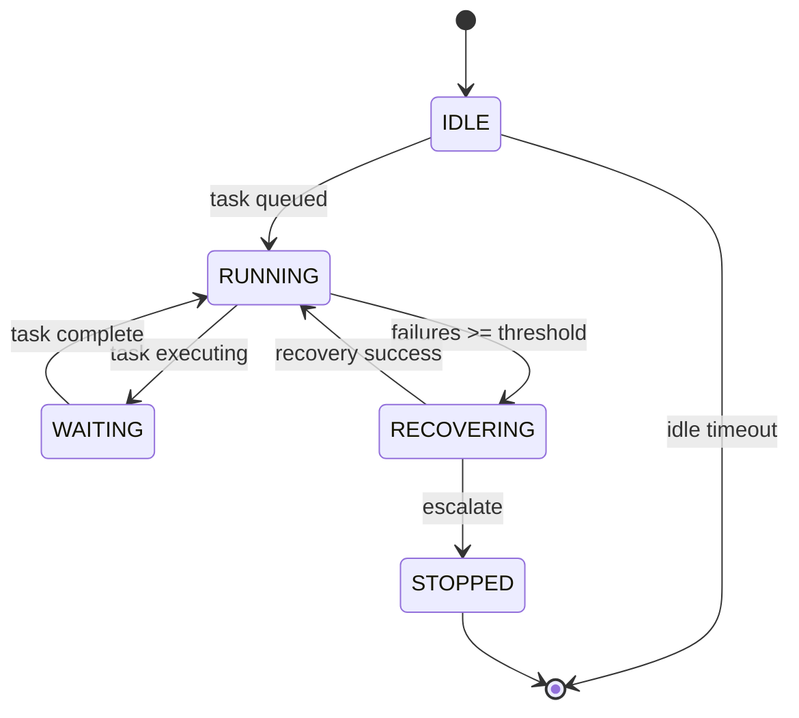

# Full Autonomy: Continuous Unattended Operation with Escalating Crash Recovery
> **Status:** ✅ Implemented | [Plan](../lyra-upgrade/plans/14-autonomy.md) | [Code](../../src/lyra/autonomy/)

## Abstract
Lyra's autonomy module enables sessions to run unattended via a continuous-operation loop with health monitoring, idle detection, and escalating crash recovery (retry→rollback→skip→escalate). The AutonomyLoop integrates with the supervisor daemon for process lifecycle and the fleet view for steer-by-exception oversight. Pre-execution confidence gating intercepts irreversible actions when P(success) < threshold.

## Method
`AutonomyLoop` (`src/lyra/autonomy/loop.py`): RunMode (ONCE/CONTINUOUS/SCHEDULED), max_idle_seconds auto-stop, health_check_interval polling, max_consecutive_failures escalation. `CrashRecovery` (`src/lyra/autonomy/recovery.py`): 6-step escalation order (RETRY×3 → ROLLBACK → SKIP → ESCALATE), failure_rate tracking per window.

## Working Flow

You start a long research task — "analyze all memory papers from 2024" — then close your laptop. Lyra's `AutonomyLoop` in `src/lyra/autonomy/loop.py` keeps running without supervision.

It cycles through three modes: ONCE runs one task and stops. CONTINUOUS polls for new work. SCHEDULED runs on a timer. A health monitor checks every few seconds: is the process alive and progressing? When something fails, `CrashRecovery` in `src/lyra/autonomy/recovery.py` escalates through six steps: retry three times, then rollback, then skip, then alert a human. A confidence gate also blocks high-risk actions when the predicted success rate is too low.

**Example:** You queue a 20-paper analysis and walk away.
1. AutonomyLoop starts in CONTINUOUS mode.
2. Paper 1 crashes → retry succeeds on the first retry.
3. Paper 3 crashes three times → rollback to last checkpoint.
4. Paper 7 has low confidence → skipped automatically.
5. After all 20 papers, idle timer starts counting.
6. Max idle reached → loop stops cleanly.
7. You return to a completed analysis with a recovery log.

## Conclusion
Implemented: AutonomyLoop, CrashRecovery, health monitoring. Future: learned recovery policies from trajectory data.
