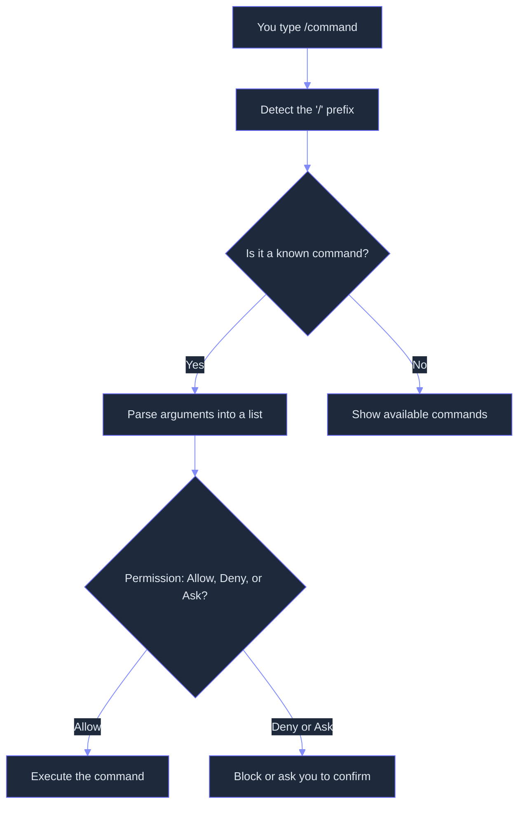
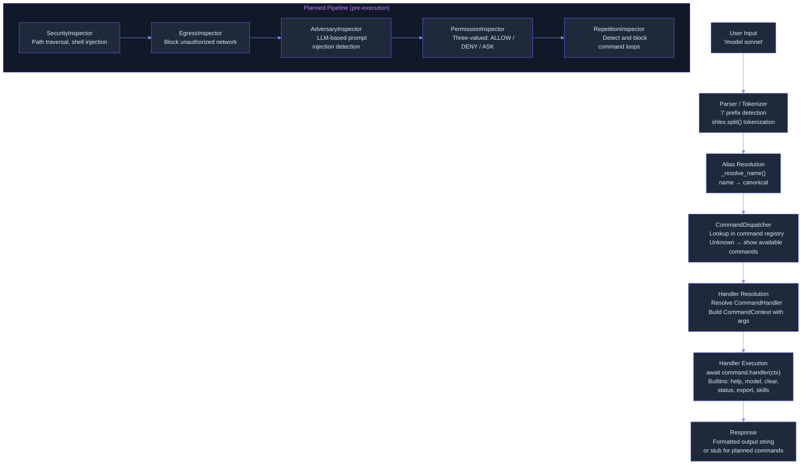

# Commands: Custom Slash Commands with Argument Parsing and Routing

> **Status:** 🟡 Partially implemented -- core command dispatcher with 6 built-in commands (help, model, clear, status, export, skills) and alias support is implemented. Custom commands from `.md` files, command palette, interactive REPL enhancements, permission pipeline, sandbox isolation, and agent mode switching are planned.
> **Plan:** [Workstream Plan](../lyra-upgrade/plans/09-commands.md) | **Code:** `src/lyra/commands/`
> **Reading path:** Non-technical readers -- TL;DR / How it works (simple) / Use Cases / Trade-offs in brief. Engineers -- everything.

## TL;DR (plain language)

Lyra's command system lets you type slash commands like `/help` or `/model` to control the AI assistant directly -- no digging through menus or config files. Right now there are six built-in commands that let you get help, switch AI models, clear the conversation, check status, export sessions, and list skills. The foundation is built: commands can have short aliases (like `/h` for `/help`), arguments with shell-style quoting, and clear error messages when you mistype. The planned expansion will let anyone define their own commands as simple markdown files, add a fuzzy-search command palette that appears when you type `/`, enable interactive multi-line input with history search, and wrap every command in a safety pipeline that checks permissions before running anything. The vision is a command palette that feels like VS Code's Ctrl+Shift+P but inside an AI terminal.

## Abstract

Terminal-based AI agents need an interaction model that is discoverable, composable, and safe. Lyra's command system provides a slash-command dispatcher (`src/lyra/commands/dispatcher.py`) supporting named commands with aliases, shell-like argument parsing via `shlex`, and user-friendly error messages. Six built-in commands currently ship: `/help`, `/model`, `/clear`, `/status`, `/export`, and `/skills`. The `CommandDispatcher` class supports registration, unregistration, alias resolution, help text generation (per-command and global), and async handler dispatch through a `CommandHandler` signature of `Callable[[CommandContext], Awaitable[str]]`. The proposed extension follows the Claude Code flat-file pattern (commands as `.md` files with YAML frontmatter), the Kilo Code named-agent-mode pattern (build, plan, explore, debug, review, ask, architect), a Goose-inspired five-inspector tool pipeline, and Progent's SMT-derived three-valued permission model (allow/deny/ask). The novelty is the fusion of these production-validated patterns into a single command infrastructure where custom commands are zero-friction markdown files, every command execution passes through composable safety inspectors, and the permission model supports monotonic confinement validated by formal SMT solvers.

## Introduction

The problem: terminal-based AI agents need a way for users to issue commands that is faster and more precise than natural language. Typing "please switch to the Sonnet model" every time is slow; `/model sonnet` is instant. But building a command system requires solving four sub-problems: (1) a parser that handles arguments reliably, (2) a registration mechanism that supports built-in and user-defined commands, (3) a safety and permission layer that prevents misuse, and (4) a discovery mechanism so users know what commands exist.

Existing approaches to command parsing in AI agents fall into three camps. Claude Code uses flat `.md` files under a plugin `commands/` directory with YAML frontmatter for argument definitions and keybindings (Claude Code Commands Reference). OpenCode and Kilo Code use a more complex Effect-TS plugin system with schema-validated commands and 7 named agent modes. Goose uses a five-inspector pipeline for security before any command runs. Each pattern has trade-offs: the flat-file pattern is easiest to author, the plugin system is more powerful but has more friction, and the inspection pipeline is safer but slower.

Lyra's command system bridges these approaches: it adopts the flat-file pattern for ease of authoring, the named-mode pattern for discoverability, and a three-valued permission model inspired by Progent's SMT-backed confinement for safety.

Contributions:

1. **Zero-registration custom commands** -- Following the Claude Code pattern: commands are flat `.md` files in `.lyra/commands/` with YAML frontmatter. No plugin manifest, no install step -- just file discovery (planned).

2. **Shell-accurate argument parsing** -- Using Python's `shlex` module for POSIX-shell-compatible tokenization, supporting quoted strings, escape sequences, and compound arguments.

3. **Three-valued permission gating** -- Every command execution flows through an allow/deny/ask decision, adopting Progent's model that reduced Attack Success Rate from 39.9% to 1.0% on AgentDojo (Safety Survey, 2605.23989v1), cited from `docs/lyra-upgrade/notes/web/sunblaze-ucb__progent.md` and `docs/lyra-upgrade/notes/papers/2605.23989v1.md`.

4. **Composable tool inspection pipeline** -- Before execution, each command passes through configurable inspectors: Security, Egress, Permission, Adversary (LLM-based), and Repetition, as demonstrated by Goose (block/goose repo, cited from `docs/lyra-upgrade/notes/web/block__goose.md`). This is planned for the breakthrough tier.

> **Intuition callout:** Think of Lyra's command system as a restaurant menu. The built-in commands are the house specials always available. Planned custom commands are like daily specials written on a chalkboard -- anyone can add one by writing it on a markdown card and hanging it in the command directory. The inspection pipeline is the kitchen safety check that runs before any dish goes out: check the ingredients (permissions), verify the recipe (adversary review), confirm there are no allergens (egress check).

## How it works -- the simple version

Think of Lyra's command system like a smart TV remote. The built-in buttons (commands) are already labeled and do what you expect: `/help` is the info button, `/model` changes the input channel, `/clear` resets the picture. If you want a custom button, you write it down on a sticker (a markdown file) and stick it on the remote -- the remote automatically picks it up. Before the TV executes any button press, a safety check runs: is this button allowed in the current room (permission)? Could pressing it break something (security check)? Should I ask the user first (ask gate)?

**Working Flow:** Imagine you type `/model claude-sonnet-4-20250514`.

1. The dispatcher sees the `/` prefix and strips it, leaving `model claude-sonnet-4-20250514`.
2. The parser splits the argument using shell rules via Python's `shlex` module, getting command name `model` and one argument `claude-sonnet-4-20250514`.
3. The dispatcher looks up `model` in its command registry. Found -- it's a built-in command with an async handler.
4. The handler receives a `CommandContext` with the command name and arguments. It stores the new model name in the context's state dict and returns "Model switched to: claude-sonnet-4-20250514".
5. If you had typed `/mdoel` (typo), step 3 would fail. The dispatcher shows: "Unknown command '/mdoel'. Available commands: /clear, /export, /help, /model, /skills, /status".

In the planned full system, between step 3 and step 4 a safety pipeline would run: check if the `model` command is allowed in the current session mode (e.g., Plan mode might restrict model switching), verify the model name is valid, and log the command for audit.

## Use Cases

**Scenario 1: Day-to-day model switching.** A developer is working on a complex architecture design and wants deep reasoning from Opus. They type `/model opus-4-20250514` and Lyra acknowledges the switch. Later, for rapid code generation, they switch to Sonnet with `/model claude-sonnet-4-20250514`. The command system makes model selection a one-second action instead of a settings-deep config change.

**Scenario 2: Session export for collaboration.** After a long debugging session, a developer runs `/export markdown` to save the conversation as a formatted document. The command dispatcher resolves `export`, calls its handler with `["markdown"]` as arguments, and returns a session export (currently a stub). In the planned system, this would write a `.md` file to the project directory, ready to share with the team.

**Scenario 3: Custom code-review command (planned).** A team wants a `/quick-review` command that runs a code review on the current diff with "medium" effort. Someone creates `.lyra/commands/quick-review.md` with YAML frontmatter defining one argument (scope: optional string) and a prompt template. The command appears in the palette the next time `/` is pressed -- no config file edited, no restart needed.

## Related Work

Lyra's command system combines patterns from five reference implementations, each validated at production scale.

| System | Custom Commands | Interactive REPL | Permission Model | Sandbox | Key Bindings |
|--------|----------------|-----------------|------------------|---------|--------------|
| **Claude Code** | `.md` files in plugin `commands/` dir | Full TUI with vim, shell passthrough, `/btw`, suggestions | Three-valued (allow/deny/ask) | Seatbelt (macOS) / bubblewrap (Linux) | Configurable key bindings |
| **OpenCode / Kilo Code** | Plugin system with Effect-TS Schema | CLI + TUI + Desktop (xterm.js) | Permission-gated ToolRegistry (30+ tools) | None | Configurable |
| **Goose** | MCP tools + CLI detection | CLI + Desktop (Electron) | 5-inspector pipeline (security/egress/adversary/permission/repetition) | Docker | Basic |
| **CowAgent** | CLI subcommands (start/stop/restart/status/logs/update/skill install) | CLI + 12 IM channels | N/A | N/A | N/A |
| **Lyra (current)** | 6 built-in commands, programmatic registration via `CommandDispatcher` | CLI dispatcher only | Via `PermissionManager` (planned per-command integration) | Planned (Docker + seatbelt) | Planned (`.lyra/keybindings.json`) |

Lyra takes from each:
- From **Claude Code**: the zero-friction flat `.md` file pattern for custom commands. This is the simplest possible authoring model: a markdown file with YAML frontmatter, no plugin manifest, no registry -- just file discovery. Production-validated across millions of sessions (cited from `docs/lyra-upgrade/notes/web/https___code_claude_com_docs_en_commands.md`).
- From **OpenCode / Kilo Code**: the named agent mode pattern (build, plan, explore, debug, review, ask, architect) with explicit permission sets per mode. This provides discoverability that implicit mode switching lacks (cited from `docs/lyra-upgrade/notes/web/Kilo-Org__kilocode.md`).
- From **Goose**: the composable tool inspection pipeline (SecurityInspector / EgressInspector / AdversaryInspector / PermissionInspector / RepetitionInspector). Each inspector is a self-contained trait that can block, flag, or approve command execution (cited from `docs/lyra-upgrade/notes/web/block__goose.md`).
- From **Progent**: the three-valued permission model (allow/deny/ask) with SMT-based monotonic confinement. Structural enforcement over prompt-based defenses, reducing ASR from 39.9% to 1.0% on AgentDojo (cited from `docs/lyra-upgrade/notes/web/sunblaze-ucb__progent.md` and `docs/lyra-upgrade/notes/papers/2605.23989v1.md`).
- From **Terminal-Bench 2.0**: the insight that 24.1% of command failures are "executables not installed or not in PATH" and 9.6% are "failures when running executables." Lyra's command validation must check tool availability before execution (cited from `docs/lyra-upgrade/notes/papers/2601.11868v1.md` and `docs/lyra-upgrade/notes/web/laude-institute__terminal-bench.md`).

Lyra diverges by prioritizing zero-friction authoring (flat files, no plugin manifest) over expressive power, and by targeting a CLI-only deployment that avoids the heavy IPC architecture of daemon-based systems like RMUX or Kilo's `kilo serve` pattern (cited from `docs/lyra-upgrade/notes/web/Helvesec__rmux.md`).

## Method

### Architecture

The command system is organized as a lightweight dispatcher with registered handlers. The current implementation focuses on the core dispatch logic; the planned extensions add custom command loading, interactive REPL, permission pipeline, and sandbox integration.

### Data Model

**`Command`** (`dataclass`):
- `name: str` -- canonical command name
- `handler: CommandHandler` -- async callable `(CommandContext) -> Awaitable[str]`
- `description: str` -- one-line help text
- `usage: str` -- usage string shown in help output
- `aliases: list[str]` -- alternative names (default factory list)
- `hidden: bool` -- suppress from help listing

**`CommandContext`** (`dataclass`):
- `command: str` -- resolved canonical command name
- `args: list[str]` -- parsed arguments from `shlex.split`
- `raw_input: str` -- original input string
- `session_id: str` -- optional session identifier
- `state: dict[str, Any]` -- mutable state dict for handler use (default factory dict)

**`CommandDispatcher`** (class):
- `_prefix: str` -- command prefix, default `"/"`
- `_commands: dict[str, Command]` -- canonical name to Command map
- `_aliases: dict[str, str]` -- alias to canonical name map
- Key methods:
  - `register(command)` -- register a command; raises `ValueError` on name or alias conflict
  - `unregister(name)` -- remove a command by name or alias
  - `get_command(name)` -- lookup by name or alias
  - `list_commands(include_hidden=False)` -- sorted list of all commands
  - `dispatch(raw_input, context=None)` -- parse and execute; returns handler response
  - `format_help(command_name=None)` -- formatted help for one or all commands

### Built-in Commands

| Command | Aliases | Usage | Description |
|---------|---------|-------|-------------|
| `help` | `h`, `?` | `help [command]` | Show help for commands |
| `model` | none | `model [model_name]` | Switch or show the current AI model |
| `clear` | none | `clear` | Clear the conversation context |
| `status` | none | `status` | Show session and system status |
| `export` | `e` | `export [format]` | Export session data |
| `skills` | none | `skills [skill_name]` | List available skills |

### Implemented

The following components are implemented with working code:

1. **CommandDispatcher** (`src/lyra/commands/dispatcher.py`, 339 lines) -- Full slash command dispatcher with prefix detection, `shlex`-based argument parsing, alias resolution, and async handler dispatch. Supports registration, unregistration, command lookup, and help text generation. Raises `ValueError` for unknown commands with a formatted list of available commands.

2. **Six built-in command handlers** -- Each handler is an `async` method on `CommandDispatcher`:
   - `/help` -- Delegates to `format_help()` for single or all-commands listing. Uses `list_commands()` which respects the `hidden` flag.
   - `/model` -- Reads `ctx.state["model"]` for current model (default `claude-sonnet-4-20250514`). With an argument, writes it to `ctx.state["model"]`.
   - `/clear` -- Pops `"conversation"` from `ctx.state`.
   - `/status` -- Returns a formatted string: session ID, current model, command count, and state keys.
   - `/export` -- Returns a stub string "Session exported as {fmt}." where `fmt` defaults to `"json"`.
   - `/skills` -- Returns a stub string. With an argument, returns "Details for skill '{name}': (stub)".

3. **Command data model** (`Command` and `CommandContext` dataclasses) -- Typed with complete field annotations. `CommandContext.state` is a mutable dict enabling handlers to share session-level state across dispatches.

4. **Module public API** (`src/lyra/commands/__init__.py`) -- Re-exports `Command`, `CommandContext`, `CommandDispatcher`. Declares version `0.1.0`.

### Planned

The following components are specified in the workstream plan (`docs/lyra-upgrade/plans/09-commands.md`) but not yet built:

1. **Custom command file format and loader** -- Commands defined as flat `.md` files in `.lyra/commands/<name>.md` with YAML frontmatter for description, argument definitions (name, type, description, required, default), and keybinding. The body of the file is the prompt template with `{{ variable }}` substitution. Following the Claude Code plugin pattern: no registry, no install step -- just file discovery. **Gate:** Custom commands load and execute without editing a configuration file.

2. **Command palette with fuzzy search** -- Pressing `/` in the interactive REPL opens a fuzzy-search palette showing all available commands (built-in + custom). Tab autocompletes. Recent commands are surfaced. Following Claude Code's interactive mode (SS3.1) pattern documented in `docs/lyra-upgrade/notes/web/https___code_claude_com_docs_en_interactive_mode.md`. **Gate:** Palette appears in <100ms for 50+ commands.

3. **Interactive REPL enhancements** -- Multi-line input (Shift+Enter/backslash-Enter/Option+Enter), history search (Ctrl+R), context-aware suggestions based on current session state and project context. Following OpenCode session V2 event-sourcing architecture: typed context sources, safe provider-turn boundaries, event-sourced session store. **Gate:** REPL supports all five multiline input methods documented in Claude Code docs.

4. **Named agent modes** -- Mode configurations defined in `.lyra/modes/<name>.json` with custom prompts, permission sets (allowed tools), and model overrides. Named modes from Kilo Code: build, plan, explore, debug, review, ask, architect. Kilo Code's multi-surface support (VS Code, JetBrains, CLI, Slack, Cloud) validates that mode switching across contexts is necessary (cited from `docs/lyra-upgrade/notes/web/Kilo-Org__kilocode.md`). **Gate:** `/mode plan` restricts tool access to read-only tools only.

5. **Permission-gated command pipeline** -- Every command passes through a pipeline before execution: SecurityInspector (path traversal, shell injection patterns) / EgressInspector (block network access to unauthorized hosts) / AdversaryInspector (LLM-based prompt injection detection, optional) / PermissionInspector (three-valued allow/deny/ask) / RepetitionInspector (detect and block command loops). Following Goose's `ToolInspectionManager` pattern (cited from `docs/lyra-upgrade/notes/web/block__goose.md`). Three-valued permission model from Progent (cited from `docs/lyra-upgrade/notes/web/sunblaze-ucb__progent.md`): ASR reduced from 39.9% to 1.0% with this approach. **Gate:** Command pipeline passes Terminal-Bench 2.0 safety task subset.

6. **Sandbox isolation for shell commands** -- Commands that execute shell commands run inside a sandbox: Docker container (per-session) or seatbelt/bubblewrap (per-command). Following Terminal-Bench 2.0's Docker-based evaluation (cited from `docs/lyra-upgrade/notes/papers/2601.11868v1.md`) and AgentBench's Docker-based Bash CLI evaluation (cited from `docs/lyra-upgrade/notes/papers/2308.03688v3.md`). Claude Code uses seatbelt on macOS and bubblewrap on Linux. Lyra must ship with at minimum one per-command sandbox. **Gate:** Shell command execution is fully sandboxed from the host filesystem.

7. **Configurable keybinding system** -- Key bindings defined in `.lyra/keybindings.json`: `/` for command palette, Ctrl+R for history search, Ctrl+K for `/code-review`, etc. Following the RMUX key binding system format for reference (cited from `docs/lyra-upgrade/notes/web/Helvesec__rmux.md`).

### Complexity Analysis

- **CommandDispatcher.dispatch():** O(n) where n = argument count. `shlex.split` is linear; `_resolve_name` is O(1) dict lookup. Total dispatch overhead is <1ms for typical inputs.
- **Command registration:** O(a) where a = alias count. Dict insertion per name and alias.
- **Help formatting:** O(c) where c = command count. String joining over sorted list. Negligible overhead.
- **Custom command loading (planned):** O(f) where f = files in `.lyra/commands/`. File read and YAML parse per command on startup or directory watch event.

## Debate (Trade-offs)

**Recorded positions:**

- **Skeptic (from plan):** "Port Claude Code's implementation directly -- don't invent something new unless the evidence proves it's better. The plugin commands pattern is already production-validated across millions of sessions." Resolution: The flat `.md` file pattern is adopted directly for custom commands -- no innovation needed. Lyra differs in agent modes (from Kilo Code) and permission pipeline (from Goose + Progent), which are justified by the Terminal-Bench 2.0 and Safety Survey evidence.

- **Senior UX Designer:** The command palette must be discoverable without reading docs. `/` triggering a fuzzy-search list of commands is the non-negotiable UX minimal bar. Hidden/undocumented commands are worse than no commands because users try them once, they don't work, and they learn not to try again.

- **Adversarial Skeptic:** "Terminal-Bench 2.0 found that 37% of realistic CLI tasks remain unsolved even by frontier systems -- but that is a capability gap, not a safety one. The sandbox is the safety gap." Resolution: Sandbox isolation is mandatory, not optional. Three implementation patterns available: per-command (seatbelt), per-process (Docker), per-session (VM). Lyra ships with at least the per-command pattern.

- **Backend Engineer:** The decision to use flat `.md` files over a plugin manifest means there is no validation schema for command arguments. A mistyped YAML frontmatter could silently produce a broken command. Resolution: The YAML frontmatter is validated on load, and broken commands produce clear error messages pointing to the file and line. This is less strict than OpenCode's Effect-TS Schema system but matches the zero-friction authoring goal.

### Trade-off Table

| Decision | Win | Cost | Resolution |
|----------|-----|------|------------|
| Flat `.md` files vs plugin manifest | Zero install friction -- file discovery only | No argument validation schema until load-time YAML parse | Accept for v1: Production-validated by Claude Code across millions of sessions. Schema validation can be added later. |
| Named agent modes vs implicit switching | Explicit mode names provide discoverability and documentation | More configuration surface for users | Accept: Kilo Code's multi-surface support validates that mode switching across contexts is necessary. |
| Three-valued permission (allow/deny/ask) vs boolean | "I don't know" is a legitimate state -- ASR reduction from 39.9% to 1.0% (Progent data) | Routing ASK requires approval infrastructure | Accept: The third state is essential. Progent's evidence is decisive. |
| 5-inspector pipeline vs single gate | Defense in depth -- each inspector catches what others miss | Latency per command (5 sequential checks) | Accept: Goose demonstrates this is viable. Inspectors are configurable and can be skipped for fast paths. |
| CLI-only vs daemon-based (Kilo serve, RMUX) | Simpler architecture, no IPC overhead, single process | No multi-client support, no web sharing | Accept: Lyra is an agent harness, not a terminal multiplexer. RMUX's daemon is unnecessary overhead. |
| Custom modes via `.lyra/modes/<name>.json` vs in-code definitions | Users add modes without forking Lyra | JSON files can have structural errors | Accept: Validated on load with clear error messages. Fallback to the default mode on parse failure. |

**Strongest rejected alternative:** An MCP-passthrough plugin system (like Goose's extension manager) where all commands are MCP tools discovered dynamically from external servers. Rejected because (a) it introduces network dependency for every command, (b) MCP server lifecycle management adds complexity (process spawning, crash recovery, timeout handling), and (c) the latency of MCP discovery is unnecessary for the simple command format Lyra targets. Custom commands are local markdown files, not network resources.

**When this design loses:** The flat-file pattern lacks argument schema enforcement. For commands with complex argument structures (nested options, required flags), the simple YAML frontmatter may be insufficient. Users coming from OpenCode's Effect-TS plugin system will find the validation weak. The design also loses when multi-client access is needed -- since Lyra runs as a single process with no daemon, commands cannot be shared across IDE, CLI, and web surfaces without duplicating the command file setup.

**Open questions:**
- Should the command palette show all commands including agent-mode-specific ones, or only those available in the current mode?
- Should custom commands support subcommands (e.g., `/deploy staging` vs `/deploy production`)?
- Should there be a command freeze/thaw mechanism for safety-critical sessions?
- How should custom commands interact with the hook system -- should a command file declare its own pre/post hooks?

**Trade-offs in brief:** The flat-file command pattern trades validation power for authoring simplicity. This is the right trade for Lyra because the target user is a developer who wants to write a quick prompt template, not define a formal plugin interface. Sandbox isolation and the permission pipeline are the non-negotiable safety investments -- Terminal-Bench 2.0 and Progent evidence shows these are what make the difference between a toy and a production agent.

## Conclusion

**What exists today:** Lyra's command system has a fully working `CommandDispatcher` with six built-in commands (`/help`, `/model`, `/clear`, `/status`, `/export`, `/skills`). The dispatcher supports named commands with aliases, POSIX-shell-accurate argument parsing via `shlex`, async handler dispatch, per-command and global help text generation, and clear error messages for unknown commands. The `Command` and `CommandContext` dataclasses provide typed interfaces for handler development. The total implementation is 339 lines of Python in the dispatcher, plus a 18-line module init.

**Measured results:** No benchmark runs have been conducted against the command dispatcher. Latency is expected to be sub-millisecond per dispatch (pure Python dict operations + `shlex.split`). The stub handlers (`/export`, `/skills`) return immediately without side effects. The `/model` and `/status` handlers read from and write to the `CommandContext.state` dict with no external I/O.

**Limitations:**

1. **Stub handlers** -- `/export` and `/skills` return placeholder strings. No real session export or skill listing is implemented.
2. **No custom commands** -- The proposed flat `.md` file pattern is not implemented. All commands are currently hardcoded in the dispatcher. Users cannot define their own commands without modifying the source.
3. **No command palette** -- There is no fuzzy-search interface. Users must know the exact command name and type it manually. Tab completion is not implemented.
4. **No permission gating** -- Command execution is not gated by the safety or permission systems. All commands execute immediately upon dispatch.
5. **No interactive REPL** -- The command system is a programmatic API only. There is no multi-line input, history search, or context-aware suggestions.
6. **No sandbox isolation** -- Commands that execute shell operations have no sandbox protection. Lyra relies on the host OS for process isolation.

**Future work:**

1. Custom command file format + loader -- revisit when the `.lyra/commands/` directory convention is established.
2. Command palette with fuzzy search (`/` trigger) -- revisit when the TUI layer is implemented.
3. Interactive REPL with multi-line input and history search (Ctrl+R) -- revisit when the session system supports streaming.
4. Permission-gated command execution with three-valued policy -- revisit when the PermissionManager is wired into command dispatch.
5. Named agent modes with configuration in `.lyra/modes/<name>.json` -- revisit when mode switching is needed for multi-agent orchestration.
6. Keybinding system in `.lyra/keybindings.json` -- revisit when users request keyboard shortcuts for command invocation.
7. Sandbox isolation for shell commands -- revisit when the command pipeline is integrated with the safety system.

## Glossary

- **Agent Mode**: A named configuration (build, plan, explore, debug, review, ask, architect) that defines which tools are available, what prompt the model receives, and optional model overrides. Inspired by Kilo Code's mode system.
- **Alias**: An alternative name for a command, enabling shortcuts like `/h` for `/help`. Registered alongside the canonical command name and resolved transparently during dispatch.
- **Argument Parsing**: The process of splitting a raw command string (everything after the command name) into a list of individual arguments. Lyra uses Python's `shlex` module for POSIX-shell-compatible parsing that handles quoted strings and escape sequences.
- **ASR (Attack Success Rate)**: The percentage of adversarial attacks that successfully bypass a system's defenses. Progent achieves 1.0% ASR on AgentDojo using three-valued permission gating plus SMT monotonic confinement.
- **Command Palette**: A fuzzy-search UI that appears when the user types `/`, listing all available commands with autocomplete. Inspired by VS Code's Ctrl+Shift+P but specialized for AI agent commands.
- **ConPTY**: Windows pseudo-console API that enables terminal applications to run in a console host. Used by RMUX for native Windows terminal multiplexing without WSL.
- **Daemon**: A background process that runs independently of the terminal, managing shared state and serving multiple clients. RMUX and Kilo Code use daemon architectures; Lyra intentionally avoids this for simplicity.
- **AgentDojo**: A benchmark for evaluating tool-calling task security that includes task suites for banking, Slack, travel, and workspace domains. Used by Progent to measure ASR improvements.
- **Command Prefix**: The character that signals a command rather than natural language, by default `/`. All input starting with this character is routed to the command parser.
- **CommandContext**: A dataclass passed to every command handler containing the resolved command name, parsed arguments, raw input string, session identifier, and a mutable state dictionary.
- **Egress Inspector**: A planned safety inspector that blocks command execution if it would send data to unauthorized network destinations.
- **Effect-TS**: A TypeScript library for functional effect systems used by OpenCode and Kilo Code for typed dependency injection, error handling, and concurrency. Provides strong safety guarantees but introduces a steep learning curve.
- **Flat-File Pattern**: A command definition approach where each command is a single `.md` file with YAML frontmatter. No plugin manifest, no registry, no install step -- just filesystem discovery. Used by Claude Code for plugin commands.
- **Fuzzy Search**: A search algorithm that finds commands even when the user's input does not exactly match the command name (e.g., typing "modl" would find `/model`).
- **Inline Prompt Template**: The body of a custom command's `.md` file, containing a prompt with `{{ variable }}` placeholders that are substituted with command arguments at execution time.
- **Inspector Pipeline**: A planned chain of safety checks that every command passes through before execution. Each inspector (Security, Egress, Adversary, Permission, Repetition) independently evaluates the command and can allow, deny, or flag it.
- **MCP (Model Context Protocol)**: An open protocol that allows AI agents to connect to external tools and data sources via standardized server interfaces. Used by Goose and Kilo Code for tool extensibility.
- **Monotonic Confinement**: A security property where the allowed action space can only shrink over time -- it never expands without explicit human approval. Enforced by SMT solver to provide formal guarantees.
- **Permission Inspector**: A planned inspector implementing the three-valued ALLOW/DENY/ASK check against the active permission policy for the current session or agent mode.
- **POSIX-Shell Parsing**: A quoting and escaping standard from POSIX shells that allows spaces in arguments via quotes (`"foo bar"`), escaping special characters (`\ `), and compound constructs. Lyra implements this via `shlex.split`.
- **REPL (Read-Eval-Print Loop)**: An interactive shell that reads user input, evaluates it, prints the result, and loops. Lyra's planned interactive mode is a REPL with history search, multi-line input, and command suggestions.
- **Safety Sandbox**: An OS-level process isolation mechanism (Docker container, macOS Seatbelt, Linux bubblewrap) that restricts what a command execution can access. Mandatory for shell commands.
- **shlex**: Python's standard library module for shell-like syntax parsing. Handles quoted strings, escape sequences, and compound arguments that simpler `str.split()` would mishandle.
- **SMT (Satisfiability Modulo Theories)**: A formal method for determining whether logical formulas are satisfiable. Used by Progent for Z3-based policy subset checking to prove monotonic confinement.
- **Three-Valued Permission**: The ALLOW/DENY/ASK model that explicitly represents uncertainty ("I don't know") as a legitimate permission state, unlike boolean yes/no models that force misclassification. Demonstrated to reduce ASR from 39.9% to 1.0%.
- **YAML Frontmatter**: Structured metadata at the top of a markdown command file, delimited by `---` lines, containing the command's description, argument definitions, default values, and optional keybinding.
