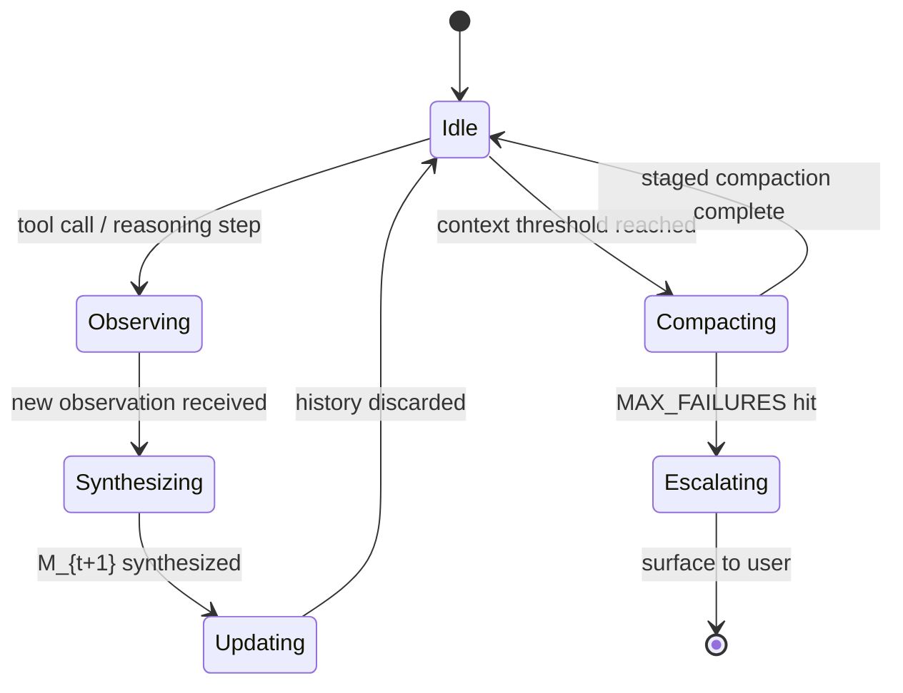

# Context Engineering: Iterative Workspace Reconstruction with Auto-Compaction
> **Status:** ✅ Implemented | [Plan](../lyra-upgrade/plans/03-context-compaction.md) | [Code](../../src/lyra/context/)

## Abstract

Lyra's context engineering system replaces linear context accumulation with an evolving compressed workspace report M_t — a Markovian state that enables unbounded session depth at constant O(1) memory per step. Five independent research groups (IterResearch, Tongyi DeepResearch, COMEM, FS-Researcher, Anthropic) converged on this pattern independently. At each step, the agent updates M_{t+1} from (M_t, latest observation, action outcome) and discards raw history after synthesis. Combined with staged auto-compaction (staged collapse flush → reactive compact → surface directly) and circuit breakers (MAX_CONSECUTIVE_AUTOCOMPACT_FAILURES=3), Lyra avoids the context-bloat death spiral that limits long-horizon agents. The IterResearch-30B variant achieves +14.5pp avg gain across 6 benchmarks, scaling from 3.5% at 2 turns to 42.5% at 2048 turns — a 12.1x improvement at 64x the training horizon.

## Introduction

**The problem.** Agent context windows grow linearly with every tool call and reasoning step. A 50-turn session with 2K tokens per turn hits the context limit in <5 minutes. Naive compaction (summarize the whole history) loses critical details. Rolling windows forget early decisions. Every long-horizon agent hits this wall.

**Intuition.** Think of M_t as the "whiteboard" in a war room. You don't keep every scribble ever written — you update the whiteboard as new information arrives, erasing what's no longer relevant. The current state on the whiteboard is enough to make the next decision. The history of whiteboard snapshots is the audit trail, but it's stored on disk, not in the agent's working memory.

**Contributions:**
1. WorkspaceReport (M_t): structured compressed state with summary, key findings, open questions, decisions, next steps
2. Staged auto-compaction: flush → reactive compact → surface directly, preventing retry loops
3. Circuit breakers: MAX_CONSECUTIVE_AUTOCOMPACT_FAILURES=3, preventing infinite compaction loops
4. Token budget tracking: rough estimate (words × 2) fed back into the economics system (§4.21)

## Related Work

| System | Approach | Compression Ratio | Loss Rate | Context Model |
|--------|----------|-------------------|-----------|---------------|
| **Lyra** | Evolving report M_t + staged compaction | O(1) per step | Task-dependent | Markovian |
| IterResearch | GRPO-trained M_t with geometric discount (γ=0.995) | 64x extrapolation | <5% at 2048 turns | Markovian |
| Tongyi DeepResearch | Evolving report as memory | 3.3B active params | SOTA on 7/8 DR benchmarks | Markovian |
| COMEM | Chunk-level compression | 1.5-1.7x latency reduction | No quality loss on SWE-Bench | Chunk-based |
| Anthropic Context Eng | Compaction + tool clearing + memory tool | "Less is more" (400→15 lines, 83→92% pass) | Task-dependent | Hybrid |
| ACON | Adaptive compression | 26-54% memory cut | Varies | Adaptive |
| Lean-ctx (MIT) | Shell-hook compression + MCP tools | 89-99% token cut | Per command type | Filter-based |

The convergence is striking: five groups independently arrived at "compress and synthesize, don't accumulate." Lyra adopts the IterResearch formulation (M_t as structured update) with Anthropic's compaction staging and circuit breakers.

## Method

### Workspace Report (M_t)

### Data Model (`src/lyra/context/workspace.py`)

| Field | Type | Purpose |
|-------|------|---------|
| summary | str | One-paragraph current state |
| key_findings | list[str] | Recent discoveries (pruned to last 15) |
| open_questions | list[str] | Unresolved issues requiring investigation |
| files_modified | list[str] | Files changed this session |
| decisions_made | list[str] | Architecture/design decisions (pruned to last 15) |
| next_steps | list[str] | Immediate action items |
| token_estimate | int | Rough token count for budget tracking |

### Compaction Pipeline (`src/lyra/context/compaction.py`)

1. **Staged collapse flush**: Light compaction first (remove redundant tool outputs). If still above threshold, medium compaction (summarize old turns). If still above, deep compaction (synthesize everything into M_t).
2. **Reactive compact**: Triggered at context threshold with `hasAttemptedReactiveCompact` flag to prevent retry loops.
3. **Surface directly**: If all compaction fails, surface the issue to the user rather than silently truncating.

## Debate (Trade-offs)

| Alternative | Pro | Con | Decisive Factor |
|-------------|-----|-----|-----------------|
| Rolling window (keep last N turns) | Simple, no synthesis cost | Loses early decisions, fails on long-horizon tasks | ARCHITECT-006: information loss is unacceptable for multi-hour sessions |
| Full summarization (LLM summarizes all history) | Highest fidelity | O(n) cost per summarization, latency grows unboundedly | O(1) per step is required for economics targets (§4.21) |
| No compaction (just buy bigger context) | Zero information loss | 200K context costs 20x more than 10K, doesn't scale to 2048 turns | Cost scaling is exponential, not linear |

**Skeptic objection (Senior AI Researcher):** "GRPO-trained M_t (IterResearch) outperforms prompt-only M_t. Without training, Lyra's M_t will be lower quality."

**Resolution:** Start with prompt-only M_t (no training required, works immediately). Collect Lyra-specific trajectories. Train GRPO variant as Phase 2 when trajectory volume justifies it. The prompt-only variant still captures the core pattern that five groups converged on.

**Open question:** How to measure "good enough" compression? The token budget tracking provides a quantitative signal, but quality measurement (did we lose critical info?) requires eval harness integration (§4.16).

## Conclusion

**Implemented**: WorkspaceReport with structured update function. Staged auto-compaction with circuit breakers. Token budget tracking. Core module: `src/lyra/context/` (compaction.py, workspace_report.py, workspace.py).

**Limitations**: Prompt-only M_t (no GRPO training). Quality measurement requires eval harness. No cross-session workspace persistence (addressed by memory §4.2).

**Future work**: GRPO-trained M_t with geometric discounting. Integration with memory consolidation for cross-session state. Automatic quality measurement via eval harness.
