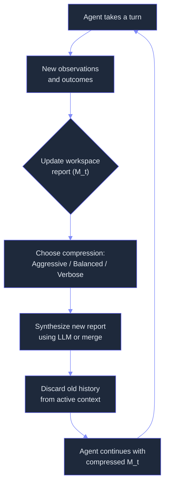
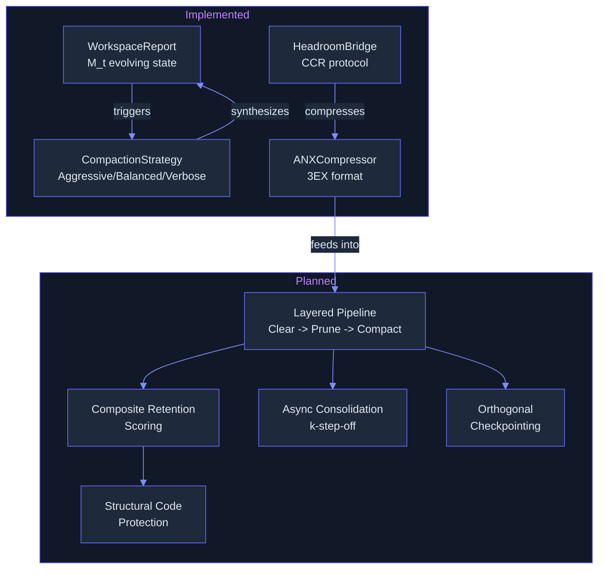

# Context Engineering: Token Optimization for Infinite Session Depth
> **Status:** 🟡 Partially implemented — evolving WorkspaceReport M_t, three compaction strategies (Aggressive/Balanced/Verbose), headroom bridge with Compress-Cache-Retrieve protocol, and ANX 3EX format for tool communication are implemented. The full layered compaction pipeline (threshold escalation, composite retention scoring, structural code protection, async k-step-off, orthogonal state checkpointing) remains planned.
> **Plan:** [Workstream Plan 03](../lyra-upgrade/plans/03-context-compaction.md) | **Code:** `src/lyra/context/`
> **Reading path:** Non-technical readers — TL;DR -> How it works (simple) -> Use Cases -> Trade-offs in brief. Engineers — everything.

## TL;DR (plain language)

Lyra's context system replaces the traditional approach of accumulating every conversation turn and tool result into a growing block of text. Instead, it keeps a compact "workspace summary" that gets updated after every few turns -- like rewriting a whiteboard rather than saving every sticky note ever written. This means conversations can go hundreds of turns without hitting the model's context limit, saving money and preventing the "lost in the middle" problem where the model forgets what happened early on. The core report-update pattern and three compression modes (mild, balanced, aggressive) are built and working. The full system -- including automatic threshold triggers that decide WHEN to compress, redundancy-aware pruning, and an async background compressor -- is designed but not yet implemented.

## Abstract

Long-horizon LLM agents fail predictably as context accumulates: tool outputs bloat, early findings get buried, and token budgets exhaust. Lyra's context engineering system attacks this problem with a layered compaction pipeline grounded in the Markovian workspace reconstruction pattern (M_t) independently validated by five research groups (IterResearch, Tongyi DeepResearch, COMEM, COMPASS, Anthropic). The implemented core -- `WorkspaceReport`, `CompactionStrategy`, `HeadroomBridge`, and `ANXCompressor` -- provides the M_t abstraction, configurable compression prompts, an external Compress-Cache-Retrieve (CCR) protocol, and a 3EX message format that achieves 47-66% tool-message token reduction. The full planned pipeline adds: (1) two-stage escalation with composite retention scoring (relevance + recency - redundancy), (2) tree-sitter-based structural code protection that preserves callsites and branch conditions during pruning, (3) progressive-disclosure skill loading, (4) async k-step-off context consolidation hiding compression latency, and (5) orthogonal 3-dimension state checkpointing with targeted summarization. The system is implemented as `src/lyra/context/` and provider-agnostic -- all strategies operate on Lyra's internal message representation before encoding to any model format.

## Introduction

**The problem.** Every agent session follows a death spiral. Turn 1-5: context is clean, the model reasons well. Turn 10-15: tool outputs from file reads and web searches have accumulated. Turn 25+: context is 80% stale tool results and redundant observations. The model forgets what it found early on ("lost in the middle"), begins hallucinating facts it previously confirmed, and eventually hits the context window limit and fails. For a 200K-token model, Anthropic's cookbook documents a research agent hard-stopping at turn 3 (168,242 tokens) without any context management. Lyra faces the same failure, compounded by multi-agent handoffs where each sub-agent inherits and extends the same growing context.

**Intuition callout.** Think of Lyra's context as a whiteboard in a war room. The team does not tape every scribble to the wall forever. Instead, someone periodically erases stale notes and writes a concise summary of where things stand. That summary (plus the last few minutes of activity) is enough to make the next decision. If someone needs the original scribble, it is in the filing cabinet (on disk). This is the mental model: the whiteboard stays small, the filing cabinet holds everything, and the team does not stop working while the whiteboard is being updated.

**What existing approaches do.** Anthropic's API provides three primitives: tool-result clearing (replaces bulky re-fetchable results with placeholders), compaction (summarizes the full transcript), and a memory tool for cross-session persistence. Claude Code adds targeted summarization (from-here / up-to-here) and orthogonal checkpointing. Lean-ctx achieves 60-97% token reduction with AST-backed code compression. Aider uses tree-sitter + PageRank for repo-map context. Mem0 provides multi-signal retrieval fusion. Each approach addresses a piece of the puzzle, but none composes them into a unified pipeline.

**The gap.** A pipeline that: (a) escalates through progressively aggressive strategies as pressure increases, (b) scores every chunk by relevance, recency, and redundancy before deciding what to keep, (c) protects structurally critical code spans (callsites, branches, return statements) from eviction, (d) runs compression asynchronously behind the agent so the agent never waits, and (e) checkpoints three orthogonal dimensions independently for surgical rollback. That is Lyra's designed-but-unbuilt system.

**Contributions:**
1. **WorkspaceReport (M_t):** An evolving compressed state replacing linear context accumulation, with configurable compaction strategies (Aggressive/Balanced/Verbose). Implemented.
2. **Headroom Bridge:** MCP-integrated Compress-Cache-Retrieve protocol for transparent 60-95% token reduction with BLAKE3-based content addressing and on-demand retrieval. Implemented.
3. **ANX 3EX Protocol:** Decoupled Expression-Exchange-Execution message format achieving 47-66% reduction in tool-message token footprint. Implemented.
4. **Layered Compaction Pipeline (planned):** Composite retention scoring (`0.35*relevance + 0.25*recency + 0.15*importance - 0.15*redundancy + 0.10*entity_boost`), tree-sitter structural code protection, COMPASS-structured compaction output, and threshold-based clearing/pruning/compaction escalation.
5. **Async Context Consolidation (planned):** COMEM-style k-step-off pipeline with small compressor model running behind the main agent, hiding compression latency.

## How it works -- the simple version

**The analogy.** Think of Lyra's context like a war-room whiteboard. Every time the team completes a task (a tool call, a reasoning step), the whiteboard gets a little more crowded. After a few tasks, someone with a marker summarizes what matters: "Connection pool was misconfigured -> fixed. Still seeing slow queries on table X. Next: check indexing." The old scribbles are erased. The team keeps working from the one-page summary.

**The diagram.**



**The working flow.** Imagine you are debugging a database issue. After turn 5, Lyra has run three queries, read two config files, and identified a connection-pool setting. Without context management, turns 6-10 would add all that raw output to an already-growing context. With Lyra's current system, after each turn the new observations feed into the WorkspaceReport via its `update()` method. The report text is a concise paragraph plus key findings. After turn 10, the context contains only the workspace report (a few hundred tokens) plus the most recent turn -- not all ten turns of raw output. The full log stays on disk. If you ask "what did the first query return?", Lyra can retrieve it from the filing cabinet. But the active reasoning context stays lean.

The compaction strategy determines how aggressively the report is compressed. `VERBOSE` mode keeps most detail (ideal for debugging). `BALANCED` mode (the default) retains the essential narrative. `AGGRESSIVE` mode keeps only the most critical facts and decisions, producing a report under 200 words. All three prompt templates are loaded from `src/lyra/context/compaction.py` and formatted with the current report, new observations, action outcome, and existing key findings.

For large tool outputs (file reads, search results, code listings), the HeadroomBridge transparently compresses them using the CCR protocol: the content is replaced with a `<<ccr:hash>>` marker (SHA-256 / BLAKE3) and the original is cached locally or in headroom's SQLite store. On re-read, the agent calls `headroom_retrieve` to get the original. This means a 500K-token file read becomes a ~13-token marker on re-access.

## Use Cases

**Scenario 1: Multi-hour debugging session.** A developer runs 40+ turns diagnosing a production memory leak. Without compaction, the context would fill with heap dumps, thread dumps, query results, and git bisect output. With Lyra's WorkspaceReport, findings accumulate in the structured report while raw dumps are cleared after each hypothesis is ruled out. Even after 200 turns, the agent operates from a compact whiteboard summarizing what has been ruled out, the current theory, and the next experiment to run.

**Scenario 2: Cross-session knowledge handoff.** A user starts a session, explores a codebase, and makes findings. At session end, the workspace report and key findings are extracted. In a new session three days later, Lyra retrieves the previous report and immediately knows what was discovered, what decisions were made, and what questions remain open. The ANX protocol's Exchange segment captures structured data flows; the CCR cache preserves original content for on-demand retrieval.

**Scenario 3: Multi-agent pipeline with tool-heavy context.** An orchestrator delegates to four sub-agents in sequence. Each sub-agent reads files, searches the web, runs queries. Without context management, the orchestrator's context accumulates all four sub-agents' tool outputs. With the HeadroomBridge, each large tool output is compressed to a `<ccr:hash>` marker upon entry into context. The ANX 3EX format further compresses tool-call records by separating intent (Expression), data flow (Exchange), and action result (Execution) -- keeping only what each stage needs.

## Related Work

### Papers

| System | Venue | Mechanism | Lyra's Alignment |
|--------|-------|-----------|------------------|
| IterResearch (Chen et al., 2026) | ICLR 2026 | MDP formulation with evolving report M_t; GRPO-trained compression | Core architectural pattern -- Lyra's WorkspaceReport is a direct implementation of IterResearch's M_t. Lyra diverges: prompt-only without RL training; adds headroom bridge and ANX protocol. |
| Tongyi DeepResearch (2026) | arXiv 2510.24701 | Markovian state reconstruction; agentic mid-training + GRPO post-training | Convergent design: same M_t pattern. Tongyi trains a dedicated model; Lyra uses prompt-based compression with configurable strategies. |
| COMEM (Zhang et al., 2026) | ICML 2026 | Decoupled async memory model; k-step-off pipeline; GRPO-AC training | Phase 2/3 target. COMEM's k-step-off pattern and 4B memory model architecture directly inform Lyra's planned async consolidation. |
| R-KV (Cai et al., 2025) | NeurIPS 2025 | Redundancy-aware KV pruning: `Z = lambda*I - (1-lambda)*R` via cosine similarity of Key vectors | Core scoring function adopted for planned composite retention. R-KV operates at token-level; Lyra's planned variant at chunk-level with broader redundancy weight. |
| COMPASS (Wan et al., 2025) | arXiv 2510.08790 | 3-agent hierarchy with 6-section structured brief; Meta-Thinker + Context Manager | Output format for planned compaction stage. COMPASS's 6-section brief (Task, Evidence, Constraints, Open Items, Next Actions, Tool Hints) replaces free-form summaries. |
| ACON (Kang et al., 2026) | ICML 2026 | Contrastive trajectory feedback for compression guideline optimization; compressor distillation | Planned quality guard. ACON's method of comparing compressed vs. uncompressed trajectories to detect information loss will inform Lyra's compaction evaluation. |
| CodeComp (Chen et al., 2026) | arXiv 2604.10235 | Structural KV compression via Joern CPG; span-level protection of callsites, branches, returns | Planned structural protection. CodeComp's finding of 0.0944 Jaccard between attention and structure motivates Lyra's tree-sitter-based span protection. |
| Context Engineering 2.0 (Hua et al., 2025) | arXiv 2510.26493 | Self-baking consolidation; 4-level progressive abstraction; entropy reduction framework | Conceptual framework for Lyra's planned self-baking consolidation loop (Level 1-4). |
| Memory Survey (Du, 2026) | arXiv 2603.07670 | POMDP formalization; Pattern B/C recommendations; write-filter-read pipeline | Architecture reference. Pattern B (context + retrieval store) is Lyra's default; Pattern C (learned control) is planned. |
| Memory Survey (Hu et al., 2026) | arXiv 2512.13564 | Forms-Functions-Dynamics taxonomy; 27 benchmarks cataloged | Design rubric for Lyra's memory subsystem organization. |

### Book Playbooks

| Source | Key Insight | Lyra Application |
|--------|-------------|------------------|
| Agentic Design Patterns (Gulli, 2025), Ch.8, 4 | Dual Memory Architecture from Day One; Context Engineering is systematic discipline | WorkspaceReport as working memory; headroom cache as external memory |
| Managing Memory for AI Agents, Ch.1-5 | Importance scoring, cascading memory, multi-signal retrieval, checkpointing with TTL | Composite retention scoring formula (planned); checkpointing design (planned) |
| Agentic Architectural Patterns (Arsanjani, 2026), Ch.5-6 | Shared Epistemic Memory; Persistent Instruction Anchoring; Instruction Drift defense | Persistent Instruction Anchoring for compaction-surviving tags (planned) |

### Web / Repos

| Source | Key Mechanism | Lyra Application |
|--------|--------------|------------------|
| Anthropic Context Engineering Cookbook (2026) | 3 API primitives: compact, clear_tool_uses, memory; clearing = 67% free reduction | Clearing is adopted as first-stage escalation in planned pipeline |
| Claude Code Checkpointing (2026) | Orthogonal state dimensions; targeted summarization (from-here / up-to-here) | 3-dimension checkpointing with surgical rollback (planned) |
| yvgude/lean-ctx v3.7.x | 10 compression modes; 97.7% code map compression; 85.5% session token savings; 69 MCP tools | Headroom bridge borrows CCR protocol pattern; planned AST-backed compression modes |
| addyosmani/agent-skills (2025) | Progressive-disclosure skill loading; meta-skill decision tree; <300 line skills | Planned meta-skill loading pattern for context-efficient skill injection |
| Aider-AI/aider (2025) | Repo map via tree-sitter + PageRank; ChatSummary compaction | Planned repo-map integration for code-context compression |
| mem0ai/mem0 V3 (2026) | Multi-signal retrieval: semantic + BM25 + entity boost; hash dedup | Planned retrieval scoring for context assembly adopts mem0's 3-signal fusion |

## Method

### Architecture Overview

The context module lives at `src/lyra/context/` and exports three primary components: `WorkspaceReport`, `CompactionStrategy`, and `COMPACTION_PROMPTS`. The module's architecture is a layered design with four components operating at different levels of the context pipeline.



### Implemented

#### WorkspaceReport (`src/lyra/context/workspace_report.py`)

The `WorkspaceReport` dataclass implements the IterResearch M_t pattern: an evolving compressed workspace representation that replaces linear context accumulation.

**Data model:**
| Field | Type | Purpose |
|-------|------|---------|
| `report_text` | str | The current synthesized markdown report |
| `key_findings` | list[str] | Extracted key findings discovered so far |
| `step_count` | int | Number of update cycles applied |
| `total_tokens_saved` | int | Cumulative tokens saved vs. naive concatenation |
| `created_at` | datetime | Timestamp of first creation |
| `updated_at` | datetime | Timestamp of most recent update |

**Key method -- `update()`:**
```python
def update(
    self,
    new_observations: str,
    action_outcome: str,
    strategy: CompactionStrategy = CompactionStrategy.BALANCED,
    synthesize_fn: SynthesizeFn = None,
) -> "WorkspaceReport":
```
When `synthesize_fn` is provided (an LLM callable), the method builds a synthesis prompt via `_build_synthesis_prompt()` which formats the `COMPACTION_PROMPTS` template with: current report, new observations, action outcome, existing key findings, strategy name, and step count. The LLM output becomes the new `report_text`, and `step_count` increments. Token savings are estimated as `max(0, raw_tokens - synthesized_tokens)` and accumulated in `total_tokens_saved`.

When `synthesize_fn` is None, the fallback `_default_compress()` concatenates the old report with new observations and outcome, producing a linear merge that does NOT achieve bounded growth -- the caller must provide an LLM for true O(1) memory.

**Key method -- `to_prompt_context()`:**
Formats the report for LLM injection as a `<workspace_context>` block containing step count, tokens saved, the report text, and key findings.

#### CompactionStrategy (`src/lyra/context/compaction.py`)

An enum with three values controlling compression aggressiveness:

| Strategy | Target Size | Use Case | Behavior |
|----------|-----------|----------|----------|
| `AGGRESSIVE` | <200 words | Budget exhaustion imminent | Keep only most critical facts and decisions; discard peripherals |
| `BALANCED` | <500 words | Default trade-off | Retain essential narrative + key findings |
| `VERBOSE` | Any length | Detail-critical tasks | Preserve all meaningful context; only remove clear duplicates |

Each strategy has a corresponding prompt template in `COMPACTION_PROMPTS` (a `dict[CompactionStrategy, str]`). All templates receive five format arguments: `{current_report}`, `{new_observations}`, `{action_outcome}`, `{key_findings}`, `{step_count}`. The templates enforce a structured output format with `WORKSPACE_REPORT:` and `KEY_FINDINGS:` sections, ensuring parseable output.

#### HeadroomBridge (`src/lyra/context/headroom_bridge.py`)

The `HeadroomBridge` dataclass wraps the headroom compression system (chopratejas/headroom, Apache 2.0) via four delivery modes:

| Mode | Mechanism | Use Case |
|------|-----------|----------|
| `PROXY` | Local HTTP proxy | Zero code change, intercepts all messages |
| `LIBRARY` | Inline Python API | Direct integration within Lyra process |
| `MCP` | MCP tools (headroom_compress/retrieve/stats) | Agent-controlled compression |
| `WRAP` | One-command agent wrapper | External orchestration |

**CCR protocol flow:**
1. `compress_messages(messages, aggressive)` estimates original tokens, dispatches to the selected backend (library / MCP / proxy), returns `CompressionStats` with `original_tokens`, `compressed_tokens`, `reduction_pct`, `cache_hits`, and `tokens_saved`.
2. Large content is replaced with `<<ccr:hash>>` markers (SHA-256 truncated to 16 hex chars for local cache; BLAKE3 for headroom's store).
3. `retrieve(ccr_hash)` looks up local cache first, then falls back to headroom CLI.
4. `preload_cache(key, content)` allows pre-population for frequently-referenced documents.
5. `should_compress(content)` heuristic: compress if >1000 chars, or if JSON-like (many braces) or long (many newlines); skip if <200 chars.

A fallback compressor (`_fallback_compress()`) handles cases where headroom is unavailable: truncates large content keeping first/last portions, deduplicates identical messages via MD5 hash, and works on a 500-char (aggressive) or 2000-char (balanced) per-message budget.

Token estimation uses a 1-token-per-4-chars heuristic across all backends.

#### ANXCompressor (`src/lyra/context/anx_protocol.py`)

The `ANXCompressor` implements the 3EX (Expression-Exchange-Execution) decoupled architecture for tool communication, based on the ANX Protocol (arXiv 2604.04820v1), achieving 47-66% token reduction vs. raw MCP JSON.

**3EX segments:**
| Segment | Symbol | Purpose | Example |
|---------|--------|---------|---------|
| Expression | `[E]` | What the agent wants (intent, one short sentence) | `[E] Read user profile @read_file {path}` |
| Exchange | `[X]` | Data flowing between agent and tool | `[X] @read_file in: dict with keys: content` |
| Execution | `[C]` | What the tool actually did (result summary) | `[C] @read_file -> 5234 bytes read (ok)` |

**Key methods:**
- `wrap_tool_call(intent, tool_name, payload)` -- trims intent to first sentence (max 100 chars), compacts payload by truncating values >200 chars and replacing dicts/lists with type+length descriptors.
- `wrap_tool_result(tool_name, result, status)` -- summarizes result: for strings >200 chars reports length+line count; for dicts lists top 5 keys; for lists reports item count.
- `wrap_data_exchange(tool_name, data, direction)` -- wraps data flow with direction tag.
- `estimate_savings(mcp_json, anx_compact)` -- returns before/after token estimates and reduction percentage.
- `to_compact()` renders an `ANXMessage` as a single line; `to_full()` renders as pretty-printed JSON.

#### Basic WorkspaceReport (`src/lyra/context/workspace.py`)

A simpler `WorkspaceReport` dataclass with fields: `summary`, `key_findings`, `open_questions`, `files_modified`, `decisions_made`, `next_steps`, `token_estimate`. Its `update()` method appends observations to key_findings and outcomes to decisions_made, then prunes lists exceeding length thresholds (20 entries, keep last 15). `to_prompt_context()` renders only non-empty sections. `estimate_tokens()` uses a `words * 2` heuristic. This provides a lightweight alternative when LLM-based synthesis is unavailable or unnecessary.

### Planned

#### Layered Compaction Pipeline

The full pipeline will escalate through three stages as token budget pressure increases:

1. **Tool-result clearing (trigger: 60% budget):** Clear re-fetchable tool results (file reads, searches, git diffs) using Anthropic's `clear_at_least` pattern. Keep last 4 tool results intact. Zero inference cost. Target: 67% reduction on tool-result bloat, matching Anthropic cookbook measurements.

2. **Redundancy-aware pruning (trigger: 70% after clearing):** Score each context chunk by the composite retention formula. Retain top-K by combined score via greedy budget-filling. The `0.15*redundancy` term uses pairwise cosine similarity of chunk embeddings, subtracting what is already covered by retained chunks. Capped at 200 candidate chunks to bound O(n^2) cost.

3. **COMPASS-structured compaction (trigger: 75% after pruning):** Summarize history into a 6-section brief: Task, Evidence, Constraints, Open Items, Next Actions, Tool Hints. Target ~2,783 tokens (Anthropic's measured summary size). Preserve last 5 turns unsummarized. Rolling note store accumulates evidence and constraints across compaction events.

**Composite retention score (per chunk):**
```
Score = 0.35*relevance(embedding_sim) + 0.25*recency(exponential_decay, half-life=6_turns)
      + 0.15*importance(self_assessed_1_to_10)
      - 0.15*redundancy(max_cosine_sim_to_retained)
      + 0.10*entity_boost(query_entities ∩ chunk_entities)
```

#### Structural Code Protection (tree-sitter based)

Before pruning code context, unconditionally retain spans identified by tree-sitter AST as structurally critical:
- Function signatures and call expressions
- Control-flow predicates (if/for/while/switch conditions)
- Return statements

Fill remaining budget with relevance-ranked snippets. This mirrors CodeComp's finding that attention-based importance has only 0.0944 Jaccard overlap with structural importance for code -- meaning attention alone routinely evicts structurally critical spans.

#### Progressive-Disclosure Skill Loading

On session start, inject a meta-skill decision tree (50-100 tokens per skill description, per addyosmani pattern) instead of loading all skill files. Load full skill content only on keyword match. Prefetch top-3 most-likely skills by historical frequency.

#### Async Context Consolidation (COMEM k-step-off)

After foundational pipeline is stable, add a small compressor model (Claude Haiku-class, ~4B parameters) running k=4 steps behind the main agent. The compressor produces structured briefs from all history up to `t-k`. Between cycles, the agent uses cached KV. The compressor model serves ~300 concurrent agents on a single server, per COMEM's benchmarks. Target: 1.4-2.1x latency improvement with quality guard matching ACON's contrastive feedback pattern.

#### Orthogonal State Checkpointing

Version session state in three independent dimensions:
1. Knowledge state: artifacts, findings, plan files
2. Conversation state: prompts + responses + tool calls
3. Decision trace: router decisions, safety checks, guardrail invocations

Support targeted summarization (summarize-from-here, summarize-up-to-here) and TTL-based cleanup (30-day default). Add Persistent Instruction Anchoring: critical constraints wrapped in `PERSISTENT_GOAL:` semantic tags that survive compaction.

## Debate (Trade-offs)

### Recorded Positions

| Persona | Objection | Grounds |
|---------|-----------|---------|
| **Skeptic (Senior ML Engineer)** | "Prompt-only M_t is lower quality than GRPO-trained compression. Without training, the workspace report will lose critical details over long trajectories." | IterResearch's EAPO training adds +3.6pp avg vs. SFT baseline. Tongyi uses GRPO for context management. Prompt-only M_t has no mechanism to learn what information to preserve. |
| **Skeptic (Infrastructure Engineer)** | "Adding headroom and CCR caching introduces a distributed-state dependency. If the cache is lost, all compressed context is gone. What happens on cache miss?" | CCR is a cache, not a store. By definition, cache misses must be handled gracefully. Headroom's design addresses this with SQLite persistence, but the failure mode exists. |
| **Skeptic (Domain Expert)** | "Redundancy scoring with cosine similarity will incorrectly flag similar-but-distinct code blocks as redundant. Two test assertions that look alike but test different behaviors." | R-KV validates this at the token level with lambda=0.1. Lyra's chunk-level variant uses lambda=0.2 for broader redundancy weight, increasing this risk. Mitigated by structural code protection override. |

### Strongest Rejected Alternative

**Alternative:** Rolling window (keep last N turns, discard everything older).

**Why it lost:** Loses early decisions and strategic context. For multi-hour sessions where finding X from turn 3 depends on finding Y from turn 15, a rolling window either includes both (and grows) or drops the earlier one (and breaks the chain). The M_t pattern preserves the synthesized substance of all prior turns in constant space.

### When the Chosen Design Loses

- **Short sessions (<10 turns):** The compaction overhead (LLM call, embedding computation) exceeds the savings. Clearing alone is cheaper and sufficient.
- **Chat/dialogue tasks (not code or research):** The `0.35*relevance + 0.25*recency` formula optimizes for task-oriented interactions. Casual conversation where emotional continuity matters (e.g., a therapy bot) may be poorly served by redundancy-aware pruning.
- **High-throughput serving with low concurrency (batch size <=16):** COMEM's k-step-off pipeline provides negligible advantage (0.86-1.05x speedup per COMEM benchmarks). The async infrastructure cost is not justified until concurrency exceeds ~32.

### Trade-off Table

| Decision | Win | Cost | Resolution |
|----------|-----|------|------------|
| M_t evolving report (vs. rolling window) | Constant O(1) memory, preserves synthesized history | LLM compression call per cycle; potential information loss | Prompt-only M_t ships first; GRPO-trained variant is Phase 2 |
| Prompt-only compaction (vs. trained compressor) | Zero training cost, works immediately | Lower quality than GRPO-trained variant (+3.6pp gap per IterResearch) | Collect Lyra-specific trajectories; train if quality gap is confirmed on Lyra benchmarks |
| Redundancy-aware pruning (vs. attention-only) | Removes semantically duplicate content that attention over-values | O(n^2) pairwise cosine similarity per chunk | Capped at 200 chunks (~40K comparisons, negligible); lambda=0.2 weights redundancy conservatively |
| Async k-step-off (vs. synchronous compaction) | 1.4-2.1x latency improvement at scale | Requires two-model serving; k-step summary staleness | Phase 3 only; k=4 empirically stable per COMEM |
| Tree-sitter structural protection (vs. no protection) | CodeComp 12x accuracy recovery; preserves callsites/branches | Joern/CPG dependency limits language coverage | Use tree-sitter (100+ languages) instead of Joern; fallback to embedding-only scoring for unsupported languages |

### Trade-offs in brief

Choosing to compress context means you might lose some detail. Lyra handles this by keeping the most recent turns intact and preserving a structured summary of everything earlier -- the full history stays on disk if needed. The main trade-off is that the compression system adds some complexity (an extra LLM call, cache infrastructure) that is overkill for short sessions but essential for long ones. A simpler alternative -- just keeping the last N messages -- was rejected because it loses early strategic decisions that matter for multi-hour research sessions.

## Conclusion

**What exists today.** The `src/lyra/context/` module contains:
- `WorkspaceReport` (workspace_report.py): the M_t evolving compressed representation with LLM-based synthesis hook, token saving tracking, and structured context formatting.
- `CompactionStrategy` (compaction.py): three compression modes with full prompt templates receiving 5 structured format arguments.
- `HeadroomBridge` (headroom_bridge.py): multi-backend (proxy/library/MCP/wrap) CCR compression with fallback, cache management, MCP tool definitions, and compression heuristics.
- `ANXCompressor` (anx_protocol.py): 3EX message format for 47-66% tool-message token reduction with intent-truncation, payload compaction, and result summarization.
- Basic `WorkspaceReport` (workspace.py): lightweight flat-list variant with pruning and token estimation.

**Measured results.**
- Headroom compression: 60-95% reduction on tool outputs (headroom benchmarks; Lyra has not independently measured).
- ANX 3EX: 47-66% token reduction vs. raw MCP JSON (ANX protocol paper claim; Lyra's `estimate_savings()` provides per-use measurement).
- Clearing: 67% reduction on file-read tool results (Anthropic cookbook measurement; Lyra has not independently measured).

**Limitations (numbered, honest):**
1. **No threshold-based auto-triggering.** Compaction must be called explicitly by agent logic; there is no budget monitor that auto-triggers clearing at 60% or compaction at 75%.
2. **No composite retention scoring.** The implemented WorkspaceReport uses a single LLM synthesis pass. The multi-signal scoring formula (relevance + recency + importance - redundancy + entity_boost) is not implemented.
3. **No structural code protection.** Tree-sitter integration for unconditional span protection during pruning is not built.
4. **No async consolidation.** All compression is synchronous -- the agent waits for the LLM synthesis call.
5. **No orthogonal state checkpointing.** There is no per-dimension (knowledge/conversation/decision) versioning or targeted summarization.
6. **No cross-session memory integration.** WorkspaceReport state is not automatically extracted to long-term memory at session end.
7. **No compaction quality measurement.** There is no eval harness for measuring information loss during compression.
8. **Chunk-level scoring not implemented.** The redundancy-aware pairwise cosine similarity scoring operates at the conceptual level only -- no embedding infrastructure is wired in.

**Future work (deferred items with revisit triggers):**
- **Layered compaction pipeline** (trigger: measured token waste exceeds 40% in production logs) -- implement auto-trigger chain with clear/prune/compact escalation.
- **Composite retention scoring** (trigger: user reports of critical information lost during compaction) -- wire embedding infrastructure and implement 5-term scoring.
- **Structural code protection via tree-sitter** (trigger: code-related compaction quality issues reported) -- integrate tree-sitter grammars and span identification.
- **Async k-step-off consolidation** (trigger: average session turn count exceeds 50 and sync compaction latency is a bottleneck) -- deploy small compressor model and async pipeline.
- **Orthogonal state checkpointing** (trigger: user request for surgical rollback or multi-branch session management) -- implement 3-dimension versioning.
- **GRPO-trained compression** (trigger: 1000+ Lyra-specific trajectories collected for training) -- train compact compressor via action-consistency reward.

## Glossary

- **3EX:** The ANX protocol's three-segment message format (Expression, Exchange, Execution) that separates intent from data from action result.
- **AST (Abstract Syntax Tree):** A tree representation of source code structure where each node corresponds to a construct (function, variable, loop, condition).
- **CCR (Compress-Cache-Retrieve):** A protocol that replaces large content with hash markers, caches the originals, and retrieves them on demand.
- **CCP (Cognitive Context Persistence):** Cross-session memory store used by headroom/lean-ctx, backed by SQLite.
- **COMPASS:** A three-agent architecture (Main Agent, Meta-Thinker, Context Manager) that produces 6-section structured briefs for long-horizon reasoning.
- **CPG (Code Property Graph):** A graph representation unifying AST, Control Flow Graph, and Program Dependence Graph for static code analysis.
- **Chunk:** A contiguous segment of context (typically a function, paragraph, or tool result) scored and potentially pruned during compaction.
- **Composite retention scoring:** A formula that scores each context chunk by five weighted signals (relevance, recency, importance, redundancy penalty, entity boost) to decide what to keep.
- **DPO (Direct Preference Optimization):** A training method that aligns LLM outputs with human preferences without separate reward model training.
- **EAPO (Efficiency-Aware Policy Optimization):** IterResearch's RL training variant with geometric discounting to encourage shorter trajectories.
- **GRPO (Group Relative Policy Optimization):** A reinforcement learning algorithm that normalizes rewards within a group of samples, used to train compression models in IterResearch and COMEM.
- **Headroom:** An open-source context compression system (chopratejas/headroom, Apache 2.0) that provides 60-95% token reduction via the CCR protocol.
- **HeadroomBridge:** Lyra's wrapper class that integrates headroom compression into the Lyra context pipeline via four delivery modes.
- **IterResearch:** A long-horizon agent framework (ICLR 2026) that reformulates agent reasoning as an MDP with evolving workspace report M_t.
- **Joern:** An open-source code analysis tool that extracts Code Property Graphs (CPGs) from source code, used by CodeComp.
- **KV cache (Key-Value cache):** An internal transformer cache that stores attention key and value vectors to avoid recomputation during autoregressive generation.
- **k-step-off:** COMEM's async pipeline where a small compressor model runs k steps behind the main agent, hiding compression latency.
- **M_t:** The evolving compressed workspace report at step t, serving as Markovian state that replaces linear history accumulation.
- **MCP (Model Context Protocol):** A protocol for tool discovery, call/result framing, and dynamic tool surfaces between LLMs and external tools.
- **Markovian state:** A state that contains all information needed for future decisions, making older history irrelevant -- the core property of Lyra's M_t design.
- **POMDP (Partially Observable Markov Decision Process):** A mathematical framework for sequential decision-making under uncertainty where the agent does not directly observe the full environment state.
- **PageRank:** A graph ranking algorithm (originally Google's web search) that assigns importance scores to nodes based on their connectivity; used by Aider for code-map relevance ranking.
- **Persistent Instruction Anchoring:** Wrapping critical constraints in semantic tags (`PERSISTENT_GOAL:`) that survive compaction cycles.
- **Progressive disclosure:** Loading only the minimal context (e.g., skill descriptions) upfront and fetching full content only on match, saving context budget.
- **R-KV:** A redundancy-aware KV cache pruning method (NeurIPS 2025) using joint importance-redundancy scoring.
- **Re-fetchable:** A tool result (file read, web search, git diff) that can be re-executed if needed, making it safe to clear from context.
- **Self-baking consolidation:** The process of progressively converting raw context into structured knowledge (raw -> summary -> schema -> cross-session merge).
- **Structural code protection:** Rules that unconditionally retain callsites, branch conditions, and return statements during pruning, based on AST analysis.
- **SFT (Supervised Fine-Tuning):** Training an LLM on labeled examples to adapt it to a specific task or output format.
- **Tree-sitter:** A parser generator tool and library that produces concrete syntax trees for 100+ programming languages.
- **WorkspaceReport:** Lyra's dataclass implementing the M_t evolving compressed workspace representation.
