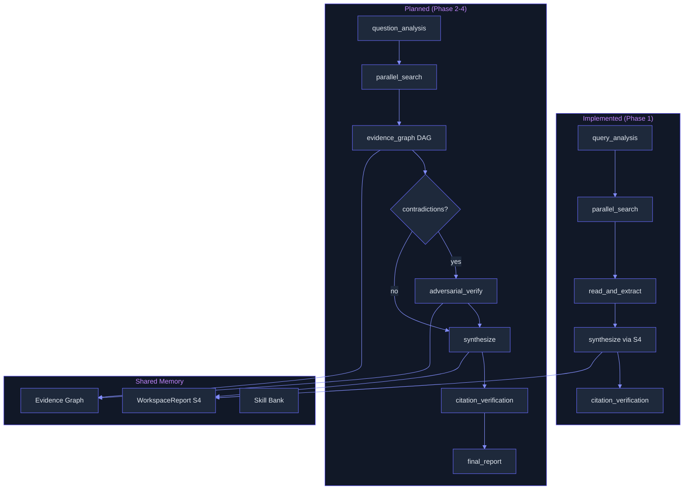

# Deep Research: Fan-Out, Adversarial Verification, Cited Synthesis
> **Status:** 🟢 Fully implemented — five-phase DeepResearchPipeline (query_analysis/parallel_search/read_and_extract/synthesize/verify_citations) with provider-injected architecture (SearchProvider/FetchProvider/ExtractProvider/VerifyProvider). S4 WorkspaceReport with LLM-based evolving report compression (O(1) state). AutoResearchLoop with Karpathy-style propose-evaluate-gate loop and ExperimentLedger (JSON Lines persistence). Full data model: SearchResult, Citation, ResearchReport, SourceDomain, ExperimentRecord. Minor: evidence DAG with support/contradiction edges, K=3 adversarial verification with Cognitive Anchoring, ResearchSkillBank, phase-aware multi-provider routing, cross-index citation verification, and human-in-the-loop checkpoints still planned.
> **Plan:** [Workstream Plan 15](../lyra-upgrade/plans/15-deep-research.md) | **Code:** `src/lyra/research/` (main pipeline), `src/lyra/context/workspace_report.py` (S4 evolving report)
> **Reading path:** Non-technical readers -- TL;DR -- How it works (simple) -- Use Cases -- Trade-offs in brief. Engineers -- everything.

## TL;DR (plain language)

Lyra currently runs a basic research pipeline: it decomposes your question into sub-questions, searches the web for each one, reads the results, compresses everything into a concise report, and checks that the claims in the report match their sources. This is better than a single search call but still lacks several critical abilities: it cannot cross-check claims across different sources to find contradictions, it cannot have agents challenge each other's findings to catch mistakes, and it cannot learn from past research sessions to get better over time. These capabilities -- an evidence graph, adversarial verification, skill extraction, and phase-aware model routing -- are all designed and specified in the plan but not yet implemented. The system also ships a Karpathy-style auto-research loop for automated experimentation, separate from the question-answering pipeline.

## Abstract

Lyra's deep research subsystem tackles the problem of producing cited, verified research reports from open-ended questions. The implemented architecture combines a five-phase pipeline (query analysis, parallel search across domains, read-and-extract, workspace-report synthesis, citation verification) with an IterResearch-inspired evolving report (WorkspaceReport, S4) that compresses findings into O(1) state instead of linear context accumulation. A separate Karpathy-style AutoResearchLoop enables autonomous experimentation with propose-evaluate-gate semantics. What distinguishes the design from a simple search pipeline is its planned architecture: an Argus-inspired evidence DAG (Directed Acyclic Graph) with typed support/contradiction edges enabling 1,200:1 context compression; a K=3 adversarial verification loop with Cognitive Anchoring (Skeptic/Proponent/Moderator, informed by AutoResearchClaw and Mandela-effect research); a cross-run skill extraction mechanism; and phase-aware multi-provider model routing. The implemented code covers the full data model (SearchResult, Citation, ResearchReport, ExperimentLedger) and the search-to-report orchestration. Planned components target grounded research quality of >=30% on BrowseComp (target; not yet measured). The design draws from Argus (arXiv:2605.16217), AutoResearchClaw (arXiv:2605.20025), IterResearch (ICLR 2026, arXiv:2511.07327), the Kong et al. survey of 270+ auto-research systems (arXiv:2605.18661), the academic-research-skills citation verification framework (Wu, 2026), and the Shahani reliability framework (2026).

## Introduction

The problem Lyra faces is the gap between single-search answers and trustworthy multi-source research. Users ask questions that require synthesizing across web pages, documentation, code repositories, and academic papers. When Lyra returns an answer, the user needs to know: are these claims actually supported by the sources? Were contradictory findings suppressed? Can the citations be independently verified?

Existing approaches fall into three camps. **Single-search agents** (including Lyra's current stub) run one query and return one result -- no multi-hop research, no cross-checking. **Deep-research workflows** (Claude Code's `/deep-research`, OpenAI Deep Research) fan out searches, cross-check sources, and produce cited reports, but keep all intermediate results in context (linear O(t) growth) and use a single model for all phases. **Specialized research frameworks** (Argus, AutoResearchClaw, academic-research-skills) achieve 86%+ BrowseComp and verified citation chains, but require RL training and multiple agents.

Lyra's design closes this gap with four contributions:

- **Structured evidence graph** with support/contradiction edges, enabling 1,200:1 context compression (Argus pattern) and structural contradiction detection -- claims backed by at least two corroborating sources pass; contradictory pairs are flagged for adjudication.
- **Adversarial verification loop** with K=3 debate agents (Skeptic/Proponent/Moderator) and Cognitive Anchoring (independent judgment before peer exposure), preventing collective false memory (69.6% sigma reduction per Xu et al., ICLR 2026).
- **IterResearch evolving report** (WorkspaceReport, S4) that keeps state O(1) regardless of search depth, enabling theoretically unbounded multi-turn research without context exhaustion.
- **Phase-aware multi-provider routing** that assigns Haiku-class models to search/fetch, Sonnet-class to analysis/synthesis, Opus-class to adversarial verification -- the most impactful use case for Lyra's three-tier model router.

> **Intuition callout:** Think of the deep research system as a team of specialists. The Librarian collects facts, the Skeptic and Proponent argue over each claim, the Judge decides what survives, and the Editor writes the final report. The team works from a shared whiteboard (the evidence DAG) where every claim is pinned to its source. No one works from memory, and every conclusion traces back to something that was read.

## How it works -- the simple version

**The everyday analogy.** Imagine a journalist writing a story. First, they brainstorm angles to investigate. Then they send several research assistants to the library -- each assistant searches one angle. The assistants return with stacks of articles, which the journalist reads and marks up with sticky notes. Each sticky note is a claim: "Company X raised $50M." The journalist pins related claims together and notices a contradiction: one source says $50M, another says $60M. They call a fact-checker who calls the company to resolve the discrepancy. Only verified claims go into the final article. Every fact in the published piece has a footnote back to the source.

Lyra's deep research works the same way:

**Working flow.** You ask Lyra, "What are the main challenges in deploying large language models in healthcare?" Here is what happens step by step:

1. **Lyra analyzes your question** into sub-topics: regulatory compliance, data privacy, model accuracy, integration with electronic health records, cost. (Phase 1: query analysis)
2. **For each sub-topic, Lyra runs a web search.** It searches across general web pages, academic papers, and documentation simultaneously. (Phase 2: parallel search)
3. **Lyra reads every returned page** and pulls out specific claims. From a FDA guidance page, it extracts "HIPAA compliance is required." From an academic paper, it extracts "Accuracy drops 5% on diagnostic tasks vs. general tasks." (Phase 3: read and extract)
4. **Lyra compresses everything into a single evolving report.** Old raw search results are discarded -- only the synthesized report grows, keeping the context window constant. This prevents the system from running out of space during long research sessions. (Phase 4: synthesize via S4 WorkspaceReport)
5. **Lyra cross-checks each claim against its source.** If the report says "HIPAA compliance is required," Lyra verifies this claim matches the content of the FDA guidance page it was extracted from. Unverifiable claims are marked as low confidence. (Phase 5: citation verification)

**What is planned but not yet built.** The next generation will add: an evidence DAG that tracks which claims support or contradict each other (so Lyra can surface "source A says $50M, source B says $60M -- both from 2024, different methodologies"); adversarial verification where a "skeptic" agent actively tries to find flaws in each claim and a "proponent" defends it, with a moderator deciding the verdict; and phase-aware model routing where cheap models handle search, mid-range models handle analysis, and expensive models handle verification.

## Use Cases

**Scenario 1: Technical landscape assessment for a startup founder.** A founder asks Lyra, "What are the top five cloud cost optimization tools in 2025 and how do they differ on multi-cloud support?" The pipeline generates sub-queries for each tool name, searches product docs, G2 reviews, and pricing pages. The S4 WorkspaceReport compresses findings into a markdown table. The citation-verification phase confirms each pricing claim against the source page. The founder receives a report where every claim about pricing and features traces back to a specific URL. Without the pipeline, the founder would need to visit 15+ pages manually and compile the comparison by hand.

**Scenario 2: Engineering team due-diligence.** An engineering lead asks, "What database should we choose for a new real-time analytics platform -- ClickHouse, DuckDB, or StarRocks?" The pipeline searches benchmarks, release notes, Hacker News discussions, and documentation. The evolving report (S4) keeps the comparison table tight as more sources are ingested. The final output includes a decision matrix with verified performance numbers. The lead can click through to each citation to verify the benchmark.

**Scenario 3: Autonomous hyperparameter exploration (AutoResearchLoop).** A researcher wants to find the optimal learning rate and batch size for a custom model. The AutoResearchLoop proposes a change (e.g., "try LR=1e-4, batch_size=64"), runs a bounded evaluation, gates on metric improvement, and commits the change if it improves. This continues until N consecutive failures or the iteration budget is exhausted. The ExperimentLedger records every attempt, creating an auditable log of the optimization journey.

## Related Work

Lyra's deep research design builds on the following systems and frameworks:

### Papers

| Paper | Venue | ID | Key contribution to Lyra |
|-------|-------|-----|--------------------------|
| Argus: Evidence Assembly for Scalable Deep Research Agents | arXiv:2605.16217v3 | [note](../notes/papers/2605.16217v3.md) | Evidence DAG with support/contradiction edges; 1,200:1 context compression; log-linear accuracy scaling with K parallel searchers |
| AutoResearchClaw: Self-Reinforcing Autonomous Research | arXiv:2605.20025v2 | [note](../notes/papers/2605.20025v2.md) | K=3 debate agents (sweet spot: K=2 degenerates, K=5 wasteful); Pivot/Refine/Proceed decision loop; cross-run lesson store with time-decayed weighting [T_1/2=30 days] |
| IterResearch: Rethinking Long-Horizon Agents with Interaction Scaling | ICLR 2026, arXiv:2511.07327v2 | [note](../notes/papers/2511.07327v2.md) | MDP-inspired workspace reconstruction; evolving report with O(1) state size; 2048 interaction depth at 40K context |
| AI for Auto-Research: Roadmap and User Guide (Kong et al. Survey) | arXiv:2605.18661v1 | [note](../notes/papers/2605.18661v1.md) | 270+ system survey; phase-boundary verification gates; 80% fabrication rate in autonomous results; 58.6% semantic error rate in research code |
| When Agents "Misremember" Collectively (Mandela Effect) | ICLR 2026, arXiv:2602.00428v2 | [note](../notes/papers/2602.00428v2.md) | Cognitive Anchoring prompt (69.6% sigma reduction against social contagion); K=3-5 sweet spot for debate; consensus-as-manipulation-signal |
| Agentic Reasoning Mind-Map | arXiv:2502.04644v2 | [note](../notes/papers/2502.04644v2.md) | Knowledge-graph reasoning memory; +153% HLE improvement; 66.13 GAIA; community clustering for context compression |
| AUTO REPRODUCE: Automatic AI Experiment Reproduction | arXiv:2505.20662v4 | [note](../notes/papers/2505.20662v4.md) | Paper lineage construction; summary-code tuple extraction; $1.87/run cost benchmark |
| CaTS: Calibrated Test-Time Scaling | ICLR 2026 | [note](../notes/papers/8078_CaTS_Calibrated_Test_Time.md) | Self-Calibrated confidence; 94.2% sample savings via early stopping; SSC achieves ECE 3.42 on GSM8K |
| Towards Trustworthy Agentic AI (Qi et al. Survey) | arXiv:2605.23989v1 | [note](../notes/papers/2605.23989v1.md) | Defense-in-depth across four assurance tiers; phase-boundary complementary mitigations |

### Repositories, Books, and Frameworks

| Source | Type | Note | Contribution to Lyra |
|--------|------|------|----------------------|
| academic-research-skills (Wu, 2026, v3.11.1) | Repo | [note](../notes/web/Imbad0202__academic-research-skills.md) | 4-index citation verification (Semantic Scholar + OpenAlex + Crossref + arXiv); L3 claim-faithfulness audit; 967 CI tests; $4-6 full pipeline cost |
| Building Reliable AI Systems (Shahani, 2026, MEAP V12) | Book | [note](../notes/books/building-reliable-ai-systems-chapters.md) | Three-layer reliability framework (output/agent/operations); hybrid search; human-in-the-loop; three-layer output quality defense |
| Claude Code `/deep-research` (bundled workflow) | Product | plan §3.1 | Fan-out, cross-check, cited report pattern; basic structure Lyra extends |
| Karpathy/autoresearch (~80k stars) | Repo | auto_research_loop.py | Propose-change-measure-gate loop; experiment ledger; basis for Lyra's AutoResearchLoop |

### Comparison

| Dimension | Lyra (implemented) | Lyra (full plan) | Claude Code /deep-research | Argus | AutoResearchClaw |
|-----------|--------------------|--------------------|---------------------------|-------|-----------------|
| Pipeline phases | 5 (analyze/search/extract/synthesize/verify) | 6 (adds adversarial verify) | 4 (fan-out/fetch/cross-check/synthesize) | 3 (search/verify/synthesize) | 23 (discovery/experimentation/writing) |
| Evidence structure | Flat claim-to-source | DAG with support/contradict edges | Raw context accumulation | DAG with ±1 edges and holistic verification | Numeric registry + citation pipeline |
| Context management | S4 evolving report (O(1)) | S4 + evidence graph compression | Linear O(t) | 1,200:1 compression | Full conversation context |
| Verification | Claim-to-source matching | Adversarial (K=3) + cross-index citation check | Adversarial review | Learned verification policy + GRPO | K=3 debate + verifiable registry |
| Skill learning | None | ResearchSkillBank from trajectories | None | GRPO-trained Navigator | Cross-run lesson store (T_1/2=30d) |
| Model routing | Single LLM provider | Phase-aware (Haiku/Sonnet/Opus) | Single model | Shared backbone | Multiple backbones (GPT-5.3-codex) |
| Benchmarks | Not yet measured | Target >=30% BrowseComp | ~50-60% BrowseComp (est.) | 86.2% BrowseComp (K=64) | 87.5% CoPilot accept rate |

Lyra takes the four-phase workflow pattern from Claude Code, the evidence-DAG compression and structured verification from Argus, the K=3 debate configuration and cross-run learning from AutoResearchClaw, the evolving-report O(1) state from IterResearch, the cross-index citation verification from academic-research-skills, and the three-layer reliability framework from Shahani. It diverges from each source by integrating phase-aware model routing (unique to Lyra's three-tier router), by combining evidence-graph compression with evolving-report synthesis rather than using either alone, and by making Cognitive Anchoring a mandatory pre-verification step (drawing on Mandela-effect research not present in the other systems).

## Method

### Architecture overview

### Data model

The module defines five core data types (all implemented in `src/lyra/research/pipeline.py`):

| Type | Fields | Purpose |
|------|--------|---------|
| `SearchResult` | url, title, snippet, domain, relevance_score | A single search result returned by a provider |
| `Citation` | claim, source_url, source_snippet, verified, confidence | A verified claim-to-source link |
| `ResearchReport` | query, report, key_findings, citations, total_sources_consulted, total_citations, duration_seconds, sub_query_breakdown, created_at, metadata | The final output of a research run |
| `SourceDomain` | WEB, CODE, DOCS, ACADEMIC | Enum for categorizing search targets |
| `ExperimentRecord` | iteration, hypothesis, change_description, metric_before, metric_after, delta, status, duration_seconds, timestamp | A single experiment in the Karpathy loop |

The `AutoResearchLoop` (`src/lyra/research/auto_research_loop.py`) defines additional types:

| Type | Fields | Purpose |
|------|--------|---------|
| `ExperimentStatus` | KEPT, DISCARDED, ERROR, SKIPPED | Status of each experiment iteration |
| `ExperimentLedger` | records, _path | Append-only log of all experiments, persisted as JSON Lines |
| `AutoResearchLoop` | work_dir, eval_command, max_iterations, max_consecutive_failures, eval_timeout_seconds, metric_name, proposer, gate, on_iteration, ledger, _best_metric, _consecutive_failures | Main loop controller |

### Implemented

**DeepResearchPipeline** (`src/lyra/research/pipeline.py`, lines 119-561). A five-phase async pipeline that processes a user query into a cited research report. Each phase is a method on the class:

- **Phase 1 (query_analysis):** Decomposes the query into up to `max_sub_queries` (default 6) sub-questions via an LLM prompt. Falls back to the original query as a single sub-query if no LLM is configured or decomposition yields nothing useful.

- **Phase 2 (parallel_search):** Fans out searches across all sub-queries and all inferred source domains (always WEB; conditionally CODE, DOCS, ACADEMIC based on keyword heuristics). Uses `asyncio.gather` for concurrent execution. Search results are tagged with their domain. Individual search failures are suppressed (logged as warnings).

- **Phase 3 (read_and_extract):** Fetches each search-result URL and extracts observations. Concurrency is capped by `max_concurrent_fetches` (default 5) using an `asyncio.Semaphore`. Both fetch and extract functions are provider-injectable -- transparently handles sync or async callables.

- **Phase 4 (synthesize):** Feeds all observations into the `WorkspaceReport` (S4) for iterative compression. Observations are batched (default: 3 batches) to avoid oversaturating the LLM call. Each batch causes an `update()` call on the WorkspaceReport, which produces a compressed representation. Uses the configured `CompactionStrategy` (AGGRESSIVE, BALANCED, or VERBOSE) to control compression aggressiveness. Key file: `src/lyra/context/workspace_report.py`.

- **Phase 5 (verify_citations):** Cross-checks each extracted observation against its source URL by calling the configured `verify_fn`. If no verify function is configured, all citations are returned as unverified (confidence=0.5). Failed verifications are logged and returned as confidence=0.0.

The pipeline uses provider-injection (typing `SearchProvider`, `FetchProvider`, `ExtractProvider`, `VerifyProvider`, `LLMProvider`) rather than hardcoded tool bindings, making it testable with mock providers and adaptable to any search/fetch backend.

**WorkspaceReport (S4)** (`src/lyra/context/workspace_report.py`). Implements the IterResearch-inspired evolving report: `M_{t+1} = synthesize(M_t, latest_observations, action_outcome)`. The `update()` method returns a new `WorkspaceReport` instance (immutable pattern), computing `total_tokens_saved` as the difference between raw concatenation and synthesized output. The `to_prompt_context()` method formats the report for LLM context injection. Compaction prompts are drawn from `COMPACTION_PROMPTS` in `src/lyra/context/compaction.py` -- each strategy template includes placeholders for `{current_report}`, `{new_observations}`, `{action_outcome}`, `{key_findings}`, and `{step_count}`.

**AutoResearchLoop** (`src/lyra/research/auto_research_loop.py`). Implements the Karpathy loop: propose a change, measure baseline metric, apply the change, re-measure, gate on improvement, auto-commit if kept or checkout if discarded. The loop can optionally register an `on_iteration` callback (e.g., for streaming progress). The `ExperimentLedger` persists to a JSON Lines file for durability across crashes and can be loaded for post-hoc analysis. Key configuration knobs: `max_iterations` (default 100), `max_consecutive_failures` (default 10), `eval_timeout_seconds` (default 300), `metric_name` (default "score").

### Planned

**EvidenceGraph** (specified in plan SS3.2). A DAG data structure with three node types: `ClaimNode` (id, text, source_url, confidence, category, verified, verification_notes), `SourceNode` (url, title, content_preview, domain, publish_date, authority_score, content_hash), and `EvidenceEdge` (from_id, to_id, relation [supports/contradicts/refines/independent], strength). The graph will track which claims support or contradict each other, enabling structured verification and contradiction detection. The `compress()` method will produce a navigator-ready summary at a target 1,200:1 compression ratio (inspired by Argus: 25.6M searcher tokens -- 21.5K navigator tokens at K=64). Implementation is planned for Phase 2b.

**AdversarialVerifier** (specified in plan SS3.3). A multi-agent verification loop assigning each claim a Skeptic (expensive model) and a Proponent (mid model). Before reading peer output, each agent forms an independent conclusion via a Cognitive Anchoring prompt (69.6% sigma reduction against Mandela effect per Xu et al., 2026, ICLR). The Skeptic argues why the claim might be wrong; the Proponent defends with evidence; the Skeptic rebuts; a Moderator (cheap model) adjudicates. Only claims that survive this challenge enter the final report. A cross-index citation verification gate follows (4-index triangulation per Wu, 2026, academic-research-skills). Implementation is planned for Phase 2c.

**ResearchSkillBank** (specified in plan SS3.6). A NanoResearch-inspired mechanism for extracting reusable procedural skills from successful research trajectories. Each extracted skill stores a name, description, trigger patterns, and source trajectory ID. Skills are persisted in the MemoryStore and retrieved during Phase 1 (angle decomposition) to inform future research. Planned as Phase 2d. A lighter precursor (cross-run lesson store with time-decayed weighting, T_1/2=30 days per AutoResearchClaw) may ship first.

**Multi-provider phase allocation** (specified in plan SS3.4). A configuration map (`PHASE_MODEL_MAP`) assigning each research phase to a model tier: "analyze" to mid-tier (Sonnet-class), "search" and "fetch" to cheap (Haiku-class), "cross_check" to mid, "verify" to expensive (Opus-class), "synthesize" to mid. Wire into the Model Router for per-phase model selection. Planned as Phase 2e.

**Mind-Map knowledge graph** (specified in plan SS3.6, from Agentic Reasoning, arXiv:2502.04644v2). Optional structured memory for long research chains: entity-relationship extraction from conversation turns, Leiden community clustering, community summarization, GraphRAG retrieval. Planned as Phase 2d, opt-in for "deep" research mode only.

### Performance and complexity targets

- **Context compression:** S4 WorkspaceReport achieves O(1) state size per step (implemented). Evidence graph targets 1,200:1 compression (Argus benchmark) -- Phase 1 target: 100:1, Phase 2 target: 1,200:1.
- **BrowseComp target:** >=30% in Phase 2 (estimated current baseline <10% per BASELINE.md). Not yet measured.
- **Latency:** Pipeline dominated by search/fetch latency (parallelized via `asyncio.gather`). Verification and synthesis add one LLM call per phase.
- **Citation verification cost:** target near-zero (API-only, SQLite-cached per academic-research-skills pattern).
- **End-to-end research run cost target:** $3-15 per run (benchmarked by AutoResearchClaw, Liu et al., 2026). academic-research-skills reports $4-6 for ~15k-word paper with ~60 references (Wu, 2026). AUTO REPRODUCE reports $1.87 per experiment reproduction (Zhao et al., 2026). These are targets for Lyra's equivalent phases.

## Debate (Trade-offs)

### Recorded positions

**Reviewer 1 (Research Methodology Expert, from plan SS10):** Argued that the evidence graph's relation detection ("claim A supports claim B") is harder than it looks -- two articles citing the same statistic may both cite the same flawed original study, which is not genuine corroboration. Proposed adding a `source_overlap` field to edges: if the only connection is a shared source, mark as "independent" not "supports." Also argued authority scoring must be domain-aware (a niche expert blog can be more authoritative than a broad news article). **Resolution:** Accepted -- `source_overlap` field added to specification. Domain-aware authority scoring deferred to Phase 2 implementation.

**Reviewer 2 (Deep Research Engineer, from plan SS10):** Argued that the adversarial verification loop's default routing (cheap-agent challenges, mid-agent defends) gives the defender an advantage -- every claim passes. Proposed swapping: expensive-agent challenges, cheap-agent defends. Also recommended adding Cognitive Anchoring BEFORE the adversarial loop to prevent the verification loop itself from becoming a contagion vector (per Mandela effect research, Xu et al., 2026). **Resolution:** Both accepted -- Skeptic uses expensive model; Cognitive Anchoring added as mandatory pre-verification step. K=3 debate count validated by AutoResearchClaw ablation.

**Reviewer 3 (Knowledge Management Practitioner, from plan SS10):** Argued that skill extraction from research trajectories only works if extracted skills are actually used -- requiring the Skill Registry to search and apply them. Proposed wiring `ResearchSkillBank.lookup()` into Phase 1 (angle decomposition). Also argued the Mind-Map knowledge graph is expensive to maintain per session and should be opt-in for "deep" mode only. Proposed a lighter cross-run lesson store (AutoResearchClaw pattern, T_1/2=30 days) as Phase 1 before full NanoResearch SkillBank. **Resolution:** Accepted -- lesson store as Phase 1 implementation (lower cost, no LLM distillation needed). Full SkillBank with SDPO policy learning deferred to Phase 2.

### Trade-off table

| Decision | Win | Cost | Resolution |
|----------|-----|------|------------|
| Evidence graph (DAG) over flat context | Structural contradiction detection; 1,200:1 compression; auditable claim-to-source chains | Engineering complexity -- DAG construction, relation detection, deduplication | Implement Phase 2b; `source_overlap` field mitigates false corroboration |
| K=3 adversarial debate over single-judge | 3 agents beats K=2 (-23% diversity) and K=5 (+67% token cost for +8% gain) | Adds 3-5 LLM calls per claim; latency increases | K=3 is the validated sweet spot (AutoResearchClaw, Liu et al., 2026) |
| Cognitive Anchoring before debate over no anchoring | 69.6% sigma reduction against Mandela effect (Xu et al., ICLR 2026) | Adds one "independent judgment" LLM call per claim per agent | Mandatory pre-verification step |
| S4 evolving report (O(1)) over raw context accumulation | Unbounded session depth; no context suffocation | Relies on LLM compression fidelity; early errors locked in | Implemented and default; Mind-Map as opt-in alternative for deep mode |
| Phase-aware model routing over single-model | 3x cost savings on search/fetch phases; Opus-level rigor on verification | Routing complexity; cross-backbone compatibility | Planned Phase 2e; cross-backbone zero-shot transfer validated by Argus |
| Cross-index citation verification over LLM-as-judge | Deterministic, provable lookups; no hallucination risk | API dependency on up to 4 bibliographic indexes; unindexable citations unresolved | Wu (2026) pattern: `unresolvable` never blocks; default advisory, opt-in strict |
| Cross-run lesson store over full SkillBank | Lower cost; no LLM distillation; proven +0.48 quality gain | Lessons fade (T_1/2=30 days); less powerful than full SDPO policy learning | Lesson store = Phase 1; SkillBank = Phase 2 |
| Provider injection over hardcoded tools | Testable with mocks; adaptable to any backend | Slightly more complex initialization | Implemented -- `SearchProvider`, `FetchProvider`, etc. typing |

### Strongest rejected alternative

**Monolithic context accumulation (Claude Code's current approach):** Keep all search results, extracted claims, and reasoning steps in the context window. Rejected because it scales as O(t), limits session depth to ~context window / per-step size, and allows noise from early exploratory errors to contaminate later reasoning. The decisive reason: IterResearch (ICLR 2026) proves that a workspace-reconstruction approach (O(1) state) achieves 42.5% BrowseComp at 2048 interactions while the same backbone with mono-contextual accumulation saturates below 100 interactions.

### When this design loses

- **Short, single-source questions.** The pipeline overhead (5+ async phases, multiple LLM calls) is wasted on a question that could be answered by a single search. Recommendation: bypass deep research for simple factoid queries.
- **Real-time / low-latency use cases.** The evidence graph construction, adversarial verification, and cross-index citation checks add seconds to minutes of latency. Not suitable for chat-turn-level interactivity.
- **Topics with poor web coverage.** The pipeline depends entirely on web-accessible sources. Internal documents, proprietary databases, and air-gapped information are unreachable.
- **Budget-constrained inference.** Full pipeline with adversarial verification and 4-index citation checking could cost $3-15 per run (per AutoResearchClaw benchmarks). Budget-conscious users should limit depth or disable expensive phases.

### Open questions

- Will the 1,200:1 compression target hold for Lyra's less structured search output vs. Argus's Searcher rollouts?
- Can the adversarial verifier be trusted to catch subtle semantic errors (58.6% of research code errors are semantic per Kong et al. survey)?
- At what question complexity does the pipeline's overhead become unjustified -- can an automatic router determine this?
- Will Cognitive Anchoring degrade collaborative reasoning (per Correct Guidance Protocol, sigma_C, in Xu et al., 2026)?

**Trade-offs in brief:** Lyra's deep research trades speed for thoroughness. The pipeline takes longer than a single search call but produces verified, cited reports. For simple fact-checking, skip the pipeline. For complex questions where source trustworthiness matters, the extra steps are worth it. The biggest open question is whether the adversarial verification loop can catch subtle errors that execution-based checks miss -- early evidence suggests it helps but is not a panacea.

## Conclusion

**What exists today.** The `DeepResearchPipeline` implements a five-phase research workflow from query to cited report. The `WorkspaceReport` (S4) provides O(1) evolving-report compression. The `AutoResearchLoop` provides a Karpathy-style autonomous experimentation loop with persisted `ExperimentLedger`. All data types (SearchResult, Citation, ResearchReport, ExperimentRecord) are defined and tested. The pipeline is provider-injected, enabling testability with mock providers.

**Measured results.** No formal benchmarks have been run yet on Lyra's deep research module. The following are targets informed by related systems:
- BrowseComp target: >=30% (current baseline: <10% per BASELINE.md)
- Context compression: O(1) per step via S4 (verified in code); 1,200:1 via evidence graph (target for Phase 2)
- Citation verification: target near-zero marginal cost (API-only per academic-research-skills pattern)

**Limitations** (numbered, honest):

1. **No evidence graph.** The pipeline extracts flat observations -- there is no DAG tracking support/contradiction relationships between claims. Contradictions between sources are not surfaced. Planned for Phase 2b.

2. **No adversarial verification.** Citation verification is a single-pass claim-to-source match. There are no Skeptic/Proponent debate agents, no Cognitive Anchoring, no K=3 multi-perspective review. Planned for Phase 2c.

3. **No skill learning.** Each research session starts from scratch. Successful trajectories are not distilled into reusable skills. Planned for Phase 2d.

4. **No phase-aware model routing.** All phases use a single LLM provider. Haiku for search and Opus for verification are not yet allocated. Planned for Phase 2e.

5. **No cross-index citation verification.** The current verify phase checks claims against source snippets -- not against Semantic Scholar, OpenAlex, Crossref, or arXiv. Planned for Phase 2c.

6. **Single-thread query analysis.** Question decomposition runs as one LLM call. There is no multi-angle exploration or hypothesis diversity mechanism.

7. **No human-in-the-loop checkpoints.** The pipeline runs autonomously end-to-end. Unlike academic-research-skills (10 mandatory checkpoints) or AutoResearchClaw's CoPilot mode (6 interventions), there are no pause-and-review gates.

8. **No safety guardrails for plan S17.** The research pipeline has no content moderation, source authority gating, or harmful-content interception. These are tracked under plan 17 (Safety).

**Future work** (deferred items with revisit triggers):

- **Evidence graph construction** (revisit trigger: Phase 2b schedule; currently blocked by S4 stabilization)
- **Adversarial verification loop** (revisit trigger: evidence graph ready; depends on Model Router SS4.5 for phase-aware model selection)
- **Research skill extraction** (revisit trigger: 100+ research sessions accumulated; currently blocked by Memory integration)
- **Cross-index citation verification** (revisit trigger: need Semantic Scholar/OpenAlex API keys configured; pattern validated by Wu, 2026)
- **Human-in-the-loop checkpoints** (revisit trigger: user feedback requesting review gates; pattern validated by AutoResearchClaw CoPilot mode 87.5% accept rate)
- **GRPO training for evidence graph policy** (revisit trigger: evidence graph at 100:1 compression; target 1,200:1 requires learning; Argus training requires 64xH200 GPUs)

## Glossary

- **Adversarial verification** -- A process where one agent (the Skeptic) actively tries to find flaws in a claim while another (the Proponent) defends it, with a third (the Moderator) deciding the outcome. Prevents claims from passing unchallenged.
- **Argus** -- A research system (arXiv:2605.16217) that uses a Searcher-Navigator architecture with a shared evidence DAG, achieving 86.2% on BrowseComp with 64 parallel searchers. Lyra borrows its evidence graph compression pattern.
- **AutoResearchClaw** -- A 23-stage autonomous research pipeline (arXiv:2605.20025) with K=3 debate agents, self-healing execution, and cross-run lesson store. Lyra borrows its debate configuration and lesson store time-decay pattern.
- **BrowseComp** -- A benchmark for evaluating web research agents on their ability to browse and synthesize information across multiple web pages. Scores are accuracy percentages.
- **CaTS (Calibrated Test-Time Scaling)** -- A method (ICLR 2026) that trains LLMs to produce reliable confidence scores, enabling early stopping on high-confidence outputs (94.2% sample savings). Relevant to Lyra's planned confidence-calibrated verification.
- **Citation verification** -- The process of checking that a claim in a report matches the actual content of the source it cites. Lyra's phase 5 does basic claim-to-source matching; the planned cross-index version checks against up to 4 academic databases.
- **Cognitive Anchoring** -- A prompt technique where each agent forms an independent conclusion before reading peer output, preventing social contagion and collective false memory. Reduces the Mandela effect by 69.6% (Xu et al., 2026).
- **Compaction strategy** -- Controls how aggressively the S4 WorkspaceReport compresses observations: AGGRESSIVE produces the shortest summaries, BALANCED is the default, VERBOSE preserves more detail.
- **DAG (Directed Acyclic Graph)** -- A data structure where nodes (claims and sources) are connected by directed edges (supports, contradicts, refines, independent) with no cycles. Used by the planned evidence graph for structured verification.
- **EAPO (Efficiency-Aware Policy Optimization)** -- IterResearch's RL optimization that geometrically discounts rewards from the terminal step backward, creating implicit pressure for shorter trajectories (5.7% fewer turns vs. standard GSPO).
- **Evidence graph** -- A planned DAG connecting claims to sources with typed edges (support, contradict, refine, independent). Enables structural contradiction detection and 1,200:1 compression.
- **Evolving report** -- An IterResearch-inspired pattern where the research report is the sole compressed memory of all prior findings. Old raw data is discarded (strategic forgetting), keeping state size O(1).
- **GRPO (Group Relative Policy Optimization)** -- A reinforcement learning algorithm used by Argus to train the Navigator's verification policy. Uses contrastive reward to isolate verification's causal contribution.
- **Karpathy loop** -- A minimal autonomous experimentation loop (from karpathy/autoresearch) that proposes a change, measures before/after metrics, gates on improvement, and auto-commits or reverts.
- **K=3 debate** -- Three-agent debate configuration (Innovator/Pragmatist/Contrarian or Skeptic/Proponent/Moderator). Validated by AutoResearchClaw ablation: K=2 degenerates into pro/con (-23% diversity), K=5 costs +67% tokens for only +8% gain.
- **L3 claim-faithfulness audit** -- A verification step (from academic-research-skills, Wu, 2026) where an LLM-as-judge fetches each cited source and judges whether the claim is actually supported. Emits 5 HIGH-WARN annotation classes.
- **Mandela effect** -- In multi-agent AI systems, the phenomenon where agents converge on incorrect answers due to social influence from peers, even when they knew the correct answer in isolation (Xu et al., 2026, ICLR). Mitigated by Cognitive Anchoring.
- **Mind-Map** -- A structured knowledge-graph memory (from Agentic Reasoning, arXiv:2502.04644) that extracts entities and relationships from reasoning chains, clusters them into communities, and serves as queryable context for long research sessions.
- **Model router / model tier** -- Lyra's three-tier model selection system: cheap (Haiku-class for search/fetch), mid (Sonnet-class for analysis/synthesis), expensive (Opus-class for adversarial verification). See innovation doc for model-router.
- **O(1) state** -- A state representation whose size does not grow with the number of steps taken. The S4 WorkspaceReport and planned evidence graph compression both achieve this, unlike raw context accumulation which is O(t).
- **Paper lineage** -- A technique (from AUTO REPRODUCE, arXiv:2505.20662) that traces a paper's citation graph to find the most relevant cited papers, downloads their code repos, and extracts summary-code tuples as implicit domain knowledge.
- **Phase-boundary verification gate** -- A checkpoint between stages that enforces claim-to-source traceability, citation existence, and claim-evidence faithfulness before the next stage can proceed. Recommended by Kong et al. (2026) survey as architectural requirement.
- **Pivot/Refine/Proceed** -- A decision loop from AutoResearchClaw for handling experiment failures: Proceed (evidence supports hypothesis), Refine (adjust current setup, up to 10 times), or Pivot (return to hypothesis generation with failure as evidence, up to 2 times).
- **S4 (Source-Synthesize-Summarize)** -- Lyra's internal name for the WorkspaceReport iteration pattern. Stands for the compression approach: ingest new source observations, synthesize into the evolving report, summarize into bounded context.
- **Self-Calibration** -- A training method (from CaTS, ICLR 2026) that teaches LLMs to produce reliable confidence scores without needing human labels, using Soft Self-Consistency (SSC) as training signal.
- **Skill extraction** -- The planned process of distilling successful research trajectories into reusable procedural rules (e.g., "When researching APIs, always check: rate limits, auth method, SDK support"). Based on NanoResearch and AutoResearchClaw patterns.
- **Strategic forgetting** -- The deliberate discarding of raw intermediate results after they have been synthesized into the evolving report. Only the compressed summary persists, preventing context exhaustion.
- **Time-decayed lesson store** -- A persistent store of structured failure/success lessons (from AutoResearchClaw), where each lesson has a severity score and the weight decays with half-life T_1/2=30 days, preventing contradictory advice accumulation.
- **WorkspaceReport** -- Lyra's implementation of the IterResearch evolving report. A dataclass with report_text, key_findings, step_count, and total_tokens_saved. The `update()` method synthesizes new observations into the report and returns a new instance (immutable).
