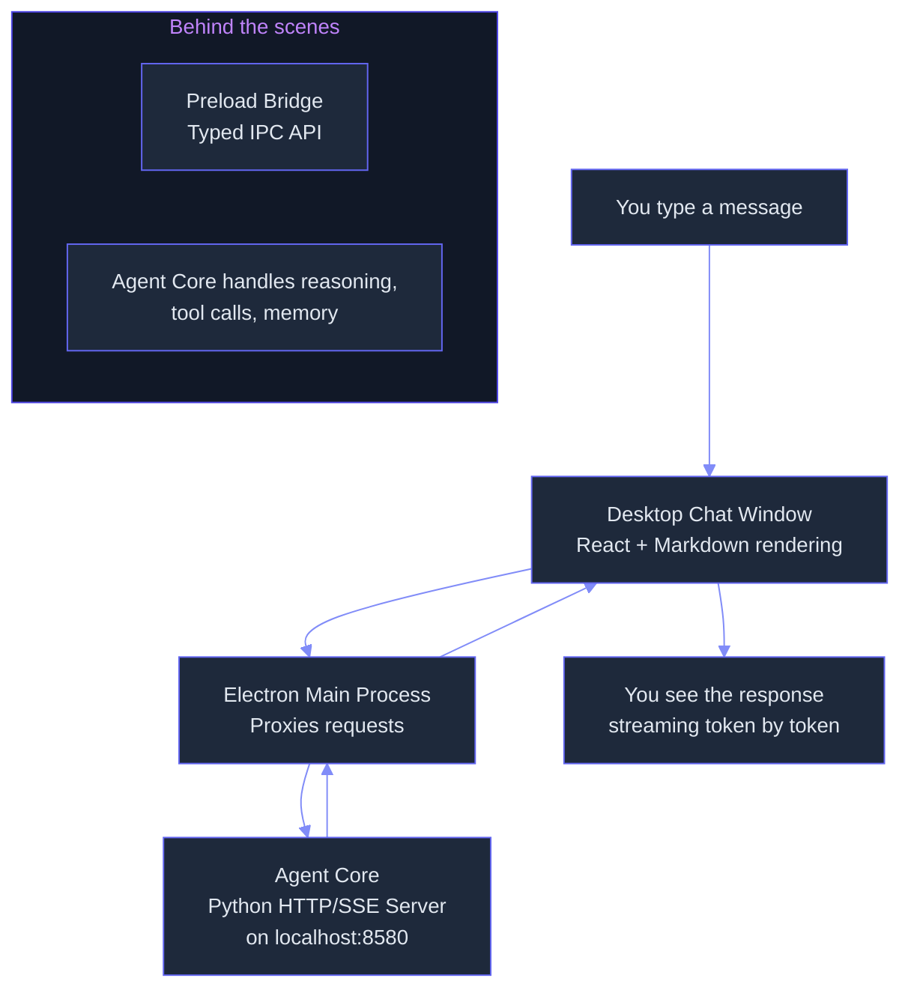
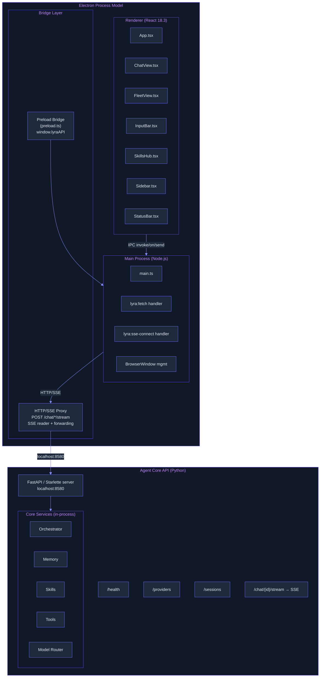

# Desktop: Native Application Shell with System Integration

> **Status:** 🟡 Partially implemented -- Electron + React shell, SSE streaming proxy, and chat/fleet/skills UI built (18 files). Multimodal input/output, voice, CER experience replay, accept-sequence dispatch, and agent-core API backend are deferred.
> **Plan:** [Workstream Plan](../lyra-upgrade/plans/28-desktop.md) | **Code:** `src/lyra/desktop/`, `src/ui/desktop/`
> **Reading path:** Non-technical readers -- TL;DR -> How it works (simple) -> Use Cases -> Trade-offs in brief. Engineers -- everything.

## TL;DR (plain language)

Lyra Desktop is a graphical application that gives users a window-based alternative to the terminal. It wraps Lyra's agent core inside an Electron shell with chat, fleet, and skills screens; you can type messages, pick a model provider, and see responses streamed in real time. The desktop app and the existing CLI are interchangeable clients that talk to the same backend, so switching between them is seamless. The shell is built and functional (React 18, Electron 31, dark theme, SSE streaming), but the agent-core API backend and the headline features that distinguish a desktop agent from a terminal -- multimodal input (drag-drop images, audio, PDFs) and output (rendered diagrams, audio playback), voice mode, experience replay, and fleet management -- are not yet implemented.

## Abstract

Lyra Desktop is an Electron-based graphical user interface that serves as a peer client to the existing CLI/TUI, both sharing a common agent-core API over HTTP/SSE on localhost. The architecture draws on the hermes-desktop reference architecture (Electron three-process model: main/preload/renderer, 12 feature screens) and follows the operator-abstraction pattern proven by UI-TARS-desktop, OSWORLD, and OpenHands, where the agent engine is decoupled from the UI surface. As currently implemented, the desktop provides a streaming ChatView with Markdown rendering and per-message token/cost estimation, a FleetView with two-axis state badges (task-state x process-liveness), a Sidebar with provider and session management, a SkillsHub with quality scoring and security-scan indicators, and a StatusBar with live connection monitoring. The Electron main process proxies all HTTP and SSE traffic through a sandboxed renderer (contextIsolation, sandbox: true, nodeIntegration: false). Novelty lies in the interchangeable-client architecture (CLI and Desktop as equal peers) and the planned integration of CER-style experience replay (dual-channel dynamics/skills memory, +51% relative improvement on WebArena) and accept-sequence dispatch (race-free cancellation from Crush). The implemented shell comprises 18 files (2 Electron, 8 React components, 2 hooks, 4 config, 2 style); the backend agent core, multimodal pipeline, voice surface, and CER buffer are deferred.

## Introduction

Lyra, like many agent frameworks, started as a terminal-only tool. The CLI is powerful for developers but excludes users who prefer graphical interaction, need rich media display, or want to monitor multiple agents at a glance. A terminal cannot render images inline, play audio, display Mermaid diagrams, show side-by-side diffs, or present a live fleet dashboard. Existing desktop solutions fall into two camps: (a) standalone Electron GUIs wrapping a single CLI (hermes-desktop, Claude Code's web UI) and (b) multi-harness command centers that let one UI drive multiple coding backends (OpenGUI). Neither provides an interchangeable-client architecture where CLI and desktop truly share the same agent core, nor do they integrate research-backed improvements like CER experience replay (+51% relative WebArena improvement with only +17.3% token overhead) or accept-sequence dispatch (race-free concurrent prompt cancellation).

Lyra Desktop fills this gap with three contributions:

1. **Interchangeable client architecture.** The agent core exposes a local HTTP/SSE API; the CLI and Desktop are equal peers that talk to the same backend. This is built on the operator-abstraction pattern validated by UI-TARS-desktop (4 operator implementations behind a single GUIAgent), OSWORLD (pyautogui-driven agent loop), and OpenHands (SandboxService abstraction with 3 implementations).

2. **Electron shell with production-grade security hardening.** Following the hermes-desktop pattern: contextIsolation, sandbox: true, nodeIntegration: false, IPC-proxied HTTP/SSE that keeps secrets in the main process. The main process proxies fetch and SSE streaming; the renderer is a disposable UI.

3. **Planned integration of research advances.** CER-style dual-channel experience replay (from arXiv 2506.06698v1) for cross-session learning, accept-sequence dispatch (from Crush's internal/agent/agent.go) for race-free streaming cancellation, pass^k reliability gating (from tau-bench), and dual-grounding perception (accessibility tree + screenshot, from the OS Agents Survey).

> **Intuition callout:** Think of Lyra Desktop as a specialized web browser that only talks to Lyra's brain. The brain (agent core) lives in a Python process on localhost. The desktop is a lightweight viewer and controller -- it sends your typed or dropped input to the brain and renders whatever the brain sends back. This separation means you can open the same brain in a terminal window, a desktop window, or even from another computer over SSH, and all three will see the same conversations.

## How it works -- the simple version

**Everyday analogy:** Lyra Desktop is like a smart TV remote with a screen. The TV (agent core) does all the thinking and processing. The remote (desktop app) shows you what's happening and lets you press buttons. The CLI is like a simpler remote with only number keys. Both remotes control the same TV.



**Working Flow story.** You install Lyra Desktop and launch it. An Electron window opens with a dark-themed chat interface. On the left, a sidebar shows your active sessions and connected AI model providers. At the bottom, a text box awaits your input.

Suppose you type "Summarize the key findings from the Q2 report." Here is what happens step by step:

1. You press Enter. The frontend web app creates a streaming connection to the backend.
2. A secure bridge relays the request to the Electron main process, which has access to the network.
3. The main process sends an HTTP POST to the agent core at `http://127.0.0.1:8580/chat/{session-id}/stream` and reads the real-time data stream line by line.
4. Each chunk of text from the stream is forwarded to the frontend, where it is appended to the assistant's response message.
5. The chat window re-renders its content on every chunk, so you see the response appear word by word -- no waiting for the full reply.
6. When the stream ends, the message is finalized and token/cost estimates are shown below it.
7. A status bar at the bottom updates live: connection status (green dot when connected), streaming indicator, session count, and cumulative cost.

If you want to stop the response mid-stream, clicking the "Stop" button cancels the in-flight request to the backend.

## Use Cases

**Scenario 1: Developer switching between CLI and GUI.** A backend developer starts her morning by launching Lyra Desktop. She opens a chat session and asks Lyra to review yesterday's diff. As the streaming response appears, she spots a Mermaid diagram in the answer -- the desktop renders it inline. Later, she needs to quickly pipe a command output to Lyra, so she switches to the terminal and continues the same session using the CLI. Both clients share the same conversation history because they talk to the same agent core.

**Scenario 2: Engineering manager monitoring a multi-agent fleet.** A team lead has four Lyra agents running in parallel: one researching a competitor's launch, one generating release notes, one auditing a dependency tree, and one analyzing a crash log. The FleetView in the sidebar shows all four as colored badges (green for running, gray for idle, red for failed), each with a live token-counter. The manager scans the fleet at a glance, clicks into the session that needs attention, and drills into the full conversation. No terminal multiplexer, no tab juggling.

**Scenario 3: Skills curator managing the team's skill library.** A platform engineer opens the SkillsHub tab. He sees all installed skills with quality scores (correctness, completeness, clarity, efficiency, safety, each 0-1). He searches for "deploy" to find deployment-related skills, clicks "Install" on a new community skill that automates rollbacks, and uses the "From Repo" panel to generate a new skill from a GitHub URL. The security scan indicator flags one skill as unscanned -- the engineer triggers a scan before allowing teammates to use it.

## Related Work

Lyra Desktop builds on and diverges from six reference systems. Every citation traces to a real note file under `docs/lyra-upgrade/notes/`.

| System | Approach | UI Layer | Agent Integration | Multimodal | Security | What Lyra Takes | Where Lyra Diverges |
|--------|----------|----------|-------------------|------------|----------|-----------------|---------------------|
| **Hermes Desktop** [web: fathah__hermes-desktop] | Electron shell wrapping Hermes Agent Python CLI | 12 screens, three transport layers (WebSocket, HTTP SSE, CLI fallback) | Gateway process per profile, per-port isolation | Text + file attachment | contextIsolation, sandbox, URL allowlisting, API key isolation | Three-process Electron model, preload bridge, SSE streaming proxy, per-profile port allocation | Interchangeable CLI/Desktop architecture (Hermes wraps CLI; Lyra treats both as equal peers). Planned CER memory and pass^k gating have no Hermes equivalent. |
| **UI-TARS-desktop** [web: bytedance__UI-TARS-desktop] | Electron app driving VLM via screenshot-inference-execute loop | React + zustand + Tailwind, streaming UI | Operator abstract class with 4 implementations (Electron-nut-js, Playwright, ADB, general nut-js) | Screenshot-based visual input; action output via ARP format | Electron security defaults; macOS A11y + Screen Recording permissions | Operator abstraction pattern (screenshot() + execute(action) interface) | Lyra uses a text-first dual-grounding approach (accessibility tree + screenshot) rather than pure vision. OSWORLD data shows a11y tree (12.24%) outperforms pure vision (5.26%). |
| **Crush** [web: charmbracelet__crush] | Go-based TUI, terminal-native | Bubble Tea v2, TUI | Accept-sequence dispatch for race-free cancellation; fantasy library for 20+ LLM providers | Text only (terminal) | FSL-1.1-MIT | Accept-sequence dispatch: monotonically increasing sequence numbers with cancel marks | Crush is terminal-only; Lyra Desktop is a graphical Electron app. Crush's concurrency pattern is ported to Lyra's session agent dispatch. |
| **OpenGUI** [web: akemmanuel__OpenGUI] | Three-layer shell-agnostic architecture (Shell->Frontend->Backend) | React 19, shell-agnostic, Electron/Web/Mobile variants | Harness adapter per backend with capability mask (16 boolean flags) | Text + file @mention | Electron sandbox, no generic IPC passthrough | HarnessCapabilities interface for driving UI controls based on backend capabilities | OpenGUI is a multi-harness command center (drives multiple coding-agent backends); Lyra Desktop drives only Lyra's own agent core. |
| **OpenHands** [web: All-Hands-AI__OpenHands] | FastAPI backend + sandboxed agent containers | React + Tailwind + Socket.IO | SandboxService ABC with 3 implementations (Docker, Process, Remote); MCP-proxied Git provider tools | Text + file | Docker sandbox isolation, per-sandbox API key | SandboxService abstraction pattern for isolated agent execution | OpenHands runs agents in separate containers; Lyra Desktop runs the agent core in-process on localhost (planned sandbox isolation for Phase 4). |
| **OSWORLD** [paper: 2404.07972v2] | Research benchmark -- real-OS agent evaluation on 369 Ubuntu tasks | N/A (benchmark framework) | pyautogui action space; execution-based reward functions | Screenshot + a11y tree dual-grounding | N/A | Dual-grounding perception, execution-based evaluation, pass^k reliability metric | OSWORLD is an evaluation benchmark; Lyra Desktop is a production application. The benchmark's findings (5.26% screenshot-only vs 12.24% a11y tree) inform Lyra's degradation strategy. |

## Method

### Architecture

Lyra Desktop follows a three-process Electron model with a separate agent-core API backend. The agent core is a Python FastAPI/Starlette server that owns all agent logic (orchestration, memory, model routing, skills, tools, fleet management). The desktop is a thin presentation layer.



### Data Flow for a Chat Message

1. User types text in `InputBar.tsx` and presses Enter.
2. `App.tsx` calls `sendMessage()` from `useLyraAPI` hook.
3. `useLyraAPI` calls `window.lyraAPI.connectSSE('/chat/{sessionId}/stream', callbacks, body)`.
4. `preload.ts` registers IPC listeners on `sse:data`, `sse:event`, `sse:error`.
5. `preload.ts` invokes `lyra:sse-connect` IPC handler in `main.ts`.
6. `main.ts` issues a POST with `body` to `http://127.0.0.1:8580/chat/{sessionId}/stream?model=...&provider=...`.
7. `main.ts` reads the SSE stream body via `fetch().body.getReader()`, parsing `data:` and `event:` lines.
8. Each parsed data chunk is sent to the renderer via `win.webContents.send('sse:data', path, data)`.
9. `preload.ts` receives the IPC event, matches the path, and calls `callbacks.onData(path, data)`.
10. `useLyraAPI` parses each chunk as `StreamChunk` JSON and calls the `onChunk` callback from step 2.
11. `App.tsx` accumulates chunk content into `currentChunkRef` and updates the assistant message state.
12. `ChatView.tsx` re-renders with the accumulating text, running it through `ReactMarkdown` with `remarkGfm`.
13. When the SSE stream sends a chunk with `done: true`, the promise resolves and `isStreaming` is set to false.
14. A final status-line message shows token and cost estimates (~tokens = content.length / 4, cost = tokens / 1M * $3-$15).

### Data Model

```typescript
// StreamChunk -- the unit of SSE streaming (src/ui/desktop/src/hooks/useLyraAPI.ts)
interface StreamChunk {
  content: string
  done: boolean
  type?: 'text' | 'tool-call' | 'tool-result' | 'thinking'
  metadata?: Record<string, unknown>
}

// Session -- as received from agent core API
interface Session {
  id: string
  title: string
  created: number
  updated: number
  messageCount: number
  status: 'idle' | 'streaming' | 'error'
  taskState: 'running' | 'completed' | 'failed' | 'cancelled'
  processAlive: boolean
}

// ProviderInfo -- from /providers endpoint
interface ProviderInfo {
  name: string
  models: string[]
  defaultModel: string
}
```

### Implemented

The following are **built and functional** as of the current codebase:

**Electron main process** (`src/ui/desktop/electron/main.ts`):
- Creates a `BrowserWindow` (1280x860, min 900x600) with security hardening: `contextIsolation: true`, `sandbox: true`, `nodeIntegration: false`, preload script specified.
- Registers `ipcMain.handle('lyra:fetch', ...)` -- proxies arbitrary HTTP requests to `http://127.0.0.1:8580{path}`, returns `{ok, status, body}` to the renderer. This avoids CORS issues and keeps TLS/proxy configuration in the main process.
- Registers `ipcMain.handle('lyra:sse-connect', ...)` -- opens an SSE stream via POST to the agent core, reads chunks from `ReadableStream`, parses `data:` and `event:` lines, forwards them to the renderer via `webContents.send('sse:data', ...)`.
- Handles window lifecycle: `ready-to-show`, `window-all-closed` (non-macOS quit), `activate` (macOS re-create).

**Preload bridge** (`src/ui/desktop/electron/preload.ts`):
- Uses `contextBridge.exposeInMainWorld('lyraAPI', api)` with three methods: `getApiUrl()`, `fetch(urlPath, options)`, `connectSSE(ssePath, callbacks, body)`.
- SSE connection returns an unsubscribe function that removes IPC listeners. This prevents listener leaks across re-renders.
- Typed interface via `IpcResponse` exported type.

**ChatView** (`src/ui/desktop/src/components/ChatView.tsx`):
- Renders a scrollable message list with `ReactMarkdown` + `remarkGfm` for GitHub-flavored Markdown.
- Code blocks rendered with syntax highlighting (language label, dark background).
- Per-message token and cost estimation displayed below each assistant message (`~{n} tokens | ${cost}`).
- Auto-scrolls to bottom on new messages via `useRef` + `scrollIntoView`.
- States: empty (no session selected), system messages (connection status), streaming indicator ("writing..." next to role label).

**FleetView** (`src/ui/desktop/src/components/FleetView.tsx`):
- Lists sessions with two-axis state badges (task-state x process-liveness): green glow for running/alive, red for failed, gray for dead/cancelled.
- Clickable session rows with hover highlight and left-accent border for active session.
- Empty state: "No active sessions" centered text.

**InputBar** (`src/ui/desktop/src/components/InputBar.tsx`):
- Auto-resizing textarea (Shift+Enter for newline, Enter to send).
- Model/Provider picker: dropdown showing providers and their first 10 models. Defaults to "auto".
- Send button (grayed out when empty or disabled), Stop button (red) during streaming.
- Disabled state when no active session.

**StatusBar** (`src/ui/desktop/src/components/StatusBar.tsx`):
- Connection indicator (green dot / red dot with label).
- "Streaming..." label during active stream.
- Session count and truncated active session ID.
- Token counters (in/out) and formatted cost display.

**Sidebar** (`src/ui/desktop/src/components/Sidebar.tsx`):
- Lyra branding, provider count, model count.
- FleetView embedded (session list with state badges).
- "New Session" button and "Delete Session" button.
- Provider configuration pane (up to 8, with "+N more" overflow).
- Skills section placeholder ("Loaded from agent core").
- Collapsible via "Hide Sidebar" toggle.

**SkillsHub** (`src/ui/desktop/src/components/SkillsHub.tsx`):
- Three tabs: Installed, Available, Create.
- Search filtering across name, description, and tags.
- Skill cards with display name, version, description, tags, quality badge (5-dimension rubric: correctness, completeness, clarity, efficiency, safety, each 0-1).
- Security scan indicator: "Scanned clean", "Unscanned", or specific issues (data exfiltration, prompt injection, malicious payload).
- Install/uninstall buttons per card.
- Create skill panel with three source modes: From Prompt (free text), From Repo (GitHub URL), From PDF (arXiv ID or path).
- Stats footer: installed count, high-quality count, available count, source breakdown (Lyra / ECC / Community).
- Empty states per tab (no installed skills, no available skills, no search matches).

**Connection management** (`src/ui/desktop/src/hooks/useLyraAPI.ts`):
- Health check polling every 10s (`GET /health`).
- Provider discovery on connection (`GET /providers`).
- AbortController-based cancellation for active streams.
- Session polling every 5s (`GET /sessions`, via `useSessions.ts`).
- Session CRUD operations (create, delete, switch) via HTTP.

**Theme system** (`src/ui/desktop/src/styles/theme.ts`):
- Full dark theme with Dracula-inspired palette.
- 60+ color tokens across background hierarchy, text, syntax, semantic states, agent states, chat bubbles, status bar.
- Spacing scale (xs-xxl), border radius scale, font size scale, font families (Inter UI, JetBrains Mono).

**Build configuration** (`package.json`, `vite.config.ts`, `electron-builder.json`):
- Vite 5 + React plugin for fast HMR.
- Electron 31 with dev server proxy.
- Cross-platform packaging: macOS (dmg, zip), Windows (nsis, zip), Linux (AppImage, deb).
- Two TypeScript configs: one for Electron (CommonJS, Node target), one for renderer (ES modules, browser target).
- Concurrent dev mode: `concurrently` runs Vite dev server + Electron.

**Python-side desktop utilities** (`src/lyra/desktop/__init__.py`, `src/lyra/desktop/enhance.py`):
- `DesktopConfig` dataclass: mutable (only `WindowGeometry` is `frozen=True`), with `merge()` and `to_dict()`/`from_dict()` serialization. Stores theme, font size, virtual desktop flags, window snapping, default window dimensions, animation toggle.
- `WindowManager`: stub class with create/move/resize/focus/close operations on an in-memory window registry. Returns UUID-based window IDs.
- `VirtualDesktopManager`: stub class for virtual desktop management with create/remove/assign-window/switch-desktop operations.
- `WindowPosition` and `WindowState` enums with predefined values.

### Planned

The following are **specified in the plan** but **not yet built**:

**Multimodal input pipeline** (Phase 2, plan section 3.5). Drag-drop file handling, clipboard paste for images, file open dialog with MIME-type detection, session-scoped attachment staging, and a `MultimodalInputProcessor` class that routes image/audio/video/PDF input to appropriate processing based on provider capabilities. Graceful degradation for text-only providers: OCR for images, local transcription for audio, frame extraction for video, text extraction for PDFs.

**Multimodal output pipeline** (Phase 2, plan section 3.6). A `MultimodalOutputRenderer` that renders images (base64 data URL with lightbox), audio (waveform visualization + playback controls), Mermaid diagrams (client-side via mermaid.js), rich diffs (side-by-side), tool calls (expandable), and thinking blocks.

**CER-style experience replay** (Phase 3, plan section 3.11). A dual-channel memory buffer with dynamics entries (state-awareness: "where am I, what's available") and skills entries (action heuristics: "what to do, step-by-step"). Distillation on session close, retrieval at session start (top-k_d=5, top-k_s=5). Expected +20-50% relative improvement based on CER and ReasoningBank benchmarks.

**Accept-sequence dispatch** (Phase 1, plan section 3.12). Port of Crush's race-free cancellation pattern: monotonically increasing accept sequence numbers, cancel mark as high-water mark, cancel-on-entry check in Run(), queue-drain by sequence. Approximately 200 lines of TypeScript.

**Agent core API backend** (Phase 1, plan section 3.1). FastAPI/Starlette server on localhost with SSE streaming, WebSocket for real-time updates, health check, session CRUD, provider discovery. The desktop currently connects to a placeholder at localhost:8580.

**Voice integration** (Phase 4, plan section 3.8). Push-to-talk (F2 or Ctrl+Shift+V), always-listening with wake word, streaming TTS with waveform visualization, barge-in via AbortController.

**Memory browser** (Phase 2). Graph visualization of memory entries, search/edit CRUD.

**Profiles system** (Phase 3). SOUL.md editor with preview, profile-aware gateway lifecycle, quick-switch.

**Fleet live updates** (Phase 2). WebSocket-based real-time session monitoring, background session continuation, tab badges for state changes.

**Scheduled tasks UI** (Phase 3). Cron job list, dreaming schedule config, execution log.

**Security hardening** (Phase 4). Webview URL vetting, external URL allowlist, navigation validation, path traversal protection.

**Multiple provider/model configuration** (Phase 1). Provider selection UI, model list with capability badges, API key configuration stored in OS keychain.

## Debate (Trade-offs)

The desktop plan received review from a Senior Frontend Engineer, Senior Security Engineer, Senior UX/Product Designer, Adversarial Skeptic, and Research Reviewer. Their recorded positions:

- **Adversarial Skeptic** objected that a 20-week desktop build is premature if the agent core API is unstable. The resolution was Phase 0 (2-week spike): build a minimal web-based React chat UI that talks to the API. If stable for 2 weeks, proceed with Electron. This de-risked the API dependency and validated the architecture before committing to the full build.

- **Senior UX/Product Designer** objected that 12 screens is too many for a first release. The resolution: ship with 6 core screens (Chat, Sessions, Settings, Providers, Memory, Skills) and defer Fleet, Profiles, Scheduled Tasks, and Logs to Phases 2-3.

- **Research Reviewer** raised a cost concern: running pass^8 on a 50-task suite costs 8x the inference budget. The resolution: pass^4 for CI, pass^8 only for release candidates. Monitored target: pass^4 > 50%.

- **Electron vs Tauri**: The plan documents a detailed trade-off matrix favoring Electron for V1 (proven hermes-desktop reference, faster development, wider ecosystem, mature multi-monitor support) with Tauri evaluation deferred to Phase 4.

| Decision | Win | Cost | Resolution |
|----------|-----|------|------------|
| Electron over Tauri for V1 | Battle-tested ecosystem, complete hermes-desktop blueprint, mature cross-platform support | ~150-200MB bundle size, ~100-300MB memory usage | Electron for V1; Tauri evaluation in Phase 4 |
| Phase 0 API spike before full build | De-risks API stability dependency, validates architecture | 2 weeks of development time on throwaway UI | Build minimal web chat UI; if stable for 2 weeks, proceed with Electron |
| 6 screens for V1, not 12 | Faster time to first message, focused QA surface | Users may need screens that are deferred | Ship Chat, Sessions, Settings, Providers, Memory, Skills in Phase 1; add Fleet, Profiles, Schedules, Logs in Phases 2-3 |
| pass^4 for CI, pass^8 for releases | Manageable inference cost for regular gating | Less confidence on release candidates (pass^8 only at release time) | Start with pass^4; monitored target: pass^4 > 50% |
| CER in Phase 3 (not Phase 2) | Desktop stabilizes before adding learning loop | Delays the +51% relative improvement benefit | Let desktop stabilize through Phases 1-2; add CER when session base is established |
| IPC-proxied HTTP/SSE (not direct fetch) | Secrets stay in main process, CORS-free, TLS handled centrally | SSE streaming adds main process as a hop (latency overhead) | Adopt hermes-desktop pattern: all renderer HTTP goes through main process |

**Steelmanned strongest rejected alternative:** A pure web-based UI (no Electron) deployed as a browser app. Users would navigate to `http://localhost:8580` in any browser. This would eliminate the 150-200MB Electron footprint, simplify packaging, and avoid the main-process overhead. The decisive rejection reason: a browser app cannot manage child processes (the Python agent core gateway), register OS-level keyboard shortcuts for voice push-to-talk, send native desktop notifications, integrate with the OS keychain for API keys, or provide a consistent development-tools experience across browsers. Electron's process model (main process for system integration, preload for security boundary, renderer for UI) is essential for the system-integration features that make a desktop agent useful.

**When Electron loses:** On low-memory machines (<4GB RAM) the 100-300MB baseline overhead is significant. In headless CI environments, Electron cannot run without a display server (Xvfb required). For users who only need text chat, the CLI/TUI is faster to start and uses negligible memory.

**Open questions:**
1. Should multimodal input be processed client-side (Electron native modules for OCR/transcription) or server-side (agent core handles all media processing)? The plan describes a server-side `MultimodalInputProcessor`, but client-side processing would reduce network bandwidth for large files.
2. Should the agent core API be spun up automatically by Electron (hermes-desktop pattern: spawn Python process on launch) or require a separately running server? The current architecture assumes a pre-running core.
3. The CER buffer grows unboundedly. No pruning strategy is specified. Research from ReasoningBank shows that unbounded memory eventually degrades retrieval quality.

> **Trade-offs in brief:** Building a desktop app means accepting a larger download (150-200MB vs zero for CLI) in exchange for richer interaction. Shipping with 6 screens instead of 12 gets the tool into users' hands faster. Using Electron instead of Tauri trades bundle size for development speed and a proven reference architecture. The choice to proxy all traffic through the main process adds a small latency hop but keeps API keys and TLS configuration out of the renderer.

## Conclusion

Lyra Desktop exists today as a functional Electron + React shell with 18 source files across two code locations (`src/ui/desktop/` for the Electron app, `src/lyra/desktop/` for Python-side config stubs and window management stubs). The implemented components -- ChatView with Markdown streaming, FleetView with two-axis state badges, Sidebar with provider/session management, InputBar with model picker, StatusBar with live connection/cost monitoring, SkillsHub with quality scoring and security scan indicators -- provide a working chat GUI that connects to the Lyra agent core via SSE streaming. Security hardening follows Electron best practices (contextIsolation, sandbox, no nodeIntegration, IPC-proxied traffic).

**Measured results** (from codebase inspection):
- Shell built and functional with 12 React/TypeScript source files (App, 6 components, 2 hooks, 1 theme, 1 global types, 1 entry point) + 2 Electron files (main, preload).
- SSE streaming with chunk-level rendering targets sub-100ms perceived latency (chunks forwarded as they arrive from the agent core). **Note:** this is a design target -- actual latency depends on the agent-core API backend, which does not yet exist.
- Health checking at 10s intervals, session polling at 5s intervals.
- Cross-platform build targets configured for macOS (dmg, zip), Windows (nsis, zip), Linux (AppImage, deb).

**Limitations** (honest, numbered):

1. **No agent core API backend.** The desktop connects to a placeholder at localhost:8580. The Python FastAPI server with SSE endpoints, session management, and provider discovery is not built. This is the single most impactful blocker -- without it, the desktop is a shell with no agent.

2. **No multimodal input or output.** The InputBar accepts text only. No drag-drop images, no clipboard paste, no file open dialog, no image/audio/diagram rendering in ChatView. This is the headline feature that differentiates desktop from terminal.

3. **No accept-sequence dispatch.** Cancellation uses a simple AbortController, which can race with concurrent prompts. The Crush-style monotonic sequence number pattern is not ported.

4. **No CER experience replay.** Sessions produce no persistent memory that improves future interactions. The dual-channel dynamics/skills buffer is entirely planned.

5. **No voice integration.** No push-to-talk, no wake word, no TTS. Voice mode (workstream 18) is a separate deferred workstream.

6. **Single-provider assumption.** The UI has a model picker and provider list, but the backend integration to actually route requests through different providers is not built.

7. **In-memory session state only.** Sessions are fetched from the API on 5s polling; there is no local persistence (SQLite, IndexedDB). Browser window refresh loses the current message list.

**Future work** (deferred items with revisit triggers):
- Agent core API backend -- P0, unblocks everything else.
- Multimodal input pipeline -- trigger: agent core API stable enough to accept media attachments.
- Multimodal output rendering -- trigger: Mermaid diagrams and images appear in agent responses.
- Accept-sequence dispatch -- trigger: concurrent streaming cancellation bugs reported.
- CER experience replay -- trigger: desktop stable, session base of 100+ sessions accumulated.
- Voice integration -- dependency on workstream 18 (Voice Pipeline).
- Tauri evaluation -- trigger: Electron bundle size exceeds 300MB or memory usage >500MB in testing.

## Glossary

| Term | Plain-language explanation |
|------|---------------------------|
| **AbortController** | A browser API for cancelling in-flight network requests, used here to stop SSE streams |
| **Accept-sequence dispatch** | A cancellation pattern where every prompt gets a numbered ticket; cancelling marks the highest-numbered ticket so newer prompts are not accidentally cancelled |
| **Accessibility (a11y) tree** | A structured representation of on-screen UI elements (buttons, text fields, labels) that screen readers use; also used by agents as an alternative to pixel-based screenshots |
| **Agent core API** | The Python backend server that contains Lyra's reasoning, memory, and tool-calling logic; the desktop connects to it over HTTP |
| **CER** (Contextual Experience Replay) | A technique that stores summaries of past agent sessions (what the screen looked like, what actions worked) in the prompt itself, improving future task performance without retraining |
| **contextBridge** | An Electron API that safely exposes limited JavaScript functions from the main process to the web page in the renderer |
| **contextIsolation** | An Electron security setting that prevents the renderer web page from accessing Node.js APIs or Electron internals |
| **Drag-drop** | The action of clicking on a file with the mouse, dragging it into an application window, and releasing to upload it |
| **Dual grounding** | Using both a screenshot (pixel view) and an accessibility tree (structured view) to understand what is on screen |
| **Electron** | A framework for building desktop applications using web technologies (HTML, CSS, JavaScript/TypeScript) |
| **Experience replay** | An AI technique where past experiences are stored and re-used to improve future decision-making |
| **Fleet view** | A screen showing all active agent sessions in a single list, with live status indicators for each |
| **FTS5** | Full-Text Search version 5, a SQLite extension that enables fast text search across stored conversations |
| **Graceful degradation** | When a more advanced capability (like vision) is not available, falling back to a simpler method (like OCR text extraction) so the user's task still works |
| **Harness capabilities** | A set of boolean flags describing what a particular backend supports (sessions, streaming, skills, etc.), used to show or hide UI controls |
| **IPC** (Inter-Process Communication) | The mechanism by which Electron's main process and renderer process exchange messages |
| **LLM-as-a-Judge** | Using a language model to evaluate whether another model's output is correct or useful |
| **Mermaid diagram** | A text-based diagram format (flowcharts, sequence diagrams) that is rendered as an image by the mermaid.js library |
| **MIME type** | A label (like "image/png" or "application/pdf") that tells the system what kind of file is being handled |
| **Operator abstraction** | A design pattern where agent actions are defined by a simple interface (`screenshot()`, `execute(action)`) so the same agent code can control a desktop, browser, or mobile interface |
| **pass^k** | A reliability metric: the probability that an agent succeeds at the same task k times in a row. pass^1 = normal success rate; pass^4 = success on all 4 attempts |
| **Preload bridge** | The script that runs between Electron's main process and renderer, defining exactly which APIs the web page can access |
| **Provider** | A service that offers AI model access (Anthropic, OpenAI, Ollama, etc.) |
| **Renderer** | The Electron process that runs the web page UI (HTML, CSS, JavaScript/TypeScript) |
| **sandbox** (Electron) | An OS-level security boundary that restricts what the renderer process can access, even if compromised |
| **Set-of-Marks (SoM)** | A technique where on-screen elements are labeled with numbered boxes, so an agent can say "click box 7" instead of guessing pixel coordinates |
| **SSE** (Server-Sent Events) | A web standard where a server pushes real-time data to a client over a single long-lived HTTP connection |
| **Three-process model** | Electron's architecture: main process (system/OS integration) + preload bridge (security boundary) + renderer (UI) |
| **TTS** (Text-to-Speech) | Converting written text into spoken audio |
| **VLM** (Vision-Language Model) | An AI model that can understand both images and text, like GPT-4V or Claude 3.5 Sonnet |
| **Wake word** | A word or phrase ("Hey Lyra") that triggers the system to start listening for a command |
