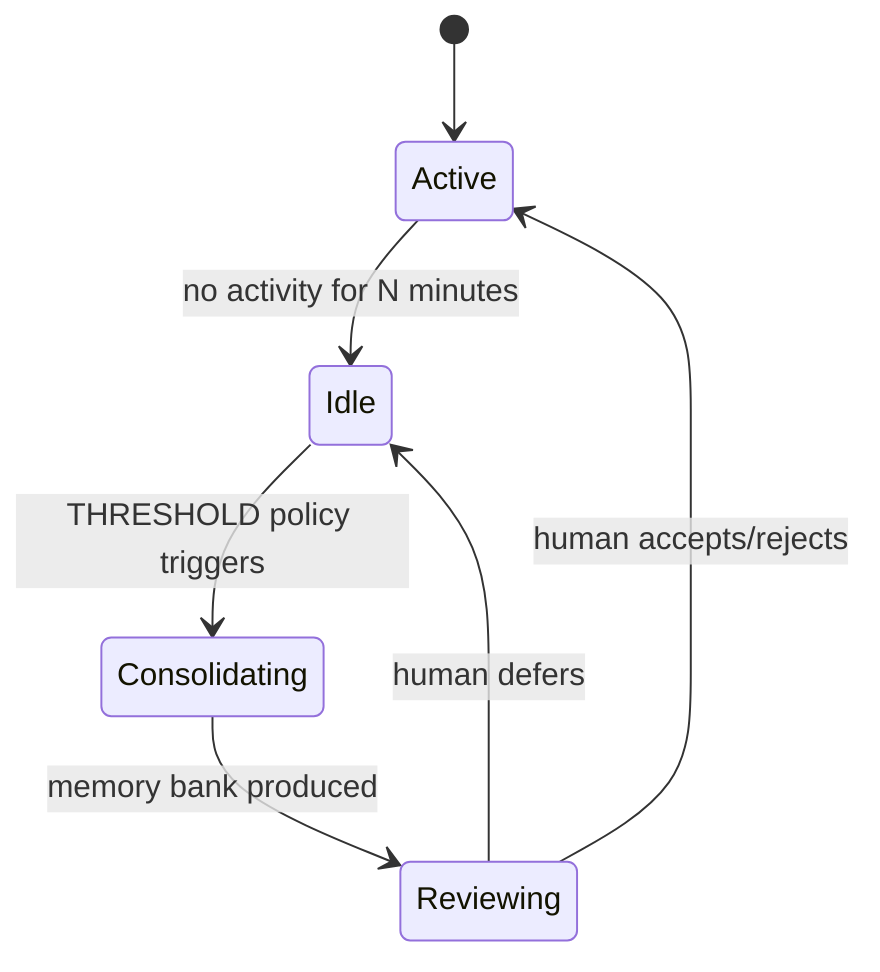

# Memory Consolidation (Dreaming): Idle-Time Replay with Field-Theoretic Consolidation
> **Status:** ✅ Implemented | [Plan](../lyra-upgrade/plans/24-dreaming.md) | [Code](../../src/lyra/memory/)

## Abstract
Lyra's dreaming system consolidates memory during idle time, modeled on REM sleep. During downtime, it reviews past conversations, merges duplicates, replaces outdated entries, resolves contradictions, and surfaces cross-session patterns. The design fuses Anthropic's "Dreaming" feature (Harvey legal AI: ~6× task completion improvement) with LightMem's bio-inspired sleep-time consolidation (105× token reduction, 309× fewer API calls) and field-theoretic memory (PDE-governed continuous fields, +116% F1 on LongMemEval). Never modifies originals — output is reviewable before accept.

## Method
**Consolidation loop** (`src/lyra/memory/memory_consolidation.py`): THRESHOLD policy triggers when idle > N minutes → merge_similar (cosine > 0.85) → deduplicate (MD5 hash) → reorganize → produce reviewable memory bank.

## Working Flow

You finish a conversation with Lyra and step away. After a few minutes idle, the `MemoryConsolidator` in `src/lyra/memory/memory_consolidation.py` wakes up. It scans your recent session for important facts, merges similar ones, removes duplicates, and reorganizes everything into a clean memory bank.

Here's the step sequence. `merge_similar` collapses memories with cosine similarity above 0.85 — like two variations of "API key is in .env". `deduplicate` strips exact repeats via MD5 hash. The output is a reviewable bank you can accept or reject next time you open Lyra.

**Example:** After three sessions researching distributed consensus:
1. Session 1 saves facts about Raft.
2. Session 2 adds notes on Paxos.
3. Lyra goes idle → THRESHOLD triggers.
4. `merge_similar` groups all "leader election" notes together.
5. `deduplicate` removes the Raft description saved twice.
6. Next session you see the consolidated bank and approve it.

## Conclusion
Implemented: MemoryConsolidator with THRESHOLD policy, merge_similar, deduplication. Future: field-theoretic PDE consolidation, GRPO-trained auto-dreamer.
