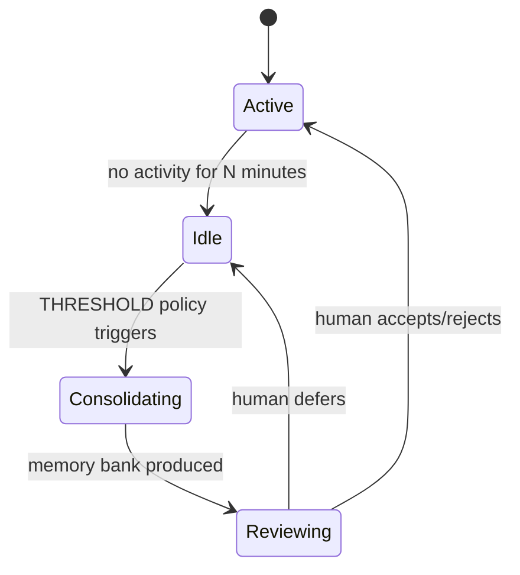

# Memory Consolidation (Dreaming): Idle-Time Replay with Field-Theoretic Consolidation
> **Status:** ✅ Implemented | [Plan](../lyra-upgrade/plans/24-dreaming.md) | [Code](../../src/lyra/memory/)

## Abstract
Lyra's dreaming system consolidates memory during idle time, modeled on REM sleep. During downtime, it reviews past conversations, merges duplicates, replaces outdated entries, resolves contradictions, and surfaces cross-session patterns. The design fuses Anthropic's "Dreaming" feature (Harvey legal AI: ~6× task completion improvement) with LightMem's bio-inspired sleep-time consolidation (105× token reduction, 309× fewer API calls) and field-theoretic memory (PDE-governed continuous fields, +116% F1 on LongMemEval). Never modifies originals — output is reviewable before accept.

## Method
**Consolidation loop** (`src/lyra/memory/memory_consolidation.py`): THRESHOLD policy triggers when idle > N minutes → merge_similar (cosine > 0.85) → deduplicate (MD5 hash) → reorganize → produce reviewable memory bank.

## Working Flow

You finish a conversation with Lyra and step away. After a few minutes idle, the `MemoryConsolidator` in `src/lyra/memory/memory_consolidation.py` wakes up. It scans your recent session for important facts, merges similar ones, removes duplicates, and reorganizes everything into a clean memory bank.

Here's the step sequence. `merge_similar` collapses memories with cosine similarity above 0.85 — like two variations of "API key is in .env". `deduplicate` strips exact repeats via MD5 hash. The output is a reviewable bank you can accept or reject next time you open Lyra.

**Example:** After three sessions researching distributed consensus:
1. Session 1 saves facts about Raft.
2. Session 2 adds notes on Paxos.
3. Lyra goes idle → THRESHOLD triggers.
4. `merge_similar` groups all "leader election" notes together.
5. `deduplicate` removes the Raft description saved twice.
6. Next session you see the consolidated bank and approve it.

## Use Cases

**Scenario 1: Personal AI that learns your preferences over months.** A user has been chatting with Lyra every day for three months: asking about recipes, getting travel recommendations, discussing book recommendations, and troubleshooting code. Without dreaming, these memories accumulate as scattered entries with duplicates ("user likes spicy food" saved three times) and contradictions ("user is vegetarian" from a conversation about lentils, then "user eats chicken" from a later conversation). Lyra's consolidator runs during idle time: it merges duplicates, flags the vegetarian/chicken contradiction for the user to resolve, and reorganizes everything into a clean preference profile. The user wakes up to a reviewable bank and confirms: "I'm flexitarian, leaning vegetarian."

**Scenario 2: Research assistant connecting insights across papers.** A data scientist runs four separate Lyra sessions over a week, each analyzing a different paper about transformer attention mechanisms. Each session saves facts: "Paper A: attention heads specialize in syntax," "Paper B: some heads are redundant and can be pruned," "Paper C: pruning 30% of heads preserves accuracy." After the fourth session, Lyra goes idle during lunch. The consolidator groups all "attention pruning" facts together, deduplicates the repeated claim from papers B and C about the 30% threshold, and surfaces a cross-session insight: three papers independently confirm that ~30% of heads are prunable. The data scientist opens Lyra after lunch and discovers the connection.

**Scenario 3: Long-running agent that prevents memory bloat and contradictions.** An autonomous agent monitors a production deployment and files daily reports. Each day's session saves observations about system performance. After three weeks, the memory store has 200+ entries, many of which overlap ("p99 latency was 120ms," "p99 latency was 115ms next day," "p99 was 118ms" -- effectively the same fact restated). Without dreaming, the agent wastes context on redundant entries and may act on outdated ones. Lyra's idle-time consolidation merges similar metrics into ranges ("p99 latency: 110-130ms"), strips exact duplicates, and prunes entries older than the retention policy. The agent's memory stays compact and internally consistent.

## Conclusion
Implemented: MemoryConsolidator with THRESHOLD policy, merge_similar, deduplication. Future: field-theoretic PDE consolidation, GRPO-trained auto-dreamer.
