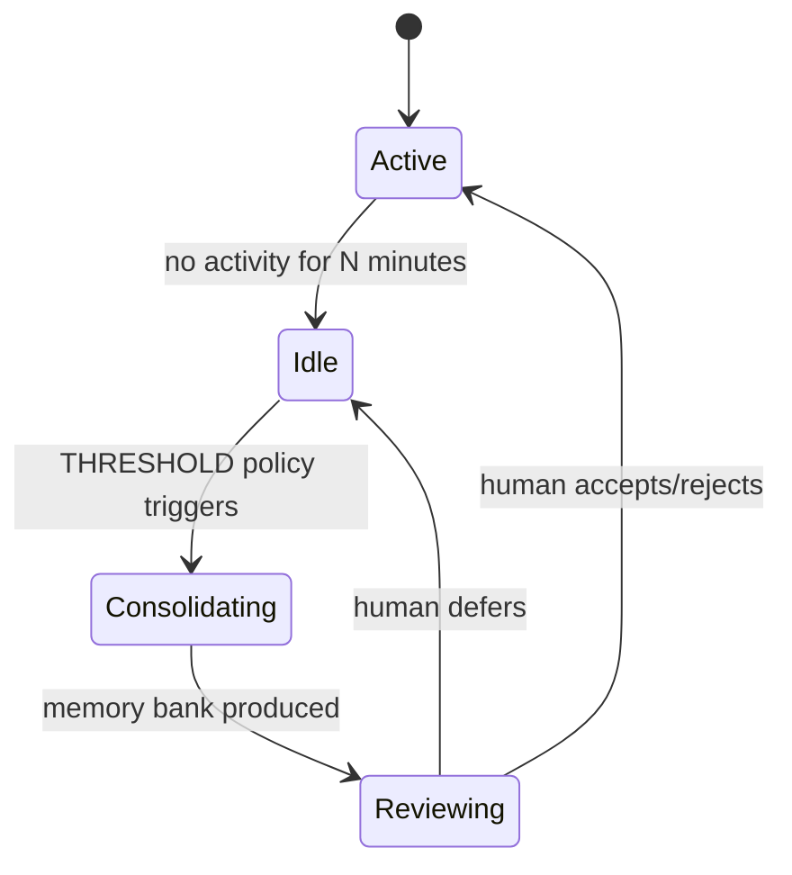

# Memory Consolidation (Dreaming): Idle-Time Replay with Field-Theoretic Consolidation
> **Status:** ✅ Implemented | [Plan](../lyra-upgrade/plans/24-dreaming.md) | [Code](../../src/lyra/memory/)

## Abstract
Lyra's dreaming system consolidates memory during idle time, modeled on REM sleep. During downtime, it reviews past conversations, merges duplicates, replaces outdated entries, resolves contradictions, and surfaces cross-session patterns. The design fuses Anthropic's "Dreaming" feature (Harvey legal AI: ~6× task completion improvement) with LightMem's bio-inspired sleep-time consolidation (105× token reduction, 309× fewer API calls) and field-theoretic memory (PDE-governed continuous fields, +116% F1 on LongMemEval). Never modifies originals — output is reviewable before accept.

## Method
**Consolidation loop** (`src/lyra/memory/memory_consolidation.py`): THRESHOLD policy triggers when idle > N minutes → merge_similar (cosine > 0.85) → deduplicate (MD5 hash) → reorganize → produce reviewable memory bank.

## Conclusion
Implemented: MemoryConsolidator with THRESHOLD policy, merge_similar, deduplication. Future: field-theoretic PDE consolidation, GRPO-trained auto-dreamer.
