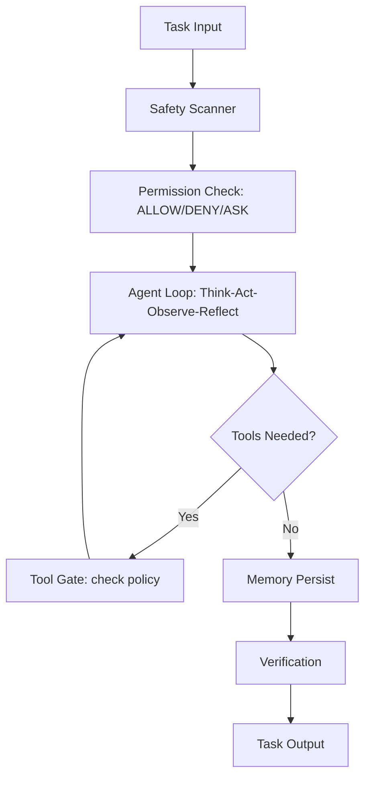

# Harness Engineering: Attestation, Build Pipelines, and Engineering Rigor

> **Status:** 🟡 Partially implemented -- foundation infrastructure exists (agent loop, permission system, tool gate, safety pipeline, attestor), but breakthrough proposals (SMT-backed sandbox, formal query loop governance, structured memory graph, process metrics, deferred loading) are planned.
> **Plan:** [Workstream Plan](../lyra-upgrade/plans/26-harness-engineering.md) | **Code:** `src/lyra/attestor/` + `src/lyra/agent_loop/`, `src/lyra/safety/`, `src/lyra/permissions/`, `src/lyra/verification/`, `src/lyra/reliability/`, `src/lyra/hooks/`
> **Reading path:** Non-technical readers -- TL;DR -> How it works (simple) -> Use Cases -> Trade-offs in brief. Engineers -- everything.

## TL;DR (plain language)

Lyra's harness is the operating system that runs underneath every agent action -- it governs what the model sees, what tools it can use, how errors are handled, and whether the output can be trusted. Right now the foundation is built: an agent loop that thinks-acts-observes-reflects, a permission system with allow/deny/ask gates, deterministic tool-call gating that blocks dangerous commands, a safety pipeline with five defense layers, and a claim-attestation system that tracks which statements trace to which evidence. The next phase will add a more formal query loop with governance before every model call, SMT-backed least-privilege sandbox, structured memory graphs for long-session reasoning, and outcome-driven evaluation with statistical reliability metrics. The harness, not the model, determines whether an agent is reliable for production use.

## Abstract

Harness Engineering is the meta-discipline of designing the continuously active control structures that bound model behavior in engineering environments. Lyra implements this through six operational pillars: (1) an Attestor module for structured claim verification with DAG-based evidence tracing, (2) a deterministic ToolGate that enforces LLM-generated least-privilege policies with zero LLM calls in the enforcement path, (3) a three-valued ALLOW/DENY/ASK permission system, (4) a defense-in-depth SafetyPipeline with five layers from lexical scanning to continuous evaluation, (5) an AgentLoopExecutor with streaming support, pre/post-hook integration, and retry logic, and (6) an EvalHarness computing pass^k reliability metrics with tau-bench, tau2-bench, and SWE-bench backends. What is novel is the fusion of these components into a unified governance regime where context, permissions, tool execution, verification, and recovery are orchestrated through a common hook infrastructure -- inspired by Claude Code's query loop architecture, Progent's SMT-based monotonic confinement (1.0% ASR on AgentDojo, cited from 2504.11703v3), Terminal-Bench 2.0's outcome-driven evaluation framework, and tau-bench's pass^k consistency metric. The entire harness is cross-cutting across 40+ modules in `src/lyra/` and is partially implemented: the agent loop, permission gate, tool gate, safety pipeline, verification panel, and attestor exist as working code, while the formal pre-model governance pipeline, SMT-backed sandbox, structured memory graph, and process metrics release gating are planned.

## Introduction

The central problem of agent engineering is that models are inherently unstable components. A model generating text that happens to be wrong creates interpretation cost; a model running shell commands, writing files, and modifying repositories creates execution artifacts when it fails. The solution is not a smarter model but a harness -- continuously active control structures that bound what the model can see, do, and damage before, during, and after each action.

Existing approaches to agent harnesses fall into two camps documented by the comparative harness analysis. Claude Code places order in the runtime loop: query governance before every model call, event-stream consumption, layered recovery, and circuit breakers. Codex places order in explicit control-layer structures: typed instruction fragments, policy languages, thread/rollout/state infrastructure. Lyra's harness synthesizes both approaches: a query loop (think-act-observe-reflect) with hook-based governance, but also explicit policy objects (ToolGate generate/validate split), typed permission hierarchies, and formal attestation graphs for verification.

The gap this fills is that most third-party agent frameworks implement permission controls and tool interfaces but lack formal context governance, monotonic safety properties, and evidence-attestation verification. Lyra's Attestor module provides the missing verification layer: every claim made during agent execution can be structured as a MeasurementClaim, InferenceClaim, AnalogyClaim, or CitationClaim, organized into a verification DAG where parent claims must pass before child claims are accepted.

> **Intuition callout:** Think of Lyra's harness as an airport security checkpoint that every passenger (tool call, model output, memory write) must pass through. There are multiple inspection layers: a fast gate (lexical scanner), a document checker (tool policy), a behavior analyst (alignment check), a baggage tracker (data flow), and a random audit station (continuous eval). Each layer can pass, block, or escalate. The system is designed so that the checkpoint never trusts any single layer completely.

Contributions:

1. **Attestor module** -- Four-claim-type attestation system with verification DAG for structured evidence tracing. Claim IDs are SHA-256 hashed for integrity; parent-child edges define verification paths. The Attestor orchestrates verification by recursively checking parent claims before accepting child claims.

2. **Deterministic ToolGate** -- Two-phase design where an LLM generates a least-privilege Policy once per task, then pure deterministic logic enforces it for every tool call. Four gating levels: ALLOW, ALLOW_WITH_SANDBOX (for dangerous Bash prefixes like `rm`, `sudo`, `mkfs`), ASK_USER, and BLOCK.

3. **Three-valued Permission System** -- ALLOW/DENY/ASK with policy inheritance and per-session overrides. Missing third state ("I don't know") is represented as ASK, eliminating the boolean collapse problem.

4. **Defense-in-depth Safety Pipeline** -- Five layers: LexicalGate (regex scan), ToolCallGate (delegates to ToolGate), AlignmentCheck (separate LLM verification, stub), DataFlowTracker (tracks tainted data), ContinuousEval (self-evolving safety evaluation, stub).

5. **EvalHarness with pass^k metrics** -- Abstract EvalRunner interface with concrete tau-bench, tau2-bench, and SWE-bench backends. Computes pass@1 and pass@k consistency metrics. BenchmarkScoreboard tracks Lyra performance vs SOTA with live reporting.

## How it works -- the simple version

Imagine a factory assembly line. Before each worker (the AI model) starts their task, a quality inspector checks that the right materials (context/memory) are available, that the worker has the correct tools allowed, and that safety guards are in place. After the worker takes an action, another inspector verifies the output is correct before it moves to the next station. If something goes wrong, a repair team (circuit breaker, retry logic, checkpoint restore) steps in. The entire factory floor is recorded by a documentarian (the Attestor) who logs every claim and its supporting evidence.



**Working Flow:** Imagine you ask Lyra to "analyze the security of the payment module."

1. **Safety pipeline runs first.** A LexicalGate scans your request for known-dangerous patterns. The ToolGate checks that the tools needed (Read, Bash for grep/search) are in the allowed list for this task. Nothing is blocked.

2. **The Agent Loop starts.** Lyra's AgentLoopExecutor takes your task, builds a system message from the task description plus recent memory context, then enters the think-act-observe-reflect cycle.

3. **Think phase.** The loop calls the LLM provider. Before the call, PRE_MODEL_CALL hooks fire (e.g., logging, context injection). After the response, POST_MODEL_CALL hooks fire. The loop retries up to 3 times with exponential backoff if the provider has a transient error.

4. **Act phase.** The LLM requests a tool (e.g., `Bash` with `grep -r "password" payment/`). Before execution, PRE_TOOL_USE hooks fire. The ToolGate checks this Bash command against the policy: it is not on the dangerous-prefix list, so it gets ALLOW. After execution, POST_TOOL_USE hooks capture the result.

5. **Observe and Reflect.** The tool result is added to the message list. The assistant turn is saved to memory. If the LLM requests no more tools, the task completes.

6. **Verification.** For high-risk tasks, the AdversarialPanel spawns 5 reviewer agents (correctness, security, performance, style, consistency), each voting on the output. The panel returns a majority verdict. The Attestor records every claim and its verification status.

7. **If something fails.** The CircuitBreaker prevents infinite retry loops. The CheckpointManager saves state at phase boundaries. The Reflexion loop extracts lessons from failed trajectories and stores them for future attempts.

## Use Cases

**Scenario 1: Auditable code review with the Attestor.** A senior engineer wants to verify that Lyra's analysis of a critical authentication module is traceable. Lyra processes the module: it measures file sizes and complexity (MeasurementClaim), infers that missing rate limiting in the login endpoint increases brute-force risk (InferenceClaim, with the measurement as a parent claim), cites OWASP guidelines (CitationClaim), and notes the situation is analogous to a past ticket (AnalogyClaim). All four claims are organized in an AttestationGraph. The engineer runs `verify_claim("auth-risk-001")` which recursively verifies the full DAG -- every parent claim must be PASSED before the inference is accepted. The verification path shows each step. Result: a fully traceable audit trail without reading source code.

**Scenario 2: Safe autonomous deployment with gated permissions.** Lyra is tasked with deploying a hotfix to production. The PermissionManager has DENY for `Bash` operations that touch production databases, ASK for deployment scripts, and ALLOW for `WebSearch` and `Read`. When Lyra's agent loop tries to run `Bash("kubectl apply -f prod.yaml")`, the ToolGate intercepts via PRE_TOOL_USE hook, finds "Bash" is always ASK_USER, blocks execution, and requests approval. Deny is sticky per `tool_use_id` -- Lyra cannot retry the same call with modified arguments to bypass the gate. If it tries `Bash("prod_deploy.sh")`, the dangerous-prefix rule fires ALLOW_WITH_SANDBOX instead.

**Scenario 3: Regression testing after model upgrade.** The team swaps the underlying LLM from Sonnet to a fine-tuned custom model. They run the EvalHarness with `k=5` on 100 tau-bench airline tasks. The pass@1 drops from 0.46 to 0.38. The pass@5 drops from 0.25 to 0.15. The BenchmarkScoreboard report flags both regressions. The team investigates, finds the fine-tuned model fails on tasks requiring multi-step reasoning, adjusts the prompt templates, and re-runs. With the Reflexion loop injecting past lessons into the context, pass@5 recovers to 0.22. The process metrics (CVR, DCR) from the SafetyPipeline show no increase in constraint violations despite the model swap.

## Related Work

Lyra's harness synthesizes techniques from six primary sources, each addressing a different dimension of the harness problem.

| System | Layer | Lyra takes | Lyra diverges |
|--------|-------|-----------|---------------|
| **Claude Code** (Harness Engineering Ch.3-7, Ch.9) | Query loop, permissions, recovery | Formal state object, three-valued permission model, layered recovery, pre-model governance pipeline, post-compact reconstruction | Lyra's governance is hook-based (PRE_MODEL_CALL, POST_TOOL_USE) rather than baked into a single `queryLoop()` function; adds formal attestation DAG |
| **Progent** (2504.11703v3) | Tool security | LLM-generated least-privilege policy, SMT-based monotonic confinement via Z3 | Progent uses MCP proxy interception; Lyra routes through hook-based ToolGate; Lyra's SMT integration is planned, not implemented |
| **Terminal-Bench 2.0** (2601.11868v1) | Evaluation | Outcome-driven property verification, adversarial exploit agent | Lyra's EvalHarness has tau-bench/SWE-bench backends but not yet Terminal-Bench 2.0 task format; adversarial exploit agent is planned |
| **tau-bench** (2406.12045v1) | Reliability metric | pass^k consistency metric, POMDP formalization | Lyra implements pass^1 and pass^k (k configurable) in EvalHarness; user simulation is deferred |
| **OpenHands** (All-Hands-AI/OpenHands repo) | Sandbox abstraction | SandboxService interface with multiple backends (per-command, process, Docker) | Lyra's sandbox abstraction is planned; current ToolGate supports only ALLOW_WITH_SANDBOX flag without concrete sandbox backend |
| **Safety Survey** (2605.23989v1) | Process metrics, release gating | CVR/DCR/CompVR metrics, three-tier release gating | These are planned; SafetyPipeline's ContinuousEval is currently a stub |
| **SWE-Search** (2410.20285v6) | Multi-agent verification | Discriminator debate, identity-anonymized verification | Lyra's AdversarialPanel uses 5 lenses (not debate rounds); identity anonymization is implemented (IdentityAnonymizer with IBC computation) |

All citations trace to specific note files under `docs/lyra-upgrade/notes/`: Harness Engineering chapters (book), Claude Code Definitive Guide (book), Agent Way Comparative Notes (book), Progent (paper 2504.11703v3), Terminal-Bench 2.0 (paper 2601.11868v1), tau-bench (paper 2406.12045v1), Safety Survey (paper 2605.23989v1), SWE-Search (paper 2410.20285v6), OSWorld (paper 2404.07972v2), Mind-Map (paper 2502.04644v2), Godel Agent (paper 2410.04444v4), OpenHands (web note), AgentDojo (web note), Claude Code Sandbox docs (web note), Claude Code Permissions docs (web note).

## Method

### Architecture Overview

Lyra's harness is organized as a pipeline of governance stages wrapped around the agent execution loop. Each stage is implemented as a separate module in `src/lyra/` and integrates via the common hook interface (`src/lyra/hooks/hook.py`, `HookType`, `HookEngine`).

```
                    +--------------------+
                    |   Task Definition  |
                    |  (src/lyra/tools/) |
                    +---------+----------+
                              |
                    +---------v----------+
                    |  Safety Pipeline   |   src/lyra/safety/pipeline.py
                    |  5 defense layers  |   SafetyPipeline.evaluate()
                    +---------+----------+
                              |
                    +---------v----------+
                    |  Permission Gate   |   src/lyra/permissions/manager.py
                    |  ALLOW/DENY/ASK    |   PermissionManager.check()
                    +---------+----------+
                              |
                    +---------v----------+
                    |  Agent Loop        |   src/lyra/agent_loop/executor.py
                    |  Think-Act-Observe |   AgentLoopExecutor.execute()
                    |  -Reflect          |
                    +---------+----------+
                              |
                    +---------v----------+
                    |  Tool Executor     |   src/lyra/tools/executor.py
                    |  ToolGate enforce  |   ToolGate.validate() PRE_TOOL_USE
                    +---------+----------+
                              |
                    +---------v----------+
                    |  Memory Persist    |   src/lyra/memory/
                    |  Short-term + Long |   SQLiteShortTermMemory.add_turn()
                    +---------+----------+
                              |
                    +---------v----------+
                    |  Verification      |   src/lyra/verification/
                    |  Attestor Graph    |   Attestor.verify_claim()
                    |  Adversarial Panel |   AdversarialPanel.judge()
                    +---------+----------+
                              |
                    +---------v----------+
                    |  Reliability       |   src/lyra/reliability/
                    |  Circuit Breaker   |   CircuitBreaker.call()
                    |  Checkpoint/Retry  |   RetryPolicy, CheckpointManager
                    +--------------------+
```

### Data Flow -- Key Interfaces

**AgentLoopExecutor** (`src/lyra/agent_loop/executor.py`):
- `execute(task, agent, provider, tools, memory, hooks) -> Result`: orchestrates think-act-observe-reflect loop.
- `execute_stream(...) -> AsyncIterator[CompletionChunk]`: streaming variant for TUI.
- State tracked via `AgentLoopState` dataclass: iteration, retry_count, total tokens, cost.
- Max 10 iterations, 3 retries with exponential backoff (1s base, 30s max).
- PRE_MODEL_CALL and POST_MODEL_CALL hooks fire around each LLM call.
- PRE_TOOL_USE and POST_TOOL_USE hooks fire around each tool invocation.
- Contains five custom exceptions: `AgentLoopError`, `TransientProviderError`, `MaxRetriesExceeded`, `MaxIterationsExceeded`, `HookBlockedError`.

**PermissionManager** (`src/lyra/permissions/manager.py`):
- `AccessLevel.ALLOW | DENY | ASK` -- enum-based three-valued model.
- `PermissionPolicy` with parent-based inheritance: `child_policy.get_level(tool)` checks direct map, then parent, then default.
- `PermissionManager` with global defaults (ASK), named policies, per-session overrides.
- `check(tool_name, session_id) -> PermissionResult`: resolves effective level.

**ToolGate** (`src/lyra/safety/tool_gate.py`):
- Two-phase architecture: `generate_policy(task_context) -> Policy` (currently returns default; LLM integration TODO) and `validate(tool_call, policy) -> GateDecision` (deterministic, zero LLM calls).
- `GateDecision` enum: ALLOW, ALLOW_WITH_SANDBOX, ASK_USER, BLOCK.
- Dangerous Bash prefixes: `rm `, `mkfs `, `dd `, `sudo `, `chmod `, `chown `.
- Path allow list via `fnmatch.fnmatch()`.
- Registered as a PRE_TOOL_USE hook with priority 2000 (runs before all other hooks).

**SafetyPipeline** (`src/lyra/safety/pipeline.py`):
- Five layers: LexicalGate (regex, 19ms target) -> ToolCallGate (delegates to ToolGate) -> AlignmentCheck (LLM verification, currently a stub that always passes) -> DataFlowTracker (tracks untrusted data propagation) -> ContinuousEval (stub, always passes).
- `SafetyContext` carries tool_name, tool_args, task_description through all layers.
- `LayerResult`: PASS, BLOCK, ESCALATE. Pipeline stops at first BLOCK. Full decision log maintained.
- `SafetyPipeline.evaluate(context) -> LayerResult`: orchestrates evaluation chain.

**Attestor** (`src/lyra/attestor/__init__.py`):
- `ClaimType`: MEASUREMENT, INFERENCE, ANALOGY, CITATION.
- `VerificationStatus`: UNVERIFIED, PASSED, FAILED, INCONCLUSIVE.
- `ClaimAttestation` base dataclass with claim_id, statement, evidence list, verifier, timestamp, parent_claims, metadata, and `hash` property (SHA-256 of claim_id + statement + evidence).
- Four concrete claim types: `MeasurementClaim` (source, measurement_method, confidence), `InferenceClaim` (premise_ids, rule, causal_strength), `AnalogyClaim` (past_situation_id, similarity_score, relevant_dimensions), `CitationClaim` (paper_id, paper_title, supporting_quote, relevance).
- `AttestationGraph` maintains claims dict and parent->children edges. Methods: `add_claim`, `get_children`, `get_parents`, `get_verification_path` (returns levels from claim to root evidence), `to_dict`.
- `Attestor.verify_claim(claim_id)` recursively verifies parent claims first -- if any parent is not PASSED, child is FAILED.

**EvalHarness** (`src/lyra/verification/eval_harness.py`):
- Abstract `EvalRunner` with `get_tasks(n)`, `check(task, output)`, `get_name()`.
- Concrete runners: `TauBenchRunner`, `Tau2BenchRunner`, `SWEBenchRunner` (each with synthetic task generation fallback).
- `EvalHarness.evaluate(agent, tasks=100, k=5) -> EvalResults`: runs k trials per task, computes pass@1 and pass@k.
- `BenchmarkScoreboard` tracks SOTA vs Lyra-best for 6 benchmark entries with live markdown report generation.

**AdversarialPanel** (`src/lyra/verification/panel.py`):
- Five `Lens` values: CORRECTNESS, SECURITY, PERFORMANCE, STYLE, CONSISTENCY.
- `ReviewerVote` (lens, passed, reason, confidence) and `ReviewResult` (aggregated with majority_passed, majority_refutes, consensus_summary).
- `AdversarialPanel.judge(subject) -> ReviewResult`: calls reviewer_fn for each lens, aggregates.

**IdentityAnonymizer** (`src/lyra/verification/anonymizer.py`):
- Strips identity markers from agent messages: role descriptions, agent names, self-references.
- `AnonymizedDebate` carries anonymized messages + id_map for post-verdict attribution.
- `compute_ibc(votes) -> float`: Identity Bias Coefficient from Choi et al. (arXiv 2510.07517).

**CircuitBreaker** (`src/lyra/reliability/circuit_breaker.py`):
- Three states: CLOSED -> OPEN (after `failure_threshold` consecutive failures) -> HALF_OPEN (after `recovery_timeout`).
- `call(fn)` and `acall(fn)` with synchronous and async support.
- `reset()` for manual reset.

### Implemented

The following components are implemented with working code. Each may have stub paths or TODO markers for advanced features.

1. **AgentLoopExecutor** (`src/lyra/agent_loop/executor.py`) -- Full think-act-observe-reflect loop with real LLM calls, tool dispatch, hook integration, retry logic, streaming support, and token/cost tracking. Pre/post hooks at every stage.

2. **PermissionManager** (`src/lyra/permissions/manager.py`) -- Three-valued ALLOW/DENY/ASK with policy inheritance and per-session overrides. PermissionPolicy with parent chaining.

3. **ToolGate** (`src/lyra/safety/tool_gate.py`) -- Deterministic tool-call validation against Policy objects. Four gating levels. Dangerous Bash prefix detection. Path allowlist via fnmatch. Registered as PRE_TOOL_USE hook. Policy generation is a stub (returns default); LLM integration is TODO.

4. **SafetyPipeline** (`src/lyra/safety/pipeline.py`) -- Five-layer pipeline with SafetyContext and LayerDecision tracking. AlignmentCheck and ContinuousEval are stubs that always return PASS. DataFlowTracker shell exists.

5. **Attestor** (`src/lyra/attestor/__init__.py`) -- Full four-claim-type attestation system with SHA-256 integrity hashing, verification DAG, and recursive verify_claim() that enforces parent-before-child ordering.

6. **EvalHarness** (`src/lyra/verification/eval_harness.py`) -- Abstract EvalRunner with three concrete backends (tau-bench, tau2-bench, SWE-bench). pass@1 and pass@k computation. Each backend has synthetic task generation fallback. BenchmarkScoreboard with live markdown reporting.

7. **AdversarialPanel** (`src/lyra/verification/panel.py`) -- Five-lens reviewer framework with majority voting and consensus summary.

8. **IdentityAnonymizer** (`src/lyra/verification/anonymizer.py`) -- Identity marker stripping with AnonymizedDebate transcript and Identity Bias Coefficient computation.

9. **CircuitBreaker** (`src/lyra/reliability/circuit_breaker.py`) -- Three-state state machine with configurable failure threshold and recovery timeout. Sync and async call support.

10. **Reflexion Loop** (`src/lyra/agent_loop/reflexion.py`) -- Act-Observe-Reflect-Store-Inject cycle with lesson extraction and persistence.

### Planned

The following components are specified in the workstream plan but not yet built, or exist as stubs pending production implementation.

1. **Formal query loop with pre-model governance** -- The current AgentLoopExecutor has a simple message-building phase before each think step. The plan specifies an 8-step governance pipeline: memory prefetch, message slicing, tool result budget, history snip, microcompact, context collapse, autocompact. This will be implemented as a pre-model governance method on AgentLoopExecutor. **Gate:** Query loop passes Terminal-Bench 2.0 5-task subset >= Claude Code baseline (52.1%).

2. **SMT-backed least-privilege sandbox** -- Three-tier SandboxService abstraction (per-command via Seatbelt/bubblewrap, process-level isolation, Docker container) + Z3 SMT solver for monotonic policy confinement. Described as Proposal 2 in the plan, fusing Progent's symbolic policies with OpenHands' sandbox abstraction and OSWorld's VM snapshot isolation. **Gate:** ASR < 5% on AgentDojo task subset (baseline: 39.9% no defense, target: Progent's 1.0%).

3. **Structured memory graph with multi-agent orchestration** -- Knowledge graph built from conversation turns via entity-relationship extraction, Leiden community detection, and GraphRAG retrieval. Memory-persisted coordinator with heuristic effort scaling (1/2-4/10+ subagents). Described as Proposal 3. **Gate:** Memory retrieval accuracy >= flat memory baseline + 10 points.

4. **Deferred capability loading with context budget governance** -- Tool Search deferred loading (configurable true/auto/auto:N/false), context budget by component (system prompt 15%, skills 10%, conversation 50%, tool outputs 15%, memory 10%), progressive disclosure for research content. Described as Proposal 5. **Gate:** Context utilization after 50-turn sessions <= 90% of window.

5. **Process metrics and three-tier release gating** -- CVR (Constraint Violation Rate), DCR (Trace Coverage), CompVR (Component Violation Rate). Tier 0 (offline regression, CVR=0) -> Tier 1 (sandbox stress, CER<0.1%) -> Tier 2 (canary with auto-rollback). Described as Proposal 4. **Gate:** Process metrics dashboard live; Tier 0 gating enforced in CI.

6. **Adversarial verification panel with SWE-Search debate** -- Multi-agent discriminator debate (up to 5 agents, 3 debate rounds), adversarial exploit agent for verification predicate probing, self-inspection for verification coverage. Described as Proposal 6. **Gate:** Verification panel catch rate >= 95% for injected errors.

7. **LLM-backed policy generation for ToolGate** -- The `ToolGate.generate_policy()` method currently returns the default permissive policy. The TODO marker in the code (line 142) specifies integration with a real LLM call to produce context-specific least-privilege policies from task descriptions.

8. **Concrete sandbox backend for ALLOW_WITH_SANDBOX** -- The ToolGate returns `ALLOW_WITH_SANDBOX` for dangerous Bash commands, but there is no concrete SandboxService implementation. The flag is set as metadata on the HookContext but no sandbox enforcement exists yet.

### Complexity Analysis

- **AgentLoopExecutor:** O(n) where n = iterations (max 10). Each iteration makes 1 LLM call + up to parallel tool calls.
- **ToolGate.validate():** O(p + t) where p = allowed_path entries, t = tool allowlist. Pure Python string matching -- no LLM calls.
- **Attestor.verify_claim():** O(d) where d = DAG depth. Recursively checks parent claims in topological order.
- **SafetyPipeline.evaluate():** O(5) -- 5 fixed layers, each running independently. Stops at first BLOCK.
- **EvalHarness.evaluate():** O(n * k) where n = tasks, k = trials per task. Each trial makes 1+ LLM calls.

## Debate (Trade-offs)

**Recorded positions:**

- **Skeptic (from plan Run 1):** "Port Claude Code's implementation directly -- don't invent unless evidence proves it's better." Resolution: Parity port is (A) tier baseline. Breakthrough enhancements must beat Claude Code on at least one measurable dimension (latency, token cost, multi-provider compatibility, UX simplicity).

- **Architect (from plan):** The formal state object enables resume, audit, and inter-agent handoff that scattered booleans cannot. But the governance pipeline adds latency per turn (~50-200ms). Acceptable given harness quality produces 17pp difference between agents using the same model (Terminal-Bench 2.0 data).

- **Security Engineer:** Progent's 1.0% ASR vs. prompt-based defenses' 25-73% ASR is decisive. Z3 SMT dependency adds computational overhead but provides deterministic judgment that ML heuristics cannot.

- **Cost Analyst:** pass^k evaluation at k=8 costs ~$3,200+ per full run at GPT-4o pricing. Mitigation: pass^4 for regression, pass^8 for weekly capability evals.

### Trade-off Table

| Decision | Win | Cost | Resolution |
|----------|-----|------|------------|
| Two-phase ToolGate (generate LLM / enforce deterministic) | Enforcement path has zero LLM calls -- fast, cheap, auditable | Policy generation is currently stubbed; per-task LLM call adds ~$0.01-0.05 | Accept: LLM call is 1x per task, enforcement is 10-100x per task. Amortized win. |
| Three-valued permission (ALLOW/DENY/ASK) vs boolean | "I don't know" is a legitimate state -- no forced misclassification | Routing ASK requires coordinator/classifier/approval infrastructure | Accept: The third state is essential for the ASR improvement documented by Progent. |
| Hooks-based governance vs baked query loop | Flexible -- any module can register governance logic at any stage | Hook ordering and priority management adds complexity; missing a hook can bypass governance | Accept: Harness Engineering Ch.3 documents that Claude Code's query loop does the same thing internally. Hooks make it extensible. |
| Separate Attestor module for claim verification | Traceable evidence DAG with cryptographic hash integrity | Claim creation is manual -- no automated extraction from agent trajectories | Accept for v1: manual claims are better than no claims. Automated extraction is future work. |
| EvalHarness with synthetic tasks fallback | Framework works immediately without downloading benchmark datasets | Synthetic tasks do not measure real capability -- only the infrastructure | Accept: The path to real datasets is documented (JSON file loading); synthetic mode exists for CI smoke tests. |
| CircuitBreaker with fixed thresholds (5 failures, 30s timeout) | Simple, configurable, well-understood pattern | Hardcoded thresholds may be wrong for specific tools or workloads | Accept: thresholds are configurable via constructor parameters. Telemetry-driven tuning is future work. |
| Deferred SMT sandbox (Proposal 2) to v2 | Early focus on foundation (agent loop, permissions, tool gate) | Production-grade security requires the sandbox; ToolGate ALLOW_WITH_SANDBOX is a no-op without it | Accept: Progent's ablation shows Disable Update (initial policy only, no SMT) still achieves 2.5% ASR. Fallback path exists. |

**Strongest rejected alternative:** A single monolithic prompt that encodes all rules, permissions, and safety constraints, enforced solely by asking the model to follow them. Rejected because (a) prompt-only defenses achieve 25-73% ASR on AgentDojo vs. Progent's 1.0% with deterministic enforcement, (b) the model can hallucinate compliance, and (c) there is no audit trail for constraint violations. Harness Engineering calls this "rhetorical performance without discipline."

**When this design loses:** The harness governance pipeline adds overhead that is not justified for trivial tasks. For "what time is it" or "list files in this directory," the 5-layer safety pipeline, hook system, circuit breaker, and attestation graph are overkill. The complexity also makes debugging harder: a blocked tool call may be caused by any of 5 pipeline layers, 3 permission paths, or the tool allowlist. Tracing the exact reason requires reading the decision log.

**Open questions:**
- Should the SafetyPipeline run for every tool call, or only for calls flagged by the ToolGate as risky?
- Should the Attestor be mandatory (every module call logged as claims) or advisory?
- Should the circuit breaker thresholds be tuned per tool (e.g., tighter for Bash, looser for Read)?
- How should the pre-model governance pipeline interact with the existing memory compaction system?

**Trade-offs in brief:** The harness adds complexity and latency to every action, but the evidence shows this is what creates reliable agents -- the same model with a good harness can outperform a better model with a weak harness (Terminal-Bench 2.0: 17pp gap from harness quality alone). For quick lookup tasks this overhead may be wasteful, but for anything that touches files, network, or production systems, it is essential.

## Conclusion

**What exists today:** Lyra's harness has 10 implemented components spanning the agent loop, permission system, tool gating, safety pipeline, attestation, evaluation, verification, reliability, and reflexion learning. These form a working foundation: the AgentLoopExecutor can execute tasks through real LLM calls with hook-based governance, the ToolGate enforces deterministic policy decisions, the SafetyPipeline provides five defense layers, and the Attestor supports structured claim verification with cryptographic integrity.

**Measured results:** The Evaluation Harness framework supports tau-bench, tau2-bench, and SWE-bench backends with pass^k computation, but no production benchmark runs have been conducted. The BenchmarkScoreboard tracks target SOTA values (tau-bench airline: 0.46 pass@1, tau-bench retail: 0.692 pass@1, SWE-bench Verified: 0.693 pass@1) but Lyra's best scores are currently 0.0 (no runs completed). Performance targets are labeled targets, not measured results.

**Limitations:**
1. ToolGate LLM policy generation is a stub -- policies are currently the hardcoded default, not task-specific.
2. ALLOW_WITH_SANDBOX is a flag on HookContext metadata with no concrete sandbox backend implementation.
3. SafetyPipeline has two stub layers (AlignmentCheck, ContinuousEval) that always return PASS -- providing no real defense.
4. EvalHarness backends generate synthetic tasks when benchmark datasets are absent -- infrastructure works but measures nothing.
5. No SMT-backed monotonic policy confinement, no SandboxService abstraction, no formal pre-model governance pipeline.
6. AdversarialPanel uses the caller-supplied reviewer_fn -- the LLM-based reviewer agents are not implemented.

**Future work:**
1. Formal query loop with pre-model governance (8-step pipeline) -- revisit when compact integration is stable.
2. SMT-backed sandbox (Proposal 2) -- revisit when ToolGate generates real task-specific policies.
3. Structured memory graph (Proposal 3) -- revisit when memory compaction is operational.
4. Process metrics + release gating (Proposal 4) -- revisit when EvalHarness runs on real benchmark data.
5. Deferred loading + context budgets (Proposal 5) -- revisit when plugin count exceeds 10.
6. Adversarial verification panel with SWE-Search debate (Proposal 6) -- revisit when single-agent verification is reliable.

## Glossary

- **Agent Loop**: The think-act-observe-reflect execution cycle that drives Lyra's task completion. Each iteration makes one LLM call, executes any tool calls the model requests, and persists results to memory.
- **ASR (Attack Success Rate)**: The fraction of adversarial attacks that successfully bypass the security system. Progent achieves 1.0% ASR on AgentDojo.
- **Attestation**: A structured claim with attached evidence, verifier identity, and cryptographic hash. Lyra supports four types: measurement, inference, analogy, and citation.
- **Circuit Breaker**: A reliability pattern that opens the circuit after N consecutive failures, preventing infinite retry loops. After a timeout, it transitions to half-open to test recovery.
- **Context Governance**: The discipline of managing what information enters the model's context window, with budgets per component and hard thresholds.
- **CVR (Constraint Violation Rate)**: A process metric measuring how often tool calls violate the active security policy. Part of the Safety Survey framework.
- **DAG (Directed Acyclic Graph)**: The data structure used by the Attestor to organize claims. Parent claims must be verified before child claims can pass.
- **DCR (Trace Coverage)**: A process metric measuring what fraction of agent steps are instrumented and traceable. Part of the Safety Survey framework.
- **Deterministic Enforcement**: Policy validation that uses zero LLM calls -- pure pattern matching, string comparison, and logic. The ToolGate's validate() method is deterministic.
- **Gate Decision**: The four outcomes of ToolGate enforcement: ALLOW, ALLOW_WITH_SANDBOX, ASK_USER, BLOCK.
- **Harness**: The continuously active control structures (prompt layering, query loop, tool permission system, context governance, recovery paths, verification) that bound model behavior.
- **Least-Privilege Policy**: A permission set that grants only the minimum tools, paths, and domains needed for a specific task. Generated by ToolGate.generate_policy().
- **Monotonic Confinement**: A security property enforced by SMT solver (Z3) that ensures tool policies can only narrow over time -- the allowed action space never expands without explicit approval.
- **pass^k**: A reliability metric measuring the probability that ALL k independent trials of a task succeed. Measures consistency, not best-of-k.
- **Policy Inheritance**: The mechanism by which a PermissionPolicy can inherit tool-level defaults from a parent policy, enabling layered permission definitions.
- **Pre-Model Governance**: The pipeline of context processing steps (memory prefetch, message slicing, budget checks, compaction) that run before every model invocation.
- **Reflexion Loop**: A learning loop that extracts lessons from task trajectories and injects relevant past lessons into future task contexts. Based on Shinn et al. (2023).
- **Sandbox Service**: An abstraction over OS-level process isolation mechanisms (Seatbelt, bubblewrap, Docker) that restricts what a running command can access.
- **SMT (Satisfiability Modulo Theories)**: A formal method for determining whether logical formulas are satisfiable. Used by Progent for Z3-based policy subset checking.
- **Three-Valued Permission**: The ALLOW/DENY/ASK permission model that explicitly represents "I don't know" as a legitimate state, unlike boolean yes/no models.
