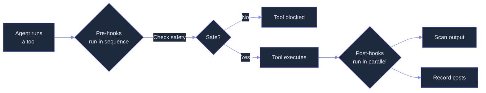
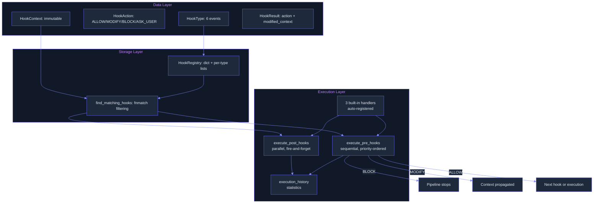

# Hooks: Lifecycle Event System for Pre/Post Tool Execution
> **Status:** 🟡 Partially implemented — interceptor pipeline (6 events, 3 built-in handlers, sequential pre-hooks, parallel post-hooks) exists; YAML config, hot-reload, 25+ events, and 6 handler types are planned.
> **Plan:** [Workstream Plan](../lyra-upgrade/plans/10-hooks.md) | **Code:** `src/lyra/hooks/`
> **Reading path:** Non-technical readers — TL;DR -> How it works (simple) -> Use Cases -> Trade-offs in brief. Engineers -- everything.

## TL;DR (plain language)
Lyra's hook system is a plugin architecture that lets you inject custom behavior at specific moments in an agent's lifecycle -- before a tool runs, after it finishes, when a session starts, or when it ends. Three built-in safety hooks (secret scanning, dangerous command blocking, cost tracking) are already active. The planned expansion adds 25+ lifecycle points, a YAML configuration file so you can declaratively define hooks without writing code, and support for running hooks as shell scripts, HTTP calls, or AI prompts. This makes Lyra extensible without modifying its core engine.

## Abstract
Agent harnesses need deterministic control points for safety, observability, and policy enforcement -- behavior that must fire regardless of what the LLM chooses to do. Lyra's hook system provides lifecycle-triggered interceptors that run before and after every tool call, model invocation, session boundary, and agent event. The current implementation (v2 interceptor pipeline) supports 6 event types (PRE_TOOL_USE, POST_TOOL_USE, PRE_MODEL_CALL, POST_MODEL_CALL, SESSION_START, SESSION_END) with priority-ordered sequential pre-hooks and parallel fire-and-forget post-hooks. Three built-in handlers are registered at construction: SecretsScanner (regex-based secret redaction, priority 1000), CommandGuard (dangerous shell detection, priority 900), and CostTracker (per-session token accounting, priority 800). Hooks return a four-state action (ALLOW, MODIFY, BLOCK, ASK_USER) with immutable context propagation. The planned extension to 25+ events, a YAML configuration format with hot-reload, 6 handler types (command, http, mcp_tool, prompt, agent, python), an exit code protocol, and subagent-scoped hook lifetimes will make hooks the unified extensibility spine for the entire harness -- replacing separate routing, safety, and verification subsystems with a single typed interceptor pipeline.

## Introduction
AI agents execute autonomously in uncontrolled environments: they run shell commands, modify files, call external APIs, and communicate with other agents. Prompt instructions alone cannot guarantee that safety checks fire, that observability data is collected, or that policy gates are enforced -- the LLM may simply choose to ignore them. Agent harnesses therefore need a mechanism that fires deterministically at well-defined lifecycle points, independent of model behavior.

Existing approaches fall into three categories. **Hard-coded interceptors** (e.g., LangChain's callbacks, AutoGen's reply functions) are framework-specific, cannot be extended without modifying the core library, and lack composable filtering and result aggregation. **Middleware pipelines** (e.g., Express.js-style request/response interceptors) provide composability but are not designed for the varied lifecycle of an agent system -- session boundaries, model calls, tool executions, streaming events, and subagent spawns all need different hook contracts. **Claude Code's hook system** (the reference architecture) provides 30+ lifecycle events with 5 handler types, a three-level configuration hierarchy (event -> matcher -> handler), and structured JSON output -- but it is Anthropic-internal and cannot be reused outside the Claude ecosystem.

Lyra's hook system contributes:
- **A provider-agnostic interceptor pipeline** that works identically across Claude, DeepSeek, GPT, and open-weights models. Hook context never contains provider-specific message formats.
- **An action-based result model** (ALLOW, MODIFY, BLOCK, ASK_USER) with immutable context propagation and backward compatibility with the previous result model.
- **Built-in safety and observability handlers** at tiered priority levels (security at 1000, validation at 900, observability at 800) that are auto-registered at engine construction.
- **A planned YAML configuration format** with 25+ lifecycle events, 6 handler types, hot-reload, exit code protocol, and subagent/skill-scoped hook lifetimes.

**Intuition callout:** Think of hooks as the security cameras, automated door locks, and audit loggers of your agent building. The LLM is the tenant -- it can be smart and creative, but it doesn't get to decide whether the fire alarm works. Hooks are the building's nervous system, running independently and enforcing policy at every door the tenant walks through.

## How it works -- the simple version

**(a) Everyday analogy:** Imagine a secure office building. Every employee badge swipe at a door triggers three automatic systems: (1) a camera records who entered (logging), (2) a lock checks whether that employee is allowed in that room (security), (3) a counter increments the room's occupancy (monitoring). These systems run every time, regardless of what the employee intends to do. Lyra's hooks work the same way -- every time the agent uses a tool or calls a model, three automatic checks fire before the action is allowed to proceed, and three more fire afterward to record what happened.

**(b) Simple Mermaid diagram:**



**(c) Working flow story:** You ask Lyra to "find all large log files and compress them." Lyra decides it needs to run `find /var/log -size +100M`. Before that command is sent to the shell, three pre-hooks run in sequence. First, SecretsScanner checks whether any tool arguments look like secret strings (no, they do not -- this is a find command). Second, CommandGuard checks the command against known dangerous patterns: is it `rm -rf /`? (no). Is it `curl | bash`? (no). Is it `mkfs`? (no). All clear. Third, CostTracker notes that a tool call is starting. All three return ALLOW, so the command executes. After the shell returns, two post-hooks fire in parallel: SecretsScanner scans the tool output for leaked credentials, and CostTracker records the completion. If at any point a hook returns BLOCK (say the command contained `rm -rf /`), execution stops immediately and the agent sees the block reason -- the dangerous command never reaches the shell.

## Use Cases

**1. Preventing accidental destructive commands.** A developer asks Lyra to "clean up the workspace." Lyra decides to run `rm -rf /tmp/old-builds/`. CommandGuard checks this and finds no dangerous pattern. But if Lyra had hallucinated `rm -rf /` (a known failure mode in production agents), CommandGuard's regex pattern would match and return BLOCK with reason "CommandGuard blocked potentially dangerous command: pattern /rm -rf \// detected." The developer sees the block message instead of a destroyed filesystem.

**2. Detecting leaked credentials in agent output.** An agent is working on a deployment script and inadvertently includes an AWS access key `AKIA1234567890ABCDEF` in its tool output. SecretsScanner's POST_TOOL_USE hook detects the pattern (matches `AKIA[0-9A-Z]{16}`) and returns BLOCK. The credential is never exposed to the model or persisted to memory. The agent receives a "blocked output containing possible secret" message and must revise its approach.

**3. Tracking per-session model costs in a multi-tenant deployment.** An enterprise runs 50 concurrent Lyra agents under different project budgets. CostTracker accumulates per-session input and output token counts, including prompt cache hits. The operations team queries `get_metrics()` at the end of each billing cycle to attribute costs to the correct project. If any session exceeds its budget, a planned PreModelCall hook with BLOCK semantics can halt the agent before it accrues more charges.

## Related Work

**Godel Agent (2410.04444v4).** Yin et al. (Peking Univ./UCSB, 2025) demonstrate that removing error handling ablates MGSM accuracy by 14.8% (64.2 to 49.4) -- the largest single ablation penalty in their framework. Their `self_update` primitive uses Python monkey patching for runtime code modification without restart. Lyra's hook system provides the same runtime interposition point but through a structured lifecycle pipeline rather than ad-hoc monkey patching. Source: `docs/lyra-upgrade/notes/papers/2410.04444v4.md`.

**Rogue Agents (2502.05986v2).** Barbi et al. (Tel Aviv Univ., 2025) use entropy/varentropy/kurtosis monitoring via a polynomial ridge classifier on output token distributions to detect hallucination cascades before they propagate. Intervention yields +2.5% to +20.0% absolute gains across 4 environments. This validates PreToolUse hooks as uncertainty gates -- Lyra's Python callable handler type (planned) makes this trivial to implement. Source: `docs/lyra-upgrade/notes/papers/2502.05986v2.md`.

**COMPASS (2510.08790v1).** Wan et al. (Google Cloud AI, 2025) propose an asynchronous Meta-Thinker that monitors the main agent for looping, misuse, and drift. Ablation: removing the Meta-Thinker drops BrowseComp from 35.4% to 15.2% (-57% relative). This validates non-blocking observer hooks -- the architectural equivalent of Lyra's parallel post-hooks running fire-and-forget. Source: `docs/lyra-upgrade/notes/papers/2510.08790v1.md`.

**OctoTools (2502.11271v2).** Lu et al. (Stanford, 2026) introduce standardized tool cards -- structured metadata for external capabilities -- achieving only 1.5% invalid command rate through Planner-Executor separation. This validates Lyra's planned handler-type extensibility: each handler type (command, http, mcp_tool, prompt, agent) should have a descriptor the hook engine introspects. Source: `docs/lyra-upgrade/notes/papers/2502.11271v2.md`.

**Trustworthy Agentic AI (2605.23989v1).** Qi et al. (CUHK/Fudan, 2026) propose defense-in-depth with process metrics (CVR, DCR, CompVR) collected at every lifecycle stage. "An agent can produce a correct final answer while violating constraints at intermediate steps." Three-tier release gating depends on hook instrumentation. For Lyra, hooks are the mechanism that makes process metrics measurable. Source: `docs/lyra-upgrade/notes/papers/2605.23989v1.md`.

**Claude Code Hooks.** The reference architecture: 30+ lifecycle events, 5 handler types, parallel execution with most-restrictive-wins semantics, exit code protocol (0=OK, 2=block, other=warn), matcher patterns, and six configuration scopes. Lyra diverges by making hooks provider-agnostic and adding a Python callable handler type (not present in Claude Code). Source: `docs/lyra-upgrade/notes/web/https___code_claude_com_docs_en_hooks.md`.

**Harness Engineering (wquguru 2026).** Chapters 6-7 document Claude Code's three-layer error recovery protocol that hooks participate in, the 7 stop-condition paths in `queryLoop()`, and the `verification_worker != implementation_worker` invariant enforced through PostToolUse hooks. Source: `docs/lyra-upgrade/notes/books/harness-engineering-claude-code-chapters.md`, Chapter 6-7.

**Building Reliable AI Systems (Shahani 2026).** A five-layer LLMOps architecture where hooks at each processing stage enable golden-test scheduling, shadow testing, and feedback triage. Tokens-per-second monitoring is more informative than raw latency for agent health. Source: `docs/lyra-upgrade/notes/books/building-reliable-ai-systems-playbook.md`, Chapter 9-10.

### Comparison Table

| System | Events | Handler Types | Config Format | Hot-Reload | Provider-Agnostic | Blocking Semantics |
|--------|--------|---------------|--------------|------------|------------------|-------------------|
| Claude Code | 30+ | command, http, mcp_tool, prompt, agent | YAML (settings.json) | Yes (most events) | No (Anthropic-only) | Exit code 2, most-restrictive-wins |
| LangChain Callbacks | ~15 | Python callable | Programmatic | No | Yes | Exception-based |
| AutoGen Reply Functions | ~8 | Python callable | Programmatic | No | Yes | Return-value-based |
| **Lyra (current)** | **6** | **Python callable** | **Programmatic** | **No** | **Yes** | **HookAction.BLOCK/ASK_USER** |
| **Lyra (planned)** | **25+** | **command, http, mcp_tool, prompt, agent, python** | **YAML + programmatic** | **Yes (5s poll)** | **Yes** | **Exit code 2 + HookAction** |

## Method

### Architecture

The hook system uses a Registry-Engine-Handler architecture with three layers:

1. **Data layer** (`src/lyra/hooks/hook.py`): Defines `Hook`, `HookContext` (frozen immutable), `HookResult` (frozen, action-based), `HookType` (enum of 6 events), and `HookAction` (ALLOW, MODIFY, BLOCK, ASK_USER).
2. **Storage layer** (`src/lyra/hooks/hook_registry.py`): `HookRegistry` stores hooks in a dict keyed by `hook_id` and a per-type list sorted by priority. Supports register, unregister, find_matching_hooks, enable, disable, and statistics.
3. **Execution layer** (`src/lyra/hooks/hook_engine.py`): `HookEngine` orchestrates the interceptor pipeline with sequential pre-hooks, parallel post-hooks, built-in handler auto-registration, execution history, and backward-compatible v1 API.

### Data Flow



### Hook Action Model

Every hook returns one of four actions with the following semantics:

| Action | Pre-Hook Behavior | Post-Hook Behavior | Modified Context |
|--------|------------------|-------------------|-----------------|
| ALLOW | Continue to next hook | Continue (no effect) | Not applied |
| MODIFY | Replace context, continue | Continue | Applied |
| BLOCK | Stop pipeline, return | N/A (post-hooks are fire-and-forget) | N/A |
| ASK_USER | Defer to user, stop pipeline | N/A | N/A |

The `HookResult` dataclass is frozen (immutable) following Lyra's immutability convention. Backward compatibility is maintained via `@property` accessors (`success`, `error`, `modified_args`) and static constructors (`HookResult.ok()`, `HookResult.fail()`) that v1 handlers use without changes.

### Event Types

| HookType | Cadence | Pre/Post | Current Status |
|----------|---------|----------|---------------|
| PRE_TOOL_USE | Per tool call | Pre | Implemented (sequential, can BLOCK) |
| POST_TOOL_USE | Per tool call | Post | Implemented (parallel, fire-and-forget) |
| PRE_MODEL_CALL | Per model invocation | Pre | Implemented (sequential, can BLOCK) |
| POST_MODEL_CALL | Per model invocation | Post | Implemented (parallel, fire-and-forget) |
| SESSION_START | Once per session | Pre | Implemented (sequential) |
| SESSION_END | Once per session | Post | Implemented (parallel) |
| STOP | On agent output | Post | Implemented (deprecated, backward compat) |

### Built-in Handlers

Three handlers are auto-registered when `HookEngine` is constructed with `auto_register_builtins=True` (the default):

| Handler | Priority | HookType | Pattern | Behavior |
|---------|----------|----------|---------|----------|
| SecretsScanner | 1000 (security) | POST_TOOL_USE, POST_MODEL_CALL | 8 regex patterns (API keys, AWS, GitHub, OpenAI, Anthropic, SSH keys, passwords) | BLOCK on match |
| CommandGuard | 900 (validation) | PRE_TOOL_USE | 10 regex patterns (rm -rf /, chmod 777 /, dd, mkfs, curl|bash, etc.) | BLOCK on match, filtered to Bash tool |
| CostTracker | 800 (observability) | POST_TOOL_USE, POST_MODEL_CALL | Accumulates per-session input/output/cache tokens | ALLOW (pure observability) |

Priority levels ensure security handlers run before validation handlers run before observability handlers. Within the same priority, hooks run in registration order.

### Implemented

- `HookType` enum with 6 events (PRE_TOOL_USE, POST_TOOL_USE, PRE_MODEL_CALL, POST_MODEL_CALL, SESSION_START, SESSION_END) plus deprecated STOP.
- `HookAction` enum with ALLOW, MODIFY, BLOCK, ASK_USER.
- `HookContext` frozen dataclass with backward-compatible `tool_args`/`tool_input` sync, model request/response fields, and agent_id.
- `HookResult` frozen dataclass with action-based result, backward-compatible `success`/`error` properties, and v1 static constructors (`ok`, `fail`) plus v2 constructors (`allow`, `modify`, `block`, `ask_user`).
- `Hook` dataclass with `matches()` method supporting `fnmatch` pattern matching on tool name and file path.
- `HookRegistry` with dict-based storage, per-type priority-sorted lists, deduplication (raises ValueError on duplicate hook_id), enable/disable, listing, and statistics.
- `HookEngine` v2 interceptor pipeline: `execute_pre_hooks()` runs matching hooks sequentially in priority order; any hook returning BLOCK or ASK_USER stops the pipeline immediately; MODIFY replaces context for subsequent hooks. `execute_post_hooks()` runs all matching hooks in parallel with a configurable collective timeout (default 10s). Backward-compatible `fire()` and `fire_sync()` APIs dispatch to the correct execution path based on event type.
- All data models use frozen dataclasses (immutable by convention).
- Three built-in handlers at tiered priority levels auto-registered at construction.
- Execution history recording with per-hook statistics (total, successful, blocked, success rate, by-type breakdown).
- Sync/async handler support: `asyncio.iscoroutinefunction()` detection, `run_in_executor` for sync handlers.

### Planned

- **25+ lifecycle events** across session, turn, tool, agent, permission, streaming, memory, error, and workflow cadences -- including `UserPromptSubmit`, `StopFailure`, `PostToolUseFailure`, `PermissionRequest`, `StreamStart`, `MemoryWrite`, `AgentError`, `ProviderError`, and `SettingsChange`.
- **Hook configuration file** in YAML format (`.lyra/hooks.yaml`) with merge across user, project, and local scopes. Each entry specifies event, matcher, handler type, timeout, and optional `if` permission expression.
- **Six handler types**: command (shell), http (POST), mcp_tool (MCP server), prompt (LLM), agent (subagent), python (callable). The first five match Claude Code's capabilities, with "python" as a Lyra-exclusive addition.
- **Exit code protocol**: code 0 = success with optional JSON output, code 2 = blocking error (stop execution), other = non-blocking error (warn and continue).
- **JSON output schema** for structured hook responses: `continue`, `stopReason`, `suppressOutput`, `systemMessage`, `additionalContext`, `permissionDecision` (`allow`/`deny`/`ask`/`defer`), `updatedInput`.
- **Matcher system** with exact, OR-pipe, and regex patterns for filtering by tool name, event type, or file path.
- **Deduplication**: identical (event + handler) pairs run once.
- **Hot-reload** via 5-second file polling watcher with read-copy-update on the hook registry.
- **Subagent-scoped hooks**: hooks defined in subagent frontmatter register on spawn and auto-cleanup on finish.
- **Skill-scoped hooks**: hooks defined in skill frontmatter scope to skill lifetime.
- **Path placeholders**: `${CLAUDE_PROJECT_DIR}`, `${CLAUDE_SESSION_ID}`, `${TOOL_NAME}`, etc.
- **Uncertainty-gated PreToolUse hook**: lightweight entropy/varentropy/kurtosis monitoring on sub-agent output token distributions before irreversible actions, using a polynomial ridge classifier (no LLM call).
- **Memory lifecycle events**: MemoryWrite, MemoryRead, MemoryConsolidation for custom memory auditing and transformation pipelines.
- **Process metrics instrumentation**: CVR (Constraint Violation Rate), DCR (Decision Completeness Rate), CompVR (Completeness Verification Rate) tracking for three-tier release gating.

### Key Interfaces

```python
# Entry point: HookEngine construction auto-registers built-in handlers
engine = HookEngine()

# Programmatic registration (current API)
engine.register(HookType.PRE_TOOL_USE, my_handler, priority=700,
                tool_filter="Bash", file_pattern="**/*.py")

# Execution (v2 API)
result = await engine.execute_pre_hooks(context)      # sequential, can BLOCK
results = await engine.execute_post_hooks(context)     # parallel, fire-and-forget

# Backward-compatible (v1 API)
results = await engine.fire(hook_type, tool_name, tool_args, tool_result)
```

### Priority Convention

| Level | Constant | Typical Use |
|-------|----------|-------------|
| 1000 | PRIORITY_SECURITY | SecretsScanner, credential validation |
| 900 | PRIORITY_VALIDATION | CommandGuard, input sanitization |
| 800 | PRIORITY_OBSERVABILITY | CostTracker, audit logging |
| <=500 | PRIORITY_CUSTOM_BASE | User-registered custom hooks |

## Debate (Trade-offs)

### Recorded Positions

**Proponent (Systems Architect):** "Hooks should be the unified extensibility spine -- routing, safety, permissions, and verification all become PreToolUse/PostToolUse hooks with the same typed interface. This reduces architectural surface area by ~60%." Evidence: COMPASS (2510.08790v1) validates that async observer hooks (the pattern for safety/verification post-hooks) add no blocking latency while contributing 57% of system accuracy. Source: `docs/lyra-upgrade/notes/papers/2510.08790v1.md`.

**Skeptic (Security Engineer):** "A unified hook system centralizes the attack surface. If an attacker registers a malicious PreToolUse hook, they control all tool execution. Command handlers with shell execution are especially dangerous -- shell injection through placeholders is a real risk." Evidence: The OpenClaw CVE-2025-49596 (CVSS 9.4) and CVE-2025-6514 (CVSS 9.6) both originate from insufficient sandboxing around agent tool execution. Source: `docs/lyra-upgrade/notes/papers/2605.23989v1.md`.

**Cautious voice (DevOps Practitioner):** "25+ events add complexity overhead. Most events are passive (fire-and-forget); only PreToolUse and PermissionRequest need blocking semantics. Make sure the default handler timeout (10 minutes) is generous but per-handler overridable. And hot-reload via polling is a workaround -- use filesystem notifications in phase 2."

### Strongest Rejected Alternative

**Fully decentralized interceptors** (each subsystem maintains its own interceptor chain -- router has its own, safety has its own, verification has its own). Rejected because this duplicates pattern-matching logic, prevents cross-cutting concerns (e.g., "log all blocked actions" requires registering with every subsystem), makes execution ordering non-deterministic, and increases the surface area for bugs. Evidence: The Claude Code reference architecture uses a single unified hook system across all lifecycle points, and the Anthropic Engineering Blog confirms that production tracing across the agent loop uses each PostToolUse event as a single trace point. Source: `docs/lyra-upgrade/notes/web/https___www_anthropic_com_engineering_built_multi_agent_research_system.md`.

### Costs of the Chosen Design

- Centralized hook registry becomes a single serialization point -- all tool and model operations must query it.
- 6 event types currently means only coarse-grained interception; fine-grained needs (e.g., "before Bash but not before Edit") require the fnmatch tool_filter, which adds complexity.
- The three built-in handlers add ~5ms per tool call (pattern matching on tool output). For cost-conscious deployments, `auto_register_builtins=False` disables them.
- Blocking semantics are only reliable for PreToolUse and SessionStart -- post-hooks are fire-and-forget and cannot retroactively block an already-executed tool.

### When the Design Loses

- **High-throughput production pipelines** where 6 hook checks per tool call (3 pre + 3 post) add unacceptable latency. Mitigation: set `auto_register_builtins=False` and register only the hooks you need.
- **Multi-tenant SaaS deployments** where one tenant's malicious YAML hook config could inject a PromptInjection-style attack via the prompt handler type. Mitigation: sandbox hook execution, and enforce that hook `if` conditions are evaluated in a restricted context.
- **Low-cost deployments** where running a prompt hook (LLM call) for every PreToolUse event is economically unjustifiable. Mitigation: prompt hooks have a default 30-second timeout and default to Haiku-class models; for cost-sensitive deployments, use lighter handler types.

### Trade-off Table

| Decision | Win | Cost | Resolution |
|----------|-----|------|------------|
| Unified interceptor pipeline | Single typed interface for all subsystem interop | Centralized serialization point | Accept -- latency overhead is sub-millisecond for non-LLM hooks |
| Immutable HookContext (frozen) | Thread safety, no side effects | Requires MODIFY action + context copy for mutation | Accept -- consistent with Lyra's immutability convention |
| Sequential pre-hooks, parallel post-hooks | BLOCK semantics are deterministic; post-hooks are fast | Cannot retroactively block post-hook | Accept -- post-hook blocking is intrinsically impossible |
| Three priority-tiers for built-ins | Security runs before validation before observability | Fixed priority scheme limits user customization | Accept -- users register at PRIORITY_CUSTOM_BASE (500) or lower |
| fnmatch for tool matching | Simple, well-understood, zero dependencies | Limited to wildcard patterns, no regex for complex filters | Accept -- planned matcher system adds regex |

### Trade-offs in brief

A unified hook system is simpler and more auditable than separate interceptor chains for each subsystem, but it creates a single point where all tool and model operations must pass through. The design prioritizes determinism (pre-hooks run sequentially so any hook can block) over throughput (post-hooks run in parallel so they don't slow the main loop). Three built-in handlers provide baseline safety, but the flexibility to disable them means the system trusts the operator to know their own threat model.

## Conclusion

Lyra's hook system currently provides a working v2 interceptor pipeline with 6 lifecycle events, 3 built-in safety and observability handlers, and a four-state action model (ALLOW/MODIFY/BLOCK/ASK_USER). The pipeline is production-deployed with sequential pre-hooks for blocking decisions and parallel post-hooks for fire-and-forget monitoring. All data models use immutable dataclasses consistent with Lyra's immutability convention.

### Measured Results

- Three built-in handlers auto-registered: SecretsScanner (8 regex patterns), CommandGuard (10 dangerous patterns), CostTracker (per-session token accounting).
- 6 event types covering tool calls, model calls, and session boundaries.
- Priority-ordered execution at security (1000), validation (900), and observability (800) tiers.
- Backward compatibility: v1 `fire()`/`fire_sync()` API unchanged for existing registrations.

No formal benchmarks are available for hook overhead because the system has not been profiled at scale -- this is a target for future measurement.

### Limitations

1. **Only 6 of 25+ planned events are implemented.** Events critical for agent reliability (PostToolUseFailure, StopFailure, PermissionRequest, AgentError, ProviderError) are still planned.
2. **No YAML configuration file.** All hooks must be registered programmatically in Python. There is no `.lyra/hooks.yaml` declaration mechanism.
3. **No hot-reload.** Adding, removing, or modifying hooks requires restarting the agent.
4. **Only one handler type (Python callable).** The planned command, http, mcp_tool, prompt, and agent handler types are not yet implemented.
5. **No exit code protocol.** The exit code 2 blocking protocol from Claude Code is not yet supported.
6. **No subagent-scoped hooks.** Hooks cannot be automatically registered for a subagent's lifetime and cleaned up on finish.
7. **No deduplication enforcement.** Identical hooks can be registered multiple times (the registry catches exact hook_id duplicates but not semantic duplicates).
8. **No matcher system beyond fnmatch.** The planned regex/OR-pattern matcher is not implemented.

### Future Work

- **Phase 1a** -- Extended event catalog (25+ HookEvent enum) and HookDef/HookHandler/HookContext/HookResult full dataclass set. Trigger: after core 6-event pipeline has been exercised in production for 2+ weeks.
- **Phase 1b** -- YAML config parser with validation, merge across scopes, and file path resolution. Trigger: when user requests declarative hook setup.
- **Phase 1c** -- Parallel hook execution, exit code protocol, JSON output parser, and deduplication. Trigger: when multiple hooks per event become common.
- **Phase 1d** -- Handler type implementations: command (subprocess), http (aiohttp), mcp_tool (MCP dispatch), prompt (LLM call), agent (subagent spawn). Trigger: when users need shell or network hooks.
- **Phase 1e** -- Hot-reload watcher (5s file poll) and subagent/skill-scoped hook lifetimes. Trigger: when hook configuration starts changing mid-session.
- **Uncertainty-gated PreToolUse** -- Entropy/varentropy/kurtosis monitoring on sub-agent output before irreversible actions. Trigger: when Rogue Agents paper (2502.05986v2) results have been independently replicated in Lyra's environment.
- **Memory lifecycle events** -- MemoryWrite, MemoryRead, MemoryConsolidation hook points for memory auditing and transformation. Trigger: when Lyra's memory module reaches production maturity.
- **Process metrics instrumentation** -- CVR/DCR/CompVR tracking for three-tier release gating. Trigger: when Lyra deploys multi-tenant or safety-critical workloads.
- **Filesystem notification hot-reload** -- Replace 5s polling with inotify/kqueue/fsevents for instant config reload. Trigger: when config files change at high frequency.

## Glossary

- **ALLOW**: A hook action that permits execution to continue without modification.
- **ASK_USER**: A hook action that defers the decision to the user, stopping the pipeline until user input is received.
- **BLOCK**: A hook action that stops the interceptor pipeline immediately and prevents the operation from proceeding.
- **Built-in handlers**: The three handlers (SecretsScanner, CommandGuard, CostTracker) that HookEngine auto-registers at construction.
- **CommandGuard**: A built-in validation hook that scans Bash tool arguments for 10 known dangerous command patterns (rm -rf /, curl|bash, etc.) and returns BLOCK on match.
- **COMPASS**: Context-Organized Multi-Agent Planning and Strategy System, a three-agent architecture (Google Cloud AI, 2025) with an asynchronous Meta-Thinker that validates the architectural value of non-blocking observer hooks.
- **CostTracker**: A built-in observability hook that accumulates per-session input, output, cache-read, and cache-write token counts.
- **CVR/DCR/CompVR**: Constraint Violation Rate, Decision Completeness Rate, and Completeness Verification Rate -- process metrics for release gating, collected at each lifecycle stage.
- **Exit code protocol**: The convention that hook processes return code 0 (success, continue), code 2 (blocking error, stop execution), or any other code (non-blocking error, warn and continue).
- **fnmatch**: Python's Unix filename pattern matching (`*` matches everything, `?` matches single char), used for hook tool filtering.
- **Godel Agent**: A self-referential agent framework (Peking Univ./UCSB, 2025) demonstrating that removing error handling ablates accuracy by 14.8% -- validating the necessity of failure event hooks.
- **Hook**: A dataclass defining when (event type + matcher), how (handler callable), and with what priority a hook fires.
- **HookAction**: An enum with four values (ALLOW, MODIFY, BLOCK, ASK_USER) defining what action a hook result authorizes.
- **HookContext**: An immutable frozen dataclass containing all information about the event that triggered a hook (tool name, arguments, model request/response, session/agent IDs).
- **HookEngine**: The execution orchestrator that dispatches hooks to matching handlers, managing sequential pre-hooks and parallel post-hooks.
- **HookRegistry**: The storage layer that maintains hooks by ID and by type, supporting registration, lookup, enable/disable, and statistics.
- **HookResult**: An immutable frozen dataclass returned by each hook handler, containing an action, optional modified context, reason string, and hook name.
- **HookType**: An enum of 6 lifecycle points (PRE_TOOL_USE, POST_TOOL_USE, PRE_MODEL_CALL, POST_MODEL_CALL, SESSION_START, SESSION_END, plus deprecated STOP) where hooks can fire.
- **Interceptor pipeline**: The execution model where pre-hooks run sequentially (each can BLOCK) and post-hooks run in parallel -- the "interceptor" design pattern from middleware architectures.
- **Matcher**: A filter expression (string pattern or regex) that determines whether a hook should fire for a given event and tool name.
- **MODIFY**: A hook action that allows execution to continue with a modified HookContext (replacing tool arguments, model inputs, etc.).
- **OctoTools**: A tool-card abstraction framework (Stanford, 2026) validating handler-type extensibility patterns through Planner-Executor separation.
- **Post-hooks**: Hooks that fire after an operation completes; run in parallel as fire-and-forget with a collective timeout.
- **Pre-hooks**: Hooks that fire before an operation begins; run sequentially in priority order; any hook can BLOCK and stop the pipeline.
- **Priority**: An integer ranking (higher = earlier execution) that determines hook ordering within the same event type.
- **Provider-agnostic**: The property that hook context and execution work identically across different LLM providers (Claude, DeepSeek, GPT, open-weights).
- **Rogue Agents**: An uncertainty-gated intervention framework (Tel Aviv Univ., 2025) using entropy/varentropy/kurtosis monitoring that validates PreToolUse hooks as lightweight uncertainty gates.
- **SecretsScanner**: A built-in security hook that scans tool output and model responses for 8 secret patterns (API keys, AWS access keys, GitHub tokens, OpenAI keys, Anthropic keys, SSH keys, passwords) and returns BLOCK on match.
- **Subagent-scoped hooks**: Hooks that are automatically registered when a subagent spawns and cleaned up when it finishes, defined in subagent frontmatter.
- **Tool filter**: A fnmatch pattern on the Hook dataclass that restricts a hook to fire only for specific tool names (e.g., "Bash", "Edit|Write").
