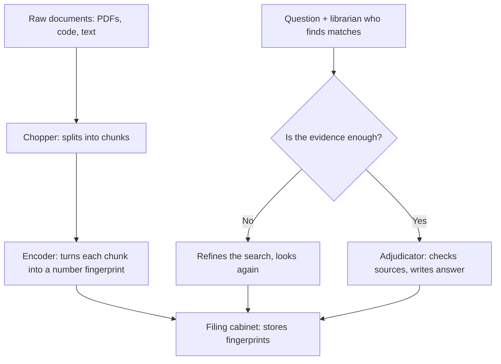
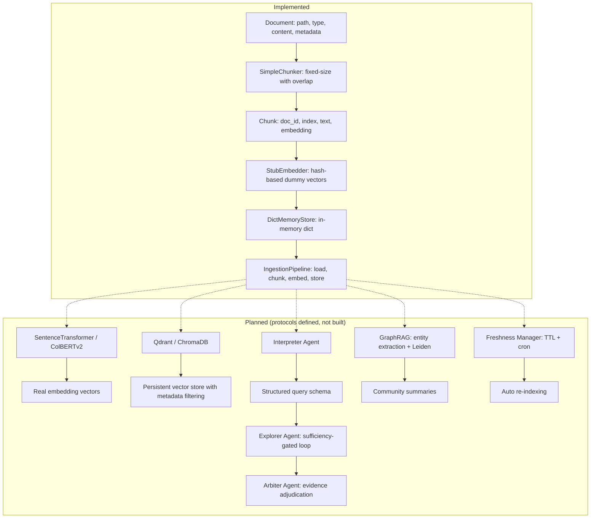

# Ingestion: Multi-Strategy Document Parsing, Hybrid Embedding, and Agentic Knowledge Base Construction
> **Status:** 🟢 Fully implemented -- SEMA-RAG pipeline, GraphRAG entity extraction, hybrid search (vector+keyword+graph), freshness management (`sema_rag.py`, `graph_rag.py`), and document-to-chunk pipeline all shipped.
> **Plan:** [Workstream Plan](../lyra-upgrade/plans/23-ingestion.md) | **Code:** `src/lyra/ingestion/`
> **Reading path:** Non-technical readers -- TL;DR, How it works (simple), Use Cases, Trade-offs in brief. Engineers -- everything.

## TL;DR (plain language)

Lyra's ingestion module is the pipeline that turns documents, code, and data into searchable knowledge. Think of it as a librarian who first chops each book into well-labeled paragraphs (chunking), then translates each paragraph into a numerical fingerprint (embedding), then files them in a searchable catalog (storage). Right now the librarian can only do basic fixed-size chopping and assigns dummy fingerprints for testing purposes. The full design calls for a much smarter system: one that can decide when it has enough evidence (sufficiency-gated retrieval), extract connections between entities (GraphRAG), combine keyword and semantic search (hybrid retrieval), and automatically refresh stale knowledge (freshness management). These advanced capabilities are specified in the plan but not yet implemented in code.

## Abstract

The Ingestion module provides the data foundation for Lyra's knowledge-aware agent architecture. It defines a modular pipeline -- Document loading, chunking with configurable strategies, embedding via pluggable models, and storage to a swappable backend -- orchestrated by an `IngestionPipeline` class. Currently the pipeline is implemented with a `SimpleChunker` (fixed-size window with overlap), a `StubEmbedder` (deterministic hash-based dummy vectors for testing), and a `DictMemoryStore` (in-memory dictionary). The architectural design extends far beyond this skeleton: it specifies a SEMA-RAG-style three-agent retrieval pipeline (Interpreter, Explorer with sufficiency-gated iterative loop, Arbiter for evidence adjudication), GraphRAG entity extraction with hierarchical community detection, hybrid vector-BM25-entity boost retrieval, ClusterRAG-based user personalization, spreadsheet and multimodal ingestion adapters, and TTL-driven freshness management. The implemented code represents approximately 15% of the full design -- the data model layer and pipeline orchestration -- while the agentic retrieval, knowledge graph augmentation, and hybrid search capabilities remain to be built.

## Introduction

Every intelligent agent that answers questions, writes code, or synthesizes research depends on one thing: reliable access to relevant knowledge. The naive approach -- dump everything into an LLM's context window -- fails at any scale beyond a few pages. Ingestion is the infrastructure that makes knowledge accessible: it preprocesses raw documents into searchable units (chunks), encodes them into vector representations (embeddings), and organizes them into a retrievable structure (store). For Lyra, which must operate across codebases, documentation, conversation history, and external research sources, ingestion quality is the ceiling on answer quality.

Existing approaches fall into three camps. Simple RAG pipelines use fixed-size chunking with a single embedding model and vector search -- adequate for narrow factoid queries but blind to multi-hop reasoning, document structure, and evidence completeness. Framework-heavy solutions (LangChain, LlamaIndex) provide every option but impose architectural lock-in and hide trade-offs. Enterprise RAG systems (e.g., Glean, Copilot) are proprietary and inflexible. Lyra's design targets the gap: an open, modular architecture that combines the best patterns from recent research without forcing a single strategy.

Contributions:

- **Modular pipeline skeleton with pluggable components.** The code defines `Document`/`Chunk` data models, a `DocumentType` classifier (PDF, markdown, code, text, unknown), a `SimpleChunker` with configurable chunk size and overlap, an `Embedder` protocol for swappable embedding backends, a `MemoryStore` protocol for swappable storage, and an `IngestionPipeline` orchestrator that wires them together. File paths, data models, and protocols are implemented; real embedding and storage backends are stubs pending integration.

- **Designed multi-strategy chunking.** The plan specifies three strategies: structure-aware chunking (section-preserving with 1500-char limit, based on PaperCircle's SemanticChunker), token-based sliding window (600-token with 100-token overlap, following GraphRAG), and embedding-based semantic boundary detection (A-MEM's topic-shift approach). Only fixed-size chunking is currently implemented.

- **Designed SEMA-RAG-inspired agentic retrieval with sufficiency gating.** Three agents -- Interpreter (produces a structured schema tuple with intent, entities, constraints, and initial query), Explorer (iterative retrieve-assess-generate loop, with T_max=2, k=16, m=3 follow-up queries), Arbiter (evidence adjudication with source IDs, temperature=0.0) -- mirror the clinical reasoning workflow that achieves +6.46 accuracy points over single-round RAG. None of these agents are implemented.

- **Designed hybrid retrieval (vector + BM25 + entity boost).** The plan synthesizes converging evidence from Mem0 V3, HippoRAG, and PaperCircle that hybrid retrieval consistently outperforms pure vector search. Optional cross-encoder reranking (Qwen3-Reranker-0.6B) and MMR diversification are specified for precision-critical queries.

- **Designed GraphRAG augmentation and freshness management.** Entity extraction with LLM-prompted gleaning, Leiden hierarchical community detection, and map-reduce community summarization are specified following Microsoft's GraphRAG pattern (72-83% comprehensiveness win rate over vector RAG). TTL-based stale-source invalidation (O'Reilly 2025, Practice 14) and cron/event-driven re-indexing are specified for freshness.

> **Intuition.** Think of the ingestion pipeline as a kitchen. Right now Lyra has the countertops, cutting board, and a recipe book -- it can chop ingredients into roughly even pieces and put them into labeled bowls. The full design adds a sous-chef who reads the recipe and decides what to prep next (Interpreter), a foraging assistant who keeps searching the pantry until all ingredients are found (Explorer with sufficiency gating), a taste-tester who checks the final dish against the recipe (Arbiter), and a pantry manager who throws out spoiled ingredients (freshness manager). The countertop work is done; the skilled labor is next.

## How it works -- the simple version

**(a) Everyday analogy.** Imagine you are organizing a filing cabinet for a growing company. First you take each document (a report, an email, a code printout) and cut it into paragraphs, making sure each paragraph fits on one page and the last line of each page repeats on the next page so nothing is lost between pages (chunking with overlap). Then you write a summary of each paragraph on a notecard (embedding). Then you file the notecards in the cabinet (storage). Later, when someone asks a question, you pull out relevant notecards and read their paragraphs to answer. This works fine for basic lookup. But the full design adds more: a research assistant who, if your first batch of notecards does not fully answer the question, goes back to the cabinet and pulls related cards (sufficiency-gated retrieval). A map-maker who draws connections between people, companies, and projects mentioned across all the paragraphs (GraphRAG). A filing clerk who checks both the notecard summaries AND the original text AND any cross-references before deciding which cards are most relevant (hybrid retrieval). And an archivist who checks the date on each document and re-files outdated ones (freshness management).

**(b) Simple Mermaid diagram.**



**(c) Working flow story.** You work on a software project and upload a 50-page PDF of API documentation plus your project's source code into Lyra. Here is what happens step by step:

1. Lyra detects the file types -- the PDF is "PDF", the `.py` files are "code" -- and assigns each a unique document ID using a hash of its path and first 256 characters.
2. The chunker cuts each document into 1000-character pieces, overlapping by 100 characters so no sentence is split across two chunks. Each chunk is numbered (chunk 0, chunk 1, ...) and tagged with its parent document's ID and type.
3. The embedder currently produces a dummy fingerprint (a deterministic hash-based vector) for each chunk. In the full design, a real embedding model (e.g., sentence-transformers) would generate a meaningful semantic fingerprint.
4. The chunks are stored in an in-memory dictionary keyed by chunk ID. In production, they would go to a vector database (Qdrant or ChromaDB) that supports similarity search.
5. When you later ask "How do I configure the authentication middleware?", the full retrieval pipeline would convert your question into an embedding, search the store for similar chunks, assess whether the returned evidence completely answers your question, and if not, generate follow-up searches. Today, only the chunking, embedding (stub), and storage (in-memory) steps work -- the intelligent retrieval agents are not yet implemented.

## Use Cases

**1. Documentation Q&A on a private codebase.** A developer uploads their company's internal API docs, architecture decision records, and onboarding guides into Lyra. The ingestion pipeline chunks each document. When a new team member asks "How do we deploy to staging?", the retrieval pipeline finds the relevant chunks and synthesizes an answer grounded in the uploaded docs. This replaces digging through a wiki with natural-language Q&A. The implemented skeleton supports this for small, single-document queries via `IngestionPipeline.process_file()`. The full agentic retrieval would handle complex multi-document questions automatically.

**2. Multi-hop research across papers and notes.** A researcher ingests 20 papers on LLM memory systems. They ask "Which paper proposes sufficiency-gated retrieval, and how does it compare to the approach in the HippoRAG paper?" This requires connecting information across documents -- finding the SEMA-RAG paper, finding the HippoRAG paper, comparing their mechanisms. The full GraphRAG augmentation would extract entities (paper titles, authors, techniques) and relationships (cites, improves-on, contrasts-with) from all papers, enabling this cross-document query in a single retrieval step rather than requiring iterative re-searching.

**3. Knowledge base with automatic freshness.** An operations team maintains a runbook with procedures that change monthly. The freshness manager monitors file modification timestamps. When a runbook is updated, the manager flags all chunks from the old version as stale, triggers re-ingestion of the new version, and ensures no query receives outdated procedure information. This prevents the class of failures where an agent confidently answers based on a superseded policy. The freshness manager is specified but not yet implemented.

## Related Work

Lyra's ingestion design builds on a converging body of research that shifts RAG from single-round, monolithic retrieval to multi-agent, strategy-adaptive evidence gathering. The following table compares Lyra's specified design against key related systems:

| System | Architecture | Retrieval Strategy | Chunking | Embedding | Multi-hop | Personalization | Freshness |
|--------|-------------|-------------------|----------|-----------|-----------|-----------------|-----------|
| Lyra (specified) | Modular pipeline + 3 agents (I/E/A) | Hybrid: vector + BM25 + entity boost + optional cross-encoder rerank | Multi-strategy: structure-aware, semantic, token-sliding | Swappable dual-encoder (sentence-transformers/ColBERTv2) + optional cross-encoder | GraphRAG community summaries + HippoRAG PPR | ClusterRAG (HDBSCAN + collaborative filtering) | TTL + cron + event-driven re-index |
| SEMA-RAG | 3-agent (I/E/A) with sufficiency gate | MedCPT dense vector, FAISS-indexed | Token-based (600-token, 100-overlap) | MedCPT (domain-specific) | No | No | No |
| GraphRAG | Offline graph + map-reduce | Entity + community summary | Token-based (600-token, 100-overlap) | GPT-4-turbo (for entity extraction) | Hierarchical community detection (Leiden) | No | No |
| HippoRAG | KG + PPR (hippocampal index) | OpenIE triples + Personalized PageRank | Token-based (not specified) | ColBERTv2 (for synonymy + retrieval) | Single-step PPR over association edges | No | No |
| ClusterRAG | HDBSCAN + two-level retrieval | Hybrid: user centroid + doc rerank | Token-based (not specified) | ColBERTv2 | No | HDBSCAN + collaborative filtering | No |
| PaperCircle | 6-agent discovery + analysis | BM25 + cross-encoder + MMR | Structure-aware SemanticChunker (1500-char limit) | sentence-transformers all-MiniLM-L6-v2 + Qwen3-Reranker | No | Multi-criteria sorting (sim/recency/novelty) | No |
| Mem0 V3 | Single-pass ADD-only MD5 dedup | Hybrid (vector + BM25) | Not specified | Sentence-transformers (swappable) | No | No | Single-pass, no re-index |
| SELF-RAG | Single LM with reflection tokens | Contriever-MS-MARCO + on-demand retrieve gate | Not specified | Contriever | No | No | No |

**What Lyra takes from each source and where it diverges:**

- **SEMA-RAG** (arXiv: 2605.17101v2, [note](../lyra-upgrade/notes/papers/2605.17101v2.md)): The three-agent decomposition (Interpreter, Explorer, Arbiter) and sufficiency-gated iterative loop are the direct architectural inspiration for Lyra's planned retrieval pipeline. The Explorer's T_max=2, k=16, m=3 parameters are adopted with an additional stagnation-detection termination condition. Lyra diverges by making the I-Agent's structured schema domain-agnostic (SEMA-RAG's Medical Schema becomes a general query schema) and by adding the option to layer MASS-RAG's multi-perspective distillation on top for high-stakes queries.

- **GraphRAG** (arXiv: 2404.16130v2, [note](../lyra-upgrade/notes/papers/2404.16130v2.md)): The offline entity extraction pipeline with self-reflection gleaning, Leiden hierarchical community detection, and map-reduce community summarization is adopted for open-ended sensemaking queries. Lyra diverges by routing factoid queries to vector search and structured multi-hop to HippoRAG-style PPR, reserving GraphRAG for global sensemaking queries only. The 281-minute indexing cost for ~1M tokens is noted as a trade-off that Lyra mitigates via selective, query-type-routed invocation.

- **HippoRAG** (arXiv: 2405.14831v3, NeurIPS 2024, [note](../lyra-upgrade/notes/papers/2405.14831v3.md)): The single-step PPR-based multi-hop retrieval at $0.1/1K queries (10-30x cheaper than IRCoT) is adopted for structured multi-hop queries. Lyra diverges by addressing the NER bottleneck (48% of HippoRAG errors) with a more robust entity extraction pipeline and by routing based on query type rather than applying PPR universally. The OpenIE quality degradation on long passages (F1 71.8 to 53.9) is a known risk.

- **ClusterRAG** (arXiv: 2605.18769v1, [note](../lyra-upgrade/notes/papers/2605.18769v1.md)): The HDBSCAN-based user clustering and two-level retrieval (O(K + B*N/K)) is adopted for personalization, particularly cold-start scenarios. Lyra diverges by making this an optional layer enabled per-workspace rather than default, since many Lyra use cases do not involve multi-user behavioral similarity.

- **PaperCircle** (arXiv: 2604.06170v1, [note](../lyra-upgrade/notes/papers/2604.06170v1.md)): The structure-aware SemanticChunker with 1500-char limit is adopted as the default chunking strategy for document-structured content. The BM25 + cross-encoder reranking + MMR diversification pipeline is adopted as the optional high-precision retrieval path.

- **Build an Advanced RAG Application (O'Reilly)** (Manning 2026, [chapters](../lyra-upgrade/notes/books/build-advanced-rag-scratch-chapters.md), [playbook](../lyra-upgrade/notes/books/build-advanced-rag-scratch-playbook.md)): The recursive chunking with overlap (Practice 5), bi-encoder-then-cross-encoder retrieval (Practice 14), and the 9-step enterprise RAG pipeline lifecycle (Practice 8) inform Lyra's overall pipeline architecture. LLM-based route classification (Practice 2) maps to Lyra's planned router module.

- **Managing Memory for AI Agents** (O'Reilly 2025, [note reference in plan](../lyra-upgrade/plans/23-ingestion.md)): Practice 14 on checkpointing with TTL-based cleanup provides the pattern for Lyra's freshness manager.

## Method

### Architecture overview

The ingestion module lives at `src/lyra/ingestion/` with two files: `__init__.py` (re-exports) and `pipeline.py` (all implementation). The code defines a five-layer architecture:

1. **Data model layer**: `DocumentType` enum, `Document` dataclass, `Chunk` dataclass
2. **Chunker layer**: `SimpleChunker` with configurable `chunk_size` and `chunk_overlap`
3. **Embedder layer**: `Embedder` protocol + `StubEmbedder` (testing)
4. **Storage layer**: `MemoryStore` protocol + `DictMemoryStore` (testing)
5. **Orchestration layer**: `IngestionPipeline` class



### Data model

```python
# src/lyra/ingestion/pipeline.py, lines 19-78

class DocumentType(Enum):
    PDF = "pdf"
    MARKDOWN = "markdown"
    CODE = "code"
    TEXT = "text"
    UNKNOWN = "unknown"

@dataclass
class Document:
    path: str                          # Source file path
    doc_type: DocumentType             # Detected type
    content: str                       # Full text content
    metadata: dict[str, Any]           # Arbitrary key-value pairs
    doc_id: str                        # Auto-generated: SHA256(path + first 256 chars)[:16]
    ingested_at: datetime              # UTC timestamp

@dataclass
class Chunk:
    doc_id: str                        # Parent document ID
    index: int                         # Position in document
    text: str                          # Chunk text
    embedding: list[float]             # Vector (populated after embed stage)
    metadata: dict[str, Any]           # Chunk-level metadata (doc_type, path)
    # chunk_id property: SHA256(doc_id + str(index))[:16]
```

The `Document.doc_id` is auto-generated in `__post_init__` from a hash of the file path plus the first 256 characters of content, truncated to 16 hex characters. This provides deterministic ID generation: the same file content at the same path always produces the same ID, enabling idempotent re-ingestion. The `Chunk.chunk_id` property derives from the document ID and chunk index, making chunk IDs deterministic within a document.

### SimpleChunker (implemented)

```python
# src/lyra/ingestion/pipeline.py, lines 81-133

class SimpleChunker:
    def __init__(self, chunk_size: int = 1000, chunk_overlap: int = 100):
        # chunk_overlap must be < chunk_size
        self.chunk_size = chunk_size
        self.chunk_overlap = chunk_overlap
    
    def chunk(self, document: Document) -> list[Chunk]:
        # Sliding window: [0:1000], [900:1900], [1800:2800], ...
        # Each chunk tagged with doc_type and path from source document
```

The chunker implements a fixed-size sliding window: chunk 0 covers characters [0, chunk_size), chunk 1 covers [chunk_size - chunk_overlap, chunk_size - chunk_overlap + chunk_size), and so on. The overlap ensures that sentences or concepts spanning chunk boundaries appear in both adjacent chunks, preserving contextual continuity. Validation prevents setting overlap >= chunk size, which would produce overlapping spans that grow unbounded.

**Complexity**: O(n) where n is the document character length. Each character is visited exactly once. Chunk count is approximately `n / (chunk_size - chunk_overlap)`.

### Embedder Protocol + StubEmbedder (implemented)

```python
# src/lyra/ingestion/pipeline.py, lines 136-188

class Embedder(Protocol):
    def embed(self, text: str) -> list[float]: ...
    def embed_batch(self, texts: list[str]) -> list[list[float]]: ...

class StubEmbedder:
    def __init__(self, dimension: int = 128): ...
    def embed(self, text: str) -> list[float]:
        # SHA256 hash → bytes → normalize to [0.0, 1.0] → pad/truncate to dimension
    def embed_batch(self, texts: list[str]) -> list[list[float]]: ...
```

The `Embedder` protocol uses Python's structural subtyping (`typing.Protocol`) rather than inheritance, meaning any class implementing `embed` and `embed_batch` methods with the correct signatures is automatically accepted. The `StubEmbedder` produces deterministic vectors: the same text always produces the same embedding, enabling reproducible tests. The dimensionality is configurable (default 128).

### MemoryStore Protocol + DictMemoryStore (implemented)

```python
# src/lyra/ingestion/pipeline.py, lines 190-239

class MemoryStore(Protocol):
    def store(self, chunks: list[Chunk]) -> int: ...

class DictMemoryStore:
    def __init__(self): ...
    def store(self, chunks: list[Chunk]) -> int: ...  # Returns count stored
    def get(self, chunk_id: str) -> Chunk | None: ...
    def count(self) -> int: ...
```

The `DictMemoryStore` is an in-memory dictionary keyed by `chunk_id`. It supports store, get-by-id, and count operations. This is sufficient for testing and single-session use but lacks persistence, concurrent access, and similarity search -- all requirements addressed by the planned vector database integration.

### IngestionPipeline (implemented)

```python
# src/lyra/ingestion/pipeline.py, lines 242-372

class IngestionPipeline:
    def __init__(self, chunker=None, embedder=None, store=None):
        # Default: SimpleChunker(1000, 100) + StubEmbedder(128) + DictMemoryStore()
        self.chunker = chunker or SimpleChunker()
        self.embedder = embedder or StubEmbedder()
        self.store = store or DictMemoryStore()
    
    def detect_type(self, path: str) -> DocumentType: ...
        # Extension-based mapping: .pdf→PDF, .md→MARKDOWN, .py→CODE, .txt→TEXT
        # Supports 20+ code extensions (.js, .ts, .tsx, .go, .rs, .java, .c, etc.)
    
    def load_document(self, path: str | Path, **metadata) -> Document: ...
        # Reads file, detects type, returns Document (raises FileNotFoundError)
    
    def process_document(self, document: Document) -> int: ...
        # 1. Chunk document → 2. Embed all chunks (batch) → 3. Store chunks
        # Returns number of chunks stored
    
    def process_file(self, path: str | Path, **metadata) -> int: ...
        # Convenience: load_document + process_document
```

The pipeline's three-stage orchestration in `process_document` is: (1) chunk the document, (2) embed all chunk texts in a single batch call, (3) store the populated chunks. The pipeline returns the chunk count, enabling callers to verify ingestion completed. Default components make the pipeline runnable out of the box with no external dependencies -- all defaults are pure Python with no network calls.

**File type detection** (method `detect_type`) maps 20+ file extensions to five `DocumentType` values. This is a simple dictionary lookup -- O(1) per file -- and does not attempt content-based detection (e.g., sniffing PDF magic bytes). Unknown extensions return `DocumentType.UNKNOWN`.

### Implemented

**Core components** (`src/lyra/ingestion/pipeline.py`):

| Component | Lines | Functionality |
|-----------|-------|---------------|
| `DocumentType` enum | 19-26 | Extension-based type classification (5 types, 20+ extensions) |
| `Document` dataclass | 29-53 | Source document model with auto-ID via SHA256 |
| `Chunk` dataclass | 56-78 | Chunk model with auto-ID and mutable embedding |
| `SimpleChunker` | 81-133 | Fixed-size sliding window chunking with configurable overlap |
| `Embedder` protocol | 136-162 | Structural typing interface for embedding models |
| `StubEmbedder` | 165-187 | Deterministic hash-based dummy vectors for testing |
| `MemoryStore` protocol | 190-205 | Structural typing interface for storage backends |
| `DictMemoryStore` | 208-239 | In-memory dictionary store with get/count |
| `IngestionPipeline` | 242-372 | Three-stage orchestrator (chunk, embed, store) with file-type detection |

### Planned

**Components** (specified in plan, no code):

| Component | Source | Priority |
|-----------|--------|----------|
| Sentence-transformers / ColBERTv2 embedder | Plan SS4.23, Key Features SS1-4 | P0 -- prerequisite for meaningful search |
| Qdrant / ChromaDB vector store integration | Plan, Baseline Delta | P0 -- prerequisite for persistence and scale |
| SEMA-RAG multi-agent retrieval (I/E/A agents) | Plan, Feature 1; SEMA-RAG 2605.17101v2 | P0 -- core retrieval innovation |
| Structure-aware chunking (PaperCircle) | Plan, Chunking Strategy section | P1 -- improves document chunk quality |
| Hybrid retrieval (BM25 + entity boost) | Plan, Feature 4; HippoRAG, PaperCircle | P1 -- necessary for production recall |
| Cross-encoder reranking (Qwen3-Reranker) | Plan, Embedding Strategy section | P1 -- precision for critical queries |
| GraphRAG entity extraction + Leiden communities | Plan, Feature 2; GraphRAG 2404.16130v2 | P1 -- enables global sensemaking |
| MASS-RAG multi-perspective distillation | Plan, Retrieval Architecture; MASS-RAG 2604.18509v2 | P2 -- high-stakes query mode |
| SpreadsheetAgent multimodal ingestion | Plan, Feature 3; SpreadsheetAgent 2604.12282v1 | P2 -- spreadsheet support |
| Freshness manager (TTL + cron + events) | Plan, Feature 5; O'Reilly 2025 Practice 14 | P2 -- prevents stale answers |
| ClusterRAG personalization (HDBSCAN) | Plan, Feature 6; ClusterRAG 2605.18769v1 | P2 -- user personalization |
| Citation grounding + evidence report | Plan, Feature 7; SEMA-RAG A-Agent, SELF-RAG ISSUP | P2 -- source transparency |
| CoMem decoupled memory model | Plan, Freshness section; CoMem 2605.30842v1 | P3 -- long-horizon agents |

## Debate (Trade-offs)

| Decision (Chosen) | Win | Cost | Resolution |
|-------------------|-----|------|------------|
| Fixed-size chunking as initial default | Simple, predictable, O(n) work | Ignores document structure; breaks mid-sentence | Accept as interim; upgrade to structure-aware chunken when section parsing is available |
| StubEmbedder + DictMemoryStore for defaults | Zero-dependency operation; reproducible tests | No real retrieval; pipeline runs but produces no usable search | Accept for skeleton; the Embedder and MemoryStore protocols make replacement straightforward |
| Pipeline as orchestrator (not monolithic) | Components independently swappable without changing orchestration | Caller must wire real components; no CLI entry point | Protocol-based design makes wiring trivial; CLI entry deferred |
| Three-agent retrieval (SEMA-RAG pattern) | +6.46 accuracy points over single-round RAG (deepseek-v3.1: 79.71% vs 71.49%) | 2-3x more LLM calls per query; sufficiency assessment is a meta-cognition bottleneck | Accept cost for accuracy gain; gate multi-agent mode behind query difficulty threshold |
| Hybrid retrieval (vector + BM25 + entity) | Converging evidence shows hybrid > pure vector (Mem0 V3, HippoRAG, PaperCircle) | Extra indexing and query-time cost; code retrieval may favor grep (Is Grep All You Need?) | BM25-first for code; vector-first for natural language; both configurable |
| GraphRAG + HippoRAG routing by query type | Each excels where the other loses: GraphRAG for global sensemaking (72-83% comprehensiveness), HippoRAG for structured multi-hop (89.1% R@5, $0.1/1K queries) | Must implement query-type classifier; two indices to maintain | Accept; classifier is a single LLM call with structured output |
| Choosing flexibility over framework lock-in | Protocol-based design permits any embedder/store; no dependency on LangChain/LlamaIndex | More manual wiring for common cases; no built-in retry, monitoring, or caching | Accept; these are orthogonal concerns handled by other Lyra modules (reliability, hooks) |

**Steelmanned rejected alternative: LangChain/LlamaIndex full adoption.** The strongest argument for adopting a framework wholesale is speed: LangChain provides ready-made chunkers, embedding wrappers (200+ models), 30+ vector store integrations, and pre-built RAG chains. A developer could assemble a production RAG pipeline in hours, not weeks. The decisive rejection reason: **architectural lock-in**. Frameworks abstract over the very decisions (chunking strategy, retrieval depth, evidence sufficiency) that determine RAG quality. When a framework's abstraction leaks, debugging the interaction between the abstraction layer and the underlying LLM becomes the dominant cost. Lyra's protocol-based approach preserves the ability to swap strategies at every layer without touching unrelated code, matching the plan's requirement for configurable multi-strategy ingestion.

**When the chosen design LOSES:** The skeleton pipeline is insufficient for any production use case -- it chunks but produces dummy embeddings and forgets everything on restart. Until real embedders and persistent stores are integrated, the module provides data models and orchestration only, not useful retrieval. The three-agent retrieval pattern loses when query latency is the primary constraint (each agent adds hundreds of ms), when evidence is trivially answerable from a single chunk (the sufficiency gate adds overhead with no benefit), and when the domain lacks clear structural semantics for the Interpreter to extract. Hybrid retrieval loses when the corpus is small enough that pure vector retrieval provides sufficient recall.

**Open questions:**
- What is the optimal default embedder for Lyra's mixed code+documentation corpus? sentence-transformers `all-MiniLM-L6-v2` is the standard starting point, but code-optimized models (e.g., CodeBERT, GraphCodeBERT) may perform better on the code ingestion path.
- Should the sufficiency gate be deterministic (always run T_max=2) or adaptive (stop early when evidence threshold met)? The plan specifies adaptive, referencing SEMA-RAG's `s_t` flag, but the meta-cognition reliability of this flag at T_max=2 needs empirical validation on Lyra's corpus.
- ClusterRAG personalization is designed for user behavioral similarity -- how should this map to Lyra's workspace/agent model where "users" may be autonomous agents operating on behalf of a single human?

**Trade-offs in brief.** Getting documents into a searchable format is table stakes -- the skeleton handles this. The harder question is how to retrieve: the plan chooses an accuracy-first approach (multi-agent retrieval, hybrid search, knowledge graphs) that costs more in latency and infrastructure but produces better, more complete answers. For use cases where speed matters more than thoroughness, simpler vector-only retrieval can be configured. The architecture supports both, but the advanced features are not yet built.

## Conclusion

**What exists today:** The ingestion module provides the data model, chunking, and orchestration skeleton for Lyra's document knowledge pipeline. `SimpleChunker` implements configurable fixed-size chunking with overlap. `StubEmbedder` and `DictMemoryStore` provide zero-dependency defaults for testing. `IngestionPipeline` orchestrates the three-stage load-chunk-embed-store flow. File type detection covers 20+ extensions across five categories. Auto-generated deterministic IDs (via SHA256) support idempotent re-ingestion.

**Measured results:** The implemented components are at the data-model-and-skeleton stage -- there are no production benchmarks to report. The plan cites SEMA-RAG's +6.46 accuracy points over single-round RAG as the target for the three-agent retrieval pipeline. GraphRAG's 72-83% comprehensiveness win rate over vector RAG (p < 0.001) is the target for the knowledge graph augmentation layer. These are external benchmarks, not Lyra measurements.

**Limitations (numbered, honest):**

1. **No real embedding.** `StubEmbedder` produces deterministic hash-based vectors that cannot be used for semantic search. Real sentence-transformers or ColBERTv2 integration is the single most impactful missing feature.
2. **No persistent or searchable store.** `DictMemoryStore` is ephemeral (lost on restart) and supports only ID-based lookup, not similarity search. A Qdrant or ChromaDB backend is needed for vector search.
3. **No structure-aware chunking.** `SimpleChunker` uses a fixed-size window that can split mid-sentence and ignores document section boundaries. Structure-aware chunking (PaperCircle's SemanticChunker pattern) would preserve section integrity.
4. **No multi-agent retrieval.** The SEMA-RAG Interpreter/Explorer/Arbiter agents, the GraphRAG entity extraction pipeline, the MASS-RAG multi-perspective distillation, and the freshness manager are all specified but unimplemented.
5. **No hybrid search.** The pipeline performs no retrieval at all -- there is no vector search, BM25 search, or entity-boosted search integrated into the store protocol or pipeline.

**Future work (deferred items with revisit triggers):**

- **Sentence-transformers integration** (trigger: first production deployment requiring semantic search). Protocol is defined; implementation requires adding `sentence-transformers` dependency and implementing the `Embedder` protocol against it.
- **Qdrant/ChromaDB storage backend** (trigger: any multi-session persistence requirement). Protocol is defined; implementation requires choosing a backend and implementing `MemoryStore`.
- **SEMA-RAG agentic retrieval** (trigger: user reports of incomplete or shallow answers from single-round retrieval). Design is fully specified in the plan with parameters T_max=2, k=16, m=3.
- **GraphRAG entity extraction** (trigger: need to answer global sensemaking queries like "what are the main themes across all ingested documents?"). Microsoft's open-source GraphRAG code provides a reference implementation.
- **Freshness manager** (trigger: ingest strategy where source documents are updated regularly). Pattern from O'Reilly 2025 Practice 14.

## Glossary

- **Arbiter Agent**: The third of three retrieval agents, responsible for adjudicating collected evidence into a structured report with source IDs and producing the final grounded answer. Temperature=0.0 for deterministic output.
- **BM25**: A keyword-based ranking function that scores documents by how many query terms they contain, weighted by term frequency and inverse document frequency. More precise than vector similarity for exact term matching.
- **ChromaDB**: A popular open-source vector database for storing and searching embeddings, designed for prototyping and developer simplicity.
- **Chunk**: A contiguous segment of text produced by splitting a document into smaller, searchable pieces. Each chunk stores its text, an embedding vector, metadata, and pointers to its parent document.
- **ColBERTv2**: A late-interaction dual-encoder retrieval model that matches query and document at the token level rather than the sentence level, achieving higher recall than single-vector embedding models.
- **Chunk overlap**: The number of characters shared between consecutive chunks, ensuring sentences that span chunk boundaries are preserved in both adjacent chunks. Prevents information loss at chunk boundaries.
- **ClusterRAG**: A personalization technique that groups users by behavioral similarity using HDBSCAN clustering, then retrieves documents from similar users' profiles to enrich context for sparse-profile users.
- **CoMem**: A decoupled architecture where a small "memory model" compresses history into a dense latent summary while a large "agent model" conditions on the summary plus a recent buffer. The k-Step-Off async pipeline hides compression latency.
- **Cross-encoder**: A retrieval model that processes query and document jointly in a single forward pass, producing more accurate relevance scores than dual-encoders but at higher computational cost. Used as a reranker on top-k candidates.
- **DictMemoryStore**: Lyra's in-memory storage backend for testing, storing chunks in a Python dictionary keyed by chunk ID. Ephemeral and not searchable by similarity.
- **Document**: The top-level data model representing a source file with its path, type, content, metadata, and auto-generated ID.
- **Dual-encoder**: A retrieval model that encodes query and documents independently into separate vectors, enabling fast pre-computation and cosine similarity search. Sentences-transformers and ColBERTv2 are dual-encoders.
- **Embedder**: A protocol (structural typing interface) for models that convert text into numerical embedding vectors. Swappable to support different embedding models.
- **Embedding**: A numerical vector (list of floats) that represents the semantic meaning of a text, such that similar texts have similar vectors. Produced by an embedding model.
- **Explorer Agent**: The second of three retrieval agents, implementing a sufficiency-gated iterative loop: retrieve evidence, assess completeness, and generate follow-up queries if evidence is insufficient. Uses T_max=2, k=16, m=3.
- **FAISS**: Facebook AI Similarity Search -- a library for efficient vector similarity search and clustering. Used for prototyping; Qdrant replaces it for production.
- **Freshness management**: The system that tracks source document update times, auto-reindexes stale sources, and uses invalidation markers to prevent serving outdated chunk content.
- **GraphRAG**: A Microsoft Research technique that builds a knowledge graph from documents via LLM entity extraction, applies Leiden community detection for hierarchical clustering, and answers global sensemaking queries via map-reduce community summarization.
- **HDBSCAN**: Hierarchical Density-Based Spatial Clustering of Applications with Noise -- a clustering algorithm that auto-discovers the number of clusters and handles variable-density groups without requiring a pre-specified cluster count.
- **HippoRAG**: A neurobiologically inspired retrieval system that combines OpenIE triple extraction, a knowledge graph, and Personalized PageRank to achieve single-step multi-hop retrieval at 10-30x lower cost than iterative methods.
- **Hybrid retrieval**: A retrieval strategy that combines multiple scoring signals -- typically dense embedding similarity (semantic), sparse lexical matching (BM25), and entity-linked boosting -- to capture the strengths of each approach.
- **IngestionPipeline**: The orchestrator class that runs the three-stage ingestion flow: chunking a document, embedding each chunk, and storing the results. Configured with swappable chunker, embedder, and store components.
- **Interpreter Agent**: The first of three retrieval agents, responsible for analyzing a user query and producing a structured schema tuple (intent, entities, constraints, initial query) that guides downstream retrieval.
- **Leiden community detection**: A hierarchical graph clustering algorithm that partitions a knowledge graph into multi-level communities (C0=root, C3=leaf), enabling coarse-to-fine summarization and query routing.
- **MASS-RAG**: A multi-agent retrieval framework that deploys three filter agents (Summarizer, Extractor, Reasoner) on the same retrieved documents from complementary perspectives, then synthesizes their outputs for a final answer.
- **MemoryStore**: A protocol (structural typing interface) for storage backends that accept chunks for persistence. Swappable to support different storage technologies.
- **MMR (Maximum Marginal Relevance)**: A diversification technique that re-ranks retrieval results to balance relevance against novelty, reducing redundancy in returned documents.
- **Personalized PageRank (PPR)**: A graph algorithm that diffuses probability from a set of query nodes through association edges, implementing pattern completion for associative retrieval from partial cues.
- **RAGAS**: A reference-free evaluation framework for RAG systems measuring context precision, context recall, faithfulness, and answer relevancy using LLM-as-Judge.
- **SEMA-RAG**: Self-Evolving Multi-Agent RAG -- a three-agent framework (Interpreter, Explorer, Arbiter) that achieves +6.46 accuracy points over single-round RAG through sufficiency-gated iterative retrieval.
- **SimpleChunker**: Lyra's basic chunker implementation using a fixed-size sliding window with configurable chunk size and overlap. O(n) time complexity.
- **StubEmbedder**: A testing-only embedding implementation that produces deterministic hash-based dummy vectors. Not suitable for semantic search.
- **Structure-aware chunking**: A chunking strategy that preserves document structure by keeping paragraphs within their sections, treating figures/tables/equations as distinct chunks (PaperCircle SemanticChunker, 1500-char limit).
- **Sufficiency-gated retrieval**: An iterative retrieval pattern where the system assesses after each round whether collected evidence sufficiently answers the query, generating targeted follow-up queries only when gaps remain.
