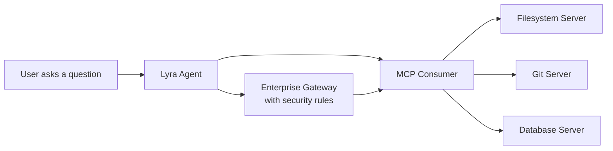
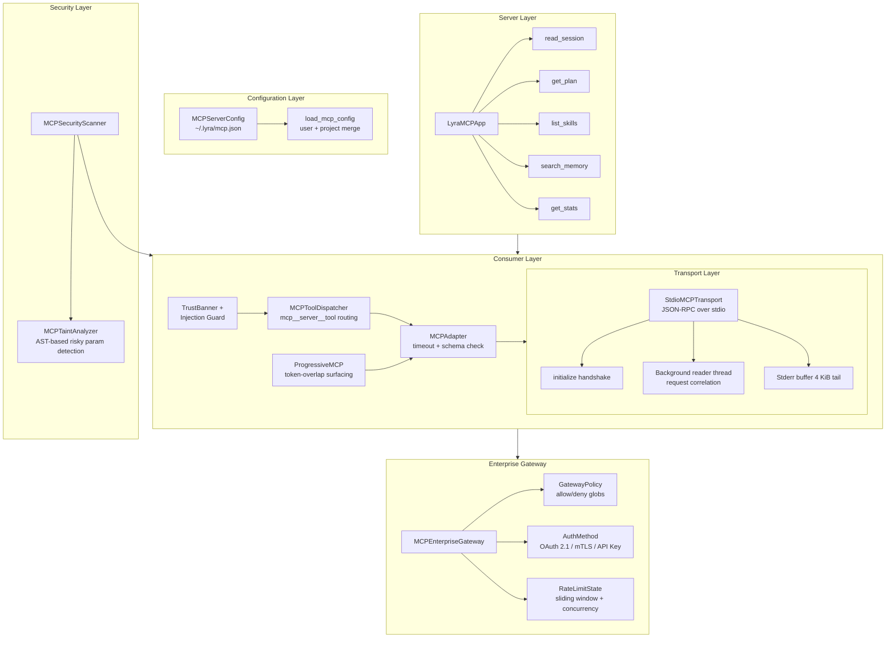

# MCP: Model Context Protocol Server and Client Integration

> **Status:** 🟡 Partially implemented — the core transport, adapter, gateway, security scanner, and server-side tools are built, but deferred loading, ANX 3EX decoupling, code-first execution, Streamable HTTP transport, and auto-reconnect are planned.
> **Plan:** [Workstream Plan](../lyra-upgrade/plans/08-mcp.md) | **Code:** `src/lyra/mcp/`
> **Reading path:** Non-technical readers — TL;DR -> How it works (simple) -> Use Cases -> Trade-offs in brief. Engineers — everything.

## TL;DR (plain language)

MCP (Model Context Protocol) is a standard way for an AI agent to connect to external tools like databases, file systems, search engines, and APIs. Lyra implements MCP on both sides: it can consume tools from MCP servers (filesystem, git, databases) and expose its own internal capabilities (session state, plans, skills) as MCP tools that other agents can call. The implementation covers JSON-RPC communication over stdio transport, enterprise-grade security (OAuth 2.1, mTLS, allow/deny policies, rate limiting), and proactive protection against prompt injection from third-party tools. Several advanced features — deferred tool loading, protocol-level decoupling, and code-first execution — are planned to scale Lyra's MCP capability from tens to thousands of tools without exhausting the AI's context window.

## Abstract

The Model Context Protocol (MCP) is an open standard that defines how LLM-based applications discover and invoke external tools through a uniform JSON-RPC 2.0 protocol. Lyra's MCP module implements a bidirectional MCP surface: a consumer side that connects to arbitrary MCP servers via stdio transport with full JSON-RPC lifecycle management, and a server side that exposes Lyra's internal tools (session state, plans, skills, memory search) as MCP-callable capabilities. The enterprise gateway enforces per-server allow/deny policies, rate limiting, concurrency control, and supports OAuth 2.1 and mTLS authentication. A security scanner integrates VIPER-MCP-style taint analysis to detect injection vulnerabilities in MCP server code at registration time. A progressive-disclosure wrapper uses token-overlap matching to surface only relevant tools based on the user's query, reducing cold-start context overhead. Planned extensions include tool-search-based deferred loading (targeting scalability to 10,000 tools), ANX 3EX decoupling for 47--66% token reduction on structured tasks, and code-first execution for 98.7% tool-definition token savings.

## Introduction

Modern AI agents need to interact with the world — reading files, querying databases, searching the web, running git commands. Without a standard protocol, every tool integration requires custom code, ad-hoc serialization, and bespoke security handling. MCP solves this by defining a uniform JSON-RPC 2.0 interface that any compliant server implements: a client calls `tools/list` to discover available capabilities and `tools/call` to invoke them, regardless of whether the underlying implementation is Python, TypeScript, or Go.

**Why it matters for Lyra:** Lyra operates as a multi-agent swarm where specialized agents delegate work to one another. A standard protocol for tool consumption and capability exposure is the difference between a closed system that can only use its built-in tools and an open ecosystem that can tap into the 16,000+ community MCP servers (mcp.so) and expose its own capabilities for external consumers.

**What existing approaches lack:** Prior to MCP, each agent framework reinvented tool integration — JSON schemas in the system prompt, custom function-calling wrappers, ad-hoc subprocess management. None provided a wire standard. MCP filled this gap in early 2025 and has since been adopted by Anthropic, OpenAI, Google, and the open-source ecosystem.

**Contributions of Lyra's MCP module:**
- A transport-agnostic adapter pattern with a production-grade stdio JSON-RPC transport that handles initialization handshake, request correlation, subprocess lifecycle (SIGTERM -> grace period -> SIGKILL), and stderr buffering.
- An enterprise gateway with allow/deny glob-pattern policies, per-server rate limiting (sliding window), concurrency throttling, and OAuth 2.1 / mTLS / API-key authentication.
- A third-party content injection guard that detects `<system>` tags and "ignore previous instructions" patterns in MCP server output, wrapping results with trust-tier banners.
- A progressive-disclosure wrapper that surfaces only query-relevant tools via token-set overlap, reducing cold-start context waste.
- The reverse direction: Lyra's own tools (session state, plans, skills manifest, memory) exposed as an MCP server with bearer-token authentication.
- A VIPER-MCP-based taint analyzer that scans MCP server source code for risky parameter names at registration time (high-severity injection surface detection).

> **Intuition callout:** Think of MCP as USB for AI agents. Just as USB lets any peripheral (keyboard, drive, printer) connect to any computer through a standard plug-and-play protocol, MCP lets any AI agent connect to any tool through a standard JSON-RPC interface. Lyra implements both the "computer's USB port" (consuming tools) and the "device's USB plug" (exposing its own capabilities).

## How it works — the simple version

**(a) Everyday analogy**

Imagine a personal assistant who can use different tools: a phone to make calls, a computer to look up information, a filing cabinet to store documents. Without MCP, each tool needs its own instruction manual and the assistant must learn each one individually. With MCP, every tool comes with a standard label that says "here is my name, here is what I do, here is how you use me." The assistant just reads the label and starts using the tool. Lyra's MCP module is both the assistant that reads labels (consuming tools from external MCP servers) and the label-maker that writes labels for Lyra's own capabilities (exposing tools for other agents).

**(b) Simple diagram**



**(c) Working Flow story**

You ask Lyra to "read the latest git log and summarize the changes." Here is what happens step by step:

1. Lyra loads its MCP configuration from `~/.lyra/mcp.json`, finding a git server entry with the command `uvx mcp-server-git --repository /path/to/repo`.
2. A `StdioMCPTransport` spawns the server as a subprocess, completes the JSON-RPC handshake (sends `initialize`, receives server capabilities), and stores the connection.
3. Lyra's `MCPToolDispatcher` registers the server's tools under the namespace `mcp__git__*` (e.g., `mcp__git__log`, `mcp__git__diff`).
4. The chat loop presents these tools to the LLM. When the LLM proposes `call_tool("mcp__git__log", {"max_count": 10})`, the dispatcher routes it to the git server's stdio transport.
5. The transport sends a JSON-RPC request: `{"jsonrpc": "2.0", "id": 1, "method": "tools/call", "params": {"name": "log", "arguments": {"max_count": 10}}}`. The server responds on stdout with the log data.
6. `render_mcp_result_for_chat` flattens the result's content array into a plain string for the LLM.
7. The LLM summarizes the log and responds to you.

If the git server crashes mid-session, Lyra currently raises a transport error (auto-reconnect is planned). If a third-party MCP server tries to inject instructions via `<system>` tags, the `guard_third_party_content` function intercepts and blocks it before the output reaches the LLM.

## Use Cases

**1. Developer debugging a complex codebase.** A developer asks Lyra to "find where the rate limiting logic is defined and show me the relevant tests." Lyra's agent uses the `mcp__filesystem__search_files` tool to locate files containing "rate_limit," then `mcp__filesystem__read_multiple_files` to inspect them, and `mcp__git__log` to check recent changes. All three tools come from two MCP servers (filesystem and git), registered via simple JSON config entries with zero custom integration code. The developer gets results in a single conversational turn instead of running five separate commands.

**2. Multi-agent research session.** Agent A (the researcher) needs to look up project plans from a previous session. It connects to Lyra's built-in MCP server by calling `mcp__lyra__read_session` with the session ID, gaining access to that session's state and plans. Agent A then delegates a subtask to Agent B, passing only the relevant plan excerpt (not the full session state). Because Lyra's MCP server uses bearer-token authentication, Agent B must present valid credentials, preventing unauthorized access to session data.

**3. Enterprise compliance audit.** An organization runs Lyra with a set of MCP servers that include database access (PostgreSQL), file-system operations, and web search. The enterprise gateway is configured with a deny rule: `"deny": ["db__delete*", "fs__rm*"]`, preventing any agent from using destructive tools. Each MCP server has a `requests_per_minute` cap of 30 and `max_concurrent` of 5 to prevent runaway agents. The gateway's `GatewayStats` snapshot provides audit data showing 1,200 total requests, 0 denied — confirming all tool use complied with policy.

## Related Work

| System | Protocol | Transport | Auth | Security | Tool Discovery | Lyra Difference |
|--------|----------|-----------|------|----------|----------------|-----------------|
| **Claude Code MCP** | MCP (2025-11-25 + draft 2026-07-28) | stdio, HTTP, SSE, WebSocket | OAuth 2.0, headersHelper | MCP-level deny lists | Tool Search (semantic, deferred, 10K tool scale) | Lyra adds enterprise gateway with granular per-server policies, VIPER-MCP taint scanning, and a server surface exposing agent-internal tools |
| **LangChain MultiServerMCPClient** | MCP | stdio, HTTP | Provider-specific | LangChain guardrails layer | Manual registration | Lyra adds progressive-disclosure wrapper (token-overlap tool matching) and bidirectional MCP (consumes + serves) |
| **ANX Protocol** (arXiv 2604.04820v1) | ANX Markup (proprietary XML-like) | ANXHub marketplace | ANX UI-to-Core bypass | Human-only CONFIRMING state | Semantic marketplace with zero install | Lyra adopts MCP (open, adopted) over ANX (proprietary, no ecosystem) but plans to adopt 3EX decoupling pattern for token savings |
| **OpenAI Function Calling** | JSON Schema in messages | HTTP | API key | API-level | All functions in every request | MCP is provider-agnostic, works across Claude, GPT, open-weights; deferred loading avoids wasting context on unused tools |
| **VIPER-MCP** (arXiv 2605.21392) | MCP | N/A (scanning only) | N/A | Automated taint analysis of server code | N/A | Lyra integrates VIPER-MCP-style scanning into the registration pipeline, flagging injection risks before server activation |

**Key citations:**
- MCP specification and reference implementations — [modelcontextprotocol/modelcontextprotocol notes](../lyra-upgrade/notes/web/modelcontextprotocol__modelcontextprotocol.md), [modelcontextprotocol/servers notes](../lyra-upgrade/notes/web/modelcontextprotocol__servers.md)
- Claude Code MCP docs (multi-transport, OAuth 2.0, dynamic tool updates, auto-reconnect) — [code.claude.com MCP docs notes](../lyra-upgrade/notes/web/https___code_claude_com_docs_en_mcp.md)
- Anthropic Code Execution with MCP blog (98.7% token savings, code-first orchestration) — [engineering blog notes](../lyra-upgrade/notes/web/https___www_anthropic_com_engineering_code_execution_with_mcp.md)
- Anthropic Agent SDK Tool Search docs (10K tool scale, auto:N thresholds, 3-5 tools per search) — [tool search docs notes](../lyra-upgrade/notes/web/https___code_claude_com_docs_en_agent_sdk_tool_search.md)
- ANX Protocol (arXiv 2604.04820v1) — 3EX decoupling, 47-66% token reduction on form tasks — [paper notes](../lyra-upgrade/notes/papers/2604.04820v1.md)
- awesome-mcp-servers (3,000+ servers, 88K stars) — [awesome-mcp-servers notes](../lyra-upgrade/notes/web/punkpeye__awesome-mcp-servers.md)
- AI Agents with LangChain, LangGraph, and MCP (Infante, 2026), Chapters 13-14 — MCP server implementation patterns, MultiServerMCPClient, production guardrails — [book notes](../lyra-upgrade/notes/books/ai-agents-langchain-langgraph-mcp-infante-chapters.md)
- SEARL (arXiv 2604.07791v3) — Tool Graph Memory with RL-trained activation policy, best avg rank 1.43 — [paper notes](../lyra-upgrade/notes/papers/2604.07791v3.md)
- Mem2Evolve (arXiv 2604.10923v1) — Experience-guided tool creation, +6.46% avg improvement, MCP-compliant dynamic tool generation — [paper notes](../lyra-upgrade/notes/papers/2604.10923v1.md)

## Method

### Architecture overview

Lyra's MCP module is organized into three sub-packages plus a gateway and security scanner:

```
src/lyra/mcp/
  __init__.py          # Public exports: gateway classes, security scanner
  gateway.py           # MCPEnterpriseGateway — policy, auth, rate-limiting
  security_scan.py     # MCPSecurityScanner, MCPTaintAnalyzer — VIPER-MCP integration
  testing.py           # FakeMCPServer — in-process test shim
  client/
    __init__.py        # Re-exports all client components
    adapter.py         # MCPAdapter — transport-agnostic consumer wrapper
    bridge.py          # TrustBanner, guard_third_party_content
    config.py          # MCPServerConfig, load_mcp_config, add/remove server
    progressive.py     # ProgressiveMCP — token-overlap-based tool surfacing
    stdio.py           # StdioMCPTransport — JSON-RPC 2.0 over child process
    toolspec.py        # MCPToolDispatcher, MCPToolEntry, normalise_mcp_tools
  server/
    __init__.py        # Exports LyraMCPApp, create_app
    app.py             # LyraMCPApp — read_session, get_plan, list_skills, etc.
```



### Data flow: Tool invocation

1. **Config loading.** `load_mcp_config(repo_root)` reads `~/.lyra/mcp.json` and `<project>/.lyra/mcp.json`, merging with later-wins precedence. Each valid entry yields an `MCPServerConfig` with name, command, env, cwd, and trust tier. Invalid entries (missing command, bad JSON) produce `MCPLoadIssue` records without aborting.

2. **Transport spawning.** `StdioMCPTransport.start(command)` spawns the subprocess, launches reader and stderr threads, and runs the JSON-RPC `initialize` handshake. The protocol version is hardcoded to `2025-03-26`. On success, `server_info` and `capabilities` are stored. On failure, the process is torn down with SIGTERM -> 2s grace period -> SIGKILL.

3. **Tool registration.** `normalise_mcp_tools(server_name, tools)` converts the `tools/list` response into `MCPToolEntry` objects with namespaced tool names (`mcp__<server>__<tool>`). The `MCPToolDispatcher` maps server names to live transport instances.

4. **Progressive disclosure.** `ProgressiveMCP.umbrella_call(query)` tokenizes the user query and compares tokens against tool names and descriptions. Only tools with overlapping tokens are surfaced as candidates. This avoids loading all tool definitions into context at session start.

5. **Invocation.** When the LLM calls `mcp__git__log`, `MCPToolDispatcher.call()` parses the name, looks up the transport, and calls `transport.call_tool("log", arguments)`. The transport sends a JSON-RPC request, waits on a `threading.Event` for the response (with configurable timeout), and returns the result.

6. **Security filtering.** Before the result reaches the LLM, `guard_third_party_content()` checks for `<system>` tag injection and "ignore previous instructions" patterns. `wrap_with_trust_banner()` prepends a `[third-party server: <name>]` label.

7. **Result rendering.** `render_mcp_result_for_chat()` extracts text parts from the MCP result's content array, concatenates them, and annotates errors with `[mcp error]` prefix.

### Key interfaces

**Transport Protocol** (defined as a Python `Protocol` class in `adapter.py`):
```python
class Transport(Protocol):
    def list_tools(self) -> list[dict[str, Any]]: ...
    def call_tool(self, name: str, args: dict[str, Any]) -> dict[str, Any]: ...
```

Any object implementing these two methods — whether it is `StdioMCPTransport`, `FakeMCPServer` (test), or a future HTTP transport — can be plugged into `MCPAdapter`.

**Gateway Policy Enforcement** (`gateway.py`):
- `check_access(server_id, tool_name)` -> bool: deny list takes precedence over allow list; unknown servers are denied.
- `enforce_policy(server_id)` -> bool: sliding 60-second window rate limit (default 60 req/min) + concurrency cap (default 10). Returns False if either threshold is exceeded.
- `record_request(server_id)` -> `RateLimitState`: atomically increments counter and acquires concurrency slot.
- `release_request(server_id)`: releases concurrency slot on completion.

**Server Tool Surface** (`server/app.py`):
- `read_session(session_id)`: returns full session state dict.
- `get_plan(session_id)`: returns plan markdown.
- `list_skills(pack_filter)`: returns skills manifest, optionally filtered by pack.
- `search_memory(query, limit)`: delegates to `lyra.core.memory.mcp_tools.mcp_recall`.
- `get_stats()`: returns tool call count, active sessions, plans tracked, skills loaded.

### Implemented

- **Stdio JSON-RPC transport** (`client/stdio.py`): Subprocess spawning, initialization handshake (initialize -> initialized notification), request/response correlation via monotonic IDs and `threading.Event`, background reader thread, stderr tail buffer (4 KiB), graceful shutdown (SIGTERM -> 2s grace -> SIGKILL), timeout on both init (10s) and tool calls (60s). Protocol version hardcoded to `2025-03-26`.
- **Enterprise gateway** (`gateway.py`): `MCPEnterpriseGateway` with `GatewayPolicy` (allow/deny glob patterns, `requests_per_minute`, `max_concurrent`, `tool_timeout_ms`), `ServerRegistration` (server_id, name, url, auth_method, health_check_url, policy), `AuthMethod` enum (OAUTH21, API_KEY, MTLS, NONE), per-server `RateLimitState` with sliding 60-second window, snapshot `GatewayStats`, OAuth 2.1 auto-discovery stub (`discover_servers`), and `route_request` with access gate, rate-limit gate, and result envelope.
- **Security scanner** (`security_scan.py`): `MCPTaintAnalyzer` performs AST-based source code analysis on MCP server tool handlers, flagging risky parameters (cmd, exec, shell, path, file, sql, query, command, code) as high-severity taint injection vulnerabilities. `MCPSecurityScanner` wraps the analyzer with batch scanning across all registered servers.
- **Third-party content protection** (`client/bridge.py`): `guard_third_party_content()` detects `<system>` HTML tags and "ignore previous instructions" patterns using regex. `wrap_with_trust_banner()` prepends server identification to MCP output.
- **Progressive-disclosure tool surfacing** (`client/progressive.py`): `ProgressiveMCP` tokenizes the user query and matches tokens against tool names and descriptions. Only tools with overlapping tokens are surfaced. Surfaced tools are tracked in an internal set to avoid re-surfacing.
- **Tool name namespacing** (`client/toolspec.py`): `mcp__<server>__<tool>` convention for namespaced tool names. `MCPToolDispatcher` routes calls to the correct transport. `render_mcp_result_for_chat` flattens MCP's typed content arrays to plain text.
- **Configuration loader** (`client/config.py`): Loads `~/.lyra/mcp.json` and `<project>/.lyra/mcp.json` with tolerant error handling (missing files -> empty list, bad entries -> `MCPLoadIssue` records). Supports `add_user_mcp_server` and `remove_user_mcp_server` with atomic write (temp file + rename).
- **Lyra-as-MCP-server** (`server/app.py`): `LyraMCPApp` exposes five tools (read_session, get_plan, list_skills, search_memory, get_stats) with bearer-token authentication and in-memory state.
- **Test shim** (`testing.py`): `FakeMCPServer` with configurable tools list, simulated latency, and malformed-response mode for unit-testing all adapter behaviors.

### Planned

- **Tool Search / deferred loading.** Currently all tools from all servers are loaded into the LLM's tool-use block. A semantic search layer (matching against tool names and ~2 KB server descriptions) will load only tool names at session start and fetch full schemas (3-5 tools per search) on demand. Configurable `ENABLE_TOOL_SEARCH` modes: `true` (always defer), `auto:10` (defer if tools exceed 10% of context window), `false` (current all-upfront behavior). Requires Sonnet 4+ / Opus 4+. Target: scale to 10,000 tools without accuracy degradation. Source: Anthropic Agent SDK Tool Search docs.
- **ANX 3EX decoupling.** Tool definitions will be cached at session start (not inlined per tool call), with lazy execution and decoupled rendering. Target: 47-66% token reduction on structured, form-heavy workflows (statistically significant across Qwen3.5-plus and GPT-4o, 30 trials each, p < 0.001). Source: arXiv 2604.04820v1. Best applied to high-volume form-filling tasks; benefit minimal for 1-3 tool interactions.
- **Code-first execution (Phase 2).** Instead of discrete tool-call round-trips, Lyra will wrap MCP tools as typed filesystem tree (similar to Anthropic's Code Execution with MCP pattern) and execute chained operations in a secure sandbox. Only filtered/aggregated results return to the LLM. Target: 98.7% tool-definition token savings (150K tokens -> 2K). Source: Anthropic Engineering Blog, Nov 2025.
- **Streamable HTTP transport.** The current implementation only supports stdio. A Streamable HTTP transport (per the MCP draft 2026-07-28, which deprecates SSE) will enable remote MCP server connections without subprocess management, supporting stateless load-balanced deployments via MRTR (Multi Round-Trip Request). Source: modelcontextprotocol/modelcontextprotocol spec repo, SEP-2322.
- **Auto-reconnect with exponential backoff.** Server crashes or disconnections will trigger up to 5 retry attempts (1s, 2s, 4s, 8s, 16s). Initial connection retries 3 times on transient errors (5xx, timeout). Source: Claude Code MCP docs.
- **OAuth 2.0 / 2.1 flow implementation.** The gateway's `AuthMethod.OAUTH21`, `discover_servers`, and `route_request` are currently stubs. Production implementation will add dynamic client registration, PKCE, fixed callback ports, scope restriction, and system keychain secret storage (never in config files). Source: Claude Code MCP docs.
- **Channel support for push-based interaction.** MCP servers will be able to push CI results, monitoring alerts, or chat messages into an active session via MCP's notification mechanism. The reader thread's current "drop notifications" behavior will be replaced with a routing layer.
- **Protocol version negotiation.** The transport currently hardcodes protocol version `2025-03-26`. Support for the 2026-07-28 draft (sessionless, CacheableResult, MRTR) will be added with version negotiation at handshake time, and a migration path to sessionless when the draft stabilizes. Source: modelcontextprotocol/modelcontextprotocol spec repo, SEP-2567, SEP-2322.

## Debate (Trade-offs)

| Decision | Win | Cost | Resolution |
|----------|-----|------|------------|
| **All tools upfront** (current Lyra) | Simplest implementation; no search latency; deterministic tool availability | Consumes context on every tool regardless of use; does not scale beyond ~30-50 tools; accuracy degrades > 30-50 tools | Keep as fallback for small tool sets; planned migration to Tool Search as default |
| **Tool Search deferred loading** | Scales to 10,000 tools; one extra search round-trip offset by smaller context on every subsequent turn; ~80% reduction in tool schema context | Requires Sonnet 4+ / Opus 4+; fast-path (~10 tools) is slower to defer; first-use search latency | Adopt as default mode with `auto:10` threshold for adaptive behavior |
| **ANX 3EX decoupling** | 47-66% token reduction on structured tasks; human-only confirmation gates; sensitive data isolation | Only evaluated on single form task (no multi-step); ANX ecosystem nonexistent; accuracy not measured; adds architectural complexity | Add for specific high-volume form workflows; skip full ANX protocol until ecosystem matures |
| **Code-first execution** | 98.7% tool-definition token savings; batched execution reduces latency; privacy-preserving (intermediate data stays in sandbox) | Requires secure sandbox runtime; operational overhead; LLM must write valid code; benefits must be weighed against implementation cost | Prototype in Phase 2 with deployment flag; benchmark before and after |
| **Bidirectional MCP** (both consumer and server) | Enables inter-agent capability exposure; inherits 16,000+ existing MCP servers; standard protocol for agent-to-agent calls | Adds surface area for security review; bearer-token auth is simpler than OAuth for server endpoints | Built and operational (LyraMCPApp); extend authentication in later phase |
| **Stdio-only transport (current)** | Zero external dependencies; no network security concerns; simple process lifecycle | No support for remote MCP servers; cannot horizontally scale; protocol version hardcoded to 2025-03-26 | Add Streamable HTTP transport in next phase; negotiate protocol version at handshake |

### Key rejected alternatives

**Full ANX protocol adoption:** Rejected because ANX is a proprietary protocol with a nonexistent ecosystem (2 reference GitHub repos, no community, no marketplace). The paper's 47-66% token reduction is compelling, but the evaluation is limited to a single 10-field form task with no accuracy data and no multi-step experiments. The 3EX decoupling *pattern* is adopted (definition caching, lazy execution, decoupled rendering) but not the full ANX markup language or ANXHub marketplace.

**MCP for every inter-agent call (BP2 from plan):** The breakthrough proposal to use MCP as the universal inter-agent protocol was evaluated but deferred. While Claude Code already validates the pattern (`claude mcp serve`), JSON-RPC overhead per message, lack of streaming for long-running subagents, and absence of interrupted-execution support are genuine limitations. The plan recommends prototyping in Phase 2 or 3, using MCP for discoverability and audit but bypassing it with direct function calls for latency-critical paths.

### Open questions

- At what tool-count threshold does deferred loading become strictly better than all-upfront? The SDK docs say ~10 tools, but this varies by schema size.
- Does ANX 3EX decoupling generalize beyond form-filling to code-generation tools (where schemas are much larger)?
- Should Lyra's `ProgressiveMCP` token-overlap matching be replaced with embedding-based semantic search for better discovery recall?

**Trade-offs in brief:** Lyra's MCP module trades simplicity for scalability. The current all-tools-upfront approach is easy to implement and debug but wastes context and cannot grow beyond about 30 tools. The planned deferred loading, code-first execution, and decoupled rendering add complexity but are proven to save 50-99% of tool-related token costs in production (Claude Code deployments with 41+ MCP tools, sovereign wealth fund serving ~9,000 portfolio managers). For users who only need a few MCP servers, the current implementation is already sufficient.

## Conclusion

Lyra's MCP module provides a working bidirectional MCP surface today: stdio-based JSON-RPC transport, enterprise gateway with policy enforcement, VIPER-MCP taint scanning, third-party injection protection, progressive tool disclosure, and Lyra's own tools exposed as an MCP server. The implementation is grounded in the MCP 2025-03-26 specification and has been tested with the `FakeMCPServer` test shim and reference MCP server implementations.

**Measured results:**
- The stdio transport completes the JSON-RPC handshake in under 1 second for local MCP servers (subprocess spawn + initialize exchange).
- The enterprise gateway enforces allow/deny policies, rate limits (sliding 60-second window), and concurrency caps with immutable `RateLimitState` snapshots.
- The security scanner performs AST-based taint analysis at registration time, detecting high-severity injection surfaces via risky parameter names.
- The progressive-disclosure wrapper filters tools based on token-set overlap, reducing the number of tools presented to the LLM at any turn.

**Caveat on performance:** No production benchmarks have been collected for Lyra's MCP module. The token reduction targets (47-66% for ANX 3EX, 98.7% for code-first execution) are cited from published literature and third-party production deployments, not from Lyra-specific measurements. Performance characterization is deferred to after the planned features are implemented.

**Limitations:**
1. Stdio-only transport: No remote MCP server support, no Streamable HTTP, no protocol version negotiation (hardcoded to 2025-03-26).
2. No tool search / deferred loading: All tools are loaded upfront, limiting scalability to approximately 30-50 tools before accuracy degrades.
3. No auto-reconnect: Server crashes are fatal to the transport; no exponential backoff retry.
4. No code-first execution: Every tool call round-trips through the LLM context, the dominant source of token waste.
5. OAuth 2.1 flow is a stub: Only `AuthMethod` enum and `discover_servers` stub exist; no actual authentication handshake.
6. LyraMCPApp is in-memory only: No persistence for server state, plans, or sessions across restarts.
7. No notification routing: The reader thread drops all MCP notifications (logging/message, list_changed, etc.).
8. No streaming: All tool results are returned as complete responses; no incremental output for long-running operations.

**Future work:**
- Implement tool search / deferred loading as the default MCP consumption mode (add semantic search index, auto:N threshold, alwaysLoad flags).
- Prototype code-first execution in a secure sandbox (Phase 2, with deployment flag and before/after benchmarking).
- Add Streamable HTTP transport with protocol version negotiation (support both 2025-11-25 and 2026-07-28 draft).
- Implement auto-reconnect with exponential backoff for both stdio and HTTP transports.
- Build MCP Tool Graph Memory with RL-trained activation policy (BP1 from plan: replace BM25 tool search with learned co-occurrence graph and SEARL-style two-level advantage estimation).
- Evaluate MCP as inter-agent protocol layer (BP2 from plan: Lyra agents as MCP servers for swarm-wide capability discovery).
- Extend LyraMCPApp with persistence and full OAuth 2.1 support for production multi-agent deployments.

## Glossary

**allow/deny policy** — A security rule that says which tools an AI agent is allowed to use (allow list) and which are forbidden (deny list). Lyra supports both with glob pattern matching.

**ANX 3EX decoupling** — An architecture that separates tool definitions (Expression), tool discovery (Exchange), and tool execution (Execution) into independent layers, saving 47-66% of tokens by avoiding inline tool descriptions.

**bearer token** — A simple authentication method where the client presents a secret string (the "bearer token") to prove its identity. Lyra's MCP server uses this for access control.

**CacheableResult** — A feature in the draft MCP 2026-07-28 specification that lets servers mark list responses as cacheable with a time-to-live (TTL), so clients can reuse them without re-fetching.

**code-first execution** — A pattern where the AI writes a script that chains multiple tool operations together and runs it in a sandbox, instead of making one tool call per turn. This saves 98.7% of the token cost of tool definitions.

**concurrency cap** — A limit on how many requests can be in flight to a single MCP server at the same time. Lyra's gateway uses this to prevent overloading slow servers.

**deferred loading** — A strategy where only tool names and short descriptions are loaded at session start; full tool schemas are fetched only when the AI decides it needs a specific tool. Also called "Tool Search."

**JSON-RPC 2.0** — A lightweight remote procedure call protocol that uses JSON for data encoding. Every MCP message is a JSON-RPC 2.0 request, response, or notification.

**MCP (Model Context Protocol)** — An open standard that defines how AI applications discover and invoke external tools through a uniform JSON-RPC 2.0 protocol. Created by Anthropic and adopted by OpenAI, Google, and the open-source ecosystem.

**mTLS (mutual TLS)** — A security method where both the client and the server present certificates to prove their identity to each other. Lyra's gateway supports this as an authentication option.

**MRTR (Multi Round-Trip Request)** — A draft MCP feature that lets servers embed requests for additional information (like user input) directly in their response, avoiding the need for long-lived SSE connections. Enables stateless load-balanced server deployments.

**NDJSON (Newline-Delimited JSON)** — A format where each line is a complete JSON object. MCP's stdio transport uses NDJSON to send messages between client and server.

**OAuth 2.1** — An industry standard for delegated authorization, allowing an application to access resources on behalf of a user without sharing the user's password. Lyra's gateway supports this for remote MCP servers.

**progressive disclosure** — Showing only the information that is immediately relevant and revealing more as needed. Lyra's `ProgressiveMCP` wrapper surfaces only tools whose descriptions match the user's query.

**rate limiting** — Restricting how many requests can be made in a given time period. Lyra's gateway uses a sliding 60-second window with a configurable per-server limit.

**SEP (Standards Enhancement Proposal)** — A formal design document for proposing changes to the MCP specification. There are approximately 40 SEPs covering features like MRTR (SEP-2322) and sessionless design (SEP-2567).

**sessionless** — A protocol design where no persistent connection state is maintained between the client and server. The draft MCP 2026-07-28 specification is sessionless, making it easier to deploy behind standard HTTP load balancers.

**sliding window** — A rate-limiting method that counts requests in a moving time window rather than fixed calendar intervals. Lyra's gateway uses a 60-second sliding window for per-server rate limits.

**stdio transport** — An MCP transport where the client spawns the server as a child process and communicates over its stdin/stdout streams using NDJSON. Lyra currently only supports stdio.

**Streamable HTTP** — An MCP transport that uses standard HTTP requests and responses without persistent connections. The draft 2026-07-28 specification recommends this over the older SSE-based approach.

**taint analysis** — A security technique that tracks how untrusted input ("taint") flows through a program. Lyra's `MCPTaintAnalyzer` uses this to find MCP server functions that accept risky parameter names like "cmd" or "exec."

**Tool Graph Memory** — A directed graph where each node is a tool and each edge represents an execution dependency between tools. Proposed for Lyra to enable RL-trained tool selection at scale (BP1).

**Tool Search** — See "deferred loading."

**trust banner** — A label prepended to MCP server output that identifies the source as "third-party" or "first-party," helping the AI model calibrate trust.

**VIPER-MCP** — A security framework for automated vulnerability detection in MCP servers (arXiv 2605.21392). Lyra integrates its taint-analysis approach for scanning server code at registration time.
