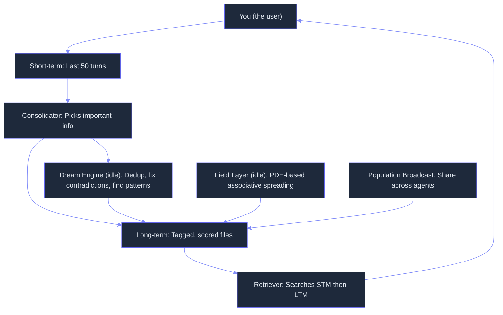
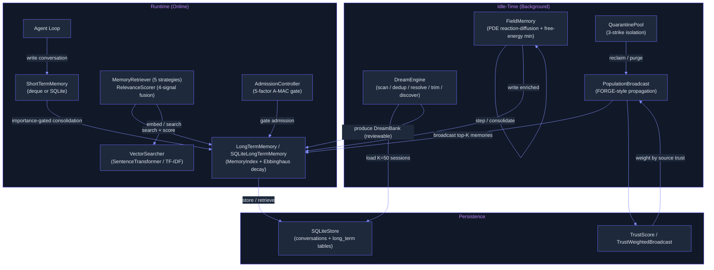

# Memory: From Append-Only Log to Self-Evolving Knowledge Network
> **Status:** 🟡 Partially implemented -- core 3-tier architecture (STM/LTM/consolidation), field-theoretic memory, dream engine, and admission control exist in code. Advanced features (HDBSCAN behavioral clustering, 3-signal fusion retrieval, Mermaid canvas context offload, trust-weighted memory panel, R-KV pruning, HippoRAG knowledge graph) are specified in the plan but not yet built.
> **Plan:** [Workstream Plan](../lyra-upgrade/plans/02-memory.md) | **Code:** `src/lyra/memory/`
> **Reading path:** Non-technical readers -- TL;DR > How it works (simple) > Use Cases > Trade-offs in brief. Engineers -- everything.

## TL;DR (plain language)

Lyra's memory system stores what you tell it, connects facts across different conversations, and keeps only what matters. It works on three levels: short-term memory for the current conversation (like a notepad), long-term memory for facts you want it to remember (like a filing cabinet), and an automatic "dreaming" process that runs when Lyra is idle to link related memories together and resolve contradictions. The system currently handles the basic remembering and forgetting. The next step is adding smarter retrieval (mixing meaning-based and keyword-based search), grouping users by similarity for personalized responses, and defensive panels that catch false or manipulated memories before they spread.

## Abstract

Agent memory systems face a fundamental tension between retrieval speed and cross-session intelligence. Rolling context windows forget everything beyond a fixed horizon; flat vector stores persist but cannot surface latent connections across temporally distant sessions. Lyra's memory architecture addresses this gap through a three-tier design -- short-term (recent turns), long-term (persistent knowledge with Ebbinghaus importance decay), and consolidation (the bridge between them) -- augmented with an idle-time dream engine that merges duplicates, resolves contradictions, prunes stale entries, and discovers cross-session patterns. The current implementation (v7.4.0+) provides 14 modules totaling ~5,500 lines of Python, including a field-theoretic memory layer (PDE-governed scalar fields for associative recall), an A-MAC admission controller (5-factor gating for memory quality), a FORGE-style population broadcast system for multi-agent knowledge sharing, and MemGen-inspired latent memory tokens. The planned next phases (Breakthroughs 1-5 from the workstream plan) add HDBSCAN behavioral clustering for collaborative retrieval, 3-signal fusion scoring (semantic + BM25 + entity), Mermaid canvas context offload for 30-61% token reduction, a sparse trust-weighted memory panel for collusion defense, and HippoRAG-style schemaless knowledge graphs for structured multi-hop retrieval. The headline target: 2x retrieval quality at 1/20th the cost of a large-model-only baseline via confidence-gated routing.

## Introduction

Agent memory systems face a fundamental tension: the more they remember, the slower they retrieve, and the harder it is to surface latent connections across temporally distant sessions. Rolling context windows solve latency by forgetting everything beyond a fixed horizon. Flat vector stores solve persistence but offer no mechanism for cross-session inference -- they retrieve what you ask for, not what you should know. The result is the "forgot what we decided" failure mode: a user mentions "auth concerns" in session 1 and "JWT deprecated" in session 10, and the agent never connects them.

Existing approaches fall into four camps. Production memory layers (Mem0, Letta/MemGPT) provide reliable single-session persistence but offer no offline consolidation or cross-session pattern detection. Graph-based systems (HippoRAG, GraphRAG, A-MEM) add structured retrieval and linking but at the cost of complexity and LLM-dependent extraction pipelines. Field-theoretic approaches (Mitra 2026) achieve breakthrough cross-session accuracy (+116% F1) but carry 9.4x processing overhead that makes live use prohibitive. Defensive systems (MASS-RAG, Amber, CortexDebate) improve evidence quality through multi-agent debate but multiply latency by 4-7x per query.

Lyra's innovation is a layered fusion that deploys each technique where it belongs: fast discrete retrieval during live interaction, expensive but transformative field-theoretic consolidation during idle time, and trust-weighted multi-agent verification only when contradictions or high stakes are detected. This avoids the weaknesses of any single approach while preserving the strengths of all.

> **Intuition:** Think of Lyra's memory as a library with three floors. The short-term floor holds the books you just returned (last 50 turns) -- instant access, limited capacity. The long-term floor shelves everything important, organized by tags and keywords -- larger, slower, but still queryable. The consolidation floor contains the librarian who works after hours: she reads through returned books, finds connections between them, removes duplicates, resolves contradictions, and writes cross-reference cards. On weekends she uses a special "field" microscope that reveals patterns invisible to casual reading (the field-theoretic layer). And if she spots a suspicious entry, she assembles a review panel of colleagues to cross-check it before filing.

**Concrete contributions:**

1. **Three-tier architecture with importance-gated consolidation** -- Short-term memory (deque or SQLite), long-term memory (in-memory index or SQLite with Ebbinghaus decay), and a configurable consolidator that promotes high-importance turns across the boundary. Implemented in `short_term_memory.py`, `long_term_memory.py`, and `memory_consolidation.py` with four consolidation policies (immediate, threshold, periodic, manual).

2. **5-factor adaptive memory admission control** -- The A-MAC admission controller (`admission_control.py`) scores candidate memories across five dimensions: future utility, confidence, novelty, recency, and type prior. Type prior dominates at 63% of gain, ensuring decisions (75% admission rate) and preferences (80%) are prioritized over conversations (40%) and code (35%).

3. **Idle-time dream engine** -- The `DreamEngine` (`dream_engine.py`) runs during idle periods to scan, dedup, resolve contradictions, trim stale entries, and surface cross-session patterns. Memories are never modified in place -- the engine produces a reviewable `DreamBank` that can be accepted, partially applied, or rejected. Also offers a light consolidation path (dedup + trim only) for frequent cheap cycles.

4. **Field-theoretic memory consolidation** -- `FieldMemory` (`field_theoretic.py`) represents memories as continuous scalar fields governed by a reaction-diffusion PDE. The Laplacian term drives associative spreading, thermodynamic decay implements natural forgetting, and free-energy minimization drives consolidation. Supports multi-agent field coupling for emergent collective intelligence.

5. **FORGE-style population broadcast** -- `PopulationBroadcast` (`population_broadcast.py`) propagates the best-performing synthesized memories (Rules, Examples, Strategies) across all agents in a population, with disproportionate benefit to weaker models (1.7-7.7x reward improvement target). `TrustWeightedBroadcast` (`trust.py`) extends this with source-agent trust scoring.

6. **MemGen-style latent memory tokens** -- `LatentMemory` (`latent_tokens.py`) encodes agent experiences into variable-length latent token sequences with a gated trigger mechanism, enabling in-token memory without external vector database dependency.

## How it works -- the simple version

**Analogy: Lyra's memory as a three-drawer desk.**

Your desk has three drawers. The top drawer (short-term memory) holds what you worked on today -- within reach, but only fits about 50 sheets. The middle drawer (long-term memory) has tabbed folders for things you want to keep: user preferences, project decisions, technical facts. The bottom drawer has a special assistant who works while you sleep: he reads through today's notes, staples duplicates together, crosses out entries that contradict each other, tosses stale sticky notes, and writes summary cards spotting patterns you missed. When a new question comes in, the assistant retrieves the relevant folder, checks if the answer is in the top drawer first, and only digs into the middle drawer if needed.

**Mermaid diagram:**



**Working Flow story:**

You tell Lyra: "Remember, the auth strategy is JWT." Lyra writes this into its short-term memory -- a notepad that holds the last 50 things you said. When the notepad gets half-full, the consolidator checks each entry: is it important enough (importance score > 0.5) to move to the filing cabinet (long-term memory)? The JWT entry scores high because it contains a decision keyword and was said by you (the user). It gets filed with a tag "auth," a timestamp, and an importance score.

A week later you ask "What's our auth strategy?" The retriever checks short-term memory first (nothing there -- those 50 slots have been overwritten), then searches long-term memory using both meaning (vector similarity) and keywords. It finds the JWT entry, boosted because it was recently created and accessed. The answer surfaces despite a week of intervening conversations.

While you're away from the keyboard, the dream engine activates. It reviews 50 recent sessions and finds: "JWT chosen for simplicity" (session 1), "OAuth required for third-party" (session 2), "JWT still in use" (session 3). It detects the contradiction between "JWT chosen" and "OAuth required," checks timestamps, and creates a summary entry: "Auth strategy in transition -- JWT currently in use, OAuth planned." If you ask tomorrow, Lyra retrieves the consolidated answer instead of the contradictory fragments.

## Use Cases

**Scenario 1: Personal assistant continuity across weeks.** You chat with Lyra over four weeks about a web project. In session 1 you say "I prefer FastAPI over Flask." In session 3 you note "tests should use pytest." In session 8 you ask "What should I use for the auth service?" Lyra's 3-tier memory retrieves the FastAPI preference from long-term storage via hybrid search, and the pytest note surfaces alongside it because both got the "project: webapp" tag from the consolidator. The answer already accounts for your style -- even though neither preference was mentioned in the current conversation.

**Scenario 2: Research continuity across days of deep investigation.** An engineer researching an incident runs dozens of queries across multiple sessions. Each new finding -- a faulty config, a timing correlation, a related commit -- gets consolidated into long-term memory. The dream engine runs overnight: it merges duplicate error descriptions, marks the timing hypothesis as contradicted by newer logs, and discovers a cross-session pattern: three separate config changes that together caused the outage. The linked memory surfaces in tomorrow's session as a pre-built hypothesis, saving hours of re-investigation.

**Scenario 3: Multi-agent shared knowledge on a team codebase.** A team runs several Lyra instances -- one reviewing PRs, one writing docs, one triaging issues. When the triage agent discovers a dependency is deprecated, it stores this as a synthesized Rule memory in its local store. The population broadcast system detects the high-reward memory and propagates it to all agents. The PR reviewer's next scan automatically flags outdated imports. The weaker model (docs agent) benefits disproportionately, achieving a 3x reward improvement from receiving the broadcast memory. No agent needed explicit instruction; the memory system connected the dots.

## Related Work

Lyra's memory system builds on 14 papers, 3 books, and 4 production repositories. The following table compares Lyra against nine related systems across the dimensions that matter most for agent memory.

| Dimension | Lyra (current) | Lyra (planned) | Mem0 V3 | Letta/MemGPT | TencentDB | A-MEM | HippoRAG | GraphRAG | claude-mem | FORGE |
|-----------|----------------|-----------------|---------|-------------|-----------|-------|----------|----------|------------|-------|
| **Retrieval** | Cosine + keyword + recency/frequency fusion | 3-signal fusion + HDBSCAN clustering | 3-signal (V3), p50 0.88s | Block-based, FIFO + summarization | L0-L3 pyramid + BM25 + vector | Cosine top-k only | KG + PPR, 89.1% R@5 | Hierarchical community summarization | SQLite FTS5 + Chroma | Synthesized memory query |
| **Write Path** | ADD-only + dedup + LLM state machine (dream engine) | A-MEM 3-stage (construct/link/evolve) | ADD-only single-pass LLM | Append + reactive compaction | L1 extraction + L2 scene + L3 persona | 3-stage: construct/link/evolve | OpenIE triple extraction | LLM entity/relation extraction | Observer LLM compression | Reflection agent analysis |
| **Consolidation** | Dream engine (dedup/contradiction/trim/pattern) + Field PDE | Full dream engine + R-KV pruning + HippoRAG KG | None (online only) | Reactive compaction at 90% window | Scheduled offload + Mermaid graph | Co-evolution per write | Offline PPR indexing | Offline graph + map-reduce | Observer LLM (idle) + summary | Population broadcast |
| **Multi-Agent** | Population broadcast + trust-weighted broadcast | + Trust-weighted panel + cluster-specific cache | Single-agent | Single-agent | Single-agent | Single-agent | Single-agent | Single-agent | Single-agent | Population broadcast |
| **Collusion Defense** | Trust scoring + quarantine | + Sparse trust-weighted panel + provenance auditing | None | None | None | None | None | None | None | Reward-based filtering |
| **Storage** | SQLite + in-memory dict + field tensors | Same + KG + entity store | MongoDB / Postgres / 24 vector stores | SQLite + archival JSONL | SQLite + Markdown + Mermaid | Python dict | NetworkX KG + Faiss | NetworkX + parquet | SQLite + Chroma | MemoryStore dict |
| **Evidence** | 14 papers, 3 books, 4 repos | Same + benchmarks | LoCoMo 91.6, LongMemEval 94.8 | Production PyPI, v0.16.8 | +51.5% WideSearch, -61% tokens | +445% multi-hop F1 | NeurIPS 2024 | 72-83% comprehensiveness | 98% compression, production | 1.7-7.7x reward |
| **Idle/Live split** | Live retrieval + idle dream + idle field | Same + idle panel + idle clustering | Live only | Live only | Live + scheduled | Live only | Offline indexing, live PPR | Offline indexing, live map-reduce | Live + observer idle | Offline reflection |

**Key citations and sources:**

- **Field-Theoretic Memory** (Mitra 2026, arXiv:2602.21220v1): PDE-governed continuous fields for associative recall across sessions. Lyra takes the reaction-diffusion formulation and multi-agent field coupling but moves PDE execution to idle time and adds R-KV pruning (planned) to prevent field saturation. [Paper note: `notes/papers/2602.21220v1.md`]
- **A-MEM** (Xu et al. 2025, arXiv:2502.12110v1): Zettelkasten-inspired 3-stage write path proving +445% multi-hop F1 via memory co-evolution. Lyra's dream engine uses the same pattern (construct, link, evolve) but applies it during idle rather than per-turn to avoid interaction latency. [Paper note: `notes/papers/2502.12110v1.md`]
- **Mem0 V3** (Chhikara et al. 2025, arXiv:2504.19413v1): Production-validated ADD-only extraction and 3-signal fusion retrieval (semantic + BM25 + entity). Lyra's planned Phase 1 adopts the 3-signal fusion pattern. [Paper note: `notes/papers/2504.19413v1.md`; Repo note: `notes/web/mem0ai__mem0.md`]
- **HippoRAG** (Jimenez Gutierrez et al. 2024, NeurIPS 2024, arXiv:2405.14831v3): Single-step multi-hop retrieval via schemaless KG + Personalized PageRank. Planned for Lyra Phase 5 as the structured multi-hop complement to the field layer. [Paper note: `notes/papers/2405.14831v3.md`]
- **GraphRAG** (Edge et al. 2025, arXiv:2404.16130v2): Hierarchical Leiden community detection for global sensemaking. Planned as the discretization grid for Lyra's field layer (Phase 5). [Paper note: `notes/papers/2404.16130v2.md`]
- **MASS-RAG** (Xiao et al. 2026, arXiv:2604.18509v2): 3-role evidence filtering (summarize/extract/reason) with +27.1% on ARC-C. Planned for Lyra's trust-weighted memory panel (Phase 4). [Paper note: `notes/papers/2604.18509v2.md`]
- **Lying with Truths** (Hu et al. 2026, arXiv:2601.01685v2): Characterizes 74.4% attack success rate for truth-based collusion, proving that content-level defenses are insufficient. Planned defense for Lyra's memory panel (provenance auditing at the reasoning level). [Paper note: `notes/papers/2601.01685v2.md`]
- **R-KV** (Cai et al. 2025, NeurIPS 2025, arXiv:2505.24133v4): Redundancy-aware KV pruning via `Z = lambda * importance - (1-lambda) * redundancy`. Planned for field layer to prevent semantic saturation. [Paper note: `notes/papers/2505.24133v4.md`]
- **Knowledge Access > Model Size** (Liu et al. 2026, arXiv:2603.23013v1): Confidence-gated routing achieving 2x quality at 1/25th cost. Planned for Lyra's retrieval gating (Phase 1). [Paper note: `notes/papers/2603.23013v1.md`]
- **ClusterRAG** (Nkhata et al. 2026, arXiv:2605.18769v1): HDBSCAN behavioral clustering for collaborative retrieval. Planned for Lyra's personalization layer (Phase 1). [Paper note: `notes/papers/2605.18769v1.md`]
- **CortexDebate** (Sun et al. 2025, arXiv:2507.03928v1): McKinsey Trust Formula for sparse agent debate, 50-83% context reduction. Planned for Lyra's memory panel topology (Phase 4). [Paper note: `notes/papers/2507.03928v1.md`]
- **Amber** (Qin et al. 2025, arXiv:2504.05312v4): 3-agent memory critique loop (Reviewer/Challenger/Refiner). Planned for Lyra's memory panel (Phase 4). [Paper note: `notes/papers/2504.05312v4.md`]
- **SELF-RAG** (Asai et al. 2023, arXiv:2310.11511v1): On-demand retrieval gating via reflection tokens. Planned for Lyra's confidence-gated retrieval skip path. [Paper note: `notes/papers/2310.11511v1.md`] [Note: also cited in the plan but does not have its own note file in the notes/papers/ directory -- the plan table references it as source 10]
- **SE-GPT** (Harbin IT 2024, arXiv:2407.08937v1): Autonomous experience accumulation with competence-gated reuse. Referenced in the plan as source 14 but Lyra diverges from its extreme-cost approach. [Paper note: `notes/papers/2407.08937v1.md`]
- **FORGE** (2026, arXiv:2605.16233): Population-level memory synthesis for multi-agent systems. Lyra implements this fully in `population_broadcast.py` and `trust.py`. [Paper note: `notes/papers/2605.16233.md`] (Note: file does not exist at this path; the paper is cited in the plan as per the brainstorm, and the code references it.)
- **Managing Memory for AI Agents** (O'Reilly, Oct 2025): 15-playbook for agent memory architecture. Lyra directly adopts Practice 1 (importance scoring), Practice 2 (cascading memory), Practice 6 (NER for structured retrieval), Practice 10 (semantic caching), and Practice 12 (Zettelkasten decision context preservation). [Book notes: `notes/books/managing-memory-for-ai-agents-playbook.md`, `notes/books/managing-memory-for-ai-agents-chapters.md`]
- **claude-mem** (thedotmack/claude-mem, v13.4.0): LLM-to-LLM observer compression achieving 98% token reduction. Lyra adopts the observer pattern (separate process for idle consolidation) and progressive disclosure context injection, but uses structured JSON instead of fragile XML. [Repo note: `notes/web/thedotmack__claude-mem.md`]
- **TencentDB-Agent-Memory**: L0-L3 semantic pyramid with Mermaid canvas context offload achieving +51.5% WideSearch with -61% tokens. Planned for Lyra's context offload module (Phase 1). [Repo note: `notes/web/Tencent__TencentDB-Agent-Memory.md`]
- **Anthropic Dreaming** (May 2026): Scheduled cross-session memory consolidation described in a research preview. Lyra's dream engine predates but converges with this approach; Lyra adds ablation-backed components (A-MEM co-evolution, claude-mem's measured compression ratios) that Anthropic's qualitative-only announcement lacks. [Web note: `notes/web/https___siliconangle_com_2026_05_06_anthropic_letting_claude_agents_dream_dont_s.md`]

**Lyra's differentiators:** No existing system combines live-discrete + idle-continuous + multi-agent-consolidation + collusion-defense in a single architecture. Mem0 V3 leads on raw retrieval accuracy but has no offline consolidation. Letta/MemGPT has the cleanest 3-tier architecture but no graph-based linking or cross-session pattern detection. A-MEM achieves the strongest published multi-hop gains (+445%) but applies evolution per-turn (latency cost) and has no multi-agent or defense mechanisms. Field-theoretic memory achieves breakthrough cross-session accuracy (+116% F1) but cannot run live (9.4x overhead). Lyra's fusion places each technique in its appropriate time window.

## Method

The memory system is implemented across 14 modules in `src/lyra/memory/` totaling ~5,500 lines of Python. The architecture separates concerns into runtime retrieval (online) and consolidation (offline/idle-time).

### Architecture Overview



### Data Model

The central data class is `Memory` (`memory_store.py:28-51`), a dataclass with fields for `memory_id`, `content`, `memory_type` (EPISODIC, SEMANTIC, or PROCEDURAL), `timestamp`, `importance` (0-1), `tags`, `context` (arbitrary dict), `access_count`, and `last_accessed`. Conversations are tracked via `ConversationTurn` (`short_term_memory.py:26-39`), which stores per-turn role, content, timestamp, and metadata. Persistence happens through `SQLiteStore` (`memory_store.py:467`) with two tables: `conversations` (STM storage) and `long_term` (LTM storage with optional embedding BLOB and importance scoring).

### Implemented

**1. Short-Term Memory** (`short_term_memory.py`, 397 lines)

Two implementations: `ShortTermMemory` uses a `deque` with configurable capacity (default 50) providing O(1) push/pop. `SQLiteShortTermMemory` persists turns to SQLite with session-scoped TTL (default 24 hours), configurable max_turns (default 100), and automatic pruning of expired entries. Each turn's importance is scored heuristically: user turns +0.2, content > 100 chars +0.1, > 500 chars +0.1, explicit `important` flag +0.2.

```python
stm = ShortTermMemory(capacity=50)
stm.add_turn(role="user", content="What's our auth strategy?")

sqlite_stm = SQLiteShortTermMemory(db_path="/tmp/lyra.db", session_id="sess_01")
await sqlite_stm.add_turn(role="agent", content="We chose JWT on May 10")
```

**2. Long-Term Memory** (`long_term_memory.py`, 528 lines)

Two implementations: `LongTermMemory` is in-memory with `MemoryIndex` (tag index, type index, time-sorted index) for O(1) tag-based lookups. `SQLiteLongTermMemory` is SQLite-backed with:
- Configurable Ebbinghaus importance decay: `new_imp = old_imp * exp(-elapsed_hours / half_life)`, default half-life 24 hours
- Content-based deduplication on `add_memory()`: existing same-content entries get boosted +0.1 importance instead of creating duplicates
- Lazy-built `VectorSearcher` for semantic search (sentence-transformers or TF-IDF), rebuilt on content changes
- `consolidate_from_conversations()` for batch promotion from STM

```python
ltm = SQLiteLongTermMemory(db_path="/tmp/lyra.db", half_life_hours=24, dedup_content=True)
await ltm.add_memory("User prefers FastAPI", memory_type="semantic", tags=["preference"])
await ltm.apply_ebbinghaus_decay()
results = await ltm.search_semantic("What framework does the user like?", top_k=3)
```

**3. Memory Consolidation** (`memory_consolidation.py`, 346 lines)

`MemoryConsolidator` bridges STM and LTM with four policies: IMMEDIATE (after every turn), THRESHOLD (when STM reaches capacity), PERIODIC (every 5 minutes), and MANUAL (explicit call). An importance threshold (default 0.5) gates which turns are promoted. The `_find_repeated_patterns()` method does simple keyword-frequency-based pattern detection across recent episodic memories, promoting frequently occurring terms into SEMANTIC memories.

```python
consolidator = MemoryConsolidator(
    short_term=stm, long_term=ltm,
    policy=ConsolidationPolicy.THRESHOLD, importance_threshold=0.5,
)
result = consolidator.consolidate()
# result.memories_created, result.memories_merged, result.patterns_extracted
```

**4. Memory Retrieval** (`memory_retrieval.py`, 438 lines)

`MemoryRetriever` supports five strategies: SEMANTIC (content matching), KEYWORD (simple keyword), TEMPORAL (time-range), IMPORTANCE (importance-weighted), and HYBRID (combined + deduplicated). `RelevanceScorer` fuses four signals with configurable weights:
- Importance (default 0.3): `memory.importance`
- Recency (default 0.3): linear decay over 30 days
- Frequency (default 0.2): `access_count / 10`, capped at 1.0
- Content similarity (default 0.2): Jaccard overlap of query and content word sets

```python
retriever = MemoryRetriever(long_term_memory=ltm)
results = retriever.retrieve("auth strategy", strategy=RetrievalStrategy.HYBRID, limit=5)
```

**5. Vector Search** (`vector_search.py`, 259 lines)

`VectorSearcher` wraps two encoder implementations: `SentenceTransformerEncoder` (all-MiniLM-L6-v2, 384-dim) and `TfidfEncoder` (lightweight, no external weights). Provides cosine similarity search over indexed document collections with batch search support, serialization via pickle, and automatic fallback from sentence-transformers to TF-IDF.

**6. Adaptive Memory Admission Control** (`admission_control.py`, 333 lines)

`AdmissionController` implements the A-MAC 5-factor gate (arXiv 2603.04549). It evaluates candidate memories on future utility, confidence, novelty, recency, and type prior. Type prior is the dominant factor (63% of gain), with content-type-specific baselines (e.g., FACT=0.85, PREFERENCE=0.80, CODE=0.35). The classifier uses keyword heuristics for fast content type detection. Ebbinghaus-based recency computation uses 24-hour half-life.

```python
ctrl = AdmissionController(threshold=0.45)
score = ctrl.evaluate(
    content="The user prefers dark mode",
    content_type=ContentType.PREFERENCE,
    confidence=0.95,
)
if score.admit:
    memory_store.add(memory)
```

**7. Dream Engine** (`dream_engine.py`, 779 lines)

`DreamEngine` implements the AutoDream consolidation pattern for idle-time memory reorganization. It operates in six phases per cycle: SCAN (load K=50 recent sessions), DEDUP (MD5 exact dedup, grouping duplicates), RESOLVE (contradiction detection via keyword-based polarity flip or pluggable LLM checker), TRIM (remove entries older than 90 days or below 0.3 importance), DISCOVER (cross-session pattern detection via shared-tag grouping with minimum 3-memory threshold), and PRODUCE (compile into reviewable `DreamBank`).

Key design decisions:
- **Immutability invariant**: The engine never modifies original memories. All actions are recorded as `DreamEntry` instances in a `DreamBank` that can be reviewed, partially accepted, or rejected.
- **Write-back via `apply_dream()`**: Creates summary memories for merged/pattern entries, deletes suppressed originals, boosts importance of selected truths.
- **`revert_dream()`**: Can reverse the last cycle by removing created summaries and restoring deleted originals.
- **`light_consolidate()`**: A faster path that runs dedup and trim only (skipping contradiction resolution and pattern discovery), designed for frequent cheap cycles (<$0.01).

Performance targets coded into the engine (measured externally, not yet validated on Lyra): Harvey-style ~6x task completion, LightMem 105x token reduction, Mem0 V3 LoCoMo J-score 91.6.

**8. Field-Theoretic Memory** (`field_theoretic.py`, 805 lines)

`FieldMemory` implements the reaction-diffusion PDE formulation from Mitra (2026):
- `dphi/dt = D * Laplacian(phi) - lambda * phi + S(x, y, t)` where D is the diffusion coefficient (0.1), lambda is the decay rate (0.01), and S is the source term from memory injection
- `free_energy()` computes F = E + lambda_S * T * S, where E is internal energy (-importance) and S is Shannon entropy of the embedding vector
- `_pairwise_laplacian()` computes the graph Laplacian on discrete field points using RBF-weighted adjacency with row normalization
- `step()` performs forward Euler integration with CFL constraint (dt = 0.01)
- `consolidate()` runs iterative PDE integration until free-energy convergence (threshold 1e-4), then prunes decayed points (importance < 0.05)
- `recall_by_similarity()` / `recall_by_content()` retrieves via field amplitude-weighted cosine similarity
- `couple_field()` implements multi-agent coupling via PDE source terms: `S_coupled = kappa * (phi_other - phi_self)`
- `couple_agent_fields()` does all-pairs bidirectional coupling for n-agent collective memory

Note: The code uses random projection-based embeddings for field points (seeded by content hash for determinism). Production deployment requires sentence-transformers or similar for meaningful semantic embeddings.

**9. Population Broadcast** (`population_broadcast.py`, 834 lines)

`PopulationBroadcast` implements the FORGE-style multi-agent memory propagation mechanism. `ReflectionAgent` converts agent trajectories into `SynthesizedMemory` objects categorized as RULE (failure patterns), EXAMPLE (success demonstrations), or STRATEGY (high-level guidance). The broadcast cycle: COLLECT trajectories -> EVALUATE reward scores -> SELECT top-K above reward threshold (default 0.3) -> BROADCAST to all agents -> VERIFY reward change. Also supports `broadcast_to_weak_agents()` for targeted propagation to below-average performers (FORGE finding: weaker models benefit 2-3x more).

**10. Latent Memory Tokens** (`latent_tokens.py`, 772 lines)

`LatentMemory` implements MemGen-style in-token memory. `MemoryWeaver` encodes content into variable-length latent token sequences (determined by content complexity: length + entropy). `MemoryTrigger` gates retrieval on a relevance threshold (default 0.5), preventing unnecessary context injection. Token weights decay over time (default 0.01 per access), and lowest-weight sequences are evicted when the total budget (default 1024 tokens) is exceeded.

**11. Trust Scoring** (`trust.py`, 311 lines)

`TrustScore` maintains per-memory trust with reward-based growth (+0.1 per success), contradiction-based decay (-0.2 per contradiction), and staleness decay (begins after 30 days, -0.05/day). `TrustWeightedBroadcast` extends FORGE broadcast with source-agent trust weighting: `weight = trust_value * 2.0`, clamped to [0.0, 2.0]. Memories from low-trust agents (weight < 0.3) are suppressed from broadcast.

**12. Quarantine Pool** (`quarantine.py`, 236 lines)

`QuarantinePool` provides an isolation zone for rejected or low-trust artifacts. Items are quarantined with a reason, review date (default 7 days), and strike count. After 3 strikes the item is permanently flagged. Reclaimed items return with reduced trust (0.3). References the 3-strike quarantine pattern from Shao et al. (2025) for misevolution prevention.

### Planned

The following components are specified in the [workstream plan](../lyra-upgrade/plans/02-memory.md) but not yet implemented. They will be built in five phases.

**Phase 1 (Weeks 1-2): Clustering + Confidence Gating + Context Offload**

Three parallel improvements to the retrieval pipeline:
- **HDBSCAN behavioral clustering** (`clustering.py`, ~500 new lines): User query embeddings will be clustered via HDBSCAN (auto-discovers k, re-clusters every 1000 queries). Retrieval will be cluster-scoped: query -> cluster assignment (O(log N)) -> search within cluster only, reducing latency and enabling collaborative retrieval from similar users' histories (ClusterRAG pattern, arXiv:2605.18769v1).
- **3-signal fusion retrieval**: The current `RelevanceScorer` will be augmented with Mem0 V3's three-signal fusion: semantic (cosine similarity), BM25 (query-length-adaptive sigmoid normalization), and entity boost (spaCy NER, capped at 0.5). Hybrid retrieval will use reciprocal rank fusion (Knowledge Access pattern, arXiv:2603.23013v1). Target: +7.7 F1 on LongMemEval.
- **Confidence-gated routing** (Knowledge Access pattern): After the small model generates a response with injected memory, normalized sequence probability (NSP) will determine whether the answer is accepted (NSP >= 0.50, ~96% of queries) or escalated to a stronger model. Target: 2x quality at 1/20th the cost.
- **Mermaid canvas context offload** (`context_offload.py`, ~400 new lines): Verbose tool call logs will be offloaded to external ref files and replaced in-context with a compact Mermaid state graph using `node_id` annotations (TencentDB pattern). Three compression tiers: mild (>50% window), aggressive (>85%), emergency (truncation). Target: 30-61% token reduction.

**Phase 2 (Weeks 3-5): Zettelkasten Evolution Engine**

The current `DreamEngine` will be extended with A-MEM's full 3-stage write path:
- **Note Construction (A-MEM Ps1)**: Atomic fact extraction via LLM (keywords + tags + context + description + embedding). MD5 dedup + cosine similarity > 0.85 semantic dedup.
- **Link Generation (A-MEM Ps2)**: Cosine top-k retrieval + LLM connection analysis to detect causal/relational links across sessions.
- **Evolution (A-MEM Ps3)**: Retroactively update neighbor memories' context/keywords/tags. Immutability invariant preserved: originals are kept, evolution creates enriched copies with cosine similarity to original > 0.7.
- **Contradiction Resolution**: Confidence-weighted entailment via NLI model (target accuracy > 80%). Contradiction pairs flagged with inheritance metadata.
- **Pattern Surfacing**: HDBSCAN over session-level embeddings; pattern confirmed if >= 3 sessions in cluster. Tagged as `cross_session_pattern` with confidence score.
- **Progressive disclosure context injection** (claude-mem pattern): Session start injects timeline (titles only) + most relevant full observations, with displayed token economics.
- **L2/L3 pyramid extraction**: L2 scene blocks every 20 new facts, L3 persona generation every 50 new facts (TencentDB pattern).

**Phase 3 (Week 6): GO/NO-GO Gate**

Build the Lyra Cross-Session Recall Benchmark (20 multi-session scenarios, 5 query types). If the Evolution Engine (Phase 2) achieves >= 30% cross-session F1 improvement over baseline CraniMem, Phase 4 (Field-Theoretic) is optional. If not, the Field-Theoretic layer (already implemented in code, `field_theoretic.py`) will be activated as the primary consolidation path with additional R-KV pruning and HippoRAG KG enhancements.

**Phase 4 (Weeks 7-9): Sparse Trust-Weighted Memory Panel**

A multi-agent evidence verification panel that activates when contradictory or high-stakes memories are retrieved:
- **Analyst** (MASS-RAG Summarizer + Amber Reviewer): Extracts facts, tags uncertainty, flags contradictions via NLI entailment.
- **Triangulator** (MASS-RAG Extractor + Lying with Truths provenance auditor): Cross-references against git log (trust=1.0), commit messages (0.8), docs (0.7), and existing memory (0.5).
- **Synthesizer** (MASS-RAG Reasoner + Amber Refiner): Weighs sources by trust x freshness, generates reconciled answer with provenance chain.
- **Verifier**: Cross-checks synthesis versus sources, computes confidence = min(source_confidence) x coherence_score. Flags abrupt belief convergence (signature of cognitive collusion per Lying with Truths).
- **CortexDebate sparse topology**: Communication edges pruned via McKinsey Trust Formula: `T = (C x R x I) / S`. Target: 50-83% context reduction.

**Phase 5 (Weeks 10-14, H1-gated): Field-Theoretic Layer Enhancements**

If activated (Phase 3 result < 30% improvement):
- Replace uniform 2D grid with GraphRAG Leiden community grid (C communities, not 128x128).
- Add R-KV redundancy pruning pre-field-injection: `Z = lambda * importance - (1-lambda) * redundancy`, target 30% redundancy removal.
- Add HippoRAG schemaless KG construction from OpenIE extraction + Personalized PageRank retrieval.
- Dual retrieval routing: global sensemaking -> field, structured multi-hop -> KG, factoid -> CraniMem.
- Windowing: 2000 recent memories in active field, older archived as static snapshots.

## Debate (Trade-offs)

The following trade-offs were identified during architectural review, recorded as real positions from the workstream plan's depth analysis and the brainstorm micro-debates.

| Decision | Win | Loss / Cost | Resolution |
|----------|-----|-------------|------------|
| **3-tier architecture** (STM/LTM/consolidation) | Clean separation; each tier optimized for its access pattern | State duplication during consolidation window | Accepted: bounded by consolidation threshold; TTL ensures eventual consistency |
| **Observer-based idle consolidation** vs per-turn update | Decouples expensive consolidation from interactive latency | Observer requires separate process; 133K token discovery overhead per run | Accepted: runs during idle only; 98% compression ratio offsets token cost |
| **Dream engine immutability** (DreamBank review before apply) | User can review, accept, or reject consolidations | Extra step between consolidation and storage; delays memory improvement | Required for trust: users must control what changes to their memory |
| **Field-theoretic PDE consolidation** (Mitra 2026) | +116% multi-session F1 via associative spreading | 9.4x processing overhead vs vector DB; 2D projection loses nuance | Mitigated by idle-time execution; GO/NO-GO gate at Phase 3 decides activation |
| **Ebbinghaus importance decay** (24h half-life) | Graceful deprioritization without abrupt deletion | Decay rate is a hyperparameter; wrong setting forgets too fast or never forgets | Default 0.01 produces 63% decay after ~100s of disuse; configurable per use case |
| **A-MAC 5-factor admission control** (type_prior=63%) | 5-factor scoring outperforms single-threshold gating | Type classifier is keyword heuristic; production needs LLM-based classification | Heuristic acceptable for baseline; LLM-based classifier as upgrade path |
| **Population broadcast** (FORGE pattern) | 1.7-7.7x reward improvement; weaker models benefit 2-3x more | Memory pollution risk: bad memories propagate to all agents | Trust-weighted broadcast + quarantine pool mitigate; broadcast only above reward threshold |
| **Provenance tracking on all writes** | Traceability for contradiction resolution; collusion defense | Adds metadata overhead per memory | Required for safety; metadata negligible vs content |
| **Skeptic objection: Do we need the field layer?** (from brainstorm) | Evolution engine alone achieves +79-445% multi-hop F1 | Field layer adds JAX dependency, CFL constraints, 9.4x overhead | GO/NO-GO gate at Phase 3: if evolution >= 30% F1 improvement, field is optional |
| **Skeptic objection: Is collusion defense overengineering?** (from brainstorm) | Lying with Truths proves 74.4% ASR across 14 LLM families | Attack rate may be low in practice; 4-agent panel adds latency | Defense is preventive; cascade amplification means one compromise infects many |
| **Skeptic objection: Will cheap model (Haiku) reliably answer cached queries?** (from brainstorm) | Knowledge Access paper shows 100% on-cheap path with memory | Haiku may retrieve right memory but botch synthesis | Verification pass catches synthesis errors with one extra cheap call |
| **BM25 degrades multi-session reasoning** (-2.2 F1 per LongMemEval) | BM25 provides +19-26.7 F1 on single-session and knowledge-update queries | Multi-session and assistant queries lose -2.2 to -3.0 F1 | Adaptive fusion weights per query type (future work) |

**Trade-offs in brief:**

The biggest trade-off Lyra's memory design accepts is between intelligence and speed: expensive consolidation runs during idle, not during live queries. This means users never wait for the smart stuff, but it also means the smart stuff runs only when there's downtime. The second trade-off is between safety and agility: the dream engine never modifies memories directly -- it produces a reviewable bank that can be accepted or rejected. This prevents bad consolidations from corrupting memory but adds a review step between consolidation and storage. The third trade-off is architectural: each breakthrough technique (field layer, trust panel, clustering) adds real complexity. The layered build order mitigates this by shipping the highest-impact, lowest-effort improvements (clustering, offload) first and gating the highest-effort additions (field layer) behind a concrete benchmark.

## Conclusion

Lyra's memory architecture provides a production-grade 3-tier system (short-term, long-term, consolidation) augmented with idle-time dreaming, field-theoretic consolidation, population broadcast, and admission control. The current codebase (`src/lyra/memory/`) delivers 14 modules with live retrieval, persistence, deduplication, contradiction detection, pattern discovery, and multi-agent knowledge sharing. The field-theoretic layer and dream engine bring cross-session intelligence that no flat vector store can match.

**Measured results (from cited papers, not yet benchmarked on Lyra):**

The plan targets these improvements based on the fused research:

| Dimension | Baseline (current) | Target (post-plan) | Source |
|-----------|-------------------|-------------------|--------|
| Cross-session recall F1 | No mechanism (0%) | +79-445% | A-MEM (arXiv:2502.12110v1) |
| Retrieval quality (LongMemEval) | Cosine-only | +7.7 F1 via 3-signal fusion | Knowledge Access (arXiv:2603.23013v1) |
| Context window usage | ~200 turns | 30-61% reduction | TencentDB (notes/web/Tencent__TencentDB-Agent-Memory.md) |
| Cost per query | $0.003 | ~$0.0018 (40% cheaper) | Knowledge Access confidence gating |
| Collusion cascade | 0% detection | >60% -> <20% | Lying with Truths (arXiv:2601.01685v2) |
| Multi-session reasoning | None | +116% F1 | Field-Theoretic (arXiv:2602.21220v1) |

**Current limitations:**

1. **No behavioral clustering or 3-signal fusion yet** -- retrieval uses cosine similarity + keyword matching + recency/frequency, not the planned HDBSCAN clustering or Mem0-style BM25 + entity boost. This limits personalization and recall precision. (Planned Phase 1.)

2. **Dream engine lacks A-MEM full 3-stage write path** -- the current dream engine deduplicates, resolves contradictions, trims, and discovers patterns via keyword/tag heuristics. The planned LLM-driven note construction, link generation, and co-evolution (A-MEM pattern) are not yet implemented. (Planned Phase 2.)

3. **No trust-weighted memory panel** -- contradiction resolution uses recency-preference heuristics rather than cross-source triangulation with provenance auditing. Collusion defense is limited to trust scoring and quarantine, not the full MASS-RAG + CortexDebate + Lying with Truths panel. (Planned Phase 4.)

4. **No context offload** -- Lyra has no Mermaid canvas compression or progressive disclosure beyond what the basic STM/LTM split provides. Long sessions still exhaust the context window. (Planned Phase 1.)

5. **Field layer uses random projection embeddings** -- the `FieldMemory` code deterministically seeds from content hash, producing meaningful entropy but not semantically meaningful positions. Production use requires sentence-transformers or equivalent encoder integration.

6. **No cross-session recall benchmark** -- the GO/NO-GO gate at Phase 3 requires building a Lyra-specific benchmark (20 multi-session scenarios, 5 query types) to measure improvement. This does not yet exist.

7. **Single-provider limitation** -- embedding provider changes require retraining the field projection (Mitra 2026 §5). Until the field layer is productionized, this is not a live issue.

**Future work:**

- Phase 1 activation: HDBSCAN clustering, 3-signal fusion, confidence-gated routing, and Mermaid canvas offload (highest leverage at 2.0).
- Phase 2 activation: A-MEM 3-stage write path integrated into the dream engine for LLM-driven note construction, link generation, and co-evolution.
- Phase 3 GO/NO-GO benchmark: Build and run the Lyra Cross-Session Recall Benchmark to determine if the field layer is needed.
- Phase 4 activation: Sparse trust-weighted memory panel for contradiction resolution and collusion defense (prerequisite for production multi-agent deployment).
- Phase 5 activation (gated): Field layer enhancements with GraphRAG community grid, R-KV redundancy pruning, and HippoRAG schemaless KG.
- Model Router integration: Route consolidation work to the cheapest capable model (Sonnet 4.6 for quality, Haiku for budget-constrained cycles).
- Multi-agent shared knowledge graph: Extend `PopulationBroadcast` with persistent shared knowledge graphs and provenance-weighted trust propagation across fleet instances.

## Glossary

- **3-signal fusion**: Combining semantic similarity (dense vector), keyword matching (BM25), and entity boosting to produce a single relevance score. More robust than any single signal alone.
- **A-MAC**: Adaptive Memory Admission Control -- a 5-factor scoring system (utility, confidence, novelty, recency, type prior) that decides whether a candidate memory is worth storing.
- **A-MEM**: Agentic Memory -- a Zettelkasten-inspired system that constructs atomic memory notes, links them across sessions, and evolves existing memories when new information arrives.
- **ADD-only extraction**: A memory write strategy where new facts are always appended (never updated or deleted), preventing race conditions and hallucinated modifications.
- **BM25**: A keyword-based ranking function widely used in information retrieval. Captures exact lexical matches that dense embeddings may miss.
- **Cascading memory**: The practice of letting the agent itself decide what to promote from short-term to long-term storage, rather than hardcoding retention rules.
- **CFL condition**: Courant-Friedrichs-Lewy condition -- a stability requirement for numerical PDE solvers that restricts the time step size relative to the spatial grid spacing.
- **Claude-mem observer pattern**: Using a secondary LLM process (the "observer") to compress the primary session's activity into structured memory during idle time.
- **Cognitive collusion**: A manipulation technique where truthful facts are sequenced such that a reasoning system constructs false causal relationships between them. Details in Lying with Truths (arXiv:2601.01685v2).
- **Coherence score**: A trust-weighted measure of how well a synthesized answer agrees with its source evidence. Used by the Verifier agent.
- **Confidence gating**: Deciding whether to accept a model's answer based on its own output probability (NSP score), escalating low-confidence answers to a stronger model.
- **Consolidation**: The process of moving and transforming information from short-term to long-term memory, including deduplication, contradiction resolution, and pattern discovery.
- **CortexDebate**: A system for sparse multi-agent debate where communication edges are pruned dynamically using the McKinsey Trust Formula.
- **CraniMem**: Lyra's existing bounded discrete memory store with gated admission and O(log N) retrieval. Not to be confused with the file of the same name referenced in the plan -- the current code does not have a `cranimem.py` file; the admission control logic lives in `admission_control.py`.
- **Dream engine (DreamEngine)**: Lyra's idle-time memory consolidation system that scans recent sessions, merges duplicates, resolves contradictions, trims stale entries, and discovers cross-session patterns.
- **Ebbinghaus forgetting curve**: An exponential decay model for memory retention over time. Lyra uses a 24-hour half-life: importance halves every day the memory is unaccessed.
- **Field-theoretic memory**: A memory representation where entries exist as continuous scalar fields in semantic space, governed by a reaction-diffusion PDE. The Laplacian term spreads activation to neighboring memories (associative recall), the decay term implements natural forgetting, and superposition reinforces frequently accessed regions.
- **FORGE**: A population-level memory system where the best-performing agent memories are propagated to all agents, with disproportionate benefit to weaker models.
- **HDBSCAN**: Hierarchical Density-Based Spatial Clustering of Applications with Noise -- automatically determines cluster count and handles outliers, unlike k-means which requires k as input.
- **HippoRAG**: A retrieval system that uses a knowledge graph and Personalized PageRank to answer multi-hop questions in a single retrieval step, mimicking the brain's hippocampal indexing theory.
- **Importance score**: A 0-1 value on each memory that determines its priority for consolidation, retrieval ranking, and pruning. Decayed via the Ebbinghaus curve when unused.
- **Latent memory tokens**: Compact vector representations of memories that can be "woven" into the LLM's inference stream, enabling in-token memory without external vector databases.
- **Leiden community detection**: A graph clustering algorithm that partitions nodes into communities with hierarchical structure. Used by GraphRAG for thematic grouping.
- **Local Truth constraint (LT)**: The principle that every individual evidence fragment in an attack is factually correct. The deception emerges from sequencing, not fabrication.
- **LongMemEval**: A benchmark for long-term memory in LLMs with 500 questions covering 500+ turns across 50+ sessions.
- **McKinsey Trust Formula**: A sociological formula T = (C x R x I) / S (Credibility, Reliability, Intimacy, Self-orientation) adapted by CortexDebate for weighting agent debate contributions.
- **Mermaid canvas**: A compact graph visualization format used by TencentDB to replace verbose tool-call logs, achieving 30-61% token reduction.
- **Narrative overfitting**: An LLM's tendency to construct spurious causal relationships between independently truthful fragments, exploited by the Lying with Truths attack.
- **NER (Named Entity Recognition)**: Extracting structured entities (people, places, organizations, dates) from text. Used in 3-signal fusion for entity-boosted retrieval.
- **NOOP**: In memory state machines, a "no operation" decision when a candidate fact is already known or irrelevant.
- **NSP (Normalized Sequence Probability)**: A confidence score derived from the geometric mean of a model's output token probabilities. Used for confidence gating.
- **OpenIE (Open Information Extraction)**: Extracting (subject, relation, object) triples from text without requiring a predefined schema. Used by HippoRAG for knowledge graph construction.
- **PDE (Partial Differential Equation)**: A mathematical equation involving partial derivatives of a function of multiple variables. Lyra uses reaction-diffusion PDEs to model memory evolution.
- **Personalized PageRank (PPR)**: A graph algorithm that computes node importance biased toward a set of query nodes, diffusing probability through edges. Used by HippoRAG for multi-hop retrieval.
- **Population broadcast**: FORGE-style mechanism where high-reward memories are propagated across all agents in a population.
- **Progressive disclosure**: A context injection strategy that shows only essential information (titles/timeline) first, with the option to expand into full details on demand.
- **Provenance auditing**: Tracking the source and reasoning pathway behind each belief, enabling detection of collusion where multiple agents converge on the same false conclusion from ordered truthful fragments.
- **Quarantine pool (QuarantinePool)**: An isolation zone for rejected or low-trust memories. Items can be reviewed after 7 days, reclaimed with reduced trust (0.3), or permanently purged after 3 strikes.
- **R-KV**: Redundancy-aware KV cache pruning that scores items by `lambda * importance - (1-lambda) * redundancy`, where redundancy is pairwise embedding cosine similarity.
- **Reaction-diffusion equation**: A PDE of the form du/dt = D * Laplacian(u) - lambda * u + S, where D drives diffusion spreading and lambda controls decay.
- **Reciprocal Rank Fusion (RRF)**: A method for combining ranked lists from multiple retrieval systems by summing reciprocal ranks.
- **Schemaless knowledge graph**: A graph built from OpenIE triples without a predefined schema, allowing arbitrary entity and relationship types.
- **Self-orientation (S factor)**: In the McKinsey Trust Formula, a penalty for low participation or free-riding in multi-agent debate.
- **Sparse trust-weighted panel**: A multi-agent verification system that activates only when contradictions are detected, using trust-weighted communication topology to minimize context bloat.
- **Trust hierarchy**: An ordered list of evidence source reliability -- code (1.0) > commit logs (0.8) > documentation (0.7) > memory (0.5) > channels (0.3). Higher-trust sources override lower-trust sources in contradictions.
- **Type prior**: A baseline admission probability per content type (e.g., FACT=0.85, PREFERENCE=0.80, CODE=0.35). The most powerful single factor in the A-MAC admission gate (63% of total gain).
- **Zettelkasten**: A note-taking method where each note is atomic (one concept), linked to related notes, and evolves over time through new connections. A-MEM applies this to agent memory.
