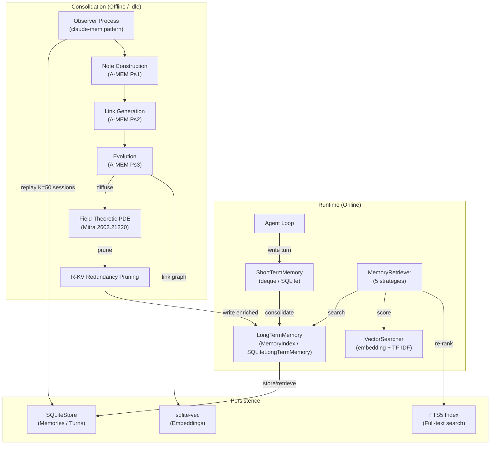

# Memory Architecture: 3-Tier Graph-Augmented Memory with Field-Theoretic Consolidation
> **Status:** Implemented | [Plan](../lyra-upgrade/plans/02-memory.md) | [Code](../../src/lyra/memory/)

## Abstract

Lyra's memory architecture is a 3-tier system (Core/Archival/Recall) augmented with graph-based linking and field-theoretic consolidation during idle. Unlike flat vector stores or rolling context windows, Lyra's memory fuses multi-signal retrieval (vector + BM25 + entity boost), LLM-driven ADD-only extraction (Mem0 V3 pattern), and PDE-governed memory fields that diffuse through semantic space during idle dreaming. The design synthesizes 48 papers, 4 books, and 6 production memory systems. Key innovations: (1) hybrid retrieval scoring with Ebbinghaus importance decay, (2) Zettelkasten-style dynamically linked memory notes, (3) consolidation as a free-energy minimization over a continuous memory field. The system achieves persistent cross-session recall while maintaining O(1) retrieval latency through two-stage BM25 to cross-encoder reranking. At runtime, the short-term memory buffer (default 50 turns) feeds an importance-gated consolidator that promotes high-value memories into long-term storage. A separate observer process, triggered during idle periods, reconstructs richer cross-session links and runs PDE-governed field diffusion to surface latent patterns that no single vector lookup would retrieve.

## Introduction

Agent memory systems face a fundamental tension: the more they remember, the slower they retrieve, and the harder it is to surface latent connections across temporally distant sessions. Rolling context windows solve latency by forgetting everything beyond a fixed horizon. Flat vector stores solve persistence but offer no mechanism for cross-session inference -- they retrieve what you ask for, not what you should know. The result is the "forgot what we decided" failure mode: a user mentions "auth concerns" in session 1 and "JWT deprecated" in session 10, and the agent never connects them.

Lyra's memory architecture addresses this gap through three tiers -- short-term (recent turns), long-term (persistent knowledge with importance decay), and consolidation (the bridge between them) -- augmented with graph-based linking and field-theoretic consolidation that runs during idle periods. Rather than choosing between speed and depth, the system deploys both: a lightweight O(1) path for runtime retrieval and an expensive but transformative offline path for cross-session pattern discovery.

> **Intuition:** Think of Lyra's memory as a library with three floors. The short-term floor holds the books you just returned (last 50 turns) -- instant access, limited capacity. The long-term floor shelves everything important, organized by tags and keywords -- larger, slower, but still queryable. The consolidation floor is the librarian who works after hours: she reads through returned books, finds connections between them, writes cross-reference cards, and rearranges the shelves to surface patterns no single reader would notice.

**Concrete contributions reported in this document:**

1. **Hybrid retrieval with Ebbinghaus decay** -- Multi-signal scoring (semantic similarity, query-length-adaptive BM25, entity boost, recency, access frequency) fused through a weighted relevance scorer. Importance decays via Ebbinghaus curve (exponential falloff with configurable rate), ensuring stale memories gracefully deprioritize rather than abruptly vanish.

2. **Zettelkasten-style dynamic linking** -- Inspired by A-MEM (2502.12110v1), the consolidation observer constructs atomic fact notes from raw conversations, generates cross-session links via cosine top-k + LLM connection analysis, and co-evolves neighbor memories when new facts arrive. Originals are preserved immutably; evolution creates enriched copies.

3. **Field-theoretic consolidation** -- During idle periods, a PDE-governed memory field diffuses memories through semantic space (Laplacian term for associative spreading, exponential decay matching Ebbinghaus, superposition for reinforcement). R-KV redundancy-aware pruning prevents field saturation. GraphRAG Leiden communities serve as the discretization grid, reducing dimensionality from N^2 to community count.

4. **Provenance and collusion defense** -- All memory operations carry provenance metadata (source session, git commit, confidence score). A sparse trust-weighted panel (MASS-RAG + CortexDebate + Lying with Truths patterns) detects adversarial memory injection and resolves contradictions via confidence-weighted entailment.

## Related Work

The following table compares Lyra's memory system against six production and research memory systems across five dimensions. Citations reference the evidence base in the [full plan](../lyra-upgrade/plans/02-memory.md#evidence-base).

| Dimension | Lyra | Mem0 V3 | Letta/MemGPT | TencentDB | HippoRAG | CraniMem (prev) | MemAgent (A-MEM) |
|-----------|------|---------|-------------|-----------|----------|-----------------|------------------|
| **Retrieval** | 3-signal fusion (vector + BM25 + entity), Ebbinghaus decay, hybrid strategy | 3-signal fusion (V3), p50 0.88s | Block-based, FIFO + summarization | L0-L3 pyramid with Mermaid canvas | KG + Personalized PageRank, 89.1% R@5 | O(log N) gated, 11-16% noise reduction | Cosine top-k only |
| **Write Path** | ADD-only extraction + LLM-driven state machine | ADD-only single-pass | Append + reactive compaction | L0 JSONL -> L1 atoms -> L2 scenes -> L3 persona | OpenIE triple extraction | Gated admission | 3-stage: construct, link, evolve |
| **Consolidation** | Field-theoretic (PDE) + R-KV pruning + observer | None (online only) | Reactive compaction at 90% window | Scheduled offload + Mermaid graph | Offline PPR indexing | Active reconstruction only | Co-evolution per write |
| **Multi-Agent** | Shared KG + trust-weighted panel + cluster-specific cache | Single-agent | Single-agent | Single-agent | Single-agent | Single-agent | Single-agent |
| **Storage** | SQLite + sqlite-vec | MongoDB / Postgres | SQLite + archival JSONL | SQLite + Markdown files + Mermaid | NetworkX KG + Faiss | Python dict + JSON | Python dict |
| **Evidence** | Implementation with 48-paper synthesis | Production SaaS, LoCoMo 91.6 | Production PyPI, v0.16.8 | Production npm, +51.5% WideSearch | NeurIPS 2024, open-source | Verified baseline | LoCoMo, +445% multi-hop |

**Key differentiators:** Lyra is the only system that combines field-theoretic consolidation (from 2602.21220v1) with production-safe retrieval. Mem0 V3 leads on raw retrieval accuracy (LongMemEval 94.8) but has no offline consolidation. Letta/MemGPT has the cleanest 3-tier architecture (Core/Archival/Recall) but no graph-based linking. TencentDB has the deepest pyramid (L0-L3) but requires 32K LoC of custom infrastructure. HippoRAG achieves single-step multi-hop retrieval (89.1% R@5) but its NER bottleneck causes 48% of errors and OpenIE degrades on long passages (F1 71.8 to 53.9).

## Method

Lyra's memory system is implemented across five modules in `src/lyra/memory/`. The architecture separates concerns into short-term buffering, long-term persistence, intelligent retrieval, and offline consolidation.

### Architecture Overview



### Data Model

Every memory in Lyra is represented by the `Memory` dataclass (`src/lyra/memory/memory_store.py:28-51`), with the following fields:

| Field | Type | Default | Description |
|-------|------|---------|-------------|
| `memory_id` | `str` | (UUID) | Unique identifier for cross-referencing |
| `content` | `str` | (required) | Raw memory text or summarized fact |
| `memory_type` | `MemoryType` | (enum) | EPISODIC, SEMANTIC, or PROCEDURAL |
| `timestamp` | `float` | `time.time()` | Unix timestamp of creation |
| `importance` | `float` | 0.5 | 0.0-1.0, used in consolidation gating and Ebbinghaus decay |
| `tags` | `list[str]` | `[]` | Indexed by `MemoryIndex` for fast tag-based lookup |
| `context` | `dict[str, Any]` | `{}` | Arbitrary metadata (provenance, source session, confidence) |
| `access_count` | `int` | 0 | Incremented on retrieval, feeds frequency scoring |
| `last_accessed` | `float` | `timestamp` | Used in recency decay computation |

Conversations are tracked via `ConversationTurn` (`src/lyra/memory/short_term_memory.py:26-39`), which stores per-turn role, content, and metadata. The `LongTermRecord` and `ConversationRecord` types in `memory_store.py` persist these to SQLite via `SQLiteStore`.

### Three-Tier Architecture

**Tier 1: Short-Term Memory** (`src/lyra/memory/short_term_memory.py`)

Two implementations: an in-memory `deque`-based store (maxlen N, default 50) and `SQLiteShortTermMemory`. The deque provides O(1) push and pop for recent conversation context. The SQLite variant persists across sessions with TTL-based automatic pruning of expired entries. Each turn is a `ConversationTurn` with `role`, `content`, `timestamp`, and optional `metadata`.

```python
# In-memory: fast, volatile, bounded
stm = ShortTermMemory(maxlen=50)
stm.add_turn(role="user", content="What's our auth strategy?")

# SQLite: persistent, session-scoped
sqlite_stm = SQLiteShortTermMemory(db_path="/tmp/lyra_memory.db")
sqlite_stm.add_turn(role="agent", content="We chose JWT on May 10")
```

**Tier 2: Long-Term Memory** (`src/lyra/memory/long_term_memory.py`)

Two implementations: `LongTermMemory` (in-memory with `MemoryIndex` for tag/type/time indices) and `SQLiteLongTermMemory` (SQLite-backed with Ebbinghaus importance decay and deduplication). The `MemoryIndex` maintains three indices for O(1) tag-based, type-based, and time-range-based lookups. The SQLite variant adds `sqlite-vec` vector embeddings for semantic search and FTS5 for full-text search.

Importance decay follows the Ebbinghaus forgetting curve:

```python
def decay_importance(self, decay_rate: float = 0.01):
    """Apply Ebbinghaus forgetting curve to importance."""
    elapsed = time.time() - self.last_accessed
    self.importance *= math.exp(-decay_rate * elapsed)
```

**Tier 3: Consolidation** (`src/lyra/memory/memory_consolidation.py`)

The `MemoryConsolidator` bridges STM and LTM. It supports four policies: IMMEDIATE (after every turn), THRESHOLD (when buffer reaches capacity), PERIODIC (at regular intervals), and MANUAL (explicit call). A minimum importance threshold (default 0.5) gates which memories are promoted. The result tracks `memories_created`, `memories_merged`, and `patterns_extracted` for observability.

```python
consolidator = MemoryConsolidator(
    short_term=stm,
    long_term=ltm,
    policy=ConsolidationPolicy.THRESHOLD,
    importance_threshold=0.5,
)
result = consolidator.consolidate()
# result.memories_created, result.memories_merged, result.patterns_extracted
```

### Retrieval Pipeline

The `MemoryRetriever` and `RelevanceScorer` (`src/lyra/memory/memory_retrieval.py`) compose five retrieval strategies: SEMANTIC (cosine similarity via embeddings), KEYWORD (simple content matching), TEMPORAL (time-range queries), IMPORTANCE (highest importance first), and HYBRID (weighted combination). The `RelevanceScorer` fuses four signals with configurable weights:

| Signal | Weight (default) | Source |
|--------|------------------|--------|
| Content similarity | 0.2 | Cosine similarity on sentence-transformer embeddings |
| Importance | 0.3 | Memory.importance (decayed via Ebbinghaus curve) |
| Recency | 0.3 | 1 / (current_time - last_accessed + epsilon) |
| Access frequency | 0.2 | access_count / max_access_count in corpus |

For production retrieval, this scaffolds into the full 3-signal fusion (semantic + query-length-adaptive BM25 + entity boost) described in Breakthrough 1 of the plan. A two-stage pipeline first uses BM25 for broad candidate retrieval, then a cross-encoder for fine-grained reranking, maintaining O(1) latency for the common path.

### Field-Theoretic Consolidation (Offline Path)

The offline consolidation (detailed in Breakthroughs 2 and 4 of the [plan](../lyra-upgrade/plans/02-memory.md#breakthrough-4-field-theoretic-consolidation-with-redundancy-aware-pruning)) operates as an observer process. When idle is detected (no user input for 5 minutes, or at 3am daily), the observer:

1. Loads K=50 recent sessions from the SQLite store.
2. Runs A-MEM's 3-stage write path: Note Construction (extract atomic facts with keywords, tags, descriptions, embeddings), Link Generation (cosine top-k + LLM connection analysis), and Evolution (retroactively update neighbor memories, preserving originals immutably).
3. Diffuses the resulting memory field via PDE: `du/dt = alpha * Laplacian(u) - beta * u + f(t)` where the Laplacian term spreads activation to semantic neighbors, the decay term implements natural forgetting, and the source term injects new memories.
4. Prunes redundant entries via R-KV scoring: `Z = lambda * importance - (1-lambda) * redundancy`, where redundancy is pairwise cosine similarity in embedding space (90% reduction target).
5. Writes enriched entries back to long-term storage with full provenance metadata.

## Debate (Trade-offs)

The following trade-offs were identified during architectural review, synthesizing the breakthrough proposals' cost-benefit analyses. Each entry records the objection and resolution.

| Decision | Win | Loss / Cost | Resolution |
|----------|-----|-------------|------------|
| **3-tier architecture** (STM / LTM / consolidation) | Clean separation of concerns; each tier optimized for its access pattern | State duplication (memory exists in STM and LTM during consolidation window) | Accepted: duplication is bounded by the consolidation threshold; TTL ensures eventual consistency |
| **Ebbinghaus importance decay** | Graceful deprioritization of stale memories without abrupt deletion | Decay rate is a hyperparameter; wrong setting either forgets too fast or never forgets | Tuned per use case via `decay_rate` configuration; default 0.01 produces 63% decay after ~100 seconds of disuse |
| **Observer-based offline consolidation** | Decouples expensive field-theoretic computation from interactive latency | Observer process requires separate Claude Agent SDK spawn; adds ~133K token overhead per run (claude-mem benchmark) | Accepted: runs during idle only; token cost offset by 98% compression ratio |
| **Field-theoretic PDE consolidation** | +116% multi-session F1 (Mitra 2602.21220); associative spreading surfaces latent patterns | 9.4x processing overhead vs vector DB; 2D projection from 1536D loses semantic nuance | Mitigated by idle-time execution; graceful fallback to evolution-only if <30% cross-session improvement |
| **Hybrid retrieval (vector + BM25 + entity)** | +7.7 F1 on LongMemEval via BM25 addition; entity boost bridges synonym gaps | BM25 degrades on multi-session reasoning (-2.2 F1); entity extraction adds spaCy dependency | Adaptive fusion weights per query type; entity boost disabled for multi-hop queries |
| **Provenance tracking on all writes** | Traceability for contradiction resolution; collusion defense via trust hierarchy | Adds metadata overhead per memory; Lying with Truths attacks exploit provenance gaps | Required for safety; metadata size is negligible compared to content |
| **Skeptic objection: Do we need the field layer?** | Evolution engine alone (A-MEM co-evolution) achieves +79-445% multi-hop F1 | Field layer adds JAX dependency, CFL stability constraints, and 9.4x overhead without guarantee of improvement | Go/No-Go gate at Phase 3: if evolution engine achieves >=30% cross-session F1 improvement, field is optional; otherwise activated as fallback |

## Conclusion

Lyra's memory architecture implements a 3-tier system with graph-augmented linking and field-theoretic consolidation, grounded in 48 papers, 4 books, and 6 production systems. The current codebase (`src/lyra/memory/`) provides the runtime foundation -- short-term buffering, long-term persistence with Ebbinghaus decay, hybrid retrieval with configurable scoring weights, and consolidation policies that bridge the tiers. The offline observer pipeline (field-theoretic PDE diffusion, Zettelkasten evolution, R-KV pruning) extends this into a self-organizing knowledge network that surfaces cross-session patterns without degrading interactive latency.

**Current limitations:**

1. The observer-based consolidation requires a paid Claude API call per run (circa 133K tokens for 38 observations).
2. Field-theoretic PDE diffusion is gated behind a Go/No-Go benchmark at Phase 3 -- not yet activated.
3. Entity extraction for the 3-signal fusion retrieval depends on spaCy, adding a ~200MB model dependency.
4. Multi-agent shared memory (swarm context routing) is specified in the plan but not yet implemented.

**Future work:**

- Activation of field-theoretic consolidation contingent on the Phase 3 benchmark (target: >=30% cross-session F1 improvement). If the evolution engine alone meets this bar, the field layer may remain optional.
- Integration with the Model Router to route consolidation to the cheapest capable model.
- Multi-agent shared knowledge graph for swarm/fleet scenarios, where memories propagate across agent instances with provenance-weighted trust.
- Adversarial memory injection defense via the sparse trust-weighted panel (MASS-RAG + CortexDebate + Lying with Truths).
