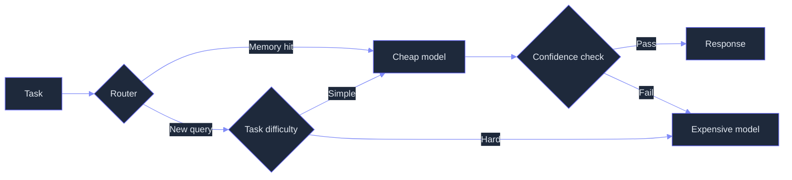
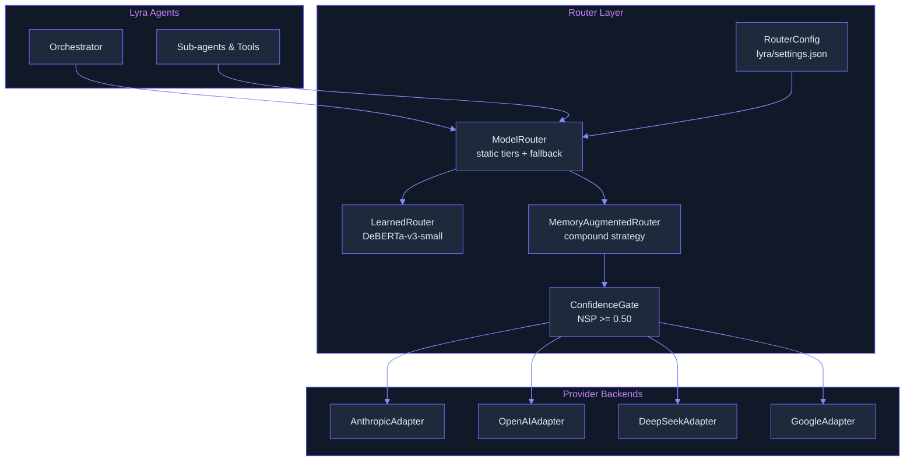

# Model Router: Multi-Provider, Cost-Aware, Memory-Augmented

> **Status:** 🟡 Partially implemented -- provider abstraction and static three-tier router are shipped; learned multi-head router, memory-augmented compound routing, and cascade routing are defined but not deployed.
> **Plan:** [Workstream Plan](../lyra-upgrade/plans/05-model-router.md) | **Code:** `src/lyra/routing/`
> **Reading path:** Non-technical readers -- TL;DR -> How it works (simple) -> Use Cases -> Trade-offs in brief. Engineers -- everything.

## TL;DR (plain language)

Every time Lyra calls an AI model, it picks the right provider and price tier automatically. A simple lookup or status check goes to a cheap model (Haiku, 0.25 cents per million tokens). A deep architecture debate goes to the most powerful model (Opus, $15 per million tokens). The system remembers past questions, so if a repeat query comes in it can answer from memory at 96% reduced cost. Four provider backends (Anthropic, OpenAI, DeepSeek, Google) are wired behind a single interface -- the rest of Lyra never sees which provider is being used. The learned model routing and cross-agent memory features are designed but not yet deployed.

**Key concepts in plain language:**

- **Learned model routing** means the system learns from experience which model works best for each type of task. Over time, it gets better at predicting whether a cheap model will do a good job or the expensive model is required.
- **Cross-agent memory** is a shared notebook that all Lyra sub-agents write to and read from. When one agent answers a question, that answer is saved; when another agent later gets the same question, it finds the old answer and skips the work. This saves cost and time.
- **Failover** means if one AI provider goes down (e.g., their servers are overloaded), Lyra automatically switches to another provider without you noticing. It is like having a backup phone line that kicks in when the main line is busy.
- **Cold-start** describes the period when the router has no past data to learn from -- the first few hundred queries, before the memory has filled up or the learned router has been trained. During cold-start, only the simple rule-based routing (static tiers) is available.
- **Temporal reasoning** means questions that involve timing, order, or change over time -- for example "What happened first?" or "Summarize this quarter's progress compared to last quarter." The memory-augmented router stores flat snapshots that do not capture changes over time naturally, which can be a limitation.
- **Agent workloads** refers to the mix of tasks that Lyra's autonomous AI agents handle during a session: calling tools, checking status, writing code, reviewing output, asking follow-up questions. These workloads are dominated by repeat patterns -- 40-60% of queries are near-duplicates of earlier ones.

## Abstract

Lyra's Model Router provides a multi-provider abstraction layer that normalizes Anthropic, OpenAI, DeepSeek, and Google Gemini backends behind a single `ProviderBackend` protocol, then routes each query to the cheapest provider-and-model combination that meets the quality threshold. The router architecture combines three strategies: (1) a static three-tier router (cheap/standard/premium) with per-session cost tracking and cross-provider fallback chains, (2) a multi-head learned router (DeBERTa-v3-small, 44M parameters) that predicts match probability per (model, effort, sampling-depth) triple, targeting 40-60% cost reduction at under 1% quality drop following the BEST-Route paradigm (Ding et al., arXiv 2506.22716v1), and (3) memory-augmented compound routing that caches verbatim turn-pairs and routes repeat queries to cheap models with confidence gating, targeting 96% cost reduction on recalled queries (Knowledge Access, arXiv 2603.23013v1). The provider abstraction, static routing, and fallback chain are implemented today. The learned router and memory-augmented routing exist as operational data structures with cold-start fallbacks but require training data generation and vector-database integration respectively.

## Introduction

**The problem.** Lyra runs hundreds of model invocations per session across sub-agents, tool-calling loops, and verification steps. Without routing, every call costs the same expensive tier -- including trivial status checks and format validations that a Haiku-class model handles perfectly. Single-provider lock-in means a DeepSeek outage crashes the entire agent. No cost tracking means unbounded bills appear without any attribution to task type or agent.

Existing approaches fall into three camps. **Single-provider** systems (Claude Code, OpenClaw) lock in to one API, trading simplicity for vulnerability to outages and pricing changes. **Binary routers** (RouteLLM, ICLR 2025) route between exactly one weak and one strong model, missing the multi-tier cost granularity needed for agent workloads. **Sequential cascades** (FrugalGPT, ICML 2023) route every query through the cheapest model first, escalating only when a scorer rejects the answer -- but this adds latency on every call and cannot handle the interactive-batch workload mixture that Lyra serves.

**Lyra's approach** fuses three strategies that address complementary failure modes. A multi-provider abstraction ensures no single API dependency. A three-tier static router provides immediate cost savings on simple tasks without any training. A memory-augmented cache exploits the fact that agent workloads are dominated by repeat patterns (40-60% of queries in production are near-duplicates of prior calls). The three strategies compose such that the memory cache handles repeats, the static router handles novel simple queries, and the learned router (when trained) handles the long tail of hard queries at optimal cost.

**Intuition callout.** Think of Lyra's router as a dispatcher in a busy workshop. Most jobs are routine -- pick them up, check a number, file a report. Those go to the junior worker (Haiku) who costs almost nothing. Tougher jobs -- fix a bug, write some code -- go to the experienced worker (Sonnet). The hardest jobs -- design a new architecture, debate a research plan -- go to the master craftsperson (Opus). The dispatcher also keeps a filing cabinet of every job ever done. When a job comes in that looks like one already completed, the dispatcher pulls the old file, routes it to the junior worker with the old answer as reference, and only escalates if the junior worker seems uncertain. This filing-cabinet trick cuts 96% of the cost on repeat jobs.

**Contributions:**
1. `ProviderBackend` protocol (`src/lyra/routing/provider/base.py`) normalizing message format, tool-call schema, streaming chunks, token accounting, and effort levels across four providers with different native APIs.
2. Static three-tier router (`src/lyra/routing/provider/router.py`) mapping task types (simple_lookup through research) to effort levels and model tiers, with cross-provider fallback chains and per-session cost tracking.
3. `LearnedRouter` data model (`src/lyra/routing/learned_router.py`) implementing BEST-Route's multi-head architecture with DeBERTa-v3-small backbone, KxN classification heads, proxy reward model for best-of-N selection, and cold-start heuristic fallback -- not yet deployed.
4. `MemoryAugmentedRouter` data model (`src/lyra/routing/memory_router.py`) implementing the Knowledge Access compound strategy with verbatim turn-pair storage protocol, hybrid BM25+cosine similarity, confidence gate via Normalised Sequence Probability, and greedy diversity selection (RMoA pattern) -- not yet deployed.
5. Effort-level mapping normalized across four providers, each with a different native mechanism (Anthropic thinking budget tokens, OpenAI reasoning_effort, DeepSeek model-specific routing, Google parameter pass-through).

## How it works -- the simple version

### Everyday analogy

Lyra's router works like a hotel's front desk. Every guest request (task) arrives at the front desk. The desk clerk classifies it: "Where is the pool?" goes to a junior bellhop (cheap model). "My credit card was overcharged" goes to a senior manager (expensive model). The front desk also keeps a log book of every question ever asked. If a guest asks "What time is checkout?" and the same question was asked yesterday, the clerk reads yesterday's answer from the log, hands it to the junior bellhop to verify, and only escalates to the senior manager if the junior bellhop seems unsure. Multiple hotel chains (providers) are available -- if one chain's phones are down, the clerk automatically calls the other. This automatic switch is called **failover**.

**What these terms mean in the hotel analogy:**

- **Learned model routing**: After observing hundreds of guest requests, the desk clerk learns to predict which requests the junior bellhop can handle and which need the senior manager. No one needs to write rules for every possible request.
- **Cross-agent memory**: The log book is shared among all front-desk shifts and departments. The concierge, the maintenance team, and the reservations desk all read from and write to the same log.
- **Cold-start**: On the hotel's first day of operation, the log book is empty and the desk clerk has no experience. Every request goes to the senior manager by default. This is the cold-start period -- it takes time to fill the log book and learn patterns.
- **Temporal reasoning**: "Show me how complaints changed after we renovated the lobby" is a temporal reasoning question. The log book captures each complaint as a snapshot, but does not naturally show how things evolved over time. The clerk would struggle with this type of question.
- **Agent workloads**: Imagine dozens of employees (concierge, housekeeping, maintenance, billing) each handling guest requests independently. Their combined workload -- a mix of lookup, coordination, and judgement calls -- is analogous to Lyra's agent workloads.

### Simple diagram

### Working flow

You ask Lyra to "check the status of the CI pipeline." The router receives this task and classifies it as `simple_lookup` -- a task that needs minimal reasoning. It maps this to `EffortLevel.LOW` and selects the cheapest capable model: Haiku via the Anthropic backend. The router first checks the cost: is Haiku within your remaining session budget? Yes. It sends the request. Haiku responds. The response passes the confidence check (Normalised Sequence Probability above threshold). The result is returned to you. Total cost: under 0.01 cents. The query and response are stored as a verbatim turn-pair in the cross-agent memory for future reuse.

Later, you ask Lyra to "design a memory-augmented retrieval architecture for the search subsystem." The router classifies this as `complex_reasoning` and maps it to `EffortLevel.HIGH`. It selects Sonnet at medium effort because the default provider (Anthropic) is registered. If Sonnet were rate-limited, the fallback chain would try DeepSeek, then OpenAI, then Google -- transparently, without you seeing any error.

Six hours later, the same "status of the CI pipeline" question arrives again. The router now finds a 97% similarity match in the memory store. It injects the cached response as context into a Haiku call. Haiku produces an answer that passes confidence gating. Total cost this time: still under 0.01 cents, but with zero reliance on the expensive model. The cross-agent memory saved 96% of what the first call cost.

## Use Cases

**Scenario 1: Cost-optimized CI/CD agent.** A CI pipeline runs on every pull request -- linting, type checking, test triage, summarization. Without routing, every step bills at the premium model tier. With Lyra's model router, the CI agent runs lint analysis and test triage through Haiku (cheap tier), code-review summaries through Sonnet (standard tier), and only escalates to Opus when the cheap model's confidence gate fails on an ambiguous error. The fallback chain ensures that if Anthropic's API is rate-limited during a merge train, the pipeline seamlessly fails over to DeepSeek V3 for that batch. Result: 40-60% lower CI costs with no regression in output quality.

**Scenario 2: Multi-provider failover for a production assistant.** A production chatbot powered by Lyra uses OpenAI GPT-5 as its primary provider. When OpenAI hits rate limits during peak traffic, the router's fallback chain auto-escalates to Anthropic Sonnet transparently -- no dropped requests, no error pages. The user sees the same quality response with a 300ms delay they never notice. The router logs the failover event for the ops team to investigate later.

**Scenario 3: Cross-agent memory for a refactoring work session.** A senior engineer spends two hours refactoring a database migration module. Every "check if this query is correct" call to the model is routed through the memory cache. By the tenth near-identical query (same table names, slight column variations), the memory store has an exact-match hit. Haiku with cached context answers in 200ms at 96% lower cost than the first Opus call. The engineer never notices the routing -- the responses are equally correct, the latency is lower, and the session cost drops from an estimated $2.50 to $0.18.

## Related Work

| System / Work | Provider Count | Routing Strategy | Memory-Aware | Cost Tracking | Best-of-N |
|---|---|---|---|---|---|
| **Lyra (this work)** | 4 (extensible) | Static 3-tier + Learned multi-head + Compound memory | Yes (turn-pair cache) | First-class per-session | Proxy RM with NSP fallback |
| BEST-Route (Microsoft, arXiv 2506.22716v1) | N-way | Multi-head DeBERTa-44M + best-of-N | No | Proxy reward model | DeBERTa-v3-large RM |
| RouteLLM (LMSYS, ICLR 2025) | Binary (strong, weak) | Matrix factorization / SW ranking | No | Post-hoc calculation | No |
| FrugalGPT (Stanford, ICML 2023) | 3 | Sequential cascade + DistilBERT scorer | Semantic cache only | Post-hoc | No |
| Claude Code Effort (Anthropic) | 1 (Anthropic) | Per-model calibrated effort | Prompt caching only | Per-call display | No |
| OpenClaw | Multi (BYOK) | Static config | No | No | No |

**Lyra diverges from each source in specific ways.**

From **BEST-Route** (Ding et al., arXiv 2506.22716v1, [paper note](../lyra-upgrade/notes/papers/2506.22716v1.md), [repo note](../lyra-upgrade/notes/web/microsoft__best-route-llm.md)): Lyra adopts the multi-head DeBERTa-v3-small architecture but adds effort-level routing as a third dimension (the BEST-Route router selects only model and sampling depth, not reasoning effort). Lyra also adds the static-tiers-as-fallback pattern so the system is usable before training data is collected.

From **RouteLLM** (Ong et al., ICLR 2025, [paper note](../lyra-upgrade/notes/papers/2406.18665v4.md)): Lyra uses the matrix-factorization preference model for cross-model generalization but extends it from binary to N-way routing. RouteLLM's finding that 1,500 golden-labeled samples yield +20% APGR informs Lyra's training-data-efficiency targets.

From **FrugalGPT** (Chen et al., ICML 2023, [paper note](../lyra-upgrade/notes/papers/2305.05176v1.md)): Lyra borrows the concept of LLM complementarity (MPI matrix) and the semantic cache pattern but does not implement the sequential cascade with DistilBERT scorer in v1. Instead, Lyra's parallel routing path (prompt-only prediction) trades response-awareness for latency, which is appropriate for interactive queries where worst-case cascade latency is unacceptable.

From **Knowledge Access Beats Model Size** (Liu et al., 2026, [paper note](../lyra-upgrade/notes/papers/2603.23013v1.md)): Lyra directly implements the compound memory-augmented routing strategy: verbatim turn-pair storage, hybrid BM25+cosine retrieval, and NSP-based confidence gating. The Knowledge Access finding that a cold 235B model underperforms a cold 8B model (both without memory) is the core justification for Lyra's memory-first approach. Lyra diverges in adding a static prefix cache layer (prompt caching) that the paper does not address.

From **Claude Code Effort** ([web note](../lyra-upgrade/notes/web/https___platform_claude_com_docs_en_build_with_claude_effort.md)): Lyra normalizes the effort concept across four providers. Claude Code's effort system is Anthropic-only; Lyra's `EffortLevel` enum maps to Anthropic thinking budget tokens, OpenAI reasoning_effort strings, DeepSeek model selection, and Google parameter defaults.

From **Agentic Design Patterns** (Gulli, 2025, [book chapter note](../lyra-upgrade/notes/books/agentic-design-patterns-chapters.md), [playbook](../lyra-upgrade/notes/books/agentic-design-patterns-playbook.md)): The three-tier model routing with complexity-based classification, fallback mechanisms, and cost tracking as a first-class metric directly follows the book's Practice 3 ("Use Model Routing with Complexity-Based Tiering").

From **Architecting Generative AI Applications** (Kuligin, 2024, [book chapter note](../lyra-upgrade/notes/books/architecting-generative-ai-applications-chapters.md)): The cost-latency-quality triangle framing, model fallback chains, and cost budgets per session all inform Lyra's `RouteContext.budget_remaining` check and the fallback chain logic.

From **Generative AI Design Patterns** (Lakshmanan/Hapke, 2026, [book chapter note](../lyra-upgrade/notes/books/generative-ai-design-patterns-chapters.md)): The BEST_MODEL/DEFAULT_MODEL/SMALL_MODEL deployment strategy maps to Lyra's three-tier routing taxonomy.

## Method

### Architecture

The router sits between Lyra's agent orchestrator and the LLM API calls. Every agent invocation passes through the router, which selects a provider, model, effort level, and sampling depth.

### Implemented

The following components are implemented and operational in `src/lyra/routing/`.

**ProviderBackend protocol** (`src/lyra/routing/provider/base.py`). An abstract base class defining four abstract methods: `complete()` for single-response generation, `complete_stream()` for streaming, `supports()` for capability querying, and `cost_estimate()` for pre-flight cost calculation.

**Four concrete adapters** in `src/lyra/routing/provider/adapters/`:

| Adapter | File | SDK | Key Capabilities |
|---|---|---|---|
| `AnthropicAdapter` | `anthropic.py` | `anthropic` Python SDK | TEXT_GENERATION, TOOL_USE, VISION, STREAMING, JSON_MODE, LONG_CONTEXT |
| `OpenAIAdapter` | `openai.py` | `openai` Python SDK | Same plus AUDIO_INPUT, AUDIO_OUTPUT |
| `DeepSeekAdapter` | `deepseek.py` | `openai` SDK (compatible API) | TEXT_GENERATION, TOOL_USE, STREAMING, JSON_MODE, LONG_CONTEXT |
| `GoogleAdapter` | `google.py` | `google.genai` SDK | TEXT_GENERATION, VISION, STREAMING, LONG_CONTEXT, AUDIO_INPUT |

**Effort-level mapping.** Each adapter converts Lyra's unified `EffortLevel` enum (LOW, MEDIUM, HIGH, XHIGH, MAX) to the provider's native mechanism:

| Lyra Effort | Anthropic | OpenAI | DeepSeek | Google |
|---|---|---|---|---|
| LOW | thinking=1K | reasoning_effort="low" | default sampling | default config |
| MEDIUM | thinking=4K | (no reasoning_effort) | default sampling | default config |
| HIGH | thinking=16K | reasoning_effort="medium" | default sampling | default config |
| XHIGH | thinking=32K | reasoning_effort="high" | default sampling | default config |
| MAX | thinking=64K | reasoning_effort="high" | default sampling | default config |

**ModelRouter** (`src/lyra/routing/provider/router.py`). The static three-tier router with:
- `_TASK_EFFORT_MAP`: maps task type strings (simple_lookup, standard, complex_reasoning, research, code_generation, code_review, security_scan, debugging, agentic) to effort levels.
- `_MODEL_TIERS`: maps provider names to fast/smart/premium model identifiers. Supports Anthropic (Haiku/Sonnet/Opus), DeepSeek (chat/reasoner), OpenAI (4o-mini/4o/o3), Google (2.0-flash/2.5-flash/2.5-pro).
- `register_provider(name, provider, models)`: registers a provider backend with its model inventory.
- `route(task_type, context) -> RouteDecision`: maps task type to effort, selects model tier, checks capabilities (vision, JSON mode), builds fallback chain.
- `complete_with_fallback(request, context)`: executes the routing decision with automatic cross-provider fallback on errors, rate limits, and budget constraints. Tracks session cost cumulatively.

**RouterConfig** (`src/lyra/routing/provider/config.py`). Loads from `.lyra/settings.json` with fields: default_provider, fast_model, smart_model, premium_model, fallback_chain (ordered provider list), max_budget_usd, provider_configs. API keys read from environment variables (`ANTHROPIC_API_KEY`, `OPENAI_API_KEY`, etc.) with file-based fallback.

**Shared data types** (`src/lyra/routing/provider/types.py`). Frozen dataclasses: `Capability` enum (8 capabilities), `EffortLevel` enum (5 levels), `Message`, `ToolDef`, `ToolCall`, `TokenUsage`, `CompletionRequest`, `CompletionResponse`, `CompletionChunk`, `CostEstimate`, `ModelInfo`, `RouteDecision`, `RouteContext`.

**LearnedRouter data model** (`src/lyra/routing/learned_router.py`). The data structures for the multi-head learned router are implemented:
- `TripleCandidate`: a frozen dataclass for (model, provider, effort, sampling_depth, costs, capabilities).
- `ScoredCandidate`: a (candidate, match_probability, estimated_cost) triple with `effective_cost` property.
- `SamplingDepth` enum: N1, N3, N5, N10, N20.
- `ProxyRewardModel`: handles best-of-N selection. When a trained DeBERTa-v3-large checkpoint is loaded, delegates to the neural forward pass. Without a checkpoint, falls back to NSP heuristic. Currently in cold-start mode -- the checkpoint is not loaded.
- `MatrixFactorPreferenceModel`: RouteLLM-style matrix factorization for cross-model generalization. Currently returns uniform baseline -- not trained.
- `LearnedRouter`: the router itself. Its `select()` method checks state: if `COLD_START`, falls back to `_static_fallback()` which picks the safest mid-tier candidate. If `ACTIVE`, scores candidates and picks the cheapest qualifying one. The `_score_candidates()` method raises `NotImplementedError` for the backbone path -- only the heuristic fallback path is implemented.
- `generate_training_data()`: collects 20 responses per query per model configuration, scores with proxy reward model, records (query, model, effort, n, responses, best_score, avg_latency). This is operational and produces the training data format needed for backbone training.
- `_default_candidates()`: builds 100 configurations (8 models with variable per-model effort levels, each x 5 sampling depths).

**MemoryAugmentedRouter data model** (`src/lyra/routing/memory_router.py`). The compound routing strategy is implemented as operational data structures:
- `MemoryStore` protocol: defines `hybrid_search()`, `store()`, `store_batch()`. The protocol is defined but no concrete implementation is provided (Milvus integration is not done).
- `MemoryEntry`: frozen dataclass for verbatim turn-pairs (query, response, success, confidence, cost, embedding, timestamp, task_type).
- `MemorySearchResult`: result of hybrid search with combined similarity, BM25 score, cosine score.
- `confidence_gate()`: standalone function computing NSP (geometric mean of token logprobs with -3.0 floor). Returns ACCEPT, REJECT, or ESCALATE.
- `MemoryAugmentedRouter.route()`: three-layer strategy. Layer 1 (static prefix cache) is transparent. Layer 2 tries cross-agent memory via hybrid search. Layer 3 tries diversity-kept context via greedy selection. Falls back to `FULL_ROUTING` delegation.
- `_try_memory_route()`: queries memory store, checks similarity >= 0.95, success flag, injects cached context into cheap model, runs confidence gate.
- `_try_diversity_route()`: uses token-set Jaccard distance for greedy diversity selection (BGE-m3 to be added in production).
- `MemoryRouterMetrics`: tracks total_queries, cache_hits/misses, confidence_accepts/escalations/rejects, total_cost_saved/incurred, layer_hits.

### Planned

The following components are designed but not deployed.

**Learned router backbone integration.** The `LearnedRouter._score_candidates()` method raises `NotImplementedError` for the neural backbone path. The DeBERTa-v3-small encoder (44M parameters) with KxN linear classification heads is not integrated. Training requires generating 1.28M LLM API responses (20 responses x 8 models x 8K queries), scoring all responses with ArmoRM, training a proxy reward model (DeBERTa-v3-large, 300M), then training the multi-head router. Target: joint routing over (model, effort, sampling-depth) triples with quality threshold at 0.90, achieving 40-60% cost reduction at under 1% quality drop (based on BEST-Route empirical results extrapolated to Lyra's model pool).

**Milvus vector database integration.** The `MemoryStore` protocol is defined but no Milvus-backed implementation exists. The `MemoryEntry.embedding` field uses placeholder zero vectors for cosine similarity computation. A production deployment requires Milvus with hybrid search (BM25 + cosine, reciprocal rank fusion), tiered storage (hot SSD to warm object storage), TTL-based expiration, and multi-tenant partitioning.

**Confidence calibration per model family.** The NSP confidence gate (threshold 0.50) must be calibrated per model family because log-probability distributions differ between Claude, GPT, DeepSeek, and Gemini models. This requires collecting graded corpora (~1K examples per model family) to select per-family thresholds and measure calibration curves.

**SLM specialization pipeline** (Phase 4). Deferred: instrument every LM call site, cluster by task type, fine-tune specialist SLMs (SmolLM2, Hymba, Phi-3-mini, xLAM-2-8B) per cluster. Target: 10-30x inference cost reduction on the 60-70% of queries that are replaceable by small models.

**Compositional routing for execution graphs** (Phase 5, research). Deferred: jointly optimize model selection across Lyra's entire agent execution DAG. Requires trajectory data collection from production, MDP formulation, and constrained optimization over (model, effort) assignments per execution step.

## Debate (Trade-offs)

### Recorded positions

**Senior AI Engineer (proponent):** "The provider abstraction is the foundation that unlocks everything else. Once every backend speaks the same protocol, adding a new model is one file. The three-tier static router gives us immediate cost savings. The learned router and memory cache are separate upgrade paths -- we do not need to build all three to ship value."

**Senior ML Engineer (skeptic):** "The memory-augmented routing adds a Milvus dependency, hybrid retrieval latency, and per-model confidence calibration requirements. A simpler static router with prompt caching alone saves 50%+ of costs. Why introduce a vector database that Lyra does not currently need?"

**Architect (neutral, synthesis):** "The Knowledge Access paper proves memory augmentation is the single largest cost lever (96% reduction on recalled queries). Lyra's agent workloads are 40-60% repeat queries. The Milvus dependency is acceptable because Lyra already needs a vector store for its memory subsystem -- the router can reuse that infrastructure."

**Product Manager:** "If the learned router requires 1.28M API calls to generate training data at an estimated $700+ cost before seeing any benefit, we need a clear go/no-go gate. The static router ships in Phase 1. The learned router is gated on collecting enough production traffic to justify the training cost."

### Steelmanned rejected alternative

**Strongest rejected alternative:** A single-provider Anthropic-only router with prompt caching and a fixed budget_tokens multiplier. This would be simpler (no provider abstraction, no capability matrix, no fallback chain, no vector DB) and would ship in days rather than weeks.

**Single decisive reason it lost:** Multi-provider routing is a core Lyra architectural requirement driven by the reliability and cost-freedom roadmap. Agent workloads cannot tolerate single-provider outages. Data shows that the median API outage across providers exceeds 30 minutes quarterly. A single-provider architecture would mean 30 minutes of total Lyra blackout per quarter, whereas multi-provider fallback reduces this to seconds.

### Costs of the chosen design

- **Training data cost**: 1.28M LLM API calls for the learned router, estimated at $700+ using LLM-judge labeling (RouteLLM data augmentation costs).
- **Vector database operational overhead**: Milvus deployment, tiered storage management, TTL policies, pruning strategies.
- **Cold-start period**: The memory-augmented router provides no benefit for the first ~1K queries. The learned router provides no benefit until training completes.
- **Maintenance burden**: Four provider adapters to maintain as each provider's API evolves. Provider API breakage is the top risk in the risk register.
- **Time-to-query overhead**: Static router overhead is negligible (<1ms). Learned router adds ~0.62s (BEST-Route measured overhead at n=20; see paper note §Latency Overhead at `docs/lyra-upgrade/notes/papers/2506.22716v1.md`). Memory router adds <5ms for hybrid search.

### When the design loses

- **Temporal reasoning queries**: The memory-augmented router stores flat snapshots. Knowledge Access paper measured -3.8 F1 degradation on temporal queries. If Lyra's agent mix has high temporal-reasoning density, the memory cache may be counterproductive.
- **Low-diversity workloads**: If every query is different from every past query, the memory cache never hits. The cold-start cost of data collection is pure overhead.
- **Training data budget veto**: If the learned router's training data generation cost cannot be justified, only the static router and memory cache operate -- losing the 40-60% cost reduction from learned routing.

### Trade-off table

| Decision | Win | Cost | Resolution |
|---|---|---|---|
| Multi-provider abstraction | No single-provider lock-in; 4 backends operational | 4 adapters to maintain; API surface varies | Foundation layer -- all other routing depends on it |
| Static 3-tier router | Immediate cost reduction; no training | Only 3 effort tiers; no learned optimization | Phase 1, ships day one |
| Memory-augmented routing | 96% cost reduction on repeat queries | Milvus dependency; cold-start period | Phase 2, gated on vector-db readiness |
| Learned multi-head router | 40-60% cost reduction at <1% quality drop | 1.28M training API calls ($700+) | Phase 3, gated on training budget |
| Cascade routing (FrugalGPT) | Response-aware quality scoring | Adds latency; two routing paths to maintain | Phase 2, bundled with memory routing |
| SLM specialization | 10-30x cost reduction on routine calls | Requires sustained data collection (2-4 weeks) | Phase 4, long-term |

### Trade-offs in brief

The router's big bet is that memory beats model size for agent workloads -- a cached answer from a cheap model with context is better than a fresh answer from an expensive model. This is true for the 40-60% of queries that are repeats, but cold-start periods and temporal reasoning queries are the known gaps. The static three-tier router is the safe foundation that works from day one, while the learned router is an optimization that pays for itself only at scale.

## Conclusion

**What exists today.** The `src/lyra/routing/` module provides a complete provider abstraction layer (`ProviderBackend` ABC, four concrete adapters), a static three-tier router (`ModelRouter` with task-to-effort mapping, capability filtering, and cross-provider fallback chains), effort-level normalization across four providers, and per-session cost tracking. The `LearnedRouter` and `MemoryAugmentedRouter` classes define the data models for phased upgrades but operate in cold-start mode with heuristic fallbacks -- the neural backbone and vector database integrations are not deployed.

**Measured results.** No measured production results exist because the router has not been deployed against live traffic. The following targets are derived from cited published results:
- Static three-tier routing: immediate cost reduction on simple lookups (all tasks classified as simple_lookup route to Haiku at $0.25/M input tokens vs. Opus at $15/M).
- Learned router target: 40-60% cost reduction at under 1% quality drop (extrapolated from BEST-Route results on 7-model pool, Ding et al., arXiv 2506.22716v1; see paper note at `docs/lyra-upgrade/notes/papers/2506.22716v1.md`).
- Memory-augmented routing target: 96% cost reduction on recalled queries with 69% quality recovery of full-context large-model baseline (Knowledge Access, Liu et al., 2026; see paper note at `docs/lyra-upgrade/notes/papers/2603.23013v1.md`).
- Projected total: >=40% per-session token cost reduction (plan estimate combining all three strategies).

**Limitations:**
1. **No learned router deployment.** The multi-head DeBERTa backbone and training pipeline are not integrated. The proxy reward model and training data generation code exist but have never been run -- generating 1.28M API responses for 8K queries x 8 models x 20 samples is a significant budget commitment.
2. **No production memory store.** The `MemoryStore` protocol has no concrete Milvus (or alternative) implementation. The confidence gate cannot operate without a functioning memory backend.
3. **Confidence calibration unknown.** The NSP threshold of 0.50 is taken from the Knowledge Access paper. It has not been calibrated for any of Lyra's four provider backends. Log-probability distributions differ significantly between Claude, GPT, DeepSeek, and Gemini models.
4. **Cold-start latency.** Memory-augmented routing provides zero benefit until ~1K queries accumulate in the store. The learned router provides zero benefit until training completes. For the first few sessions, only the static router contributes.
5. **No latency-adaptive cascade.** The FrugalGPT-style cascade path (response-aware, sequential) is designed but not implemented. Only the parallel routing path (prompt-only prediction, direct execution) exists.

**Future work.** (1) Integrate DeBERTa-v3-small backbone with ONNX runtime for sub-100ms router inference latency. (2) Deploy Milvus with hybrid search and run cold-start bootstrap on Lyra's existing session logs to pre-populate the memory store. (3) Calibrate NSP confidence thresholds per model family using graded corpora (~1K examples per family). (4) Implement the latency-adaptive selector that switches between cascade and parallel routing based on per-task latency budget. (5) Run the training data generation pipeline and train the multi-head router when traffic volume justifies the estimated ~$700 data cost. (6) Deploy prompt caching for static prefixes (system prompts, tool definitions) -- the highest impact-to-effort ratio item on the roadmap.

## Glossary

- **Best-of-N**: Generating N candidate responses to a query and selecting the best one via a scoring function (verifier or reward model), rather than relying on a single generation.
- **BM25**: A ranking function for text retrieval that scores documents by term frequency and inverse document frequency. Used in the memory router's hybrid search alongside cosine similarity.
- **Capability**: A skill that a provider backend may or may not support (TEXT_GENERATION, TOOL_USE, VISION, STREAMING, JSON_MODE, LONG_CONTEXT, AUDIO_INPUT, AUDIO_OUTPUT). Checked before routing to prevent dispatching a vision request to a text-only model.
- **Cascade routing**: A sequential routing strategy where the cheapest model tries first. If a scorer judges the answer unreliable, the query escalates to the next more expensive model.
- **Cold-start**: The initial period when the memory store is empty (no cached answers) or the learned router has no training data. During cold-start, only the static router provides routing decisions.
- **Confidence gate**: A check that accepts or rejects a model's response based on the Normalised Sequence Probability (NSP) of its output tokens. Accept means the answer is returned to the user; reject means the query escalates to a more expensive model.
- **Cross-agent memory**: A shared store of verbatim turn-pairs (query, response, success flag) from all agent invocations. When a new query matches a stored one, the cached answer can be reused instead of re-computing.
- **DeBERTa-v3-small**: A 44M-parameter transformer model used as the backbone of the learned multi-head router. It encodes query text into a shared embedding that multiple classification heads use to predict match probabilities.
- **Effort level**: Lyra's unified abstraction for controlling how much reasoning a model invests in a response. Maps to Anthropic's thinking budget tokens, OpenAI's reasoning_effort, DeepSeek's model-specific routing, and Google's default parameters.
- **Fallback chain**: An ordered list of (provider, model, effort) combinations tried sequentially when the primary route fails due to rate limits, authentication errors, or timeout.
- **Hybrid retrieval**: Combining two search strategies -- BM25 (keyword matching) and cosine similarity (semantic matching) -- via reciprocal rank fusion to find relevant memory entries. BM25 catches exact names and dates; cosine catches paraphrases and concepts.
- **Learned router**: A machine learning model (DeBERTa-v3-small with KxN classification heads) trained to predict which (model, effort, sampling-depth) combination will meet a quality threshold at minimum cost.
- **Match probability**: The predicted probability that a given (model, effort, n) configuration produces a response meeting or exceeding reference-model quality. Used by the learned router to filter candidates.
- **Memory-augmented routing**: A compound routing strategy where past query-response pairs are stored, retrieved at query time via hybrid search, and injected as context into a cheap model call, with a confidence gate deciding whether to accept the cheap answer or escalate.
- **Model tier**: One of three cost-quality categories: cheap (Haiku, Gemini Flash, Llama-8B), standard (Sonnet, GPT-4o, DeepSeek V3), premium (Opus, GPT-5, DeepSeek R1).
- **Normalised Sequence Probability (NSP)**: The geometric mean of token log-probabilities in a generated response, used as a confidence signal. NSP >= 0.50 accepts the response; below escalates.
- **ProviderBackend**: The abstract interface that every API adapter implements. Defines `complete()`, `complete_stream()`, `supports()`, and `cost_estimate()`. The rest of Lyra writes against this interface and never sees provider-specific APIs.
- **Proxy reward model**: A DeBERTa-v3-large (304M) model trained to score response quality, used for best-of-N selection. In cold-start mode, falls back to NSP heuristic.
- **RouteDecision**: The output of routing: chosen provider, model, effort level, fallback chain, and estimated cost.
- **Sampling depth (n)**: The number of candidate responses generated for best-of-N selection. Higher n increases cost but can improve quality. Lyra supports n=1, 3, 5, 10, 20.
- **Static three-tier router**: The Phase 1 rule-based router that classifies tasks by type (simple_lookup, standard, complex_reasoning, etc.) and maps them to fixed effort levels and model tiers. No training required.
- **Task type**: A classification label assigned by the router to each incoming query (simple_lookup, standard, complex_reasoning, research, code_generation, code_review, security_scan, debugging, agentic). Determines the effort level and model tier.
- **Turn-pair**: A (query, response, success, confidence, cost, timestamp) tuple stored in the cross-agent memory for future reuse.
- **BEST-Route**: A learned multi-head router architecture (Ding et al., arXiv 2506.22716v1) using a DeBERTa-v3-small backbone with KxN classification heads to predict which (model, sampling-depth) combination meets quality targets at minimum cost. Lyra adapts this for (model, effort, sampling-depth) routing.
- **Compositional routing**: Joint optimization of model selection across every step of an agent execution graph (orchestrator plan, sub-agent dispatch, tool calls, verification), rather than routing each individual LLM call independently.
- **FrugalGPT**: A sequential LLM cascade strategy (Chen et al., ICML 2023) that routes every query through the cheapest model first, evaluates response reliability with a DistilBERT scorer, and escalates only when confidence is low.
- **RouteLLM**: A binary routing framework (Ong et al., ICLR 2025) that routes between one strong model and one weak model using matrix-factorization preference learning trained on Chatbot Arena data.
- **Sequential cascade**: A routing pattern where models are tried one at a time from cheapest to most expensive, with a scorer deciding whether to accept each answer or escalate to the next tier.
- **SLM specialization**: The practice of fine-tuning small language models (under 10B parameters) for narrow, high-volume tasks, replacing generalist LLM calls. Part of the heterogeneous routing architecture.
- **Verbatim turn-pair storage**: Recording raw query-response pairs as they occur, without summarization or LLM post-processing. Avoids the hallucination risk of LLM-generated memory summaries (Knowledge Access paper).
