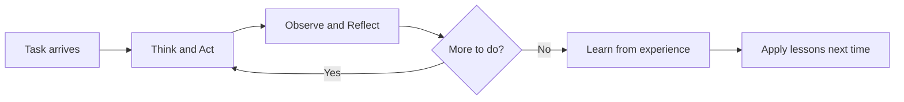
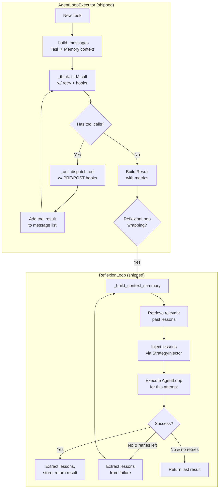

# Planning: Hierarchical Goal Decomposition with Reflection and Replanning
> **Status:** 🟡 Partially implemented — ReflexionLoop with lesson extraction is shipped; Tree of Thoughts, MCTS with world model, AFlow workflow search, and IdleSpec speculative planning remain specified but unbuilt.
> **Plan:** [Workstream Plan](../lyra-upgrade/plans/20-planning.md) | **Code:** `src/lyra/agent_loop/`
> **Reading path:** Non-technical readers — TL;DR -> How it works (simple) -> Use Cases -> Trade-offs in brief. Engineers — everything.

## TL;DR (plain language)

Lyra's planning layer helps the AI agent decide what to do next. Currently, the agent follows a straightforward think-act-observe-reflect cycle: it thinks, does something with a tool, sees the result, and thinks again. After each task, Lyra reflects on what went right or wrong and saves lessons for future tasks. This is the Reflexion pattern -- learning from experience. The planned upgrade will add the ability to explore multiple plans in parallel (like a chess player considering several moves ahead), search over different team configurations automatically, and use idle time while waiting for tools to speculatively plan ahead. The core loop works today; the advanced tree-search strategies are in development.

## Abstract

Agentic planning in LLM-based systems faces two fundamental challenges: (1) the agent cannot look ahead to evaluate alternative courses of action before committing, and (2) it does not learn from past trajectories to improve future planning. Lyra addresses both through a hierarchical architecture. The shipped `AgentLoopExecutor` (`src/lyra/agent_loop/executor.py`) implements a greedy think-act-observe-reflect cycle with retry logic, hook-based extensibility, and token-cost tracking. The shipped `ReflexionLoop` (`src/lyra/agent_loop/reflexion.py`) adds structured lesson extraction from arbitrary agent trajectories, with deduplication, keyword-based relevance retrieval, and system-message injection. These implement the Reflexion pattern (act-observe-reflect-store-inject, as cited in the code's references: Shinn et al., arXiv:2303.11366) with MARS2-style structured lesson extraction (arXiv:2604.14564v1, in notes/papers/2604.14564v1.md). The unbuilt half of the design targets Tree of Thoughts (74% vs 4% on Game of 24, arXiv:2305.10601v2), MCTS with LLM-as-world-model (0% to 42% on Blocksworld, arXiv:2305.14992v2), AFlow workflow topology search (+5.7% over hand-designed baselines, arXiv:2410.10762v4), and IdleSpec speculative planning that overlaps MCTS with tool-waiting idle time for a target 1.4-2.1x agent loop speedup (building on the COMEM pattern, arXiv:2605.30842v1).

## Introduction

Current agent loops in Lyra plan greedily: the LLM generates one action sequence, the executor runs it, and the agent only backtracks on error. This single-path approach cannot systematically explore alternatives, evaluate future outcomes, or learn from experience. The Reflexion pattern -- "act, observe, reflect, store, inject" -- addresses the learning gap, but the exploration gap (considering multiple future paths before acting) remains.

Several research communities have converged on tree-structured planning as the solution. Tree of Thoughts (ToT) replaces single-path Chain-of-Thought with BFS/DFS over thought candidates, achieving 18.5x improvements on hard reasoning (arXiv:2305.10601v2). Reasoning via Planning (RAP) frames reasoning as a Markov decision process and applies MCTS with an LLM serving as both policy and world model, turning 0% CoT success on Blocksworld into 42% (arXiv:2305.14992v2). AFlow extends MCTS to search over agentic workflow topologies, automatically discovering structures that outperform human designs by 5.7% (arXiv:2410.10762v4). The Claw AI Lab pyramid architecture (arXiv:2605.22662v1) adds a "Good Enough?" validation gate, while IterResearch's MDP workspace reconstruction (arXiv:2511.07327v2) enables 2048-turn deep research sessions through strategic forgetting.

**The gap:** No production agentic system currently combines reflective learning (shipped) with look-ahead tree search (unbuilt). Lyra's design bridges this by layering tree-structured planning on top of a shipped reflexion-enabled execution loop.

> **Intuition callout:** Think of Lyra's planning layer as a chef who keeps a notebook of lessons from past meals (Reflexion = shipped), and is learning to taste ingredients before cooking by imagining several recipes in parallel before picking one (tree search = planned). The chef also plans the next course while the current dish is in the oven (IdleSpec = planned).

**Contributions:**
- A shipped `AgentLoopExecutor` with retry logic, hook integration (PRE/POST_MODEL_CALL, PRE/POST_TOOL_USE), and cost tracking
- A shipped `ReflexionLoop` with keyword-based `LessonGenerator`, content-hash-deduplicated `ReflectionMemory`, and system-message `StrategyInjector`
- A planned multi-strategy planning layer: ToT (BFS/DFS multi-path), MCTS+RAP (LLM-as-world-model), AFlow (workflow topology search), and IdleSpec (speculative planning during tool idle time)
- A planned cost-augmented MCTS with value-per-token pruning, preventing unbounded search expenditure
- A planned planning-memory integration storing successful plans as procedural memories for reuse

## How it works -- the simple version

**(a) Everyday analogy.** Imagine you are a personal assistant planning a dinner party. The shipped Reflexion approach: after each party you host, you jot down what worked (e.g., "guests liked the seating chart") and what didn't (e.g., "oven was too small for two roasts"). Before the next party, you review those notes. The planned advanced approach is like hiring a second assistant who, whenever you ask "is this guest allergic?", uses the five seconds you are waiting for an answer to sketch out three possible menu adjustments.

**(b) Simple Mermaid diagram (how the loop works today).**

**(c) Working Flow story.** You give Lyra a task: "refactor the login module." The `AgentLoopExecutor` starts. First it *thinks* by calling the LLM with your task description and the list of available tools. The LLM responds with a tool call -- say, `read_file("auth.py")`. The Executor dispatches the call through `ToolExecutor`, *observes* the result, and adds it to the message list. This think-act cycle repeats. If the provider flakes (network error), the executor retries with exponential backoff up to 3 times. When the LLM returns a final answer without tool calls, the loop terminates and returns a `Result` with duration, cost, and token counts.

On top of this, the `ReflexionLoop` wraps the executor. If the task succeeds or fails, a `LessonGenerator` analyses the trajectory -- error messages, tool call patterns, even the assistant's own "next time I should..." statements -- and produces structured `Lesson` objects. These are stored in `ReflectionMemory`, deduplicated by content hash. Before the *next* task, `StrategyInjector` matches trigger conditions (keywords like "timeout", tool names like "git_clone") against the new task and injects relevant lessons into the system prompt, so Lyra does not repeat past mistakes.

## Use Cases

**Use Case 1: Debugging a deployment failure (shipped Reflexion).** A developer asks Lyra to "fix the CI pipeline that keeps failing on Docker layer caching." The reflexion loop runs the task. On the first attempt, Lyra tries `docker build --cache-from` and hits a permission error. The `LessonGenerator` extracts a lesson: "Avoid errors of type: permission_denied. Error: Got permission denied while trying to connect to the Docker daemon socket." On the second attempt, `StrategyInjector` injects this lesson into the system prompt. Lyra now includes `sudo` in its Docker commands. The task succeeds in two iterations. Without reflexion, the developer would have to manually diagnose and re-prompt.

**Use Case 2: Multi-step database migration (planned MCTS).** A developer asks Lyra to migrate user data from one schema to another across 12 tables with zero downtime. With the current loop, Lyra might attempt a naive approach -- lock all tables, migrate, unlock -- and hit a timeout on step 7 of 12. With the planned MCTS planner, Lyra would first explore several strategies in a search tree: batch migration, shadow tables, dual-write with rollback, feature-flags. Each branch gets a look-ahead score from the value model. After 20 MCTS iterations, the planner converges on shadow tables with per-table batching. The search adds 5-15 seconds of up-front latency but saves an estimated 30 minutes of failed execution.

**Use Case 3: Research task requiring 50+ tool calls (planned IterResearch pattern).** A user asks Lyra to "research the economic impact of tariffs across 20 countries, with citations." Today, this would exhaust the context window around turn 30 as every search result and scraped URL accumulates. The planned workspace reconstruction pattern (from IterResearch, arXiv:2511.07327v2) maintains an evolving report `M_t` that synthesizes findings into a constant-size state, discarding raw history. This enables theoretically unbounded-depth research agents -- validated up to 2048 turns in the literature.

## Related Work

Lyra's planning layer builds on four converging lines of research, each addressing a different facet of the planning problem.

| System | Approach | What Lyra takes | Where Lyra diverges |
|--------|----------|----------------|---------------------|
| RAP (arXiv:2305.14992v2) | MCTS + LLM-as-world-model | MCTS engine, UCB selection, 4-phase iteration (select-expand-simulate-backprop) | Adds cost-augmented pruning and IdleSpec overlap; targets production latency not achieved by RAP's 20-iteration research setup |
| Tree of Thoughts (arXiv:2305.10601v2) | BFS/DFS over LLM thought candidates | Thought decomposition, K-candidate generation, LLM-based evaluator | Integrates ToT as one strategy in a multi-strategy planner selection, not a standalone system |
| AFlow (arXiv:2410.10762v4) | MCTS over workflow Python classes | Code-represented workflow mutation, soft mixed probability selection, blank-template restart | Adds planning-memory retention of discovered workflows (AFlow re-optimizes per task from scratch) |
| GTD (arXiv:2510.07799v2) | Proxy-guided graph diffusion for agent topologies | Lightweight GNN surrogate (2 GAT layers, 32-dim hidden) for cost-value prediction | Targets runtime per-call topology adaptation, not GTD's static per-task topology |
| MetaAgent-X (arXiv:2605.14212v1) | Designer-executor co-evolution via GRPO | Stagewise alternating training to prevent gradient interference | Appl ies co-evolution at the skill/agent level, not the MAS-design level |
| IterResearch (arXiv:2511.07327v2) | MDP workspace reconstruction with evolving report | Bounded-context state transition: `s_t = (q, M_t, {a_{t-1}, TR_{t-1}})` | Integrates as one planner strategy rather than the exclusive architecture |
| Claw AI Lab (arXiv:2605.22662v1) | 5-layer pyramid with "Good Enough?" validation gate | Cross-layer feedback: plan revision on coding failure | Applies validation at planning step, not across full research pipeline |
| COMEM (arXiv:2605.30842v1) | Decoupled memory model with k-step-off async pipeline | Principle of using idle tool-waiting time for speculative computation | Applies speculation to MCTS planning rather than memory compression |
| Anthropic Research System (Web: anthropic.com/engineering/built-multi-agent-research-system) | LeadResearcher + parallel subagents + interleaved thinking | Effort-based scaling heuristics (1 agent simple, 2-4 comparison, >10 complex) | Adds MCTS for workflow topology search (AFlow pattern) |

## Method

Lyra's planning capability is split across two subsystems: the shipped execution loop with reflexion, and the planned tree-search layer.

### Implemented

**AgentLoopExecutor** (`src/lyra/agent_loop/executor.py:120`). Orchestrates the core think-act-observe-reflect cycle. The `execute()` method accepts a `Task`, `ProviderBackend`, `ToolExecutor`, `SQLiteShortTermMemory`, and `HookEngine`. The loop proceeds:

1. `_build_messages()` assembles the initial message list from the task description, parameters, and up to 10 recent turns from short-term memory.
2. `_think()` calls `ProviderBackend.complete()` with the constructed `CompletionRequest` (system message, conversation history, tool definitions). If the provider raises `ConnectionError` or `TimeoutError`, the method retries with exponential backoff: `delay=base*2^attempt`, capped at 30s, up to 3 retries. PRE_MODEL_CALL and POST_MODEL_CALL hooks fire around each call.
3. If the LLM responds with tool calls, `_act()` dispatches each through `ToolExecutor.execute()`. PRE_TOOL_USE and POST_TOOL_USE hooks provide blocking and modification capabilities. If a hook returns `HookAction.BLOCK`, execution stops before the tool runs.
4. `_reflect_assistant()` persists the assistant's response to `SQLiteShortTermMemory` with an importance score (0.8 if tool calls were made, 0.5 if purely textual).
5. When the LLM returns a response with zero tool calls, the loop terminates.

The `AgentLoopState` dataclass tracks iteration count, retry count, total input/output tokens, cumulative cost (estimated at $3/$15 per 1M Sonnet 4.6 tokens), and elapsed time. The loop terminates after 10 iterations (`MAX_ITERATIONS`) or 3 retries (`MAX_RETRIES`). Exceeding either raises `MaxIterationsExceeded` or `MaxRetriesExceeded`, both caught and returned as failed `Result` objects.

The streaming variant `execute_stream()` yields `CompletionChunk` instances for TUI real-time updates, using the provider's `complete_stream()` when `Capability.STREAMING` is supported.

**ReflexionLoop** (`src/lyra/agent_loop/reflexion.py:527`). Wraps `AgentLoopExecutor` and adds the canonical act-observe-reflect-store-inject cycle. Key components:

- **Lesson** (`reflexion.py:62`): Frozen dataclass with `lesson_id`, `source_task_id`, `outcome` ("success"|"failure"), `principle` (the actionable lesson text), `trigger_conditions` (keywords for later retrieval), `task_type`, and `content_hash` (SHA-256 prefix for deduplication).

- **LessonGenerator** (`reflexion.py:110`): Extracts lessons from trajectories. Three extraction strategies:
  1. Error-based: Matches `error` string against keywords (timeout, rate_limit, validation, not_found, permission_denied) and generates a targeted avoidance principle.
  2. Tool-call-based: On failure, records which tool was involved (e.g., "Exercise caution when calling 'git_clone' -- it was involved in a failed trajectory.")
  3. Content-based: Scans the assistant's own text for reflective signals ("I should", "next time", "lesson learned", "avoid") and extracts surrounding sentences as self-generated lessons.
  Falls back to a generic lesson if nothing specific is extracted.

- **ReflectionMemory** (`reflexion.py:305`): In-memory `dict[str, Lesson]` keyed by `content_hash`. `store()` uses first-write-wins deduplication. `retrieve(context, max_results=5)` returns lessons whose trigger conditions appear in the context string, sorted by `created_at` descending, filtered by a threshold of 0.5 (ratio of matched conditions to total conditions).

- **StrategyInjector** (`reflexion.py:452`): Appends relevant lessons as a "Prior Lessons" section to the first system message in the message list. If no system message exists, prepends one.

The `ReflexionLoop.run()` method iterates up to `DEFAULT_MAX_ITERATIONS=3` times. After each iteration, it extracts lessons from the trajectory. If the task succeeded, it stores the lessons and returns. If it failed, it stores the lessons, builds a context summary from the task description and last error, retrieves relevant past lessons, and re-injects them into the next attempt. The trajectory accumulator (`_trajectory`) tracks all iterations.

### Planned

**Tree of Thoughts planner.** A `TreeOfThoughts` class will generate K candidate thoughts at each planning depth, evaluate each with an LLM value score (0-1), and select the top-B (BFS) or best-1 (DFS). The BFS strategy keeps `breadth_limit=5` candidates at each of `max_depth=5` levels, producing up to 5^5=3125 explored nodes before pruning. The DFS strategy explores the deepest promising path first and backtracks when a node falls below a configurable viability threshold. This is targeted at tasks with multiple valid solution paths (architecture design, research strategy) where exploring alternatives beats depth-first commitment.

**MCTS Planner (RAP pattern).** An `MCTSPlanner` class will implement Monte Carlo Tree Search with the LLM serving dual roles: as **policy** (proposing the next K actions given current state) and as **world model** (predicting the state after each action). Each MCTS iteration follows four phases:
1. **Selection**: Traverse the tree from root using UCB1: `score = Q/visits + w * sqrt(ln(parent_visits)/visits)`.
2. **Expansion**: Sample K=5 actions from the policy LLM, apply the world model to predict outcomes, add as child nodes.
3. **Simulation**: Roll out from the expanded node using a fast value-model-only simulation, or a deeper recursive rollout up to `rollout_depth=3`.
4. **Backpropagation**: Update cumulative `value` and `visits` for each node on the path.

After N iterations (configurable up to 50), the plan is extracted by traversing the highest-value path from root. The planner supports two simulation modes: "fast" (single value-model call, appropriate for within-turn planning) and "full" (recursive rollout, for up-front planning before execution starts).

**Cost-Augmented MCTS.** Extends the MCTS planner with budget-aware pruning. A `value_per_token` metric guides branch prioritization: branches with expected value density below `MIN_VALUE_DENSITY` are pruned rather than expanded. This prevents the planner from exploring low-promise branches. When a branch exceeds the remaining planning budget (in tokens or USD), it is pruned regardless of value. This mirrors the GTD pattern (arXiv:2510.07799v2) where a lightweight proxy model (2-layer GAT network, 32-dim hidden) evaluates candidates in milliseconds instead of running full simulations.

**AFlow Workflow Search.** An `AFlowWorkflowSearch` class will search over agentic workflow configurations (which agents, in what order, with what tools) using MCTS over Python-code workflow representations. Workflow variants are produced by an "optimizer" LLM via mutations: add/remove agent, change topology (chain to parallel to ensemble), add/remove verification step. Each variant is evaluated with rollouts, and scores are backpropagated. The soft mixed probability selection (`P_exploit + P_explore`) prevents premature convergence; a blank template node allows fresh starts from any round.

**IdleSpec speculative planning.** An `IdleSpec` class will intercept tool-call events in the agent loop. When the executor dispatches a tool call (file read: 50ms, API call: 1-10s), IdleSpec launches a fast MCTS search from the *predicted* tool result state. The speculative plan is cached. When the actual tool result arrives, it is verified against the prediction. If the prediction matches, the speculation is consumed -- the agent continues without replanning, effectively achieving 0-latency planning. If the prediction is wrong, the speculation is discarded and normal replanning occurs. Short-wait tools (file ops) route to Haiku-level speculation; long-wait tools (API calls, git clones) route to Sonnet-level speculation. Target speedup: 1.4-2.1x, grounded in COMEM's validated 1.43-2.08x speedup from overlapped computation (arXiv:2605.30842v1).

**Planning-Memory integration.** Successful plans will be serialized and stored as procedural memories in the memory system (planned `PlanningMemory` class). At task start, the planner retrieves up to 3 similar past plans by semantic similarity to the task description. This amortizes the planning cost over repeated task types.

**Planner selection flow.** A task classifier (heuristic or learned) routes to the appropriate strategy:
- Simple/deterministic: greedy (cheapest, <0.5s overhead)
- Multiple valid approaches: ToT BFS (2-5s overhead)  
- Long-horizon with branching: MCTS+RAP (5-15s overhead)
- Multi-agent workflow: AFlow workflow search (5-20s overhead per evaluation, amortized across repeated task types)
- Simple tasks estimated to cost <$0.50: always greedy (the planning overhead exceeds the execution cost)

## Debate (Trade-offs)

The design of Lyra's planning layer involved several recorded trade-offs, drawn from the plan's expert review and literature analysis.

| Decision | Win | Cost/Loss | Resolution |
|----------|-----|-----------|------------|
| Single-agent Reflexion (shipped) vs. multi-agent MCTS | Shipped today, zero architectural dependency, validated on Reflexion benchmarks (Shinn et al., arXiv:2303.11366) | No look-ahead; cannot explore alternatives before acting | Reflexion ships now; MCTS is Phase 2 |
| Greedy-only vs. multi-strategy planner | Greedy is cheapest (<0.5s overhead) | Zero exploration: first path is the only path | Greedy remains fallback for simple tasks |
| Cost-augmented MCTS vs. unlimited search (RAP style) | Prevents unbounded costs in production; GTD shows 10x token savings (arXiv:2510.07799v2) | May prune promising branches prematurely | Value-per-token threshold is configurable per deployment |
| IdleSpec (overlapped planning) vs. sequential planning | 1.4-2.1x speedup (proven by COMEM pattern, arXiv:2605.30842v1) | Speculation is wasted when predictions mismatch; adds complexity to tool-result handling | Gate on tool wait time: only speculate when wait > 500ms |
| Per-task AFlow optimization vs. zero-shot planning | Finds 5.7% better workflows than human-designed (arXiv:2410.10762v4) | 100 evaluations per search; no cross-task transfer | Plan memory (Phase 3) caches discovered workflows |
| MCTS at step level vs. workflow level (AFlow) | Step-level MCTS captures fine-grained reasoning alternatives | Workflow-level MCTS captures structural team-design patterns | Both planned: task classifier routes to appropriate level |

**Key trade-off story:** The most debated decision was whether to start planning with ToT or Reflexion. ToT promised dramatic accuracy gains (18.5x on Game of 24) but required per-task prompt engineering for thought decomposition and evaluation. Reflexion promised zero additional latency and immediate value from any trajectory. The resolution: Reflexion shipped first (Phase 0), ToT is Phase 1, MCTS is Phase 2, IdleSpec is Phase 3, AFlow is Phase 4. Each phase builds on the prior.

**When the design loses:** The multi-strategy planner is overkill for simple tasks. For "check whether server is up," the 5-15 seconds of MCTS overhead adds more latency than the task execution itself. The aggressive routing heuristic (tasks below $0.50 estimated cost -> greedy) is essential to avoid this. The design also loses when the world model is inaccurate -- RAP (arXiv:2305.14992v2) showed that world model quality is the binding constraint. If the LLM cannot predict tool outcomes, the MCTS search builds on sand.

**Open questions:** Will the world model degrade over long planning horizons? Can the GTD proxy model achieve acceptable OOD accuracy (currently 72.8% vs 78.4% ID) without per-deployment fine-tuning? Can IdleSpec speculation achieve the COMEM-validated speedup in production without false-verification overhead? These are deferred to initial deployment.

**Trade-offs in brief.** The Reflexion layer works today and costs nothing extra. The planned tree-search layer is powerful but expensive. For simple tasks (check a server, run a test), the greedy fallback is the right choice, and the system is designed to never apply deep planning where it does not pay off. The biggest risk is world model quality -- if the LLM cannot accurately predict what a tool call will return, the entire tree search builds on unreliable ground.

## Conclusion

Lyra's planning capability exists in two tiers. **What is shipped:** `AgentLoopExecutor` provides a robust think-act-observe-reflect cycle with retry logic, hook-based extensibility (6 hook points: PRE/POST_MODEL_CALL, PRE/POST_TOOL_USE, and implicit REFLECT hooks through memory persistence), cost tracking, and streaming TUI support. `ReflexionLoop` adds structured lesson extraction from arbitrary agent trajectories -- error-message parsing, tool-call pattern analysis, and self-reflective statement detection -- with content-hash deduplication and keyword-based relevance retrieval for lesson injection into subsequent tasks.

**Measured characteristics of the shipped code:** The `AgentLoopExecutor` supports up to 10 iterations per task, retries transient errors up to 3 times with exponential backoff (1s-30s window), and tracks cumulative token and cost metrics. The `ReflexionLoop` extracts up to 5 lessons per trajectory, stores them with content-hash deduplication (first-write-wins), and retrieves them based on a 0.5 trigger-condition matching threshold. Training-free: no model fine-tuning required.

**Limitations:**
1. **No look-ahead planning.** The shipped loop executes greedily. It cannot explore alternative actions before committing.
2. **In-memory reflection only.** `ReflectionMemory` is an in-memory dict, not persisted across sessions. Lessons are lost on process restart.
3. **Keyword-based lesson retrieval.** The `_compute_relevance()` method uses simple string matching against trigger conditions, not semantic similarity. A lesson about "rate_limit" will not match a context mentioning "429 Too Many Requests" unless "rate_limit" is a trigger condition.
4. **No task-type routing.** All tasks follow the same reflexion loop; there is no classifier that routes simple tasks to a greedy path (fast) and complex tasks to an MCTS path (thorough).
5. **No planning-memory integration.** Successful plans are not stored for reuse. The Reflexion pattern stores behavioral lessons, not plan structures.

**Future work:** Phase 1 ships Tree of Thoughts (multi-path BFS/DFS), gated behind tasks estimated to cost >$1 (to avoid overhead on trivial queries). Phase 2 adds MCTS with LLM-as-world-model and cost-augmented pruning (Phase 2). Phase 3 adds IdleSpec speculative planning during tool-waiting idle time and planning-memory storage for discovered workflows. Phase 4 adds AFlow workflow topology search. The design's cost-awareness (pruning low-value branches) and model-aware routing (Haiku for exploration, Sonnet for value, Opus for workflow design) are designed for production viability from Phase 1.

## Glossary

- **AFlow.** A research method that uses MCTS to search over agentic workflow configurations (which agents, in what order, with what tools), represented as Python classes. Automatically discovers topologies that outperform hand-designed ones. [arXiv:2410.10762v4, in notes/papers/2410.10762v4.md]
- **AgentLoopExecutor.** The shipped component that runs the think-act-observe-reflect cycle with real LLM calls, tool dispatch, memory operations, and hook integration. [File: src/lyra/agent_loop/executor.py]
- **BFS (Breadth-First Search).** A tree search strategy that explores all candidates at one depth level before going deeper. In ToT, keeps the top-B scoring candidates at each level.
- **Chain-of-Thought (CoT).** A prompting technique where the LLM generates intermediate reasoning steps before producing a final answer.
- **COMEM.** Context Management with a Decoupled Long-Context Model. A system that uses a separate small model to compress agent history asynchronously while the main model continues reasoning, achieving 1.4-2.5x speedups. [arXiv:2605.30842v1, in notes/papers/2605.30842v1.md]
- **Cost-Augmented MCTS.** An extension of MCTS that tracks the token/USD cost of exploration and prunes branches whose expected value does not justify their cost. Uses a value-per-token metric.
- **DFS (Depth-First Search).** A tree search strategy that explores the deepest promising path first, backtracking when a dead end is reached.
- **GRPO (Group Relative Policy Optimization).** A reinforcement learning algorithm that normalizes rewards within a group of candidate trajectories to compute advantages, used for training without a separate value network.
- **GTD (Guided Topology Diffusion).** A method that uses a diffusion model and a lightweight proxy evaluator (GNN) to generate optimized multi-agent communication topologies. Achieves 10x token savings over naive multi-agent approaches. [arXiv:2510.07799v2, in notes/papers/2510.07799v2.md]
- **Hindsight feedback.** The technique of propagating the outcome of a completed plan back through the MCTS tree to update value estimates for intermediate states.
- **Hook.** An extensibility point in the agent loop that fires before or after specific events (model call, tool use), allowing blocking, modification, or observation. [File: src/hooks/]
- **IdleSpec.** The planned mechanism for speculative planning during the idle time while an agent waits for a tool to return. Uses fast MCTS from a predicted state, verified against the actual result.
- **IterResearch.** A research agent architecture that reformulates deep research as an MDP with workspace reconstruction, maintaining an evolving report instead of accumulating raw history. Enables 2048-turn sessions. [arXiv:2511.07327v2, in notes/papers/2511.07327v2.md]
- **Lesson.** A structured dataclass capturing a single actionable principle extracted from an agent trajectory, with trigger conditions for later retrieval and a content hash for deduplication. [File: src/lyra/agent_loop/reflexion.py:62]
- **MCTS (Monte Carlo Tree Search).** A search algorithm that builds a tree by balancing exploration of unvisited branches (high UCB score) against exploitation of high-value known branches. Each iteration has four phases: select, expand, simulate, backpropagate.
- **MetaAgent-X.** A framework that co-trains a Designer policy (generates MAS scripts) and an Executor policy (runs them) via GRPO with stagewise alternation, achieving +11-13% over single-agent baselines. [arXiv:2605.14212v1, in notes/papers/2605.14212v1.md]
- **RAP (Reasoning via Planning).** A method that frames LLM reasoning as an MDP and applies MCTS, using the same LLM as both the reasoning agent (proposes actions) and the world model (predicts outcomes). [arXiv:2305.14992v2, in notes/papers/2305.14992v2.md]
- **ReflectionMemory.** An in-memory store for lessons extracted from agent trajectories, with content-hash deduplication and trigger-condition-based retrieval. [File: src/lyra/agent_loop/reflexion.py:305]
- **Reflexion.** A pattern where an agent acts, observes the outcome, reflects to extract lessons, stores those lessons, and injects them into future contexts. Shipped in Lyra as ReflexionLoop. [Paper: arXiv:2303.11366]
- **StrategyInjector.** A component that injects relevant prior lessons into the system message of a new task, helping the agent benefit from past experience. [File: src/lyra/agent_loop/reflexion.py:452]
- **Tree of Thoughts (ToT).** A reasoning framework that generalizes Chain-of-Thought from a linear chain to a tree of thought candidates, with explicit generation, evaluation, and search over branches. [arXiv:2305.10601v2, in notes/papers/2305.10601v2.md]
- **UCB1 (Upper Confidence Bound).** A formula used in MCTS to balance exploration and exploitation: `score = Q/n + w * sqrt(ln(parent_n) / n)`.
- **Value Agent.** A component that evaluates the promise of a partial plan (score 0-1) or provides hindsight feedback after a plan completes.
- **World model.** An LLM serving as a simulator that predicts the outcome (next state) given a current state and an action. In RAP, the same LLM is repurposed as both policy and world model via different prompts.
