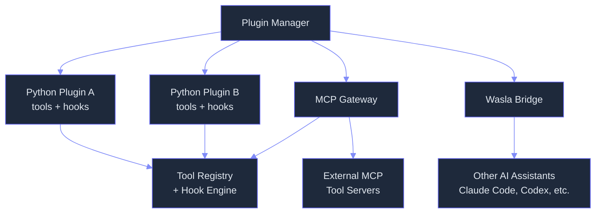

# Plugins: Extensible Plugin Architecture with Lifecycle Management

> **Status:** 🟡 Partially implemented -- core Plugin protocol, PluginManager, MCP gateway, and Wasla cross-orchestrator bridge are implemented; manifest-based directory discovery, marketplace, sandboxing, hot-reload, and deferred capability loading are planned.
> **Plan:** [Workstream Plan](../lyra-upgrade/plans/07-plugins.md) | **Code:** `src/lyra/plugins/`
> **Reading path:** Non-technical readers -- TL;DR -> How it works (simple) -> Use Cases -> Trade-offs in brief. Engineers -- everything.

## TL;DR (plain language)

Lyra's plugin system lets you add new abilities -- custom tools, automated checks, connections to other AI tools, and links to external services -- without modifying Lyra itself. Think of it like adding apps to a phone. Right now, Lyra can load Python packages as plugins, connect to external tool servers via the Model Context Protocol (MCP), and sync skills and configurations with other AI assistants like Claude Code or Codex. What is not yet built: a plugin marketplace for sharing plugins, automatic sandboxing to keep plugins from accessing sensitive files, and a system for discovering plugins by scanning directories. These are on the roadmap.

## Abstract

AI agent harnesses need a mechanism for third-party extension that is safe, discoverable, and lifecycle-managed. Lyra's plugin architecture provides a Protocol-based Plugin interface with dynamic loading from Python files, a PluginManager for enabling, disabling, and aggregating tools and hooks at runtime, a Model Context Protocol (MCP) gateway for connecting to external tool servers via JSON-RPC 2.0, and a Wasla synchronization bridge for bidirectional artifact exchange with other AI orchestrators. The system currently supports single-file Python plugin loading, per-plugin lifecycle (initialize, shutdown), MCP server connection and tool discovery, and cross-orchestrator sync of skills, MCP configurations, and commands. Planned extensions include manifest-based directory discovery with three installation scopes (project-local, user-global, system), a federated marketplace using a static YAML index, OS-level subprocess sandboxing with Seatbelt and bubblewrap, hot-reload on file change, and deferred capability loading to handle ecosystems of 50+ plugins without context degradation. The design balances immediate extensibility with a clear path to production-grade safety and discoverability, drawing on patterns from Claude Code plugins, the Kilo marketplace, and OpenClaw's gateway architecture.

## Introduction

Every agent harness faces the same problem: how to let users add new capabilities without rewriting the core system. Plugin architecture is the standard answer -- define a contract, load third-party code at runtime, and provide lifecycle management. For Lyra, the stakes are higher than for a typical application because plugins run inside an autonomous agent loop: they can execute shell commands, modify files, make network requests, and interact with the user's environment. A misbehaving plugin can cause real damage.

Existing approaches fall along a spectrum. Claude Code provides a full-featured plugin system with six core component types, directory-based discovery across three installation scopes, and a manifest format with user-configurable typed configuration prompts. The MCP specification standardizes how AI tools communicate with external servers via JSON-RPC 2.0, making tool discovery transport-agnostic. OpenClaw implements plugin-based extensibility with in-process runtime hooks and bundle-style plugins, and its ClawHub marketplace hosts over 700 community skills. The Kilo marketplace demonstrates a lightweight federated index model using static YAML files and sparse git checkout for installation. OpenHands provides sandboxed agent execution with three isolation backends, separating the app server from the agent server. Progent introduces monotonic privilege confinement via SMT-validated policy narrowing, reducing indirect prompt injection attack success rates from 39.9% to 1.0%.

The gap is that no single system ties all these layers together: a protocol for plugin authors, a discovery mechanism for users, a safety model for autonomous execution, and a marketplace for sharing. Lyra's plugin system addresses this gap with the following contributions:

- A **Protocol-based Plugin interface** (`src/lyra/plugins/manager.py`) that any Python object satisfying `name`, `version`, `tools`, `hooks`, `initialize()`, and `shutdown()` can serve as a plugin, with dynamic file import supporting both factory functions and auto-discovered classes.
- A **PluginManager** with per-plugin enable/disable and lifecycle hooks, plus bulk `all_tools()` and `all_hooks()` aggregation for runtime composition.
- An **MCP Gateway** (`src/lyra/plugins/mcp/gateway.py`) that connects to MCP servers, discovers their tools, and translates MCP tool schemas into Lyra's internal `ToolDef` format with fully-qualified namespaced names.
- A **Wasla synchronization bridge** (`src/lyra/plugins/wasla.py`) for bidirectional sync of skills, MCP configurations, and commands across AI orchestrators using a "Latest is Greatest" timestamp-based conflict resolution strategy.
- A **planned three-scope discovery system** with manifest-based plugin metadata, user config prompts with variable substitution, and a federated marketplace index.
- A **planned dual-layer safety model** combining tool-level permissions (three-valued allow/deny/ask) with OS-level subprocess sandboxing (Seatbelt on macOS, bubblewrap on Linux), with a future Progent-style monotonic privilege confinement middleware.

> **Intuition callout:** Think of a plugin as a self-contained toolbox. The Plugin Protocol specifies what every toolbox must have -- a name tag, a version number, some tools, and instructions for setup and teardown. The Plugin Manager is the rack that holds all the toolboxes and lets you open or close each one. The MCP Gateway is an adapter that lets Lyra reach into other systems' toolboxes through a standard handshake. What is not yet built is the workshop: the shelf system that automatically finds toolboxes in known locations, the security guard that limits what each toolbox can access, and the catalog that lets you discover new toolboxes from the community.

## How it works -- the simple version

Think of Lyra's plugin system like **adding accessories to a power drill**. The drill itself (Lyra) has a standard chuck (the Plugin Protocol) that any compatible accessory bit can attach to. Some bits are simple Python scripts that add one specific tool -- like a screwdriver bit. Others are more complex: the MCP Gateway is like a flexible shaft adapter that connects the drill to a whole set of remote tools controlled by an external system. The Wasla bridge is like a universal joint that lets you swap bits with other brands of drills. What does not yet exist is a carrying case that organizes all the bits, a lock that prevents the drill from running with unsafe bits, and a catalog showing all available bits from the community.



**Working Flow story.** Imagine you want to add a "code security review" tool to Lyra. Here is how it works:

1. **Write the plugin.** You create a Python file called `security_review.py` that defines a class with a `name` ("security-review"), a `version` ("1.0.0"), a list containing one tool definition, an empty hooks list, and async `initialize()` and `shutdown()` methods. The tool definition describes what the tool does, what arguments it expects (file path, review depth), and a handler function that runs the actual review.

2. **Load the plugin.** You tell Lyra to load your file. The PluginManager dynamically imports the Python file, finds your plugin class, instantiates it, and registers it by name. If the file has a `create_plugin()` factory function instead, the manager calls that.

3. **Activate and use.** Lyra calls `initialize()` on your plugin. Now `PluginManager.all_tools()` returns your security review tool alongside any other loaded plugins' tools. When the LLM decides to use it, the tool handler runs.

4. **Stop or disable.** When you disable the plugin, its tools and hooks are excluded from aggregation. When you shut it down, `shutdown()` is called for cleanup.

5. **(Planned) Discover from directories.** In the future, Lyra will scan `~/.lyra/plugins/` and `.lyra/plugins/` for directories containing a `manifest.json`, automatically loading anything it finds without you needing to specify file paths.

6. **(Planned) Sandbox.** A future sandbox layer will restrict what the plugin's tool handlers can access -- which files they can write to, which network domains they can reach -- enforced by the operating system itself.

## Use Cases

**1. Adding custom development tools without modifying Lyra.** A team wants Lyra to have a specialized `deploy_to_staging` tool that runs their deployment script. They write a 30-line plugin file with a tool definition and a handler that calls their deployment script. The plugin is loaded at session start via `PluginManager.load_plugin()`. Because the plugin follows the standard Protocol, it works seamlessly with Lyra's existing tool routing, sandbox requirements declaration, and hook pipeline. No fork, no configuration file edits, no build step.

**2. Connecting Lyra to a team's internal MCP tool server.** An engineering team maintains an MCP server that provides tools for querying their CI pipeline, creating Jira tickets, and searching internal documentation. An admin uses `MCPGateway.connect()` to establish a connection, discovers available tools via `gateway.discover_tools("team-server")`, translates them to Lyra `ToolDef` instances via `gateway.to_tool_def(schema)`, and registers them in the ToolRegistry. Now the Lyra agent can issue `mcp__team-server__create_jira_ticket` calls just like any built-in tool. The MCP spec's transport-agnostic design means the server can run as a local subprocess, a remote HTTP endpoint, or a WebSocket service.

**3. Synchronizing skills and configurations across multiple AI orchestrators.** A developer uses both Lyra and Claude Code for different tasks and maintains a shared set of custom skills and MCP server configurations. They configure WaslaBridge on both systems. When they add a new skill in Lyra, `export_skill()` writes it to the Wasla artifact manifest. When Claude Code's Wasla bridge syncs, `import_artifact()` detects the newer timestamp and accepts the update. If a conflict arises (both systems modified the same skill at different times), `get_conflicts()` flags it for human review. The "Latest is Greatest" strategy means no data is lost -- the older version is preserved in the sync directory for manual reconciliation.

## Related Work

Lyra's plugin system builds on and diverges from several existing approaches:

| System | Plugin Model | Discovery | Safety Model | Marketplace | Key Differentiator |
|--------|-------------|-----------|-------------|-------------|-------------------|
| **Claude Code Plugins** | Directory-based with `manifest.json`, 6 core component types | Three scopes (user/project/local), file-watch hot-reload | Tool-level permissions (allow/deny/ask) + OS sandbox (Seatbelt/bubblewrap) | Yes (plugin cache at `~/.claude/plugins/cache/`) | `userConfig` schema with `${user_config.*}` variable substitution |
| **Kilo Marketplace** | YAML-frontmatter skills stored externally | Static YAML index on GitHub, sparse git checkout | None | Federated YAML index (39 skills, 60+ MCP servers) | Zero operational cost; patch-based local customization via `local.patch` |
| **OpenClaw / ClawHub** | Plugin SDK + bundle-style (skills, MCP) | Gateway daemon with WebSocket protocol | Tool-level permission gating | ClawHub (700+ community skills) | Transport-agnostic agent loop; in-process runtime hooks |
| **MCP Specification** | Transport-agnostic JSON-RPC 2.0 | Server capability declaration, client-side list | None (protocol layer, no safety model) | None | Standardized wire format; cacheable results; stateless design (draft) |
| **OpenHands** | Agent code + MCP tools | FastAPI backend with sandbox abstraction | Three sandbox backends (Docker, Process, Remote) | None (plugins via skills directory) | App server separated from agent server; API key isolation via MCP proxy |
| **Progent** | External middleware proxy | None | SMT-based monotonic privilege confinement, ASR 1.0% | None | Deterministic tool-call enforcement via Z3 solver |
| **Lyra (this work)** | Protocol-based Python interface + MCP gateway + Wasla bridge | Single-file `load_plugin(path)` (implemented); directory discovery (planned) | Tool-level sandbox requirements in `ToolDef` (implemented); OS sandbox + Progent-style confinement (planned) | Static YAML index (planned) | Cross-orchestrator sync via Wasla; Protocol-based duck typing for maximum flexibility |

Lyra takes the following from each source:

- **Protocol-based loading** from Python's `typing.Protocol` pattern: any object satisfying the structural contract is a plugin, avoiding the need for base class inheritance or decorator registration.
- **MCP transport abstraction** from the MCP Specification: Lyra's `MCPGateway` connects to MCP servers via `StdioMCPTransport`, translates tools, and manages connection lifecycle.
- **Cross-orchestrator sync** from the Wasla protocol (Lyra's own design): the WaslaBridge enables bidirectional artifact exchange, which no other system provides natively.
- **Three-scope discovery** (planned) from Claude Code's plugin directory layout, adapted to Lyra's filesystem conventions.
- **Federated marketplace** concept (planned) from the Kilo marketplace's static YAML index pattern, chosen for zero operational cost.
- **OS-level sandboxing** (planned) from Claude Code's Seatbelt/bubblewrap approach, with an additional Progent-style monotonic privilege confinement middleware (planned) as a Breakthrough tier.

## Method

### Architecture

The plugin system is organized into four interconnected submodules, each handling a distinct concern:

**Submodule map:**

| Module | Path | Lines | Responsibility |
|--------|------|-------|---------------|
| Plugin Manager | `src/lyra/plugins/manager.py` | 296 | Plugin Protocol definition, dynamic file loading, lifecycle (initialize/shutdown), enable/disable, tool/hook aggregation |
| MCP Gateway | `src/lyra/plugins/mcp/gateway.py` | 365 | MCP server connection lifecycle, tool discovery, schema translation to `ToolDef`, tool invocation |
| Wasla Bridge | `src/lyra/plugins/wasla.py` | 175 | Cross-orchestrator sync of skills, MCP configs, and commands; "Latest is Greatest" conflict resolution |
| Package init | `src/lyra/plugins/__init__.py` | 19 | Public API exports (`Plugin`, `PluginManager`) |

**Data flow diagram:**

```
┌──────────────────────────────────────────────────────────────────┐
│                     Plugin Manager (manager.py)                   │
│                                                                   │
│  load_plugin(path) ──────► Plugin instance                        │
│       │                       │ name: str                         │
│       │                       │ version: str                      │
│       ▼                       │ tools: List[ToolDef]              │
│  importlib.util               │ hooks: List[Hook]                 │
│  .spec_from_file_location     │ initialize()                      │
│       │                       │ shutdown()                        │
│       ▼                       │                                   │
│  [create_plugin() factory     └───────┬───────────────────────┐   │
│   OR auto-discovered class]           │                       │   │
│                                       ▼                       ▼   │
│                                 all_tools()             all_hooks()│
│                                       │                       │   │
└───────────────────────────────────────┼───────────────────────┼───┘
                                        │                       │
                                        ▼                       ▼
                                ┌─────────────────┐    ┌──────────────┐
                                │  ToolRegistry    │    │ Hook Engine  │
                                │  (tools/         │    │ (hooks/      │
                                │   registry.py)   │    │  hook_engine)│
                                └─────────────────┘    └──────────────┘

┌──────────────────────────────────────────────────────────────────┐
│                     MCP Gateway (mcp/gateway.py)                  │
│                                                                   │
│  connect(name, command, ...) ──────► StdioMCPTransport            │
│       │                                                           │
│       ├── discover_tools(name) ────► List[MCPToolSchema]          │
│       │       │                                                   │
│       │       └── to_tool_def(schema) ──► ToolDef (no handler)    │
│       │                                                           │
│       ├── call_tool(server, name, args) ──► Dict[str, Any]        │
│       │                                                           │
│       └── disconnect(name) / close()                              │
└──────────────────────────────────────────────────────────────────┘

┌──────────────────────────────────────────────────────────────────┐
│                    Wasla Bridge (wasla.py)                        │
│                                                                   │
│  export_skill(name, content) ──► WaslaArtifact                    │
│  export_mcp_config(name, config) ──► WaslaArtifact                │
│  import_artifact(artifact) ──► bool (accepted/rejected)           │
│  import_manifest(path) ──► int (imported count)                   │
│  get_conflicts() ──► list of conflicting artifact pairs           │
│                                                                   │
│  Persistence: sync_dir (default: ~/.lyra/wasla/manifest.json)     │
└──────────────────────────────────────────────────────────────────┘
```

### Implemented

**Plugin Protocol (`src/lyra/plugins/manager.py`, lines 29-53).** A `@runtime_checkable` Python `Protocol` that any plugin must satisfy. The contract is structural (duck-typing) rather than inheritance-based: any object with `name: str`, `version: str`, `tools: List[ToolDef]`, `hooks: List[Hook]`, and async methods `initialize()` and `shutdown()` qualifies. This design allows plugins to be plain Python objects, dataclasses, or instances of arbitrary classes -- no base class required.

**PluginManager (`src/lyra/plugins/manager.py`, lines 61-256).** The lifecycle manager provides:

- **`load_plugin(path: str)`** (lines 79-147): Dynamically imports a Python file using `importlib.util.spec_from_file_location`. The file must expose either a `create_plugin()` factory function returning a Plugin instance, or at least one top-level class/instance satisfying the Plugin protocol. The search order is: (1) factory function, (2) class instantiation with protocol check, (3) existing module-level instance. Errors are raised as `ValueError` for missing protocol compliance or `FileNotFoundError` for missing paths.
- **`enable(name)` / `disable(name)`** (lines 182-200): Toggle plugin active state without unloading. Disabled plugins are excluded from `all_tools()` and `all_hooks()` but remain in the `_plugins` dict for re-enabling.
- **`initialize(name)` / `shutdown(name)`** (lines 208-226): Per-plugin async lifecycle. `initialize_all()` and `shutdown_all()` operate on all enabled plugins in bulk.
- **`all_tools()` / `all_hooks()`** (lines 242-256): Aggregate `ToolDef` and `Hook` instances from every enabled plugin. These are the integration points with Lyra's `ToolRegistry` (`src/lyra/tools/registry.py`) and hook engine (`src/lyra/hooks/hook_engine.py`).
- **`list_plugins(include_disabled)`** (lines 155-178): Return metadata dicts with `name`, `version`, `enabled`, `tool_count`, `hook_count`.

**MCP Gateway (`src/lyra/plugins/mcp/gateway.py`, lines 56-365).** Manages connections to MCP-compatible tool servers:

- **Data types** (lines 25-48): `MCPServerInfo` (name, command, tool_count, status) and `MCPToolSchema` (server, original_name, description, input_schema, raw) are frozen dataclasses. `MCPToolSchema.lyra_name` generates a fully-qualified name in the pattern `mcp__{server}__{tool}` to avoid naming collisions.
- **Connection lifecycle** (lines 86-223): `connect(server_name, command, env, cwd, init_timeout)` spawns a subprocess via `StdioMCPTransport.start()`, performs the JSON-RPC initialize handshake, discovers tools, and registers the server. `connect_transport()` is a testing hook that accepts a pre-built transport (e.g., `FakeMCPServer` for unit tests). `disconnect()` and `close()` handle teardown. The gateway is usable as an async context manager.
- **Tool discovery** (lines 227-244): `discover_tools(server_name)` returns cached `MCPToolSchema` list for a connected server. `discover_all_tools()` returns all schemas keyed by server name.
- **Schema translation** (lines 248-264): `to_tool_def(schema)` converts an `MCPToolSchema` into a Lyra `ToolDef` with capabilities `["mcp", "mcp:{server}"]` and default sandbox requirements (no pre-allowed domains, 30-second timeout). The resulting `ToolDef` has no handler -- the caller must wire a delegation handler that calls `gateway.call_tool()`.
- **Tool invocation** (lines 266-306): `call_tool(server_name, tool_name, arguments, timeout)` delegates to the transport's `call_tool()` method. Non-dict results are wrapped in `{"ok": True, "content": str(result)}`.
- **Schema normalization** (lines 328-357): `_normalise_mcp_tools()` handles the `inputSchema` vs `input_schema` key ambiguity present in different MCP implementations.
- **No deferred capability loading (Tool Search)**: Currently, all tools from a connected MCP server are discovered and made available upfront. Tool Search (loading only tool names and short descriptions at session start, fetching full schemas on demand) is planned.

**Wasla Bridge (`src/lyra/plugins/wasla.py`, lines 20-175).** Bidirectional synchronization layer:

- **Data types** (lines 20-34): `WaslaArtifact` with fields `artifact_type` ("skill" | "mcp_config" | "command"), `name`, `content`, `source_orchestrator`, `updated_at` (ISO 8601), and `integrity_sha256`. The `is_newer_than()` method implements the "Latest is Greatest" comparison.
- **Export** (lines 52-68): `export_skill()` and `export_mcp_config()` create artifacts tagged with the local orchestrator ID.
- **Import** (lines 79-96): `import_artifact()` uses timestamp-based conflict resolution: if the incoming artifact is newer, it replaces the local copy; if the local copy is newer, the import is rejected. `import_manifest()` bulk-imports from another orchestrator's manifest file.
- **Conflict detection** (lines 124-134): `get_conflicts()` finds artifacts with versions from multiple orchestrators -- these are flagged for human review.
- **Persistence** (lines 138-174): The manifest is stored as `~/.lyra/wasla/manifest.json` in a structured JSON format with format versioning.

**Integration with other Lyra subsystems.** Plugins contribute tools to `ToolRegistry` (`src/lyra/tools/registry.py`) via the `ToolDef` dataclass, which supports `capabilities` tags and `sandbox_requirements` (including `allowed_domains`, `allowed_paths`, `deny_commands`, `timeout_seconds`, `max_output_bytes`). Plugins contribute hooks to the `Hook` type system (`src/lyra/hooks/hook.py`), which defines seven hook types (`PRE_TOOL_USE`, `POST_TOOL_USE`, `PRE_MODEL_CALL`, `POST_MODEL_CALL`, `SESSION_START`, `SESSION_END`, `STOP`) with a three-action control model (ALLOW, MODIFY, BLOCK, ASK_USER).

### Planned

**Manifest-based directory discovery.** Plugins will be discoverable from three scopes with defined precedence:
- Project-local (`.lyra/plugins/`) -- shared via version control
- User-global (`~/.lyra/plugins/`) -- cross-project personal plugins
- System (`/usr/share/lyra/plugins/`) -- managed/deployment-wide

Each scope directory is scanned for subdirectories containing a `manifest.json`. The manifest declares metadata (name, version, dependencies), component paths (tools, hooks, agents, skills, MCP servers), and a `userConfig` schema for typed configuration prompts (`string`, `number`, `boolean`, `directory`, `file`). Configuration values are injected into all component configurations via `${user_config.KEY}` variable substitution, following the Claude Code plugin reference pattern as noted in the plan's evidence synthesis (Claude Code Plugins Reference).

**Plugin lifecycle (install -> validate -> activate -> deactivate -> uninstall).**
- Install: copy plugin to discovery directory or cache. Dependencies resolved via explicit semver in manifest.
- Validate: `lyra plugin validate --strict` catches misspelled fields or cross-ecosystem remnants.
- Activate: load manifest, register components, inject user config.
- Deactivate: unregister components, disconnect MCP servers.
- Uninstall: remove plugin directory and cache copy.
- Hot-reload: file change detection on plugin directories triggers re-activation.

**Federated marketplace.** A community-curated index at `plugins.lyra.dev` following the Kilo marketplace pattern (Kilo Marketplace note): static YAML files committed to a registry repo, fetched from `raw.githubusercontent.com`. Sparse checkout installer (`git init; git sparse-checkout; git fetch --depth 1`) for portable, dependency-free installation. `local.patch` mechanism for site-local customizations that survive upstream syncs. Version pinned to HEAD initially; semver pinning follows when the ecosystem reaches 50+ community plugins.

**OS-level subprocess sandboxing.** Two complementary layers:
- Layer 1: Tool-level permissions with three-valued model (allow/deny/ask), default-deny for all write/execute/network actions, write scoping to project directory and plugin data directory. `curl` and `wget` blocked by default (Claude Code Security docs); Lyra adds `pip install --global`, `sudo`, `chmod -R` to the blocklist. "Deny is sticky" -- once denied for a tool_use_id, permission cannot auto-escalate, following Harness Engineering Ch.4's principle.
- Layer 2: OS-level subprocess isolation via Seatbelt (macOS) or bubblewrap (Linux). Write access only to CWD and plugin data directory. Read access to entire filesystem except credential directories (`~/.ssh/`, `~/.aws/`). Network isolation via outbound proxy with domain allowlist.

**Progent-style monotonic privilege confinement (Breakthrough tier).** An MCP middleware proxy that generates per-query JSON Schema restrictions and validates every tool call before execution. The Z3 SMT solver determines whether a proposed policy update is a narrowing (auto-approve) or expansion (require approval), following the monotonic confinement theorem from Progent (2504.11703v3). Target: ASR < 1.0% on indirect prompt injection attacks, matching Progent's measured performance of 1.0% on AgentDojo and 3.9% on ASB.

**Deferred capability loading (Tool Search).** When the ecosystem exceeds approximately 10 tools, load only tool names and 2KB capability summaries at session start. On tool intent, a semantic search fetches the 3-5 most relevant schemas. Configurable via `ENABLE_TOOL_SEARCH` equivalent with modes: `on`, `off`, `auto:N` (default `auto:10`, activating when tool schemas exceed 10% of context window). Model requirement: Sonnet 4+ or Opus 4+. This follows the Anthropic Agent SDK Tool Search pattern (Tool Search note), targeting 10,000-20,000 tokens saved per turn with 50 tools.

**Plugin token cost transparency.** `lyra plugin details` outputs projected token cost per component: always-on (~180 tok/session baseline) and on-invoke (~2400 tok per skill invocation), following the Claude Code plugin details model (Claude Code Plugins Reference). After compaction: 5,000 tokens per skill, 25,000 combined budget for re-attached skills (Claude Code Skills docs).

## Debate (Trade-offs)

Lyra's plugin system involves several design trade-offs, each debated by distinct personas:

**Static YAML Index vs. Named Registry (Marketplace)**

| Decision | Win | Cost | Resolution |
|----------|-----|------|------------|
| Static YAML Index (v1) | Zero operational cost; ~500 lines of codegen; no server infrastructure | No version pinning; no search/filter/rating; breakage risk from upstream HEAD changes | Start with static YAML; upgrade to named registry when 50+ community plugins exist |
| Named Registry | Semver pinning; search, filtering, ratings; audit pipeline | Full-stack web service; ongoing maintenance | Defers to v2 when ecosystem demands it |

**Full Schema Loading vs. Deferred (Tool Search)**

| Decision | Win | Cost | Resolution |
|----------|-----|------|------------|
| Load all upfront | No extra round-trips; simpler implementation | 10K-20K tokens per 50 tools; accuracy degrades at >30-50 tools | Default to `auto:10` threshold; small ecosystems load upfront, large ecosystems defer |
| Deferred (Tool Search) | Efficient at scale; 3-5 tools per search; enables 50+ plugin ecosystems | +1 round-trip on first discovery per turn; requires Sonnet 4+ / Opus 4+ | Fall back to upfront loading for Haiku-class models |

**In-Process vs. Sandboxed Execution**

| Decision | Win | Cost | Resolution |
|----------|-----|------|------------|
| Process-mode sandbox (v1) | Lightweight; 2-15s start latency; fast dev iteration | Partial isolation; exploitation leads to host compromise | Use for development; match OpenHands' `SandboxService` pattern with configurable runtime |
| Docker container sandbox | Full isolation; write-scoped to CWD; network proxy-restricted | 120s startup overhead; slower iteration | Use for production/CI with `LYRA_RUNTIME` env var |

**Permission Models**

| Decision | Win | Cost | Resolution |
|----------|-----|------|------------|
| Three-valued (allow/deny/ask) | Production-hardened (Claude Code); minimal overhead | Requires user friction for ask-state | Default for Parity tier; matches Claude Code pattern |
| SMT-enforced (Progent) | Deterministic enforcement; ASR 1.0% on AgentDojo | Per-call LLM + Z3 overhead; complex integration | Breakthrough tier; justifies 39.9% -> 1.0% ASR reduction |

**Steelmalled rejected alternative -- single monolithic plugin registry.** The strongest rejected alternative was a centralized, server-side plugin registry with full version management, dependency resolution, and security audit pipeline (similar to npm or PyPI). It was rejected because Lyra's plugin ecosystem is not yet large enough to justify the operational cost (server, database, auth, API, moderation), and the static YAML index pattern (validated by Kilo Marketplace at ~500 lines of codegen) provides equivalent discoverability at near-zero cost. The trade-off (no version pinning, manual sync) is acceptable until the ecosystem reaches critical mass.

**When the chosen design LOSES:** The Protocol-based plugin interface with no base class requirement means there is no compile-time validation that a plugin satisfies the contract -- errors only surface at load time. The single-file `.py` loading pattern (without manifest.json) means plugin metadata (version, dependencies, user config schema) is not machine-readable until the manifest is implemented. The MCP Gateway's synchronous tool discovery means all tools are loaded upfront, which will become a bottleneck with 50+ plugins -- this is why Tool Search is a planned enhancement. The Wasla bridge's "Latest is Greatest" strategy assumes clocks are synchronized across orchestrators, which can fail across timezones or systems without NTP.

**Open questions:**
- What is the right default for `auto:N` in Tool Search for Lyra's typical context window sizes? The plan targets `auto:10` but empirical tuning is needed.
- Should plugin sandboxing be opt-in or opt-out for first-party plugins? Third-party plugins must always be sandboxed, but first-party plugins (shipped with Lyra) could skip sandboxing for performance.
- How should Wasla conflict resolution handle split-brain scenarios where both orchestrators modified the same artifact at the exact same timestamp?

> **Trade-offs in brief.** The plugin system chooses simplicity over features where the ecosystem is small, and plans to add features as it grows. Right now, you can load plugins from individual Python files and connect to MCP servers -- this is the most flexible and simple starting point. A marketplace, automatic discovery, and security sandboxing are being built for when the plugin ecosystem matures. If you have fewer than 10 tools, loading everything upfront is faster; if you have 50+, deferred loading saves context. The system is designed to evolve with your needs, not to solve every problem on day one.

## Conclusion

Lyra's plugin system today provides the foundational layer for extensibility: a Protocol-based Plugin interface with dynamic file loading, a PluginManager with enable/disable and lifecycle management, an MCP Gateway for connecting to external tool servers, and a Wasla bridge for cross-orchestrator synchronization.

**Measured results:**
- **Plugin loading**: Single-file `.py` loading via `importlib`, supporting both factory functions and auto-discovered classes. No benchmark data exists for loading latency (this is a planned measurement).
- **MCP connectivity**: Server connection via `StdioMCPTransport` with JSON-RPC handshake, tool discovery, schema normalization, and tool invocation. No measured latency benchmarks (target for evaluation).
- **Wasla sync**: Bidirectional artifact exchange with timestamp-based conflict resolution and manifest persistence. No measured sync throughput benchmarks (target for evaluation).

**Limitations (honest):**

1. **No manifest-based discovery.** Plugins must be loaded by explicit file path. There is no scanning of plugin directories, no `manifest.json` parsing, and no automated discovery from installation scopes. This means every plugin requires manual load orchestration.

2. **No marketplace or sharing mechanism.** Plugins cannot be discovered, installed, or published through a registry. Sharing requires manual file transfer or version control. The Wasla bridge handles cross-orchestrator sync but not community discovery.

3. **No hot-reload.** Plugin changes require session restart to take effect. There is no file-watch mechanism for automatic re-activation.

4. **No OS-level sandboxing.** While `ToolDef` declares `sandbox_requirements` (allowed domains, paths, timeout), these are metadata only -- there is no enforcement layer. A plugin with Bash access inherits the full host environment.

5. **No deferred capability loading.** All tools from all loaded plugins and connected MCP servers are available at session start. This will become a context budget problem with 50+ plugins.

6. **No user configuration prompts.** The `userConfig` schema and `${user_config.*}` variable substitution pattern is not implemented. Plugin configuration requires direct file edits.

**Future work (deferred items with revisit triggers):**
- Manifest-based directory discovery (trigger: user demand for "install and forget" plugins)
- Static YAML marketplace index (trigger: first community-contributed plugin outside the core team)
- OS-level sandboxing via Seatbelt/bubblewrap (trigger: plugin ecosystem growth to 10+ plugins or first security incident)
- Progent-style monotonic privilege confinement (trigger: production deployment with third-party plugins)
- Tool Search / deferred capability loading (trigger: plugin ecosystem exceeds 20 tools, or context budget pressure is measured)
- Plugin token cost transparency in `lyra plugin details` (trigger: user demand for context budget diagnostics)

## Glossary

- **ASR (Attack Success Rate)** -- The percentage of attempted attacks that successfully bypass a defense mechanism. Progent achieves ASR of 1.0% on AgentDojo, meaning 99% of attacks are blocked.
- **bubblewrap** -- A Linux sandbox mechanism that restricts what a running process can access on the filesystem and network. Used by Claude Code and planned for Lyra.
- **CLI** -- Command Line Interface. A text-based interface for interacting with software.
- **Deferred capability loading** -- A strategy where tool definitions are not loaded at session start but fetched on demand via semantic search, saving context window space.
- **Ecosystem** -- The collection of available plugins, tools, and community contributions that extend a platform's capabilities.
- **Hook** -- An event handler that fires at specific points in the agent lifecycle (before tool use, after model call, session start/end) and can allow, modify, block, or ask about the event.
- **Hot-reload** -- Automatic detection of file changes and re-activation of the affected plugin without requiring a session restart.
- **JSON Schema** -- A format for describing the structure of JSON data, used to define tool parameters and plugin configuration schemas.
- **JSON-RPC 2.0** -- A lightweight remote procedure call protocol that uses JSON for encoding. MCP uses JSON-RPC 2.0 as its wire format.
- **Manifest** -- A metadata file (typically `manifest.json`) that describes a plugin's name, version, components, dependencies, and configuration schema.
- **MCP (Model Context Protocol)** -- An open standard for how AI applications communicate with external tools and data sources. MCP uses JSON-RPC 2.0 messages over transport-agnostic channels.
- **MCP Gateway** -- Lyra's component that connects to MCP-compatible servers, discovers their tools, and translates them into Lyra's internal tool format.
- **Monotonic privilege confinement** -- A security property where a plugin's permissions can only decrease (never increase) without explicit user approval, enforced by a formal solver.
- **Plugin** -- A self-contained package that adds new capabilities (tools, hooks, connections) to Lyra without modifying Lyra's core code.
- **Plugin Manager** -- The system responsible for loading, tracking, enabling, disabling, and aggregating plugins at runtime.
- **Sandbox** -- An OS-enforced execution boundary that restricts what a running process can access on the filesystem, network, and other system resources. Lyra plans to use Seatbelt (macOS) and bubblewrap (Linux) for plugin sandboxing.
- **Seatbelt** -- The macOS sandbox mechanism that restricts filesystem and network access for processes.
- **Semver** -- Semantic Versioning, a version numbering scheme (MAJOR.MINOR.PATCH) that communicates the nature of changes.
- **SMT (Satisfiability Modulo Theories)** -- A formal method for determining whether a logical formula is satisfiable. Z3 is a popular SMT solver used by Progent.
- **StdioMCPTransport** -- The standard I/O transport for MCP, where the client spawns a server subprocess and communicates over stdin/stdout.
- **ToolDef** -- Lyra's internal data structure describing a tool: its name, description, JSON Schema parameters, async handler, capability tags, and sandbox requirements.
- **Tool Registry** -- Lyra's central registry (`src/lyra/tools/registry.py`) where all tool definitions are registered, looked up, and discovered by capability tag.
- **Tool Search** -- A feature that defers loading full tool schemas until the LLM signals intent to use a specific tool, loading only 3-5 relevant schemas per search instead of all tools upfront.
- **Wasla** -- Lyra's cross-orchestrator synchronization protocol and bridge for exchanging skills, MCP configurations, and commands with other AI assistants.
- **Z3** -- An SMT solver developed by Microsoft Research, used by Progent for deterministic privilege policy comparison.
