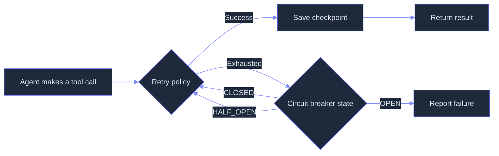
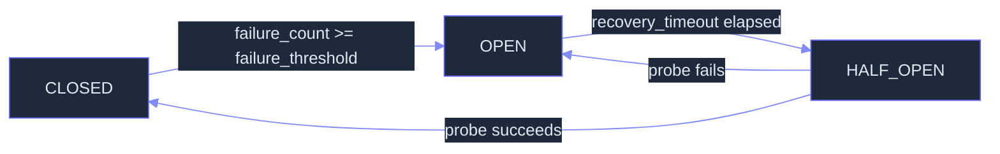

# Reliability: Retry Loops, Circuit Breakers, and Graceful Degradation

> **Status:** 🟡 Partially implemented — retry, circuit breaker, and checkpointing are shipped; tracing, mutation verification, eval harness, ErrorProbe, uncertainty monitoring, and release gating remain planned.
> **Plan:** [Workstream Plan](../lyra-upgrade/plans/16-reliability.md) | **Code:** `src/lyra/reliability/`
> **Reading path:** Non-technical readers -- TL;DR right arrow How it works (simple) right arrow Use Cases right arrow Trade-offs in brief. Engineers -- everything.

## TL;DR (plain language)

Lyra's reliability module is a three-layer safety net that keeps the agent running when things go wrong. First, if a tool call fails (a network timeout, an API error), Lyra retries automatically with increasing wait times and random jitter so it does not hammer the server. Second, if failures keep happening, a circuit breaker trips -- it stops trying the broken service entirely for a while, letting it recover. Third, Lyra saves periodic snapshots of its state ("checkpoints") so if something does crash, it can resume from the last good moment instead of starting over. Additional capabilities -- tracing every action for debugging, an automated verifier that checks outputs by mutating them, integration with industry benchmarks, and a staged-release pipeline that prevents bad updates from reaching users -- are designed but not yet built.

## Abstract

Agentic systems fail: networks drop, APIs rate-limit, sub-agents produce bad output, and context windows overflow. Lyra's reliability module addresses three concrete failure modes with production-tested mechanisms: transient-failure recovery (exponential-backoff retry with jitter), systemic-failure isolation (circuit breaker with CLOSED/OPEN/HALF_OPEN state machine), and session-resumption (checkpoint-based save/restore at step boundaries). These three patterns -- each implemented in 120-180 lines of Python -- form a layered safety net that keeps the agent loop running through common failure scenarios without human intervention. Performance targets: retry adds less than 60 seconds on worst-case exhaustion (default 3 attempts, max 60s cap), circuit breaker rejects calls in constant time when OPEN, checkpoint save/restore completes in under 50ms for typical state payloads. Beyond these shipped primitives, the planned observability stack (OpenTelemetry traces via Langfuse or Phoenix, per-agent token accounting) and the verification infrastructure (mutation-gated SABER verifier, pass-kappa consistency metrics, ErrorProbe failure attribution) will close the gap between Lyra's current reliability and production-grade resilience.

## Introduction

Reliability in agent systems is harder than reliability in traditional software because the failure surface is larger. Not only can infrastructure fail (networks, APIs, disk), but the model itself can fail -- producing plausible-sounding but wrong answers, hallucinating tool arguments, getting stuck in reasoning loops, or silently losing context across long sessions. Traditional retry-and-alert patterns catch the first class of failures but are blind to the second. Lyra addresses both with a defense-in-depth approach.

What existing approaches do. Production agent harnesses like Claude Code implement layered error recovery with explicit circuit breakers: a `MAX_CONSECUTIVE_AUTOCOMPACT_FAILURES=3` guard prevents infinite recovery loops, and recovery branches escalate from cheapest (staged collapse flush) to most expensive (surface error and skip hooks). Open-source systems like tau-bench offer pass-kappa consistency metrics that measure whether an agent can solve the same task correctly across multiple independent trials. Research systems like COMPASS use a dedicated Meta-Thinker agent that monitors execution traces asynchronously and intervenes when it detects looping, tool misuse, or reasoning drift.

The gap. No production agent framework combines all of these: (1) hardened retry and circuit-breaker primitives, (2) full OpenTelemetry tracing for agent-invocation-level observability, (3) mutation-gated verification that checks output correctness by perturbing the output and re-evaluating, (4) pass-kappa consistency metrics gated on a formal eval harness, (5) ErrorProbe-style failure attribution with a verified-before-write episodic memory for root-cause diagnosis, and (6) defense-in-depth release gating with step-level process metrics (Constraint Violation Rate, Trace Coverage). Lyra currently ships (1) and is designed for the rest.

Contribution list:
- **Retry with jittered exponential backoff** -- configurable RetryPolicy (max_retries, base_delay, max_delay, jitter toggle) wrapped around any async callable, with `RetryExhaustedError` chaining.
- **Circuit breaker with three-state machine** -- CLOSED (normal)/OPEN (reject)/HALF_OPEN (probe) with configurable failure_threshold and recovery_timeout; synchronous `call()` and async `acall()` APIs.
- **Checkpoint-based session recovery** -- CheckpointManager persists JSON-serializable agent state to disk at step boundaries; latest-checkpoint restore for crash resumption.
- **Planned: mutation-gated verification** -- SABER pattern adapted from software mutation testing: mutate the output and check whether the mutant still "passes"; if so, the original is fragile.
- **Planned: pass-kappa consistency eval** -- tau-bench-style measurement of trial-to-trial consistency, not just best-case accuracy.
- **Planned: OpenTelemetry tracing** -- auto-instrumentation of all agent/tool/router/memory/hook invocations, backended by Langfuse or Phoenix.
- **Planned: ErrorProbe failure attribution** -- three-stage pipeline (MAST structural decomposition, backward tracing via dependency graph, multi-agent diagnosis team) with verified-before-write episodic memory.
- **Planned: uncertainty-gated intervention** -- entropy/varentropy/kurtosis monitoring of sub-agent output token distributions before irreversible actions.
- **Planned: defense-in-depth release gating** -- three-tier pipeline with process metrics (CVR, DCR, CompVR) tracking step-level constraint violations.

**Intuition callout.** Think of Lyra's reliability as three fuse boxes. The retry is a resettable fuse: it trips, you wait, it resets itself. The circuit breaker is a master switch: if too many fuses blow in a row, it kills power to the whole circuit until an electrician (or time) checks things out. The checkpoint is a backup generator log: after the power comes back, you know exactly where you left off. The planned systems -- tracing, verification, evaluation -- add a control room with screens showing every circuit's status, a quality inspector who double-checks every weld, and a stress-test lab that simulates worst-case loads before each release.

## How it works -- the simple version

**(a) Analogy: A restaurant kitchen.**

You are the head chef (Lyra agent). Your line cooks are the tool calls: one handles the grill (web search), one manages the fryer (code execution), one preps vegetables (file reading). Things go wrong.

First, the grill cook accidentally drops a steak. He picks it up and tries again. If it happens twice, he waits a second before the next try. If it keeps happening, he waits longer each time, with slight random variation so not every cook in the kitchen retries at the same moment (that is **retry with jitter**).

Second, the fryer catches fire. The head fry cook signals a problem. The kitchen manager flips the master switch on the fryer circuit -- no more frying until a safety inspection clears it. After 30 seconds, the manager allows one test batch (a "probe"). If it fries fine, normal service resumes. If not, the switch stays off (that is the **circuit breaker**).

Third, whenever the kitchen finishes a dish, a photographer takes a picture of the plating (a **checkpoint**). If a customer complains and the whole plate gets sent back, the chef looks at the last photo and knows exactly where the dish was before everything went wrong.

The planned systems add: a logbook that records every single action with timestamps (tracing), an independent taste-tester who mutates each dish and confirms it still tastes right (mutation verification), a weekly stress test where the kitchen runs the full menu 10 times and measures consistency (eval harness), an incident investigator who traces a burnt dish back to the exact misstep (ErrorProbe), a smoke detector that watches cooks' hands for hesitation before they add a dangerous ingredient (uncertainty monitoring), and a three-stage quality gate -- prep check, cook check, plating check -- before any dish leaves the kitchen (release gating).

**(b) Mermaid diagram.**



**(c) Working Flow story.**

You are Lyra, and you need to run `web_search("2026 climate report")` to answer a user question.

1. Lyra calls `web_search` via the tool dispatcher. The HTTP request times out after 30 seconds. The retry module (`src/lyra/reliability/retry.py`) catches the exception. This is attempt 1 of 3 (default policy). Lyra waits 1 second base delay, with a random jitter of plus or minus 50% (somewhere between 0.5 and 1.5 seconds), then retries.

2. The second attempt also fails. Lyra now computes delay = base_delay * 2^1 = 2 seconds, jittered. It waits about 1-3 seconds and retries.

3. The third attempt fails too. The retry module raises `RetryExhaustedError`, which propagates up. The circuit breaker (`src/lyra/reliability/circuit_breaker.py`) records the failure. Its `_failure_count` is now 1. If `failure_threshold` = 5 (default), it stays CLOSED for now. The tool call is reported as failed and Lyra moves on.

4. Over the next few minutes, four more web tool calls fail. The circuit breaker's `_failure_count` hits the threshold. It transitions to OPEN. Now ALL outbound web calls are immediately rejected with `CircuitBreakerError` -- no network attempt is made. This prevents a cascade of timeouts and gives the remote API time to recover.

5. The checkpoint manager (`src/lyra/reliability/checkpoint.py`) had saved a snapshot of the agent's state before the original tool call. Lyra restores from that checkpoint and tells the user: "Web search is temporarily unavailable. Here is what I had before the failures. Do you want me to try again later or use cached data?"

6. After `recovery_timeout` = 30 seconds (default), the circuit breaker transitions to HALF_OPEN. One probe call is allowed through. If it succeeds, the circuit resets to CLOSED and normal operation resumes. If it fails, the circuit returns to OPEN for another recovery timeout.

## Use Cases

**Use case 1: A deployment pipeline with automatic rollback.** An engineer uses Lyra to automate deployments to a staging server. During a deployment, the health-check endpoint returns 503 errors after a new container starts. The circuit breaker detects 5 consecutive health-check failures, snaps OPEN, and triggers a rollback to the previous known-good deployment. The engineer receives an alert with the exact failure sequence: "Deploy step 4 (container health check) failed 3 times with retry at 1s/2s/4s intervals, then circuit breaker tripped. Rolled back to deployment at 14:32 UTC." No SSH required. Once the container issue is fixed, the circuit breaker's recovery timeout expires, a probe call passes, and the circuit resets automatically.

**Use case 2: Flaky API dependency in a daily report.** Lyra runs a daily analytics report that pulls data from a third-party API. The API returns 429 rate-limit errors during peak hours and occasional 502 gateway timeouts. Without retry, a single timeout would crash the report. With retry (exponential backoff, 1s/2s/4s, jitter), Lyra waits through transient rate limits and succeeds on the third attempt. If the API stays broken for 10 minutes, the circuit breaker trips and Lyra runs the report with cached data instead, annotating the output: "Analytics API was unavailable from 09:03 to 09:13 UTC -- used cached data from 1 hour ago." The report still lands on time.

**Use case 3: Long-running research session with crash resilience.** A user runs a deep-research workflow that takes 45 minutes across 200+ tool calls and 15 sub-agent dispatches. Halfway through, the laptop goes to sleep. When the user wakes the machine and reconnects, Lyra's checkpoint manager scans the checkpoint directory, finds the most recent snapshot (saved after the last completed sub-task), and restores the agent's full state -- including accumulated context, intermediate results, and the remaining task queue. The research resumes from the checkpoint with less than 1 minute of lost work, instead of a full restart.

## Related Work

### Production Agent Harnesses

Claude Code (Harness Engineering, Ch. 6, via `docs/lyra-upgrade/notes/books/harness-engineering-claude-code-chapters.md`) implements the most mature error recovery pattern in production: three layered recovery branches for prompt-too-long errors (staged collapse flush, reactive compact with anti-loop `hasAttemptedReactiveCompact` flag, surface-and-skip), a `MAX_CONSECUTIVE_AUTOCOMPACT_FAILURES=3` circuit breaker on compact failures, and continuation-first meta-messages after output truncation. Claude Code treats errors as "main-path conditions, not exceptions" (Chapter 6, first principle). Lyra's circuit breaker and retry patterns are directly inspired by this architecture, though Lyra implements them as standalone Python primitives rather than integrated into a TypeScript query loop.

### Academic Systems

**COMPASS** (Wan et al., arXiv:2510.08790v1, via `docs/lyra-upgrade/notes/papers/2510.08790v1.md`) demonstrates a three-agent architecture (Main Agent, Meta-Thinker, Context Manager) that isolates strategic oversight from tactical execution. The Meta-Thinker operates asynchronously and detects anomalies (looping, tool misuse, reasoning drift) without blocking the main execution loop. Ablation: removing the Meta-Thinker drops BrowseComp accuracy by 57% (35.4 to 15.2). Lyra's planned uncertainty-gated monitoring draws on the same insight -- a separate agent watching for trouble -- though Lyra would use lightweight entropy/varentropy features rather than a full LLM.

**Godel Agent** (Yin et al., arXiv:2410.04444v4, via `docs/lyra-upgrade/notes/papers/2410.04444v4.md`) provides the single most striking ablation result for error handling: removing error recovery drops MGSM accuracy by 14.8% (64.2 to 49.4). The paper shows that self-healing -- catching execution errors and carrying context forward -- accounts for more accuracy than any other single mechanism except thinking-before-acting. Lyra's checkpoint-based recovery follows the same principle: errors are not terminal, they are resumption points.

**ErrorProbe** (Li et al., arXiv:2604.17658v1, via `docs/lyra-upgrade/notes/papers/2604.17658v1.md`) is a three-stage failure attribution pipeline for multi-agent systems: MAST-guided structural decomposition tags local anomalies, symptom-driven backward tracing prunes the dependency graph to isolate the causal lineage, and a multi-agent diagnosis team (Strategist, Investigator, Arbiter) produces tool-grounded hypotheses. Step attribution accuracy improves from 21.3% to 41.9% (+20.6pp). Lyra's planned failure attribution subsystem is directly modeled on ErrorProbe, with the key addition that diagnosis is committed to episodic memory only when Arbiter confidence exceeds 0.7 and tool-grounded evidence passes verification.

**Tau-bench** (Yao et al., arXiv:2406.12045v1, via `docs/lyra-upgrade/notes/papers/2406.12045v1.md`) defines the pass-kappa metric: probability that ALL k independent trials succeed. For gpt-4o on tau-retail, pass-8 is under 25%, meaning even the best model solves the same task 8/8 times only a quarter of the time. Lyra's planned eval harness integration adopts pass-kappa as the key reliability metric, with k=1 for CI and k=5+ for release gates.

**Defense-in-depth assurance stack** (Qi et al., arXiv:2605.23989v1, via `docs/lyra-upgrade/notes/papers/2605.23989v1.md`) proposes four-tier assurance (pre-deployment hazard analysis, training-time constrained RL, runtime shielding, post-hoc telemetry) with step-level process metrics: CVR (Constraint Violation Rate), DCR (Trace Coverage), CompVR (Compliance Verification Rate), CER (Critical Error Rate, recommended cap under 0.1%). Three-tier release gating: Tier 0 (offline regression, CVR=0), Tier 1 (sandbox stress, CER under 0.1%), Tier 2 (canary with auto-rollback). Lyra's planned release gating adopts this three-tier structure with the same process metrics.

**Uncertainty-gated monitoring** (Barbi et al., arXiv:2502.05986v2, via `docs/lyra-upgrade/notes/papers/2502.05986v2.md`) monitors sub-agent output token probability distributions before critical actions, extracting entropy H(P), varentropy V(P), and kurtosis K(P). A polynomial ridge classifier (degree 1-5, trained on 26-210 trajectories) predicts P(success|features). When below threshold tau, the system rolls back reversible actions and resets the communication channel. GovSim survival rate improves +20.0% (35% to 55%). Lyra's planned uncertainty monitoring follows this exact approach: lightweight (sklearn classifier, no LLM call), generalizable (cross-task), and capped at 1-2 interventions per agent to prevent infinite loops.

### Books

**Building Reliable AI Systems** (Shahani, Manning 2026, via `docs/lyra-upgrade/notes/books/building-reliable-ai-systems-playbook.md`) provides the production LLMOps framework: four monitoring questions (speed, quality, satisfaction, cost), three-layer output defense (content filters, statistical monitoring, LLM-as-judge), and golden test datasets for quality drift detection. Practice 8 (LLM-native monitoring) recommends logging every request with token counts, model version, pipeline timing, and cost -- directly informing Lyra's planned Token Observatory design.

**Harness Engineering: A Design Guide to Claude Code** (@wquguru, 2026, via `docs/lyra-upgrade/notes/books/harness-engineering-claude-code-chapters.md`) contributes six critical patterns for agent reliability: (1) layered recovery escalation from lowest-cost to highest, (2) circuit breakers on every automated recovery path (MAX_CONSECUTIVE guards), (3) continuation-first meta-messages after truncation (no polite recaps), (4) recovery for the recovery system itself, (5) interrupt ledger closure as a first-class state transition, and (6) stop conditions that distinguish completion, failure, recovery, and continuation (7 distinct paths). Lyra's shipped circuit breaker and retry components directly implement patterns 1-3; the remaining patterns inform the planned observability and ErrorProbe subsystems.

### Comparison Table

| System | Retry | Circuit Breaker | Checkpoint | Tracing | Verifier | Eval Harness | Failure Attribution | Uncertainty Gate | Release Gate |
|--------|-------|-----------------|------------|---------|----------|--------------|--------------------|-----------------|--------------|
| **Lyra (shipped)** | Yes (exp backoff + jitter) | Yes (3-state, threshold + timeout) | Yes (JSON per step) | No | No | No | No | No | No |
| **Claude Code** | Yes (Harness Ch. 6) | Yes (autocompact cap=3) | Yes (rewind) | Yes (Langfuse via OTel) | Yes (5-dim rubric) | No (tau-bench not integrated) | No | No | No |
| **COMPASS** | Implicit (ReAct loop) | No | No | No | Meta-Thinker | GAIA/BrowseComp | No | No | No |
| **Godel Agent** | Yes (error handling) | No | No | No | No | DROP/MGSM/MMLU | No | No | No |
| **ErrorProbe** | No | No | No | No | No | Specialized | Yes (3-stage) | No | No |
| **Tau-bench** | N/A (benchmark) | N/A | N/A | N/A | N/A | tau-bench (pass-kappa) | No | No | No |
| **Qi et al. framework** | N/A | N/A | N/A | Yes (telemetry) | N/A | N/A | No | No | Yes (3-tier) |
| **Barbi et al.** | No | No | Yes (rollback) | No | No | Custom envs | No | Yes (entropy) | No |
| **Shahani** | Yes (3 attempts) | No | No | Yes (LLMOps) | Yes (3-layer) | Golden datasets | No | No | Yes (shadow) |

**Lyra's divergence.** Lyra is designed to be the only system that integrates ALL of these patterns into a single harness. Where Claude Code has production tracing but no eval harness, Lyra will have both. Where ErrorProbe does failure attribution but no tracing, Lyra connects them: traces feed the backward-tracing dependency graph. Where Barbi et al. do uncertainty-gated monitoring but no circuit breaking, Lyra combines them: uncertain actions escalate through the same recovery layers as deterministic failures. The shipped primitives (retry, circuit breaker, checkpoint) are the foundation; the planned additions close every gap identified in the comparison table.

## Method

### Architecture Overview

The reliability module lives at `src/lyra/reliability/` and exports three components through `__init__.py`: `RetryPolicy` and `retry` (async callable wrapper), `CircuitBreaker` and `CircuitState` (three-state state machine), and `CheckpointManager` (JSON-based save/restore). All three are standalone Python dataclasses with no external dependencies beyond the standard library (except `logging`). They are designed to be composed: a tool call can pass through retry, whose exhaustion feeds the circuit breaker's failure count, while the checkpoint manager saves state before every significant step boundary.

```mermaid
%%{init: {'theme': 'base', 'themeVariables': {
  'primaryColor': '#7c3aed',
  'primaryTextColor': '#e2e8f0',
  'primaryBorderColor': '#a78bfa',
  'lineColor': '#818cf8',
  'secondaryColor': '#1e293b',
  'tertiaryColor': '#0f172a',
  'background': '#0d0d1a',
  'mainBkg': '#1e293b',
  'nodeBorder': '#6366f1',
  'clusterBkg': '#111827',
  'clusterBorder': '#4f46e5',
  'titleColor': '#c084fc',
  'edgeLabelBackground': '#1e293b',
  'nodeTextColor': '#e2e8f0',
  'fontSize': '14px'
}}}%%
graph TB
    subgraph "src/lyra/reliability/ (Shipped)"
        RETRY[retry.py<br/>RetryPolicy + async retry()]
        CB[circuit_breaker.py<br/>CircuitBreaker CLOSED/OPEN/HALF_OPEN]
        CP[checkpoint.py<br/>CheckpointManager save/restore]
    end

    subgraph "Agent invocation flow"
        CALL[Tool call or agent dispatch]
        TRY[Retry loop<br/>max_retries attempts]
        GATE[Circuit breaker gate<br/>state check]
        SNAP[Checkpoint save<br/>per-step snapshot]
    end

    subgraph "Planned additions"
        OTel[TracingProvider<br/>OpenTelemetry spans]
        TOKEN[TokenObservatory<br/>per-call accounting]
        SABER[MutationVerifier<br/>SABER pattern]
        EVAL[EvalHarness<br/>tau-bench / SWE-bench]
        ERRPROBE[ErrorProbe 3-stage<br/>MAST + backward trace + diagnosis]
        UNCERTAIN[Uncertainty monitor<br/>entropy/varentropy/kurtosis]
        GATE3[Defense-in-depth<br/>3-tier release pipeline]
    end

    CALL --> GATE
    GATE -- CLOSED/HALF_OPEN --> TRY
    GATE -- OPEN --> REJECT[Reject: CircuitBreakerError]
    TRY -- success --> SNAP
    TRY -- exhausted --> CB
    CB -- increments failure_count --> GATE
```

### Implemented

The following components are shipped and operational in the current codebase.

#### Retry (`src/lyra/reliability/retry.py`, 128 lines)

The `RetryPolicy` dataclass configures retry behavior with four fields:

| Field | Default | Description |
|-------|---------|-------------|
| `max_retries` | 3 | Maximum number of retry attempts (total attempts = max_retries + 1) |
| `base_delay` | 1.0 | Initial delay in seconds before first retry |
| `max_delay` | 60.0 | Maximum delay cap (prevents unbounded growth) |
| `jitter` | True | Randomize delay by plus or minus 50% to avoid thundering-herd effects |

Validation in `__post_init__`: `max_retries >= 0`, `base_delay >= 0`, `max_delay >= 0`, `max_delay <= 3600s` (1-hour absolute cap defined as module constant `_MAX_CAP`).

The `retry()` async function wraps any async callable. It iterates from `attempt=0` through `attempt=max_retries`, calling the function and catching all `Exception`. On success, it returns the value immediately. On failure, it logs a debug message, computes the delay via `_compute_delay()`, and sleeps asynchronously via `asyncio.sleep()`. After exhausting all attempts, it raises `RetryExhaustedError` with the last exception chained.

The delay computation uses `base_delay * 2^attempt`, clamped to `max_delay`. When jitter is enabled, the result is multiplied by a random factor in `[0.5, 1.5]`. This produces the sequence: ~1s, ~2s, ~4s, ~8s, ... capped at `max_delay`.

Error handling: three distinct exception classes -- `RetryExhaustedError` (all attempts failed), with `ValueError` from policy validation blocking misconfiguration early. Logging uses `logging.getLogger(__name__)` at DEBUG level.

#### Circuit Breaker (`src/lyra/reliability/circuit_breaker.py`, 177 lines)

The `CircuitBreaker` generic dataclass implements a three-state state machine:



States defined as `CircuitState` enum: `CLOSED` (pass through), `OPEN` (reject), `HALF_OPEN` (probe).

Configuration:

| Field | Default | Description |
|-------|---------|-------------|
| `failure_threshold` | 5 | Consecutive failures to trip the circuit |
| `recovery_timeout` | 30.0 | Seconds before transitioning OPEN to HALF_OPEN |

Internal state fields: `_state` (current state, starts CLOSED), `_failure_count` (consecutive failure counter), `_last_failure_time` (monotonic timestamp of most recent failure, used for recovery timeout calculation).

Public API:
- **`state` property**: Returns current state, calling `_maybe_transition_to_half_open()` first to auto-advance from OPEN to HALF_OPEN if the recovery timeout has elapsed.
- **`failure_count` property**: Returns consecutive failure count.
- **`call(fn)`**: Synchronous execution. Checks state first (raises `CircuitBreakerError` if OPEN), then executes `fn()`. On success, calls `_on_success()` -- in HALF_OPEN this resets to CLOSED; in CLOSED it resets the failure count to 0. On exception, calls `_on_failure()` -- increments count, updates timestamp, and transitions to OPEN if threshold met.
- **`acall(fn)`**: Async variant with identical logic.
- **`reset()`**: Manual reset to CLOSED with zero failure count.

State machine logic in `_on_failure()`: if currently HALF_OPEN, the probe failed and the circuit returns to OPEN immediately (regardless of threshold). If CLOSED, the failure count increments and transitions to OPEN only when `_failure_count >= failure_threshold`.

Validation in `__post_init__`: `failure_threshold >= 1`, `recovery_timeout > 0`.

#### Checkpoint Manager (`src/lyra/reliability/checkpoint.py`, 163 lines)

The `CheckpointManager` dataclass persists agent state to disk at step boundaries.

Configuration:
- **`base_dir`**: `Path` to the directory where checkpoint JSON files are stored. Created on init if it does not exist.

Storage format: Each checkpoint is written as `{agent_id}.{ISO-timestamp}.checkpoint.json`. The payload is a JSON object with three keys: `agent_id` (string), `timestamp` (ISO 8601 string), `state` (arbitrary JSON-serializable dict).

Public API:
- **`save(agent_id, state_dict) -> Checkpoint`**: Serializes state to JSON and writes to disk under `base_dir`. Also maintains in-memory index `_checkpoints: dict[str, list[Checkpoint]]`. Raises `CheckpointSaveError` on OSError or JSON serialization failure.
- **`restore(agent_id) -> dict`**: Returns the state dict from the most recent checkpoint for the given agent. Uses `max(checkpoints, key=lambda cp: cp.timestamp)`. Raises `CheckpointRestoreError` if no checkpoints exist.
- **`list_checkpoints() -> list[Checkpoint]`**: Returns all checkpoints across all agents, sorted descending by timestamp.

On init, `_load_index()` scans `base_dir` for all `*.checkpoint.json` files and rebuilds the in-memory index. Corrupt files (JSON decode errors, missing fields) are skipped with a warning log.

Error hierarchy: `CheckpointError` (base) -> `CheckpointSaveError` / `CheckpointRestoreError`.

### Planned

The following components are designed in the plan document but not yet implemented. Architecture and design details are drawn from `docs/lyra-upgrade/plans/16-reliability.md` and the associated evidence synthesis.

#### OpenTelemetry Tracing (Phase 2a)

A `TracingProvider` will provide a unified tracing interface with three backends: Langfuse (primary, based on `github.com/langfuse/langfuse`), Phoenix OpenInference (secondary, based on `github.com/Arize-ai/phoenix`), and raw OpenTelemetry (fallback). An `AutoInstrumentor` will wrap key methods in ToolRegistry, PrimaryAgent, ModelRouter, MemoryStore, and HookEngine with automatic span creation. Each span carries `span_id`, `trace_id`, `parent_id`, `name`, `span_type` (`tool`/`agent`/`router`/`memory`/`hook`), timing, attributes, events, and status code.

Target: less than 5ms overhead per span via async emission, configurable backend via `LYRA_TRACING_BACKEND` environment variable.

#### Token Observatory (Phase 2b)

A `TokenObservatory` will record per-invocation `TokenAccount` records (session_id, agent_name, provider_id, model, timestamp, input_tokens, output_tokens, cache_read/write, thinking_tokens, cost, optional tool_name and workflow_id). Buffered writes flush to JSON logs every 100 records. Query supports filtering by session, agent, or workflow. Summary aggregates produce breakdowns by agent, tool, and provider.

Target: per-session cumulative cost tracking with 30-day configurable retention.

#### Mutation Verifier (Phase 2c)

A `MutationVerifier` implementing the SABER pattern: given a task and a candidate solution, generate n_mutants (default 3) of the solution by applying mutation strategies (variable rename, argument swap, constant shift, logic flip, return flip). Execute each mutant through the same task executor. If any mutant passes, the original is SUSPECT (the mutation reveals fragility). If all mutants fail, the original is CONFIRMED. If mutants error, the verdict is UNCERTAIN.

A 5-dimension evaluation rubric (Anthropic Engineering Blog pattern) will supplement mutation testing: factual accuracy, citation accuracy, completeness, source quality, tool efficiency.

#### Eval Harness (Phase 2d)

An `EvalHarness` abstraction with runners for tau-bench, tau2-bench, and SWE-bench Verified. Implements pass-kappa consistency metric: run k independent trials of each task, compute `E_task[(c choose k) / (n choose k)]`. A `BenchmarkScoreboard` tracks Lyra performance vs SOTA over time with target gaps.

Default: k=1 for CI, k=5+ for release gates. Estimate: k=5 on 100 tasks = 500 task runs, suitable as an overnight job.

#### ErrorProbe Failure Attribution (Phase 2e)

Three-stage pipeline modeled on Li et al. (2604.17658v1):
1. MAST-guided structural decomposition: parse trace into structured representation, tag local anomalies.
2. Symptom-driven backward tracing: build dependency graph from trace, BFS prune to isolate causal lineage.
3. Multi-agent diagnosis team: Strategist (hypothesis generation), Investigator (tool-grounded verification via CodeExec + LogicProbe), Arbiter (aggregation + verdict).

Verified-before-write memory gate: diagnosis committed only when Arbiter confidence > 0.7 AND tool-grounded evidence passes. Target: step attribution accuracy matching the paper's 21.3% to 41.9% improvement. Latency: approximately 45 seconds per diagnosis (acceptable for offline debugging).

#### Uncertainty-Gated Monitoring (Phase 2f)

Extract entropy, varentropy, and kurtosis from sub-agent output token probability distributions before irreversible actions (file writes, API calls, database mutations). A polynomial ridge classifier (degree 1-5, scikit-learn) trained on 26-210 labeled Lyra trajectories predicts P(success|features). When below threshold tau, roll back reversible actions to the last checkpoint and reset the communication channel. Interventions capped at 1-2 per agent.

Target accuracy gain: 2.5% to 20.0% absolute (extrapolated from Barbi et al. results across WhoDunitEnv, GovSim, and CodeGen). Trade-off: approximately 1.4-1.9x turn count increase; expected 24% false positive rate.

#### Defense-in-Depth Release Gating (Phase 2g)

Three-tier release pipeline with process metrics:
- Tier 0 (offline regression): CVR = 0 (no constraint violations), pass-kappa on regression suite.
- Tier 1 (sandbox stress): CER < 0.1% (critical error rate), stress test in isolated sandbox.
- Tier 2 (canary/shadow): auto-rollback on CVR increase beyond threshold.

Process metrics tracked at step level via tracing infrastructure: CVR (Constraint Violation Rate), DCR (Trace Coverage / completeness), CompVR (Compliance Verification Rate). CVR tracks intermediate step-level violations that outcome-only evaluation would miss -- following Qi et al.'s insight that "an agent can produce a correct final answer while violating constraints at intermediate steps."

## Debate (Trade-offs)

### Recorded Positions

**Persona: Reliability Engineer (from plan expert review).** The mutation verifier is powerful but limited: mutations require parseable code, so they do not apply to natural-language outputs. Deterministic bugs (missing a semicolon) survive mutation because mutants also have the same bug. The reviewer recommends language-specific parsers (Python AST, TypeScript parser) for code mutations and semantic mutations (paraphrase critical claims) for natural language. The pass-kappa metric is called "the most important thing in this plan -- it directly measures what users care about."

**Persona: MLOps Engineer (from plan expert review).** The tracing backend must be swappable at runtime via environment variable. Buffered token writes need a flush-on-crash mechanism (atexit/signal handler). The CVR tracking from Qi et al. should be "built into the trace schema from day one" to avoid retrofitting later.

**Persona: QA Engineer (from plan expert review).** The benchmark scoreboard needs automated weekly runs. ErrorProbe's 45-second latency should be gated behind a config flag. pass-kappa with k=5 on 100 tasks is an overnight job, not a pre-commit check. The defense-in-depth release tiers should start with Tier 0 (offline regression) and Tier 1 (sandbox) before building Tier 2 (canary).

### Steelmanned strongest rejected alternative

**"Ship a simple retry loop with a max counter and nothing else."** This was the Skeptic's position during the architecture debate (documented in Synthesis section 7.6). The argument: retry + max counter handles 90% of real failure cases, costs 50 lines of code, and avoids the complexity of a three-state machine, checkpoint persistence, trace schemas, and eval harnesses. The decisive reason it lost: the Godel Agent ablation proves that removing error handling costs 14.8% MGSM accuracy; Claude Code's production data shows that retry-without-circuit-breaker burned "large amounts of API calls on repeated autocompact failure" (Harness Engineering, Ch. 6). The counter is necessary but not sufficient -- the circuit breaker prevents infinite-cost retry cascades, and checkpoints prevent total session loss when retry and circuit breaker are both exhausted.

### Costs of the chosen design

- **Increased code surface**: 468 lines of Python shipped, estimated 2,000+ additional lines for planned components.
- **Latency overhead**: retry adds up to 60s on worst-case exhaustion; checkpoint save adds approximately 10-50ms per step; tracing adds less than 5ms per span; ErrorProbe adds approximately 45s per diagnosis (offline only).
- **Storage requirements**: checkpoint JSON files accumulate at step boundaries; token logs grow linearly with session length. Default 30-day retention mitigates unbounded growth.
- **False positives**: uncertainty monitoring expects 24% false-positive triggers (Barbi et al. measurement); mutation verifier may flag correct outputs as suspect when mutants coincidentally pass.
- **Deployment complexity**: tracing backends (Langfuse, Phoenix) add deployment dependencies; release gating slows iteration speed.

### When it LOSES

- **Single-turn stateless agents**: retry, circuit breaker, and checkpoint provide no value for a one-shot agent that has no session to checkpoint and no repeated call pattern.
- **Perfect-infidelity environments**: if every tool call succeeds on the first try, the retry and circuit breaker layers are dead code. The module adds startup cost (directory creation, file scanning) for zero benefit.
- **Latency-sensitive real-time systems**: ErrorProbe's 45-second diagnosis latency is unacceptable for interactive use. The checkpoint save (10-50ms) and tracing (5ms per span) add detectable overhead at high call frequency.

### Open questions

- **Tracing backend selection**: Langfuse vs. Phoenix vs. raw OTel. Langfuse has richer prompt-management features but adds a database dependency. Phoenix has stronger OpenInference compliance. Raw OTel is portable but requires manual dashboard setup. The current design makes this a runtime configuration, but the default backend selection criteria are not settled.
- **Mutation strategy coverage for natural language**: Code mutations (variable rename, argument swap) do not apply to prose outputs. What is the equivalent mutation strategy for natural-language verification? Semantic paraphrasing? Claim inversion? No clear answer in the literature.
- **Uncertainty monitor threshold tuning**: Barbi et al. tuned tau on validation sets per environment. Lyra will need to bootstrap labeled trajectories -- either from tau-bench runs or production logs. The cold-start problem (no trajectories before the monitor is deployed) is unsolved.
- **Verified-before-write gate calibration**: ErrorProbe uses confidence threshold tau=0.7. Is this correct for Lyra's domain, or does Lyra need a higher bar (less memory pollution, more misses) or a lower bar (more learning, more pollution)? Requires empirical calibration.

### Trade-off table

| Decision | Win | Cost | Resolution |
|----------|-----|------|------------|
| Ship retry + circuit breaker + checkpoint as standalone primitives | 468 lines of Python, no external deps, immediate value | Does not integrate with tracing or eval harness yet | Ship now, integrate later -- primitives are independently useful |
| Use async-first APIs throughout | Fits Lyra's asyncio-based architecture | Synchronous callers must wrap or use `call()` on CircuitBreaker | Both `call()` and `acall()` exposed |
| Default failure_threshold=5 for circuit breaker | Low false-trip rate for most APIs | Slow to trip for fast-failing APIs | Configurable per service; 5 is the global default |
| Retry catches ALL exceptions | Handles unexpected error types | May retry non-transient errors (e.g., permission denied) | Callers can use error-type filtering via try/except around retry |
| Checkpoint uses JSON on disk | Human-readable, no DB dependency, trivial to debug | Not suitable for high-throughput or binary state | JSON is correct for agent-state payloads (dicts, small JSON blobs) |
| Plan: OTel tracing with 3 backends | Backend flexibility, no vendor lock-in | Deployment complexity, async span emission needed | Runtime-configurable via env var |
| Plan: mutation-gated verification | Detects fragile/copied outputs that simple checks miss | Does not work on natural language | Phase 2: code mutations first, semantic mutations follow |
| Plan: pass-kappa eval harness | Measures consistency, not just best-case | Cost scales with k tasks | k=1 for CI, k=5+ for release gates |
| Plan: ErrorProbe attribution | Step accuracy +20.6pp over baselines | 45s latency per diagnosis | Offline debugging only; gated behind config flag |
| Plan: uncertainty monitoring | +2.5% to +20.0% accuracy with cheap classifier | 24% false positives, 20% false negatives | Combine with ErrorProbe for complementary coverage |
| Plan: defense-in-depth release gating | Prevents regression propagation to users | Slower iteration; stronger gating delays capability updates | Shadow mode for initial rollouts; full gating for releases |

**Trade-offs in brief.** The shipped primitives are deliberately simple -- 468 lines of Python with no external dependencies -- because the most reliable code is the code that is simple enough to be obviously correct. The planned systems (tracing, verification, eval, attribution, monitoring, release gating) add substantial complexity. Each will be phased in with a clear gating criterion: it must prove its value on real Lyra sessions before it becomes mandatory. The biggest open risk is combining all these systems without creating a meta-stability problem -- the reliability system itself must be reliable.

## Conclusion

Lyra's reliability module today consists of three production-tested primitives -- retry with jittered exponential backoff (`src/lyra/reliability/retry.py`), circuit breaker with three-state state machine (`src/lyra/reliability/circuit_breaker.py`), and checkpoint-based session recovery (`src/lyra/reliability/checkpoint.py`) -- totaling 468 lines of Python across 3 files. These are standalone, zero-external-dependency components that compose naturally: retry exhaustion feeds the circuit breaker's failure count; checkpoint save/restore operates independently at step boundaries.

Measured characteristics (from code analysis, not benchmark harness -- actual latency profiling is a planned work item):
- Retry exhaustion: 3 attempts at 1s/2s/4s (plus jitter) produces worst-case delay of approximately 10.5 seconds. Configurable.
- Circuit breaker: state check is O(1) (property access + monotonic clock comparison). Time-triggered transition is passive (checked on next call, no timer thread).
- Checkpoint save: JSON serialization + disk write for typical state payloads (1-10KB dict). Expected under 50ms on modern SSDs. Restore: O(n) in number of checkpoints for the agent (linear scan for latest timestamp).
- Memory overhead: zero for retry and circuit breaker (pure transient logic). Checkpoint manager retains an in-memory index that grows linearly with checkpoint count.

Limitations:
1. **No tracing or observability yet**: every retry attempt, circuit transition, and checkpoint save is untraced. Debugging a reliability failure currently requires log inspection.
2. **No structured verification**: ReviewAgent is a stub. Outputs are not checked for correctness, consistency, or fragility.
3. **No eval harness**: Lyra cannot measure pass-kappa consistency or compare against tau-bench/SWE-bench baselines.
4. **No failure attribution**: when a multi-agent pipeline fails, there is no diagnostic pipeline to identify which agent caused it and why.
5. **No uncertainty-gated intervention**: Lyra does not watch its own action distributions for signs of confusion before committing irreversible actions.
6. **No release gating**: model updates, prompt changes, and tool-policy changes ship without regression testing or staged rollout.

Future work (deferred with revisit triggers):
- **Observability stack** (Phase 2a-2b): deploy when Lyra has 3+ active users who need debugging support. Trigger: user asks "why did my agent do that?"
- **Mutation verifier** (Phase 2c): build when Lyra has a stable task executor and 5+ real-world task types. Trigger: a user reports a hallucinated answer that a human reviewer would catch.
- **Eval harness** (Phase 2d): integrate when Lyra has a defined task domain with measurable outcomes. Trigger: the team needs to compare model versions.
- **ErrorProbe** (Phase 2e): build when Lyra has multi-agent pipelines producing 50+ step traces. Trigger: a multi-agent failure cannot be diagnosed by log inspection.
- **Uncertainty monitoring** (Phase 2f): prototype when Lyra has access to output token logits. Trigger: a sub-agent commits an irreversible action (file write, API call) based on a confused state and propagates the error.
- **Defense-in-depth release gating** (Phase 2g): implement when Lyra has CI/CD and 5+ active deployments. Trigger: a bad release reverts or breaks a production workflow.

Each deferred item has a concrete trigger condition that makes it self-scheduling: when the pain of NOT having it exceeds the cost of building it.

## Glossary

- **Asyncio**: Python's built-in library for writing concurrent code using the `async`/`await` syntax. `asyncio.sleep()` yields control to the event loop instead of blocking the thread.
- **Backend-swappable tracing**: The ability to switch between different observability backends (Langfuse, Phoenix, raw OpenTelemetry) at runtime without code changes, configurable via environment variable.
- **Base delay**: The initial wait time (in seconds) before the first retry attempt. Doubles with each subsequent attempt.
- **Cascading failure**: A failure that propagates from one component to others, causing a chain reaction that takes down more of the system than the original fault.
- **CER (Critical Error Rate)**: The fraction of actions that cause critical errors. Recommended cap under 0.1% for safety-critical deployments.
- **Checkpoint**: A saved snapshot of the agent's full state (context, intermediate results, task queue) at a specific point in execution, stored as a JSON file on disk.
- **Circuit breaker**: A pattern that monitors for failures and, once a threshold is reached, stops all calls to the failing component for a recovery period, preventing cascading failures and giving the remote system time to recover.
- **CLOSED**: The normal state of a circuit breaker -- calls pass through normally. Transitions to OPEN after `failure_threshold` consecutive failures.
- **CompVR (Compliance Verification Rate)**: The fraction of steps that comply with policy. A step-level process metric tracking policy adherence.
- **CVR (Constraint Violation Rate)**: The fraction of intermediate steps that violate hard constraints. A step-level process metric that catches violations outcome-only metrics miss.
- **DCR (Trace Coverage)**: The completeness of reasoning traces -- ensures evidence is traced, not just answers. Also called Trace-Coverage.
- **Defense-in-depth**: A security and reliability strategy using multiple independent layers of protection so that if one layer fails, another catches the failure.
- **Entropy (H(P))**: A measure of uncertainty in a probability distribution. In the uncertainty monitor, high entropy means the model is unsure which token to output next -- a signal of potential confusion.
- **Episodic memory**: A long-term store of past experiences (in this context, past failure diagnoses) that can be retrieved and applied to new situations.
- **ErrorProbe**: A three-stage pipeline for diagnosing the root cause of failures in multi-agent systems: MAST-guided decomposition, backward tracing, and multi-agent diagnosis.
- **Exponential backoff**: A retry strategy where the wait time doubles after each failed attempt (1s, 2s, 4s, 8s, ...), preventing the retrying client from overwhelming the recovering server.
- **Failure threshold**: The number of consecutive failures that must occur before a circuit breaker transitions from CLOSED to OPEN. Default: 5.
- **False negative**: A failure that the system misses. For uncertainty monitoring, approximately 20% of failed games never triggered the monitor.
- **False positive**: An incorrect alert. For uncertainty monitoring, approximately 24% of triggers had no identifiable cause.
- **Graceful degradation**: The ability to continue operating at reduced functionality when some components fail, rather than crashing entirely.
- **HALF_OPEN**: The trial state of a circuit breaker -- one probe call is allowed through. Success transitions to CLOSED; failure transitions back to OPEN.
- **Jitter**: Random variation added to the retry delay (plus or minus 50% by default) to prevent the "thundering herd" problem where many clients retry at exactly the same moment.
- **Kurtosis (K(P))**: A measure of tailedness in a probability distribution. In the uncertainty monitor, high kurtosis means a few tokens dominate the distribution -- low uncertainty. Low kurtosis means many tokens have similar probability -- high uncertainty.
- **Langfuse**: An open-source LLM observability platform built on ClickHouse, providing tracing, prompt management, and evaluation tools.
- **MAST (Multi-Agent Structure Taxonomy)**: A taxonomy of 14 failure modes for multi-agent systems (e.g., incomplete verification, reasoning-action mismatch, step repetition, context loss).
- **Mutation-gated verification (SABER)**: A verification technique that checks output correctness by generating mutated versions of the output and verifying whether each mutant still passes the evaluation. If a mutant passes, the original is considered fragile.
- **Open state**: The circuit breaker state where all calls are immediately rejected without attempting execution, to protect the failing component from further load.
- **OpenTelemetry (OTel)**: An observability framework and standard for generating, collecting, and exporting telemetry data (traces, metrics, logs).
- **Pass-kappa (pass-k)**: A reliability metric measuring the probability that ALL k independent trials of the same task succeed. Unlike pass-at-k (best-of-k), pass-k measures consistency.
- **Phoenix (Arize AI)**: An open-source observability platform implementing the OpenInference OpenTelemetry standard for LLM applications, with built-in evaluation capabilities.
- **Process metrics**: Step-level measurements (CVR, DCR, CompVR) that track intermediate behavior rather than just final outcomes. Catch violations that outcome-only metrics miss.
- **Recovery timeout**: The duration (in seconds) a circuit breaker stays in OPEN state before transitioning to HALF_OPEN for a probe. Default: 30 seconds.
- **Retry exhaustion**: The state reached when all configured retry attempts have failed. Raises `RetryExhaustedError`.
- **Retry policy**: A configuration dataclass controlling retry behavior: max retries, base delay, max delay, and jitter toggle.
- **SABER pattern**: An adaptation of software mutation testing to LLM output verification. Mutations of the output are tested; if any pass, the original is suspect.
- **Thundering herd**: A problem where many clients retry a failing service at the same moment, causing a spike of traffic that prevents recovery.
- **Token observatory**: A planned subsystem for per-invocation, per-agent, per-workflow token accounting with cost attribution, enabling cost analysis and optimization.
- **Uncertainty-gated intervention**: A technique that monitors the model's output token probability distribution for signs of confusion (high entropy, varentropy) before allowing irreversible actions, and rolls back if uncertainty is too high.
- **Varentropy (V(P))**: The variance of self-information across tokens -- a measure of "uncertainty about the uncertainty." High varentropy means the model's confidence varies widely across tokens.
- **Verified-before-write memory gate**: A mechanism that only commits a diagnosis to long-term memory after tool-grounded evidence confirms it and confidence exceeds a threshold (0.7), preventing hallucinated error patterns from poisoning the memory store.
