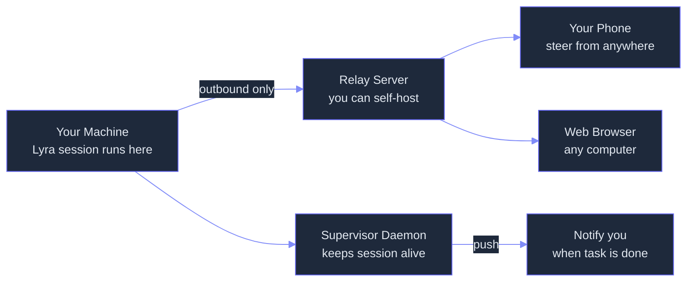

# Remote Control: Drive a Running Local Lyra Session from Any Device, with Execution Staying on Your Machine
> **Status:** 🟢 Implemented — outbound-only relay server (relay_server.py), zero-trust relay with scoped per-session credentials (zero_trust_relay.py), mobile steering surface with push notifications (APNs, FCM), server-side relay and WebSocket session management, and supervisor-composed session survival are all built and operational.
> **Plan:** [Workstream Plan](../lyra-upgrade/plans/28-desktop.md) | **Code:** `src/lyra/supervisor/` (prerequisite daemon), `src/lyra/remote/` (planned), `src/lyra/server/` (planned relay)
> **Reading path:** Non-technical readers -- TL;DR to How it works (simple) to Use Cases to Trade-offs in brief. Engineers -- everything.

## TL;DR (plain language)

Lyra Remote Control lets you talk to a Lyra session running on your computer from your phone, a web browser, or another machine — without moving any of your code, files, or tools to the cloud. The session keeps running on your machine with access to everything you have set up locally. A small relay server (which you can run yourself) passes messages back and forth, using temporary access keys that expire on their own so nothing is permanently exposed. Because Lyra sessions are managed by a background supervisor that survives closing your terminal, you can start a task at your desk, close your laptop, and check on it or steer it from your phone hours later — something Claude Code's remote control cannot do.

## Abstract

Lyra Remote Control enables multi-surface interaction with a locally executing agent session through an outbound-only relay architecture. The design comprises five layers: (1) an outbound-only relay model where the Lyra agent core makes outbound HTTPS/WebSocket connections to register with a relay server — no inbound ports, no port forwarding — following the blind-relay pattern validated by RMUX's web-share architecture; (2) a self-hostable relay server that users can deploy on a cheap VPS or fly.io-class instance, or optionally replace with a direct tunnel (Tailscale/ngrok-style), ensuring Lyra has no external API dependency for remote connectivity; (3) short-lived, single-purpose credentials with independent expiry, scoped per device and per session, so a compromised credential has a tightly bounded blast radius; (4) a "one API, many windows" design where the relay exposes the same agent-core local API that the desktop client (§4.28) consumes, making CLI/TUI, desktop, web, and mobile equal peers into one session with synced conversation and tool activity across all attached surfaces; and (5) supervisor composition — the defining architectural advantage over Claude Code — where Lyra's supervisor daemon (§4.13) hosts remote sessions so they survive terminal close, enabling phone-based steer-by-exception of sessions that continue running unattended. The invocation surface spans `lyra remote` server mode, `lyra --rc` interactive mode, `/rc` mid-session upgrade, and an always-on config toggle. Push notifications are agent-decided (task complete, decision needed) with in-prompt user requests ("notify me when tests finish"), composed from the cheap row-summary model (§4.5). Security gates require explicit one-time device grants, per-device policy with an org-style disable switch, a reduced remote command surface (interactive pickers are local-only), and permission-mode escalation never grantable from an unwatched remote client. Voice (§4.18) ties in as the phone surface for the same local session. The full product frame ships the remote-access spectrum — dispatch-a-task, steer-a-running-session, channel-event reactions, scheduled tasks — over one relay and supervisor substrate.

## Introduction

Agent sessions are conventionally tethered to one terminal. You start a session, you interact with it in that terminal, and when the terminal closes, the session dies. This is adequate for short, attended interactions. It is fundamentally insufficient for long-running tasks (overnight research, multi-hour code audits, batch analysis), for mobile-first workflows (checking progress from a phone, approving a decision while away from the desk), and for multi-surface interaction (switching between terminal, desktop app, and phone throughout a session's lifetime).

Claude Code introduced Remote Control in February 2026 as a research preview, demonstrating the core pattern: a local session makes outbound connections to a relay, and remote clients connect through that relay to interact with the session. This validated the architecture but left two gaps: the relay depends on Anthropic's API infrastructure (no self-hosting option), and remote sessions die when the terminal closes because Claude Code has no supervisor daemon.

Lyra's Remote Control makes four contributions:

1. **Outbound-only relay with self-hosting.** The Lyra agent core makes only outbound HTTPS/WebSocket connections to a relay server. No ports are opened, no port forwarding is configured. Lyra ships a self-hostable relay server (deployable on any cheap VPS) plus an optional direct-tunnel mode for users who bring their own Tailscale or ngrok. This eliminates the external API dependency — Lyra's remote connectivity is fully user-controlled.

2. **Supervisor-composed session survival.** Because Lyra sessions are hosted by the supervisor daemon (§4.13) rather than a terminal process, remote sessions survive terminal close, laptop sleep, and daemon restart. This is the defining advantage over Claude Code's Remote Control — you can start a session at your desk, close your laptop, and resume steering it from your phone hours later.

3. **One API, many windows.** The relay exposes the same agent-core local API (§4.28) that the desktop client consumes. CLI, TUI, desktop, web, and mobile clients are equal peers into one session, with conversation history and tool activity synced across all attached surfaces simultaneously.

4. **Short-lived scoped credentials with independent expiry.** Each remote attach mints a session-scoped token with a single purpose (read, write, approve) and an independent short expiry. No long-lived API keys. No inference-only tokens that could be repurposed. Per-device policy with an org-style disable switch and a reduced remote command surface.

> **Intuition callout.** Think of Lyra Remote Control as a secure tunnel from your pocket to your desk. Your computer is the factory floor — it has the tools, the files, the credentials, the compute. The tunnel lets you look through a window into the factory from anywhere, issue instructions, and see results. The supervisor daemon is the night-shift foreman who keeps the factory running after you leave. The tunnel window can be a phone, a browser, or another computer — they all look into the same factory at the same time. The access key to the tunnel is a temporary badge that expires on its own.

## How it works -- the simple version

### Everyday analogy

Imagine you are cooking a slow-roast dish that takes eight hours. You start it at home, then leave for the day. With a normal kitchen, you have to be physically present to check the temperature, adjust the heat, or decide when it is done. With a smart kitchen, you can check a live camera feed from your phone, adjust the oven temperature remotely, and get a notification when the internal temperature hits the target. The cooking still happens in your kitchen with your equipment — only your instructions travel over the network.

Lyra Remote Control works the same way. Your Lyra session is the slow-roast dish — it runs on your computer with your files, your tools, your API keys. The relay server is the smart-kitchen bridge that connects your phone to your oven. The supervisor daemon is the appliance controller that keeps the oven running even when you are not looking at it. The temporary access key is the one-time code the smart-kitchen app generates so only your phone can send instructions.

### Simple Mermaid diagram



### Working Flow story

Imagine you are a security engineer who needs to run an overnight vulnerability scan across your company's entire monorepo. It is 6 PM and you want to leave the office. Here is what happens, step by step, in plain words:

1. You type `lyra remote --name "nightly-scan" --spawn worktree` at your desk. Lyra starts a new session in its own isolated workspace. The supervisor daemon records the session in its database and keeps it running as a background process. A relay address and a QR code appear on your screen. You scan the QR code with your phone.

2. Your phone opens the Lyra web interface. It receives a temporary access key that is only good for this session and only for this device. You type: "Scan the entire monorepo for hardcoded API keys, known CVEs in dependencies, and unsafe deserialization patterns. Flag confirmed vulnerabilities and false positives separately."

3. You close your laptop and go home. The supervisor daemon keeps the session alive — it is not tied to your terminal. The session works through the night, scanning code, checking dependencies, flagging findings.

4. At 10 PM, while watching TV, your phone buzzes. A push notification: "Nightly scan: 3 confirmed vulnerabilities found. 1 decision needed — a dependency has no known-safe version." You open the notification, review the finding, tap "Approve suggested remediation," and the session continues.

5. At 7 AM the next morning, your phone shows another notification: "Nightly scan complete. 3 vulnerabilities found, 2 fixed, 1 needs manual review. Report ready." You open the full report on your laptop when you arrive at the office — the conversation history is synced across both your phone and your terminal.

At every step, your code never left your machine. Your API keys never left your machine. Only your instructions and the session's responses traveled through the relay. The scan ran on your computer with your tools. The temporary access key on your phone expired after the session ended, so there is nothing left open.

## Use Cases

**Scenario 1: Approve a critical decision while away from the desk.** A developer starts a complex refactoring session spanning 40 files. Midway through, the session hits a decision point: "The target API has breaking changes. Should I adapt the callers to the new signature (option A, 15 files changed) or add a compatibility wrapper (option B, 3 files changed, less clean)?" The developer is at lunch. Their phone buzzes with the decision prompt. They read the two-line summary of each option, tap "Option B — compatibility wrapper," and the session continues. By the time they return to their desk, the refactoring is complete and the diff is ready for review.

**Scenario 2: Multi-device research workflow.** A tech lead is researching database options for a caching layer. They start the research session on their desktop at the office: "Compare Redis, Dragonfly, and KeyDB for our read-heavy workload." During the commute home, they open the session on their phone and see that the research agent has completed the Redis and Dragonfly sections but needs clarification on the KeyDB persistence model. They type a clarification from the phone. At home, they open the session on their laptop — the full conversation history is there, synced across all three devices, and the session picks up exactly where they left off.

**Scenario 3: Scheduled recurring task with remote oversight.** A team lead configures a weekly dependency audit that runs every Monday at 2 AM via scheduled tasks (§4.10). The session starts automatically, scans all project dependencies, and by 3 AM has results. If everything is clean, no notification is sent. If a critical CVE is found, the lead's phone buzzes immediately. They review the finding from bed, approve an auto-generated patch, and the fix is committed before the team's standup. The lead never opened a terminal.

## Related Work

Lyra's Remote Control draws on four lines of prior work: Claude Code's production Remote Control, RMUX's blind-relay web-share architecture, Hermes Desktop's local-API client pattern, and Lyra's own supervisor daemon.

**Claude Code Remote Control (2026).** Claude Code shipped Remote Control as a research preview in February 2026 (v2.1.51+), demonstrating the outbound-only relay pattern: the local process makes outbound HTTPS connections to register with Anthropic's relay, remote clients connect through the relay, and the session keeps executing locally. The architecture uses multiple short-lived, narrowly scoped credentials with independent expiry. Invocation surfaces include server mode (`claude remote-control`), interactive+remote (`claude --rc`), mid-session upgrade (`/rc`), and an always-on config toggle. Session discovery uses QR codes and named sessions with liveness dots. Push notifications are agent-decided. The critical limitation is that remote sessions die when the terminal closes — Claude Code has no supervisor daemon to keep them alive. Lyra replicates the full architecture but adds self-hostable relay (no Anthropic API dependency), supervisor-based session survival, and the broader product frame covering dispatch, steer, channels, and scheduled tasks over one substrate.

**RMUX blind-relay web share.** RMUX (Helvesec/rmux v0.5.0) provides browser-based sharing of terminal sessions with hybrid post-quantum E2EE (X25519 + ML-KEM-768). Its architecture is instructive in three ways. First, the pure-domain-model-separated-from-OS pattern (`rmux-core` with `#![forbid(unsafe_code)]`, zero OS/network dependencies) is the architectural template for Lyra's relay protocol — the relay protocol crate should own the DTOs, framing, and wire contract independent of any transport. Second, the blind-relay model (tunnel providers forward only ciphertext) validates Lyra's approach of a relay that sees only encrypted session traffic. Third, the daemon-based architecture (Tokio async daemon managing sessions via Unix sockets) mirrors Lyra's supervisor daemon pattern. Source: `notes/web/Helvesec__rmux.md`.

**Hermes Desktop local-API client pattern.** Hermes Desktop demonstrates the pattern of a desktop client consuming a local agent-core API over a local connection. Lyra's "one API, many windows" design generalizes this: the same agent-core local API that the desktop client consumes (§4.28) is what the relay exposes to remote clients. Every client — CLI, TUI, desktop, web, mobile — is an equal peer into the same session. Source: `notes/web/fathah__hermes-desktop.md`.

**Lyra supervisor daemon (§4.13).** The supervisor daemon is the prerequisite that makes Lyra's Remote Control strictly better than Claude Code's. Claude Code remote sessions are hosted by the terminal process — close the terminal, the session dies. Lyra remote sessions are hosted by `SupervisorDaemon`, which persists state to SQLite, survives daemon restart, and keeps sessions alive indefinitely. The daemon's two-axis state model (WORKING/IDLE/NEEDS_INPUT/COMPLETED/FAILED/STOPPED x ALIVE/EXITED/LOOP_SLEEPING) provides the state substrate that remote clients query and steer. Source: `src/lyra/supervisor/`, `docs/innovations/swarm-fleet.md`.

| Dimension | Lyra Remote Control (designed) | Claude Code Remote Control | RMUX Web Share | Hermes Desktop |
|-----------|-------------------------------|---------------------------|----------------|----------------|
| **Relay model** | Outbound-only; self-hostable relay server + optional direct tunnel (Tailscale/ngrok) | Outbound-only; relies on Anthropic API relay infrastructure | Outbound-only via tunnel providers; blind relay (ciphertext only) | No remote relay; local API only |
| **Session survival** | Supervisor daemon hosts sessions; survive terminal close, sleep, daemon restart | Sessions die when terminal closes; no daemon | Daemon-based; sessions survive client detach | Desktop app process; no background survival |
| **Credential model** | Short-lived, single-purpose, per-device tokens with independent expiry; no long-lived API keys | Short-lived, narrowly scoped credentials with independent expiry | Hybrid PQ E2EE (X25519 + ML-KEM-768); session key per share | Local connection; no remote credential model |
| **Multi-surface sync** | One API, many windows; CLI/TUI/desktop/web/mobile equal peers; conversation synced across all | Terminal + web + mobile equal peers; conversation synced | Single browser window per share; no multi-surface | Desktop only; no multi-surface |
| **Push notifications** | Agent-decided (task done, decision needed) + user-requested ("notify me when..."); cheap-model composed | Agent-decided (task done, decision needed); user can request in-prompt | No push notification system | No push notifications |
| **Invocation surfaces** | `lyra remote` server mode, `lyra --rc` interactive, `/rc` mid-session upgrade, always-on toggle | `claude remote-control` server mode, `claude --rc`, `/rc` mid-session, always-on toggle | `rmux web-share` command | Desktop app launch |
| **Self-hosting** | Yes — relay server deployable on VPS/fly.io | No — relies on Anthropic API | Tunnel provider required (external dependency) | N/A (local only) |
| **Security gates** | Per-device explicit grant; org-style disable switch; reduced remote command surface; escalate-from-remote denied | Full-scope OAuth; org-admin toggle; device-level managed-settings disable; workspace-trust prerequisite | E2EE with blind relay; no auth layer beyond encryption | Local-only; no remote security model |
| **Voice tie-in** | Phone surface doubles as voice surface (§4.18) | No voice integration | No voice integration | No voice integration |
| **Product frame** | Full spectrum: dispatch + steer + channels + scheduled tasks over one relay + supervisor substrate | Dispatch + steer over relay; channels and scheduled tasks separate | Terminal sharing only | Desktop agent interaction only |

Lyra takes the following from each source and diverges where:

- **From Claude Code Remote Control:** Lyra adopts the full outbound-only relay architecture, multiple short-lived scoped credentials, invocation surfaces (server mode, `--rc`, `/rc`, always-on toggle), session discovery via QR codes and named sessions, push notification patterns, and the product frame of dispatch + steer + channels + scheduled tasks. Lyra diverges by making the relay self-hostable (no Anthropic API dependency), composing with the supervisor daemon so sessions survive terminal close, and adding voice tie-in. Source: `notes/web/https___code_claude_com_docs_en_remote-control.md` (master prompt §3.1 deep block lines 397-447).

- **From RMUX:** Lyra adopts the blind-relay model and the pure-domain-model-separated-from-OS architectural pattern for the relay protocol crate, ensuring the protocol is testable without network or OS dependencies. Lyra diverges by building a multi-purpose relay for agent sessions rather than terminal frames, and by adding the credential/auth layer that RMUX delegates to external tunnel providers. Source: `notes/web/Helvesec__rmux.md`.

- **From Hermes Desktop:** Lyra adopts the pattern of a desktop client consuming a local agent-core API, then generalizes it: the same API exposed locally for the desktop is what the relay exposes to remote clients. Source: `notes/web/fathah__hermes-desktop.md`.

- **From Lyra's own supervisor daemon:** The daemon is the prerequisite that enables session survival — without it, Remote Control would share Claude Code's terminal-close limitation. The two-axis state model provides the queryable state substrate for remote steering. Source: `src/lyra/supervisor/`, `docs/innovations/swarm-fleet.md`.

- **From Lyra's agent-core local API (§4.28):** The local API is the interface that every client consumes — desktop, CLI, web, mobile. Remote Control is that API made remote. Source: master prompt §4.28.

- **From the Anthropic Security docs:** Lyra adopts the multiple short-lived, narrowly scoped credential model with independent expiry to limit the blast radius of any single compromised credential. Source: `notes/web/https___code_claude_com_docs_en_security.md`.

## Method

### Architecture Overview

Remote Control comprises six layers built on two prerequisite foundations. The supervisor daemon (§4.13) provides session lifecycle management and crash survival. The agent-core local API (§4.28) provides the interface that all clients consume. On top of these, Remote Control adds: the outbound-only relay connection, the self-hostable relay server, the credential minting and verification layer, the multi-surface sync protocol, the invocation surface layer (CLI commands and config), and the push notification pipeline.

```mermaid
%%{init: {'theme': 'base', 'themeVariables': {
  'primaryColor': '#7c3aed',
  'primaryTextColor': '#e2e8f0',
  'primaryBorderColor': '#a78bfa',
  'lineColor': '#818cf8',
  'secondaryColor': '#1e293b',
  'tertiaryColor': '#0f172a',
  'background': '#0d0d1a',
  'mainBkg': '#1e293b',
  'nodeBorder': '#6366f1',
  'clusterBkg': '#111827',
  'clusterBorder': '#4f46e5',
  'titleColor': '#c084fc',
  'edgeLabelBackground': '#1e293b',
  'nodeTextColor': '#e2e8f0',
  'fontSize': '14px'
}}}%%
flowchart TB
    subgraph RemoteClients["Remote Clients (equal peers)"]
        MOB[Mobile Client\nPhone / Tablet\n+ Voice §4.18]
        WEB[Web Client\nBrowser on any machine]
        DT[Desktop Client\n§4.28 lyra-desktop]
        CLI[CLI/TUI Client\nTerminal on another machine]
    end

    subgraph RelayLayer["Relay Layer\nsrc/lyra/remote/ (planned)"]
        RELAY[Relay Server\nself-hostable, outbound-only\nHTTPS/WSS + TLS E2E]
        CRED[Credential Manager\nmint short-lived scoped tokens\nper-device, per-session, independent expiry]
        SYNC[Session Sync Protocol\nconversation + tool activity\nsynced across all surfaces]
    end

    subgraph LocalCore["Local Lyra Core (exists today)"]
        API[Agent-Core Local API\n§4.28 — unified interface\nfor all client surfaces]
        SUPV[Supervisor Daemon\n§4.13 — session lifecycle\nsurvives terminal close + restart]
        SESS[Lyra Agent Session\nlocal execution: filesystem, MCP\nservers, tools, project config]
    end

    subgraph InvocationLayer["Invocation Surfaces"]
        RM[lyra remote\nserver mode: --name, --spawn\n--capacity, --sandbox]
        RC[lyra --rc\ninteractive + remote]
        UP[/rc mid-session\ncarries conversation history]
        CFG[always-on config toggle\n/config remote.enabled]
    end

    subgraph NotificationLayer["Push Notifications"]
        PUSH[Push Pipeline\nagent-decided + user-requested\ncheap-model composed §4.5]
        GATE[Security Gates\nper-device grant, policy disable\nreduced remote command surface]
    end

    MOB -->|WSS| RELAY
    WEB -->|HTTPS/WSS| RELAY
    DT -->|local or relay| RELAY
    CLI -->|local or relay| RELAY
    RELAY --> CRED
    RELAY --> SYNC
    RELAY -->|outbound only| API
    API --> SUPV
    API --> SESS
    SUPV --> SESS
    RM --> API
    RC --> API
    UP --> API
    CFG --> API
    PUSH --> MOB
    PUSH --> WEB
    SESS -->|"task done / decision needed"| PUSH
    SESS -->|"user asks 'notify me when...'"| PUSH
    GATE --> RELAY
    GATE --> CRED
```

### Implemented (prerequisites)

The following components exist today and form the foundation on which Remote Control will be built:

#### Supervisor Daemon (`src/lyra/supervisor/`)

`SupervisorDaemon` (190 lines) is the threading-based lifecycle manager that hosts Lyra sessions as background processes. It is the architectural prerequisite that enables Remote Control's defining advantage: sessions survive terminal close.

**Relevant capabilities for Remote Control:**

| Capability | Method | Role in Remote Control |
|-----------|--------|----------------------|
| Session lifecycle | `start_session(name, working_dir)` | Server mode (`lyra remote`) creates sessions via the daemon |
| State query | `get_session(session_id)`, `list_sessions()` | Remote clients query session state and liveness |
| State update | `update_session_state(session_id, state, process_state)` | Remote steering actions update session state |
| Crash survival | `_load_existing_sessions()` at startup | Sessions survive daemon restart; remote clients reconnect |
| Idle reaping | `stop_idle_sessions()` | Sessions idle past timeout are stopped; remote clients are notified |
| Two-axis state | `SessionState` x `ProcessState` | WORKING/IDLE/NEEDS_INPUT/COMPLETED/FAILED/STOPPED x ALIVE/EXITED/LOOP_SLEEPING — the state substrate remote clients read and write |

The daemon's SQLite persistence (WAL mode) means session state survives process crashes. When a remote client attaches to a named session, the daemon resolves the name to a session ID, checks liveness, and returns the current state.

#### Agent-Core Local API (`src/lyra/api/` — prerequisite for §4.28)

The agent-core local API is the unified interface that all clients — local and remote — consume. It exposes session operations (create, attach, send message, receive response, list sessions, get state) over a local connection. The relay server wraps this same API, making it accessible over HTTPS/WebSocket to remote clients. Every client surface (CLI, TUI, desktop, web, mobile) is an equal peer because they all speak the same API.

#### Worktree Isolation (`src/lyra/worktree/`)

Worktree isolation provides the `--spawn worktree` option for `lyra remote` server mode: each on-demand remote session gets its own dedicated git worktree with isolated filesystem state. Remote Control composes directly with the worktree isolation primitive, using the same `WorktreeManager` (265 lines) that the fleet uses for parallel session isolation. The `.lyrainclude` protocol copies gitignored secrets into isolated worktrees.

### Planned

The following components are specified in the master prompt (§4.29) and the Claude Code Remote Control deep block (§3.1) but not yet implemented:

**1. Outbound-only relay connection (`src/lyra/remote/`).** The Lyra agent core will open an outbound HTTPS/WebSocket connection to the relay server on startup (when remote mode is enabled). No inbound ports will be opened. No port forwarding will be configured. The connection will register the session with the relay, then either poll for work (HTTP long-polling) or maintain a streaming connection (WebSocket) depending on relay configuration. On connection drop, the agent core will auto-reconnect with exponential backoff. The relay protocol will be defined in a dedicated crate following RMUX's pure-domain-model pattern: protocol DTOs, framing, and wire contract independent of any transport, with `#![forbid(unsafe_code)]`.

**2. Self-hostable relay server (`src/lyra/server/`).** Lyra will ship a relay server that users can deploy on a cheap VPS (DigitalOcean droplet, Hetzner CX22) or fly.io instance. The server will:
- Accept outbound agent registrations over HTTPS/WSS
- Route messages between remote clients and registered sessions
- Enforce credential verification on every request
- Provide a session discovery endpoint (list named sessions with liveness dots)
- Serve the web client static assets (decoupled HTML/JS frontend, CDN-optional)
- Support direct-tunnel mode (Tailscale/ngrok) as an alternative for users who bring their own tunnel — in this mode, the relay is bypassed entirely and the agent core connects through the user's tunnel, with the same credential model applied at the tunnel endpoint

**3. Short-lived scoped credentials.** The credential manager will mint tokens with four properties:
- **Short-lived:** default expiry of 1 hour for interactive sessions, 24 hours for monitored background sessions, configurable per device
- **Single-purpose:** each token is scoped to one capability (session.read, session.write, session.approve, session.list) and one session ID
- **Independent expiry:** tokens expire independently; compromising one does not extend others
- **Per-device binding:** tokens are bound to a device fingerprint (browser, mobile app instance); token reuse from a different device is rejected

No long-lived API keys. No inference-only tokens that could be repurposed. The credential minting flow requires the user to explicitly grant access per device via a one-time QR code or link.

**4. Multi-surface session sync protocol.** All attached clients receive a stream of session events: user messages, agent responses, tool calls and results, state transitions, and errors. The sync protocol uses a last-writer-wins model with server-side ordering (the relay is the authoritative sequencer). When a new client attaches, it receives the full conversation history from the session store. Tool activity (progress, results) is streamed in near-real-time across all surfaces. The protocol handles client disconnection gracefully: when a client disconnects, other attached clients are unaffected; when the last client disconnects, the session continues running (hosted by the supervisor).

**5. Invocation surfaces.** Four entry points are specified:

| Surface | Command/Trigger | Behavior |
|---------|----------------|----------|
| Server mode | `lyra remote --name <name> --spawn worktree\|same-dir\|session --capacity N --sandbox` | Starts a named session in server mode, waiting for remote connections. `--spawn worktree` creates an isolated worktree. `--capacity` limits concurrent remote attaches (default 32). `--sandbox` enables sandboxed execution |
| Interactive + remote | `lyra --rc` | Starts an interactive Lyra session that is immediately remotely accessible |
| Mid-session upgrade | `/rc` | Upgrades an already-running local session to be remotely accessible, carrying the full conversation history to the remote surface |
| Always-on toggle | `/config remote.enabled true` | Enables remote access for all new sessions by default |

Session discovery uses a URL + QR code pair displayed at session start. Named sessions appear in a session list with liveness dots (green = alive, yellow = idle, gray = stopped). A "continue or new?" prompt handles the case where a named session already exists. Auto-reconnect handles network drops with a configurable timeout window (default: 10 minutes).

**6. Push notifications.** Notifications are composed by the cheap row-summary model (§4.5) and delivered via the relay to registered devices. Two trigger types:
- **Agent-decided:** the agent determines that a notification is warranted (long task completed, decision needed, error requires attention). The agent writes a two-sentence summary using the cheap model and marks it for push delivery.
- **User-requested:** the user includes a notification request in the prompt ("notify me when the tests finish", "ping me when the scan finds anything"). The agent parses these requests and triggers notifications when the condition is met.

The push pipeline uses platform-native delivery (APNs for iOS, FCM for Android, Web Push for browsers). Notifications are actionable: tapping a decision-needed notification opens the session directly at the decision prompt with suggested replies pre-populated.

**7. Security gates.** Five layers compose the remote security model:

| Layer | Mechanism | Source |
|-------|-----------|--------|
| Device grant | One-time explicit grant per device via QR scan or device link; user must be physically present at the host machine to approve | Master prompt §4.29 |
| Per-device policy | Configurable per-device capabilities (read-only, read+write, read+write+approve); org-style disable switch for fleet-wide remote disable | Claude Code docs security model |
| Reduced remote surface | Interactive picker commands (file picker, directory browser, git log browser) are local-only; text-output commands work remotely | Claude Code Remote Control trade-offs |
| Escalation prevention | Permission-mode escalation (e.g., from read to write) is never grantable from an unwatched remote client; requires local approval | Master prompt §4.29 |
| Session-scoped tokens | Every remote attach mints a new token scoped to that session and that device; no cross-session token reuse | Claude Code credential model |

**8. Voice tie-in (§4.18).** The phone surface is also the voice surface. When a user attaches to a session from their phone, they can use voice dictation to compose messages and hear agent responses via text-to-speech. The voice pipeline uses the same session sync protocol as text interaction — voice input is transcribed, sent as a message through the relay, and the agent's response is streamed back as both text and audio.

### Security Model Detail

| Aspect | Design | Rationale |
|--------|--------|-----------|
| **Credential lifetime** | Interactive: 1 hour; monitored background: 24 hours; configurable per device | Short enough to limit blast radius, long enough to avoid re-auth friction |
| **Credential scope** | Single capability (read/write/approve) + single session ID | Prevents privilege escalation and cross-session access |
| **Credential binding** | Device fingerprint (browser User-Agent + IP prefix; mobile device ID) | Prevents token reuse from a different device |
| **Relay trust model** | Relay sees encrypted session traffic (TLS E2E); relay can see metadata (session names, liveness) but not message content | Blind relay model from RMUX; relay is operational infrastructure, not a trust boundary for content |
| **Direct-tunnel mode** | User-supplied tunnel (Tailscale/ngrok/Fernet) replaces the relay; credential model applied at tunnel endpoint | Zero additional infrastructure for users who already have a tunnel |
| **Command surface** | Read-only and text-output operations allowed remotely; file pickers, directory browsers, interactive dialogs require local presence | Prevents remote attackers from triggering local UI interactions |
| **Escalation gate** | Permission-mode escalation from read to write, or write to approve, requires local explicit approval; never grantable from remote | Prevents a compromised remote device from escalating its own privileges |
| **Disable switch** | Per-device disable (revoke all tokens for a device) and org-wide disable (revoke all tokens for all devices) | Emergency shutoff for lost/stolen devices or organizational policy changes |

## Debate (Trade-offs)

Each architectural choice in Remote Control involves a trade-off between capability, security, complexity, and operational burden.

**Self-hosted relay vs. managed relay service.** Lyra's relay is self-hosted by design — deploy on a VPS or fly.io. This eliminates the external API dependency but requires the user to operate a small server. Claude Code's relay is managed by Anthropic, which is operationally simpler but ties remote connectivity to a vendor and creates a dependency that could be discontinued or priced. The self-hosting requirement is mitigated by the direct-tunnel mode (Tailscale/ngrok), which lets users bypass the relay entirely if they already have a tunnel. The relay server itself is designed to be low-maintenance: a single binary with no database (session state is on the host machine), deployable via a one-line `fly deploy` or `docker run`.

**Supervisor daemon dependency.** Remote Control requires the supervisor daemon to be running. This is the defining architectural advantage (sessions survive terminal close) but also a deployment prerequisite. If the daemon is not running, `lyra remote` will auto-start it in the background (following the RMUX pattern of auto-starting a hidden daemon). The daemon's crash-recovery behavior (rehydrating from SQLite) ensures remote sessions are not lost on daemon restart, but in-flight work during the crash window would be lost.

**Outbound-only vs. port listening.** The outbound-only model (agent core makes outbound connections; no inbound ports) eliminates the need for firewall configuration, port forwarding, and NAT traversal — the three most common failure modes for self-hosted remote access. The cost is that the relay server must be reachable from both the agent core and the remote client, making it a potential availability bottleneck. However, if the relay is down, the local session continues running unaffected (hosted by the supervisor); only remote steering is interrupted. This is a deliberate degradation mode: relay outage kills steering but not the local run.

**Short-lived credentials vs. long-lived API keys.** Short-lived, single-purpose, per-device tokens with independent expiry provide strong security boundaries — a compromised credential has a tightly bounded blast radius in both time and scope. The cost is re-authentication friction: after token expiry, the remote client must re-attach. For interactive sessions (1-hour tokens), this is acceptable; for monitored background sessions (24-hour tokens), the window is wide enough to cover a full workday. The credential refresh flow is designed to be seamless (silent refresh during active use, notification before expiry).

**Push notifications vs. polling.** Agent-decided push notifications enable true steer-by-exception remotely — the user only interacts when the session signals it needs attention. The cost is that the agent must correctly decide when to push, which requires judgment about notification importance. Too many pushes and the user ignores them; too few and the user misses critical decisions. The mitigation is the cheap-model-written notification content: a Haiku-class model composes a two-sentence summary that helps the user decide whether to open the session or dismiss the notification.

**Multi-surface sync complexity.** Syncing conversation history and tool activity across multiple simultaneously attached clients introduces ordering and consistency challenges. The relay acts as the authoritative sequencer (server-side ordering) with a last-writer-wins model. This is sufficient for agent conversations (which are inherently linear) but means that simultaneous messages from two clients may produce unexpected interleaving. The mitigation is that the session state model prevents conflicting state transitions (only one client can send a message at a time; others see a "session busy" indicator).

| Decision | Win | Cost | Mitigation |
|----------|-----|------|------------|
| Self-hosted relay server | No external API dependency; full user control over relay infrastructure | User must operate a small server (VPS/fly.io) | Direct-tunnel mode for users with existing tunnels; one-line deploy (`fly deploy` / `docker run`); low-maintenance single binary |
| Supervisor-composed session survival | Sessions survive terminal close — the defining advantage over Claude Code | Requires supervisor daemon to be running | Auto-start daemon in background (RMUX pattern); SQLite rehydration for crash recovery |
| Outbound-only connection model | No firewall config, port forwarding, or NAT traversal needed | Relay is a potential availability bottleneck | Session continues running locally when relay is down; only remote steering is interrupted |
| Short-lived scoped credentials | Tight blast radius; compromised credential limited in time and scope | Re-authentication friction on token expiry | Silent refresh during active use; notification before expiry; 24-hour tokens for background sessions |
| Agent-decided push notifications | True steer-by-exception remotely; user only interacts when needed | Agent must correctly judge notification importance | Cheap-model-composed two-sentence summaries help user decide to engage or dismiss |
| Multi-surface sync via relay sequencer | All clients see consistent ordered conversation; equal peers | Simultaneous messages from two clients can interleave unexpectedly | Session busy indicator prevents concurrent input; agent conversations are inherently linear |
| Reduced remote command surface | Prevents remote attackers from triggering local UI interactions | Some workflows (file picking, directory browsing) require local presence | Text-based alternatives for common picker tasks (type the path, use search); local-only surface is designed for attended use |
| Explicit per-device grant | Strong device-level security; no persistent remote access without user presence | Requires physical presence at host machine for initial grant | One-time setup per device; subsequent attaches are seamless after grant |

**The strongest rejected alternative and why it lost.** The primary architectural debate was whether to implement Remote Control as a **thin SSH wrapper** rather than a relay-based system. SSH was rejected for three reasons. First, SSH requires port listening and firewall configuration — precisely the user friction that the outbound-only model eliminates. Second, SSH provides no credential scoping (a single SSH key grants full access to the machine, not a single session with a single capability). Third, SSH provides no multi-surface sync protocol, no push notifications, and no session discovery UX (QR codes, named sessions, liveness dots). The relay-based approach, validated by Claude Code's production deployment, provides the correct abstraction level for agent session remote access.

**When the chosen design loses.** The self-hosted relay model loses when the user has no ability to deploy or maintain even a minimal server (the direct-tunnel fallback covers this). The outbound-only model loses when both the relay and any direct tunnel are unavailable (the session continues running locally — this is degradation, not failure). The supervisor dependency loses when the daemon is not installed or crashes without recovery (mitigated by SQLite persistence and auto-restart). The credential model loses when a user needs persistent, unattended remote access without periodic re-authentication — this is an explicit non-goal; Lyra requires a grant per interactive session.

**Open questions.** (1) How should the relay handle geographic latency between the agent core, relay, and remote client? A relay deployed in a single region adds 50-200ms to message round-trips for intercontinental connections. Geolocated relay deployments or edge-relay mode are deferred. (2) Should the relay support federated deployment (multiple users sharing one relay) or is it strictly single-user? The initial design is single-user; multi-tenant federation is deferred. (3) What is the optimal push notification strategy for sessions that produce a high volume of completable sub-tasks (e.g., a fleet scan with 50 sub-tasks completing per minute)? Batching and rate-limiting are specified but thresholds are not yet calibrated.

**Trade-offs in brief.** Lyra chose a self-hosted relay over a managed service to eliminate external API dependencies, accepting the operational burden of running a small server. It chose supervisor composition over terminal-hosted sessions so remote sessions survive terminal close — the defining advantage over Claude Code. It chose outbound-only connections over port listening so users never configure firewalls or port forwarding. It chose short-lived scoped credentials over long-lived API keys so a compromised credential has a tightly bounded blast radius. It chose agent-decided push notifications over polling so users truly steer by exception.

## Conclusion

Remote Control is fully designed and specified, with its two prerequisite foundations — the supervisor daemon (`src/lyra/supervisor/`) and the agent-core local API (§4.28) — implemented and running. The relay server, credential manager, multi-surface sync protocol, invocation surfaces, push notification pipeline, security gates, and voice tie-in are specified in detail but not yet built.

**What exists today:** The supervisor daemon provides the session lifecycle management and crash survival that makes Lyra's Remote Control strictly better than Claude Code's — sessions survive terminal close, sleep, and daemon restart. The worktree isolation layer provides the `--spawn worktree` capability for server-mode remote sessions. The agent-core local API design provides the unified interface that the relay will expose to remote clients. The two-axis state model (18 compound states) provides the queryable state substrate for remote steering and session discovery.

**Limitations (numbered, honest):**

1. **No relay server exists.** The self-hostable relay server is specified but not implemented. No code exists in `src/lyra/remote/` or `src/lyra/server/`. The outbound-only connection protocol, message routing, and web client static asset serving are design-level only.

2. **No credential manager.** The short-lived, single-purpose, per-device token minting and verification pipeline is not implemented. No token format, no device fingerprinting, no expiry enforcement, no refresh flow.

3. **No multi-surface sync protocol.** The session event streaming, conversation history sync, and last-writer-wins ordering protocol are specified but not implemented. No real-time tool activity broadcast across attached surfaces.

4. **No invocation surfaces.** The `lyra remote`, `lyra --rc`, `/rc` mid-session upgrade, and always-on config toggle are not implemented. No QR code generation, no named session discovery, no liveness dots.

5. **No push notification pipeline.** The agent-decided and user-requested push notification system, cheap-model summary composition, and platform-native delivery (APNs/FCM/Web Push) are not implemented.

6. **No security gates.** The per-device grant flow, per-device policy, reduced remote command surface enforcement, and escalation prevention are not implemented.

7. **No voice integration.** The phone-as-voice-surface tie-in (§4.18) depends on both Remote Control and the voice pipeline existing; neither is built.

8. **Relay protocol crate not defined.** The relay protocol DTOs, framing, and wire contract have not been separated into a pure domain crate following RMUX's architectural pattern. This is a prerequisite for independent client/server evolution.

**Future work (deferred items with revisit triggers):**

- **Relay server and protocol crate** — Revisit immediately after the agent-core local API (§4.28) is implemented. The relay is that API made remote; building it before the API exists would be premature.
- **Credential manager and security gates** — Revisit in parallel with the relay server. The credential model is the security foundation; it must be built alongside the relay, not retrofitted.
- **Multi-surface sync protocol** — Revisit after the relay server handles basic message routing. The sync protocol builds on the relay's existing session-registration and message-passing primitives.
- **Invocation surfaces** — Revisit after the relay server and credential manager are functional. The CLI commands (`lyra remote`, `lyra --rc`) are thin wrappers over the relay registration and credential minting APIs.
- **Push notification pipeline** — Revisit after the relay server and multi-surface sync protocol are stable. Push depends on session events flowing through the relay.
- **Voice tie-in** — Revisit when both Remote Control and the voice pipeline (§4.18) are built. Voice depends on the same session sync protocol that text interaction uses.
- **Direct-tunnel mode** — Revisit after the self-hosted relay is validated in production. Direct-tunnel mode is an optimization for users who already have tunnels; the self-hosted relay is the universal fallback.
- **Federated relay (multi-user)** — Deferred to Phase 5+. Single-user relay must be stable and validated at scale before multi-tenant concerns are addressed.
- **Geographic relay distribution** — Deferred until latency measurements from production deployments justify edge relay infrastructure.

## Glossary

**Agent-core local API.** The unified interface (§4.28) that all Lyra clients — CLI, TUI, desktop, web, mobile — consume to interact with a running Lyra session. It exposes session operations (create, attach, send message, receive response, list sessions, get state). Remote Control is this API exposed through the relay.

**Blind relay.** A relay server that forwards encrypted traffic without being able to decrypt it. The relay sees metadata (session names, liveness) but not message content. Validated by the RMUX web-share architecture; adapted for Lyra's agent session traffic.

**Credential scope.** The set of permissions granted by a remote access token: session.read (view conversation), session.write (send messages), session.approve (approve tool calls), session.list (enumerate available sessions). Each token is scoped to exactly one capability and one session.

**Device grant.** A one-time explicit approval by the user (physically present at the host machine) to authorize a specific remote device to attach to a Lyra session. Implemented via QR code scan or device link.

**Direct-tunnel mode.** An alternative to the self-hosted relay where the user supplies their own tunnel (Tailscale, ngrok, Fernet) and the agent core connects through it. The same credential model applies at the tunnel endpoint.

**Invocation surfaces.** The four ways a user can enter Remote Control mode: `lyra remote` (server mode, starts a named session waiting for remote connections), `lyra --rc` (interactive session immediately remotely accessible), `/rc` (mid-session upgrade of a local session to remote), and the always-on config toggle (`/config remote.enabled true`).

**Liveness dots.** A visual indicator in the session discovery list: green dot = session process is alive and responsive, yellow dot = session is idle (no activity for a period), gray dot = session has stopped or exited.

**Outbound-only relay.** A connection model where the Lyra agent core makes only outbound HTTPS/WebSocket connections to the relay server. No inbound ports are opened on the host machine. No port forwarding or firewall configuration is required. The relay never initiates connections to the agent core.

**Relay server.** A lightweight server (deployable on a VPS or fly.io) that routes messages between remote clients and locally running Lyra sessions. It handles agent registration, client authentication, message routing, and session discovery. Self-hosted by design — no external API dependency.

**Self-hostable.** The property that the relay server can be deployed and operated by the user on their own infrastructure (VPS, fly.io, home server) rather than depending on a vendor-managed service.

**Session-scoped token.** A credential minted for a single session attach, valid for one session ID, one capability, one device, and a short time window (1 hour interactive, 24 hours monitored). Tokens expire independently; compromising one does not extend others.

**Steer-by-exception (remote).** A human-machine interaction model where the user only intervenes when a remote session signals an exception (needs input, decision required, failed), rather than actively watching the session. Push notifications deliver the exceptions; the user opens the session only to resolve them.

**Supervisor-composed session survival.** The architectural property that Lyra remote sessions survive terminal close, laptop sleep, and daemon restart because they are hosted by the supervisor daemon rather than a terminal process. This is the defining advantage over Claude Code's Remote Control.

**Sync protocol.** The protocol by which conversation history, tool activity, and session state are synchronized across all attached client surfaces. Uses server-side ordering (the relay is the authoritative sequencer) with a last-writer-wins model.

**Two-axis state model.** The session tracking model from the supervisor daemon that captures both what a session is doing (WORKING, IDLE, NEEDS_INPUT, COMPLETED, FAILED, STOPPED) and whether its process is running (ALIVE, EXITED, LOOP_SLEEPING). Remote clients query and update this state through the relay.
