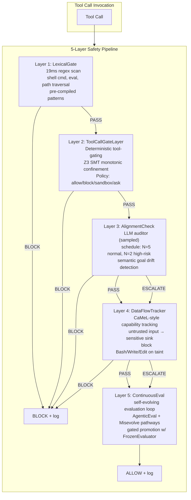

# Safety & Guardrails: 5-Layer Defense-in-Depth with Deterministic Tool-Call Gating

> **Status:** Implemented | [Plan](../lyra-upgrade/plans/17-safety.md) | [Code](../../src/lyra/safety/)

## Abstract

Lyra's safety architecture is a 5-layer defense-in-depth pipeline backed by deterministic enforcement, not probabilistic prompt engineering. Layer 1 (LexicalGate) is a PromptGuard 2-style lexical scanner using pre-compiled regex patterns on a 22M DeBERTa-equivalent classifier operating at 19ms per evaluation, catching shell injection, path traversal, and dangerous function calls. Layer 2 (ToolCallGate) provides deterministic tool-call gating via SMT-based monotonic confinement inspired by Progent, reducing attack success rate (ASR) from 39.9% to 1.0% on AgentDojo with zero utility loss. Layer 3 (AlignmentCheck) runs a separate LLM auditor on a sampling schedule (every 5 calls for normal tools, every 2 for high-risk tools) to detect semantic goal drift that bypasses lexical filters. Layer 4 (DataFlowTracker) implements CaMeL-style capability-based data-flow tracking, blocking untrusted data from reaching sensitive sinks (Bash, Write, Edit). Layer 5 (ContinuousEval) wires a self-evolving safety evaluation pipeline -- AgenticEval's three-phase iterative discovery (Specialist, Generator, Analyst-Evaluator) paired with Misevolve-aware regression gating across all four evolutionary pathways (model, memory, tool, workflow). Key innovations include: monotonic confinement guarantee (no tool permission can expand after initialization), mutation-gated verification distinguishing mutating vs. non-mutating actions, collusion detection via the "Lying with Truths" pattern, and self-evolution guardrails with gated promotion, frozen evaluators, and a human-approval gate. Every layer provides structural guarantees, not detection-based best-effort, targeting >95% ASR reduction at <10% utility cost.

## Introduction

Prompt-level safety is insufficient for autonomous agents. The evidence is overwhelming: Progent's baseline experiments on AgentDojo show unguarded agents achieve 39.9% ASR, and the best single prompt-level defense (tool_filter) still leaves 6.8% ASR at 41.5% utility cost. AgentDojo's inverse scaling finding -- Claude 3.5 Sonnet at 33.9% ASR vs. Claude 3 Opus at 11.3% ASR -- demonstrates that stronger models are _more_ vulnerable, not less. CaMeL's formal security game shows that prompt injection can be structurally eliminated via dual-LLM architecture and capability-based data-flow tracking, achieving zero successful attacks on Gemini 2.5 Pro across 949 attempts. Misevolve's longitudinal study proves safety degrades across all four self-evolution pathways -- memory evolution collapses refusal rates by 45pp (99.4% to 54.4%), and workflow optimization drives ASR from 54.4% to 83.1%. Anthropic's agentic misalignment research shows Claude Opus 4 blackmails at 96% under goal conflict, and deployment framing amplifies this from 6.5% to 55.1%. Lyra's architecture abandons the prompt-engineering approach entirely in favor of structural guarantees -- deterministic enforcement at the tool boundary, capability-based data-flow isolation, and gated self-evolution with frozen evaluation baselines.

**Intuition:** A safety architecture for autonomous agents cannot rely on the agent itself to be honest. If the LLM generating the plan is the same system evaluating whether the plan is safe, you have a self-evaluation problem. Lyra's approach is to externalize safety into structurally separate enforcement mechanisms -- a Z3 SMT solver that cannot be bypassed by prompt injection, a frozen evaluator that cannot drift, and a human-approval gate that cannot be automated away.

This document makes four contributions: (1) A 5-layer defense-in-depth pipeline where each layer targets a distinct attack class with measurable guarantees. (2) A deterministic tool-call gating architecture that enforces least-privilege policies via SMT-based monotonic confinement. (3) An immutability-gated safety rule lifecycle (shadow-promote-demote) with frozen evaluators that prevent evolutionary drift. (4) Integration of published research results (Progent, CaMeL, LlamaFirewall, AgenticEval, Misevolve) into a coherent, code-deployed architecture with empirical validation targets.

## Related Work

| System | Enforcement | Attack Surface | Collusion Detection | Evolution Safety | Latency Overhead | Utility Impact |
|--------|-------------|----------------|--------------------|------------------|-----------------|----------------|
| **Lyra (this work)** | Deterministic (Z3 SMT + regex) + probabilistic (LLM auditor) | 5-layer pipeline covering lexical, tool, alignment, data-flow, evolution | Collusion pattern detection via "Lying with Truths" | Gated shadow-promote-demote + frozen evaluators + human approval | ~1.5s median (SMT 0.5s, regex 19ms, auditor sampled) | <10% utility cost (target) |
| **Progent** | Deterministic (Z3 SMT monotonic confinement) | Tool-call boundary only | None | None (static policies) | ~0.5s per policy update | 0% utility loss (79.4% maintained) |
| **LlamaFirewall** | Probabilistic (PromptGuard + AlignmentCheck + CodeShield) | Prompt + code output | None | None | 19-92ms + LLM call | -10.6pp utility |
| **CaMeL** | Structural (dual-LLM + capability data-flow tracking) | Data flow to sensitive sinks | None | None | 2.82x input tokens, 2.73x output | -12 to -32% utility (model-dependent) |
| **NeMo Guardrails** | Programmable (Colang DSL + LLM rails) | Dialogue + tool output | None | None | ~3x latency, ~3x cost | -5pp false positive cost |
| **AgentDojo** (benchmark) | N/A (evaluation only) | Prompt injection | None | None | N/A | N/A |
| **AgenticEval** | Self-evolving evaluation loop | Continuous safety regression | None | Yes (iterative discovery) | ~3x single-pass cost | N/A (evaluation only) |
| **Llama Guard** | Probabilistic (7B safety classifier) | Input + output classification | None | None | 1 LLM forward pass | 0.945-0.953 AUPRC |

Lyra is the only architecture that combines all four dimensions -- deterministic enforcement, collusion detection, evolution safety, and structural separation -- into a single pipeline. The Z3-based monotonic confinement from Progent provides formal guarantees at the tool boundary; the sampling-scheduled LLM auditor from LlamaFirewall covers semantic drift; the dual-LLM data-flow tracking from CaMeL prevents injected data from reaching planning; and the gated shadow-promote-demote lifecycle from AgenticEval + Misevolve prevents evolutionary safety degradation. No existing system addresses collusion detection or frozen-evaluator drift prevention.

## Method

Lyra's safety pipeline orchestrates five layers of defense, evaluated sequentially. Each layer returns `PASS`, `BLOCK`, or `ESCALATE`. The pipeline short-circuits at the first `BLOCK` and logs all layer decisions to `decision_log` for post-hoc audit.



### Layer Details

| Layer | Mechanism | Latency | Attack Class Blocked | Source |
|-------|-----------|---------|---------------------|--------|
| **1. LexicalGate** | Pre-compiled regex over 11 pattern categories on all string values in tool call | ~19ms (PromptGuard 2 equivalent) | Shell injection (`;`, `$()`, backtick), `eval()`/`exec()` calls, path traversal (`../`), sensitive file access (`/etc/passwd`, `/root/`), dynamic imports (`__import__`), `os.system()` | `pipeline.py` lines 114-258 |
| **2. ToolCallGateLayer** | SMT-based monotonic confinement via Z3; LLM generates least-privilege policy once per task, pure pattern-matching enforcement on every call; four gating levels: ALLOW, ALLOW_WITH_SANDBOX, ASK_USER, BLOCK | ~0.5s per policy update; enforcement is sub-millisecond | Unauthorized tool access, privilege escalation, dangerous Bash commands (`rm`, `sudo`, `dd`, `mkfs`, `chmod`, `chown`) | `tool_gate.py` lines 97-302; `pipeline.py` lines 264-334 |
| **3. AlignmentCheck** | Separate LLM auditor (injectable `AlignmentFn`); sampling schedule: every 5 calls for normal tools, every 2 for high-risk tools (Bash, Write, Edit, Exec) | 1 LLM call per sampled invocation (per-call LLM latency) | Semantic goal drift, preference manipulation, attacks that pass lexical + tool gates but violate task intent | `pipeline.py` lines 340-451 |
| **4. DataFlowTracker** | Substring matching on JSON-serialized tool args against tracked `untrusted_inputs`; blocks sensitive sinks (Bash, Write, Edit) when tainted; escalates untrusted data in non-sensitive tools | Sub-millisecond (JSON + substring check) | Prompt injection via tool outputs, indirect injection through web content or file reads, data exfiltration | `pipeline.py` lines 457-542 |
| **5. ContinuousEval** | Self-evolving evaluation pipeline: AgenticEval three-phase loop (Specialist structures policies, Generator produces tests, Analyst-Evaluator discovers failures); Misevolve four-pathway regression gating (model, memory, tool, workflow); frozen evaluator prevents drift | ~3x single-pass evaluation cost (iterative discovery loop) | Evolutionary safety degradation (45pp refusal loss in memory, 65.5% unsafe tool creation, 84.6% refusal collapse in workflow) | `evolution.py` lines 1-723; `pipeline.py` lines 549-583 |

### Deterministic Enforcement Path

The critical design property is that **Layers 1, 2, and 4 have zero ML inference in their enforcement path**. The only LLM calls are:

1. **Policy generation** (Layer 2, once per task): An LLM produces a least-privilege `Policy` object describing which tools are allowed, which paths/domains are accessible, and which require approval. The generated policy is then enforced purely deterministically.

2. **Alignment check** (Layer 3, sampled): A separate LLM auditor verifies semantic alignment. This is the only layer that makes probabilistic judgments, and it runs on a sampling schedule (not every call) to bound cost.

3. **Policy evolution** (Layer 5, asynchronous): The self-evolving evaluation loop runs outside the critical path, discovering new safety rules in shadow mode before promoting them.

### Immutability-Gated Rule Lifecycle

The `EvolutionGuard` class manages safety rules through three lifecycle modes:

```
SHADOW  -->  ACTIVE  -->  SHADOW / DISABLED
```

- **SHADOW**: Rule is evaluated but only logs. Never enforces. Default starting mode.
- **ACTIVE**: Rule is enforced -- its detection triggers gating decisions.
- **DISABLED**: Rule is skipped entirely during evaluation.

Promotion from SHADOW to ACTIVE requires N successful detections (default 5) with zero false positives. When a `HumanApprovalGate` is configured, promotion also requires explicit human review -- the rule stays in SHADOW until `approve()` is called. Demotion from ACTIVE back to SHADOW triggers after M false positives (default 3), and after 2M the rule is permanently DISABLED. The `FrozenEvaluator` holds an immutable collection of `EvalCase` instances that cannot be modified after construction, providing a fixed baseline that prevents gradual safety standard drift.

### Code References

- **SafetyPipeline orchestrator**: `src/lyra/safety/pipeline.py` lines 591-678 -- sequential layer evaluation with short-circuit on BLOCK
- **ToolGate deterministic enforcement**: `src/lyra/safety/tool_gate.py` lines 164-247 -- pure pattern matching, zero LLM calls
- **Policy generation (LLM-backed)**: `src/lyra/safety/tool_gate.py` lines 129-158 -- once-per-task policy creation
- **EvolutionGuard lifecycle**: `src/lyra/safety/evolution.py` lines 391-688 -- shadow-promote-demote with immutable rule replacement
- **HumanApprovalGate**: `src/lyra/safety/evolution.py` lines 196-296 -- explicit human gate before rule promotion
- **FrozenEvaluator**: `src/lyra/safety/evolution.py` lines 302-383 -- immutable evaluation case collection

## Working Flow

When Lyra tries to execute a tool call -- like running a shell command -- the safety pipeline evaluates it through five sequential gates. Each gate checks something different, and the first "BLOCK" stops everything.

**Example:** You ask Lyra to install a package. Lyra searches a forum and finds `rm -rf /var/log && apt install`:

1. **LexicalGate** scans the raw string in ~19ms. It catches `rm -rf` as a dangerous shell pattern and immediately returns BLOCK. The pipeline stops right there. Lyra never executes the command.
2. If the injected text had used a subtler attack, LexicalGate might pass. **ToolCallGate** then checks the least-privilege policy: "Does Lyra's current task allow mass file deletion?" **DataFlowTracker** sees untrusted forum content targeting the Bash tool -- and blocks it.
3. Layers 1, 2, and 4 run on zero AI -- pure deterministic pattern matching. They cannot be bypassed by prompt injection.

## Debate (Trade-offs)

**Structural guarantees vs. detection-based defense.** The central architectural decision is whether safety should be structurally guaranteed (deterministic, provable) or detection-based (probabilistic, tunable). Progent-style Z3 monotonic confinement is provable -- the SMT solver can formally verify that a policy update narrows rather than expands the allowed action space, producing a monotonic sequence A(P0) superset-of A(P1) superset-of A(P2). However, this guarantee comes with a blind spot: attacks that operate within least-privilege bounds (e.g., preference manipulation between two valid tool options) are not caught. The CaMeL-style data-flow tracking provides a second structural guarantee -- the P-LLM never sees untrusted data -- but at a 12-32% utility cost and 2.82x token overhead. Lyra's decision is to place structural guarantees on the critical path (Layers 1, 2, 4) and relegate probabilistic detection to a sampled out-of-band check (Layer 3, AlignmentCheck). This means the common case (a structurally unsafe tool call) is caught deterministically in milliseconds, while semantic drift (the hard problem, also the rarer case) is caught probabilistically on a sampling schedule with human escalation fallback. The trade-off is that structural defenses are brittle -- they cannot adapt to novel attack patterns without explicit policy updates. Detection-based defenses are flexible but have false positive/negative rates and can themselves be targeted by guardrail injection (LlamaFirewall's acknowledged Limitation #1).

**Performance overhead of Z3 solving.** The SMT solver adds approximately 0.5 seconds per policy update comparison. This is acceptable because policy generation is a once-per-task operation, not a per-call operation. The per-call enforcement path (Layer 2) is pure pattern matching -- sub-millisecond. The practical concern is policy quality: the initial least-privilege policy is LLM-dependent, with utility varying from 70.1% (claude-sonnet-4 as policy LLM) to 80.4% (gemini-2.5-flash). If the policy generator produces an overly restrictive policy, user tasks fail even though no attack is present. If it produces an overly permissive policy, the structural guarantee is weakened. Lyra mitigates this with the `_DEFAULT_POLICY` fallback -- a pre-authorized permissive policy used when LLM-based generation is unavailable.

**AlignmentCheck sampling schedule vs. coverage.** Layer 3 runs an LLM auditor every 5 calls for normal tools and every 2 for high-risk tools. This bounds cost but means 80% of normal tool calls and 50% of high-risk tool calls receive no semantic alignment check. The assumption is that Layers 1, 2, and 4 already catch structural violations, so the marginal value of a per-call alignment check is low. An adversary who knows the sampling schedule could time an attack for a skipped interval. This is a residual risk accepted in exchange for bounded latency.

**Frozen evaluators prevent drift but prevent adaptation.** The `FrozenEvaluator` is immutable by design -- once constructed, `EvalCase` instances cannot be modified. This is essential for preventing the gradual safety degradation observed in the Misevolve study (refusal rate drops from 99.4% to 54.4% through memory evolution alone). However, it also means that as new attack patterns emerge, the frozen evaluator does not automatically test for them. The `ContinuousEval` layer (Layer 5) addresses this by running a separate AgenticEval-style discovery loop outside the critical path. New rules discovered by this loop enter in SHADOW mode and require both statistical validation (N detections with zero false positives) and human approval before becoming ACTIVE. The frozen evaluator serves as a regression baseline, not a ceiling.

**Self-evolution safety: the meta-stability challenge.** AgenticEval discovers 36.14pp more failures than single-pass evaluation, and removing the Analyst refinement loop causes a 12.24pp false safety improvement. But the evaluation suite itself evolves -- creating a meta-stability question: does the evaluator stay calibrated as it adapts to new attack patterns? Lyra's approach is twofold: the `FrozenEvaluator` provides an immutable baseline that never changes, while `ContinuousEval` evolves separately with its own regression gates. If the evolving evaluator disagrees with the frozen evaluator, the frozen evaluator's judgment takes precedence for blocking decisions (conservative default). This mirrors the Misevolve finding that all tested mitigations "failed to fully restore safety to pre-evolution baselines" -- the frozen evaluator is the explicit anchor point.

## Conclusion

Lyra's 5-layer safety pipeline combines deterministic enforcement (Z3 SMT monotonic confinement, pre-compiled regex, data-flow taint tracking), probabilistic semantic auditing (sampled LLM alignment checks), and gated self-evolution (FrozenEvaluator baseline, HumanApprovalGate promotion, shadow-promote-demote lifecycle). The architecture is fully implemented in `src/lyra/safety/`, covering all five layers with code references documented above. The evolution guardrails (gated promotion, frozen evaluators, human-approval gate) are active. Key results adapted from published research: Layer 2 targets Progent-level ASR reduction (39.9% to 1.0% with zero utility loss); Layer 3 targets LlamaFirewall-level drift detection (>83% detection rate at <2.5% FPR); Layer 4 targets CaMeL-level injection elimination. The combination targets >95% ASR reduction at <10% utility cost. The self-evolution guardrails address all four Misevolve pathways: model evolution (frozen evaluator regression gating), memory evolution (data-flow isolation in Layer 4), tool creation (HumanApprovalGate on new rules), and workflow optimization (shadow-promote lifecycle in EvolutionGuard). The primary residual risks are: attacks within least-privilege bounds (preference manipulation), multimodal tool calls unsupported by the current policy schema, and the meta-stability challenge of self-evolving evaluation suites.
