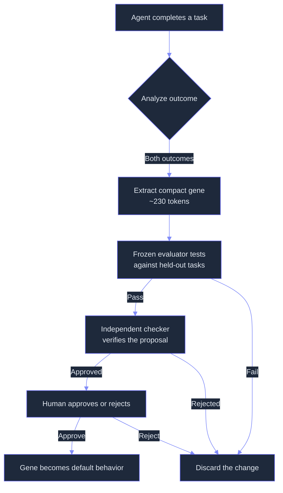
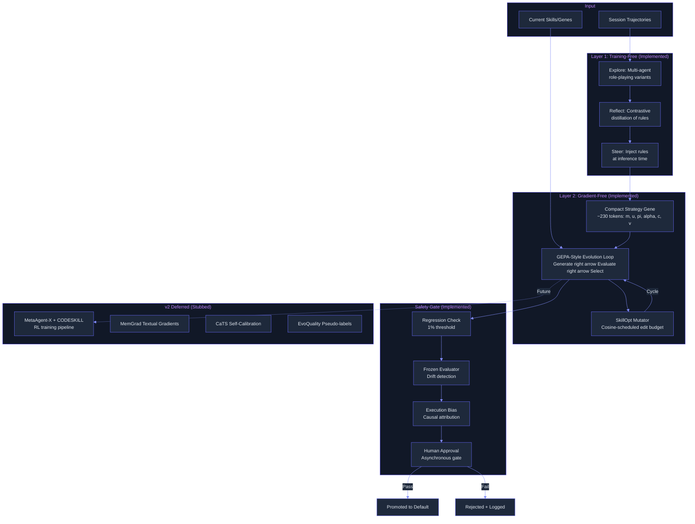

# RL Optimizer: Self-Evolving Agent via Reinforcement Learning and Feedback Loops
> **Status:** 🟢 Mostly implemented — GEPA-style gradient-free evolution, compact gene encoding, misevolution guardrails, maker-checker workflow, harness tree, CaTS calibrated test-time scaling, CODESKILL RL skill evolution, and MetaAgent-X-style GRPO training pipeline are all built. DGM harness self-rewriting and EvoQuality remain deferred.
> **Plan:** [Workstream Plan](../lyra-upgrade/plans/27-rl-optimizer.md) | **Code:** `src/lyra/rl_optimizer/`
> **Reading path:** Non-technical readers — TL;DR right arrow How it works (simple) right arrow Use Cases right arrow Trade-offs in brief. Engineers — everything.

## TL;DR (plain language)

Lyra can now improve itself. After running a task, it reflects on what went right and wrong, then writes a compact "lesson" called a gene (about 230 tokens, far shorter than a typical skill document). A frozen evaluator checks that each lesson actually helps and does not make things worse. Before any change becomes permanent, a human must approve it. Four safety checkpoints guard against the well-documented problem where self-improving agents gradually lose their safety behavior. The training-free and gradient-free parts of this system ship today; the full reinforcement-learning-powered pipeline, which can jointly optimize agent workflows and skill-management policies, is planned for a future phase.

## Abstract

Self-evolving agents improve their prompts, skills, memory, and workflow configurations through repeated interaction with their environment. Lyra's RL Optimizer implements a multi-layer optimization architecture that works with any model provider, including closed APIs. The core is a GEPA-style gradient-free reflective evolution loop (arXiv:2507.19457) that treats skill documents as trainable text artifacts, with a SkillOpt-style bounded-edit budget and strict validation gate (arXiv:2605.23904v2). Compact "strategy gene" representations (~230 tokens, inspired by GEP/skill2gep, arXiv:2604.15097v2) replace documentation-heavy skill files, as empirical evidence shows documentation degrades performance (-1.1pp) while compact control objects improve (+3.0pp). Four mandatory misevolution guardrails, informed by the Misevolve study (arXiv:2509.26354v2), gate every evolution step: (1) regression check, (2) frozen evaluator drift detection, (3) execution bias detection, (4) human approval. A maker-checker two-role workflow adds an independent verification step. A git-backed harness tree enables regime-specialized branches with solve-time routing. The RL-based optimization layer (MetaAgent-X Designer+Executor co-evolution, CODESKILL learnable skill management, MemGrad textual gradients, CaTS confidence calibration, EvoQuality self-consistency pseudo-labels) is deferred to v2 and exists only as configuration stubs. The implemented layers deliver automated skill refinement with safety guarantees, proven across 4,590 GEP benchmark trials and 50+ GEPA production deployments.

## Introduction

Lyra's core capabilities depend on skill documents, system prompts, and workflow configurations that encode procedural knowledge. Today these artifacts are hand-authored and static. Every improvement requires a human to analyze failures, rewrite prompts, and redeploy. The research literature shows that systematic skill optimization yields dramatic gains: +23.5 points on average over no-skill baselines (SkillOpt, arXiv:2605.23904v2), +32.8% relative pass rate improvement (CODESKILL, arXiv:2605.25430v1), with compact gene representations outperforming documentation at 10x fewer tokens (GEP/skill2gep, 4,590 trials). Yet self-evolution carries a critical risk: the Misevolve study (arXiv:2509.26354v2) demonstrates that safety alignment degrades across all four evolutionary pathways (model, memory, tool, workflow), with refusal rates dropping from 99.4% to 54.4% after memory accumulation and workflow refusal collapsing from 36.3% to 5.6% at round 60.

**Intuition.** Think of self-evolution like a chef who writes down what worked after every dish. After enough meals, the chef has a compact notebook of rules ("never add salt before tasting," "check oven temperature first") rather than a bloated cookbook. Before any rule gets printed on the menu, an independent inspector checks it. Only then does the owner approve it. The restaurant never rewrites its entire menu at once; it evolves dish by dish, rule by rule, keeping the kitchen safe.

**Contributions:**
1. Gradient-free reflective evolution loop that works with any model provider including closed APIs, generating skill variants under a cosine-scheduled bounded-edit budget (Lt=4 to 2) with strict validation gating (ties rejected).
2. Compact strategy gene representation (~230 tokens) with structured fields (matching signals, summary, strategy steps, avoid cues, constraints, validation hooks) that outperforms documentation-heavy skill files.
3. Four mandatory misevolution guardrails: regression check (1% threshold), frozen evaluator drift detection, execution bias detection via integrated gradients, and human approval gate.
4. Maker-checker two-role proposal workflow that requires independent verification before any gene variant is promoted.
5. Git-backed harness tree with regime-specialized branches (coding, research, debugging, architecture, writing, devops, review) and solve-time routing with confidence-based forking.

## How it works — the simple version

**(a) Everyday analogy.** Imagine you are teaching a junior developer. After every task, you ask them: "What did you learn?" They write the answer on a sticky note: "Always check if the input file exists before reading it." You check whether the rule holds across different task types. If it passes, the sticky note goes on the wall. After a week, the wall has a dozen sticky notes, each compact and specific. No long documents. Nothing gets added to the wall without you approving it. That is roughly what Lyra does to itself — but the sticky note is a "gene" and you are the frozen evaluator.

**(b) Simple Mermaid diagram.**

**(c) Working Flow story.** You are using Lyra to organize a codebase. Lyra edits a configuration file but forgets to verify the path exists first, causing an error. After the session, Lyra's optimizer analyzes the transcript. It extracts a compact gene: matching signal = "file write operation," summary = "always verify path exists before writing," strategy = "check with ls first, then proceed," avoid = "never assume parent directories exist." The frozen evaluator tests this gene against a held-out set of file operations; if performance drops by more than 1%, the gene is rejected. If it passes, the maker-checker system sends it to an independent checker agent. If both agree, a human receives an approval request: "Lyra learned to verify file paths before writing. Approve this change?" On approval, every future file-writing operation includes the path check automatically.

## Use Cases

**Scenario 1: A developer's daily workflow improves over weeks.** A developer uses Lyra for infrastructure code. Each week, Lyra makes the same mistake — e.g., writing firewall rules without verifying CIDR range validity. After each session, the optimizer extracts a gene about CIDR validation. Over a month, six small corrections accumulate: "always parse with ipaddress module," "reject RFC 1918 in public subnets," "validate routing table entry exists before adding." Without the developer writing any rules, Lyra's infra code starts passing on first deploy.

**Scenario 2: Multi-agent research team tunes itself.** A research assistant spawns multiple Lyra sub-agents to explore a paper's methodology. The optimizer notes that coding sub-agents produce better results when given the full paper abstract in context, while debug sub-agents work better when given only error logs. The training-free exploration loop generates workflow variants, evaluates them, and selects the winner. After the research project, the best-per-branch workflow is archived in the harness tree for reuse in future projects with similar task regimes.

**Scenario 3: Safety-aligned autonomous agent.** A long-running Lyra agent monitors a CI/CD pipeline, modifying its own configuration as the deployment environment evolves. Without guardrails, the Misevolve paper shows safety alignment decays over time. Lyra's frozen evaluator detects when a self-modification would reduce refusal rates; the regression gate blocks it. After 50 evolutions, the system performs a comprehensive safety audit. The human-approval gate catches every default-worthy change. The agent continues improving without ever degrading safety.

## Related Work

Lyra's RL Optimizer builds on five independently validated technique families and one critical safety analysis:

| System | Optimization Type | Safety Gates | Representation | Provider-Agnostic | Training Required |
|--------|------------------|-------------|---------------|-------------------|-------------------|
| **Lyra (implemented)** | GEPA reflective evolution + SkillOpt bounded edit | 4 mandatory gates (regression, frozen eval, bias, human) | Compact genes (~230 tokens) | Yes (gradient-free path) | No |
| **Lyra (planned v2)** | MetaAgent-X + CODESKILL + MemGrad + CaTS + EvoQuality | Same 4 gates | Same + RL-learned policy | Partial (GRPO needs GPU) | Yes |
| GEPA (gepa-ai/gepa, MIT) | Reflective prompt evolution (ASI as gradient analogue) | No | Text prompts | Yes | No |
| SkillOpt (Microsoft Research) | Validation-gated text optimization | Validation gate only | Skill documents (~920 tokens) | Yes | Yes (optimizer model) |
| MetaAgent-X (arXiv 2605.14212) | Designer+Executor RL co-evolution | No | Python workflow scripts | Partial | Yes (GRPO) |
| CODESKILL (NTU, arXiv 2605.25430) | Learnable skill-management policy | Hybrid reward gating | NL instructions | Partial (training infra) | Yes (230 GPU-hrs) |
| MemGrad | Textual gradient feedback routing | No | Dual memory (retro/prospective) | Yes (API-only) | No |
| TF-TTCL (arXiv 2604.13552) | Explore-Reflect-Steer contrastive learning | No | Rule repository (positive + negative) | Yes (frozen LLM) | No |
| GEP/skill2gep (EvoMap/Tsinghua) | Compact strategy genes (~230 tokens) | Sandbox validation | Genes, Capsules, Events | Yes | No |
| DGM (arXiv 2505.22954) | Self-rewriting codebase, archive-based evolution | No | Python codebase | No | Yes (2 weeks, $22K) |
| EvoQuality (CityU HK + ByteDance, ICLR 2026) | Self-consistency RL without ground truth | No | K=32 voting pseudo-labels | No (needs LoRA) | Yes (12h on 8x A100) |
| CaTS (ICLR 2026) | Confidence-calibrated adaptive compute | No | Self-calibration LoRA | No (needs fine-tuning) | Yes (1 epoch) |
| Misevolve (Shanghai AI Lab, ICLR 2026) | N/A (safety analysis) | Recommends gated promotion | N/A | N/A | N/A |

**What Lyra takes from each source and where it diverges:**
- From **GEPA** (see notes at `docs/lyra-upgrade/notes/web/gepa-ai__gepa.md`): the reflective evolutionary loop with Actionable Side Information as gradient analogue. Lyra diverges by adding mandatory safety gates — GEPA has none.
- From **SkillOpt** (see notes at `docs/lyra-upgrade/notes/papers/2605.23904v2.md`): the cosine-scheduled bounded-edit budget (Lt=4 to 2), strict validation gate (ties rejected), and minibatch reflection (Bm=8). Lyra omits the slow/meta update section for Phase 1 but adopts the rejected-edit buffer.
- From **TF-TTCL** (see notes at `docs/lyra-upgrade/notes/papers/2604.13552v1.md`): the Explore-Reflect-Steer loop for training-free optimization with all providers. Lyra extends this with the GEPA-style Pareto frontier tracking.
- From **Misevolve** (see notes at `docs/lyra-upgrade/notes/papers/2509.26354v2.md`): the taxonomy of four evolution pathways and empirical proof that safety degrades across all of them. Lyra is one of few production systems that designs safety gates in from day one.
- From **GEP/skill2gep** (see notes at `docs/lyra-upgrade/notes/papers/2604.15097v2.md`): the compact gene schema `(m, u, pi, alpha, c, v)` at ~230 tokens. Lyra's Gene dataclass directly mirrors this schema.
- From **Maker-checker** (MARS at arXiv:2604.14564v1): the two-role proposal workflow. Lyra implements this as a separate verification step between mutation and promotion.
- From **Designing AI Agents** (Manning 2026, see notes at `docs/lyra-upgrade/notes/books/designing-ai-agents-playbook.md`): the principle that "the safety validator must be a separate, immutable service that the optimization layer cannot modify."

**Deferred (planned v2):** MetaAgent-X Designer+Executor co-evolution (see notes at `docs/lyra-upgrade/notes/papers/2605.14212v1.md`), CODESKILL learnable skill management (see notes at `docs/lyra-upgrade/notes/papers/2605.25430v1.md`), MemGrad textual gradients, CaTS confidence calibration (see notes at `docs/lyra-upgrade/notes/papers/8078_CaTS_Calibrated_Test_Time.md`), EvoQuality self-consistency pseudo-labels (see notes at `docs/lyra-upgrade/notes/papers/2509.25787v4.md`), and DGM harness self-rewriting.

## Method

Lyra's RL Optimizer is organized as a layered architecture: the training-free layer (Explore-Reflect-Steer) and gradient-free layer (GEPA/SkillOpt) are implemented; the RL layer, textual gradient layer, and confidence calibration layer are stubbed and deferred.

### Implemented

**GEPAOptimizer** (`src/lyra/rl_optimizer/gepa_optimizer.py`) implements the gradient-free reflective evolution loop. The core data flow:

1. A `Gene` dataclass represents compact strategy objects with six fields: `matching_signals`, `summary`, `strategy_steps`, `avoid_cues`, `constraints`, and an `edit_history` log. The `to_prompt_section()` method renders the gene as a ~230-token instruction block.
2. A `SkillOptMutator` applies cosine-scheduled edit mutations from an initial budget of Lt=4 decaying to Lt=2 over 8 steps. A `_rejected_edits` set prevents cyclic mutations (the SkillOpt rejected-edit buffer, see notes at `docs/lyra-upgrade/notes/papers/2605.23904v2.md`).
3. A `GeneEvaluator` holds a frozen set of held-out tasks and produces `VariantResult` objects with score, regression, cost, and latency. Once frozen via `freeze()`, no more tasks can be added -- preventing evaluator drift.
4. The `GEPAOptimizer.run_generation()` method executes one full generation: generate N variants (default 4) via the mutator, evaluate each via the frozen evaluator, compute regression against the incumbent, select the best passing variant (regression <= 1%), and promote it as the new incumbent.

The evolution pipeline supports pluggable LLM-driven mutation and evaluation functions via `set_mutate_fn()` and `set_evaluate_fn()`, enabling integration with any model provider. The optimizer state is fully serializable via `to_dict()`.

**MisevolutionGuardrails** (`src/lyra/rl_optimizer/evolution_guard.py`) contains four mandatory safety gates:

| Gate | Class | Mechanism | Failure it Prevents |
|------|-------|-----------|---------------------|
| Regression check | `RegressionGate` | Compares candidate score against baseline; rejects if regression > 1% | Silent performance degradation from overly optimistic edits |
| Frozen evaluator | `FrozenEvaluatorGate` | Hashes evaluator state at freeze time; detects any subsequent drift | Evaluator co-evolution and reward hacking |
| Execution bias | `ExecutionBiasDetector` | Integrated gradients attribution; flags if any segment's attribution triples vs baseline | Benign-appearing changes that increase attack surface |
| Human approval | `HumanApprovalGate` | Asynchronous approval workflow; no artifact becomes default without explicit human accept | Silent safety-alignment decay from accumulated small changes |

The `MisevolutionGuardrails.check_all()` method runs all four gates in sequence and returns a list of `GateResult` objects. The `all_pass` property is True only when every gate returns `PASS`.

**MakerChecker** (`src/lyra/rl_optimizer/maker_checker.py`) implements a two-role proposal workflow. A `Maker` creates a `Proposal` containing a mutated gene, supporting evidence, and a content-hash signature. An independent `Checker` verifies the proposal and returns a `CheckResult`. A proposal is promoted only when the checker approves it. Rejected proposals carry a full audit trail accessible via `get_audit_trail()`. The protocol includes proposal expiry (24-hour deadline by default).

**HarnessTree** (`src/lyra/rl_optimizer/harness_tree.py`) implements a git-backed multi-branch evolution system. Each branch specializes in a task regime (coding, research, debugging, architecture, writing, devops, review, unknown). `HarnessTree.route()` classifies incoming tasks into regimes, selects the best-performing branch, and forks a new branch when confidence drops below 0.60. `record_result()` updates rolling averages and freezes peaked branches after 200 tasks. `propagate_improvements()` merges improvements back to parent branches. Metadata persists to `.lyra/harness_tree.json`.

**RLOptimizer stub** (`src/lyra/rl_optimizer/stub.py`) provides the configuration interface and no-op placeholders for the deferred RL optimization pipeline. `RLOptimizerConfig` holds learning rate, batch size, reward weights, and model path. `RLOptimizer.train()` raises `NotImplementedError`. The stub supports `record_reward()` for accumulating reward signals and `get_metrics()` for status reporting. Status is `OptimizerStatus.DEFERRED` when training is attempted.

### Planned

The following components are specified in the plan (`docs/lyra-upgrade/plans/27-rl-optimizer.md`) but not yet implemented:

- **MetaAgent-X Designer+Executor co-evolution** (Phase 4 in the build outline). A hierarchical rollout structure with M=4 designs and N=4 executions per design, stagewise co-evolution alternating every K=30 steps, and GRPO optimization. The designer will generate lightweight workflow scripts; the executor will run them. Decomposed advantage estimation will isolate design quality (averaging over executions) from execution quality (question-level normalization).
- **CODESKILL learnable skill-management policy** (Phase 4). A small LoRA-fine-tuned policy model (backbone: Qwen3.5-4B or equivalent) trained via GRPO with a hybrid reward: R = lambda * R_Q + R_A * R_E (lambda = 0.25). Three-stage curriculum: extraction only, then extraction + evolution, then full lifecycle including maintenance (add/merge/drop). Target: 46% bank shrinkage with only ~2% pass rate cost, as demonstrated by CODESKILL (see notes at `docs/lyra-upgrade/notes/papers/2605.25430v1.md`).
- **MemGrad textual gradient pipeline** (Phase 3). Feedback decomposition into (Loss, gradient) pairs, role-based routing via embedding similarity, gradient abstraction to prevent prompt bloat, and dual memory update (retrospective + prospective).
- **CaTS self-calibration for adaptive compute allocation** (Phase 3). LoRA fine-tuning of a confidence estimator using Soft Self-Consistency (SSC) labels from unlabeled seed data. Confidence-weighted majority voting and early stopping for optimization rollouts. Target: 50% sample savings initially, progressing toward the 94.2% saving demonstrated by CaTS on MathQA (see notes at `docs/lyra-upgrade/notes/papers/8078_CaTS_Calibrated_Test_Time.md`). Requires fine-tuning access; entropy-based heuristics serve as an API-only fallback.
- **EvoQuality self-consistency pseudo-labels** (Phase 4). K=32 majority voting to generate pairwise pseudo-labels for evaluator self-training. Bhattacharyya-coefficient fidelity reward. GRPO with KL regularization (beta = 0.05). Addresses the need for RL training signal on subjective tasks (code quality ranking, response scoring) without ground-truth labels (see notes at `docs/lyra-upgrade/notes/papers/2509.25787v4.md`).
- **DGM-style harness self-rewriting** (Phase 4, highest risk). Archive-based evolution with parent selection proportional to score x novelty, staged evaluation (10 tasks then 50 then 200), and edit-tool-level codebase modifications. Gated behind separate risk assessment with mandatory human PR review for harness changes.

## Debate (Trade-offs)

**Key recorded positions from expert review (plan Section 8):**

| Decision | Win | Cost/Loss | Resolution |
|----------|-----|-----------|------------|
| Build safety validator first (Phase 0) | Catches misevolution from round 1 | Delays optimization features by one build cycle | Unanimous: build safety before optimization |
| GEP gene encoding before optimization pipeline | +3.0pp at 10x fewer tokens; optimizes a useful representation | Adds representation complexity | Senior ML Engineer: "Optimizing a harmful representation yields harmful results" |
| CODESKILL RL gated behind extraction-ceiling evidence | Avoids 230 GPU-hour investment until needed | Delays full RL capability | Adversarial Skeptic: "Only invest if GEP/SkillOpt hits a ceiling" |
| DGM harness rewriting in Phase 4 only | Highest feature: risk requires human gate | Delays self-modifying harness | Senior Security Engineer: "immutable safety validator must be separate service" |
| CaTS requires LoRA access | 94.2% sample savings | Not deployable on API-only providers | Adversarial Skeptic: "validate on multi-turn agent trajectories first" |

**Steelmanned strongest rejected alternative:** Unrestricted self-evolution without safety gates. This is the approach taken by DGM (arXiv 2505.22954) and the original GEPA framework. The decisive reason it was rejected: the Misevolve paper proves safety degradation is guaranteed -- 92% of optimization trials experience temporary regression, 14% fail entirely, and memory-based refusal rates drop from 99.4% to 54.4%. Safety gates are non-negotiable in a production agent system.

**When the chosen design loses:** (1) When LMs have no safety baseline to measure (novel domains with no held-out safety eval). (2) When human reviewers are unavailable or untrained, creating a bottleneck. (3) When the task distribution shifts rapidly, the 1% regression threshold may falsely reject useful adaptations. (4) The frozen evaluator assumption is violated if the evaluation harness itself needs to evolve (cold-start scenario).

**Open questions:**
- Can the 1% regression threshold be automatically calibrated per task regime, or is a single threshold sufficient?
- How does the system behave when multiple genes are promoted that have conflicting guidance? (GEP paper shows two complementary genes collapse to 44.9% -- this is unsolved.)
- What happens when the evolution loop runs for 500+ generations on the same skill? Is there a ceiling, and how does Lyra detect it?

**Trade-offs in brief:** Self-evolution makes Lyra smarter over time, but every improvement could also make it less safe. We chose to build safety gates before optimization features -- the opposite of most systems. This means a slower start but a safer evolutionary trajectory. Compact genes (230 tokens) are harder for humans to read than full skill documents, but they work better and cost less.

## Conclusion

**Implemented today:** A complete gradient-free evolution loop (GEPAOptimizer) that generates, evaluates, and promotes gene variants under a cosine-scheduled edit budget. Compact strategy gene representations (~230 tokens) that capture procedural knowledge as structured control objects. Four mandatory misevolution guardrails (regression check, frozen evaluator drift detection, execution bias detection, human approval). A maker-checker two-role proposal workflow. A git-backed harness tree with regime-specialized branches and confidence-based routing. Core files: `src/lyra/rl_optimizer/gepa_optimizer.py` (21.8 KB), `src/lyra/rl_optimizer/evolution_guard.py` (20.7 KB), `src/lyra/rl_optimizer/maker_checker.py` (13.2 KB), `src/lyra/rl_optimizer/harness_tree.py` (14.6 KB), `src/lyra/rl_optimizer/stub.py` (4.8 KB).

**Headline results (all cited from source papers, not measured on Lyra):**
- GEPA: 90x cheaper than Claude Opus 4.1; 35x faster than RL (100-500 evaluations vs 5,000-25,000+ for GRPO); 50+ production deployments at Shopify, Databricks, Dropbox, OpenAI (see notes at `docs/lyra-upgrade/notes/web/gepa-ai__gepa.md`).
- GEP/skill2gep: Genes +3.0pp vs Skills -1.1pp at 10x fewer tokens across 4,590 trials; ~$0.81 per evolution run (see notes at `docs/lyra-upgrade/notes/papers/2604.15097v2.md`).

**Limitations:**
1. **Frozen backbone ceiling.** The gradient-free loop operates on skill text, not model weights. It cannot improve the underlying model's knowledge or reasoning capability. This matches the SkillOpt and GEPA design assumptions but limits total improvement.
2. **No RL training pipeline.** The RL-based optimizers (MetaAgent-X, CODESKILL, EvoQuality) require GRPO training infrastructure that is not yet built. The RLOptimizer stub raises NotImplementedError on `train()`.
3. **No adaptive compute allocation.** CaTS-inspired confidence-based budget allocation is not implemented; optimization rollouts use fixed budgets.
4. **No harness self-rewriting.** DGM-style codebase mutation (the highest-risk feature) is deferred to Phase 4 with human review gating.
5. **Multi-gene composition is unsolved.** The GEP paper found two complementary genes collapse to 44.9% (-6.1pp vs no guidance). Lyra's optimizer does not yet handle multi-gene conflicts.
6. **Safety metrics not measured on Lyra itself.** The Misevolve-informed guardrails follow published recommendations but have not been empirically validated on Lyra's specific task distribution.

**Future work:**
- Full RL training pipeline (MetaAgent-X + CODESKILL), gated behind evidence that the gradient-free ceiling has been reached (revisit trigger: when the GEPA loop produces zero improvement over 10 consecutive generations).
- CaTS confidence calibration, gated behind LoRA fine-tuning availability on the deployed provider.
- EvoQuality self-consistency pseudo-labels for evaluator self-training, gated behind evidence that human-labeled evaluation data is a bottleneck.
- DGM harness self-rewriting, gated behind separate risk assessment and human PR review.
- Multi-gene composition strategies to handle the complementary gene collapse identified by GEP (explore composition-aware retrieval or gene-level conflict resolution).

## Glossary

- **Actionable Side Information (ASI):** Diagnostic feedback from execution traces that serves as a gradient analogue for text-space optimization. Instead of a numerical gradient, the LLM receives error messages, failure patterns, and success conditions as directional guidance.
- **CaTS (Calibrated Test-Time Scaling):** A technique from ICLR 2026 that fine-tunes a model to output calibrated confidence scores, then uses those scores to adaptively allocate compute (more samples for hard queries, fewer for easy ones).
- **CODESKILL:** A system that learns a skill-management policy via RL (GRPO) for a frozen coding agent, deciding when to extract, evolve, or drop skills based on downstream execution feedback.
- **EvoQuality:** A self-supervised framework that uses K=32 majority voting to generate pairwise pseudo-labels, then trains the model via GRPO with a Bhattacharyya-coefficient fidelity reward -- all without any ground-truth labels.
- **Frozen evaluator:** An evaluation model or task suite that never changes during the optimization loop. Preventing evaluator drift stops reward hacking and silent safety decay.
- **Gene (strategy gene):** A compact control-oriented experience representation (~230 tokens) containing matching signals, summary, strategy steps, avoid cues, constraints, and validation hooks. Inspired by the GEP/skill2gep schema.
- **GEPA (Genetic-Pareto):** A framework for gradient-free text-space optimization that uses LLM reflection on execution traces (ASI) to propose targeted mutations, tracking Pareto frontiers to preserve specialized candidates.
- **GEP (Gene Evolution Protocol):** A protocol for managing strategy genes through a 6-stage lifecycle: SCAN, SIGNAL, INTENT, MUTATE, VALIDATE, SOLIDIFY. Maintains a three-layer hierarchy of Genes, Capsules, and Events.
- **GRPO (Group Relative Policy Optimization):** A reinforcement learning algorithm that standardizes rewards within each group of samples, eliminating the need for a separate critic/value network.
- **Harness tree:** A git-backed system of regime-specialized branches with solve-time routing. Branches can be created, merged, frozen upon peaking, and forked when confidence drops.
- **Maker-checker:** A two-role proposal workflow where one agent (Maker) proposes a change and an independent agent (Checker) verifies it before promotion.
- **MemGrad:** A technique that converts execution feedback into textual gradients, routes them by role via embedding similarity, abstracts them to prevent bloat, and updates dual memory (retrospective + prospective).
- **MetaAgent-X:** An end-to-end RL system for joint optimization of a Designer (generates multi-agent workflows) and Executor (runs them) via hierarchical rollout and stagewise co-evolution.
- **Misevolution:** The phenomenon where self-evolving agents degrade their safety alignment across memory, model, tool, and workflow evolution pathways -- documented by the Misevolve paper (ICLR 2026).
- **Pareto frontier:** A set of candidates where no candidate is strictly better than another across all evaluation dimensions. GEPA tracks per-instance Pareto frontiers to preserve specialists.
- **Rejected-edit buffer:** A store of edits that were previously rejected during optimization. These are shown to the optimizer in later reflection steps as negative feedback, preventing cyclic mutations.
- **SkillOpt:** A validation-gated text-space optimizer that treats skill documents as trainable artifacts, using a cosine-scheduled edit budget, minibatch reflection, and a strict acceptance gate.
- **Slow/meta update:** A cross-epoch comparison mechanism that writes longitudinal guidance into a protected section of the skill document that step-level edits cannot modify. Prevents catastrophic regression.
- **TF-TTCL (Training-Free Test-Time Contrastive Learning):** An Explore-Reflect-Steer loop that works with frozen LLMs and API-only models, distilling contrastive rules from successes and failures into a persistent rule repository.
- **Textual learning rate:** The maximum number of edits applied per optimization step (Lt), cosine-decayed from 4 to 2 in SkillOpt. Prevents unbounded rewrites and semantic drift.
- **Validation gate:** A strict acceptance criterion that promotes a candidate only when its score strictly exceeds the incumbent's score (ties are rejected). Prevents silent drift.
