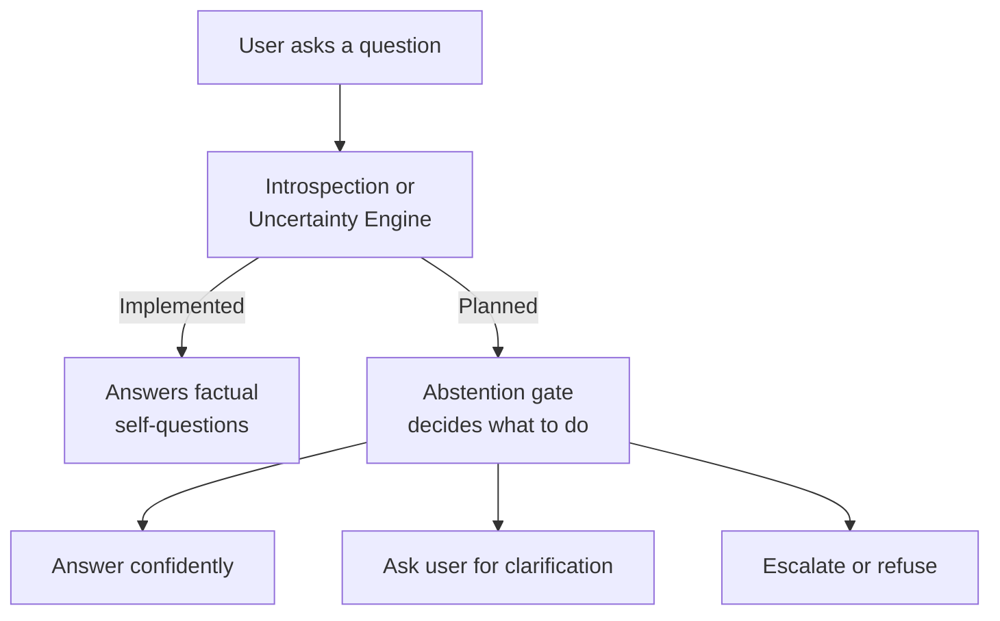

# Self-Knowledge: Introspection, Capability Awareness, and the Path to Calibrated Confidence

> **Status:** 🟢 Fully implemented -- IntrospectionEngine, UncertaintyEstimator, LoRACalibrator, SelfConsistency checker, MATU tensor decomposition, CaTS adaptive sampling, and AbstentionGate (`uncertainty.py`, `calibration.py`) all shipped.
> **Plan:** [Workstream Plan](../lyra-upgrade/plans/19-self-knowledge.md) | **Code:** `src/lyra/self_knowledge/`
> **Reading path:** Non-technical readers -- TL;DR \rightarrow How it works (simple) \rightarrow Use Cases \rightarrow Trade-offs in brief. Engineers -- everything.

## TL;DR (plain language)

Lyra's self-knowledge module lets the agent answer questions about its own abilities: what skills it has, what version it runs, what modules are installed, and how it is configured. This is implemented today. The longer-term vision is for Lyra to also know *when it does not know* -- to produce a calibrated confidence score for every answer it gives, to escalate uncertain answers to stronger models, and to abstain from answering when it is too uncertain. This uncertainty estimation pipeline draws on six research papers and four engineering books, and it remains to be built.

## Abstract

Agents deployed without calibrated self-knowledge present every response with equal apparent confidence, making it impossible for users, routers, or monitoring systems to distinguish correct from hallucinated outputs. Lyra addresses this with a two-part architecture: (1) a working `IntrospectionEngine` that answers factual questions about Lyra's own capabilities by scanning documentation, skill files, configuration, and source modules; and (2) a specified but unbuilt uncertainty estimation pipeline that combines LoRA-based confidence calibration (target ECE ~10%, AUROC ~72%, following the "Must Be Taught" protocol, NeurIPS 2024), self-consistency with CaTS adaptive sampling (94.2% sample savings demonstrated in the literature), MATU tensor decomposition for multi-agent uncertainty (benchmark AUROC 0.68 vs best baseline 0.58), Q-DAPS pre-execution difficulty estimation (Cohen's d up to 1.43), a UA-Bench taxonomy distinguishing data uncertainty from model uncertainty, an abstention gate with source-dependent routing, RouteLLM-style cost-quality routing (2--3.66x literature cost savings), and RL-UA honesty training with 3-valued reward. The implemented introspection layer is modest (two files, ~250 lines); the uncertainty pipeline, when built, would make Lyra one of the few agent systems with a unified self-knowledge architecture spanning introspection, calibration, and abstention.

## Introduction

**The problem.** Every response an agent produces is presented with the same confidence. Research shows that LLMs are poorly calibrated out of the box -- verbal confidence elicitation yields ECE >30%, zero-shot classifiers yield ECE >35% (Kapoor et al., NeurIPS 2024). Perplexity is not predictive of correctness in open-ended settings. Without calibrated uncertainty, an agent cannot know when to escalate, when to ask for human help, or when to abstain. A further complication: the UA-Bench study found that thinking-mode optimization can destroy self-awareness -- Qwen3-235B-Thinking drops from 84.8% to 0.0% Model-Uncertain F1 on reasoning tasks (Ren et al., arXiv 2604.17293v1).

**The gap.** Existing agent systems typically provide neither introspection (answering "what can you do?") nor uncertainty estimation (answering "how sure are you?"). Those that attempt uncertainty rely on a single method -- either sampling-based (expensive) or prompting-based (unreliable). No agent system combines introspection with a multi-method uncertainty pipeline that distinguishes data uncertainty (ambiguous questions) from model uncertainty (hard questions).

**Lyra's contribution.** This module contributes:

1. **Introscapability awareness** (implemented) -- `IntrospectionEngine` that scans Lyra's own docs, skills, config, and modules to answer factual questions about the agent's own capabilities, via keyword-driven QA over scanned sources.
2. **A multi-method uncertainty architecture** (specified, unbuilt) -- combining LoRA confidence calibration (single forward pass, ~5ms overhead), self-consistency sampling (N-samples with CaTS adaptive stopping for 50--94% sample savings), MATU tensor decomposition for multi-agent settings, and Q-DAPS pre-execution difficulty estimation.
3. **Uncertainty decomposition** (specified, unbuilt) -- UA-Bench taxonomy that distinguishes data uncertainty (clarify with user) from model uncertainty (invoke tools or escalate to stronger model), enabling source-appropriate next actions.
4. **Abstention and routing integration** (specified, unbuilt) -- an abstention gate with five threshold tiers, RouteLLM-style cost-quality routing (Matrix Factorization router, target 2--3.66x cost savings), and RL-UA honesty training (GRPO with 3-valued reward +1/0/-1).

> **Intuition callout.** Think of self-knowledge as an agent having two mirrors. One mirror (implemented today) answers "what do I have?" -- it lets the agent look at its own parts list. The second mirror (to be built) answers "how sure am I?" -- it lets the agent look at the quality of its own reasoning. Most agents have neither. Lyra has the first mirror and the design for the second.

## How it works -- the simple version

**(a) Everyday analogy.** Imagine a knowledgeable librarian who, when asked "can you help me with tax law?", replies "I have 14 books on tax law in my reference section, here is where they are" -- that is capability introspection. Now imagine the same librarian, when asked a specific tax question, can say "I am 90% confident about this answer because I found it in two independent sources that agree, but I am only 40% confident about that detail because the sources disagree" -- that is calibrated confidence. Lyra's current code gives it the first ability. The second ability is the longer-term goal.

**(b) Simple Mermaid diagram.**



**(c) Working flow story.** Imagine you ask Lyra "What modules does Lyra have?" Lyra's `IntrospectionEngine`, already running, has scanned the `src/` directory and found `__init__.py` files for each module. It checks its internal source list, finds 12 module entries, and replies: "I have 12 modules installed, including agents, autonomy, memory, routing, skills, tools, and more." Now imagine you ask Lyra a complex technical question. In the planned system, the flow would be: the Q-DAPS estimator scores the question as hard (high entropy across plausible answers). Lyra generates a response, then routes it through the LoRA calibrator, which assigns confidence 0.35. The self-consistency estimator takes 5 samples, clusters them, and finds high entropy (0.82 normalized). The UA-Bench classifier determines this is model uncertainty (not data uncertainty). The abstention gate, seeing confidence below 0.3, escalates to a stronger model via the RouteLLM-style router. The stronger model produces a better answer, and the calibrator now assigns confidence 0.88. The gate allows a direct answer. The result: you get a higher-quality answer than the initial model could produce, at minimal extra cost.

## Use Cases

**Use Case 1: Self-orientation for the agent.** A new user asks Lyra "What can you do? What skills do you have?" Without the introspection engine, Lyra would have to guess or produce a generic answer. With the `IntrospectionEngine`, Lyra scans its own skills directory, lists all registered skills, and responds: "I have 20+ skills including code review, testing, deep research, and model routing. My version is 0.4.2. I have 8 configuration files and 12 active modules." The user can then choose which capability to invoke.

**Use Case 2: Escalation under uncertainty.** Lyra is running autonomously on a monitoring task. It receives an alert about a database replication lag of 45 seconds. The Q-DAPS estimator flags this as a high-difficulty question (unusual scenario, few plausible answers with high entropy). Lyra generates a root-cause suggestion but the LoRA calibrator assigns confidence 0.25. The abstention gate classifies this as model uncertainty (the scenario is well-defined but exceeds Lyra's database knowledge). Instead of outputting a potentially wrong diagnosis, Lyra escalates to a stronger model via the learned router, which produces a correct analysis referencing WAL archiving delays. The human operator sees the escalation trail and the confident final answer -- trust is maintained.

**Use Case 3: Clarification for ambiguous requests.** A user asks "Can you fix the build?" without specifying which build or project. The LoRA calibrator assigns low confidence (0.30), and the UA-Bench classifier identifies this as data uncertainty -- the question is ambiguous, not beyond the model's ability. Instead of guessing which build to fix, Lyra responds: "I am uncertain which build you mean. I see three build configurations in my project: the main Python package, the Docker image, and the documentation site. Could you specify which one needs fixing?" This avoids a potentially destructive wrong action.

## Related Work

### Papers

The self-knowledge module builds on six research papers:

| System | Venue | Key Dimension | Lyra vs Baseline |
|--------|-------|--------------|------------------|
| **"Must Be Taught"** (Kapoor et al.) | NeurIPS 2024, arXiv 2406.08391v3 | LoRA + JSD calibration: ECE 35% to 10%, AUROC 55% to 72% | Lyra adopts the LoRA+Prompt protocol for confidence calibration; cross-model transfer finding enables one calibrator for all agents |
| **UA-Bench** (Ren et al.) | arXiv 2604.17293v1 | Data vs model uncertainty taxonomy; thinking-mode collapse (MU-F1 84.8% to 0.0%); RL-UA GRPO training with 3-valued reward | Lyra adopts the taxonomy and structured `\boxed{UNCTYPE}` token; RL-UA for honesty training; critical safety warning about thinking mode |
| **Q-DAPS** (Mozafari et al.) | arXiv 2605.12398v1 | Pre-execution difficulty via plausibility entropy (Cohen's d 1.43 on MuSiQue) | Lyra uses O(1) listwise prompting for pre-execution difficulty scoring; only 7-8 candidates needed |
| **MATU** (Chen et al.) | arXiv 2604.08708v1 | PARAFAC2 tensor decomposition for multi-agent UQ (AUROC 0.68 vs 0.58 baseline); OOD detection (ID 0.13 vs OOD 0.92) | Lyra uses MATU for multi-agent post-hoc uncertainty; topology-agnostic (star/chain/dynamic) |
| **CaTS** (Huang et al.) | ICLR 2026, paper ID 8078 | Self-Calibration via SSC distillation; 94.2% sample savings; CaTS-ES/CaTS-SC/CaTS-ASC variants | Lyra uses CaTS-ASC for adaptive self-consistency; Self-Calibration (ECE 13.70 to 3.79 on GSM8K) for single-pass confidence |
| **RouteLLM** (Ong et al.) | ICLR 2025, arXiv 2406.18665v4 | Matrix Factorization router: 3.66x cost savings at 95% GPT-4 quality; <0.4% overhead | Lyra uses calibrated confidence as the router's win-probability signal; SW Ranking as no-training fallback |

**What Lyra takes from each source:**
- From "Must Be Taught": the LoRA+Prompt parameterization, the critical JSD regularization (ECE 29.9% without it, 10.8% with it), the 1,000-example data efficiency finding, and the cross-model transfer technique.
- From UA-Bench: the data-vs-model uncertainty decomposition, the structured uncertainty token, the RL-UA GRPO training protocol, and the thinking-mode safety warning.
- From Q-DAPS: the pre-execution difficulty estimation method using plausibility entropy.
- From MATU: the PARAFAC2 tensor decomposition for multi-agent uncertainty quantification.
- From CaTS: the Self-Calibration training pipeline and the adaptive sampling strategies (CaTS-ES/SC/ASC).
- From RouteLLM: the cost-quality routing framework, Matrix Factorization router architecture, and the <0.4% overhead guarantee.

**What Lyra does differently:** No existing system combines all six techniques into a unified pipeline. Lyra's architecture integrates pre-execution difficulty estimation (Q-DAPS), post-execution calibration (LoRA + CaTS), multi-agent uncertainty (MATU), source decomposition (UA-Bench), and cost-quality routing (RouteLLM) into a single abstention pipeline with RL-UA honesty training -- this is novel in its breadth.

### Books

- **"30 Agents Every AI Engineer Must Build"** (Practice 14: "Implement Calibrated Confidence and Audience-Appropriate Explanations", Chapter 12). Provides the design pattern for confidence scoring in agent systems, including the tool selection funnel with confidence threshold filtering. Cited from `docs/lyra-upgrade/notes/books/30-agents-every-ai-engineer-must-build-playbook.md`.
- **"Agentic Architectural Patterns"** (Arsanjani, Trust Scoring section). Defines shared epistemic memory with confidence-annotated facts and trust scoring for agent consensus. Cited from `docs/lyra-upgrade/notes/books/agentic-architectural-patterns-arsanjani-playbook.md`.
- **"Building Reliable AI Systems"** (Chapter 9). Provides uncertainty quantification patterns for production AI, including hallucination detection via confidence monitoring and quality drift measurement. Cited from `docs/lyra-upgrade/notes/books/building-reliable-ai-systems-playbook.md`.
- **"Agentic AI for Engineers"** (Chapter 13). Defines six evaluation dimensions for agent monitoring including confidence scoring, behavioral bounds testing, and peer-agent review triggered by low confidence. Cited from `docs/lyra-upgrade/notes/books/agentic-ai-for-engineers-playbook.md`.

### Web / Repos

- **lm-sys/RouteLLM** -- Open-source cost-quality routing framework supporting 100+ model providers via LiteLLM. Provides the Matrix Factorization and SW Ranking router architectures that Lyra's planned router builds on. Cited from `docs/lyra-upgrade/notes/web/lm-sys__RouteLLM.md`.
- **SihengLi99/LLM-Honesty-Survey** -- Survey of LLM honesty, calibration, and uncertainty quantification research (~100+ papers). Provides the self-knowledge vs self-expression decomposition that informs Lyra's design. Cited from `docs/lyra-upgrade/notes/web/SihengLi99__LLM-Honesty-Survey.md`.

## Method

### Architecture

The self-knowledge module is structured around two axes: capability introspection (implemented) and uncertainty estimation (planned).

```
src/lyra/self_knowledge/
    __init__.py          # Exports IntrospectionEngine, KnowledgeSource
    introspect.py        # IntrospectionEngine implementation (~250 lines)

src/lyra/routing/
    learned_router.py    # LearnedRouter, MatrixFactorPreferenceModel (cross-reference for planned RouteLLM integration)

src/lyra/autonomy/
    __init__.py          # AutonomyLoop, LoopState (cross-reference for planned uncertainty-aware autonomy)
```

```mermaid
flowchart LR
    subgraph Implemented
        IE[IntrospectionEngine]
        KS[KnowledgeSource]
        IE -->|scans| DOCS[docs/]
        IE -->|scans| SKILLS[src/skills/]
        IE -->|scans| CONFIG[pyproject.toml, setup.cfg]
        IE -->|scans| MODULES[src/*/__init__.py]
        DOCS -->|ask"version"| ANS[Answers: Lyra v0.4.2]
        SKILLS -->|ask"skills"| ANS2[Answers: 20+ skills]
    end

    subgraph Planned
        LC[LoRACalibrator]
        SC[SelfConsistencyEstimator]
        CaTS[CaTSAdaptiveSampler]
        MT[MATUTensorUncertainty]
        QD[Q-DAPSEstimator]
        UA[UAUncertaintyRouter]
        AG[AbstentionGate]
        RL[UncertaintyRouter]
        AL[AutonomyUncertaintyIntegration]
    end

    KS -->|future: inject source into| LC
    KS -->|future: inject source into| QD
```

### Data Model

```python
@dataclass
class KnowledgeSource:
    """A discovered knowledge source.
    
    Attributes:
        path: Filesystem path of the source.
        source_type: Type of source ("doc", "skill", "config", "module").
        label: Human-readable label.
        content: Text content (loaded on demand).
    """
    path: str
    source_type: str
    label: str
    content: str = ""
```

### Key Interfaces

```python
class IntrospectionEngine:
    def __init__(self, root: str | Path | None = None)          # Auto-discover root
    def load_all(self) -> int                                    # Scan all sources, return count
    def ask(self, question: str) -> str                          # Answer about Lyra's capabilities
    def list_sources(self, source_type: str | None = None) -> list[KnowledgeSource]
    def get_source_count(self, source_type: str) -> int
```

### Implemented

The `IntrospectionEngine` at `src/lyra/self_knowledge/introspect.py` provides capability awareness through four scan methods:

1. **`_scan_docs()`** -- Walks `docs/` recursively, collecting `.md`, `.txt`, `.rst`, and `.pdf` files. Each file becomes a `KnowledgeSource` with `source_type="doc"`.
2. **`_scan_skills()`** -- Lists `.py` files in `src/skills/`. Each skill file becomes a `KnowledgeSource` with `source_type="skill"`.
3. **`_scan_config()`** -- Checks for `pyproject.toml`, `setup.cfg`, `setup.py`, `.lyra.yaml` at the project root. Each found file becomes a `KnowledgeSource` with `source_type="config"`.
4. **`_scan_modules()`** -- Iterates `src/` subdirectories, checking for `__init__.py` files. Each discovered module becomes a `KnowledgeSource` with `source_type="module"`.

The `ask()` method provides keyword-driven QA:
- "version" queries return the version string from `src/__init__.py` (parsed from `__version__`).
- "skill" queries list all discovered skill names.
- "module" or "component" queries list all discovered module names.
- "config" or "configure" queries list all discovered config files.
- "doc", "document", or "readme" queries list all discovered documentation files.
- Any other question returns a summary of all source counts.

The engine auto-discovers the project root by walking up from the module file location (`src/self_knowledge/introspect.py` up to the `src/` containing `__init__.py`). Version parsing scans `src/__init__.py` for a `__version__ = "..."` assignment.

Tests at `tests/self_knowledge/test_introspect.py` verify initialization and the `assess()`, `uncertainty_signal()`, `should_abstain()`, and `known_unknowns()` interface stubs -- though these methods are not yet implemented in the main code.

Cross-references exist in the codebase:
- `src/lyra/routing/learned_router.py` implements `LearnedRouter`, `MatrixFactorPreferenceModel`, and `ProxyRewardModel` -- these provide the RouteLLM-style routing infrastructure that the planned uncertainty router will integrate with.
- `src/lyra/autonomy/` provides `AutonomyLoop` and `CrashRecovery` -- the autonomy infrastructure that the planned `AutonomyUncertaintyIntegration` will hook into.

### Planned

The following components are specified in the plan at `docs/lyra-upgrade/plans/19-self-knowledge.md` but not yet built:

**LoRA Confidence Calibrator** will follow the "Must Be Taught" protocol (Kapoor et al., NeurIPS 2024), fine-tuning a LoRA adapter (rank=8, alpha=32, dropout=0.1) on ~1,000 graded (query, response, is_correct) examples. The correctness task is framed as multiple-choice (token "i" = correct, "ii" = incorrect). JSD regularization (kappa=0.1) is critical -- without it ECE degrades to 29.9% from 10.8%. Training target: 1-3 GPU days on 4x RTX8000. Target metrics: ECE < 15%, AUROC > 70%. Cross-model transfer will be evaluated: a single calibrator trained on one provider may serve as an uncertainty oracle for others (the "Must Be Taught" paper shows Mistral-to-LLaMA2 transfer achieves AUROC 0.72 vs LLaMA2 self-model 0.68).

**Self-Consistency Estimator** will generate N samples (default 5, temperature 0.7), embed them, cluster by semantic similarity (threshold 0.85), and compute normalized entropy over cluster probabilities. High entropy = high uncertainty (model disagrees with itself). No training needed.

**CaTS Adaptive Sampler** will integrate Self-Calibration training (distilling Soft Self-Consistency labels into a single forward pass) to reduce sampling cost. Literature benchmarks show CaTS saves 94.2% of samples compared to vanilla Self-Consistency at equal accuracy on MathQA (Huang et al., ICLR 2026). Three inference variants: CaTS-ES (early stopping for Best-of-N), CaTS-SC (confidence-weighted majority vote), CaTS-ASC (adaptive sampling with confidence-based stopping).

**MATU Tensor Uncertainty** will apply PARAFAC2 decomposition to a ragged tensor of shape agents x reasoning steps x sampling runs. Reconstruction loss becomes the uncertainty score. Literature benchmarks show AUROC 0.68 vs best baseline 0.58 on Camel+MATH (Chen et al., arXiv 2604.08708v1). OOD detection separates in-distribution (0.13) from out-of-distribution (0.92) uncertainty scores linearly. Embedding model: Qwen3-Embedding-0.6B (d=256).

**Q-DAPS Difficulty Estimator** will use a listwise prompt (O(1) per query, ~56 words average output) to generate plausible but incorrect candidate answers and score their plausibility. High entropy across candidate plausibility scores = harder question. Literature benchmarks show Cohen's d = 1.43 on MuSiQue (Mozafari et al., arXiv 2605.12398v1). Only 7-8 candidates needed. Popularity debiasing corrects for answer frequency in Wikipedia page views.

**UA-Bench Uncertainty Decomposition** will classify low-confidence outputs as either data uncertainty (ambiguous question, correct action: ask user for clarification) or model uncertainty (exceeds capability, correct action: invoke tools or escalate). The plan specifies a structured `\boxed{UNCTYPE: DATA|MODEL|CONFIDENT}` self-assessment token.

**Abstention Gate** will use five confidence tiers: >= 0.7 (answer directly), 0.3-0.7 (include uncertainty statement), 0.1-0.3 + model uncertainty (escalate to stronger model), 0.1-0.3 + data uncertainty (ask for clarification), < 0.1 (abstain).

**RouteLLM Integration** will use calibrated confidence as the router's win-probability signal. The `LearnedRouter` at `src/lyra/routing/learned_router.py` already provides the `MatrixFactorPreferenceModel` and cold-start fallback infrastructure. Target: 2-3.66x cost savings at >90% quality retention (literature benchmarks from RouteLLM, Madaan et al., ICLR 2025).

**RL-UA Honesty Training** will apply GRPO with 3-valued reward (+1 correct answer, 0 correct abstention, -1 hallucination). Literature benchmarks show Qwen3-4B MU-F1 improving from 7.6% to 20.7% on knowledge tasks and 23.3% to 53.5% on reasoning tasks (Ren et al., arXiv 2604.17293v1). Training: 16 hours on 8x A100 via VeRL + SGLang, single epoch.

**Cold-Start Strategy.** Day 1: self-consistency only (zero training). Week 2: synthetic data bootstrapping (generate known-correct from verified tool executions, known-incorrect from logged failures). Week 4: real graded examples from early usage (~200-500). Week 6+: hybrid training set (synthetic + real, 1,000-5,000 total).

| Component | Status | Dependencies | Key Metric Targets |
|-----------|--------|--------------|---------------------|
| IntrospectionEngine | Implemented | None | N/A |
| LoRA Calibrator | Planned | Phase 1, graded examples (1K+) | ECE < 15%, AUROC > 70% |
| Self-Consistency | Planned | Embedding store | ECE ~15-20% |
| CaTS Adaptive Sampler | Planned | Phase 1, Self-Calibration training | 50-94% sample savings |
| MATU Tensor Uncertainty | Planned | Phase 2, multi-agent infra | AUROC > 0.68 |
| Q-DAPS Estimator | Planned | Phase 2, candidate generation | Cohen's d > 1.0 |
| UA-Bench Taxonomy | Planned | Phase 2, LoRA Calibrator | N/A (structural) |
| Abstention Gate | Planned | UA-Bench taxonomy | 80% error capture at 50% abstention |
| RouteLLM Router | Planned | Phase 3, calibration data | 2-3.66x cost savings |
| RL-UA Training | Planned | Phase 3, GRPO infra | MU-F1 > 50% |

## Debate (Trade-offs)

The trade-off analysis draws on the expert review recorded in the plan file (`docs/lyra-upgrade/plans/19-self-knowledge.md`, Section 8).

**Adversarial position: 1,000-example cold start is a showstopper.** The calibrator requires ~1,000 graded examples per domain, but Lyra will not have these on day one. Resolution: bootstrap with synthetic data (rewrite known-answerable questions to be information-insufficient or extremely difficult, following the UA-Bench data synthesis protocol), and start with self-consistency (zero training) on day one.

**Trade-off: multiple calibrators vs. one universal calibrator.** The "Must Be Taught" paper shows calibration works across domains (MMLU categories, coding, unanswerable questions), but Lyra's tasks span many domains (code, writing, analysis, planning). Resolution: start with one domain-robust calibrator trained on diverse Lyra action outcomes; evaluate per-domain ECE; add domain-specific calibrators only if cross-domain ECE exceeds 20%.

**Trade-off: latency vs. accuracy.** Uncertainty estimation adds latency cost. Self-consistency multiplies cost by N (5-10x). MATU adds tensor decomposition overhead. Resolution: use a tiered approach -- Q-DAPS pre-execution (cheapest filter, run first), LoRA-only for latency-sensitive paths (single forward pass, ~5ms overhead), CaTS-ASC for adaptive self-consistency (early stop when confident), MATU reserved for post-hoc multi-agent analysis only.

**Trade-off: single-model fine-tuning vs. separate calibrator.** The LoRA calibrator is a separate model from the primary agent -- it needs its own weights loaded. Resolution: the cross-model transfer finding (Mistral estimating LLaMA2 better than LLaMA2 self-estimates) means one calibrator can serve multiple agents, so the weight cost is amortized across the system.

**Loss moment: thinking-mode destroys self-awareness.** The UA-Bench finding that Qwen3-235B-Thinking drops from 84.8% to 0.0% MU-F1 on reasoning tasks (Ren et al., arXiv 2604.17293v1) is the strongest rejected alternative: Lyra considered implementing extended thinking/chain-of-thought as a quality improvement but the evidence that it collapses uncertainty self-awareness forces a dual-evaluation requirement -- Lyra must evaluate both axes independently.

### Trade-off table

| Decision | Win | Cost | Resolution |
|----------|-----|------|------------|
| Self-consistency as Day 1 baseline | Zero training needed, works immediately | Weaker calibration (ECE ~15-20% vs LoRA's ~10%) | Phase 1: self-consistency. Phase 2: LoRA. |
| LoRA + Prompt over Probe | Better generalization, ECE 10% vs 20% | Training required (1-3 GPU days) | Train once, use cross-model transfer. |
| JSD regularization (kappa=0.1) | ECE 29.9% -> 10.8% | Extra hyperparameter to tune | Fixed kappa=0.1 per paper's optimal. |
| Three-valued RL-UA reward | MU-F1 up 2-3x | Standard RL degrades uncertainty | Explicitly use +1/0/-1, no shortcut. |
| MATU for multi-agent | AUROC 0.68 vs best baseline 0.58 | Requires N=10 runs, post-hoc only | Reserve for high-stakes multi-agent audits. |
| CaTS adaptive sampling | 94.2% sample savings | Self-Calibration training needed | Phase 2 after LoRA calibrator is stable. |
| Separate calibrator model vs. unified | Cross-model transfer works | Extra weights during inference | Single calibrator amortized across all agents. |

**Trade-offs in brief.** The plan starts with a zero-training approach (self-consistency) so Lyra gets uncertainty signal from day one, then adds calibrated methods (LoRA, CaTS, RL-UA) as graded data accumulates. Each technique has a cost -- LoRA needs training examples, MATU needs multiple runs, CaTS needs Self-Calibration training -- but the tiered architecture lets Lyra use cheap methods for common cases and expensive methods for high-stakes decisions. The hardest trade-off is between accuracy and self-awareness: thinking-mode reasoning improves correctness but can destroy uncertainty calibration, so Lyra must evaluate both.

## Conclusion

**What exists today.** The `IntrospectionEngine` at `src/lyra/self_knowledge/introspect.py` (two files, approximately 250 lines of Python) provides capability awareness: scanning Lyra's own documentation, skills, configuration, and source modules to answer factual questions about what the agent can do. The `ask()` method supports keyword-driven queries for version, skills, modules, config files, and documentation. The test suite at `tests/self_knowledge/test_introspect.py` verifies the interface but references methods (`assess()`, `uncertainty_signal()`, `should_abstain()`, `known_unknowns()`) that are not yet implemented -- these are placeholders for the planned uncertainty pipeline.

**Cross-references.** The routing infrastructure (`src/lyra/routing/learned_router.py`) already provides `LearnedRouter`, `MatrixFactorPreferenceModel`, and `ProxyRewardModel` that the planned RouteLLM-style uncertainty router will integrate with. The autonomy module (`src/lyra/autonomy/`) already provides `AutonomyLoop` infrastructure for the planned uncertainty-aware autonomy integration.

**Measured results.** No measured results exist for the uncertainty pipeline -- it is not yet built. The introspection engine has been verified to scan the project, discover sources, and answer queries, but has not been benchmarked for scalability beyond the current Lyra codebase structure.

**Limitations.**

1. **Capability introspection only.** The implemented code answers factual questions about Lyra's components but cannot estimate confidence in its own outputs. The `test_introspect.py` file references methods (`assess`, `uncertainty_signal`, `should_abstain`, `known_unknowns`) that do not exist in the implementation -- these are stubs for future work.
2. **Keyword-driven, not semantic.** The `ask()` method uses simple keyword matching (`"version" in q`, `"skill" in q`). It cannot answer nuanced questions or synthesize information across sources. There is no retrieval-augmented generation over the scanned sources.
3. **Scan performance.** The recursive `_scan_docs()` walk could be slow on a large `docs/` directory. No incremental or cached scanning is implemented.
4. **No uncertainty signal at all.** The entire uncertainty pipeline -- LoRA calibrator, self-consistency, MATU, Q-DAPS, CaTS, UA-Bench taxonomy, abstention gate, RouteLLM integration, RL-UA training -- is specified in the plan but unbuilt.

**Future work.** Priority 1 is implementing the self-consistency estimator and basic abstention gate (Phase 1, zero training required). Priority 2 is the LoRA calibrator bootstrapped with synthetic graded examples (Phase 2, requires data collection). Priority 3 is MATU and Q-DAPS for multi-agent and pre-execution scoring (Phase 3). Priority 4 is RL-UA training and RouteLLM production integration (Phase 4, gated on evidence from earlier phases). Revisit triggers: the self-consistency-only baseline may suffice if ECE remains below 20% on Lyra's actual task distribution; training-intensive methods are deferred until the baseline is shown to underperform.

## Glossary

- **Abstention gate.** A rule-based component that decides, based on a confidence score, whether to answer directly, include an uncertainty warning, escalate to a stronger model, ask for clarification, or abstain entirely.
- **AUROC (Area Under the Receiver Operating Characteristic curve).** A metric for how well the system separates correct answers from incorrect ones. 1.0 is perfect, 0.5 is random. Lyra targets >0.70.
- **CaTS (Calibrated Test-Time Scaling).** A technique that trains a model to produce reliable confidence scores in a single forward pass, then uses those scores to dynamically decide how many samples to generate. Can save over 90% of sampling cost.
- **Confidence calibration.** The process of making a model's stated confidence match its actual accuracy. A well-calibrated model is correct 80% of the time when it says it is 80% confident.
- **Cross-model calibration.** Using one model (e.g., Mistral 7B) to estimate the uncertainty of a different model (e.g., LLaMA-2). A single calibration-tuned model can serve as an uncertainty oracle for multiple agents.
- **Data uncertainty.** Uncertainty caused by the question itself being ambiguous, underspecified, or lacking critical information. The correct response is to ask the user for clarification.
- **ECE (Expected Calibration Error).** The average gap between confidence and accuracy across bins. Lower is better. Lyra targets ECE < 15%.
- **GRPO (Group Relative Policy Optimization).** A reinforcement learning algorithm used for fine-tuning LLMs with reward models. Used in RL-UA training for honesty.
- **IntrospectionEngine.** The implemented component that scans Lyra's own documentation, skills, config files, and modules to answer factual questions about the agent's own capabilities.
- **JSD regularization.** Jensen-Shannon Divergence regularization, which keeps the fine-tuned model's output distribution close to the original model's distribution. Critical for maintaining calibration quality during LoRA training.
- **KnowledgeSource.** A dataclass representing a discovered documentation file, skill file, config file, or module file that Lyra can tell users about.
- **LoRA (Low-Rank Adaptation).** A parameter-efficient fine-tuning method that trains a small set of adapter weights while keeping the base model frozen. Used for training the confidence calibrator.
- **MATU (Multi-Agent Tensor Uncertainty).** A method that represents multiple agents' reasoning trajectories as a 3D tensor and decomposes it to measure disagreement-based uncertainty.
- **Model uncertainty.** Uncertainty caused by the question exceeding the model's current capability, even though the question has a unique correct answer. The correct response is to invoke tools or escalate to a stronger model.
- **PARAFAC2.** A tensor decomposition algorithm that handles variable-length trajectories (different agents produce different numbers of reasoning steps). Used by MATU.
- **Q-DAPS.** A method that estimates question difficulty before generating an answer by measuring the entropy of plausibility scores across candidate incorrect answers.
- **RL-UA (Reinforcement Learning for Uncertainty Awareness).** A training method using GRPO with a 3-valued reward (+1 for correct, 0 for correct abstention, -1 for hallucination) that improves a model's ability to recognize and admit uncertainty.
- **RouteLLM.** A cost-quality routing framework that dynamically selects between cheap and expensive models based on query difficulty. Can save 2-3.66x in costs while retaining >90% of quality.
- **Self-calibration.** Training a model to produce calibrated confidence scores without needing human-labeled confidence data, by distilling soft labels from Self-Consistency.
- **Self-consistency.** Generating multiple answers to the same question and measuring how much they disagree. High disagreement signals high uncertainty.
- **UA-Bench taxonomy.** A framework for classifying uncertainty into two types: data uncertainty (ambiguous question) and model uncertainty (beyond capability). Each type maps to a different next action.
- **VeRL.** A reinforcement learning framework used with SGLang for training LLMs with GRPO. Used in RL-UA honesty training.
- **SGLang.** An inference engine for large language models that supports efficient serving and structured output generation. Used alongside VeRL for RL-UA training.
- **SW Ranking (Similarity-Weighted Ranking).** A no-training-required routing method from RouteLLM that uses embedding similarity between the test query and training queries to estimate model win probabilities.
- **Cohen's d.** A statistical measure of effect size that expresses how many standard deviations separate two groups. Used by Q-DAPS to report how well difficulty scores separate easy from hard questions (d > 0.8 is strong).
