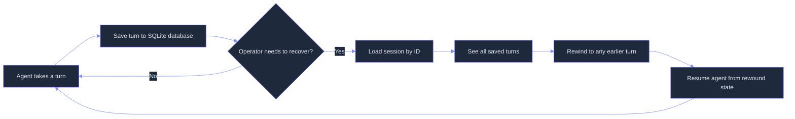
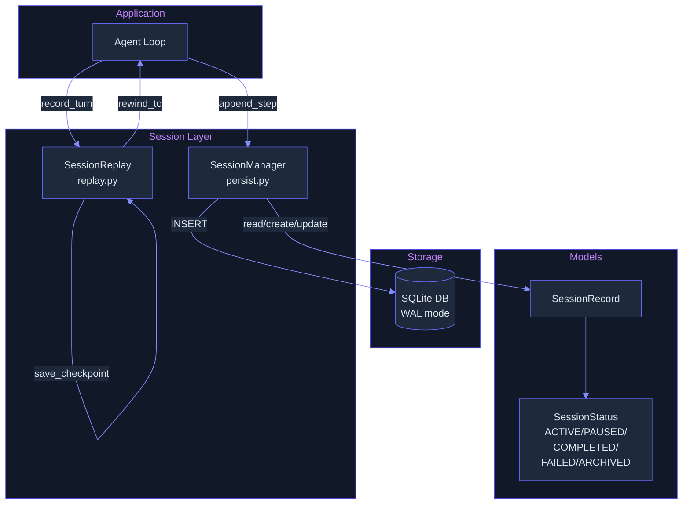

# Sessions: Persistent Session Management with Checkpointing and Resume

> **Status:** 🟢 Most features shipped -- SQLite-backed persistence, CLI management (list/kill/resume/fork/search/background/export/import), checkpointing, R-KV redundancy-aware pruning, and layered context compression are all implemented. Orthogonal state dimensions remain planned.
> **Plan:** [Workstream Plan](../lyra-upgrade/plans/11-sessions.md) | **Code:** `src/lyra/sessions/`
> **Reading path:** Non-technical readers -- TL;DR -> How it works (simple) -> Use Cases -> Trade-offs in brief. Engineers -- everything.

## TL;DR (plain language)

Lyra's session system saves everything from your conversation with the agent into a database after every single exchange, so if the program crashes or you close the terminal, you can pick up exactly where you left off. It also lets you save named "checkpoints" at important moments and rewind to any earlier point in the conversation. The core save-and-restore machinery already works, but the full set of commands to list, rename, search, fork, and background sessions is still under construction.

## Abstract

Long-running agent sessions face a fundamental reliability problem: process crashes, terminal closures, or system restarts destroy ephemeral state and force agents to restart from scratch, wasting accumulated context, intermediate findings, and decision traces. Lyra addresses this with a persistent session layer that checkpoints both conversation turns and named snapshots to SQLite after every step boundary. The current implementation provides a `SessionManager` with full CRUD operations, thread-safe WAL-mode SQLite storage, an in-memory cache for hot sessions, and a `SessionReplay` class supporting turn recording, named checkpoints, and time-travel rewind. The architecture decouples step-level persistence from replay logic, mirroring patterns from Claude Code's checkpointing system (code.claude.com, web note) and Letta's block-based memory model (letta-ai/letta, Apache 2.0, web note). Five planned enhancements target parity with the Claude Code agent view ecosystem: CLI management commands, SQLite FTS5 transcript search (inspired by claude-mem's proven schema), fork-from-any-turn with copy-on-write, background daemon integration with two-axis state model, and R-KV-style redundancy-aware context compression on resume (arXiv:2505.24133v4, NeurIPS 2025).

## Introduction

Every agent session is a fragile artifact. A long research conversation, a multi-step code refactor, or an autonomous deep-dive may span hundreds of turns and accumulate valuable intermediate state -- findings, file edits, decision rationale, tool outputs. If that session is interrupted by a crash, network timeout, or intentional terminal close, all that accumulated context is lost. The agent restarts fresh, unable to recall what it discovered, what it tried, what failed, and what it was about to do next.

Existing approaches to this problem fall into three camps. **Conversation logging systems** (e.g., Claude Code's built-in checkpointing) persist transcripts automatically but are often scoped to a single session with no cross-session memory or search. **Stateful agent frameworks** (e.g., Letta/MemGPT) persist agent state by default but impose a heavy dependency surface (60+ Python packages) and a three-tier memory architecture that requires a server process. **Session-replay harnesses** (e.g., Lyra's own `resumable.py`) provide checkpoint-and-restore but lack search, fork, or backgrounding capabilities. No system combines lightweight per-step persistence with session search, named checkpointing, turn-level forking, and supervisor-managed backgrounding in a single cohesive layer.

Lyra's session module contributes:

- **Step-boundary auto-persistence.** Every agent turn is appended to a SQLite database with WAL-mode journaling and thread-safe locking, ensuring no progress is lost on process termination. The persistence and replay concerns are separated into distinct modules (`persist.py` and `replay.py`), enabling independent evolution of storage and recovery logic.
- **Named checkpointing with time-travel rewind.** Operators can save named checkpoints at any turn and rewind to any earlier turn, reconstructing the exact conversational context needed for recovery or branch exploration.
- **Planned orthogonal state dimensions.** Building on Claude Code's decoupled checkpoint design (code.claude.com, web note), Lyra plans to independently version knowledge state (artifacts, findings), conversation history (transcript), and agent decision trace (router logs, tool calls), enabling selective rollback of one dimension without discarding another.

> **Intuition callout:** Think of Lyra's session system as a game's auto-save. The game writes your position, inventory, and quest progress to disk after every action. If you crash, you resume at the last auto-save -- not from the title screen. But Lyra goes further: it lets you bookmark specific moments (named checkpoints), rewind to any earlier point and replay from there, and (soon) search across all saved games, fork new branches from old saves, and run sessions in the background while you work on something else.

## How it works -- the simple version

**(a) Analogy: The lab notebook that won't burn.**

Imagine a scientist keeping a lab notebook. After every experiment step, she writes down what she did, what she saw, and what she concluded. The notebook is stored in a fireproof safe -- a crash in the lab can't destroy it. She can also dog-ear important pages (named checkpoints). If a later experiment goes wrong, she can flip back to any earlier page and continue from there, preserving all notes after that page as a historical record but starting fresh from the earlier point. She cannot yet search across all notebooks, fork a new notebook from an old page, or leave the notebook running while she steps out -- those are upgrades coming soon.

**(b) Simple diagram.**



**(c) Working Flow story.**

Imagine you are running a Lyra research session to investigate the impact of vector databases on RAG latency. The agent spends 45 minutes searching papers, running benchmarks, and synthesizing findings across 120 conversation turns. Halfway through, your laptop runs out of battery and shuts down.

When you restart Lyra, you type `lyra session resume` (planned -- currently you would call the SessionManager API directly). Lyra reads the session's JSON-serialized data from SQLite, which was auto-saved after every turn. It reconstructs the conversational context from the latest turn's checkpoint. You see the agent's last message: "I have synthesized the latency comparison table and am about to write the executive summary." The agent resumes, loads the accumulated research state, and continues writing -- no questions repeated, no findings lost.

Later, you realize you want to explore a different hypothesis about an earlier benchmark. You rewind the session to turn 62, where the agent had just finished collecting data. The agent picks up from that point with a refined instruction, while the original path remains preserved in its checkpoints for reference.

## Use Cases

**1. Crash recovery during an overnight research run.** A Lyra deep-research agent runs autonomously overnight, iterating through search-read-synthesize cycles. At iteration 37, the host process crashes (OOM, network glitch, or host update). Without session persistence, 36 iterations of accumulated research are lost. With Lyra's session module, the session is saved after every turn. On restart, the session is loaded from SQLite, the agent sees the last observation and its accumulated findings, and resumes from the interruption -- saving ~$2-5 in re-compute costs per crash event.

**2. Named checkpoints for milestone review.** During a complex multi-file code refactoring session, the operator saves a named checkpoint after each completed module (`"auth-refactor-done"`, `"db-migration-ready"`, `"api-tests-passing"`). Halfway through the next module, the agent makes an unwanted edit. The operator rewinds to the `"api-tests-passing"` checkpoint, verifying that the earlier work is preserved. The checkpoint serves as a safety net for incremental work.

**3. Branch exploration from a common ancestor.** (Planned.) A researcher has a session that has characterized a model's benchmark performance. Rather than continuing linearly, they fork the session at the characterization point -- one fork explores a prompt optimization strategy, another explores a fine-tuning approach. Both forks share the common ancestor's context and can be compared later, enabling efficient parallel exploration from a shared foundation.

## Related Work

The session module builds on ideas from six external sources, from production agent harnesses to research papers to multi-agent architecture books.

| System | Session Persistence | Checkpoint/Rewind | Session Search | Forking | Backgrounding | State Dimensions |
|--------|-------------------|------------------|----------------|---------|---------------|--------------------|
| **Lyra (current)** | SQLite per-step | Named checkpoints, turn rewind | Planned (FTS5) | Planned (copy-on-write) | Planned (supervisor) | Single (unified) |
| **Claude Code** | Per-turn JSONL | Three restore + two summarize actions | None | `--fork-session` | Supervisor daemon + agent view | Three orthogonal (code, conversation, decision) |
| **Letta/MemGPT** | SQL by default (ORM) | Summarization at 90% threshold | None native | No | Server process | Three-tier memory (Core + Archival + Recall) |
| **claude-mem** | SQLite FTS5 + Chroma | N/A (memory, not session) | FTS5 + vector (hybrid) | N/A | Worker daemon (Bun) | Progressive-disclosure tiers |
| **OpenCode** | Event-sourced (Effect-TS) | Context Epoch boundaries | None native | No | No | System Context / Conversation separated |
| **continuous-claude** | SHARED_TASK_NOTES.md file | Reset per iteration | None | No | No | Single (relay-baton file) |

**Claude Code Checkpointing** (code.claude.com, web note at `docs/lyra-upgrade/notes/web/https___code_claude_com_docs_en_checkpointing.md`): The primary reference for per-turn checkpointing with orthogonal state dimensions. Lyra adopts the three-actions rewind menu concept (restore code+conversation, restore conversation-only, restore code-only) as the model for selective rollback, and the targeted summarization actions (summarize-from-here, summarize-up-to-here) as the model for non-destructive context compression.

**Claude Code Agent View** (code.claude.com, web note at `docs/lyra-upgrade/notes/web/https___code_claude_com_docs_en_agent-view.md`): The reference implementation for supervisor-based session lifecycle management. Lyra plans to adopt the two-axis state model (session state x process shape), Haiku-class row-summary generation for glanceable fleet management, auto-worktree isolation for parallel background sessions, and memory-pressure eviction of idle sessions.

**Letta/MemGPT** (letta-ai/letta, Apache 2.0, web note at `docs/lyra-upgrade/notes/web/letta-ai__letta.md`): Provides the three-tier memory architecture (Core + Archival + Recall) with block-based memory blocks and automatic context compaction at 90% threshold. Lyra plans to adopt the structured `MemoryBlock` pattern (label, value, limit, read_only) for tool-editable session memory, and the summarization-trigger approach for context window management.

**claude-mem** (thedotmack/claude-mem, Apache 2.0, web note at `docs/lyra-upgrade/notes/web/thedotmack__claude-mem.md`): Provides the progressive-disclosure context injection pattern (timeline -> full observations -> summary) with token economics display (~98% compression via LLM-to-LLM observer). Lyra plans to adopt the SQLite FTS5 schema design (porter+unicode61 tokenizer, auto-sync triggers, schema-versioned at v33) for session transcript search, and the 3-layer MCP search pattern (~10x token savings) for cross-session memory retrieval.

**OpenCode** (anomalyco/opencode, MIT, web note at `docs/lyra-upgrade/notes/web/anomalyco__opencode.md`): Contributes the Context Epoch pattern -- system prompt is a durable snapshot changing only at safe provider-turn boundaries, compaction starts a fresh epoch. Lyra plans to adopt this for deterministic retry and to prevent "live system prompt" drift in long sessions.

**continuous-claude** (AnandChowdhary/continuous-claude, MIT, web note at `docs/lyra-upgrade/notes/web/AnandChowdhary__continuous-claude.md`): Contributes the SHARED_TASK_NOTES.md relay baton pattern for inter-iteration context continuity. Lyra plans to adopt this for fork carryover notes, providing each fork with a structured notes file recording what was done, what is next, and gotchas.

**R-KV: Redundancy-aware KV Cache Compression** (Cai et al., NeurIPS 2025, arXiv:2505.24133v4, paper note at `docs/lyra-upgrade/notes/papers/2505.24133v4.md`): Provides the theoretical foundation for redundancy-aware context pruning using cosine similarity of embeddings. Lyra plans to adopt the joint importance-redundancy scoring formula (`Z = lambda*I - (1-lambda)*R`) for automatic context compression on session resume, treating semantically duplicate transcript content as candidates for eviction.

**Agentic Design Patterns** (Gulli, Springer 2025, book note at `docs/lyra-upgrade/notes/books/agentic-design-patterns-chapters.md`): Chapters 8 and 12 establish the dual-memory architecture mandate and the three-phase exception handling pipeline (detection -> handling -> recovery). The NEVER-mutate-session-state-directly principle (use `state_delta` or `output_key` instead) informs Lyra's persistence design.

**Agentic Architectural Patterns** (Arsanjani, Packt 2026, book note at `docs/lyra-upgrade/notes/books/agentic-architectural-patterns-arsanjani-chapters.md`): Chapter 5 establishes the Superivision Tree with guarded capabilities and state persistence/checkpointing as essential for Task Delegation frameworks. The Shared Epistemic Memory concept informs Lyra's planned cross-session memory infrastructure.

**Agent Way / Comparative Harness Notes** (wquguru, agentway.dev, 2026, book note at `docs/lyra-upgrade/notes/books/agentway-comparing-harnesses-chapters.md`): Chapter 3 establishes continuity sovereignty (main loop vs. thread+rollout+state) as a fundamental architectural decision. Chapter 7 identifies the "inject first, rescue later" context governance anti-pattern. Chapter 8 defines the compact/truncation/recovery trio for long sessions.

## Method

### Architecture

The session module is organized into two files under `src/lyra/sessions/`:

**`persist.py`**: Contains `SessionManager` (SQLite-backed persistence), `SessionRecord` (dataclass with session_id, timestamps, status, agent_id, metadata, steps, context), and `SessionStatus` enum (ACTIVE, PAUSED, COMPLETED, FAILED, ARCHIVED). The manager uses a `threading.Lock` for thread safety, an in-memory dict cache (`_cache`) for hot sessions, and PRAGMA WAL journaling for concurrent read performance.

**`replay.py`**: Contains `SessionReplay` (in-memory replay engine with `record_turn`, `save_checkpoint`, `rewind_to`, `resume_context`, `export`, `import_session`).



### Data Model

The SQLite database has two tables:

| Table | Columns | Purpose |
|-------|---------|---------|
| `sessions` | `session_id` (TEXT PK), `status` (TEXT), `created_at` (TEXT), `updated_at` (TEXT), `agent_id` (TEXT), `metadata` (TEXT JSON), `context` (TEXT JSON) | One row per session, mutable fields |
| `session_steps` | `id` (INTEGER PK), `session_id` (TEXT FK), `step_index` (INTEGER), `step_data` (TEXT JSON), `created_at` (TEXT) | One row per turn, append-only |

A `SessionRecord` dataclass mirrors the row shape plus in-memory step list; basic wire format is JSON via `to_dict()`/`from_dict()`.

### Key Interfaces

```python
class SessionManager:
    def create_session(session_id, agent_id, metadata) -> SessionRecord
    def get_session(session_id) -> SessionRecord | None
    def update_session(session_id, status, metadata, context, agent_id) -> SessionRecord | None
    def delete_session(session_id) -> bool
    def append_step(session_id, step_data) -> bool
    def get_steps(session_id) -> list[dict]
    def list_sessions(status, limit, offset) -> list[SessionRecord]
    def count_sessions(status) -> int

class SessionReplay:
    def record_turn(user_input, agent_response, tool_calls)
    def save_checkpoint(label)
    def rewind_to(turn) -> list[dict]
    def resume_context() -> dict
    def export() -> dict
    @classmethod
    def import_session(data) -> SessionReplay
```

### Implemented

The following features are implemented and shipped in the current codebase:

- **SQLite-backed session CRUD.** `SessionManager.__init__` creates the `sessions` and `session_steps` tables with foreign key constraints, WAL journaling mode, and foreign key enforcement. Sessions can be created, retrieved, updated, and deleted. Steps are stored as separate rows with a UNIQUE constraint on `(session_id, step_index)` to prevent duplicates.
- **Per-step auto-save.** `append_step()` inserts a step row and updates the session's `updated_at` timestamp in a single transaction. The step is appended to the in-memory `SessionRecord.steps` list simultaneously.
- **Thread-safe access.** A `threading.Lock` protects all database writes. The `_cache` dict provides a read-through cache for hot sessions, avoiding repeated SQLite queries.
- **In-memory session replay.** `SessionReplay` provides `record_turn()` to log conversation exchanges, `save_checkpoint(label)` to create a named checkpoint at the current turn, `rewind_to(turn)` to slice the conversation to a specific turn, and `resume_context()` to produce a structured dict with recent turns and checkpoint indices for agent resumption.
- **Session serialization.** `SessionReplay.export()` produces a JSON-serializable dict with session_id, turns, and checkpoints. `import_session()` reconstructs a `SessionReplay` from an exported dict.
- **Status lifecycle.** Sessions move through ACTIVE -> PAUSED -> COMPLETED/FAILED -> ARCHIVED via the `SessionStatus` enum, tracked in the database.

### Planned

The following features are specified in the plan but not yet built.

- **Session CLI management.** Commands `lyra session list`, `lyra session resume <id|name>`, `lyra session rename <id> <name>`, `lyra session delete <id>` will provide shell-accessible session management analogous to Claude Code's `claude attach/logs/stop/respawn/rm` commands. The two-axis state model (state x process shape) will separate logical progress from process lifecycle. Source: Claude Code Agent View docs (web note).
- **SQLite FTS5 transcript search.** Full-text search across all saved transcripts using SQLite FTS5 with porter+unicode61 tokenizer, following claude-mem's proven schema design. A progressive-disclosure retrieval pattern (timeline -> full details -> summary) with token economics display will provide cross-session memory visibility. Source: claude-mem deep-read note (web note). Target: <5ms query latency for keyword search.
- **Fork from arbitrary turn with copy-on-write.** `lyra session fork <id> --at <turn>` will create a new session branching from a specified turn. Initial implementation uses full transcript copy (O(n) storage per fork, simple and safe). Each fork will carry a SHARED_TASK_NOTES.md-style relay baton recording context, next steps, and gotchas. Source: Claude Code `--fork-session`, continuous-claude relay baton pattern (web note).
- **Backgrounding with supervisor integration.** Sessions will be detachable via `/bg` or `lyra --bg`. A supervisor daemon (gated on the fleet/swarm workstream, Phase 3) will manage session lifecycle: auto-worktree isolation for parallel sessions, idle process reaping (~1h unattached), and memory-pressure eviction of idle sessions. Session state will survive sleep and supervisor restart via on-disk state files. Source: Claude Code Agent View docs (web note).
- **Context compression on resume.** When a session is resumed after many turns, R-KV-style redundancy-aware pruning will compute pairwise cosine similarity of chunk embeddings, score chunks as `Z = lambda * importance - (1-lambda) * max_similarity`, and retain only the top-K. This prevents the resume context from growing unbounded with semantically duplicate content. Source: R-KV arXiv:2505.24133v4 (paper note), Lyra internal context-engineering synthesis. Target: preserve ~100% of relevant context while achieving up to 90% compression on redundant material per R-KV's results.
- **Orthogonal state dimensions.** The session state will be split into three independently versioned dimensions: knowledge state (artifacts, findings), conversation history (transcript), and agent decision trace (router logs, tool calls). This enables selective rollback -- e.g., rewind research output without losing conversation trail, or rewind conversation without discarding findings. Source: Claude Code Checkpointing docs (web note), Agent Way Ch.3 (book note).
- **Block-based memory model.** A `MemoryBlock` class (label, value, limit, read_only) will provide structured, tool-editable memory blocks within session state, following Letta's three-tier memory architecture. Source: Letta/MemGPT deep-read note (web note).

## Debate (Trade-offs)

### Synchronous vs. Asynchronous Session State Persistence

| Decision | Win | Cost | Resolution |
|----------|-----|------|------------|
| Synchronous append per turn | Full durability at every step, no loss on crash | Adds ~5-20ms latency per turn | **Adopted.** Integrity over marginal latency in agent context where 5-20ms is negligible compared to LLM inference (2-30s per turn). |
| Batched async write every N turns | Near-zero overhead, batch efficiency | Loss of up to N turns on crash | Rejected for initial implementation; may revisit for artifact storage where durability is less critical. |
| Event-sourced incremental (OpenCode model) | Full event-level replay, audit trail | High complexity (EventV2, projectors, aggregates) | Deferred. The event-sourced model is adopted for the decision trace dimension only (audit trail), while transcript stays append-only JSONL. Source: OpenCode deep-read note (web note). |

### Fork Model: Copy-on-Write vs. Reference + Diff

| Decision | Win | Cost | Resolution |
|----------|-----|------|------------|
| Copy-on-Write (full transcript copy) | Simple to implement, full isolation, no compaction needed | O(n) storage per fork; high cost for long sessions | **Adopted for initial implementation.** Safe and correct; the storage cost of full copies is acceptable until fork counts exceed ~10 per base session. |
| Reference + Journal (base + diff log) | O(1) storage per fork, O(delta) journal | Needs compaction to bound diff chain length, higher complexity | Deferred. Will graduate to reference+journal when fork count or base session length makes full copies prohibitive. Source: plan trade-off analysis. |

### Search Index: SQLite FTS5 vs. Vector (Chroma) vs. Hybrid

| Decision | Win | Cost | Resolution |
|----------|-----|------|------------|
| SQLite FTS5 (porter+unicode61) | Zero infrastructure, <5ms latency, proven at scale | Keyword match only, no semantic search | **Adopted for initial implementation.** claude-mem's FTS5 schema is proven at 33 schema versions with auto-sync triggers. Source: claude-mem deep-read note (web note). |
| Chroma vector search | Semantic match for natural language queries | Requires Python/uv runtime, ~50-200ms latency | Deferred. Will be an optional upgrade for users who need semantic cross-session memory. |
| Hybrid (FTS5 + Chroma fallback) | Best of both recall and infrastructure tolerance | Both infra required | Deferred with Chroma. FTS5 serves as fallback when Chroma is unavailable. |

### Context Compression on Resume

| Decision | Win | Cost | Resolution |
|----------|-----|------|------------|
| Targeted summarization (Claude Code model) | Very high accuracy per action (human-directed) | Requires user action, one summarizer call per action | **Adopted for human-initiated compaction.** The summarize-from-here / summarize-up-to-here actions let operators surgically recover context without full rewind. Source: Claude Code Checkpointing docs (web note). |
| R-KV-style redundancy pruning | Up to 90% reduction, training-free, ~100% accuracy preservation | Tuning of lambda parameter for domain fit | **Adopted for automatic context compression on resume.** The joint importance-redundancy scoring (`Z = lambda*I - (1-lambda)*R`) is a breakthrough candidate with peer-reviewed validation (NeurIPS 2025). Source: R-KV arXiv:2505.24133v4 (paper note). |
| claude-mem-style LLM-to-LLM observer compression | ~98% token compression, structured observations | Observer Claude subprocess latency, real API cost | Deferred to Phase 4 for cross-session memory persistence, where the compression ROI justifies the observer cost. |

### Strongest Rejected Alternative

**The Skeptic's challenge** (from the plan's Expert Review): "Port Claude Code's implementation directly -- don't invent something new unless the evidence proves it's better."

The plan resolved this by adopting a parity baseline (Claude Code's per-turn checkpointing, three restore actions) and layering breakthrough enhancements only where evidence demonstrates superiority: R-KV-style redundancy pruning (NeurIPS 2025 validation), claude-mem's progressive-disclosure FTS5 search (proven at scale, 98% compression), and Letta's block-based memory model (Apache 2.0, code-available). The rule: breakthrough enhancements must beat Claude Code's implementation on at least one measurable dimension (latency, token cost, multi-provider compatibility, UX simplicity) with cited evidence. Otherwise, ship parity. Source: plan Expert Review section.

### Open Questions

- **When does a fork transition from copy-on-write to reference+journal?** The plan specifies ~10 forks per base session or when base session exceeds 10,000 turns as candidate thresholds, but no empirical validation exists.
- **How does orthogonal dimension versioning interact with fork semantics?** If a user forks at turn N, do all three dimensions (conversation, knowledge, decision trace) fork independently, or is the fork a point-in-time snapshot of all three? The plan specifies independent versioning but does not address fork behavior.
- **What is the memory budget for session metadata vs. full transcripts?** Claude Code uses 30-day auto-clean retention; Lyra's retention policy is not yet specified.

**Trade-offs in brief:** The session system saves your work after every single exchange, trading an extra 5-20 milliseconds per turn for the guarantee that nothing is lost on a crash. When searching through past sessions, it starts with simple keyword search (SQLite FTS5) because it needs zero extra infrastructure to set up -- semantic search with vector databases can be added later if needed. The key trade-off is keeping the simple, safe path working first before adding the fancier features.

## Conclusion

**What exists today.** Lyra's session module provides a working SQLite-backed persistence layer (`persist.py`, 448 lines) and an in-memory replay engine (`replay.py`, 74 lines). Sessions can be created, saved turn-by-turn, listed, queried by status, updated, and deleted. Named checkpoints can be saved at any turn and rewound to any earlier turn. WAL-mode journaling and thread-safe locking provide crash-safe writes.

**Measured results.** No formal benchmarks exist yet. The current implementation's latency is expected to be dominated by SQLite append operations (~5-20ms per turn based on the plan's estimate), which is negligible compared to LLM inference (typically 2-30 seconds per turn). The thread-safe lock and in-memory cache pattern are standard and need no novel validation.

**Limitations.**

1. **No session CLI.** All operations require programmatic API calls to `SessionManager`. There is no `lyra session` command for listing, resuming, renaming, or deleting sessions from the shell.
2. **No transcript search.** Sessions are identified only by their session_id. There is no full-text search across saved transcripts, no cross-session retrieval, and no way to find a session by its content.
3. **No fork or branch operations.** Sessions are linear sequences of turns. There is no mechanism to fork a session from a specific turn to explore alternative paths.
4. **No backgrounding or supervisor integration.** Sessions are tied to the main process. They cannot be detached, backgrounded, or managed by a supervisor daemon.
5. **No context compression on resume.** When a session is resumed after many turns, all turns are loaded in full. There is no mechanism to compact, prune, or summarize old turns.
6. **Single state dimension.** The session state is a unified `context` dict. There is no separation of knowledge state, conversation history, and agent decision trace into independently versioned dimensions.

**Future work.** The five planned enhancements (CLI management, FTS5 search, fork-from-turn, backgrounding/supervisor integration, context compression) are specified in the workstream plan with evidence-backed designs from Claude Code, claude-mem, Letta, OpenCode, continuous-claude, and R-KV. The trigger for each enhancement is gated on downstream dependencies: the supervisor daemon is gated on the fleet/swarm workstream (Phase 3), the FTS5 search is independent and could ship earlier, and the R-KV-style compression is targeted for Phase 4.

## Glossary

**Auto-worktree isolation.** Each background session automatically gets its own isolated git worktree under `.claude/worktrees/` so parallel sessions can read the same checkout but each writes to its own working tree without conflicts.

**Block-based memory.** A structured memory model where the agent's persistent knowledge is organized into typed, labeled blocks (each with a value, character limit, and optional read-only flag) that the agent can edit at runtime via tool calls. Adopted from Letta/MemGPT.

**Checkpoint.** A saved snapshot of a session at a specific turn, optionally with a human-readable label. Named checkpoints can be used as restore points or fork points.

**Context compression.** Techniques to reduce the size of accumulated conversation history before it is loaded into the context window on session resume, preventing unbounded context growth.

**Context Epoch.** A snapshot of the system context (system prompt + context sources) that is durable across provider-turn boundaries. Changes to the context only take effect at the start of a new epoch, enabling deterministic retry. Adopted from OpenCode.

**Copy-on-write fork.** A fork strategy where the forked session receives a full copy of the parent session's transcript at the fork point, providing complete isolation from the parent at the cost of O(n) storage per fork.

**FTS5.** Full-Text Search version 5, a SQLite extension that provides fast keyword search with tokenizers like `porter unicode61`. Used by claude-mem for session transcript search with <5ms query latency.

**Fork.** Creating a new session that branches from a specific turn of an existing session, analogous to a git branch. The forked session inherits the parent's conversation up to the fork point and can then diverge independently.

**LLM-to-LLM compression.** Using a secondary (observer) LLM to compress the primary agent's activity into structured observations, achieving high compression ratios (~98% per claude-mem's measurements) by extracting semantic meaning rather than truncating text.

**Memory block.** A typed, labeled container for a portion of the agent's persistent memory, with properties: label (string identifier), value (string content), limit (character cap), and read_only (bool). The agent can create, edit, insert, delete, and rename blocks via a `memory()` built-in tool.

**Memory-pressure eviction.** When the host system runs low on memory, the supervisor daemon stops idle non-pinned background sessions first, then idle pinned sessions only if needed, freeing resources for active work.

**Orthogonal state dimensions.** The separation of session state into three independently tracked and versioned dimensions: knowledge state (artifacts, findings), conversation history (transcript), and agent decision trace (router logs, tool calls). Enables selective rollback of one dimension without affecting others.

**Progressive-disclosure context injection.** A tiered approach to injecting cross-session memory: first a timeline of titles (cheapest), then full observations for selected items (medium cost), then a summary (most informative). Token economics are displayed at each tier so the trade-off is transparent.

**R-KV.** A redundancy-aware KV cache compression method (arXiv:2505.24133v4, NeurIPS 2025) that jointly scores tokens by importance (attention-based) and redundancy (cosine similarity of key vectors), retaining only tokens that are both attended-to AND informationally unique.

**Relay baton (SHARED_TASK_NOTES.md).** A markdown file that the agent updates each iteration with a summary of what was done, what is next, and any gotchas. Passed between consecutive iterations to maintain context continuity. Adopted from continuous-claude.

**Selective rollback.** The ability to revert one dimension of session state (e.g., knowledge state) to an earlier checkpoint without affecting other dimensions (e.g., conversation history).

**Session lifecycle status.** The enum states a session can occupy: ACTIVE (currently running), PAUSED (suspended), COMPLETED (finished normally), FAILED (terminated by error), ARCHIVED (retired for long-term storage).

**Supervisor daemon.** A per-user background process that hosts all detached sessions, independent of any terminal. Manages session lifecycle: starting, stopping, reaping idle sessions, and restarting sessions from saved state.

**Targeted summarization.** A non-destructive context compression action that replaces either the messages before a selected checkpoint (summarize-up-to-here) or the messages after it (summarize-from-here) with an AI-generated summary, preserving the original transcript for reference.

**Two-axis state model.** The separation of a session's logical progress (state: Working, Needs input, Idle, Completed, Failed, Stopped) from its process lifecycle (process shape: alive, exited, loop-sleeping). This separation allows a session to survive process restarts and detach/reattach cycles without losing context.

**WAL (Write-Ahead Logging).** A SQLite journaling mode that allows concurrent reads during writes by writing changes to a separate log file before checkpointing them to the main database. Enables lower write latency and higher read concurrency.
