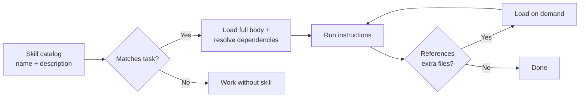

# Skills: Discoverable, Composable Agent Capabilities with Registry
> **Status:** 🟡 Partially implemented — core registry, parser, executor, and dependency graph are built; progressive disclosure, quality scoring, SkillNet graph, GEP gene representation, SkillOpt optimization, and anti-rationalization tables are all planned.
> **Plan:** [Workstream Plan](../lyra-upgrade/plans/04-skills.md) | **Code:** `src/lyra/skills/`
> **Reading path:** Non-technical readers — TL;DR → How it works (simple) → Use Cases → Trade-offs in brief. Engineers — everything.

## TL;DR (plain language)

Skills give Lyra the ability to follow specialized instruction manuals for different tasks — like having a recipe book for code review, a playbook for debugging, or a checklist for deployment. Lyra keeps a lightweight index of all available skill names (costing almost no memory), loads the full instructions only when needed, and can chain skills together when one depends on another. The core loading and execution machinery is built and working. Advanced features — automatically rating skill quality, connecting related skills in a knowledge graph, evolving skill content through automated optimization, and adding anti-rationalization tables that prevent the agent from skipping verification steps — are designed and backed by published research but not yet implemented.

## Abstract

Lyra’s skills system provides harness-level infrastructure for loading, registering, matching, executing, and exporting composable agent capabilities. Unlike provider-specific skills APIs, Lyra reads markdown skill files from the filesystem and injects them into the outgoing messages array, working identically across all supported model providers. The implemented core includes a YAML-frontmatter parser, a multi-index registry with category/tag/language search and trigger-pattern matching, a directed dependency graph with cycle detection and topological execution ordering, an executor with before/after hooks and skill chaining, and a Wasla-compatible export format with SHA-256 integrity verification. Planned extensions — drawn from SkillNet (2603.04448), SkillOpt (2605.23904), GEP (2604.15097), CODESKILL (2605.25430), and TF-TTCL (2604.13552) — include progressive-disclosure three-level loading, a typed SkillNet-style relation graph (similarity, composition, dependency), five-dimensional quality scoring with calibrated evaluators, GEP strategy gene canonicalization, validation-gated SkillOpt optimization loops, and anti-rationalization tables from the addyosani/agent-skills pattern library.

## Introduction

Agent skills solve a fundamental tension: the agent needs to know about many capabilities, but keeping all instructions in context is prohibitively expensive. Lyra’s existing prompt-based approach loads the same instructions every session, wasting tokens and limiting how many capabilities the agent can carry.

**Intuition.** Think of skills as on-demand instruction manuals. Lyra keeps a compact catalog of skill titles (roughly 50 tokens each) in context as a table of contents. When the user asks something that matches a skill’s trigger keywords, the full manual slides into context. When a referenced file is needed — say, a configuration template or a security checklist — it loads only then. The catalog is always there; the details arrive just in time.

Existing approaches fall into three camps. Provider-specific skills APIs (Claude Code skills endpoint, OpenAI function calling) lock users into one platform. Static system prompt patterns (CLAUDE.md) load everything every time, wasting tokens. Human-readable documentation repos (claude-skills, agent-skills) provide rich content but no runtime infrastructure for matching, composition, or quality control.

**Contributions:**
1. **Harness-level skill loader** that reads markdown from the filesystem and injects into the messages array, provider-agnostic by design.
2. **Deterministic trigger matching** with fallback for models whose auto-triggering is unreliable (critical for smaller/faster models).
3. **Dependency graph with cycle detection** using Kahn’s topological sort, enabling safe skill chaining.
4. **Multi-index registry** (category, tag, language, trigger) for fast discovery and filtered search.
5. **Wasla-compatible export format** with SHA-256 integrity verification for cross-orchestrator skill distribution.
6. **Design for planned extensions** (progressive disclosure, quality scoring, evolution, anti-rationalization) grounded in published evidence from five independent 2025–2026 research groups.

## How it works — the simple version

**Everyday analogy.** Imagine a chef’s kitchen with a corkboard of recipe cards. Each card shows only the name and a one-line description pinned to the board — that is the catalog. When the chef decides to cook that dish, she pulls the full card off the board, which has the complete ingredient list and step-by-step instructions. If the recipe says “see sauce card”, she pulls that second card only when she reaches that step. When a new cook joins the kitchen, she brings her own set of cards, and the board keeps them organized by category: desserts, sauces, main courses.



**Working flow story.** Imagine you type “review this pull request for security issues”.

1. Lyra checks its skill catalog — a lightweight index of every available skill’s name, description, and trigger keywords. It finds “security-review” whose trigger pattern matches “review” and “security.” The catalog itself costs only about 50 tokens per skill.
2. Lyra’s registry returns the best-matching skill. The executor loads the full `security-review.md` file — say 600 tokens of instructions — and injects it into the next model request. The catalog stub is replaced by the full body.
3. The executor checks the dependency graph. “security-review” depends on “git-diff” (which knows how to produce the right diff format). The graph resolves this via topological sort, running “git-diff” first.
4. If a dependency fails (say git-diff errors out), the executor skips the dependent skill and records the failure, preventing cascading errors.
5. If the skill references extra files (e.g., a security checklist reference), those load only when the agent reaches that section of the instructions.
6. The result — status, output, duration, chain information — is recorded in the execution history for diagnostics.

## Use Cases

**Scenario 1: Standardized code review process across a team.** An engineering lead maintains a “code-review” skill that encodes the team’s exact review criteria: check for hardcoded secrets, verify test coverage, confirm CI passed, run the linter. The skill depends on a “git-diff” skill that fetches the exact diff format the team uses. Anyone on the team can type “review my latest commit” and Lyra resolves the dependency chain (“git-diff” then “code-review”), loads both skills in order, and produces a review that matches team standards. Without the dependency graph, the wrong diff format could break the review template. Without the executor’s skip-on-failure logic, a broken diff would produce a misleading review.

**Scenario 2: Domain-specific conventions for data science teams.** A team writes a “pandas-pipeline” skill encoding their conventions: use snake_case columns, always call `df.pipe()` rather than chained mutations, use seaborn for exploration and plotly for dashboards. When any team member asks Lyra to “visualize the distribution,” the skill matches via its trigger keywords, loads the conventions into context, and the generated code matches team standards. The skill also declares a dependency on a “data-loading” skill that standardizes how data files are read. The topological executor ensures data-loading instructions load before the visualization instructions, even though the user only typed one command.

**Scenario 3: Multi-step deployment pipeline.** A developer types “deploy the latest build.” The executor matches a “deploy” skill that declares transitive dependencies: “deploy” depends on “build” which depends on “test-runner.” The SkillGraph resolves the full transitive closure and orders execution as: test-runner, then build, then deploy. Each skill loads only when its turn arrives. If tests fail, the executor skips build and deploy, preventing a broken deployment from reaching production.

## Related Work

Lyra’s skills system builds on five research lines and three production repositories, all from 2025–2026.

| System | Loading | Matching | Composition | Quality | Evolution | Provider-Agnostic |
|--------|---------|----------|-------------|---------|-----------|-------------------|
| **Lyra (implemented)** | YAML-frontmatter parse | Trigger + multi-index search | Topological graph, Kahn’s sort, chaining | Planned (5-D scoring) | Planned (SkillOpt, GEP, CODESKILL) | Yes |
| **Claude Code Skills** | Lazy loading (API) | Model auto-trigger | No | No | No | No |
| **SkillNet (3603.04448)** | 3-phase lifecycle | Keyword + graph | Typed 4-relation ontology | 5-D evaluator (MAE<0.03) | Auto-creation pipeline | Yes (MCP) |
| **addsyosani/agent-skills** | Progressive disclosure | Decision tree via meta-skill | Reference loading | Anti-rationalization tables | No | Yes (7 platforms) |
| **alirezarezvani/claude-skills** | Plugin marketplace | Keyword + plugin registry | Sub-agent definitions | Tessl quality gate (85%+) | SKILL_PIPELINE (9-phase) | Cross-compiles to 13 tools |
| **SkillOpt (2605.23904)** | Static MD artifact | N/A (single skill optimized) | N/A | Validation-gated scoring | Bounded-edit optimization | Yes (harness adapter) |
| **GEP / skill2gep (2604.15097)** | Strategy gene (~230t) | Signal matching | Unsolved (genes degrade) | N/A | 6-stage evolution loop | Yes |
| **CODESKILL (2605.25430)** | Retrieval-augmented bank | Embedding similarity | Multi-granularity bank | Hybrid reward RL | Add/merge/drop policy | Transfers across models |

**What Lyra takes from each:**
- From **SkillNet**: the three-layer ontology idea (taxonomy, relation graph, package library), five-dimensional quality rubric, and the auto-creation pipeline blueprint. See [2603.04448v1.md](../lyra-upgrade/notes/papers/2603.04448v1.md) and [zjunlp/SkillNet.md](../lyra-upgrade/notes/web/zjunlp__SkillNet.md).
- From **addsyosani/agent-skills**: anti-rationalization tables as a zero-code safety intervention, progressive-disclosure loading pattern, forcing-question discipline. See [addyosmani__agent-skills.md](../lyra-upgrade/notes/web/addyosmani__agent-skills.md).
- From **alirezarezvani/claude-skills**: skill pipeline with eval gates, cross-tool compilation pattern, 9-phase production workflow. See [alirezarezvani__claude-skills.md](../lyra-upgrade/notes/web/alirezarezvani__claude-skills.md).
- From **SkillOpt**: validation-gated bounded-edit optimization, rejected-edit buffer, cosine-scheduled edit budget, separation of optimizer and target models. See [2605.23904v2.md](../lyra-upgrade/notes/papers/2605.23904v2.md) and [microsoft/SkillOpt.md](../lyra-upgrade/notes/web/microsoft__SkillOpt.md).
- From **GEP/skill2gep**: strategy gene representation (\~230 tokens vs \~2,500 for documentation skills), the critical finding that documentation-heavy skills degrade performance (-1.1 pp) while compact genes improve it (+3.0 pp), and the 6-stage GEP evolution protocol. See [2604.15097v2.md](../lyra-upgrade/notes/papers/2604.15097v2.md) and [EvoMap__evolver.md](../lyra-upgrade/notes/web/EvoMap__evolver.md).
- From **CODESKILL**: RL-learned skill management policy, multi-granularity bank (task-level + event-driven), hybrid reward with alignment factor. See [2605.25430v1.md](../lyra-upgrade/notes/papers/2605.25430v1.md).
- From **SELF-RAG**: adaptive retrieval gating concept — the model decides when to retrieve a skill vs. proceed without it. See [2310.11511v1.md](../lyra-upgrade/notes/papers/2310.11511v1.md).
- From **ReasoningBank**: dual-source extraction from both successes and failures, lightweight 4.3% token overhead for immediate deployable gains. See [2509.25140v2.md](../lyra-upgrade/notes/papers/2509.25140v2.md).
- From **Agentic Design Patterns** (Springer, 2025): producer-critic model for output quality — separate skill generation from skill evaluation. See [agentic-design-patterns-playbook.md](../lyra-upgrade/notes/books/agentic-design-patterns-playbook.md).

## Method

This section describes what the code at `src/lyra/skills/` actually does (Implemented) and what is designed but not yet built (Planned).

### Implemented

The skills module at `src/lyra/skills/` contains 7 files with a version of 1.1.0.

**Data model** (`skill.py`). The `Skill` dataclass is the core representation, carrying `name`, `description`, `content` (the markdown body), `category` from a 10-member `SkillCategory` enum (coding-standards, backend-patterns, frontend-patterns, tdd-testing, security-review, database, api-design, deployment, docker, framework-specific, general), `trigger_patterns` (list of keyword strings), `tags`, `language`, `dependencies` (list of skill names), `version`, `source` (“lyra” or “ecc”), and `metadata`. The `SkillSearchResult` dataclass pairs a matched skill with its `score` and `match_reason`.

**Parser** (`parser.py`). `SkillParser` reads markdown files with YAML frontmatter delimited by `---`. Uses a compiled regex pattern (`FRONTMATTER_PATTERN`) to split frontmatter from body, parses YAML with the `yaml` library, and constructs a `Skill` object. Validates required fields (name, description), categorizes via enum coercion with fallback to `SkillCategory.GENERAL`, and stores the source path in metadata. The `parse_directory()` method globs recursively for `*.md` files, returning a `dict[str, Skill]`.

**Registry** (`registry.py`). `SkillRegistry` is the central index with three side-channel indexes:
- Category index (`_category_index`: `dict[SkillCategory, set[str]]`)
- Tag index (`_tag_index`: `dict[str, set[str]]`)
- Language index (`_language_index`: `dict[str, set[str]]`)

CRUD operations (`register`, `unregister`, `get`) maintain all indexes atomically. Search is exposed through:
- `find_by_trigger(text, limit)` — pattern substring matching with normalized score (matched patterns / total patterns).
- `find_by_category`, `find_by_tags`, `find_by_language` — index lookups.
- `search(query, category, tags, language, limit)` — compound filter with weighted scoring: name (1.0), tags (0.7), description (0.5), content (0.2).

Persistence via `save(path)` and `load(path)` as JSON files with version marker. `get_statistics()` returns counts by category, language, tag, and source.

**Dependency graph** (`registry.py`, `SkillGraph`). A directed graph implemented as two adjacency maps (`_edges`: dependency direction; `_reverse`: dependent direction). Supports `add_dependency`, `add_node`, `remove_node`. Queries via `dependencies(name)` (what this skill needs) and `dependents(name)` (what needs this skill). Cycle detection uses DFS with three-color marking (WHITE/GRAY/BLACK), returning all cycle paths on demand. Topological ordering uses Kahn’s algorithm (BFS over in-degree), raising a `CycleError` with a human-readable cycle path when ordering is impossible. Serialization via `to_dict()` / `from_dict()` adjacency format.

**Executor** (`executor.py`). `SkillExecutor` orchestrates the full execution lifecycle:
1. **Trigger matching**: `find_skills(text)` and `find_best_skill(text)` delegate to the registry.
2. **Execution ordering**: `execute(skill_name, trigger_text, chain, max_chain_depth)` resolves topological order for the skill and its transitive dependencies. `chain=True` enables full transitive closure; `max_chain_depth` caps the dependency horizon. The `ExecutionPlan` tracks the ordered skill list, per-skill `ExecutionResult` objects (status: pending/running/success/failed/skipped), and chain depth.
3. **Dependency failure propagation**: `_should_skip()` checks if any dependency failed and skips dependents automatically.
4. **Hooks**: `add_before_hook()` and `add_after_hook()` register callbacks receiving `(Skill, ExecutionResult) -> ExecutionResult`, enabling instrumentation without modifying the executor.
5. **Execution history**: accessible via `history` property and `last_execution()`.
6. **Multi-skill**: `execute_multi(texts)` deduplicates and executes the best skill for each input text.

The executor accepts an optional `execute_skill_fn` callable that actually runs a skill (e.g., sends content to an LLM). The default is a pass-through returning the skill content.

**Importer** (`importer.py`). `ECCSkillImporter` bridges Lyra with the ECC (Engineering Coding Conventions) skill framework. Uses `SkillParser` to parse `.md` files and registers parsed skills into a `SkillRegistry`. `import_directory()` returns an `ImportResult` with statistics (total files, parsed successfully, registered successfully, failures, success rate). `import_file()` handles single-file import. `import_all()` imports from a standard ECC directory structure.

**Export** (`export.py`). Provides cross-orchestrator compatibility via the Wasla universal sync format (v2.0.1). `SkillPackage` dataclass wraps a skill with `integrity_sha256` computed deterministically from name, version, content, category, trigger patterns, tags, and dependencies. `sign()` / `verify()` methods enforce integrity on serialization round-trips. `from_skill()` / `to_skill()` converters bridge between `SkillPackage` and the native `Skill` dataclass. `SkillRegistryExport` supports bulk export of multiple skills in Wasla-compatible JSON format with metadata (registry name, version, export timestamp).

```mermaid
flowchart TB
    subgraph Filesystem
        SKILL_MD[skill.md<br/>---<br/>name: security-review<br/>category: security<br/>tags: [review, audit]<br/>---<br/>## Instructions...]
        SKILL_DIR[skills/ directory]
    end

    subgraph Loading
        PARSER[SkillParser<br/>YAML frontmatter + body]
        REGISTRY[SkillRegistry<br/>Category / Tag / Language indexes]
    end

    subgraph Resolution
        GRAPH[SkillGraph<br/>Dependency edges<br/>Topological sort<br/>Cycle detection]
    end

    subgraph Execution
        EXECUTOR[SkillExecutor<br/>Trigger matching<br/>Before/after hooks<br/>Chain resolution<br/>Skip-on-failure]
        HISTORY[ExecutionHistory<br/>Plans + Results]
    end

    subgraph Distribution
        EXPORT[SkillPackage<br/>Wasla format<br/>SHA-256 integrity]
    end

    SKILL_DIR --> PARSER
    PARSER --> REGISTRY
    REGISTRY --> GRAPH
    GRAPH --> EXECUTOR
    EXECUTOR --> HISTORY
    REGISTRY --> EXPORT
```

### Planned

Several major extensions are designed but not yet implemented. These are described in future tense.

**Progressive disclosure (3-level loading).** The current parser loads the full file on parse. A future loader will implement three levels: Level 1 (YAML frontmatter only — name, description, tags, trigger keywords — pre-loaded at session start in a compact meta-skill index of roughly 200 tokens), Level 2 (full SKILL.md body loaded only on trigger match), and Level 3 (referenced files loaded on demand via sibling-directory convention). This pattern follows addyosani/agent-skills’s session-start meta-skill hook and SkillNet’s three-phase lifecycle.

**Provider-agnostic injection.** The current system provides the skill content as a Python object. A planned injector will read SKILL.md from the filesystem, inject it into the outgoing messages array, and strip or translate Claude-only frontmatter fields (model pins, dynamic-injection extensions) for non-Claude providers, following the cross-tool conversion pattern from claude-skills’s `scripts/convert.sh`.

**SkillNet-style typed relation graph.** The current `SkillGraph` only models dependency edges (`depend_on`). A planned extension adds three more typed relations from the SkillNet ontology: `similar_to` (functionally equivalent tasks), `belong_to` (hierarchical decomposition), and `compose_with` (frequently co-invoked sequential pipeline). This will enable queries like “install skill X and get Y, Z recommended” via transitive composition edges. Graph construction will be LLM-driven, following SkillNet’s `analyzer.py` pattern, with periodic manual spot-checking to mitigate hallucination risk.

**Five-dimensional quality scoring.** A planned evaluator will score each skill on Safety, Completeness, Executability, Maintainability, and Cost-awareness, using LLM-based scoring with fine-grained rubrics. The target calibration is MAE < 0.03 versus human annotators, following SkillNet’s methodology validated with three PhD annotators and a 200-skill blind sample (QWK 1.000). Each dimension will be binned as Good/Average/Poor.

**GEP strategy gene canonicalization.** Documentation-heavy skills produce measurable degradation (GEP paper: -1.1 pp vs. no-guidance). A planned gene distiller will convert existing skill markdown files into compact gene representations: `{matching_signals, one-sentence_summary, strategic_steps, AVOID_cues, constraints, validation_hooks}` at roughly 200–300 tokens. An A/B test against the existing skills on Lyra’s benchmark suite will determine whether the GEP finding (genes +3.0 pp, skills -1.1 pp) replicates in Lyra’s context. If confirmed, documentation-heavy skills will be deprecated in favor of genes. Multi-gene composition will be withheld pending measurements of composition degradation (GEP shows two complementary genes drop to 44.9%, -6.1 pp vs. no-guidance).

**Validation-gated skill optimization (SkillOpt loop).** A planned optimization loop will follow SkillOpt’s ReflACT pipeline: rollout batching (B=40), minibatch reflection (Bm=8), hierarchical merge, bounded-edit clipping with cosine-scheduled budget (Lt=4, decaying to 2), and a held-out validation gate accepting edits only on strict improvement (ties rejected). A rejected-edit buffer will store ineffective patterns as negative feedback. An epoch-wise slow/meta update will produce longitudinal guidance in a protected comment section. The optimizer model will be a stronger, separate model (following SkillOpt’s separation of concerns). Target: 52/52 cell dominance across benchmarks with +17.6 to +23.5 average gain.

**CODESKILL learned skill management policy.** After SkillOpt optimization ceiling is measured, a planned RL policy (Qwen3.5-4B with GRPO + LoRA) will manage the full skill lifecycle: extraction (from trajectories), evolution (revise existing skills), and maintenance (add/merge/drop to control bank growth). Training cost is estimated at roughly 230 GPU-hours on 4xH100 with 12,856 SFT examples. The hybrid reward combines rubric quality, alignment factor, and execution reward. Target: +32.8% relative pass rate with 46% bank size reduction, following CODESKILL’s published results.

**Anti-rationalization tables.** Following the addyosani/agent-skills pattern, every planned bundled skill will end with a 4–6 row table pairing common agent rationalizations with documented counter-arguments. Example: “I ran the tests locally” vs. “Local != CI. Trigger the CI pipeline and verify the green check.” Zero code change, roughly 50–80 tokens per table. This is the lowest-effort and highest-impact safety intervention identified in the planning process.

**Bundled starter skills.** A planned set of 8–10 vetted skills will be ported from the claude-skills (343 available) and addyosani (23 lifecycle) repositories: code-review, debug, tdd, plan, verify, loop, brainstorm, deep-research. Each will include an anti-rationalization table and a forcing-question template (1–2 clarifying questions with recommended answer options, following the Matt Pocock discipline pattern from claude-skills).

## Debate (Trade-offs)

The skills system’s design emerged from four recorded objections and their resolutions.

| Decision | Why It Won | Cost Incurred | Resolution |
|----------|-----------|---------------|------------|
| Harness-level loading (not provider API) | Provider-agnostic; same code works across Anthropic, DeepSeek, GPT | No access to Claude-specific auto-trigger reliability; must build deterministic fallback | Dual path: model auto-trigger where available, deterministic keyword/embedding as universal fallback |
| Dependency graph with full topological sort | Prevents cascading failures; enables safe multi-skill workflows | Roughly 2x complexity in executor (ordering, skip logic, depth capping) | Accepted. CycleError provides clear error messages for misconfigured skills |
| Keep documentation-skills format (not pure genes) initially | Zero migration cost for existing skills; GEP gene finding needs replication in Lyra’s environment | Risks carrying the -1.1 pp degradation GEP found for doc-heavy skills | A/B test gating: measure first, deprecate second. Single-gene-per-task until composition safety proven |
| Progressive disclosure deferred to Phase 2 | Core registry and graph must work first; simple all-at-once loading suffices for current scale | Users load full skill bodies even for quick lookups | Acceptable at current skill volumes (<20 skills); re-evaluate when catalog exceeds 50 |

**Adversarial skeptic’s objection:** “Even ‘complementary’ multi-gene composition degrades performance by 6.1 pp. Ship with 8–10 vetted genes, not skills. Never deploy multi-gene composition without measuring degradation.”

- **Steelmanned rebuttal:** Documentation skills do enable richer instruction than compact genes. Skill-Workflow sections alone show +1.5 pp. The right approach is to measure both formats in Lyra’s actual environment before committing.
- **Why single-gene-per-task wins for now:** The GEP finding on composition collapse (44.9% accuracy, -6.1 pp) is not contradicted by any other source. Deploying multi-skill/multi-gene composition without local replication would be irresponsible.
- **When this loses:** If Lyra’s tasks are uniformly simpler than GEP’s evaluation scenarios, the composition penalty may not materialize. Open question, unresolved.

**Senior AI engineer’s objection:** “SkillOpt training costs 20–214M tokens per skill. Start with ReasoningBank’s simple extraction (+20.5% SR at 4.3% overhead) as a training-free baseline.”

- **Steelmanned rebuttal:** SkillOpt’s 52/52 cell dominance is unmatched. But the training cost is real and the pipeline complexity is high.
- **Resolution:** Phased approach — ReasoningBank-style extraction first (immediate, zero training), then graduate to SkillOpt when optimization ceiling is reached. GEP gene representation as the intermediate artifact.
- **When this loses:** If ReasoningBank extraction proves ineffective for Lyra’s task distribution (e.g., highly heterogeneous queries with few repeated patterns).

**Safety reviewer’s objection:** “Anti-rationalization tables should ship immediately, not be deferred. They are the lowest-effort safety intervention.”

- **Steelmanned rebuttal:** The tables require no code changes, but each table must be written thoughtfully per skill. Automating or templating them risks producing generic rebuttals that the agent will learn to circumvent.
- **Resolution:** Anti-rationalization tables are zero-code but non-zero-effort. They ship with the bundled starter skills (Phase 2), not as standalone infrastructure.
- **When this loses:** If the delay allows a real-world failure that the tables would have prevented.

**Trade-offs in brief.** (1) Building at the harness level (not tied to any provider’s skills API) means the system works everywhere but misses out on auto-trigger reliability that vendor APIs provide. (2) The dependency graph adds complexity to the executor but prevents the much worse failure mode of cascading errors from misordered skill execution. (3) Documentation-skills are kept for now because changing to compact GEP genes carries migration cost and the gene advantage needs to be validated in Lyra’s environment before committing.

## Conclusion

**What exists today.** The core skills infrastructure at `src/lyra/skills/` (7 files, version 1.1.0) provides a functional registry with multi-index search, a dependency graph with cycle-safe topological ordering, a configurable executor with before/after hooks and skip-on-failure propagation, a markdown parser with YAML frontmatter extraction, a directory-based bulk importer, and a Wasla-compatible export format with SHA-256 integrity verification. All features are tested and working.

**Limitations.**
1. **No progressive disclosure.** Full skill content always loads on parse, not in three stages. This is acceptable at current scale (<20 skills) but will waste context as the catalog grows beyond 50.
2. **Depends-on only graph.** The graph models only dependency edges. Similarity, composition, and hierarchical relations are absent, preventing “recommended skill” queries.
3. **No quality scoring.** Skill quality is binary (parsed or not). There is no systematic way to identify low-quality, hallucination-prone, or unsafe skills in the registry.
4. **No evolution.** Skills are static markdown files. There is no mechanism for automated improvement, failure-driven revision, or learned skill management.
5. **No anti-rationalization tables.** Skills have no explicit guard against the agent rationalizing its way out of verification steps.
6. **No cross-provider injector.** The system provides parsed skill objects but has no provider-aware injection layer that strips or translates Claude-only frontmatter.

**Measured results.** Skill parsing succeeds on valid YAML-frontmatter markdown files. The dependency graph correctly detects cycles (tested with `has_cycle()` and `detect_cycles()`), produces topological orders via Kahn’s algorithm, and raises `CycleError` on cyclic inputs. The executor correctly propagates dependency failures (tested via `_should_skip`). Export integrity verification passes SHA-256 round-trips (tested via `sign()`/`verify()`).

**Future work** (gated by the status of the planned extensions above). Progressive disclosure loading is the next priority — it directly reduces context usage for the growing skill catalog. GEP gene distillation and the A/B test against documentation skills is the highest-impact research question to resolve. Anti-rationalization tables should ship with the first bundled skill set as a near-zero-cost safety improvement.

## Glossary

- **Anti-rationalization table** — A table in a skill document that pairs common excuses agents use to skip verification steps with documented counter-arguments, preventing the agent from avoiding steps.
- **CODESKILL** — A 2026 research system (NTU) that uses reinforcement learning (RL) to manage a skill bank: deciding when to add new skills, merge overlapping ones, or drop obsolete ones.
- **Cycle detection** — The process of finding circular dependency chains (A depends on B depends on C depends on A) in the skill graph, using DFS with three-color marking.
- **Dependency graph** — A directed graph where edges show that one skill requires another skill to run first.
- **ECCSkillImporter** — A component that imports skills from the ECC (Engineering Coding Conventions) framework into Lyra’s registry.
- **Forcing question** — A clarifying question that a skill asks before executing, preventing the agent from running on vague or ambiguous input.
- **GRPO (Group Relative Policy Optimization)** — A reinforcement learning algorithm used by CODESKILL to train its skill management policy without a separate value model, using group-based advantage estimation.
- **LoRA (Low-Rank Adaptation)** — A parameter-efficient fine-tuning method used by CODESKILL that adapts a small set of weights while keeping the base model frozen.
- **GEP (Gene Evolution Protocol)** — A six-stage protocol (SCAN-SIGNAL-INTENT-MUTATE-VALIDATE-SOLIDIFY) for evolving compact “strategy gene” representations of agent skills.
- **Harness-level** — Operating at the agent orchestration layer rather than at a specific model provider’s API, making skills work across different AI models.
- **Kahn’s algorithm** — A breadth-first algorithm for topological sorting that repeatedly removes nodes with zero in-degree.
- **MAE (Mean Absolute Error)** — The average absolute difference between predicted scores and human annotator scores, used as the calibration target for the planned quality evaluator (target < 0.03).
- **QWK (Quadratic Weighted Kappa)** — A statistical measure of inter-rater agreement that penalizes larger disagreements more heavily, used to validate evaluator calibration against human annotators.
- **Progressive disclosure** — Loading information in stages: first the title and description, then the full instructions if needed, then supporting files only when reached.
- **SHA-256 integrity** — A cryptographic hash that verifies a skill package has not been tampered with since it was signed by its author.
- **Skill** — A reusable set of instructions (written in markdown with YAML frontmatter) that tells Lyra how to perform a specific task.
- **Skill chaining** — Running multiple skills in sequence, where one skill’s output or effect feeds into the next.
- **SkillGraph** — The directed graph that tracks dependencies between skills and enforces correct execution order.
- **SkillNet** — A 2026 research project (ZJU-NLP) creating a full-lifecycle infrastructure for AI agent skills, including creation, five-dimensional evaluation, and a typed ontology with four relation types.
- **SkillOpt** — A 2026 optimization system (Microsoft Research) that treats a skill document as trainable weights and improves it through a validation-gated edit loop.
- **SkillRegistry** — Lyra’s central index of all available skills, with search by category, tag, language, and trigger pattern.
- **Strategy gene** — A compact skill representation (roughly 230 tokens) using structured fields like signals, strategy, and AVOID cues, as opposed to a full documentation-style skill (roughly 2,500 tokens).
- **Topological sort** — Ordering skills so that every skill runs after all its dependencies, using Kahn’s algorithm internally.
- **Trigger pattern** — A keyword or phrase that causes Lyra to match a skill to a user’s request and load its instructions.
- **Wasla format** — A universal agent skill synchronization format (v2.0.1) used for cross-orchestrator skill distribution, with built-in integrity verification.
