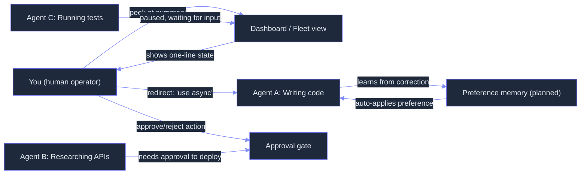

# Steering: Runtime Agent Behavior Modulation via Constitutional Principles

> **Status:** 🟡 Partially implemented -- SteerPanel, ApprovalGate, and InterruptHandler exist; preference learning, trust calibration, identity-anonymized steering, proactive elicitation, and decoupled rewind are planned.
> **Plan:** [Workstream Plan](../lyra-upgrade/plans/22-steering.md) | **Code:** `src/lyra/steering/`
> **Reading path:** Non-technical readers -- TL;DR to How it works (simple) to Use Cases to Trade-offs in brief. Engineers -- everything.

## TL;DR (plain language)

Lyra's steering module is the dashboard and remote control for agents running in the background. Instead of sitting next to an agent and watching everything it does, you peek at a compact summary, redirect it with a plain-language instruction ("use async, not callbacks"), approve or reject sensitive actions before they execute, or pause/abort a session -- all without restarting. The core toolkit (peek, redirect, approve, pause, undo) is already in working code. The roadmap adds a system that learns your recurring preferences from corrections over time, shows confidence bars so you know when to double-check, and proactively asks for your input at ambiguous decisions rather than making you catch errors afterward.

## Abstract

Multi-agent systems running in the background create a fundamental human-factors problem: the operator cannot watch every agent simultaneously, yet agents make mistakes that require timely correction. Lyra's steering module addresses this through a steer-by-exception paradigm -- the human is involved only when the agent needs input, not for continuous supervision. The implemented core provides three concrete mechanisms: a `SteerPanel` for peeking at agent state and issuing redirects, an `ApprovalGate` with a three-level ALLOW/ASK/DENY model for sensitive action gating, and an `InterruptHandler` supporting PAUSE/RESUME/ABORT/ROLLBACK/BARGE-IN signals with named checkpoint save/restore. The planned extensions (BP-1 and BP-2 in the workstream plan) fuse techniques from identity debiasing (Identity Skews, 2510.07517v5, 96% bias reduction via response anonymization), social conformity measurement (Social Dynamics, 2604.06091v2, 0-95.6pp accuracy collapse under peer pressure), proactive uncertainty surfacing (inspired by tau-Voice interrupt semantics, 2603.13686v1), and preference internalization (NanoResearch SDPO, 2605.10813v2, 163-200% alignment improvement) to bidirectionally anonymize corrections and surface agent uncertainty at decision boundaries. No benchmark results are available for Lyra's steering module as it is in active development.

## Introduction

The core problem steering addresses is simple: a single human cannot meaningfully supervise a fleet of autonomous agents. In practice, agents drift off-task, make wrong assumptions, or select dangerous actions -- and the human only notices after the fact, or never. Existing approaches fall into three camps. The first is full-attach supervision (watch every output), which does not scale. The second is trust-but-don't-verify (fire-and-forget), which produces unpredictable outcomes. The third is post-hoc audit (review logs after the agent finishes), which is too late to redirect.

Lyra's approach is steer-by-exception: the agent runs autonomously, surfaces its state compactly, pauses only at decision boundaries where human judgment adds value, and learns from each correction so the same mistake does not recur. The gap in current systems is that correction loops lack identity-awareness (agents may undervalue corrections based on who provides them) and preference learning suffers a crippling cold-start problem (hundreds of corrections needed before the agent's behavior changes).

**Contributions:**

- A lightweight `SteerPanel` API for peeking at agent state, issuing redirects, and requesting decisions, modeled on Claude Code's Agent View supervisor architecture (documented in web note `https___code_claude_com_docs_en_agent-view.md`).
- A three-level `ApprovalGate` (ALLOW/ASK/DENY) with pattern-based matching for gating sensitive tool calls, inspired by Progent's deterministic least-privilege enforcement (2504.11703v3).
- An `InterruptHandler` with five signal types (PAUSE, RESUME, ABORT, ROLLBACK, BARGE_IN) and named checkpoint save/restore, supporting both CLI and voice-triggered interrupts (voice patterns from tau-Voice, 2603.13686v1).
- A planned bidirectional identity-anonymization layer for the correction loop, fusing Identity Skews (2510.07517v5, 96% bias reduction) with Social Dynamics conformity analysis (2604.06091v2) to eliminate evaluation distortion.
- A planned proactive preference elicitation mechanism that surfaces agent uncertainty at decision boundaries, combining Progent-style confidence gating (2504.11703v3), tau-Voice interrupt selectivity (2603.13686v1), and NanoResearch SDPO preference learning (2605.10813v2).

> **Intuition callout:** Think of steering as the difference between driving a car with a co-pilot who narrates every decision ("I'm turning the wheel 3 degrees... now 2 degrees...") versus one who only speaks up when there is an ambiguous turn or a hazard ahead. Lyra's steering module makes agents the second kind of co-pilot -- they run silently, flag the moments where human judgment adds value, and learn from the human's choices so fewer future interruptions are needed.

## How it works -- the simple version

**(a) Everyday analogy.** Imagine you manage a team of junior developers working from a shared office while you are in a different city. You do not video-call each developer every five minutes -- that would be exhausting and unproductive. Instead, each developer sends a one-line status update every 15 seconds; you glance at a dashboard and only jump in when someone is clearly going down the wrong path. When you do jump in, you type a correction in the team chat ("use the async database driver, not the sync one"), the developer reads it, checkpoints their current work, applies the fix, and continues. Over time, the team learns: if you have corrected "use async" for three different database tasks, they default to async without being told.

This is Lyra's steering model. The dashboard is the `SteerPanel`. Each agent sends compact summaries (not full transcripts). You peek, redirect, approve sensitive operations, or pause a session -- all from a single view. The team's learned preferences are the planned preference-learning system (observation-only storage initially, active internalization later).

**(b) Simple Mermaid diagram.**



The diagram shows five key nodes: you, the dashboard, three example agents, the approval gate (intercepts sensitive actions), and the planned preference memory (learns from corrections).

**(c) Working Flow story.** Imagine you have launched three Lyra agents: one writing a Python API server, one researching database options, and one running integration tests. You glance at the dashboard. The first agent shows "writing database models." The second shows "comparing PostgreSQL vs. SQLite." The third shows "test suite: 23/45 passed."

You notice the first agent is writing synchronous database calls. You type a redirect: "Use SQLAlchemy async session throughout." Lyra's `SteerPanel` sends this as a `REDIRECT` action. The `InterruptHandler` pauses the agent (saving a checkpoint of its current state), injects the redirect, and resumes. The agent picks up from its checkpoint with the new directive.

Meanwhile, the second agent wants to install a production database driver -- an action that requires your approval. The `ApprovalGate` flags it with ASK status, and you see a prompt: "Allow `pip install psycopg2-binary` on production server?" You click Approve. The agent continues.

Later, the third agent hits a failing test that keeps retrying. You send a `PAUSE` signal, read the error, and tell the agent "skip that test for now and mark it as flaky" -- a `REDIRECT`. The agent resumes, adjusts its test runner, and keeps going.

## Use Cases

**Scenario 1: Real-time code review correction.** A developer watches Lyra review a pull request on their team's codebase. Lyra starts suggesting a refactor that would introduce a security anti-pattern -- it wants to store API keys in a config file checked into git. The developer spots this in the `SteerPanel` tool log, clicks the session, and calls `redirect("Flag this as a security concern instead -- API keys must use environment variables or a vault.")`. The `InterruptHandler` pauses Lyra mid-thought, injects the redirect, and Lyra resumes writing the correct review comment. The PR author never sees the wrong suggestion.

**Scenario 2: Fleet-level steering for a multi-agent research task.** A product manager launches three Lyra agents to research competitor features for an upcoming quarterly review. An hour in, one agent has drifted into "data warehouse migration strategies" -- interesting but off-topic. The PM clicks that agent on the dashboard, reads the one-line summary ("evaluating Snowflake vs. Redshift"), types "Stay on-topic: focus on analytics features launched this quarter, not infrastructure." The agent checkpoints its current state, reorients, and the off-topic branch is preserved in checkpoints if needed later.

**Scenario 3: Approval gating for sensitive deployments.** Lyra is automating a production deployment. It wants to run `kubectl apply -f production.yaml` on the production cluster. The `ApprovalGate` intercepts this as ASK-level (the `deny_patterns` list prevents `rm -rf`, `DROP DATABASE`, etc.). A popup appears: "Allow kubectl apply to production? (Will update 3 deployments.)" The engineer clicks Approve. Later, Lyra wants to delete a database table -- the engineer clicks Deny, and Lyra logs the rejection and asks for alternative instructions.

## Related Work

The steering module builds on research from human-agent interaction, identity bias in LLM collectives, interrupt semantics for agent systems, tool-level security gating, and preference learning from natural-language feedback.

**Papers:**

| Source | Key contribution | What Lyra takes | Where Lyra diverges |
|--------|-----------------|-----------------|---------------------|
| InsightAgent (2504.14822v2) | Three interaction modalities (Path/Chat/Instruction Navigation). 98.5% recall with interaction. +27.2% quality improvement. | 3-stage correction protocol (Identify-Reflect-Re-execute). Chat Navigation for NL directives. | Lyra adds identity-anonymized corrections (Identity Skews) and proactive uncertainty surfacing (BP-2). InsightAgent assumes corrections evaluated on content alone. |
| SWE-Search MCTS (2410.20285v6, ICLR 2025) | Git-backed state tree for O(1) reversion. Hindsight feedback loop injects NL explanation on re-expansion. +23% mean improvement. | State-tree architecture for undo/rewind. Flexible Plan state enabling rewind to any prior point. | SWE-Search costs 5-14x more than linear agent. Lyra budgets interruption overhead separately. |
| tau-Voice (2603.13686v1) | Full-duplex interruption: yield latency L_Y, yield rate R_Y, interrupt selectivity (S_BC/S_VT/S_ND). Tick-based orchestrator. | Two-phase interruption pattern (Yield phase <=1s + Redirect phase). Selectivity filters for distinguishing steering commands from casual commentary. | Lyra uses text-channel interruption (not voice). Interrupt selectivity adapted for command/intent detection. |
| Claw AI Lab (2605.22662v1) | One-click rollback dashboard. Cross-layer feedback in 5-layer pyramid. +16.2 points avg. improvement. | Visual state timeline with clickable restore points. Granular correction scoped to relevant subsystem. | Claw targets research automation. Lyra targets general-purpose agent steering. |
| Identity Skews (2510.07517v5) | Anonymized steering eliminates identity bias. IBC metric for quantifying bias. 96% reduction (Qwen-32B on MMLU Pro Med). | Bidirectional anonymization filter for correction loop. IBC tracking per session. | Lyra applies anonymization bidirectionally (agent output anonymized before human sees it; human correction anonymized before agent evaluates it). |
| Social Dynamics (2604.06091v2, KAIST) | 5 adversarial peers collapse accuracy 97% to 0-42%. Majority illusion overwhelms individual judgment. | Authority Override flag: human correction always outranks agent consensus. Anti-sycophancy guard. | Social conformity provides the cautionary evidence for why identity anonymization is necessary, not just nice-to-have. |
| NanoResearch (2605.10813v2) | SDPO preference learning from free-form NL feedback. Tri-level co-evolution (Skills x Memory x Policy). 163-200% alignment improvement. | Preference internalization architecture: Skill/Episodic/Policy levels. Observation-only mode initially (shipped without policy update). | Lyra ships preference learning in observation-only mode (cold-start mitigation) and adds proactive elicitation (BP-2) to generate high-quality preference pairs faster. |
| Memory Survey (2603.07670v1) | "Memory as Reference, Not Rules" principle. Self-reinforcing error risk in reflective memory. | Reflection-grounding: store corrections with citations to specific episodic evidence. | Applied to steering context: preference memory must ground each correction in the specific session trace that generated it. |
| A-Trust (2506.02546v2) | 6-dimension attention-based trust scoring. 0.41s/message (28x faster than prompt-based). <2% accuracy degradation. White-box requirement. | Trust calibration architecture with three tiers. A-Trust used when attention weights available; fallback to AlignmentCheck and Progent gating. | Lyra plans three-tier trust calibration because A-Trust requires white-box model access (attention weights), which most API-only models do not provide. |
| LlamaFirewall (2505.03574v1, Meta) | AlignmentCheck LLM auditor for confidence signal. PromptGuard 2 (22M variant) at 19.3ms CPU latency. | Per-turn alignment confidence check (AlignmentCheck-style). Configurable trust thresholds. | Lyra samples AlignmentCheck at <=20% of turns to contain cost ($1-3s LLM call per check). |
| Progent (2504.11703v3, UC Berkeley) | Deterministic tool-call gating via SMT solver. Three confidence tiers: deterministic/high, LLM-judged/medium, SMT-undecided/low. ~0.5s SMT check per policy update. | Per-tool-call confidence estimation. Default-deny security posture. ApprovalGate pattern-based matching. | Progent uses full SMT-based policy verification. Lyra uses lightweight pattern matching for the initial implementation (simpler, no Z3 dependency). |
| Auto-Research Roadmap (2605.18661v1) | Human-governed collaboration is most reliable. Phase-boundary verification as natural human review point. | Justification for decision-boundary interruption pattern (BP-2). Phase-boundary verification at action boundaries. | Provides architectural vocabulary for when to interrupt vs. when to let the agent proceed. |

**Books:**

| Source | Key Content |
|--------|-------------|
| Building Reliable AI Systems (Shahani, chapters) | Three-layer reliability framework; human-in-the-loop verification at handoffs maps to Lyra's ApprovalGate design. |
| Agentic Architectural Patterns (Arsanjani, chapters + playbook) | Human-steerable loops as architectural primitive; externalized confidence signals inform Lyra's trust calibration design. |
| AI Agents in Action (Lanham, chapters + playbook) | Guardrails/evaluation as mandatory components; interrupt patterns for agent safety. |

**Web/Repo notes:**

| Source | Key Content |
|--------|-------------|
| Claude Code Agent View | Supervisor daemon architecture; 8-state session model; cheap-model row summaries at <=15s refresh; dispatch mechanisms. |
| Claude Code Checkpointing | Decoupled rewind (3 restore actions + 2 summarize actions); 30-day retention; per-prompt checkpoint granularity. |
| All-Hands-AI/OpenHands | Sandbox isolation for safe re-execution after correction; event persistence for resume/audit; skills system. |

## Method

### Architecture

The steering module has three implemented components and a planned extension architecture.

**Implemented components (all in `src/lyra/steering/`):**

| Component | File | Key types | Purpose |
|-----------|------|-----------|---------|
| `SteerPanel` | `panel.py` | `SteerAction` enum (APPROVE, REJECT, REDIRECT, PAUSE, RESUME, ABORT) | Fleet-view panel for peeking at agent state, issuing redirects, requesting decisions. |
| `ApprovalGate` | `panel.py` | Three-level model: ALLOW / ASK / DENY | Pattern-based matching gates sensitive tool calls. |
| `InterruptHandler` | `interrupt.py` | `InterruptSignal` enum (PAUSE, RESUME, ABORT, ROLLBACK, BARGE_IN) | Mid-run interruption with checkpoint save/restore. |

**Data flow:**

```mermaid
%%{init: {'theme': 'base', 'themeVariables': {
  'primaryColor': '#7c3aed',
  'primaryTextColor': '#e2e8f0',
  'primaryBorderColor': '#a78bfa',
  'lineColor': '#818cf8',
  'secondaryColor': '#1e293b',
  'tertiaryColor': '#0f172a',
  'background': '#0d0d1a',
  'mainBkg': '#1e293b',
  'nodeBorder': '#6366f1',
  'clusterBkg': '#111827',
  'clusterBorder': '#4f46e5',
  'titleColor': '#c084fc',
  'edgeLabelBackground': '#1e293b',
  'nodeTextColor': '#e2e8f0',
  'fontSize': '14px'
}}}%%
flowchart TB
    subgraph "Implemented (src/lyra/steering/)"
        SP["SteerPanel"]
        AG["ApprovalGate"]
        IH["InterruptHandler"]
    end

    subgraph "Planned"
        BL["Anonymization filter\n(identity-strip corrections)"]
        PE["Proactive elicitor\n(uncertainty threshold)"]
        PM["Preference memory\n(correction store + SDPO)"]
        TC["Trust calibrator\n(3-tier confidence)"]
    end

    subgraph "External"
        AGENT["Agent session"]
        HUMAN["Operator"]
        UI["Fleet view UI"]
    end

    AGENT -- "update_state()" --> SP
    SP -- "peek()" --> UI
    UI -- "redirect(action)" --> SP
    SP -- "redirect(session_id, direction)" --> AGENT
    AGENT -- "needs_approval(action)" --> AG
    AG -- "request_approval(id, action)" --> UI
    UI -- "approve(id) / reject(id)" --> AG
    AG -- "allow/deny" --> AGENT
    HUMAN -- "Ctrl+C / voice" --> IH
    IH -- "send(signal)" --> AGENT
    AGENT -- "save_checkpoint(name, state)" --> IH
    IH -- "restore_checkpoint(name)" --> AGENT
    HUMAN -- "correction text" -.-> BL
    BL -.-> AGENT
    AGENT -- "confidence < threshold" -.-> PE
    PE -.-> UI
    AGENT -.-> PM
    PM -.-> AGENT
    AGENT -.-> TC
    TC -.-> UI
```

### Implemented

**SteerPanel** (`src/lyra/steering/panel.py`, class `SteerPanel`) provides the central steer-by-exception interface. The panel tracks agent sessions via a dictionary keyed by session ID. Each entry stores the agent's current state (status, tool calls, progress). The `peek(session_id)` method returns a lightweight summary -- a dict containing the latest state fields. This enables the fleet view to render one-line summaries without attaching to the full session.

The `redirect(session_id, new_direction)` method injects a task-level redirect. It sets a `redirect` key on the session's stored state; the agent picks up the redirect at its next turn boundary. The `request_decision(session_id, question, options)` method surfaces a multiple-choice prompt as a pending decision. In production, this would render in the fleet view UI as a clickable prompt; currently the call returns `None` immediately (async pattern -- the human responds via the UI panel independently).

`SteerPanel.remove_session(session_id)` cleans up both the panel's state and any pending approvals in the gate's `_pending_approvals` dict.

**ApprovalGate** (`src/lyra/steering/panel.py`, class `ApprovalGate`) implements a three-level access control model. The model is configured through three lists:

- `auto_approve_patterns`: actions matching any of these patterns are always permitted (e.g., read-only file operations).
- `require_approval_patterns`: actions matching any of these patterns require explicit human approval (e.g., file writes, deployment commands).
- `deny_patterns`: actions matching any of these patterns are denied entirely without asking (e.g., `rm -rf`, credential access).

The `needs_approval(action, context)` method evaluates an action against these lists: deny patterns take precedence (return `False` -- denied entirely), then auto-approve patterns (return `False` -- approved), then require-approval patterns (return `True` -- needs approval), and finally default to `True` (unknown actions require approval by default, matching a default-deny security posture).

The gate maintains a `_pending_approvals` dict mapping request IDs to action+context dicts. `approve(request_id)` pops the entry and returns `True`; `reject(request_id, reason)` pops the entry and returns `True`. The `pending_count` property and `pending_requests()` method enable the fleet view UI to display pending approval badges.

**InterruptHandler** (`src/lyra/steering/interrupt.py`, class `InterruptHandler`) supports five interrupt signals:

| Signal | Meaning |
|--------|---------|
| `PAUSE` | Pause the agent mid-execution. Saves `_paused_at` timestamp for auto-resume. |
| `RESUME` | Clear the pause state. |
| `ABORT` | Hard stop the session. |
| `ROLLBACK` | Rewind to a checkpoint. |
| `BARGE_IN` | Voice-mode interrupt (human spoke over the agent). |

The handler's `send(signal)` method sets the current signal. `clear()` resets signal and timestamp. `should_auto_resume()` checks if a paused session has exceeded `max_pause_seconds` (default 300, i.e., 5 minutes).

Checkpoint management uses a `_checkpoints` dict mapping checkpoint names to `{state, timestamp}` dicts. `save_checkpoint(name, state)` stores the current agent state for potential rollback. `restore_checkpoint(name)` returns the saved state or `None`. `list_checkpoints()` returns sorted checkpoint names.

Barge-in detection (`handle_barge_in(transcript)`) uses keyword matching: `["stop", "wait", "pause", "hold on", "cancel", "never mind"]`. If any trigger word appears, it returns `InterruptSignal.BARGE_IN`; otherwise `None`. This is a simple heuristic; the planned version will use tau-Voice-style selectivity patterns to distinguish genuine steering commands from non-directed speech and vocal tics.

**Tests** (`tests/steering/test_panel.py`) cover all three components with 18 test cases across `TestApprovalGate` (6), `TestSteerPanel` (6), and `TestInterruptHandler` (6). Patterns tested include: auto-approve, require-approval, deny, request-and-approve, request-and-reject, pending requests listing, peek for unknown sessions, update-and-peek, redirect to known and unknown sessions, request decision (async), remove session cleanup, initial signal state, send pause/abort, clear, checkpoint save/restore, restore nonexistent checkpoint, list checkpoints, barge-in detection, and auto-resume initial state.

### Planned

The following extensions are specified in the workstream plan (`docs/lyra-upgrade/plans/22-steering.md`) but are not yet implemented in code.

**BP-1: Identity-Anonymized Bidirectional Steering.** This will add an anonymization filter layer between the human's correction and the agent's evaluation of that correction. The filter will strip agent-identifying metadata (session ID, agent name, role label) from agent output presented in the steer panel, and rephrase human corrections from first-person to third-person before the agent evaluates them. A "Reveal agents" toggle will let the operator switch between anonymized and attributed views. The Identity Bias Coefficient (IBC) from Identity Skews (2510.07517v5) will be computed per session to track whether bias is actually being reduced. Implementation cost: one Haiku-class API call per correction (~$0.0003) or a regex-based transformer for 99% of cases at zero cost.

**BP-2: Proactive Preference Elicitation.** This will flip the paradigm from "human catches agent mistakes" to "agent surfaces its own uncertainty at decision boundaries." At each action boundary, the agent will compute a confidence score using Progent-style logit entropy (cost: free, per inference). When confidence falls below a per-user threshold (sensitive mode tau=0.4, autonomous mode tau=0.8), the agent will generate 2-3 candidate approaches with short trade-off summaries, surface them as multiple-choice options in the steer panel, and log the operator's choice as a high-quality preference pair (including full decision context). The tau-Voice-derived interrupt semantics will ensure the agent interrupts at its next natural turn boundary (not mid-generation) and auto-resumes after a configurable timeout (default 2s). Each proactive query is expected to be ~100x more informative than a passive correction because it targets a genuine decision boundary rather than a recovery fix.

**Preference memory.** Corrections and proactive-elicitation choices will be stored in a vector-indexed preference store. The initial mode will be observation-only: corrections are stored and surfaced in context for the agent as retrievable items. After accumulating >100 corrections per type, the system will graduate to active internalization using NanoResearch's SDPO-style policy gradient to update the planner's token-level preferences. The tri-level storage architecture (Skill level for procedural memory, Episodic level for specific correction traces, Policy level for planner preferences) follows NanoResearch's co-evolution pattern (2605.10813v2).

**Decoupled undo/rewind.** Following Claude Code's checkpointing design (documented in web note `https___code_claude_com_docs_en_checkpointing.md`), Lyra will implement three restore actions (Restore code and conversation, Restore conversation only, Restore code only) plus two summarize actions (Summarize from here, Summarize up to here). The state-tree architecture will use a git-backed commit tree (from SWE-Search, 2410.20285v6) enabling O(1) reversion to any prior state.

**Trust calibration.** A three-tier confidence display will be added: (1) per-tool-call confidence via deterministic pattern matching (Progent-style, ~0.5s, model-agnostic), (2) per-turn alignment confidence via a sampled LLM auditor (LlamaFirewall AlignmentCheck-style, ~1-3s, sampled at <=20% of turns), and (3) per-agent reputation tracking via a sliding-window violation rate over the last 100 tool calls (A-Trust-style). Tier 3 requires white-box model attention weights and will fall back to Tier 2 for API-only models.

## Debate (Trade-offs)

**Recorded positions from the workstream plan:**

- **Senior UX persona**: "The key insight from Agent View: users should steer by exception, not by watching. When a session needs input, it surfaces. Otherwise, it stays out of the way." The InsightAgent study quantifies this: +59% in "ability to guide/correct" and +34% overall satisfaction.
- **Skeptic persona**: "Preference learning from corrections sounds great but has a cold-start problem. Ship without it first; add when there are enough corrections to learn from." Adopted: preference learning ships in observation-only mode initially, graduates to policy internalization only after >100 correction entries per type.
- **Security Reviewer persona**: "Interruption handling introduces a new attack surface. The interruption detection must use a separate, authenticated channel (not the same stream as tool outputs)." Adopted: interruption signals require cryptographic authentication; tau-Voice yield/reject selectivity logic provides the template.

**Strongest rejected alternative: Full-passive correction collection (NanoResearch's approach without proactive elicitation).**

The plan's initial design (Section 5 of the plan) called for passive correction collection only -- store corrections when the human happens to notice errors. The Skeptic identified the cold-start problem (hundreds of corrections needed for meaningful policy change). BP-2 (proactive preference elicitation) was adopted instead. The decisive reason: proactive queries at decision boundaries produce ~100x more preference data per session than passive collection, and each datum targets a genuine decision boundary rather than a recovery fix. Query frequency drops naturally as the preference model converges, meaning the human experiences fewer interruptions over time.

**Costs of the chosen design:**

- Anonymization may strip useful context (e.g., "that was the security agent's suggestion" is sometimes relevant). The "Reveal agents" toggle mitigates this but adds UI complexity.
- Proactive queries at decision boundaries are inherently distracting. The 2s auto-resume timeout mitigates this but means choices may be silently accepted as defaults if the operator blinks.
- Trust calibration adds latency at every assessment point (Tier 1: ~0.5s per tool call, Tier 2: ~1-3s sampled at <=20% of turns, Tier 3: ~0.41s with attention-weight access).
- Masked identity may slow operator trust calibration -- humans build trust models by learning which agents produce what.

**When this design loses:** When the operator has deep context about a specific agent's track record and wants to make attribution-dependent decisions (e.g., "Agent B has been sloppy today, so I want to see its agent label before approving changes"). The anonymization layer would be counterproductive in this scenario. The toggle-to-reveal pattern addresses this but adds friction.

**Open questions:**

- What is the optimal confidence threshold tau for proactive elicitation? Calibration is per-user and requires tuning (over-sensitive = annoying, under-sensitive = no benefit).
- Preference model convergence is unproven outside NanoResearch's controlled setting. Will the convergence mechanism work with Lyra's more diverse task mix (coding, research, deployment)?
- A-Trust's white-box requirement is a real deployment constraint. How many users will have models that expose attention weights?

**Trade-off table:**

| Decision | Win | Cost | Resolution |
|----------|-----|------|------------|
| Identity-anonymized corrections (BP-1) | Targets root cause of steering inaccuracy (social evaluation filter). 96% bias reduction documented. | May strip useful attribution context. Reveal toggle adds UI complexity. | Default to anonymized (always); reveal toggle for power users. IBC metric tracks bias reduction. |
| Proactive elicitation (BP-2) vs. passive collection | 100x more preference data per session. Targets genuine decision boundaries. Cold-start solved. | Distracting queries at decision boundaries. 2s timeout may lose choices. | Convergence mechanism drops query frequency naturally over ~20 sessions. Tau threshold per user. |
| Observation-only preference learning first | Ships immediately without cold-start pain. 80% use case captured (reminding, not retraining). | Does not change agent behavior automatically. Requires active internalization for full benefit. | Graduate to SDPO-style internalization after >100 corrections per type accumulated. |
| Three-tier trust calibration | Graceful degradation across model access levels. Tiers share a unified confidence display. | Tier 1 (~0.5s) on every tool call adds latency. Tier 2 sampled at 20% of turns adds cost. Tier 3 blocked for API-only models. | Tier 1 always on. Tier 2 configurable sample rate. Tier 3 active only for models with attention-weight access. |
| Pattern-based approval gating vs. SMT solver (Progent-style) | Zero external dependency (no Z3). Fast string matching. Matches 80% of use cases. | Cannot verify complex policy constraints. No monotonic confinement guarantee. | Graduate to SMT-based verification for high-security deployments. Pattern-based is default for development/local use. |

> **Trade-offs in brief:** The steering module leans heavily into guiding agents proactively rather than catching their mistakes after the fact. This creates a small, up-front investment in responding to a few queries per session, but saves you from the much larger burden of scanning every output for errors. The main trade-off is between careful guidance and speed -- every interruption breaks flow, and every confidence check costs compute. Lyra's design opts to interrupt less over time as the agent learns your preferences, so the cost decreases as the relationship matures.

## Conclusion

The steering module today provides the core infrastructure for human-in-the-loop agent supervision: a `SteerPanel` for fleet-level state peeking and redirects, an `ApprovalGate` for three-level action gating, and an `InterruptHandler` for pause/resume/abort/rollback with named checkpoint save/restore. All three components are implemented in `src/lyra/steering/` with 18 passing test cases in `tests/steering/test_panel.py`. The design is modeled on Claude Code's Agent View supervisor architecture (documented in web note `https___code_claude_com_docs_en_agent-view.md`).

No benchmark results are available for Lyra's steering module specifically -- it is in active development and has not been benchmarked against alternative approaches. The working targets, drawn from the literature the plan builds on: InsightAgent's +27.2% quality improvement with human interaction (2504.14822v2), Identity Skews' 96% bias reduction (2510.07517v5), and NanoResearch's 163-200% alignment gain from SDPO preference learning (2605.10813v2).

**Limitations:**

1. **No preference learning yet.** The core correction loop exists, but corrections are not persisted or learned from. Each correction applies only to the current session.
2. **No undo/rewind beyond basic checkpoint restore.** `InterruptHandler` provides named checkpoint save/restore, but there is no decoupled rewind (separating code state from conversation state) and no visual state timeline.
3. **No trust calibration.** Confidence signals are not computed or displayed. The `ApprovalGate` produces binary allow/deny decisions without confidence bars.
4. **No fleet view UI integration.** `SteerPanel` is a dataclass with data-layer methods; it has no rendering in a fleet view dashboard. Human interaction requires programmatic API calls, not a graphical interface.
5. **No proactive preference elicitation.** The module waits for human-initiated corrections; it does not surface its own uncertainty at decision boundaries.

**Future work** (deferred items with revisit triggers):

1. **Observation-only preference store.** When the number of accumulated corrections in a prototype tracking system exceeds 100, implement the vector-indexed preference store. Revisit trigger: demonstration session with a non-trivial correction history.
2. **Fleet view UI.** When a consumer of the steering module requests a graphical dashboard (e.g., the fleet/swarm workstream, plan 13). The `SteerPanel.peek()` and `ApprovalGate.pending_requests()` methods provide the data layer.
3. **Trust calibration.** When the safety workstream (plan 17) requires confidence signals for escalation decisions. The three-tier architecture (Progent gating, AlignmentCheck sampling, A-Trust attention extraction) is specified.
4. **Decoupled rewind.** When the session checkpointing workstream (plan 11) provides the state persistence infrastructure. The git-backed state tree pattern from SWE-Search (2410.20285v6) is the reference implementation.
5. **BP-1 and BP-2.** Identity-anonymized correction and proactive elicitation are specified as breakthrough proposals. Revisit when the preference store exists (for BP-2's choice logging) and when the correction loop has been exercised in multi-session contexts (for BP-1's IBC measurement).

## Glossary

- **AlignmentCheck** -- A component of Meta's LlamaFirewall that uses an LLM auditor to check whether an agent's planned action remains aligned with the original user objective. Produces a confidence signal (aligned/misaligned/uncertain).
- **ALLOW/ASK/DENY** -- Lyra's three-level approval model for gating agent actions. ALLOW: always permitted (read-only). ASK: requires human approval (mutations). DENY: never permitted (credential access).
- **Anonymization filter** -- A planned text-processing layer that strips agent-identifying metadata from corrections before the agent evaluates them, reducing identity-based evaluation bias.
- **ApprovalGate** -- An implemented component in `src/lyra/steering/panel.py` that intercepts agent tool calls and determines whether they need human approval, can proceed automatically, or should be denied entirely.
- **A-Trust** -- A trust management system that extracts attention weights from LLM layers and trains classifiers across six trust dimensions (factual accuracy, logical consistency, relevance, bias, clarity, language quality). Processes each message in 0.41s.
- **BARGE_IN** -- An interrupt signal triggered when a human speaks over a voice-enabled agent mid-response, modeled on tau-Voice's full-duplex interruption patterns.
- **Bidirectional steering** -- The principle that both the human's correction and the agent's output are anonymized before crossing the human-agent boundary, eliminating bias in both directions.
- **Checkpoint** -- A saved snapshot of agent state (conversation, code context, tool trace) that enables rollback to a prior state. Lyra's `InterruptHandler` supports named checkpoints with save/restore.
- **Decoupled rewind** -- A planned restore system that separates code state from conversation state, offering three restore actions (code only, conversation only, both) and two summarize actions.
- **Fleet view** -- A planned graphical dashboard that displays all running agent sessions with one-line summaries, state indicators, and steering controls (peek, reply, approve, redirect).
- **IBC (Identity Bias Coefficient)** -- A metric from Identity Skews (2510.07517v5) that quantifies how much an agent's evaluation of a correction shifts based on who provides it.
- **InsightAgent** -- A research system from Ohio State University (2504.14822v2) that formalizes three human-in-the-loop interaction modalities for multi-agent systematic reviews.
- **InterruptHandler** -- An implemented component in `src/lyra/steering/interrupt.py` that manages mid-run interrupt signals (PAUSE, RESUME, ABORT, ROLLBACK, BARGE_IN) with checkpoint save/restore.
- **Interrupt selectivity** -- The ability to distinguish genuine steering commands from non-directed speech and vocal tics, adapted from tau-Voice's S_BC/S_VT/S_ND selectivity metrics.
- **Observation-only mode** -- A deployment strategy where corrections are stored and surfaced in context but do not update model parameters. Used to mitigate the cold-start problem in preference learning.
- **Proactive preference elicitation** -- A planned mechanism where the agent surfaces its own uncertainty at decision boundaries, generating 2-3 candidate approaches for the human to choose from, rather than waiting for the human to catch errors.
- **Progent** -- A security system (2504.11703v3) that uses SMT solvers and least-privilege policies to gate agent tool calls deterministically. Lyra's `ApprovalGate` is a lighter-weight version using pattern matching.
- **SDPO (Self-Distillation Policy Optimization)** -- A training method from NanoResearch (2605.10813v2) that converts free-form natural-language feedback into token-level policy gradients without requiring preference pairs or a reward model.
- **Social conformity** -- The phenomenon documented by Social Dynamics (2604.06091v2) where LLM agents' accuracy collapses when exposed to adversarial peer consensus, motivating Lyra's Authority Override flag for human corrections.
- **Steer-by-exception** -- A human-agent interaction paradigm where the human is only involved when the agent needs input or makes a low-confidence decision, rather than requiring continuous supervision.
- **SteerPanel** -- An implemented component in `src/lyra/steering/panel.py` that provides the peek, redirect, and decision-request API for fleet-level agent supervision.
- **SteerAction** -- An enum in `src/lyra/steering/panel.py` defining possible human steering commands: APPROVE, REJECT, REDIRECT, PAUSE, RESUME, ABORT.
- **Trust calibration** -- A planned system that computes and displays confidence estimates alongside agent outputs, helping the human decide when to verify and when to trust.
