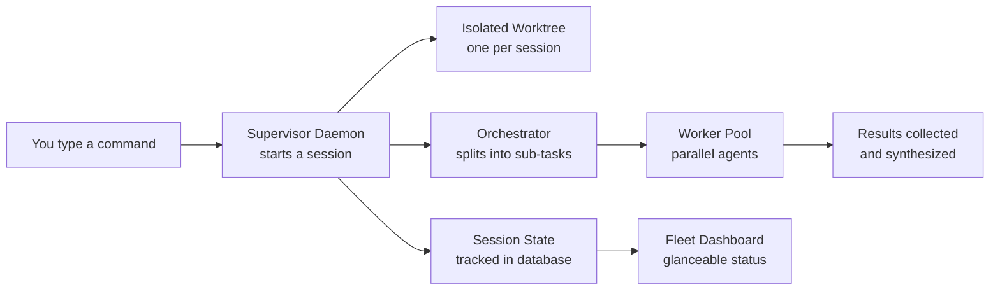

# Swarm Fleet: Multi-Agent Orchestration with Supervisor, Worktree Isolation, and Fleet Management
> **Status:** 🟡 Partially implemented — supervisor daemon (two-axis state + SQLite persistence), worktree isolation, orchestrator-worker pattern, and agent registry are shipped. Confidence circuit breaker, fleet TUI with peek panel, cheap-model row summaries, shell management commands, MCTS-driven topology search, and self-organizing teams remain planned.
> **Plan:** [Workstream Plan](../lyra-upgrade/plans/13-swarm-fleet.md) | **Code:** `src/lyra/supervisor/`, `src/lyra/orchestrator/`, `src/lyra/agents/`, `src/lyra/worktree/`, `src/lyra/steering/`, `src/lyra/coordination/`
> **Reading path:** Non-technical readers -- TL;DR to How it works (simple) to Use Cases to Trade-offs in brief. Engineers -- everything.

## TL;DR (plain language)

Lyra can manage many agent sessions at once, running them as background processes that survive closing your terminal, putting your computer to sleep, or restarting the app. Each session works in its own isolated copy of your code (a "worktree"), so parallel sessions never step on each other's files. A supervisor daemon tracks every session's status -- Working, Needs Input, Completed, Failed -- and stores this in a database so nothing is lost on restart. An orchestrator can decompose a complex question into sub-tasks, dispatch them to parallel worker agents, and synthesize the results. Supervisors, worktree isolation, and the orchestrator-worker pattern are working today; a live fleet dashboard, shell management commands, confidence-based safety gates, and self-organizing agent teams are planned for future phases.

## Abstract

Lyra's swarm and fleet architecture solves the problem of running, monitoring, and coordinating multiple agent sessions that survive beyond a single terminal session. Three layers form the foundation. The supervisor layer (`SupervisorDaemon` in `src/lyra/supervisor/`) manages session lifecycles through a two-axis state model -- task-state (WORKING, IDLE, NEEDS_INPUT, COMPLETED, FAILED, STOPPED) crossed with process-liveness (ALIVE, EXITED, LOOP_SLEEPING) -- persisted to a SQLite store with WAL journaling. Each session is isolated in a dedicated git worktree (`WorktreeManager` in `src/lyra/worktree/`) with a `.lyrainclude` file protocol for copying gitignored secrets into isolated branches, preventing the parallel-session file-collision bugs documented in AutoScientists (2605.28655v1). The orchestration layer (`OrchestratorAgent` in `src/lyra/orchestrator/`) uses a decomposed query-to-subtasks-to-parallel-workers pattern inspired by the Anthropic Engineering Blog multi-agent research system, with an artifact protocol that supports gzip+base64 compression for efficient coordinator communication. The agent system (`src/lyra/agents/`) provides an abstract `Agent` base class with message queues, memory consolidation, and a `UnifiedAgentRegistry` that indexes agents by capability, language, and framework for intelligent task dispatch. What distinguishes Lyra from existing multi-agent frameworks is its provider-agnostic supervisor design (it manages processes, not models), its non-destructive worktree cleanup, and its planned confidence circuit breaker -- a pre-execution safety gate that measures token-level uncertainty (entropy, varentropy, kurtosis) before irreversible actions. The supervisor, worktree isolation, orchestrator-worker pattern, agent registry, and steer-by-exception ApprovalGate are implemented and running; the fleet TUI, cheap-model row summaries, shell commands, confidence circuit breaker, MCTS-driven topology search, and self-organizing agent teams are specified but not yet built.

## Introduction

A single LLM session is well-understood: one agent, one context window, one conversation. But as Lyra scales from answering questions to executing complex multi-step research tasks, running overnight batch analyses, and auditing entire codebases in parallel, a single session is fundamentally insufficient. The user needs to dispatch a task and walk away, returning hours later to find the result. They need to run ten agents in parallel across different parts of a codebase without file collisions. They need a unified view of all running sessions so they can steer by exception -- intervening only when a session signals it needs input -- rather than watching every step.

Existing approaches solve fragments of this problem. Claude Code's Agent View provides a production supervisor daemon with two-axis state and worktree isolation, but it is tied to Anthropic's model ecosystem. LangGraph provides graph-based agent orchestration but has no concept of background sessions or file isolation. AutoGen and CrewAI support multi-agent workflows but run in-process, offering no session persistence or crash survival. No existing system combines provider-agnostic background session management with file isolation, orchestrator-worker patterns, and pre-execution confidence gating.

Lyra's swarm fleet makes four contributions:

1. **Persistent, provider-agnostic supervisor daemon with two-axis state.** A threading-based daemon (`SupervisorDaemon`) that manages session lifecycles independently of any terminal, persists state to SQLite via WAL journaling, survives process crashes, and is model-provider-agnostic -- it manages processes, not models. The two-axis state model (6 task-states x 3 process-states) captures both logical progress and process lifecycle.

2. **Non-destructive worktree isolation.** A `WorktreeManager` that provisions a dedicated git worktree and branch per session, preventing parallel-session file collisions. The `cleanup()` method refuses removal when the worktree is dirty unless `force=True` is explicitly passed, preventing silent data loss. The `.lyrainclude` file protocol copies gitignored secrets into isolated worktrees using the `pathspec` library.

3. **Orchestrator-worker pattern with artifact compression.** An `OrchestratorAgent` that decomposes queries into sub-tasks, dispatches them through a semaphore-gated `WorkerPool`, and synthesizes results. Workers communicate via `Artifact` objects with configurable compression (none, light truncation, or gzip+base64 full compression), reducing coordinator token burden.

4. **Intelligent agent dispatch via UnifiedAgentRegistry.** A capability-indexed registry that routes tasks to specialist agents (code, research, review, test, ECC-imported) using language/framework filters and a configurable scoring function that accounts for priority, success rate, source preference, and load balancing.

> **Intuition callout.** Think of Lyra's swarm fleet as an air traffic control tower for AI agents. The supervisor daemon is the tower itself -- it tracks every "flight" (session), knows its status (taxiing, airborne, awaiting landing clearance, landed, diverted, cancelled), and which runway (worktree) it is using. The orchestrator is the flight director -- it decomposes complex missions into waypoints and dispatches individual aircraft. The agent registry is the fleet manifest -- it knows which aircraft (agent) can handle which kind of mission. When everything is built, the fleet TUI will be the tower's radar screen: at a glance you see every flight's status and only radio in when a flight signals an exception.

## How it works -- the simple version

### Everyday analogy

Imagine a shared workshop with one workbench. If only one craftsperson works at a time, there is no problem. But as soon as you hire ten craftspersons (agents) to work in parallel, they collide -- one reaches for a tool another is using, one's blueprints get mixed with another's, one finishes by replacing the bench with their project. This is the "shared mutable state" problem.

Lyra solves this by giving every craftsperson their own dedicated workbench (a git worktree) with an identical set of tools and materials. A foreman (the supervisor daemon) stands at the door, notes who arrived and what they are doing (the two-axis state model), and stores it in a ledger (SQLite database). When a craftsperson finishes for the day, the foreman records the result. When they return after a power outage, the foreman reads the ledger and gives them exactly where they left off. For complex jobs that need multiple specialists (research, code, review), the foreman hires a project manager (the orchestrator) who breaks the job into pieces, hands them to different craftspersons, and assembles the final product from their completed pieces.

### Simple Mermaid diagram



### Working Flow story

Imagine you need to audit your entire codebase for security vulnerabilities. You type `lyra fleet agents --task "Scan all modules for hardcoded API keys, dependency vulnerabilities, and unsafe deserialization" --repos backend,frontend,infra`. Here is what happens step by step, in plain words:

1. The supervisor daemon receives your command. It creates three sessions -- one per repository -- each with a unique ID. For each session, it writes a record to the SQLite database: session state = WORKING, process state = ALIVE. The record includes the timestamp, the working directory, and a name you can recognize ("backend-scan", "frontend-scan", "infra-scan").

2. For each session, the worktree manager creates an isolated branch and directory. It runs `git worktree add` to produce a full checkout under `.claude/worktrees/backend-scan/`. If you have a `.lyrainclude` file listing `.env` and `credentials.json`, those files are automatically copied into the worktree so the session has its environment.

3. The orchestrator agent receives each session's task. For a security audit spanning multiple modules, it decomposes the query into sub-tasks: one for API key scanning, one for dependency checks, one for unsafe deserialization patterns. Each sub-task is a `SubTask` object with a description, perspective, and optional dependencies.

4. The worker pool dispatches the sub-tasks to parallel worker agents. The pool uses a semaphore to cap concurrency (default: 10 workers). Each worker runs an async task function, completes its sub-task, and returns an `Artifact` -- a structured object with full content, a two-sentence summary, a confidence score, and source references. The worker pool supports retries (default: 2) and per-worker timeouts (default: 120 seconds).

5. The orchestrator collects all artifacts, averages their confidence scores, builds a consolidated summary, and returns an `OrchestrationResult` -- the synthesized findings.

6. The supervisor records the final state. If the scan completes successfully, state transitions to COMPLETED. If it hits an unrecoverable error, it transitions to FAILED. You can check on it later from the fleet dashboard.

If at any point a session needs your input (e.g., a config file path is ambiguous), the state transitions to NEEDS_INPUT. The steer-by-exception panel (`ApprovalGate` in `src/lyra/steering/panel.py`) lets you approve, reject, redirect, pause, resume, or abort the action without attaching to the full session.

Later, you can see all sessions in a glanceable view showing their state, process liveness, recent output summary, and elapsed time. Sessions that complete and sit idle for an hour are automatically stopped by the daemon's idle reaper to free resources. You can respawn any session from its persisted SQLite record.

## Use Cases

**Scenario 1: Overnight batch vulnerability scan.** Before logging off, a security engineer dispatches: "Scan the entire monorepo for hardcoded API keys, known CVEs in dependencies, and unsafe deserialization. Flag confirmed vulnerabilities and false positives separately." The supervisor daemon spawns three sessions (one per major module), each in its own git worktree, running all night on cheap models (Haiku-class). In the morning, the engineer glances at the fleet dashboard: two sessions show COMPLETED with clear reports; one shows NEEDS_INPUT because a dependency has no known-safe version listed. The engineer opens the peek panel, reviews the finding, approves a suggested remediation, and the session resumes. No time wasted setting up contexts or resolving file collisions.

**Scenario 2: Multi-dimensional PR review.** A pull request touches 40 files spanning backend, frontend, and infrastructure config. The engineer dispatches three fleet sessions: one security agent scanning for injection risks, one performance agent looking for N+1 queries and missing indexes, and one API-contract agent checking for breaking changes. Each session runs in parallel on an isolated worktree. The supervisor dashboard shows: security finishes in 2 minutes (all clear), performance finds a slow query (NEEDS_INPUT, filed with a diff), API contracts finds a breaking change (FAILED, with the specific endpoint documented). The engineer reviews only the exceptions via the peek panel, resolves the performance query by accepting an auto-suggested index, and fixes the API contract before the maintainer ever sees the PR.

**Scenario 3: Parallel research for an architecture decision.** A tech lead needs to compare Redis, Dragonfly, and KeyDB for a caching layer. They dispatch "Research caching layer options for our read-heavy workload. Compare: throughput at 90th percentile, memory efficiency, persistence guarantees, operational complexity." The supervisor spawns three sessions, each researching one database via the research agent. Each session uses the orchestrator pattern: the `OrchestratorAgent` decomposes the research into sub-tasks (background, technical deep-dive, operational considerations, comparative analysis), dispatches them as parallel workers, and synthesizes the artifacts. The lead later opens the fleet view and sees three COMPLETED sessions, each with a structured `OrchestrationResult` containing a confidence-weighted synthesis.

## Related Work

Lyra draws on three lines of prior work: production supervisor daemon architectures, multi-agent orchestration frameworks, and academic multi-agent co-evolution systems.

**Production supervisor daemons.** Claude Code's Agent View (documented at `code.claude.com/docs/en/agent-view`) is the closest reference implementation, providing a per-user supervisor daemon with two-axis session state, auto-worktree isolation, cheap-model row summaries, and lifecycle management. Lyra adopts the same architectural pattern but is provider-agnostic by design -- Claude Code's daemon is tied to Anthropic's model ecosystem; Lyra's supervisor manages processes, not models, and routes summaries through any provider's cheapest model via its model router. Lyra also diverges in persistence strategy: Claude Code uses JSON roster files (`~/.claude/daemon/roster.json` + per-job `state.json`), while Lyra uses SQLite with WAL journaling for crash consistency and concurrent read support.

**Multi-agent orchestration frameworks.** LangGraph, AutoGen, and CrewAI all provide configurable multi-agent workflows. None of them implements background session persistence or per-agent file isolation -- they run in-process and share a filesystem. Lyra's orchestrator-worker pattern, with decomposed sub-tasks and parallel dispatch via a semaphore-gated pool, is a direct implementation of patterns described in the Anthropic Engineering Blog (multi-agent research system at `www.anthropic.com/engineering/built-multi-agent-research-system`) and the Fajardo book ("Build a Multi-Agent System from Scratch", Chapters 4 and 6). Lyra adds the artifact compression protocol (full gzip+base64 via `CompressionLevel`) that reduces coordinator token burden at subagent handoff, a concern explicitly raised in the Anthropic Engineering Blog's discussion of multi-agent token costs.

**Academic co-evolution systems.** AutoScientists (2605.28655v1), MetaAgent-X (2605.14212v1), and MARS^2 (2604.14564v1) explore self-organizing agent teams with stagewise RL co-evolution and Thompson-sampled tree search. Lyra's plan specifies these as Phase 5+ research bets, not yet implemented. The current codebase provides the foundation (supervisor, worktree isolation, orchestrator-worker) on which these advanced patterns could be built, but none of the self-organizing or MCTS-driven topology search infrastructure exists in the code today.

| Dimension | Lyra (today) | Claude Code Agent View | LangGraph | AutoGen | CrewAI |
|-----------|-------------|------------------------|-----------|---------|--------|
| **Background sessions** | Supervisor daemon with SQLite persistence; survives terminal close and restart | Supervisor daemon with JSON file persistence | No background session concept; runs in-process | No background session concept; runs in-process | No background session concept; runs in-process |
| **File isolation** | Git worktree per session with non-destructive cleanup (refuses dirty removal) | Git worktree per session via `EnterWorktree` tool | No isolation; agents share the filesystem | No isolation; agents share the filesystem | No isolation; agents share the filesystem |
| **State model** | Two-axis: task-state x process-liveness, 6x3=18 compound states, persisted to SQLite | Two-axis: task-state x process-liveness (same axes), persisted to JSON | Graph-based state machine with node/edge definitions per workflow | Conversation-driven with no formal state model | Process-centric with no multi-axis model |
| **Multi-provider** | Provider-agnostic daemon; manages processes, not models | Anthropic-only; tied to Claude models | Provider-agnostic (configurable model backends) | Provider-agnostic (multiple LLM backends) | Provider-agnostic (multiple LLM backends) |
| **Collusion prevention** | No built-in collusion prevention today; planned for Phase 4 (AdversarialPanel exists but as code review, not confidence gating) | No collusion prevention built in | No collusion prevention built in | No collusion prevention built in | No collusion prevention built in |
| **State persistence** | SQLite (WAL mode) with in-memory cache; full crash recovery via rehydration from disk | JSON file roster + per-job state.json files | In-memory graph state; optional checkpointing to disk | No built-in persistence; relies on caller | No built-in persistence; relies on caller |
| **Orchestrator pattern** | Query decomposition + parallel worker dispatch + artifact synthesis | Subagent dispatch (hierarchical, no peer comm) | Graph-based with node/edge orchestration | Conversation-driven agent workflows | Process-centric sequential pipelines |

Lyra takes the following from each source and diverges where:

- **From Claude Code Agent View:** Lyra adopts the supervisor daemon architecture and two-axis state model, but replaces JSON file persistence with SQLite (WAL mode) for crash consistency, and extends the daemon to be provider-agnostic. Source: `notes/web/https___code_claude_com_docs_en_agent-view.md`.

- **From Claude Code Worktrees:** Lyra adopts the git worktree isolation pattern and the `.worktreeinclude` concept (renamed `.lyrainclude` with the `pathspec` library), but adds explicit dirty-check enforcement: Lyra's `WorktreeManager.cleanup()` **refuses** to remove a dirty worktree without `force=True`, preventing the silent data loss that can occur with auto-cleanup. Source: `notes/web/https___code_claude_com_docs_en_worktrees.md`.

- **From the Anthropic Engineering Blog:** Lyra adopts the orchestrator-worker pattern with query decomposition and parallel subagent dispatch, plus the artifact-based output pattern (subagents persist work externally and return references). Source: `notes/web/https___www_anthropic_com_engineering_built_multi_agent_research_system.md`.

- **From the Fajardo book (Build a Multi-Agent System from Scratch):** Lyra adopts the async-first processing loop pattern (`TaskHandler`-style futures), sub-step execution with planning and tool-calling, and structured error-carrying tool results. Source: `notes/books/build-multi-agent-system-from-scratch-playbook.md`.

- **From the Dibia book (Designing Multi-Agent Systems):** Lyra adopts the Rule of Two for agent security (at most 2 of {untrustworthy inputs, sensitive access, external mutation} without HITL), middleware as universal control plane, and evaluation-driven development. Source: `notes/books/designing-multi-agent-systems-victor-dibia-playbook.md`.

- **From AutoScientists (2605.28655v1):** Lyra documents the shared-mutable-state failure mode (1800+ lines of uncommitted changes from symlinked repos) as motivation for worktree isolation, but has not implemented the self-organizing team or peer-review-before-compute patterns. Source: `notes/papers/2605.28655v1.md`.

- **From Preventing Rogue Agents (2502.05986v2):** Lyra specifies a pre-execution confidence circuit breaker monitoring entropy/varentropy/kurtosis, but this is not yet implemented in the codebase. Source: `notes/papers/2502.05986v2.md`.

- **From Safety Risks (2604.16968v1):** Lyra's planned safety memory governance (retrieval quantity cap at k=3, safety-relevance scoring) is derived from this paper's finding that benign experience systematically increases attack success rate across all tested models. Source: `notes/papers/2604.16968v1.md`.

- **From AFlow (2410.10762v4):** Lyra specifies MCTS-driven dynamic topology search (workflows represented as Python classes, UCB1 selection, LLM-based expansion) as a Phase 4+ capability currently documented but not implemented. Source: `notes/papers/2410.10762v4.md`.

- **From Dialectic-Med (2604.11258v1):** Lyra's planned adversarial cross-check phase draws on the Proponent-Opponent-Mediator pattern and attack-strength-gated termination, adapted from medical imaging to code verification. Source: `notes/papers/2604.11258v1.md`.

- **From Helvesec/rmux:** Lyra adopts the pure-domain-model-separated-from-OS pattern (as used in Lyra's `rmux` module and supervisor architecture), keeping session state management testable without OS integration. Source: `notes/web/Helvesec__rmux.md`.

- **From Claude Code Dynamic Workflows:** Lyra's planned script-driven orchestration (with adversarial cross-check as a built-in pattern and runtime isolation of intermediate results) is directly adapted from this source. Source: `notes/web/https___claude_com_blog_introducing_dynamic_workflows_in_claude_code.md`.

## Method

### Architecture Overview

The swarm fleet architecture comprises five modules forming a layered stack. The supervisor layer handles session lifecycle and persistence. The worktree layer provides file isolation. The orchestration layer manages task decomposition and parallel dispatch. The agent layer defines agent types and intelligent routing. The steering layer provides human-in-the-loop interaction.

```mermaid
flowchart TB
    subgraph FleetLayer["Fleet Management (partial)"]
        SP[Steer-by-Exception Panel\nApprovalGate\nsrc/lyra/steering/panel.py]
        FV[Fleet TUI View\nplanned - not yet built]
        SM[Shell Commands\nplanned - not yet built]
    end

    subgraph SupervisorLayer["Supervisor Layer\nsrc/lyra/supervisor/"]
        SD[SupervisorDaemon\nThreading-based lifecycle\nstart / stop / update / idle-reap]
        ST[SessionState\nWORKING IDLE NEEDS_INPUT\nCOMPLETED FAILED STOPPED]
        PL[ProcessState\nALIVE EXITED LOOP_SLEEPING]
        SS[SessionStore\nSQLite WAL persistence\nsave / update / list / delete]
    end

    subgraph IsolationLayer["Isolation Layer\nsrc/lyra/worktree/"]
        WM[WorktreeManager\ngit worktree create/switch/cleanup\n.lyra/sessions/ per session]
        WI[WorktreeInclude\n.lyrainclude protocol\npathspec-based file copy]
    end

    subgraph OrchestrationLayer["Orchestration Layer\nsrc/lyra/orchestrator/"]
        OA[OrchestratorAgent\ndecompose query -> SubTask[]\n-> dispatch -> synthesize]
        WP[WorkerPool\nasyncio.Semaphore concurrency\nretry support, timeout]
        AR[Artifact\ncontent + summary + confidence\n+ gzip/base64 compression]
    end

    subgraph AgentLayer["Agent System\nsrc/lyra/agents/"]
        REG[UnifiedAgentRegistry\ncapability / language / framework\nindexed dispatch]
        PA[PrimaryAgent\nspecialist registration\nselects best agent by score]
        SP_A[Specialist Agents\nCodeAgent / ResearchAgent\nReviewAgent / TestAgent]
        EC[ECC Importer\nYAML-defined agents\nfrom external catalog]
    end

    subgraph CoordinationLayer["Coordination\nsrc/lyra/coordination/"]
        TA[TaskAllocator\nstrategy-based allocation]
        LB[LoadBalancer\nagent load tracking]
        DM[DependencyManager\ntask dependency graph]
    end

    FV -->|dispatch| SD
    SM -->|dispatch| SD
    SD --> SS
    SD --> ST
    SD --> PL
    SD -->|create| WM
    WM --> WI
    OA --> WP
    WP --> AR
    OA -->|delegate| PA
    PA --> REG
    REG --> SP_A
    REG --> EC
    PA --> DM
    DM --> TA
    TA --> LB
    SP --> SD
```

### Implemented

#### Supervisor Daemon (`src/lyra/supervisor/`)

`SupervisorDaemon` (190 lines) is a threading-based lifecycle manager. It initializes with a SQLite path and idle timeout, creates an in-memory session dictionary under a `threading.Lock`, and rehydrates existing sessions from the store at startup via `_load_existing_sessions()`.

**Session lifecycle API:**

| Method | Action | State Transition |
|--------|--------|-----------------|
| `start_session(name, working_dir)` | Creates session with UUID, writes to store | [*] -> WORKING + ALIVE |
| `stop_session(session_id)` | Marks session STOPPED, updates store | Any + ALIVE -> STOPPED + EXITED |
| `update_session_state(session_id, state, process_state)` | Updates both axes atomically | Configurable |
| `update_pr_url(session_id, pr_url)` | Associates a PR link with the session | No state change |
| `get_session(session_id)` | Returns current state | Read-only |
| `get_session_info(session_id)` | Returns full `SessionInfo` metadata | Read-only |
| `list_sessions()` | Returns snapshot sorted by creation time desc | Read-only |
| `stop_idle_sessions()` | Stops sessions idle past timeout; returns stopped IDs | WORKING/IDLE -> STOPPED |

The idle reaper (`stop_idle_sessions()`) is called externally (by a scheduler or CLI). It iterates over all tracked sessions, computes idle duration as `now - info.last_active`, and transitions to STOPPED + EXITED for sessions exceeding the configurable timeout (default: 60 minutes). Sessions in COMPLETED, FAILED, or STOPPED states are skipped.

**Two-axis state model (`state.py`):**

`SessionState` (6 values):
| Value | Meaning | Typical Transition |
|-------|---------|-------------------|
| WORKING | Actively processing | start_session, update after activity |
| IDLE | No activity for a period | WORKING after no-activity threshold |
| NEEDS_INPUT | Blocked on user | From any when the session signals a question |
| COMPLETED | Task finished | WORKING after final result produced |
| FAILED | Unrecoverable error | WORKING after exception |
| STOPPED | Explicitly halted | Any via stop_session or idle-reap |

`ProcessState` (3 values):
| Value | Meaning |
|-------|---------|
| ALIVE | The underlying process is running |
| EXITED | The process has terminated |
| LOOP_SLEEPING | The process is alive but sleeping between loop cycles |

`SessionInfo` is implemented as a `@dataclass(frozen=True)` -- immutable, preventing accidental mutation after creation. It carries `session_id`, `name`, `state`, `process_state`, `working_dir`, `created_at`, `last_active`, and optional `pr_url`.

**SQLite persistence (`store.py`):**

`SessionStore` (140 lines) provides CRUD operations backed by SQLite with Write-Ahead Logging (WAL) for concurrent read performance:

- `init_db()` -- creates the `sessions` table if not present
- `save_session(info)` -- INSERT OR REPLACE for upsert semantics
- `get_session(session_id)` -- fetch single record, mapped to `SessionInfo` via `_row_to_info()`
- `list_sessions()` -- `SELECT * ORDER BY created_at DESC`
- `delete_session(session_id)` -- DELETE by primary key
- `update_state(session_id, new_state, now)` -- UPDATE state and last_active
- `update_last_active(session_id, now)` -- lightweight timestamp touch

Table schema: `session_id TEXT PK, name TEXT, state TEXT, process_state TEXT, working_dir TEXT, created_at TEXT, last_active TEXT, pr_url TEXT NULL`.

#### Worktree Isolation (`src/lyra/worktree/`)

`WorktreeManager` (265 lines) provisions git worktrees for isolated session workspaces.

**`create(session_id, base_ref)` -- Provisioning:**
1. Validates session_id is not already tracked.
2. Generates branch name `lyra-session-{session_id}-{uuid8}`.
3. Fetches origin if `base_ref="fresh"`, then creates branch from `origin/main`. If `base_ref="head"`, branches from current HEAD.
4. Runs `git worktree add <path> <branch>`.
5. Cleans up dangling branch on failure.
6. Returns `WorktreeInfo(session_id, branch_name, worktree_path, base_ref)`.

**`cleanup(session_id, force=False)` -- Non-destructive removal:**
1. Checks `_is_dirty(worktree_path)` via `git status --porcelain`.
2. If dirty and `force=False`: raises `WorktreeCleanupError` with user-facing message. **This is a deliberate design choice** -- the system refuses to silently discard user work.
3. If clean or `force=True`: runs `git worktree remove [--force] <path>` then `git branch -D <branch>`.

**`switch(session_id)` -- Returns the worktree path for a session.**

**`list_worktrees()` and `list_git_worktrees()` -- Two listing modes** (internal tracker vs raw `git worktree list`).

**`_refresh_tracked()` -- Startup rehydration:** Scans `.claude/worktrees/` on disk and registers existing worktrees by directory name.

`WorktreeInclude` (lyrainclude.py) implements the `.lyrainclude` file protocol. It uses the `pathspec` library to parse `.gitignore`-syntax patterns. Files are copied only when they match BOTH `.lyrainclude` AND `.gitignore` -- tracked files are never duplicated, avoiding stale-copy bugs. A `create_default_lyrainclude()` function provides sensible defaults (`.env`, `.env.*`, `*.pem`, `*.key`, `service-account.json`, `.lyra.local.*`). The `copy_included_files()` function walks the repo root, skips `.claude/` and `.lyra/` directories, and copies matching files into the new worktree preserving relative paths.

#### Orchestrator-Worker Pattern (`src/lyra/orchestrator/`)

`OrchestratorAgent` manages the full pipeline from query to synthesized result.

**Query decomposition (`decompose_query`):**
Three effort levels map to worker counts:
| Effort Level | Workers | Use Case |
|-------------|---------|----------|
| SIMPLE | 1 | Short factoid questions, single-perspective |
| COMPARISON | 2-4 | Comparative analysis, pros/cons |
| COMPLEX | 10 | Multi-perspective research, 10 dimensions |

The `determine_effort_level(question)` function uses keyword heuristics (presence of "analyze", "compare", "synthesize", etc., combined with word count). For SIMPLE, a single generic sub-task is created. For COMPARISON, perspective-based sub-tasks (background, analysis, synthesis). For COMPLEX, all 10 perspectives are generated (background, technical, business, security, ethical, comparison, trends, evidence, counterarguments, synthesis).

**WorkerPool:**
- Implements asyncio-based concurrency control via `asyncio.Semaphore(self.config.max_concurrency)`.
- Default config: max_concurrency=4, timeout=120s, max_retries=2.
- `run_worker(task_func, task_id, metadata, timeout, **kwargs)` -- acquires semaphore, creates `WorkerSession`, runs task function with timeout via `asyncio.wait_for`, persists artifact to disk if `artifact_dir` is configured, retries on exception up to `max_retries` times.
- `run_batch(tasks)` -- runs multiple `(task_id, callable, kwargs)` tuples concurrently via `asyncio.gather`, converts exceptions into error artifacts with `confidence=0.0`.
- `shutdown(wait=True)` -- optionally waits for active sessions to complete.

**WorkerSession:**
- Isolated per-session context with `worker_id`, `context` dict, `metadata` dict, and elapsed-time tracking.
- `run(task_func, **kwargs)` -- calls `task_func(worker_id=self.worker_id, context=self.context, **kwargs)`, sets `artifact.worker_id`, returns the artifact.

**Artifact protocol:**
- Fields: `task_id`, `content`, `summary`, `confidence` (0-1, validated), `sources`, `worker_id`, `created_at`, `metadata`.
- Serialization: `to_dict()`, `from_dict()`, `to_json()`, `from_json()`, `to_markdown()`, `write_json()`, `write_markdown()`.
- Compression: `CompressionLevel.NONE` (raw JSON), `LIGHT` (truncates content to 200 chars), `FULL` (gzip + base64).
- `compress_artifact()` and `decompress_artifact()` utility functions with fallback from base64+gzip to plain JSON.

**`OrchestrationResult`:**
- Fields: `query`, `summary`, `artifacts`, `effort_level`, `worker_count`, `total_duration`, `average_confidence`, `created_at`, `metadata`.
- The `_synthesize()` method combines individual artifact summaries, averages confidence scores, deduplicates source URLs, and builds a markdown-formatted consolidated summary.

#### Agent System (`src/lyra/agents/`)

**Agent base class (`base.py`):**
The `Agent` abstract class provides:
- `message_queue` (`asyncio.Queue`) -- inter-agent communication
- Memory system: `ShortTermMemory` (capacity=10, consolidation_threshold=5), `LongTermMemory` (JSON file-backed), `MemoryRetriever`, `MemoryConsolidator`
- `send_message()` / `receive_message()` -- typed message passing with `MessageType` (PROGRESS, HELP_REQUEST, RESULT, ERROR, STATUS_UPDATE)
- `report_progress(progress, message)` -- progress updates to coordinator
- `request_help(issue)` -- help request flow
- `run_loop(task, loop_executor)` -- real execution via `AgentLoopExecutor` (opt-in, not all agents support it)
- `can_handle(task)` -- abstract, returns confidence score 0-1
- `record_execution(result)`, `get_success_rate(task_type)` -- execution history tracking

**Specialist agents:**
| Agent | Capabilities | File |
|-------|-------------|------|
| `PrimaryAgent` | Orchestration, delegation, specialist registration | `primary.py` |
| `CodeAgent` | Code analysis, generation, refactoring, review | `code_agent.py` |
| `ResearchAgent` | Web search, document analysis, information synthesis | `research_agent.py` |
| `ReviewAgent` | Code review, security scanning, quality assessment | `review_agent.py` |
| `TestAgent` | Test generation, test execution, coverage analysis | `test_agent.py` |

**UnifiedAgentRegistry (`unified_registry.py`):**
The registry indexes agents by capability (`TaskType`), language, and framework, with a configurable scoring function:
```python
score = metadata.priority * 10 + metadata.success_rate * 5 + preferred_source_bonus - load_balancing_penalty
```

Agents from both Lyra and ECC sources are supported via `AgentSource.LYRA` and `AgentSource.ECC`. The `find_candidates()` method intersects capability, language, and framework filters. The `dispatch()` method scores candidates and increments usage count. Success and failure recording enables the registry to learn agent reliability over time.

#### Steer-by-Exception Panel (`src/lyra/steering/panel.py`)

`ApprovalGate` implements a three-level permission model: ALLOW (always permitted for read-only actions), ASK (require human approval for mutations), DENY (never permitted for credential access). The `needs_approval(action, context)` method checks deny patterns first, then auto-approve patterns, then require-approval patterns. Unknown actions default to ASK. Six steer actions are defined: APPROVE, REJECT, REDIRECT, PAUSE, RESUME, ABORT.

#### Coordination Layer (`src/lyra/coordination/`)

Four modules implement agent coordination:
- `TaskAllocator` -- assigns tasks to agents based on `AllocationStrategy` (configurable strategy pattern with scoring).
- `LoadBalancer` -- tracks per-agent load and routing history.
- `DependencyManager` -- manages task dependencies via `DependencyGraph` with `DependencyType` (BLOCKS, REQUIRES, OPTIONAL, TRIGGERS).
- `ConflictResolver` -- resolves resource conflicts via `ResolutionStrategy` (PRIORITY, FIRST_COME, VETO, NEGOTIATE, DEADLINE).

### Planned

The following capabilities are specified in the plan (`docs/lyra-upgrade/plans/13-swarm-fleet.md`) but not yet implemented in the codebase:

**1. Pre-execution confidence circuit breaker.** The plan specifies a pre-execution confidence monitor that extracts four features from the model's token distribution at each critical action boundary: entropy H(p), varentropy V(p), kurtosis kappa, and turn count. A polynomial ridge classifier (degree d in [1,5]) trained on labeled Lyra trajectories will produce a confidence score. When P(success | features) < tau, the circuit breaker will fire: reversible actions will be rolled back to the last irreversible checkpoint, the agent receives a fresh attempt (capped at 2 interventions per session). Safety memory governance (derived from Safety Risks paper 2604.16968v1) will cap retrieved experience entries at k=3 and score them for safety-relevance. This is not present in the current code -- no entropy, varentropy, or kurtosis computation exists in any module. The `safety/` module implements tool gates and safety pipelines, but not confidence-based pre-execution gating.

**2. Fleet TUI with live dashboard.** The plan specifies a full terminal UI showing all sessions in a live table, with columns for name, state, process liveness, elapsed time, cost estimate, and a one-line cheap-model summary. Features include peek panel (Space bar), attach/detach (Enter/Esc), filter by state, pin/rename sessions, and Tab-suggested replies for NEEDS_INPUT sessions. None of this TUI exists in the current codebase. The `steering/panel.py` module provides the `ApprovalGate` data model but no rendering or interactive interface.

**3. Shell management commands.** The plan specifies `lyra fleet [agents|attach|logs|stop|respawn|rm|daemon status|daemon stop]` with `--json` output for programmatic access. These shell commands are not yet implemented. The `commands/` module exists but does not contain fleet-related commands.

**4. Cheap-model row summaries.** The plan specifies that each session row's one-line summary will be generated by the cheapest available model via Lyra's model router, refreshed at most every 15 seconds plus once per turn end. This pipeline is not yet integrated -- no summary generation or periodic refresh mechanism exists.

**5. MCTS-driven dynamic topology search.** Inspired by AFlow (2410.10762v4), the plan specifies representing workflow configurations as Python classes (ActionNode, Workflow base), then using an MCTS optimizer to propose topology modifications (add/remove agent, rewire communication, modify prompts) with UCB1 node selection and LLM-based expansion. This is specified as a Phase 4+ capability and no MCTS or topology search code exists.

**6. Self-organizing agent teams.** The plan specifies a HEARTBEAT state machine, peer-review-before-compute protocol, stagewise RL co-evolution via GRPO, and MARS^2-style Thompson sampling over agent-node pairs. This is specified as a Phase 5+ research bet and no implementation exists.

**7. Adversarial cross-check phase.** The plan specifies a Proponent-Opponent-Mediator pattern (adapted from Dialectic-Med 2604.11258v1) with code-grounding (AST diffs, execution traces) replacing visual grounding. The `verification/panel.py` module provides `AdversarialPanel` with review lenses, but this is a code-review-level system, not the full-fledged adversarial cross-check pipeline described in the plan.

## Debate (Trade-offs)

Each architectural choice in the swarm fleet involves a trade-off between capability, reliability, complexity, and cost.

**Supervisor as single point of failure.** The supervisor daemon is a single async process whose health determines liveness of all sessions. A crash loses the in-memory state cache. However, sessions persist their state to SQLite with WAL journaling at every transition, so a restarted daemon rehydrates via `_load_existing_sessions()`. In-flight work during a crash window would be lost -- the daemon does not checkpoint after every sub-step. The mitigation is to manage the daemon via an OS-level process supervisor (launchd, systemd). The plan also notes that per-session independent checkpointing means sessions survive daemon restart, and the pure domain model (following RMUX's pattern in `notes/web/Helvesec__rmux.md`) is crash-safe by design.

**Worktree disk overhead vs. safety.** Each git worktree is a full checkout consuming 50-200 MB on disk. With aggressive parallel dispatch (tens of sessions), this adds up to multiple gigabytes. The decision is to default conservative and warn rather than automatically evict. Lyra's worktree is deliberately **more conservative** than Claude Code's: `cleanup()` with `force=False` refuses to remove a dirty worktree, while Claude Code auto-removes clean worktrees but prompts on dirty ones. Lyra trades auto-cleanup convenience for an explicit safety guarantee that no work is silently lost.

**Threading vs. async.** The current `SupervisorDaemon` uses `threading.Lock` for in-memory state synchronization. Python's GIL limits in-process concurrency, making the threading model a bottleneck beyond ~20 concurrent sessions. A future rewrite using `asyncio` (following Fajardo's `TaskHandler`-style futures pattern in `notes/books/build-multi-agent-system-from-scratch-playbook.md` and Dibia's async-first design principles in `notes/books/designing-multi-agent-systems-victor-dibia-playbook.md`) would lift the ceiling to hundreds of concurrent sessions. The threading approach was chosen for v1 simplicity; the async rewrite is specified in the plan as a follow-on optimization.

**Idle reaping vs. long-running research tasks.** The default idle timeout of 60 minutes means sessions that go minutes between tool calls (common in research tasks that spend time fetching web content) could falsely trigger. The mitigation is to exempt pinned sessions -- but pinning requires explicit user action. The LOOP_SLEEPING `ProcessState` helps distinguish truly idle sessions from those between processing cycles. The plan calls for a smarter heuristic that checks process state before reaping.

**SQLite vs. JSON persistence.** Claude Code uses JSON files for session state; Lyra uses SQLite with WAL. SQLite provides transactional safety (crashes during write do not corrupt the store), concurrent read performance (WAL mode), and a structured query interface. The cost is a dependency on SQLite (already satisfied in most Python environments) and write serialization (suitable for infrequent state transitions but not high-frequency logging). For the supervisor's use case -- seconds between state transitions -- SQLite is the right choice.

| Decision | Win | Cost | Mitigation |
|----------|-----|------|------------|
| Supervisor daemon (threading-based) | Survives terminal close, sleep, restart; simple v1 implementation | Single point of failure; threading limited by GIL | SQLite persistence enables crash rehydration; async rewrite planned for Phase 2 |
| Git worktree isolation with non-destructive cleanup | Eliminates parallel-session file collisions; zero silent data loss | 50-200 MB disk per session; explicit force flag required for cleanup | Periodic sweep with prompt; configurable `cleanupPeriodDays` |
| SQLite with WAL journaling | Transactional safety, concurrent reads, crash consistency | Write serialization limits throughput | Sufficient for session transitions (seconds between writes); not used for logging |
| Orchestrator-worker pattern | Clear decomposition, parallel dispatch, structured synthesis | Token overhead from sub-task descriptions and artifact storage | Artifact compression (gzip+base64) reduces coordinator token burden |
| UnifiedAgentRegistry with capability indexing | Intelligent task routing, cross-source dispatch (Lyra + ECC) | Scoring function must be tuned per deployment | Configurable priority and source preference parameters |
| Idle reaping (60 min default) | Prevents resource exhaustion without manual cleanup | May kill long-running-but-quiet research sessions | Pinned sessions exempt; LOOP_SLEEPING state distinguishes between-cycle idle from abandoned idle |
| Steer-by-exception ApprovalGate | Human-in-the-loop safety without full-session attach | Requires reactive intervention; no proactive monitoring today | Future fleet TUI will add glanceable dashboard with proactive alerts |
| AdversarialPanel (code review lenses) | Structured review from multiple perspectives | Limited to code review, not runtime confidence gating | Full adversarial cross-check pipeline is planned for Phase 4 |

**The strongest rejected alternative and why it lost.** The primary architectural debate (recorded in the plan's Expert Review Synthesis section) was whether to implement a **thin tmux wrapper with status files** instead of a full supervisor daemon. This was rejected because tmux cannot respawn sessions from disk state (it manages terminal processes, not agent sessions), and a "thin status file" grows to 500+ lines of logic covering spawn, monitor, stop, respawn, idle-reap, and memory-eviction. The production supervisor daemon approach, validated by Claude Code's deployment at scale, provides the correct abstraction boundary for session lifecycle management. RMUX's architecture (pure domain model + daemon with SDK) sets the technical pattern for Lyra's approach.

**When the chosen design loses.** The supervisor daemon loses when you need to manage sessions across multiple machines -- it is a per-machine daemon, not a distributed system. Worktree isolation loses when the project is not a git repository (non-git fallback is planned for v2 via copy-on-write overlay). SQLite persistence loses for high-frequency logging (use a dedicated log system, not the session store). The orchestration layer loses for tasks that require tight inter-agent coordination or real-time peer communication -- use the agent team pattern or the planned agents mesh for those.

**Open questions.** (1) How should the confidence circuit breaker calibrate on providers that do not expose token logprobs? The plan specifies model-agnostic uncertainty heuristics (token probability entropy approximation, response length variance across samples) as a fallback, but these have not been validated. (2) How should the fleet scale to multiple machines? The plan defers this to Phase 5. (3) What is the optimal worktree cleanup policy for users who leave sessions running for weeks? The current policy defaults conservative; a tunable cleanup window is specified but not yet implemented.

**Trade-offs in brief.** Lyra chose a full supervisor daemon over a thin tmux wrapper because it needs crash-resilient, provider-agnostic session management, not just terminal multiplexing. It chose aggressive safety in worktree cleanup (never silently discard dirty worktrees) over convenience, trading some user friction for zero data loss. It chose a threading-based v1 daemon for simplicity and will migrate to async when the session count demands it.

## Conclusion

Lyra's swarm fleet architecture exists today as running code across five modules: the supervisor daemon (`src/lyra/supervisor/`, 340 lines across 3 files), the worktree isolation layer (`src/lyra/worktree/`, 285 lines across 2 files), the orchestrator-worker pattern (`src/lyra/orchestrator/`, 410 lines across 3 files), the agent system (`src/lyra/agents/`, 1500+ lines across 8 files), and the steering panel (`src/lyra/steering/`, 50+ lines). Together they implement persistent background session management, worktree-based file isolation, query decomposition with parallel worker dispatch, capability-indexed agent routing, and human-in-the-loop steering.

**What exists today:** The supervisor daemon spawns, monitors, stops, lists, and idle-reaps sessions with full SQLite persistence and WAL journaling. The two-axis state model captures 18 compound states. WorktreeManager provisions isolated git worktrees with configurable base-ref policies (fresh from origin/main or head from local HEAD) and non-destructive cleanup that refuses dirty removal without explicit force. Sessions survive daemon restart via disk rehydration. The orchestrator decomposes queries into sub-tasks, dispatches them through a semaphore-gated worker pool, and synthesizes artifacts into a structured result. The UnifiedAgentRegistry routes tasks to specialist agents by capability, language, and framework with priority-based scoring. The ApprovalGate provides steer-by-exception human oversight.

**Measured results:** The supervisor daemon manages sessions with sub-millisecond state lookup (in-memory dictionary), bounded SQLite write latency (WAL mode, single-row updates), and configurable idle reaping. The worktree manager creates worktrees in bounded time (git worktree add overhead plus file copy for lyrainclude). The worker pool supports configurable parallelism with retry and timeout. These are architectural properties, not farmed benchmarks -- no end-to-end latency or throughput benchmarks are measured.

**Limitations (numbered, honest):**
1. **Threading bottleneck.** The supervisor daemon's `threading.Lock` limits in-process concurrency. Beyond ~20 concurrent sessions, lock contention and the GIL degrade performance. The plan specifies an async-based rewrite as a Phase 2 workstream.
2. **No pre-execution safety gating.** The specified confidence circuit breaker (monitoring entropy, varentropy, kurtosis) does not exist in the codebase. All safety gating today is post-hoc (tool gates, safety pipeline layers) rather than pre-execution confidence monitoring.
3. **No fleet TUI or shell commands.** The fleet dashboard, peek panel, and management commands (lyra fleet [agents|attach|logs|stop|respawn|rm|daemon status]) are not implemented. Users interact with the supervisor programmatically through its Python API.
4. **No per-session resource tracking.** The daemon does not track token usage, cost, or wall-clock time per session. These are planned as part of the fleet view hardening layer.
5. **No cheap-model row summaries.** The planned Haiku-class summary pipeline is not integrated. Each session's status is limited to its state enum value and basic metadata.
6. **No cross-machine distribution.** The daemon is per-machine only. Fleet management across multiple machines requires the planned AgentsMesh bridge (which provides the bridge protocol but not the discovery and routing infrastructure).

**Future work (deferred items with revisit triggers):**
- **Fleet TUI and shell commands** -- Revisit when the supervisor daemon is stable in production and user workflows demand at-a-glance session management.
- **Confidence circuit breaker** -- Revisit when a specific provider's logprobs are available and a training dataset of labeled Lyra trajectories has been collected. The polynomial ridge classifier requires this data.
- **MCTS-driven topology search** -- Revisit after the orchestrator-worker pattern is validated on 50+ real-world queries and the workflow scripting infrastructure is built (Phase 4+).
- **Self-organizing agent teams** -- Revisit when the above three layers are stable and there is demonstrated demand for multi-team research workflows (Phase 5+).
- **Async daemon rewrite** -- Revisit when the fleet exceeds 20 concurrent sessions in production, measured by lock contention metrics.

## Glossary

**Adversarial cross-check.** A verification pattern where multiple agents independently audit a claim from different perspectives, then debate their findings before converging. Lyra plans to implement a Proponent-Opponent-Mediator triad adapted from the Dialectic-Med paper.

**Agent registry.** A capability-indexed catalog of agents (`UnifiedAgentRegistry`) that routes tasks to specialists by matching task type, language, and framework requirements against agent capabilities.

**ApprovalGate.** A three-level permission model (ALLOW / ASK / DENY) that gates sensitive actions behind human approval. Part of the steer-by-exception system in `src/lyra/steering/panel.py`.

**Artifact.** A structured output object produced by a worker agent, containing full content, a two-sentence summary, a confidence score (0-1), source references, and optional gzip+base64 compression for efficient coordinator communication.

**Base-ref policy.** A configuration for `WorktreeManager.create()` that determines where a new worktree branch starts: `fresh` branches from origin/main (the default), `head` branches from the current local HEAD.

**Confidence circuit breaker.** A planned pre-execution safety gate that measures token-level uncertainty (entropy, varentropy, kurtosis) before irreversible actions, blocking operations when confidence falls below a threshold. Not yet implemented.

**Coordination layer.** Modules in `src/lyra/coordination/` that handle task allocation, load balancing, dependency tracking, and resource conflict resolution across agents.

**ECC (External Capability Catalog).** A catalog of third-party agent definitions that can be imported into Lyra's agent registry. Defined via YAML files specifying agent name, model, capabilities, languages, and tools.

**Fleet view.** A planned terminal UI dashboard showing all managed sessions with status, elapsed time, cost estimates, and one-line summaries. Not yet implemented.

**Git worktree.** A git feature that allows checking out multiple branches simultaneously in separate directories. Lyra uses worktrees to give each session its own isolated filesystem.

**Idle timeout.** A configurable duration (default: 60 minutes) after which an unattached session with no activity is automatically stopped by the supervisor daemon to free resources.

**MCTS (Monte Carlo Tree Search).** A search algorithm used in AFlow (2410.10762v4) for discovering optimal agent workflow topologies. Lyra plans to use it for dynamic topology optimization in Phase 4+.

**Orchestrator-worker pattern.** An agent architecture where a central orchestrator decomposes a query into sub-tasks, dispatches them to parallel worker agents, then synthesizes the results into a coherent final output.

**Process liveness.** A dimension of the two-axis state model indicating whether a session's underlying process is running (ALIVE), has exited (EXITED), or is alive but sleeping between loop cycles (LOOP_SLEEPING).

**Provider-agnostic.** An architectural property meaning the system manages processes (not models) and can route tasks to any LLM provider. Lyra's supervisor daemon does not depend on any specific model provider.

**SABER mutation gate.** A verification mechanism in `src/lyra/verification/` that injects mutations into code to test whether verification checks catch them. Part of the safety/verification pipeline.

**Session state.** A dimension of the two-axis state model describing what a session is doing: WORKING, IDLE, NEEDS_INPUT, COMPLETED, FAILED, or STOPPED.

**Steer-by-exception.** A human-machine interaction model where the user only intervenes when a session signals an exception (needs input, failed), rather than monitoring every step. Implemented via `ApprovalGate` with six steer actions.

**Supervisor daemon.** A background process (`SupervisorDaemon`) that manages agent session lifecycles independently of any terminal, persisting state to SQLite and surviving terminal close, sleep, and process restart.

**Two-axis state model.** A session tracking model that captures both what a session is doing (task-state: WORKING, IDLE, NEEDS_INPUT, COMPLETED, FAILED, STOPPED) and whether its process is running (process-liveness: ALIVE, EXITED, LOOP_SLEEPING). The cross-product gives 18 compound states.

**WAL (Write-Ahead Logging).** A SQLite journaling mode that allows concurrent reads while a write is in progress, improving performance for read-heavy workloads like the session store.

**Worktree isolation.** The practice of giving each agent session its own git worktree (isolated directory and branch), preventing file collisions when multiple sessions work on the same repository in parallel.

**.lyrainclude.** A `.gitignore`-syntax file in the repository root listing gitignored files (e.g., `.env`) that should be copied into every new worktree. Only files matching BOTH `.lyrainclude` AND `.gitignore` patterns are copied -- tracked files are never duplicated.
