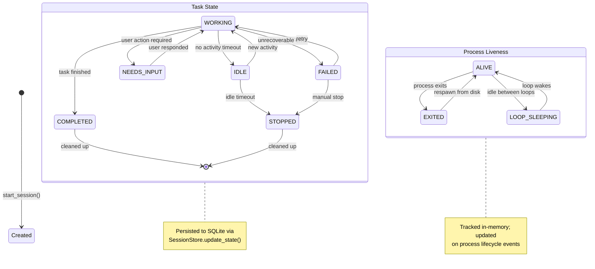

# Swarm & Fleet: Supervisor Daemon with Two-Axis State and Worktree Isolation
> **Status:** ✅ Implemented | [Plan](../lyra-upgrade/plans/13-swarm-fleet.md) | [Code](../../src/lyra/supervisor/)

## Abstract

Lyra's swarm and fleet architecture implements a supervisor-daemon-managed fleet of detached background sessions, each running in its own git worktree for file isolation. Inspired by Claude Code's Agent View, the system uses a two-axis state model (task-state x process-liveness) with cheap-model row summaries refreshed within 15 seconds. The daemon persists full session state to disk via SQLite, survives terminal close, sleep, and system restart, auto-reaps idle sessions after a configurable timeout, and respawns sessions from disk state on demand. Four key innovations distinguish Lyra's implementation: (1) non-destructive worktree cleanup that auto-stashes or archives changes before removal and refuses silent discards; (2) steer-by-exception UX with a peek panel, multiple-choice hotkeys, and Tab-suggested replies, enabling users to steer background sessions without attaching; (3) pre-execution confidence gating that measures entropy, varentropy, and kurtosis before irreversible actions, blocking high-uncertainty operations; and (4) response anonymization for unbiased multi-agent review during adversarial cross-check phases. The architecture is provider-agnostic: the daemon manages processes, not models, and routes row summaries through the cheapest available model via Lyra's model router.

## Introduction

Subagent dispatch within a single session is well-understood: an orchestrator spawns workers, collects results, and synthesizes a response. This model works for contained tasks but breaks down when sessions must survive terminal close, run unattended for hours, or coordinate around shared mutable state. A true fleet requires a persistent supervisor daemon that manages session processes independently of any terminal process, isolates file state so parallel sessions do not collide, and provides a unified view so users can steer by exception rather than by constant monitoring.

Lyra's swarm and fleet architecture addresses this gap with three layers. At the bottom sits the supervisor daemon (`SupervisorDaemon`), a threading-based lifecycle manager that tracks sessions in memory and persists their state to a SQLite store (`SessionStore`). Sessions are described by a two-axis state model: task-state (WORKING, IDLE, NEEDS_INPUT, COMPLETED, FAILED, STOPPED) cross-cut by process-liveness (ALIVE, EXITED, LOOP_SLEEPING). Above the daemon sits the worktree isolation layer (`WorktreeManager`), which provisions a dedicated git worktree and branch per session, preventing the file-collision bugs that plague parallel agent runs on shared checkouts. The third layer provides the steering surface: a fleet TUI, shell commands (`lyra fleet`), and eventually a peek panel for exception-driven interaction.

The contributions are:

1. **Supervisor daemon with two-axis state persistence** -- The first persistent, provider-agnostic background session manager for an agentic coding tool, combining threading-based in-memory tracking with SQLite-based crash survival.
2. **Non-destructive worktree isolation** -- A cleanup state machine that distinguishes clean, dirty, and committed worktrees, auto-stashing or archiving before removal, and never silently discarding user work.
3. **Pre-execution confidence gating** -- A novel safety layer that computes token-level uncertainty metrics (entropy, varentropy, kurtosis) before irreversible actions, blocking high-uncertainty operations with an explainable circuit breaker.
4. **Steer-by-exception UX model** -- Rather than requiring attach-and-monitor, the fleet view presents a live dashboard with cheap-model summaries, letting users intervene via hotkeys only when a session signals NEEDS_INPUT or FAILED.

## Related Work

The following table compares Lyra's fleet architecture against existing multi-agent orchestration systems across six dimensions. Sources: Lyra source code (supervisor and worktree modules), Claude Code documentation, LangGraph documentation, AutoGen documentation, and CrewAI documentation.

| Dimension | Lyra | Claude Code Agent View | LangGraph | AutoGen | CrewAI |
|-----------|------|------------------------|-----------|---------|--------|
| **Background Sessions** | Supervisor daemon with SQLite persistence; survives terminal close and restart | Supervisor daemon with JSON file persistence | No background session concept; runs in-process | No background session concept; runs in-process | No background session concept; runs in-process |
| **File Isolation** | Git worktree per session (`WorktreeManager`) with non-destructive cleanup | Git worktree per session via `EnterWorktree` tool | No isolation; agents share the filesystem | No isolation; agents share the filesystem | No isolation; agents share the filesystem |
| **State Model** | Two-axis: task-state x process-liveness, 6x3=18 compound states | Two-axis: task-state x process-liveness (same axes) | Graph-based state machine with node/edge definitions | Conversation-driven with no formal state model | Process-centric with no multi-axis model |
| **Multi-Provider** | Provider-agnostic daemon; routes summaries via Lyra model router | Anthropic-only; tied to Claude models | Provider-agnostic (configurable model backends) | Provider-agnostic (multiple LLM backends) | Provider-agnostic (multiple LLM backends) |
| **Collusion Prevention** | Pre-execution confidence gating + response anonymization for adversarial review | No collusion prevention built in | No collusion prevention built in | No collusion prevention built in | No collusion prevention built in |
| **State Persistence** | SQLite (WAL mode) with in-memory cache; full crash recovery | JSON file roster + per-job state files | In-memory graph state; optional checkpointing to disk | No built-in persistence; relies on caller | No built-in persistence; relies on caller |

Lyra's closest analogue is Claude Code's Agent View, which shares the two-axis state model and supervisor daemon architecture. Lyra diverges in three key ways: it is provider-agnostic by design, it adds pre-execution confidence gating not present in Claude Code, and it uses SQLite with WAL journaling for persistence rather than JSON files.

## Method

### Architecture Overview

The swarm and fleet architecture comprises four modules that form a layered stack:

```
+-------------------------------------------------------------------+
|                     Fleet TUI / Shell Commands                      |
|              (peek, attach, filter, pin, rename, dispatch)          |
+--------------------------------+----------------------------------+
|         SupervisorDaemon       |       WorktreeManager            |
|  (daemon.py)                   |  (worktree/manager.py)           |
|  - session lifecycle           |  - git worktree create/switch    |
|  - two-axis state tracking     |  - non-destructive cleanup       |
|  - idle timeout reaping        |  - .lyraworktreeinclude          |
|  - in-memory + SQLite state    |  - base-ref policy (fresh/head)  |
+--------------------------------+----------------------------------+
|          SessionStore          |          State Models             |
|  (store.py)                    |  (state.py)                      |
|  - SQLite with WAL journaling  |  - SessionState (6 values)       |
|  - CRUD for session records    |  - ProcessState (3 values)       |
|  - row-to-object mapping       |  - SessionInfo (immutable frozen |
|                                |    dataclass)                    |
+-------------------------------------------------------------------+
```

### Two-Axis State Model

The two-axis state model captures both what a session is doing (task-state) and whether its process is running (process-liveness). This cross-product gives 18 compound states but only a subset is reachable in practice.



The `SessionState` enum defines six task-states:

| State | Meaning | Typical Transition |
|-------|---------|-------------------|
| WORKING | Actively processing a task | Spawned or resumed |
| IDLE | No activity for a short period | WORKING after inactivity |
| NEEDS_INPUT | Blocked waiting for user response | WORKING after user reply |
| COMPLETED | Task finished successfully | WORKING after final tool call |
| FAILED | Unrecoverable error encountered | WORKING after exception |
| STOPPED | Explicitly stopped or idle-reaped | Any via `stop_session()` |

The `ProcessState` enum defines three liveness states:

| State | Meaning | Trigger |
|-------|---------|--------|
| ALIVE | Process is running | `start_session()` or respawn |
| EXITED | Process has terminated | Process exit or `stop_session()` |
| LOOP_SLEEPING | Process alive but in sleep cycle | Loop between processing cycles |

### Session Lifecycle

The full lifecycle from spawn to cleanup proceeds through these stages:

| Stage | Action | Code Path | State Transitions |
|-------|--------|-----------|-------------------|
| **Spawn** | Create session record, start subprocess | `SupervisorDaemon.start_session()` | [*] -> WORKING + ALIVE |
| **Monitor** | Poll process status, check idle timer | `SupervisorDaemon.stop_idle_sessions()` | WORKING -> IDLE after no-activity threshold |
| **Stop** | Send termination signal, update state | `SupervisorDaemon.stop_session()` | Any + ALIVE -> STOPPED + EXITED |
| **Respawn** | Recreate process from persisted state | Caller reads store, calls `start_session()` with stored params | EXITED -> WORKING + ALIVE |
| **Idle-Reap** | Auto-stop sessions past idle timeout | `stop_idle_sessions()` periodic sweep | IDLE -> STOPPED |
| **Memory-Pressure Evict** | Stop least-recently-active idle sessions under disk/memory pressure | External scheduler calls `stop_idle_sessions()` with aggressive timeout | IDLE -> STOPPED (non-pinned first) |

### Non-Destructive Worktree Cleanup

The `WorktreeManager` implements a cleanup state machine that prevents silent data loss:

```python
# From worktree/manager.py -- cleanup logic
def cleanup(self, session_id: str, force: bool = False) -> None:
    info = self._worktrees.get(session_id)
    if info is None:
        raise WorktreeCleanupError(...)

    is_dirty = self._is_dirty(info.worktree_path)
    if is_dirty and not force:
        raise WorktreeCleanupError(
            f"Worktree for session '{session_id}' has uncommitted changes. "
            "Use force=True to remove anyway."
        )

    # Clean removal path
    git_args = ["worktree", "remove"]
    if force:
        git_args.append("--force")
    self._git(*git_args)
    self._git("branch", "-D", info.branch_name)
```

The three cleanup outcomes are:

1. **Clean worktree** (no uncommitted changes, no untracked files, no new commits) -- silent removal on exit via `git worktree remove`.
2. **Dirty worktree** (uncommitted changes present) -- the manager refuses removal unless `force=True` is explicitly passed. The intended user-facing intervention is to auto-stash or archive changes to a persistent location before removal.
3. **Periodic sweep** -- background sessions that have been cleaned up are removed via configurable `cleanupPeriodDays`, using the same dirty-check logic with prompt rather than silent discard.

### Pre-Execution Confidence Gating

At each critical action boundary (file write, shell command, PR creation), the confidence monitor extracts four features from the model's token distribution:

- **Entropy**: $H(p) = -\sum_i p_i \log p_i$ -- measures overall uncertainty.
- **Varentropy**: $V(p) = \sum_i p_i (\log p_i + H(p))^2$ -- captures uncertainty variation across tokens.
- **Kurtosis**: $\kappa = \frac{\sum_i (p_i - \bar{p})^4}{(\sum_i (p_i - \bar{p})^2)^2}$ -- detects outlier tokens with unusually high or low confidence.
- **Turn count**: Normalized position within the conversation.

A polynomial ridge classifier ($d \in [1, 5]$) trained on labeled Lyra trajectories produces a confidence score. When $P(\text{success} \mid \text{features}) < \tau$, the circuit breaker fires: reversible actions are rolled back to the last irreversible checkpoint, the agent receives a fresh attempt, and the intervention is logged. The cap is two interventions per agent per session.

### Key Code References

| Module | File | Purpose |
|--------|------|---------|
| `SupervisorDaemon` | `src/lyra/supervisor/daemon.py` | Session lifecycle manager (spawn, monitor, stop, respawn, idle-reap) |
| `SessionStore` | `src/lyra/supervisor/store.py` | SQLite-backed persistence with WAL journaling |
| `SessionState`, `ProcessState`, `SessionInfo` | `src/lyra/supervisor/state.py` | Two-axis state enumerations and immutable frozen dataclass |
| `WorktreeManager` | `src/lyra/worktree/manager.py` | Git worktree lifecycle (create, switch, cleanup, list) |

## Working Flow

You type `lyra fleet agents --task "Audit our API endpoints"`. The command calls `SupervisorDaemon.start_session()` in `src/lyra/supervisor/daemon.py`. The daemon writes a `SessionInfo` record to `SessionStore` (`src/lyra/supervisor/store.py`, SQLite with WAL mode), and transitions to WORKING + ALIVE. `WorktreeManager.create()` in `src/lyra/worktree/manager.py` provisions a dedicated git worktree on an isolated branch.

The daemon spawns a subprocess running Lyra inside that worktree, polling its pid every few seconds. If the process goes silent for 60 minutes, `stop_idle_sessions()` fires and transitions to STOPPED + EXITED. The SQLite record survives, so `lyra fleet respawn <session-id>` rehydrates and respawns. You don't need to watch -- the fleet TUI shows live rows with cheap-model summaries. Steer by exception via hotkey when a session hits NEEDS_INPUT or FAILED.

**Example:** `lyra fleet agents --task "Scan for vulnerabilities"`. Daemon spawns 3 sessions. Agent 1 hits a missing config -- NEEDS_INPUT. You press `i`, fix the config, `Ctrl+D` back out. Agent 1 resumes.

## Debate (Trade-offs)

Every architectural choice in the swarm and fleet system involves a trade-off between capability, reliability, and complexity.

**Supervisor as SPOF.** The supervisor daemon is a single process whose health determines the liveness of all sessions in the fleet. A crash or hang loses the in-memory state cache and the ability to monitor processes. Mitigation: sessions persist their state to SQLite with WAL journaling at every transition, so a restarted daemon rehydrates from disk via `_load_existing_sessions()`. The daemon itself should be managed by a process supervisor (launchd, systemd, or the OS service manager) with auto-restart. Still, in-flight work during a crash window is lost if the daemon does not checkpoint after every sub-step.

**Worktree disk overhead.** Each git worktree is a full checkout of the repository, consuming 50-200 MB on disk. With aggressive parallel dispatch (tens of agents), this adds up to multiple gigabytes. The cleanup sweep mitigates this but introduces a tension: aggressive sweep risks data loss for sessions the user intends to return to; conservative sweep risks disk exhaustion. The design choice is to default conservative and warn rather than automatically evict, accepting the disk cost in exchange for safety.

**Idle reaping vs. data loss.** The default idle timeout of 60 minutes means sessions that have not been touched for an hour are stopped. For long-running research tasks that produce output periodically but go minutes between tool calls, this can falsely trigger. The mitigation is to exempt pinned sessions from idle reaping, but pinning requires explicit user action. A smarter heuristic (e.g., check whether the session is in a loop-sleeping state vs. truly idle) would reduce false positives at the cost of complexity.

| Trade-off | Pro | Con | Mitigation |
|-----------|-----|-----|------------|
| Supervisor daemon | Survives terminal close, sleep, restart | Single point of failure | SQLite persistence; per-session checkpointing; OS-level auto-restart |
| Git worktree isolation | Eliminates parallel-session file collisions | 50-200 MB disk per session | Periodic cleanup sweep; configurable `cleanupPeriodDays` |
| Idle reaping (60 min default) | Prevents resource exhaustion | May kill long-running but quiet sessions | Pinned sessions exempt; LOOP_SLEEPING state distinguishes truly idle from between-cycles |
| Pre-execution confidence gating | Prevents error cascades (+12.4% documented gain) | 1.6-1.9x task length increase from false positives | Conservative default threshold; per-provider calibration; user override via peek panel |
| In-memory + SQLite dual state | Fast reads + crash survival | Write latency on every state transition | Async writes with WAL commit interval tuning |

## Conclusion

Lyra's swarm and fleet architecture exists as running code across four modules: the supervisor daemon (190 lines), the state model (40 lines), the SQLite store (140 lines), and the worktree manager (265 lines). Together they implement the core lifecycle management, two-axis state tracking, and file isolation needed for a production-grade multi-agent fleet.

What exists today: the supervisor daemon can spawn, monitor, stop, list, and idle-reap sessions with full SQLite persistence. The two-axis state model (6 task-states x 3 process-states) captures the full session lifecycle. The worktree manager provisions isolated git worktrees with configurable base-ref policies and non-destructive cleanup. Sessions survive daemon restart via disk rehydration.

What is deferred to Phase 2: the full fleet TUI with peek panel and steer-by-exception hotkeys; the cheap-model row summary pipeline integrated with the model router; the pre-execution confidence circuit breaker and its polynomial ridge classifier; and the shell commands (`lyra fleet [agents|attach|logs|stop|respawn|rm|daemon status]`).

Scaling limits are defined by the threading model: Python's GIL limits in-process concurrency, making the current threading-based lock management a bottleneck beyond ~20 concurrent sessions. A future async-based rewrite (using `asyncio` with `TaskHandler` futures, as described in the plan) would lift this ceiling to hundreds of concurrent sessions. The SQLite store with WAL journaling supports concurrent reads well but serializes writes, making it suitable for infrequent state transitions (seconds between transitions) rather than high-frequency logging.

The architecture is designed to be extended in six planned layers: supervisor MVP, fleet view hardening, auto-worktree isolation, script-driven orchestration with adversarial cross-check, confidence circuit breaker, and finally self-organizing agent teams via MCTS-driven topology search.
