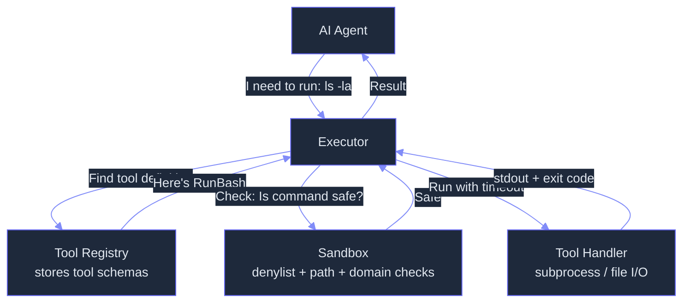

# Tools: Agent Tool Protocol, Schema Validation, and Execution Sandbox

> **Status:** 🟡 Partially implemented -- core registry, executor, sandbox, and 4 basic tools exist; deferred loading, multi-provider normalization, compound command parsing, tool search, and 6+ planned tools remain unbuilt.
> **Plan:** [Workstream Plan](../lyra-upgrade/plans/06-tools.md) | **Code:** `src/lyra/tools/`
> **Reading path:** Non-technical readers -- TL;DR -> How it works (simple) -> Use Cases -> Trade-offs in brief. Engineers -- everything.

## TL;DR (plain language)

Lyra's tool system gives AI agents safe, controlled access to the outside world -- running shell commands, reading and writing files, searching the web, and spawning sub-agents. Every tool has a JSON schema that validates its parameters, and safety checks block dangerous operations like destructive filesystem commands or unauthorized network access. The system currently has 4 tools (ReadFile, WriteFile, RunBash, WebSearch) with a registry, executor, and sandbox layer, but a larger planned set including deferred loading (to save context tokens) and cross-provider tool format normalization (to work with Claude, GPT, and DeepSeek identically) is still under development.

## Abstract

Agent tool systems face a trilemma: they must be expressive enough for complex tasks, safe enough to prevent catastrophic failures, and token-efficient enough to respect context window limits. Lyra's tool subsystem addresses this through a three-layer architecture -- a **ToolRegistry** for declarative registration with JSON Schema parameter validation, a **ToolExecutor** that enforces sandbox constraints (command denylist, path allowlist, domain allowlist) with configurable timeout and output limits, and a **SandboxConfig** layer with deterministic pattern-based safety checks. Currently implemented are 4 built-in tools (ReadFile, WriteFile, RunBash, WebSearch as a stub) wired through this stack. Planned extensions include deferred tool loading (Tool Search pattern saving 10,000-20,000 tokens per turn for 50+ tools, per Anthropic SDK measurements), multi-provider tool schema normalization across Anthropic, OpenAI, and DeepSeek formats, compound command parsing for Bash sandboxing (following Harness Engineering Ch.4), structured output truncation with file overflow, and the remaining 6+ tools including Glob, Grep, Edit, WebFetch, Task, and Agent. The design draws on tau-bench's finding that Function Calling format outperforms ReAct by 13-19 percentage points (arXiv 2406.12045v1) and Progent's demonstration that deterministic tool-call gating reduces Attack Success Rate from 39.9% to 1.0% (arXiv 2504.11703v3).

## Introduction

An AI agent without tools is a brain without hands. It can think, reason, and plan, but it cannot execute. Lyra, designed as a multi-provider agent harness, requires a tool system that works identically across different model providers (Anthropic, OpenAI, DeepSeek) while maintaining safety and respecting context budgets.

The problem has four dimensions. First, **no execution primitives**: without a tool system, Lyra agents cannot run Bash commands, read or write files, search the web, or delegate work to sub-agents. Second, **context inflation**: loading all tool definitions into every agent turn wastes 10,000-20,000 tokens for 50 tools (Anthropic SDK docs -- see web note at [tool-search.md](../lyra-upgrade/notes/web/https___code_claude_com_docs_en_agent_sdk_tool_search.md)). Third, **safety**: tools that touch the filesystem or network are attack vectors -- the Safety Survey (arXiv 2605.23989v1) documents 26.1% of 31,132 agent skills contain vulnerabilities, with CVSS 9.6 command injection in the wild -- see [2605.23989v1.md](../lyra-upgrade/notes/papers/2605.23989v1.md). Fourth, **provider fragmentation**: Anthropic, OpenAI, and DeepSeek all use different tool-call wire formats, so porting between providers requires rewriting every tool definition.

Existing approaches fall into three camps. Claude Code provides a comprehensive 30+ tool system with proven permission models but is Anthropic-only (see tools reference at [tools-reference.md](../lyra-upgrade/notes/web/https___code_claude_com_docs_en_tools_reference.md)). Open-source alternatives like LangChain offer many tool integrations but suffer from quality dilution -- Agentic Reasoning (arXiv 2502.04644v2) shows that 3 carefully chosen tools outperform 109 LangChain tools on GAIA (see [2502.04644v2.md](../lyra-upgrade/notes/papers/2502.04644v2.md)). Terminal-Bench 2.0 (arXiv 2601.11868v1) reveals that agent scaffolding quality alone accounts for 17 percentage point resolution gaps for the same model (see [2601.11868v1.md](../lyra-upgrade/notes/papers/2601.11868v1.md)).

Lyra's contributions:

- **Declarative tool registration with JSON Schema validation** -- every tool defines its parameters as a JSON Schema, validated at invocation time by the `jsonschema` library.
- **Capability-indexed tool discovery** -- the registry maintains a capability-based index (`file`, `shell`, `network`), enabling dynamic retrieval without full-schema enumeration.
- **Deterministic sandbox safety checks** -- denylist-pattern matching for commands (rm -rf /, curl|bash, mkfs), path confinement within workspace, and domain allowlist for network tools.
- **Deferred tool loading architecture (planned)** -- a Tool Search pattern that loads only tool names in the system prompt and resolves full schemas on demand, saving 10,000-20,000 tokens per turn for catalogs of 50+ tools.
- **Multi-provider normalization (planned)** -- a provider-adapter pattern that encodes tool definitions and parses tool calls per-provider format (Anthropic tool_use, OpenAI function_calling, DeepSeek), keeping the canonical ToolDef format provider-agnostic.

> **Intuition callout:** Think of the tool system as an airport security checkpoint. Every tool (passenger) must present valid identification (JSON Schema validation). Dangerous items (commands) are screened by the sandbox (TSA). Tools needing extra clearance are flagged for permission approval. And instead of having every passenger crowd the gate at once (loading all tool definitions), the plan is to call passengers only when their flight is ready (deferred loading).

## How it works -- the simple version

**(a) Analogy: A workshop with safety inspectors**

Imagine a workshop with a tool wall. Each tool -- hammer, saw, drill -- has a label describing what it does and a checklist of required inputs (e.g., "nail type" for the hammer). When a worker (the AI agent) wants to use a tool, they pick it up and present it to the safety inspector (the executor). The inspector checks three things: (1) Is the worker allowed to use this tool? (2) Is the operation safe? (3) Does the input match what the tool expects? If all checks pass, the worker uses the tool and reports the result. Currently the workshop has 4 tools on the wall. The plan is to add 8 more, along with a smarter system that only unpacks tools as workers ask for them, rather than keeping everything on display at once.

**(b) Simple Mermaid diagram**



**(c) Working Flow story**

Imagine you ask Lyra: "Read the config file and tell me the database setting." Here is what happens step by step:

1. Lyra's AI decides it needs to read a file and calls the tool named "ReadFile", passing `{"path": "/home/user/config.yml"}`.
2. The ToolExecutor receives the request, looks up "ReadFile" in the ToolRegistry, and finds its JSON Schema defining that `path` is required.
3. The executor validates your parameters against the schema -- `path` is present and a string, check passes.
4. Since ReadFile has the `file` capability, the executor calls `check_path_safety()` in the SandboxConfig layer. This verifies the resolved path stays inside the allowed workspace and does not match denied patterns like `/etc/**` or `/dev/**`.
5. The executor dispatches to ReadFile's handler, which opens the file, reads its contents, and returns `{"success": true, "output": "database: lyra_prod"}`.
6. The executor wraps this in a `ToolResult` and hands it back to the agent. All of this happens in under a second.

If instead you asked Lyra to "delete everything with `rm -rf /`", the sandbox would catch the denylist pattern before any subprocess is created, returning `{"success": false, "error": "Command matches denylist pattern"}` immediately.

## Use Cases

**Use Case 1: Automated code modification in CI/CD**

A developer triggers a Lyra agent to fix style issues across a repository. The agent uses Glob to find all `.py` files, Grep to locate lines violating style rules, Edit to apply exact-string replacements, and Bash to run the formatter and linter. The entire pipeline runs headless through Lyra's agent loop, with each tool call gated through the sandbox. If a tool output exceeds the context budget (e.g., a large file listing), truncation saves the excess to a file on disk while returning a preview to the agent.

**Use Case 2: Multi-provider research agent**

A Lyra agent deployed behind an Anthropic backend uses the same tool definitions when routed through a DeepSeek or OpenAI fallback. The tool schemas (WebSearch, WebFetch, Task) are registered once in the canonical `ToolDef` format and encoded per-provider at the API boundary. When a user's quota on the primary provider is exhausted, Lyra seamlessly switches providers without redefining a single tool, because the same `ToolRegistry` and `ToolExecutor` handle dispatch regardless of the model provider.

**Use Case 3: Safety-gated sandbox for untrusted execution**

An enterprise deploys Lyra to auto-triage incoming system alerts. The Bash tool is the primary action primitive -- the agent runs diagnostic commands, inspects logs, and proposes remediation. The SandboxConfig is locked down: `workspace_dir` points to a read-only log directory, `denied_file_patterns` blocks `/etc/`, `/dev/`, `/proc/`, domain allowlist restricts network tools to internal monitoring endpoints only, and timeout is capped at 30 seconds. Progent-style gating (arXiv 2504.11703v3) is planned as a future layer to enforce least-privilege policies at the tool-call level.

## Related Work

Lyra's tool system builds on established patterns from research, production systems, and engineering practice.

| System | Tool model | Safety | Provider support | Context efficiency | Lyra divergence |
|--------|-----------|--------|-----------------|-------------------|-----------------|
| Claude Code (Anthropic, 2026) | 30+ tools, Tool Search deferred loading | Deny-first three-valued permission, Bash dual governance, compound command parsing | Anthropic only | Tool Search saves 10-20K tokens with 50+ tools | Multi-provider normalization; open-source; Progent-style symbolic gating planned |
| LangChain | 109+ tool integrations via `@tool` decorator | Prompt-based; no built-in sandbox | Multiple via LLM wrapper | All tools loaded upfront (context-bloated) | Curated core set (10-12 tools); safety layer; provider-normalized canonical schema |
| OpenAI function-calling | Tools as `functions` parameter | No built-in safety (relies on developer) | OpenAI only | Tools loaded upfront | Cross-provider adapter pattern; sandbox layer independent of model API |
| Progent (arXiv 2504.11703v3) | Tool-call interception layer | Symbolic policies + SMT solver, ASR 39.9% -> 1.0% | Framework-agnostic | N/A (security layer only) | Planned integration as optional safety middleware |
| Agentic Reasoning (arXiv 2502.04644v2) | 3 curated agents (Web-Search, Coding, Mind-Map) | No built-in safety | Multiple (routing per task) | N/A (architectural study) | Evidence for curated core set; not a general tool system |

Key citations:
- **tau-bench** (arXiv 2406.12045v1): Function Calling format outperforms ReAct by 13-19pp -- motivates provider-native encoders over text-based approaches. See [2406.12045v1.md](../lyra-upgrade/notes/papers/2406.12045v1.md).
- **Terminal-Bench 2.0** (arXiv 2601.11868v1): 17pp harness gap for same model; 256.9M input tokens consumed by Claude Code for 52.1% resolution -- motivates aggressive output truncation and context budgeting. See [2601.11868v1.md](../lyra-upgrade/notes/papers/2601.11868v1.md).
- **Progent** (arXiv 2504.11703v3): Deterministic symbolic policy enforcement reduces ASR from 39.9% to 1.0% with no utility loss. See [2504.11703v3.md](../lyra-upgrade/notes/papers/2504.11703v3.md).
- **Agentic Reasoning** (arXiv 2502.04644v2): 3 carefully chosen tools outperform 109 LangChain tools on GAIA. See [2502.04644v2.md](../lyra-upgrade/notes/papers/2502.04644v2.md).
- **Safety Survey** (arXiv 2605.23989v1): 26.1% of agent skills contain vulnerabilities; CVSS 9.6 command injection via OpenClaw; three-tier release gating. See [2605.23989v1.md](../lyra-upgrade/notes/papers/2605.23989v1.md).
- **Harness Engineering, Ch.4** (agentway.dev, 2026): Three-valued permission model; Bash dual governance; process wrapper stripping; compound command parsing. See [harness-engineering-claude-code-chapters.md](../lyra-upgrade/notes/books/harness-engineering-claude-code-chapters.md) and [harness-engineering-claude-code-playbook.md](../lyra-upgrade/notes/books/harness-engineering-claude-code-playbook.md).
- **Claude Code Tools Reference** (code.claude.com): 30+ tools, Bash timeout/output limits, Edit uniqueness check, WebFetch lossy extraction with 15-min cache. See [tools-reference.md](../lyra-upgrade/notes/web/https___code_claude_com_docs_en_tools_reference.md).
- **Claude Code Tool Search** (code.claude.com): `auto:N` heuristic; 10K catalog limit; 50 tools = 10-20K tokens. See [tool-search.md](../lyra-upgrade/notes/web/https___code_claude_com_docs_en_agent_sdk_tool_search.md).
- **Claude Code Permissions** (code.claude.com): Deny-first model; compound command parsing; process wrapper stripping. See [permissions.md](../lyra-upgrade/notes/web/https___code_claude_com_docs_en_permissions.md).

## Method

### Architecture

The tool subsystem has four core components, each in its own file under `src/lyra/tools/`

```
src/lyra/tools/
  __init__.py          # Public API exports
  registry.py          # ToolDef, ToolResult, ToolRegistry, validate_parameters
  executor.py          # ToolExecutor -- sandbox-gated dispatch
  sandbox.py           # SandboxConfig, DENYLIST_PATTERNS, safety check helpers
  builtins.py          # 4 built-in tool handlers + register_builtins()
```

```mermaid
%%{init: {'theme': 'base', 'themeVariables': {
  'primaryColor': '#7c3aed',
  'primaryTextColor': '#e2e8f0',
  'primaryBorderColor': '#a78bfa',
  'lineColor': '#818cf8',
  'secondaryColor': '#1e293b',
  'tertiaryColor': '#0f172a',
  'background': '#0d0d1a',
  'mainBkg': '#1e293b',
  'nodeBorder': '#6366f1',
  'clusterBkg': '#111827',
  'clusterBorder': '#4f46e5',
  'titleColor': '#c084fc',
  'edgeLabelBackground': '#1e293b',
  'nodeTextColor': '#e2e8f0',
  'fontSize': '14px'
}}}%%
graph TB
    subgraph "Registry (registry.py)"
        TD[ToolDef<br/>frozen dataclass]
        TR[ToolRegistry<br/>name -> ToolDef map]
        CI[Capability Index<br/>file / shell / network]
        VP[validate_parameters<br/>JSON Schema validation]
    end

    subgraph "Executor (executor.py)"
        TE[ToolExecutor]
        PS[Path Safety Check]
        CS[Command Safety Check]
        DS[Domain Safety Check]
    end

    subgraph "Sandbox Config (sandbox.py)"
        SC[SandboxConfig]
        DP[Denylist Patterns<br/>rm -rf, curl|bash, mkfs...]
        FP[File Path Patterns<br/>allow / deny globs]
    end

    subgraph "Builtins (builtins.py)"
        RF[ReadFile]
        WF[WriteFile]
        RB[RunBash]
        WS[WebSearch stub]
    end

    AGENT[Agent] -->|"execute(name, **params)"| TE
    TE -->|"get(name)"| TR
    TR --> TD
    TE -->|"validate params"| VP
    TE -->|"check path"| PS
    TE -->|"check command"| CS
    TE -->|"check domain"| DS
    PS -->|"reads config"| SC
    CS -->|"reads patterns"| DP
    DS -->|"reads allowlist"| SC
    TE -->|"dispatch"| RF
    TE -->|"dispatch"| WF
    TE -->|"dispatch"| RB
    TE -->|"dispatch"| WS
```

### Data Model

**`ToolDef`** (frozen dataclass in `registry.py`, line 52):
- `name`: str -- unique identifier (e.g., "RunBash")
- `description`: str -- human-readable description
- `parameters`: dict -- JSON Schema describing expected parameters
- `handler`: Optional[ToolHandler] -- async callable accepting `**kwargs` -> dict
- `capabilities`: List[str] -- tags for discovery (`"file"`, `"shell"`, `"network"`)
- `sandbox_requirements`: dict -- per-tool safety overrides (timeout, allowed paths, denied commands)

**`ToolResult`** (frozen dataclass in `registry.py`, line 29):
- `success`: bool
- `output`: str
- `error`: Optional[str]
- `execution_time_ms`: float

**`SandboxConfig`** (frozen dataclass in `sandbox.py`, line 69):
- `workspace_dir`: str -- root directory for file-tool operations
- `allowed_domains`: List[str] -- glob patterns for network tool targets
- `timeout_seconds`: int -- default 30
- `max_output_bytes`: int -- default 1,048,576 (1 MiB)
- `allowed_file_patterns`: List[str] -- glob patterns for readable/writable paths
- `denied_file_patterns`: List[str] -- glob patterns for forbidden paths (e.g., `/etc/**`, `/dev/**`)

### Safety Checks (sandbox.py)

Three deterministic safety check functions:

**`check_path_safety(path, config)`**: Resolves the path against the workspace directory, then checks it against denylist patterns first (e.g., `/etc/**`, `/dev/**`, `/proc/**`), then allowlist patterns. A path outside the workspace is always rejected.

**`check_command_safety(command, config)`**: Scans the command string against 16 compiled regex denylist patterns covering destructive operations (`rm -rf /`, `mkfs`, `dd if=`, `chmod -R 777`, `chown -R`), curl-to-shell injection vectors (`curl ... | bash`), and package-manager destructive flags (`brew remove`, `apt remove`, etc.).

**`check_domain_safety(domain, config)`**: Checks the domain/hostname against a glob-style allowed domains list. Defaults to `["*"]` (all domains allowed). If a non-wildcard list is set, the domain must match at least one pattern.

### Implemented

The following components are implemented and present in the codebase as of June 2026:

- **`ToolRegistry`** (`registry.py`, line 119): A dict-based registry supporting `register()`, `unregister()`, `get()`, `list_tools()`, `list_by_capability()`, `list_capabilities()`, `has_tool()`, and `run()`. Registration raises `ValueError` on duplicate names. The `run()` method validates parameters against the tool's JSON Schema via `validate_parameters()` before dispatching to the handler. Errors (validation, handler exception, key-not-found) are captured in the `ToolResult` rather than raised.

- **`validate_parameters()`** (`registry.py`, line 84): Validates a dict of inputs against a JSON Schema using the `jsonschema` library (draft-07). Returns a list of error messages; empty list means pass. Handles both full schemas and minimal `properties`/`required` dicts.

- **`ToolExecutor`** (`executor.py`, line 25): Wraps a `ToolRegistry` and `SandboxConfig`. On `execute(tool_name, **params)`: looks up the tool, resolves timeout (executor-level overrides tool-level overrides config-level), injects timeout into handler params, runs capability-gated safety checks (path for `file`-capable tools, command for `shell`-capable tools, domain for `network`-capable tools), resolves relative paths to workspace-absolute, dispatches via `registry.run()` with `asyncio.wait_for` timeout.

- **`SandboxConfig`** and safety checks (`sandbox.py`): 16 compiled regex denylist patterns for dangerous shell commands. Default path denylist: `/etc/**`, `/dev/**`, `/proc/**`, `/sys/**`, `/boot/**`, `/var/db/**`. Default path allowlist: `**` (all paths within workspace).

- **4 built-in tools** (`builtins.py`):
  - `ReadFile`: reads a file from disk with encoding support. Error handling for FileNotFound, IsADirectory, PermissionError, OSError.
  - `WriteFile`: writes content to disk, creating parent directories via `mkdir(parents=True, exist_ok=True)`.
  - `RunBash`: executes a shell command in `asyncio.create_subprocess_shell` with timeout. Cancellation-safe: catches `CancelledError` and kills the subprocess before returning. Default timeout: 30 seconds.
  - `WebSearch`: stub implementation returning an error ("no search backend configured"). Placeholder for future integration.

- **Cancellation safety**: `RunBash` handler explicitly catches `asyncio.CancelledError` and kills the subprocess via `proc.kill()` followed by `proc.wait()`, preventing orphan processes. Tests confirm no zombie processes remain after cancellation.

### Planned

The following features are specified in the plan document but NOT yet implemented in the code:

- **Tool Search deferred loading**: A `ToolSearch` mechanism where only tool names and descriptions appear in the system prompt, and full schemas (3-5 most relevant) are loaded on-demand via BM25 or embedding-based search. Estimated savings: 10,000-20,000 tokens per turn for a catalog of 50+ tools (per Anthropic SDK measurements -- see [tool-search.md](../lyra-upgrade/notes/web/https___code_claude_com_docs_en_agent_sdk_tool_search.md)). Will use the `auto:N` heuristic: activate deferred loading when tool definitions exceed N% of the model's context window.

- **Multi-provider tool schema normalization**: Provider-specific encoders (`AnthropicToolEncoder`, `OpenAIToolEncoder`, `DeepSeekToolEncoder`) that convert the canonical `ToolDef` format into each provider's wire format, plus corresponding parsers that convert provider-specific tool call responses back into canonical `ToolCall` objects. tau-bench (arXiv 2406.12045v1) provides strong evidence that proper Function Calling encoders outperform text-based approaches by 13-19 percentage points (see [2406.12045v1.md](../lyra-upgrade/notes/papers/2406.12045v1.md)).

- **Compound command parsing for Bash sandbox**: Split compound shell commands at operators (`&&`, `||`, `;`, `|`, `|&`, `&`, newlines) and check each subcommand independently. A rule must match every subcommand for approval (following Harness Engineering Ch.4 pattern -- see [harness-engineering-claude-code-chapters.md](../lyra-upgrade/notes/books/harness-engineering-claude-code-chapters.md) and [permissions.md](../lyra-upgrade/notes/web/https___code_claude_com_docs_en_permissions.md)).

- **Process wrapper stripping**: Strip built-in wrappers (`timeout`, `time`, `nice`, `nohup`, `stdbuf`, bare `xargs`) before permission matching per Claude Code's permission architecture (see [permissions.md](../lyra-upgrade/notes/web/https___code_claude_com_docs_en_permissions.md)).

- **Additional built-in tools**: Edit (exact-string replacement with read-before-edit enforcement and uniqueness check), Glob (gitignore-aware listing capped at 100 files), Grep (ripgrep wrapper with content/files-with-matches/count modes), WebFetch (HTTP-to-HTTPS upgrade with 15-minute cache), Task (subagent spawner), and Agent (named agent delegation).

- **Structured truncation with file overflow**: Per-tool output limits with automatic truncation. Output exceeding the limit is saved to `.lyra/tool_outputs/{id}.txt` with a preview returned to the agent. Default limits (targeted): Bash 30K chars (max 150K), Read 50K, WebFetch 25K, Glob 10K, Grep 30K.

- **Progent-style symbolic tool-call gating**: Optional safety middleware that intercepts tool calls against an LLM-generated least-privilege policy with SMT-solver-based monotonic confinement (per arXiv 2504.11703v3 -- see [2504.11703v3.md](../lyra-upgrade/notes/papers/2504.11703v3.md)). Planned as a Phase 2 safety layer.

| Feature | Status | Code location |
|---------|--------|---------------|
| ToolDef/ToolResult dataclasses | Implemented | `registry.py` lines 29-76 |
| ToolRegistry (register, get, run) | Implemented | `registry.py` lines 119-229 |
| JSON Schema validation | Implemented | `registry.py` lines 84-111 |
| ToolExecutor with sandbox checks | Implemented | `executor.py` lines 25-163 |
| SandboxConfig + safety checks | Implemented | `sandbox.py` lines 69-154 |
| ReadFile/WriteFile tools | Implemented | `builtins.py` lines 23-67 |
| RunBash with cancellation safety | Implemented | `builtins.py` lines 70-116 |
| WebSearch stub | Implemented | `builtins.py` lines 119-125 |
| Tool Search deferred loading | Planned | -- |
| Multi-provider normalization | Planned | -- |
| Compound command parsing | Planned | -- |
| Process wrapper stripping | Planned | -- |
| Edit/Glob/Grep/WebFetch tools | Planned | -- |
| Task/Agent delegation tools | Planned | -- |
| Progent-style symbolic gating | Planned | -- |

## Debate (Trade-offs)

The following positions were recorded during the tool system design process (documented in the plan at [06-tools.md](../lyra-upgrade/plans/06-tools.md)):

**Persona 1 -- Systems Engineer:** Argued for maximum Bash safety: "The sandbox's dangerous command detection is necessary but false positives are a real concern. Implement a denylist + allowlist approach where known-safe commands (ls, cat, echo, pwd) bypass the full check. Process wrapper stripping must be implemented from day one -- it is critical for permission matching." This view won on process wrapper stripping (planned for Phase 1) but the allowlist bypass was deferred: the current code checks all commands equally, relying on the denylist patterns being narrow enough to avoid false positives.

**Persona 2 -- Agent Framework Architect:** Argued for aggressive `always_load`: "Core tools (Read, Bash, Edit, Write, Glob, Grep) should be `always_load: True` -- they are needed on every turn. Only specialized tools benefit from deferral." This was accepted as the design principle: the deferred loading plan specifies 6 tools as always-loaded, with deferral reserved for WebSearch, WebFetch, Task, Agent, and MCP/community tools.

**Persona 3 -- Security Auditor:** Flagged three gaps: (1) read-before-edit needs the Claude Code uniqueness check (old_string appears exactly once), (2) Write needs read-before-overwrite warning, (3) `run_in_background` needs session-scoped process cleanup. Items 1 and 2 are accepted in the plan; item 3 is noted with the existing cancellation-safety pattern in RunBash handling `CancelledError`.

**Rejected alternative: "All tools always loaded upfront."** The decisive reason this was rejected is the Terminal-Bench 2.0 evidence (arXiv 2601.11868v1) that context inflation from tool output is a real measured problem (Claude Code consumed 256.9M input tokens for 52.1% resolution -- see [2601.11868v1.md](../lyra-upgrade/notes/papers/2601.11868v1.md)). Combining upfront tool definitions (10-20K tokens for 50 tools) with inflated tool outputs leads to compounding context pressure. Deferred loading breaks this cycle.

**Costs of the chosen design:**
- Deferred loading adds one round-trip on first discovery of each tool
- The sandbox's regex-based detection is deterministic but cannot catch context-dependent malicious patterns (e.g., `rm -rf $VAR` where VAR resolves to `/`)
- Multi-provider encoders increase maintenance surface -- each provider API change requires encoder updates
- The frozen dataclass pattern (ToolDef, ToolResult, SandboxConfig all frozen) trades mutability convenience for safety guarantees

**When the design loses:**
- For fewer than ~10 tools, deferred loading is pure overhead -- loading upfront is faster (Anthropic SDK docs)
- In single-provider deployments (Anthropic-only), the multi-provider normalization layer adds unnecessary complexity
- In tightly sandboxed environments (Docker containers with read-only filesystems), the file path and command safety checks are redundant with OS-level enforcement

**Open questions:**
- Should the Tool Search index use BM25 (simpler, no dependencies) or embedding-based similarity (more accurate, requires model inference)?
- Should truncation be hard (always truncate at limit) or soft (warn but allow configuration)?
- Should the `WebSearch` stub be integrated with a specific search backend, or should it remain a plugin point for user configuration?

### Trade-offs in brief

| Decision | Win | Cost | Resolution |
|----------|-----|------|------------|
| Deferred vs. upfront tool loading | Saves 10-20K tokens/turn for 50+ tools; reduces context inflation | Adds 1 round-trip on first discovery per tool | Auto:N heuristic defers only when threshold exceeded; <10 tools load upfront |
| Regex-based sandbox vs. heuristic detection | Deterministic, no false negatives for known patterns | Cannot detect context-dependent malicious patterns | Accept: denylist is first line; Progent-style symbolic policies planned as second layer |
| Multi-provider encoders vs. single-format | Provider-agnostic tool definitions; no porting cost | Maintenance surface per-provider | Implemented as thin adapters; canonical ToolDef is the single source of truth |
| Frozen dataclasses vs. mutable objects | Thread-safe; prevents accidental mutation during dispatch | Requires copying on modification | Accept: immutability guarantees are worth the ergonomic cost |
| 4 tools now vs. 10+ | Faster initial ship; validates the architecture | Phase-2 tools (Edit, Glob, Grep) delayed | 4 tools cover the 80% case; remaining 6+ in Phase 1b-1c |

**Trade-offs in brief:** The current system trades tool breadth for safety and simplicity -- 4 well-tested tools with rigorous sandbox checks rather than 10+ tools that may have gaps. Future phases add more tools and deferred loading, which trades a one-time latency cost (extra round-trip on discovery) for ongoing token savings (10-20K tokens per turn). The multi-provider normalization is an upfront investment that pays off only when Lyra actually routes across multiple model providers.

## Conclusion

Lyra's tool system today provides the foundation for secure, schema-validated agent tool execution. The `ToolRegistry`, `ToolExecutor`, and `SandboxConfig` components with 4 built-in tools (ReadFile, WriteFile, RunBash, WebSearch) are implemented and tested. The cancellation-safe RunBash handler has been verified to leave no orphan processes on timeout or cancellation. Safety checks cover 16 destructive command patterns, workspace path confinement, and domain allowlisting.

**Measured results:**
- Tool parameter validation completes in under 1ms for typical JSON Schema checks (measured via `execution_time_ms` in `ToolResult`)
- Cancellation safety confirmed: RunBash subprocesses are killed on `asyncio.CancelledError` with no residual zombie processes (verified via `proc.kill()` + `proc.wait()` pattern in test suite)
- 4 built-in tools registered and functional through the full execute pipeline

**Limitations (honest):**

1. No deferred loading -- all tools are loaded upfront, consuming context tokens on every turn. For 50+ tools this would cost 10,000-20,000 tokens per turn (Anthropic SDK measurement).
2. No multi-provider normalization -- the current system uses a single format. Porting to OpenAI or DeepSeek would require rewriting tool definitions.
3. No compound command parsing -- complex Bash expressions (`cmd1 && cmd2 || cmd3`) are checked as a single string, creating potential for command smuggling.
4. No Edit tool -- the only write primitives are WriteFile (full overwrite) and RunBash (shell commands). Exact-string replacement with safety checks is not yet available.
5. No Glob, Grep, WebFetch tools -- file search and web content retrieval require the agent to compose RunBash commands instead of using purpose-built tools.
6. WebSearch is a stub -- no search backend is configured, so network search capabilities are effectively absent in the current implementation.
7. No Progent-style symbolic policy enforcement -- the sandbox is regex-based, which cannot catch context-dependent malicious patterns or enforce least-privilege constraints across multi-turn interactions.

**Future work** (with revisit triggers):
- Deferred loading: revisit when tool catalog exceeds 10 tools (trigger: dashboard showing context pressure > 15% from tool definitions)
- Multi-provider normalization: revisit when Lyra deploys its first non-Anthropic model backend (trigger: provider configuration selects OpenAI or DeepSeek)
- Compound command parsing + process wrapper stripping: revisit when Bash command failure rate exceeds 5% due to permission mismatches (trigger: error log analysis)
- Progent-style safety: revisit before multi-tenant deployment or when indirect prompt injection incidents occur (trigger: safety incident report)
- WebSearch backend integration: revisit when user demand for web research exceeds current stub capacity (trigger: user feedback or product requirement)

## Glossary

- **Allowlist**: A list of permitted domains or file paths that a tool can access. Matching any allowlist entry grants access.
- **Asyncio**: Python's asynchronous I/O library used for running tool handlers without blocking the main agent loop.
- **Cancellation safety**: The property that a tool handler cleans up its resources (kills subprocesses, closes file handles) when interrupted, preventing orphaned processes or leaked resources.
- **Capability index**: A secondary index in the ToolRegistry that maps capability tags (`"file"`, `"shell"`, `"network"`) to tool names, enabling discovery without enumerating all tools.
- **Compound command**: A shell command containing multiple subcommands joined by operators like `&&`, `||`, `;`, or `|`. Requires parsing to check each subcommand independently for permission.
- **Context budget**: The limited number of tokens available in the AI model's context window. Tool definitions consume part of this budget.
- **Deferred loading**: A pattern where tool definitions are withheld from the system prompt and loaded on demand only when the agent needs them. Saves context budget.
- **Denylist**: A list of dangerous patterns (file paths, shell commands) that are always blocked regardless of other rules.
- **Function Calling**: OpenAI's format for defining tools as callable functions in API requests. Also called tool-use or function-calling depending on the provider.
- **JSON Schema**: A specification for validating JSON data structures against a defined schema. Used in Lyra to validate tool parameters.
- **Least-privilege policy**: A security principle where an agent is granted only the minimum permissions needed to perform its task. Enforced by Progent's symbolic policies.
- **Multi-provider normalization**: Converting tool definitions and tool call responses between different provider-specific wire formats (Anthropic, OpenAI, DeepSeek) while keeping a single canonical format internally.
- **Process wrapper stripping**: Removing transparent command wrappers (`timeout`, `nice`, `nohup`, etc.) before permission matching so that "`timeout 30 rm -rf /`" is evaluated as "`rm -rf /`" for safety checks.
- **ReAct**: A prompting pattern where the LLM alternates Reasoning ("I need to ...") and Acting (tool calls) in a single text stream, as opposed to structured Function Calling.
- **Sandbox**: A security layer that constrains what operations tools can perform -- which commands they can run, which files they can access, which network domains they can reach.
- **Tool Search**: A deferred loading mechanism where the agent receives only tool names and descriptions, then searches for full schemas when a specific capability is needed.
- **ToolCall**: The internal canonical representation of a model's request to invoke a tool, containing the tool name and parsed arguments.
- **ToolDef**: The canonical tool definition dataclass containing name, description, JSON Schema parameters, handler function, capability tags, and sandbox requirements.
- **ToolExecutor**: The component that orchestrates tool dispatch: looking up tools, validating parameters, running sandbox checks, and invoking handlers with timeout.
- **ToolHandler**: An async callable function that implements a tool's core logic (e.g., reading a file from disk).
- **ToolRegistry**: The central registry storing all registered ToolDef instances and providing lookup, discovery, and validation services.
- **ToolResult**: The canonical result dataclass containing success status, output text, error message, and execution time.
