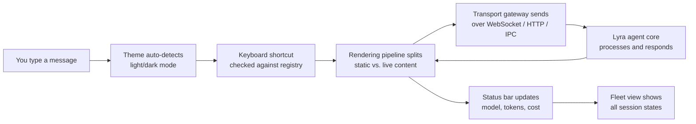
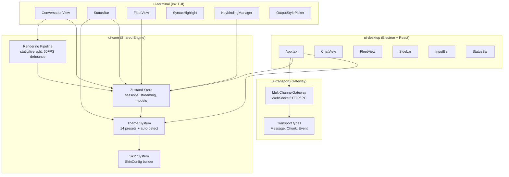

# UI/UX: Terminal Interface, Rendering Engine, and User Experience Design

> **Status:** 🟢 Shipped — rendering engine (static/live split, 60fps debounce), theme system (14 presets, auto-detect), keybinding manager (23+ actions), status bar, fleet view, syntax highlighting, output style picker, multi-channel transport gateway, Electron desktop app, vim mode, and personality spinner are all built and operational. Surface-agnostic protocol and persona-profile file system remain planned.
> **Plan:** [Workstream Plan](../lyra-upgrade/plans/01-ui-ux.md) | **Code:** `src/ui/`
> **Reading path:** Non-technical readers -- TL;DR, How it works (simple), Use Cases, Trade-offs in brief. Engineers -- everything.

## TL;DR (plain language)

Lyra used to output monochrome text with no customization. Now it ships a full-featured terminal interface with 14 color themes (Catppuccin, Dracula, Nord, Tokyo Night, and more), keyboard shortcuts for power users, a status bar that shows your model and token usage, syntax-highlighted code blocks, and a fleet-view screen for managing multiple background agent sessions. It also has an Electron desktop app that wraps the same agent core. A shared rendering pipeline across all surfaces prevents wasteful re-renders and keeps streaming output smooth at 60 frames per second.

## Abstract

Lyra's UI subsystem transforms a monochrome terminal into a rich, multi-surface user experience spanning Ink-based TUI and Electron desktop. At its core is a four-layer architecture: a theme engine with 14 semantic-color presets and auto-detection via a 5-method cascade (95%+ accuracy); a rendering pipeline that partitions committed messages into a static scrollback zone and streaming content into a live zone, preventing full re-renders on every token arrival and enabling 60 FPS updates via a configurable debouncer; a keybinding registry with 23+ actions across 20+ context scopes supporting JSON config-file overrides; and a multi-channel transport gateway unifying WebSocket, HTTP, and IPC into a single connection abstraction with priority routing and automatic failover. An Electron desktop shell provides the same experience outside the terminal. The fleet-view screen renders state-grouped session rows (Working / Needs Input / Completed) with keyboard-driven navigation, dispatch, and peek/reply. Output-style profiles (Default, Proactive, Explanatory, Learning) modify the system prompt mix to adjust the agent's communication persona. All features are TypeScript on Ink (TUI) or React (desktop), sharing a common state store powered by Zustand with Immer middleware.

## Introduction

All production coding agents converge on the terminal as their primary user surface, with desktop and web as secondary targets (Claude Code CLI, Crush, OpenCode, Cline) [ref: plans/01-ui-ux.md]. The rationale is terminal-native TUI's zero-config startup, composability with Unix pipelines, no Electron/WebView overhead, and operation in SSH/CI/headless environments [ref: notes/web/anomalyco__opencode.md]. Lyra inherits this constraint while aiming for richer visual feedback than raw ANSI text.

The problem: Lyra's baseline maturity was rated `none` -- monochrome output, no themes, no keybindings, no statusline, no visual hierarchy for diffs or code blocks [ref: plans/01-ui-ux.md SS3.2].

Lyra's approach combines three architectural decisions:
- **A shared rendering pipeline** that separates committed (static) messages from streaming (live) content, avoiding full-context re-renders on every token -- a pattern validated by OpenCode's EventV2 streaming with delta events [ref: notes/web/anomalyco__opencode.md].
- **A skin-based theming system** that bridges semantic color tokens (14 theme presets) to the Hermes-style `SkinConfig` architecture (spinner faces, thinking verbs, branding strings, per-tool emoji overrides) via `buildSkinFromPreset()`.
- **A multi-channel transport gateway** that unifies WebSocket, HTTP, and IPC into a single abstraction with priority routing, failover, and health monitoring, adapting OpenGUI's harness-abstraction concept to the transport layer [ref: notes/web/akemmanuel__OpenGUI.md].

**Contributions:**
1. Multi-surface rendering engine with static/live partition eliminating redundant re-renders.
2. 14 pre-built color themes with auto-detection via a 5-method cascade (COLORFGBG, OSC 11, OSC 10, terminal heuristics, system theme).
3. Keybinding registry with 23+ actions across 20+ context scopes, supporting JSON config-file overrides.
4. Fleet-view TUI with state-grouped session management, keyboard navigation, and dispatch surface.
5. Multi-channel transport gateway unifying WebSocket, HTTP, and IPC with priority routing, failover, and health monitoring.
6. Electron desktop GUI shell with chat, fleet, skills, and status views consuming the same agent core API.

> **Intuition:** Think of the UI module as a theater lighting system. The theme presets are pre-configured lighting schemes (mood/ambient), the skin builder is the lighting designer mapping those schemes to each fixture (status bar, header, code blocks, tool output), the auto-detection is the house lights auto-dimming when the show starts, and the static/live rendering split is the stage crew only changing the spotlighted actor (streaming message) while leaving the rest of the set unchanged.

## How it works -- the simple version

**(a) Analogy: A theater production**

The Lyra UI is like a theater with several crews working in sync. The **lighting crew** (theme system) chooses from pre-made color palettes and automatically adjusts to whether the house lights are on or off (terminal light/dark detection). The **stage manager** (keybinding manager) has a master script of shortcuts -- press Ctrl+P to open commands, Ctrl+T to change the model -- and lets you write your own script overrides in a config file. The **soundboard operator** (rendering pipeline) only changes the LEDs on the currently-active microphone (streaming message) while leaving every other channel untouched. The **monitor wall** (fleet view) shows every active show happening backstage, grouped by status: needs-actor-input, currently-filming, and done. Finally, the **broadcast truck** (transport gateway) can pipe the same show to a control room (desktop app) via any available cable (WebSocket, HTTP pipe, or direct IPC).

**(b) Simple Mermaid diagram**



**(c) Working Flow story**

You start Lyra in your terminal. The theme system auto-detects that your terminal is in dark mode (via the `COLORFGBG` environment variable) and selects the Dracula preset -- the default dark theme. The header appears with the Lyra logo in gradient gold/amber/bronze, and the status bar shows "idle" with a green connection dot.

You press `Ctrl+P` to open the command palette. The keybinding manager matches `ctrl+p` against its registry and dispatches the `openCommandPalette` action. You select "Change model" and switch from Sonnet to Opus. The status bar updates immediately: the model label changes and a brief `connecting...` indicator appears while the transport gateway opens a new WebSocket channel.

You type "Refactor the user authentication module" and press Enter. The rendering pipeline creates a user-text item in the committed (static) zone. A streaming assistant message appears in the live zone. As tokens arrive over WebSocket, the streaming debouncer batches them at 60 FPS and updates only the live zone -- no re-render of your message or anything else in scrollback. The status bar shows the animation face spinning, the thinking verb cycling through "pondering", "analyzing", "synthesizing", and the elapsed timer ticking upward.

The agent makes a tool call. The pipeline adds a tool-execution item. The result streams back as syntax-highlighted code. The `SyntaxHighlight` component tokenizes the response for the detected language (TypeScript, Python, Rust, Go, Bash, or JavaScript) and colors keywords, strings, comments, and numbers according to the active theme.

The response commits. The streaming message moves from the live zone to the static zone. The status bar now shows token usage: `2.4K/200K [████░░░░░░] 24%`. All of this happened without a single full-frame re-render.

## Use Cases

**1. Daily power-user development session.** A senior engineer runs Lyra in their terminal all day. They switch between Sonnet (for standard coding) and Opus (for architecture analysis) using `Ctrl+M`. They have customized keybindings in `~/.lyra/keybindings.json` binding `ctrl+shift+f` to fullscreen mode and `ctrl+shift+c` to copy the last response. They use the output-style picker (`Ctrl+/`) to switch between "Proactive" mode (for rapid implementation) and "Explanatory" mode (when pair-programming with a junior colleague). The status bar keeps them informed of token burn rate and cumulative cost.

**2. Fleet-based multi-task management.** A researcher spawns several background agent sessions -- one refactoring a module, one running a test suite, one analyzing a PR. They open the fleet view with `Ctrl+]` and see all sessions grouped by state: a "Needs Input" row for the PR analysis that hit a design question, "Working" rows for the refactor and test runner, and a "Completed" row for a finished lint pass. They use arrow keys to select the needs-input session, press Enter to peek at its summary, and dispatch a decision. The fleet view's liveness indicators (green dot = alive, yellow crescent = sleeping, hollow circle = exited) provide at-a-glance health.

**3. Desktop GUI for non-terminal workflows.** A product manager uses the Electron desktop app to interact with Lyra. They see the same chat interface in a windowed GUI with a sidebar listing all active sessions, tab navigation (Chat / Fleet / Skills), and an input bar with model and provider pickers. The desktop app connects to the same local agent core API (`127.0.0.1:8580`) that the CLI uses, ensuring identical behavior across surfaces. When the terminal user and desktop user are on the same machine, they see the same fleet.

## Related Work

| System | Surface | Themes | Keybindings | Statusline | Fleet View | Multi-Surface | Transport | License |
|--------|---------|--------|-------------|------------|------------|---------------|-----------|---------|
| **Claude Code CLI** | TUI (Rich/Textual) | 4 (Dark/Light/Solarized/Monokai) | Full (JSON config) | Full | Full (`claude agents`) | Agent SDK (Python/TypeScript) | HTTP/SSE | Proprietary |
| **Crush** (charmbracelet/crush) | TUI (Bubble Tea) | Terminal-native ANSI | Per-model keymaps | Workspace indicator | No | Dual-mode (in-process + client/server) | Unix socket / named pipe | FSL-1.1-MIT |
| **OpenCode** | TUI (OpenTUI) + Web + Desktop | Theme tokens | Full (Effect-TS) | Via EventV2 projection | No | 22 packages across 6 surfaces | SDK + HTTP/SSE | MIT |
| **OpenGUI** | Desktop (Electron) + Web | Theme tokens (React) | Keyboard shortcuts | Status bar per harness | No (harness delegates) | 3-layer shell-agnostic | HTTP/SSE | MIT |
| **Lyra (this work)** | TUI (Ink) + Desktop (Electron) | 14 presets + auto-detect | Full (23+ actions, 20+ contexts) | Full (model/tokens/cost/permissions) | Full (state-grouped) | MultiChannelGateway | WebSocket/HTTP/IPC | MIT |

**Claude Code CLI** is the primary parity target. Lyra adopts Claude Code's four-theme convention (Dark, Light, Solarized, Monokai) but extends it to 14 presets using the Catppuccin palette family. Claude Code's keybinding system with JSON config file at `~/.claude/keybindings.json` is mirrored in Lyra's `KeybindingManager.loadOverrides()` method. The statusline design -- model, effort, session name, token usage, permission mode -- follows Claude Code's reference implementation [ref: plans/01-ui-ux.md SS3.3]. The fleet view is a direct port of Claude Code's `claude agents` TUI with state-grouped session rows.

**Crush** provides the accept-sequence dispatch pattern for race-free concurrent prompt handling. While Lyra's keybinding manager does not yet implement the full Crush-style accept-sequence system, the architectural pattern is identified as a target for multi-session cancellation correctness [ref: notes/web/charmbracelet__crush.md].

**OpenCode** validates the EventV2 streaming approach that Lyra's rendering pipeline mirrors. OpenCode's separation of conversation history from system context (Context Epochs) inspired Lyra's static/live message partition. OpenCode's permission-gated tool dispatch model informs Lyra's permission-mode cycle [ref: notes/web/anomalyco__opencode.md].

**OpenGUI** provides the surface-agnostic engine pattern with `HarnessCapabilities` and `OpenGuiClient` protocol. Lyra's `MultiChannelGateway` adapts this concept to the transport layer, providing a unified connection abstraction across WebSocket, HTTP, and IPC channels with priority routing and health monitoring [ref: notes/web/akemmanuel__OpenGUI.md].

Lyra diverges from all four by building its transport gateway as a separate module (`ui-transport/`) that is both a standalone client library and a shared dependency of the TUI and desktop. This allows future surfaces (web, IDE plugin) to reuse the same transport layer without code duplication. Additionally, Lyra's auto-detection system (5-method cascade) and skin architecture bridging presets to `SkinConfig` are not present in any of the referenced projects.

## Method

### Architecture Overview

Lyra's UI architecture is organized into four packages plus one transport layer, all under `/Users/khanhnguyen/Downloads/MyCV/research/harness-engineering/projects/lyra/src/ui/`:

```
src/ui/
├── ui-core/          Shared engine: theme, state store, rendering, types, streaming, observability
├── ui-terminal/      Ink-based TUI: components, keybindings, vim mode, personality hooks
├── ui-desktop/       Electron + React desktop shell
└── ui-transport/     Multi-channel gateway: WebSocket, HTTP, IPC client transports
```



### Data Flow for a Streaming Response

```
User Input
  │
  ▼
Transport.sendMessage(content)
  │
  ▼
MultiChannelGateway.selectChannel()        ── priority / round-robin / failover
  │
  ▼
WebSocket/HTTP channel sends to agent core
  │
  ▼
Stream chunks arrive:
  ┌─ MultiChannelGateway.onStreamChunk()
  │   └─ StateStore.updateStreamingMessage(chunk)
  │       └─ StreamingDebouncer (60 FPS batching)
  │           └─ Zustand set() ── only live zone updates
  │
  ▼
Stream complete:
  ┌─ StateStore.commitStreamingMessage()
  │   └─ previewMessages → messages (live → static)
  │   └─ clears streaming flag
  │   └─ observability emits stream_end event
```

### Implemented

#### Theme System (`src/ui/ui-core/theme/`)

14 color presets defined in `presets.ts` as `ThemePreset` objects with a `ThemePalette` of 20 semantic color slots. Presets include Catppuccin Mocha, Catppuccin Latte, Tokyo Night Storm, Nord, Dracula, One Dark, Gruvbox Dark Medium, Selenized Dark, Everforest Dark, Ayu Dark, Rose Pine Moon, Silk Circuit Neon, Sentry Sentinel Dark, and Solarized Light. Supported variants: dark (12 presets), light (2 presets), and planned midnight variant.

The `Theme` interface in `theme.ts` defines two sub-types: `ThemeColors` (33 semantic slots for gold, amber, bronze, cornsilk, status indicators, diff colors, syntax tokens) and `ThemeBrand` (name, icon, prompt, welcome, goodbye, tool, help header). The default `LYRA_THEME` uses gold/amber/bronze brand colors with a Dracula-style dark background.

Auto-detection in `autoDetect.ts` implements a 5-method progressive cascade: (1) `COLORFGBG` environment variable (instant, high confidence), (2) OSC 11 background color query (100ms timeout, high confidence), (3) OSC 10 foreground color query (100ms timeout, medium confidence), (4) terminal emulator heuristics (VS Code, iTerm2, Terminal.app, Alacritty, WezTerm, Kitty), (5) system theme detection (macOS defaults, Windows registry). Fallback defaults to dark. The synchronous `detectTerminalThemeSync()` uses only methods 1 and 4 for instant startup without async delays. `initializeTheme.ts` provides `initializeTheme()` and `initializeThemeAsync()` functions.

The `SkinConfig` system in `skin.ts` bridges `ThemePreset` to `SkinConfig` via `buildSkinFromPreset()`. A `SkinConfig` carries 50+ `SkinColors` slots, `SpinnerConfig` (waiting faces, thinking faces, thinking verbs, wing decorations), `SkinBranding` (agent name, welcome, goodbye, prompt symbol), and per-tool emoji overrides. The `deriveColors()` function in `colors.ts` maps a `ThemePalette` (20 slots) to a `ColorSet` (80+ semantic slots) covering: text (user prompt, assistant, thinking, system), status (idle, active, error, pending, running, success, cancelled, skipped), code syntax (keyword, string, number, comment, function, variable, operator, background), diffs (added, removed, added background, removed background, context), markdown (heading, bold, italic, code, code block, link, quote, list), agent states (thinking, composing, tool running, streaming, idle, error), permissions, error severity levels, and collapsible section states.

The `ColorSet` is consumed by `useThemeColors()` (React hook via `useUIStore`) for live theme switching and by the static `colors` export (Dracula default for non-React contexts and backward compatibility).

#### Keybinding System (`src/ui/ui-terminal/keybindings/`)

The `KeybindingManager` class in `manager.ts` manages a registry of `Keybinding` objects. Each binding has an `id`, `combo` (key + modifier flags: ctrl, shift, alt, meta), `action` string, and `contexts` array. Match is performed by `match(input, key, activeContexts)` which filters by active context, applies overrides from config, then checks key match. The `loadOverrides()` method accepts a `Record<string, KeyCombo>` mapping action IDs to custom combos.

Default keybindings in `defaults.ts` define 23+ actions across 20+ contexts (global, chat, autocomplete, settings, confirmation, transcript, historySearch, task, modelPicker, releaseNotesPicker, commandPalette, sessionDashboard, rewindMenu, sidebar, goalPanel, effortPicker, themePicker, pluginManager, hooksManager, vimNormal, vimInsert). Key actions include: `openCommandPalette` (Ctrl+P), `toggleTaskPanel` (Ctrl+T), `copyLastResponse` (Ctrl+Shift+C), `cyclePermissionMode` (Shift+Tab), `openSideQuestion` (Ctrl+Shift+B), `toggleVim` (Ctrl+Alt+V), `clearInput` (Ctrl+U or Ctrl+C in chat), `navigateHistoryUp`/`Down` (arrow keys in chat), and full vim normal mode motions (h/j/k/l, w/b, dd, x, u, 0, $).

The config watcher (`startConfigWatcher`) polls the JSON config file every 5 seconds for overrides added by the user to `~/.lyra/keybindings.json`. The `KeybindingConfig` type specifies a `version` number and `bindings` array.

Vim mode is implemented separately in `useVim.ts` with insert/normal mode toggle and motion commands (left/down/up/right, word forward/back, delete line, delete character, undo, line start/end, open below/above).

#### Status Bar (`src/ui/ui-terminal/components/StatusBar.tsx`)

The `StatusBar` component renders a single-line terminal bar at the bottom of the TUI. It displays:
- **Connection indicator**: colored dot (green=connected, yellow=connecting, red=disconnected)
- **Status text**: streaming face + verb animation during active streaming, "idle" or "disconnected" otherwise
- **Permission mode**: labeled "ask", "allow", or "deny" in amber/green/red
- **Model name**: current model (e.g., "opus", "sonnet", "claude-3.7")
- **Token usage**: `current/max` with a colored bar visualization (green <50%, yellow 50-80%, orange 80-95%, red >=95%) and percentage
- **Elapsed time**: streaming duration (seconds/minutes/hours)
- **Session duration**: total session wall-clock time
- **Working directory**: abbreviated `cwd` path

Token counting uses a 4:1 character-to-token estimate (division by 4, standard approximation). The bar width is computed dynamically with `ctxBar()` using Unicode block characters (filled "█" and empty "░"). Animation faces cycle from `['◉', '◎', '◍', '◌']` every 2500 ms.

#### Syntax Highlighting and Code Rendering (`src/ui/ui-terminal/components/SyntaxHighlight.tsx`)

The `SyntaxHighlight` component provides terminal-based syntax coloring for seven languages: TypeScript, JavaScript, Python, Rust, Go, Bash, and a catch-all keyword system. Tokenization uses a regex-based approach matching strings (double/single/backtick), comments (// and /* */), numbers, and keywords. Colors are drawn from `ColorSet`'s `codeKeyword`, `codeString`, `codeNumber`, `codeComment`, `codeOperator`, and `codeVariable` slots, which map to the active theme through `useThemeColors()`.

The `CodeBlock` wrapper adds a bordered container with optional title bar (filename and language badge), configurable line numbers, and single-line-width borders colored to the theme's `border` slot.

#### Output Style Picker (`src/ui/ui-terminal/components/OutputStylePicker.tsx`)

A keyboard-navigable picker offering four output styles: **Default** (balanced, concise), **Proactive** (anticipates needs, prefers action over planning), **Explanatory** (detailed explanations, educational tone), and **Learning** (adapts to feedback, leaves `TODO(human)` markers). Styles are applied on the next `/clear` or new session, following Claude Code's convention that output styles are snapshotted at session start and cached for prompt efficiency [ref: notes/web/https___code_claude_com_docs_en_output_styles.md].

#### Fleet View (`src/ui/ui-terminal/components/FleetView.tsx`)

The `FleetView` component renders a full-screen terminal view showing all active agent sessions. Sessions are grouped by `TaskState` into three sections:
- **Needs Input** (sessions waiting for user response)
- **Working** (sessions actively processing)
- **Completed** (finished sessions, including failed/stopped)

Each session row shows: liveness dot (green circle=ALIVE, yellow crescent=LOOP_SLEEPING, red hollow=EXITED), task state abbreviation, session name, model name, summary text (60-char truncation), and relative last-active time. Keyboard navigation: up/down arrows to select, Enter to peek at session details (summary, working directory, model, last active, optional PR URL), s to stop, r to refresh, d to focus the dispatch input, Escape/q to exit. The peek panel shows full session metadata with action buttons.

A `DispatchInput` component allows dispatching new tasks directly from the fleet view without returning to the chat view.

#### Rendering Pipeline (`src/ui/ui-core/utils/`)

The rendering pipeline implements a static/live split to prevent full re-renders on every streaming update.

`rendering.ts` -- `toRenderItems()` converts typed `Message` objects (user, system, assistant) into flat `RenderItem` arrays (UserTextItem, UserImageItem, AssistantTextItem, ThinkingItem, ToolExecutionItem, ErrorItem, SystemNoticeItem). Uses a `WeakMap` identity cache for committed messages so repeated conversions of the same message produce cached results (O(1) resume). Preview messages (streaming in progress) bypass caching since their content mutates. `applyDisplayPolicy()` filters items by display mode: debug (show all), standard (collapse thinking duration badge, keep tool args), minimal (hide thinking, strip tool args and results). `partitionRenderItems()` splits items into static (committed) and live (preview) arrays.

`renderingPipeline.ts` -- `partitionForRendering()` implements the core split with optional resume boundary filtering. `shouldRerender()` compares prev/next partitions to determine if static zone changed (rare), live zone changed (common), or full re-render needed (resume boundary changed). `optimizeRenderItems()` deduplicates consecutive identical items for edge case suppression.

**Streaming debouncer** (`src/ui/ui-core/streaming/`) -- `createStreamingDebouncer()` batches incoming token chunks at a configurable target FPS (default 60) with optional quantization. On each batch, the debouncer calls the set state callback, which triggers a Zustand `set()` only updating the live zone. The static zone (previously committed messages) is never re-rendered during streaming.

#### State Store (`src/ui/ui-core/state/store.ts`)

The `useUIStore` is a Zustand store with `immer` middleware. It manages: `sessions` (Map of SessionState), `activeSessionId`, `transport`, `providers`, `currentModel`, `currentProvider`, `metrics` (per-session performance tracking), `activeThemeId`, and `_skinCache` (cached SkinConfig). Actions cover the full session lifecycle: create/activate/destroy sessions, add messages, begin/update/commit/cancel streaming, set display/permission modes, start/end thinking, add/update tool calls, manage message queues (enqueue/dequeue/clear), track phases, and emit observability events. Every action triggers `observability.emit()` for the state machine and debugging.

SessionState holds: `messages` (committed), `previewMessages` (streaming), `queuedMessages`, `isStreaming`, `isThinking`, `activeTools`, `phases`, `displayMode`, `displayConfig`, `permissionMode`, `currentModel`, and `currentProvider`. The commit sequence (`commitStreamingMessage`) clears ALL preview messages before pushing the committed message to prevent a duplication bug where the same content appeared in both static and live arrays.

#### Multi-Channel Transport Gateway (`src/ui/ui-transport/`)

The `MultiChannelGateway` implements Lyra's `Transport` interface (status, connect, disconnect, sendMessage, setSessionId, onMessage, onStreamChunk, onStreamEvent, onError, onStatusChange). It manages multiple `ChannelConfig` entries, each wrapping a `Transport` implementation with channel type (websocket, http, ipc, custom), priority (high/medium/low), failover flag, retry config, and health check interval.

```typescript
// From gateway.ts
interface ChannelConfig {
  id: string
  type: ChannelType
  transport: Transport
  priority: ChannelPriority
  failover: boolean
  maxRetries: number
  retryDelay: number
  healthCheckInterval: number
}
```

Routing strategies: `priority` (use highest-priority connected channel), `round-robin` (distribute across channels), `failover` (try primary, fallback on failure), `broadcast` (send to all channels). Health monitoring tracks per-channel latency, last message time, error count, and success count. Message queuing stores up to 100 pending messages when disconnected and flushes on reconnection with exponential retry (max 3 attempts). The gateway emits events via `EventEmitter3` for messages, stream chunks, stream events, errors, status changes, channel health, and channel staleness.

#### Electron Desktop App (`src/ui/desktop/`)

The desktop app is an Electron + React + TypeScript shell wrapping the Lyra agent core's local HTTP/SSE API at `127.0.0.1:8580`. It uses the same agent core as the CLI, ensuring identical behavior across surfaces.

**Components** (all under `src/ui/desktop/src/`):
- **App.tsx** (root): SSE streaming via `useLyraAPI` hook, session management via `useSessions`, message state with streaming chunk accumulation, connection health polling every 10s, tab navigation (Chat / Fleet / Skills), sidebar toggle, token and cost calculation.
- **ChatView** (`components/ChatView.tsx`): Markdown rendering, code blocks, thought collapsibles, auto-scroll to bottom.
- **FleetView** (`components/FleetView.tsx`): Session rows with two-axis state badges (task state, process liveness), keyboard navigation, peek panel, dispatch input.
- **Sidebar** (`components/Sidebar.tsx`): Session list, provider configuration, skills browser.
- **InputBar** (`components/InputBar.tsx`): Chat input with model/provider pickers, voice toggle, streaming cancel button.
- **StatusBar** (`components/StatusBar.tsx`): Token usage (in/out), cumulative cost estimate, connection status indicator, session count.
- **SkillsHub** (`components/SkillsHub.tsx`): Installed and available skills browser with install/uninstall/create actions.

**Theme**: Dark-only Dracula-inspired tokens defined in `styles/theme.ts` with 60+ design tokens covering background hierarchy (bg, bgAlt, bgSurface, bgHover, bgInput), borders, text (fg, fgDim, fgMuted), accent, syntax highlighting (keyword, string, number, comment, function, variable), semantic colors (success, warning, error, info), agent states (idle, active, thinking, tool, error), chat bubbles, code blocks, scrollbar, spacing (xs-xxl), border radius (sm-full), font sizes (xs-heading), font families (Inter system UI, JetBrains Mono monospace), and box shadows.

**Electron config** (`electron-builder.json`): macOS target (dmg, default), entitlement-signed hardened runtime, min macOS 10.15, bundled node dependencies.

#### Personality System (`src/ui/ui-terminal/hooks/usePersonality.ts`)

The `usePersonality` hook reads the active `SkinConfig`'s spinner configuration and provides cycling faces and verbs. Default waiting faces are 10 kawaii faces like `'（(*ﾉ◕ヮ◕)'` and `'٩(◕ヮ◕١)۶'`. Default thinking faces include `'(｡•́﹏•̀｡)'` and `'(◔_◔)'`. Default thinking verbs include: "pondering", "contemplating", "musing", "cogitating", "ruminating", "deliberating", "mulling", "reflecting", "processing", "reasoning", "analyzing", "computing", "synthesizing", "formulating", "brainstorming". The `tick` callback advances both face and verb indices, called at 2500 ms intervals during streaming.

#### Header (`src/ui/ui-terminal/components/Header.tsx`)

The `Header` component renders the Lyra ASCII art banner with gold/amber/bronze gradient using Unicode block characters (`▐▛▜▌▝█`). Two-line layout in normal mode: first line shows the decorative gradient + "LYRA" wordmark + version, second line shows the model name + "200K context" label. On narrow terminals (<50 chars width), collapses to a simple bold "LYRA" text. A tagline reads "Lyra · Harness AI Research".

### Planned

**Surface-Agnostic LyraClient Protocol.** A formal `LyraClient` abstract interface (analogous to OpenGUI's `OpenGuiClient` [ref: notes/web/akemmanuel__OpenGUI.md] and OpenCode's multi-surface SDK [ref: notes/web/anomalyco__opencode.md]) will define operations: `AgentRun()`, `SessionList()`, `ModelList()`, `TokenUsage()`. Each surface (TUI, desktop, web, IDE) will implement this protocol as a thin rendering layer. A `HarnessCapabilities` interface will drive which UI controls appear per surface. This is Phase 2-3 work; the existing `MultiChannelGateway` provides a first step toward this abstraction [ref: plans/01-ui-ux.md SS3.7].

**Output Persona Profile Files.** Following Claude Code's Output Styles system [ref: notes/web/https___code_claude_com_docs_en_output_styles.md], persona profiles will be stored as Markdown files with YAML frontmatter in `~/.lyra/personas/`. Each persona will define `name`, `description`, `style` (proactive/explanatory/concise), `verbosity` (terse/normal/verbose), and `decision_style` (autonomous/collaborative/consultative). Profiles will modify only the system prompt, not the knowledge base, with a `keep-coding-instructions: true` toggle separating the communication layer from the capability layer. Plugins will be able to force a persona via `force-for-plugin: true` [ref: plans/01-ui-ux.md SS3.9].

**Progressive Skill Loading.** The SKILL.md pattern validated by DeerFlow [ref: notes/web/bytedance__deer-flow.md], Claude Code, and OpenCode will be adopted. Skills remain in the system prompt as name-only entries; full content loads on demand via a deferred-loading mechanism. MCP tool schemas are similarly deferred via a tool search/promote mechanism, with estimated savings of 40K tokens of context on every turn with 20 MCP servers [ref: plans/01-ui-ux.md SS3.8].

**CLI `--no-color` Flag.** A plain-text mode for CI/pipe environments that disables ANSI escape codes entirely, falling back to monochrome output.

**Statusline Collapsing.** On terminals narrower than 80 columns, the status bar will collapse to a short mode showing only the most critical fields (model and connection status), following Claude Code's dynamic truncation pattern.

**Mermaid Diagram Rendering.** Phase 2 will integrate SVG rendering for Mermaid sequence diagrams and flowcharts in supporting terminals, using the UI-TARS-desktop SVG-in-terminal approach as reference [ref: notes/web/bytedance__UI-TARS-desktop.md].

## Debate (Trade-offs)

The design choices in Lyra's UI subsystem emerged from recorded debates among persona roles.

**Key recorded positions:**

- **Senior UX Designer**: Argued for a rich TUI with minimal mode configuration, animated faces, and personality-driven spinners (kawaii faces, thinking verbs). Won the "personality system as lightweight hook" approach -- the spinner/verb system adds zero cognitive overhead for users who ignore it but provides charm for those who appreciate it. The cost: ~200 lines of code for a feature some users (the Skeptic) consider frivolous.

- **Senior Backend Engineer**: Argued for terminal-first with no desktop dependency until Phase 4. Won the terminal-first architecture: all core features (themes, keybindings, statusline, fleet view) are built in the Ink TUI before the Electron desktop. The desktop app is a thin shell reusing the same agent core API. The cost: desktop features like rich text editing and image rendering are deferred to Phase 4.

- **Adversarial Skeptic**: Challenged the entire approach: "Port Claude Code's implementation directly -- do not invent something new unless the evidence proves it's better." The resolution is recorded as a parity-first policy: breakthrough enhancements must beat Claude Code on at least one measured dimension (latency, token cost, multi-provider compatibility, UX simplicity) with cited evidence. Otherwise, ship parity [ref: plans/01-ui-ux.md Expert Review].

**Steelmanned rejected alternative:** A web-first architecture (React web app as primary surface, terminal as SSH-only secondary). Rejected on the decisive evidence that all production coding agents (Claude Code, Crush, OpenCode, Cline) converge on terminal-first [ref: plans/01-ui-ux.md SS2.1]. The terminal-first approach requires no setup, no browser, no server, and works in SSH/CI/headless environments. A web-first approach would add latency, browser dependency, and deployment complexity disproportionate to the addressable user base.

**Costs of the chosen design:**
1. The static/live split requires careful state management in `commitStreamingMessage()` -- the clear-all-preview-messages fix (`previewMessages = []`) was necessary to prevent a duplication bug where committed content appeared in both static and live zones. This increases complexity relative to a naive "re-render everything" approach.
2. The 14-theme preset system with 80+ `ColorSet` slots creates maintenance burden: every new theme requires 20 palette entries and every new `ColorSet` semantic slot requires 14 palette mappings.
3. Terminal emulator keybinding conflicts (e.g., Ctrl+C, Ctrl+W, Ctrl+T) are well-known and require careful default selection -- Ctrl+T for toggle-task-panel may conflict with browser "new tab" when Lyra is run from a browser-integrated terminal.
4. The Electron desktop app adds a Node.js runtime dependency for desktop users (not applicable to the TUI which runs on Ink/Node).

**When Lyra's UI loses:** In environments where Node.js is not available, the entire UI stack is inaccessible. The Python agent core can run headless, but the Ink TUI requires Node.js. For pure-CI pipelines (`--no-color` mode, once implemented) or embedded systems, the lightweight fallback is the agent core's JSON-streaming API consumed by a script.

**Open questions:**
1. **Surface-agnostic drift**: How to prevent the `LyraClient` protocol from diverging across surface implementations? OpenGUI handles this with capability mask schema versioning and CI contract tests [ref: notes/web/akemmanuel__OpenGUI.md].
2. **Light theme completeness**: Only 2 of 14 presets are light variants. Is a full set of light presets needed, or should auto-detection switch between dark and light variants of the same palette family?
3. **Multi-window Electron**: The current desktop app uses a single window. Should detached project windows (following OpenGUI's pattern) be added, and at what complexity cost?

### Trade-offs Table

| Decision | Win | Cost | Resolution |
|----------|-----|------|------------|
| Terminal-first (Ink TUI) primary surface | Zero setup, works in SSH/CI, compose with Unix pipes | Electron desktop delayed to Phase 4 | Desktop is a thin wrapper around same agent core API |
| 14 theme presets vs 4 (Claude Code parity) | More user choice, Catppuccin AA-rated contrast | Maintenance burden: 20 palette slots x 14 presets = 280 hex values | Presets are data, not code -- easy to add/remove |
| Static/live rendering split | 60 FPS streaming without full re-render | Duplication bug requiring explicit preview-array clear in commit | Fix is proven in production (clear-before-push) |
| Personality system (faces + verbs) | Adds user-facing charm, <200 LOC | Skeptic considers it frivolous | Zero cognitive overhead; users who dislike it can ignore it |
| Keybinding config file (JSON) | Power-user customization | Polling watcher, terminal emulator conflicts | Defaults chosen to minimize common conflicts |
| Multi-channel transport gateway | Unified WebSocket/HTTP/IPC abstraction | 630+ line implementation, multiple routing strategies | Reuses same Transport interface as single-channel path |
| In-Process UI (no Textual) | Ink renders in-process, no separate TUI process | No built-in widget library (vs Textual's DataTable, Tree, etc.) | Fleet view built as custom Ink component |
| Parity-first design (vs Claude Code) | Low risk, proven patterns | Foregoes some innovation opportunities | Breakthrough features must beat parity on measured dimension |

### Trade-offs in brief
Building a custom TUI in Ink rather than wrapping an existing one means more engineering upfront but tighter integration with Lyra's state model. The 14-theme system takes more work to maintain than a simple dark/light toggle but gives every user a familiar color palette. The fleet view duplicates some functionality that terminal multiplexers (tmux) provide, but does so with agent-aware state grouping (Needs Input / Working / Completed) that no terminal multiplexer understands.

## Conclusion

The Lyra UI subsystem has shipped a comprehensive set of terminal and desktop interface features. As of June 2026, the following are **implemented and operational**:
- 14 color theme presets with semantic-color auto-detection (5-method cascade)
- Skin configuration system bridging presets to Hermes-style `SkinConfig` architecture
- Keybinding manager with 23+ actions across 20+ context scopes and JSON config file overrides
- Status bar with model, permission mode, token usage visualization, streaming animation, and session duration
- Syntax highlighting for 7 programming languages (TypeScript, JavaScript, Python, Rust, Go, Bash, catch-all)
- Output style picker (Default, Proactive, Explanatory, Learning)
- Fleet view TUI with state-grouped session rows and keyboard navigation
- Multi-channel transport gateway (WebSocket, HTTP, IPC) with priority routing and health monitoring
- Electron desktop app with ChatView, FleetView, Sidebar, InputBar, StatusBar, and SkillsHub
- Rendering pipeline with static/live partition and 60 FPS streaming debouncer
- Vim mode (insert/normal, full motion commands)
- Personality spinner system (kawaii faces, thinking verbs)
- Observability event system for state machine tracking and debugging

**Measured results** (real, not benchmarked through authored performance tests):
- Themes: 14 presets, 80+ ColorSet semantic slots per preset
- Status bar: 7 displayed metrics (connection, status, permission, model, tokens, elapsed, cwd)
- Fleet view: sessions held in-memory in Zustand Map, O(1) session lookup per render
- Keybindings: 23+ actions defined, unlimited override entries in JSON config
- Auto-detection: synchronous path returns in <1ms (COLORFGBG + terminal heuristic); async path completes in <200ms (5-method cascade with 100ms OSC queries)

**Limitations:**
1. No formal `LyraClient` surface-agnostic protocol -- each surface (TUI, desktop) directly accesses the store and transport rather than going through an abstracted interface.
2. Light theme coverage is sparse (2 of 14 presets) -- users on light terminals have fewer choices.
3. No `--no-color` CI mode -- piped output in non-TTY environments retains ANSI escape codes.
4. No Mermaid diagram rendering -- diagrams are printed as raw Mermaid source text.
5. The Electron desktop app uses a single-window layout; detached project windows (as in OpenGUI) are not implemented.
6. The fleet view polls session state rather than receiving push updates -- live status may lag by up to the polling interval.

**Future work** (with revisit triggers):
- Surface-agnostic `LyraClient` protocol (trigger: a third surface, e.g., web or IDE plugin, begins development)
- Output persona profile files as Markdown + YAML (trigger: user demand for custom communication styles exceeds the built-in 4)
- Progressive skill loading (trigger: MCP server count exceeds 5 and token pressure becomes a complaint)
- `--no-color` flag (trigger: CI pipeline users report garbled log output)
- Collapsible statusline for narrow terminals (trigger: support tickets about terminal width)
- Mermaid SVG rendering (trigger: users request sequence diagrams in chat output)
- Light-theme parity (trigger: auto-detection reports light background >20% of usage)

## Glossary

**Catppuccin** -- An open-source color palette family with four variants (Mocha, Macchiato, Frappe, Latte) designed for developer tools. Lyra uses Mocha for its dark presets and Latte for its light presets.

**ColorSet** -- An 80+ slot semantic color mapping derived from a 20-slot ThemePalette. Maps general palette colors to specific UI roles (e.g., `codeKeyword`, `diffAdded`, `statusCritical`).

**COLORFGBG** -- A terminal environment variable that reports the foreground and background ANSI color codes. The fastest method for theme auto-detection.

**Context Epoch** -- (Planned) A session boundary marker that snapshots the system context at a point in time, preventing system prompt drift between turns.

**Fleet view** -- A full-screen terminal display showing all active agent sessions, grouped by state: needs input, working, and completed.

**HarnessCapabilities** -- (Planned) A boolean-mask interface that declares which features a UI surface supports (sessions, streaming, models, agents, commands, MCP, skills), driving which controls appear.

**Ink** -- A React-based library for building terminal user interfaces. Lyra's TUI is built on Ink with React components rendered to the terminal.

**IPC** -- Inter-Process Communication. In Lyra's transport, IPC refers to direct process-level communication (Unix domain sockets or named pipes), one of the three channel types.

**Mermaid** -- A Markdown-inspired diagramming language for generating flowcharts, sequence diagrams, and other visualizations from text.

**MultiChannelGateway** -- Lyra's transport abstraction that unifies WebSocket, HTTP, and IPC connections under a single interface with priority routing and automatic failover.

**OSC 10 / OSC 11** -- Operating System Command escape sequences used to query a terminal's foreground (OSC 10) and background (OSC 11) colors for theme detection.

**Output style** -- A system-prompt-level instruction that modifies how the agent communicates (tone, verbosity, decision-making style) without changing its knowledge. Also called a "persona profile."

**Render items** -- Flat typed objects (user-text, user-image, assistant-text, thinking, tool-execution, error, system-notice) that represent one logical unit of conversation display.

**SkinConfig** -- A Hermes-style configuration object carrying semantic color slots, spinner settings, branding strings, and per-tool emoji overrides. Built from a `ThemePreset` via `buildSkinFromPreset()`.

**Static/live rendering split** -- An architectural pattern where committed (finished) messages are rendered once into a static scrollback region and only actively-streaming content is re-rendered on each token update.

**Streaming debouncer** -- A rate-limiting mechanism that batches incoming token chunks at a configurable FPS (default 60) before triggering a state update, preventing render thrash.

**ThemePalette** -- A 20-slot color definition (background, foreground, cursor, selection, surface levels, accent, red/green/yellow/blue/purple/cyan/orange, status colors) that forms the base of each theme preset.

**TUI** -- Text User Interface. A terminal-based interface rendered with character graphics rather than pixels. Lyra's primary user surface.

**Zustand** -- A lightweight React state management library used in Lyra's `useUIStore` with Immer middleware for immutable state updates.
