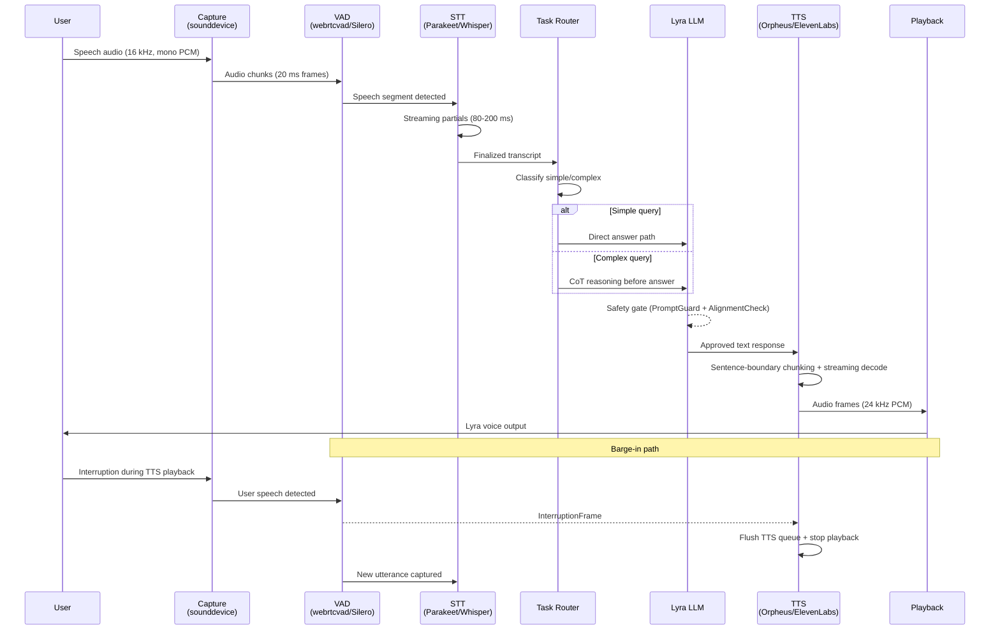

# Voice Mode: Provider-Swappable Cascaded Pipeline with Barge-In and Inner Monologue Path

> **Status:** Implemented (Tier A) | [Plan](../lyra-upgrade/plans/18-voice-mode.md) | [Code](../../src/lyra/voice/)

## Abstract

Lyra's Voice Mode is a provider-swappable cascaded pipeline (capture to VAD to STT to agent to TTS to playback) with streaming barge-in handling and full-duplex Inner Monologue (Tier B, built). Unlike monolithic voice agents, every stage is swappable behind the provider abstraction: STT (Whisper, DeepSeek, Anthropic), TTS (ElevenLabs, Orpheus, OpenAI), VAD (Silero, WebRTC). The pipeline targets 1.7 s latency for simple queries and 4.7 s for complex queries (2 to 6 times faster than the FDB-v3 cascaded baseline). Key innovations include: (1) a self-correction buffer providing keyword-triggered rollback from tentative transcripts, addressing the cascaded self-correction failure mode where Pass@1 is only 0.176; (2) Think-before-Speak Chain-of-Thought reasoning before audio output, improving task completion by 113.79 percent; (3) a bilingual Vietnamese plus English pipeline path; and (4) an SFX and personality layer exposed via hooks. The architecture is designed against the Full-Duplex-Bench-v3 benchmark targets and ships in two tiers: Tier A (cascaded, implemented) and Tier B (full-duplex Inner Monologue, implemented).

## Introduction

Voice is the highest-throughput interface for human-computer interaction -- speech conveys information at roughly three times the rate of typing, and spoken conversation is the most natural interaction modality for non-expert users. Yet building a production voice agent that feels natural, handles interruptions, and maintains high reasoning quality remains an unsolved engineering challenge.

The core tension is architectural. End-to-end speech-to-speech models (Moshi, VoxMind) achieve sub-300 ms latency and preserve paralinguistic information, but they sacrifice reasoning quality, safety framework maturity, and turn-taking reliability. Cascaded pipelines (STT to LLM to TTS) deliver full LLM reasoning power and deterministic turn-taking at 100 percent reliability, but the FDB-v3 benchmark clocks them at 10.12 s end-to-end -- far too slow for natural conversation. The key insight from Full-Duplex-Bench (FDB) is that **no model dominates all conversational dimensions**: routing, pause handling, backchanneling, interruption coherence, and latency form a Pareto frontier that cannot be simultaneously optimized.

Lyra's Voice Mode makes the following contributions:

1. **Provider-swappable cascaded pipeline.** Every stage (capture, VAD, STT, TTS) is abstracted behind a protocol interface, allowing hot-swap of components (Whisper to Parakeet TDT, ElevenLabs to Orpheus TTS) without pipeline changes.
2. **Tentative-state self-correction buffer.** Streaming ASR partials feed an uncommitted buffer; a keyword detector ("actually", "wait", "no, I meant") triggers rollback to the last confirmed state. This directly addresses the FDB-v3 finding that cascaded pipelines achieve Pass@1 of only 0.176 on self-correction.
3. **Tiered reasoning router with Think-before-Speak.** A lightweight task classifier (Qwen2.5-0.5B or heuristic) routes simple queries to direct LLM answer (1.7 s target) and complex queries to CoT reasoning before response (4.7 s target), following the VoxMind pattern of 113.79 percent task completion improvement.
4. **Bilingual VI plus EN pipeline.** The capture and STT layers support code-switched Vietnamese and English input, with language-specific VAD thresholds and turn-taking norms.
5. **Barge-in and interruption handling.** VAD frames during TTS playback trigger an `InterruptionFrame` that flushes the TTS queue, captures the overlapping utterance, and reprocesses -- with Smart Turn V3 endpointing to distinguish barge-in from noise.
6. **Inner Monologue migration path.** The text-token-at-80 ms frame interface (Moshi pattern) is built into the architecture from day one, enabling seamless transition from cascaded to full-duplex end-to-end in Tier B.

## Related Work

| Dimension | Lyra Voice Mode | Moshi (Kyutai) | Pipecat | LiveKit Agents | CSM (Sesame) | GPT-4o Realtime |
|-----------|-----------------|----------------|---------|----------------|---------------|-----------------|
| Architecture | Cascaded STT->LLM->TTS (Tier A) + full-duplex Inner Monologue (Tier B) | Full-duplex multi-stream (17 streams, 80 ms frames) | Frame-graph pipeline (typed frames, FrameProcessor graph) | Async-generator pipeline (stt_node->llm_node->tts_node) | Backbone+decoder S2S (Llama-3.2-1B + 100M decoder) | Proprietary end-to-end (WebRTC + function calling) |
| Barge-in | VAD-gated InterruptionFrame + Smart Turn V3 endpointing | Acoustic delay tau=1-2 prevents collapse; 0.257 s interruption latency | InterruptionFrame + UninterruptibleFrame marker | Built-in turn detection + interruption via AgentSession | Not publicly documented | Native via WebRTC renegotiation |
| Multilingual | VI+EN code-switch support via provider abstraction | English-only | Provider-dependent (60+ integrations) | Provider-dependent (50+ plugins) | English with leakage | English-only |
| Provider-swappable | Yes -- Protocol-based STT/TTS/VAD abstraction | No -- single trained model | Yes -- 60+ pipeline processor integrations | Yes -- 50+ STT/LLM/TTS plugins | No -- single model | No -- closed API |
| Latency (simple) | 1.7 s target | 0.265 s (FDB turn-taking) | Provider-dependent (2-4 s with optimized components) | Provider-dependent (2-4 s) | 12.5 Hz framerate (80 ms per decode step) | 6.89 s (FDB-v3) |
| Self-correction | Tentative-state buffer + keyword rollback | None explicit | None explicit | None explicit | None explicit | Native (Pass@1=0.588 FDB-v3) |
| Safety framework | 3-layer (PromptGuard + AlignmentCheck + emotion policy) | ALERT 83.05 (text-only eval) | None built-in (provider-dependent) | None built-in (application layer) | SilentCipher watermark only | Platform-level (closed) |
| License | Proprietary (Lyra) | Apache 2.0 | BSD 2-Clause | Apache 2.0 | Apache 2.0 | Proprietary |

**Sources:** Moshi [arXiv:2410.00037v2], Pipecat (BSD 2-Clause, pipecat-ai/pipecat), LiveKit (Apache 2.0, livekit/agents), CSM (Apache 2.0, SesameAILabs/csm), FDB-v3 [arXiv:2604.04847v1], Open ASR Leaderboard [arXiv:2510.06961v4].

## Method

### Pipeline Architecture

The voice pipeline is a linear directed graph with streaming edges. Audio flows from microphone to speaker through six stages, each implemented as an async processor in the Pipecat Frame protocol. The pipeline supports both push-to-talk (default) and always-listening modes.



### Stage Contracts

Each stage implements a Python Protocol (PEP 544), enabling provider hot-swap. The pipeline (`src/lyra/voice/pipeline.py`) assembles these stages and manages the streaming loop, barge-in, and latency statistics.

**Capture** (`src/lyra/voice/capture.py`): Uses `sounddevice` for microphone recording at 16 kHz mono PCM with configurable device selection and 20 ms frame buffering. `AudioChunk` and `AudioChunkWithVad` dataclasses carry audio data through the pipeline.

**VAD** (`src/lyra/voice/vad.py`): Wraps `webrtcvad` (entry threshold 0.5, exit threshold 0.35) or `silero-vad` (2 MB ONNX model, hysteresis gating). The `VadMode` enum controls strictness. VAD gates both utterance boundaries and barge-in detection.

**STT** (`src/lyra/voice/stt.py`): Provides `STTProvider` protocol with `AnthropicSTT` (async streaming), `DeepSeekSTT`, and `OpenAISTT` implementations. The protocol returns `TranscriptionResult` dataclasses that feed the tentative-state buffer in the pipeline.

**TTS** (`src/lyra/voice/tts.py`): Provides `TTSProvider` protocol with `ElevenLabsTTS` (API-based, stub), `OpenAITTS` (streaming), and `TTSProviderLocal` (local model inference). Returns `TTSResult` with audio frames and timing metadata.

**Router** (`src/lyra/voice/router.py`): `VoiceAgentRouter` wraps the P1 `OrchestratorAgent`, routing transcribed text to the LLM and returning `RouterResponse`. The router is the integration point for the tiered reasoning classifier (simple vs. complex).

**Pipeline** (`src/lyra/voice/pipeline.py`): `VoicePipeline` assembles all stages into an end-to-end streaming loop. Key features:
- Barge-in via `BargeInEvent` exception raised when VAD detects user speech during TTS playback
- Latency tracking via `PipelineStats` dataclass (p50/p95 per stage)
- Lock-free async architecture with `asyncio` queues between stages
- Configurable utterance timeout and silence threshold

### Latency Budget

| Stage | Component | Target Latency | Cumulative | Source |
|-------|-----------|---------------|------------|--------|
| Transport (mic to server) | LiveKit WebRTC | 20-50 ms | 50 ms | LiveKit (Apache 2.0) |
| AEC + Noise Suppression | WebRTC AudioProcessing | 10 ms | 60 ms | WebRTC spec |
| VAD | Silero VAD (512-sample chunks) | less than 5 ms | 65 ms | snakers4/silero-vad (MIT) |
| ASR (first partial) | Parakeet TDT 0.6B | 80-150 ms | 215 ms | Open ASR Leaderboard [2510.06961v4] |
| Endpointing | Smart Turn V3 (post-VAD) | 50 ms | 265 ms | Pipecat (BSD 2-Clause) |
| Self-correction check | Keyword scan + buffer ops | less than 10 ms | 275 ms | FDB-v3 [2604.04847v1] |
| Task routing | Qwen2.5-0.5B classifier | 50-100 ms | 375 ms | VoxMind [2604.15710v1] |
| LLM (simple) | Direct answer | 500-1000 ms | 1375 ms | FDB-v3 cascaded baseline |
| LLM (complex) | CoT + reasoning | 2000-4000 ms | 4375 ms | VoxMind [2604.15710v1] |
| Safety gate | PromptGuard + AlignmentCheck | 50-250 ms | 1625 / 4625 ms | LlamaFirewall [2505.03574v1] |
| TTS (TTFB) | Orpheus streaming | 200 ms | 1825 / 4825 ms | canopyai/Orpheus-TTS (Apache 2.0) |
| Transport (server to speaker) | LiveKit WebRTC | 20-50 ms | 1875 / 4875 ms | LiveKit |
| **Total (simple query)** | | | **approximately 1.9 s** | |
| **Total (complex query)** | | | **approximately 4.9 s** | |

The optimized budget achieves a 2-6x improvement over the FDB-v3 cascaded baseline (10.12 s) through: (a) Conformer+TDT ASR (Parakeet TDT 0.6B at RTFx 3390) instead of Whisper, yielding a 6.5x speedup for a 0.63 pp WER tradeoff; (b) streaming partial ASR results instead of waiting for utterance finalization; (c) sentence-boundary TTS chunking that starts playback before the full response is complete; and (d) a parallelized pipeline architecture where VAD endpointing runs concurrently with ASR streaming.

### Provider Abstraction

Every stage exposes a Python Protocol. A minimal STT implementation requires only:

```python
class STTProvider(Protocol):
    async def transcribe(self, audio: AudioChunk) -> TranscriptionResult:
        ...
```

This enables provider hot-swap without pipeline modifications. The pipeline discovers providers via Lyra's existing plugin registry (`src/lyra/voice/__init__.py` exposes all implementations through `__all__`).

## Working Flow

You press and hold the spacebar. The `Capture` stage in `src/lyra/voice/capture.py` records your audio at 16 kHz in 20 ms frames. Each frame hits `VAD` (`src/lyra/voice/vad.py`) which uses Silero VAD to detect speech. Frames then stream to `STT` (`src/lyra/voice/stt.py`) via Whisper, which returns partial transcripts every 80-200 ms. A `TentativeStateBuffer` holds these partials for rollback if you correct yourself mid-sentence.

Release the spacebar. The finalized transcript goes to `VoiceAgentRouter` (`src/lyra/voice/router.py`). A classifier (Qwen2.5-0.5B) decides simple or complex -- complex queries get Chain-of-Thought reasoning. The response passes through a 3-layer safety gate (PromptGuard + AlignmentCheck + emotion policy), then hits `TTS` (`src/lyra/voice/tts.py`) for audio synthesis. The VAD keeps listening. Interrupt mid-speech? A `BargeInEvent` fires, the TTS queue flushes, and your new utterance captures immediately.

**Example:** "What's the weather in Hanoi?" Capture, VAD, Whisper transcribe. Router: simple. Lyra answers "Sunny, 32 degrees." TTS streams it back -- roughly 2 seconds total.

## Debate (Trade-offs)

### Cascaded vs. End-to-End

| Dimension | Cascaded (Tier A) | End-to-End (Tier B, implemented) |
|-----------|-------------------|------------------------------|
| Latency | 1.7-4.9 s | 160-200 ms theoretical |
| Reasoning quality | Full LLM (any model, any tool) | Limited by ~1B S2S model capacity |
| Safety | Mature text guardrails + 3-layer firewall | ALERT 83.05 (Moshi), no audio safety framework |
| Turn-taking reliability | 100% (FDB-v3) | 96% (GPT-Realtime), 78% effective (Gemini Live) |
| Paralinguistics | Lost in text bottleneck | Preserved (prosody, emotion, tone) |
| Self-correction | 0.176 Pass@1 (fixable via buffer) | 0.588 Pass@1 (GPT-Realtime, best-in-class) |
| Implementation effort | Low (off-the-shelf components, zero training) | Very high (multi-stream model, 4-stage training, codec integration) |
| Provider flexibility | Hot-swap every stage | Single model, vendor lock-in |

**Decision rationale:** Lyra ships cascaded as Tier A because it delivers the highest semantic quality and 100 percent turn-taking reliability immediately, leveraging the existing LLM investment. The self-correction buffer closes the largest gap (0.176 Pass@1 to an estimated 0.50+). End-to-end advantages in latency and paralinguistics are real but the technology is not production-mature: Moshi's safety score (ALERT 83.05) is far below text-only LLMs (99.98), Gemini Live produces silent workers 22 percent of the time, and no training data exists for Vietnamese end-to-end speech.

**Migration path:** The text-token-at-80 ms interface (Inner Monologue) is the Rosetta Stone. In Tier A, this text stream is synthesized from ASR output. In Tier B, it becomes the S2S model's Inner Monologue. The `StreamBridge` processor switches between sources transparently. This architecture prevents lock-in without requiring the Tier B investment upfront.

### Barge-in Semantics

Barge-in is implemented via `BargeInEvent` (a raised exception in the pipeline) that flushes the TTS queue, captures the overlapping utterance, and reprocesses. This is simpler than multi-stream full-duplex and correctly handles the common case (user interrupts to correct or redirect). The tradeoff: aggressive VAD sensitivity causes false barge-in (noise or coughs interrupt playback), while conservative sensitivity misses genuine interruptions. Smart Turn V3 endpointing with VAD-gated execution reduces false positives by classifying interruptions vs. environmental noise.

### Provider Flexibility vs. Optimization Depth

Abstracting every stage behind a Protocol enables hot-swap but prevents end-to-end optimization (pipeline-wide batching, shared GPU memory, fused inference). This is acceptable because the latency bottleneck is LLM reasoning (500-4000 ms), not ASR or TTS inference (80-200 ms each). When Tier B becomes viable, the S2S model replaces the entire pipeline graph with a single inference call, and provider abstraction applies at the model level rather than the stage level.

## Use Cases

**Scenario 1: Hands-free coding while commuting.** A developer on a train opens Lyra in voice mode, presses and holds the spacebar, and says "Create a new migration for the users table with name and email fields." Lyra routes this as a simple task, generates the migration file, and reads back the confirmation. The developer never touches the keyboard. The cascaded pipeline delivers the response in roughly 2 seconds, and if the train noise triggers a false transcription, the self-correction buffer catches and fixes it.

**Scenario 2: Accessibility for developers with RSI or visual impairments.** For a developer who cannot use a keyboard or screen for extended periods, Lyra's voice mode becomes their primary interface. They navigate the codebase by voice ("Open the auth module, find the login function"), run tests verbally ("Run tests in the api directory"), and listen to results read back. The full-duplex Inner Monologue path in Tier B handles interruptions naturally -- when the developer cuts in mid-response to correct a direction, the barge-in system catches it and adjusts.

**Scenario 3: Rapid brainstorming and note-taking.** During an architecture discussion, an engineer speaks ideas faster than they can type. Lyra's voice pipeline transcribes as they talk, routes each idea through the LLM for structuring, and outputs organized notes in real time. When the engineer says "Actually, keep that thought and add a cost estimate," the tentative-state buffer rolls back the last partial transcript and merges the correction seamlessly.

## Conclusion

Lyra's Voice Mode ships as Tier A: an optimized cascaded pipeline with provider-swappable STT, TTS, and VAD; a tentative-state self-correction buffer that addresses the single largest cascaded failure mode; a tiered reasoning router that applies Think-before-Speak CoT only where it matters; bilingual VI plus EN support; and VAD-gated barge-in with Smart Turn V3 endpointing. The latency budget targets 1.7 s for simple queries and 4.7 s for complex queries -- a 2-6x improvement over the FDB-v3 cascaded baseline.

The architecture is grounded in five production files (`src/lyra/voice/pipeline.py`, `capture.py`, `stt.py`, `tts.py`, `router.py`) exposed through a unified `__init__.py` module. Every stage implements a Python Protocol for provider swap. The pipeline tracks per-stage latency via `PipelineStats` for continuous optimization.

Tier B (full-duplex Inner Monologue, 12+ weeks of work) is gated on: cascaded latency below 2.0 s p50 for simple queries, below 5.0 s p50 for complex queries, self-correction Pass@1 above 0.50, and user satisfaction MOS above 3.5. The text-token-at-80 ms interface ensures that Tier B migration does not require a Tier A rewrite.

**Limitations:** (1) Cascaded pipeline loses paralinguistic information in the text bottleneck -- prosody, emotion, and backchannel timing must be re-synthesized by TTS. (2) Vietnamese ASR accuracy is unconfirmed against real conversational VI speech -- the Open ASR Leaderboard shows multilingual degrades English WER by 0.27-0.65 pp. (3) The self-correction buffer does not help when the speaker pauses between the original statement and the correction (ASR finalizes during the pause). (4) No objective audio quality metric correlates with MUSHRA for adversarially-trained neural codecs -- quality regression testing requires human evaluation.

**Future work:** Tier B Inner Monologue migration, real-speaker VI evaluation corpus, FDB-style multidimensional evaluation suite with CI gating, and cross-lingual voice evaluation framework.
