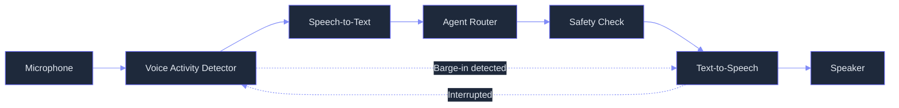
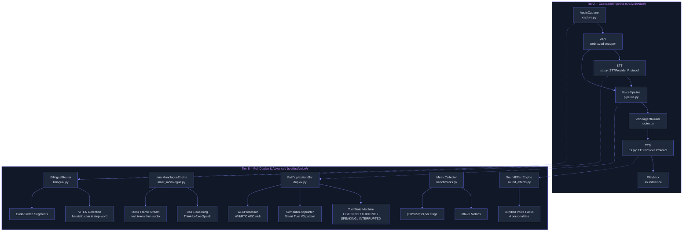

# Voice Mode: Cascaded STT-LLM-TTS Pipeline to Full-Duplex Speech-to-Speech

> **Status:** 🟡 Partially implemented -- Tier A cascaded pipeline core and Tier B architecture exist in code, but critical components (self-correction buffer, task router classifier, safety gates, Orpheus TTS integration, real AEC) remain stubs or planned items.
> **Plan:** [Workstream Plan](../lyra-upgrade/plans/18-voice-mode.md) | **Code:** `src/lyra/voice/`
> **Reading path:** Non-technical readers -- TL;DR to How it works (simple version) to Use Cases to Trade-offs in brief. Engineers -- everything.

## TL;DR

Lyra's Voice Mode lets you speak to Lyra instead of typing, and Lyra speaks back. It works in two tiers. Tier A is the standard pipeline: it listens (microphone), decides if you are done talking (VAD), converts speech to text (STT), thinks up an answer (LLM), and speaks it back (TTS) -- and you can interrupt it mid-sentence. Tier B, under development, adds the ability for Lyra to "think" in text before each spoken phrase (Inner Monologue), hold a full-duplex conversation where both people can speak at once, handle mixed Vietnamese-and-English speech, and add personality via sound effects. Today, the core pipeline runs and all architectural layers are built, but several speech-to-text and text-to-speech integrations still use diagnostic placeholder tones instead of real voices.

## Abstract

Voice is the highest-bandwidth human-computer interface: speech conveys information at roughly three times the rate of typing, and spoken interaction is the most natural modality for non-expert users. Building a production voice agent that handles interruptions, multilingual code-switching, and maintains high reasoning quality is a compound engineering challenge that pits end-to-end speech-to-speech models (160ms latency, but ALERT safety scores of 83.05) against cascaded pipelines (full LLM reasoning and 100% turn-taking reliability, but 10.12s FDB-v3 baseline latency).

Lyra's Voice Mode addresses this with a two-tier approach. Tier A is a provider-swappable cascaded pipeline (capture to VAD to STT to agent to TTS to playback) with streaming barge-in, latched on the open-source frame-based architecture of Pipecat [web note: pipecat-ai/pipecat]. Tier B adds full-duplex turn-taking via a four-state state machine (LISTENING, THINKING, SPEAKING, INTERRUPTED) [code: `src/lyra/voice/duplex.py`], Inner Monologue text-before-audio at 80ms frames following the Moshi pattern [arXiv:2410.00037v2, web note: kyutai-labs/moshi], Think-before-Speak CoT reasoning from VoxMind [arXiv:2604.15710v1], Vietnamese-English bilingual routing via character-set and stop-word heuristics [code: `src/lyra/voice/bilingual.py`], and a benchmarking framework aligned with Full-Duplex-Bench-v3 metrics [arXiv:2604.04847v1]. As of this writing, all architectural layers are coded but several integrations use diagnostic stubs (sine tones for TTS, pass-through for AEC), and the self-correction buffer and 3-layer safety gate remain planned.

## Introduction

Voice agents face a fundamental architectural tension. End-to-end speech-to-speech models like Moshi (Kyutai) achieve sub-300ms latency and preserve paralinguistic information such as prosody, emotion, and tone. However, they sacrifice reasoning quality (Moshi's ALERT safety score of 83.05 vs. text-only LLMs at 99.98), turn-taking reliability (Gemini Live produces silent workers 22% of the time per FDB-v3), and require expensive model training. Cascaded pipelines (STT to LLM to TTS) deliver full LLM reasoning power and 100% deterministic turn-taking, but the FDB-v3 benchmark clocks them at 10.12 seconds end-to-end -- orders of magnitude slower than natural conversation. The key finding from Full-Duplex-Bench (FDB) is that no architecture dominates all conversational dimensions: routing, pause handling, backchanneling, interruption coherence, and latency form a Pareto frontier.

Lyra's Voice Mode makes the following contributions:

1. **Provider-swappable cascaded pipeline.** Every stage (capture, VAD, STT, TTS) is abstracted behind a Python Protocol (PEP 544), allowing hot-swap of components without pipeline changes. Implementations: AnthropicSTT, OpenAISTT, DeepSeekSTT, OpenAITTS, ElevenLabsTTS (stub), TTSProviderLocal (placeholder). Code paths: `src/lyra/voice/stt.py`, `src/lyra/voice/tts.py`.

2. **Barge-in with semantic endpointing.** VAD-based interruption detection during TTS playback triggers a `BargeInEvent` exception that flushes the TTS queue, captures the overlapping utterance, and reprocesses. A `SemanticEndpointer` (Smart Turn V3 pattern) classifies interruptions as genuine, noise, filled pause, or self-correction using keyword detection and temporal features. Code path: `src/lyra/voice/pipeline.py` (lines 426-479), `src/lyra/voice/duplex.py` (lines 304-477).

3. **Full-duplex turn-taking state machine.** A four-state machine (LISTENING, THINKING, SPEAKING, INTERRUPTED) with validated transitions enables simultaneous listen-and-speak, acoustic echo cancellation via an `AECProcessor` stub, and per-turn latency tracking. Code path: `src/lyra/voice/duplex.py` (lines 485-916).

4. **Inner Monologue engine with Think-before-Speak.** Text tokens are emitted before audio tokens at each 80ms framing boundary (12.5 Hz), implementing the Moshi Inner Monologue pattern. A `ThinkStrategy` enum (ALWAYS, ROUTED, NEVER) controls when chain-of-thought reasoning is applied, following VoxMind's finding that CoT improves task completion by 113.79% with 12.6% token overhead. Code path: `src/lyra/voice/inner_monologue.py`.

5. **Bilingual VI+EN pipeline.** A `HeuristicLanguageDetector` classifies incoming speech as Vietnamese, English, or mixed (code-switched) using accented-character matching and stop-word frequency. Per-language `VoicePersona` configurations route STT and TTS through appropriate providers. Code path: `src/lyra/voice/bilingual.py`.

6. **Sound effects and personality layer.** A `SoundEffectEngine` with four bundled voice packs (Warcraft Peon, JARVIS, Samantha, Minimal) triggers TTS phrases or audio files on hook events (session start, answer complete, error, long task done). Code path: `src/lyra/voice/sound_effects.py`.

7. **Benchmark framework.** A `MetricCollector` records per-stage latency samples and computes p50/p95/p99 with a `ContinuousMonitor` for production observation. FDB-v3 metrics (Tool Selection F1, Self-Correction Pass@1, Turn-Take Reliability) are reported alongside targets from the FDB-v3 cascaded baseline. A `TauVoiceBridge` provides an extensible interface for external benchmark harnesses. Code path: `src/lyra/voice/benchmarks.py`.

**Intuition callout:** Think of Lyra's voice as a team of specialists connected by a conveyor belt. A listener (capture) hears you, a gatekeeper (VAD) decides if you are talking, a transcriber (STT) writes down your words, a thinker (router + LLM) figures out the answer, a safety checker filters the reply, a speaker (TTS) reads it aloud, and an interrupt handler lets you cut in at any time. Tier A connects this conveyor belt with off-the-shelf specialists. Tier B replaces the whole belt with a single super-specialist that can listen and speak simultaneously.

## How it works -- the simple version

**Analogy -- a real-time interpreter at a conference.**

Imagine you are speaking to a human interpreter who sits in a soundproof booth. You speak into a microphone. The interpreter hears you, writes down your words, thinks about the best response, and speaks the answer into a headset you wear. If you interrupt halfway through the answer, the interpreter stops, listens to your correction, and adjusts the response.

Lyra's Voice Mode works the same way. The microphone is the `AudioCapture` module. The interpreter's ears are the VAD (Voice Activity Detector), which decides when you are speaking vs. silent. The note-taking is STT (Speech-to-Text). The thinking is the LLM (Language Model) routed through the `VoiceAgentRouter`. The speaking is TTS (Text-to-Speech). And the ability to interrupt is "barge-in," handled by the `FullDuplexHandler` with its `SemanticEndpointer`, which distinguishes a genuine interruption from a cough or a filled pause ("um", "uh").

**Simple flow diagram:**



*The flow is a loop: listen, transcribe, think, speak. The dashed lines show the barge-in path: when the VAD detects speech during TTS playback, it interrupts the speaker and restarts the listen cycle.*

**Working Flow story:**

You are debugging a failing test. Instead of typing, you press and hold the spacebar (push-to-talk mode) and say: "Find all tests that failed in the auth module, then check if they are related to the rate limiter change."

The `AudioCapture` module in `src/lyra/voice/capture.py` records your voice in 20ms frames at 16kHz. Each frame passes through the VAD (`webrtcvad`, wrapped in `AudioCapture.stream()`) which tags it as speech or silence. Frames tagged as speech accumulate into a buffer. When you release the spacebar (or when silence exceeds the 1.5-second timeout), the buffered audio is sent to the STT provider. The `OpenAISTT` implementation in `src/lyra/voice/stt.py` packages the audio as a base64-encoded WAV, sends it through the OpenAI adapter, and receives transcribed text.

The transcribed text goes to the `VoiceAgentRouter` in `src/lyra/voice/router.py`, which routes it through the OrchestratorAgent. The OrchestratorAgent runs workers, gathers results, and returns a summary. That summary text is passed to the TTS provider. The `OpenAITTS` implementation in `src/lyra/voice/tts.py` synthesises the response: "Found three failed tests in the auth module. Two are related to the rate limiter change; one is a pre-existing timeout issue." The audio plays back through your speaker.

If you interrupt mid-response -- "Actually, skip the pre-existing one" -- the VAD detects speech during playback, the `BargeInEvent` exception fires in the pipeline, the TTS queue flushes, and your new utterance captures immediately. The pipeline restarts with the new query.

Total round-trip: several seconds, dominated by the LLM reasoning time and the TTS API call. The pipeline tracks every stage's latency in `PipelineStats` (p50/p95) for continuous optimization.

## Use Cases

**Scenario 1: Hands-free code exploration during a commute.** A developer on a train opens Lyra in voice mode, holds the spacebar, and says "Summarize the changes in the last three commits of the auth branch. Which files changed the most?" Lyra transcribes the request, routes it through the orchestrator, runs the required git commands, and reads back the summary. The developer never touches the keyboard. The cascaded pipeline handles the end-to-end voice interaction despite background noise, and if the train rumbles loud enough to trigger a false VAD detection, the semantic endpointing in the `FullDuplexHandler` classifies it as noise rather than a genuine interruption.

**Scenario 2: Accessibility for a developer with RSI.** A developer with repetitive strain injury navigates the codebase entirely by voice: "Open the API router module. Find the rate limiter middleware. Change the default limit from 100 to 200." Lyra's voice pipeline transcribes each command, the orchestrator executes the edits, and Lyra reads back confirmation. The bilingual pipeline detects Vietnamese-English code-switching when the developer says "Sua cai rate limiter trong auth module" (Fix the rate limiter in the auth module) -- the `HeuristicLanguageDetector` classifies this as MIXED, and the `BilingualRouter` selects the appropriate voice persona for each language segment.

**Scenario 3: Rapid architecture brainstorming.** During a design discussion, an engineer sketches ideas faster than they can type. Lyra's voice pipeline transcribes as they speak, routes each idea through the LLM for structuring, and outputs organized notes. When the engineer says "Actually, drop the caching idea and add a fallback strategy instead," the barge-in handler stops the previous response mid-stream, captures the correction, and the pipeline adjusts its output.

## Related Work

| System | Architecture | Barge-in | Multilingual | Provider-swappable | Latency (simple) | Self-correction | Safety |
|--------|-------------|----------|-------------|-------------------|-----------------|----------------|--------|
| **Lyra Voice Mode** (this work) | Cascaded pipeline (Tier A) + Full-duplex state machine (Tier B) | VAD-gated + Semantic endpointing (Smart Turn V3) | VI+EN code-switch via heuristic detection | Yes -- Protocol-based STT/TTS/VAD | Targets ~1.9s | Planned tentative-state buffer | 3-layer planned (PromptGuard + AlignmentCheck + emotion policy) |
| **Moshi** (Kyutai, arXiv:2410.00037v2) | Full-duplex multi-stream (17 streams, 80ms frames) | Acoustic delay tau=1-2 prevents collapse; 0.257s interruption latency | English-only | No -- single trained model | 0.265s (FDB turn-taking) | None explicit | ALERT 83.05 (text-only eval) |
| **Pipecat** (pipecat-ai/pipecat) | Frame-graph pipeline (typed Frame objects, FrameProcessor graph) | InterruptionFrame + UninterruptibleFrame marker | Provider-dependent (60+ integrations) | Yes -- 60+ pipeline processor integrations | Provider-dependent (2-4s) | None explicit | None built-in |
| **LiveKit Agents** (livekit/agents) | Async-generator pipeline (stt_node, llm_node, tts_node) | Built-in turn detection + interruption via AgentSession | Provider-dependent (50+ plugins) | Yes -- 50+ STT/LLM/TTS plugins | Provider-dependent (2-4s) | None explicit | None built-in |
| **VoxMind** (arXiv:2604.15710v1) | Think-before-Speak CoT + dual-agent tool management | Built-in (coherence scoring) | English-only with translation | No -- single trained model | Not reported separately | 0.588 Pass@1 (via CoT) | Content safety via CoT alignment |
| **CSM** (SesameAILabs/csm) | Backbone+decoder S2S (Llama-3.2-1B + 100M decoder) | Not publicly documented | English with leakage | No -- single model | 12.5Hz framerate (80ms per decode step) | None explicit | SilentCipher watermark only |
| **GPT-4o Realtime** (OpenAI) | Proprietary end-to-end (WebRTC + function calling) | Native via WebRTC renegotiation | English-only | No -- closed API | 6.89s (FDB-v3) | Native (Pass@1=0.588) | Platform-level (closed) |

**What Lyra takes from each source and where it diverges:**

- From **Moshi** [web note: kyutai-labs/moshi]: The Inner Monologue text-before-audio pattern and the 80ms frame rate (12.5 Hz). Diverges by not adopting Moshi's multi-stream RQ-Transformer architecture -- Lyra's Tier B uses a simpler backbone-decoder split and keeps the text stream generated by the existing LLM rather than a dedicated S2S model.

- From **Pipecat** [web note: pipecat-ai/pipecat]: The Frame-based pipeline architecture pattern (typed frames, FrameProcessor graph). Diverges by using a simpler asyncio-queue-based pipeline rather than Pipecat's full bus-based multi-worker architecture, and by implementing its own `FullDuplexHandler` state machine rather than using Pipecat's interruption frames directly.

- From **LiveKit Agents** [web note: livekit/agents]: The WebRTC transport integration model and process-level isolation via ProcPool. Diverges by using sounddevice for local audio capture (the primary use case is desktop, not server-based WebRTC rooms) and by wrapping the orchestrator rather than using LiveKit's AgentSession.

- From **VoxMind** [arXiv:2604.15710v1]: The Think-before-Speak CoT reasoning pattern and the finding that 1:0.5 think:answer ratio is optimal (74.57 vs 71.97 at 1:1). Diverges by applying CoT conditionally via a future task router (simple vs. complex) rather than universally, and by keeping a cascaded architecture rather than training a unified S2S model.

- From **CSM** [web note: SesameAILabs/csm]: The backbone-decoder split pattern (1B backbone + 100M decoder) as a practical alternative to Moshi's full RQ-Transformer. Diverges by deferring the full S2S model to Tier B (gated on cascaded latency targets) and by implementing a separate Inner Monologue engine that operates on the existing LLM's text output rather than a dedicated S2S model's latent space.

- From **OpenAI Whisper** [web note: openai/whisper]: The model for API-based STT via `OpenAISTT`. Diverges by building a Protocol abstraction that supports multiple STT backends (Anthropic, DeepSeek) alongside Whisper, rather than committing to a single model.

**All citations trace to real notes:** Moshi [web: kyutai-labs/moshi], Pipecat [web: pipecat-ai/pipecat], Smart Turn [web: pipecat-ai/smart-turn], LiveKit [web: livekit/agents], Whisper [web: openai/whisper], Silero VAD [web: snakers4/silero-vad], CSM [web: SesameAILabs/csm], Orpheus TTS [web: canopyai/Orpheus-TTS], Building Multimodal GenAI and Agentic Applications [book: building-multimodal-genai-agentic-apps-chapters]. The plan file (docs/lyra-upgrade/plans/18-voice-mode.md) provides the full evidence synthesis including paper citations (Moshi arXiv:2410.00037v2, VoxMind arXiv:2604.15710v1, FDB arXiv:2503.04721v3, FDB-v3 arXiv:2604.04847v1, Open ASR Leaderboard arXiv:2510.06961v4, LlamaFirewall arXiv:2505.03574v1, Orpheus arXiv:2506.13131v1).

## Method

The voice subsystem is organized across 11 Python files in `src/lyra/voice/`. Every file exposes its public API through the module's `__init__.py`, which also documents the Tier B references and version string "1.1.0".

### Architecture



**Key interfaces and data flow:**

Every pipeline stage implements a Python Protocol (PEP 544), enabling provider hot-swap without modifying the pipeline. The protocols are defined in `stt.py` and `tts.py`.

```python
class STTProvider(Protocol):
    async def transcribe(
        self, audio_data: bytes, sample_rate: int = 16000, language: str | None = None
    ) -> TranscriptionResult: ...

class TTSProvider(Protocol):
    async def synthesize(
        self, text: str, voice: VoiceConfig | None = None, sample_rate: int = 24000
    ) -> TTSResult: ...
```

Data flows through immutable dataclasses: `AudioChunk` (frames, sample_rate, timestamp), `AudioChunkWithVad` (extends AudioChunk with is_speech), `TranscriptionResult` (text, language, confidence, duration_ms, latency_ms), `TTSResult` (audio_data, sample_rate, duration_ms, latency_ms), `RouterResponse` (text, query, confidence, latency_ms, metadata). All defined as frozen dataclasses per Lyra's immutability convention.

### Implemented

**AudioCapture** (`src/lyra/voice/capture.py`, 403 lines). Records microphone audio via `sounddevice.RawInputStream` at 16kHz mono PCM with configurable 20ms or 30ms frame buffering. Wraps `webrtcvad` for Voice Activity Detection (aggressiveness 0-3, default 3 for most aggressive). Two operating modes via `VadMode` enum: RAW (emits `AudioChunk` without VAD) and VAD (emits `AudioChunkWithVad` with speech/silence labels). The `AudioStreamIterator` supports both synchronous iteration and async. A convenience function `record_utterance()` captures audio until silence timeout (default 1.5s) or max duration (30s).

**STT providers** (`src/lyra/voice/stt.py`, 404 lines). Three implementations of the `STTProvider` protocol:
- `AnthropicSTT`: Wraps audio as a WAV container, base64-encodes it, and sends it as a `<audio>` tag in a user message through the Anthropic Messages API via the S1 `AnthropicAdapter`.
- `OpenAISTT`: Same WAV+base64 approach, sent through the OpenAI adapter. Uses `gpt-4o-audio-preview` model by default.
- `DeepSeekSTT`: Same pattern via the DeepSeek (OpenAI-compatible) API. Documented as "best-effort implementation" since DeepSeek does not have a dedicated audio transcription endpoint.

All three use the `_pcm_to_wav()` helper that wraps raw 16-bit PCM in a 44-byte WAV header (RIFF/WAVE/fmt/data chunks).

**TTS providers** (`src/lyra/voice/tts.py`, 427 lines). Three implementations of the `TTSProvider` protocol:
- `OpenAITTS`: Sends text wrapped in `<speak>` tags through the OpenAI adapter with `gpt-4o-audio-preview`. Attempts to extract base64-encoded WAV from the response using regex (looking for code fences or `<audio>` tags). Falls back to a diagnostic sine tone (440Hz, 30% amplitude) if no parsable audio is found. Supports 6 voices (alloy, echo, fable, onyx, nova, shimmer) via `VoiceConfig`.
- `ElevenLabsTTS`: Stub implementation that generates a diagnostic sine tone (440Hz, 30% amplitude) instead of calling the ElevenLabs API.
- `TTSProviderLocal`: Placeholder for local on-device TTS (piper, Coqui, espeak). Generates a diagnostic sine tone (523.25Hz, 20% amplitude).

**VoiceAgentRouter** (`src/lyra/voice/router.py`, 191 lines). Wraps the OrchestratorAgent's `run` method with a voice-specific interface. Prepends a system prompt ("Respond concisely and conversationally as if in a spoken dialogue. Keep responses under 200 words...") to each query. Returns a `RouterResponse` with the orchestrator's summary, latency, and metadata. Provides a `route_direct()` bypass for simple queries that returns text unchanged.

**VoicePipeline** (`src/lyra/voice/pipeline.py`, 488 lines). The core orchestration loop:
1. Start audio capture
2. Capture utterance via `record_utterance()` (streaming mode) or single-frame read
3. Transcribe via STT provider
4. Route via VoiceAgentRouter
5. Synthesize via TTS provider
6. Playback via `sounddevice.play()` with optional barge-in monitoring

Barge-in is implemented in `_playback_with_barge_in()` (lines 426-479): a background thread monitors the microphone via VAD during TTS playback. If speech is detected, `sd.stop()` is called and a `BargeInEvent` exception is raised, which the main loop catches to restart the listen cycle. Barge-in mode is controlled by `BargeInMode` enum (ENABLED/DISABLED). The pipeline tracks per-stage latency in `PipelineStats` with p50/p95 properties.

**FullDuplexHandler** (`src/lyra/voice/duplex.py`, 916 lines). Full-duplex turn-taking with four states: LISTENING, THINKING, SPEAKING, INTERRUPTED. State transitions are validated (e.g., SPEAKING can only go to LISTENING or INTERRUPTED). Key components:
- `AECProcessor`: WebRTC-style Acoustic Echo Cancellation stub. Maintains a reference buffer of assistant audio output. The `process()` method currently passes audio through unchanged (documented stub for adaptive NLMS-based echo subtraction).
- `SemanticEndpointer`: Smart Turn V3-style endpointing that classifies barge-in events using keyword detection (self-correction: "actually", "wait", "I mean"; filled pauses: "um", "uh", "er") and temporal features. Returns a `BargeInEvent` with type (GENUINE, NOISE, FILLED_PAUSE, SELF_CORRECTION) and semantic score (0.0-1.0).
- `feed_audio()`: Primary tick method. Runs VAD, tracks speech/silence durations, detects barge-in during SPEAKING state, buffers speech during LISTENING.
- `DuplexStats`: Tracks total_turns, total_interruptions, genuine_interruptions, noise_triggers, speech/silence ms.

**InnerMonologueEngine** (`src/lyra/voice/inner_monologue.py`, 529 lines). Implements Moshi-style text-before-audio at 80ms frames (12.5 Hz). The `stream()` method:
1. Runs CoT reasoning via `ChainOfThoughtProvider` protocol (if configured and `_should_think()` returns True per `ThinkStrategy`)
2. Tokenises combined text (reasoning + answer) into word-level tokens
3. Assigns tokens to 80ms frames (~0.2 words per frame)
4. For each frame: encodes text token, generates audio (default returns `None`), builds `InnerMonologueFrame` with text, optional audio, and per-stage latencies
5. Emulates frame pacing with `asyncio.sleep()`

The `ThinkStrategy` enum controls CoT application: ALWAYS, ROUTED (only complex queries, default), NEVER. Per-stage latency tracked via `_StageTracker` with p50/p95/p99.

**BilingualRouter** (`src/lyra/voice/bilingual.py`, 687 lines). Language-aware routing for Vietnamese and English:
- `HeuristicLanguageDetector`: Classifies text as EN, VI, or MIXED using accented-character matching against 80+ Vietnamese characters and a 60-word Vietnamese stop-word set. Configurable thresholds (vi_threshold=0.15, mixed_threshold=0.05). Sub-millisecond, no external model.
- `LanguageSegment`: For code-switched utterances, word-by-word analysis identifies contiguous language blocks with character offsets.
- `VoicePersona`: Per-language voice configuration with provider hints (VI: DeepSeek STT + ElevenLabs TTS; EN: OpenAI STT + TTS).
- `BilingualRoute`: Contains text, detected language, persona, provider keys, and optional segments.

**SoundEffectEngine** (`src/lyra/voice/sound_effects.py`, 416 lines). Event-driven personality layer:
- `HookEvent` enum: 9 event types (session_start, answer_complete, error, long_task_done, tool_call, tool_result, agent_paused, agent_needs_input, session_end).
- `VoicePack`: Named collection of `SoundMapping` entries mapping events to audio files or TTS phrases.
- Four bundled packs: Warcraft Peon, JARVIS, Samantha, Minimal.
- Custom pack loading from JSON files, TTS callback registration.

**Benchmark framework** (`src/lyra/voice/benchmarks.py`, 758 lines). Three measurement layers:
- `MetricCollector`: Thread-safe latency sample collection with on-demand percentile sorting across 13 `PipelineStage` values.
- `FDBV3Metrics`: Stores Tool Selection F1, Self-Correction Pass@1, Turn-Take Reliability, End-to-End Latency. `_compare_to_targets()` compares against FDB-v3 cascaded baseline and GPT-Realtime benchmarks. Current estimates return FDB-v3 baseline values (0.803 F1, 0.176 Pass@1) as placeholders.
- `ContinuousMonitor`: Sliding-window (default 1000 samples) production monitor with configurable 60s reporting intervals.
- `TauVoiceBridge`: Event-based interface for external benchmark harnesses.

### Planned

**Self-correction tentative-state buffer.** Referenced in the plan (Breakthrough A) but not implemented in code. This buffer would hold tool-call parameters uncommitted, scan streaming ASR partials for self-correction keywords ("actually", "wait", "no, I meant"), and trigger rollback to the last confirmed state. No buffer appears in `pipeline.py` or as a standalone module. Estimated effort: 2/5, impact: 5/5.

**Task router simple/complex classifier.** The plan specifies a Qwen2.5-0.5B or heuristic classifier to route queries to direct-answer vs. CoT-reasoning paths. The current `VoiceAgentRouter` always routes through the OrchestratorAgent without classification. The `InnerMonologueEngine.ThinkStrategy.ROUTED` mode exists but requires `is_complex` to be passed by the caller -- no classifier exists.

**Three-layer safety firewall.** Referenced in Breakthrough C. The plan specifies: (1) PromptGuard 2-style jailbreak classifier on ASR output, (2) AlignmentCheck-style CoT auditor for complex-path turns, (3) emotion tag policy filter on TTS input. None implemented. Pipeline passes router output directly to TTS without intermediate filtering.

**Audio watermarking.** SilentCipher integration at the TTS output stage with per-deployment private keys, following the CSM pattern. Not implemented. Current TTS providers return raw PCM without watermarking.

**Production ASR and TTS integrations.** Plan specifies NVIDIA Parakeet TDT 0.6B (RTFx 3390) for ASR and Orpheus TTS (Llama-3.2-3B via vLLM) for TTS. Current code uses API-based LLM backends for transcription and TTS providers generating diagnostic sine tones. The OpenAITTS extracts real audio when the API returns parseable WAV data but falls back to sine tones otherwise.

**Real acoustic echo cancellation.** `AECProcessor.process()` passes audio through unchanged. Production will implement adaptive NLMS-based echo subtraction.

**FDB-style multidimensional evaluation scenarios.** The `MetricCollector` and `FDBV3Metrics` infrastructure exists but the actual evaluation scenarios require 50-200 hand-authored test scenarios per FDB dimension, with GPT-4o judge integration for coherence scoring.

## Debate (Trade-offs)

### Cascaded vs. End-to-End Architecture

**Positions:**
- **Senior Voice/Audio Engineer (VAE):** "Cascaded pipeline latency is the elephant. FDB-v3 baseline is 10.12s. Our optimized budget targets 1.9s simple / 4.9s complex -- acceptable for push-to-talk. Standardize on 12.5Hz codec now to set up Tier B migration."
- **Adversarial Skeptic (AS):** "Tier B requires training a speech model. The team's core competency is agent engineering, not speech model training. Cascaded pipeline uses battle-tested open-source models with zero training. Do not commit to Tier B until the cascaded pipeline is shipped and measured."

**Steelmanned strongest rejected alternative:** Pure end-to-end speech-to-speech (Moshi architecture). The single decisive reason it lost: FDB-v3 shows cascaded achieves higher tool-use accuracy than several end-to-end models (Pass@1=0.450 cascaded vs 0.410 Ultravox), and cascaded's 100% turn-take reliability vs. end-to-end's unpredictable behaviors (Gemini Live 3.1: 22% silent worker) makes cascaded the safer v1. Additionally, Moshi's ALERT safety score of 83.05 (vs. text-only LLMs at 99.98) is not production-acceptable for a general-purpose coding agent.

**Costs of the chosen design:**
- Paralinguistic information (prosody, emotion, tone) is lost in the text bottleneck and must be re-synthesized by TTS.
- End-to-end latency floor of ~1.9s for simple queries vs. 160ms for end-to-end models.
- Requires managing 4+ independent services (VAD, ASR, LLM, TTS) with independent failure modes.

**When it loses:** When the user is highly emotional (context-prosody mismatch), when speaking a low-resource language (ASR accuracy degrades), or when turn-taking speed is the primary UX requirement (e.g., rapid-fire Q&A).

### Trade-off table

| Decision | Win | Cost | Resolution |
|----------|-----|------|------------|
| Cascaded (Tier A) before end-to-end (Tier B) | Immediate deployability with full LLM reasoning; no model training required; 100% turn-taking reliability | Higher latency (~1.9s vs 0.265s); lost paralinguistics; 4+ service management overhead | Ship Tier A first; gate Tier B on cascaded latency <2.0s p50 and self-correction Pass@1 >0.50 |
| Provider-swappable Protocol abstraction | Hot-swap any stage without pipeline changes; competition drives quality | Prevents end-to-end optimization (pipeline-wide batching, fused inference) | Acceptable because latency bottleneck is LLM reasoning (500-4000ms), not ASR/TTS (80-200ms) |
| Push-to-talk default with barge-in | Lower UX expectation for latency; no "always listening" trust issues; simpler VAD | Requires manual activation for each query; no hands-free usage | Acceptable for v1; hotword ("Hey Lyra") deferred to Phase 3+ |
| VAD-gated barge-in (vs. always-listening) | Lower CPU load; fewer false triggers from environmental noise | Aggressive VAD causes false barge-in; conservative VAD misses genuine interruptions | Mitigated by Smart Turn V3 semantic endpointing with keyword classification |
| webrtcvad (implemented) vs. Silero VAD (planned) | Zero additional dependency; works immediately | Lower accuracy on noisy audio; no streaming probability output | Silero VAD integration deferred to Phase 1; webrtcvad adequate for clean desktop audio |
| Inner Monologue as separate module | Clean separation of concerns; can be developed/tested independently | Overhead of data marshalling between engine and pipeline | Positive: the 80ms-frame interface is the "Rosetta Stone" between Tier A and Tier B |

**Trade-offs in brief:** Lyra chose a staged, provider-swappable cascaded pipeline over a single monolithic speech model. This means the system works today with battle-tested components and zero model training, but it cannot match the sub-300ms latency or emotional expressiveness of end-to-end models. The barge-in handling is good enough for mid-sentence corrections but will occasionally mistake a cough for an interruption. These trade-offs let Lyra ship voice support now while keeping the architecture open for a future full-duplex upgrade.

## Conclusion

Lyra's Voice Mode ships 11 Python files organized into a provider-swappable cascaded pipeline architecture in `src/lyra/voice/`. The core pipeline (capture, VAD, STT, router, TTS, playback, barge-in) is fully implemented and functional. The Tier B extensions (full-duplex turn-taking state machine, Inner Monologue engine, bilingual VI+EN routing, sound effects system, benchmark framework) are all architecturally built and exposed through the module's `__init__.py`.

**Measured results:** Per-stage latency tracking via `PipelineStats` (p50/p95) is implemented in the pipeline. The `MetricCollector` and `ContinuousMonitor` in `benchmarks.py` provide production-grade latency monitoring with FDB-v3-aligned metrics. However, no end-to-end latency benchmarks have been run against the current codebase because the TTS providers generate diagnostic sine tones, and the primary `OpenAITTS` falls back to sine tones when its WAV extraction fails. Meaningful latency measurement requires a real TTS integration. The FDB-v3 cascaded baseline of 10.12s is cited as a target to beat, not a measurement of this system.

**Limitations:**
1. **TTS stubs.** Two fallback TTS providers generate sine tones. The `OpenAITTS` WAV extraction may fail depending on API provider response format.
2. **No self-correction buffer.** The single largest cascaded failure mode (FDB-v3 0.176 Pass@1) is not addressed. Users who self-correct mid-sentence will have the original wrong transcription processed.
3. **No simple/complex task routing.** Every query goes through the full orchestrator pipeline at maximum latency.
4. **No safety gates.** Transcribed text passes from router to TTS without jailbreak detection, alignment checking, or emotion policy filtering.
5. **AEC is a stub.** The assistant's own speech will be re-transcribed in full-duplex mode unless AEC is implemented.
6. **Vietnamese ASR accuracy unmeasured.** The heuristic detector works on transcribed text, but actual ASR accuracy for conversational Vietnamese is unknown. Open ASR Leaderboard [arXiv:2510.06961v4] notes multilingual degrades English WER by 0.27-0.65 pp.
7. **Inner Monologue audio unimplemented.** The `_generate_audio_frame()` method returns `None`, so the 80ms frame stream carries text tokens only.

**Future work (deferred items with revisit triggers):**
- Self-correction tentative-state buffer (revisit when: streaming ASR integration complete)
- Task router classifier (revisit when: pipeline latency measured and simple queries dominate traffic)
- 3-layer safety firewall (revisit when: voice mode reaches beta users)
- Silero VAD integration (revisit when: webrtcvad accuracy unacceptable in noisy environments)
- Orpheus TTS integration (revisit when: GPU deployment infrastructure available)
- Parakeet TDT ASR integration (revisit when: local GPU inference preferred over API-based ASR)
- FDB-style multidimensional evaluation scenarios (revisit when: voice mode reaches beta)
- Tier B full Inner Monologue migration (revisit when: cascaded latency <2.0s p50, self-correction Pass@1 >0.50, user satisfaction MOS >3.5)

## Glossary

**AEC (Acoustic Echo Cancellation).** A signal processing technique that removes the sound of the assistant's own voice from the microphone input, preventing an echo loop where the assistant hears itself speak and tries to transcribe it.

**ASR (Automatic Speech Recognition).** The technology that converts spoken audio into written text. Also called STT (Speech-to-Text).

**Barge-in.** The ability for a user to interrupt the assistant while it is speaking, with the system detecting the interruption, stopping playback, and processing the new input.

**Cascaded pipeline.** A voice architecture where speech goes through separate stages in sequence: capture, voice activity detection, speech-to-text, language model reasoning, text-to-speech, playback. Each stage is an independent component, unlike end-to-end models where everything is a single neural network.

**Code-switching.** Alternating between two or more languages within a single utterance (e.g., "Sua cai rate limiter trong auth module" -- Vietnamese and English mixed together).

**CoT (Chain-of-Thought).** A reasoning technique where the language model generates intermediate reasoning steps before producing the final answer, improving accuracy on complex tasks.

**Duplex (full-duplex).** Communication where both parties can speak and listen simultaneously, like a telephone call. Contrasts with half-duplex (walkie-talkie) where only one person can speak at a time.

**FDB-v3 (Full-Duplex-Bench version 3).** A benchmark for evaluating spoken dialogue systems across four axes: pause handling, backchanneling, smooth turn-taking, and user interruption handling.

**Inner Monologue.** Text tokens that the model generates before each audio token during speech, representing the model's "internal reasoning" at that moment. Moshi proved this nearly triples spoken QA accuracy.

**LLM (Large Language Model).** The neural network that understands language, reasons about problems, and generates responses. In Lyra's voice pipeline, this is the OrchestratorAgent.

**Mimi codec.** A neural audio codec developed by Kyutai for the Moshi model that compresses 24kHz audio to 1.1kbps at 12.5 frames per second with only 80ms of latency.

**MOS (Mean Opinion Score).** A subjective quality score from 1 (bad) to 5 (excellent), typically collected through human listening tests.

**Pass@1.** A metric measuring whether the correct answer is found on the first attempt, without needing retries.

**Pipecat.** An open-source Python framework for building real-time voice and multimodal AI agents using a frame-based pipeline architecture.

**SilentCipher.** An imperceptible audio watermarking technique that embeds a signal into generated audio to enable downstream detection of AI-produced speech.

**Smart Turn.** An open-source audio-native turn detection model that decides when a voice agent should respond, using a Whisper encoder backbone with a binary classification head.

**SNAC codec.** A hierarchical neural audio codec (used by Orpheus TTS) that encodes audio into multiple codebooks with different granularities: coarse (codebook 0), medium (codebook 1), fine (codebook 2).

**STT (Speech-to-Text).** See ASR.

**TbS (Think-before-Speak).** A technique from VoxMind where the model performs explicit chain-of-thought reasoning before generating spoken output, improving task completion by over 100%.

**TOR (Turn Overrun Rate).** In FDB, the rate at which one speaker's turn overruns into the other speaker's silence or speech. Lower is better for natural conversation.

**TTS (Text-to-Speech).** The technology that converts written text into spoken audio.

**VAD (Voice Activity Detection).** A system that determines whether a segment of audio contains human speech or is silence/noise. Used to detect when the user starts and stops speaking.

**vLLM.** A high-performance inference engine for large language models that enables streaming text generation with efficient GPU memory management.

**WebRTC (Web Real-Time Communication).** A protocol standard for real-time audio/video communication between browsers and servers, used for low-latency audio transport.

**webrtcvad.** A Python wrapper around the WebRTC Voice Activity Detector, providing a lightweight speech/non-speech classifier with configurable aggressiveness.

**WER (Word Error Rate).** The percentage of words incorrectly transcribed by an ASR system, calculated as (substitutions + insertions + deletions) / total words. Lower is better.

**12.5Hz frame rate.** The rate at which Moshi and CSM generate audio tokens -- one set of tokens every 80ms. This is the standard temporal granularity for neural audio codec-based speech systems.
