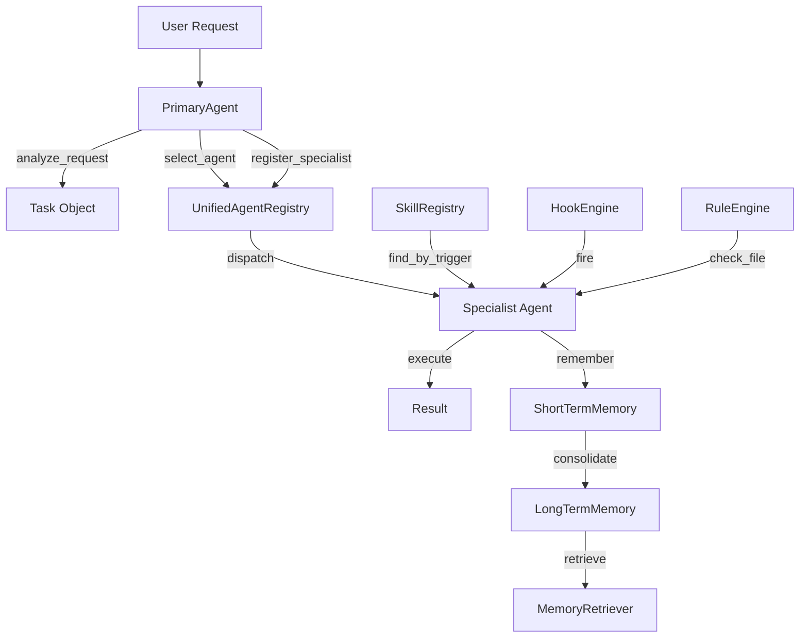

# Lyra Baseline — Current Architecture & Capability Assessment

> **Re-grounded:** June 3, 2026 (Run 1) — fresh read of actual source code

## 1. As-Built Architecture

### Component Map

```
lyra/
├── src/
│   ├── agents/          # Agent classes + unified registry
│   │   ├── base.py      # Agent ABC, AgentStatus, Message, AgentCapability
│   │   ├── primary.py   # PrimaryAgent orchestrator
│   │   ├── code_agent.py
│   │   ├── research_agent.py
│   │   ├── review_agent.py
│   │   ├── unified_registry.py  # Lyra+ECC agent registry
│   │   └── ecc_importer.py
│   ├── memory/          # Three-tier memory (STM/LTM/index)
│   │   ├── memory_store.py     # Memory + MemoryStore (JSON persistence)
│   │   ├── short_term_memory.py
│   │   ├── long_term_memory.py  # LTM + MemoryIndex (tag/type/time)
│   │   ├── memory_retrieval.py  # RetrievalResult + RelevanceScorer
│   │   └── memory_consolidation.py
│   ├── skills/          # Skill system (agent-skills format)
│   │   ├── skill.py     # Skill dataclass + SkillSearchResult
│   │   ├── registry.py  # SkillRegistry with multi-index search
│   │   ├── parser.py    # YAML-frontmatter .md parser
│   │   └── importer.py  # ECCSkillImporter
│   ├── hooks/           # Lifecycle hooks (PreToolUse/PostToolUse/Stop)
│   │   ├── hook.py
│   │   ├── hook_registry.py
│   │   └── hook_engine.py
│   ├── rules/           # Static analysis rules (coding style/security/testing)
│   │   ├── rule.py
│   │   ├── rule_registry.py
│   │   ├── rule_engine.py
│   │   └── rule_parser.py
│   ├── coordination/    # Multi-agent coordination
│   │   ├── task_allocator.py  # Capability/load/priority-based allocation
│   │   ├── dependency_manager.py
│   │   ├── conflict_resolver.py
│   │   └── load_balancer.py
│   ├── adapters/        # Platform adapters (Claude Code, Cursor, VSCode, JB)
│   │   └── base.py      # HarnessAdapter ABC + concrete stubs
│   ├── safety/          # Safety guard (stub)
│   ├── security/        # Security shield (agent_shield.py)
│   ├── monitoring/      # Token observatory
│   └── optimization/    # Token optimizer
```

### Data Flow (Current)



### Key Design Decisions (Existing)
- Agents have per-instance memory (STM + LTM), not shared memory
- Memory is JSON-file-persisted per agent
- Task allocation is scored (capability × load × priority), strategy-weighted
- Skills use YAML-frontmatter Markdown format (compatible with agent-skills standard)
- Hooks support PreToolUse, PostToolUse, Stop lifecycle events
- Adapters are abstract stubs — no real provider integration exists
- Coordination is in-process (no message broker, no network layer)

---

## 2. BASELINE SCORECARD

| Workstream | What Exists Today | Maturity | Known Pain |
|------------|-------------------|----------|------------|
| §4.1 UI/UX | Basic terminal output; no themes, no keybindings config | `none` | Monochrome, no power-user UX |
| §4.2 Memory | STM (ring buffer) + LTM (JSON file) + tag/time index; per-agent, no shared memory; simple keyword search | `partial` | No embedding/vector search; no graph memory; no conflict resolution; no active forgetting beyond decay; no cross-session persistence beyond JSON |
| §4.3 Context | No auto-compaction; STM is a simple ring buffer | `none` | Context grows unbounded; no compression strategy |
| §4.4 Skills | Skill dataclass + YAML parser + in-memory registry; trigger-pattern matching; ECC import | `partial` | No self-evolving skills; no auto-creation from trajectories; no quality evaluation; no skill graph; trigger patterns are substring match only |
| §4.5 Router | No model router exists | `none` | Single hardcoded model; no provider abstraction |
| §4.6 Tools | No tool system beyond abstract Tool dataclass in adapters | `none` | No Bash/Read/Write/Edit tools; no tool registry |
| §4.7 Plugins | No plugin system | `none` | — |
| §4.8 MCP | No MCP integration | `none` | — |
| §4.9 Commands | No slash-command system | `none` | — |
| §4.10 Hooks | HookEngine + HookRegistry (PreToolUse/PostToolUse/Stop); async execution; critical-hook abort | `partial` | No hook persistence; no hook configuration file format; limited event types |
| §4.11 Sessions | No session management | `none` | No checkpointing; no session resume |
| §4.12 Permissions | No permission system | `none` | — |
| §4.13 Swarm/Fleet | PrimaryAgent orchestration is single-process, in-memory; TaskAllocator exists; no detached sessions; no fleet view; no worktree isolation | `partial` | No supervisor daemon; no background sessions; no inter-agent channels; no parallel-edit safety |
| §4.14 Autonomy | No continuous-operation loop | `none` | Agents require active terminal session |
| §4.15 Deep Research | ResearchAgent exists but is a stub | `none` | No multi-hop research; no AutoScientists pattern |
| §4.16 Reliability | No monitoring/tracing/verifier | `none` | No observability; no structured verification |
| §4.17 Safety | AgentShield stub; basic rule-based secret detection | `partial` | No guardrail system; no sandboxing; no prompt-injection defense |
| §4.18 Voice | None | `none` | — |
| §4.19 Self-knowledge | None | `none` | No uncertainty estimation; no confidence calibration |
| §4.20 Planning | None | `none` | No MCTS; no plan-and-solve; no tree search |
| §4.21 Economics | None | `none` | No token accounting; no cost tracking |
| §4.22 Steering | None | `none` | No interrupt/redirect; no mid-run correction |
| §4.23 Ingestion | None | `none` | No RAG; no code indexing |
| §4.24 Dreaming | MemoryConsolidator with THRESHOLD policy; basic merge_similar | `partial` | No idle-time consolidation; no cross-session pattern detection |
| §4.25 Adversarial Panel | ReviewAgent exists but is a stub | `none` | No multi-verifier voting; no adversarial skeptic |
| §4.26 Harness Engineering | No formal harness engineering subsystem | `none` | — |
| §4.27 RL Optimizer | None | `none` | — |
| §4.28 Desktop | None | `none` | Terminal-only; no multimodal I/O |
| §5.1 rmux | None | `none` | No terminal multiplexing |
| §5.2 Multi-tenancy | None | `none` | — |
| §5.3 Voice SFX | None | `none` | — |

### Aggregate Maturity
- **Solid:** 0 workstreams
- **Partial:** 5 workstreams (Memory, Skills, Hooks, Swarm/coordination, Safety)
- **None:** 23+ workstreams

### Key Constraints
- **License:** MIT — any code incorporated must be MIT-compatible
- **Language:** Python (primary); JavaScript/TypeScript (build tooling)
- **Interface:** Terminal-based (CLI/TUI); Desktop planned
- **Multi-provider:** Must work across Claude/DeepSeek/GPT/open-weights
- **No breaking changes to existing agent API** (Agent ABC, Task, Result)

---

## 3. What Already Works Well (Don't Replace)
1. **Agent ABC + Task model** — clean abstraction, well-typed
2. **Skill dataclass + YAML parser** — good foundation, compatible with agent-skills standard
3. **Hook engine** — async, priority-based, critical-hook abort
4. **Task allocation scoring** — weighted multi-factor scoring is sound
5. **Memory consolidation architecture** — STM→LTM pattern is correct, just needs depth
6. **Unified registry** — Lyra+ECC namespace design is clean
