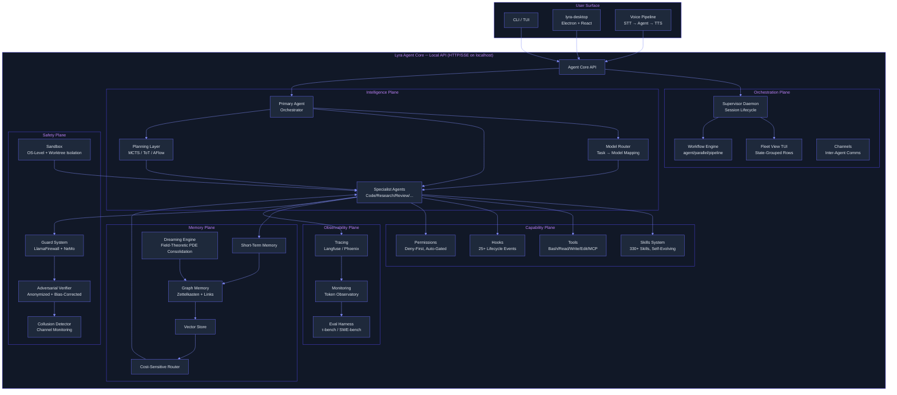

# Lyra Breakthrough Architecture — Unified Next-Generation Design

> **Run 1 — June 3, 2026** | The capstone — integrates all research into one coherent, novel system
> **Status:** Converged from 3-round architecture debate (see DEBATE-LEDGER.md)

---

## What is NEW vs What is ADOPTED

**ADOPTED (ported from existing systems, adapted for Lyra):**
- Claude Code Agent View → Lyra Supervisor Daemon + Fleet View (ported, improved: non-destructive cleanup)
- Claude Code Worktrees → Lyra Worktree Isolation Substrate (ported, improved: lazy creation, sparse/overlay strategies)
- Claude Code Dynamic Workflows → Lyra Workflow Engine (ported, adapted: Python scripts, not JS)
- Claude Code Skills → Lyra Skills System (adopted: progressive disclosure, provider-aware degradation)
- A-MEM Zettelkasten → Lyra Graph Memory (adopted: structured notes, linked graph)
- Anthropic Context Engineering → Lyra Context Manager (adopted: 3-strategy framework)
- RouteLLM/FrugalGPT → Lyra Model Router (adopted: cascade + difficulty routing)
- GEPA → Lyra Skill Optimizer (adopted: gradient-free prompt evolution)

**NEW (combined across sources, no single system does this):**
1. **Field-Theoretic Memory Consolidation:** PDE-governed memory fields for consolidation during idle. Combines Mitra's field theory with Anthropic Dreaming's idle-time pattern + A-MAC's admission control. No existing agent system has continuous memory fields.
2. **Anonymized Bias-Corrected Adversarial Verification:** Multi-agent verification with identity anonymization (2510.07517), ReTAS dialectical alignment (2604.19548), collusion detection (2601.01685), and rogue agent prevention (2502.05986). Claude Code's workflows have adversarial checking but NONE of the bias corrections.
3. **Provider-Swappable Voice Pipeline:** The same provider-abstraction pattern used for LLMs applied to STT/TTS/VAD. No other agent harness has swappable voice providers.
4. **Memory-Augmented Model Routing:** The insight from "Knowledge Access Beats Model Size" (2603.23013) applied systematically: memory caches answers → cheap model handles repeats → expensive model handles first-time only. Combined with cost-sensitive store routing for memory queries.
5. **Self-Evolving Skills with Safety Validator:** GEPA-style evolution + "Misevolve"-informed safety gates. Skills evolve but a safety validator must approve before promotion. No other skills system has this.

---

## System Diagram



---

## Core Mechanisms

### 1. The Provider Abstraction Layer (The Foundation)

Every component above the API talks to models through a single abstraction:

```python
class ProviderBackend(Protocol):
    """Unified interface for any LLM provider."""
    async def chat(self, messages: list[Message], config: ModelConfig) -> ChatResponse: ...
    async def stream_chat(self, messages: list[Message], config: ModelConfig) -> AsyncIterator[ChatResponse]: ...
    def supports(self, capability: Capability) -> bool: ...  # tools, vision, audio, json_mode, etc.
    @property
    def context_window(self) -> int: ...
    @property
    def pricing(self) -> PricingTier: ...

# Concrete implementations:
# ClaudeBackend, DeepSeekBackend, OpenAIBackend, QwenBackend, OllamaBackend, vLLMBackend
```

This is Lyra's single most important architectural decision. Everything — skills, memory, routing, voice — is written once against this abstraction and works on any backend.

### 2. The Effort Scale + Auto-Orchestration Toggle

```
/effort menu (6 items):
  low    → thinking_budget: minimal, orchestration: off
  medium → thinking_budget: default, orchestration: off
  high   → thinking_budget: extended, orchestration: off
  xhigh  → thinking_budget: maximum, orchestration: off
  max    → thinking_budget: maximum+, orchestration: off
  ultracode → thinking_budget: xhigh, orchestration: ON
              (NOT a 6th API budget tier — xhigh to the model + toggle)
```

**Provider mapping:**
| Effort | Anthropic | DeepSeek | GPT | Open-Weights |
|--------|-----------|----------|-----|--------------|
| low | thinking: 1024 | prompt: "be concise" | reasoning_effort: low | max_tokens: 512 |
| medium | thinking: 4096 | default | reasoning_effort: medium | max_tokens: 2048 |
| high | thinking: 8192 | extended thinking | reasoning_effort: high | max_tokens: 4096 |
| xhigh | thinking: 16384 | CoT prompting | reasoning_effort: max | max_tokens: 8192 |
| max | thinking: 31999 | CoT + self-critique | reasoning_effort: max | max_tokens: 16384 |
| ultracode | thinking: 16384 + orchestration ON | CoT + orchestration ON | reasoning_effort: max + orch. ON | max_tokens: 8192 + orch. ON |

### 3. The Dynamic Workflow Engine

Code-driven orchestration where intermediate results live in script variables, not the orchestrator's context window:

```javascript
// Example: bundled deep-research workflow
export const meta = {
  name: 'deep-research',
  description: 'Fan-out research, cross-check, produce cited report',
  phases: [{ title: 'Search' }, { title: 'Verify' }, { title: 'Synthesize' }],
};

phase('Search');
const angles = ['technical', 'business', 'security', 'UX'];
const findings = await pipeline(
  angles,
  angle => agent(`Research ${angle} angle: ${args.question}`, { schema: FINDINGS_SCHEMA, phase: 'Search' }),
  finding => parallel(
    finding.claims.map(c => () =>
      agent(`Adversarially verify: ${c}`, { schema: VERDICT_SCHEMA, phase: 'Verify' })
        .then(v => ({ ...c, verdict: v }))
    )
  )
);

const confirmed = findings.flat().filter(f => f.verdict?.isReal);
const report = await agent(`Synthesize: ${JSON.stringify(confirmed)}`, { phase: 'Synthesize' });
return { report, confirmed };
```

**Key properties:**
- Resumable: checkpoint after each agent() call
- Background: runs while session stays responsive
- Capped: 1000 agents/run max, min(16, CPU-2) concurrent
- Quality-gated: adversarial verification, anonymized agents, bias correction

### 4. Graph Memory with Cost-Sensitive Retrieval

Zettelkasten-style linked notes across four stores (Working / Episodic / Semantic / Procedural), with A-MAC admission control, LP-RAG link prediction, cost-sensitive routing, and field-theoretic consolidation during idle.

### 5. Anonymized Adversarial Verification

The §4.25 verification panel:
1. Response anonymization strips identity markers (IBC→0)
2. ReTAS dialectical alignment corrects role-induced bias
3. Collusion detector monitors channels for Lying-with-Truths
4. Rogue agent monitor intervenes on high error likelihood
5. Voting: ≥2/3 verifiers confirm after adversarial challenge

---

## Why This Combination is a Breakthrough

No existing system combines:
- **Field-theoretic memory** (continuous PDE fields for consolidation)
- **Bias-corrected adversarial verification** (anonymization + ReTAS + collusion detection + rogue prevention)
- **Provider-swappable multimodal pipeline** (LLMs + STT + TTS all swappable behind one abstraction)
- **Memory-augmented routing** (memory caches answers → cheap model for repeats)
- **Self-evolving skills with safety validation** (GEPA evolution + "Misevolve"-informed gates)

Each piece individually exists in research. Combined, they reinforce each other:
- Memory feeds the router (cheaper queries → cheaper routing)
- The router feeds the fleet (right model per agent → efficient parallelism)
- The fleet feeds verification (adversarial cross-check at scale)
- Verification feeds memory (confirmed findings → high-confidence memories)
- Memory consolidation (dreaming) discovers patterns across the fleet
- Self-evolving skills improve from verified trajectories

The result is a **self-reinforcing loop**: better memory → better routing → more efficient fleet → higher-quality verification → better memories → improved skills. Each turn through the loop makes the whole system stronger.

---

## Falsifiable Hypotheses

1. **H₁ — Field-theoretic consolidation beats LLM-based dreaming on quality-per-dollar:** Measured by F1 on Lyra-specific memory tasks (cross-session recall, conflict resolution, pattern discovery). Bake-off in Phase 3.

2. **H₂ — Anonymized bias-corrected verification produces fewer false positives than naive adversarial verification:** Measured by precision@K on held-out verification tasks. Requires building both and comparing.

3. **H₃ — Memory-augmented routing reduces per-session token cost by ≥40% vs uniform expensive-model routing:** Measured by comparing token usage with/without memory-augmented routing on identical task suites.

---

## Headline Risks

1. **Field-theoretic memory is unproven in production.** Mitigation: gated behind bake-off vs LLM-based dreaming.
2. **Supervisor daemon is complex distributed systems engineering.** Mitigation: phased rollout — tmux mode first, daemon gated behind fleet demand data.
3. **Self-evolving skills can misevolve.** Mitigation: safety validator gates all promotions; "Misevolve" findings inform validator design.
4. **Multi-provider abstraction may leak.** Mitigation: per-provider integration tests; capability matrix; graceful degradation.

---

## Baseline Migration Delta

**What this changes (vs BASELINE.md):**
- Adds 8 new subsystems: supervisor daemon, fleet view, worktree isolation, workflow engine, model router, voice pipeline, dreaming engine, adversarial verifier
- Upgrades 2 existing subsystems: memory (flat→graph) and skills (static→self-evolving)
- Adds provider abstraction layer under everything

**What this keeps:**
- Agent ABC + Task model (clean, works)
- Hook engine (sound, extended with more events)
- Skill YAML format (extended with evolution metadata)
- PrimaryAgent orchestration (augmented with fleet, not replaced)
- UnifiedAgentRegistry (extended with capability-based routing)

**What this replaces:**
- Flat JSON memory store → Graph memory with vector + cost-sensitive routing
- Hardcoded model → Provider abstraction + model router
- In-process agent execution → Supervisor daemon + worktree isolation

**Migration cost:** 6-9 months for full implementation (team of 2), phased as:
- Phase 1 (2 months): provider abstraction, model router, embedding search, skill port, EnterWorktree tool
- Phase 2 (2 months): graph memory, cost-sensitive routing, workflow engine (single-session)
- Phase 3 (2-3 months): supervisor daemon, fleet view, voice pipeline, dreaming engine
- Phase 4 (2 months): self-evolving skills, adversarial verifier, desktop shell

---

## Rejected Alternatives (with Debate Round References)

1. **Memory-centric architecture (Candidate A):** Rejected as the primary spine — memory is a SERVICE, not an architecture. Its innovations are absorbed into the capability plane. [DEBATE-LEDGER Round 1]

2. **Self-evolution-centric architecture (Candidate C):** Rejected as premature — self-evolution needs safety infrastructure that doesn't exist yet. Parked for Phase 4. [DEBATE-LEDGER Round 1]

3. **Tmux-based fleet (Skeptic's minimal alternative):** Preserved as a supported simple mode (`lyra fleet --simple`) but rejected as the primary architecture. Doesn't scale past ~5 sessions, can't programmatically manage, no structured state. [DEBATE-LEDGER Rounds 1-2]

4. **LLM-only dreaming (vs PDE fields):** Not rejected — kept as the default. PDE approach gated behind bake-off. [DEBATE-LEDGER Round 3]
