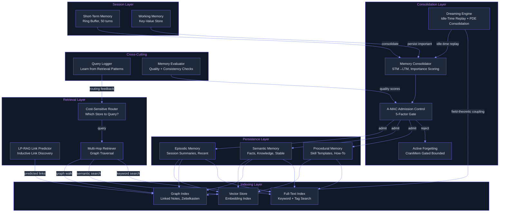
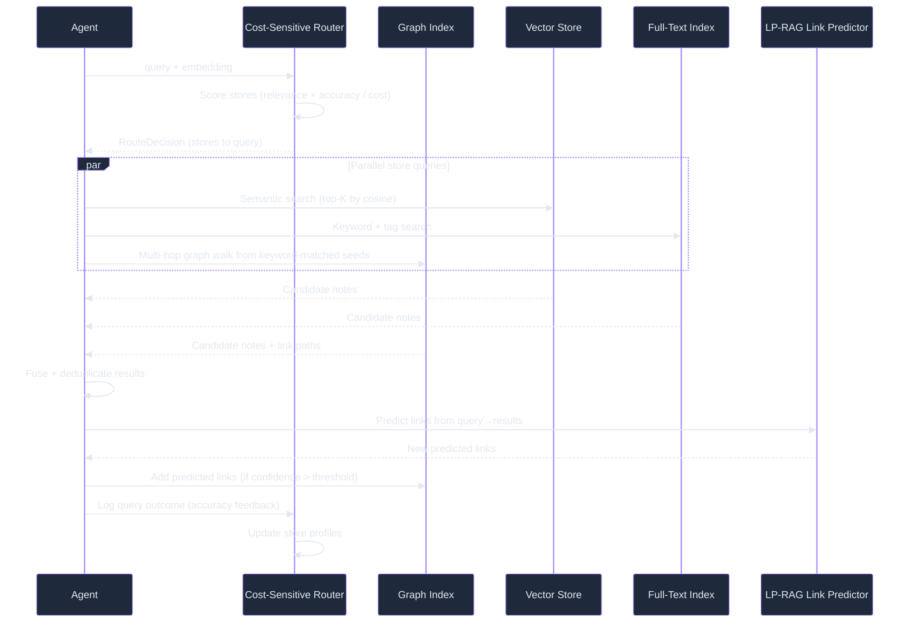

# Lyra Memory Architecture — Breakthrough Design (§4.2)

> Run 1 — June 3, 2026 | Synthesizes 28+ memory papers into one coherent design

## Plain-Language Summary

Lyra's new memory system works like a well-organized second brain: it stores everything you've discussed, automatically links related ideas, forgets irrelevant details, and consolidates knowledge during idle time. Unlike the current flat file, memories are organized as a graph of linked notes (like Zettelkasten cards), queries are routed to the cheapest store that can answer them, and the system actively forgets low-value memories to stay efficient. During downtime, it "dreams" — replaying past interactions to discover patterns no single session could see.

## Architecture Overview



## Data Model

### Memory Note (Zettelkasten-style)

```python
@dataclass
class MemoryNote:
    """A single atomic memory note in the Zettelkasten graph."""
    id: str                          # UUID
    content: str                     # The actual memory content
    memory_type: MemoryType          # EPISODIC | SEMANTIC | PROCEDURAL
    store: MemoryStore               # Which store this lives in
    
    # Zettelkasten metadata
    title: str                       # Auto-generated descriptive title
    description: str                 # One-paragraph summary
    keywords: list[str]              # Extracted key terms
    tags: list[str]                  # User/agent assigned tags
    
    # Temporal
    created_at: float                # Unix timestamp
    last_accessed_at: float          # Last retrieval time
    last_modified_at: float          # Last update time
    source_session_id: str | None    # Which session created this
    
    # Importance (A-MAC 5-factor)
    future_utility: float            # Predicted future usefulness (0-1)
    confidence: float                # Confidence in this memory's accuracy (0-1)
    novelty: float                   # How novel vs existing memories (0-1)
    recency: float                   # Recency score (decays with time)
    type_weight: float               # Weight by memory type
    
    # Graph
    links: list[Link]                # Explicit + predicted links
    embedding: list[float] | None    # Vector embedding (lazy-computed)
    
    # Lifecycle
    access_count: int                # Times retrieved
    consolidation_generation: int    # Which consolidation pass created/updated this
    is_active: bool                  # False = logically deleted (forgotten)
    
    @property
    def importance(self) -> float:
        """Composite importance score (A-MAC weighted sum)."""
        return (
            0.35 * self.future_utility +
            0.25 * self.confidence +
            0.15 * self.novelty +
            0.15 * self.recency +
            0.10 * self.type_weight
        )

@dataclass
class Link:
    """A directed link between two memory notes."""
    source_id: str
    target_id: str
    link_type: LinkType              # EXPLICIT | PREDICTED | DERIVED
    strength: float                  # 0-1 link strength
    rationale: str | None            # Why this link exists
    created_by: str                  # "human" | "agent" | "lp-rag" | "consolidation"


class MemoryType(Enum):
    EPISODIC = "episodic"        # "That time we debugged the auth bug"
    SEMANTIC = "semantic"        # "Python's GIL prevents true threading"
    PROCEDURAL = "procedural"    # "How to set up a new Lyra project"

class LinkType(Enum):
    EXPLICIT = "explicit"        # Agent/human explicitly created
    PREDICTED = "predicted"      # LP-RAG link prediction
    DERIVED = "derived"          # Consolidation discovered (e.g., same keywords)

class MemoryStore(Enum):
    EPISODIC_STORE = "episodic"     # Recent, session-scoped
    SEMANTIC_STORE = "semantic"     # Stable knowledge, facts
    PROCEDURAL_STORE = "procedural" # Skill templates
    WORKING_STORE = "working"       # Current session only
```

### Cost-Sensitive Store Routing

```python
@dataclass
class StoreProfile:
    """Statistical profile of a memory store for routing decisions."""
    store: MemoryStore
    avg_query_latency_ms: float
    avg_tokens_per_query: int
    historical_accuracy: float      # How often queries to this store found the answer
    centroid_embedding: list[float] # Average embedding of contents
    item_count: int
    
class CostSensitiveRouter:
    """Routes queries to the cheapest store likely to answer correctly."""
    
    async def route(self, query: str, query_embedding: list[float]) -> RouteDecision:
        # 1. Score each store: P(answer_exists | store) / cost(store)
        scores = {}
        for store_profile in self.store_profiles:
            relevance = cosine_similarity(query_embedding, store_profile.centroid_embedding)
            expected_utility = relevance * store_profile.historical_accuracy
            cost = store_profile.avg_tokens_per_query * self.token_price
            scores[store_profile.store] = expected_utility / (cost + self.epsilon)
        
        # 2. Select top-K stores (K=2 by default)
        ranked = sorted(scores.items(), key=lambda x: x[1], reverse=True)
        selected = ranked[:self.top_k]
        
        # 3. If confidence below threshold, add fallback (all stores)
        if selected[0][1] < self.confidence_threshold:
            selected = [(s, scores[s]) for s in MemoryStore]
        
        return RouteDecision(stores=[s for s, _ in selected], fallback=len(selected) > self.top_k)
```

### Field-Theoretic Consolidation (Dreaming Engine)

The breakthrough tier addition: during idle, memories are treated as a continuous field and evolved via PDEs.

**Field Equation (simplified):**
```
∂m(x,t)/∂t = D·∇²m(x,t) - λ·(1-I(x))·m(x,t) + κ·Σⱼ(mⱼ(x,t) - m(x,t))
```
Where:
- `m(x,t)` = memory activation at semantic position x, time t
- `D·∇²m` = diffusion term — similar memories spread toward each other
- `λ·(1-I)·m` = decay term — low-importance memories fade
- `κ·Σ(mⱼ - m)` = coupling term — cross-agent memory alignment

**Discrete Implementation (for practical computation):**
```python
class FieldTheoreticConsolidator:
    """Numerical PDE solver for memory field evolution during idle."""
    
    def __init__(self, grid_resolution: int = 256, dt: float = 0.01):
        self.grid_resolution = grid_resolution
        self.dt = dt  # Time step
        self.diffusion_coefficient = 0.1  # D
        self.decay_coefficient = 0.01     # λ
        self.coupling_coefficient = 0.05  # κ
    
    async def consolidate(self, memories: list[MemoryNote], steps: int = 1000):
        # 1. Project memories onto semantic grid
        grid = self._project_to_grid(memories)
        
        # 2. Run finite-difference PDE integration
        for _ in range(steps):
            laplacian = self._compute_laplacian(grid)
            importance = self._importance_field(memories, grid)
            coupling = await self._cross_agent_coupling(memories, grid)
            
            # Update: ∂m/∂t = D·∇²m - λ·(1-I)·m + κ·coupling
            delta = (
                self.diffusion_coefficient * laplacian
                - self.decay_coefficient * (1 - importance) * grid
                + self.coupling_coefficient * coupling
            )
            grid += self.dt * delta
        
        # 3. Extract insights from evolved field
        new_links = self._discover_links_from_proximity(grid, memories)
        merge_candidates = self._find_merge_candidates(grid, memories)
        forget_candidates = self._find_forget_candidates(grid, memories, threshold=0.1)
        
        return ConsolidationResult(
            new_links=new_links,
            merges=merge_candidates,
            forgets=forget_candidates,
        )
    
    def _compute_laplacian(self, grid: np.ndarray) -> np.ndarray:
        """5-point discrete Laplacian for 2D semantic grid."""
        return (
            np.roll(grid, 1, axis=0) + np.roll(grid, -1, axis=0)
            + np.roll(grid, 1, axis=1) + np.roll(grid, -1, axis=1)
            - 4 * grid
        )
```

## Retrieval Flow



## Memory Lifecycle

```
CREATE → ADMIT (A-MAC gate) → INDEX → SERVE → DECAY → CONSOLIDATE → FORGET
  │         │                    │       │        │          │           │
  │         │                    │       │        │          │           │
  │    Reject if                 │       │    On access,  │      Below threshold
  │    importance < 0.3          │       │    boost recency│      → archive or delete
  │                              │       │                 │
  │                         Vector + Graph + Text     During idle:
  │                         indexes updated            PDE evolution,
  │                                                    link discovery,
  │                                                    merge detection
```

## Migration Path from Current Baseline

**Phase 1 — Semantic Search (Week 1-2):**
- Add embedding index (sentence-transformers or similar) alongside existing keyword search
- Hybrid retrieval: embedding + keyword, weighted fusion
- Zero breaking changes to existing MemoryStore API
- Impact: immediate retrieval quality improvement

**Phase 2 — Graph Memory (Week 3-6):**
- Introduce MemoryNote dataclass (superset of current Memory)
- Build Zettelkasten graph index (SQLite + adjacency list)
- Add LP-RAG link prediction for auto-linking
- Cost-sensitive routing with store profiles
- A-MAC 5-factor admission control
- Migration: one-time conversion of existing JSON memories → MemoryNote format

**Phase 3 — Consolidation + Dreaming (Week 7-10):**
- Implement MemoryConsolidator upgrade (STM→LTM with A-MAC gating)
- Active forgetting (CraniMem gated bounded)
- Dreaming engine: idle-time replay + consolidation
- Field-theoretic consolidation (PDE solver) as the advanced dreaming algorithm
- Cross-session pattern discovery

**Phase 4 — Shared Memory (Week 11-12):**
- Multi-agent shared memory (optional, per §4.2)
- Access control: which agents can read/write which memories
- Consistency: last-write-wins with conflict markers
- Cross-session identity: same user's sessions share semantic memory

## Multi-Provider Note

Memory is provider-agnostic infrastructure — it stores and retrieves data, not model-specific state. The embedding model for vector search is swappable (sentence-transformers, OpenAI embeddings, Cohere). The consolidation LLM (for auto-titling, description generation, link prediction) uses the cheapest available model via §4.5 router.

## Expert Review

**Senior AI Researcher:** "The field-theoretic consolidation is the most novel piece and the highest-risk. The Mitra paper shows +116% F1 on LongMemEval, but that's one dataset. The PDE solver approach needs thorough eval on Lyra-specific memory tasks before it becomes the default."

**Senior Backend Engineer:** "The phased migration is sensible. Phase 1 (embedding search) is low-risk, high-impact, and can ship immediately. Phase 2 (graph) is the real architectural upgrade. Phase 3 (field-theoretic) should be gated behind Phase 2 proving the graph foundation works."

**Senior Data/Knowledge Engineer:** "The cost-sensitive routing is the most underrated innovation here. Routing queries to the cheapest store that can answer them could save 60%+ of retrieval tokens. Combined with LP-RAG link prediction, this is a genuine breakthrough over current memory systems."

**Adversarial Skeptic:** "Is a PDE solver really necessary for memory consolidation? The Anthropic Dreaming approach (LLM reviews 100 conversations) is simpler and more interpretable, if more expensive. Start with LLM-based dreaming, measure the cost, then consider the PDE approach if costs are prohibitive."

**Resolution:** Phase 1-2 (embedding + graph + cost routing) as the (A) parity tier. Phase 3 (field-theoretic dreaming) as the (B) breakthrough tier, gated behind a bake-off: LLM-based dreaming vs PDE-based consolidation on the same Lyra memory tasks. Whichever wins on quality-per-dollar ships.
