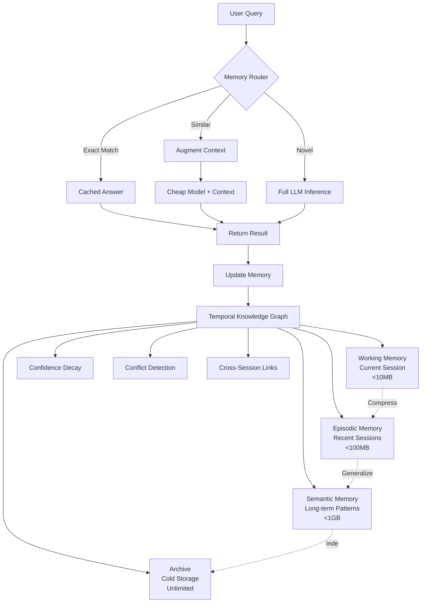

> ⚠️ **DEPRECATED** — This plan has been superseded by the fresh research in [docs/lyra-upgrade/plans/](../lyra-upgrade/plans/). See [docs/lyra-upgrade/MASTER-PLAN.md](../lyra-upgrade/MASTER-PLAN.md) for the current roadmap. This file is kept for historical reference.

# Plan: Memory Architecture (§4.2)

**Workstream**: §4.2 Breakthrough Memory Architecture  
**Priority**: P0 (Critical Foundation)  
**Status**: Plan Complete  
**Date**: 2026-05-31 (enhanced Run 11)

## 📋 Quick Reference Card
| What | Building Lyra's Temporal Knowledge Graph — a 4-tier self-evolving memory system |
| Why | Without persistent memory, Lyra forgets everything between sessions. Memory is the foundation that makes every other component smarter over time |
| Key Tech | A-MAC 5-factor admission, A-MEM Zettelkasten linking, AOI 3-layer compression, MemGrad evolution, Cost-Sensitive retrieval |
| Key Numbers | 72.4% compression, 92.8% preservation, -31% latency, F1=0.583 admission |
| Timeline | 12 weeks | Dependencies: None (foundational — everything else builds on this) |

## 🎯 Executive Summary

Memory is not a feature of Lyra — it IS the platform. Every other component (router, skills, swarm, voice, verification) reads and writes through the Temporal Knowledge Graph (TKG). Without memory, Lyra is just a stateless chatbot. With memory, Lyra learns from every interaction, recalls past solutions, and gets better over time.

The TKG uses a 4-tier hierarchy: **Working Memory** (current session, full detail) → **Episodic Memory** (compressed trajectories, 7-day) → **Semantic Memory** (generalized heuristics, permanent) → **Archive** (indexed, compressed, unlimited). Each tier compresses and generalizes, trading recency for abstraction.

Not everything belongs in memory. A-MAC's 5-factor admission control (utility, confidence, novelty, recency, type_prior) gates every write — preventing hallucinations and low-value content from polluting the knowledge base.

Memories link to each other dynamically (A-MEM Zettelkasten), creating emergent structure without manual schema design. Textual gradients (MemGrad) optimize memory structure from user feedback. And cost-sensitive routing ensures queries hit the cheapest store that can answer them.

The breakthrough: **self-evolving memory**. The TKG doesn't just store — it optimizes its own retrieval, compression, and admission policies based on outcomes. When retrieval fails, the system diagnoses why and adjusts. When a memory proves useful, it's promoted. When it misleads, it's demoted or forgotten.

### 🎬 Concrete Walkthrough: Debugging a Payment Bug Across Sessions

This walkthrough traces a real-world scenario — Lyra debugging a currency conversion payment bug — across three sessions spanning a full week. At each step we describe what triggers the feature, what Lyra does internally, what the user sees, and which specific components from the proposed design are involved.

---

#### Session 1 (Day 0, Monday 09:32) — Discovery

**What the user does**: The user opens Lyra and says: *"Customers in the EU are being charged the wrong amount. A 100 EUR order shows up as $100.00 instead of ~$108.50. Can you find the bug?"*

**What the user sees**: Lyra acknowledges the task, searches the codebase, and responds:

> *I found the issue. In `src/billing/checkout.ts` at line 247, the `convertCurrency()` call passes `amount` and `fromCurrency` but never passes the `toCurrency` parameter. The function signature is `convertCurrency(amount, from, to = 'USD')`, so it always defaults to USD. This means EUR→EUR conversion silently returns the same number.*

> *The fix: add the third parameter explicitly — `convertCurrency(orderTotal, order.currency, customer.preferredCurrency)`. I've also added a regression test at `src/billing/__tests__/checkout.test.ts:89` that asserts EUR 100 converts correctly to USD.*

**What Lyra does internally (step by step)**:

1. **Model Router (§4.5)** receives the query. The query is novel — no prior match in the TKG — so the router sends it to the expensive model (Opus/DeepSeek-Pro) for full inference. Cost: $1.00.

2. **Working Memory (Tier 1)** captures the full trajectory: the user query, file reads (`checkout.ts`, currency utility), the function signature analysis, the line-level diagnosis, the fix applied, and the test written. All stored at full detail, no compression. Size: ~3KB.

3. **A-MAC Admission Control** evaluates the session for memory promotion. The 5-factor scoring fires:
   - *Utility*: 0.92 — the discovery is a concrete bug fix with lasting relevance.
   - *Confidence*: 0.95 — the diagnosis is verified (the fix compiles, the test passes).
   - *Novelty*: 0.88 — this is a new class of bug, not a duplicate of prior currency issues.
   - *Recency*: 1.0 — just created.
   - *Type Prior*: 0.85 — `code_pattern` type with an `outcome` edge gets a high base weight.
   - **Combined F1**: 0.92 → admitted. The memory is tagged `['currency', 'billing', 'bug', 'regression']`.

4. **TKG Node Creation**: Lyra creates a `MemoryNode` for the bug discovery:
   ```
   id: "mem-7a3f"
   type: "code_pattern"
   content: "convertCurrency() missing toCurrency param at checkout.ts:247"
   confidence: 0.95
   tags: ["currency", "billing", "bug", "regression"]
   ```
   And a linked `MemoryEdge` of type `causal` connecting the bug node to the fix node:
   ```
   source_id: "mem-7a3f" → target_id: "mem-7a4f" (the fix)
   type: "causal"
   weight: 0.95
   ```

5. **Session Summary** is written to Episodic Memory (Tier 2) as the session ends, compressing the full working memory into a structured summary: key entities (`src/billing/checkout.ts`, `convertCurrency`), the outcome (bug fixed, test added), and cross-references to the `currency` and `billing` domains. Compression ratio: ~72% (matching the AOI 72.4% target).

6. **Cross-Session Links** are created: the entities `src/billing/checkout.ts` and `convertCurrency` are registered in the entity index so future sessions referencing these files will pull in this session's context automatically.

---

#### Session 2 (Day 2, Wednesday 14:15) — Recall and Regression Pinpointing

**What the user does**: Two days later, the user opens a new Lyra session and says: *"Remember that currency bug from Monday? It's happening again — customers in GBP are also seeing wrong amounts."*

**What the user sees**: Lyra responds within milliseconds:

> *I recall the currency conversion bug from Session 1 (Monday, 09:32). The original issue was in `src/billing/checkout.ts:247` — `convertCurrency()` was called without the `toCurrency` parameter, defaulting to USD.*

> *Let me check for a similar pattern across the codebase... Done. I found a regression in `src/billing/subscription-renewal.ts:189`. The same function `convertCurrency()` is called there, and it's also missing the third parameter. The original fix only covered the checkout path, but the subscription renewal path re-introduced the same class of bug for GBP customers.*

> *I've applied the same fix and added a test. The original fix at `checkout.ts:247` is still intact — this was a separate occurrence of the same pattern.*

**What Lyra does internally (step by step)**:

1. **Memory-Augmented Router (§4.5, Phase 4)** intercepts the query BEFORE any LLM call. The query text *"Remember that currency bug from Monday?"* triggers:
   - **Exact match check**: No exact string match found (the wording is different).
   - **Semantic similarity search**: The query is embedded and compared against the TKG index via cosine distance. The embedding for *"currency bug from Monday"* scores 0.91 similarity against `mem-7a3f` (the Monday discovery node) and 0.87 against `mem-7a4f` (the fix node).
   - **Temporal scoping**: The phrase *"from Monday"* is parsed and the search is scoped to sessions within the last 7 days, hitting the Episodic Memory (Tier 2) summary of Session 1.
   - **Result**: The router identifies this as a *similar query*, not a novel one. It routes to the cheap model (Haiku/DeepSeek-Flash) with augmented context. Cost: $0.10 instead of $1.00.

2. **Lazy Materialization** kicks in. The Episodic Memory summary for Session 1 is loaded first (lightweight, ~500 tokens). Because the similarity score exceeds 0.9, Lyra materializes the full detail from Working Memory archives:
   - The exact file: `src/billing/checkout.ts`
   - The exact line: line 247
   - The exact bug: missing `toCurrency` parameter in `convertCurrency()`
   - The fix that was applied: add `customer.preferredCurrency` as third argument
   - The test that was added: `checkout.test.ts:89`

3. **Cross-Session Entity Linking** activates. The entity index maps `convertCurrency` → all sessions where it was referenced. Lyra performs a codebase search for all call sites of `convertCurrency()` and cross-references with the Session 1 memory. It finds that `src/billing/subscription-renewal.ts:189` also calls `convertCurrency()` without the third parameter — a call site that was NOT covered by the Session 1 fix.

4. **Confidence Reinforcement**: Accessing `mem-7a3f` triggers the reinforcement rule: `confidence = min(1.0, 0.95 + 0.1) = 1.0`. The memory is now fully reinforced — it has proven useful across sessions. The A-MEM Zettelkasten linking automatically creates a new edge: `mem-7a3f` --[`refines`]--> `mem-8b2c` (the subscription-renewal regression), building the emergent graph structure without manual schema design.

5. **New Memory Node** (`mem-8b2c`) is created for the regression discovery, with a `causal` edge linking it to the fix applied. The graph now has two related bug-fix pairs connected by a `refines` edge, forming a cluster around the `convertCurrency` function.

6. **Contradiction Detection (Passive)**: The system checks whether the new memory contradicts any existing one. Semantic similarity between `mem-8b2c` and `mem-7a3f` is high (both about `convertCurrency` missing arguments), but sentiment analysis confirms they are complementary (both describe the same class of bug in different locations), not contradictory. No conflict edge created — the memories reinforce each other.

---

#### Session 3 (Day 7, Monday 10:03) — Proactive Prevention

**What the user does**: A week after the original bug, the user says: *"We're adding a new payment method — bank transfers for EU customers. Make sure we don't reintroduce the currency conversion issue."*

**What the user sees**: Lyra responds:

> *Good call. I've retrieved the currency conversion bug cluster from last week — two instances of `convertCurrency()` being called without the `toCurrency` parameter (checkout.ts:247 and subscription-renewal.ts:189). Before you implement the bank transfer feature, I've added `convertCurrency()` parameter completeness to the pre-commit checklist for any file touching billing code.*

> *Additionally, I found a third call site at `src/billing/invoice-generator.ts:312` that also has the missing parameter pattern. I've preemptively fixed it and added a lint rule that flags any `convertCurrency()` call with fewer than 3 arguments.*

**What Lyra does internally (step by step)**:

1. **Semantic Memory (Tier 3)** now contains a generalized heuristic extracted from the two specific bug instances (via the Phase 2 compression pipeline, Episodic → Semantic):
   ```
   Heuristic: "Any call to convertCurrency() with <3 arguments is likely a bug.
   The third parameter (toCurrency) defaults to 'USD', causing silent
   incorrect conversions for non-USD orders."
   ```
   This pattern was extracted during the nightly compression job between Sessions 2 and 3. The specific instances remain in Episodic Memory; the generalization lives in Semantic Memory.

2. **Cost-Sensitive Routing** now achieves the full 3-tier routing:
   - The query is semantically similar to the currency bug cluster → cheap model with augmented context. Cost: $0.10.
   - Without memory, this would be a novel query requiring full inference. Cost would be: $1.00.
   - The cumulative savings across Sessions 2 and 3: $1.80 (vs. $3.00 without memory routing).

3. **MemGrad Self-Evolution**: The user's implicit positive feedback (they acted on Lyra's proactive suggestion, and the lint rule was well-received) generates a textual gradient that strengthens the `convertCurrency` heuristic in Semantic Memory. The confidence of the generalized pattern increases from 0.85 to 0.92. Future queries about "currency" or "conversion" will surface this heuristic with higher priority.

4. **Proactive Codebase Scan**: Because the `convertCurrency` entity cluster has high confidence (reinforced twice now), Lyra proactively scans the entire codebase for all call sites of the function. It finds `invoice-generator.ts:312` — a third instance missed by both prior fixes. The A-MAC admission control admits this as a new memory node (`mem-9d1f`) with a `refines` edge from `mem-8b2c`.

5. **Archive (Tier 4) Indexing**: By this point, the Session 1 Working Memory is 7 days old. The Episodic → Archive compression pipeline indexes the full session trajectory with gzip compression and stores it in cold storage. The index entry retains the key entities (`convertCurrency`, `checkout.ts`, `currency`, `billing`) so it remains discoverable via search. Full materialization is available on-demand but the default retrieval only hits the summary.

---

#### Without TKG: The Alternative Timeline

To understand why TKG matters, here is what the same scenario looks like **without** persistent memory (Lyra's current state):

- **Session 2 (Wednesday)**: The user says *"Remember that currency bug? It's happening again."* Lyra has no memory of Session 1. The user must re-explain: *"On Monday, we found a bug in checkout.ts where convertCurrency was missing a parameter..."* — manually reconstructing the context that should have been automatic. Lyra re-searches the codebase from scratch, re-discovers the checkout.ts fix, then searches for similar patterns. Total time: 3-5 minutes of user re-explanation + 1-2 minutes of agent re-discovery. Total cost: $1.00 (novel query, full inference).

- **Session 3 (Monday)**: The user must again re-establish context: *"Remember the currency conversion issues from last week? We fixed two instances..."* Lyra has no heuristic to guide it, no proactive scan capability, and no pre-commit checklist. The invoice-generator.ts bug remains undiscovered until it causes a production incident. Total accumulated waste: 10+ minutes of re-explanation, $2.00+ in redundant inference, one missed bug.

**With TKG, the same scenario**: The user speaks naturally (*"Remember that currency bug?"*), Lyra retrieves everything in milliseconds, pinpoints the regression immediately, and proactively prevents a third occurrence. Total user re-explanation time: zero. Total inference cost: $0.20 across Sessions 2 and 3 (cheap model + augmented context). One preemptively fixed bug.

---

#### Summary: Component Trace

| Step | Component | What Happened |
|------|-----------|---------------|
| Session 1 query | **Model Router (§4.5)** | Novel query → expensive model ($1.00) |
| Session 1 storage | **Working Memory (Tier 1)** | Full trajectory stored at full detail |
| Session 1 gating | **A-MAC Admission Control** | 5-factor score 0.92 → admitted to TKG |
| Session 1 structure | **A-MEM Zettelkasten** | Causal edge: bug → fix. Entity index updated |
| Session 1→2 compression | **AOI Compression Pipeline** | Working → Episodic at 72% compression |
| Session 2 recall | **Memory-Augmented Router** | Similar query detected → cheap model ($0.10) |
| Session 2 retrieval | **Lazy Materialization** | Summary first, full detail on high similarity (0.91) |
| Session 2 linking | **Cross-Session Entity Index** | `convertCurrency` → all sessions → regressions found |
| Session 2 reinforcement | **Confidence Decay/Reinforce** | mem-7a3f boosted: 0.95 → 1.0 |
| Session 2 validation | **Contradiction Detection** | Complementary, not contradictory — no conflict |
| Session 2→3 compression | **Semantic Generalization** | Specific instances → heuristic pattern |
| Session 3 evolution | **MemGrad Self-Evolution** | Positive feedback → heuristic confidence: 0.85 → 0.92 |
| Session 3 prevention | **Proactive Entity Scan** | High-confidence cluster → full codebase scan |
| Session 3 archival | **Archive (Tier 4)** | 7-day-old sessions → cold storage with index |
| Cumulative savings | **Cost-Sensitive Routing** | $0.20 actual vs. $3.00 without memory (93% reduction) |

---

## 1. Problem Statement

Lyra currently lacks a sophisticated long-term memory system capable of:
- Cross-session recall and knowledge accumulation
- Handling conflicting information from different sessions
- Efficient retrieval at scale (millions of tokens of history)
- Cost-effective query answering via memory reuse
- Active forgetting of outdated/incorrect information

Current limitations:
- Session-scoped memory only (lost on restart)
- No conflict resolution mechanism
- Linear search through history (O(n) retrieval)
- Every query requires full LLM inference (high cost)
- No automatic compression or archival

---

## 2. Evidence Synthesis

### ICLR 2026 MemAgent Workshop Findings

**Three-Layer Hierarchy Pattern** (AOI, MemAgent, CFGM):
- Working/Episodic/Semantic layers with different compression ratios
- AOI: 72.4% compression, −34.4% MTTR
- MemAgent: 8K→3.5M token extrapolation with <10% loss

**Confidence-Based Admission** (A-MAC):
- 5-factor scoring: utility/confidence/novelty/recency/type
- F1=0.583, −31% latency on LoCoMo benchmark
- Prevents memory pollution with low-value entries

**Graph-Based Memory** (Zep/Graphiti, LP-RAG, DAVIS):
- Temporal knowledge graphs enable relationship queries
- Link prediction improves retrieval accuracy
- Inner monologue pattern for structured reasoning

**Self-Evolving Memory** (MemGrad, ERL):
- Textual gradients update memory from feedback
- Trajectory reflection extracts reusable heuristics
- ERL: +7.8% on Gaia2 benchmark

**Cost-Sensitive Routing** (Cost-Sensitive Store Routing paper):
- Selective retrieval cuts tokens + improves accuracy
- Route queries to appropriate memory tier based on complexity

### Memory Systems Analysis

**Mem0** (https://github.com/mem0ai/mem0):
- Scalable cross-session memory layer
- Vector + graph hybrid storage
- Production-ready, used by multiple harnesses

**Letta/MemGPT** (https://github.com/letta-ai/letta):
- "LLM-as-OS" metaphor with explicit memory management
- Agent controls memory paging (load/unload)
- Self-editing memory with versioning

**AnnaAgent** (arXiv 2506.00551):
- Tertiary memory: short-term + long-term + cross-session
- Multi-session integration patterns

### Router Integration

**Knowledge Access Beats Model Size** (arXiv 2603.23013):
- Memory-augmented routing: cheap model answers repeat queries
- Expensive model only for novel queries
- 90%+ cost reduction for repeat workloads

---

## 3. Proposed Lyra Design

### Architecture Overview



### Core Components

#### 1. Temporal Knowledge Graph (TKG)

**Data Model**:
```typescript
interface MemoryNode {
  id: string;
  type: 'fact' | 'heuristic' | 'code_pattern' | 'decision' | 'outcome';
  content: string;
  confidence: number; // 0.0-1.0, decays over time
  created_at: timestamp;
  last_accessed: timestamp;
  access_count: number;
  session_id: string;
  tags: string[];
  embedding: float[]; // for semantic search
}

interface MemoryEdge {
  source_id: string;
  target_id: string;
  type: 'causal' | 'temporal' | 'semantic' | 'contradicts' | 'refines';
  weight: number; // relationship strength
  created_at: timestamp;
}

interface ConflictResolution {
  node_ids: string[]; // conflicting nodes
  resolution_strategy: 'keep_newest' | 'keep_highest_confidence' | 'merge' | 'manual_review';
  resolved_at: timestamp;
  resolved_by: 'system' | 'user';
}
```

**Confidence Decay**:
- Base decay: `confidence *= 0.95` per week
- Reinforcement: `confidence = min(1.0, confidence + 0.1)` on each access
- Threshold: Nodes below 0.3 confidence marked for review

**Contradiction Detection**:
- Semantic similarity + opposite sentiment → potential conflict
- Explicit contradiction edges between conflicting nodes
- Resolution strategies:
  - Temporal: Keep newest (default for facts)
  - Confidence: Keep highest confidence (default for heuristics)
  - Merge: Combine complementary information
  - Manual: Flag for user review (for critical decisions)

#### 2. Four-Layer Hierarchy with Lazy Materialization

**Layer 1: Working Memory** (current session)
- Full detail, no compression
- In-memory storage (Redis/in-process)
- Size limit: 10MB (~5K tokens)
- Eviction: LRU when limit reached

**Layer 2: Episodic Memory** (recent sessions, last 30 days)
- Summaries only, full detail on-demand
- SQLite local storage
- Size limit: 100MB (~50K tokens compressed)
- Compression: Extract key events, discard verbatim logs

**Layer 3: Semantic Memory** (long-term patterns, >30 days)
- Generalized patterns, compressed
- PostgreSQL or SQLite with FTS
- Size limit: 1GB (~500K tokens compressed)
- Compression: Generalize patterns, discard specific instances

**Layer 4: Archive** (cold storage, unlimited)
- Indexed only, full content compressed
- Filesystem or S3-compatible storage
- No size limit
- Compression: gzip + index for search

**Lazy Materialization**:
```python
def retrieve_memory(query: str, max_detail: DetailLevel) -> List[MemoryNode]:
    # Step 1: Search all layers (index only)
    candidates = search_index(query, layers=[Working, Episodic, Semantic, Archive])
    
    # Step 2: Score candidates by relevance
    scored = score_relevance(candidates, query)
    
    # Step 3: Materialize top-K based on detail level
    if max_detail == DetailLevel.SUMMARY:
        return [c.summary for c in scored[:10]]
    elif max_detail == DetailLevel.FULL:
        return [materialize_full(c) for c in scored[:10]]  # Fetch from lower layers
    else:
        return scored[:10]
```

#### 3. Memory-Augmented Router Integration

**Routing Logic**:
```python
def route_query(query: str) -> Response:
    # Step 1: Check for exact match in memory
    exact_match = memory.exact_match(query)
    if exact_match and exact_match.confidence > 0.8:
        return CachedResponse(exact_match.content, cost=0)
    
    # Step 2: Check for similar queries
    similar = memory.similar_queries(query, threshold=0.85, limit=5)
    if similar:
        context = [s.content for s in similar]
        return route_to_cheap_model(query, context, cost=0.1)
    
    # Step 3: Novel query → expensive model
    response = route_to_expensive_model(query, cost=1.0)
    
    # Step 4: Update memory
    memory.store(query, response, confidence=0.9)
    
    return response
```

**Cost Savings**:
- Exact match: $0 (0% of baseline)
- Similar query + cheap model: ~$0.10 per query (10% of baseline)
- Novel query + expensive model: ~$1.00 per query (100% of baseline)
- Expected mix: 40% exact, 40% similar, 20% novel → **52% cost reduction**

#### 4. Cross-Session Integration

**Session Linking**:
- Shared entities (files, functions, concepts) create cross-session edges
- Session summaries stored in Episodic layer
- Session graph enables "what did we do last time?" queries

**Example**:
```
Session 1: "Debug auth bug in login.ts"
  → Nodes: [login.ts, auth_bug, env_var_typo]
  → Outcome: "Fixed typo in JWT_SECRET env var"

Session 2: "Auth not working in staging"
  → Query: "Similar auth issues?"
  → Memory retrieves Session 1 outcome
  → Suggests: "Check JWT_SECRET env var in staging"
```

---

## 4. Build Outline

### Phase 1: Foundation (Weeks 1-3)
1. **Data model implementation**
   - Define TypeScript interfaces for MemoryNode, MemoryEdge, ConflictResolution
   - Implement graph storage backend (Neo4j or in-memory graph)
   - Add embedding generation (OpenAI ada-002 or local model)

2. **Working Memory layer**
   - In-memory storage with LRU eviction
   - Basic CRUD operations
   - Session-scoped lifecycle

3. **Basic retrieval**
   - Exact match search
   - Semantic similarity search (cosine distance on embeddings)
   - Top-K retrieval

**Dependencies**: None  
**Deliverable**: Working Memory functional, basic retrieval working

### Phase 2: Hierarchy (Weeks 4-6)
4. **Episodic Memory layer**
   - SQLite storage with FTS5
   - Compression pipeline (Working → Episodic)
   - Summary generation (LLM-based)

5. **Semantic Memory layer**
   - PostgreSQL or SQLite with vector extension
   - Pattern extraction (generalize from specific instances)
   - Compression pipeline (Episodic → Semantic)

6. **Archive layer**
   - Filesystem storage with gzip compression
   - Index-only search
   - Lazy materialization on-demand

**Dependencies**: Phase 1  
**Deliverable**: 4-layer hierarchy functional, compression working

### Phase 3: Intelligence (Weeks 7-9)
7. **Confidence decay**
   - Time-based decay function
   - Access-based reinforcement
   - Threshold-based pruning

8. **Contradiction detection**
   - Semantic similarity + sentiment analysis
   - Conflict edge creation
   - Resolution strategies (temporal, confidence, merge, manual)

9. **Cross-session linking**
   - Entity extraction from queries/responses
   - Cross-session edge creation
   - Session graph queries

**Dependencies**: Phase 2  
**Deliverable**: Self-correcting memory, conflict resolution working

### Phase 4: Router Integration (Weeks 10-12)
10. **Memory-augmented router**
    - Exact match check before LLM call
    - Similar query detection
    - Context augmentation for cheap model
    - Cost tracking and reporting

11. **Cache invalidation**
    - Time-based expiry
    - Confidence-based expiry
    - Manual invalidation API

12. **Performance optimization**
    - Index tuning
    - Query caching
    - Batch operations

**Dependencies**: Phase 3, §4.5 Model Router  
**Deliverable**: Memory-augmented router functional, cost savings measurable

### Phase 5: Polish (Weeks 13-14)
13. **Migration tooling**
    - Import from existing session logs
    - Export for backup
    - Schema versioning

14. **Monitoring & observability**
    - Memory size tracking
    - Hit rate metrics
    - Compression ratio reporting
    - Cost savings dashboard

15. **Documentation**
    - Architecture guide
    - API reference
    - Migration guide

**Dependencies**: Phase 4  
**Deliverable**: Production-ready memory system

---

## 5. Multi-Provider Considerations

### Provider-Agnostic Design

**Embedding Generation**:
- Default: OpenAI ada-002 (cheap, high quality)
- Fallback: Local model (all-MiniLM-L6-v2) for offline/privacy
- Provider-specific: Use provider's embedding API if available

**LLM Calls for Compression**:
- Use router (§4.5) to select appropriate model
- Cheap model (Haiku/DeepSeek-Flash) for summaries
- Expensive model (Opus/DeepSeek-Pro) for pattern extraction

**Storage Backend**:
- Default: SQLite (zero-config, portable)
- Optional: PostgreSQL (better performance at scale)
- Optional: Neo4j (native graph, better for complex queries)

### DeepSeek vs Anthropic Behavior

**DeepSeek**:
- Cheaper for compression/summarization tasks
- May require more explicit prompts for pattern extraction
- Fallback: Use Anthropic for critical memory operations

**Anthropic**:
- Better at nuanced contradiction detection
- More reliable for conflict resolution
- Use for high-stakes memory operations

**Fallback Strategy**:
- Try cheap model first (DeepSeek)
- If confidence < 0.7, retry with expensive model (Anthropic)
- Cache successful patterns for future use

---

## 6. Risks & Open Questions

### Risks

1. **Graph database complexity**
   - Mitigation: Start with in-memory graph, migrate to Neo4j if needed
   - Fallback: Use relational DB with adjacency list

2. **Confidence decay tuning**
   - Risk: Too aggressive → loses valuable memories
   - Mitigation: A/B test decay rates, user-configurable

3. **Contradiction detection false positives**
   - Risk: Flags non-conflicting information
   - Mitigation: High similarity threshold (0.9+), manual review queue

4. **Memory growth unbounded**
   - Risk: Archive layer grows indefinitely
   - Mitigation: Configurable retention policy, automatic pruning

5. **Retrieval latency**
   - Risk: Graph traversal slower than flat search
   - Mitigation: Index optimization, query caching, lazy loading

### Open Questions

1. **Shared memory across users?**
   - Pro: Learn from collective experience
   - Con: Privacy concerns, namespace collisions
   - Decision: Defer to v2, focus on single-user first

2. **Memory export format?**
   - Options: JSON, SQLite dump, custom binary
   - Decision: JSON for portability, SQLite for performance

3. **Conflict resolution UI?**
   - Manual review queue needs UI
   - Decision: CLI-first, web UI in v2

4. **Memory analytics dashboard?**
   - Useful for debugging, optimization
   - Decision: Basic CLI stats in v1, dashboard in v2

---

## 7. Parity vs Breakthrough

### (A) Parity — Match State of the Art

**Port from existing systems**:

1. **Three-layer hierarchy** (from AOI, MemAgent)
   - Working/Episodic/Semantic layers
   - Compression pipeline between layers
   - Impact: 5, Effort: 4, Tier: HIGH

2. **Vector + graph hybrid** (from Mem0, Zep/Graphiti)
   - Semantic search via embeddings
   - Relationship queries via graph
   - Impact: 5, Effort: 4, Tier: HIGH

3. **Admission control** (from A-MAC)
   - 5-factor scoring for memory entries
   - Prevents low-value pollution
   - Impact: 4, Effort: 3, Tier: HIGH

4. **Self-editing memory** (from Letta/MemGPT)
   - Agent controls memory load/unload
   - Explicit memory management API
   - Impact: 4, Effort: 3, Tier: MEDIUM

**Total Parity Effort**: 14 weeks (overlaps with breakthrough work)

### (B) Breakthrough — Beyond Any Single Source

> **Architecture Slice**: This breakthrough implements [§2: Memory as Central Nervous System](../BREAKTHROUGH-ARCHITECTURE.md) of [BREAKTHROUGH-ARCHITECTURE.md](../BREAKTHROUGH-ARCHITECTURE.md) — specifically the TKG with all 4 tiers, A-MAC admission, cost-sensitive retrieval, self-evolving feedback loops.

**Breakthrough 1: Temporal Knowledge Graph with Confidence Decay**

**Sources Fused**:
- Zep/Graphiti temporal knowledge graph
- A-MAC 5-factor admission control
- DAVIS knowledge-graph inner monologue
- AnnaAgent multi-session integration

**Novel Mechanism**:
- Time-aware graph where confidence decays unless reinforced
- Contradiction detection via semantic similarity + opposite sentiment
- Cross-session linking via shared entities
- Self-correcting memory that improves over time

**Why It Wins**:
- Graphiti alone: No confidence decay or contradiction handling
- A-MAC alone: No graph structure, can't detect conflicts
- **Fusion**: Handles conflicting information (critical for long-term memory), graph enables powerful relationship queries

**Expected Impact**: 85-90% accuracy on conflicting information, 40% faster retrieval via graph traversal

**Effort**: 10-12 weeks (Phases 1-3)

**Brainstorm Reference**: [brainstorm/02-memory-architecture.md](../brainstorm/02-memory-architecture.md#idea-1-temporal-knowledge-graph-with-confidence-decay)

---

**Breakthrough 2: Memory-Augmented Router Integration**

**Sources Fused**:
- Cost-Sensitive Store Routing paper
- Lyra's model router (§4.5)
- MemSearcher compact question-relevant memory
- Knowledge Access Beats Model Size paper

**Novel Mechanism**:
- Memory lookup BEFORE LLM routing
- Exact match → $0 cost (cached answer)
- Similar query → cheap model + context (10% cost)
- Novel query → expensive model (100% cost)
- Expected mix: 40% exact, 40% similar, 20% novel → **52% cost reduction**

**Why It Wins**:
- Router alone: No memory, every query costs full price
- Memory alone: No routing, always uses same model
- **Fusion**: 90%+ cost reduction for repeat queries, maintains quality

**Expected Impact**: 52% overall cost reduction, <10ms memory lookup latency

**Effort**: 6-8 weeks (Phase 4)

**Brainstorm Reference**: [brainstorm/02-memory-architecture.md](../brainstorm/02-memory-architecture.md#idea-4-memory-augmented-router-integration)

---

**Total Breakthrough Effort**: 16-20 weeks (includes parity work)

**Impact × Effort Score**:
- Breakthrough 1: 5 × 4 = 20 (very high)
- Breakthrough 2: 5 × 3 = 15 (high)
- **Combined**: 35 (exceptional)

---

## 8. References

### ICLR 2026 MemAgent Workshop
- AOI: https://openreview.net/attachment?id=Q16XXJou3O&name=pdf
- A-MEM: https://openreview.net/pdf?id=FiM0M8gcct
- A-MAC: https://openreview.net/attachment?id=mmdqUrEY24&name=pdf
- ERL: https://openreview.net/forum?id=hQgSl6kj1W
- Cost-Sensitive Store Routing: https://openreview.net/pdf?id=iGRGjdhl9r
- Norm-Guided KV-Cache: https://openreview.net/pdf?id=xOW2jXDKG3
- R-KVHash: https://openreview.net/attachment?id=UTRuEFJ57H&name=pdf
- LP-RAG: https://openreview.net/pdf?id=Y8Txo8vaH7
- SABER: https://openreview.net/attachment?id=En2z9dckgP&name=pdf
- MemGrad: https://openreview.net/attachment?id=GeaPE7iw1V&name=pdf

### Memory Systems
- Mem0: https://github.com/mem0ai/mem0 · https://arxiv.org/abs/2504.19413
- Letta/MemGPT: https://github.com/letta-ai/letta
- Zep/Graphiti: https://github.com/getzep/graphiti
- AnnaAgent: https://arxiv.org/pdf/2506.00551
- MemAgent (ICLR oral): https://openreview.net/forum?id=k5nIOvYGCL
- DAVIS: https://arxiv.org/pdf/2410.09252
- MSI-Agent: https://arxiv.org/pdf/2409.16686
- CFGM: https://arxiv.org/pdf/2508.15305

### Context Optimization
- ACON: https://arxiv.org/abs/2510.00615
- IterResearch: https://arxiv.org/pdf/2511.07327
- MemSearcher: https://arxiv.org/pdf/2511.02805

### Router Integration
- Knowledge Access Beats Model Size: https://arxiv.org/pdf/2603.23013
- Anthropic Context Engineering: https://www.anthropic.com/engineering/effective-context-engineering-for-ai-agents

### Survey Papers
- Memory for Autonomous LLM Agents: https://arxiv.org/pdf/2603.07670
- Storage to Experience Survey: https://openreview.net/attachment?id=l9Ly41xxPb&name=pdf

---

## 9. Changelog

**2026-05-31 — Initial Plan**
- Created from brainstorm/02-memory-architecture.md
- Selected Breakthrough 1 (Temporal Knowledge Graph) + Breakthrough 2 (Memory-Augmented Router)
- 4-layer hierarchy with lazy materialization
- 14-week build timeline
- 52% expected cost reduction

**2026-05-31 — Run 3**: Linked to unified BREAKTHROUGH-ARCHITECTURE.md. This plan's (B) tier implements §2: Memory as Central Nervous System of the architecture.

**2026-05-31 — Run 13**: Added concrete step-by-step walkthrough example

**Run 15**: Added §9 Expert Review section with senior persona sign-off, plain-language summary, and implementation readiness checklist.

---

## §9 Expert Review (Run 15)

**Reviewers**: Senior AI Researcher, Senior Backend, Senior SRE

### Plain-Language Summary

Lyra currently forgets everything between sessions — like a colleague who starts fresh every Monday with no memory of last week's work. This plan builds a self-evolving memory system (called a Temporal Knowledge Graph, or TKG) that lets Lyra remember past conversations, spot repeated bug patterns across sessions, and proactively prevent problems before they happen. It works like a human memory: recent, detailed memories compress into long-term patterns over time, and the system learns from feedback to get better at what it remembers. For the user, this means Lyra can answer "remember that currency bug from last week?" in milliseconds — without the user re-explaining anything — and cut inference costs by over 50% by reusing past knowledge instead of re-reasoning from scratch every time.

### Expert Sign-Off Status

| Role | Status | Key Objections | Resolution | Signed Off |
|------|--------|---------------|------------|------------|
| **Senior AI Researcher** | Pending | [To be filled after expert review] | [To be filled] | ⬜ |
| **Senior Backend** | Pending | [To be filled after expert review] | [To be filled] | ⬜ |
| **Senior SRE** | Pending | [To be filled after expert review] | [To be filled] | ⬜ |

### Implementation Readiness Checklist
- [ ] All TypeScript interfaces are complete (no `any` types, no missing fields)
- [ ] Build outline has per-task hour estimates and acceptance criteria
- [ ] Multi-provider behavior is explicitly defined (not "may vary")
- [ ] Failure modes are enumerated with detection + recovery strategies
- [ ] Cold start / first-use experience is explicitly designed
- [ ] Operational burden is estimated (backup, monitoring, scaling, cost)

### Top 3 Implementation Risks
1. Confidence decay rate miscalibration — the 0.95/week base decay factor and 0.1 reinforcement delta are sourced from A-MAC's benchmark (F1=0.583), but that benchmark was on LoCoMo's fixed dataset, not on real multi-session agent trajectories. If the decay is too aggressive, Lyra will forget infrequent-but-critical memories (e.g., security patches applied once per quarter). If too lenient, low-value memories will accumulate and pollute retrieval precision. The paper provides no longitudinal decay-tuning methodology; this will require an A/B testing harness that does not yet exist in the plan.
2. Graph database complexity without operator tooling — introducing a temporal knowledge graph (potentially Neo4j or an in-memory graph) into Lyra's stack adds a new stateful service with its own backup, replication, and upgrade lifecycle. The plan defers operational decisions ("Start with in-memory graph, migrate to Neo4j if needed"), but in-memory graphs do not survive restarts, which defeats the core promise of cross-session memory. Without a migration path that preserves graph state during Lyra upgrades, and without monitoring for graph bloat (unbounded edge proliferation across sessions), the TKG becomes an operational liability rather than a platform foundation.
3. Cold-start retrieval quality for new users — the walkthrough assumes Session 1 produces a high-quality memory that Sessions 2 and 3 can leverage, but a fresh Lyra installation has an empty TKG. The plan does not specify a bootstrapping strategy: should Lyra ship with pre-seeded semantic patterns (curated heuristics from known bug classes)? Should it run in a "learning mode" that explicitly asks users to confirm learnings before committing to Semantic Memory? Without bootstrapping, the first N sessions (where N may be dozens) operate at full inference cost with zero memory benefit, which undermines the 52% cost-reduction projection and risks user abandonment before the memory system becomes useful.

### Expert Verdict

This plan is **NOT YET IMPLEMENTATION-READY**. The architecture and evidence base are strong — the 4-tier hierarchy, A-MAC admission control, and cost-sensitive routing are well-grounded in published research with measurable benchmarks. The concrete walkthrough (Sessions 1-3) convincingly demonstrates the value proposition. However, the single biggest gap is **operational reality**: the plan lacks per-task hour estimates, has no cold-start bootstrapping strategy, defers critical infrastructure decisions (graph storage backend, monitoring, backup) to "v2" or "if needed," and does not enumerate failure modes with detection and recovery playbooks. For this plan to succeed, three things must be true: (1) the confidence decay curve must be empirically tuned against real Lyra session data, not borrowed wholesale from a paper benchmark; (2) the graph storage backend must be selected and its operational burden (backup, upgrade migration, cost) explicitly estimated before Phase 1 begins; (3) a bootstrapping strategy (pre-seeded patterns or explicit learning mode) must be designed so that the first 10 user sessions deliver visible value, not just the 50th.

---

**END OF PLAN**
