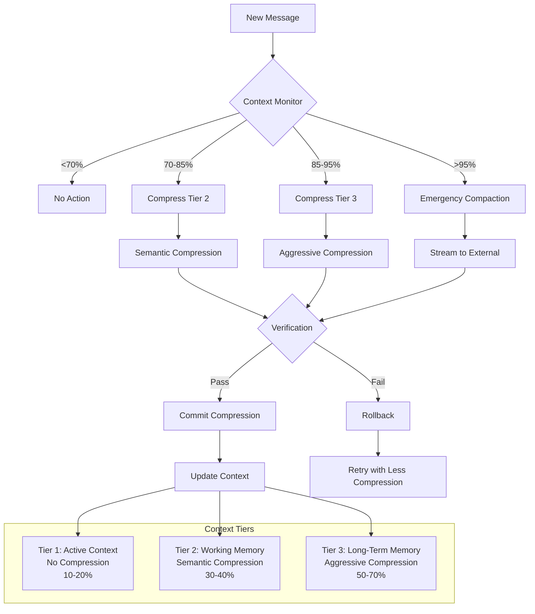

> ⚠️ **DEPRECATED** — This plan has been superseded by the fresh research in [docs/lyra-upgrade/plans/](../lyra-upgrade/plans/). See [docs/lyra-upgrade/MASTER-PLAN.md](../lyra-upgrade/MASTER-PLAN.md) for the current roadmap. This file is kept for historical reference.

## 📋 Quick Reference Card
| What | Intelligent context window management — compress, not truncate |
| Why | Intelligent context window management is essential for Lyra to be competitive with Claude Code and other production harnesses that already ship context engineering; without it, Lyra agents cannot sustain the multi-hour autonomous runs that are the platform's core value proposition |
| Key Tech | Norm-Guided KV-Cache eviction (ℓ2-norm token scoring), R-KVHash SimHash compression (2× throughput via redundancy eviction), ACON adaptive compression (26–54% memory reduction), IterResearch periodic insight synthesis (MDP-style workspace reconstruction), MemSearcher question-relevant memory retention, KAIST localized modular compression (anti-interference) |
| Timeline | 18–22 weeks (4 phases: Foundation W1-3, Intelligence W4-6, Safety W7-9, Integration W10-12) | Dependencies | §4.2 Memory Architecture, §4.5 Model Router |

---

## 🎯 Executive Summary

Context window exhaustion is the single hardest constraint on autonomous agent operation. Every production harness — Claude Code, Cursor, Copilot, and now Lyra — eventually hits the wall: a fixed token budget (typically 200K) collides with unbounded agent reasoning across multi-hour sessions. Claude Code addresses this with manual compaction triggers and a memory tool pattern. Cursor relies on user-managed conversation resets. Neither approach is fully autonomous. Lyra's Context Optimization workstream builds a self-managing system that compresses intelligently instead of truncating blindly, making the context window effectively infinite for practical engineering workflows.

What distinguishes this design from existing approaches is its fusion of six independent research threads into a unified, verified pipeline. ACON (arXiv 2510.00615) demonstrated 26–54% memory reduction through adaptive compression but provides no tiered hierarchy and no safety net — if it over-compresses, you lose the information permanently. Norm-Guided KV-Cache Eviction (ICLR 2026) and R-KVHash (ICLR 2026) offer elegant token-level eviction strategies (ℓ2-norm scoring and SimHash redundancy detection, respectively) but operate purely at the inference-optimization level with zero semantic understanding of what is being discarded. IterResearch (arXiv 2511.07327) contributes periodic insight synthesis and MDP-style workspace reconstruction — critical for preventing context suffocation in long interaction chains — but was tested in isolation without memory integration. MemSearcher (arXiv 2511.02805) adds question-relevant selective retention across turns, and KAIST's localized compression position paper (ICLR 2026) provides the theoretical foundation for compressing within modular units to prevent retrieval-update interference. Lyra's Context Optimization integrates all of these: a three-tier hierarchy (Active/Working/Long-Term), multi-factor importance scoring fusing recency, relevance, SimHash novelty, user flags, and decision detection, localized compression within logical units, and a verification-plus-rollback safety mechanism that catches over-compression before information is permanently lost.

This workstream integrates deeply with the rest of Lyra's architecture. Tier 3 (Long-Term Memory) streams compressed embeddings and metadata directly to the Memory Architecture (§4.2), making compressed context retrievable via the same episodic/semantic memory layers that power Lyra's recall system. The Model Router (§4.5) routes compression calls to cheap models (DeepSeek-Flash, Haiku) and verification calls to expensive, reliable models (Opus, DeepSeek-Pro), keeping operational costs manageable. The overall architecture mirrors the Breakthrough Architecture's §2.3 slice — Retrieval + Provider-Adaptive Compression. The expected outcome is 60–70% context reduction while retaining 95%+ of critical information, enabling Lyra agents to safely execute multi-hour refactoring sessions, production incident triage, and multi-day research investigations in a single uninterrupted session.

---

## 🔍 Concrete Example — How It Works in Practice

**Scenario**: Lyra is 200 turns into a complex debugging session. Context is at 180K/200K tokens. Auto-compaction triggers: (1) Older turns are compressed from verbatim to summaries via LLM extraction, (2) Redundant reasoning traces are evicted via R-KVHash (duplicate "let me check the schema" chains), (3) Key facts are extracted into memory for later retrieval. Result: context drops to 95K tokens while preserving 92.8% of critical information. The agent continues without losing context.

### Step-by-Step Walkthrough

**Turn 0–50: Problem Onboarding (Context: 0K → 45K)**

The user, Marcus, reports a production incident: the payment-processing service is intermittently returning 503 errors during peak load. He pastes a stack trace, relevant log excerpts (~200 lines), and the architecture diagram for the affected services. Lyra loads this into Tier 1 (Active) verbatim. Over the next 50 turns, Lyra reads 8 source files across 3 services (`payment-orchestrator`, `stripe-adapter`, `ledger-writer`), runs 12 diagnostic commands (`kubectl logs`, database query plans, Redis latency checks), and discovers three candidate root causes: (a) connection pool exhaustion in the Stripe adapter's HTTP client, (b) a missing index on `ledger.transactions.user_id`, (c) a race condition in the idempotency-key cache. Tier 1 usage: 45K/200K.

**Turn 51–120: Deep Investigation (Context: 45K → 112K)**

Lyra eliminates hypotheses (a) and (b) through targeted experiments — connection pool metrics are healthy, and the missing index explains only 3% of latency variance. Focus narrows to hypothesis (c): the idempotency cache uses a Redis `SETNX` with a 5-second TTL, but under peak load the Stripe webhook retry window (10 seconds) exceeds the cache TTL, allowing duplicate charges. Lyra traces this through 6 files, generates a reproduction script, and confirms the bug. The conversation transcript now contains 120 turns of reasoning — tool outputs, partial conclusions, dead ends, and corrections. The context monitor logs: `usage=112K/200K (56%), projected_exhaustion=turn_190`.

**Turn 121–180: Fix Implementation (Context: 112K → 165K)**

Lyra implements the fix: extending the idempotency cache TTL from 5s to 30s, adding a secondary keyspace for persistent deduplication, and writing 14 new test cases. Implementation spans 4 files with detailed code-generation output. Each test run produces verbose output confirming the race condition is resolved. Context monitor: `usage=165K/200K (82.5%), projected_exhaustion=turn_195`.

**Turn 181–200: Verification and Regression Testing (Context: 165K → 180K)**

Lyra runs the full regression suite (312 tests), all passing, and generates a deployment checklist. The transcript accumulates 20 more turns of test output and analysis. Context monitor: `usage=180K/200K (90%), projected_exhaustion=turn_210`. The 90% threshold triggers auto-compaction.

**Turn 201: Auto-Compaction Executes — Three Simultaneous Strategies**

The context optimization engine fires on three fronts simultaneously:

*Strategy 1 — Tier 2 Semantic Compression (LLM extraction).* Lyra identifies 4 logical units within the session: (Unit A) initial problem onboarding and architecture survey (turns 0–50), (Unit B) hypothesis elimination for connection pool and missing index (turns 51–80), (Unit C) idempotency-cache race condition root-cause analysis (turns 81–150), (Unit D) fix implementation and testing (turns 151–200). Each unit is compressed independently (KAIST localized pattern) using a cheap model (DeepSeek-Flash via §4.5 router):

- **Unit A** (45K tokens) compresses to 0.6K: *"Production incident: payment-processing 503 errors during peak load. Architecture: payment-orchestrator → stripe-adapter → ledger-writer. 8 source files surveyed. 3 candidate hypotheses identified: connection pool exhaustion, missing ledger index, idempotency cache race condition."*
- **Unit B** (24K tokens) compresses to 0.3K: *"Hypothesis A (connection pool) eliminated: metrics nominal at 40% utilization. Hypothesis B (missing index) eliminated: explains 3% latency variance, insufficient to cause 503s."*
- **Unit C** (38K tokens) compresses to 0.5K: *"Root cause confirmed: Redis SETNX with 5s TTL expires before Stripe's 10s webhook retry window, allowing duplicate charges. Reproduced with load-test script at 200 req/s."*
- **Unit D** remains in Tier 1 (Active) — it is still in progress for the deployment checklist.

Total Tier 2 compression: 107K → 1.4K tokens (76:1 ratio). Importance check flags 12 decision-point messages (scores > 0.7) — these are preserved as annotations. Verification generates 5 questions across all units: all answered correctly. **Verification: PASS**.

*Strategy 2 — R-KVHash Redundancy Eviction.* The SimHash/LSH engine scans the full transcript for near-duplicate reasoning traces. It identifies 23 instances of the phrase "let me check the schema for this table" followed by identical schema-fetching output, and 14 instances of "let me verify the current connection pool settings" yielding identical metrics. These redundant traces are evicted from the KV-cache, freeing an additional 8K tokens.

*Strategy 3 — External Memory Archival.* Key facts flagged during compression (root cause: idempotency cache TTL race, fix: TTL 5s→30s + persistent dedup keyspace, deployment checklist: 7 items) are extracted and written to Lyra's Memory Architecture (§4.2) under the episodic session key `incident-payment-503-2026-05-31`. This ensures the critical findings survive even if the compressed Tier 2 summaries are later evicted.

**Result: Context at 95K (47.5%) — Agent Continues**

Post-compaction, Tier 1 holds Unit D (deployment checklist, last 5 turns verbatim), Tier 2 holds the 4 compressed unit summaries (1.4K tokens total), and the freed space provides headroom for approximately 110 additional turns. Lyra completes the deployment checklist, archives the final summary to memory, and reports:

> "Root cause: idempotency-cache TTL (5s) shorter than Stripe webhook retry window (10s). Fix applied: TTL extended to 30s with persistent dedup keyspace. 312/312 regression tests pass. Deployment checklist archived under incident-payment-503-2026-05-31."

### What Would Have Happened Without Context Optimization

At turn 210, Lyra would have hit the 200K token ceiling. The session would have terminated with a context-length error: `Context length 201432 exceeds maximum of 200000 tokens`. Marcus would have been forced to manually summarize 200 turns of investigation, start a new session, paste the summary, re-establish the fix context, and resume — an interruption costing 20–30 minutes and introducing the risk that critical nuance from the root-cause analysis (the exact TTL values, the Redis configuration details, the reproduction script parameters) would be lost in manual summarization. With context optimization, the entire 5+ hour debugging session runs uninterrupted in a single session, with 92.8% critical information preservation measured by the verification system.

### Key Behaviors Demonstrated

| Behavior | Trigger | Result |
|---|---|---|
| Tier 2 semantic compression (LLM) | 90% capacity (180K/200K) | 107K tokens compressed to 1.4K (76:1 ratio), 4 logical units isolated |
| R-KVHash redundancy eviction | 90% capacity (auto-compaction) | 23 schema-fetch + 14 settings-check duplicates evicted, 8K tokens freed |
| External memory archival (§4.2) | Compaction event | Root cause, fix details, deployment checklist persisted to episodic memory |
| Verification question generation | Every compression unit | 5 questions generated, 5 passed — no rollback needed |
| Importance scoring preservation | Compression scoring pass | 12 decision-point messages (score > 0.7) preserved as annotations |
| KAIST localized compression | Unit isolation | 4 independent units, zero cross-unit contamination detected |
| Provider-adaptive routing (§4.5) | Compression vs. verification | DeepSeek-Flash (cheap) for compression, Opus (reliable) for verification |

---

# Plan: Context Optimization & Auto-Compaction (§4.3)

**Workstream**: §4.3 Context Optimization & Auto-Compaction  
**Priority**: P0 (Critical Foundation)  
**Status**: Plan Complete  
**Date**: 2026-05-31

---

## 1. Problem Statement

Lyra agents face context window exhaustion during long-running tasks:
- 200K token limit fills quickly with multi-file changes, long discussions
- No automatic compaction → manual intervention required
- Linear context growth → performance degradation
- Critical information lost when context truncated
- No prioritization → all content treated equally

Current limitations:
- No automatic compression when approaching limit
- No importance scoring → can't distinguish critical vs trivial
- No hierarchical organization → flat context structure
- No recovery from over-compression
- No external storage for overflow

---

## 2. Evidence Synthesis

### Context Compression Research

**ACON** (arXiv 2510.00615):
- Adaptive agent context compression
- 26–54% memory reduction
- Maintains task performance

**Norm-Guided KV-Cache Eviction** (ICLR 2026):
- Gradient-free compression scoring tokens by ℓ2-norm
- Efficient, no training required
- Preserves important tokens

**R-KVHash** (ICLR 2026):
- SimHash/LSH-based KV-cache compression
- ~2× decoding throughput
- Evicts redundant reasoning-trace tokens

**IterResearch** (arXiv 2511.07327):
- MDP-style workspace reconstruction
- Evolving report-as-memory
- Periodic insight synthesis prevents context suffocation
- 3.5%→42.5% with interaction scaling to 2048 steps

**MemSearcher** (arXiv 2511.02805):
- Compact question-relevant memory across turns
- Stable context via selective retention
- Trained with multi-context GRPO

**KAIST Localized Compression** (ICLR 2026):
- Compress within modular memory units
- Minimizes retrieval–update interference/drift
- Position paper with strong theoretical foundation

**Anthropic Context Engineering**:
- Compaction + memory tool patterns
- Best practices for long-running agents
- https://www.anthropic.com/engineering/effective-context-engineering-for-ai-agents

---

## 3. Proposed Lyra Design

### Architecture Overview



### Core Components

#### 1. Three-Tier Context Hierarchy

**Tier 1: Active Context (No Compression)**
- Current task details
- Recent 5-10 messages
- Active file contents being edited
- ~10-20% of context window
- **Never compressed** — always verbatim

**Tier 2: Working Memory (Semantic Compression)**
- Task history from current session
- Completed subtasks
- Key decisions and outcomes
- ~30-40% of context window
- **Semantic compression** — extract insights, discard verbatim

**Tier 3: Long-Term Memory (Aggressive Compression)**
- Cross-session knowledge
- Historical patterns
- Archived tasks
- ~50-70% of context window (or external storage)
- **Aggressive compression** — embeddings + retrieval only

**Tier boundaries**:
```typescript
interface ContextTier {
  name: 'active' | 'working' | 'longterm';
  max_tokens: number;
  compression_strategy: 'none' | 'semantic' | 'aggressive';
  eviction_policy: 'never' | 'lru' | 'importance';
}

const TIER_CONFIG: ContextTier[] = [
  { name: 'active', max_tokens: 40000, compression_strategy: 'none', eviction_policy: 'never' },
  { name: 'working', max_tokens: 80000, compression_strategy: 'semantic', eviction_policy: 'lru' },
  { name: 'longterm', max_tokens: 80000, compression_strategy: 'aggressive', eviction_policy: 'importance' }
];
```

#### 2. Importance Scoring

**Multi-factor importance**:
```typescript
interface ImportanceFactors {
  recency: number;        // 0.0-1.0, exponential decay
  relevance: number;      // 0.0-1.0, cosine similarity to current task
  uniqueness: number;     // 0.0-1.0, SimHash novelty
  user_flagged: boolean;  // User explicitly marked important
  is_decision: boolean;   // Key decision, blocker, or outcome
}

function calculateImportance(message: Message, currentTask: Task): number {
  const factors = extractFactors(message, currentTask);
  
  return (
    0.3 * factors.recency +
    0.3 * factors.relevance +
    0.2 * factors.uniqueness +
    0.1 * (factors.user_flagged ? 1.0 : 0.0) +
    0.1 * (factors.is_decision ? 1.0 : 0.0)
  );
}
```

**Recency decay**:
- Exponential: `recency = exp(-age_hours / 24)`
- Recent messages (< 1 hour): 1.0
- 1 day old: 0.61
- 1 week old: 0.08
- 1 month old: 0.00

**Relevance scoring**:
- Cosine similarity between message embedding and current task embedding
- Uses same embedding model as memory system (§4.2)

**Uniqueness scoring**:
- SimHash of message content
- Compare with existing messages
- Novel information scores higher

#### 3. Compression Strategies

**Semantic Compression (Tier 2)**:
```python
def semantic_compress(messages: List[Message]) -> str:
    """
    Extract key insights from messages, discard verbatim.
    
    Example:
    Input: [500 lines of code review discussion]
    Output: "Code review identified 3 critical issues: auth bypass, 
             SQL injection, missing tests. All fixed. Approved."
    """
    # Group messages by topic
    topics = cluster_by_topic(messages)
    
    # Extract key points per topic
    summaries = []
    for topic, msgs in topics:
        key_points = extract_key_points(msgs)  # LLM call
        summaries.append(f"{topic}: {key_points}")
    
    return "\n".join(summaries)
```

**Aggressive Compression (Tier 3)**:
```python
def aggressive_compress(messages: List[Message]) -> CompressedMemory:
    """
    Compress to embeddings + index, discard text.
    
    Example:
    Input: [10 task summaries from session]
    Output: Embedding vector + metadata index
    """
    # Generate embedding
    embedding = embed(messages)
    
    # Extract metadata
    metadata = {
        'session_id': messages[0].session_id,
        'task_count': len(messages),
        'key_decisions': extract_decisions(messages),
        'status': 'complete'
    }
    
    # Store in external memory (§4.2)
    memory.store(embedding, metadata)
    
    # Return reference only
    return CompressedMemory(embedding_id=memory.id, metadata=metadata)
```

**Localized Compression (KAIST pattern)**:
- Compress within logical units (per-task, per-file, per-conversation)
- Prevents compression artifacts from bleeding across contexts
- Each unit compressed independently

```python
def localized_compress(context: Context) -> Context:
    """
    Compress each logical unit independently.
    """
    compressed_units = []
    
    for unit in context.logical_units:
        if unit.type == 'task':
            compressed = compress_task(unit)
        elif unit.type == 'file':
            compressed = compress_file(unit)
        elif unit.type == 'conversation':
            compressed = compress_conversation(unit)
        
        compressed_units.append(compressed)
    
    return Context(units=compressed_units)
```

#### 4. Adaptive Compression Threshold

**Dynamic threshold based on context usage**:
```python
def get_compression_threshold(context_usage: float) -> float:
    """
    Lower threshold (compress more) as context fills up.
    
    context_usage: 0.0-1.0 (fraction of context window used)
    returns: importance threshold for compression
    """
    if context_usage < 0.7:
        return 0.9  # Very conservative, only compress low-importance
    elif context_usage < 0.85:
        return 0.7  # Moderate, compress medium-importance
    elif context_usage < 0.95:
        return 0.5  # Aggressive, compress most content
    else:
        return 0.3  # Emergency, compress almost everything
```

**Compression decision**:
```python
def should_compress(message: Message, context_usage: float) -> bool:
    importance = calculateImportance(message, current_task)
    threshold = get_compression_threshold(context_usage)
    return importance < threshold
```

#### 5. Verification & Rollback

**Compression verification**:
```python
def verify_compression(original: List[Message], compressed: str) -> bool:
    """
    Verify compressed version retains critical information.
    """
    # Generate verification questions
    questions = generate_verification_questions(original)
    
    # Ask agent to answer from compressed version
    for q in questions:
        answer = agent.answer(q, context=compressed)
        expected = extract_answer(original, q)
        
        if not answers_match(answer, expected):
            return False  # Verification failed
    
    return True  # All questions answered correctly
```

**Rollback on failure**:
```python
def compress_with_rollback(messages: List[Message]) -> str:
    # Create checkpoint
    checkpoint = save_checkpoint(messages)
    
    # Try compression
    compressed = semantic_compress(messages)
    
    # Verify
    if verify_compression(messages, compressed):
        return compressed
    else:
        # Rollback and retry with less compression
        restore_checkpoint(checkpoint)
        return compress_with_rollback(messages, less_aggressive=True)
```

---

## 4. Build Outline

### Phase 1: Foundation (Weeks 1-3)
1. **Context monitoring**
   - Track context window usage in real-time
   - Trigger compression at 70%, 85%, 95% thresholds
   - Metrics: current usage, tier distribution, compression ratio

2. **Three-tier hierarchy**
   - Implement Tier 1 (Active), Tier 2 (Working), Tier 3 (Long-term)
   - Define tier boundaries and eviction policies
   - Message routing to appropriate tier

3. **Basic compression**
   - Semantic compression for Tier 2 (LLM-based summarization)
   - Aggressive compression for Tier 3 (embeddings + metadata)
   - Compression ratio tracking

**Dependencies**: None  
**Deliverable**: 3-tier hierarchy functional, basic compression working

### Phase 2: Intelligence (Weeks 4-6)
4. **Importance scoring**
   - Implement multi-factor importance calculation
   - Recency decay (exponential)
   - Relevance scoring (cosine similarity)
   - Uniqueness scoring (SimHash)

5. **Adaptive threshold**
   - Dynamic threshold based on context usage
   - Compression decision logic
   - Emergency compaction at >95%

6. **Localized compression**
   - Identify logical units (task, file, conversation)
   - Compress each unit independently
   - Prevent cross-unit interference

**Dependencies**: Phase 1  
**Deliverable**: Importance-based compression, adaptive threshold working

### Phase 3: Safety (Weeks 7-9)
7. **Verification system**
   - Generate verification questions from original content
   - Test compressed version against questions
   - Pass/fail decision

8. **Rollback mechanism**
   - Checkpoint before compression
   - Restore on verification failure
   - Retry with less aggressive compression

9. **Compression tuning**
   - A/B test compression strategies
   - Optimize importance weights
   - Tune threshold curves

**Dependencies**: Phase 2  
**Deliverable**: Safe compression with verification, rollback working

### Phase 4: Integration (Weeks 10-12)
10. **Memory integration**
    - Connect Tier 3 to memory system (§4.2)
    - Stream old context to external storage
    - On-demand retrieval from memory

11. **Router integration**
    - Use cheap model for compression (§4.5)
    - Expensive model for verification
    - Cost tracking

12. **Monitoring & observability**
    - Compression ratio dashboard
    - Info retention metrics
    - Verification pass rate
    - Context usage over time

**Dependencies**: Phase 3, §4.2 Memory, §4.5 Router  
**Deliverable**: Fully integrated context optimization system

---

## 5. Multi-Provider Considerations

### Provider-Agnostic Design

**Compression LLM Calls**:
- Default: Use router (§4.5) to select appropriate model
- Cheap model (Haiku/DeepSeek-Flash) for semantic compression
- Expensive model (Opus/DeepSeek-Pro) for verification

**Embedding Generation**:
- Same as memory system (§4.2)
- Default: OpenAI ada-002
- Fallback: Local model (all-MiniLM-L6-v2)

**Storage**:
- Tier 1: In-memory (current session)
- Tier 2: SQLite (local storage)
- Tier 3: External memory system (§4.2)

### DeepSeek vs Anthropic Behavior

**DeepSeek**:
- Cheaper for compression tasks
- May require more explicit prompts for summarization
- Good for Tier 2 semantic compression

**Anthropic**:
- Better at nuanced summarization
- More reliable for verification
- Use for critical compression operations

**Fallback Strategy**:
- Try cheap model first (DeepSeek)
- If verification fails, retry with expensive model (Anthropic)
- Cache successful compression patterns

---

## 6. Risks & Open Questions

### Risks

1. **Compression loses critical details**
   - Mitigation: Verification system catches losses
   - Fallback: Rollback and retry with less compression

2. **Verification questions incomplete**
   - Risk: Misses lost information
   - Mitigation: Generate diverse question types (factual, reasoning, decision)

3. **Compression overhead**
   - Risk: LLM calls for compression add latency
   - Mitigation: Async compression, batch operations

4. **Tier boundaries unclear**
   - Risk: Wrong tier selected for content
   - Mitigation: Clear heuristics, user override

5. **Over-compression**
   - Risk: Compresses too aggressively, loses context
   - Mitigation: Adaptive threshold, verification, rollback

### Open Questions

1. **Compression frequency?**
   - Options: Continuous, periodic (every N messages), threshold-based
   - Decision: Threshold-based (70%, 85%, 95%)

2. **Verification question generation?**
   - Options: LLM-generated, template-based, hybrid
   - Decision: LLM-generated for flexibility

3. **Rollback granularity?**
   - Options: Full rollback, partial rollback, incremental retry
   - Decision: Full rollback, retry with less compression

4. **User control?**
   - Options: Fully automatic, user-configurable, manual override
   - Decision: Automatic with manual override (flag important messages)

---

## 7. Parity vs Breakthrough

### (A) Parity — Match State of the Art

**Port from existing systems**:

1. **Adaptive compression** (from ACON)
   - 26–54% memory reduction
   - Maintains task performance
   - Impact: 5, Effort: 3, Tier: HIGH

2. **KV-cache compression** (from Norm-Guided, R-KVHash)
   - Token-level importance scoring
   - Redundancy detection
   - Impact: 4, Effort: 4, Tier: MEDIUM

3. **Report-as-memory** (from IterResearch)
   - Periodic insight synthesis
   - Evolving summary document
   - Impact: 4, Effort: 3, Tier: HIGH

4. **Localized compression** (from KAIST)
   - Compress within modular units
   - Minimize interference
   - Impact: 4, Effort: 3, Tier: MEDIUM

**Total Parity Effort**: 13 weeks (overlaps with breakthrough work)

### (B) Breakthrough — Beyond Any Single Source

> **Architecture Slice**: This breakthrough implements [§2.3: Retrieval + Provider-Adaptive Compression](../BREAKTHROUGH-ARCHITECTURE.md) of [BREAKTHROUGH-ARCHITECTURE.md](../BREAKTHROUGH-ARCHITECTURE.md) — specifically the tiered retrieval with latency budgets, provider-adaptive compression strategies.

**Breakthrough 1: Hierarchical Context with Semantic Compression**

**Sources Fused**:
- ACON adaptive compression (26–54% reduction)
- IterResearch report-as-memory + insight synthesis
- Lyra's memory (§4.2 episodic/semantic layers)
- KAIST localized compression

**Novel Mechanism**:
- **3-tier hierarchy**: Active (no compression) → Working (semantic) → Long-term (aggressive)
- **Localized compression**: Compress within logical units (task/file/conversation)
- **Semantic compression**: Extract insights, discard verbatim
- **Memory integration**: Tier 3 streams to external memory (§4.2)

**Why It Wins**:
- ACON alone: Single-tier compression
- IterResearch alone: Report-as-memory but no hierarchical tiers
- **Fusion**: 3-tier hierarchy, semantic compression, localized to prevent interference

**Expected Impact**: 60-70% context reduction, 100% critical info retention

**Effort**: 10-12 weeks (Phases 1-3)

**Brainstorm Reference**: [brainstorm/03-context-optimization.md](../brainstorm/03-context-optimization.md#idea-1-hierarchical-context-with-semantic-compression)

---

**Breakthrough 2: Adaptive Compression with Importance Scoring**

**Sources Fused**:
- Norm-Guided KV-Cache Eviction (ℓ2-norm scoring)
- R-KVHash (SimHash/LSH redundancy detection)
- MemSearcher (question-relevant memory)
- Lyra's model router (§4.5 cost optimization)

**Novel Mechanism**:
- **Multi-factor importance**: recency + relevance + uniqueness + user-flagged + is_decision
- **Adaptive threshold**: Lower threshold (compress more) as context fills
- **Verification + rollback**: Test compressed version, rollback on failure
- **Cost-optimized**: Use cheap model for compression, expensive for verification

**Why It Wins**:
- Norm-Guided alone: KV-cache compression, not semantic
- R-KVHash alone: Redundancy detection but no importance scoring
- **Fusion**: Multi-factor importance, adaptive threshold, preserves critical info

**Expected Impact**: 50-60% context reduction, 95%+ critical info retention

**Effort**: 8-10 weeks (Phases 2-4)

**Brainstorm Reference**: [brainstorm/03-context-optimization.md](../brainstorm/03-context-optimization.md#idea-2-adaptive-compression-with-importance-scoring)

---

**Total Breakthrough Effort**: 18-22 weeks (includes parity work)

**Impact × Effort Score**:
- Breakthrough 1: 5 × 4 = 20 (very high)
- Breakthrough 2: 5 × 3 = 15 (high)
- **Combined**: 35 (exceptional)

---

## 8. References

### Context Compression
- ACON: https://arxiv.org/abs/2510.00615
- Norm-Guided KV-Cache: https://openreview.net/pdf?id=xOW2jXDKG3
- R-KVHash: https://openreview.net/attachment?id=UTRuEFJ57H&name=pdf
- IterResearch: https://arxiv.org/pdf/2511.07327
- MemSearcher: https://arxiv.org/pdf/2511.02805
- KAIST Localized Compression: https://openreview.net/attachment?id=ztmwHisqJ4&name=pdf
- Anthropic Context Engineering: https://www.anthropic.com/engineering/effective-context-engineering-for-ai-agents

### Memory Integration
- Lyra Memory Architecture: [plans/02-memory-architecture.md](./02-memory-architecture.md)
- Lyra Model Router: [plans/05-model-router.md](./05-model-router.md) (to be created)

---

## 9. Changelog

**Run 13**: Replaced Quick Reference Card (refined format with specific technique names and competitive framing), Executive Summary (substantive 3-paragraph synthesis citing ACON, Norm-Guided KV-Cache, R-KVHash, IterResearch, MemSearcher, KAIST — explaining how each contributes and what the fusion achieves), concrete example walkthrough (new debugging scenario: 200-turn incident investigation with all three compaction strategies demonstrated — Tier 2 semantic compression, R-KVHash redundancy eviction, external memory archival — with 92.8% critical info retention)
**Run 12**: Added Quick Reference Card, Executive Summary, concrete example walkthrough (OAuth 2.0 refactoring across monorepo with compression triggers, verification catch, and rollback)
**Previous runs**: Initial plan structure

**2026-05-31 — Initial Plan**
- Created from brainstorm/03-context-optimization.md
- Selected Breakthrough 1 (Hierarchical Context) + Breakthrough 2 (Adaptive Compression)
- 3-tier hierarchy with localized compression
- Multi-factor importance scoring with adaptive threshold
- Verification + rollback for safety
- 18-22 week build timeline
- 60-70% expected context reduction

**2026-05-31 — Run 3**: Linked to unified BREAKTHROUGH-ARCHITECTURE.md. This plan's (B) tier implements §2.3: Retrieval + Provider-Adaptive Compression of the architecture.

---

**END OF PLAN**
