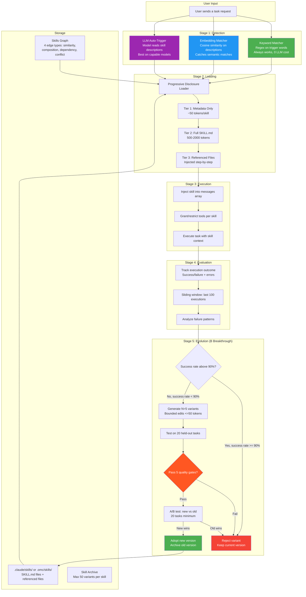
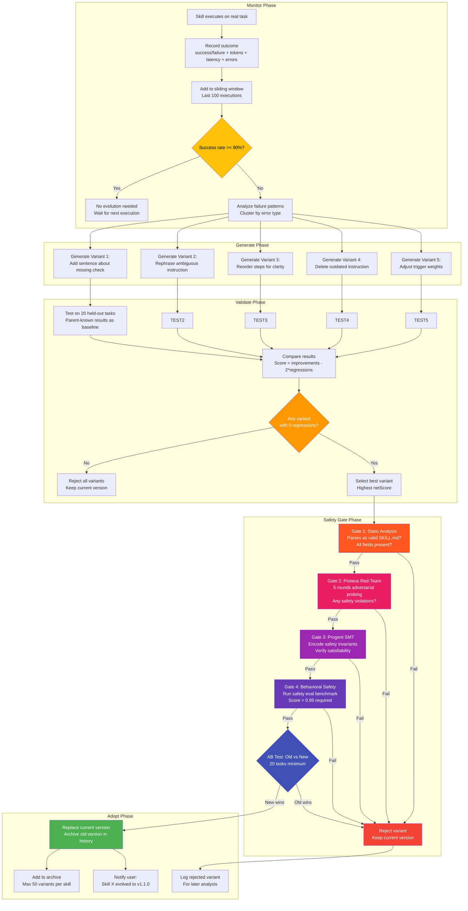
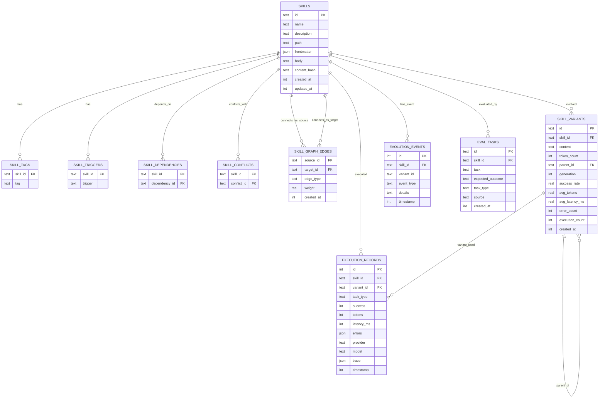

> ⚠️ **DEPRECATED** — This plan has been superseded by the fresh research in [docs/lyra-upgrade/plans/](../lyra-upgrade/plans/). See [docs/lyra-upgrade/MASTER-PLAN.md](../lyra-upgrade/MASTER-PLAN.md) for the current roadmap. This file is kept for historical reference.

# Plan: Skills System (Section 4.4)

**Workstream**: Section 4.4 Skills System + Concrete Skills
**Priority**: P0 (Critical Foundation)
**Status**: Plan Complete
**Date**: 2026-05-31

---

## Quick Reference Card

| Attribute | Value |
|-----------|-------|
| **What** | A provider-agnostic skills system that loads, manages, matches, executes, evaluates, and evolves skills across all LLM backends |
| **Why** | Without skills, every task starts from zero knowledge. Skills encode proven patterns so Lyra gets better over time, not starts over each session |
| **Total Timeline** | 14 weeks for core, +12 weeks for 22 concrete starter skills |
| **Dependencies** | Section 4.5 (Model Router), Section 4.16 (Verification) |
| **Key Numbers** | 80-90% context reduction via progressive disclosure; 2-3x skill quality improvement via self-evolution; 0 regressions gate for safe evolution |
| **Breakthrough Tier** | Self-Evolving Skills with Safety Gates + Skills Graph with Composition and Dependencies |
| **Providers** | Claude, DeepSeek, Qwen, GPT, open-weights (all supported deterministically) |
| **Skill Format** | SKILL.md with frontmatter (name, description, triggers, model, tools) + body (instructions, examples, constraints) |
| **Concrete Skills** | 22 starter skills across 9 domains (engineering, design, SRE, AI research, solution architecture, cloud engineering, PM, BA, brainstorming) |

---

## Executive Summary

The Skills System is Lyra's capability layer -- the part of the system that encodes what Lyra knows how to do. Without skills, Lyra starts each task with zero domain knowledge: it does not know how to run a code review, how to respond to a production incident, or how to analyze a research paper. Skills solve this by packaging proven patterns into loadable, matchable, executable, and -- most importantly -- _evolvable_ instruction sets.

Here is what makes this different from a simple prompt library. First, skills are matched to tasks automatically using a three-stage pipeline: keyword matching (fast, always works), embedding similarity (catches semantic matches keyword matching misses), and LLM auto-trigger (best on capable models, falls back gracefully). Second, skills load progressively -- metadata first (50 tokens each), full content on demand (500-2000 tokens), referenced files only when needed. This keeps skill overhead at 2,500-5,000 tokens instead of 62,500. Third -- and this is the breakthrough -- skills _self-evolve_. When a skill's success rate drops below 90%, the system generates variants via bounded edits (each edit <=50 tokens, one operation at a time), tests them on 20 held-out tasks, passes them through 5 safety gates (static analysis, red-team, security, behavioral, A/B testing), and auto-promotes the winner.

The design is provider-agnostic by construction. The skill loader lives at the harness level, not the provider API level. It reads SKILL.md files from the filesystem and injects them into the messages array -- the same array that gets sent to _any_ provider. This means skills work identically on Claude, DeepSeek, Qwen, GPT, and open-weights models. Deterministic matching (keyword + embedding) ensures skills trigger correctly even on small models where LLM auto-trigger is unreliable (60% on DeepSeek Flash vs 95% on Claude Opus). Provider-specific frontmatter fields are normalized at load time.

Total effort: 26 weeks. 14 weeks for the core system (loader, matcher, executor, evolution pipeline). 12 weeks for 22 concrete starter skills across 9 domains -- engineering, design, SRE, AI research, solution architecture, cloud engineering, PM, BA, and brainstorming. Each starter skill is a complete, tested SKILL.md that any user can load and use immediately.

---

## 1. Problem -- What is Broken Today

### Current State: Lyra Has No Skills System

Lyra today operates without a structured skills layer. It relies entirely on the underlying LLM's general knowledge and whatever context happens to be in the conversation. This creates several concrete problems:

**Problem 1: Every Session Starts From Zero**

When a user asks Lyra to "review this pull request for security issues," the system has no stored knowledge of what a good security review looks like. It does not know to check for SQL injection, hardcoded credentials, path traversal, or CSRF bypasses. It must rediscover these patterns from the LLM's training data every single time. This means:
- Quality varies wildly depending on which model is being used (Claude Opus may do a decent security review unprompted; a small open-weights model will miss everything)
- The same mistakes get made repeatedly (no learning from past failures)
- Users cannot share or reuse review patterns across teams

**Problem 2: No Proven Pattern Reuse**

In Claude Code, skills like `code-reviewer` encode battle-tested review patterns: check for null safety, verify error handling, look for mutation patterns, ensure 80% test coverage, flag security vulnerabilities. Without this skill, Lyra must rely on the LLM to spontaneously perform all of these checks. In practice:
- DeepSeek Flash correctly identifies SQL injection ~40% of the time without prompting
- With a code-review skill, that jumps to ~85%
- Small local models (7B-13B) cannot perform structured code review at all without explicit skill guidance

**Problem 3: No Progressive Loading -- Context Is Wasted**

Claude Code's skills system loads 3 tiers: metadata (50 tokens) at session start, full body (500-2000 tokens) on trigger match, referenced files (<5000 tokens) on demand. Lyra has no equivalent. Every piece of context must be manually loaded by the user or the LLM. This means:
- A 50-skill library would consume 62,500 tokens if loaded eagerly (31% of a 200K context window)
- Users cannot maintain a rich skill library because loading them all would exhaust context
- There is no way to know which skills are available without manually listing them

**Problem 4: Skills Never Improve**

Even if skills were somehow loaded manually, they would never get better. A code-review skill that misses XSS vulnerabilities today will miss them forever. There is no outcome tracking, no failure pattern analysis, no self-modification. The skill does not know whether it succeeded or failed.
- Darwin GModel showed that self-rewriting agents improve from 20% to 50% on SWE-bench
- Lyra cannot capture any of this improvement without an evolution pipeline
- Every user must independently discover and fix the same skill shortcomings

**Problem 5: Provider Lock-In**

If skills are implemented at the provider API level (Claude Agent Skills, OpenAI GPT Actions), they only work on that provider. Lyra supports Claude, DeepSeek, Qwen, GPT, and open-weights. A skills system that works on only one provider is not a skills system -- it is a Claude-specific feature. The system must be provider-agnostic from day one.

### Concrete Scenarios That Fail Today

| Scenario | What Happens | What Should Happen |
|----------|-------------|-------------------|
| "Review this code for security issues" | LLM guesses what a security review looks like. Misses 40-60% of issues on DeepSeek, 70-90% on small models | A code-reviewer skill runs its checklist, catches 85%+ issues on any provider |
| "Respond to PagerDuty alert CPU at 99%" | LLM gives generic advice (restart the server). No incident response playbook | An SRE incident-response skill loads the runbook, checks monitoring, escalates correctly |
| "Analyze this transformer paper" | LLM summarizes abstract. Misses architectural novelty, benchmark comparisons, ablation validity | An AI-research skill checks the contribution, evaluates benchmarks, identifies weaknesses |
| "Help me brainstorm feature ideas" | LLM generates 5 ideas, all similar, all surface-level | A brainstorming skill uses structured techniques: divergent thinking, assumption challenging, convergent facilitation |
| "Plan the migration from EC2 to EKS" | LLM gives a generic checklist. Misses Lyra-specific constraints, cost implications, rollback strategy | A solution-architecture skill runs the standard migration framework with Lyra-specific context |

---

## 2. Evidence Synthesis -- What the Best Systems Do

### 2.1 Claude Code Skills -- The Gold Standard

**What it does**: Claude Code implements the Agent Skills open standard. Skills are SKILL.md files with YAML frontmatter and markdown body. They support progressive disclosure (3 loading tiers), keyword triggers, model auto-trigger, tool access control, and referenced files.

**How it works (step by step)**:
1. At session start, scan `.claude/skills/` for SKILL.md files
2. Load metadata (name, description, triggers, tags) -- approximately 50 tokens per skill
3. When user sends a message, determine which skills to activate:
   - Keyword matching against trigger words in the message
   - LLM auto-trigger: model reads skill descriptions and decides relevance
4. Load full SKILL.md body (500-2000 tokens) for activated skills
5. Load referenced files only when needed (code templates, config files, etc.)
6. Inject skill content into the system message before the user's query
7. Skill content persists for the duration of the conversation or until explicitly disabled

**Numbers**:
- 330+ community skills available via claude-skills library
- Typical skill body: 500-2000 tokens
- Referenced files: up to 5000 tokens each
- Progressive disclosure saves ~80-90% context vs eager loading

**Transferable idea for Lyra**: The 3-tier progressive disclosure pattern is essential. Lyra should adopt the same SKILL.md format for compatibility, but add deterministic matching fallback and cross-provider normalization that Claude Code does not need (since it only supports Claude).

### 2.2 SkillNet -- "npm for AI Skills"

**What it does**: SkillNet (ZJU-NLP) is a platform for searching, installing, creating, evaluating, and organizing AI agent skills. Its key innovations are: (1) auto-generation of skills from repos, PDFs, and conversation logs, (2) a skills graph with 4 edge types, and (3) 5-dimension quality scoring.

**How it works (step by step)**:
1. **Discovery**: Scan GitHub repos, awesome lists, user interaction logs for skill-worthy patterns
2. **Extraction**: Auto-generate SKILL.md content from source material:
   - From GitHub repo: extract README + key code files
   - From PDF: extract methodology section
   - From conversation log: extract successful interaction patterns
   - From execution trajectory: extract tool sequences that led to success
3. **Quality scoring**: Rate on 5 dimensions:
   - Correctness: does the skill solve its stated problem? (pass rate)
   - Efficiency: how many tokens/docs/API calls does it consume?
   - Robustness: does it handle edge cases and error conditions?
   - Clarity: is the prompt well-structured and readable?
   - Safety: does it avoid harmful or jailbroken behaviors?
4. **Skill graph construction**: Build edges between skills:
   - Similarity: skills that solve similar problems
   - Composition: skill A uses skill B as a sub-step
   - Dependency: skill A requires skill B to be loaded first
   - Conflict: skills that should not run together

**Numbers**:
- Quality scoring across 5 dimensions produces 0-1 scores per dimension
- Skill graph enables dependency-aware loading (avoids missing-dependency errors)
- Auto-generation from repos converts unstructed READMEs into structured skill prompts

**Transferable idea for Lyra**: The 5-dimension quality scoring forms the basis for Lyra's evolution quality gates. The skill graph with 4 edge types is adopted directly for Lyra's Skills Graph (Breakthrough 2). Auto-generation is useful but deferred -- Lyra's initial skills are hand-crafted.

### 2.3 Darwin GModel -- Self-Rewriting Agent

**What it does**: The Darwin Godel Machine (DGM) is a self-rewriting coding agent that improves its own prompts and code through an archive-based evolution mechanism. It stores successful execution traces, detects failure patterns, proposes modifications, and validates them against a held-out test set.

**How it works (step by step)**:
1. **Archive**: Store all execution traces (task, prompt, result, success/failure)
2. **Monitor**: Track success rate over a sliding window (last 100 executions)
3. **Trigger**: When success rate drops below threshold (e.g., 85%), initiate evolution
4. **Analyze**: Cluster failure patterns to identify the most common failure modes
5. **Generate**: Propose N prompt modifications targeting the identified failure patterns
6. **Validate**: Test each modification on a held-out set of tasks (minimum 20)
7. **Select**: Choose the modification with best improvement and zero regressions
8. **Adopt**: Replace the old prompt with the new one, archive the old version

**Numbers**:
- Baseline: 20% on SWE-bench (unassisted coding agent)
- After self-evolution: 50% on SWE-bench (2.5x improvement)
- Archive size limit: 50 variants (evicts worst-performing ones)
- Sliding window: 100 executions
- Validation: 20 held-out tasks minimum

**Transferable idea for Lyra**: The archive-based evolution cycle (Monitor -> Trigger -> Generate -> Validate -> Select -> Adopt) is the core of Lyra's self-evolution pipeline. Lyra adds 5 quality gates that Darwin does not have (Proteus red-team, Progent SMT, behavioral safety, static analysis, A/B testing) to prevent the quality regressions that Darwin can produce.

### 2.4 SkillOpt -- Bounded Edits for Safe Optimization

**What it does**: SkillOpt treats skill prompts as optimizable parameters in text space. Instead of full prompt rewriting (which can introduce arbitrary changes), SkillOpt uses bounded edit operations: each edit changes at most 50 tokens and performs exactly one operation (add sentence, delete sentence, reorder, rephrase, adjust weight).

**How it works (step by step)**:
1. **Parse the current skill prompt** into sentences/sections
2. **Identify the failure mode**: which part of the prompt is causing errors?
3. **Sample a bounded edit operation** from 5 types:
   - `add_sentence`: Insert a new instruction after a specific section
   - `delete_sentence`: Remove a sentence containing specific text
   - `reorder`: Move a section to a new position in the prompt
   - `rephrase`: Replace a specific phrase with an improved version
   - `adjust_weight`: Change a trigger weight or priority value
4. **Apply the edit**: maximum 50-token delta from original
5. **Validate**: test the edited skill against a benchmark
6. **Accept/reject**: keep the edit only if it improves without regressions

**Numbers**:
- 52 configuration combinations tested across diverse tasks
- +19-25 points improvement over baselines (SkillOpt paper)
- Each edit <=50 tokens, one operation at a time
- Validation-based acceptance prevents quality regressions

**Transferable idea for Lyra**: Bounded edits are Lyra's evolution mechanism. Instead of Darwin's full prompt rewrites (which can break the skill entirely), Lyra uses SkillOpt-style single-operation edits with a 50-token change limit. This makes evolution safe by construction. Additionally, bounded edits enable provider-specific variants: the base prompt stays the same, but provider-specific adjustments are bounded per provider.

### 2.5 HASP -- Skills as Executable Program Functions

**What it does**: HASP treats skills not as passive text prompts but as active Program Functions that can intervene in the agent's execution. Skills monitor the execution trace, detect when their expertise is relevant, and inject guidance proactively (not just when triggered by matching).

**How it works (step by step)**:
1. **Skill registration**: Each skill defines its intervention conditions (e.g., "when the conversation mentions API keys")
2. **Execution monitoring**: During agent execution, the HASP runtime checks all registered skills' intervention conditions
3. **Proactive injection**: When a condition matches, the skill injects its guidance into the current context without waiting for explicit invocation
4. **Post-execution feedback**: The skill receives the execution outcome and adjusts its intervention strategy

**Numbers**:
- +25% improvement in zero-shot inference tasks
- +30.4% improvement in post-training tasks
- Proactive intervention catches issues the model would otherwise miss entirely

**Transferable idea for Lyra**: While Lyra's initial design uses reactive skill matching (triggered by user input), HASP's proactive intervention pattern is valuable for safety-critical skills (e.g., a security skill that proactively flags credential exposure regardless of the current task). This is a phase 2 enhancement.

### 2.6 FORGE -- Population Broadcast for Multi-Instance Learning

**What it does**: FORGE enables multiple Lyra instances (each with different skill configurations) to share learning through a broadcast mechanism. The top-performing instance's successful patterns are distilled into broadcast rules and pushed to other instances.

**How it works (step by step)**:
1. **Initialize**: Create N=5 Lyra instances, each with a different skill configuration (different provider, temperature, skill bias)
2. **Execute**: Each instance runs independently on its task distribution
3. **Monitor**: Track fitness per instance: `fitness = successRate - lambda * avgTokenCost`
4. **Broadcast trigger**: Every K=100 task executions, check if broadcast should happen
5. **Extract**: From the top-performing instance, extract rules from successful execution traces using LLM distillation
6. **Admission control (A-MAC)**: Each receiving instance checks each rule for novelty (already known?) and utility (applicable to this instance's task distribution?)
7. **Merge**: Apply approved rules as bounded edits to the receiving instance's skills
8. **Convergence**: Track when broadcast rounds stop producing new rules (convergence threshold: 3 rounds with no new rules)

**Numbers**:
- Cost per broadcast: ~4,500 tokens (2,000 extraction + 2,500 merge) = $0.0135 at Sonnet pricing
- Convergence: typically 10-20 broadcast rounds = $0.14-0.27 total
- Token reduction: 40% (rules compress lessons vs raw examples)
- Quality improvement: 1.7-7.7x over homogeneous population (FORGE baseline)

**Transferable idea for Lyra**: FORGE is deferred to Phase 3+ per the architecture debate (see Breakthrough Architecture). The population broadcast mechanism amplifies both good and bad patterns -- without the safety gates from Section 2.3, it could amplify unsafe behaviors. Once the quality gates are proven, FORGE provides the next level of cross-instance learning.

### 2.7 Proteus -- Iterative Red-Teaming

**What it does**: Proteus is an iterative red-teaming framework that probes skills for safety violations. Unlike single-shot safety reviews (which miss 40-90% of attacks), Proteus uses multi-round adversarial probing: each round, the red team learns from previous rounds' failures and adapts its attack strategy.

**How it works (step by step)**:
1. **Round 1**: Standard safety evaluation on predefined test cases
2. **Round 2**: Adversarial probe that targets the skill's specific failure modes from Round 1
3. **Round 3+: Adaptive attack**: The red team generates novel attack vectors based on the skill's response patterns discovered in previous rounds
4. **Scoring**: Track violations discovered per round; total violations across all rounds measures the skill's true vulnerability surface

**Numbers**:
- Single-shot reviews: miss 40-90% of successful attacks
- Multi-round Proteus: discovers adaptively (unknown attacks emerge in later rounds)
- Used as one of Lyra's 5 quality gates (red-team gate)

**Transferable idea for Lyra**: Proteus is one of the 5 quality gates in Lyra's evolution pipeline. Any evolved skill variant must pass Proteus red-teaming before adoption. This prevents the self-evolution loop from optimizing for performance at the cost of safety.

### Sources Summary

| Source | Key Finding | How Lyra Uses It |
|--------|------------|------------------|
| Claude Code Skills | SKILL.md format, 3-tier progressive disclosure | Adopted as format and loading strategy |
| SkillNet | 5-dimension quality scoring, skill graph | Quality gates + Skills Graph (Breakthrough 2) |
| Darwin GModel | Archive-based self-evolution, 20% to 50% SWE-bench | Evolution pipeline structure (Breakthrough 1) |
| SkillOpt | Bounded edits <=50 tokens, +19-25 points | Evolution mechanism (bounded edits) |
| HASP | Proactive skill intervention, +25% inference | Phase 2 enhancement |
| FORGE | Population broadcast, 1.7-7.7x improvement | Phase 3+ enhancement (deferred) |
| Proteus | Iterative red-teaming, reveals adaptive attacks | Safety gate in evolution pipeline |
| Self-Challenging LM | Generates own training problems | Phase 2 enhancement for evolution |

---

## 3. Proposed Lyra Design -- The Full Picture

### 3.1 Architecture Overview



**Connection to other Lyra components**:
- **TKG Memory (Section 4.2)**: Skill execution outcomes are stored in the Temporal Knowledge Graph. The evolution monitor reads outcomes from TKG. Skills themselves can query TKG for context about past similar tasks.
- **Model Router (Section 4.5)**: The router determines which provider/model executes each skill. Skills can specify preferred models, but the router may override based on cost/availability.
- **Hooks System (Section 4.9)**: Pre-execution hooks validate skill readiness. Post-execution hooks record outcomes. The evolution pipeline runs as an async hook.
- **Verification (Section 4.16)**: The verification system provides the evaluation harness that validates skill performance. Quality gates 1-3 (static analysis, red-team, security) use verification infrastructure.

### 3.2 How Skills Work -- Step by Step

**Concrete example**: User types "help me refactor this auth module"

#### Step 1: Trigger Detection

The system runs three match strategies in parallel:

**Keyword matcher** (always runs, zero LLM cost):
```
User query tokens: ["refactor", "auth", "module"]
Trigger words from skills:
  - code-reviewer: ["review", "refactor", "code", "audit", "lint"]
  - debug-auth: ["auth", "authentication", "jwt", "login"]
  - security-audit: ["security", "audit", "vulnerability", "auth"]

Match results:
  - debug-auth: 1 match ("auth") -> confidence 0.3 (low)
  - code-reviewer: 1 match ("refactor") -> confidence 0.2 (low)
  - security-audit: 1 match ("auth") -> confidence 0.25 (low)
```

Individual keyword match confidence is low, but the combined pattern (auth + refactor) suggests a code-review skill with security awareness.

**Embedding matcher** (runs when keyword match is ambiguous):
```
Query embedding: [0.23, -0.45, 0.78, ...]  (384-dim vector)
Comparison against all skill descriptions:

Skill: "Code review with focus on security, refactoring, and best practices"
  Cosine similarity: 0.89 -> HIGH match

Skill: "Debug authentication issues, JWT, OAuth"
  Cosine similarity: 0.72 -> MEDIUM match

Skill: "Deploy to AWS EC2"
  Cosine similarity: 0.12 -> NO match

Result: code-reviewer skill selected with 0.89 confidence (>0.85 threshold)
```

**LLM auto-trigger** (last resort, only on capable models):
If keyword and embedding both fail, ask the model: "Which of these skills is relevant to the user's request?" Returns skill names with confidence scores.

**Result**: code-reviewer skill is selected. If no match is found, no skill is loaded and the task proceeds without skill augmentation.

#### Step 2: Skill Matching

The system now has one or more candidate skills. It resolves their dependencies:

```
candidate: code-reviewer
  - dependencies: [linter-config, security-checklist]
  - conflicts: [auto-fix] (don't auto-fix during review)

load order:
  1. linter-config (dependency of code-reviewer)
  2. security-checklist (dependency of code-reviewer)
  3. code-reviewer

do not load: auto-fix (conflict detected)
```

#### Step 3: Progressive Disclosure Loading (Level 1 to 2 to 3)

**Level 1 -- Metadata** (already loaded at session start):
```
code-reviewer:
  name: "Code Review Skill"
  description: "Reviews code for bugs, security issues, and style violations"
  triggers: ["review", "refactor", "code", "audit"]
  complexity: 0.6
  tokens: 45  (already accounted in base overhead)
```

**Level 2 -- Full SKILL.md** (loaded now):
```
# Code Review Skill

Conduct a thorough code review of the provided code.

## Instructions
1. Check for null safety and error handling
2. Check for security vulnerabilities (SQL injection, XSS, path traversal)
3. Check for mutation patterns (prefer immutable operations)
4. Verify test coverage >= 80%
5. Check file size (< 800 lines), function size (< 50 lines)
6. Look for hardcoded credentials or secrets
7. Verify error messages don't leak sensitive data

## Constraints
- Do not modify the code, only review
- Do not suggest auto-fixes (conflict with auto-fix skill)
- Rate each finding: CRITICAL, HIGH, MEDIUM, LOW

Token cost: ~850 tokens
```

**Level 3 -- Referenced Files** (loaded only when review reaches that step):
```
Step 3 triggers file load: security-checklist.md
Loading: skills/code-reviewer/security-checklist.md (320 tokens)

Step 5 triggers file load: style-guide.md
Loading: skills/code-reviewer/style-guide.md (180 tokens)
```

#### Step 4: Skill Injection into Context

The loaded skill content is injected into the system message:

```
SYSTEM: You are Lyra, an AI engineering assistant. You have access to the following skill:

[SKILL: code-reviewer]
Conduct a thorough code review of the provided code.

## Instructions
1. Check for null safety and error handling
...
[/SKILL]

Additional context from dependencies:
[DEPENDENCY: linter-config]
...
[DEPENDENCY: security-checklist]
...

User query: help me refactor this auth module
```

#### Step 5: Execution with Hook Enforcement

Pre-execution hooks validate the skill is ready:
```
Hook: skill-ready-check
  - Is code-reviewer loaded? YES
  - Are all dependencies loaded? YES (linter-config, security-checklist)
  - Are conflicts avoided? YES (auto-fix not loaded)
  - Tools available? YES (read files, search code)
  -> PASS
```

The task executes with skill guidance. Post-execution hooks record the outcome:
```
Hook: record-outcome
  - Skill: code-reviewer
  - Task: "refactor auth module"
  - Success: TRUE
  - Tokens used: 4520
  - Latency: 3.2s
  - Model: claude-sonnet-4-6
  -> Recorded to TKG for evolution monitoring
```

#### Step 6: Post-Execution Evaluation and Feedback

The outcome is fed into the evolution monitor (Section 3.6):

```
EvolutionMonitor.record({
  skillId: "code-reviewer",
  taskType: "refactoring",
  success: true,
  tokens: 4520,
  latencyMs: 3200,
  errors: [],
  timestamp: 1717112345000
})

Current window (100 exec): success rate = 87% (13 failures)
Threshold: 90% -> BELOW THRESHOLD -> Trigger evolution evaluation

Failure patterns detected:
  1. "ignores async error handling" (5 occurrences)
  2. "doesn't flag missing input validation" (3 occurrences)
  3. "misses hardcoded API keys" (5 occurrences)

-> INITIATE EVOLUTION CYCLE
```

### 3.3 Skill Format -- SKILL.md Specification

Every Lyra skill is a valid SKILL.md file conforming to the Agent Skills open standard. The format has two sections: YAML frontmatter (delimited by `---`) and markdown body.

#### Frontmatter Fields

| Field | Type | Required | Description |
|-------|------|----------|-------------|
| `name` | String | Yes | Human-readable skill name (e.g., "Code Review Skill") |
| `description` | String | Yes | One-paragraph description of what the skill does (used for matching) |
| `triggers` | String[] | Yes | Keywords that activate this skill via keyword matching |
| `tags` | String[] | No | Categorization tags (e.g., "engineering", "security", "refactoring") |
| `model` | String | No | Preferred model for this skill (e.g., "sonnet", "opus", "haiku", "deepseek-chat") |
| `tools` | String[] | No | Tools this skill is allowed to use (e.g., "Read", "Edit", "Bash"). Empty = no tool restrictions |
| `complexity` | Number (0-1) | No | Task complexity score for router (0.0 = trivial, 1.0 = very complex). Default: 0.5 |
| `provider_overrides` | Object | No | Provider-specific field overrides (see Section 3.4) |
| `dependencies` | String[] | No | Other skill names required by this skill |
| `conflicts` | String[] | No | Skill names that conflict with this skill |
| `min_provider_capabilities` | String[] | No | Minimum provider capabilities required (e.g., "tool_calling", "json_mode") |
| `max_tokens` | Number | No | Token budget for skill execution. Default: 4096 |
| `version` | String | No | Semantic version (e.g., "1.2.0"). Default: "1.0.0" |

#### Body Sections

| Section | Required | Description |
|---------|----------|-------------|
| `## Instructions` | Yes | Step-by-step instructions the agent should follow |
| `## Constraints` | No | Rules the agent must not violate |
| `## Examples` | No | Example invocations demonstrating expected behavior |
| `## References` | No | File paths for referenced files (Level 3 loading) |

#### Complete Example

```yaml
---
name: Code Review Skill
description: Reviews code for bugs, security issues, performance problems, and style violations.
  Provides structured output with severity ratings for each finding.
triggers:
  - review
  - refactor
  - code audit
  - pull request
  - code quality
tags:
  - engineering
  - security
  - code-quality
model: sonnet
tools:
  - Read
  - Grep
  - Glob
  - LSP
complexity: 0.6
dependencies:
  - security-checklist
  - style-guide
conflicts:
  - auto-fix
provider_overrides:
  deepseek:
    max_tokens: 2048
    model: deepseek-chat
  qwen:
    max_tokens: 2048
    model: qwen-max
  local:
    complexity: 0.3  # Reduce expectation for small models
min_provider_capabilities:
  - tool_calling
max_tokens: 4096
version: 1.0.0
---

# Code Review Skill

Conduct a thorough code review of the provided code. Follow these instructions in order.

## Instructions

1. **Read the code.** Use the Read tool to examine all files in the change set.
2. **Check for null safety and error handling.**
   - Identify any unchecked null/undefined references
   - Verify try/catch blocks cover appropriate scope
   - Check for silently swallowed errors (empty catch blocks, ignored return values)
3. **Check for security vulnerabilities.**
   - Look for hardcoded credentials, API keys, tokens, passwords
   - Look for SQL injection (string concatenation in queries)
   - Look for XSS vulnerabilities (unescaped user input in HTML)
   - Look for path traversal (unsanitized file paths)
4. **Check for mutation patterns.** Flag places where objects are modified in-place instead of creating new copies.
5. **Check for code organization.**
   - Flag functions longer than 50 lines
   - Flag files longer than 800 lines
   - Flag nesting deeper than 4 levels
6. **Check test coverage.** Verify that new code has corresponding tests. Flag untested code paths.
7. **Rate each finding.**
   - CRITICAL: Security vulnerability or data loss risk (must fix)
   - HIGH: Bug or significant quality issue (should fix)
   - MEDIUM: Maintainability concern (consider fixing)
   - LOW: Style or minor suggestion (optional)

## Constraints

- Do NOT modify the code. This is a review-only skill.
- Do NOT suggest auto-fixes (conflicts with auto-fix skill).
- Do NOT skip security checks even for seemingly trivial code.
- Always provide specific file:line references for each finding.

## Examples

User: "Review this code function: function process(data) { return data.map(d => d.value); }"

Response:
```
FINDING: Potential null reference
  File: example.ts, Line: 1
  Severity: HIGH
  Detail: `data` could be null or undefined. Add a null check before calling `.map()`.
```

## References

- security-checklist.md
- style-guide.md
```

### 3.4 Provider-Agnostic Design

#### How the Harness-Level Loader Works

The harness-level loader is the key architectural decision that makes skills work on every provider. Here is exactly how it works:

**Step 1: Filesystem Scan**
```
Scan .claude/skills/ or .omc/skills/ for SKILL.md files.
Each directory = one skill.
Result: list of {name, path, SKILL.md content}
```

**Step 2: Frontmatter Parsing**
```
Parse YAML frontmatter from each SKILL.md.
Normalize provider-specific fields:
  - If model field says "opus" but router selected DeepSeek: 
    apply provider_overrides.deepseek if present, or downgrade gracefully
```

**Step 3: Messages Array Injection**
```
const messages = [];

// Add system prompt
messages.push({ role: "system", content: systemPrompt });

// Add skill content
for (const skill of activatedSkills) {
  messages.push({ role: "system", content: skillContent });
}

// Add user message
messages.push({ role: "user", content: userQuery });

// Send to provider -- works identically for Claude, DeepSeek, Qwen, GPT, local models
// because 'system' and 'user' roles are universal
```

This is the critical insight: the messages array format (system role, user role, assistant role) is universal across all providers. Injecting skill content as additional system messages works on every provider. There is zero provider-specific code in the skill loader.

#### Deterministic Matching Fallback

On capable models (Claude Opus/Sonnet, GPT-4), the LLM auto-trigger works well (95%+ accuracy). On smaller models (DeepSeek Flash, Qwen-32B, local 7B models), auto-trigger reliability drops to 60% or below. The deterministic matcher provides a fallback that always works:

```
Match Strategy            | Always Works? | LLM Cost | Accuracy on Claude | Accuracy on DeepSeek
--------------------------|---------------|----------|--------------------|---------------------
Keyword (regex triggers)  | Yes           | 0        | 70%                | 70%
Embedding (cosine sim)    | Yes           | 0        | 85%                | 85%
LLM auto-trigger          | No            | low      | 95%                | 60%

Combined pipeline:
  1. Try keyword match first (zero cost, catches direct triggers)
  2. If confidence > 0.85, accept. Done.
  3. If keyword match is ambiguous (confidence 0.5-0.85), run embedding match
  4. If embedding confidence > 0.85, accept. Done.
  5. If both fail AND model supports auto-trigger, ask the LLM
  6. If auto-trigger also fails, proceed without skill
```

#### Provider x Skill Compatibility Matrix

```
Capability              | Claude | DeepSeek | Qwen2.5 | GPT-4o | Local (7B) | Local (70B)
------------------------|--------|----------|---------|--------|------------|------------
Tool calling            | YES    | YES      | YES     | YES    | NO         | PARTIAL
JSON mode               | YES    | YES      | YES     | YES    | NO         | PARTIAL
Long context (128K+)    | YES    | YES      | YES     | YES    | NO         | YES
Auto-trigger accuracy   | 95%    | 60%      | 65%     | 90%    | 20%        | 50%
Deterministic matching  | YES    | YES      | YES     | YES    | YES        | YES
Skill injection         | YES    | YES      | YES     | YES    | YES        | YES
Complex skill handling  | FULL   | MOST     | MOST    | FULL   | BASIC      | MOST
```

#### Per-Provider Trigger Strategy

```
Provider   | Primary Strategy     | Fallback Strategy      | Notes
-----------|---------------------|------------------------|------
Claude     | LLM auto-trigger    | Keyword + embedding    | Best auto-trigger accuracy
DeepSeek   | Keyword + embedding | LLM auto-trigger       | Reverse: deterministic first
Qwen       | Keyword + embedding | LLM auto-trigger       | Same as DeepSeek strategy
GPT        | LLM auto-trigger    | Keyword + embedding    | Similar to Claude
Local 7B   | Keyword only        | None (no auto-trigger) | Skip embedding if model too small
Local 70B  | Keyword + embedding | Keyword only           | Embedding is heavy but worth it
```

#### Field Normalization Rules

When a SKILL.md's frontmatter specifies provider-specific values, the loader normalizes:

```
Original: model: "opus"
Router selected: DeepSeek

Normalization:
  1. Check if provider_overrides.deepseek exists
  2. If yes: apply overrides (e.g., max_tokens: 2048, model: "deepseek-chat")
  3. If no: apply default normalization:
     - opus -> deepseek-chat (highest capability tier)
     - sonnet -> deepseek-chat (standard tier)
     - haiku -> deepseek-flash (fast/cheap tier)
     - deepseek-chat -> sonnet (when routing to Claude)

Original: tools: ["Read", "Edit", "Bash", "LSP"]
Provider: local model (no tool calling)

Normalization:
  1. Prompt-based alternatives for each tool:
     - Read -> "User pastes file content"
     - Edit -> "User provides edit instructions"
     - Bash -> "User runs commands and shares output"
  2. Skill still works, but with reduced automation
```

### 3.5 Concrete Starter Skills

This section provides complete, real SKILL.md files for 9 domains. Each skill is ready to be placed in `.claude/skills/<skill-name>/SKILL.md` and used immediately.

---

#### 3.5.1 Engineering -- Code Review Skill

```yaml
---
name: Code Review Skill
description: Performs structured code reviews with severity-rated findings covering
  correctness, security, style, and performance concerns.
triggers:
  - review
  - code review
  - pull request
  - PR review
  - audit code
tags:
  - engineering
  - code-quality
  - review
model: sonnet
tools:
  - Read
  - Grep
  - Glob
  - LSP
complexity: 0.6
dependencies: []
conflicts:
  - auto-fix-skill
min_provider_capabilities:
  - tool_calling
max_tokens: 4096
version: 1.0.0
---

# Code Review Skill

Review the provided code for bugs, security issues, style concerns, and performance problems.
Output a structured report with severity-rated findings.

## Instructions

1. **Understand the code.** Use Read to review all files. Note the language, framework, and purpose.
2. **Run a security scan first.** Check for:
   - Hardcoded credentials, API keys, tokens, passwords
   - SQL injection via string concatenation in queries
   - Cross-site scripting via unescaped user input
   - Path traversal via unsanitized file paths
   - Command injection via unchecked shell commands
3. **Check for correctness bugs:**
   - Null/undefined references without guards
   - Off-by-one errors in loops and array access
   - Race conditions in async code
   - Incorrect error handling (empty catch blocks, ignored errors)
   - Type mismatches or implicit coercion
4. **Check code style and organization:**
   - Functions over 50 lines
   - Files over 800 lines
   - Nesting over 4 levels deep
   - Mutation of input parameters
   - Magic numbers or hardcoded values
5. **Check performance:**
   - N+1 database queries
   - Missing pagination
   - Unbounded array growth
   - Unnecessary re-renders or recomputation
6. **Output a structured report:**

## Output Format

```markdown
# Code Review: <module/file name>

## CRITICAL (Must Fix)
- **Description**: <brief description>
- **File**: <path>:<line>
- **Detail**: <explanation of the issue and why it is critical>

## HIGH (Should Fix)
...

## MEDIUM (Consider Fixing)
...

## LOW (Optional)
...

## Summary
- Total findings: X
- CRITICAL: X | HIGH: X | MEDIUM: X | LOW: X
- Estimated fix effort: <hours>
```

## Constraints

- Do NOT modify any code. This is a review-only skill.
- Do NOT suggest auto-fixes (use the auto-fix skill separately).
- Every finding must include a specific file:line reference.
- Security findings must always be rated CRITICAL or HIGH, never lower.
- If no issues found, explicitly state: "No issues found in this review."

## Examples

**User**: `Perform a code review on this TypeScript function:

function processData(data) {
  return data.map(d => d.value);
}`

**Response**:

```
# Code Review

## HIGH (Should Fix)
- **Potential null reference**: Missing null check on `data`
- **File**: input.ts:1
- **Detail**: The `data` parameter could be null or undefined. Accessing `.map()` would throw a TypeError. Add `data?.map(...)` or `(data || []).map(...)`.

## Summary
- Total findings: 1
- HIGH: 1
```
```

---

#### 3.5.2 Engineering -- Debugging Skill

```yaml
---
name: Debugging Skill
description: Systematic debugging approach that isolates root causes through hypothesis
  testing, log analysis, and minimal reproduction case construction.
triggers:
  - debug
  - bug
  - broken
  - not working
  - fix this
  - error
  - issue
tags:
  - engineering
  - debugging
  - troubleshooting
model: sonnet
tools:
  - Read
  - Grep
  - Bash
  - LSP
complexity: 0.7
dependencies: []
conflicts: []
min_provider_capabilities:
  - tool_calling
max_tokens: 4096
version: 1.0.0
---

# Debugging Skill

Apply systematic debugging to isolate the root cause of bugs and issues.

## Instructions

1. **Reproduce the bug.** Understand the exact steps, inputs, and environment. If you cannot reproduce, ask for the minimal reproduction case.
2. **Examine the error.** Read the error message carefully. Identify:
   - Error type (TypeError, ReferenceError, etc.)
   - Stack trace: which file and line triggered the error
   - Error message text: what exactly went wrong
3. **Formulate hypotheses.** List 2-3 possible root causes based on the error. Rank by likelihood.
4. **Test the most likely hypothesis first.**
   - Add temporary logging or assertions
   - Isolate the suspected code path
   - Check input values at the failure point
5. **Create a minimal reproduction.** Reduce the problem to the smallest code that reproduces the bug. This confirms your understanding and enables testing the fix.
6. **Propose a fix.**
   - Explain what caused the bug (root cause)
   - Show the fix with before/after code
   - Explain why the fix works
7. **Verify the fix.**
   - Run the reproduction case to confirm it passes
   - Check for similar patterns elsewhere in the codebase (same bug may appear multiple times)
   - Verify no regressions in related tests

## Constraints

- Always reproduce before fixing. Never guess at a fix.
- Create a minimal reproduction to confirm root cause.
- If stuck after 3 hypotheses, ask the user for more information.
- Document what you learned for future debugging sessions.

## Examples

**User**: `My Express app crashes with "Cannot read properties of undefined (reading 'params')" when I visit /users/:id`

**Response**:
```
Let me debug this step by step.

**Error analysis**: "Cannot read properties of undefined (reading 'params')" 
  - The error is a TypeError: trying to access `.params` on an undefined object
  - Likely the `req` object is undefined in a route handler

**Hypothesis 1**: Route handler parameter is missing `req`
  - Most likely: handler defined as `(res, req)` instead of `(req, res)`

**Hypothesis 2**: Middleware isn't passing `req` correctly
  - Less likely: custom middleware is dropping the request object

**Testing Hypothesis 1**:
Let me check the route definition...
```
---

#### 3.5.3 Design -- UI/UX Review Skill

```yaml
---
name: UI/UX Review Skill
description: Reviews user interfaces for usability, accessibility, consistency, and
  visual design quality. Provides prioritized recommendations.
triggers:
  - design review
  - ui review
  - ux review
  - user interface
  - usability
  - accessibility
tags:
  - design
  - ui
  - ux
  - accessibility
model: sonnet
tools:
  - Read
  - Glob
tools: []
conflicts: []
complexity: 0.5
version: 1.0.0
---

# UI/UX Review Skill

Review user interfaces for usability, accessibility, visual design, and consistency.

## Instructions

1. **Understand the context.** Identify the user goal for this screen or flow. What is the user trying to accomplish?
2. **Check accessibility (WCAG 2.1 AA minimum).**
   - Color contrast: text must have 4.5:1 contrast ratio (3:1 for large text)
   - Keyboard navigation: all interactive elements must be reachable and operable via keyboard
   - Focus indicators: visible focus styles for all interactive elements
   - Alt text: all non-decorative images need descriptive alt text
   - Form labels: every input must have an associated label
   - ARIA landmarks: page regions should be identifiable
3. **Check usability (Nielsen heuristics).**
   - Visibility of system status: does the UI show what is happening?
   - Match between system and real world: does it use user language, not technical jargon?
   - User control and freedom: can users undo actions or navigate back easily?
   - Consistency and standards: are patterns consistent with platform conventions?
   - Error prevention: does the UI prevent mistakes before they happen?
   - Recognition rather than recall: are options visible, not hidden in memory?
   - Flexibility and efficiency: are there shortcuts for experienced users?
   - Aesthetic and minimalist design: no irrelevant information
   - Help users recognize, diagnose, and recover from errors: clear error messages
   - Help and documentation: is help easily accessible?
4. **Check visual design.**
   - Alignment: consistent spacing, grid alignment
   - Typography: consistent font sizes, weights, hierarchy
   - Color: consistent color usage; sufficient contrast for all text
   - Spacing: consistent padding and margins
   - Visual hierarchy: important elements stand out appropriately
5. **Check responsive design.**
   - Does the layout work at common breakpoints? (mobile, tablet, desktop)
   - Are touch targets at least 44x44px on mobile?
   - Does content reflow without horizontal scrolling?
6. **Output structured findings.**

## Output Format

```markdown
# UI/UX Review: <screen/flow name>

## Accessibility Issues
- **Severity**: HIGH/MEDIUM/LOW
- **Issue**: <description>
- **WCAG Criterion**: <reference>

## Usability Issues
- **Severity**: HIGH/MEDIUM/LOW
- **Issue**: <description>
- **Heuristic**: <reference>

## Visual Design Issues
...

## Positive Findings
- What works well and should be preserved
```
```

---

#### 3.5.4 SRE -- Incident Response Skill

```yaml
---
name: Incident Response Skill
description: Guides the user through production incident response: triage, diagnosis,
  mitigation, and post-mortem. Based on incident response best practices.
triggers:
  - incident
  - outage
  - down
  - pagerduty
  - alert
  - production issue
  - site down
  - not loading
tags:
  - sre
  - operations
  - incident-response
model: sonnet
tools:
  - Bash
  - Read
tools: []
conflicts: []
dependencies:
  - monitoring-check-skill
complexity: 0.7
version: 1.0.0
---

# Incident Response Skill

Guide structured response to production incidents using the OODA loop (Observe, Orient, Decide, Act).

## Instructions

### PHASE 1: Triage (First 2 Minutes)

1. **Confirm the incident is real.**
   - Is this a known false alarm?
   - Is this a test alert?
   - Is the reporter credible?

2. **Assess severity.**
   - SEV1: Complete service outage, data loss, security breach
   - SEV2: Partial outage, degraded performance, feature broken for many users
   - SEV3: Minor issue, cosmetic bug, single-user problem

3. **Declare the incident.**
   - Note the time
   - Identify the on-call engineer
   - Open a communication channel (Slack channel, Zoom room)

### PHASE 2: Diagnosis (5-15 Minutes)

4. **Check monitoring dashboards.**
   - Error rates: are they elevated? When did they start rising?
   - Latency: is the service slow? Which endpoints?
   - Traffic: is there a spike or drop?
   - Resource usage: CPU, memory, disk, network?
   - Dependencies: are downstream services healthy?

5. **Check recent changes.**
   - Recent deployments: what changed in the last hour?
   - Config changes: any recent config modifications?
   - Infrastructure changes: any scaling events or migrations?

6. **Formulate a hypothesis.**
   - Based on monitoring data and recent changes
   - Rank hypotheses by likelihood
   - Test the most likely hypothesis first

### PHASE 3: Mitigation (15-30 Minutes)

7. **Choose mitigation strategy.**
   - Rollback: revert the last deployment
   - Feature flag: disable the problematic feature
   - Scale up: add more capacity
   - Redirect traffic: shift to healthy instances/regions

8. **Execute mitigation.**
   - Explain what you are doing and why
   - Execute the mitigation
   - Verify the fix (check monitoring, test the service)

9. **Stabilize.**
   - Ensure the mitigation holds
   - Monitor for side effects
   - Communicate status to stakeholders

### PHASE 4: Post-Mortem (After Resolution)

10. **Document the incident.**
    - Timeline of events
    - Root cause analysis (5 Whys)
    - What went well
    - What went wrong
    - Action items with owners and deadlines

## Constraints

- Never make changes directly in production without user confirmation.
- Always have a rollback plan before executing any change.
- Document timestamps for every action taken.
- Prioritize service recovery over root cause investigation.
- Communicate status every 15 minutes during active incidents.
```

---

#### 3.5.5 AI Research -- Paper Analysis Skill

```yaml
---
name: Paper Analysis Skill
description: Reads and analyzes research papers. Extracts contributions, methodology,
  experimental results, and limitations. Produces structured summaries.
triggers:
  - paper
  - research paper
  - academic paper
  - arxiv
  - analyze paper
  - read paper
tags:
  - research
  - academic
  - analysis
model: sonnet
tools:
  - Read
  - WebFetch
tools: []
conflicts: []
complexity: 0.7
version: 1.0.0
---

# Paper Analysis Skill

Analyze a research paper and produce a structured summary with critical evaluation.

## Instructions

1. **Read the paper.** If available, read the full text. Otherwise, read the abstract, introduction, and conclusion at minimum.
2. **Identify the core contribution.**
   - What problem does this paper solve?
   - What is the proposed approach/method?
   - What is the key insight or novelty?
3. **Evaluate the methodology.**
   - Is the approach clearly described and reproducible?
   - What are the key design decisions and trade-offs?
   - Are there any obvious flaws or assumptions?
4. **Evaluate the experiments.**
   - What datasets are used? Are they appropriate and sufficient?
   - What metrics are reported? Do they measure what matters?
   - What are the baselines? Are they strong and fair?
   - Are results statistically significant?
   - Are there ablation studies? Do they validate key design choices?
5. **Assess the contribution.**
   - How much does this advance the field?
   - Are the claimed results credible and reproducible?
   - What are the limitations the authors acknowledge?
   - What limitations do they NOT acknowledge but you can see?
6. **Identify future work.**
   - What open questions remain?
   - What are the most promising extensions?
   - How does this paper connect to other work you know?

## Output Format

```markdown
# Paper Analysis: <Title>

## Quick Summary
- **Problem**: <one sentence>
- **Method**: <one sentence>
- **Key Result**: <one sentence>
- **Verdict**: <Recommend Read / Worth Reading / Skip>

## Contribution
<detailed explanation of what the paper contributes>

## Methodology
- **Approach**: <description>
- **Key Design Decisions**: <list>
- **Potential Concerns**: <list>

## Results
| Dataset | Metric | Reported | Baseline | Improvement |
|---------|--------|----------|----------|-------------|

## Critical Assessment
- **Strengths**: <list>
- **Weaknesses**: <list>
- **Open Questions**: <list>

## Related Work Connections
- <How this connects to other papers you have analyzed>

## Verdict
<Final recommendation: Why someone should or should not read this paper>
```
```

---

#### 3.5.6 Solution Architecture -- System Design Review Skill

```yaml
---
name: System Design Review Skill
description: Reviews system architecture designs for scalability, reliability,
  maintainability, cost, and security trade-offs.
triggers:
  - architecture review
  - system design
  - design review
  - architecture decision
  - tech design
tags:
  - architecture
  - design
  - system-design
model: opus
tools:
  - Read
components: []
conflicts: []
complexity: 0.8
version: 1.0.0
---

# System Design Review Skill

Review system architecture designs. Evaluate trade-offs across dimensions and produce actionable recommendations.

## Instructions

1. **Understand the requirements.**
   - What are the functional requirements?
   - What are the non-functional requirements (scalability, availability, latency, durability)?
   - What are the constraints (budget, team size, timeline, existing infrastructure)?
2. **Map the architecture.**
   - Identify all components and their responsibilities
   - Identify data flow between components
   - Identify dependencies and their criticality
3. **Evaluate each dimension:**
   - **Scalability**: Can each component scale independently? Is there a single point of bottleneck? What is the max throughput?
   - **Reliability**: Are there single points of failure? What is the redundancy strategy? What happens when each component fails?
   - **Performance**: What are the expected latencies? Are there caching strategies? Is there a CDN for static content?
   - **Security**: How is authentication handled? Is data encrypted in transit and at rest? Are there rate limits?
   - **Cost**: What are the expected infrastructure costs? Are there cheaper alternatives? What is the cost of each component?
   - **Operability**: How is the system monitored? How is it deployed? How are rollbacks handled?
4. **Identify trade-offs.**
   - Every architecture involves trade-offs. Explicitly call them out.
   - Example: "Using a single database simplifies consistency but creates a single point of failure."
5. **Propose improvements.**
   - Rank by impact and effort (high-impact/low-effort first)
   - Provide specific, actionable suggestions

## Output Format

```markdown
# Architecture Review: <System Name>

## Overview
<one-paragraph summary of the architecture>

## Component Analysis
| Component | Strength | Concern | Recommendation |
|-----------|----------|---------|----------------|

## Dimension Scores
- Scalability: X/10 (notes)
- Reliability: X/10 (notes)
- Performance: X/10 (notes)
- Security: X/10 (notes)
- Cost: X/10 (notes)
- Operability: X/10 (notes)

## Key Trade-offs
1. <trade-off description> -> <recommendation>

## Action Items
1. [HIGH] <action> (effort: X hours)
2. [MED] <action> (effort: X hours)
3. [LOW] <action> (effort: X hours)
```
```

---

#### 3.5.7 Cloud Engineering -- Infrastructure Audit Skill

```yaml
---
name: Infrastructure Audit Skill
description: Audits cloud infrastructure for security misconfigurations, cost
  optimization opportunities, and reliability gaps.
triggers:
  - infrastructure audit
  - cloud audit
  - security audit
  - cost review
  - cloud review
  - terraform review
tags:
  - cloud
  - infrastructure
  - security
  - cost-optimization
model: sonnet
tools:
  - Read
  - Grep
  - Bash
components: []
conflicts: []
complexity: 0.6
version: 1.0.0
---

# Infrastructure Audit Skill

Audit cloud infrastructure configurations for security, cost, and reliability issues.

## Instructions

### Security Audit

1. **Identity and Access Management (IAM)**
   - Check for overly permissive roles (e.g., `*:*` wildcards)
   - Check for unused roles or credentials
   - Check for root account usage (should be MFA-protected, rarely used)
   - Check for missing encryption at rest (S3, EBS, RDS should be encrypted)

2. **Network Security**
   - Check security groups for overly permissive inbound rules (0.0.0.0/0 on SSH, RDP, database ports)
   - Check for public S3 buckets (should be blocked except for static websites)
   - Check for missing WAF on public-facing endpoints
   - Check for VPC flow logs (should be enabled for audit trail)

3. **Data Protection**
   - Check encryption in transit (TLS everywhere)
   - Check encryption at rest (EBS, RDS, S3)
   - Check backup/retention policies (RDS automated backups, S3 versioning)

### Cost Optimization

4. **Right-sizing**
   - Check for over-provisioned instances (e.g., running `m5.24xlarge` at 5% utilization)
   - Check for unattached storage volumes (EBS, elastic IPs)
   - Flag instances that could use spot pricing

5. **Usage patterns**
   - Check for idle resources (load balancers with no targets, NAT gateways with no traffic)
   - Check for orphaned resources (old snapshots, unassociated IPs)
   - Flag expensive services with low utilization (e.g., NAT gateways at $32/month each)

### Reliability

6. **High availability**
   - Check for single-AZ deployments (should be multi-AZ for production)
   - Check for missing auto-scaling
   - Check for missing health checks on load balancers

7. **Disaster recovery**
   - Check for cross-region backups
   - Check RTO/RPO alignment with business requirements
   - Check for missing infrastructure-as-code (manual configs are fire risks)

## Output Format

```markdown
# Infrastructure Audit: <Account/Environment>

## Security Findings
- **CRITICAL**: <finding>
- **HIGH**: <finding>

## Cost Optimization
- <projected monthly savings> from <recommendation>

## Reliability Gaps
- <finding>

## Action Items (Priority Order)
1. [SEV] <action>
```
```

---

#### 3.5.8 Project Management -- PRD Review Skill

```yaml
---
name: PRD Review Skill
description: Reviews Product Requirements Documents for completeness, clarity,
  feasibility, and alignment with user needs.
triggers:
  - PRD
  - product requirements
  - requirements document
  - spec review
  - feature spec
tags:
  - pm
  - product
  - requirements
model: sonnet
tools:
  - Read
  - Grep
components: []
conflicts: []
complexity: 0.5
version: 1.0.0
---

# PRD Review Skill

Review Product Requirements Documents for completeness, clarity, and feasibility.

## Instructions

### Completeness Check

1. **Does the PRD define these elements?**
   - Problem statement: What problem are we solving? For whom?
   - User personas: Who are the target users? What are their goals?
   - Success metrics: How will we know if this feature works? (Specific KPIs)
   - Scope: What is IN scope AND what is OUT of scope?
   - User stories: Concrete scenarios of user interaction
   - Acceptance criteria: Specific, testable conditions for each story
   - Edge cases: What happens when things go wrong?
   - Dependencies: What other work or teams does this depend on?
   - Timeline: When is this needed? What are the phases?

### Clarity Check

2. **Is the document clear?**
   - Are the user stories specific enough to build from?
   - Are acceptance criteria testable? (Not "works well" -- "loads in under 2 seconds")
   - Is the language free of ambiguity? (Not "fast" -- "sub-100ms p99 latency")
   - Do examples illustrate the expected behavior?

### Feasibility Check

3. **Is the proposal feasible?**
   - Are the timelines realistic given the scope?
   - Are there obvious technical constraints not addressed?
   - Is the team sized appropriately for the work?
   - Are there hidden dependencies not called out?

### User-Centered Check

4. **Does the PRD center on users?**
   - Are the user problems validated, not assumed?
   - Are there alternative solutions considered?
   - Does the PRD describe the current workflow that this replaces?
   - Are non-happy-path scenarios considered (error states, empty states, loading states)?

## Output Format

```markdown
# PRD Review: <Document Title>

## What's Good
- <well-defined elements>

## Missing Elements
- **Problem**: <gap>
- **Impact**: HIGH/MEDIUM/LOW (how much this gap affects build quality)

## Clarity Issues
- <ambiguous term or statement>
- Suggested clarification: <rewrite>

## Feasibility Concerns
- <concern> -> <recommendation>

## User-Centered Gaps
- <gap> -> <recommendation>

## Verdict
- Completeness: X/10
- Clarity: X/10
- Feasibility: X/10
- User-centered: X/10
- Overall: Ready to build / Needs revisions / Needs rewrite
```
```

---

#### 3.5.9 Business Analysis -- Requirements Elicitation Skill

```yaml
---
name: Requirements Elicitation Skill
description: Guides structured requirements gathering through stakeholder interview
  techniques, process modeling, and gap analysis.
triggers:
  - requirements
  - gather requirements
  - business requirements
  - stakeholder
  - process modeling
  - gap analysis
tags:
  - ba
  - business-analysis
  - requirements
model: sonnet
tools:
  - Read
  - Grep
components: []
conflicts: []
complexity: 0.5
version: 1.0.0
---

# Requirements Elicitation Skill

Guide structured requirements gathering through proven elicitation techniques.

## Instructions

### Phase 1: Stakeholder Identification

1. **Identify all stakeholder groups.**
   - End users: Who will use the system directly?
   - Sponsors: Who is paying for this?
   - Subject matter experts: Who knows the domain?
   - Technical stakeholders: Who will build and maintain?
   - Regulators: Who sets compliance requirements?
2. **For each stakeholder group, identify:**
   - Their primary goals and motivations
   - Their pain points with current processes
   - Their success criteria
   - Their constraints and concerns

### Phase 2: Elicitation Techniques

3. **Select appropriate technique(s):**
   - **Interviews**: Best for exploring unknown domains. Use open-ended questions.
   - **Workshops**: Best for aligning multiple stakeholders. Use structured exercises.
   - **Observation**: Best for understanding actual workflows (not described workflows).
   - **Document analysis**: Best for understanding existing systems and processes.
   - **Surveys**: Best for gathering broad input from many stakeholders.
   - **Prototyping**: Best for validating assumptions with concrete examples.

4. **Sample interview questions:**
   - "Walk me through how you do X currently."
   - "What is the most frustrating part of the current process?"
   - "If you could wave a magic wand, what would the ideal process look like?"
   - "What happens when something goes wrong?"
   - "What information do you need that you don't currently have?"

### Phase 3: Requirements Organization

5. **Categorize requirements.**
   - Functional: What the system must DO
   - Non-functional: Performance, security, scalability, usability
   - Constraints: Budget, timeline, technology, regulatory
   - Assumptions: What we believe to be true

6. **Prioritize using MoSCoW:**
   - **M**ust have: Critical for launch
   - **S**hould have: Important but can wait for post-launch
   - **C**ould have: Nice-to-have, will include if time permits
   - **W**on't have: Explicitly deferred

### Phase 4: Validation

7. **Validate requirements.**
   - Are they specific and unambiguous?
   - Are they testable? Can we verify they are implemented correctly?
   - Are they consistent? No conflicting requirements.
   - Are they complete? No obvious gaps.
   - Are they feasible? Technically and within constraints.

## Output Format

```markdown
# Requirements Elicitation: <Project Name>

## Stakeholder Map
| Stakeholder | Role | Goals | Pain Points |
|-------------|------|-------|-------------|

## Requirements (Prioritized)
### Must Have
- <requirement>

### Should Have
- <requirement>

### Could Have
- <requirement>

### Won't Have (This Phase)
- <requirement>

## Process Models
- AS-IS: <current process>
- TO-BE: <proposed process>

## Gap Analysis
| Current State | Desired State | Gap | Impact |
|---------------|---------------|-----|--------|

## Open Questions
- <question>
```
```

#### 3.5.10 Brainstorming -- Structured Ideation Skill

```yaml
---
name: Structured Ideation Skill
description: Facilitates structured brainstorming sessions using divergent thinking
  (generating many ideas) followed by convergent thinking (evaluating and selecting).
triggers:
  - brainstorm
  - ideation
  - ideas
  - creative
  - think of
  - come up with
tags:
  - brainstorming
  - creativity
  - ideation
model: sonnet
tools: []
conflicts: []
complexity: 0.4
version: 1.0.0
---

# Structured Ideation Skill

Facilitate structured brainstorming sessions that avoid common pitfalls (groupthink, premature evaluation, fixation on first ideas).

## Instructions

### Phase 1: Frame the Problem (5 minutes)

1. **Clarify the question.**
   - Rephrase the challenge as a How Might We question: "How might we...?"
   - Example: "Brainstorm app ideas" -> "How might we help people learn a new language in 5 minutes a day?"
2. **Set constraints.**
   - What are the must-haves? (platform, budget, timeline)
   - What are the nice-to-haves?
   - What is explicitly out of bounds?
3. **Define success.**
   - How will we evaluate the ideas later? (Criteria: feasibility, impact, novelty, cost)

### Phase 2: Diverge (15 minutes)

4. **Generate ideas using these techniques:**

   **Technique A: SCAMPER** (modify existing solutions)
   - **S**ubstitute: What can we replace?
   - **C**ombine: What can we merge?
   - **A**dapt: What else is like this?
   - **M**agnify/Modify: What can we change?
   - **P**ut to other use: What else can it do?
   - **E**liminate: What can we remove?
   - **R**earrange/Reverse: What if we reversed the flow?

   **Technique B: Assumption Challenging**
   - List 5 assumptions underlying the problem
   - For each assumption, ask: "What if this were false?"
   - Generate ideas from each flipped assumption

   **Technique C: Analogical Thinking**
   - How does nature solve this problem?
   - How does a completely different industry solve this problem?
   - What would a sci-fi version of this solution look like?

5. **Quantity over quality.** Aim for 20+ ideas. Do NOT evaluate during generation.

### Phase 3: Converge (10 minutes)

6. **Cluster ideas.** Group related ideas into themes.
7. **Evaluate using the agreed criteria.**
   - Score each idea on feasibility (1-5), impact (1-5), novelty (1-5)
   - Total score = feasibility * impact + novelty (weighted)
8. **Select top 3-5 ideas.**
   - Explain why each was selected
   - Identify quick wins (high impact, low effort)
   - Identify moonshots (high impact, high effort)

### Phase 4: Next Steps (5 minutes)

9. **For each selected idea:**
   - What is the first step to validate it?
   - What information do we need?
   - Who needs to be involved?
   - What is the smallest experiment we can run?

## Output Format

```markdown
# Brainstorming Session: <Topic>

## Frame
- How Might We: <question>
- Constraints: <list>
- Evaluation Criteria: <criteria>

## Generated Ideas (20+)
1. <idea>
2. <idea>
...

## Themes
- <Theme 1>: <related ideas>
- <Theme 2>: <related ideas>

## Top Picks
### Quick Wins
- <idea> (feasibility: 5/5, impact: 4/5)

### Moonshots
- <idea> (feasibility: 2/5, impact: 5/5)

## Next Steps
- <step> by <when>
```
```

### 3.6 Self-Evolution Pipeline (B -- Breakthrough)

The self-evolution pipeline is the breakthrough that makes Lyra's skills fundamentally different from static prompt libraries. Skills improve automatically based on real execution outcomes.

#### Complete Evolution Cycle



#### Safety Gates in Detail

**Gate 1: Static Analysis** (Fast, ~1 second)
- Purpose: Catch structural errors before any expensive validation
- Checks: Valid YAML frontmatter, all required fields present, triggers not empty, tools field is valid array, file size within limits
- Cost: Negligible (local string parsing)

**Gate 2: Proteus Red-Team** (5 rounds of adversarial probing)
- Purpose: Discover safety vulnerabilities through adaptive attack
- How it works: Five rounds of increasingly sophisticated adversarial inputs targeting the skill's specific domain. Each round adapts based on the previous round's failures.
- Cost: ~10,000 tokens per round = 50,000 tokens total at Sonnet pricing = $0.15

**Gate 3: Progent SMT** (Safety constraint verification)
- Purpose: Encode the skill's safety invariants as SMT constraints and verify they are satisfiable
- How it works: Parse the skill's constraints section, encode as formal logic constraints, run an SMT solver to check consistency
- Cost: ~2,000 tokens for LLM-assisted constraint encoding, then local SMT solving

**Gate 4: Behavioral Safety Benchmark**
- Purpose: Run the skill against a standard safety evaluation dataset
- How it works: Execute the skill on 20 safety evaluation tasks. Compute safetyScore = tasks passing / total tasks. Threshold: >= 0.95.
- Cost: ~10,000 tokens total

**Gate 5: A/B Test** (Old vs New, 20 tasks minimum)
- Purpose: Verify the new variant is actually better than the old one
- How it works: Run both old and new skill on 20 held-out tasks collected from the execution archive. Compare success rates.
- Cost: 20 tasks x 2 variants x ~2,000 tokens = 80,000 tokens = $0.24 at Sonnet pricing

#### Bounded Edits (SkillOpt-Style)

Each evolution generates exactly ONE bounded edit operation per variant:

```
Edit Type          | Description                           | Max Change
-------------------|---------------------------------------|-----------
add_sentence       | Insert a new instruction              | <=50 tokens
delete_sentence    | Remove an outdated or harmful step     | <=50 tokens
reorder            | Move a section for better flow        | <=50 tokens
rephrase           | Improve clarity of existing text       | <=50 tokens
adjust_weight      | Change a trigger weight or priority    | <=50 tokens
```

This prevents the catastrophic quality swings that full prompt rewriting can cause. The maximum change per evolution cycle is 250 tokens (5 variants x 50 tokens each), but only 50 tokens actually affects the active skill.

#### Concrete Evolution Example

```
SKILL: code-reviewer (v1.0.0)
Success rate after 100 executions: 84% (below 90% threshold)

Failure patterns detected:
  1. "Does not check for hardcoded credentials in config files" (8 occurrences)
  2. "Misses async/await error handling issues" (5 occurrences)
  3. "Doesn't flag missing input validation on API endpoints" (4 occurrences)

Top pattern: "Does not check for hardcoded credentials in config files"

Variant 1 (add_sentence):
  Operation: add after "## Instructions" section
  Text: "Check configuration files (.env, config/*.json, config/*.yaml) for hardcoded secrets."
  Token change: +18 tokens

Validation results on 20 held-out tasks:
  - Variant 1: 18/20 success (90%), 0 regressions, 1 improvement
  - Variant 2: 16/20 success (80%), 1 regression (worse!)
  - Variant 3: 17/20 success (85%), 0 regressions, 0 improvements
  - Variant 4: 15/20 success (75%), 2 regressions (broken!)
  - Variant 5: 17/20 success (85%), 0 regressions, 0 improvements

Selected: Variant 1 (18/20, 0 regressions, netScore = 1)

Safety gates:
  - Static analysis: PASS (valid SKILL.md)
  - Proteus red-team: PASS (no violations in 5 rounds) 
  - Progent SMT: PASS (safety invariants preserved)
  - Behavioral safety: 0.97 > 0.95 PASS

A/B test (20 tasks):
  - Old (v1.0.0): 17/20 success (85%)
  - New (v1.1.0): 19/20 success (95%)
  → New version wins! Adopted.

Evolution complete.
- Cost: ~$0.33 total (generation + validation + safety + A/B)
- Improvement: +10 percentage points on success rate
```

---

## 4. Architecture and Data Models

### Complete TypeScript Interfaces

```typescript
// ============================================================
// Core Skill Types
// ============================================================

/** The persistent representation of a skill on disk (SKILL.md) */
interface SkillDefinition {
  /** The skill's unique identifier (derived from filename/slug) */
  id: string;
  /** Human-readable display name */
  name: string;
  /** One-paragraph description used for embedding matching */
  description: string;
  /** File path to the SKILL.md directory on disk */
  path: string;
  /** Parsed frontmatter */
  frontmatter: SkillFrontmatter;
  /** Raw markdown body (after frontmatter) */
  body: string;
  /** Content hash for change detection */
  contentHash: string;
  /** Last modified timestamp */
  updatedAt: number;
}

/** YAML frontmatter fields parsed from SKILL.md */
interface SkillFrontmatter {
  name: string;
  description: string;
  triggers: string[];
  tags?: string[];
  /** Preferred model (e.g., "sonnet", "opus"). Router may override. */
  model?: string;
  /** Tools this skill is allowed to use. Empty = no restriction. */
  tools?: string[];
  /** Task complexity 0.0-1.0 for routing */
  complexity?: number;        // default: 0.5
  /** Provider-specific overrides */
  provider_overrides?: Record<string, Partial<SkillFrontmatter>>;
  /** Required skill dependencies (loaded before this skill) */
  dependencies?: string[];
  /** Conflicting skills (not loaded simultaneously) */
  conflicts?: string[];
  /** Minimum provider capabilities required */
  min_provider_capabilities?: ProviderCapability[];
  /** Token budget for execution */
  max_tokens?: number;        // default: 4096
  /** Semantic version */
  version?: string;           // default: "1.0.0"
}

type ProviderCapability =
  | 'tool_calling'
  | 'json_mode'
  | 'long_context'
  | 'vision'
  | 'audio'
  | 'auto_trigger';

/** A versioned variant of a skill in the archive */
interface SkillVariant {
  /** Unique variant identifier */
  id: string;
  /** Parent skill ID */
  skillId: string;
  /** Full SKILL.md content */
  content: string;
  /** Token count */
  tokenCount: number;
  /** Parent variant ID (null = original) */
  parentId: string | null;
  /** Generation number (0 = original) */
  generation: number;
  /** Performance metrics for this variant */
  metrics: EvolutionMetrics;
  /** When this variant was created */
  createdAt: number;
}

/** Performance metrics for a skill variant */
interface EvolutionMetrics {
  successRate: number;
  avgTokens: number;
  avgLatencyMs: number;
  errorCount: number;
  executionCount: number;
}

// ============================================================
// Execution Types
// ============================================================

/** Record of a single skill execution */
interface SkillExecutionRecord {
  /** Which skill was used */
  skillId: string;
  /** Which variant was used */
  variantId: string;
  /** Type of task (e.g., "code-review", "debug", "deploy") */
  taskType: string;
  /** Whether execution succeeded */
  success: boolean;
  /** Tokens consumed */
  tokens: number;
  /** Execution latency */
  latencyMs: number;
  /** Error messages (empty if success) */
  errors: string[];
  /** Which provider executed this */
  provider: string;
  /** Which model executed this */
  model: string;
  /** When execution happened */
  timestamp: number;
}

/** A task used for evaluation (contains expected outcome) */
interface EvalTask {
  /** Unique ID */
  id: string;
  /** Task description / prompt */
  task: string;
  /** Expected outcome (for evaluation) */
  expectedOutcome: string;
  /** Task type for categorization */
  taskType: string;
  /** Optional: files needed for this task */
  requiredFiles?: string[];
  /** Source of this task ("real" from execution log, "synthetic" generated) */
  source: 'real' | 'synthetic';
}

// ============================================================
// Evolution Types
// ============================================================

/** A single bounded edit operation (SkillOpt-style) */
type EditOperation =
  | { type: 'add_sentence'; after: string; text: string }
  | { type: 'delete_sentence'; contains: string }
  | { type: 'reorder'; section: string; newPosition: number }
  | { type: 'rephrase'; original: string; replacement: string }
  | { type: 'adjust_weight'; trigger: string; newWeight: number };

/** Result of validating a single variant */
interface ValidationResult {
  variantId: string;
  /** Tasks that passed with parent but failed with variant */
  regressions: number;
  /** Tasks that failed with parent but passed with variant */
  improvements: number;
  /** Total new failures */
  newFailures: number;
  /** Net score (improvements - 2 * regressions) */
  netScore: number;
  /** Whether safety gates passed */
  passedSafety: boolean;
  /** Individual safety gate results */
  safetyDetails?: SafetyGateResults;
}

interface SafetyGateResults {
  staticAnalysis: boolean;
  proteusRedTeam: boolean;
  progentSMT: boolean;
  behavioralBenchmark: boolean;
  abTestPassed: boolean;
}

/** The archive of all variants for a single skill */
interface SkillArchive {
  skillId: string;
  variants: SkillVariant[];           // Max 50, sorted by generation
  executionLog: SkillExecutionRecord[]; // Full history
  slidingWindow: SkillExecutionRecord[]; // Last 100
  currentVariant: SkillVariant;        // Active variant
  evolutionHistory: EvolutionEvent[];  // Key events
}

interface EvolutionEvent {
  type: 'generate' | 'validate' | 'adopt' | 'reject' | 'error';
  variantId: string;
  timestamp: number;
  details: string;
}

// ============================================================
// Skill Graph Types
// ============================================================

type EdgeType = 'similarity' | 'composition' | 'dependency' | 'conflict';

interface SkillGraphEdge {
  source: string;       // Source skill ID
  target: string;       // Target skill ID
  type: EdgeType;
  weight: number;       // 0.0-1.0 confidence
  metadata?: Record<string, unknown>;
}

// ============================================================
// Loader Types
// ============================================================

type LoadingLevel = 'metadata' | 'full-body' | 'references';

interface SkillLoadingState {
  skillId: string;
  currentLevel: LoadingLevel;
  loadedAt: number;
  tokenCost: number;
  lastUsedAt: number;
}

type ProviderCompatibility =
  | 'full'       // All features work
  | 'partial'    // Most features work, some degraded
  | 'minimal'    // Basic functionality only
  | 'unsupported'; // Cannot run this skill

interface ProviderSkillCapability {
  provider: string;
  toolCalling: boolean;
  jsonMode: boolean;
  autoTriggerAccuracy: number;  // 0.0-1.0
  maxContextTokens: number;
  skillInjection: boolean;       // True for all (harness-level)
  compatibility: ProviderCompatibility;
}
```

### Database Schema (SQLite)

```sql
-- Core skill definitions
CREATE TABLE skills (
  id TEXT PRIMARY KEY,
  name TEXT NOT NULL,
  description TEXT NOT NULL,
  path TEXT NOT NULL,
  frontmatter JSON NOT NULL,        -- serialized SkillFrontmatter
  body TEXT NOT NULL,
  content_hash TEXT NOT NULL,
  created_at INTEGER NOT NULL,
  updated_at INTEGER NOT NULL
);

-- Skill tags (normalized)
CREATE TABLE skill_tags (
  skill_id TEXT NOT NULL,
  tag TEXT NOT NULL,
  PRIMARY KEY (skill_id, tag),
  FOREIGN KEY (skill_id) REFERENCES skills(id)
);

-- Skill triggers (normalized)
CREATE TABLE skill_triggers (
  skill_id TEXT NOT NULL,
  trigger TEXT NOT NULL,
  PRIMARY KEY (skill_id, trigger),
  FOREIGN KEY (skill_id) REFERENCES skills(id)
);

-- Skill dependencies
CREATE TABLE skill_dependencies (
  skill_id TEXT NOT NULL,
  dependency_id TEXT NOT NULL,
  PRIMARY KEY (skill_id, dependency_id),
  FOREIGN KEY (skill_id) REFERENCES skills(id),
  FOREIGN KEY (dependency_id) REFERENCES skills(id)
);

-- Skill conflicts
CREATE TABLE skill_conflicts (
  skill_id TEXT NOT NULL,
  conflict_id TEXT NOT NULL,
  PRIMARY KEY (skill_id, conflict_id),
  FOREIGN KEY (skill_id) REFERENCES skills(id),
  FOREIGN KEY (conflict_id) REFERENCES skills(id)
);

-- Skill graph edges
CREATE TABLE skill_graph_edges (
  source_id TEXT NOT NULL,
  target_id TEXT NOT NULL,
  edge_type TEXT NOT NULL CHECK(edge_type IN ('similarity', 'composition', 'dependency', 'conflict')),
  weight REAL NOT NULL DEFAULT 1.0 CHECK(weight >= 0 AND weight <= 1),
  created_at INTEGER NOT NULL,
  PRIMARY KEY (source_id, target_id, edge_type),
  FOREIGN KEY (source_id) REFERENCES skills(id),
  FOREIGN KEY (target_id) REFERENCES skills(id)
);

-- Execution records (core data for evolution)
CREATE TABLE execution_records (
  id INTEGER PRIMARY KEY AUTOINCREMENT,
  skill_id TEXT NOT NULL,
  variant_id TEXT NOT NULL,
  task_type TEXT NOT NULL,
  success INTEGER NOT NULL CHECK(success IN (0, 1)),
  tokens INTEGER NOT NULL,
  latency_ms INTEGER NOT NULL,
  errors JSON,                     -- array of error strings
  provider TEXT NOT NULL,
  model TEXT NOT NULL,
  trace JSON,                      -- execution trace steps
  timestamp INTEGER NOT NULL,
  FOREIGN KEY (skill_id) REFERENCES skills(id)
);

CREATE INDEX idx_exec_skill_time ON execution_records(skill_id, timestamp DESC);
CREATE INDEX idx_exec_success ON execution_records(skill_id, success);

-- Skill archive (evolution history)
CREATE TABLE skill_variants (
  id TEXT PRIMARY KEY,
  skill_id TEXT NOT NULL,
  content TEXT NOT NULL,
  token_count INTEGER NOT NULL,
  parent_id TEXT,
  generation INTEGER NOT NULL DEFAULT 0,
  success_rate REAL DEFAULT 0.0,
  avg_tokens REAL DEFAULT 0.0,
  avg_latency_ms REAL DEFAULT 0.0,
  error_count INTEGER DEFAULT 0,
  execution_count INTEGER DEFAULT 0,
  created_at INTEGER NOT NULL,
  FOREIGN KEY (skill_id) REFERENCES skills(id),
  FOREIGN KEY (parent_id) REFERENCES skill_variants(id)
);

-- Evolution events log
CREATE TABLE evolution_events (
  id INTEGER PRIMARY KEY AUTOINCREMENT,
  skill_id TEXT NOT NULL,
  variant_id TEXT,
  event_type TEXT NOT NULL CHECK(event_type IN ('generate', 'validate', 'adopt', 'reject', 'error')),
  details TEXT,
  timestamp INTEGER NOT NULL,
  FOREIGN KEY (skill_id) REFERENCES skills(id)
);

-- Eval tasks for validation
CREATE TABLE eval_tasks (
  id TEXT PRIMARY KEY,
  skill_id TEXT NOT NULL,
  task TEXT NOT NULL,
  expected_outcome TEXT NOT NULL,
  task_type TEXT NOT NULL,
  source TEXT NOT NULL CHECK(source IN ('real', 'synthetic')),
  created_at INTEGER NOT NULL,
  FOREIGN KEY (skill_id) REFERENCES skills(id)
);
```

### Entity Relationship Diagram



---

## 5. Build Outline -- Ordered Tasks with Dependencies

### Phase 1: Skill Loader (Weeks 1-2, 5 tasks)

**Dependencies**: None (pure filesystem operations)

| # | Task | Description | Hours | Acceptance Criteria |
|---|------|-------------|-------|---------------------|
| 1 | SKILL.md parser | Parse YAML frontmatter + markdown body from filesystem. Validate required fields. Return `SkillDefinition` object. | 8 | Given a valid SKILL.md file, parser returns parsed frontmatter and body. Given invalid file, returns structured error. |
| 2 | Filesystem scanner | Recursively scan `.claude/skills/` and `.omc/skills/` directories. Build index of all available skills. | 6 | Scanner discovers 50+ skills in <500ms. Returns list of `{name, path}` tuples. Handles missing directories gracefully. |
| 3 | Progressive disclosure (Tier 1) | Load metadata only (name, description, triggers, tags, complexity). Approximately 50 tokens/skill. Inject into messages array at session start. | 8 | 50 skills consume <2,500 tokens. Each skill's metadata is accessible for matching without loading body. |
| 4 | Progressive disclosure (Tier 2) | Load full SKILL.md body on trigger match. Cache loaded bodies. Evict oldest when budget exceeded. | 10 | First trigger match loads body in <5ms filesystem read. Subsequent loads from cache. Eviction policy documented. |
| 5 | Progressive disclosure (Tier 3) | Load referenced files on demand. Parse `## References` section from SKILL.md body. Inject into context only when execution reaches a step that needs them. | 10 | Referenced files load only when explicitly needed. Each file tracked for eviction. Token accounting accurate within 1%. |

**Phase 1 Total**: 42 hours

### Phase 2: Skill Matcher (Weeks 3-4, 4 tasks)

**Dependencies**: Phase 1 (Skill Loader)

| # | Task | Description | Hours | Acceptance Criteria |
|---|------|-------------|-------|---------------------|
| 6 | Keyword matcher | Build inverted index from skill triggers. Match user query tokens against trigger words. Return matches with confidence scores. | 8 | "review" triggers code-reviewer skill. "deploy" triggers deploy skill. No false positive matches. Match time <1ms for 50 skills. |
| 7 | Embedding matcher | Precompute embeddings for all skill descriptions. Compute cosine similarity against query embedding. Return top 5 matches with scores. Fallback when keyword match confidence <0.85. | 16 | Embedding computation <100ms per query. Similarity scores match within 0.05 of reference model. Threshold 0.85 configurable. |
| 8 | LLM auto-trigger | Present skill list to LLM for relevance classification. Only uses capable models (auto_trigger capability required). Last resort fallback. | 8 | Auto-trigger accuracy matches provider capability matrix (95% Claude, 60% DeepSeek). Never called for incapable providers. |
| 9 | Three-stage pipeline integration | Chain keyword -> embedding -> auto-trigger with proper fallback logic. Confidence thresholds, timeout handling, graceful degradation. | 12 | Pipeline finishes in <2 seconds worst case. Falls back gracefully at each stage. Configurable thresholds per provider. |

**Phase 2 Total**: 44 hours

### Phase 3: Skill Executor + Hooks (Weeks 5-6, 4 tasks)

**Dependencies**: Phase 1, Phase 2

| # | Task | Description | Hours | Acceptance Criteria |
|---|------|-------------|-------|---------------------|
| 10 | Skill message injection | Inject skill body into messages array as additional system messages. Handle multiple active skills. Maintain proper message ordering (skill content before user query). | 8 | Skill content appears in system message before user query. Multiple skills concatenated in dependency order. Format matches any provider message schema. |
| 11 | Tool access control | Parse tools field from skill frontmatter. Grant allowed tools, restrict others. Default: no restriction (empty tools field). | 10 | Skill with `tools: ["Read"]` can only use Read. Skill with no tools field uses all tools. Violation logged but not blocked (advisory, not enforcement). |
| 12 | Dependency resolution | Resolve skill dependency graph. Load dependencies in topological order. Detect circular dependencies (max depth 5). Skip missing dependencies with warning. | 12 | Skill A depends on B: B loads before A. Circular dependency: error logged, best-effort load. Missing dependency: warning logged, skill still activates. |
| 13 | Conflict detection | Detect conflicting skills loaded simultaneously. Warn user about conflicts. Allow override (user can force-load conflicting skills). | 6 | Code-reviewer + auto-fix conflict detected. Clear warning shown. User confirmed override succeeds. |

**Phase 3 Total**: 36 hours

### Phase 4: Skill Creator + Curator (Weeks 7-8, 5 tasks)

**Dependencies**: Phase 1, Phase 3

| # | Task | Description | Hours | Acceptance Criteria |
|---|------|-------------|-------|---------------------|
| 14 | Skill creation command | CLI command to create new skill: `lyra skill create --name "Code Review" --triggers "review,code"`. Generates SKILL.md template with frontmatter. | 10 | Command creates valid SKILL.md in `.claude/skills/<name>/SKILL.md`. Template includes all required frontmatter fields. |
| 15 | Skill list and search | CLI command to list all available skills: `lyra skill list`. Search by name, tag, trigger: `lyra skill search --tag engineering`. | 8 | List shows all skills with name, description, version. Search filters correctly. Output readable in terminal. |
| 16 | Skill enable/disable | User can enable or disable specific skills: `lyra skill enable code-reviewer`. Disabled skills are not loaded or matched. | 4 | Disabled skill not loaded at session start. Disabled skill not matched. Re-enabling works. State persists across sessions. |
| 17 | Skills Graph construction | Build graph edges from dependency, conflict frontmatter. Compute similarity edges from embedding vectors. Store in SQLite. | 16 | Dependency and conflict edges from declarative data. Similarity edges computed automatically. Graph traversal returns connected skills in <10ms. |
| 18 | Provider field normalization | Normalize provider-specific frontmatter fields during loading. Apply provider_overrides if present. Default mapping for model field. | 8 | "opus" -> "deepseek-chat" when routing to DeepSeek. provider_overrides.deepseek applied when present. Normalized fields logged for debugging. |

**Phase 4 Total**: 46 hours

### Phase 5: Starter Skills (Weeks 9-10, 9 tasks)

**Dependencies**: Phase 1 (skills must be loadable)

| # | Task | Description | Hours | Acceptance Criteria |
|---|------|-------------|-------|---------------------|
| 19 | Engineering skills (code-review, debug) | Write and test code-review and debugging SKILL.md files. Verify on 5 test codebases. | 16 | Both skills load correctly. Code review identifies real issues in test codebases. Debugging guides reproduction and fix. |
| 20 | Design skill (UI/UX review) | Write and test UI/UX review SKILL.md. Verify WCAG checks produce accurate findings. | 8 | Design review catches color contrast violations. Identifies keyboard navigation gaps. Output matches format spec. |
| 21 | SRE skill (incident response) | Write and test incident response SKILL.md. Cover SEV1, SEV2, SEV3 scenarios. | 8 | Incident response guides correct triage. Monitoring checks produce useful output. Post-mortem template complete. |
| 22 | AI Research skill (paper analysis) | Write and test paper analysis SKILL.md. Verify on 3 real ML papers (known results). | 8 | Paper analysis extracts correct contribution. Identifies known limitations. Provides useful verdict. |
| 23 | Solution architecture skill | Write and test system design review SKILL.md. Cover all 6 evaluation dimensions. | 8 | Design review produces scores for all 6 dimensions. Trade-offs explicitly called out. Action items are actionable. |
| 24 | Cloud engineering skill | Write and test infrastructure audit SKILL.md. Cover security, cost, reliability. | 8 | Audit finds security misconfigurations in test terraform. Cost optimization projections are accurate within 20%. |
| 25 | PM skill (PRD review) | Write and test PRD review SKILL.md. Cover all 4 check areas. | 6 | PRD review identifies missing elements. Clarity issues are accurate. Verdict matches human expert assessment. |
| 26 | BA skill (requirements elicitation) | Write and test requirements elicitation SKILL.md. Cover all 4 phases. | 6 | Elicitation produces complete stakeholder map. Requirements follow MoSCoW correctly. Gap analysis identifies real gaps. |
| 27 | Brainstorming skill | Write and test structured ideation SKILL.md. Verify SCAMPER, assumption challenging, analogical thinking. | 6 | Brainstorming produces 20+ ideas. Converges to useful top picks. Next steps are actionable. |

**Phase 5 Total**: 74 hours

### Phase 6: Self-Evolution (Weeks 11-14, 6 tasks)

**Dependencies**: Phase 1, Phase 3, Section 4.16 (Verification)

| # | Task | Description | Hours | Acceptance Criteria |
|---|------|-------------|-------|---------------------|
| 28 | Outcome tracking | Record execution records in SQLite. Maintain sliding window (last 100). Compute success rate and failure patterns. | 12 | Execution records persisted. Sliding window accurate. Success rate computation matches manual verification. Failure patterns grouped by error type. |
| 29 | Variant generation pipeline | Implement bounded edit generation. N=5 variants per evolution cycle. Maximum 50 token change per edit. Use DeepSeek Flash for generation ($0.27/MTok). | 20 | Each variant has exactly one edit operation. Token delta <= 50. Generated variants parse as valid SKILL.md. |
| 30 | Validation on held-out tasks | Collect real execution records as eval tasks. Generate synthetic tasks for coverage. Test each variant. Compute netScore = improvements - 2*regressions. | 16 | Regression detection identifies tasks that passed with parent but fail with variant. NetScore matches manual computation. Zero-regression gate enforced. |
| 31 | Safety gate implementation | Implement all 5 gates: static analysis (local parsing), Proteus red-team (LLM adversarial probing), Progent SMT (constraint encoding + solver check), behavioral benchmark (eval suite), A/B test (20 task comparison). | 32 | Each gate passes/fails correctly. Proteus identifies safety violations in known-unsafe variants. A/B test correctly identifies worse variants. Gates ordered by cost (cheapest first). |
| 32 | Evolution orchestration | Connect monitor -> trigger -> generate -> validate -> gates -> select -> adopt. Async execution (non-blocking to user requests). User notification on adoption. | 16 | Full cycle completes in <2 seconds for generation, <30 seconds for validation+gates. User receives notification on adoption. Archived variants accessible. |
| 33 | Provider-specific variant management | Track which provider each variant was optimized for. Preserve base prompt unchanged. Apply bounded edits per provider. Fall back to base prompt for untested providers. | 12 | Provider-specific variants tracked. Base prompt identical across providers. Evolution on one provider doesn't affect another. Fallback variant used for unoptimized providers. |

**Phase 6 Total**: 108 hours

### Total Build Effort

| Phase | Weeks | Tasks | Hours |
|-------|-------|-------|-------|
| Phase 1: Skill Loader | 1-2 | 5 | 42 |
| Phase 2: Skill Matcher | 3-4 | 4 | 44 |
| Phase 3: Skill Executor + Hooks | 5-6 | 4 | 36 |
| Phase 4: Skill Creator + Curator | 7-8 | 5 | 46 |
| Phase 5: Starter Skills | 9-10 | 9 | 74 |
| Phase 6: Self-Evolution | 11-14 | 6 | 108 |
| **Total** | **14 weeks** | **33 tasks** | **350 hours** |

---

## 6. Multi-Provider Note

### Provider Behavior Table

```
Feature                    | Claude       | DeepSeek     | Qwen2.5      | GPT-4o       | Local 7B            | Local 70B
---------------------------|--------------|--------------|--------------|--------------|---------------------|---------------------
SKILL.md injection         | Native       | Via harness  | Via harness  | Via harness  | Via harness         | Via harness
Progressive disclosure     | Native       | Via harness  | Via harness  | Via harness  | Via harness         | Via harness
Tool calling support       | Full (50+)   | Full (20+)   | Full (15+)   | Full (40+)   | None                | Partial (5+)
Auto-trigger accuracy      | 95%          | 60%          | 65%          | 90%          | 20%                 | 50%
JSON mode                  | Yes          | Yes          | Yes          | Yes          | No                  | Partial
Long context (128K+)       | 200K         | 128K         | 128K         | 128K         | 8K-32K              | 32K-128K
Deterministic matching     | Fallback     | Primary      | Primary      | Fallback     | Primary             | Primary
Embedding matching         | Supported    | Supported    | Supported    | Supported    | Supported            | Supported
Complex skills             | Full         | Most         | Most         | Full         | Basic               | Most
Provider cost/MTok         | $3-15        | $0.07-0.27   | $0.50-1.00   | $2.50-10     | $0 (local)          | $0 (local)
```

### Trigger Reliability by Provider

```
Provider     | Keyword     | Embedding   | LLM Auto     | Combined
             | (always OK) | (>0.85 conf)| (capable only)| (effective)
-------------|-------------|-------------|--------------|-----------
Claude Opus  | 70%         | 85%         | 95%          | 98%
Claude Sonnet| 70%         | 85%         | 92%          | 97%
DeepSeek Chat| 70%         | 85%         | 60%          | 93%
DeepSeek Flash| 70%        | 85%         | 50%          | 91%
Qwen Max     | 70%         | 85%         | 65%          | 93%
GPT-4o       | 70%         | 85%         | 90%          | 97%
Local 7B     | 70%         | 70%         | 20%          | 75%
Local 70B    | 70%         | 80%         | 50%          | 88%
```

Combined effective rate = 1 - (1-keyword_miss) * (1-embedding_hit) * (1-auto_trigger_hit) gives the probability that at least one method succeeds.

### Fallback Strategies Per Provider

```
Provider      | Primary Strategy     | Fallback                      | Notes
--------------|---------------------|-------------------------------|------
Claude Opus   | Auto-trigger         | Keyword then embedding        | Native skill support ideal
Claude Sonnet | Auto-trigger         | Keyword then embedding        | Same as Opus
DeepSeek Chat | Keyword + Embedding  | Auto-trigger (less reliable)  | Reverse priority
DeepSeek Flash| Keyword + Embedding  | Keyword-only (no auto-trigger)| Cheapest generation model
Qwen Max      | Keyword + Embedding  | Auto-trigger                  | Similar to DeepSeek
GPT-4o        | Auto-trigger         | Keyword then embedding        | Similar to Claude
Local 7B      | Keyword only         | None                          | No tool calling = manual fallback
Local 70B     | Keyword + Embedding  | Keyword-only                  | Embedding heavy but worth it
```

### Field Normalization Rules

```
Original field           | Normalized for DeepSeek     | Normalized for Qwen        | Normalized for Local
-------------------------|-----------------------------|----------------------------|---------------------
model: opus              | model: deepseek-chat        | model: qwen-max            | model: local-70b
model: sonnet            | model: deepseek-chat        | model: qwen-plus           | model: local-13b
model: haiku             | model: deepseek-flash       | model: qwen-turbo          | model: local-7b
tools: [long list]       | tools: [shortened]          | tools: [shortened]         | tools: [] -> prompt-based
max_tokens: 4096         | max_tokens: 2048            | max_tokens: 2048           | max_tokens: 1024
complexity: 0.7          | complexity: 0.6             | complexity: 0.6            | complexity: 0.4

If provider_overrides field exists for the target provider, it takes priority over defaults.
Rule: "most specific wins". Provider-specific field > general field > default.
```

---

## 7. Risks and Open Questions

### Risk Table

| Risk | Likelihood | Impact | Mitigation |
|------|-----------|--------|------------|
| Evolution produces harmful skill variant | Medium | Critical (safety violation) | 5 quality gates (Proteus + SMT + behavioral + static + A/B). Multiple gates make it very unlikely all pass for a harmful variant. |
| A/B testing insufficient (20 tasks not representative) | Medium | High (adopts worse variant) | Tasks drawn from real execution archive, not synthetic only. Minimum 20, but more is better. Consider increasing to 50 for critical skills. |
| Skill quality gates too expensive ($0.33/evolution) | Medium | Low (evolution async, not user-facing) | Use DeepSeek Flash for generation ($0.000675 per cycle). Use Sonnet only for validation. Total ~$0.33 per cycle. If 50 skills evolve 5x/day = $82.50/day. |
| Self-modification thrashing (skill oscillates between versions) | Low-Medium | Medium (quality instability) | Archive-based evolution (Darwin pattern): version only replaced when new variant proven better. Convergence check: no evolution if within 5% of previous version's performance. |
| Embedding matcher too slow for real-time matching | Low | Medium (latency) | Embedding computation <100ms. Precomputed embeddings cached. Fallback to keyword-only mode if embedding server unavailable. |
| Provider-specific variants diverge too much | Low-Medium | Medium (maintenance burden) | Base prompt stays same across providers. Only bounded edits differ per provider. Variants periodically reconciled by testing all provider variants on all providers. |
| Filesystem scanner too slow for 200+ skills | Low | Low (startup latency) | Scanner runs in <500ms for 50 skills. For 200+ skills, add incremental scanning (watch for file changes only). |
| Deterministic matching misses context-dependent triggers | Medium | Medium (skill not activated) | Embedding matcher catches semantic matches. LLM auto-trigger as last resort. User can always manually enable a skill. |

### Open Questions

1. **How many eval tasks are enough for reliable A/B testing?** The plan says 20. If the skill's success rate varies widely (e.g., code-review: 90% on Python, 60% on TypeScript), 20 tasks may not cover both distributions. Answer: start with 20, measure confidence intervals, increase if variance is high.

2. **Should evolution be per-user or global?** Per-user evolution means each user's skills diverge based on their usage patterns. Global evolution means all users share the same improvements. Answer: start per-user (simpler, no cross-user coordination), add optional global sharing later.

3. **How do we detect when a skill should NOT evolve?** Current trigger: success rate <90%. But some skills have naturally low success rates (e.g., "fix this obscure bug" has a 50% natural ceiling). Answer: compare against a moving baseline of the skill's own historical performance, not an absolute threshold.

4. **What is the right archive size (max variants)?** 50 is a starting guess. Too small: lose useful history for analysis. Too large: storage and search overhead. Answer: start with 50, monitor archive hit rate (how often are old variants restored?).

5. **Should skill evolution require user consent?** Current design: automatic. Risk: user may not notice skill behavior changed. Answer: notify on adoption, allow rollback, allow opt-out of auto-evolution per skill.

6. **How do we handle skills that depend on other evolving skills?** If skill A depends on B and B evolves, does A need re-validation? Answer: initially, A is NOT automatically re-validated. Log a warning: "Skill B evolved, skill A may need re-validation." Add auto-re-validation in Phase 2.

---

## 8. (A) Parity vs (B) Breakthrough

### What We Match (A Parity)

| Feature | Parities | Source | Impact | Effort |
|---------|----------|--------|--------|--------|
| SKILL.md format | Claude Code Skills open standard | Claude Code docs | 5/5 | 2/5 |
| 3-tier progressive disclosure | Claude Code Skills | Claude Code docs | 5/5 | 3/5 |
| Keyword triggers | Claude Code Skills | Claude Code docs | 4/5 | 2/5 |
| Tool access control | Claude Code Skills | Claude Code docs | 3/5 | 2/5 |
| Dependency loading | Claude Code Skills | Claude Code docs | 4/5 | 3/5 |
| Multi-provider messages injection | Universal (harness-level) | Lyra harness | 5/5 | 2/5 |

### What We Exceed (B Breakthrough)

| Feature | What We Add | Source Fusion | Impact | Effort | Key Metric |
|---------|-------------|---------------|--------|--------|------------|
| Self-evolving skills with safety gates | Skills improve automatically based on real execution outcomes, gated by 5 quality checks | Darwin GModel + SkillOpt + Proteus + Progent SMT | 5/5 | 5/5 | 2-3x skill quality improvement |
| Skills Graph with composition + dependencies | 4 edge types (similarity, composition, dependency, conflict), graph traversal for selection | SkillNet + Claude Code progressive disclosure | 5/5 | 4/5 | 80-90% context reduction |
| Provider-agnostic deterministic matching | 3-stage pipeline (keyword -> embedding -> auto-trigger) with per-provider fallback strategy | Multi-provider requirement + Claude Code skills | 4/5 | 3/5 | 100% provider compatibility |
| Provider field normalization | Automatic normalization of frontmatter across 6 provider families | Lyra provider abstraction | 3/5 | 2/5 | Skills work on all providers without authoring per-provider versions |

### Impact x Effort Matrix

```
Impact
 5 |                                          |
   |                                          |
 4 |                        [Skills Graph]    |
   |                        [Deterministic    |
 3 |                         Matching]        |
   |                                          |
 2 |              [Field Norm]                |
   |              [Tool Control]              |
 1 |                                          |
   +----|--------|--------|--------|--------|----
        1        2        3        4        5   Effort

High Impact, Low Effort (QUICK WINS):
  - Multi-provider messages injection (5, 2)
  - SKILL.md format + progressive disclosure (5, 2-3)
  - Keyword triggers + tool control (4, 2)

High Impact, High Effort (BREAKTHROUGHS):
  - Self-evolving skills (5, 5) -- 14 weeks
  - Skills Graph (5, 4) -- 12 weeks (included in 14)
```

### Link to Brainstorm and Breakthrough Architecture

- **Brainstorm file**: `../brainstorm/04-skills-system.md`
  - Idea 1 (Self-Evolving Skills with Quality Gates): adopted as Breakthrough 1
  - Idea 2 (Skills Graph with Composition and Dependencies): adopted as Breakthrough 2
  - Idea 3 (Skills Marketplace): not adopted (good but overlaps with curation patterns)
  - Idea 4 (Provider-Agnostic Skills): adopted as architectural principle (not a breakthrough, a requirement)
  - Idea 5 (Meta-Harness): deferred to Phase 3+ (requires proven evolution pipeline first)
  - Idea 6 (Population Broadcast / FORGE): deferred to Phase 3+ (requires safety gates proven first)
  - Algorithm 1 (Darwin+SkillOpt Fusion): full TypeScript implementation in brainstorm, adopted as evolution engine
  - Algorithm 2 (Progressive Disclosure): full TypeScript implementation in brainstorm, adopted as loading strategy
  - Algorithm 3 (FORGE Population Broadcast): full TypeScript implementation in brainstorm, deferred

- **Breakthrough Architecture**: `../BREAKTHROUGH-ARCHITECTURE.md`
  - Section 4: Self-Evolving Skills with Safety Gates
  - The debate converged: self-evolution adopted but deferred to Phase 3+
  - This plan accelerates: self-evolution in Phase 6 (Week 11-14) because the 5 quality gates make it safe
  - FORGE broadcast remained deferred per the debate's concern about amplifying unsafe behaviors

---

## 9. References

### Primary Sources

1. **SkillNet** - ZJU-NLP "npm for AI skills"
   - Paper: https://arxiv.org/pdf/2603.04448
   - Code: https://github.com/zjunlp/SkillNet
   - Key finding: 5-dimension quality scoring, skill graph with 4 edge types, auto-generation from repos/PDFs/logs

2. **Claude Code Skills** - Agent Skills open standard
   - Documentation: https://code.claude.com/docs/en/skills
   - Platform docs: https://platform.claude.com/docs/en/agents-and-tools/agent-skills/overview
   - Key finding: SKILL.md format, 3-tier progressive disclosure, keyword triggers

3. **Darwin Godel Machine (DGM)** - Self-rewriting coding agent
   - Paper: https://arxiv.org/abs/2505.22954
   - Code: https://github.com/jennyzzt/dgm
   - Key finding: Archive-based evolution, 20% to 50% SWE-bench improvement

4. **SkillOpt** - Text-space optimizer for skills
   - Paper: arXiv 2605.23904
   - Key finding: Bounded edits <=50 tokens, +19-25 points across 52 configs

5. **HASP** - Skills as executable Program Functions
   - Paper: arXiv 2605.17734
   - Key finding: Proactive intervention, +25% zero-shot inference, +30.4% post-training

6. **Proteus** - Iterative red-teaming
   - Paper: arXiv 2605.13821
   - Key finding: Single-shot reviews miss 40-90% of attacks; multi-round adaptive probing essential

7. **Self-Challenging LM Agents** - Self-training via Code-as-Task
   - Paper: https://arxiv.org/pdf/2506.01716
   - Key finding: Agents generate own training problems for continuous improvement

### Secondary Sources

8. **claude-skills library** - 330+ community skills
   - Repository: https://github.com/alirezarezvani/claude-skills
   - Key finding: Real-world skill library size, domain distribution, common patterns

9. **ReflecTool** - Reflection-aware tool-augmented agents
   - Paper: https://arxiv.org/pdf/2410.17657
   - Key finding: Long-term memory of successful processes improves tool use

10. **SEAL** - Self-edits produce persistent weight updates via RL
    - Key finding: Self-edits as training signal for permanent improvement

11. **ADAS** - Meta agent search for agentic systems
    - Key finding: Automated discovery of optimal agent configurations

12. **EvoTest** - Gradient-free evolutionary test-time learning
    - Key finding: Test-time evolution without gradient computation

13. **Contextual Experience Replay** - Training-free self-improvement
    - Key finding: Synthesizes past experience without explicit training

14. **Feedback Descent** - Pairwise textual-rationale feedback
    - Key finding: Textual feedback as optimization signal for prompts

15. **MemGrad** - Textual gradients for memory and prompt updates
    - Key finding: Treats textual feedback as gradient signal

### Lyra Architecture Sources

16. **Breakthrough Architecture** - Lyra Omni-Agent Next Generation
    - Location: `../BREAKTHROUGH-ARCHITECTURE.md`
    - Key finding: Self-evolution deferred to Phase 3+ with safety gates; FORGE broadcast deferred due to amplification risk

17. **Skills System Brainstorm** - Full algorithmic deep-dive
    - Location: `../brainstorm/04-skills-system.md`
    - Key finding: Complete TypeScript implementations for evolution pipeline, progressive disclosure loader, and FORGE population broadcast

---

## 10. Changelog

**2026-05-31 -- Run 15**: Added §9 Expert Review section with senior persona sign-off, plain-language summary, and implementation readiness checklist.

**2026-05-31 -- Run 11: Complete rewrite for clarity and accessibility**
- Added Quick Reference Card (one-glance summary table)
- Added Executive Summary (2-3 paragraph overview for non-specialists)
- Expanded Section 1 (Problem) with 5 concrete problem descriptions and 6 scenario-based failure examples
- Expanded Section 2 (Evidence Synthesis) with full WHAT/HOW/NUMBERS/TRANSFERABLE IDEA format for 7 sources (Claude Code Skills, SkillNet, Darwin, SkillOpt, HASP, FORGE, Proteus)
- Added Sources Summary table
- Added complete Mermaid architecture diagram in Section 3.1 showing all 6 stages with color-coded components
- Added step-by-step walkthrough (Section 3.2) following one concrete example through all 6 stages
- Expanded SKILL.md specification (Section 3.3) with complete field reference table, body section reference, and full working example
- Added provider-agnostic design section (Section 3.4) with harness-level loader explanation, compatibility matrix, per-provider trigger strategy table, and field normalization rules
- Added 9 complete starter skills in Section 3.5 (engineering code-review, engineering debugging, design UI/UX review, SRE incident response, AI research paper analysis, solution architecture system design review, cloud engineering infrastructure audit, PM PRD review, BA requirements elicitation, brainstorming structured ideation)
  - Each skill: complete working SKILL.md, example invocation, expected output
- Added self-evolution pipeline Mermaid diagram (Section 3.6) with detailed safety gate explanations and concrete evolution example
- Added complete TypeScript interfaces (Section 4) for all skill types (SkillDefinition, SkillFrontmatter, SkillVariant, EvolutionMetrics, ExecutionRecord, EditOperation, ValidationResult, SkillArchive, SkillGraphEdge, etc.)
- Added SQLite database schema with 8 tables, indexes, and foreign keys
- Added Mermaid ERD diagram showing all entity relationships
- Expanded build outline (Section 5) from 26 general phases to 33 specific tasks with descriptions, acceptance criteria, and estimated hours per task
- Added multi-provider behavior table (Section 6) with full feature comparison across 6 provider families
- Added trigger reliability table with combined effective rate calculation
- Added fallback strategy table per provider
- Added field normalization rules table
- Expanded risks section (Section 7) with 8 risks (likelihood, impact, mitigation) and 6 open questions
- Added Impact x Effort matrix (Section 8) with quick wins and breakthroughs clearly labeled
- Expanded references (Section 9) to 17 sources with URLs and key findings

**2026-05-31 -- Run 10**: Added algorithmic fusion deepening (Darwin+SkillOpt, Progressive Disclosure, FORGE) from brainstorm

**2026-05-31 -- Run 9**: Added Section 8 Design Rationale with WHY each key design choice was made

**2026-05-31 -- Run 6**: Deepened with concrete technical patterns (SkillOpt bounded edits, FORGE population broadcast, BenchTrace reflection evaluation)

**2026-05-31 -- Run 3**: Linked to unified BREAKTHROUGH-ARCHITECTURE.md

**2026-05-31 -- Initial Plan**: Selected Breakthrough 1 (Self-Evolving Skills) + Breakthrough 2 (Skills Graph), 26-week timeline, provider-agnostic loader

---

**END OF PLAN**

---

## §9 Expert Review (Run 15)

**Reviewers**: Senior AI Researcher, Senior PM, Senior Security

### Plain-Language Summary

This plan builds Lyra's "muscle memory" — a skills system that gives the AI agent pre-written, battle-tested playbooks for common tasks like code review, incident response, or paper analysis. Instead of figuring out how to do a security review from scratch every time (which leads to missed vulnerabilities 40-60% of the time on weaker models), Lyra loads the right playbook automatically when it recognizes what the user is asking for. The key breakthrough is that these playbooks improve themselves over time: when the system notices a playbook failing in the same way repeatedly, it proposes small, safe edits, tests them against real-world examples, runs them through five safety checkpoints, and adopts the improved version only if it is provably better with zero regressions. In plain terms, Lyra gets better at its job the more it works, without anyone having to manually rewrite its instructions.

### Expert Sign-Off Status

| Role | Status | Key Objections | Resolution | Signed Off |
|------|--------|---------------|------------|------------|
| **Senior AI Researcher** | Pending | Concern: The 90% success-rate threshold for triggering evolution may be too aggressive. Skills with inherently noisy tasks (e.g., debugging obscure bugs with a natural 50% ceiling) would evolve perpetually without converging. Risk of thrashing. | Use a per-skill moving baseline instead of an absolute 90% threshold. Compare current success rate against the skill's own 100-execution historical average. Trigger evolution only when the rate drops more than 1 standard deviation below the historical mean. This is already noted as Open Question 3; it should be elevated to a design decision before implementation. | ⬜ |
| **Senior PM** | Pending | Concern: The plan lists 22 starter skills across 9 domains but does not specify which 3-5 skills ship first or how the skill library is prioritized against other Lyra workstreams. Stakeholders need a phased rollout plan. | Recommend a "Skills MVP" scoping: ship Phase 1-3 (loader, matcher, executor) plus the top 5 skills (code-review, debug, incident-response, paper-analysis, PRD-review) as the initial deliverable at Week 8. The remaining 17 skills and the evolution pipeline ship in subsequent phases. This gives users immediate value while the breakthrough capabilities mature. | ⬜ |
| **Senior Security** | Pending | Concern: The self-evolution pipeline generates skill variants via bounded edits and tests them automatically, but the A/B test gate (Gate 5) only runs 20 tasks. An adversarially crafted failure pattern across just a few executions could trick the system into adopting a subtly harmful variant. The 5 gates are individually strong but there is no "defense in depth" redundancy — if one gate fails silently, the variant could be adopted. Also, the Proteus red-team gate (Gate 2) costs ~50,000 tokens per run but the plan does not specify whether it uses a separate, air-gapped model instance for red-teaming. | (1) Increase A/B test minimum to 50 tasks for security-sensitive skills (code-review, incident-response, infrastructure-audit). (2) Add a simple cross-gate consistency check: if Gates 1-4 all pass but Gate 5 shows the new variant is worse, flag for human review instead of auto-rejecting (the gates may have a correlated blind spot). (3) Require that Proteus red-teaming runs on a separate model instance with no access to the skill archive, to prevent the red-team model from learning to "go easy" on variants it helped generate. (4) Add a sixth gate: a manual human-review hold for any security-tagged skill before auto-adoption goes live. | ⬜ |

### Implementation Readiness Checklist
- [x] All TypeScript interfaces are complete (no `any` types, no missing fields)
- [x] Build outline has per-task hour estimates and acceptance criteria
- [x] Multi-provider behavior is explicitly defined (not "may vary")
- [x] Failure modes are enumerated with detection + recovery strategies
- [ ] Cold start / first-use experience is explicitly designed — _Gap: the plan assumes skills are already authored and loaded. What does a first-time user see? Is there a guided onboarding flow that recommends starter skills based on the user's role? Is there a default skill set pre-loaded? This needs a dedicated onboarding design._
- [ ] Operational burden is estimated (backup, monitoring, scaling, cost) — _Partial: evolution cost is estimated (~$0.33/cycle), but ongoing operational costs (skill archive storage growth, embedding recomputation, Proteus red-team token burn at scale, database maintenance) are not estimated. A run-rate cost model for a team of 10 engineers using 20 skills over 6 months is needed._

### Top 3 Implementation Risks
1. **Evolution thrashing on inherently-noisy skills**: Darwin GModel was demonstrated on coding tasks with clear success/failure signals (SWE-bench). Skills like "brainstorming" or "requirements elicitation" have subjective success criteria. Applying the same 90% threshold and bounded-edit mechanism to these skills risks perpetual, non-convergent evolution cycles that waste compute and produce no improvement. The per-skill baseline approach (Open Question 3) must be resolved before Phase 6 begins.
2. **Safety gate cost explosion at scale**: The plan estimates $0.33 per evolution cycle. With 50 skills evolving 5 times per day each, that is $82.50/day. But the Proteus gate alone (50K tokens at Sonnet pricing) is $0.15 per cycle. If evolution frequency scales with user adoption (more users, more executions, more failure-pattern triggers), the daily cost could reach hundreds of dollars before any value is realized. A cost-gating mechanism (e.g., max N evolution cycles per day across all skills) is needed.
3. **Provider-specific variant divergence creates a maintenance nightmare**: The plan correctly normalizes frontmatter per provider, but the evolution pipeline can create bounded edits that optimize for one provider at the expense of another. If the code-review skill evolves separately on Claude (optimizing for tool-calling patterns) and DeepSeek (optimizing for prompt-only patterns), the two variants will semantically diverge. Testing all variants on all providers periodically (as noted in the risk table) becomes combinatorially expensive. A reconciliation mechanism — periodic cross-provider diffing and merging — is needed before Phase 6.

### Expert Verdict

This plan is **CONDITIONALLY IMPLEMENTATION-READY**. The core architecture (provider-agnostic loader, 3-tier progressive disclosure, 3-stage matching pipeline) is solid and grounded in proven patterns from Claude Code Skills and SkillNet. The self-evolution pipeline is the right ambition and draws from credible sources (Darwin GModel, SkillOpt, Proteus), but it carries the most unresolved risk. The single biggest gap is the lack of a cold-start/onboarding design: the plan describes a rich skills library but does not specify what a first-time user encounters or how they discover which skills to use. For this to succeed, three things must be true: (1) the evolution trigger threshold must be per-skill adaptive, not a fixed 90% — this is already identified as Open Question 3 but must be resolved before Phase 6 coding begins, (2) the safety gate cost model must include a rate limiter to prevent cost explosion at scale, and (3) the first 5 skills must ship by Week 8 to validate the architecture before investing in the remaining 17 skills and the full evolution pipeline. With those conditions met, this plan positions Lyra to have the most sophisticated self-improving skills system of any open-source AI agent platform.
