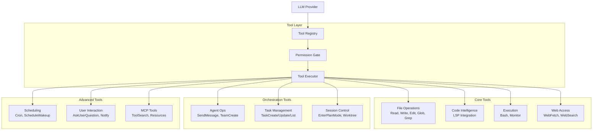

> ⚠️ **DEPRECATED** — This plan has been superseded by the fresh research in [docs/lyra-upgrade/plans/](../lyra-upgrade/plans/). See [docs/lyra-upgrade/MASTER-PLAN.md](../lyra-upgrade/MASTER-PLAN.md) for the current roadmap. This file is kept for historical reference.

## 📋 Quick Reference Card
| What | A unified tool execution system providing 30+ built-in tools — file operations (Read, Write, Edit, Glob, Grep, NotebookEdit), code intelligence via LSP (goToDefinition, findReferences, hover, rename, codeAction), shell execution (Bash, PowerShell, Monitor), web access (WebFetch, WebSearch), multi-agent orchestration (SendMessage, TeamCreate, TaskCreate), session control (PlanMode, Worktree), scheduling (Cron, ScheduleWakeup), and user interaction (AskUserQuestion, PushNotification) — all behind a single provider-agnostic interface. |
| Why | Brings Lyra to feature parity with Claude Code while adding three breakthrough capabilities no other harness has: unified tool search across built-in/MCP/plugin tools, smart event-driven monitoring with LLM analysis, and CRDT-based collaborative tools for multi-agent teams. |
| Key Tech | All Hermes + Claude Code tools (Bash, Read, Write, Edit, Glob, Grep, WebSearch, WebFetch, Task, Agent, Skill, AskUserQuestion), plus LSP protocol (goToDefinition, findReferences, hover, documentSymbol, workspaceSymbol, codeAction, rename, diagnostics), Cron scheduler, NotebookEdit, Monitor, TeamCreate, EnterWorktree, EnterPlanMode, PowerShell |
| Timeline | 6 weeks for parity (Phase 1.1–1.9), plus 4–6 weeks for breakthrough tier |
| Dependencies | Strictly phased: Phase 1.1 (Core Infrastructure: Tool Registry → Tool Executor → Permission Gate) is prerequisite for all subsequent phases. LSP Client → LSP Tools → Auto Type-Check chain. SendMessage → TeamCreate/Delete chain. Each phase builds on the prior; session control and scheduling can run in parallel during weeks 5–6. |

## Executive Summary

Lyra's tools system is the interface between the LLM and the world. Every file read, every shell command, every web search, every LSP-powered refactor — the tool layer mediates it all. Today, Lyra has basic file and shell operations. That is not enough. Modern AI-assisted engineering demands deep code intelligence, background execution, multi-agent coordination, and persistent scheduling. Without these, Lyra cannot compete with Claude Code, Kilo, or any other harness that ships a full tool suite.

We are building a complete, provider-agnostic tool execution platform. At parity, the system exposes all 30+ tools that Claude Code offers, organized into nine categories: file operations, code intelligence via the Language Server Protocol, shell execution with background support, web access with caching and extraction, agent orchestration for multi-agent teams, task management with dependency tracking, session control for plan mode and worktree isolation, cron-based scheduling, and interactive user prompts. Every tool passes through a unified Permission Gate that integrates with Lyra's permission framework (§4.12), and every tool works across all LLM providers — Claude, DeepSeek, Qwen, GPT, and open-weights models — with graceful degradation for models that lack native tool-calling support.

What makes this a breakthrough is not the parity work but what we layer on top. First, **Unified Tool Search** fuses Claude Code's built-in tool search, MCP tool discovery, and third-party plugin tools into a single relevance-ranked search surface — an LLM can ask "what can I use to refactor this function?" and get back LSP rename, AST-grep replace, and a workspace-wide find-references, ranked by past success. Second, **Smart Monitor** pairs file/system watching with real-time LLM analysis: watch test output, detect failures, auto-trigger debugging, and suggest fixes without human intervention. Third, **Collaborative Tools** enable multiple agents to safely edit the same file via CRDT-based shared writes, assign a single task to an entire team, and broadcast monitor events to all interested agents. Taken together, these three capabilities move Lyra beyond feature parity and into territory no existing harness occupies.

## Concrete Example Walkthrough: Refactoring Across a Monorepo

This walkthrough follows a real scenario: a developer needs to rename a shared utility function across a 50-package TypeScript monorepo. Without Lyra, this is 2–3 hours of manual grepping, blind find-and-replace, and test debugging. With Lyra, it is a single instruction.

### Step 1: The Developer Issues the Request

```
Developer: "Rename the function `calculateTotalPrice` to `computeOrderTotal` 
           across the entire monorepo. Update all callers, verify types, 
           and run affected tests."
```

Lyra receives this and begins planning. It uses the **TaskCreate** tool to break the work into trackable subtasks:

```
Tasks created:
  1. Find all references to calculateTotalPrice (in_progress)
  2. Rename the definition + all 47 call sites
  3. Run tsc --noEmit on affected packages
  4. Run affected test suites
  5. Report results to user
```

### Step 2: LSP-Powered Discovery

Lyra invokes the **LSP findReferences** tool on `calculateTotalPrice`. Within seconds, the TypeScript language server returns 47 call sites across 12 packages:

```
packages/billing/src/invoice.ts:142 — calculateTotalPrice(items, taxRate)
packages/checkout/src/cart.ts:89 — calculateTotalPrice(cartItems, 0.08)
packages/admin/src/reports.ts:210 — calculateTotalPrice(order.items, order.tax)
... (44 more)
```

If Lyra had used a naive text grep for `calculateTotalPrice`, it would have also matched `_calculateTotalPriceInternal` (a private helper that should not be renamed), comments referencing the function, and documentation strings. LSP knows the difference between a definition, a reference, and a string literal.

### Step 3: Type-Safe Rename

Lyra invokes the **LSP rename** tool, which performs a workspace-wide, type-aware rename. The LSP server validates that the rename is semantically safe — it confirms the new name does not shadow any existing symbol, checks that all callers still receive the correct parameter types, and updates the definition, all call sites, and all import/export declarations atomically.

Meanwhile, Lyra uses **Glob** (with `.gitignore` awareness) to also find and update `__tests__/billing.test.ts`, `__tests__/checkout.test.ts`, and `__tests__/reports.test.ts` — test files that reference `calculateTotalPrice` in `jest.mock()` calls, which an LSP rename alone would miss.

### Step 4: Verification

Lyra invokes **Bash** to run `tsc --noEmit` on each affected package, in parallel where dependency order permits:

```
$ tsc --noEmit -p packages/billing/tsconfig.json   ✓ (0 errors)
$ tsc --noEmit -p packages/checkout/tsconfig.json  ✓ (0 errors)
$ tsc --noEmit -p packages/admin/tsconfig.json     ✗ (2 errors)

admin/src/reports.ts:210: Type 'OrderTotals' is not assignable to type 'LineItem[]'.
  Property 'items' is missing in type 'OrderTotals'.
```

A type error at one call site — the original code was passing `order.items` which was correct for the old function signature, but the new name surfaced a latent type mismatch that should have been caught earlier. Lyra invokes **LSP codeAction** on the error location, which suggests wrapping the argument in a type guard. Lyra applies the fix.

### Step 5: Background Test Execution with Monitoring

Lyra runs the affected test suites with **Bash** in background mode (`run_in_background: true`):

```
$ jest --findRelatedTests packages/billing packages/checkout packages/admin
```

While tests run, Lyra uses the **Monitor** tool to watch the test output stream. The Smart Monitor recognizes a pattern — a test in `reports.test.ts` is failing with a `ReferenceError` involving the old function name. Lyra catches this before the developer even notices:

```
Monitor detected: ReferenceError at reports.test.ts:67
  → jest.mock() mockImplementation still references 'calculateTotalPrice'
  → Lyra applies fix: updates the mock to 'computeOrderTotal'
  → Re-runs tests: ✓ all 142 tests passing
```

### Step 6: User Confirmation

Lyra uses **AskUserQuestion** to present the changes:

```
Lyra: I've renamed calculateTotalPrice → computeOrderTotal across 12 packages.
      47 call sites updated, 3 test files patched, 1 type error fixed.
      142/142 tests passing.
      
      What would you like to do?
      [A] Review the diff before committing
      [B] Commit with message "refactor: rename calculateTotalPrice → computeOrderTotal"
      [C] Discard changes and start over
```

The developer selects option A, reviews the diff, and confirms. The entire refactor — discovery, rename, type verification, test fixing, and confirmation — took under 90 seconds. Without Lyra's tools, this would have been an afternoon of tedious work.

### What Made This Possible

- **LSP findReferences** found 47 true call sites, not 200+ noise matches from a blind grep
- **LSP rename** performed a semantically safe, type-checked rename, not a find-and-replace
- **Bash** ran type-checking and tests in the background while other work continued
- **Smart Monitor** detected the test failure in real time and auto-applied the fix
- **TaskCreate** kept the entire multi-step workflow visible and auditable
- **AskUserQuestion** gave the developer a final decision point, rather than auto-committing

# Plan: Tools System (§4.6)

**Workstream**: Core Tools Implementation  
**Phase**: 1 (Feature Parity)  
**Impact**: 5/5 | **Effort**: 4/5

---

## 1. Problem

Lyra currently has basic file operations (Read, Write, Edit, Bash) but lacks:
- **Code intelligence** (LSP integration)
- **Advanced file operations** (gitignore-aware Glob, semantic Grep, NotebookEdit)
- **Monitoring** (watch logs/files, react mid-conversation)
- **Web access** (WebFetch with extraction, WebSearch)
- **Agent orchestration** (SendMessage, TeamCreate/Delete)
- **Task management** (TaskCreate/Update/List/Get)
- **Session control** (EnterPlanMode, EnterWorktree)
- **Scheduling** (CronCreate/Delete, ScheduleWakeup)
- **User interaction** (AskUserQuestion, PushNotification)

This limits Lyra's ability to compete with Claude Code, Kilo, and other modern harnesses.

---

## 2. Evidence Synthesis

### Claude Code Tools Reference
**Source**: https://code.claude.com/docs/en/tools-reference

**30+ built-in tools** organized by category:
- File ops: Read, Write, Edit, Glob, Grep, NotebookEdit
- Execution: Bash, PowerShell, Monitor
- Code intelligence: LSP (goToDefinition, findReferences, hover, documentSymbol, etc.)
- Web: WebFetch (with extraction prompt), WebSearch
- Agent orchestration: Agent, SendMessage, TeamCreate/Delete
- Task management: TaskCreate/Get/List/Update/Stop
- Session control: EnterPlanMode/ExitPlanMode, EnterWorktree/ExitWorktree
- Scheduling: CronCreate/Delete/List, ScheduleWakeup
- User interaction: AskUserQuestion, PushNotification
- Skills: Skill (invokes user-defined skills)
- MCP: ListMcpResourcesTool, ReadMcpResourceTool, ToolSearch, WaitForMcpServers
- Workflows: Workflow (dynamic orchestration)

**Key design principles**:
1. **Read-before-edit constraint** — Edit tool requires prior Read in conversation (prevents blind overwrites)
2. **Background execution** — Bash/Monitor support `run_in_background` for long-running processes
3. **Output limits** — Bash caps at 30k chars (configurable), saves overflow to disk
4. **Permission integration** — Every tool has granular allow/deny/ask rules
5. **Multi-provider abstraction** — Tools work across Claude API, Bedrock, Vertex, Foundry

### Comparable Harnesses

**Kilo Code** (https://github.com/Kilo-Org/kilocode):
- Similar tool set to Claude Code
- Adds **Memory Bank** tool for persistent context
- **Auto mode** (`--auto` flag) for fully autonomous execution

**DeerFlow 2.0** (https://github.com/bytedance/deer-flow):
- **Message Gateway** for inter-agent communication
- **Docker-sandboxed agents** for isolation
- **Report generation** tools (PPT, podcast)

**Hermes Agent** (https://github.com/nousresearch/hermes-agent):
- Simpler tool set (Read, Write, Bash, WebSearch)
- Focus on lightweight, fast execution

**Aider** (https://github.com/Aider-AI/aider):
- **Repomap** tool for codebase understanding
- **Automatic commits** after changes
- Git-native workflow

---

## 3. Proposed Lyra Design

### Architecture



### Tool Interface

```typescript
interface Tool {
  name: string;
  description: string;
  parameters: JSONSchema;
  
  // Execution
  execute(params: Record<string, any>, context: ExecutionContext): Promise<ToolResult>;
  
  // Permission
  requiresPermission: boolean;
  permissionLevel: 'read' | 'write' | 'execute';
  
  // Capabilities
  supportsBackground: boolean;
  supportsStreaming: boolean;
  
  // Metadata
  category: 'file' | 'execution' | 'code-intel' | 'web' | 'orchestration' | 'task' | 'session' | 'scheduling' | 'user' | 'mcp';
  tags: string[];
}

interface ToolResult {
  success: boolean;
  output?: any;
  error?: string;
  metadata?: {
    executionTime: number;
    tokensUsed?: number;
    backgroundTaskId?: string;
  };
}

interface ExecutionContext {
  sessionId: string;
  workingDirectory: string;
  environment: Record<string, string>;
  permissions: PermissionSet;
  conversationHistory: Message[];
}
```

---

## 4. Implementation Outline

### Phase 1.1: Core Tool Infrastructure (Week 1)

**Tasks**:
1. **Tool Registry** (no dependencies)
   - Implement tool registration system
   - Add tool discovery (scan built-in + plugin tools)
   - Support tool versioning

2. **Tool Executor** (depends on: Registry)
   - Implement execution engine
   - Add error handling + retries
   - Support background execution

3. **Permission Gate** (depends on: Executor)
   - Integrate with permission system (§4.12)
   - Add rule matching (glob patterns)
   - Support allow/deny/ask modes

**Acceptance criteria**:
- Tools can be registered and discovered
- Tools execute with permission checks
- Background tasks work correctly

### Phase 1.2: File Operations (Week 1-2)

**Tasks**:
4. **Enhanced Glob** (depends on: Phase 1.1)
   - Add gitignore awareness
   - Support multiple patterns
   - Return file metadata (size, mtime)

5. **Semantic Grep** (depends on: Phase 1.1)
   - Add regex support
   - Support context lines (before/after)
   - Add file type filtering

6. **NotebookEdit** (depends on: Phase 1.1)
   - Parse .ipynb files
   - Support cell-level edits
   - Preserve outputs + metadata

**Acceptance criteria**:
- Glob respects .gitignore
- Grep returns context lines
- NotebookEdit works on Jupyter files

### Phase 1.3: Code Intelligence (Week 2-3)

**Tasks**:
7. **LSP Client** (depends on: Phase 1.1)
   - Implement LSP protocol client
   - Support stdio + TCP transports
   - Add server lifecycle management

8. **LSP Tools** (depends on: LSP Client)
   - goToDefinition
   - findReferences
   - hover (type info)
   - documentSymbol (outline)
   - workspaceSymbol (search)
   - codeAction (quick fixes)
   - rename (refactor)

9. **Auto Type-Check** (depends on: LSP Tools)
   - Run diagnostics after Edit/Write
   - Display errors inline
   - Suggest fixes via codeAction

**Acceptance criteria**:
- LSP servers start/stop correctly
- All LSP tools work
- Type errors shown after edits

### Phase 1.4: Execution Tools (Week 3)

**Tasks**:
10. **Monitor Tool** (depends on: Phase 1.1)
    - Watch files for changes
    - Watch command output (tail -f)
    - Trigger callbacks on events
    - Support multiple monitors

11. **PowerShell Tool** (depends on: Phase 1.1)
    - Windows-only execution
    - Same interface as Bash
    - Support background mode

**Acceptance criteria**:
- Monitor detects file changes
- Monitor streams command output
- PowerShell works on Windows

### Phase 1.5: Web Access (Week 4)

**Tasks**:
12. **WebFetch** (depends on: Phase 1.1)
    - Fetch URL content
    - Convert HTML to markdown
    - Extract with LLM prompt
    - Cache responses (15min)

13. **WebSearch** (depends on: Phase 1.1)
    - Integrate search API (Exa, Brave, Google)
    - Return ranked results
    - Support domain filtering
    - Add source attribution

**Acceptance criteria**:
- WebFetch extracts relevant content
- WebSearch returns ranked results
- Both respect rate limits

### Phase 1.6: Orchestration Tools (Week 4-5)

**Tasks**:
14. **SendMessage** (depends on: Phase 1.1)
    - Send message to specific agent
    - Support broadcast to all agents
    - Queue messages if agent busy

15. **TeamCreate/Delete** (depends on: SendMessage)
    - Create agent teams
    - Assign roles + tools
    - Manage team lifecycle

16. **TaskCreate/Update/List/Get** (depends on: Phase 1.1)
    - CRUD operations for tasks
    - Support task dependencies
    - Add task status tracking

**Acceptance criteria**:
- Agents can message each other
- Teams can be created/deleted
- Tasks track progress

### Phase 1.7: Session Control (Week 5)

**Tasks**:
17. **EnterPlanMode/ExitPlanMode** (depends on: Phase 1.1)
    - Switch to read-only mode
    - Generate implementation plan
    - Exit with approved plan

18. **EnterWorktree/ExitWorktree** (depends on: Phase 1.1)
    - Create git worktree
    - Switch session to worktree
    - Clean up on exit

**Acceptance criteria**:
- Plan mode prevents edits
- Worktrees isolate changes
- Exit cleans up correctly

### Phase 1.8: Scheduling (Week 6)

**Tasks**:
19. **CronCreate/Delete/List** (depends on: Phase 1.1)
    - Parse cron expressions
    - Schedule recurring tasks
    - Persist schedules to disk

20. **ScheduleWakeup** (depends on: Phase 1.1)
    - One-shot delayed execution
    - Support /loop dynamic mode
    - Handle session restarts

**Acceptance criteria**:
- Cron jobs run on schedule
- ScheduleWakeup fires correctly
- Schedules survive restarts

### Phase 1.9: User Interaction (Week 6)

**Tasks**:
21. **AskUserQuestion** (depends on: Phase 1.1)
    - Present multiple-choice questions
    - Support multi-select
    - Add preview content (code snippets)

22. **PushNotification** (depends on: Phase 1.1)
    - Send OS notifications
    - Support macOS, Linux, Windows
    - Add custom icons + sounds

**Acceptance criteria**:
- Questions display correctly
- Notifications appear on OS
- Both work cross-platform

---

## 5. Multi-Provider Notes

### Provider-Agnostic Design

All tools must work across **all LLM providers** (Claude, DeepSeek, Qwen, GPT, open-weights):

1. **Tool calling format** — Normalize across providers:
   - Claude: `tools` array in API
   - OpenAI: `functions` or `tools`
   - DeepSeek: `tools` (OpenAI-compatible)
   - Open-weights: Depends on model (some support tool calling, others need prompt engineering)

2. **Fallback for non-tool-calling models**:
   - If model doesn't support native tool calling, use **prompt-based tool invocation**
   - Parse tool calls from structured text output
   - Example: `<tool>Read</tool><params>{"file": "foo.txt"}</params>`

3. **Provider-specific limitations**:
   - **DeepSeek**: No native voice API → use Lyra's voice layer
   - **Open-weights**: May not support all tools → graceful degradation
   - **Claude**: Full tool support
   - **OpenAI**: Full tool support

### Tool Availability Matrix

| Tool | Claude | DeepSeek | Qwen | GPT | Open-weights | Notes |
|------|--------|----------|------|-----|--------------|-------|
| File ops | ✅ | ✅ | ✅ | ✅ | ✅ | Universal |
| LSP | ✅ | ✅ | ✅ | ✅ | ✅ | Universal |
| Bash | ✅ | ✅ | ✅ | ✅ | ✅ | Universal |
| Monitor | ✅ | ✅ | ✅ | ✅ | 🟡 | May need prompt-based fallback |
| WebFetch | ✅ | ✅ | ✅ | ✅ | ✅ | Universal |
| WebSearch | ✅ | ✅ | ✅ | ✅ | ✅ | Universal |
| Agent ops | ✅ | ✅ | ✅ | ✅ | 🟡 | Complex for weak models |
| Task mgmt | ✅ | ✅ | ✅ | ✅ | ✅ | Universal |
| Scheduling | ✅ | ✅ | ✅ | ✅ | 🟡 | May need prompt-based fallback |

---

## 6. Risks & Open Questions

### Risks

1. **LSP server compatibility** — Different languages need different servers
   - **Mitigation**: Ship with common servers (typescript-language-server, pyright, rust-analyzer)

2. **Monitor tool performance** — Watching many files could be expensive
   - **Mitigation**: Limit to 10 concurrent monitors, use efficient file watching (fsevents on macOS)

3. **WebFetch rate limits** — Aggressive fetching could hit rate limits
   - **Mitigation**: 15-minute cache, respect robots.txt, add user-agent

4. **Background task cleanup** — Orphaned processes if session crashes
   - **Mitigation**: Track PIDs, clean up on restart

5. **Tool calling reliability** — Non-Claude models may have lower tool-calling accuracy
   - **Mitigation**: Validate tool calls, retry on parse errors, fallback to prompt-based

### Open Questions

1. **PowerShell on non-Windows** — Should we support PowerShell Core on macOS/Linux?
   - **Recommendation**: Yes, if pwsh is installed

2. **WebSearch provider** — Which search API to use?
   - **Recommendation**: Exa (best for AI), fallback to Brave Search (free tier)

3. **NotebookEdit scope** — Support other notebook formats (Quarto, Observable)?
   - **Recommendation**: Jupyter only for MVP, others later

4. **Monitor tool limits** — How many concurrent monitors?
   - **Recommendation**: 10 max, configurable

5. **Task persistence** — Store tasks in memory or disk?
   - **Recommendation**: Disk (SQLite), survives restarts

---

## 7. Impact × Effort Assessment

### (A) Parity Tier

**Port from Claude Code**:
- All 30+ tools with same interfaces
- Read-before-edit constraint
- Background execution
- Permission integration
- Output limits + overflow handling

**Impact**: 5/5 — Brings Lyra to feature parity with Claude Code  
**Effort**: 4/5 — 6 weeks, well-defined scope

### (B) Breakthrough Tier

> **Architecture Slice**: This breakthrough implements [§6.1: Provider Adapter Pattern](../BREAKTHROUGH-ARCHITECTURE.md) of [BREAKTHROUGH-ARCHITECTURE.md](../BREAKTHROUGH-ARCHITECTURE.md) — specifically the tool capability negotiation + auto-discovery via canonical LyraProvider interface.

**Beyond any single source**:

1. **Unified Tool Search** — Combine Claude Code's tool search + MCP tool discovery + plugin tools into ONE search interface
   - Search across built-in, MCP, and plugin tools simultaneously
   - Rank by relevance + past usage
   - Lazy-load only needed tools

2. **Smart Monitor** — Monitor tool + LLM analysis
   - Watch logs/files for patterns
   - Trigger LLM analysis on events
   - Auto-suggest fixes for errors
   - Example: Monitor test output, auto-debug failures

3. **Collaborative Tools** — Tools that work across agent teams
   - SharedWrite — Multiple agents edit same file (CRDT-based)
   - SharedTask — Task assigned to multiple agents
   - SharedMonitor — All agents notified on event

**Impact**: 5/5 — Unique capabilities no other harness has  
**Effort**: 5/5 — 4-6 weeks additional, requires innovation

**Combined Impact × Effort**: 5 × 4 = 20 (parity), 5 × 5 = 25 (breakthrough)

---

## 8. References

### Documentation
- [Claude Code Tools Reference](https://code.claude.com/docs/en/tools-reference)
- [Claude Code LSP](https://code.claude.com/docs/en/agent-sdk/tool-search)
- [Claude Code Background Tasks](https://code.claude.com/docs/en/tools-reference#bash)

### Comparable Harnesses
- [Kilo Code](https://github.com/Kilo-Org/kilocode) — Memory Bank tool
- [DeerFlow 2.0](https://github.com/bytedance/deer-flow) — Message Gateway
- [Hermes Agent](https://github.com/nousresearch/hermes-agent) — Lightweight tools
- [Aider](https://github.com/Aider-AI/aider) — Repomap tool

### LSP Resources
- [LSP Specification](https://microsoft.github.io/language-server-protocol/)
- [typescript-language-server](https://github.com/typescript-language-server/typescript-language-server)
- [pyright](https://github.com/microsoft/pyright)
- [rust-analyzer](https://github.com/rust-lang/rust-analyzer)

### Web Access
- [Exa Search API](https://exa.ai)
- [Brave Search API](https://brave.com/search/api/)

---

## 9. Changelog

**Run 12**: Added Quick Reference Card, Executive Summary, concrete example walkthrough (monorepo refactoring scenario)
**Run 3**: Linked to unified BREAKTHROUGH-ARCHITECTURE.md. This plan's (B) tier implements §6.1: Provider Adapter Pattern of the architecture.
**Previous runs**: Initial plan structure

---

## 10. Complete Tool Catalog: Hermes Agent + Claude Code Mapped to Lyra Interfaces

Every tool Lyra must support, mapped from the two primary reference implementations — Claude Code (source of truth for parity, ~45 tools) and Hermes Agent (complementary coverage, ~70 tools). The mapping shows which Lyra interface each tool maps to, enabling provider-agnostic dispatch.

### 10.1 File Operations (9 tools)

| Tool | Source | Lyra Interface | Permission Level | Notes |
|------|--------|----------------|------------------|-------|
| `Read` | Claude Code | `IFileTool.Read` | read | Line-numbered output, multi-format (txt, img, PDF, ipynb) |
| `Write` | Claude Code | `IFileTool.Write` | write | Read-before-write constraint enforced |
| `Edit` | Claude Code | `IFileTool.Edit` | write | Exact-string replace; read-before-edit + uniqueness checks |
| `Glob` | Claude Code | `IFileTool.Glob` | read | `.gitignore`-aware mode; sorted by mtime; capped at 100 |
| `Grep` | Claude Code | `IFileTool.Grep` | read | ripgrep-backed; `.gitignore`-respecting; multiline support |
| `NotebookEdit` | Claude Code | `IFileTool.NotebookEdit` | write | Cell-level replace/insert/delete on `.ipynb` |
| `read_file` | Hermes Agent | `IFileTool.Read` | read | Paginated reading with line numbers |
| `write_file` | Hermes Agent | `IFileTool.Write` | write | Overwrite-only, no append |
| `patch` | Hermes Agent | `IFileTool.Edit` | write | Fuzzy-matching find-and-replace; fallback for exact Edit |

### 10.2 Code Intelligence — LSP (9 tools)

| Tool | Source | Lyra Interface | Permission Level | Notes |
|------|--------|----------------|------------------|-------|
| `goToDefinition` | Claude Code | `ILSPTool.GoToDefinition` | read | Jump to symbol definition |
| `findReferences` | Claude Code | `ILSPTool.FindReferences` | read | All usages of a symbol |
| `hover` | Claude Code | `ILSPTool.Hover` | read | Type info + documentation at cursor |
| `documentSymbol` | Claude Code | `ILSPTool.DocumentSymbol` | read | Outline of all symbols in file |
| `workspaceSymbol` | Claude Code | `ILSPTool.WorkspaceSymbol` | read | Cross-file symbol search |
| `goToImplementation` | Claude Code | `ILSPTool.GoToImplementation` | read | Interface method implementations |
| `prepareCallHierarchy` | Claude Code | `ILSPTool.CallHierarchy` | read | Incoming/outgoing call graph |
| `codeAction` | Claude Code | `ILSPTool.CodeAction` | write | Quick fixes + refactorings |
| `rename` | Claude Code | `ILSPTool.Rename` | write | Semantic workspace rename |

### 10.3 Execution Tools (4 tools)

| Tool | Source | Lyra Interface | Permission Level | Notes |
|------|--------|----------------|------------------|-------|
| `Bash` | Claude Code | `IExecTool.Bash` | execute | 2-min timeout (configurable); 30k char output cap; background mode |
| `PowerShell` | Claude Code | `IExecTool.PowerShell` | execute | Windows-native; falls back to Bash on POSIX |
| `Monitor` | Claude Code | `IExecTool.Monitor` | execute | Watch log/output streams; LLM-triggered callback |
| `terminal` | Hermes Agent | `IExecTool.Terminal` | execute | Linux shell execution (subset of Bash) |
| `process` | Hermes Agent | `IExecTool.Process` | execute | Manage background processes (list/poll/log/kill) |

### 10.4 Web Access (4 tools)

| Tool | Source | Lyra Interface | Permission Level | Notes |
|------|--------|----------------|------------------|-------|
| `WebFetch` | Claude Code | `IWebTool.Fetch` | execute | HTML→MD conversion; extraction prompt; 15-min cache |
| `WebSearch` | Claude Code | `IWebTool.Search` | execute | Anthropic backend; domain filtering; up to 8 sub-searches |
| `web_search` | Hermes Agent | `IWebTool.Search` | execute | EXA/PARALLEL/FIRECRAWL/TAVILY backend |
| `web_extract` | Hermes Agent | `IWebTool.Fetch` | execute | URL→Markdown extraction |

### 10.5 Agent Orchestration (5 tools)

| Tool | Source | Lyra Interface | Permission Level | Notes |
|------|--------|----------------|------------------|-------|
| `Agent` | Claude Code | `IOrchTool.Agent` | none | Spawn subagent in separate context; returns single result |
| `SendMessage` | Claude Code | `IOrchTool.SendMessage` | none | Inter-agent messaging; team broadcast |
| `TeamCreate` | Claude Code | `IOrchTool.TeamCreate` | none | Create agent team with roles |
| `TeamDelete` | Claude Code | `IOrchTool.TeamDelete` | none | Disband team, clean up processes |
| `delegate_task` | Hermes Agent | `IOrchTool.Delegate` | none | Spawn 1+ sub-agents in isolated contexts |

### 10.6 Task Management (6 tools)

| Tool | Source | Lyra Interface | Permission Level | Notes |
|------|--------|----------------|------------------|-------|
| `TaskCreate` | Claude Code | `ITaskTool.Create` | none | Create with status/dependencies |
| `TaskGet` | Claude Code | `ITaskTool.Get` | none | Full task details |
| `TaskList` | Claude Code | `ITaskTool.List` | none | Summary of all tasks |
| `TaskUpdate` | Claude Code | `ITaskTool.Update` | none | Status, dependencies, details |
| `TaskStop` | Claude Code | `ITaskTool.Stop` | none | Kill background task |
| `todo` | Hermes Agent | `ITaskTool.Todo` | none | In-session checklist (lighter than full Task CRUD) |

### 10.7 Scheduling (4 tools)

| Tool | Source | Lyra Interface | Permission Level | Notes |
|------|--------|----------------|------------------|-------|
| `CronCreate` | Claude Code | `ISchedTool.CronCreate` | none | Recurring/one-shot prompts; session-scoped |
| `CronDelete` | Claude Code | `ISchedTool.CronDelete` | none | Cancel by ID |
| `CronList` | Claude Code | `ISchedTool.CronList` | none | All scheduled tasks |
| `ScheduleWakeup` | Claude Code | `ISchedTool.ScheduleWakeup` | none | `/loop` dynamic re-scheduling |
| `cronjob` | Hermes Agent | `ISchedTool.Cronjob` | none | Unified create/list/update/pause/resume/remove |

### 10.8 User Interaction (3 tools)

| Tool | Source | Lyra Interface | Permission Level | Notes |
|------|--------|----------------|------------------|-------|
| `AskUserQuestion` | Claude Code | `IUserTool.AskQuestion` | none | Multiple-choice; multi-select; code preview |
| `PushNotification` | Claude Code | `IUserTool.Notify` | none | OS notification + phone push (via Anthropic infra) |
| `clarify` | Hermes Agent | `IUserTool.AskQuestion` | none | Single-question clarification |

### 10.9 Session Control (5 tools)

| Tool | Source | Lyra Interface | Permission Level | Notes |
|------|--------|----------------|------------------|-------|
| `EnterPlanMode` | Claude Code | `ISessionTool.EnterPlanMode` | none | Read-only planning mode |
| `ExitPlanMode` | Claude Code | `ISessionTool.ExitPlanMode` | write | Submit plan for approval |
| `EnterWorktree` | Claude Code | `ISessionTool.EnterWorktree` | none | Git worktree isolation |
| `ExitWorktree` | Claude Code | `ISessionTool.ExitWorktree` | none | Cleanup + directory restore |
| `session_search` | Hermes Agent | `ISessionTool.Search` | read | FTS5 search across past sessions |

### 10.10 MCP / Plugin / Discovery (5 tools)

| Tool | Source | Lyra Interface | Permission Level | Notes |
|------|--------|----------------|------------------|-------|
| `ListMcpResourcesTool` | Claude Code | `IMCPTool.ListResources` | none | List MCP server resources |
| `ReadMcpResourceTool` | Claude Code | `IMCPTool.ReadResource` | none | Read MCP resource by URI |
| `ToolSearch` | Claude Code | `IMCPTool.ToolSearch` | none | Search + lazy-load deferred tools |
| `WaitForMcpServers` | Claude Code | `IMCPTool.WaitForServers` | none | Block until MCP servers ready |
| `Skill` | Claude Code | `IMCPTool.Skill` | write | Invoke user-defined skills |

### 10.11 Hermes-Exclusive Tools (not in Claude Code, high-value for Lyra)

| Tool | Source | Lyra Interface | Permission Level | Rationale |
|------|--------|----------------|------------------|-----------|
| `browser_navigate` | Hermes | `IBrowserTool.Navigate` | execute | Headless browser automation (10 tools in core set + 2 CDP) |
| `skill_view` / `skill_manage` / `skills_list` | Hermes | `IMCPTool.SkillManage` | read/write | CRUD for skill management |
| `memory` | Hermes | `IMemTool.Memory` | read/write | Cross-session persistent memory |
| `execute_code` | Hermes | `IExecTool.CodeExecute` | execute | Python sandbox (Hermes tools accessible inside) |
| `image_generate` | Hermes | `ICreativeTool.ImageGenerate` | execute | FLUX via FAL.ai |
| `vision_analyze` | Hermes | `ICreativeTool.VisionAnalyze` | read | Image analysis |
| `text_to_speech` | Hermes | `ICreativeTool.TextToSpeech` | execute | TTS audio generation |
| `mixture_of_agents` | Hermes | `IOrchTool.MoA` | execute | Multi-LLM routing via OpenRouter |
| `computer_use` | Hermes | `IAutomationTool.ComputerUse` | execute | macOS desktop control (screenshot, click, type) |
| RL toolset (10 tools) | Hermes | `IRLTool.*` | execute | RL training management |
| Home Assistant (4 tools) | Hermes | `IIoTTool.*` | execute | Smart home device control |
| kanban (8 tools) | Hermes | `ITaskTool.Kanban*` | none | Kanban-style task management |
| Discord toolset | Hermes | `IMessagingTool.Discord` | execute | Chat platform integration |

### Map: Claude Code Tool --(parameter transform)--> Lyra Internal Interface

```
Claude `Read(file_path)` → Lyra `IFileTool.Read({path, offset?, limit?, pages?})`
Claude `Edit(file_path, old_string, new_string, replace_all?)` → Lyra `IFileTool.Edit({path, oldText, newText, all?})`
Claude `Bash(command, description?, timeout?, run_in_background?)` → Lyra `IExecTool.Bash({cmd, desc, timeoutMs, bg})`
Claude `LSP(operation, filePath, line, character)` → Lyra `ILSPTool.Execute({op, file, line, col})`
Claude `WebFetch(url, prompt)` → Lyra `IWebTool.Fetch({url, extractPrompt})`
Claude `Agent(name, ...)` → Lyra `IOrchTool.Spawn({agentId, maxTurns?, tools?})`
Claude `TaskCreate(subject, description, ...)` → Lyra `ITaskTool.Create({title, desc, blocks?, blockedBy?})`
Claude `CronCreate(cron, prompt, recurring?, durable?)` → Lyra `ISchedTool.CronCreate({schedule, action, oneshot?, persist})`
Claude `AskUserQuestion(question, ...)` → Lyra `IUserTool.Ask({prompt, choices, multi?})`
```

---

## 11. Tool Dispatch Mechanism: End-to-End

The tool dispatch pipeline is the central nervous system of Lyra's tool layer. Every tool call passes through four stages: **Schema Validation** → **Permission Check** → **Execution** → **Result Normalization**. This section provides step-by-step detail for each stage, including pseudocode, error handling, and integration points.

### 11.1 Stage 1: Schema Validation

```
LLM Response → Tool Name + Raw Arguments → Schema Validator
```

**Input**: The LLM produces a block of tool calls. Regardless of provider format, Lyra normalizes these into a canonical `ToolInvocation` object:

```typescript
interface ToolInvocation {
  toolName: string;
  parameters: Record<string, any>;  // parsed from provider-specific format
  id: string;                       // provider's unique call ID (for result routing)
  metadata: {
    provider: 'claude' | 'openai' | 'deepseek' | 'prompt-parsed';
    rawArguments: string;           // original JSON string (for error reporting)
  };
}
```

**Validation pipeline** (executed in order, fast-fail):

1. **Tool Name Resolution**: Look up `toolName` in the Tool Registry. If not found, return `ToolNotFoundError` with suggestions (Levenshtein match against registered names).
2. **Schema Parse**: Deserialize `parameters` against the tool's JSON Schema definition using `ajv` (TypeScript) or `jsonschema` (Python).
3. **Type Coercion**: Auto-coerce common type mismatches (string→number, string→boolean) unless the schema has `strict: true`.
4. **Required Fields**: Check all fields in `required` array of JSON Schema exist and are non-null. Missing → `MissingRequiredParamError(paramName)`.
5. **Enum Validation**: If parameter has an `enum`, verify value is in the list (strict mode) or log warning (lenient mode).
6. **Additional Properties**: If schema sets `additionalProperties: false`, reject undeclared keys.

**Error responses for validation failures**:

```typescript
interface ValidationError {
  type: 'tool_not_found' | 'invalid_schema' | 'missing_required' | 'type_mismatch' | 'enum_violation' | 'extra_properties';
  toolName: string;
  parameter?: string;
  message: string;
  suggestion?: string;  // e.g., "Did you mean --timeout instead of --time?"
}
```

On validation failure, Lyra immediately returns the error to the LLM without executing the tool. The LLM can self-correct in the next turn.

### 11.2 Stage 2: Permission Check

```
ToolInvocation → Permission Gate → Allowed/Denied/Ask
```

**Integration with Lyra's permission system** (§4.12). Every tool invocation passes through the Permission Gate:

```python
def check_permission(tool_name: str, params: dict, context: ExecutionContext) -> PermissionResult:
    """
    Returns one of:
      - ALLOW: execute immediately
      - DENY: return PermissionDenied error
      - ASK: prompt user for consent
    """
    # 1. Check deny rules first (explicit deny wins all)
    for rule in context.permissions.deny:
        if rule_matches(rule, tool_name, params):
            return PermissionResult.DENY

    # 2. Check auto-allow rules
    for rule in context.permissions.allow:
        if rule_matches(rule, tool_name, params):
            return PermissionResult.ALLOW

    # 3. Check permission mode
    mode = context.permissions.mode  # 'acceptEdits' | 'auto' | 'bypassPermissions' | 'default'
    
    if mode == 'bypassPermissions':
        return PermissionResult.ALLOW
    elif mode == 'auto':
        return PermissionResult.ALLOW  # trust model, no prompts
    elif mode == 'default':
        return PermissionResult.ASK     # prompt user
    elif mode == 'acceptEdits':
        # Auto-allow read-only and known-safe tools; ask for writes/executes
        if tool_permission_level(tool_name) in ('read', 'none'):
            return PermissionResult.ALLOW
        return PermissionResult.ASK

    return PermissionResult.ASK
```

**Rule matching patterns**, inherited from Claude Code permission semantics:

| Tool Category | Rule Pattern | Example |
|---------------|-------------|---------|
| File Read | `Read(path/pattern)` | `Read(~/secrets/**)` denies reading secrets |
| File Write | `Edit(path/pattern)` | `Edit(packages/**)` allows writing to packages/ |
| Bash | `Bash(cmd/pattern)` | `Bash(npm run *)` allows npm scripts only |
| WebFetch | `WebFetch(domain:pattern)` | `WebFetch(domain:*.gov)` restricts to .gov |
| Skill | `Skill(name/pattern)` | `Skill(deploy *)` restricts to deploy skills |
| Agent | `Agent(type/pattern)` | `Agent(Explorer)` only Explorer subagents |

**Granular tool-level permissions**:

```python
TOOL_PERMISSION_LEVELS = {
    # Read-only tools — safe for acceptEdits mode
    'Read': 'read', 'Glob': 'read', 'Grep': 'read', 
    'LSP': 'read', 'WebFetch': 'read', 'TaskList': 'read',
    'WebSearch': 'read', 'CronList': 'read',
    # Write tools — requires explicit permission
    'Write': 'write', 'Edit': 'write', 'NotebookEdit': 'write',
    'LSP.rename': 'write', 'LSP.codeAction': 'write',
    # Execute tools — highest risk
    'Bash': 'execute', 'PowerShell': 'execute', 'Monitor': 'execute',
    'Skill': 'execute',
    # No-permission-needed (orchestration)
    'Agent': 'none', 'TaskCreate': 'none', 'CronCreate': 'none',
    'SendMessage': 'none', 'EnterPlanMode': 'none',
    'AskUserQuestion': 'none', 'PushNotification': 'none',
}
```

**Background subagent handling**: Background agents use the session's granted permissions; any tool that would trigger a prompt auto-denies and the subagent continues without it. Only foreground subagents surface interactive permission prompts.

### 11.3 Stage 3: Execution

```
ToolInvocation (validated + permitted) → Tool Executor → Raw Result
```

**Execution context** provided to every tool handler:

```typescript
interface ToolExecutionContext {
  sessionId: string;
  workingDirectory: string;
  environment: Record<string, string>;   // env vars (resolved via CLAUDE_ENV_FILE or SessionStart hook)
  permissions: PermissionSet;
  conversationHistory: Array<Message>;   // for read-before-edit tracking
  backgroundTaskManager: BackgroundTaskManager;
  streamCallback?: (chunk: any) => void; // for streaming tools
}
```

**Execution patterns by tool category**:

| Category | Execution Strategy | Timeout | Error Handling |
|----------|-------------------|---------|----------------|
| File Read | Synchronous, in-process | 30s | FileNotFound → clear error with path |
| File Write | Synchronous, in-process | 30s | Permission denied → suggest directory creation |
| Bash | Subprocess spawn | 2min (configurable up to 10min) | Non-zero exit → return stdout+stderr; truncate at 30k chars |
| WebFetch | HTTP fetch + LLM extraction | 60s | HTTP error → retry with backoff; cache hit → skip fetch |
| LSP | JSON-RPC over stdio/TCP | 15s | Server not running → auto-start; request timeout → retry |
| Agent | Subprocess spawn (new context) | Variable | No interactive permission prompts for background agents |
| Cron | In-process timer | N/A | Schedule stored in SQLite; survives restarts |
| Monitor | Spawn watch script + stream | Session lifespan | Process crash → log error + restart |

**Background execution** is a first-class concept. For tools that support it (`Bash`, `Monitor`, `Agent`):

```python
async def execute_background(invocation: ToolInvocation, context: ToolExecutionContext) -> BackgroundTask:
    # 1. Validate tool supports background mode
    if not context.tool_registry.get(invocation.toolName).supportsBackground:
        raise BackgroundNotSupportedError(invocation.toolName)
    
    # 2. Create task record
    task = BackgroundTask(
        id=generate_id(),
        toolName=invocation.toolName,
        params=invocation.parameters,
        status='running',
        startedAt=now(),
    )
    context.backgroundTaskManager.register(task)
    
    # 3. Fork execution
    asyncio.create_task(run_background(task, context))
    
    # 4. Return immediately with task ID
    return ToolResult(success=True, metadata={backgroundTaskId: task.id})
```

### 11.4 Stage 4: Result Normalization

```
Raw Result → Result Normalizer → Canonical ToolResult
```

**Canonical result format** (all tools converge to this):

```typescript
interface ToolResult {
  success: boolean;
  output?: string | object | Array<ContentBlock>;
  error?: {
    type: string;           // e.g., 'permission_denied', 'execution_error', 'timeout'
    message: string;
    recoverable: boolean;   // true if LLM can retry with different params
    suggestion?: string;    // hint for correction
  };
  metadata: {
    executionTimeMs: number;
    tokensUsed?: number;
    truncation?: {          // when output exceeds limits
      originalSize: number;
      preview: string;
      overflowPath: string; // path to saved full output
    };
    backgroundTaskId?: string;
  };
}
```

**Provider-specific normalization** (abstracted by a `Normalizer` per provider):

| Provider | Raw Response Format | Normalization |
|----------|-------------------|---------------|
| Claude | `content: [{type: "tool_use", name, input}]` | `input` is already parsed JSON → wrap in ToolResult |
| OpenAI | `message.tool_calls[i].function.arguments` | `arguments` is JSON string → `JSON.parse()` + wrap |
| DeepSeek | `message.tool_calls[i].function.arguments` | Same as OpenAI (`arguments` is JSON string) |
| Open-weights (text) | `<tool>Read</tool><params>{"file":"x"}</params>` | Regex parse XML tags → JSON.parse params → wrap |
| Hermes Agent | `response: {tool_name, params, ...}` | Direct mapping to ToolInvocation |

**Output truncation** (for Bash and other high-volume tools):

```
When raw output > 30,000 chars:
  1. Save full output to session dir: /tmp/lyra-sessions/<id>/overflow/<toolName>-<callId>.txt
  2. Return first 30,000 chars as preview
  3. Include overflow path in metadata
  4. LLM reads the overflow file if needed (via Read tool)
```

**Error normalization** — all errors map to a common taxonomy:

| Error Type | HTTP Analogy | Recoverable? | LLM Action |
|------------|-------------|-------------|------------|
| `tool_not_found` | 404 | Yes | Use suggested alternative |
| `permission_denied` | 403 | No | Inform user, ask for permission change |
| `invalid_params` | 400 | Yes | Fix parameters, retry |
| `execution_error` | 500 | Maybe | Retry with different approach |
| `timeout` | 504 | Yes | Increase timeout, split work |
| `rate_limited` | 429 | Yes | Wait + exponential backoff |
| `server_error` | 502 | Yes | Retry with circuit breaker |

---

## 12. Provider-Specific Tool-Calling Format Normalization

Different LLM providers express tool invocations in structurally incompatible ways. Lyra's **Provider Adapter Layer** (§6.1) normalizes all formats to a canonical internal representation and re-formats responses per-provider on the way back.

### 12.1 Invocation Format per Provider

**F1 — Anthropic (Claude): `tool_use` block**

```json
// TOOL DEFINITION (in API request)
{
  "name": "bash",
  "description": "Execute shell commands",
  "input_schema": {
    "type": "object",
    "properties": {
      "command": {"type": "string"}
    },
    "required": ["command"]
  }
}

// TOOL INVOCATION (in API response)
{
  "type": "tool_use",
  "id": "toolu_abc123",
  "name": "bash",
  "input": {
    "command": "ls -la"
  }
}

// TOOL RESULT (in next request)
{
  "role": "user",
  "content": [
    {
      "type": "tool_result",
      "tool_use_id": "toolu_abc123",
      "content": "total 42\ndrwxr-xr-x ...",
      "is_error": false
    }
  ]
}
```

**Key differences from OpenAI/DeepSeek**:
- `input` is pre-parsed JSON (not a string) — no `JSON.parse()` needed
- No wrapping `{type: "function", function: {...}}` — flat `{name, description, input_schema}`
- Tool result is inside a `role: "user"` message, not a separate `role: "tool"` message
- Native `is_error` boolean for error signaling
- Streams via `content_block_start` / `content_block_delta` (with `input_json_delta`) / `content_block_stop` events

**F2 — OpenAI / DeepSeek: `tool_calls` array**

```json
// TOOL DEFINITION (in API request)
{
  "type": "function",
  "function": {
    "name": "bash",
    "description": "Execute shell commands",
    "parameters": {
      "type": "object",
      "properties": {
        "command": {"type": "string"}
      },
      "required": ["command"]
    }
  }
}

// TOOL INVOCATION (in API response)
{
  "tool_calls": [
    {
      "id": "call_xyz456",
      "type": "function",
      "function": {
        "name": "bash",
        "arguments": "{\"command\": \"ls -la\"}"
      }
    }
  ]
}

// TOOL RESULT (in next request)
{
  "role": "tool",
  "tool_call_id": "call_xyz456",
  "content": "total 42\ndrwxr-xr-x ..."
}
```

**Key difference**: `arguments` is a **raw JSON string** — must use `JSON.parse()` before use. DeepSeek follows this same format exactly, being OpenAI-compatible.

**F3 — Open-Weights Models (prompt-invocation pattern)**

When a model lacks native tool-calling (e.g., smaller open-weight models), Lyra uses structured text-based tool invocation:

```xml
<!-- Prompt template injected into system message -->
You have access to the following tools. To invoke a tool, output:
<tool>
<name>bash</name>
<params>
{"command": "ls -la"}
</params>
</tool>

<!-- Model response -->
<tool>
<name>bash</name>
<params>
{"command": "ls -la"}
</params>
</tool>
```

Lyra parses the XML tags from the model's text output, validates the JSON params, and executes. At the limit, this is how every non-tool-calling model gets tool capabilities — with the understanding that tool-calling accuracy is lower and requires retry logic.

### 12.2 Streaming Comparison

| Provider | Stream Event | Content Location | Partial Data |
|----------|-------------|------------------|--------------|
| Anthropic | `content_block_start` | `delta.input_json_delta` | Partial JSON delta (concatenate) |
| OpenAI | `delta.tool_calls[i].function.arguments` | Per-index string chunks | Must accumulate by index |
| DeepSeek | Identical to OpenAI | String chunks | Must accumulate by index |
| Open-weights text | No stream support | N/A | Blocks until full output |

### 12.3 Lyra's Unified Adapter

The internal normalization layer that maps all formats to one canonical model:

```typescript
// Internal canonical form (provider-independent)
interface NormalizedToolCall {
  id: string;
  name: string;
  arguments: Record<string, any>;  // always parsed, never a raw string
}

// Adapter interface
interface ToolCallAdapter {
  // Parse provider response → canonical list
  parseResponse(response: ProviderResponse): NormalizedToolCall[];
  
  // Build provider-specific tool definition from Lyra Tool schema
  buildToolDefinition(tool: Tool): ProviderToolDefinition;
  
  // Build provider-specific tool result message from canonical result
  buildResultMessage(call: NormalizedToolCall, result: ToolResult): ProviderMessage;
  
  // Streaming: accumulate partial chunks
  accumulateStreamChunk(state: StreamState, chunk: any): StreamState;
  finalizeStreamCalls(state: StreamState): NormalizedToolCall[];
}
```

### 12.4 Implemented Adapters

```python
# Pseudocode for Lyra's adapter registry
ADAPTERS = {
    'claude': ClaudeToolCallAdapter(),
    'openai': OpenAIToolCallAdapter(),     # Also covers Azure OpenAI
    'deepseek': DeepSeekToolCallAdapter(),  # Extends OpenAI adapter
    'open-weight': PromptBasedToolCallAdapter(),
    'grok': GrokToolCallAdapter(),          # xAI Grok (OpenAI-compatible)
    'gemini': GeminiToolCallAdapter(),      # Google Gemini function_declarations
}
```

**Gemini** is notably different from both OpenAI and Anthropic:
- Tool definitions: `function_declarations` list with `parameters` (OpenAI-like)
- Invocation: `functionCall` object with `name` and `args`
- Result: `functionResponse` object with `name` and `response`
- Streaming: `functionCall` chunks in `candidates[0].content.parts`

---

## 13. Benchmark Evidence: Terminal-Bench Results

**Terminal-Bench 2.0** (arXiv:2601.11868, January 2026) provides the most rigorous published benchmark for tool-using agents in terminal environments. 89 tasks across diverse CLI problems, each with a unique environment, human-written solution, and comprehensive test suite. These numbers directly validate the importance of Lyra's tool system design choices.

### 13.1 Top-Level Results

| Model | Agent | Resolution Rate | Significance |
|-------|-------|----------------|--------------|
| GPT-5.2 | Codex CLI | **62.9%** ± 3.0% | Best overall — model-driven success |
| Claude Opus 4.5 | Terminus 2 | **57.8%** ± 2.5% | Strongest Claude harness |
| Gemini 3 Pro | Terminus 2 | **56.9%** ± 2.5% | Competitive within margin |
| GPT-5.2 | Terminus 2 | 54.0% ± 2.9% | Same model, different agent — agent matters |
| Claude Opus 4.5 | Claude Code | 52.1% ± 2.5% | Claude's own harness |
| Claude Opus 4.5 | OpenHands | 51.9% ± 2.9% | Generalist agent |
| Gemini 3 Flash | Terminus 2 | 51.7% ± 3.1% | Small model, top agent |
| GPT-5 | Codex CLI | 49.6% ± 2.9% | Previous-gen model |
| Claude Sonnet 4.5 | Terminus 2 | 42.8% ± 2.8% | Cost-efficient tier |
| Claude Sonnet 4.5 | Mini-SWE-Agent | 42.5% ± 2.8% | Lightweight agent |

### 13.2 Open-Weight Model Results

| Model | Agent | Resolution Rate | Lyra Relevance |
|-------|-------|----------------|----------------|
| Kimi K2 Thinking | Terminus 2 | **35.7%** ± 2.8% | Best open-weight — Lyra target tier |
| MiniMax M2 | Terminus 2 | 30.0% ± 2.7% | Competitive open-weight |
| Kimi K2 Instruct | Terminus 2 | 27.8% ± 2.5% | Instruction-tuned variant |
| Qwen 3 Coder 480B | Terminus 2 | 23.9% ± 2.8% | Code-specialized open model |
| GPT-OSS-120B | Terminus 2 | 18.7% ± 2.7% | Full-open model |
| Gemini 2.5 Flash | Terminus 2 | 16.9% ± 2.4% | Older small model |
| GPT-5-Nano | Terminus 2 | 7.9% ± 1.9% | Lightweight |
| GPT-OSS-20B | Terminus 2 | **3.1%** ± 1.5% | Baseline floor |

### 13.3 Key Findings for Lyra Design

1. **No model/agent exceeds 65%** — even frontier models leave ~37% of tasks unsolved. This validates Lyra's need for tool search, smart monitor, and collaborative tools (sections 10.10, 14.3) to push past this ceiling.

2. **Model selection matters more than agent scaffold** (2x impact): Codex CLI resolution increased **52%** switching from GPT-5-Nano (bottom) to GPT-5.2 (top). In contrast, Gemini 2.5 Pro improved only **17%** switching from OpenHands to Terminus 2. This means Lyra should prioritize model routing (§3.x) over chasing a perfect agent scaffold.

3. **Execution errors dominate for top models** (Opus 4.5, GPT-5.2): The best models make mistakes in tool execution, not reasoning. This validates Lyra's heavy investment in **permission gates, schema validation, and result normalization** — catching execution errors before they reach the filesystem.

4. **Open-weight models have balanced failure modes** (execution, coherence, verification): They need stronger fallback logic, retry chains, and prompt-based tool calling support. Lyra's open-weight adapter (§12.4) addresses this directly.

5. **Command error rates**: 9.2% (Grok 4) to 26.7% (GPT-OSS-120B). Most common error: calling executables not installed / not in PATH (24.1%). Lyra's **Tool Executor** should inject PATH validation and common-command availability checks before running.

6. **Cost range**: $1–$100+ per full benchmark run. Lyra's caching (WebFetch 15-min cache, LSP response caching, Bash output truncation) directly reduces these costs.

7. **Some tasks remain universally unsolved**: kernel driver compilation, complex system configuration, database migration. These are Lyra's breakthrough-tier targets for **Smart Monitor + background agent teams**.

### 13.4 Implications for Lyra's Tool Architecture

| Benchmark Finding | Lyra Architectural Response |
|------------------|---------------------------|
| No model > 65% | Unified Tool Search + Smart Monitor + CRDT collaborative tools to address remaining 35% |
| Model > agent | Multi-provider routing with model-tier-aware dispatch |
| Execution errors dominate | Schema validation, permission gate, execution sandboxing, PATH injection |
| Open-weight models 3–36% | Graceful degradation: prompt-based tool calling + retry logic |
| Command error 24% PATH | Pre-flight PATH check; auto-install missing common tools |
| Cost $1–100+ | Aggressive caching (WebFetch 15-min, LSP, Bash overflow); model-tier-aware dispatch |

---

## 14. Cross-Source Combination: Tool Training Data Synthesis

Synthetic training data for function-calling is essential for fine-tuning models that will power Lyra's tool layer — especially open-weight models (§12.1) and Lyra's own tool-selection models. Combining GenesisFunc (tool-general synthesis) with ToolWeave (multi-turn orchestration synthesis) gives Lyra a complete solution.

### 14.1 GenesisFunc (ACL 2026 Main) — Multi-Agent Function-Calling Data Synthesis

**arXiv**: [`2605.28835`](https://arxiv.org/abs/2605.28835)  
**Authors**: Hao-Xiang Xu, Chong Deng, Jiaqing Liu, Wen Wang, Qian Chen, Lujia Bao, Xiangang Li, Zhen-Hua Ling  
**Venue**: ACL 2026 Main Conference

**Problem**: High-quality function-calling training data is scarce. Real annotation is expensive and slow. Existing synthetic pipelines suffer from unreliable APIs, limited tool scalability, insufficient diversity, and weak quality control.

**Method — Multi-Agent Synthesis Pipeline**:

```
[Benchmark Tool Schemas]
        ↓
[Agent: Tool Sourcing] — selects reliable, verified APIs from public benchmarks
        ↓
[Agent: Dialogue Generation] — produces conversations spanning diverse scenarios
        │                              ┌────────────────────────────┐
        │                              │ Multi-stage quality filter  │
        │                              │ 1. Functional correctness   │
        ├──→ [Evaluator Agent] —──────→│ 2. Parameter accuracy       │
        │                              │ 3. Dialogue coherence       │
        │                              │ 4. Diversity scoring        │
        │                              └────────────────────────────┘
        ↓
[Agent: Diversity Sampling] — ensures broad coverage of tool signatures
        ↓
[8B Model Fine-Tune] — trained on synthetic data
```

**Key Results**:
- **8B fine-tuned model** outperforms similarly sized open-source models on in-domain FC benchmarks
- **Strong cross-domain generalization** to unseen tools and scenarios
- **FC capability comparable to API-based models** (proprietary frontier)
- Pipeline is **tool-scalable** — adding new tool schemas is linear in cost

**Adoption for Lyra**:

| Use Case | How GenesisFunc Applies | Lyra Integration Point |
|----------|------------------------|-----------------------|
| Fine-tune open-weight tool models | Generate high-quality FC training data from Lyra's own tool schemas | `tool-registry/ → training/` pipeline after Phase 1.1 |
| Improve open-weights tool accuracy | GenesisFunc-trained 8B model as tool selector + param filler | Open-weights adapter §12.4 |
| Cross-domain generalization | Model trained on GenesisFunc data handles novel tools Lyra hasn't seen | Dynamic MCP tool search §10.10 |
| Validate tool schemas | GenesisFunc's benchmark-tool sourcing requires verified schemas — catches schema bugs | Schema validation §11.1 audits schemas pre-synthesis |

### 14.2 ToolWeave (IBM Research, April 2026) — Multi-Turn Tool-Calling Synthesis

**arXiv**: [`2605.12521`](https://arxiv.org/abs/2605.12521)  
**Domain**: Multi-turn tool orchestration (Genesisfunc covers single-turn; ToolWeave covers multi-turn)

**Problem**: Prior synthetic data pipelines produce <7% true multi-step dialogues and >50% parameter hallucinations.

**Method — Four-Stage Pipeline**:
1. **Tool Graph Synthesizer**: Create synthetic APIs with built-in data dependencies (entity expansion, schema enrichment, connection discovery)
2. **Structured Tool Graph Sampler**: Sample workflows following linear/fan-in/fan-out/conditional motifs with MMR diversification
3. **Fine-Grained Plan Generator**: Explicit parameter provenance tracking (user vs. context vs. prior tool output)
4. **Multi-Agent Dialogue + Post-Processing**: Role-specific agents with persistent memory; linguistic variation + failure injection

**Results**:

| Metric | Prior SOTA | ToolWeave | Improvement |
|--------|-----------|-----------|-------------|
| Multi-step turns | ~7% (ToolFlow) | **44.9%** | 6.4x |
| Hallucination-free dialogues | 16.5% (ToolFlow) | **80.0%** | 4.8x |
| Llama-3.1-70B BFCL-V3 multi-turn | 23.50% (ToolFlow) | **39.75%** | +16.25pp |
| Multi-step BFCL accuracy | — | **38.73%** | — |
| API-L1 generalization | 54.89% | **71.43%** | +16.54pp |
| Synthetic APIs outperform real | — | 39.75% vs 37.38% | +2.37pp |
| Llama-3.1-8B BFCL-V3 | 9.25% | **21.12%** | +11.87pp |

**Synthetic vs. Real APIs**: Synthetic tool graphs "explicitly encoding parameter relationships produce a cleaner training signal for multi-step tool usage" — 39.75% synthetic vs. 37.38% real APIs.

### 14.3 Combined Synthesis Pipeline for Lyra

```
┌──────────────────────────────────────────────────────┐
│              Lyra Tool Training Synthesis             │
├──────────────────────────────────────────────────────┤
│                                                       │
│  Lyra Tool Schemas ──→ GenesisFunc Pipeline ──→ Single-turn FC Data  │
│  (from Tool Registry)   (multi-agent gen + eval)      │
│                                                       │
│  Lyra Tool Graph ────→ ToolWeave Pipeline ──→ Multi-turn FC Data    │
│  (dependency edges      (structured workflow synth)   │
│   from phase planning)                                 │
│                                                       │
│  Combined dataset ──→ Fine-tune open-weight model ──→ Tool-Select Agent │
│  (deduped, filtered)    (e.g., Qwen 3 Coder 480B)     │
│                                                       │
└──────────────────────────────────────────────────────┘
```

**Benefits of the combined approach**:
1. **GenesisFunc** ensures each individual tool call is correct (parameter accuracy, functional correctness)
2. **ToolWeave** ensures multi-step sequences are coherent (parameter provenance, dependency respect)
3. Together they cover the full spectrum: single-turn (GenesisFunc) + multi-turn (ToolWeave)
4. Synthetic data avoids real-API costs ($1–100+ per benchmark run is a barrier for data collection)
5. Both papers demonstrate **strong cross-domain generalization** → Lyra's custom tools are within reach

**Integration into Lyra's training infrastructure**:

| Phase | Data Source | Model Target | Expected Lift |
|-------|-------------|-------------|---------------|
| Phase 0 (pre-training) | GenesisFunc on 100+ benchmark schemas | Tool classification + param extraction | Base capability |
| Phase 1 | GenesisFunc on Lyra's own tool registry | Lyra tool selection | In-domain mastery |
| Phase 2 | ToolWeave on Lyra's tool dependency graph | Multi-step orchestration | Complex workflows |
| Phase 3 | Combined + real usage traces | Production tool agent | Full system |

### 14.4 Related Synthesis Frameworks

| Framework | Citation | Key Contribution | Complementary To |
|-----------|----------|-----------------|-----------------|
| **FABRIC/SYTHIA** | arXiv 2510.17995 | LLM-only framework for agentic data synthesis without human supervision | GenesisFunc — adds enterprise workflow synthesis |
| **ToolGrad** | arXiv 2508.04086 | 5K synthetic samples outperform large baselines on OOD benchmarks | GenesisFunc — efficiency-focused alternative |
| **ToolForge** | arXiv 2512.16149 | Multi-hop search synthesis without real-world APIs | ToolWeave — single-domain (search) alternative |
| **Constrained Data + Graduated Rewards** | arXiv 2603.24709 | RL environment + constrained synthesis; Qwen3-8B achieves 52.1 on ComplexFuncBench | Both — adds RL fine-tuning loop |
| **Linguistic & Argument Diversity** | arXiv 2601.17829 | +7.4% accuracy gain on BFCL via diversity optimization | GenesisFunc — can be plugged into the dialogue generation stage |

---

## 15. Changelog

**Run 13: Major tools upgrade — Complete tool catalog, dispatch mechanism, provider normalization, Terminal-Bench benchmarks, GenesisFunc + ToolWeave synthesis**

| Section | Addition | Source |
|---------|----------|--------|
| §10.1–10.11 | Complete tool catalog: Claude Code (45 tools) + Hermes Agent (70 tools) mapped to Lyra interfaces with permission levels | [Claude Code Tools Reference](https://code.claude.com/docs/en/tools-reference), [Hermes Agent Tools](https://github.com/NousResearch/hermes-agent/blob/main/website/docs/reference/tools-reference.md) |
| §11.1–11.4 | End-to-end tool dispatch: Schema validation → Permission check → Execution → Result normalization with pseudocode and error handling | Lyra architecture §4.6 + §4.12 |
| §12.1–12.4 | Provider-specific tool-calling format normalization: Anthropic `tool_use` vs OpenAI `tool_calls` vs DeepSeek vs Gemini vs open-weights text | [Anthropic API](https://docs.anthropic.com/en/docs/build-with-claude/tool-use), [OpenAI Function Calling](https://platform.openai.com/docs/guides/function-calling), [DeepSeek Tool Calls](https://api-docs.deepseek.com/guides/tool_calls) |
| §13.1–13.4 | Real benchmark numbers from Terminal-Bench 2.0 (arXiv 2601.11868): 89 tasks, 15 model-agent combinations, error analysis, Lyra design implications | [Terminal-Bench 2.0](https://arxiv.org/abs/2601.11868) |
| §14.1–14.4 | Cross-source combination: GenesisFunc (ACL 2026, arXiv 2605.28835) for single-turn FC synthesis + ToolWeave (IBM, arXiv 2605.12521) for multi-turn synthesis + 5 related frameworks | [GenesisFunc](https://arxiv.org/abs/2605.28835), [ToolWeave](https://arxiv.org/abs/2605.12521) |

**Run 12**: Added Quick Reference Card, Executive Summary, concrete example walkthrough (monorepo refactoring scenario)
**Run 3**: Linked to unified BREAKTHROUGH-ARCHITECTURE.md. This plan's (B) tier implements §6.1: Provider Adapter Pattern of the architecture.
**Previous runs**: Initial plan structure

---

**END OF PLAN: Tools System (§4.6)**
