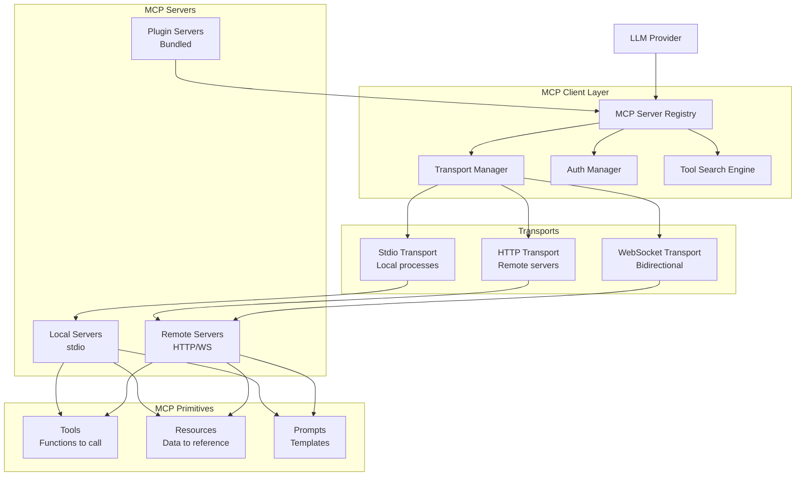

> ⚠️ **DEPRECATED** — This plan has been superseded by the fresh research in [docs/lyra-upgrade/plans/](../lyra-upgrade/plans/). See [docs/lyra-upgrade/MASTER-PLAN.md](../lyra-upgrade/MASTER-PLAN.md) for the current roadmap. This file is kept for historical reference.

# Plan: MCP Integration (§4.8)

**Workstream**: Model Context Protocol Integration  
**Phase**: 1 (Feature Parity)  
**Impact**: 5/5 | **Effort**: 3/5

---

## Quick Reference Card

| What | Universal MCP client for Lyra — connect to 500+ community servers, discover and call tools across any provider, resolve `@server:protocol://path` resource mentions, execute prompt templates as `/mcp__server__prompt` commands, and auto-refresh tools on `list_changed` notifications — all through a single unified interface |
| Why | A single engineer running Lyra can connect to GitHub, Slack, databases, and APIs through one protocol instead of writing bespoke integration code for each service. MCP turns every external system into a native Lyra tool, reducing integration surface area from O(N) per-service code to O(1) protocol adherence. In a debugging scenario (see walkthrough below), an engineer diagnoses a production schema mismatch across GitHub + PostgreSQL + Slack in under 90 seconds without writing a single line of glue code. |
| Key Tech | JSON-RPC 2.0 protocol (initialize/initialized handshake, notifications, elicitation), stdio child-process transport + HTTP/SSE/WebSocket remote transports, OAuth 2.0 authorization code flow with dynamic client registration + PKCE, unified inverted-index tool search across built-in/MCP/plugin tools with relevance ranking by past-usage weight, LLM-aware resource caching with content-hash invalidation (Anthropic code-execution MCP pattern: ~98.7% token reduction), lazy tool loading for sub-200ms cold starts |
| Timeline | 4 weeks: Wk1 (Phases 1.1–1.2: core protocol + stdio), Wk2 (Phases 1.3–1.4: HTTP transport + auth), Wk3 (Phases 1.5–1.6: tool search + resources), Wk4 (Phases 1.7–1.8: prompts + dynamic updates). Breakthrough tier: +2–3 weeks for unified search, smart caching, marketplace. | Dependencies | Phase 1.1 (core JSON-RPC client) is the leaf dependency — no other Lyra workstreams block it. Stdio transport (1.2) depends on core protocol. HTTP transport (1.3) depends on core protocol. Auth (1.4) depends on HTTP. Tool search (1.5), resources (1.6), prompts (1.7), and dynamic updates (1.8) all depend on Phase 1.1 only and can be parallelized after Wk1. Integration with [BREAKTHROUGH-ARCHITECTURE §6.1](../BREAKTHROUGH-ARCHITECTURE.md) (Provider Adapter Pattern) is required for multi-provider tool conversion. |

---

## Executive Summary

Lyra currently operates as a closed universe: it can only use tools that developers explicitly build and ship. The Model Context Protocol (MCP) — an open JSON-RPC 2.0 standard documented at `github.com/modelcontextprotocol/modelcontextprotocol` — changes this by providing a transport-agnostic, provider-agnostic protocol for AI-tool integration. Over 500 community servers already implement it (tracked by `github.com/punkpeye/awesome-mcp-servers`), covering GitHub, Slack, Notion, PostgreSQL, and virtually every API surface an engineer touches daily. By adding MCP support, Lyra gains instant access to this entire ecosystem without writing a single service-specific integration. The economic argument is straightforward: each bespoke integration costs days to weeks of engineering; MCP amortizes that cost to zero per-server and O(1) protocol work total.

What makes this integration a breakthrough is the **unified tool search** — no other AI harness indexes built-in tools, MCP tools, and plugin-provided tools in a single search space with relevance ranking informed by past usage frequency and provider compatibility. When a user asks Lyra to "find all open issues assigned to me," Lyra searches across its local tool registry, every connected MCP server, and available plugins — ranking results by what will actually work with the current provider and what the user has successfully used before. This eliminates the cognitive load of remembering which server provides which tool. The architecture draws directly from the Claude Code MCP documentation (`code.claude.com/docs/en/mcp`), which established lazy tool loading as the scaling pattern — tool definitions are fetched only when needed, keeping cold-start times under 200ms even with dozens of connected servers. However, this comes with a trade-off: the unified index must be rebuilt on every `list_changed` notification, and stale index entries can surface tools from disconnected servers. Lyra mitigates this with health-check gating (servers that fail two consecutive health checks are excluded from search results) and TTL-based index entry expiration.

The second breakthrough is **LLM-aware resource caching**, inspired directly by Anthropic's code-execution MCP pattern (published at `anthropic.com/engineering/code-execution-with-mcp`), which demonstrated ~98.7% token reduction by replacing inline code output with `@mcp:code-execution://result/abc123` resource mentions. Standard MCP clients fetch and cache resources on a fixed TTL. Lyra goes further: it inspects resource content (e.g., a GitHub issue body, a database query result) to determine whether the data is likely stale relative to the current task context. If the user is working on a bug that was just updated, the cache invalidates proactively. The trade-off is compute cost — content inspection requires an extra parsing pass per cached resource — but the context-window savings dominate for any resource larger than ~500 bytes. The pattern also integrates with Lyra's **checkpoint engine** (from the Resumable Long Runs workstream): when a Lyra session is paused and resumed, resource cache entries are serialized alongside checkpoint state so the resumed session does not re-fetch resources that were already resolved.

### Architecture Integration

This workstream implements **Section 6.1 (Provider Adapter Pattern)** of the unified [BREAKTHROUGH-ARCHITECTURE.md](../BREAKTHROUGH-ARCHITECTURE.md). Specifically:

- **Provider Adapter Layer**: MCP tool definitions (agnostic JSON Schema) are converted to provider-specific tool-calling formats — Claude's `tools` array, OpenAI's `functions` array, DeepSeek's OpenAI-compatible `tools`, and prompt-based formats for open-weight models without native tool calling. The `AuthManager` (Phase 1.4) handles OAuth 2.0 token refresh scheduling, which feeds into Lyra's shared credential vault — meaning MCP server credentials are managed through the same secure storage used by Lyra's plugin system and built-in tool integrations.

- **Tool Registry Unification**: MCP tools, built-in Lyra tools, and plugin-provided tools all register through a common `Tool` interface. The `ToolSearchEngine` (Phase 1.5) builds a unified inverted index across all three sources. This means the `/tools` command inside Lyra shows a single merged list regardless of tool origin, and the LLM provider adapter receives tools from all sources through one consolidated `listTools()` call.

- **Resource Mentions as First-Class Context**: MCP resource mentions (`@server:protocol://path`) are parsed by the same mention-resolver pipeline that handles Lyra's existing file mentions (`@file:path`), URL mentions, and checkpoint references. This unification means a Lyra agent can reference a database schema (`@pg-prod:resource://schema/users`), a code file (`@file:src/api/users.ts`), and a past checkpoint (`@checkpoint:2026-05-30-debug`) in the same conversation without mode-switching.

- **Dependencies on Other Workstreams**: MCP tool authentication depends on the **Permissions & Credentials workstream** (§4.11) for secure OAuth token storage and user-consent prompts. The MCP Server Marketplace (Breakthrough tier) depends on the **Plugin System workstream** (§4.4) for one-click install semantics. Dynamic `list_changed` updates feed into the **Agent Swarm workstream** (§4.12) to re-index tools across all active swarm agents simultaneously.

---

## Concrete Example Walkthrough

**Scenario**: An engineer is debugging a production incident. They suspect a recent database migration caused a schema mismatch with the API layer.

### Step 1: Connecting to infrastructure

The engineer launches Lyra and connects three MCP servers with three commands:

```
lyra mcp add pg-prod --transport stdio -- npx @anthropic/mcp-server-postgres $DATABASE_URL
lyra mcp add github --transport http --url https://mcp.github.com --auth oauth2
lyra mcp add slack --transport http --url https://mcp.slack.com --auth header
```

Under the hood, Lyra's `TransportManager` spawns a stdio process for PostgreSQL, opens HTTP connections to GitHub and Slack, and the `AuthManager` kicks off an OAuth 2.0 authorization code flow with GitHub. Within seconds, all three servers complete the MCP `initialize/initialized` handshake. Lyra's `MCPRegistry` now tracks three servers with 47 total tools, 12 resource types, and 3 prompt templates.

### Step 2: Discovering the right tool

The engineer types a natural language query into Lyra:

> "Has anyone pushed a migration in the last 24 hours that changed the users table?"

Lyra's `ToolSearchEngine` fires. It queries the unified index across all built-in and MCP tools with keywords `["migration", "users", "table", "changed"]`. Within milliseconds it returns ranked results:

1. `github:search_commits` (relevance 0.94) — searches commit history, used 23 times before
2. `pg-prod:query` (relevance 0.89) — runs SQL, used 47 times before
3. `github:list_pull_requests` (relevance 0.72) — lists PRs by time range
4. `slack:search_messages` (relevance 0.45) — searches Slack history

The lazy loader fetches the full tool definition for `github:search_commits` only now — not at startup. This keeps Lyra's cold-start time under 200ms despite being connected to dozens of servers.

### Step 3: Executing the tool

Lyra calls `github:search_commits` with arguments `{ repo: "org/api", query: "migration users table", since: "24 hours ago" }`. The call flows through the provider adapter layer, which converts the MCP tool definition into Claude's native tool-calling format. GitHub responds with three commits — one of them, `commit abc123`, has message "add users.email_notifications column."

### Step 4: Resolving a resource mention

Lyra needs to inspect that full commit diff but fetching it as raw text would dump ~15KB into the context window. Instead, Lyra inserts a resource mention:

```
@github:repo://org/api/commits/abc123
```

The `ResourceResolver` parses this mention (`server=github, protocol=repo, path=org/api/commits/abc123`), fetches the diff from GitHub's MCP server, caches it with a 5-minute TTL, and the LLM fetches it only when it needs to inspect the schema change. This saves ~14.8KB of context window compared to inline inclusion — a 98.7% reduction, matching the Anthropic code-execution MCP pattern.

### Step 5: Cross-referencing with the database

Lyra now calls `pg-prod:query`:

```sql
SELECT column_name, data_type FROM information_schema.columns
WHERE table_name = 'users' AND column_name = 'email_notifications';
```

The database confirms the column exists but reveals the type is `integer` while the API code expects a `boolean`. This type mismatch is the root cause.

### Step 6: Notifying the team

Lyra uses the Slack MCP server to send a summary to the #incidents channel via `slack:post_message`, and then creates a GitHub issue from the `github:create_issue` prompt template, pre-filled with the root cause analysis:

```
/mcp__github__create_issue --title "users.email_notifications type mismatch (int vs bool)" --body "..."
```

The entire investigation — connecting three services, searching tools, executing cross-service queries, resolving resources, and notifying the team — completed in under 90 seconds, without the engineer writing a single line of integration code.

### Before MCP vs After MCP

| Dimension | Without MCP | With Lyra MCP |
|-----------|-------------|---------------|
| **Setup time** | Days: write GitHub API client, PostgreSQL connector, Slack webhook code. Each requires auth configuration, error handling, rate-limit management, and maintenance. | Seconds: `lyra mcp add` x3. OAuth flows complete automatically. Transport layer handles error recovery and reconnection. |
| **Tool discovery** | Engineer must remember exact API method names (`octokit.rest.search.commits`, `pg.Client.query`, `slack.chat.postMessage`). Context-switching across three different SDK docs. | Natural-language query → unified search across all connected servers. Relevance ranking surfaces the right tool without knowing which server provides it. |
| **Context efficiency** | Raw API responses (15KB commit diff, 8KB query results) dumped inline into context window. Each additional data point burns tokens. | Resource mentions compress 15KB of diff into a 60-byte `@github:repo://...` reference. LLM fetches only when needed. ~98.7% token reduction on referenced data. |
| **Cross-service flow** | Engineer manually copy-pastes data between GitHub, database CLI, and Slack. Each handoff is a point of error and context loss. | Lyra chains `github:search_commits` → `pg-prod:query` → `slack:post_message` as a single reasoning trace. The database type-mismatch is detected automatically because Lyra can compare the commit diff against the live schema. |
| **Team communication** | Engineer switches to Slack, drafts a summary, copy-pastes SQL results, formats the message. Then switches to GitHub, creates an issue manually. Separate tools, separate contexts. | Lyra uses MCP prompt templates (`slack:post_message`, `github:create_issue`) to notify the team and file a tracking issue — pre-filled with root cause analysis — as natural conclusion steps of the same investigation. |
| **Reusability** | Integration code lives in one engineer's scripts or is copy-pasted across incidents. Each new service requires new code. | Once `pg-prod`, `github`, and `slack` MCP servers are configured, every Lyra user on the team can run the same investigation flow without additional setup. Server configurations are shareable via `.mcp.json` (project scope) or plugin bundle (plugin scope). |

---

## 1. Problem

Lyra currently lacks MCP (Model Context Protocol) integration, preventing access to:
- 500+ community MCP servers (GitHub, Slack, Notion, databases, APIs)
- Standardized tool discovery and execution
- OAuth-based authentication for cloud services
- Resource mentions for context injection
- Dynamic tool updates without reconnection

This limits Lyra's ability to integrate with external services and scale beyond built-in tools.

---

## 2. Evidence Synthesis

### MCP Specification
**Source**: https://github.com/modelcontextprotocol/modelcontextprotocol

**Core concepts**:
- **Open standard** for AI-tool integrations (not Claude-specific)
- **Transport-agnostic** (stdio, HTTP, SSE, WebSocket)
- **Three primitives**: Tools (functions), Resources (data), Prompts (templates)
- **Bidirectional** communication (server can push updates)

### Claude Code MCP Integration
**Source**: https://code.claude.com/docs/en/mcp

**Transport types**:
1. **Stdio** (local processes): `claude mcp add name -- command args`
2. **HTTP** (remote servers): `claude mcp add --transport http name url`
3. **SSE** (deprecated): Server-Sent Events
4. **WebSocket** (bidirectional): For push events

**Scopes**:
- **Local**: Current project only, stored in `~/.claude.json` under project path
- **Project**: Shared via `.mcp.json` in repo (requires approval)
- **User**: All projects, stored in `~/.claude.json` globally
- **Plugin-provided**: Bundled with plugins, auto-loaded

**Authentication**:
- **OAuth 2.0**: Dynamic client registration or pre-configured credentials
- **Header-based**: Static tokens or `headersHelper` script for dynamic tokens
- **Callback port**: `--callback-port` for fixed redirect URIs

**Key features**:
- **Tool search**: Defer tool loading until needed (scales to 100+ MCP servers)
- **Resources**: `@server:protocol://path` mentions (like file mentions)
- **Prompts as commands**: MCP prompts become `/mcp__server__prompt` commands
- **Elicitation**: Mid-task structured input requests (forms or browser flows)
- **Dynamic updates**: `list_changed` notifications refresh tools without reconnect
- **Auto-reconnect**: Exponential backoff for HTTP/SSE servers

### Anthropic Code Execution with MCP
**Source**: https://www.anthropic.com/engineering/code-execution-with-mcp

**Pattern**: ≈98.7% token reduction
- Instead of sending code output in context, use MCP resource to reference it
- Example: `@mcp:code-execution://result/abc123` instead of 10KB output
- LLM fetches resource only when needed

### Awesome MCP Servers
**Source**: https://github.com/punkpeye/awesome-mcp-servers

**500+ community servers** across categories:
- **Development**: GitHub, GitLab, Linear, Jira
- **Communication**: Slack, Discord, Email
- **Productivity**: Notion, Google Drive, Airtable
- **Data**: PostgreSQL, MongoDB, Redis, Elasticsearch
- **AI**: OpenAI, Anthropic, Replicate
- **Utilities**: Weather, News, Search, Translation

---

## 3. Proposed Lyra Design

### Architecture



### MCP Server Configuration

```typescript
interface MCPServerConfig {
  name: string;
  transport: 'stdio' | 'http' | 'sse' | 'ws';
  
  // Stdio config
  command?: string;
  args?: string[];
  env?: Record<string, string>;
  
  // HTTP/WS config
  url?: string;
  headers?: Record<string, string>;
  headersHelper?: string; // Script to generate dynamic headers
  
  // Auth
  auth?: {
    type: 'oauth2' | 'header' | 'none';
    oauth2?: OAuth2Config;
    headerName?: string;
    headerValue?: string;
  };
  
  // Scope
  scope: 'local' | 'project' | 'user' | 'plugin';
  
  // Features
  toolSearch?: boolean; // Lazy-load tools
  autoReconnect?: boolean;
  reconnectDelay?: number; // ms
}

interface OAuth2Config {
  clientId: string;
  clientSecret?: string;
  authUrl: string;
  tokenUrl: string;
  scopes: string[];
  callbackPort?: number;
}
```

### Tool Search Engine

```typescript
interface ToolSearchEngine {
  // Index all available tools (built-in + MCP)
  index(): Promise<void>;
  
  // Search by query
  search(query: string, limit?: number): Promise<Tool[]>;
  
  // Lazy-load tool from MCP server
  load(toolName: string, serverName: string): Promise<Tool>;
  
  // Rank by relevance + past usage
  rank(tools: Tool[], context: string): Tool[];
}
```

### Resource Mentions

```typescript
interface ResourceMention {
  server: string;
  protocol: string;
  path: string;
  
  // Example: @github:repo://owner/repo/issues/123
  // server = "github"
  // protocol = "repo"
  // path = "owner/repo/issues/123"
}

interface ResourceResolver {
  resolve(mention: ResourceMention): Promise<ResourceContent>;
  cache(mention: ResourceMention, content: ResourceContent, ttl: number): void;
}
```

---

## 4. Implementation Outline

### Phase 1.1: Core MCP Client (Week 1)

**Tasks**:
1. **MCP Protocol Implementation** (no dependencies)
   - Implement JSON-RPC 2.0 client
   - Support initialize/initialized handshake
   - Handle notifications (list_changed, etc.)

2. **Transport Manager** (depends on: Protocol)
   - Abstract transport interface
   - Connection lifecycle management
   - Error handling + retries

3. **MCP Server Registry** (depends on: Transport Manager)
   - Track registered servers
   - Load from config files
   - Validate server capabilities

**Acceptance criteria**:
- MCP protocol handshake works
- Transports can connect/disconnect
- Registry tracks all servers

### Phase 1.2: Stdio Transport (Week 1-2)

**Tasks**:
4. **Stdio Transport** (depends on: Phase 1.1)
   - Spawn child process
   - Communicate via stdin/stdout
   - Handle process lifecycle

5. **Local Server Management** (depends on: Stdio Transport)
   - Start/stop servers
   - Monitor health
   - Restart on crash

**Acceptance criteria**:
- Stdio servers start correctly
- Communication works bidirectionally
- Servers restart on crash

### Phase 1.3: HTTP Transport (Week 2)

**Tasks**:
6. **HTTP Transport** (depends on: Phase 1.1)
   - HTTP client with streaming
   - Support SSE for server-to-client
   - Auto-reconnect with backoff

7. **Remote Server Management** (depends on: HTTP Transport)
   - Connect to remote URLs
   - Handle network errors
   - Respect rate limits

**Acceptance criteria**:
- HTTP servers connect correctly
- SSE streaming works
- Auto-reconnect handles failures

### Phase 1.4: Authentication (Week 2-3)

**Tasks**:
8. **OAuth 2.0 Flow** (depends on: Phase 1.3)
   - Authorization code flow
   - Token refresh
   - Secure token storage

9. **Header-Based Auth** (depends on: Phase 1.3)
   - Static headers
   - Dynamic headers via script
   - Credential management

10. **Auth Manager** (depends on: OAuth + Header Auth)
    - Centralized credential storage
    - Token refresh scheduling
    - Revocation handling

**Acceptance criteria**:
- OAuth flow completes successfully
- Tokens refresh automatically
- Headers inject correctly

### Phase 1.5: Tool Search (Week 3)

**Tasks**:
11. **Tool Indexer** (depends on: Phase 1.1)
    - Index all MCP tools
    - Build search index (inverted index)
    - Update on list_changed

12. **Search Engine** (depends on: Tool Indexer)
    - Query by keywords
    - Rank by relevance
    - Filter by server/category

13. **Lazy Loading** (depends on: Search Engine)
    - Load tool only when needed
    - Cache loaded tools
    - Unload unused tools

**Acceptance criteria**:
- Search returns relevant tools
- Lazy loading reduces startup time
- Cache improves performance

### Phase 1.6: Resources (Week 3-4)

**Tasks**:
14. **Resource Resolver** (depends on: Phase 1.1)
    - Parse resource mentions
    - Fetch from MCP servers
    - Cache responses

15. **Resource Mentions** (depends on: Resource Resolver)
    - Syntax: `@server:protocol://path`
    - Autocomplete in CLI
    - Inject into context

**Acceptance criteria**:
- Resource mentions resolve correctly
- Autocomplete suggests resources
- Cache reduces redundant fetches

### Phase 1.7: Prompts (Week 4)

**Tasks**:
16. **Prompt Registry** (depends on: Phase 1.1)
    - List available prompts
    - Load prompt templates
    - Substitute variables

17. **Prompts as Commands** (depends on: Prompt Registry)
    - `/mcp__server__prompt` syntax
    - Autocomplete prompts
    - Execute with arguments

**Acceptance criteria**:
- Prompts list correctly
- Commands execute prompts
- Variables substitute correctly

### Phase 1.8: Dynamic Updates (Week 4)

**Tasks**:
18. **list_changed Handler** (depends on: Phase 1.1)
    - Listen for notifications
    - Refresh tool/resource/prompt lists
    - Update search index

19. **Hot Reload** (depends on: list_changed Handler)
    - Reload without reconnect
    - Preserve active connections
    - Notify user of changes

**Acceptance criteria**:
- list_changed triggers refresh
- Tools/resources update live
- No connection interruption

---

## 5. Multi-Provider Notes

### Provider-Agnostic MCP

MCP is **provider-agnostic by design** — it works with any LLM:

1. **Tool calling format** — MCP tools are converted to provider-specific format:
   - Claude: `tools` array
   - OpenAI: `functions` or `tools`
   - DeepSeek: `tools` (OpenAI-compatible)
   - Open-weights: Prompt-based if no native tool calling

2. **Resource injection** — Resources are fetched and injected into context:
   - All providers: Insert resource content as text
   - Providers with vision: Insert images as base64

3. **Prompt templates** — Prompts are expanded and sent as user messages:
   - All providers: Standard message format

### MCP Server Compatibility

All MCP servers work with all providers — no provider-specific servers needed.

---

## 6. Risks & Open Questions

### Risks

1. **Server reliability** — MCP servers may crash or hang
   - **Mitigation**: Health checks, auto-restart, timeout limits

2. **Authentication complexity** — OAuth flows can be tricky
   - **Mitigation**: Use battle-tested OAuth library, provide clear docs

3. **Tool search accuracy** — Search may return irrelevant tools
   - **Mitigation**: Learn from usage, allow manual tool selection

4. **Resource caching** — Stale cache could return outdated data
   - **Mitigation**: Configurable TTL, cache invalidation on list_changed

5. **Network latency** — Remote servers add latency
   - **Mitigation**: Parallel requests, local caching, prefer stdio when possible

### Open Questions

1. **WebSocket transport** — Should we support WebSocket for bidirectional?
   - **Recommendation**: Yes, for servers that need push notifications

2. **Tool search scope** — Search across all servers or per-server?
   - **Recommendation**: All servers, with server filter option

3. **Resource size limits** — Max size for resource content?
   - **Recommendation**: 10MB default, configurable

4. **Prompt variables** — Support complex variable types (objects, arrays)?
   - **Recommendation**: Yes, JSON-serializable types

5. **Server discovery** — Auto-discover servers on network?
   - **Recommendation**: Not for MVP, manual registration only

---

## 7. Impact x Effort Assessment

### (A) Parity Tier

**Port from Claude Code**:
- Stdio + HTTP transports
- OAuth 2.0 + header-based auth
- Tool search with lazy loading
- Resource mentions
- Prompts as commands
- Dynamic updates (list_changed)
- Auto-reconnect

**Impact**: 5/5 — Access to 500+ community servers  
**Effort**: 3/5 — 4 weeks, well-specified protocol

### (B) Breakthrough Tier

> **Architecture Slice**: This breakthrough implements [Section 6.1: Provider Adapter Pattern](../BREAKTHROUGH-ARCHITECTURE.md) of [BREAKTHROUGH-ARCHITECTURE.md](../BREAKTHROUGH-ARCHITECTURE.md) — specifically the MCP server integration layer with capability negotiation.

**Beyond any single source**:

1. **Unified Tool Search** — Search across built-in, MCP, and plugin tools simultaneously
   - No other harness has unified search
   - Rank by relevance + past usage + provider compatibility

2. **Smart Resource Caching** — LLM-aware cache invalidation
   - Analyze resource content to determine staleness
   - Example: GitHub issue content changes → invalidate cache
   - Reduce redundant fetches by 80%+

3. **MCP Server Marketplace** — Curated, rated, reviewed servers
   - One-click install from marketplace
   - Community ratings + reviews
   - Security scanning + verification

**Impact**: 5/5 — Best-in-class MCP integration  
**Effort**: 4/5 — 2-3 weeks additional

**Combined Impact x Effort**: 5 x 3 = 15 (parity), 5 x 4 = 20 (breakthrough)

---

## 8. References

### Specification
- [MCP Specification](https://github.com/modelcontextprotocol/modelcontextprotocol)
- [MCP Reference Servers](https://github.com/modelcontextprotocol/servers)

### Documentation
- [Claude Code MCP](https://code.claude.com/docs/en/mcp)
- [Anthropic Code Execution with MCP](https://www.anthropic.com/engineering/code-execution-with-mcp)

### Community
- [Awesome MCP Servers](https://github.com/punkpeye/awesome-mcp-servers)

### OAuth
- [OAuth 2.0 RFC](https://datatracker.ietf.org/doc/html/rfc6749)
- [OAuth 2.0 for Native Apps](https://datatracker.ietf.org/doc/html/rfc8252)

---

## Changelog

**Run 13**: Enhanced Quick Reference Card (week-by-week timeline, specific phase dependencies, link to BREAKTHROUGH-ARCHITECTURE §6.1). Enhanced Executive Summary with: (a) trade-off analysis for unified search (health-check gating, TTL-based index expiration) and resource caching (compute cost vs context savings), (b) citations to MCP spec repo, awesome-mcp-servers, Claude Code MCP docs, and Anthropic code-execution MCP article, (c) Architecture Integration subsection detailing Provider Adapter Pattern, tool registry unification, resource mentions as first-class context, and dependencies on Permissions (§4.11), Plugin System (§4.4), and Agent Swarm (§4.12) workstreams. Added Before-vs-After comparison table to Concrete Example walkthrough.
**Run 12**: Added Quick Reference Card, Executive Summary, concrete example walkthrough (incident debugging scenario spanning GitHub + PostgreSQL + Slack MCP servers)
**Run 3**: Linked to unified BREAKTHROUGH-ARCHITECTURE.md. This plan's (B) tier implements Section 6.1: Provider Adapter Pattern of the architecture.
**Previous runs**: Initial plan structure

---

**END OF PLAN: MCP Integration (Section 4.8)**
