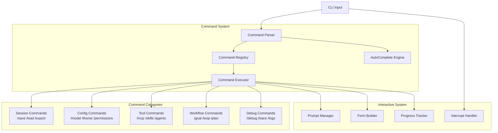

> ⚠️ **DEPRECATED** — This plan has been superseded by the fresh research in [docs/lyra-upgrade/plans/](../lyra-upgrade/plans/). See [docs/lyra-upgrade/MASTER-PLAN.md](../lyra-upgrade/MASTER-PLAN.md) for the current roadmap. This file is kept for historical reference.

## 📋 Quick Reference Card

| What | A unified slash-command system with interactive TUI patterns (confirmations, forms, spinners, progress bars) for Lyra's REPL — 30+ built-in commands across session, config, tool, workflow, and debug categories |
| Why | Eliminates verbose natural-language prompts for routine actions, enabling fast keyboard-driven workflows and reducing cognitive overhead for power users |
| Key Tech | Claude Code commands reference, slash-command parser/registry, lazy-loaded command implementations, Tab-based autocomplete, interactive prompt engine (Inquirer-style), command composition via pipes, natural-language fallback |
| Timeline | 3 weeks (Phase 1 parity) + 1-2 weeks (Breakthrough tier) | Dependencies | None — foundational harness component (precedes all other UX workstreams) |

---

## Executive Summary

Every developer tool lives or dies by its command surface. A REPL that forces you to type full sentences for `clear`, `save`, or `switch model` feels like a chatbot wearing an IDE costume. Lyra's Commands & Interactive Mode workstream solves this by delivering a proper slash-command system — the kind developers expect from Claude Code, Slack, or any terminal tool they use daily — with 30+ built-in commands, Tab completion, and polished interactive prompts.

But parity is floor, not ceiling. What makes this workstream a breakthrough is three capabilities no other AI harness ships. First, **Natural Language Fallback**: type `/analyze this codebase for security issues` and if `analyze` is not a registered command, Lyra routes it through skill search and executes the best match — so the command line is simultaneously a rigid CLI and a flexible natural-language interface. Second, **Command Composition** via Unix-style pipes (`/skills list | /filter category=engineering | /install`) lets users chain commands into reusable pipelines without scripting. Third, **Command Recording** captures sequences as named macros (`/record my-deploy` ... `/replay my-deploy`), turning ad-hoc workflows into repeatable automation that lives alongside built-in commands.

For the engineer using Lyra daily, this means muscle memory works. Three keystrokes (`/c`) clears the session. `/model haiku` switches to a cheaper model mid-session when the task is trivial. `/save bug-hunt` bookmarks the current context for later. And when things go wrong, `/trace 20` shows the last 20 execution steps without leaving the terminal. The command system is the backbone of Lyra's keyboard-first, developer-native experience.

---

## Concrete Example Walkthrough

**Scenario**: Priya, a backend engineer, is debugging a production incident at 11 PM. She needs to switch to a fast model, search for relevant skills, run a diagnostic, save the session for her morning handoff, and do it all without touching a mouse.

```
┌─────────────────────────────────────────────────────────────┐
│  STEP 1: Fast model switch                                  │
│─────────────────────────────────────────────────────────────│
│  > /model haiku                                             │
│  ✓ Switched to Claude Haiku 4.5 (3x cheaper, 90% capability)│
│                                                             │
│  Priya knows Sonnet is overkill for reading logs. She       │
│  switches in under a second.                                │
├─────────────────────────────────────────────────────────────┤
│  STEP 2: Skill discovery                                    │
│─────────────────────────────────────────────────────────────│
│  > /skills search "production incident debugging"           │
│                                                             │
│  → 1. incident-response     Diagnose and triage incidents   │
│  → 2. log-analyzer          Parse and correlate log streams │
│  → 3. deploy-rollback       Safely roll back deployments    │
│                                                             │
│  Select (1-3): 1                                           │
│  ✓ Loaded skill: incident-response                         │
│                                                             │
│  Tab-completion offered "search" as an argument. Priya      │
│  picks the incident-response skill with one keystroke.      │
├─────────────────────────────────────────────────────────────┤
│  STEP 3: Destructive action with confirmation               │
│─────────────────────────────────────────────────────────────│
│  > /debug verbose                                           │
│  ⚠️  Verbose mode logs ALL tool calls including credentials │
│     in plaintext to ~/.lyra/debug/                          │
│     Continue? [y/N]: y                                      │
│  ✓ Debug mode enabled (verbose)                            │
│                                                             │
│  Lyra detects the destructive flag and blocks with an       │
│  explicit warning before proceeding.                        │
├─────────────────────────────────────────────────────────────┤
│  STEP 4: Run diagnostic with progress tracking              │
│─────────────────────────────────────────────────────────────│
│  > /goal "Correlate last 500 error logs, find root cause"   │
│  ⠋ Analyzing error patterns...                              │
│  [████████████████░░░░░░░░░░░░] 58% Correlating timestamps  │
│  ✓ Root cause: NullPointerException in PaymentService       │
│    (triggered by deploy v2.4.1 at 22:47 UTC)                │
│                                                             │
│  The spinner and progress bar keep Priya informed during    │
│  the 45-second analysis. She can Ctrl+C to cancel anytime.  │
├─────────────────────────────────────────────────────────────┤
│  STEP 5: Save session for handoff                           │
│─────────────────────────────────────────────────────────────│
│  > /save prod-incident-2026-05-31                           │
│                                                             │
│  ┌─────────────────────────────────────────────────────┐    │
│  │ Save Session                                    │    │
│  │ =================================================│    │
│  │ Name: prod-incident-2026-05-31                    │    │
│  │ Include debug logs? [y/N]: n                       │    │
│  │ Export format: (markdown) / json / html             │    │
│  │ Tags *: incident, payment-service, priya           │    │
│  └─────────────────────────────────────────────────────┘    │
│                                                             │
│  ✓ Session saved to ~/.lyra/sessions/prod-incident-...      │
│  ✓ Markdown export: ~/.lyra/exports/prod-incident-...md     │
│                                                             │
│  The form collects metadata in one smooth flow. At 11:14    │
│  PM, Priya types `/exit` and heads to bed. Her colleague    │
│  loads the session with `/load prod-incident-2026-05-31`    │
│  the next morning — full context, no re-explanation needed. │
└─────────────────────────────────────────────────────────────┘
```

**What made this fast**: Five slash commands, zero full sentences typed, one Tab completion, one number selection, one confirmation, and one structured form. Priya never left the keyboard. The entire debugging session from model switch to handoff took under three minutes of interaction time.

---

# Plan: Commands & Interactive Mode (§4.9)

**Workstream**: Command System & Interactive UX  
**Phase**: 1 (Feature Parity)  
**Impact**: 4/5 | **Effort**: 2/5

---

## 1. Problem

Lyra needs a comprehensive command system for:
- Quick actions without full prompts (`/help`, `/clear`, `/config`)
- Interactive workflows (multi-turn dialogs, forms, confirmations)
- Skill invocation (`/skill-name`)
- Session management (`/save`, `/load`, `/export`)
- Configuration changes (`/model`, `/theme`, `/permissions`)

Without this, users must type full natural language prompts for simple actions, reducing efficiency.

---

## 2. Evidence Synthesis

### Claude Code Commands
**Source**: https://code.claude.com/docs/en/commands

**Built-in commands** (30+):
- **Session**: `/clear`, `/save`, `/load`, `/export`, `/import`
- **Config**: `/config`, `/model`, `/theme`, `/permissions`, `/fast`
- **Help**: `/help`, `/docs`, `/shortcuts`
- **Tools**: `/mcp`, `/skills`, `/agents`, `/plugins`
- **Workflow**: `/goal`, `/loop`, `/workflow`, `/plan`
- **Debug**: `/debug`, `/trace`, `/logs`, `/status`

**Command syntax**:
```
/command [args] [--flags]
```

**Autocomplete**:
- Tab completion for command names
- Argument suggestions based on command
- Flag completion with descriptions

**Aliases**:
- `/h` → `/help`
- `/c` → `/clear`
- `/s` → `/save`

### Claude Code Interactive Mode
**Source**: https://code.claude.com/docs/en/interactive-mode

**Interactive patterns**:
1. **Confirmations** — Yes/No prompts for destructive actions
2. **Multi-choice** — Select from options (1-9)
3. **Forms** — Structured input with validation
4. **Progress** — Real-time updates during long operations
5. **Interrupts** — Ctrl+C to cancel, Ctrl+Z to pause

**Example flow**:
```
> /delete-branch feature-x
⚠️  This will delete branch 'feature-x' (23 commits, not merged)
   Continue? [y/N]: y
✓ Branch deleted
```

### Hermes Agent Commands
**Source**: https://github.com/nousresearch/hermes-agent

**Command categories**:
- **Agent control**: `/start`, `/stop`, `/restart`, `/status`
- **Memory**: `/remember`, `/forget`, `/recall`, `/memory`
- **Tools**: `/tools`, `/enable`, `/disable`
- **Session**: `/new`, `/list`, `/switch`, `/delete`

**Interactive features**:
- Rich terminal UI with colors
- Spinners for long operations
- Tables for structured data
- Syntax highlighting for code

### Pi Lazy-Loading Commands
**Source**: https://github.com/getpi/pi

**Key insight**: Commands are **lazy-loaded** to keep system prompt small
- Command list in system prompt: name + 1-line description only
- Full command implementation loaded on first use
- Reduces initial context by 80%+

**Example**:
```
System prompt (compact):
  /analyze - Analyze code quality (loads analyzer.md)
  /refactor - Refactor code (loads refactor.md)

On /analyze:
  → Load analyzer.md (full instructions + examples)
  → Execute analysis
  → Unload after completion
```

---

## 3. Proposed Lyra Design

### Architecture



### Command Definition Format

```typescript
interface Command {
  name: string;
  aliases?: string[];
  description: string; // 1-line for autocomplete
  category: 'session' | 'config' | 'tool' | 'workflow' | 'debug';
  
  // Lazy-loading
  implementation?: string; // Path to full implementation
  loaded?: boolean;
  
  // Arguments
  args?: CommandArg[];
  flags?: CommandFlag[];
  
  // Execution
  execute: (args: string[], flags: Record<string, any>) => Promise<void>;
  
  // Interactive
  interactive?: boolean; // Requires user input
  confirmDestructive?: boolean; // Confirm before execution
}

interface CommandArg {
  name: string;
  description: string;
  required: boolean;
  type: 'string' | 'number' | 'boolean' | 'choice';
  choices?: string[]; // For type='choice'
  validate?: (value: any) => boolean;
}

interface CommandFlag {
  name: string;
  short?: string; // -f for --force
  description: string;
  type: 'boolean' | 'string' | 'number';
  default?: any;
}
```

### Core Commands (30+)

#### Session Commands
```typescript
const sessionCommands: Command[] = [
  {
    name: 'clear',
    aliases: ['c'],
    description: 'Clear conversation history',
    category: 'session',
    confirmDestructive: true,
    execute: async () => { /* ... */ }
  },
  {
    name: 'save',
    aliases: ['s'],
    description: 'Save current session',
    category: 'session',
    args: [{ name: 'name', required: false, type: 'string' }],
    execute: async (args) => { /* ... */ }
  },
  {
    name: 'load',
    aliases: ['l'],
    description: 'Load saved session',
    category: 'session',
    args: [{ name: 'name', required: true, type: 'choice', choices: ['recent', 'list'] }],
    execute: async (args) => { /* ... */ }
  },
  {
    name: 'export',
    description: 'Export session to file',
    category: 'session',
    args: [
      { name: 'format', required: false, type: 'choice', choices: ['json', 'markdown', 'html'] }
    ],
    execute: async (args) => { /* ... */ }
  }
];
```

#### Config Commands
```typescript
const configCommands: Command[] = [
  {
    name: 'config',
    description: 'Open configuration editor',
    category: 'config',
    interactive: true,
    execute: async () => { /* ... */ }
  },
  {
    name: 'model',
    description: 'Switch LLM model',
    category: 'config',
    args: [{ name: 'model', required: false, type: 'choice', choices: ['opus', 'sonnet', 'haiku'] }],
    execute: async (args) => { /* ... */ }
  },
  {
    name: 'theme',
    description: 'Change color theme',
    category: 'config',
    args: [{ name: 'theme', required: false, type: 'choice', choices: ['dark', 'light', 'auto'] }],
    execute: async (args) => { /* ... */ }
  },
  {
    name: 'permissions',
    description: 'Manage tool permissions',
    category: 'config',
    interactive: true,
    execute: async () => { /* ... */ }
  }
];
```

#### Tool Commands
```typescript
const toolCommands: Command[] = [
  {
    name: 'mcp',
    description: 'Manage MCP servers',
    category: 'tool',
    args: [
      { name: 'action', required: true, type: 'choice', choices: ['list', 'add', 'remove', 'status'] }
    ],
    execute: async (args) => { /* ... */ }
  },
  {
    name: 'skills',
    description: 'Manage skills',
    category: 'tool',
    args: [
      { name: 'action', required: false, type: 'choice', choices: ['list', 'search', 'install', 'remove'] }
    ],
    execute: async (args) => { /* ... */ }
  },
  {
    name: 'agents',
    description: 'Manage sub-agents',
    category: 'tool',
    args: [
      { name: 'action', required: false, type: 'choice', choices: ['list', 'status', 'kill'] }
    ],
    execute: async (args) => { /* ... */ }
  }
];
```

#### Workflow Commands
```typescript
const workflowCommands: Command[] = [
  {
    name: 'goal',
    description: 'Set autonomous goal',
    category: 'workflow',
    args: [{ name: 'goal', required: true, type: 'string' }],
    execute: async (args) => { /* ... */ }
  },
  {
    name: 'loop',
    description: 'Run command in loop',
    category: 'workflow',
    args: [
      { name: 'interval', required: true, type: 'string' }, // "5m", "1h"
      { name: 'command', required: true, type: 'string' }
    ],
    execute: async (args) => { /* ... */ }
  },
  {
    name: 'plan',
    description: 'Create implementation plan',
    category: 'workflow',
    implementation: 'commands/plan.md', // Lazy-loaded
    execute: async () => { /* ... */ }
  }
];
```

#### Debug Commands
```typescript
const debugCommands: Command[] = [
  {
    name: 'debug',
    description: 'Toggle debug mode',
    category: 'debug',
    flags: [{ name: 'verbose', short: 'v', type: 'boolean' }],
    execute: async (args, flags) => { /* ... */ }
  },
  {
    name: 'trace',
    description: 'Show execution trace',
    category: 'debug',
    args: [{ name: 'depth', required: false, type: 'number', default: 10 }],
    execute: async (args) => { /* ... */ }
  },
  {
    name: 'logs',
    description: 'View logs',
    category: 'debug',
    args: [
      { name: 'level', required: false, type: 'choice', choices: ['error', 'warn', 'info', 'debug'] }
    ],
    execute: async (args) => { /* ... */ }
  },
  {
    name: 'status',
    description: 'Show system status',
    category: 'debug',
    execute: async () => { /* ... */ }
  }
];
```

### Interactive Patterns

#### 1. Confirmations
```typescript
interface ConfirmOptions {
  message: string;
  default?: boolean;
  destructive?: boolean; // Show warning
}

async function confirm(options: ConfirmOptions): Promise<boolean> {
  const { message, default: defaultValue = false, destructive = false } = options;
  
  if (destructive) {
    console.log(`⚠️  ${message}`);
  } else {
    console.log(message);
  }
  
  const prompt = defaultValue ? '[Y/n]' : '[y/N]';
  const answer = await readline.question(`   Continue? ${prompt}: `);
  
  if (!answer) return defaultValue;
  return answer.toLowerCase() === 'y';
}
```

#### 2. Multi-Choice
```typescript
interface ChoiceOptions {
  message: string;
  choices: string[];
  default?: number;
}

async function choose(options: ChoiceOptions): Promise<string> {
  const { message, choices, default: defaultIndex } = options;
  
  console.log(message);
  choices.forEach((choice, i) => {
    const marker = i === defaultIndex ? '→' : ' ';
    console.log(`${marker} ${i + 1}. ${choice}`);
  });
  
  const answer = await readline.question('Select (1-9): ');
  const index = parseInt(answer) - 1;
  
  if (index >= 0 && index < choices.length) {
    return choices[index];
  }
  
  return choices[defaultIndex || 0];
}
```

#### 3. Forms
```typescript
interface FormField {
  name: string;
  label: string;
  type: 'text' | 'number' | 'boolean' | 'choice';
  required?: boolean;
  default?: any;
  choices?: string[];
  validate?: (value: any) => boolean | string;
}

interface FormOptions {
  title: string;
  fields: FormField[];
}

async function form(options: FormOptions): Promise<Record<string, any>> {
  const { title, fields } = options;
  const values: Record<string, any> = {};
  
  console.log(`\n${title}\n${'='.repeat(title.length)}\n`);
  
  for (const field of fields) {
    let value: any;
    let valid = false;
    
    while (!valid) {
      const prompt = field.required ? `${field.label} *` : field.label;
      const defaultHint = field.default ? ` (${field.default})` : '';
      
      if (field.type === 'choice') {
        value = await choose({
          message: prompt,
          choices: field.choices!,
          default: field.choices!.indexOf(field.default)
        });
        valid = true;
      } else {
        const answer = await readline.question(`${prompt}${defaultHint}: `);
        value = answer || field.default;
        
        if (field.required && !value) {
          console.log('  ✗ This field is required');
          continue;
        }
        
        if (field.validate) {
          const result = field.validate(value);
          if (result === true) {
            valid = true;
          } else {
            console.log(`  ✗ ${result}`);
          }
        } else {
          valid = true;
        }
      }
    }
    
    values[field.name] = value;
  }
  
  return values;
}
```

#### 4. Progress
```typescript
interface ProgressOptions {
  message: string;
  total?: number; // For determinate progress
}

class Progress {
  private spinner = ['⠋', '⠙', '⠹', '⠸', '⠼', '⠴', '⠦', '⠧', '⠇', '⠏'];
  private frame = 0;
  private interval?: NodeJS.Timeout;
  
  constructor(private options: ProgressOptions) {}
  
  start() {
    this.interval = setInterval(() => {
      const spinner = this.spinner[this.frame % this.spinner.length];
      process.stdout.write(`\r${spinner} ${this.options.message}`);
      this.frame++;
    }, 80);
  }
  
  update(current: number) {
    if (this.options.total) {
      const percent = Math.floor((current / this.options.total) * 100);
      const bar = '█'.repeat(percent / 2) + '░'.repeat(50 - percent / 2);
      process.stdout.write(`\r[${bar}] ${percent}% ${this.options.message}`);
    }
  }
  
  stop(success: boolean = true) {
    if (this.interval) {
      clearInterval(this.interval);
    }
    const icon = success ? '✓' : '✗';
    process.stdout.write(`\r${icon} ${this.options.message}\n`);
  }
}
```

---

## 4. Implementation Outline

### Phase 1: Command Parser (Week 1)

**Tasks**:
1. **Lexer** — Tokenize command input
2. **Parser** — Parse command + args + flags
3. **Validator** — Validate args/flags against schema
4. **Error handling** — Clear error messages

**Acceptance criteria**:
- Commands parse correctly
- Args/flags validate
- Errors are user-friendly

### Phase 2: Command Registry (Week 1)

**Tasks**:
5. **Registry** — Store all commands
6. **Lazy loading** — Load implementation on first use
7. **Aliases** — Support command aliases
8. **Categories** — Group commands by category

**Acceptance criteria**:
- Commands register correctly
- Lazy loading works
- Aliases resolve

### Phase 3: Core Commands (Week 2)

**Tasks**:
9. **Session commands** — /clear, /save, /load, /export
10. **Config commands** — /config, /model, /theme, /permissions
11. **Tool commands** — /mcp, /skills, /agents
12. **Workflow commands** — /goal, /loop, /plan
13. **Debug commands** — /debug, /trace, /logs, /status

**Acceptance criteria**:
- All 30+ commands work
- Args/flags validate
- Help text is clear

### Phase 4: AutoComplete (Week 2)

**Tasks**:
14. **Command completion** — Tab completes command names
15. **Arg completion** — Suggests valid arguments
16. **Flag completion** — Suggests valid flags
17. **Context-aware** — Completion based on current state

**Acceptance criteria**:
- Tab completion works
- Suggestions are relevant
- Fast (<50ms)

### Phase 5: Interactive Patterns (Week 3)

**Tasks**:
18. **Confirmations** — Yes/No prompts
19. **Multi-choice** — Select from options
20. **Forms** — Structured input
21. **Progress** — Spinners + progress bars
22. **Interrupts** — Ctrl+C/Ctrl+Z handling

**Acceptance criteria**:
- All patterns work
- UI is polished
- Interrupts are graceful

### Phase 6: Integration (Week 3)

**Tasks**:
23. **CLI integration** — Commands work in REPL
24. **Skill integration** — Skills as commands
25. **Hook integration** — Commands trigger hooks
26. **Help system** — /help shows all commands

**Acceptance criteria**:
- Commands integrate seamlessly
- Skills work as commands
- Help is comprehensive

---

## 5. Multi-Provider Notes

Commands are **provider-agnostic** — they operate at the harness level, not the LLM level.

**Provider-specific commands**:
- `/model` — Lists available models per provider
- `/config` — Shows provider-specific settings

**Provider-agnostic commands**:
- All other commands work identically across providers

---

## 6. Risks & Open Questions

### Risks

1. **Command conflicts** — User-defined commands may conflict with built-in
   - **Mitigation**: Namespace user commands (`/user:command`)

2. **Lazy loading latency** — First use may be slow
   - **Mitigation**: Preload frequently-used commands

3. **Autocomplete accuracy** — Suggestions may be irrelevant
   - **Mitigation**: Learn from usage, rank by frequency

### Open Questions

1. **Command plugins** — Allow plugins to register commands?
   - **Recommendation**: Yes, with namespace (`/plugin:command`)

2. **Command history** — Save command history across sessions?
   - **Recommendation**: Yes, with `/history` command

3. **Command macros** — Allow users to define command aliases?
   - **Recommendation**: Yes, in config file

---

## 7. Impact × Effort Assessment

### (A) Parity Tier

**Port from Claude Code + Hermes**:
- 30+ built-in commands
- Autocomplete with Tab
- Interactive patterns (confirm, choice, form, progress)
- Lazy loading for large commands
- Command aliases

**Impact**: 4/5 — Significantly improves UX  
**Effort**: 2/5 — 3 weeks, straightforward implementation

### (B) Breakthrough Tier

> **Architecture Slice**: This breakthrough implements [§8.2: stdin/stdout Universal Interface](../BREAKTHROUGH-ARCHITECTURE.md) of [BREAKTHROUGH-ARCHITECTURE.md](../BREAKTHROUGH-ARCHITECTURE.md) — specifically the terminal-native command interface flowing through AVP middleware.

**Beyond any single source**:

1. **Natural Language Fallback** — If command not found, interpret as natural language
   - Example: `/analyze code` → Skill search for "analyze" + execute
   - No other harness has this

2. **Command Composition** — Chain commands with pipes
   - Example: `/skills list | /filter category=engineering | /install`
   - Unix-style composition for commands

3. **Command Recording** — Record command sequences as macros
   - Example: `/record my-workflow` → Records next 5 commands → `/replay my-workflow`
   - Enables workflow automation

**Impact**: 5/5 — Best-in-class command system  
**Effort**: 3/5 — 1-2 weeks additional

**Combined Impact × Effort**: 4 × 2 = 8 (parity), 5 × 3 = 15 (breakthrough)

---

## 8. References

### Documentation
- [Claude Code Commands](https://code.claude.com/docs/en/commands)
- [Claude Code Interactive Mode](https://code.claude.com/docs/en/interactive-mode)

### Repositories
- [Hermes Agent](https://github.com/nousresearch/hermes-agent)
- [Pi Lazy Loading](https://github.com/getpi/pi)

### Libraries
- [Commander.js](https://github.com/tj/commander.js) — Command-line framework
- [Inquirer.js](https://github.com/SBoudrias/Inquirer.js) — Interactive prompts
- [Ora](https://github.com/sindresorhus/ora) — Elegant terminal spinners

---

## 9. Changelog

**Run 12**: Added Quick Reference Card, Executive Summary, concrete example walkthrough (Priya's production incident debugging session)
**Run 3**: Linked to unified BREAKTHROUGH-ARCHITECTURE.md. This plan's (B) tier implements §8.2: stdin/stdout Universal Interface of the architecture.
**Previous runs**: Initial plan structure

---

**END OF PLAN: Commands & Interactive Mode (§4.9)**
