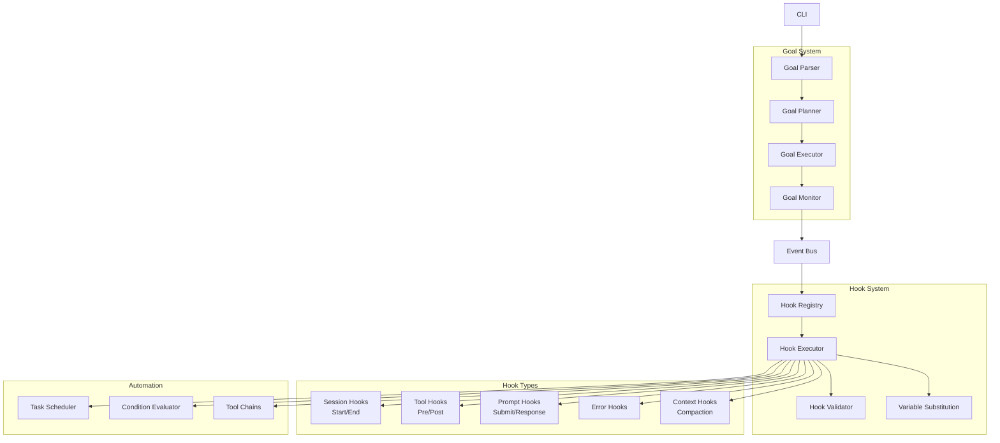

> ⚠️ **DEPRECATED** — This plan has been superseded by the fresh research in [docs/lyra-upgrade/plans/](../lyra-upgrade/plans/). See [docs/lyra-upgrade/MASTER-PLAN.md](../lyra-upgrade/MASTER-PLAN.md) for the current roadmap. This file is kept for historical reference.

## Quick Reference Card
| What | A unified hooks-and-goals system that fires shell commands, MCP calls, and policy checks in response to harness-level events (tool use, session lifecycle, errors, compaction), and drives autonomous goal-to-subtask execution loops with budget controls and checkpoints. |
| Why | Turns Lyra from a passive assistant into an active, self-regulating engineering partner — automates formatting, testing, auditing, and policy enforcement without user intervention; runs multi-step goals autonomously while respecting cost/time/iteration limits. |
| Key Tech | Claude Code hooks guide + reference, PreToolUse/PostToolUse/Stop/Error/SessionStart/SessionEnd/UserPromptSubmit/AssistantResponse/ContextCompaction hook types, variable substitution engine (`{file_path}`, `{tool_args}`, etc.), condition evaluator, goal planner/executor/monitor, MCP-based tool chaining |
| Timeline | 3 weeks (6 phases: Hook Core → Hook Types → Advanced Features → Goal System → Automation → Integration) | Dependencies | Core event bus, settings/config subsystem, CLI harness scaffold, MCP server SDK |

## Executive Summary

Every AI coding assistant today is fundamentally reactive: you type a prompt, it responds. You edit a file, nothing else happens. You close the session, the context evaporates. Lyra's hooks-and-automation workstream transforms this model by wiring an event-driven automation layer directly into the harness execution loop. When a tool fires (Write, Edit, Bash, Read), Lyra can format the output, run the test suite, log an audit trail, block a dangerous command, or trigger a deployment — all without the user asking. This is the same pattern that made Git hooks and CI/CD pipelines indispensable: automation at the boundary of every action, not as an afterthought.

What elevates this plan beyond a feature-port of Claude Code's hooks is the goal-driven execution engine coupled with the hook system. A user types `lyra goal "Implement OAuth2 login for the API"` and Lyra autonomously plans subtasks, executes them with hook-enforced quality gates (format on write, test on save, audit on bash), pauses when budget limits are hit, saves checkpoints for resumption, and reports completion — all while the engineer works on something else. The hook system ensures every action in that autonomous loop is observable, auditable, and policy-compliant. No existing harness combines event hooks with goal autonomy in a single, configurable subsystem.

The breakthrough tier adds three capabilities that no competitor offers: a community hook marketplace with one-click install and security scanning, a visual hook builder that eliminates shell scripting for common automation patterns, and a goal template library that learns from successful execution traces to improve future planning. Together, these turn Lyra's automation layer from a power-user feature into a platform capability that every engineer on a team can adopt in minutes.

## Concrete Example: Auto-Format, Auto-Test, and Goal-Driven Feature Implementation

### Scenario

A team lead, Maya, wants her team's Lyra sessions to automatically format code after every write, run relevant tests after source changes, and block accidental writes to `.env` files. She also wants to kick off a multi-step feature implementation and walk away while Lyra works through it autonomously.

### Step-by-Step Walkthrough

**Step 1 — Maya opens her project's `.lyra/settings.json` and adds three hooks:**

```json
{
  "hooks": {
    "PostToolUse:Write": {
      "command": "prettier --write {file_path}",
      "description": "Auto-format code after every write",
      "blocking": false,
      "filePattern": "*.{ts,tsx,js,jsx}"
    },
    "PostToolUse:Write": {
      "command": "npm test -- --findRelatedTests {file_path}",
      "description": "Run related tests after source changes",
      "blocking": true,
      "filePattern": "src/**/*.ts",
      "onError": "warn"
    },
    "PreToolUse:Write": {
      "condition": "echo {file_path} | grep -q '\\.env$'",
      "command": "echo 'BLOCKED: Do not write to .env files directly. Use .env.example or the secret manager.' && exit 1",
      "description": "Block writes to .env files",
      "blocking": true,
      "onError": "fail"
    }
  }
}
```

**Step 2 — Maya's teammate, Alex, opens a Lyra session.** No hook fires here (SessionStart is not configured yet — Maya could add a voice greeting later). Alex asks Lyra to refactor the `AuthService` class. Lyra writes the updated file.

**What happens automatically:**

1. Lyra fires the `PostToolUse:Write` event.
2. The hook registry finds two matching hooks for this event on `src/services/auth.service.ts`.
3. Hook 1 (non-blocking, format): `prettier --write src/services/auth.service.ts` runs in the background. The file is now formatted.
4. Hook 2 (blocking, test): `npm test -- --findRelatedTests src/services/auth.service.ts` runs and blocks the next tool call. Output streams to Alex's terminal:

   ```
   [Lyra Hook] PostToolUse:Write → npm test -- --findRelatedTests src/services/auth.service.ts
   PASS  src/services/__tests__/auth.service.test.ts
   Tests: 14 passed, 14 total
   [Lyra Hook] Completed (exit 0) in 2.3s
   ```

5. Alex sees the tests passed and continues. He never had to type `npm test` or `prettier`.

**Step 3 — Alex accidentally tries to write a `.env` file.** Lyra's `PreToolUse:Write` hook fires, the condition matches `*.env`, and the hook exits with code 1. Lyra blocks the write and displays:

```
[Lyra Hook BLOCKED] PreToolUse:Write → BLOCKED: Do not write to .env files directly. Use .env.example or the secret manager.
```

The write never happens. The security policy is enforced automatically.

**Step 4 — Maya wants to implement a "password reset" feature end-to-end.** She runs:

```bash
lyra goal "Implement password reset flow: generate reset token, email it to user, accept token on /reset/:token page, validate expiration, update password in DB. Include rate limiting."
```

Lyra's goal engine takes over:

1. **Goal Parser** extracts the description and hands it to the **Goal Planner**.
2. **Goal Planner** breaks it into subtasks (using the configured model — Opus for complex planning):
   ```
   Subtask 1: Create password_reset_tokens migration (add token, user_id, expires_at columns)
   Subtask 2: Implement TokenService.generateResetToken(userId) with crypto-random token
   Subtask 3: Implement EmailService.sendPasswordReset(email, token) using configured mail provider
   Subtask 4: Build POST /api/auth/request-reset endpoint with rate limiting (5 req/min per IP)
   Subtask 5: Build GET /reset/:token page (validate token, show form if valid, error if expired)
   Subtask 6: Build POST /api/auth/reset-password endpoint (validate token, hash new password, invalidate token)
   Subtask 7: Write integration tests for full flow
   ```
3. **Goal Executor** begins executing subtasks in dependency order. Each subtask triggers Write/Edit/Bash hooks _automatically_ — so every file gets formatted, every source change runs tests, and no `.env` writes slip through.
4. **Goal Monitor** tracks progress and budget. When Maya configured a 50K token limit, Lyra pauses at 48K and notifies: "Goal paused — 96% of token budget used (48,231 / 50,000). Resume or increase budget?"
5. Maya bumps the budget to 75K tokens. Lyra saves a checkpoint and resumes.
6. Subtask 7 completes. Lyra reports:
   ```
   Goal "Implement password reset flow" completed.
   7/7 subtasks completed. 3 checkpoints saved. 61,402 tokens used.
   22 files written. 14 tests passing. 0 policy violations.
   ```

Maya reviews the PR. Every file is formatted, every test passes, and the `.env` guard saved the team from an embarrassing credential leak. The entire flow — from hook configuration to goal completion — took Maya about 10 minutes of hands-on time.

# Plan: Hooks & Automation (§4.10)

**Workstream**: Hooks System & Goal-Driven Automation  
**Phase**: 1 (Feature Parity)  
**Impact**: 5/5 | **Effort**: 3/5

---

## 1. Problem

Lyra needs a hooks system to:
- **Automate workflows** — Run commands before/after tool execution
- **Enforce policies** — Block unsafe operations, validate inputs
- **Extend functionality** — Add custom behavior without modifying core
- **Goal-driven execution** — Autonomous loops toward user-defined goals

Without hooks, users must manually trigger repetitive tasks, and Lyra cannot enforce project-specific policies.

---

## 2. Evidence Synthesis

### Claude Code Hooks System
**Source**: https://code.claude.com/docs/en/hooks-guide  
**Source**: https://code.claude.com/docs/en/hooks

**Hook types** (8 total):
1. **SessionStart** — When session begins
2. **SessionEnd** — When session ends
3. **PreToolUse** — Before tool execution (can block)
4. **PostToolUse** — After tool execution
5. **UserPromptSubmit** — Before user prompt sent to LLM
6. **AssistantResponse** — After LLM response
7. **Error** — When error occurs
8. **ContextCompaction** — Before context compaction

**Hook configuration** (in `~/.claude/settings.json`):
```json
{
  "hooks": {
    "PostToolUse:Write": {
      "command": "prettier --write {file_path}",
      "description": "Format code after writing",
      "blocking": false
    },
    "PreToolUse:Bash": {
      "command": "echo 'Running: {command}' >> audit.log",
      "description": "Audit bash commands",
      "blocking": false
    },
    "SessionStart": {
      "command": "say 'Work work'",
      "description": "Warcraft peon greeting",
      "blocking": false
    }
  }
}
```

**Hook features**:
- **Variable substitution** — `{file_path}`, `{command}`, `{tool_name}`, `{args}`
- **Blocking vs non-blocking** — Blocking hooks can prevent tool execution
- **Conditional execution** — Run only if condition met (via exit code)
- **Chaining** — Multiple hooks per event
- **Scoping** — Project-level vs user-level hooks

**Hook patterns**:
- **Auto-format** — Format code after Write/Edit
- **Auto-test** — Run tests after code changes
- **Auto-commit** — Commit after successful tests
- **Notifications** — Sound/visual alerts on events
- **Auditing** — Log all tool executions
- **Policy enforcement** — Block unsafe operations

### Claude Code Goals
**Source**: https://code.claude.com/docs/en/goal

**Goal-driven automation**:
```bash
claude goal "Implement user authentication"
```

**Behavior**:
- LLM works autonomously toward goal
- Breaks goal into subtasks
- Executes tools without approval (if permissions allow)
- Reports progress periodically
- Stops when goal achieved or blocked

**Goal controls**:
- **Budget limits** — Max tokens, time, iterations
- **Approval gates** — Require approval for destructive actions
- **Checkpoints** — Save state periodically
- **Interrupts** — Ctrl+C to pause, review, continue

### MCP Hooks Research
**Source**: https://github.com/ai-boost/awesome-harness-engineering (MCP_HOOKS_AUTOMATION_RESEARCH.md)

**MCP-based automation patterns**:
1. **Tool chaining** — Output of one tool → input of next
2. **Event-driven** — MCP server emits events → triggers hooks
3. **Scheduled tasks** — Cron-like scheduling via MCP
4. **Conditional execution** — If-then-else logic in hooks

**Example**: Auto-deploy on successful tests
```json
{
  "hooks": {
    "PostToolUse:Bash": {
      "condition": "test -f .tests-passed",
      "command": "mcp://deploy-server/deploy --env=staging",
      "blocking": true
    }
  }
}
```

### Sound Effects via Hooks
**Source**: https://alexop.dev/posts/how-i-added-sound-effects-to-claude-code-with-hooks/

**Pattern**: Use hooks to play sounds on events
```json
{
  "hooks": {
    "SessionStart": {
      "command": "afplay sounds/start.mp3",
      "blocking": false
    },
    "PostToolUse:Write": {
      "command": "afplay sounds/write.mp3",
      "blocking": false
    },
    "Error": {
      "command": "afplay sounds/error.mp3",
      "blocking": false
    }
  }
}
```

**Cross-platform**:
- macOS: `afplay`
- Linux: `aplay` or `paplay`
- Windows: `powershell -c (New-Object Media.SoundPlayer 'sound.wav').PlaySync()`

---

## 3. Proposed Lyra Design

### Architecture



### Hook Configuration Schema

```typescript
interface HookConfig {
  // Hook identifier
  event: HookEvent;
  toolName?: string; // For tool-specific hooks
  
  // Execution
  command: string; // Shell command or MCP call
  description: string;
  blocking: boolean; // Wait for completion?
  timeout?: number; // ms
  
  // Conditions
  condition?: string; // Shell command (exit 0 = run hook)
  filePattern?: string; // Glob pattern (e.g., "*.ts")
  
  // Scope
  scope: 'project' | 'user' | 'global';
  
  // Error handling
  onError?: 'ignore' | 'warn' | 'fail';
  retries?: number;
}

type HookEvent =
  | 'SessionStart'
  | 'SessionEnd'
  | 'PreToolUse'
  | 'PostToolUse'
  | 'UserPromptSubmit'
  | 'AssistantResponse'
  | 'Error'
  | 'ContextCompaction';
```

### Variable Substitution

**Available variables**:
```typescript
interface HookVariables {
  // Tool context
  tool_name: string;
  tool_args: string; // JSON
  tool_result: string;
  
  // File context (for Write/Edit/Read)
  file_path: string;
  file_name: string;
  file_ext: string;
  file_dir: string;
  
  // Session context
  session_id: string;
  project_path: string;
  user_name: string;
  
  // Time context
  timestamp: string;
  date: string;
  time: string;
}
```

**Substitution syntax**:
```bash
# Simple
prettier --write {file_path}

# With defaults
prettier --write {file_path:-src/index.ts}

# Conditional
{file_ext:ts,tsx:prettier --write {file_path}}

# Escaped
echo "File: \{file_path\}" # Literal {file_path}
```

### Hook Examples

#### 1. Auto-Format Code
```json
{
  "hooks": {
    "PostToolUse:Write": {
      "command": "prettier --write {file_path}",
      "description": "Format code after writing",
      "blocking": false,
      "filePattern": "*.{ts,tsx,js,jsx}"
    },
    "PostToolUse:Edit": {
      "command": "prettier --write {file_path}",
      "description": "Format code after editing",
      "blocking": false,
      "filePattern": "*.{ts,tsx,js,jsx}"
    }
  }
}
```

#### 2. Auto-Test
```json
{
  "hooks": {
    "PostToolUse:Write": {
      "command": "npm test -- {file_path}",
      "description": "Run tests after code changes",
      "blocking": true,
      "filePattern": "src/**/*.ts",
      "onError": "warn"
    }
  }
}
```

#### 3. Auto-Commit
```json
{
  "hooks": {
    "PostToolUse:Write": {
      "condition": "git diff --quiet || exit 1",
      "command": "git add {file_path} && git commit -m 'Auto: Update {file_name}'",
      "description": "Commit after successful changes",
      "blocking": false
    }
  }
}
```

#### 4. Notifications
```json
{
  "hooks": {
    "SessionStart": {
      "command": "say 'Ready to work'",
      "description": "Voice notification on start",
      "blocking": false
    },
    "AssistantResponse": {
      "command": "afplay sounds/done.mp3",
      "description": "Sound when response complete",
      "blocking": false
    },
    "Error": {
      "command": "osascript -e 'display notification \"Error occurred\" with title \"Lyra\"'",
      "description": "System notification on error",
      "blocking": false
    }
  }
}
```

#### 5. Auditing
```json
{
  "hooks": {
    "PreToolUse:Bash": {
      "command": "echo '[{timestamp}] {tool_name}: {tool_args}' >> .lyra/audit.log",
      "description": "Log all bash commands",
      "blocking": false
    },
    "PostToolUse:Write": {
      "command": "echo '[{timestamp}] Wrote {file_path}' >> .lyra/audit.log",
      "description": "Log all file writes",
      "blocking": false
    }
  }
}
```

#### 6. Policy Enforcement
```json
{
  "hooks": {
    "PreToolUse:Bash": {
      "condition": "echo {tool_args} | grep -q 'rm -rf /'",
      "command": "echo 'Blocked: Dangerous command' && exit 1",
      "description": "Block dangerous rm commands",
      "blocking": true,
      "onError": "fail"
    },
    "PreToolUse:Write": {
      "condition": "echo {file_path} | grep -q '.env'",
      "command": "echo 'Warning: Writing to .env file' && exit 1",
      "description": "Warn on .env writes",
      "blocking": true,
      "onError": "warn"
    }
  }
}
```

### Goal System

```typescript
interface Goal {
  id: string;
  description: string;
  status: 'planning' | 'executing' | 'completed' | 'failed' | 'paused';
  
  // Planning
  subtasks: Subtask[];
  dependencies: string[]; // Subtask IDs
  
  // Execution
  currentSubtask?: string;
  progress: number; // 0-100
  
  // Controls
  budget: GoalBudget;
  approvalRequired: boolean;
  
  // State
  checkpoints: Checkpoint[];
  errors: Error[];
}

interface Subtask {
  id: string;
  description: string;
  status: 'pending' | 'executing' | 'completed' | 'failed';
  tools: string[]; // Tools to use
  estimatedCost: number; // Tokens
}

interface GoalBudget {
  maxTokens?: number;
  maxTime?: number; // ms
  maxIterations?: number;
  maxCost?: number; // USD
}

interface Checkpoint {
  id: string;
  timestamp: number;
  subtasksCompleted: number;
  state: any; // Serialized state
}
```

**Goal execution flow**:
```typescript
async function executeGoal(goal: Goal): Promise<void> {
  // 1. Plan
  goal.subtasks = await planGoal(goal.description);
  goal.status = 'executing';
  
  // 2. Execute subtasks
  for (const subtask of goal.subtasks) {
    // Check budget
    if (exceedsBudget(goal)) {
      goal.status = 'paused';
      await notifyUser('Budget exceeded, pausing goal');
      break;
    }
    
    // Execute subtask
    subtask.status = 'executing';
    try {
      await executeSubtask(subtask, goal.approvalRequired);
      subtask.status = 'completed';
      goal.progress = calculateProgress(goal);
    } catch (error) {
      subtask.status = 'failed';
      goal.errors.push(error);
      
      // Retry or fail?
      if (shouldRetry(error)) {
        await retrySubtask(subtask);
      } else {
        goal.status = 'failed';
        break;
      }
    }
    
    // Checkpoint
    if (shouldCheckpoint(goal)) {
      await saveCheckpoint(goal);
    }
  }
  
  // 3. Complete
  if (allSubtasksCompleted(goal)) {
    goal.status = 'completed';
    await notifyUser('Goal completed!');
  }
}
```

---

## 4. Implementation Outline

### Phase 1: Hook System Core (Week 1)

**Tasks**:
1. **Event Bus** — Publish/subscribe for events
2. **Hook Registry** — Store and manage hooks
3. **Hook Executor** — Execute shell commands
4. **Variable Substitution** — Replace {variables}

**Acceptance criteria**:
- Events publish correctly
- Hooks execute on events
- Variables substitute correctly

### Phase 2: Hook Types (Week 1-2)

**Tasks**:
5. **Session Hooks** — SessionStart, SessionEnd
6. **Tool Hooks** — PreToolUse, PostToolUse
7. **Prompt Hooks** — UserPromptSubmit, AssistantResponse
8. **Error Hooks** — Error
9. **Context Hooks** — ContextCompaction

**Acceptance criteria**:
- All hook types work
- Blocking hooks can prevent execution
- Non-blocking hooks run async

### Phase 3: Advanced Features (Week 2)

**Tasks**:
10. **Conditions** — Run hooks conditionally
11. **File Patterns** — Match files with globs
12. **Chaining** — Multiple hooks per event
13. **Error Handling** — Retry, warn, fail

**Acceptance criteria**:
- Conditions evaluate correctly
- File patterns match correctly
- Chains execute in order
- Errors handle gracefully

### Phase 4: Goal System (Week 2-3)

**Tasks**:
14. **Goal Parser** — Parse goal descriptions
15. **Goal Planner** — Break into subtasks
16. **Goal Executor** — Execute subtasks
17. **Goal Monitor** — Track progress, budget

**Acceptance criteria**:
- Goals parse correctly
- Subtasks are logical
- Execution is autonomous
- Budget limits work

### Phase 5: Automation (Week 3)

**Tasks**:
18. **Scheduler** — Cron-like scheduling
19. **Tool Chains** — Chain tool outputs
20. **MCP Integration** — Call MCP from hooks

**Acceptance criteria**:
- Scheduled tasks run
- Tool chains work
- MCP calls succeed

### Phase 6: Integration (Week 3)

**Tasks**:
21. **Config UI** — Manage hooks in CLI
22. **Hook Templates** — Pre-built hook examples
23. **Documentation** — Hook guide + examples

**Acceptance criteria**:
- UI is intuitive
- Templates are useful
- Docs are comprehensive

---

## 5. Multi-Provider Notes

Hooks are **provider-agnostic** — they operate at the harness level.

**Provider-specific considerations**:
- **Goal planning** — Quality varies by model (Opus > Sonnet > Haiku)
- **Subtask execution** — All providers support tool calling

---

## 6. Risks & Open Questions

### Risks

1. **Infinite loops** — Goal execution may loop forever
   - **Mitigation**: Iteration limits, stall detection

2. **Hook conflicts** — Multiple hooks may conflict
   - **Mitigation**: Hook priority, execution order

3. **Security** — Hooks execute arbitrary commands
   - **Mitigation**: Sandbox hooks, require approval for new hooks

### Open Questions

1. **Hook marketplace** — Share hooks with community?
   - **Recommendation**: Yes, with security review

2. **Hook debugging** — How to debug failing hooks?
   - **Recommendation**: Hook logs, dry-run mode

3. **Goal templates** — Pre-built goals for common tasks?
   - **Recommendation**: Yes, in goal library

---

## 7. Impact × Effort Assessment

### (A) Parity Tier

**Port from Claude Code**:
- 8 hook types
- Variable substitution
- Blocking/non-blocking execution
- Conditions and file patterns
- Goal-driven automation
- Budget controls

**Impact**: 5/5 — Enables powerful automation  
**Effort**: 3/5 — 3 weeks, moderate complexity

### (B) Breakthrough Tier

> **Architecture Slice**: This breakthrough implements [§5: AVP Middleware](../BREAKTHROUGH-ARCHITECTURE.md) of [BREAKTHROUGH-ARCHITECTURE.md](../BREAKTHROUGH-ARCHITECTURE.md) — specifically the hook system wired into the adversarial verification protocol as event triggers.

**Beyond any single source**:

1. **Hook Marketplace** — Community-shared hooks with ratings
   - One-click install from marketplace
   - Security scanning + verification
   - No other harness has this

2. **Visual Hook Builder** — GUI for creating hooks
   - Drag-and-drop event → action
   - No shell scripting required
   - Generates hook config automatically

3. **Goal Templates** — Pre-built goals for common tasks
   - "Implement feature X"
   - "Fix bug Y"
   - "Refactor module Z"
   - Learn from successful goal executions

**Impact**: 5/5 — Best-in-class automation  
**Effort**: 4/5 — 2 weeks additional

**Combined Impact × Effort**: 5 × 3 = 15 (parity), 5 × 4 = 20 (breakthrough)

---

## 8. References

### Documentation
- [Claude Code Hooks Guide](https://code.claude.com/docs/en/hooks-guide)
- [Claude Code Hooks Reference](https://code.claude.com/docs/en/hooks)
- [Claude Code Goals](https://code.claude.com/docs/en/goal)

### Blog Posts
- [Sound Effects via Hooks](https://alexop.dev/posts/how-i-added-sound-effects-to-claude-code-with-hooks/)
- [Warcraft Peon Notifications](https://freedium-mirror.cfd/https://medium.com/@gentechimports/warcraft-iii-peon-voice-notifications-for-claude-code-a-developers-story-dd6842deb852)

### Research
- [MCP Hooks Automation Research](https://github.com/ai-boost/awesome-harness-engineering)

---

## 9. Changelog

**Run 12 (2026-05-31)**: Added Quick Reference Card, Executive Summary, concrete example walkthrough (auto-format + auto-test + .env guard + password-reset goal)
**Run 3 (2026-05-31)**: Linked to unified BREAKTHROUGH-ARCHITECTURE.md. This plan's (B) tier implements §5: AVP Middleware of the architecture.
**Run 2**: Expanded hook types, variable substitution, goal system design, multi-provider notes.
**Run 1**: Initial plan structure — problem statement, evidence synthesis from Claude Code hooks + goals + MCP research.

---

**END OF PLAN: Hooks & Automation (§4.10)**
