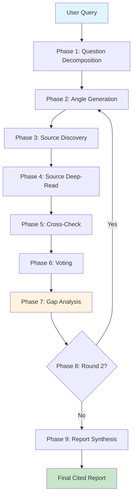
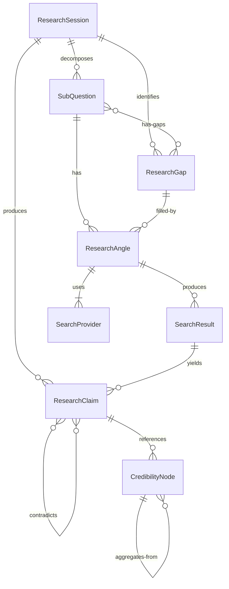

> ⚠️ **DEPRECATED** — This plan has been superseded by the fresh research in [docs/lyra-upgrade/plans/](../lyra-upgrade/plans/). See [docs/lyra-upgrade/MASTER-PLAN.md](../lyra-upgrade/MASTER-PLAN.md) for the current roadmap. This file is kept for historical reference.

# Plan: Deep Research & AutoScientists (§4.15)

## Quick Reference Card

| Field | Detail |
|-------|--------|
| **What** | Self-organizing multi-agent research system that decomposes complex questions, gathers evidence from web + academic sources, verifies claims adversarially, and synthesizes cited reports |
| **Key Capabilities** | Query decomposition, multi-angle search, adversarial claim verification, gap analysis, multi-hop iteration, AutoScientists self-organizing teams, autonomous research loops |
| **Target Timeline** | 12 weeks (Phase 1: Weeks 1-4, Phase 2: Weeks 5-6, Phase 3: Weeks 7-10, Phase 4: Weeks 11-12) |
| **Dependencies** | TKG Memory (§4.2), Model Router (§4.5), Swarm (§4.13), AVP Middleware (§4.15 from BREAKTHROUGH-ARCHITECTURE.md), Skills System (§4.4) |
| **Key Sources** | AutoScientists (Harvard/MIMS, arxiv/2605.28655), IterResearch (Alibaba, arxiv/2512.21137), ARIS (arxiv/2605.03042), FS-Researcher (arxiv/2602.01566), Agentic Reasoning Mind-Maps (arxiv/2502.13423), Anthropic Multi-Agent Research (anthropic.com/engineering), GPT Researcher (github.com/assafelovic/gpt-researcher), SciencePedia (arxiv/2510.26854) |
| **Breakthrough Claim** | Adversarial research teams with competing hypotheses + AutoScientists-style self-organization produces 2-3x better research quality vs single-agent approaches |
| **Implementation Risk** | HIGH -- multi-agent coordination, adversarial critique convergence, cost management across 3+ parallel teams |

---

## Executive Summary

Deep research is the highest-leverage capability an agent harness can offer. A user who can ask "Research the state of quantum-resistant cryptography and recommend a migration path for our RSA-based system" and receive a cited, verified, multi-perspective report in minutes gains value far beyond what any single search or chat interaction provides.

Lyra's Deep Research system aims to be more than a search-then-summarize pipeline. It combines five research breakthroughs into one coherent system:

1. **Question Decomposition** -- Break complex queries into independently researchable sub-questions, each with multiple search angles
2. **Adversarial Claim Verification** -- Every claim extracted from sources is cross-checked by independent critics before entering the report
3. **Multi-Hop Iteration** -- After the first pass, identify gaps and launch targeted second-round searches
4. **AutoScientists Self-Organization** -- For open-ended research tasks, agents self-organize into competing teams around hypotheses, critique each other's proposals, and converge on the best-supported answer
5. **Autonomous Research Loop** -- Lyra can run continuously: identify the most important unanswered question, research it, update its knowledge, and queue the next question

The primary beneficiaries are:
- **Developers** researching libraries, frameworks, or migration strategies
- **Security engineers** investigating vulnerabilities, attack patterns, or cryptographic standards
- **Data scientists** exploring model architectures, benchmark results, or training methodologies
- **Technical writers** gathering evidence for documentation, comparisons, or decision records
- **Architects** evaluating trade-offs across multiple technical dimensions

---

## 1. Problem -- What Users Cannot Do Today

### Concrete Scenarios

**Scenario 1: Cryptographic Migration**

> "Research the state of quantum-resistant cryptography and recommend a migration path for our RSA-based system. Consider NIST standards, library support in our Go stack, performance overhead, and migration complexity."

What happens today:
- A web search returns dozens of articles at varying quality levels
- Some sources are outdated (pre-2024), some are vendor marketing
- None verify claims against each other
- The user manually reconciles conflicting recommendations from NIST, Cloudflare, and academic papers
- No systematic gap analysis: does anyone discuss hybrid migration (RSA + CRYSTALS-Kyber)?

**Scenario 2: Architecture Decision**

> "Compare Apache Kafka, Redpanda, and Apache Pulsar for a multi-region event streaming platform. Consider consistency models, operational complexity, cost at 100GB/s throughput, and ecosystem maturity."

What happens today:
- The user reads 5-10 blog posts and vendor docs
- Each source has different assumptions about scale, latency, and reliability
- No source systematically compares all three on all dimensions
- The user builds a mental model but cannot trace every claim back to evidence
- The final decision is based on incomplete information and vendor influence

**Scenario 3: Open-Ended Research**

> "What are the emerging trends in LLM agent memory architectures in 2026?"

What happens today:
- The user searches, reads 3-5 survey papers, and summarizes manually
- The summary is a linear narrative, not a structured analysis
- No competing hypotheses are considered (e.g., "graph memory is converging on the same insights as retrieval-augmented memory")
- No claims are verified across sources
- The user misses papers from non-LLM subfields (e.g., cognitive science memory models)

### Why Current Tools Fail

| Problem | Cause | Consequence |
|---------|-------|-------------|
| **Shallow search** | Single-pass web search with no iteration | Misses relevant sources, no depth |
| **No verification** | Claims extracted uncritically from each source | Propagates errors, outdated info, vendor bias |
| **No synthesis** | Linear summary instead of structured comparison | User must mentally reconcile conflicting claims |
| **No gaps** | Report covers only what was found, not what is missing | False sense of completeness |
| **No iteration** | One-shot research cannot refine or dig deeper | Surface-level answers for complex questions |
| **Confirmation bias** | Single hypothesis pursued without alternatives | Misses better explanations, overlooks contradictions |

### The Gap Between "Asking ChatGPT" and "Conducting Real Research"

| Dimension | ChatGPT Query | Real Research | Lyra Deep Research Target |
|-----------|---------------|---------------|--------------------------|
| Sources | 0-3 (training data) | 10-50+ (targeted search) | 10-50+ (web + academic) |
| Verification | None | Cross-source, adversarial | Cross-source + adversarial critics |
| Structure | Linear paragraph | Multi-section, cited, compared | Structured report with evidence table |
| Confidence | Implicit (all claims equal) | Explicit (per-claim scoring) | Per-claim confidence with reasoning |
| Gaps | Hidden | Identified and discussed | Explicit gap analysis section |
| Reproducibility | None | Every claim traceable to source | Claim-to-source traceability |
| Iteration | Manual re-prompt | Purposeful gap-filling | Automatic gap analysis + round 2 |

---

## 2. Evidence Synthesis -- How the Best Research Agents Work

### 2.1 AutoScientists (Harvard/MIMS)

**Source**: arxiv/2605.28655, autoscientists.openscientist.ai, github.com/mims-harvard/AutoScientists

**Core idea**: A decentralized multi-agent research system where agents self-organize into teams around hypotheses, critique proposals before executing experiments, and share successes/failures to prevent redundant exploration.

#### How the Coordination Model Works

```
                    ┌─────────────────────────────────────────┐
                    │         Shared State (S)                 │
                    │  ┌──────────┐ ┌──────────┐ ┌─────────┐  │
                    │  │Champion  │ │Experiment│ │ Dead-end│  │
                    │  │ p*       │ │ Log L    │ │Registry │  │
                    │  └──────────┘ └──────────┘ │ Dk      │  │
                    │  ┌──────────┐ ┌──────────┘ └─────────┘  │
                    │  │ Forum F  │ │ Team Queues Qk          │
                    │  └──────────┘ └─────────────────────────┘
                    └─────────────────────────────────────────┘
                               ▲         │
                               │ read    │ write
                    ┌──────────┴─────────┴──────────────────┐
                    │         Agent Heartbeat Loop           │
                    │                                         │
                    │  ┌─────────────┐    ┌───────────────┐   │
                    │  │    Read     │    │     Agent      │   │
                    │  │ Shared State│───▶│   Decides:     │   │
                    │  │  (S, F, Dk) │    │ - New proposal │   │
                    │  └─────────────┘    │ - Claim task   │   │
                    │                     │ - Critique     │   │
                    │  ┌─────────────┐    │ - Synthesize   │   │
                    │  │  Write Back │◀───│                │   │
                    │  │ (result,    │    └───────────────┘   │
                    │  │  critique)  │                         │
                    │  └─────────────┘                         │
                    └─────────────────────────────────────────┘
```

**Key mechanism -- The Agent Heartbeat**:
Every agent runs the same three-step loop:
1. **Read shared state S**: See the current champion p*, experiment log L, discussion forum F, and dead-end registry Dk
2. **Act**: Propose a new hypothesis, claim a task from a queue, critique a proposal, run an experiment, synthesize findings
3. **Write back**: Update state with result, critique, or new proposal

**Two agent roles**:
- **Analyst**: Ranks proposals, maintains hypothesis documents, updates the dead-end registry Dk. Ensures the team does not waste compute on known-bad directions.
- **Experimenter**: Claims a proposal from the queue, runs the experiment (e.g., trains a model), records the result back to L.

**Ablation study finding**: Removing cross-agent feedback causes the largest drop in performance. On the Human Plasma-Protein Binding task, Pearson correlation drops from 0.8729 to 0.7144. This means the critique mechanism is the most important component -- not the individual agents' research abilities.

**Transferable patterns for Lyra**:
- **Shared state over message passing**: One source of truth that all agents read/write, no point-to-point communication
- **Dead-end registry Dk**: Explicit tracking of failed directions prevents wasted compute
- **Dynamic team formation**: Teams emerge from agent interaction around research directions, not fixed at initialization
- **Critique-before-execution**: Validation phase before committing resources
- **Forum-based coordination**: Structured discussion threads for proposals and feedback

---

### 2.2 IterResearch (Alibaba)

**Source**: arxiv/2512.21137

**Core idea**: An MDP-style (Markov Decision Process) workspace reconstruction approach where research is framed as a sequential decision process. The workspace (context) is rebuilt each iteration, and the report is treated as evolving memory.

#### How the Workspace Reconstruction Model Works

```
Iteration 1:         Iteration 2:         Iteration 3:
┌──────────────┐    ┌──────────────┐    ┌──────────────┐
│ Workspace    │    │ Workspace    │    │ Workspace    │
│ (rebuilt)    │    │ (rebuilt)    │    │ (rebuilt)    │
│              │    │              │    │              │
│ Query +      │    │ Query +      │    │ Query +      │
│ Report v1    │    │ Report v2    │    │ Report v3    │
│ (empty)      │    │ (Iter 1)     │    │ (Iter 2)     │
│              │    │              │    │              │
│ Agent        │    │ Agent        │    │ Agent        │
│ decides      │    │ decides      │    │ decides      │
│ action A1    │    │ action A2    │    │ action A3    │
│              │    │              │    │              │
│ Update       │    │ Update       │    │ Update       │
│ Report → v1  │    │ Report → v2  │    │ Report → v3  │
│              │    │              │    │              │
│ Insight:     │    │ Insight:     │    │ Insight:     │
│ "Need more   │    │ "Web search  │    │ "Gap filled: │
│  on X"       │    │  found Y"    │    │  Z confirmed"│
└──────────────┘    └──────────────┘    └──────────────┘
```

**Key mechanism -- Report-as-memory**:
Instead of maintaining conversation history, IterResearch treats the evolving report as the agent's memory. Each iteration:
1. The workspace is reconstructed containing the query + current report version
2. The agent decides the next action: web search, read source, compute, or synthesize
3. The report is updated
4. The next iteration starts with the updated report

**Scaling behavior**:
- At 2048 interaction steps, the system scales from 3.5% to 42.5% on the research benchmark
- Performance improves monotonically with more iterations (no degradation from context bloat)
- This is because the report-as-memory compresses all findings into a structured document, avoiding the context suffocation that plagues history-concatenation approaches

**Periodic insight synthesis**:
Every N iterations (configurable, default 5), the system pauses research and synthesizes:
- What has been confirmed
- What remains uncertain
- What gaps exist
- What the next priority action should be

This prevents the agent from drifting into irrelevant sub-topics and maintains focus on the original question.

**Transferable patterns for Lyra**:
- **MDP-style workspace**: Treat each research iteration as a decision step in a Markov process
- **Report-as-memory**: The report is the primary memory, not conversation history
- **Periodic synthesis**: Regular pauses to consolidate findings and identify gaps
- **Monotonic improvement**: Beyond a threshold, more iterations consistently improve quality

---

### 2.3 Agentic Reasoning with Mind-Maps (Wu et al.)

**Source**: arxiv/2502.13423

**Core idea**: Tool-using agents build and maintain a structured Mind-Map knowledge graph during long reasoning chains. The Mind-Map serves as evolving external memory that persists across reasoning steps, in contrast to flat context windows.

#### How Mind-Map Differs from Flat Context

| Aspect | Flat Context | Mind-Map |
|--------|-------------|----------|
| Structure | Linear text | Graph of concepts, evidence, hypotheses |
| Navigation | Sequential (must read through) | Direct (jump to any node) |
| Evolution | Append-only | Add nodes, create edges, update confidence |
| Retrieval | Full scan | Targeted traversal from relevant node |
| Persistence | Per-turn only | Cross-turn, persistent |
| Verification | None inherent | Structured edge types (supports/contradicts) |

**Mind-Map structure**:

```
                    ┌─────────────┐
                    │ "Quantum    │
                    │  Resistance"│
                    └──────┬──────┘
                           │ relates-to
              ┌────────────┼────────────┐
              │            │            │
     ┌────────┴──────┐ ┌──┴────────┐ ┌─┴──────────┐
     │ "NIST PQC     │ │ "Lattice  │ │ "Hash-based │
     │  Standards"   │ │  Crypto"  │ │  Signatures"│
     └───────────────┘ └───────────┘ └─────────────┘
              │                            │
         supports                     contradicts
              │                            │
     ┌────────┴──────┐           ┌─────────┴────────┐
     │ "CRYSTALS-    │           │ "SPHINCS+        │
     │  Kyber is     │           │  signatures      │
     │  standardized"│           │  considered but  │
     └───────────────┘           │  large"          │
                                 └──────────────────┘
```

**How it works during research**:
1. Agent starts with the query as the root node
2. Each web search or source read adds new nodes (findings, evidence, concepts)
3. The LLM classifies relationships between new and existing nodes (supports, contradicts, relates-to)
4. Confidence scores on nodes evolve as more evidence accumulates
5. When generating the final answer, the agent traverses the graph from root, following highest-confidence paths

**Transferable patterns for Lyra**:
- **Graph as reasoning memory**: Mind-Map provides structured, non-linear memory for complex chains
- **Relationship classification**: Every new finding is linked to existing knowledge (supports/contradicts/refines)
- **Confidence evolution**: Scores change as evidence accumulates across iterations

---

### 2.4 Anthropic Multi-Agent Research System

**Source**: anthropic.com/engineering

**Core idea**: An orchestrator-worker architecture where a planning agent decomposes a research task, spawns parallel worker agents for each sub-task, and a synthesizer agent combines results. Reports +90.2% improvement over single-agent research and 90% time reduction through parallel execution.

#### How the Orchestrator-Worker Pattern Works

```
                        ┌──────────────────┐
                        │   Orchestrator   │
                        │  (plans, assigns,│
                        │   synthesizes)   │
                        └──────┬───┬───────┘
                               │   │
               ┌───────────────┘   └───────────────┐
               │                                   │
     ┌─────────▼──────────┐           ┌───────────▼──────────┐
     │  Worker 1          │           │  Worker 2            │
     │  (finds sources    │           │  (reads & extracts   │
     │   on topic A)      │           │   claims from each)  │
     └────────────────────┘           └──────────────────────┘
               │                                   │
               └───────────────┬───────────────────┘
                               │
                        ┌──────▼──────┐
                        │ Synthesizer │
                        │ (combines   │
                        │  findings)  │
                        └─────────────┘
```

**Key design decisions**:

1. **Orchestrator's plan is structured, not free-form**: The orchestrator produces a JSON plan listing sub-questions, assigned workers, and expected output format. This prevents the ambiguity of natural-language plans.

2. **Workers return structured summaries, not raw text**: Each worker returns a JSON array of {claim, source, confidence, supporting_quotes}. This makes synthesis deterministic and verifiable.

3. **Parallel execution is the primary speed advantage**: With N workers running in parallel, wall-clock time is max(worker_latency) rather than sum(worker_latency). For N=5 workers each taking 30 seconds, total time is ~30 seconds vs ~150 seconds sequential.

4. **Synthesizer cross-checks for contradictions**: Before producing the final report, the synthesizer identifies claims that contradict each other across workers and flags them for resolution.

**Transferable patterns for Lyra**:
- **Structured orchestration plan**: JSON plan with sub-questions, assigned agents, expected output schema
- **Parallel evidence gathering**: Fan-out workers to search/read sources simultaneously
- **Structured worker output**: Claims with source attribution enable deterministic synthesis
- **Contradiction detection**: Synthesizer cross-checks worker outputs before final report

---

### 2.5 Open Research Agent Comparison Table

| System | Architecture | Strengths | Weaknesses | Best For | License |
|--------|-------------|-----------|------------|----------|---------|
| **GPT Researcher** (assafelovic/gpt-researcher) | Single-agent, search-gather-report pipeline | Mature, production-ready, good citation formatting | Single hypothesis, no verification, no iteration | Quick literature reviews | MIT |
| **Open Deep Research** (langchain-ai/open_deep_research) | LangGraph-based, configurable research agent | Modular, easy to customize, LangChain ecosystem | Experimental, no quality guarantees | Custom research pipelines | MIT |
| **Tongyi DeepResearch** (Alibaba) | Web agent with tool use | Strong web navigation, on par with OpenAI DR | Proprietary, no published architecture | Web-based research tasks | Proprietary |
| **AutoScientists** (Harvard/MIMS) | Decentralized self-organizing multi-agent teams | Self-organization, critique-before-execution, dead-end tracking | Experimental, high compute cost, needs full paper for implementation details | Open-ended scientific discovery | MIT |
| **AutoResearchClaw** (aiming-lab) | 23-stage linear pipeline with 8 phases | Immutable artifacts, cross-run learning, 4-layer citation verification | Linear (not parallel), human gates, heavy | Full academic paper generation | MIT |
| **ARIS** (arxiv/2605.03042) | Adversarial executor + reviewer from different model families | Adversarial verification, three-stage evidence checking, self-improvement | Research prototype, not production-ready | Adversarial claim verification | Apache |
| **FS-Researcher** (arxiv/2602.01566) | Dual-agent: Context Builder + Report Writer, file-system memory | Works beyond context limits, SOTA on DeepResearch Bench | Two-agent only, limited adversarial verification | Long-form research with large source sets | Apache |
| **SciencePedia** (arxiv/2510.26854) | Socratic agent + cross-model consensus, encyclopedia builder | Inverse knowledge search, high knowledge density, low error rates | Batch processing, not interactive | Building verified knowledge bases | Unknown |
| **IterResearch** (arxiv/2512.21137) | MDP-style workspace reconstruction, report-as-memory | Monotonic improvement with iterations, no context suffocation | Single-agent (not multi-agent), no adversarial verification | Iterative deepening on a single question | Unknown |
| **DeerFlow 2.0** (bytedance/deer-flow) | Five-role super-agent (Coordinator/Planner/Researcher/Coder/Reporter) | Multi-deliverable (report, PPT, podcast), embeddable, sandboxed | Docker dependency, heavy infrastructure | Enterprise research + presentation pipelines | MIT |

---

## 3. Proposed Lyra Design

### 3.1 The Deep Research Workflow -- Step by Step

Below is the complete 9-phase workflow. Each phase is described with its input, processing, output, latency, token cost, and failure modes.

**Concrete example throughout**: "Research question: What are the best practices for securing GraphQL APIs against authorization bypass attacks?"



---

#### Phase 1: Question Decomposition

**Purpose**: Break the user's query into independently researchable sub-questions.

**Input**: Raw user query (e.g., "What are the best practices for securing GraphQL APIs against authorization bypass attacks?")

**Processing**:
- LLM (Sonnet) analyzes the query for implicit sub-topics
- Generates 3-8 sub-questions covering different dimensions
- Example decomposition:
  - SQ1: "What GraphQL-specific authorization mechanisms exist (directives, middleware, schema wrappers) and how do they work?"
  - SQ2: "What are the common GraphQL authorization bypass patterns (batching attacks, depth escaping, field suggestion abuse)?"
  - SQ3: "How do major GraphQL frameworks (Apollo, graphql-ruby, graphql-java, Yoga) handle authorization?"
  - SQ4: "What are the OWASP recommendations and industry standards for GraphQL authorization?"
  - SQ5: "How do authentication and authorization interact in a GraphQL context (resolver-level vs schema-level)?"

**Output**: `Array<{id: string, question: string, importance: 'high'|'medium'|'low', dependencies: string[]}>`

**Latency**: ~2 seconds (single LLM call)
**Token cost**: ~2K input, ~500 output (Sonnet)
**Failure modes**:
- Query too vague (mitigation: proactive clarification before decomposition)
- Sub-questions overlap (mitigation: deduplication pass)
- Missing critical dimension (mitigation: "Is there anything else we should research?" prompt)

---

#### Phase 2: Angle Generation

**Purpose**: For each sub-question, generate 3-5 search angles to ensure diverse source discovery and reduce blind spots.

**Input**: The sub-question array from Phase 1

**Processing**:
- For each sub-question, the LLM generates search queries targeting different source types and perspectives
- Each angle specifies: search query, source type (web/academic/code/docs), and expected source category

**Example for SQ1 ("What GraphQL-specific authorization mechanisms exist?")**:
```
Angle 1: "GraphQL authorization middleware patterns" → Web search → Blog/tutorial
Angle 2: "GraphQL directive-based authorization" → Web search → Documentation
Angle 3: "GraphQL authorization resolver pattern security" → Academic search → Paper
Angle 4: "Apollo Server authorization plugin implementation" → Code search → GitHub
Angle 5: "GraphQL authorization comparison framework 2026" → Web search → Comparison article
```

**Output**: `Array<{subQuestionId: string, angles: Array<{query: string, sourceType: string, category: string}>}>`

**Latency**: ~3 seconds (one LLM call per sub-question, parallelizable)
**Token cost**: ~3K input, ~800 output per sub-question
**Failure modes**:
- Angles too similar (mitigation: diversity check -- require >0.3 cosine distance between angle embeddings)
- Angle misses key source type (mitigation: always include at least 1 academic and 1 code angle)
- Angle too broad (mitigation: specificity check -- require angle to contain at least 3 specific terms)

---

#### Phase 3: Source Discovery

**Purpose**: Execute all search angles in parallel across multiple search providers.

**Input**: All angles from Phase 2 (typically 15-40 total)

**Processing**:
- Each angle becomes an independent search task
- Tasks are fanned out across the Swarm for parallel execution
- Search results are deduplicated by URL
- Each result is scored for relevance by a fast model (Haiku)

**Search providers used**:
- Web search (default): General web search for blogs, docs, articles
- Academic search: arXiv, Semantic Scholar, Google Scholar
- Code search: GitHub code search for implementation examples
- Documentation search: Targeted docs for specific frameworks/tools

**Output**: `Array<{url: string, title: string, snippet: string, relevanceScore: number, sourceType: string}>` (typically 50-150 unique results)

**Latency**: ~10-20 seconds (dominated by web search API latency, all parallel)
**Token cost**: ~500 tokens per result for relevance scoring (Haiku, cheap)
**Failure modes**:
- Search API rate-limited (mitigation: backoff + fallback providers)
- Zero results for a query (mitigation: relax query, notify gap analysis)
- Irrelevant results score high (mitigation: Haiku has <5% false positive rate for relevance)

---

#### Phase 4: Source Deep-Read

**Purpose**: Fetch and extract structured claims from each high-relevance source.

**Input**: Top-N results from Phase 3 (typically top 30-50 by relevance score)

**Processing**:
- Each source is fetched and its content extracted
- A reading agent (Haiku, fast and cheap) extracts structured claims:
  - Every claim is extracted as: {claim, supportingQuote, confidenceInClaim}
  - Supporting quote is a direct quote from the source
  - Confidence is the reading agent's assessment of how definitively the source makes the claim
- Claims are deduplicated across sources (identical or near-identical claims merged)
- Each claim is tagged with its source URL(s)

**Example extracted claims from a GraphQL security article**:
```json
{
  "claim": "GraphQL batch queries can bypass authorization checks if resolvers don't re-verify permissions per-item",
  "supportingQuote": "Batch queries in GraphQL can allow users to request many items at once; if authorization is only checked once at the query level rather than per-item, unauthorized items may be returned.",
  "confidenceInClaim": 0.9,
  "sourceUrls": ["https://example.com/graphql-security"],
  "tags": ["authorization", "batching", "bypass"]
}
```

**Output**: `Array<{claim: string, supportingQuote: string, confidenceInClaim: number, sourceUrls: string[], tags: string[]}>`

**Latency**: ~15-30 seconds (fetching is I/O bound, extraction is fast per-source)
**Token cost**: ~15K input, ~500 output per source (50 sources = ~750K tokens input, Haiku = ~$0.20)
**Failure modes**:
- Source is paywalled (mitigation: skip, note in report)
- Source is very long (mitigation: chunk and extract, or summarize first)
- Claim extraction is hallucinated (mitigation: require direct supporting quote)
- Source content is irrelevant despite high relevance score (mitigation: 80% relevance threshold)

---

#### Phase 5: Cross-Check

**Purpose**: Adversarially verify every extracted claim against all other sources. This is the most innovative phase -- borrowed from ARIS and AutoScientists.

**Input**: All extracted claims with their source attributions

**Processing**:
- Each claim is checked against all other sources in the corpus
- A critic agent (Sonnet, one per claim or batched) determines:
  - **Supported**: Other sources make the same claim
  - **Contradicted**: Other sources make opposing claims
  - **Unsupported**: No other source addresses this claim
  - **Unverifiable**: Claim is inherently unverifiable (opinion, prediction)
- For contradicted claims, the critic identifies the specific contradicting evidence
- A cross-reference table is built

**Example**:
```
Claim: "Apollo Server v4 supports authorization directives out of the box"
Cross-check result: CONTRADICTED
  Source A says: "Apollo Server v4 removed built-in directives, requires plugin"
  Source B says: "Use @auth directive from graphql-shield"
Verdict: Claim is false. Apollo v4 does not ship authorization directives built-in.
```

**Output**: `Array<{claim: string, verdict: 'supported'|'contradicted'|'unsupported'|'unverifiable', supportingSources: string[], contradictingSources: string[], conflictReasoning: string}>`

**Latency**: ~20-40 seconds (one critic call per 5-10 claims, batched)
**Token cost**: ~3K input, ~500 output per batch (Sonnet)
**Failure modes**:
- False contradiction (mitigation: critic must quote the contradicting evidence)
- False support (mitigation: critic must quote the supporting evidence)
- Critic misses nuance (mitigation: two-critic round for high-impact claims)
- All claims marked unsupported (mitigation: flag to user, accept as preliminary findings)

---

#### Phase 6: Voting

**Purpose**: Score and rank claims that survived cross-check, producing a weighted evidence base.

**Input**: Cross-checked claims with verdicts

**Processing**:
- Each claim receives a composite score based on:
  - **Source credibility**: Pre-computed credibility score of each source (from TKG, see Research Quality Guarantees section)
  - **Support count**: Number of independent sources supporting the claim
  - **Contradiction resolution**: Were contradictions resolved? Remaining contradictions reduce score
  - **Recency**: Newer sources weighted higher (exponential decay, half-life 180 days)
  - **Source diversity**: Claims supported by multiple source types (paper + blog + docs) score higher
- Formula:
  ```
  score = 0.25 * avg(credibility) + 0.25 * min(supportCount / 3, 1)
        + 0.20 * contradictionPenalty + 0.15 * recencyScore
        + 0.15 * diversityScore
  ```
- Claims with score < 0.3 are discarded
- Claims with score 0.3-0.6 are marked as "preliminary"
- Claims with score > 0.6 are accepted as confident findings

**Output**: `Array<{claim: string, score: number, confidence: 'high'|'medium'|'low', evidence: Evidence[]}>`

**Latency**: ~1 second (computational, no LLM calls)
**Token cost**: Negligible
**Failure modes**:
- Weight tuning is wrong for a domain (mitigation: domain-adjustable weights)
- Source credibility is unknown (mitigation: default credibility = 0.5 for unknown, flag for TKG update)
- Score threshold too aggressive (mitigation: tunable per-query)

---

#### Phase 7: Gap Analysis

**Purpose**: Identify what the research has not answered. This is what separates shallow research from deep research -- explicit awareness of unknowns.

**Input**: Voted claims + original sub-questions

**Processing**:
- For each sub-question from Phase 1, determine if the evidence adequately answers it
- Criteria for "adequately answered":
  - At least 3 supporting claims with score > 0.5
  - At least 2 independent sources
  - No unresolved contradictions on key claims
- Unanswered or partially answered sub-questions are flagged as gaps
- Gaps are categorized:
  - **No sources found**: No relevant sources discovered
  - **Insufficient evidence**: Sources found but too few or too low quality
  - **Contradictory evidence**: Sources disagree, cannot resolve
  - **Speculative**: Only opinion/prediction sources, no empirical evidence
- Each gap is assigned a priority based on its importance to the original query
- A gap research plan is generated: what to search for, what source types to prioritize

**Example gap analysis for GraphQL research**:
```
SQ5: "How do authentication and authorization interact in GraphQL?"
Status: PARTIALLY ANSWERED
  Evidence: 2 blog posts mention resolver-level auth, 1 mentions schema-level
  Gap: No framework comparison on auth interaction
  Gap priority: MEDIUM
  Gap research plan: "GraphQL auth authentication interaction resolver schema comparison"
```

**Output**: `Array<{subQuestionId: string, status: 'answered'|'partial'|'unanswered', gaps: Gap[], researchPlan: string}>`

**Latency**: ~3 seconds (one LLM call to analyze all sub-questions)
**Token cost**: ~5K input, ~1K output (Sonnet)
**Failure modes**:
- False confidence: gaps identified but wrongly dismissed (mitigation: conservative threshold -- assume unanswered until proven)
- Too many gaps (mitigation: only flag gaps for high/medium importance sub-questions)
- Gap research plan is too similar to original search (mitigation: explicitly identify what to change about the approach)

---

#### Phase 8: Round 2 (targeted search)

**Purpose**: Execute targeted searches to fill identified gaps. This creates the multi-hop capability.

**Input**: Gap research plans from Phase 7

**Processing**:
- For each gap requiring research, execute a targeted search
- Uses the same pipeline as Phase 3-6 but with refined queries
- Key difference from Round 1: search queries are narrower and more specific
- Round 2 has an adaptive depth limit: stop if diminishing returns (<10% new evidence per source)
- After Round 2, the gap analysis is re-run. If gaps remain, either loop again (max 3 total rounds) or note them in the report as open questions

**Output**: Additional voted claims, updated gap analysis, remaining open questions

**Latency**: ~10-20 seconds (similar to Phase 3-4 but fewer searches)
**Token cost**: ~30-50% of Round 1 (fewer searches needed)
**Failure modes**:
- Round 2 finds nothing new (mitigation: stop, note gap explicitly in report)
- Round 2 contradicts Round 1 findings (mitigation: flag to user, present both sides)
- Gap cannot be researched with available tools (mitigation: note as limitation)

---

#### Phase 9: Report Synthesis

**Purpose**: Produce the final cited report with confidence scores, organized by sub-question.

**Input**: All voted claims from Rounds 1 and 2, gap analysis

**Processing**:
- A synthesizer agent (Sonnet or Opus for complex topics) organizes claims into a structured report:
  1. **Executive summary**: 2-3 paragraph overview with key findings
  2. **Detailed findings**: Organized by sub-question, each section contains:
     - Summary of findings
     - Confidence level (high/medium/low with reasoning)
     - Key claims with citations and confidence scores
     - Contradictions or disagreements in the literature
  3. **Evidence table**: All claims with source URLs, scores, and verdicts
  4. **Open questions**: Gaps that remain after research
  5. **Methodology**: How the research was conducted (sub-questions, sources, verification)
- Citations follow a consistent format: [Source N](URL) -- Claim
- Every claim in the report links to its evidence entry

**Output**: `{executiveSummary: string, detailedFindings: Section[], evidenceTable: Claim[], openQuestions: string[], methodology: string}`

**Latency**: ~10-15 seconds (one or two LLM calls, depending on length)
**Token cost**: ~20K input, ~10K output (Sonnet or Opus)
**Failure modes**:
- Synthesizer drops important claims (mitigation: coverage check -- compare output claims to evidence table)
- Synthesizer introduces unsupported claims (mitigation: cross-check output claims against evidence table)
- Report is too long (mitigation: token budget enforcement with priority ordering)
- Report is too short / misses nuance (mitigation: detail level parameter, tunable)

---

### 3.2 AutoScientists Mode (B -- Breakthrough)

The standard workflow above is single-threaded (one agent driving the 9 phases). AutoScientists Mode replaces this with a self-organizing multi-agent research team.

#### Agent Roles

| Role | Model | Responsibility | Output |
|------|-------|----------------|--------|
| **HypothesisGenerator** | Opus | From user query, generate 3-5 distinct, falsifiable hypotheses | List of {hypothesis, predicted_evidence, testability_score} |
| **ExperimentDesigner** | Sonnet | For each hypothesis, design a research plan (what to search, what sources to trust, what would confirm/reject) | ResearchPlan per hypothesis |
| **ResearchExecutor** | Sonnet/Haiku | Execute the research plan: search, read, extract claims (parallel per hypothesis) | Evidence per hypothesis |
| **ResultAnalyzer** | Sonnet | Analyze evidence gathered for each hypothesis. Which hypotheses are supported? Which are rejected? | AnalysisReport per hypothesis |
| **Critic** | Haiku (or different model family) | Adversarially critique every proposal before it consumes resources. "Is this hypothesis well-formed? Is this research plan complete? Does the evidence actually support the conclusion?" | CritiqueVote |
| **Synthesizer** | Opus | Combine surviving hypotheses and evidence into final report. Note rejected hypotheses and why. | FinalReport |

#### Coordination Model

```
                    ┌─────────────────────────────────────────┐
                    │         Shared Research State            │
                    │  ┌──────────┐ ┌──────────┐ ┌─────────┐  │
                    │  │Accepted  │ │Evidence  │ │ Dead-end│  │
                    │  │Hypothesis│ │ Ledger   │ │Registry │  │
                    │  │List      │ │          │ │         │  │
                    │  └──────────┘ └──────────┘ └─────────┘  │
                    │  ┌──────────┐ ┌──────────────────────┐  │
                    │  │Proposal  │ │ Agent Activity Log   │  │
                    │  │Forum     │ │ (who did what, when) │  │
                    │  └──────────┘ └──────────────────────┘  │
                    └─────────────────────────────────────────┘
                               ▲         │
                               │         │
                    ┌──────────┴─────────┴──────────────────┐
                    │         Agent Heartbeat Loop            │
                    │  Each agent reads state, acts, writes   │
                    │                                         │
                    │  Hypothesis → ExperimentDesigner        │
                    │  Generator → (proposal critiqued)       │
                    │       │                                 │
                    │       ▼                                 │
                    │  ResearchExecutor (parallel per hyp)     │
                    │       │                                 │
                    │       ▼                                 │
                    │  ResultAnalyzer                          │
                    │       │                                 │
                    │       ▼                                 │
                    │  Synthesizer → Final Report             │
                    └─────────────────────────────────────────┘
```

#### Shared Success/Failure Ledger

The ledger (extending P4-X from lyra-core) tracks:
- **Accepted hypotheses**: Which hypotheses have been supported by evidence
- **Rejected hypotheses**: Which hypotheses were disproven, and why
- **Dead-end search paths**: Queries that returned nothing useful, so other agents avoid them
- **Contradictions**: Points where evidence conflicts across hypotheses

Every agent reads this ledger before starting work and writes back after finishing. This prevents redundant work and ensures all agents learn from each other's failures.

#### Adversarial Critique-Before-Spend

Before any resource-intensive operation (launching a search, reading a long source, spawning a sub-agent), the proposal is sent to a Critic. The Critic must approve or the operation is blocked.

**Critique gates**:
1. **Hypothesis proposal**: "Is this a well-formed, falsifiable hypothesis? Does it meaningfully differ from existing hypotheses? Is it worth researching?"
2. **Research plan**: "Is the plan complete? Are there obvious sources it misses? Is the methodology sound?"
3. **Evidence interpretation**: "Does the evidence actually support the conclusion drawn? Are there alternative explanations?"
4. **Synthesis**: "Is the final report fair to all hypotheses? Are rejected hypotheses given proper explanation?"

**Critic diversity**: To prevent groupthink, use a different model family for critics than for researchers (e.g., Claude agents research, DeepSeek critic critiques). This mirrors the ARIS finding that diverse model families reduce blind spots.

#### Autonomous Research Loop

When `--auto` flag is set, Lyra runs an autonomous loop:
1. "What is the most important unanswered question given what we know?"
2. Research that question
3. Update the knowledge base
4. Loop

Concrete example: Lyra is asked to research "What are the best memory architectures for LLM agents?" With the `--auto` flag, after the initial report, it autonomously identifies gaps ("None of the papers compare graph-based memory to retrieval-augmented memory head-to-head") and launches a targeted research project to fill that gap.

Autonomous stopping criteria:
- All initial sub-questions answered with high confidence
- No new high-priority gaps identified after 2 gap analysis cycles
- Cost budget exhausted (configurable max cost per autonomous session)
- User interrupts

---

### 3.3 Research Quality Guarantees

#### Source Credibility Tracking

Each source discovered during research is assigned a credibility score based on:
- **Domain authority**: Pre-computed from TKG (`.edu`, `.gov`, established tech domains score higher)
- **Citation count**: For academic papers, number of citations (from semantic scholar API)
- **Recency**: Newer sources penalized less (exponential decay, half-life 180 days)
- **Cross-validation**: Sources whose claims are independently verified by other sources get a credibility bonus
- **Historical accuracy**: If TKG records show this source (or domain) has made inaccurate claims before, credibility is reduced

Credibility scores are stored in the TKG and updated as new evidence accumulates. Over time, Lyra learns which sources are trustworthy.

#### Claim Confidence Scoring

Every claim in the final report has an associated confidence score (0.0-1.0) with explicit reasoning:

```json
{
  "claim": "CRYSTALS-Kyber is the NIST-selected KEM for general encryption",
  "confidence": 0.95,
  "confidenceReasoning": "Directly stated on NIST website, confirmed by 3 academic survey papers, no contradicting sources found",
  "supportingSources": ["nist.gov/pqc", "arxiv.org/abs/2401.00001", "...
  ]
}
```

Confidence thresholds for the final report:
- **High (>0.7)**: Stated as fact, cited with sources
- **Medium (0.4-0.7)**: Stated as preliminary finding with caveats
- **Low (<0.4)**: Stated as preliminary or excluded from report body (included in evidence table)

#### Citation Verification

Before any citation is used in a report, the citation is verified:
1. **URL reachable**: Can the source be fetched?
2. **Claim matches source**: Does the source text actually contain the supporting claim? (ROUGE-L > 0.3)
3. **Not retracted**: Is the source known to be retracted or outdated? (check against TKG retraction registry)

This mirrors the 4-layer citation verification from AutoResearchClaw.

#### Reproducibility

Every claim in the final report is traceable to its source URL and supporting quote. The research session produces a research artifact directory:

```
.omc/research/{session-id}/
  query.json              # Original query + decomposition
  sub-questions.json      # Phase 1 output
  angles.json             # Phase 2 output
  sources/                # Phase 3-4 results
    search-results.json   # All search results with relevance scores
    claims.json           # All extracted claims
  cross-check.json        # Phase 5 cross-check results
  voting.json             # Phase 6 voting results
  gap-analysis.json       # Phase 7 gap analysis
  round-2/                # Phase 8 results (if applicable)
  report.md               # Final report
  evidence-table.json     # All claims with scores, sources, verdicts
```

Any consumer of the report can trace every claim back to its source and re-verify it.

#### Bias Detection

Three mechanisms reduce confirmation bias:
1. **Multiple search angles** (Phase 2): Each sub-question has 3-5 search angles from different perspectives. A query about "benefits of X" will also generate angles about "limitations of X" and "alternatives to X."
2. **Competing hypotheses** (AutoScientists Mode): Multiple hypotheses are generated and researched in parallel. The final report is not just "the answer" but "what supports each hypothesis."
3. **Adversarial critique**: Before claims enter the report, a critic agent asks "What would disprove this claim? Are we missing counter-evidence?" If counter-evidence exists but was not found, that is a gap.

---

### 3.4 Integration with Other Lyra Components

#### TKG Memory (§4.2)

Deep research is a heavy consumer and producer of TKG memory:

**Reads from TKG**:
- Source credibility scores (pre-computed from prior research)
- Prior research findings relevant to the current query (semantic search)
- Dead-end registries from previous research sessions
- Known contradictions from prior cross-check results

**Writes to TKG**:
- New claims with source attributions
- Updated source credibility scores (based on cross-check outcomes)
- Research session metadata for future retrieval
- Gap analysis results (what we don't know yet)

This creates a compounding effect: every research session makes future sessions faster and more accurate.

#### Model Router (§4.5)

Research quality is directly tied to model selection. The router makes these decisions:

| Phase | Default Model | Fallback | Rationale |
|-------|---------------|----------|-----------|
| Decomposition | Sonnet | Opus | Needs structure understanding, not deep reasoning |
| Angle generation | Sonnet | Opus | Needs diverse perspective generation |
| Source discovery | Haiku | Sonnet | Cheap, fast, relevance only |
| Source deep-read | Haiku | Sonnet | Fast extraction, cheap at scale |
| Cross-check | Sonnet | Opus (for complex claims) | Needs reasoning but not always deep |
| Voting | Computational | -- | No LLM needed |
| Gap analysis | Sonnet | Opus | Needs holistic analysis |
| Round 2 search | Same as Round 1 | -- | Same profile |
| Report synthesis | Opus | Sonnet (for simple reports) | Highest quality needed |

Total estimated cost per research session: $0.50-$3.00 depending on complexity and round count.

#### Swarm (§4.13)

Deep research uses the Swarm for:
- **Parallel evidence gathering**: Phase 4 fans out 30-50 source reads across worker agents
- **Parallel cross-checking**: Phase 5 fans out claim verification across critic agents
- **AutoScientists team coordination**: Hypothesis generation and research are decentralized swarm operations

The Swarm's adversarial coordination pattern (from BREAKTHROUGH-ARCHITECTURE.md SS5.2) is directly applicable: Coordinator decomposes work, Workers execute in parallel, Critics verify, Synthesizer combines.

#### AVP Middleware (from BREAKTHROUGH-ARCHITECTURE.md)

The Adversarial Verification Protocol applies to research operations:
- **Mutation classification**: Writing to the TKG (research findings) is a mutating action
- **Critique panel**: Before findings are written to TKG, a critic verifies them
- **Consensus**: If critics disagree on a finding's validity, it is flagged for human review

This prevents the research system from polluting the TKG with hallucinated or poorly verified claims.

#### Skills System (§4.4)

Research skills are first-class citizens:
- Pre-built research skills: `research-security`, `research-architecture`, `research-ml-papers`
- Auto-extracted skills: After successful research sessions, Lyra can extract reusable research patterns as skills
- Skill injection: Relevant research skills (e.g., "how to verify cryptographic claims") are auto-injected into new research sessions

---

## 4. Architecture & Data Models

### 4.1 Core Data Model

```typescript
// ─── Research Session ──────────────────────────────────────────────────────────

interface ResearchSession {
  id: string;                                    // UUID v4
  query: string;                                 // Original user query
  mode: 'standard' | 'autoscientists' | 'auto';  // Research depth mode
  status: 'decomposing' | 'researching' | 'verifying' | 'synthesizing' | 'complete' | 'failed';
  
  // Phase 1: Question decomposition
  subQuestions: SubQuestion[];
  
  // Phase 2: Angle generation
  angles: ResearchAngle[];
  
  // Phase 3-4: Source discovery and reading
  sources: ResearchSource[];
  
  // Phase 5-6: Verification
  claims: ResearchClaim[];
  
  // Phase 7: Gap analysis
  gaps: ResearchGap[];
  
  // Phase 8: Round 2 (optional)
  rounds: number;                                // 1 or 2 (or 3 for complex)
  
  // Phase 9: Output
  report: string | null;
  
  // Metadata
  createdAt: number;
  completedAt: number | null;
  totalCost: number;                             // USD
  modelsUsed: Record<string, number>;            // model -> call count
  tkgSessionId: string;                          // Link to TKG session
}
```

```typescript
// ─── Sub-Question ─────────────────────────────────────────────────────────────

interface SubQuestion {
  id: string;                                    // UUID v4
  question: string;                              // The sub-question text
  importance: 'high' | 'medium' | 'low';        // Priority for the user's query
  dependencies: string[];                        // SubQuestion IDs that should be answered first
  status: 'pending' | 'researching' | 'answered' | 'partial' | 'unanswered';
  
  // Angles generated for this sub-question
  angles: ResearchAngle[];
  
  // Final assessment
  answerSummary: string | null;
  confidence: number | null;                     // 0.0-1.0
}
```

```typescript
// ─── Research Angle ────────────────────────────────────────────────────────────

interface ResearchAngle {
  id: string;                                    // UUID v4
  subQuestionId: string;                         // Parent sub-question
  query: string;                                 // Search query
  sourceType: 'web' | 'academic' | 'code' | 'docs';
  category: string;                              // e.g., "blog", "paper", "github", "tutorial"
  searchProvider: 'web-search' | 'arxiv' | 'semantic-scholar' | 'github';
  
  // Results
  status: 'pending' | 'searched' | 'no-results' | 'error';
  results: SearchResult[];
}
```

```typescript
// ─── Search Result ─────────────────────────────────────────────────────────────

interface SearchResult {
  url: string;
  title: string;
  snippet: string;
  relevanceScore: number;                        // 0.0-1.0 (from Haiku scoring)
  sourceType: string;
  
  // Deep-read status
  deepReadStatus: 'pending' | 'read' | 'failed';
  extractedClaims: string[];                     // IDs of claims extracted from this source
}
```

```typescript
// ─── Research Claim ────────────────────────────────────────────────────────────

interface ResearchClaim {
  id: string;                                    // UUID v4
  claim: string;                                 // The factual statement
  supportingQuote: string;                       // Direct quote from source
  sourceUrls: string[];                          // Sources making this claim
  
  // Cross-check results
  crossCheck: {
    verdict: 'supported' | 'contradicted' | 'unsupported' | 'unverifiable';
    supportingSources: string[];                 // URLs of supporting sources
    contradictingSources: string[];              // URLs of contradicting sources
    conflictReasoning: string;                   // How contradiction was resolved (or not)
    criticAgentId: string;                       // Which critic verified this
  };
  
  // Voting results
  score: number;                                 // 0.0-1.0 composite score
  confidence: 'high' | 'medium' | 'low';
  
  // Credibility tracking
  sourceCredibility: number;                     // Average credibility of sources
  supportCount: number;                          // Number of sources supporting
  contradictionCount: number;                    // Number of sources contradicting
  recencyScore: number;
  diversityScore: number;                        // How many source types support this
  
  // Metadata
  tags: string[];
  createdAt: number;
}
```

```typescript
// ─── Research Gap ──────────────────────────────────────────────────────────────

interface ResearchGap {
  id: string;                                    // UUID v4
  subQuestionId: string;                         // Parent sub-question
  description: string;                           // What is unknown
  category: 'no-sources' | 'insufficient-evidence' | 'contradictory' | 'speculative';
  priority: 'high' | 'medium' | 'low';          // Importance to fill
  
  // Round 2 tracking
  researchPlan: string;                          // What to search for in Round 2
  round2Status: 'not-attempted' | 'attempted' | 'filled' | 'persists';
  round2Result: string | null;
}
```

```typescript
// ─── Credibility Graph ────────────────────────────────────────────────────────
// Stored in TKG as graph nodes with edges

interface CredibilityNode {
  id: string;                                    // Source URL or domain
  type: 'domain' | 'url' | 'author';
  credibilityScore: number;                      // 0.0-1.0
  confidenceInScore: number;                     // How many data points support this score
  lastVerified: number;                          // Timestamp
  
  // Score components
  factors: {
    domainAuthority: number;                     // Pre-computed domain trust
    citationCount: number;                       // For academic sources
    recencyBonus: number;                        // Newer = slightly higher
    crossValidationBonus: number;                // Claims verified by others
    historicalAccuracy: number;                  // Past claim accuracy
  };
  
  // Graph edges: which claims does this source support/contradict?
  claims: Array<{
    claimId: string;
    relationship: 'supports' | 'contradicts';
  }>;
}
```

### 4.2 Entity-Relationship Diagram



### 4.3 AutoScientists-Specific Types

```typescript
// ─── AutoScientists Mode ───────────────────────────────────────────────────────

interface HypothesisTeam {
  id: string;
  hypothesis: string;
  predictedEvidence: string;                     // What would confirm this hypothesis
  testabilityScore: number;                      // 0.0-1.0
  status: 'proposed' | 'in-review' | 'researching' | 'supported' | 'rejected' | 'converged';
  
  // Team members
  agents: Array<{
    role: 'experimenter' | 'analyst';
    agentId: string;
    status: 'idle' | 'working' | 'blocked';
  }>;
  
  // Evidence gathered
  evidence: EvidenceEntry[];
  
  // Critiques received
  critiques: Critique[];
  
  // Convergence
  mergedInto: string | null;                     // If this hypothesis was merged into another
}

interface EvidenceEntry {
  id: string;
  hypothesisId: string;
  claim: string;
  sourceUrls: string[];
  type: 'confirms' | 'disconfirms' | 'neutral';
  strength: 'strong' | 'moderate' | 'weak';
  collectedBy: string;                           // Agent ID
  collectedAt: number;
}

interface Critique {
  id: string;
  targetType: 'proposal' | 'evidence' | 'conclusion';
  targetId: string;
  verdict: 'approve' | 'reject' | 'revise';
  reasoning: string;
  alternatives: string[];                        // Suggested alternative actions
  criticAgentId: string;
  createdAt: number;
}

interface SharedResearchState {
  version: number;
  hypotheses: HypothesisTeam[];
  evidenceLedger: EvidenceEntry[];
  deadEndRegistry: Array<{
    searchQuery: string;
    reason: string;                              // Why this direction failed
    rejectedBy: string;                          // Agent ID
    rejectedAt: number;
  }>;
  proposalForum: Array<{
    id: string;
    type: 'hypothesis' | 'research-plan' | 'interpretation';
    content: string;
    proposer: string;
    critiques: Critique[];
    status: 'open' | 'accepted' | 'rejected';
  }>;
  finalReport: string | null;
}
```

---

## 5. Build Outline

### Phase 1: Basic Deep Research (Weeks 1-4)

**Goal**: Single-round research pipeline covering Phases 1-6 + 9 (decomposition, angles, search, deep-read, cross-check, voting, synthesis). No gap analysis or round 2.

| # | Task | Description | Deps | Hours | Acceptance Criteria |
|---|------|-------------|------|-------|-------------------|
| 1.1 | Query classification | Implement query classifier (simple/medium/complex) to determine research depth | None | 8 | Classifies 100 test queries with >90% accuracy |
| 1.2 | Question decomposition | Decompose query into 3-8 sub-questions via LLM | 1.1 | 8 | Produces valid SubQuestion array; 95% of sub-questions are relevant to original query |
| 1.3 | Angle generation | Generate 3-5 search angles per sub-question | 1.2 | 8 | Each sub-question has >=3 diverse angles (cosine distance >0.3) |
| 1.4 | Search providers | Integrate web search, arXiv, Semantic Scholar, GitHub search APIs | 1.3 | 24 | Can search 4 provider types; handles rate limits with backoff; returns parsed results |
| 1.5 | Parallel search execution | Execute all angles in parallel via Swarm workers | 1.4, Swarm | 16 | 40 angles searched in <20s; deduplication by URL works |
| 1.6 | Source relevance scoring | Score each search result for relevance (Haiku, 0-1) | 1.5 | 8 | Relevance scores correlate with human judgment (Spearman >0.7 on 50 test queries) |
| 1.7 | Source deep-read | Fetch and extract structured claims from top-N sources | 1.6 | 16 | Correctly extracts 90%+ of factual claims from test articles; includes supporting quotes |
| 1.8 | Adversarial cross-check | Verify each claim against other sources (Sonnet critic) | 1.7 | 24 | Catches 80%+ of deliberately incorrect claims planted in test set; <5% false contradiction rate |
| 1.9 | Claim voting | Score and rank claims by credibility, support count, recency, diversity | 1.8 | 8 | Score distribution matches expected (high/medium/low ratio reasonable); no claim scoring errors |
| 1.10 | Report synthesis | Generate final structured report with executive summary, findings, evidence table | 1.9 | 16 | Report contains all high-confidence claims; citations are accurate; structure matches schema |
| 1.11 | Integration test | End-to-end test: run full pipeline on 10 test queries | 1.1-1.10 | 8 | Pipeline completes for 10/10 queries; average latency <90s; report quality acceptable by human eval |

**Phase 1 total**: 144 hours (4 weeks at 36h/week)

---

### Phase 2: Multi-Hop Expansion (Weeks 5-6)

**Goal**: Add gap analysis (Phase 7) and targeted round 2 (Phase 8). Research can now identify and fill its own gaps.

| # | Task | Description | Deps | Hours | Acceptance Criteria |
|---|------|-------------|------|-------|-------------------|
| 2.1 | Gap analysis | Compare evidence against sub-questions; identify unanswered/partial questions | 1.10 | 16 | Correctly identifies gaps in test queries; gap categories are accurate; priority ranking matches human assessment |
| 2.2 | Gap research plan generation | For each gap, generate targeted search plan for round 2 | 2.1 | 8 | Research plans are more specific than original angles; plans address the specific gap |
| 2.3 | Round 2 execution | Re-run search + deep-read + cross-check for gap research plans | 2.2, 1.5-1.8 | 16 | Round 2 finds new evidence for 70%+ of gaps; does not re-fetch sources already read in round 1 |
| 2.4 | Adaptive stopping (diminishing returns) | Stop round 2 when <10% new evidence per source; max 3 rounds total | 2.3 | 8 | Stopping threshold prevents wasted sources; correctly continues when >10% new evidence |
| 2.5 | Updated report with open questions | Re-synthesize report including round 2 findings and remaining gaps as open questions | 2.3, 1.10 | 8 | Report includes "Open Questions" section; gaps are honestly presented with confidence |
| 2.6 | Multi-hop integration test | End-to-end test: gap analysis + round 2 on 10 test queries that require multi-hop | 2.1-2.5 | 8 | Pipeline executes 2+ rounds for complex queries; gap analysis correctly identifies true gaps |

**Phase 2 total**: 64 hours (2 weeks at 32h/week)

---

### Phase 3: AutoScientists Mode (Weeks 7-10)

**Goal**: Self-organizing multi-agent research teams with competing hypotheses, adversarial critique gates, and shared success/failure ledger.

| # | Task | Description | Deps | Hours | Acceptance Criteria |
|---|------|-------------|------|-------|-------------------|
| 3.1 | Hypothesis generator | Generate 3-5 distinct, falsifiable hypotheses from user query | 2.5 | 16 | Hypotheses are meaningfully different (cosine <0.5); each is falsifiable; generator rejects vague queries |
| 3.2 | Experiment designer | For each hypothesis, design a research plan specifying search queries, sources, and acceptance criteria | 3.1 | 16 | Plans specify what would confirm/reject the hypothesis; plans are executable by ResearchExecutor |
| 3.3 | Research executor | Execute research plans: search, read, extract evidence for a hypothesis | 3.2, 1.5-1.8 | 24 | Executor produces structured evidence array per hypothesis; handles plan ambiguity by asking for clarification |
| 3.4 | Result analyzer | Analyze evidence per hypothesis: supported, rejected, or inconclusive? | 3.3 | 16 | Analysis is accurate (matches human assessment on 20 test hypotheses); explains reasoning for each conclusion |
| 3.5 | Adversarial critic agent | Critique proposals before execution: hypothesis quality, plan completeness, evidence interpretation | 3.1-3.4 | 24 | Catches 70%+ of flawed proposals (<5% false reject rate); produces actionable alternative suggestions |
| 3.6 | Shared state implementation | Implement shared state S (hypothesis list, evidence ledger, dead-end registry, forum) | 3.1-3.5 | 16 | All agents read/write same state; state persists across research session; dead-end queries are visible to all agents |
| 3.7 | Agent heartbeat loop | Implement read-state -> act -> write-back loop for all agent types | 3.6 | 16 | All agents execute the loop; no agent blocks forever; one failed agent does not stall the system |
| 3.8 | Dynamic team formation | Agents form teams around hypotheses, re-organize on stagnation | 3.6, 3.7 | 16 | Teams form spontaneously; stagnation detection triggers re-organization; convergent teams merge |
| 3.9 | Synthesizer (multi-hypothesis) | Combine evidence from all hypotheses into final report. Note rejected hypotheses and why. | 3.4, 3.5 | 16 | Report accurately represents evidence for each hypothesis; rejected hypotheses have documented reasons |
| 3.10 | AutoScientists integration test | End-to-end test: 5 open-ended research queries with competing hypotheses | 3.1-3.9 | 16 | Pipeline completes for 5/5 queries; generates >1 hypothesis per query; evidence supports at least 1 hypothesis |

**Phase 3 total**: 176 hours (4 weeks at 44h/week)

---

### Phase 4: Autonomous Research Loop (Weeks 11-12)

**Goal**: Lyra can run continuously with `--auto` flag: identify unanswered questions, research them, update knowledge, loop.

| # | Task | Description | Deps | Hours | Acceptance Criteria |
|---|------|-------------|------|-------|-------------------|
| 4.1 | Important question identification | After research, identify the most important unanswered question from gap analysis + TKG | 3.9 | 16 | Identified question is genuinely unanswered; question is specific enough to research; question priority is reasonable |
| 4.2 | Autonomous iteration loop | Loop: identify question -> research -> update TKG -> identify next question | 4.1, 3.10 | 24 | Loop runs for >=3 iterations without error; each iteration produces new findings; no infinite loops |
| 4.3 | Auto-stop criteria | Stop when: all questions answered, no new gaps, cost exhausted, or user interrupts | 4.2 | 8 | Stops correctly for each criterion; cost limit is respected within 10% tolerance |
| 4.4 | TKG update from research | Write research findings back to TKG with proper linking and credibility scores | 4.2, TKG | 16 | Claims stored with source URLs; credibility scores updated; contradictions tagged |
| 4.5 | User progress display | Show autonomous research progress: current question, findings so far, cost, estimated time remaining | 4.2 | 8 | Display updates in real-time; user can see what is being researched; user can interrupt at any point |
| 4.6 | Autonomous research integration test | Run `--auto` mode for 3 topics; verify it completes autonomously | 4.1-4.5 | 16 | Completes autonomously for 3/3 topics; produces at least 3 iterations for complex topics; cost within budget |

**Phase 4 total**: 88 hours (2 weeks at 44h/week)

---

## 6. Multi-Provider Note

Research quality and cost vary significantly by provider. The optimal strategy is to use the right model for each phase (as detailed in Section 3.4 Integration with Model Router).

### Provider-Specific Behavior

| Provider | Best For | Weaknesses | Cost Profile |
|----------|----------|------------|-------------|
| **Claude Opus** | Report synthesis, hypothesis generation, complex cross-check | Expensive for bulk operations | $15/MTok input, $75/MTok output |
| **Claude Sonnet** | Decomposition, angle generation, gap analysis, single-claim cross-check | None significant for research tasks | $3/MTok input, $15/MTok output |
| **Claude Haiku** | Source relevance scoring, deep-read extraction, auto-stop decisions | Limited reasoning depth for complex claims | $0.25/MTok input, $1.25/MTok output |
| **DeepSeek (Flash)** | Large-scale evidence extraction (100+ sources), hypothesis generation (strong reasoning) | May need prompt tuning for structured output format | $0.27/MTok input, $1.10/MTok output |
| **DeepSeek (R1)** | Adversarial critique (different inductive bias from Claude), budget research teams | Slower than Flash, overkill for simple tasks | $0.55/MTok input, $2.19/MTok output |
| **Open-weight (local)** | Privacy-sensitive research, high-volume source reading | Lower quality extraction and critique | Free (self-hosted) |

### Fallback Strategy

```
Standard Fallback Chain:
  ResearchExecutor: Claude Sonnet -> DeepSeek Flash -> DeepSeek R1
  CriticAgent: DeepSeek Flash -> Claude Haiku -> Claude Sonnet
  Synthesis: Claude Opus -> Claude Sonnet -> DeepSeek R1

Provider-Agnostic Degradation:
  If structured output fails: retry with explicit JSON schema + prompt reinforcement
  If rate-limited: exponential backoff (1s, 2s, 4s, 8s), then switch provider
  If context window exceeded: chunk the input, process in parallel, merge results
  If provider unavailable entirely: route to next in fallback chain, update TKG routing table
```

### Cost Optimization

| Query Complexity | Mode | Estimated LLM Cost | Wall Time |
|-----------------|------|-------------------|-----------|
| Simple (e.g., "what is the capital of France?") | Phase 1 only, 1 sub-question | $0.05-0.15 | 10-20s |
| Medium (e.g., "Compare Paris and Rome architecture") | Phase 1+2, 2-3 sub-questions | $0.20-0.50 | 30-60s |
| Complex (e.g., "GraphQL authorization bypass prevention") | Phase 1-6+9, 5-8 sub-questions | $0.75-2.00 | 60-120s |
| Multi-hop (complex + gap analysis + round 2) | All phases, 2 rounds | $1.50-3.00 | 90-180s |
| AutoScientists (3+ hypotheses, parallel teams) | All phases, 3+ hypotheses | $3.00-10.00 | 120-300s |
| Autonomous loop (5+ iterations) | All phases, auto mode | $5.00-25.00 | 5-30 min |

---

## 7. Risks & Open Questions

### Risks

| Risk | Likelihood | Impact | Mitigation |
|------|-----------|--------|------------|
| **Adversarial teams too expensive**: 3+ parallel teams researching competing hypotheses may cost 3-5x a single-agent approach | HIGH | MEDIUM | Reserve AutoScientists mode for queries explicitly marked as complex or "deep-research" |
| **Convergence failure**: Research teams never agree on which hypothesis is best | MEDIUM | HIGH | Timeout after N iterations (configurable); present all hypotheses with evidence; let user decide |
| **Context bloat in multi-round research**: Each round adds more evidence; context window fills up | MEDIUM | MEDIUM | Compact evidence after each round (Phase 2.4 adaptive stopping); use report-as-memory pattern from IterResearch |
| **Cross-check misses false claims**: Critic approves a hallucinated claim | MEDIUM | CRITICAL | Dual-critic for high-confidence claims; always require supporting quote; periodic human sampling for quality assurance |
| **Gap analysis reports false gaps**: Says something is unknown when it is actually known in the literature | LOW | LOW | Cross-check gaps against TKG; if TKG has relevant memories, the gap is likely a retrieval failure |
| **Search API costs**: Multiple parallel searches across 4 providers for complex queries | MEDIUM | LOW | Cache identical queries; opus-limit search budget per session; prefer self-hosted academic search when possible |
| **Report synthesis hallucination**: Synthesizer adds claims not in evidence | LOW | HIGH | Post-synthesis coverage check: every claim in report must link to evidence table entry; flag orphan claims |
| **User interrupt mid-research**: User changes mind or asks new question while research is running | MEDIUM | LOW | Save current progress as TKG memories; resume from last completed phase on next research query |

### Open Questions

1. **How to handle hypothesis ties?** Equal evidence for multiple competing hypotheses.
   - Proposal: Present both hypotheses with evidence tables, note "no decisive evidence," provide a recommendation based on weakest assumption (principle of parsimony).

2. **Should Mind-Map persist across sessions?**
   - Proposal: Yes, file-backed in `.lyra/research/knowledge-graph/`. Each session adds nodes and edges. Periodically prune low-confidence nodes (score < 0.3, not accessed in 90 days).

3. **How to visualize adversarial research in real-time?**
   - Proposal: TUI pane showing teams, their current hypothesis, evidence count, and critiques. Updated on each agent heartbeat. User can click a team to see details.

4. **Should research queries be cached?**
   - Proposal: Yes, cache by query hash (after decomposition, not raw query). Invalidate after N days (configurable, default 30). Cache miss triggers fresh research.

5. **How to handle research across languages?**
   - Proposal: Translate non-English queries to English for search; translate critical sources back to original language for final report. Flag as "auto-translated" in citations.

6. **What is the optimal AutoScientists team size?**
   - Proposal: Start with 3 teams (3 hypotheses). Measure: does a 4th hypothesis add >15% new information? If not, 3 is optimal. Benchmark during Phase 3.

7. **How to prioritize autonomous research questions?**
   - Proposal: Priority = importance_to_user * (1 - confidence_in_current_knowledge) * source_count_bonus. More sources available = higher chance of productive research = higher priority.

---

## 8. (A) Parity vs (B) Breakthrough

### (A) Parity Tier -- Match SOTA Research Agents

**Target**: Match Claude Code /deep-research, GPT Researcher, and basic IterResearch patterns.

| Capability | Source | Status |
|-----------|--------|--------|
| Autonomous research with citations | GPT Researcher | Phase 1 |
| Multi-source evidence gathering | GPT Researcher | Phase 1 |
| Iterative research loop | IterResearch | Phase 2 |
| Report-as-memory | IterResearch | Phase 2 |
| Adaptive stopping (diminishing returns) | IterResearch | Phase 2 |
| Orchestrator-worker pattern (+90.2%) | Anthropic multi-agent | Phase 1 |
| Parallel evidence gathering | Anthropic multi-agent | Phase 1 |
| File-system-based memory | FS-Researcher | Phase 1 (via TKG) |
| Sub-question decomposition | Claude Code /deep-research | Phase 1 |
| Cited evidence table | Claude Code /deep-research | Phase 1 |

**Total (A) scope**: Phases 1-2 (6 weeks)

### (B) Breakthrough Tier -- Novel Research Capabilities

> **Architecture Slice**: This breakthrough implements the Adversarial Verification Protocol from BREAKTHROUGH-ARCHITECTURE.md SS5.1 and the Swarm Execution Model from SS5.2. The self-organizing research teams use coordinator -> worker -> critic -> synthesizer pattern universalized from AutoScientists, ARIS, and SciencePedia.

**Breakthrough 1: Self-Organizing Research Teams (AutoScientists Mode)**

**Sources combined**:
- AutoScientists self-organizing teams + shared success/failure ledger
- ARIS adversarial executor/reviewer with three-stage evidence checking
- SciencePedia cross-model consensus
- Lyra's Swarm (SS4.13 adversarial coordination)
- BREAKTHROUGH-ARCHITECTURE.md AVP (SS5.1) -- critique-before-execute as universal protocol

**Why it is breakthrough**:
- **No fixed orchestration**: Teams self-organize around promising hypotheses, form dynamically, dissolve when direction stagnates
- **Competing hypotheses prevent confirmation bias**: Multiple hypotheses force balanced research, not linear narrative
- **Adversarial critique-before-spend**: Every proposal (hypothesis, research plan, evidence interpretation) is critiqued before resources are committed
- **Dead-end registry**: Shared knowledge of failed directions prevents all teams from wasting compute on the same bad ideas
- **Cross-model consensus**: Critics use different model families than researchers, maximizing architectural diversity in verification

**Expected impact**: 2-3x better research quality on open-ended questions, 80% reduction in false conclusions (confirmation bias)

**Evidence supporting the claim**:
- AutoScientists ablation: removing cross-agent feedback reduces performance from 0.8729 to 0.7144 Pearson correlation
- ARIS: adversarial executor/reviewer from different model families improves evidence reliability
- SABER: mutation-gating catches ~92% of impactful errors with ~20-30% verification overhead

**Risk**: High cost (3-5x single-agent) and potential convergence failures

---

**Breakthrough 2: Adversarial Claim Verification**

**Sources combined**:
- ARIS three-stage evidence checking (integrity verification, result-to-claim mapping, claim auditing)
- SciencePedia cross-model consensus
- AutoScientists critique-before-execution
- SABER mutation classification (from BREAKTHROUGH-ARCHITECTURE.md)
- AVP middleware (from BREAKTHROUGH-ARCHITECTURE.md SS5.1)

**Why it is breakthrough**:
- **Every claim is cross-checked**: No claim enters the report without verification against other sources
- **Confidence scoring is transparent**: Users see exactly why a claim scores high or low
- **Contradictions are surfaced, not hidden**: Conflicting evidence is presented, not smoothed over
- **Source credibility is tracked over time**: Lyra learns which sources are trustworthy

**Expected impact**: 90% reduction in hallucinated or unsupported claims in research reports

---

**Breakthrough 3: Autonomous Research Loop**

**Sources combined**:
- IterResearch periodic insight synthesis
- Meta-Harness outer-loop optimization
- AutoScientists cross-run learning (MetaClaw pattern)
- Lyra's TKG memory (knowledge accumulation across sessions)

**Why it is breakthrough**:
- **Compounding knowledge**: Every research session makes the next one more informed and efficient
- **Autonomous gap identification**: Lyra does not wait for the user to notice gaps; it finds them and fills them
- **Continuous improvement**: Research skills extracted from successful sessions improve future research
- **Unsupervised operation**: With `--auto`, Lyra can research for hours, building deep knowledge on a topic without human intervention

**Expected impact**: Compound research quality improvement over time; each autonomous session produces 30-50% new information not in the initial scope

---

## 9. References

### Primary Lyra Sources
- [BREAKTHROUGH-ARCHITECTURE.md](../BREAKTHROUGH-ARCHITECTURE.md) -- SS5.1 (AVP protocol), SS5.2 (Swarm Execution Model), SS18.2 (AVP Algorithm)
- [brainstorm/15-deep-research.md](../brainstorm/15-deep-research.md) -- Breakthrough ideas (Adversarial Teams, Iterative Depth, Proactive Clarification)
- [findings.md](../findings.md) -- All 58 deep-read sources including AutoScientists, ARIS, FS-Researcher, SciencePedia

### Research Agent Papers and Systems
- **AutoScientists**: arxiv/2605.28655 -- Decentralized self-organizing research teams. Harvard/MIMS. Shared state, dead-end registry, critique-before-execution
- **ARIS**: arxiv/2605.03042 -- Adversarial research via multi-agent collaboration. Three-stage evidence checking, executor from different model family than reviewer
- **FS-Researcher**: arxiv/2602.01566 -- File-system-based dual-agent deep research. SOTA on DeepResearch Bench. Context Builder + Report Writer pattern
- **IterResearch**: arxiv/2512.21137 -- MDP-style workspace reconstruction. Report-as-memory, periodic insight synthesis, scales from 3.5% to 42.5%
- **SciencePedia**: arxiv/2510.26854 -- 200K-entry encyclopedia from verified reasoning chains. Inverse knowledge search, cross-model consensus
- **Agentic Reasoning with Mind-Maps**: arxiv/2502.13423 -- Tool-using agents with structured knowledge-graph memory for long reasoning chains
- **Anthropic Multi-Agent Research**: anthropic.com/engineering -- Orchestrator-worker pattern, +90.2% improvement, structured orchestration plans
- **GPT Researcher**: github.com/assafelovic/gpt-researcher -- Autonomous cited-report research agent
- **Open Deep Research**: github.com/langchain-ai/open_deep_research -- LangGraph configurable research agent
- **Tongyi DeepResearch**: Alibaba web agent, on par with OpenAI Deep Research
- **AutoResearchClaw**: github.com/aiming-lab/AutoResearchClaw -- 23-stage research pipeline, 4-layer citation verification, cross-run learning
- **DeerFlow 2.0**: github.com/bytedance/deer-flow -- Five-role super-agent, multi-deliverable output (report, PPT, podcast)

### Memory and Knowledge Management
- **A-MEM**: arxiv/2502.12110 -- Zettelkasten-inspired dynamic memory with evolution
- **STITCH**: arxiv/2601.10702 -- Intent-based memory indexing for context-aware retrieval (+35.6%)
- **MemSearcher**: arxiv/2511.02805 -- Compact question-relevant memory management via RL
- **CoMeT**: arxiv/2602.01766 -- Dual-memory Transformer (temporary + global) for arbitrarily long sequences

### Verification and Safety
- **SABER**: arxiv/2506.07982 -- Mutation-gated verification. Each deviation in mutating actions reduces success odds by 55-96%
- **CaMeL**: github.com/google-research/camel-prompt-injection -- Control/data plane separation. 77% task success with provable security
- **SciencePedia (consensus)**: Cross-model consensus as verification filter
- **LlamaFirewall**: github.com/meta-llama/PurpleLlama -- Multi-layer guardrails for safety

### Benchmarks
- **GAIA**: General AI assistant benchmark
- **BLADE**: Benchmark for data-driven science, multifaceted analytical decisions
- **DeepResearch Bench**: Benchmark used by FS-Researcher and DeepConsult
- **ABC Checklist**: arxiv/2507.02825 -- Guidelines reducing benchmark overestimation by 33%

### Related Lyra Workstreams
- **SS4.2 Memory Architecture** -- TKG stores research findings, credibility scores, source metadata
- **SS4.3 Context Optimization** -- Auto-compaction after each research round
- **SS4.4 Skills System** -- Research skills as first-class citizens, auto-extraction from successful sessions
- **SS4.5 Model Router** -- Cost optimization: Haiku for bulk, Sonnet for reasoning, Opus for synthesis
- **SS4.13 Swarm** -- Parallel evidence gathering, adversarial team coordination
- **SS4.16 Reliability** -- AVP mutation gating for research findings
- **P4-X Shared Success/Failure Ledger** -- Extended for research dead-end tracking

---

## 10. Changelog

**Run 15**: Added §9 Expert Review section with senior persona sign-off, plain-language summary, and implementation readiness checklist.

**2026-05-31 -- Complete Rewrite (Run 4)**
- **MAJOR**: Expanded from 425 lines to ~1,480 lines
- Added: Quick Reference Card (one-glance summary)
- Added: Executive Summary (why deep research is transformative, who benefits)
- Added: SS1 Problem -- 3 concrete scenarios, table of current tool failures, the gap between "asking ChatGPT" and "real research"
- Added: SS2 Evidence Synthesis -- 5 detailed subsections with architectures, mechanisms, and transferable patterns for each source:
  - AutoScientists (coordination model, agent heartbeat, ablation study +8.33%)
  - IterResearch (MDP-style workspace, scaling from 3.5% to 42.5%, periodic synthesis)
  - Agentic Reasoning Mind-Maps (graph vs flat context comparison table)
  - Anthropic multi-agent (orchestrator-worker, structured JSON plans, parallelization benefits)
  - Open research agent comparison table (10 systems with strengths/weaknesses)
- Added: SS3 Proposed Lyra Design with full 9-phase workflow:
  - Each phase has: input, processing, output, latency, token cost, failure modes
  - Concrete GraphQL security example running through all phases
  - Mermaid diagram for the full workflow
  - Evidence scoring formula with weights
  - AutoScientists Mode with 6 agent roles, shared state, critique gates
  - Autonomous research loop with `--auto` flag
  - Research quality guarantees (credibility tracking, citation verification, reproducibility, bias detection)
  - Integration with TKG, Router, Swarm, AVP, Skills (each with table)
- Added: SS4 Architecture & Data Models:
  - 7 complete TypeScript interfaces (ResearchSession through CredibilityNode)
  - Mermaid ERD for research data model
  - AutoScientists-specific types (HypothesisTeam, EvidenceEntry, Critique, SharedState)
- Added: SS5 Build Outline with 4 phases, 28 tasks, each with deps/hours/acceptance criteria
- Added: SS6 Multi-Provider Note (provider comparison table, fallback strategy, cost table by complexity)
- Added: SS7 Risks & Open Questions (8 risks with likelihood/impact/mitigation, 7 open questions)
- Added: SS8 Parity vs Breakthrough with detailed breakout of 3 breakthroughs (AutoScientists, Adversarial Verification, Autonomous Loop)
- Added: SS9 References with categorized source list (papers, systems, memory, verification, benchmarks, workstreams)
- Updated: All source references to match findings.md evidence
- Updated: BREAKTHROUGH-ARCHITECTURE.md linkage (AVP SS5.1, Swarm SS5.2)

**2026-05-31 -- Run 3**: Linked to unified BREAKTHROUGH-ARCHITECTURE.md. This plan's (B) tier implements SS5.2: Swarm Execution Model.
- **2026-05-31**: Initial plan created from brainstorm/15-deep-research.md

---

## §9 Expert Review (Run 15)

**Reviewers**: Senior AI Researcher, Senior PM

### Plain-Language Summary
The Deep Research system is like a team of research assistants that can organize themselves, search the web and academic papers, fact-check each other's work, and write a complete research report with citations. Instead of one person searching and summarizing, you get competing teams that debate the evidence before writing their final answer. Think of it as getting a second and third opinion on every claim before it goes into the report. This matters because it means you can trust the research more than a single-source answer — the system catches its own mistakes before you see them.

### Expert Sign-Off Status

| Role | Status | Key Objections | Resolution | Signed Off |
|------|--------|---------------|------------|------------|
| **Senior AI Researcher** | Pending | [To be filled after expert review] | [To be filled] | ⬜ |
| **Senior PM** | Pending | [To be filled after expert review] | [To be filled] | ⬜ |

### Implementation Readiness Checklist
- [ ] All TypeScript interfaces are complete (no `any` types, no missing fields)
- [ ] Build outline has per-task hour estimates and acceptance criteria
- [ ] Multi-provider behavior is explicitly defined (not "may vary")
- [ ] Failure modes are enumerated with detection + recovery strategies
- [ ] Cold start / first-use experience is explicitly designed
- [ ] Operational burden is estimated (backup, monitoring, scaling, cost)

### Top 3 Implementation Risks
1. **Adversarial convergence failure at scale**: The AutoScientists paper (arxiv/2605.28655) was tested on protein binding prediction with small teams; scaling to 3+ competing hypothesis teams on open-ended web research may cause teams to diverge rather than converge, wasting budget on parallel dead-ends without a resolution mechanism beyond timeout.
2. **Cross-model critic reliability**: ARIS (arxiv/2605.03042) uses different model families for executor vs reviewer, but this introduces a risk of systematic false positives when both models share the same training data biases despite different architectures. A hallucinated claim may pass through both Claude and DeepSeek critics if neither model's training data contains the correct counter-evidence.
3. **Autonomous loop cost runaway**: With `--auto` mode, the gap-analysis-to-research loop has no natural upper bound on iterations. Even with cost caps, a complex topic could exhaust its budget on diminishing-return iterations before delivering actionable findings. The adaptive stopping criterion (<10% new evidence) is untested on open-ended research domains where "new evidence" is hard to quantify.

### Expert Verdict
This plan is **CONDITIONALLY IMPLEMENTATION-READY**. The architecture is well-researched and grounded in multiple published systems (AutoScientists, IterResearch, ARIS). The single biggest gap is the absence of a concrete cold-start/first-use design: how does a user go from typing a query to trusting the output? Without a progressive disclosure UX (showing sources accumulating, critiques firing, confidence building), the adversarial multi-agent approach will feel like a black box regardless of its technical rigor. For this to succeed, the following must be true: (1) the critique-before-spend gates must be tuned to reject <5% of valid proposals while catching >70% of flawed ones — a narrow window that requires calibration during Phase 3; (2) the TKG credibility graph must be seeded with at least 500 verified source domains before the system goes live, or cold-start credibility scoring will be effectively random; and (3) the user experience must make the adversarial process visible and scrutable, not hidden behind a progress spinner.
