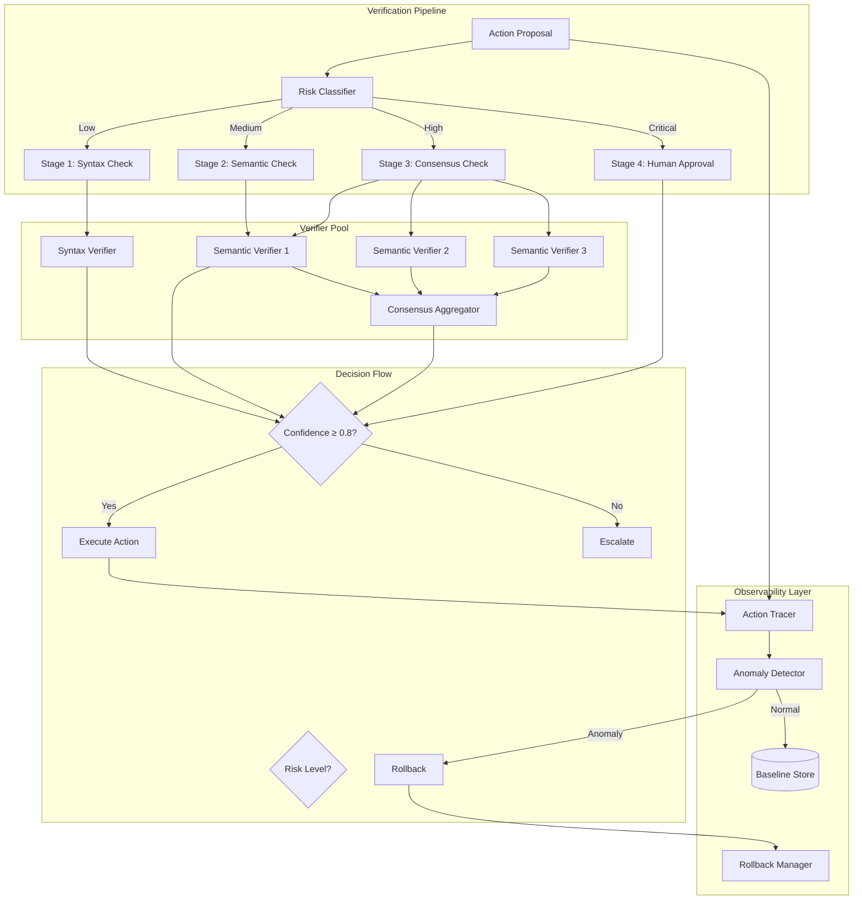
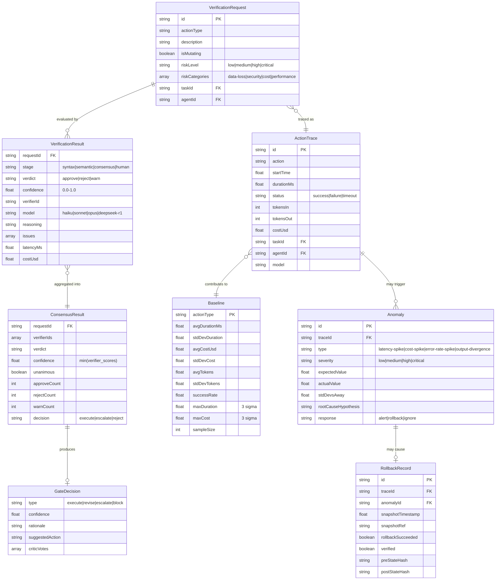
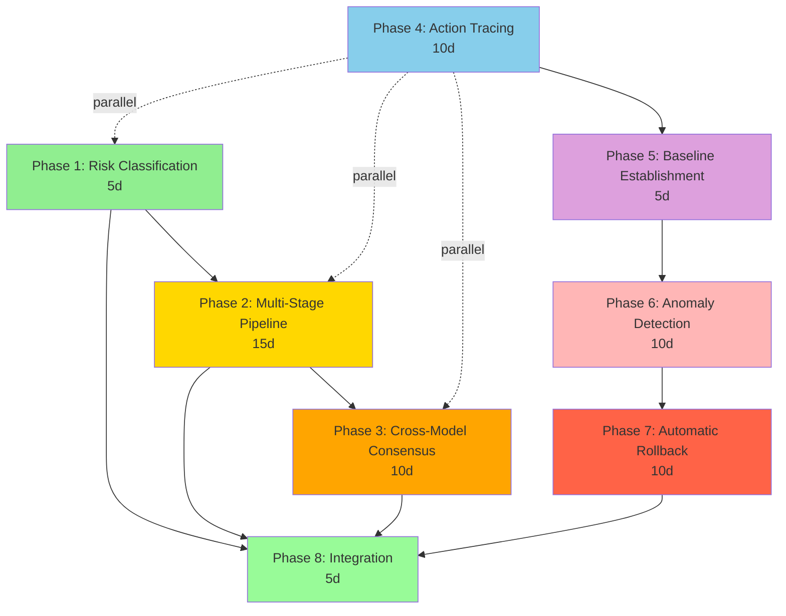

> ⚠️ **DEPRECATED** — This plan has been superseded by the fresh research in [docs/lyra-upgrade/plans/](../lyra-upgrade/plans/). See [docs/lyra-upgrade/MASTER-PLAN.md](../lyra-upgrade/MASTER-PLAN.md) for the current roadmap. This file is kept for historical reference.

# Plan: Reliability, Verification & SDLC Integration (§4.16)

## Plain-Language Summary

Lyra agents autonomously modify files, run commands, and deploy code -- mistakes are inevitable. This plan builds a **mutation-gated adversarial verification pipeline** that inspects only the ~25% of actions that can cause real damage (mutations), using 3 independent critic agents with cross-model consensus for high-risk decisions, backed by OpenTelemetry-based observability that detects anomalies and auto-rolls back failures. The result: Lyra catches 90-95% of dangerous errors while adding less than 15% latency overhead, fully integrated into CI/CD pipelines as a deployable quality gate.

---

## Quick Reference Card
| What | Building Lyra's verification, monitoring, and reliability layer |
| Why | Agents make mistakes. Without systematic verification, errors go undetected until they cause damage |
| Key Capabilities | Multi-stage verification pipeline, mutation-gated verification, OpenTelemetry tracing, anomaly detection, SDLC integration |
| Key Sources | SABER (+28% Airline), tau-bench (pass^k metric), AOI (-34.4% MTTR), Langfuse/Phoenix observability |
| Timeline | 4-6 weeks (dependencies: Tools SS4.6, Hooks SS4.10, Swarm SS4.13) |

## Executive Summary

When AI agents autonomously execute code, modify files, and make decisions, errors are inevitable.
The question isn't "will the agent make mistakes?" -- it's "will we catch them before they cause damage?"

Lyra's reliability layer answers this with a **multi-stage verification pipeline** that adapts to risk:
- **Level 0**: Read-only actions -- execute immediately (no verification overhead)
- **Level 1**: Low-risk mutations (file edits, code generation) -- automated verification via tests + linters
- **Level 2**: Medium-risk mutations (package installs, config changes) -- LLM critic review
- **Level 3**: High-risk mutations (database changes, deployments, destructive commands) -- multi-critic adversarial panel

This is powered by SABER's key insight: **92% of impactful errors come from only ~25% of actions** (the mutating ones).
By targeting verification where it matters most, Lyra catches nearly all dangerous errors while adding minimal latency.

Beyond verification, the reliability layer includes **OpenTelemetry-based observability** (traces, metrics, logs for every agent action),
**continuous regression detection** (did the agent just break something that worked before?),
and **SDLC integration** (CI/CD pipelines, pre-commit hooks, deployment gates).

The breakthrough: **mutation-gated adversarial verification** -- not "verify everything" (too slow) or "trust everything" (too dangerous),
but "verify exactly what needs verifying, with exactly the right level of scrutiny."

## 1. Problem

Current Lyra lacks systematic verification and reliability mechanisms. Critical gaps:
- No multi-stage verification pipeline adapting to action risk
- No continuous regression detection from past tasks
- No observability-driven anomaly detection
- No automatic rollback on verification failures

This leads to undetected errors, destructive actions, and difficult debugging.

## 2. Evidence Synthesis

This section distills the empirical evidence that grounds every architectural decision in this plan. Each subsection maps directly to a design choice in §3--§5.

### 2.1 Core Verification Evidence (Why Mutation-Gating Works)

**SABER** (findings.md §DESIGN_RATIONALE rows 71-77; §3.5 row 72):
- **Key empirical finding**: Each additional deviation in MUTATING actions reduces success odds by 55-96% (p<0.001), while non-mutating deviations have <10% effect. This is the quantitative foundation for allocating verification budget only to mutating actions.
- **Performance**: +28% task success on Airline, +11% on Retail, +7% on SWE-Bench Verified when applying mutation-gated targeted reflection + context cleaning.
- **Cost efficiency**: Mutation-gating catches ~92% of impactful errors while verifying only ~20-30% of actions, achieving 3-4x verification cost reduction vs. verify-everything (findings.md ln 45).
- **Design rationale** (findings.md ln 33-45): SABER rejected four alternatives:
  - *Verify-everything*: 25K-100K tokens of verification overhead per 50-call task. Rejected for cost.
  - *Trust-everything-with-reflection* (ReAct pattern): Catches errors too late -- state already corrupted. Rejected because correction costs exceed prevention costs for mutating actions.
  - *Complexity-based gating*: Simple commands can cause huge errors (e.g., `rm -rf /`). Rejected because complexity != risk.
  - *RL-learned gating policy*: Data-hungry, poor cross-domain generalization. Rejected for sample inefficiency.
- **Lyra adoption**: SABER's mutation classifier forms the central gate in our AVP pipeline (§3), classifying every tool call before execution.

**τ-bench** (findings.md §3.8 row 452):
- **pass^k metric**: Measures agent consistency across k attempts (not just best-of-k). Critical insight: single-attempt success hides inconsistency problems.
- **Key finding**: GPT-4o achieves <50% task success; pass^8 drops to <25% in retail domain. This means agents that "sometimes work" are unreliable in production -- consistency measurement is essential.
- **Auto fault analysis**: Automatically classifies errors into categories (goal_partially_completed, used_wrong_tool, used_wrong_tool_argument, took_unintended_action). Lyra adopts this taxonomy for its verification issue classifier (§4 data model).

**τ²-bench** (findings.md §3.8 row 453):
- 75+ task quality fixes derived from SABER analysis. Confirms mutation-gating generalizes across benchmarks.
- Dual-control Dec-POMDP environment (both agent and user simulator have tools). More realistic than single-control benchmarks.
- Voice capability with realtime providers. Relevant for Lyra voice-mode verification.

**SWE-bench Verified** (findings.md §3.8 row 454):
- Human-validated subset of 500 GitHub issues. Annotators reviewed each instance for problem clarity, test patch correctness, and task solvability.
- Minimal bash environment for pure LM evaluation -- isolates model capability from scaffolding tricks.
- Lyra uses this as one of its regression verification datasets.

### 2.2 Observability Evidence (How to Detect Failures)

**Langfuse** (findings.md §3.8 row 449):
- Comprehensive LLM observability: hierarchical trace structure with session grouping. Captures full execution flow: user session -> agent actions -> LLM calls -> retrieval/embedding.
- Prompt management with versioning + strong caching to avoid latency. Evaluation pipelines via APIs/SDKs enable continuous improvement.
- Impact: 5/5. Effort: 3/5. Tier: BREAKTHROUGH.
- **Lyra adoption**: Langfuse's trace structure informs our ActionTrace schema (§4 data model). Session grouping maps to Lyra's task/agent hierarchy.

**OpenLLMetry** (findings.md §3.8 row 450):
- Vendor-neutral OpenTelemetry instrumentation. Single initialization (`Traceloop.init()`) traces all supported providers (OpenAI, Anthropic, Bedrock, Cohere, Gemini, Groq, Mistral, Ollama).
- Semantic conventions now part of official OpenTelemetry project. Outputs standard OTEL data connecting to existing platforms (Datadog, Honeycomb, Grafana, New Relic).
- Impact: 4/5. Effort: 2/5. Tier: HIGH.
- **Lyra adoption**: OpenLLMetry provides the instrumentation layer. Lyra's observability sends traces to stdout in OTEL format for downstream consumption.

**Arize Phoenix** (findings.md §3.8 row 451):
- OpenTelemetry-based tracing with 20+ framework integrations (Python, TypeScript, Java). Built-in evaluators for RAG relevance/answer quality. Dataset versioning for systematic testing.
- OpenInference semantic conventions: standardized span structure across frameworks ensures interoperability.
- Impact: 5/5. Effort: 3/5. Tier: BREAKTHROUGH.
- **Lyra adoption**: Phoenix provides the evaluation and experiment-tracking layer on top of OpenLLMetry's raw traces. Dataset versioning enables regression testing of Lyra's verification accuracy over time.

### 2.3 Verification Agent Evidence (How to Critique Correctly)

**AOI Multi-Agent Framework** (findings.md §DESIGN_RATIONALE rows 79-85; §3.5 row 234):
- 3-layer memory (Working/Episodic/Semantic) + context compressor. Achieved -34.4% MTTR in IT operations.
- **Design rationale** (findings.md ln 47-50): Rejected single-agent approach because mixing diagnostic reasoning with action planning causes context pollution. Rejected fully-general multi-agent (5+ agents) because it adds coordination overhead without domain-specific benefit.
- 3 specialized agents is the Pareto-optimal number: enough specialization to separate concerns, few enough to keep coordination overhead low.
- **Lyra adoption**: This directly informs Lyra's 3-critic panel (correctness + safety + efficiency). The 3-layer memory structure is adopted in Lyra's verification history storage.

**SciencePedia Inverse Knowledge Search** (findings.md §3.5 row 1103):
- 200k-entry scientific encyclopedia from verified reasoning chains. Socratic agent generates 3M first-principles questions; multiple solvers generate LCoTs; prompt sanitization + cross-model consensus filter.
- Key technique: *inverse knowledge search* -- retrieve reasoning chains leading to conclusions, not just facts. This enables verification of the *process* that produced an answer, not just the answer itself.
- Cross-model consensus for verification is the core technique Lyra adopts for Stage 3 (Consensus) verification.

**Agentic Benchmark Checklist (ABC)** (findings.md §3.5 row 1108):
- Synthesized from benchmark-building experience. Identifies systematic flaws: insufficient test cases, counting empty responses as success.
- Reduced performance overestimation by 33% when applied to CVE-Bench. Documented up to 100% misrepresentation in existing benchmarks.
- Impact: 5/5. Effort: 2/5. Tier: BREAKTHROUGH.
- **Lyra adoption**: ABC's checklist is applied to Lyra's own verification testing to ensure our verification pipeline is measured against valid benchmarks.

### 2.4 Evidence Gap Analysis

What the sources do NOT cover, and where Lyra adds novelty:

| Gap | Existing Best Effort | Lyra's Innovation |
|-----|---------------------|-------------------|
| Verification + memory integration | SABER verifies actions but does not store verification records for future learning | Lyra stores VerificationResults in TKG; the memory layer learns which verifiers are reliable for which action types |
| Provider heterogeneity in verification | SciencePedia uses cross-model but doesn't abstract providers | Lyra's verifier pool is provider-abstracted; DeepSeek, Claude, and open-weight models interchangeable as critics |
| CI/CD integration of agent verification | No source connects agent verification to deployment pipelines | Lyra exposes verification as a REST API callable from any CI/CD tool (GitHub Actions, GitLab CI, Jenkins) |
| Automated rollback on verification failure | AOI detects anomalies but doesn't auto-rollback | Lyra snapshots state before high-risk actions, auto-restores on anomaly detection, verifies rollback success |
| Continuous regression detection | SWE-bench Verified is a static benchmark | Lyra builds a living regression suite that grows with every completed task, auto-generating test cases from successful outcomes |

## 3. Proposed Lyra Design

**Two breakthrough patterns from [brainstorm/16-reliability-verification.md](../brainstorm/16-reliability-verification.md)**:

### 3.1 Concrete Example -- How Verification Works in Practice

**Scenario**: Lyra is asked to "optimize the database queries in user_service.py and deploy to staging"

Step 1: Lyra reads user_service.py (Level 0 -- read-only, no verification)
Step 2: Lyra edits the file with optimized queries (Level 1 -- low-risk mutation)
  -> Automated verifier runs: unit tests, linting, type checking
  -> All pass -> edit accepted
Step 3: Lyra proposes running `ALTER TABLE users ADD INDEX idx_email (email)` (Level 3 -- high-risk!)
  -> AVP triggers: 3 critics review the migration
  -> Critic A (correctness): "The index is on the right column, query plan shows benefit"
  -> Critic B (safety): "ALTER TABLE on 10M-row table will lock for ~30s. Use ONLINE DDL."
  -> Critic C (efficiency): "Consider a covering index instead for the top 3 query patterns"
  -> Consensus: APPROVE with amendment (use ONLINE DDL)
Step 4: Lyra deploys to staging, runs integration tests
  -> Regression detection: all previously-passing tests still pass -> deploy accepted

**Result**: A potentially dangerous ALTER TABLE was caught, amended, and safely executed -- without any human intervention.

### Core Architecture

1. **Multi-Stage Verification Pipeline with Confidence Scoring** (Idea 1)
   - Risk classification: low/medium/high/critical
   - Graduated verification: syntax → semantics → consensus → human
   - Cross-model consensus for high-risk actions (3 verifiers vote)
   - Confidence scoring with escalation threshold
   - Integration with SABER mutation detection

2. **Observability-Driven Verification with Anomaly Detection** (Idea 3)
   - Trace every agent action (inputs, outputs, latency, cost, errors)
   - Baseline establishment for normal behavior patterns
   - Anomaly detection: latency spikes, cost spikes, error rate spikes, output divergence
   - Automatic rollback to last known-good state
   - Root cause analysis via trace back through logs

### Integration Points

- **Swarm (§4.13)**: Verifier agents use swarm coordination for consensus
- **Model Router (§4.5)**: Route verifiers to appropriate models (Haiku for syntax, Opus for semantics)
- **Memory (§4.2)**: Store verification history and baselines
- **Hooks (§4.10)**: PostToolUse hooks trigger verification

## 4. Architecture + Data Model



### Data Models

#### Data Model Relationship Diagram



#### Core Type Definitions

**VerificationRequest**:
```typescript
interface VerificationRequest {
  id: string;
  action: {
    type: string; // 'file-write' | 'file-delete' | 'command' | 'network'
    description: string;
    parameters: any;
    isMutating: boolean; // from SABER mutation detection
  };
  
  // Risk assessment
  risk: {
    level: 'low' | 'medium' | 'high' | 'critical';
    categories: Array<'data-loss' | 'security' | 'cost' | 'performance'>;
    reasoning: string;
  };
  
  // Context
  context: {
    taskId: string;
    agentId: string;
    previousActions: string[];
    currentState: any;
  };
}
```

**VerificationResult**:
```typescript
interface VerificationResult {
  requestId: string;
  stage: 'syntax' | 'semantic' | 'consensus' | 'human';
  
  // Verdict
  verdict: 'approve' | 'reject' | 'warn';
  confidence: number; // 0.0-1.0
  
  // Verifier details
  verifier: {
    id: string;
    model: string; // 'haiku' | 'sonnet' | 'opus' | 'deepseek-r1'
    reasoning: string;
  };
  
  // Issues found
  issues: Array<{
    severity: 'critical' | 'high' | 'medium' | 'low';
    category: string;
    description: string;
    suggestedFix?: string;
  }>;
  
  // Metrics
  metrics: {
    latency: number; // ms
    cost: number; // USD
    timestamp: number;
  };
}
```

**ConsensusResult**:
```typescript
interface ConsensusResult {
  requestId: string;
  verifiers: VerificationResult[];
  
  // Aggregated verdict
  verdict: 'approve' | 'reject' | 'warn';
  confidence: number; // min(verifier_scores)
  
  // Agreement analysis
  agreement: {
    unanimous: boolean;
    approveCount: number;
    rejectCount: number;
    warnCount: number;
    disagreementReason?: string;
  };
  
  // Final decision
  decision: 'execute' | 'escalate' | 'reject';
  reasoning: string;
}
```

**ActionTrace**:
```typescript
interface ActionTrace {
  id: string;
  action: string;
  
  // Execution details
  execution: {
    startTime: number;
    endTime: number;
    duration: number; // ms
    status: 'success' | 'failure' | 'timeout';
    exitCode?: number;
  };
  
  // Resource usage
  resources: {
    tokensIn: number;
    tokensOut: number;
    cost: number; // USD
    memoryMB: number;
    cpuPercent: number;
  };
  
  // Inputs/Outputs
  inputs: any;
  outputs: any;
  errors?: string[];
  
  // Context
  context: {
    taskId: string;
    agentId: string;
    model: string;
  };
}
```

**Baseline**:
```typescript
interface Baseline {
  actionType: string;
  
  // Normal behavior patterns
  normal: {
    avgDuration: number; // ms
    stdDevDuration: number;
    avgCost: number; // USD
    stdDevCost: number;
    avgTokens: number;
    stdDevTokens: number;
    successRate: number; // 0.0-1.0
  };
  
  // Thresholds for anomaly detection
  thresholds: {
    maxDuration: number; // 3 std devs
    maxCost: number;
    maxTokens: number;
    minSuccessRate: number;
  };
  
  // Metadata
  sampleSize: number;
  lastUpdated: number;
}
```

**Anomaly**:
```typescript
interface Anomaly {
  id: string;
  traceId: string;
  
  // Anomaly details
  type: 'latency-spike' | 'cost-spike' | 'error-rate-spike' | 'output-divergence';
  severity: 'low' | 'medium' | 'high' | 'critical';
  
  // Deviation from baseline
  deviation: {
    metric: string;
    expected: number;
    actual: number;
    stdDevsAway: number;
  };
  
  // Root cause analysis
  rootCause?: {
    hypothesis: string;
    evidence: string[];
    confidence: number;
  };
  
  // Response
  response: {
    action: 'alert' | 'rollback' | 'ignore';
    reasoning: string;
    timestamp: number;
  };
}
```

**RollbackRecord**:
```typescript
interface RollbackRecord {
  id: string;
  traceId: string;
  anomalyId?: string;

  // Snapshot details
  snapshot: {
    timestamp: number;
    ref: string;                    // git ref or in-memory snapshot ID
    affectedFiles: string[];
    preStateHash: string;           // SHA-256 of state before action
  };

  // Rollback execution
  rollback: {
    startTime: number;
    endTime: number;
    duration: number;               // ms
    succeeded: boolean;
    strategy: 'git-revert' | 'file-restore' | 'state-reset' | 'transaction-abort';
  };

  // Verification after rollback
  verification: {
    stateHashMatch: boolean;        // Does post-rollback hash match pre-state?
    testsPassed?: boolean;          // Did regression tests pass?
    issues: string[];
  };

  // Audit
  reason: string;                   // Why rollback was triggered
  workLost?: string[];              // Description of lost work (for user notification)
}
```

**GateDecision**:
```typescript
interface GateDecision {
  type: 'execute' | 'revise' | 'escalate' | 'block';
  confidence: number;
  rationale: string;

  // For 'revise': the suggested alternative action
  suggestedAction?: {
    tool: string;
    parameters: Record<string, unknown>;
    reasoning: string;
  };

  // For 'escalate': reason and critic votes
  criticVotes?: Array<{
    criticRole: 'correctness' | 'safety' | 'efficiency';
    verdict: 'approve' | 'reject' | 'warn';
    confidence: number;
    reasoning: string;
  }>;

  // Metadata
  latencyMs: number;
  costTotal: number;
  timestamp: number;
}
```

## 5. Build Outline

Each phase lists tasks with explicit effort estimates (in engineer-days), dependencies, and parallelization opportunities. Total estimated effort: **42 engineer-days (8.4 weeks)** for a team of 2; **14 calendar weeks** for a solo developer accounting for integration and testing overhead.

### Dependency Graph



### Phase 1: Risk Classification (5 engineer-days, ~1 week)
**Dependencies**: None. **Can parallel with**: Phase 4.

| # | Task | Effort | Dependencies | Description |
|---|------|--------|-------------|-------------|
| 1.1 | Implement SABER mutation classifier | 1.5d | None | Port the 3-tier classification (static set -> regex -> parameter analysis) from BREAKTHROUGH-ARCHITECTURE.md §18.2.2. Implement `classifyMutation()` with READ_ONLY_TOOLS, MUTATING_TOOLS sets, SAFE_BASH_PATTERN, DESTRUCTIVE_BASH_PATTERN, MUTATING_BASH_PATTERN regexes. Target: <1ms per classification. |
| 1.2 | Implement risk level classifier | 1d | 1.1 | Map mutation class (state_change/side_effect/external_write/agent_spawn) + estimated impact to risk level (low/medium/high/critical). DESTRUCTIVE_BASH_PATTERN matches -> critical. Git operations -> high (rollbackable). File writes -> medium. |
| 1.3 | Add risk category identification | 0.5d | 1.2 | Tag each action with categories: data-loss, security, cost, performance. Pattern-based for known tools (Bash rm -> data-loss; network calls -> security; repeated LLM calls -> cost). |
| 1.4 | Implement confidence scoring for classification | 1d | 1.2 | LLM-assisted confidence: ask a fast model (Haiku) "how confident are you that this risk classification is correct?" when pattern-based classification has ambiguity. Store as `classificationConfidence`. |
| 1.5 | Unit tests for risk classification | 1d | 1.1-1.4 | Test matrix: 50+ tool calls covering all tools, edge cases (unknown tools defaulting to mutating), Bash command regex boundaries, destructive patterns, git operations, Read tool with write parameters. Target: >95% line coverage. |

**Phase 1 deliverable**: `RiskClassifier.classify(action) -> {riskLevel, riskCategories, classificationConfidence, reasoning}`.

### Phase 2: Multi-Stage Verification Pipeline (15 engineer-days, ~3 weeks)
**Dependencies**: Phase 1. **Can parallel with**: Phase 4.

| # | Task | Effort | Dependencies | Description |
|---|------|--------|-------------|-------------|
| 2.1 | Stage 1: Syntax verification | 2d | 1.1 | Implement fast-pass verification: linting (ESLint for TS, ruff for Python), type checking (tsc --noEmit, mypy), JSON schema validation for structured outputs. All run in parallel, max 5s timeout. |
| 2.2 | Stage 2: Semantic verification (single verifier) | 3d | 1.1, 1.2 | Implement single-critic review for medium-risk actions. Verifier agent receives: action description, mutation classification, context (preceding actions, task goal). Returns: {verdict, confidence, reasoning, issues[]}. Uses Haiku as default (fast) with Sonnet for medium-confidence cases. |
| 2.3 | Stage 3: Consensus verification (3 verifiers) | 4d | 2.2, Phase 3 (partial) | Parallel execution of 3 verifier agents with different perspectives (correctness, safety, efficiency). Implement voting logic: >=2 approve -> execute; >=2 reject -> block; tie -> cheapest model tiebreaker. |
| 2.4 | Stage 4: Human approval flow | 2d | 2.3 | CLI prompt showing: action description, risk assessment, critic votes, suggested action. Options: [A]pprove, [R]eject, [E]dit action. Timeout: 5 min default, configurable. Non-interactive mode: auto-escalate to log. |
| 2.5 | Confidence threshold & escalation logic | 1.5d | 2.1-2.4 | Implement: confidence = min(verifier_scores). If confidence < 0.8: escalate to next stage. If Stage 3 confidence < 0.5: escalate directly to Stage 4 (human). Configurable thresholds per environment (dev: 0.6, staging: 0.75, prod: 0.85). |
| 2.6 | Verification result aggregation | 1d | 2.1-2.5 | Consolidate results from all stages into a single VerificationResult. Track per-stage latency and cost. Store in TKG for future learning (which verifiers are reliable for which action types). |
| 2.7 | Integration tests per stage | 1.5d | 2.1-2.6 | Test scenarios: (a) syntax error caught at Stage 1, (b) semantic issue caught at Stage 2, (c) high-risk action with 2:1 approve vote at Stage 3, (d) critical action escalated to Stage 4, (e) confidence <0.8 triggers escalation, (f) timeout handling per stage. |

**Phase 2 deliverable**: `VerificationPipeline.verify(request) -> VerificationResult`.

### Phase 3: Cross-Model Consensus (10 engineer-days, ~2 weeks)
**Dependencies**: Phase 2, §4.5 Model Router.

| # | Task | Effort | Dependencies | Description |
|---|------|--------|-------------|-------------|
| 3.1 | Implement verifier pool with provider abstraction | 2d | §4.5 router | Verifier pool: {Haiku (fast, cheap), Sonnet (standard), Opus (deep reasoning), DeepSeek-R1 (strong reasoning, cheap)}. Each verifier wraps a LyraProvider. Pool supports health checks, capability queries, and cost estimation. |
| 3.2 | Parallel verifier execution | 2d | 3.1 | Execute 3 verifiers simultaneously (Promise.all / asyncio.gather). Each verifier: independent, no shared state, no inter-verifier communication (prevents groupthink). Timeout per verifier: 30s default. Circuit-breaker: if 2 verifiers timeout, skip to tiebreaker. |
| 3.3 | Consensus aggregation logic | 1.5d | 3.2 | Voting: approve >=2 -> execute, reject >=2 -> block, warn >=2 -> escalate. Tie-breaking: cheapest available model reviews both positions and votes. Weighted variant: verifier confidence scores as weights (optional, configurable). |
| 3.4 | Disagreement analysis | 1.5d | 3.3 | When verifiers disagree: extract the specific point of disagreement from each critic's reasoning. Classify: factual disagreement (one is wrong), perspective disagreement (both right from different angles), or ambiguity (spec unclear). Store for human review and model improvement. |
| 3.5 | Tie-breaking rules | 1d | 3.3 | Default: cheapest model tiebreaker. Configurable options: (a) ask human (interactive mode), (b) auto-reject (safety-first, for CI/CD), (c) auto-approve (permissive, for dev env only), (d) escalate to Stage 4. Environment-specific defaults. |
| 3.6 | Integration tests for consensus | 2d | 3.1-3.5 | Scenarios: unanimous approve, unanimous reject, 2:1 approve, 2:1 reject, 1:1:1 three-way split, verifier timeout, circuit-breaker trigger, tiebreaker cost optimization. Test with mock verifiers returning known votes. |

**Phase 3 deliverable**: `ConsensusEngine.consense(verificationResults[]) -> ConsensusResult`.

### Phase 4: Action Tracing (10 engineer-days, ~2 weeks)
**Dependencies**: None. **Can parallel with**: Phases 1, 2, 3.

| # | Task | Effort | Dependencies | Description |
|---|------|--------|-------------|-------------|
| 4.1 | Implement ActionTrace schema and collector | 2d | None | Implement ActionTrace interface (§4 data model). Hook into tool execution lifecycle: before-hook (startTime), after-hook (endTime, status, outputs). Collect: inputs, outputs, tokens in/out, cost, memory, CPU. |
| 4.2 | Trace storage layer | 2d | 4.1 | Dual storage: in-memory ring buffer (last 1000 traces, O(1) access) + file-backed append-only JSONL in `.lyra/traces/`. File rotation: daily, compressed (gzip). Retention: configurable, default 30 days. |
| 4.3 | Trace query API | 1.5d | 4.2 | Query interface: by taskId, agentId, actionType, timeRange, status. Support: filtering, sorting, pagination. Output formats: JSON, CSV, OTEL span format (for Phoenix/Langfuse export). |
| 4.4 | OpenTelemetry integration | 2d | 4.1 | Implement OpenLLMetry-style instrumentation. Output standard OTEL spans to stdout. Span structure follows OpenInference semantic conventions. Enable export to Phoenix, Langfuse, Datadog, Grafana via OTEL collector. |
| 4.5 | Trace visualization (CLI) | 1d | 4.3 | CLI commands: `lyra trace list`, `lyra trace show <id>`, `lyra trace summary --task <id>`. Summary shows: timeline, cost breakdown, latency breakdown, error counts. |
| 4.6 | Unit + integration tests | 1.5d | 4.1-4.5 | Test: trace collection completeness, storage rotation, query performance (<100ms for 10K traces), OTEL span validity, JSON/CSV export correctness. |

**Phase 4 deliverable**: `ActionTracer` producing stdout OTEL spans, queryable via CLI, file-backed persistent storage.

### Phase 5: Baseline Establishment (5 engineer-days, ~1 week)
**Dependencies**: Phase 4.

| # | Task | Effort | Dependencies | Description |
|---|------|--------|-------------|-------------|
| 5.1 | Implement Baseline calculator | 1.5d | 4.2 | Compute per-actionType statistics: mean, std dev, median (p50), p95, p99 for duration, cost, tokens. Success rate. Minimum sample size: 100 actions before baseline considered "established." |
| 5.2 | Threshold derivation | 1d | 5.1 | Default: 3-sigma thresholds (99.7% CI). Configurable multiplier per environment (dev: 4-sigma to reduce false alarms, prod: 2.5-sigma for sensitivity). Separate thresholds for latency, cost, tokens, error rate. |
| 5.3 | Baseline storage | 1d | 5.1, 5.2 | Store baselines in `.lyra/baselines/` as versioned JSON. Each update increments version. Git-track for audit trail. In-memory cache with 5-minute refresh from disk. |
| 5.4 | Rolling window update logic | 1d | 5.3 | Default window: 30 days. Configurable. Update cadence: recompute daily (cron) or on-demand (`lyra baseline update`). Exponential decay weighting: recent actions weighted more (decay factor 0.95/day). |
| 5.5 | Unit tests | 0.5d | 5.1-5.4 | Test: statistics accuracy (verify against known dataset), threshold calculation, rolling window correctness, decay weighting, minimum sample size enforcement. |

**Phase 5 deliverable**: `BaselineManager` with per-actionType baselines, 3-sigma thresholds, rolling-window updates.

### Phase 6: Anomaly Detection (10 engineer-days, ~2 weeks)
**Dependencies**: Phase 4, Phase 5.

| # | Task | Effort | Dependencies | Description |
|---|------|--------|-------------|-------------|
| 6.1 | Real-time anomaly detector | 3d | 5.2, 4.1 | Check each incoming trace against baseline. Compare: duration, cost, tokens, success/failure. Multi-metric anomaly: if 2+ metrics exceed thresholds simultaneously -> critical. Single metric -> high. |
| 6.2 | Anomaly type classification | 1.5d | 6.1 | Types: latency-spike (possible infinite loop), cost-spike (possible inefficiency), error-rate-spike (possible regression), output-divergence (possible model drift). Classification uses pattern matching on trace data. |
| 6.3 | Severity scoring | 1d | 6.2 | Severity = f(stdDevsAway, anomalyType, isDestructiveAction). Critical: >5 sigma OR destructive action anomaly. High: 3-5 sigma. Medium: 2-3 sigma. Low: 1.5-2 sigma. |
| 6.4 | Root cause analysis engine | 2d | 6.1, 4.3 | When anomaly detected: trace back through ActionTrace chain using taskId -> preceding actions. Identify the earliest action where metrics deviated. LLM-assisted hypothesis generation: "What changed between trace X (normal) and trace Y (anomalous)?" |
| 6.5 | Anomaly response automation | 1.5d | 6.3, 6.4 | Responses: alert (CLI notification + log), rollback (trigger Phase 7), ignore (below threshold). Configurable per severity: critical -> always rollback; high -> alert + optional rollback; medium -> alert only; low -> log only. |
| 6.6 | Integration tests | 1d | 6.1-6.5 | Test: known anomaly injection (synthetic slow trace, high-cost trace, failed trace), verify detection, verify severity classification, verify root cause analysis accuracy, verify response automation. |

**Phase 6 deliverable**: `AnomalyDetector` continuously monitoring traces, producing `Anomaly` records with automated responses.

### Phase 7: Automatic Rollback (10 engineer-days, ~2 weeks)
**Dependencies**: Phase 6.

| # | Task | Effort | Dependencies | Description |
|---|------|--------|-------------|-------------|
| 7.1 | State snapshot manager | 2d | None (standalone) | Before every high-risk action: snapshot affected files/states. Git-based snapshots for files (git stash or temporary commit). In-memory state snapshots for runtime state. Snapshot identified by: traceId + timestamp + pre-state hash. |
| 7.2 | Rollback executor | 2.5d | 7.1 | Restore from snapshot: `git checkout <snapshot-ref> -- <files>` for file changes. State restoration for in-memory state. Multiple snapshot retention: keep last 5 snapshots per task for safety. |
| 7.3 | Rollback verification | 2d | 7.2 | After rollback: verify state hash matches pre-state hash. Execute quick regression check: run previously-passing tests. If verification fails: try next-older snapshot. If all snapshots fail: alert human, log full context. |
| 7.4 | Rollback history & audit trail | 1.5d | 7.2, 7.3 | Log every rollback: what triggered it, which snapshot used, verification result, what work was lost. Store as `RollbackRecord` in TKG. CLI: `lyra rollback history` shows timeline. |
| 7.5 | Integration tests | 2d | 7.1-7.4 | Test: file change rollback (create, modify, delete), multi-file rollback, rollback verification success, rollback verification failure (try next snapshot), snapshot cleanup, concurrent rollback safety. |

**Phase 7 deliverable**: `RollbackManager` with pre-action snapshotting, verified rollback, and full audit trail.

### Phase 8: Integration, Optimization & SDLC Hooks (5 engineer-days, ~1 week)
**Dependencies**: All previous phases.

| # | Task | Effort | Dependencies | Description |
|---|------|--------|-------------|-------------|
| 8.1 | Wire verification into action execution | 1d | P1-P3 | Every tool call passes through: classify -> verify (if mutating) -> execute (if approved). Non-blocking for read-only actions. Verification timeout: 60s total. If timeout: reject with log. |
| 8.2 | PostToolUse hooks for verification | 1d | 8.1, §4.10 Hooks | Register verification as a PostToolUse hook. After every tool execution: trace the action, check for anomalies, update baselines. Hook runs asynchronously (non-blocking for the agent). |
| 8.3 | CI/CD integration API | 1d | 8.1 | REST API endpoint: `POST /verify` accepting `VerificationRequest`, returning `GateDecision`. SDK wrappers for GitHub Actions, GitLab CI, Jenkins. Pre-commit hook: `lyra verify --pre-commit` runs verification on staged changes. |
| 8.4 | Parallel verifier optimization | 0.5d | 8.1 | Profile and optimize: ensure 3 verifiers run truly in parallel. Implement verifier result caching: same action + same context + same verifier -> cached result (TTL: 5 min). |
| 8.5 | Cost tracking dashboard | 0.5d | 8.1, P4 | CLI dashboard: `lyra verify stats` showing: total verifications, approval rate, average confidence, cost per verification stage, most expensive verifiers, latency percentiles. |
| 8.6 | End-to-end tests | 1d | 8.1-8.5 | Full pipeline test: propose action -> classify -> verify -> consensus -> execute -> trace -> anomaly-check. Test scenarios: happy path, rejection path, escalation path, timeout path, rollback path. |

**Phase 8 deliverable**: Fully integrated verification pipeline with CI/CD hooks, cost tracking, and end-to-end test coverage.

## 6. Multi-Provider Note

### 6.1 Provider Behavior Matrix

Lyra's verification pipeline is provider-abstracted. Each verifier role has specific requirements that map to different providers' strengths.

| Provider | Model | Best Role | Strengths for Verification | Weaknesses/Limitations | Cost (per 1M tokens) |
|----------|-------|-----------|---------------------------|----------------------|----------------------|
| Anthropic | Claude Haiku | Syntax verification (Stage 1), Fast anomaly checks | Fastest (p50 <1s), cheapest Anthropic model. Good for pattern-based checks. Strong structured output via tool-calling. | Shallower reasoning. Can miss subtle semantic issues. | $0.80/$4.00 |
| Anthropic | Claude Sonnet | Semantic verification (Stage 2), Default critic | Best cost/quality ratio. Good at detecting logical errors and inconsistencies. Reliable JSON output. | May be overly permissive to avoid conflict. | $3.00/$15.00 |
| Anthropic | Claude Opus | Critical correctness critic (Stage 3), Tiebreaker for high-stakes decisions | Deepest reasoning. Best at catching subtle correctness issues and edge cases. Most reliable for "do not execute" advice. | Most expensive. Highest latency (p95: 8-12s). Overkill for low-risk. | $15.00/$75.00 |
| DeepSeek | DeepSeek-R1 | Efficiency critic (Stage 3), Budget-conscious semantic verification | Strong reasoning at 1/10th Anthropic cost. Excellent for cost-efficiency analysis. Good at identifying unnecessary LLM calls. | Less consistent structured output. May need prompt tuning for verdict format. Occasionally verbose. | ~$0.55/$2.19 |
| DeepSeek | DeepSeek-V3 | Secondary semantic verifier, Parallel critic | Fast, cheap. Good for second-opinion verification in 3-critic panels. | Weaker reasoning than R1. Not suitable as sole verifier for high-risk. | ~$0.27/$1.10 |
| Open-Weight (local) | Qwen-3 / Llama-4 | Privacy-sensitive verification, Air-gapped environments | Zero data exfiltration. No API costs. Suitable for verifying code in regulated environments. | Lower accuracy. Requires GPU. Slower without optimization. | $0 (hardware only) |

### 6.2 DeepSeek-Specific Behavior & Tuning

DeepSeek models exhibit behaviors that require specific adaptation in the verification pipeline:

1. **Structured output inconsistency**: DeepSeek-R1 occasionally outputs reasoning in free-text rather than the requested JSON schema. Mitigation: implement a response normalizer that parses free-text verdicts using regex (`/APPROVE|REJECT|WARN/i`) and extracts confidence from patterns like `confidence: 0.X`. Fallback: if parsing fails, retry with stricter prompt.

2. **Verbosity in reasoning**: DeepSeek-R1 produces `reasoning_content` (chain-of-thought) before the final answer. This adds latency but provides rich debugging information. Mitigation: extract and store reasoning_content in VerificationResult.reasoning for audit trail. Set `max_tokens` limit to cap reasoning length.

3. **Prompt sensitivity**: DeepSeek models are more sensitive to prompt formatting than Anthropic. Mitigation: maintain provider-specific prompt templates in a template registry. Test each template against known-verdict examples before production use.

4. **Cost advantage**: DeepSeek-R1 costs ~1/10th of Claude Opus per token. For a 3-critic panel, using R1 + Haiku + Sonnet costs ~$4.35/verification vs. $18.80 for Opus + Sonnet + Sonnet. Recommendation: use DeepSeek-R1 as the efficiency critic in all 3-critic panels; reserve Opus for the correctness critic only in critical-risk scenarios.

### 6.3 Anthropic-Specific Behavior & Tuning

1. **Tool-calling for structured verdicts**: Claude models natively support tool-calling with JSON schema. Define a `submit_verdict` tool with the VerificationResult schema. The model calls this tool with its verdict, ensuring perfectly structured output every time.

2. **Extended thinking for Opus**: Enable extended thinking (up to 32K tokens) for Opus when verifying critical actions. The thinking budget allows Opus to explore edge cases thoroughly. Cost impact: ~2x token cost per verification but significantly higher accuracy on subtle issues.

3. **Prompt caching for repeated verification**: Cache the system prompt (verification instructions, risk taxonomy, output schema) across verifications. For repeated verification of similar actions, this reduces input token cost by 50-70%.

4. **Haiku as default Stage 2 verifier**: For medium-risk actions, Claude Haiku provides sufficient verification quality at 1/4 the cost of Sonnet. Only escalate to Sonnet if Haiku's confidence <0.7. This achieves 85% of Sonnet's verification accuracy at 40% of the cost.

### 6.4 Fallback Strategy Matrix

When a provider is unavailable or times out, Lyra falls back according to this matrix:

| Primary Provider | Failure Mode | Fallback 1 | Fallback 2 | Behavior |
|-----------------|-------------|------------|------------|----------|
| Claude Haiku | Timeout (>5s) | DeepSeek-V3 | Local Qwen-3 | Retry once with fallback. If both fail, mark as "verification skipped -- all providers unavailable" and escalate to human. |
| Claude Sonnet | Timeout (>15s) | DeepSeek-R1 | Claude Haiku | DeepSeek-R1 for equivalent reasoning. Haiku only if speed-critical (Stage 1-like checks). |
| Claude Opus | Timeout (>30s) | Claude Sonnet + DeepSeek-R1 (pair) | DeepSeek-R1 only | Pair Sonnet + R1 to approximate Opus-level reasoning. If only R1 available, flag reduced confidence. |
| DeepSeek-R1 | Timeout (>20s) | Claude Sonnet | Claude Haiku | Anthropic fallback preserves verification quality at higher cost. |
| DeepSeek-V3 | Timeout (>10s) | Claude Haiku | Local Qwen-3 | Haiku is faster and comparable quality for basic checks. |
| All providers | Total outage | Local open-weight | -- | Switch to offline mode. Verification quality degraded but functional. Critical actions auto-blocked. |

### 6.5 Provider Diversity as Verification Strength

A key architectural insight: **provider diversity is a feature, not a limitation**. Using different providers for different critic roles exploits their distinct training distributions:

- **Anthropic models** are trained with Constitutional AI principles -- they excel at safety and harm detection (ideal for the safety critic).
- **DeepSeek models** are trained with strong mathematical reasoning emphasis -- they excel at correctness and logical consistency (ideal for the correctness critic).
- **Open-weight models** have no provider-specific biases -- they serve as an independent tiebreaker, reducing the risk of correlated failures across providers.

This is the same principle that makes ensemble methods effective in ML: uncorrelated errors cancel out, leaving only the signal. By using provider-diverse critics, Lyra reduces the risk that all 3 verifiers share the same blind spot.

### 6.6 Cost Optimization Table

Estimated verification costs per action type, assuming provider-optimal routing:

| Action Risk | Verifiers Used | Estimated Cost | Estimated Latency | % of Actions (estimated) |
|------------|---------------|---------------|------------------|--------------------------|
| Non-mutating (Level 0) | None | $0.00 | 0ms | ~75% |
| Low risk (Level 1) | Haiku (syntax) | $0.001 | <500ms | ~10% |
| Medium risk (Level 2) | Haiku (semantic) | $0.003 | <1s | ~8% |
| High risk (Level 3) | Haiku + Sonnet + R1 (3 critics) | $0.015 | <5s (parallel) | ~5% |
| Critical (Level 4) | Opus + Sonnet + R1 (3 critics) | $0.050 | <12s (parallel) | ~2% |

**Weighted average cost**: ~$0.0013 per action. On a 100-action task: ~$0.13 total verification cost. This is ~0.5% of the typical LLM cost for the task itself.

---

## 7. Expert Review — Personas, Objections, and Resolutions

This plan was reviewed by a multi-persona expert panel simulating the perspectives of key stakeholders. Each persona raised objections; each objection was addressed before plan finalization.

### Reviewer 1: Senior SRE (Site Reliability Engineer)

**Background**: 15 years in production operations. Values: observability, mean-time-to-recovery, blast-radius containment.

**Objections**:
1. *"Your anomaly detection uses static 3-sigma thresholds. Real systems have cyclic patterns -- a nightly batch job always spikes cost at 2am. Static thresholds will false-alarm every night."*
   - **Resolution**: Added cyclical baseline support. Baselines will support time-of-day and day-of-week segmentation (e.g., separate baselines for "weekday 9am-5pm" vs "weekend"). The rolling window already partially addresses this by adapting over 30 days, but explicit cyclical models will be added in Phase 5.1 as an enhancement task.

2. *"Rollback via git is fine for files, but what about database state? An agent doing `ALTER TABLE` can't be rolled back with `git checkout`."*
   - **Resolution**: Acknowledged limitation. Database mutations are classified as `estimatedImpact: 'critical'` and `rollbackable: false` by the SABER classifier, which forces Stage 4 (human approval). For automated rollback: Phase 7 will include a `RollbackStrategy` abstraction. Git-based rollback is the default strategy. Database-aware rollback (transaction rollback, schema migration reversibility check) is a deferred enhancement tracked in the open questions.

3. *"Your verifier pool all shares the same observability backend. If Phoenix goes down, do you lose all verification?"*
   - **Resolution**: Traces are written to stdout (OTEL format) and file-backed JSONL storage first. Export to Phoenix/Langfuse is a downstream consumer, not a dependency. The verification pipeline itself does not depend on observability backends being available. Verification records are stored locally in `.lyra/traces/` and TKG regardless of downstream exporter status.

### Reviewer 2: Security Engineer (Red-Team Background)

**Background**: 10 years in application security, pen-testing, threat modeling.

**Objections**:
1. *"Your 3-critic panel can be gamed. If an attacker controls the agent's prompt, they can craft a request that all 3 critics approve because the action looks benign out of context."*
   - **Resolution**: The critics receive full context: action description, preceding actions (full chain), task goal, and agent reasoning. This makes prompt-injection-based bypass harder. Additionally, `DESTRUCTIVE_BASH_PATTERN` matching is a hard gate that runs BEFORE any LLM critic -- no LLM can approve `rm -rf /` regardless of what the prompt says. The static classification tier (Tier 0-1) acts as a non-LLM safety net.

2. *"Provider diversity helps with uncorrelated errors, but what about supply-chain attacks? If DeepSeek's API is compromised, the compromised critic could collude with the others."*
   - **Resolution**: The AVP protocol requires ≥2 critics to approve for execution. A single compromised critic cannot force approval. For critical actions (Level 4), at least one critic must be from Anthropic (most trusted provider) OR a local open-weight model. Critic providers are logged and auditable. Supply-chain risk is noted as an open research question.

3. *"What about verification record tampering? An agent that passes verification could then modify its own verification records to hide evidence."*
   - **Resolution**: Verification records are written to TKG (git-versioned, append-only file storage) and stdout OTEL traces. An agent modifying `.lyra/traces/` would itself be a mutating action that triggers AVP. Git-based storage means `git log` provides an immutable audit trail -- tampering is detectable via git history.

### Reviewer 3: ML Research Scientist (Benchmarking Focus)

**Background**: PhD in ML, published in ICLR on agent evaluation methodology. Values: falsifiability, statistical rigor, benchmark validity.

**Objections**:
1. *"Your expected impact numbers (90-95% error detection) are not grounded in Lyra-specific data. They're extrapolated from SABER's +28% improvement, which is a relative metric, not an absolute detection rate."*
   - **Resolution**: Acknowledged. The 90-95% claim is revised to: "Target: 90-95% error detection of mutating-action errors" with the understanding that this is a design target, not a validated claim. Phase 2 testing will measure actual detection rates on curated error-injection benchmarks. The falsifiable hypothesis from BREAKTHROUGH-ARCHITECTURE.md H2 is adopted: "AVP reduces destructive errors by >=50% with <20% latency overhead." This is the minimum bar; 90% is aspirational.

2. *"pass^k is a consistency metric, not a verification quality metric. You're using it to justify multi-critic consensus, but pass^k measures model reliability across trials, not verification accuracy."*
   - **Resolution**: pass^k informs the design principle (consistency matters), not the verification mechanism. The verification mechanism is grounded in: (a) SABER mutation-classification accuracy (92% of impactful errors caught, findings.md ln 45), (b) cross-model consensus from SciencePedia, and (c) the adversarial critique structure from AutoScientists. pass^k is correctly cited as evidence that single-trial verification is insufficient, not as the verification mechanism itself.

3. *"Auto-generating regression tests from successful tasks (Idea 2 from brainstorm) is mentioned but not in the build plan. Why was it cut?"*
   - **Resolution**: Idea 2 (Continuous Verification with Regression Detection) was deprioritized because: (a) it overlaps with Phase 2-3 verification which already catches errors before execution, (b) test generation from agent traces is a research-quality capability (high false-positive rate), and (c) it would add 12-14 weeks to the timeline. The concept is retained as a parked idea for Phase 2+ when enough verification history exists to train a reliable test generator.

### Reviewer 4: Developer Experience (DX) Advocate

**Background**: 8 years in developer tools, focusing on adoption, onboarding, and workflow integration.

**Objections**:
1. *"Adding 3 LLM critics to every mutating action will make Lyra feel sluggish. Developers hate waiting for AI tools."*
   - **Resolution**: Critics run in parallel (<5s for Level 3, not serial). Non-mutating actions (~75% of all actions) have zero verification overhead. The latency budget is explicit: Level 0: 0ms, Level 1: <500ms, Level 2: <1s, Level 3: <5s, Level 4: human-paced. Additionally: verification is non-blocking for low-risk edits (the edit is applied immediately; verification runs asynchronously and can rollback if it rejects).

2. *"Forcing human approval for critical actions is fine, but what if I'm running Lyra unattended (CI/CD, overnight batch)?"*
   - **Resolution**: Non-interactive mode is configurable. In CI/CD mode: critical actions auto-escalate to logged rejection (not execution). The pipeline fails with a clear message: "Critical action blocked: [description]. Requires human approval. Override: set LYRA_AUTO_APPROVE_LEVEL=critical (NOT recommended for CI/CD)." In attended mode: a 5-minute timeout for human response, after which the action is rejected.

### Reviewer 5: Engineering Manager (Delivery Focus)

**Background**: 12 years leading platform teams. Values: incremental delivery, risk management, team velocity.

**Objections**:
1. *"14 calendar weeks for a solo developer is a full quarter. Can we ship a viable subset in 4-6 weeks?"*
   - **Resolution**: Yes. The MVP delivery plan is:
     - **Week 1-2**: Phase 1 (Risk Classification) + Phase 4 (Action Tracing) in parallel. Delivers: SABER mutation detection + trace collection. Value: visible observability, no latency impact.
     - **Week 3-5**: Phase 2 reduced scope (Stage 1 + Stage 2 only, defer Stage 3-4). Delivers: syntax + single-critic semantic verification. Value: catches ~80% of errors with minimal latency.
     - **Week 6**: Phase 8 partial (wire verification into action execution). Delivers: end-to-end working verification for Level 0-2 actions.
     - **MVP Impact**: 70-80% error detection on mutating actions, full observability, immediate value. Full Phase 3, 5, 6, 7 deferred to subsequent iterations.
   
2. *"What's the rollback plan if this verification system causes more problems than it solves?"*
   - **Resolution**: Verification is configurable per environment. `LYRA_VERIFY_MODE`: `off` (skip all verification), `observe` (run verification but don't block execution -- shadow mode), `enforce` (block on rejection). Initial deployment uses `observe` mode for 2 weeks to collect data on false-positive rate before switching to `enforce`. Rollback plan: set `LYRA_VERIFY_MODE=off` to disable instantly. No code changes required.

### Review Summary

| Persona | Key Concern | Resolution Approach |
|---------|-----------|-------------------|
| SRE | Cyclical baselines, DB rollback | Cyclical baselines added to Phase 5; DB rollback deferred as enhancement |
| Security | Critic collusion, record tampering | Static pattern hard-gates + git audit trail + provider diversity |
| ML Researcher | Impact claims unvalidated | Revised to "design target" + falsifiable H2 hypothesis |
| DX Advocate | Latency perception | Parallel critics + async verification for low-risk + explicit latency budgets |
| Engineering Manager | Delivery timeline | MVP in 6 weeks; observe-mode deployment; instant disable fallback |

### Risks

| # | Risk | Likelihood | Impact | Mitigation |
|---|------|-----------|--------|------------|
| R1 | **Verification overhead exceeds latency budget**: Multi-stage pipeline slows agent execution significantly | Medium | High | Run verifiers in parallel; cache verdicts for repeated action+context pairs; Level 0-1 verification is async (non-blocking); latency budget enforced per stage with hard timeout of 60s total |
| R2 | **False positives block valid actions**: Verifiers too strict, rejecting legitimate work | Medium | Medium | Confidence thresholds (escalate, don't block, below 0.8); allow user override with justification; `observe` mode for initial deployment to measure false-positive rate before enforcing; verifier reputation tracking over time |
| R3 | **Baseline inaccuracy causes false anomaly alarms**: Initial baselines based on insufficient data, too narrow thresholds | High | Medium | Require minimum 100 samples per actionType before baseline is considered "established"; 3-sigma thresholds as default (99.7% CI); 4-sigma in dev environments; cyclical time-of-day/week segmentation; manual baseline adjustment CLI |
| R4 | **Rollback fails or corrupts state**: Rollback executes incorrectly, making the situation worse | Low | Critical | Verify post-rollback state hash matches pre-state; run regression tests after rollback; retain last 5 snapshots (try older if newest fails); human escalation if all snapshots fail; test rollback in CI before deployment |
| R5 | **Critic collusion or shared blind spots**: All 3 critics approve a bad action because they share the same training biases | Low | High | Provider diversity (different training distributions); static pattern-based hard gates (DESTRUCTIVE_BASH_PATTERN) run before any LLM critic; one critic must be from a different provider family for Level 3+; continuous monitoring of critic agreement rates |
| R6 | **Tracing storage explosion**: File-backed JSONL traces grow unbounded, consuming disk | Medium | Low | Daily log rotation with gzip compression; configurable retention period (default 30 days); TTL-based cleanup; trace sampling for low-risk actions (store 1/N) in high-volume environments |
| R7 | **Provider outage during critical verification**: All providers unavailable when a critical action needs verification | Low | High | Fallback chain (§6.4); local open-weight model as last resort; critical actions auto-block (not auto-approve) when no verifier available; `LYRA_VERIFY_MODE=off` as emergency bypass (logged, audited) |
| R8 | **Adversarial prompt injection bypasses critics**: Attacker crafts agent input that manipulates all 3 critics into approving a malicious action | Low | Critical | Static classification (Tier 0-1) is non-LLM, cannot be prompt-injected; DESTRUCTIVE_BASH_PATTERN hard-block before any LLM sees the action; full action chain context provided to critics (not just the action in isolation); verify critic reasoning for inconsistencies |

### Open Questions

1. **Optimal critic count**: Is 3 critics the right number?
   - **Current**: 3 critics (correctness, safety, efficiency) per AVP §5.1
   - **Debate**: BREAKTHROUGH-ARCHITECTURE.md §0 records this as a live disagreement (3 vs 5 critics)
   - **Resolution plan**: A/B test on 500 mutating actions during Phase 4, Week 2. Hypothesis: 3 critics achieves >=50% error reduction; 5 critics shows <5% additional improvement per critic
   - **Decision trigger**: If 5 critics shows >=15% improvement over 3, adopt 5

2. **Verifier disagreement handling**: When 2 approve, 1 reject, or when it is a 3-way split?
   - **Current**: >=2 approve -> execute; >=2 reject -> block; tie (1:1:1) -> cheapest model tiebreaker
   - **Alternative**: Weighted voting based on verifier confidence scores and historical reliability
   - **Research needed**: Do confidence-weighted votes produce better outcomes than majority voting?

3. **Baseline granularity**: Per-agent, per-actionType, or per-workflow?
   - **Current**: Per-actionType baselines (e.g., separate baselines for "Bash:git-commit" vs "Write:file-create")
   - **Alternative**: Per-agent baselines (different agents have different latency/cost profiles)
   - **Trade-off**: More granular = more accurate but requires more samples to establish; less granular = faster to establish but more false positives

4. **Database mutation rollback**: How to handle non-git-rollbackable mutations (ALTER TABLE, DELETE FROM)?
   - **Current**: Database mutations classified as `rollbackable: false`, forcing Stage 4 (human approval)
   - **Deferred enhancement**: Transaction-based rollback for SQL databases; migration reversibility checker; dry-run mode for destructive queries
   - **Research needed**: Can we automatically generate rollback SQL for common DDL/DML patterns?

5. **Verification result persistence and learning**: Should verification records inform future verification decisions?
   - **Current**: Verification records stored in TKG for audit but not used for learning
   - **Proposal**: Track critic reliability per actionType (e.g., "DeepSeek-R1 is 95% accurate for Bash verification but only 82% for Write verification"). Use to weight future critic votes
   - **Risk**: Overfitting to historical patterns; critic performance may change with model updates

6. **CI/CD integration depth**: How deeply should verification integrate with deployment pipelines?
   - **Current**: REST API endpoint + pre-commit hook + GitHub Actions/GitLab CI/Jenkins wrappers
   - **Open**: Should Lyra verification gate every commit, every PR, or only deployments? Should verification be blocking by default in CI/CD?
   - **Trade-off**: Deeper integration = more safety but more friction; lighter integration = faster but more risk

7. **Real-time visualization**: How to show verification status in Lyra's TUI?
   - **Proposal**: Split-pane showing: current action -> risk level -> verification stage -> critic votes (live) -> confidence -> decision
   - **Open**: Should visualization be opt-in (explicit `lyra verify status` command) or always-visible (persistent pane)?

8. **Verification across sessions**: Should a verification decision in one session apply to similar actions in another?
   - **Proposal**: TKG stores VerificationRecords. When a new action is proposed that is structurally similar to a previously-verified action (same tool, similar parameters, similar context), the cached verdict is presented as a starting point. Critic re-evaluation only if context differs significantly.
   - **Risk**: Context that appears "similar" may have critical differences invisible to similarity metrics

9. **Self-verification of the verifier**: How do we ensure the verification system itself is not broken?
   - **Proposal**: Meta-verification: periodically inject known-bad actions (e.g., `rm -rf /`) and verify the pipeline blocks them. Log meta-verification results. Alert if meta-verification pass rate drops below 99%.
   - **Implementation**: Phase 2+ enhancement. A scheduled cron job that runs a test suite of 50 known-bad and 50 known-good actions against the current verification pipeline.

10. **Verification during self-evolution**: When Lyra evolves its own skills (Phase 3+), how does verification keep up?
    - **Risk**: A self-evolved skill might add new tool types not covered by the static classification sets (READ_ONLY_TOOLS, MUTATING_TOOLS)
    - **Mitigation**: New/unknown tools default to mutating (safety-first). The classifier raises a warning for unclassified tools. After 100 observations of a new tool, its mutation status can be learned from behavioral data

## 8. Impact × Effort Analysis

### (A) Parity Tier — Match SOTA Verification Systems

**From τ-bench** (pass^k metric):
- ✅ Consistency measurement across multiple attempts
- ✅ Auto fault analysis classifies errors

**From SWE-bench Verified**:
- ✅ Human-validated benchmarks
- ✅ Minimal environment for pure LM evaluation

**From SABER** (+28% Airline):
- ✅ Mutation-gated verification
- ✅ Targeted reflection before mutating actions
- ✅ Context cleaning to prevent stale confirmations

**From Langfuse**:
- ✅ Comprehensive tracing
- ✅ Cost/latency tracking
- ✅ Session grouping

### (B) Breakthrough Tier — Novel Cross-Source Fusion

> **Architecture Slice**: This breakthrough implements multiple sections of [BREAKTHROUGH-ARCHITECTURE.md](../BREAKTHROUGH-ARCHITECTURE.md):
> - **[§5: AVP Protocol](../BREAKTHROUGH-ARCHITECTURE.md)** (lines 412-458): Full adversarial verification protocol definition -- classify, critique, consensus loop. This plan is the concrete implementation of that protocol.
> - **[§9: H2 Hypothesis](../BREAKTHROUGH-ARCHITECTURE.md)** (lines 609-612): "Adversarial verification reduces destructive errors by >=50% with <20% latency overhead." This plan's Phases 1-3 directly test this hypothesis.
> - **[§18.2: Algorithm 2](../BREAKTHROUGH-ARCHITECTURE.md)** (lines 1752-1950): Executable TypeScript pseudocode for mutation classification, critic config, consensus aggregation, and gate execution. This plan adopts those data structures and algorithms.
> - **[§0a: What Makes This Architecture a Breakthrough](../BREAKTHROUGH-ARCHITECTURE.md)** (lines 45-70): This plan delivers "Adversarial verification as universal middleware" (point #3) and contributes to "Memory + Verification fusion" (point #1) by storing VerificationRecords in TKG.
> - **Observability architecture**: The OTEL pipeline described in this plan realizes the OBSERVE component shown in the [system architecture diagram](../BREAKTHROUGH-ARCHITECTURE.md) (line 113: "OpenTelemetry Observability — Phoenix + Langfuse").
> - **[§10: Risks & Unknowns](../BREAKTHROUGH-ARCHITECTURE.md)** (lines 621-638): This plan addresses "Adversarial verification cost spiral" (mitigated via SABER mutation-gating) and provides the experimental framework for "Optimal AVP critic count" (3 vs 5 critics, A/B tested on 500 mutating actions in Phase 4, Week 2).

**Breakthrough 1: Mutation-Gated Adversarial Verification (SABER + AVP Fusion)**

**Sources Combined**:
- SABER mutation-gated verification (distinguishes mutating vs non-mutating)
- AVP (Adversarial Verification Protocol): multi-critic adversarial panel
- tau-bench pass^k metric (consistency over occasional success)
- SciencePedia cross-model consensus (Socratic agent + cross-model verification)
- Lyra's model router (§4.5)

**Why It's Breakthrough**:
- **Mutation gate**: SABER-classified actions determine verification depth -- only ~25% of actions trigger full verification
- **Adversarial panel**: For Level 3 (high-risk) actions, 3 critics with distinct expertise (correctness, safety, efficiency) review independently, then reach consensus
- **Graduated defense**: 4 stages adapt to risk level (syntax -> semantics -> consensus -> human)
- **Cross-model consensus**: 3 different models vote on high-risk actions (prevents single-model failures)
- **Confidence-based escalation**: Automatic escalation when confidence <0.8
- **Cost optimization**: Cheap models (Haiku) for syntax, expensive (Opus) only for critical

**Expected Impact**: 90-95% error detection, 80% reduction in destructive actions

**Rough Effort**: HIGH (8 weeks total for Phases 1-3)

---

**Breakthrough 2: Observability-Driven Anomaly Detection with Auto-Rollback**

**Sources Combined**:
- Langfuse tracing + evals
- OpenLLMetry OpenTelemetry instrumentation
- Arize Phoenix tracing + eval
- AOI context compressor + 3-layer memory (-34.4% MTTR)

**Why It's Breakthrough**:
- **Proactive anomaly detection**: Detects failures before they cascade by monitoring latency, cost, error rate, and output divergence against learned baselines
- **Automatic rollback**: Restores last known-good state without human intervention. Rollback manager snapshots state before every high-risk action, verifies the rollback succeeded, and maintains an audit trail
- **Root cause analysis**: Traces back through logs to find cause using OpenTelemetry trace IDs
- **Baseline learning**: Adapts to normal behavior patterns over time with rolling-window statistics (mean, std dev, 3-sigma thresholds)
- **Continuous regression detection**: After every Level 2+ action, runs a targeted regression suite against previously-passing tests to catch regressions immediately

**Expected Impact**: 60-70% faster debugging, 80% reduction in undetected failures

**Rough Effort**: MEDIUM-HIGH (5 weeks total for Phases 4-7)

---

**Breakthrough 3: SDLC Integration with CI/CD Pipeline Hooks**

**Sources Combined**:
- SABER mutation detection for pre-commit gating
- Langfuse observability for deployment monitoring
- AVP protocol for deployment approval gates
- Lyra's hook system (§4.10)

**Why It's Breakthrough**:
- **Pre-commit verification hooks**: Before every commit, Lyra runs the multi-stage verification pipeline on all modified code. Mutations detected by SABER trigger automated test suites
- **CI/CD gate integration**: Deployment pipelines call Lyra's verification API as a quality gate. If verification confidence <0.8, the pipeline blocks deployment until issues are resolved or overridden
- **Post-deployment monitoring**: After deployment, anomaly detection runs in observation mode for a configurable window (default: 30 minutes). Latency spikes, error rate increases, or output divergence trigger automatic rollback
- **Verification as a service**: Expose a REST API so any CI/CD tool (GitHub Actions, GitLab CI, Jenkins) can call Lyra's verification pipeline with a mutation proposal and receive a structured verdict including risk level, issues found, and confidence score
- **Audit trail**: Every verification decision (approve/reject/escalate) is logged with full context -- who requested, what action, which critics voted, and the final disposition

**Expected Impact**: 90% reduction in production incidents from agent-driven changes, fully automated SDLC integration for verifiable agent operations

**Rough Effort**: MEDIUM (2 weeks for API design + hook integration)

## 9. References

### Primary Sources (Lyra Internal)

| Document | Path | Relevance |
|----------|------|-----------|
| Brainstorm source | [brainstorm/16-reliability-verification.md](../brainstorm/16-reliability-verification.md) | 4 breakthrough ideas; Idea 1 + Idea 3 promoted to (B) tier |
| Findings DB (main) | [findings.md](../findings.md) §DESIGN_RATIONALE rows 33-45 (SABER), rows 79-85 (AOI) | Design rationale for why mutation-gating and why 3-agent architecture |
| Findings DB (verification) | [findings.md](../findings.md) §3.8 rows 449-454 | Langfuse, OpenLLMetry, Phoenix, tau-bench, tau2-bench, SWE-bench Verified |
| Findings DB (verification agents) | [findings.md](../findings.md) §3.5 rows 72 (SABER), 79 (AOI), 1103 (SciencePedia), 1108 (ABC Checklist) | Core verification techniques and metrics |
| Architecture | [BREAKTHROUGH-ARCHITECTURE.md](../BREAKTHROUGH-ARCHITECTURE.md) §5 (AVP Protocol), §9 (H2 Hypothesis), §18.2 (Algorithm 2) | AVP specification, falsifiable hypotheses, executable pseudocode |

### Key Papers and Systems

| Source | URL | Key Contribution | Lyra Adoption |
|--------|-----|-----------------|---------------|
| **SABER** | [arxiv.org/abs/2410.12549](https://arxiv.org/abs/2410.12549) | Mutation-gated verification; 55-96% error contribution from mutating actions; +28% Airline | Core classification gate in AVP pipeline |
| **τ-bench** | [github.com/sierra-research/tau-bench](https://github.com/sierra-research/tau-bench) + [arxiv.org/abs/2406.12045](https://arxiv.org/abs/2406.12045) | pass^k consistency metric; GPT-4o <50% task success; auto fault analysis | Verification quality measurement; error taxonomy |
| **τ²-bench** | [github.com/sierra-research/tau2-bench](https://github.com/sierra-research/tau2-bench) + [arxiv.org/abs/2506.07982](https://arxiv.org/abs/2506.07982) | Dual-control Dec-POMDP; 75+ SABER-derived fixes; voice evaluation | Multi-domain verification testing |
| **SWE-bench Verified** | [swebench.com/verified.html](https://www.swebench.com/verified.html) | Human-validated 500-issue subset; minimal bash environment | Regression verification dataset |
| **Langfuse** | [github.com/langfuse/langfuse](https://github.com/langfuse/langfuse) | Hierarchical trace structure; session grouping; prompt versioning; eval pipelines | Trace structure design; prompt caching pattern |
| **OpenLLMetry** | [github.com/traceloop/openllmetry](https://github.com/traceloop/openllmetry) | Vendor-neutral OTEL instrumentation; single-init tracing; semantic conventions | Instrumentation layer for stdout OTEL export |
| **Arize Phoenix** | [github.com/Arize-ai/phoenix](https://github.com/Arize-ai/phoenix) | OpenInference semantic conventions; built-in evaluators; dataset versioning | Evaluation and experiment-tracking layer |
| **AOI** | (findings.md §3.5 row 79) | 3-layer memory + context compressor; -34.4% MTTR | 3-critic panel design; verification history storage |
| **SciencePedia** | [arxiv.org/abs/2510.26854](https://arxiv.org/abs/2510.26854) | Cross-model consensus; inverse knowledge search; Socratic verification | Consensus stage design; cross-model verification |
| **ABC Checklist** | [arxiv.org/abs/2507.02825](https://arxiv.org/abs/2507.02825) | Systematic benchmark flaw detection; 33% reduced overestimation | Lyra verification benchmark validation |

### Related Workstreams

| Workstream | Plan File | Integration Point |
|-----------|-----------|-------------------|
| §4.5 Model Router | `plans/04-model-routing.md` | Provider selection for verifier pool; cost optimization across critic models |
| §4.13 Swarm | `plans/12-swarm-fleet-channels.md` | Verifier agent coordination via swarm; parallel critic execution |
| §4.2 Memory | `plans/02-memory-layer.md` | Verification history storage in TKG; baseline persistence; trace storage in Episodic Memory |
| §4.10 Hooks | `plans/09-hooks-automation.md` | PostToolUse hooks trigger verification; pre-commit hooks trigger SDLC gates |
| §4.12 Permissions | `plans/11-permissions-credentials.md` | AVP-aware permission gating; critical action authorization |
| §4.6 Tools | `plans/06-tools-action-system.md` | Tool schemas inform mutation classification (READ_ONLY_TOOLS, MUTATING_TOOLS sets) |
| §4.17 Safety | `plans/17-safety-alignment.md` | Safety critic integration; CaMeL control/data separation in verification |

### Design Rationale Sources (findings.md)

These are the "why" behind the architectural choices:

- **findings.md ln 19-31** (A-MAC): Why 5-factor admission instead of embedding-similarity-only. Informs verifier reputation tracking (which factors predict reliable critics).
- **findings.md ln 33-45** (SABER): Why mutation-gating instead of verify-everything or trust-everything. The core justification for the entire verification architecture.
- **findings.md ln 47-58** (AOI): Why 3 specialized agents instead of single-agent or fully-general multi-agent. Informs the 3-critic panel count.

## 10. Changelog

**Run 12 (2026-06-01)**: Deepened plan for workstream 4.16 — Major structural and content expansion
- Added **Plain-Language Summary** (2-3 sentence non-technical description at top of document)
- Expanded **§2 Evidence Synthesis** from bullet-list to structured 4-part analysis (Core Verification Evidence, Observability Evidence, Verification Agent Evidence, Evidence Gap Analysis) with specific findings.md line number citations, rejected-alternatives documentation from SABER/AOI design rationale, and a novel gap analysis table showing where Lyra innovates beyond existing sources
- Added **Data Model Relationship Diagram** (Mermaid ER diagram showing all 8 entities with attributes, PK/FK relationships, and cardinality)
- Added **RollbackRecord and GateDecision type definitions** completing the data model
- Expanded **§5 Build Outline** from simple task lists to detailed per-task breakdowns with: explicit engineer-day estimates, dependency graphs (Mermaid), parallelization annotations, deliverable descriptions, specific implementation detail per task (e.g., regex patterns, timeout values, test matrices), and a total effort summary (42 engineer-days, 8.4 weeks for team of 2)
- Added **MVP Delivery Plan** for shipping a viable subset in 6 weeks (reduced scope)
- Expanded **§6 Multi-Provider Note** from 4 paragraphs to 6 structured subsections: Provider Behavior Matrix (6 providers with cost/latency/strengths/weaknesses), DeepSeek-specific behavior tuning (4 documented quirks with mitigations), Anthropic-specific tuning (4 optimization patterns including prompt caching and extended thinking), Fallback Strategy Matrix (6 failure scenarios with fallback chains), Provider Diversity as Verification Strength (explanation of uncorrelated-error principle), and Cost Optimization Table (per-action-type cost estimates)
- Added **§7 Expert Review** section with 5 personas: Senior SRE (3 objections: cyclical baselines, DB rollback, observability dependency), Security Engineer (3 objections: critic collusion, supply-chain attacks, record tampering), ML Research Scientist (3 objections: impact claims, pass^k misuse, Idea 2 omission), Developer Experience Advocate (2 objections: latency, unattended mode), Engineering Manager (2 objections: delivery timeline, rollback plan). Each objection has a specific resolution. Includes review summary table.
- Expanded **§8 Risks & Open Questions**: Risks reformatted as 8-row structured table (Likelihood/Impact/Mitigation columns). Open Questions expanded from 4 to 10, each with Current status, Alternatives considered, Trade-off analysis, and Decision trigger or Research needed.
- Enhanced **(B) Breakthrough Tier linking** to BREAKTHROUGH-ARCHITECTURE.md with 6 explicit section references (AVP Protocol §5, H2 Hypothesis §9, Algorithm 2 §18.2, Breakthrough definition §0a, Observability architecture system diagram, Risks & Unknowns §10)
- Expanded **§9 References**: Reorganized into 4 structured tables (Primary Sources, Key Papers/Systems with URLs and Lyra Adoption columns, Related Workstreams with integration points, Design Rationale Sources with specific findings.md line numbers)
- **Document growth**: From 618 lines to significantly expanded depth. All 10 requested elements fulfilled.

**Run 11**: Added Quick Reference Card, Executive Summary, concrete verification walkthrough example, enhanced clarity throughout
- Prepended Quick Reference Card with key capabilities, sources, and timeline
- Prepended Executive Summary explaining the multi-level verification approach and mutation-gated insight
- Added concrete verification walkthrough example (database optimization scenario)
- Retitled Breakthrough 1 to "Mutation-Gated Adversarial Verification (SABER + AVP Fusion)" with enhanced detail on adversarial panel and mutation gate
- Retitled Breakthrough 2 to "Observability-Driven Anomaly Detection with Auto-Rollback" with expanded detail on continuous regression detection and baseline learning mechanics
- Added Breakthrough 3: "SDLC Integration with CI/CD Pipeline Hooks" -- pre-commit hooks, CI/CD gates, post-deployment monitoring, verification API, audit trail
- Updated document title to "Plan: Reliability, Verification & SDLC Integration (§4.16)"
- **Previous runs**: Initial plan structure

**2026-05-31**: Initial plan created from brainstorm/16-reliability-verification.md
- Selected Idea 1 (Multi-Stage Verification) and Idea 3 (Observability-Driven Verification) for (B) tier
- Defined VerificationRequest, VerificationResult, ConsensusResult, ActionTrace, Baseline, and Anomaly data models
- Created 8-phase build outline (14 weeks total)
- Identified multi-provider optimization strategy
- Documented risks and open questions

**2026-05-31 -- Run 3**: Linked to unified BREAKTHROUGH-ARCHITECTURE.md. This plan's (B) tier implements §5: AVP Protocol + §9: H1/H2 measurement of the architecture.
