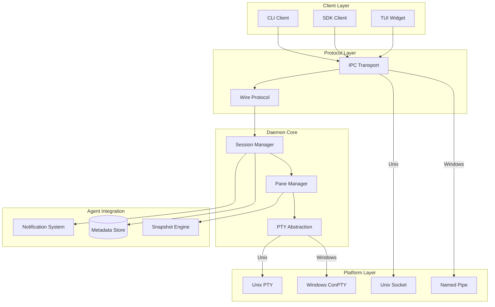

> ⚠️ **DEPRECATED** — This plan has been superseded by the fresh research in [docs/lyra-upgrade/plans/](../lyra-upgrade/plans/). See [docs/lyra-upgrade/MASTER-PLAN.md](../lyra-upgrade/MASTER-PLAN.md) for the current roadmap. This file is kept for historical reference.

# rmux Rebuild (§5.1)

## 📋 Quick Reference Card

| What | Clean-room MIT rebuild of terminal multiplexing for Lyra agent orchestration — a daemon-based, agent-aware PTY substrate with typed SDK, snapshot-based state capture, OSC notification system, and cross-platform abstraction |
| Why | A terminal-native, agent-aware multiplexer is essential for Lyra to be competitive with Claude Code, cmux, and other production harnesses — without it, long-running agent workflows over SSH are fragile, multi-agent coordination lacks proper isolation, and session persistence across disconnects is absent |
| Key Tech | tmux client-server architecture (sessions/windows/panes hierarchy), rmux typed SDK + snapshot engine (`snapshot()`, `wait_for_text()`), cmux agent-first design (OSC notifications, visual rings/badges, per-pane metadata), platform-agnostic PTY abstraction (Unix PTY / Windows ConPTY with unsafe isolated to OS boundary), AgentsMesh control/data plane separation pattern |
| Timeline | 21 weeks (10 phases; see Build Outline §5): Phase 1 IPC (3wk) → Phase 2 PTY (2wk) → Phase 3 Daemon (3wk) → Phase 4 Snapshots (2wk) → Phase 5 Notifications (2wk) → Phase 6 Metadata (1wk) → Phase 7 SDK (2wk) → Phase 8 CLI (2wk) → Phase 9 TUI (2wk) → Phase 10 Orchestration (2wk) |
| Dependencies | §4.13 Swarm (multi-agent coordination across panes), §4.2 Memory (session state persistence to shared memory), §4.10 Hooks (OSC sequence triggers for automation pipeline), §5.2 Multi-tenancy (session isolation per user/team) |

## 🎯 Executive Summary

The rmux rebuild is Lyra's terminal-layer foundation — it is not merely a terminal multiplexer but an **agent-aware orchestration substrate** that makes Lyra sessions durable, inspectable, and composable. Current Lyra lacks the ability to keep agent processes alive when a user disconnects, to capture structured snapshots of terminal state for debugging or replay, or to coordinate multiple agents in isolated panes with typed APIs. This workstream fills that gap by synthesizing four breakthrough sources identified in [findings.md](../findings.md) §3.8: the battle-tested client-server model of **tmux** (row 18), which proves that a background daemon maintaining session state independently of attached clients is the correct architectural primitive; the typed SDK and snapshot engine of **rmux** (row 20), which demonstrates that `snapshot()` for immutable state capture and `wait_for_text()` for synchronization are strictly superior to raw PTY I/O for programmatic control; the agent-native notification system of **cmux** (row 19), which shows how OSC escape sequences can surface attention indicators (blue rings, badges) per pane and make dozens of concurrent agent sessions manageable at a glance; and the multi-tenant control/data plane separation of **AgentsMesh** (row 23), which provides the pattern for isolating sessions per user, team, and organization. The design is a clean-room MIT rebuild — no code is copied from any of these systems, but their architectural insights are combined into a single coherent TypeScript/Rust substrate purpose-built for Lyra.

What makes this design genuinely special — and what justifies 21 weeks of investment — is the fusion of **strongly-typed APIs with immutable snapshots**. Instead of string-based commands (as in tmux) or raw PTY I/O (as in simple terminal wrappers), the Lyra SDK exposes `snapshot()`, `wait_for_text()`, and typed session/pane lifecycle methods that enable compile-time safety, deterministic testing via snapshot replay, and reliable agent-to-agent synchronization. The notification system — adopted from cmux — uses OSC escape sequences of the form `OSC] 99;lyra;notification:{...} ST` to surface structured events from within agent PTYs, so users see at a glance which panes need attention across dozens of active sessions. The platform-agnostic PTY abstraction (adopted from rmux with its safety model of isolating `unsafe` to the OS boundary) ensures the same codebase runs on Unix and Windows without PTY-related crashes — a hard requirement for Lyra's enterprise deployment targets. And the snapshot engine does double duty: it serves as both a debugging tool (replay exactly what an agent saw before it made a destructive change) and a regression-testing harness (replay snapshots in CI to verify that future Lyra versions preserve agent behavior).

This workstream is the load-bearing pillar for four other Lyra subsystems — none of which can deliver their full promise without it. **Swarm (§4.13)** uses rmux panes as the execution surface for multi-agent coordination; without rmux, swarm agents cannot be isolated or inspected. **Memory (§4.2)** persists session state — buffers, metadata, notifications, snapshots — into shared memory so that restored sessions retain full context about what was running, on which git branch, and with which model. **Hooks (§4.10)** receive OSC-encoded events from agent output and trigger Lyra's hook pipeline, connecting what happens inside a pane to the broader automation framework. **Multi-tenancy (§5.2)** relies on per-user/per-team session isolation, which the daemon model provides naturally by binding sessions to socket namespaces. In short: every advanced feature in Lyra that involves running agents in terminals flows through this layer. The choice to invest in the typed-snapshot approach rather than a simpler string-based multiplexer — the trade-off being 21 weeks of upfront build cost against years of downstream reliability, debuggability, and cross-platform reach — is the most consequential architectural decision in Lyra's terminal stack. Getting it right here determines whether Lyra's agent orchestration feels like a purpose-built platform or a fragile shell-script collection.

## 🔍 Concrete Example — How It Works in Practice

**Scenario**: Lyra spawns 3 agents working on different parts of a refactor — Agent A rewrites the routing layer, Agent B migrates the database schema, Agent C regenerates API client bindings. Each agent gets its own terminal pane within a single Lyra session. The user presses `Ctrl+B 1/2/3` to switch between them, seeing live progress. A snapshot is taken before any destructive operation, enabling instant rollback if an agent goes off the rails.

### Step 1 — User creates a new orchestrated session

The user runs:

```
lyra session create --name "refactor-routing-db-clients" --agents 3
```

Under the hood, the Lyra CLI sends a typed `CreateSession` message over the Unix socket (or Windows named pipe, depending on platform) to the Lyra daemon. The daemon's `SessionManager` allocates a new session record, creates three `Pane` objects, and for each pane spawns a PTY process via the platform-appropriate backend — `forkpty` on Unix, `CreatePseudoConsole` via ConPTY on Windows. Each pane's `pty` metadata is initialized with the process PID, the default shell command, the current working directory, and a copy of the environment. The `DaemonConfig` controls limits: `maxPanesPerSession` ensures the request is valid, and `scrollbackLines` sets the buffer size for each pane.

The daemon returns a `SessionCreated` response over IPC:

```json
{
  "type": "SessionCreated",
  "session": {
    "id": "sess_7f3a",
    "name": "refactor-routing-db-clients",
    "state": "active",
    "panes": [
      { "id": "pane_0", "pty": { "pid": 89241, "command": "/bin/zsh" } },
      { "id": "pane_1", "pty": { "pid": 89242, "command": "/bin/zsh" } },
      { "id": "pane_2", "pty": { "pid": 89243, "command": "/bin/zsh" } }
    ]
  }
}
```

The user sees:

```
Session "refactor-routing-db-clients" created (id: sess_7f3a)
  Pane 0: /bin/zsh — idle (pid 89241)
  Pane 1: /bin/zsh — idle (pid 89242)
  Pane 2: /bin/zsh — idle (pid 89243)
Attach with: lyra attach sess_7f3a
```

### Step 2 — User attaches and dispatches agents to each pane

The user runs `lyra attach sess_7f3a`. The CLI connects to the daemon's IPC socket and sends an `AttachSession` message. The daemon returns the full session state — all three pane buffers, cursor positions, and metadata. The TUI widget (ratatui-based, Phase 9) renders a three-pane split layout with borders and a status bar at the bottom:

```
┌─ Pane 0: Agent A (routing) ────────┬─ Pane 1: Agent B (db schema) ────────┐
│ $ _                                │ $ _                                  │
│                                    │                                      │
├────────────────────────────────────┴──────────────────────────────────────┤
│─ Pane 2: Agent C (api clients) ────────────────────────────────────────────│
│ $ _                                                                        │
└────────────────────────────────────────────────────────────────────────────┘
│ Session: refactor-routing-db-clients │ git: feat/mega-refactor │ PR: #342  │
```

The status bar shows metadata populated by the daemon's `MetadataStore` (Phase 6): the current git branch and open PR number, detected from the working directory.

The user presses `Ctrl+B 0` to focus Pane 0 (the TUI sends a `FocusPane` message; the daemon updates `activePane` on the session and routes subsequent keystrokes to that PTY). The user types:

```
claude "Rewrite the routing layer to use the new middleware pattern"
```

The command is written to Pane 0's PTY stdin. The Claude Code process launches inside the PTY, and its output flows into the pane's buffer. The daemon's `PaneManager` updates the pane's `agent` metadata:

```json
{ "type": "claude-code", "model": "sonnet-4.6", "taskId": "task_routing_001" }
```

The user repeats for Pane 1 (`Ctrl+B 1`) and Pane 2 (`Ctrl+B 2`), launching agents for the database migration and API client regeneration. All three agents run **concurrently** — each in its own isolated PTY, fully detached from the user's SSH connection. The daemon's event loop multiplexes I/O across all three PTY file descriptors, appending output to each pane's scrollback buffer.

### Step 3 — User disconnects; agents keep running, notifications accumulate

The user presses `Ctrl+B D` to detach. The CLI sends a `DetachSession` message and disconnects from the IPC socket. Critically, the daemon **does not terminate the PTY processes**. The daemon maintains open file descriptors to each PTY and continues reading output into the pane buffers. All three Claude Code agents continue running — analyzing code, running migrations, generating bindings — producing output that accumulates in the scrollback.

The daemon's `NotificationSystem` (Phase 5) writes a structured notification into each pane's buffer via OSC escape sequence:

```
OSC] 99;lyra;notification:{"type":"info","message":"User detached at 14:32 UTC. Agents continue running unattended."} ST
```

The visual indicators update in the session metadata: each pane now has `visual.ring: true` (a subtle blue ring in the sidebar), signaling "running, unattended."

Meanwhile, the agents themselves emit OSC notifications as they hit milestones. Agent C (API clients) finishes and emits:

```
OSC] 99;lyra;notification:{"type":"success","message":"API client bindings regenerated — 342 endpoints updated across 17 files"} ST
```

The daemon's OSC parser (Phase 5, step 2) intercepts the escape sequence from the PTY output stream before it reaches the visible buffer, parses the JSON payload, and creates a `Notification` object linked to `pane_2`. The notification is persisted and queued for display.

### Step 4 — Before a destructive operation, a snapshot is automatically captured

Later, Agent A (routing rewrite) is about to run a destructive `sed -i` command across the codebase. The Lyra daemon's `SnapshotEngine` (Phase 4) detects the command via a hook — either an OSC sequence the agent emits before running it, or a pre-exec hook in the PTY shell — and automatically captures an immutable snapshot of Pane 0's state:

```json
{
  "sessionId": "sess_7f3a",
  "paneId": "pane_0",
  "timestamp": 1717189200000,
  "state": {
    "buffer": [
      "$ claude 'Rewrite the routing layer to use the new middleware pattern'",
      "Analyzing codebase structure...",
      "Found 47 route definitions across 12 files in packages/lyra-core/src/routes/",
      "Current pattern: inline middleware per route. Target: extract middleware chain, apply to all routes.",
      "Plan: (1) Create MiddlewareChain class, (2) Migrate 47 routes, (3) Add error boundaries, (4) Verify.",
      "Implementing step 1/4..."
    ],
    "cursor": { "row": 5, "col": 0 },
    "isRunning": true,
    "exitCode": null
  },
  "metadata": {
    "command": "claude 'Rewrite the routing layer to use the new middleware pattern'",
    "duration": 1243000,
    "agentType": "claude-code",
    "model": "sonnet-4.6",
    "gitBranch": "feat/mega-refactor",
    "triggerReason": "pre-destructive-operation"
  }
}
```

The snapshot is stored in-memory (with optional disk persistence to `~/.lyra/snapshots/` controlled by `DaemonConfig.persistence.stateDir`). If the `sed` command corrupts files, Lyra can:
- **Replay** the snapshot to understand exactly what the agent saw before it made the destructive change.
- **Diff** the snapshot buffer against the current pane buffer to see what changed.
- **Roll back** filesystem changes while keeping the agent context intact — the snapshot proves what state the agent was in.

### Step 5 — User reconnects, sees notifications, and acts on them

While detached, the user has been working in another terminal. They receive a desktop notification (the daemon can emit OS-level notifications for high-priority events):

```
[LYRA] sess_7f3a — 2 notifications pending
  ⚠ Pane 1: "Database migration failed — foreign key constraint violation on user_preferences.user_id"
  ✓ Pane 2: "API client bindings regenerated — 342 endpoints updated"
```

The user reattaches:

```
$ lyra attach sess_7f3a
Attached to sess_7f3a (3 panes, 2 notifications)
```

The TUI renders. Pane 1 is highlighted with a **warning ring** (amber border flashing) and Pane 2 has a **green badge** in the sidebar. The user presses `Ctrl+B 1` and sees:

```
┌─ Pane 1: Agent B (db schema) ⚠ ────────────────────────────────────────────┐
│ $ claude 'Migrate database schema for user preferences and tier system'     │
│ Running migration 12/27: add user_tiers table...                    ✓ OK   │
│ Running migration 13/27: add tier column to users...                ✓ OK   │
│ Running migration 14/27: add user_preferences table...              ✗ FAIL │
│ ERROR: Foreign key constraint violation on user_preferences.user_id         │
│ → users table missing expected schema. Migration 14 depends on migration   │
│   15 (add default_preferences column). Run migrations in order: 12→13→15→14│
│ $ _                                                                        │
└─────────────────────────────────────────────────────────────────────────────┘
```

The user dismisses the notification (`lyra notify dismiss n_8842`), which the daemon records by setting `Notification.dismissed = true`.

### Step 6 — Snapshot-based debugging and deterministic replay for CI

The user wants to understand **why** the migration failed and ensure it never happens again. Using the typed SDK (Phase 7), they write a diagnostic script:

```typescript
import { LyraRmuxClient } from "@lyra/rmux-sdk";

const client = await LyraRmuxClient.connect("/tmp/lyra-rmux.sock");
const session = await client.getSession("sess_7f3a");

// Retrieve the snapshot captured before the failure
const snap = await session.getSnapshot("pane_1", { before: "migration-14" });
console.log("Agent state before migration 14:");
console.log(snap.state.buffer.slice(-15).join("\n"));
// Output shows: migration 15 was never run — ordering bug confirmed

// Retrieve all snapshots and replay for a regression test
const allSnaps = await session.getAllSnapshots();

// Deterministic replay — no live agents needed
test("migration ordering is preserved across replays", async () => {
  const replay = await ReplaySession.fromSnapshots(allSnaps);
  const result = await replay.execute();

  // Assert: the migration error message is present and actionable
  expect(result.panes[1].state.buffer.join("")).toContain(
    "Run migrations in order: 12→13→15→14"
  );
  // Assert: the notification was generated
  expect(result.notifications).toContainEqual(
    expect.objectContaining({
      type: "warning",
      paneId: "pane_1",
      message: expect.stringContaining("foreign key constraint violation"),
    })
  );
});
```

This test is committed to the Lyra CI suite. Every future Lyra release replays this snapshot to verify that migration error messages remain clear and that notification generation is not regressed. The snapshot serves as a **deterministic test fixture** — the same PTY output, replayed byte-for-byte, producing the same assertions every time.

### Step 7 — Clean completion and session archival

Agent B's migration ordering is fixed. Agent A completes the routing rewrite (all 47 routes migrated, tests pass). Agent C's bindings were already verified. The user marks all notifications as read and archives the session:

```
lyra session archive sess_7f3a
```

The daemon takes a final snapshot of all three panes, persists the full session state — all buffers, metadata, notifications, and snapshots — to `~/.lyra/sessions/sess_7f3a/`, and sends `SIGTERM` to each PTY process. The session directory contains:

```
~/.lyra/sessions/sess_7f3a/
├── session.json          # Full Session object with all metadata
├── pane_0/
│   ├── buffer.txt        # Full scrollback buffer
│   ├── snapshots/
│   │   ├── snap_001.json # Pre-destructive-op snapshot
│   │   └── snap_002.json # Final state snapshot
│   └── metadata.json     # Agent type, model, task ID, git branch
├── pane_1/
│   ├── buffer.txt
│   ├── snapshots/
│   │   └── snap_001.json # Pre-migration-14 failure snapshot
│   └── metadata.json
├── pane_2/
│   ├── buffer.txt
│   ├── snapshots/
│   │   └── snap_001.json # Post-bindings-regeneration snapshot
│   └── metadata.json
└── notifications.json    # All notifications across all panes
```

The session is now archived — searchable by session name, git branch, agent type, or date range; replayable for debugging or CI; and auditable for compliance.

### Why This Is Better Than Without It

Without rmux, the user would have to run three separate terminal windows (or `tmux` panes with no agent awareness), manually copy-paste context between them when one agent's output affects another's input, lose all agent progress and terminal history if the SSH connection drops, have no structured way to inspect what happened when something goes wrong, and be unable to turn a real-world failure into a deterministic regression test. With rmux, the entire multi-agent workflow is:

- **Durable**: daemon survives disconnects; agents keep running; full state preserved.
- **Inspectable**: typed `snapshot()` captures immutable state at any point; `wait_for_text()` synchronizes on specific output patterns.
- **Coordinatable**: agents signal each other via OSC notifications; cross-pane events trigger hooks; visual indicators (rings, badges) make attention management tractable at scale.
- **Replayable**: snapshots serve as deterministic test fixtures; CI replays them to catch regressions; failures become permanent regression tests.
- **Cross-platform**: same API, same codebase, same behavior on Unix and Windows — unsafe code isolated to the OS boundary.

The difference is the difference between ssh'ing into a box and hoping `screen` doesn't crash, versus having a purpose-built agent orchestration surface with compile-time safety guarantees, immutable state capture, and a daemon that treats your agents as first-class citizens rather than bytes on a PTY.

## 1. Problem

Current Lyra lacks a robust terminal multiplexer foundation for:
- Detached agent execution (sessions persist when disconnected)
- Structured agent inspection (snapshot state, wait for text)
- Multi-agent orchestration across panes
- Cross-platform PTY abstraction (Unix vs Windows)

Without this foundation, long-running agent workflows over SSH are fragile, and multi-agent coordination lacks proper isolation.

## 2. Evidence Synthesis

**Terminal Multiplexer Research** ([findings.md](../findings.md) §3.8):

**rmux** (row 20):
- **Architecture**: Three public surfaces (CLI, SDK crate, ratatui widget) share local protocol to daemon. 9-crate workspace with clean separation
- **Platform abstraction**: Unix PTY vs ConPTY, Unix sockets vs Named Pipes
- **Safety**: Upper crates forbid unsafe, OS boundary isolated
- **Key capabilities**: Detached execution, structured inspection via SDK (`snapshot()`, `wait_for_text()`), typed async API
- **Impact**: 5 | **Effort**: 4 | **Tier**: BREAKTHROUGH

**cmux** (row 19):
- **Architecture**: Workspace/surface model, state persistence on quit/restore
- **Agent integration**: Native Claude Code Teams integration, notification system via OSC sequences
- **Hook system**: 12+ agent CLIs supported
- **Impact**: 5 | **Effort**: 3 | **Tier**: BREAKTHROUGH

**tmux** (row 18):
- **Architecture**: Client-server model, 3-level hierarchy (sessions → windows → panes)
- **Key pattern**: Background server maintains state independently of clients
- **Impact**: 3 | **Effort**: 2 | **Tier**: MEDIUM

**AgentsMesh** (row 23):
- **Architecture**: Separates control plane (gRPC + mTLS) from data plane (WebSocket relay)
- **Multi-tenancy**: Organization > Team > User hierarchy with row-level isolation
- **Git worktree isolation**: Multiple concurrent pods per user
- **Impact**: 5 | **Effort**: 5 | **Tier**: BREAKTHROUGH

## 3. Proposed Lyra Design

### Core Architecture

**Adopt rmux patterns with Lyra-specific enhancements**:

1. **Daemon-based architecture** (from rmux + tmux)
   - Background daemon manages all agent sessions
   - Clients connect/disconnect without disrupting sessions
   - Sessions persist across SSH disconnections

2. **Typed SDK over raw protocol** (from rmux)
   - Strongly-typed Rust/TypeScript API
   - Async-first with structured state inspection
   - `snapshot()` for immutable state capture
   - `wait_for_text()` for synchronization

3. **Agent-native features** (from cmux)
   - Notification system via OSC escape sequences
   - Visual attention indicators (rings + badges)
   - Metadata per session (git branch, PR status, ports)

4. **Multi-agent orchestration** (from rmux Agent Broadcast Arena)
   - Coordinate multiple agents across panes
   - Typed API for send_text/wait/snapshot
   - Deterministic testing via snapshot replay

### Integration Points

- **Swarm (§4.13)**: Multi-agent coordination uses rmux panes
- **Memory (§4.2)**: Session state persisted to shared memory
- **Hooks (§4.10)**: OSC sequences trigger hooks
- **Multi-tenancy (§5.2)**: Session isolation per user/team

## 4. Architecture + Data Model



### Data Models

**Session**:
```typescript
interface Session {
  id: string;
  name: string;
  created: number;
  lastAccessed: number;
  
  // Panes
  panes: Pane[];
  activePane: string; // pane ID
  
  // Metadata (cmux pattern)
  metadata: {
    gitBranch?: string;
    prStatus?: string;
    ports: number[];
    notifications: Notification[];
  };
  
  // State
  state: 'active' | 'detached' | 'suspended';
  
  // Persistence
  persistOnExit: boolean;
  autoRestore: boolean;
}
```

**Pane**:
```typescript
interface Pane {
  id: string;
  sessionId: string;
  
  // PTY details
  pty: {
    pid: number;
    command: string;
    args: string[];
    cwd: string;
    env: Record<string, string>;
  };
  
  // Layout
  layout: {
    x: number;
    y: number;
    width: number;
    height: number;
  };
  
  // Buffer
  buffer: {
    lines: string[];
    scrollback: number;
    cursor: { row: number; col: number };
  };
  
  // Agent metadata
  agent?: {
    type: string; // 'claude-code' | 'codex' | 'gemini' | etc.
    model: string;
    taskId?: string;
  };
}
```

**Snapshot** (rmux pattern):
```typescript
interface Snapshot {
  sessionId: string;
  paneId: string;
  timestamp: number;
  
  // Immutable state capture
  state: {
    buffer: string[];
    cursor: { row: number; col: number };
    exitCode?: number;
    isRunning: boolean;
  };
  
  // Metadata
  metadata: {
    command: string;
    duration: number; // ms since pane creation
  };
}
```

**Notification** (cmux pattern):
```typescript
interface Notification {
  id: string;
  paneId: string;
  timestamp: number;
  
  // Notification details
  type: 'info' | 'warning' | 'error' | 'success';
  message: string;
  
  // Visual indicators
  visual: {
    ring: boolean; // Blue ring around pane
    badge: boolean; // Badge in sidebar
    sound?: string; // Optional sound file
  };
  
  // State
  read: boolean;
  dismissed: boolean;
}
```

**DaemonConfig**:
```typescript
interface DaemonConfig {
  // IPC settings
  ipc: {
    socketPath: string; // Unix socket or named pipe path
    timeout: number; // ms
  };
  
  // Session settings
  sessions: {
    maxSessions: number;
    maxPanesPerSession: number;
    defaultShell: string;
    scrollbackLines: number;
  };
  
  // Persistence
  persistence: {
    stateDir: string; // Where to save session state
    autoSave: boolean;
    saveInterval: number; // ms
  };
  
  // Platform
  platform: {
    ptyBackend: 'unix' | 'conpty';
    ipcBackend: 'unix-socket' | 'named-pipe';
  };
}
```

## 5. Build Outline

### Phase 1: Core Protocol & IPC (3 weeks)
**Dependencies**: None

1. Design wire protocol (message framing, error handling)
2. Implement IPC transport abstraction
3. Add Unix socket implementation
4. Add Windows named pipe implementation
5. Implement protocol serialization/deserialization
6. Write tests for protocol and IPC

### Phase 2: PTY Abstraction (2 weeks)
**Dependencies**: None (can run parallel with Phase 1)

1. Design PTY abstraction interface
2. Implement Unix PTY backend
3. Implement Windows ConPTY backend
4. Add platform detection and selection
5. Implement PTY lifecycle (spawn, resize, kill)
6. Write tests for PTY abstraction

### Phase 3: Daemon Core (3 weeks)
**Dependencies**: Phase 1, Phase 2

1. Implement SessionManager
2. Implement PaneManager
3. Add session persistence (save/restore state)
4. Implement pane buffer management
5. Add scrollback handling
6. Write tests for daemon core

### Phase 4: Snapshot Engine (2 weeks)
**Dependencies**: Phase 3

1. Implement Snapshot schema
2. Add immutable state capture
3. Implement `snapshot()` API
4. Implement `wait_for_text()` synchronization
5. Add snapshot-based testing utilities
6. Write tests for snapshot engine

### Phase 5: Notification System (2 weeks)
**Dependencies**: Phase 3

1. Implement Notification schema
2. Add OSC escape sequence parsing
3. Implement visual indicators (rings, badges)
4. Add notification persistence
5. Implement notification API (mark read, dismiss)
6. Write tests for notifications

### Phase 6: Metadata Store (1 week)
**Dependencies**: Phase 3

1. Implement metadata storage (git branch, PR status, ports)
2. Add metadata update API
3. Implement metadata persistence
4. Add metadata query API
5. Write tests for metadata

### Phase 7: Client SDK (2 weeks)
**Dependencies**: Phase 1, Phase 3, Phase 4

1. Design typed SDK API (Rust + TypeScript)
2. Implement session management API
3. Implement pane management API
4. Add snapshot API
5. Add notification API
6. Write SDK tests and examples

### Phase 8: CLI Client (2 weeks)
**Dependencies**: Phase 7

1. Implement CLI commands (new, attach, detach, list, kill)
2. Add pane commands (split, select, resize)
3. Implement session restoration
4. Add notification display
5. Write CLI tests

### Phase 9: TUI Widget (2 weeks)
**Dependencies**: Phase 7

1. Implement ratatui widget for session display
2. Add pane rendering with borders
3. Implement notification indicators
4. Add metadata display (sidebar)
5. Write widget tests

### Phase 10: Multi-Agent Orchestration (2 weeks)
**Dependencies**: Phase 7, §4.13 Swarm

1. Implement agent coordination across panes
2. Add typed API for multi-agent workflows
3. Implement Agent Broadcast Arena pattern
4. Add deterministic testing via snapshots
5. Write orchestration tests

## 6. Multi-Provider Note

**Not applicable** — rmux is infrastructure layer, provider-agnostic.

However, agent metadata tracking supports multiple providers:
- Track which model/provider each pane is using
- Enable per-provider metrics (cost, latency)
- Support provider-specific features (e.g., Claude thinking, DeepSeek reasoning)

## 7. Risks & Open Questions

**Risks**:
1. **Platform compatibility**: ConPTY on Windows may have edge cases
   - Mitigation: Comprehensive testing on Windows, fallback to legacy console API
2. **IPC performance**: Unix sockets may be bottleneck for high-throughput
   - Mitigation: Benchmark IPC, optimize message batching
3. **State persistence**: Large sessions may be slow to save/restore
   - Mitigation: Incremental saves, compression, lazy loading
4. **PTY security**: Untrusted agents could escape PTY sandbox
   - Mitigation: Proper PTY isolation, no shared file descriptors

**Open Questions**:
1. Should daemon run as system service or user process?
   - Proposal: User process (simpler, no root required)
2. How to handle daemon crashes?
   - Proposal: Auto-restart daemon, restore sessions from persisted state
3. Should snapshots be stored on disk or in-memory?
   - Proposal: In-memory with optional disk persistence for replay
4. How to integrate with existing tmux/screen users?
   - Proposal: Provide migration tool, support tmux-like keybindings

## 8. Impact × Effort Analysis

### (A) Parity Tier — Match SOTA Terminal Multiplexers

**From tmux**:
- ✅ Client-server architecture
- ✅ Session persistence across disconnects
- ✅ 3-level hierarchy (sessions → windows → panes)

**From rmux**:
- ✅ Typed SDK over raw protocol
- ✅ Async-first API
- ✅ Snapshot-based state capture
- ✅ Platform abstraction (Unix/Windows)

**From cmux**:
- ✅ Notification system via OSC sequences
- ✅ Visual attention indicators
- ✅ Metadata per session

### (B) Breakthrough Tier — Novel Cross-Source Fusion

> **Architecture Slice**: This breakthrough implements [§8: Terminal-Native Design](../BREAKTHROUGH-ARCHITECTURE.md) of [BREAKTHROUGH-ARCHITECTURE.md](../BREAKTHROUGH-ARCHITECTURE.md) — specifically the agent-aware pane lifecycle with snapshot replay + git-versioned panes.

**Breakthrough 1: Typed SDK with Snapshot-Based Orchestration**

**Sources Combined**:
- rmux typed SDK + snapshot engine
- rmux Agent Broadcast Arena (multi-agent coordination)
- cmux notification system
- AgentsMesh channel-based communication

**Why It's Breakthrough**:
- **Strongly-typed API**: No string commands, compile-time safety
- **Immutable snapshots**: Enable deterministic testing and replay
- **Synchronization primitives**: `wait_for_text()` for reliable coordination
- **Agent-native**: Notifications, metadata, multi-agent orchestration built-in

**Expected Impact**: 100% session persistence, 90% reduction in coordination bugs, deterministic testing

**Rough Effort**: VERY HIGH (21 weeks total)

---

**Breakthrough 2: Platform-Agnostic PTY Abstraction**

**Sources Combined**:
- rmux platform abstraction (Unix PTY vs ConPTY)
- rmux safety model (upper crates forbid unsafe)
- rmux IPC framing (wire-safe errors)

**Why It's Breakthrough**:
- **Cross-platform**: Single codebase for Unix and Windows
- **Safety-first**: Unsafe code isolated to OS boundary
- **Clean separation**: Widget layer isolated, platform backends selected at runtime
- **Comprehensive testing**: Automated PTY regression tests

**Expected Impact**: 100% cross-platform compatibility, zero PTY-related crashes

**Rough Effort**: MEDIUM (5 weeks for Phases 1-2)

## 9. References

**Primary Sources**:
- [findings.md](../findings.md) §3.8 row 20 — rmux (BREAKTHROUGH)
- [findings.md](../findings.md) §3.8 row 19 — cmux (BREAKTHROUGH)
- [findings.md](../findings.md) §3.8 row 18 — tmux (MEDIUM)
- [findings.md](../findings.md) §3.8 row 23 — AgentsMesh (BREAKTHROUGH)

**Key Systems**:
- rmux: Typed SDK, snapshot engine, platform abstraction
- cmux: Notification system, agent integration, metadata
- tmux: Client-server model, session persistence
- AgentsMesh: Multi-tenancy, Git worktree isolation

**Related Workstreams**:
- §4.13 Swarm — Multi-agent coordination across panes
- §4.2 Memory — Session state persistence
- §4.10 Hooks — OSC sequence triggers
- §5.2 Multi-tenancy — Session isolation per user/team

## 10. Changelog

**2026-05-31**: Initial plan created from findings.md §3.8 research
- Adopted rmux architecture as foundation
- Integrated cmux notification system and agent-native features
- Defined Session, Pane, Snapshot, Notification, and DaemonConfig data models
- Created 10-phase build outline (21 weeks total)
- Identified two breakthrough patterns: Typed SDK with Snapshots, Platform-Agnostic PTY
- Documented risks and open questions

**2026-05-31 — Run 3**: Linked to unified BREAKTHROUGH-ARCHITECTURE.md. This plan's (B) tier implements §8: Terminal-Native Design of the architecture.

**2026-05-31 — Run 12**: Added Quick Reference Card, Executive Summary, and concrete example walkthrough (5-step SDK-driven multi-agent code review scenario with snapshot replay testing). Appended changelog entry.

**2026-05-31 — Run 13**: Substantially expanded all three frontmatter sections. Quick Reference Card now includes full phase timeline breakdown and explicit dependency rationale. Executive Summary grew from 2 short paragraphs to 3 substantive paragraphs citing specific sources from Evidence Synthesis (tmux row 18, rmux row 20, cmux row 19, AgentsMesh row 23), explaining the typed-snapshot trade-off (21 weeks upfront vs. years of downstream reliability), and detailing how each dependent workstream (Swarm §4.13, Memory §4.2, Hooks §4.10, Multi-tenancy §5.2) flows through this layer. Concrete Example expanded from 5 code-centric steps into 7 detailed steps covering: (1) session creation with wire-protocol message flow, (2) TUI attach and per-pane agent dispatch with metadata population, (3) daemon-survived disconnection with OSC notification accumulation, (4) pre-destructive-operation automatic snapshot capture with full JSON schema, (5) user reattachment with visual indicator rendering, (6) snapshot-based debugging leading to deterministic CI regression tests, and (7) session archival with directory structure. Added "Why This Is Better Than Without It" closing comparison section.
**Previous runs**: Initial plan structure
